# ADXIntegrations — REST API Documentation & Spring Boot Implementation Guide

*Al Ramz Capital — Middleware Migration Programme*

Abu Dhabi Securities Exchange (ADX) integration: holdings, investor (NIN) and account creation, NCSD status, exchange rates, Quod and eTradeFIT feeds — webMethods Integration Server to Azure / Spring Boot


## Document Control


| Attribute | Detail |
|---|---|
| Package | `ADXIntegrations` (manifest v1.0, description `StaticData_`; created 20-07-2023; last patch recorded 14-07-2026) |
| Scope of source analysed | All 13 Flow services, the 1 Java service (`java:queryNIN`), the request document type `docs:NINCreationRequest`, the flat-file schema, dictionary and document type under `services.Quod.ff`, the REST resource `RestAPIs:ADX`, and `config/urlalias.cnf`. The 5 `flow.xml.bak` files and `manifest.bak` are stale backups that Integration Server never loads; they were not used as evidence. The folders `java/queryBroker` and `java/submitApplication` are empty. |
| How this document is organised | **Part I (Chapters 1–12)** is the API documentation: what the legacy package does, proven from the Flow source, and the target REST contract. **Part II (Chapters 13–18)** is the implementation guide: how to build the target on Spring Boot — project layout, configuration, the ADX client, the asynchronous creation pattern, jobs, error handling, testing, deployment and cut-over. A developer should be able to build the service from this document alone. |
| Related documents | `Error-Code-to-HTTP-Status-Mapping` — the shared legacy-code registry used for every HTTP status here. `CurrencyIntegration-API-Documentation` — the programme rule that "no data" is an error (applied in §4.6 and §10.6). `CoreDataProvider-SpringBoot-Implementation-Guide` — the platform decisions (Java 21, Spring Boot 3.x, Azure Database for PostgreSQL) reused in Part II. |
| Target platform | Java 21 · Spring Boot 3.x · Azure API Management with OAuth2 · Azure Key Vault · Azure Database for PostgreSQL (two small service-owned tables) |
| Document version | v1.0 |
| Change history | v1.0 — first issue (02-10-2026). |

> **A note on credentials and personal data**
>
> Every ADX credential is held in an Integration Server global variable or in the server's SFTP alias configuration; no credential value appears in the package and none appears in this document — only the names of the settings that hold them (§3.1).
>
> Three items in the source are deliberately **not reproduced**: an internal ADX host name hard-coded in the Java service, a client identity number in a disabled test step, and the fixed account numbers returned by the UAT mock steps (finding AF-03). All sample values in this document — names, identity numbers, IBANs, account numbers, rates — are invented.


## Table of Contents


- [1. Overview](#1-overview)
  - [1.1 Purpose](#11-purpose)
  - [1.2 Scope](#12-scope)
  - [1.3 Executive summary](#13-executive-summary)
- [2. Solution Architecture](#2-solution-architecture)
  - [2.1 As-built service flow](#21-as-built-service-flow)
  - [2.2 End-to-end journey](#22-end-to-end-journey)
  - [2.3 Target architecture (Spring Boot)](#23-target-architecture-spring-boot)
  - [2.4 Target response and result model](#24-target-response-and-result-model)
- [3. Prerequisites & Static Configuration](#3-prerequisites-static-configuration)
  - [3.1 Integration Server global variables](#31-integration-server-global-variables)
  - [3.2 Static and feature-flag configuration](#32-static-and-feature-flag-configuration)
  - [3.3 Upstream and downstream dependencies](#33-upstream-and-downstream-dependencies)
  - [3.4 Security notes](#34-security-notes)
- [4. API — Get ADX Holdings](#4-api-get-adx-holdings)
  - [4.1 Endpoint summary](#41-endpoint-summary)
  - [4.2 Request schema](#42-request-schema)
  - [4.3 Business logic summary](#43-business-logic-summary)
  - [4.4 Sample request](#44-sample-request)
  - [4.5 Response schema](#45-response-schema)
  - [4.6 HTTP status code reference](#46-http-status-code-reference)
  - [4.7 Example target response envelopes](#47-example-target-response-envelopes)
  - [4.8 Target process flow (Spring Boot)](#48-target-process-flow-spring-boot)
- [5. API — Download ADX Holdings Report](#5-api-download-adx-holdings-report)
  - [5.1 Endpoint summary](#51-endpoint-summary)
  - [5.2 Request schema](#52-request-schema)
  - [5.3 Business logic summary](#53-business-logic-summary)
  - [5.4 Sample request](#54-sample-request)
  - [5.5 Response schema](#55-response-schema)
  - [5.6 HTTP status code reference](#56-http-status-code-reference)
  - [5.7 Example target response envelopes](#57-example-target-response-envelopes)
  - [5.8 Target process flow (Spring Boot)](#58-target-process-flow-spring-boot)
- [6. API — Register Investor at ADX (Create NIN)](#6-api-register-investor-at-adx-create-nin)
  - [6.1 Endpoint summary](#61-endpoint-summary)
  - [6.2 Request schema](#62-request-schema)
  - [6.3 Business logic summary](#63-business-logic-summary)
  - [6.4 Sample request](#64-sample-request)
  - [6.5 Response schema](#65-response-schema)
  - [6.6 HTTP status code reference](#66-http-status-code-reference)
  - [6.7 Example target response envelopes](#67-example-target-response-envelopes)
  - [6.8 Target process flow (Spring Boot)](#68-target-process-flow-spring-boot)
- [7. API — Open ADX Trading Account](#7-api-open-adx-trading-account)
  - [7.1 Endpoint summary](#71-endpoint-summary)
  - [7.2 Request schema](#72-request-schema)
  - [7.3 Business logic summary](#73-business-logic-summary)
  - [7.4 Sample request](#74-sample-request)
  - [7.5 Response schema](#75-response-schema)
  - [7.6 HTTP status code reference](#76-http-status-code-reference)
  - [7.7 Example target response envelopes](#77-example-target-response-envelopes)
  - [7.8 Target process flow (Spring Boot)](#78-target-process-flow-spring-boot)
- [8. API — Open ADX Margin Account](#8-api-open-adx-margin-account)
  - [8.1 Endpoint summary](#81-endpoint-summary)
  - [8.2 Request schema](#82-request-schema)
  - [8.3 Business logic summary](#83-business-logic-summary)
  - [8.4 Sample request](#84-sample-request)
  - [8.5 Response schema](#85-response-schema)
  - [8.6 HTTP status code reference](#86-http-status-code-reference)
  - [8.7 Example target response envelopes](#87-example-target-response-envelopes)
  - [8.8 Target process flow (Spring Boot)](#88-target-process-flow-spring-boot)
- [9. API — Get ADX Transaction Status](#9-api-get-adx-transaction-status)
  - [9.1 Endpoint summary](#91-endpoint-summary)
  - [9.2 Request schema](#92-request-schema)
  - [9.3 Business logic summary](#93-business-logic-summary)
  - [9.4 Sample request](#94-sample-request)
  - [9.5 Response schema](#95-response-schema)
  - [9.6 HTTP status code reference](#96-http-status-code-reference)
  - [9.7 Example target response envelopes](#97-example-target-response-envelopes)
  - [9.8 Target process flow (Spring Boot)](#98-target-process-flow-spring-boot)
- [10. API — Get ADX Exchange Rate](#10-api-get-adx-exchange-rate)
  - [10.1 Endpoint summary](#101-endpoint-summary)
  - [10.2 Request schema](#102-request-schema)
  - [10.3 Business logic summary](#103-business-logic-summary)
  - [10.4 Sample request](#104-sample-request)
  - [10.5 Response schema](#105-response-schema)
  - [10.6 HTTP status code reference](#106-http-status-code-reference)
  - [10.7 Example target response envelopes](#107-example-target-response-envelopes)
  - [10.8 Target process flow (Spring Boot)](#108-target-process-flow-spring-boot)
- [11. Downstream & Internal Services](#11-downstream-internal-services)
  - [11.1 Legacy trading-account creation (v1) — `services:tradingAccountCreation`](#111-legacy-trading-account-creation-v1-servicestradingaccountcreation)
  - [11.2 Job — ADX holdings to Quod — `services.Quod:TransferHoldingCSV`](#112-job-adx-holdings-to-quod-servicesquodtransferholdingcsv)
  - [11.3 Job — ADX exchange rates to eTradeFIT — `schedulers:updateExchangeRatesTabadulHub`](#113-job-adx-exchange-rates-to-etradefit-schedulersupdateexchangeratestabadulhub)
  - [11.4 CSV re-formatting for Quod — `services.Quod.utils:parseADXHoldingCSV`](#114-csv-re-formatting-for-quod-servicesquodutilsparseadxholdingcsv)
  - [11.5 Java service — `java:queryNIN`](#115-java-service-javaquerynin)
  - [11.6 Package helpers — `common:getStaticData`, `common:logReqResToSeq`](#116-package-helpers-commongetstaticdata-commonlogreqrestoseq)
  - [11.7 External services called](#117-external-services-called)
- [12. Data Mapping Reference](#12-data-mapping-reference)
  - [12.1 Investor registration — target request → ADX request body](#121-investor-registration-target-request-adx-request-body)
  - [12.2 Normalisation rules](#122-normalisation-rules)
  - [12.3 ADX balances → holdings](#123-adx-balances-holdings)
  - [12.4 ADX creation responses → target](#124-adx-creation-responses-target)
  - [12.5 ADX exchange rate](#125-adx-exchange-rate)
- [13. Implementation Guide — Foundations](#13-implementation-guide-foundations)
  - [13.1 Build order](#131-build-order)
  - [13.2 Project structure](#132-project-structure)
  - [13.3 Dependencies](#133-dependencies)
  - [13.4 Configuration](#134-configuration)
  - [13.5 Database](#135-database)
  - [13.6 The asynchronous creation pattern](#136-the-asynchronous-creation-pattern)
- [14. Implementation Guide — ADX Integration Layer](#14-implementation-guide-adx-integration-layer)
  - [14.1 AdxClient](#141-adxclient)
  - [14.2 Decoding ADX responses](#142-decoding-adx-responses)
  - [14.3 Resilience policy per call](#143-resilience-policy-per-call)
  - [14.4 The exchange-rate call](#144-the-exchange-rate-call)
  - [14.5 Reference codes](#145-reference-codes)
- [15. Implementation Guide — API Layer](#15-implementation-guide-api-layer)
  - [15.1 Controllers](#151-controllers)
  - [15.2 Request records](#152-request-records)
  - [15.3 Envelope and error handling](#153-envelope-and-error-handling)
  - [15.4 Legacy compatibility controller](#154-legacy-compatibility-controller)
- [16. Implementation Guide — Scheduled Jobs](#16-implementation-guide-scheduled-jobs)
  - [16.1 Scheduling infrastructure](#161-scheduling-infrastructure)
  - [16.2 QuodHoldingsTransferJob](#162-quodholdingstransferjob)
  - [16.3 ExchangeRateSyncJob](#163-exchangeratesyncjob)
- [17. Implementation Guide — Cross-cutting Concerns](#17-implementation-guide-cross-cutting-concerns)
  - [17.1 Security](#171-security)
  - [17.2 Correlation id](#172-correlation-id)
  - [17.3 Logging and masking](#173-logging-and-masking)
  - [17.4 Observability](#174-observability)
  - [17.5 Testing](#175-testing)
- [18. Implementation Guide — Deployment & Cut-over](#18-implementation-guide-deployment-cut-over)
  - [18.1 Azure resources](#181-azure-resources)
  - [18.2 Network](#182-network)
  - [18.3 Cut-over](#183-cut-over)
  - [18.4 Definition of done](#184-definition-of-done)
- [Appendix](#appendix)
  - [A. Pseudocode (as built)](#a-pseudocode-as-built)
  - [B. Findings register](#b-findings-register)
  - [C. Persistence and type mapping](#c-persistence-and-type-mapping)
  - [D. Service error-code catalogue](#d-service-error-code-catalogue)
  - [E. Open items](#e-open-items)
  - [F. Glossary](#f-glossary)


# 1. Overview


## 1.1 Purpose


`ADXIntegrations` is Al Ramz's gateway to the **Abu Dhabi Securities Exchange (ADX)**. It calls the ADX API gateway to read the broker's securities holdings at the ADX depository, to register new investors (obtain a **NIN** — the investor number at the National Central Securities Depository, NCSD), to open trading and margin accounts for them, to check the status of those asynchronous NCSD transactions, and to read the ADX currency-exchange rate.

Two scheduled jobs build on those calls: one pushes the daily ADX holdings file to the **Quod** order-management platform over SFTP, the other copies ADX exchange rates into **eTradeFIT**. The package owns no database of its own; it reads code-mapping tables through shared adapters and logs to Seq.


## 1.2 Scope


**In scope:**

- Seven target REST APIs, one per legacy capability: holdings as JSON (Chapter 4) and as a CSV report (5), investor/NIN creation (6), trading-account creation (7), margin-account creation (8), NCSD transaction status (9) and the ADX exchange rate (10). Only the two holdings operations are REST-exposed today; the other five are Integration Server services called from other packages, and become REST APIs of the target service because their callers will no longer share a runtime with them.
- The two jobs, the legacy v1 trading-account service, the shared helpers, the Java service and the flat-file definitions (Chapter 11); data mapping (Chapter 12).
- Part II: the complete Spring Boot implementation guide (Chapters 13–18).

**Out of scope:**

- The shared packages this one calls but does not contain — `commonUtility` (including the three ADX code-mapping adapters), `commonValidator`, `Notifications`, `SEQDatalust` and `eTradeFIT`. Their behaviour is described only through the inputs and outputs these flows use, and is marked **NOT DETERMINABLE** where it matters.
- ADX's own API contract beyond what the flows read and write. The ADX request and response fields in this document are those the flows use; ADX's published specification remains the authority (Appendix E).
- Scheduler trigger definitions — Integration Server stores them outside packages.


## 1.3 Executive summary


The package is small — eight request/response services and two jobs — but it sits on two sensitive boundaries: it holds the ADX credentials that act for Al Ramz as a broker and market maker, and it handles client identity data for account opening. The migration work that matters falls into five areas:

1. **Stop writing the ADX API key to the log store** (AF-01). Both holdings services serialise their request headers — including `adx-Gateway-APIKey` in clear — and send them to Seq as the request body. The newer services mask the key; these two do not. Rotate the broker and market-maker keys at cut-over.
2. **Remove test code from production paths** (AF-03). The NIN, trading-account and margin-account flows end with a step that, when the global variable `environment` is `UAT`, replaces whatever happened — success or failure — with `200 OK` and a fixed, hard-coded account number. The target uses a WireMock stub profile instead.
3. **Make the asynchronous ADX creations safe** (AF-05, AF-06). ADX may answer a creation with `202 Accepted` and a transaction id. The legacy flow blocks the caller for about 30 seconds polling, then reports `400 Bad Request` if ADX has not finished — although the investor or account may still be created — which invites a retry and a duplicate. No HTTP call in the package has a timeout. The target bounds every call, never retries a creation automatically, supports an `Idempotency-Key`, and returns `202` with a status URL (§13.6).
4. **Report failures as failures** (AF-04, AF-07). When ADX answers HTTP 200 with a business failure code, the NIN, trading-account, margin-account and FX services return `responseCode 200` with a "Request Failed" message, and the status service returns `200`; a NIN validation failure is reported as `500`. The target maps every outcome through the shared registry.
5. **Fix the eTradeFIT exchange-rate feed** (AF-08). The job rounds every ADX rate to **two decimals** before writing it to eTradeFIT (USD/AED 3.6725 becomes 3.67) and passes only the source currency, assuming the quote is always AED.

> **Key migration notes**
>
> **One error-code prefix for the package: `AXI`** (ADX Integrations). It is deliberately not `ADX`, so it cannot be mistaken for a code returned by the exchange itself, and it does not collide with any prefix already used in the programme (ONB, AUP, CFE, CIS, CLD, CON, FBT, FBU, LIT, LIU, GMU, APU, SLU, RMG, CBR, IBV, VPH, DMS, CDP, FXR, TRC). Client-input codes come in blocks of ten per API (`AXI001`–`AXI062`); backend codes `AXI9xx` are logged, never returned. Findings use the visually distinct prefix `AF-`.
>
> **No data is an error.** Following the shared registry and the API owner's CurrencyIntegration decision, an empty holdings list, an empty holdings report and a missing exchange rate all return `404 Not Found` with an `errorCode` (§4.6, §5.6, §10.6).
>
> **ADX failures are `502`, not `500`.** Legacy reports ADX errors as `1094` ("Middleware system error"), which the registry maps to `500`. The registry's own rule for named external systems is `502`, and that is what the target returns (§4.6).
>
> **Transport HTTP 200 today.** Every legacy outcome except a successful CSV download travels in the body's `responseCode`. Legacy codes in this document are taken from each `flow.xml`.


# 2. Solution Architecture


## 2.1 As-built service flow


Figure 1 shows every legacy service and what it reaches. The REST resource `ADXIntegrations.RestAPIs:ADX` is published through the URL alias `adxintegration/v1` (`config/urlalias.cnf`), so the two operations are reached as `GET /adxintegration/v1/getHoldingsJSON` and `GET /adxintegration/v1/getHoldingsCSV`. Everything else is invoked as an Integration Server service by callers outside the package.

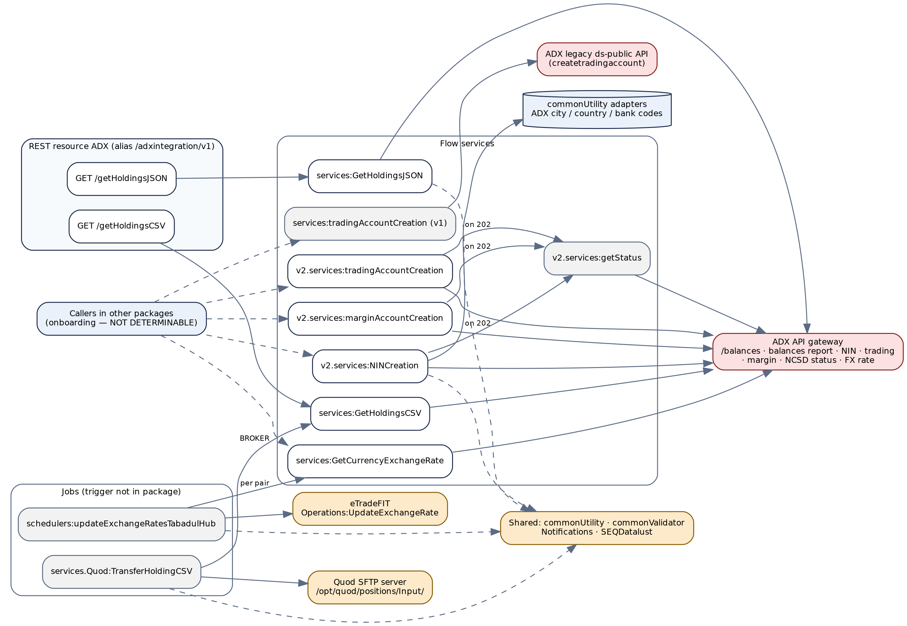

*Figure 1 — As-built: services, callers and the systems they reach*

| Legacy service | Exposure | ADX call (static-data path key) | Target API (chapter) |
|---|---|---|---|
| `services:GetHoldingsJSON` | REST `GET /getHoldingsJSON` | `GET` `ADX_BASE_URL` + `ADX_BALANCES_PATH` | Holdings (4) |
| `services:GetHoldingsCSV` | REST `GET /getHoldingsCSV` | `GET` `ADX_BASE_URL` + `ADX_BALANCES_REPORT_PATH` | Holdings report (5) |
| `v2.services:NINCreation` | IS service | `POST` `ADX_BASE_URL` + `ADX_CRNIN_PATH` | Create investor (6) |
| `v2.services:tradingAccountCreation` | IS service | `POST` `ADX_BASE_URL` + `ADX_CRTRDACC_PATH` | Create trading account (7) |
| `v2.services:marginAccountCreation` | IS service | `POST` `ADX_BASE_URL` + `ADX_CREATE_MARGIN_ACCOUNT_PATH` | Create margin account (8) |
| `v2.services:getStatus` | IS service (also called by the three creations) | `GET` `ADX_BASE_URL` + `ADX_NCSD_PATH` (with `%transactionid%` replaced) | Transaction status (9) |
| `services:GetCurrencyExchangeRate` | IS service (also called by the FX job) | `GET` `ADX_GET_CURRENCY_EXCHANGE_RATE_URL` | Exchange rate (10) |
| `services:tradingAccountCreation` (v1) | IS service | `POST` `NIN_ADX_BASE_URL` + `/ds-public/createtradingaccount` (older ADX API) | Retire (§11.1) |
| `services.Quod:TransferHoldingCSV` | Job | via `GetHoldingsCSV` | Job (§11.2) |
| `schedulers:updateExchangeRatesTabadulHub` | Job | via `GetCurrencyExchangeRate` | Job (§11.3) |


## 2.2 End-to-end journey


Figure 2 places the package among every system it touches. ADX is the only data source; Quod and eTradeFIT receive data from it; the reference database supplies the ADX codes for cities, countries and banks during investor registration.

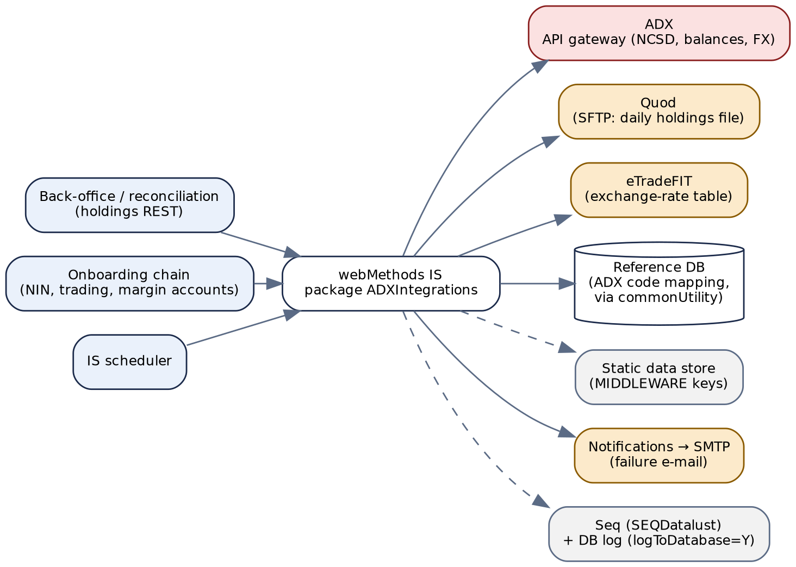

*Figure 2 — End-to-end journey: callers, Integration Server and connected systems*

The callers of the five non-REST services cannot be identified from the package — no caller exists inside it and only this package was supplied. Their names point to the client-onboarding chain (register the investor at ADX, then open a cash and a margin account). Appendix E item 3 asks for the caller list, which the cut-over plan needs.


## 2.3 Target architecture (Spring Boot)


The target is one service, `adx-integration-service`, behind Azure API Management. Four controllers expose the seven APIs; a single `AdxClient` replaces eight copies of the same HTTP-call boilerplate; the two jobs run inside the same service under ShedLock. A small PostgreSQL schema holds two service-owned tables: idempotency and pending-operation tracking for the ADX creations, and the ShedLock table.

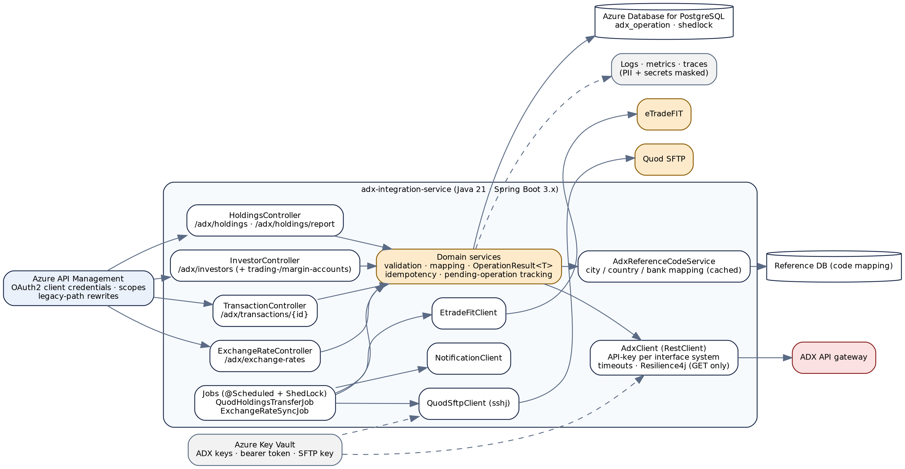

*Figure 3 — Target Spring Boot architecture*

| Legacy component | Target component | Note |
|---|---|---|
| REST resource `RestAPIs:ADX` + 5 IS services called by other packages | `HoldingsController`, `InvestorController`, `TransactionController`, `ExchangeRateController` under `/api/v1/adx` | Noun-based paths. APIM keeps the two legacy REST paths as rewrites to `LegacyAdxController` during transition (§2.4). |
| Eight live `pub.client:http` steps, each with its own URL assembly, header map, byte-to-JSON conversion and content-type test | `AdxClient` over Spring `RestClient` | One place for base URL, API-key selection, timeouts, JSON decoding and ADX error decoding (Chapter 14). |
| IS global variables (`KEY_ADX_*`, `ADX_CURRENCY_EXCHANGE_RATE_*`, `AdxSubscription*`) | Azure Key Vault secrets bound to `AdxProperties` | §13.4. |
| `commonUtility.v2.services:getStaticData` (MIDDLEWARE keys, read on every request) | `AdxProperties` (`@ConfigurationProperties`, validated at start-up) | A missing URL fails the deployment, not a customer request. |
| `commonValidator.genericValidator:validateInputList` | Jakarta Bean Validation on request records | Every NIN field is validated, not just the mobile number. |
| `commonUtility.adapter:getADXCityCode` / `getADXCountryCode` / `getADXBankCode` | `AdxReferenceCodeService` (cached repository) | The underlying tables are not in the package (Appendix E). |
| `RETRY` + `v2.services:getStatus` inside each creation | `PendingOperationService` + `adx_operation` table | Bounded polling, then `202` with a status URL (§13.6). |
| `pub.client.sftp:*` with alias `Quad` | `QuodSftpClient` (sshj) | Key-based authentication from Key Vault; upload to a temporary name, then rename. |
| `pub.flatFile:*` with schema `HoldingCSVSch` | Apache Commons CSV | Columns read by header name. |
| `eTradeFIT.services.Operations:UpdateExchangeRate` | `EtradeFitClient` | Contract to be taken from the eTradeFIT migration (Appendix E). |
| `Notifications.EMail.services:sendEmail` | `NotificationClient` | Template `ADX_HOLDING_TRANSFER_FAILURE` unchanged. |
| `SEQDatalust.services:asynchronousIngestion`, `common:logReqResToSeq` | Structured JSON logging; correlation id in MDC; masking filter | No credential and no full personal-data body is ever logged (AF-01, AF-02). |


## 2.4 Target response and result model


Public APIs return the programme's standard envelope — `correlationID`, `responseCode`, `responseMessage`, `errorCode`, `errorMsg`, `response` — described in each chapter. Internally, `AdxClient` and the services return a typed result instead of the legacy pattern of copying `header/status` into a string `responseCode` and parsing a body that may not be JSON.

```
public record OperationResult<T>(
        boolean success,
        T       data,              // null unless success
        String  failureCode,       // AXI9xx, or AXI0xx for an ADX business rejection
        String  failureDetail) {   // server-side only; never returned verbatim to a caller
    public static <T> OperationResult<T> ok(T data) { ... }
    public static <T> OperationResult<T> failed(String code, String detail) { ... }
}

/** What every ADX call resolves to before a controller sees it. */
public sealed interface AdxOutcome<T> {
    record Completed<T>(T body)                              implements AdxOutcome<T> {}
    record Accepted<T>(String transactionId, T partialBody)  implements AdxOutcome<T> {}  // ADX 202
    record Rejected<T>(int httpStatus, List<String> errorMessages) implements AdxOutcome<T> {} // ADX 4xx / resultCode != S
}
```

> **Legacy-path compatibility**
>
> APIM routes the two legacy REST paths (`/adxintegration/v1/getHoldingsJSON`, `/getHoldingsCSV`) to `LegacyAdxController`, which returns the legacy body shape (transport `200`, string `responseCode`) until consumers move. The five non-REST services have no legacy path to keep: their callers are other Integration Server packages, which are migrated in the same programme and call the target APIs directly.
>
> The compatibility controller inherits the target's fixes — no API key in logs, timeouts, real status mapping inside the body — but not the legacy defects (AF-03, AF-04).


# 3. Prerequisites & Static Configuration


## 3.1 Integration Server global variables


The package's `config/` directory holds only the URL alias; the global variables below are defined on the server. **Values are not in the export and are not reproduced here.**

| Global variable | Used by | Purpose | Target |
|---|---|---|---|
| `KEY_ADX_BROKER_APIKEY` | Holdings (BROKER), NIN, trading, margin, status | ADX API-gateway key acting as broker — header `adx-Gateway-APIKey` | Key Vault `adx-broker-api-key` |
| `KEY_ADX_MARKET_MAKER_APIKEY` | Holdings (MARKET_MAKER) | ADX API-gateway key acting as market maker | Key Vault `adx-market-maker-api-key` |
| `ADX_CURRENCY_EXCHANGE_RATE_BEARER_TOKEN` | Exchange rate | `Authorization: Bearer` header | Key Vault `adx-fx-bearer-token` |
| `ADX_CURRENCY_EXCHANGE_RATE_API_KEY` | Exchange rate | Sent as query parameter `apiKey` (AF-15) | Key Vault `adx-fx-api-key` |
| `AdxSubscriptionKey`, `AdxSubscriptionID` | v1 trading account only | Header `Adx-Subscription-Key` and form parameter `subscriptionid` for the older ds-public API | Not migrated (§11.1) |
| `environment` | NIN, trading, margin | `UAT` switches on mock responses (AF-03) | Removed; Spring profile `adx-stub` instead |

The SFTP connection to Quod is a server-side alias named `Quad` (host, user and key or password are configured on the Integration Server, not in the package). Target: `quod.sftp.*` properties with the private key in Key Vault (§13.4).


## 3.2 Static and feature-flag configuration


All other configuration is read from the shared static-data store (application `MIDDLEWARE`) on every request — through `commonUtility.v2.services:getStaticData` (v2 services, FX service and job), the package wrapper `common:getStaticData` (both holdings services), or `commonUtility.services:getStaticData` directly (v1 trading account, Quod job).

| Static-data key | Read by | Meaning | Target property |
|---|---|---|---|
| `ADX_BASE_URL` | Holdings ×2, NIN, trading, margin, status | ADX API-gateway base URL | `adx.base-url` |
| `ADX_BALANCES_PATH` | Holdings JSON | Path of the balances endpoint | `adx.paths.balances` |
| `ADX_BALANCES_REPORT_PATH` | Holdings CSV | Path of the balances report endpoint | `adx.paths.balances-report` |
| `ADX_CRNIN_PATH` | NIN | Path of the create-NIN endpoint | `adx.paths.create-investor` |
| `ADX_CRTRDACC_PATH` | Trading account | Path of the create-trading-account endpoint | `adx.paths.create-trading-account` |
| `ADX_CREATE_MARGIN_ACCOUNT_PATH` | Margin account | Path of the create-margin-account endpoint | `adx.paths.create-margin-account` |
| `ADX_NCSD_PATH` | Status | Path template; contains the literal `%transactionid%` | `adx.paths.transaction-status` (as a URI template `{transactionId}`) |
| `ADX_GET_CURRENCY_EXCHANGE_RATE_URL` | Exchange rate | Full URL of the FX endpoint | `adx.fx.url` |
| `ADX_GET_CURRENCY_EXCHANGE_RATE_PAIRS` | FX job | Comma-separated pairs `FROM-TO`, e.g. `USD-AED,EUR-AED` | `jobs.exchange-rate-sync.pairs` (list) |
| `ADX_HOLDING_TRANSFER_TO_EMAIL` | Quod job | Failure e-mail recipient | `jobs.quod-transfer.failure-recipients` |
| `NIN_ADX_BASE_URL` | v1 trading account | Base URL of the older ds-public API | Not migrated |
| `KEY_ADX_HOLDINGS_API_AUTH_KEY`, `ADX_HOLDINGS_API_BASE_URL` | Holdings JSON — **disabled steps only** | An earlier configuration scheme | Not migrated |

Hard-coded values that are really configuration:

| Value in source | Where | Target property |
|---|---|---|
| Quod remote directory `/opt/quod/positions/Input/` | Quod job | `jobs.quod-transfer.remote-directory` |
| File names `ADX_Retail_Holding_<yyyyMMdd>.csv`, `ADX_MarketMaking_Holding_<yyyyMMdd>.csv` | Quod job | `jobs.quod-transfer.file-name-patterns` |
| Header `Channel-ID: Brokerage` | Disabled holdings step only | Not migrated unless ADX requires it (Appendix E) |
| Polling: 2 retries, 15-second back-off | `RETRY` in NIN, trading, margin | `adx.async.max-polls`, `adx.async.poll-interval` |
| Rate rounding to 2 decimals | FX job | `jobs.exchange-rate-sync.scale` — default **6**, see AF-08 |
| `maritalStatus = 'Unknown'` | NIN request | Constant in the mapper; confirm with ADX (Appendix E) |
| Time zone `GMT+4` | Timestamps | `app.zone=Asia/Dubai` |


## 3.3 Upstream and downstream dependencies


| Dependency | Legacy access | Used by | Target / health check |
|---|---|---|---|
| ADX API gateway | `pub.client:http` with `adx-Gateway-APIKey` (no timeout) | Chapters 4–10 | `AdxClient`; readiness does **not** call ADX (a slow exchange must not take the service out of rotation); a circuit-breaker metric and a synthetic monitor do. |
| Reference code tables (ADX city, country, bank codes) | `commonUtility.adapter:getADX*Code` (external package; SQL and connection NOT DETERMINABLE) | Investor creation | `AdxReferenceCodeService`; cached; part of readiness. |
| Quod SFTP | `pub.client.sftp:*`, alias `Quad` | Quod job | `QuodSftpClient`; job-level only. |
| eTradeFIT | `eTradeFIT.services.Operations:UpdateExchangeRate` (external package) | FX job | `EtradeFitClient`; job-level only. |
| Notification service → SMTP | `Notifications.EMail.services:sendEmail` | Quod job | `NotificationClient`. |
| Static data store | `commonUtility` `getStaticData` | All | Replaced by properties. |
| Log store (Seq) and DB log | `SEQDatalust.services:asynchronousIngestion` (`logToDatabase=Y` in the v2 services) | All | Platform log pipeline. |
| PostgreSQL (new) | — | Creations, jobs | Primary `DataSource`; readiness probe. |


## 3.4 Security notes


| Aspect | Legacy | Target |
|---|---|---|
| Inbound authentication | Nothing in the package. The REST resource has `is_public=false`; every service has `check_internal_acls=no`; IS ACLs and any gateway in front are **NOT DETERMINABLE**. | APIM validates an OAuth2 client-credentials token. Scopes: `adx.holdings.read`, `adx.investors.write`, `adx.transactions.read`, `adx.fx.read`. |
| Acting identity at ADX | The caller chooses it: `interfaceSystem=MARKET_MAKER` makes the call with the market-maker key. Nothing restricts which callers may do so. | Separate scope `adx.holdings.read.market-maker` required for `MARKET_MAKER`. |
| Credentials in logs | **The ADX API key is logged in clear** by both holdings services (AF-01). The v2 services replace it with `**********` before logging. The FX API key travels as a URL query parameter (AF-15). | Headers are never logged. A Logback masking converter blanks known secret names. Prefer sending the FX key in a header if ADX accepts it. |
| Personal data in logs | Holdings JSON logs the first balance record (one investor's name and NIN); the CSV logs the first 2,000 characters; NIN creation logs the full identity record (names, Emirates ID, passport, IBAN, date of birth, address, mobile, e-mail) to Seq **and** to the database log (AF-02). | Request and response bodies are not logged; a summary (counts, ids, outcome) is. |
| Test code in production | UAT mock branch driven by a global variable (AF-03). | Removed; stubs live outside the production artefact. |
| Outbound transport | URLs come from static data; scheme not determinable. The Java service hard-codes a plain-HTTP ADX URL (§11.5). | HTTPS only, enforced in `AdxProperties` validation; ADX may require Al Ramz's egress IPs to be allow-listed (§18.2). |
| Data shared with Quod | Investor names are replaced with `N/A` before upload — if the masking step works as intended (AF-11). | Masking is a unit-tested function; the uploaded file contains no name column value other than `N/A`. |


# 4. API — Get ADX Holdings


## 4.1 Endpoint summary


| Field | Detail |
|---|---|
| **Legacy endpoint** | `GET /adxintegration/v1/getHoldingsJSON?interfaceSystem=…` → REST resource `ADXIntegrations.RestAPIs:ADX`, operation `/getHoldingsJSON` → `ADXIntegrations.services:GetHoldingsJSON` |
| **Target endpoint** | `GET /api/v1/adx/holdings?interfaceSystem={BROKER\|MARKET_MAKER}` |
| **Resource type** | Collection — every balance ADX holds for the broker or market-maker account. Empty → `404` (§4.6). |
| **Authorization** | `adx.holdings.read`; `MARKET_MAKER` also needs `adx.holdings.read.market-maker`. |
| **Legacy transport status** | Always **HTTP 200**. |
| **Idempotent / cacheable** | Yes / short — `Cache-Control: private, max-age=60`; balances change during the trading day. |

> **Legacy vs. target endpoint**
>
> The legacy path is already a `GET`; the target only moves it under the `/api/v1/adx` noun hierarchy. `interfaceSystem` keeps its name and becomes an enum: it selects **which Al Ramz identity** (broker or market maker) the call is made as at ADX, and therefore which account's holdings come back. ADX infers the account from the API key — no account identifier is sent.


## 4.2 Request schema


| Field | In | Type | Required | Rules and legacy notes |
|---|---|---|---|---|
| `interfaceSystem` | query | enum `BROKER` / `MARKET_MAKER` | Yes | Selects the ADX API key.<br>**Legacy:** case-sensitive string; anything else, including absent, returns `1069`. |
| `X-Correlation-Id` | header | UUID | No | Generated if absent. **Legacy:** a `correlationID` query parameter is honoured if non-blank, otherwise a GUID is generated. |


## 4.3 Business logic summary


1. **Validate** `interfaceSystem` and pick the API key: `BROKER` → broker key, `MARKET_MAKER` → market-maker key. Legacy reads them from the global variables `KEY_ADX_BROKER_APIKEY` / `KEY_ADX_MARKET_MAKER_APIKEY`; any other value sets `1069` and exits the flow (skipping the log step).
2. **Call ADX**: `GET {ADX_BASE_URL}{ADX_BALANCES_PATH}` with headers `Content-Type: application/json` and `adx-Gateway-APIKey`. No query parameters, no body. Legacy reads both static-data keys on every request and sets no timeout (AF-06).
3. **HTTP 200**: parse the JSON; copy `response.balances[]` field by field into `holdings[]` (§4.5) and read `resultCode` / `resultMessage`. If `resultCode = S` → success; legacy returns `responseCode 200` with **ADX's `resultMessage`** as `responseMessage` (not `OK`). Any other `resultCode` → legacy returns `500` with ADX's `resultMessage` **and the holdings anyway**.
4. **Any other HTTP status**: parse the body for `errorMessages[]`; legacy returns `1094` with the messages joined by two spaces. A body that is not JSON throws and becomes `500 Internal Server Error`. The `503 Backend Service Unavailable` assignment that follows always runs but has no effect, because it does not overwrite the `1094` (AF-20).
5. **Target**: `resultCode = S` with at least one balance → `200`; with no balance → `404` (`AXI002`); every other ADX outcome → `502` / `503` with `errorCode` null (§4.6).
6. **Log**: legacy sends the serialised request headers — **including the API key** — as the Seq `requestBody`, and, as `responseBody`, a JSON document with only the **first** balance record plus `resultCode`, `resultMessage` and `recordCount` — or ADX's raw error body on a non-200 (AF-01, AF-02). The target logs the interface system, the record count and the outcome.

> **Business-logic observations for the target design**
>
> **Disabled legacy steps.** The flow still contains an earlier, fully disabled implementation that read `KEY_ADX_HOLDINGS_API_AUTH_KEY` / `ADX_HOLDINGS_API_BASE_URL`, called `/balances` with a `Channel-ID: Brokerage` header, and contained a test filter on one hard-coded NIN. None of it runs; none of it is migrated. Whether ADX still expects `Channel-ID` is Appendix E item 9.
>
> **Volume.** The call returns every balance of the broker or market-maker account in one response; ADX's `recordCount` is logged but not returned to the caller. If the response is large, the target streams it with Jackson rather than building a document tree, and offers paging only if ADX does (it does not today, as far as the flow shows).
>
> **Numbers.** The share quantities arrive as JSON numbers (the signature types them as `object`). The target keeps them as `BigDecimal` — fractional units are possible for funds.


## 4.4 Sample request


```
GET /api/v1/adx/holdings?interfaceSystem=BROKER
Authorization: Bearer <token>
X-Correlation-Id: 8c41f2d0-6a3b-4e19-9d75-0b2e4c7a1f36
```

Legacy: `GET /adxintegration/v1/getHoldingsJSON?interfaceSystem=BROKER`.


## 4.5 Response schema


| Field | Type | Description |
|---|---|---|
| correlationID | String (UUID) | Echo of `X-Correlation-Id`, or the generated value. |
| responseCode / responseMessage | String | HTTP status and reason phrase, e.g. `"200"` / `"OK"`. **Legacy:** `responseMessage` is ADX's `resultMessage` on success. |
| errorCode / errorMsg | String \| null | `AXI001`, `AXI002`; `null` on success and on every backend error. |
| response.interfaceSystem | enum | **New** — echo of the request. |
| response.recordCount | Integer | **New** — ADX's `response.recordCount` (legacy logs it but does not return it). |
| response.holdings[] | Array | One entry per ADX balance, in ADX order. Never empty in a `200`. |
| └─ nin | String | Investor number at NCSD. ← `balances[].nin`. Personal data. |
| └─ investorName | String | ← `balances[].investorName`. Personal data. |
| └─ brokerCode, accountNumber | String | ← `brokerCode`, `accountNumber`. |
| └─ instrumentCode, instrumentName, isin | String | ← `instrumentCode`, `instrumentName`, `isin` (ISO 6166). |
| └─ totalShares, availableShares, pendingDeliveryShares, blockedShares, pendingSettlementShares | BigDecimal | ← the same names. **Legacy:** untyped `object` holding whatever the JSON parser produced. |
| └─ validFrom | LocalDate / OffsetDateTime | ← `validFrom`. **Legacy vs. target field format:** passed through as ADX's string; the format is not visible in the source. The target parses it into ISO-8601 once a sample confirms ADX's format (Appendix E item 8). |


## 4.6 HTTP status code reference


**The legacy service always returns transport HTTP 200.** Legacy codes are the body's `responseCode` / `responseMessage` from `flow.xml`. Target statuses follow the shared registry (`1069` → 400, `1012`-style no data → 404), with the one deliberate deviation explained below.


### Client input errors


| HTTP Status | Service Error Code | Description | Legacy Error Code |
|---|---|---|---|
| 400 | `AXI001` | `interfaceSystem` is missing or not `BROKER` / `MARKET_MAKER`. | `1069` — Middleware validation error : Missing mandatory parameter interface system |
| 404 | `AXI002` | ADX returned success but no balance for the account. | — (legacy returns `200` with ADX's message and an empty or absent `holdings`) |

> **Design decision — no holdings is 404, following the programme rule**
>
> An empty list returns `404 Not Found` / `AXI002`. The API owner's rule (CurrencyIntegration v1.1) is that a request that yields no data indicates a problem with the inputs or with the provider, so a success status would mislead the caller. For the broker's whole ADX account an empty balance list is exceptional — it most likely means the wrong key or account at ADX — so the rule fits. Appendix E item 1 asks for confirmation for the market-maker account, which can legitimately be flat.


### Backend / provider errors


`errorCode` and `errorMsg` are `null` for every row; the `AXI9xx` codes are logged with the correlation id and exposed as metrics, never returned.

| HTTP Status | Service Error Code | Description | Legacy Error Code |
|---|---|---|---|
| 503 | `AXI901` | ADX unreachable, connection or read timeout, or the circuit breaker is open. | `500` — Internal Server Error (exception in the try) |
| 502 | `AXI902` | ADX returned 5xx, or a non-success outcome that is not a business rejection of the caller's input. | `1094` — `<ADX errorMessages joined by two spaces>` (HTTP ≠ 200); or `500` — `<ADX resultMessage>` (HTTP 200, `resultCode` ≠ `S`) |
| 502 | `AXI903` | ADX rejected Al Ramz's credentials (`401` / `403`). Separate from `AXI902` because it needs an operator — usually a rotated or expired key. | `1094` — `<ADX errorMessages joined by two spaces>` (HTTP ≠ 200); or `500` — `<ADX resultMessage>` (HTTP 200, `resultCode` ≠ `S`) |
| 502 | `AXI904` | ADX returned a body that is not JSON, or JSON without the expected fields. | `500` — Internal Server Error |
| 500 | `AXI900` | Any other unexpected error inside the service. | `500` — Internal Server Error |

> **Design decision — ADX failures are 502, deviating from the registry's 1094 → 500**
>
> The shared registry maps `1094` ("Middleware system error") to `500`, because in other packages `1094` reports a failure inside the middleware. Here the legacy service uses `1094` for **ADX's** errors. The registry's own convention is that failures of a named external system (it lists ADX explicitly) are `502`, reserving `500` for the service itself. The target follows that convention. The registry entry itself is unchanged.


## 4.7 Example target response envelopes


#### Success


```
HTTP/1.1 200 OK

{
  "correlationID": "8c41f2d0-6a3b-4e19-9d75-0b2e4c7a1f36",
  "responseCode": "200",
  "responseMessage": "OK",
  "errorCode": null,
  "errorMsg": null,
  "response": { "interfaceSystem": "BROKER", "recordCount": 2,
    "holdings": [
      { "nin": "10000000001", "investorName": "Sample Investor", "brokerCode": "123",
        "accountNumber": "4000001", "instrumentCode": "SAMPLE", "instrumentName": "Sample Company PJSC",
        "isin": "AEA000000001", "totalShares": 1500, "availableShares": 1200,
        "pendingDeliveryShares": 0, "blockedShares": 300, "pendingSettlementShares": 0,
        "validFrom": "2026-10-01" },
      { "...": "..." } ] }
}
```


#### Client input error


```
HTTP/1.1 400 Bad Request

{
  "correlationID": "2f7a9c13-5e0d-4b68-a1c4-7d3e9b0f6a25",
  "responseCode": "400",
  "responseMessage": "Bad Request",
  "errorCode": "AXI001",
  "errorMsg": "interfaceSystem must be BROKER or MARKET_MAKER.",
  "response": null
}
```


#### No data


```
HTTP/1.1 404 Not Found

{
  "correlationID": "a90e4d6b-1c2f-4a83-9e57-3b8d0c6f2e14",
  "responseCode": "404",
  "responseMessage": "Not Found",
  "errorCode": "AXI002",
  "errorMsg": "ADX returned no holdings for interfaceSystem MARKET_MAKER.",
  "response": null
}
```


#### Backend error — note what is absent


```
HTTP/1.1 502 Bad Gateway

{
  "correlationID": "5d3b8e2a-7f19-4c06-b4d1-e2a6c9f0b873",
  "responseCode": "502",
  "responseMessage": "Bad Gateway",
  "errorCode": null,
  "errorMsg": null,
  "response": null
}

// Logged server-side only:
//   AXI903  ADX GET balances  status=401  interfaceSystem=BROKER  (key rejected)
```


## 4.8 Target process flow (Spring Boot)


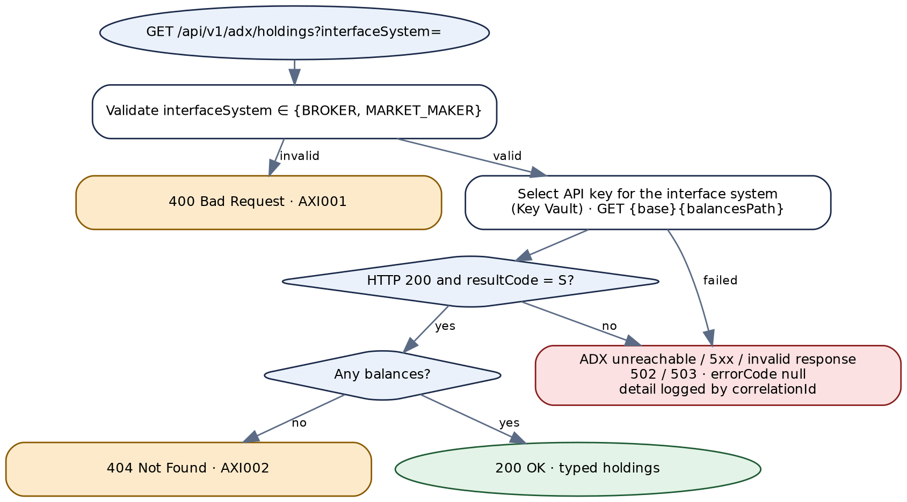

*Figure 4 — Target process flow for GET /api/v1/adx/holdings*

The controller, service and client skeletons for this API are in §15.1.


# 5. API — Download ADX Holdings Report


## 5.1 Endpoint summary


| Field | Detail |
|---|---|
| **Legacy endpoint** | `GET /adxintegration/v1/getHoldingsCSV?interfaceSystem=…` → `ADXIntegrations.services:GetHoldingsCSV` |
| **Target endpoint** | `GET /api/v1/adx/holdings/report?interfaceSystem={BROKER\|MARKET_MAKER}` with `Accept: text/csv` |
| **Resource type** | A file representation of the holdings collection, produced by ADX. Empty report → `404`. |
| **Authorization** | As §4.1. |
| **Legacy transport status** | **HTTP 200**: on success the body is the file (`application/octet-stream`, via `pub.flow:setResponse2`); on any failure the body is the JSON pipeline with the code inside. |
| **Also used by** | The Quod holdings-transfer job (§11.2), which calls the legacy service with `interfaceSystem=BROKER`. |

> **Legacy vs. target endpoint**
>
> A report of the same collection as Chapter 4, so a sub-resource `report` of `holdings`. The target returns `text/csv; charset=UTF-8` with `Content-Disposition: attachment; filename="adx-holdings-<interfaceSystem>-<yyyyMMdd>.csv"` instead of an anonymous octet stream; errors are always the JSON envelope with a real status.


## 5.2 Request schema


Identical to §4.2: `interfaceSystem` (query, required) and `X-Correlation-Id` (header, optional). **Legacy:** same `1069` behaviour.


## 5.3 Business logic summary


1. Validate and pick the API key exactly as §4.3 step 1.
2. Call `GET {ADX_BASE_URL}{ADX_BALANCES_REPORT_PATH}` with the same headers, reading the body as bytes. Legacy: no timeout.
3. **HTTP 200** → return the bytes unchanged. Legacy sets `Content-Type: application/octet-stream` twice (`setResponseHeader` and `setResponse2`) The raw ADX body is also copied to `response.fileBytes` for **every** status (so an error pipeline carries the error body too); the Quod job reads it from there.
4. **Any other status** → parse `errorMessages[]` and return `1094` with them, as §4.3 step 4.
5. **Log**: legacy logs the headers — **including the API key** — and the first 2,000 characters of the file as `responseBody` (AF-01, AF-02). The trim uses `pub.string:substring` with `endIndex=2000`; whether that throws for a shorter body, and so fails the service after the response was set, is **NOT DETERMINABLE** (AF-21).
6. **Target**: stream the ADX body to the client (no full buffering), counting lines; a file with a header and no data row → `404` (`AXI011`). Because the status line must be decided before streaming starts, the service reads ADX's first two lines before committing the response (§15.1).

> **Business-logic observations for the target design**
>
> **The report's format belongs to ADX.** The flow passes it through untouched; only the Quod job parses it, against the flat-file schema in §11.4 (13 columns, comma-delimited, a header row). The API does not re-format it, so a column change at ADX reaches consumers unchanged. A captured sample file is Appendix E item 8.


## 5.4 Sample request


```
GET /api/v1/adx/holdings/report?interfaceSystem=BROKER
Accept: text/csv
Authorization: Bearer <token>
```


## 5.5 Response schema


**Success:** the CSV file itself — no envelope. Headers: `Content-Type: text/csv; charset=UTF-8`, `Content-Disposition` as §5.1, `X-Correlation-Id`, and `X-Record-Count` (data rows, **new**). The columns, as declared by the legacy flat-file dictionary, are listed in §11.4.

**Any error:** the standard JSON envelope (`Content-Type: application/json`) with `response: null`, as in §5.7.


## 5.6 HTTP status code reference


**The legacy service returns transport HTTP 200 in every case.**


### Client input errors


| HTTP Status | Service Error Code | Description | Legacy Error Code |
|---|---|---|---|
| 400 | `AXI010` | `interfaceSystem` is missing or not `BROKER` / `MARKET_MAKER`. | `1069` — Middleware validation error : Missing mandatory parameter interface system |
| 404 | `AXI011` | ADX returned a report with no data rows. | — (legacy returns the file, however empty) |


### Backend / provider errors


| HTTP Status | Service Error Code | Description | Legacy Error Code |
|---|---|---|---|
| 503 | `AXI901` | ADX unreachable, connection or read timeout, or the circuit breaker is open. | `500` — Internal Server Error |
| 502 | `AXI902` | ADX returned 5xx, or a non-success outcome that is not a business rejection of the caller's input. | `1094` — `<ADX errorMessages joined by two spaces>` |
| 502 | `AXI903` | ADX rejected Al Ramz's credentials (`401` / `403`). Separate from `AXI902` because it needs an operator — usually a rotated or expired key. | `1094` — `<ADX errorMessages joined by two spaces>` |
| 502 | `AXI904` | ADX returned a body that is not JSON, or JSON without the expected fields. | `500` — Internal Server Error (non-JSON error body) |
| 500 | `AXI900` | Any other unexpected error inside the service. | `500` — Internal Server Error |


## 5.7 Example target response envelopes


#### Success


```
HTTP/1.1 200 OK
Content-Type: text/csv; charset=UTF-8
Content-Disposition: attachment; filename="adx-holdings-BROKER-20261002.csv"
X-Record-Count: 2
X-Correlation-Id: 3c9e0a71-4b2d-4f58-8e16-d7a5b0c2f948

<CSV as produced by ADX — header row, then one row per balance>
```


#### Client input error


```
HTTP/1.1 400 Bad Request

{
  "correlationID": "e61b0f4c-2d8a-4f37-9a05-c8d1e3b7f240",
  "responseCode": "400",
  "responseMessage": "Bad Request",
  "errorCode": "AXI010",
  "errorMsg": "interfaceSystem must be BROKER or MARKET_MAKER.",
  "response": null
}
```


#### No data


```
HTTP/1.1 404 Not Found

{
  "correlationID": "0b5d7e2f-9a6c-4183-b2f0-4e8a1c6d9f57",
  "responseCode": "404",
  "responseMessage": "Not Found",
  "errorCode": "AXI011",
  "errorMsg": "The ADX holdings report for BROKER contains no data rows.",
  "response": null
}
```


## 5.8 Target process flow (Spring Boot)


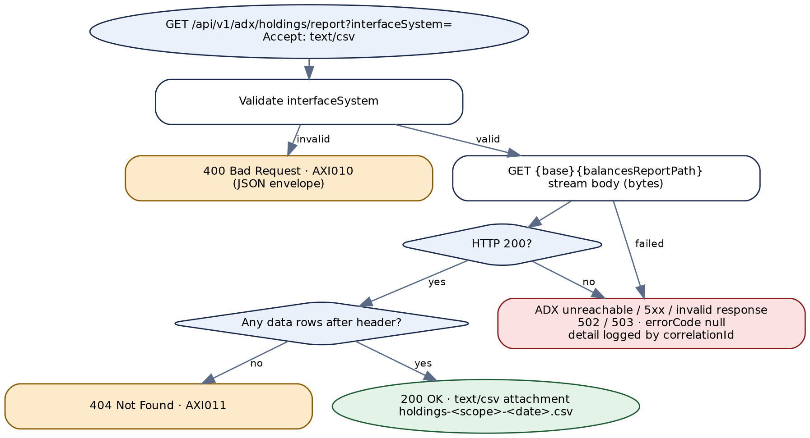

*Figure 5 — Target process flow for GET /api/v1/adx/holdings/report*


# 6. API — Register Investor at ADX (Create NIN)


## 6.1 Endpoint summary


| Field | Detail |
|---|---|
| **Legacy service** | `ADXIntegrations.v2.services:NINCreation` — not REST-exposed; invoked by other packages (callers NOT DETERMINABLE) |
| **Target endpoint** | `POST /api/v1/adx/investors` |
| **Resource type** | Create, asynchronous at ADX. `201 Created` with the NIN when ADX completes within the polling budget; otherwise `202 Accepted` with a transaction id (§13.6). |
| **Authorization** | `adx.investors.write`. |
| **Idempotency** | `Idempotency-Key` header **required** — a repeated key returns the original response and never calls ADX twice. |
| **Legacy transport status** | HTTP 200 inside Integration Server; the outcome is in `responseCode`. |

> **Legacy vs. target endpoint**
>
> Registering an investor at the depository creates a resource — the investor and its NIN — so the target is `POST` on `investors`. The body moves from 27 flat lower-case fields to a structured JSON document (§6.2). The legacy service has no REST path, so there is nothing to keep in APIM; its callers are migrated to this endpoint.


## 6.2 Request schema


Legacy input is 28 top-level strings — 27 business fields plus `correlationID` (the document type `docs:NINCreationRequest` lists 26 of the business fields plus an optional `_env`; the service signature adds `email` and `correlationID`). **The legacy service validates only `mobilenumber`** (required, length ≤ 30, mobile-number check by the external validator). Everything else is unchecked (AF-07). The target validates every field.

| Target field | Type / rule | Legacy field | Legacy vs. target notes |
|---|---|---|---|
| `primaryIdNumber` | String, digits, 1–18; required | `primaryidnumber` | Converted to `java.lang.Long` and sent as a JSON number; a non-numeric value throws and returns `500`. |
| `emiratesId` | String, `^784\d{12}$`; required for UAE residents | `emiratesid` | Converted to `Long` like the above. |
| `passportNumber` | String, 1–20 alphanumerics | `passportnumber` | — |
| `investorNameAr` / `investorNameEn` | String, 1–150; required | `investorname` / `investornameenglish` | — |
| `clientType` | enum from `adx.codes.client-types`; required | `clienttype` | Passed raw; the ADX value list is not in the source (Appendix E). |
| `gender` | enum from `adx.codes.genders`; required | `gender` | Passed raw. |
| `minor` | Boolean → ADX code per config | `minor` | Passed raw string. |
| `birthDate` | LocalDate (ISO-8601); past | `birthdate` | **Legacy vs. target field format:** passed as received; the format ADX expects is not visible in the source. The target converts ISO-8601 to ADX's format in the mapper (Appendix E item 8). |
| `citizenship` | ISO 3166-1 alpha-3; required | `citizenship` | Mapped to ADX's country code by `getADXCountryCode(ISO3_CODE)`. |
| `address.country` | ISO 3166-1 alpha-3; required | `country` | Mapped the same way. |
| `address.city` | Al Ramz city code; required | `city` | Mapped by `getADXCityCode` to ADX `cityCode`; the lookup also supplies `cityName`. |
| `address.line1` … `line3` | String, ≤ 100 | `address1` … `address3` | Legacy strips special characters (`commonUtility.string.removeSpecialChar`, rules not in the package); the target applies a documented allow-list (§12.2). |
| `address.postalCode` | String, digits, 1–10 | `postalcode` | Left-padded with `0` to 5 characters when shorter; sent both as `postalCode` and as `poBox`. |
| `mobileNumber` | E.164; required | `mobilenumber` | Normalised by `commonUtility.string.validatePhoneNumber` (rules not in the package). |
| `telephoneNumber` | E.164, optional | `telephonenumber` | — |
| `email` | RFC 5322, optional | `email` | Not validated today. |
| `familyId` | String, optional | `familyid` | — |
| `bank.swiftCode` | BIC (8 or 11); optional | `bankcode` | Legacy takes the **first six characters** and maps them by `getADXBankCode` to ADX's bank code — only when non-blank. |
| `bank.iban` | ISO 13616; required with `swiftCode` | `iban` | Not validated today. |
| — (dropped) | — | `shareholdername`, `shareholdertype`, `adxreferencenumber`, `jointholder`, `bankaccounttype` | Accepted and logged by legacy but **never sent to ADX** (AF-17). Dropped from the target contract; Appendix E item 10 asks whether ADX should receive them. |
| `Idempotency-Key` | header, UUID; required | — | **New.** |
| `X-Correlation-Id` | header, UUID; optional | `correlationID` | Echoed if non-blank, otherwise generated. |


## 6.3 Business logic summary


1. **Validate** (§6.2). Legacy: only the mobile number. A failure sets `1069` "Input validation failed …" and then exits with an **empty failure message**, so the catch block — which recognises only messages starting `1069` — replaces it with `500 Internal Server Error` (AF-07).
2. **Map to ADX codes**: city → ADX city code and name; country and citizenship (ISO alpha-3) → ADX country codes; SWIFT prefix → ADX bank code. Legacy takes the first row of each look-up and, **when a look-up finds nothing, sends the original Al Ramz value to ADX unchanged** (AF-16). The target rejects an unmappable value with `400` / `AXI022`.
3. **Normalise**: postal code padding, address clean-up, mobile normalisation, numeric conversion of the two identity numbers.
4. **Build the ADX body** (§12.1) — including three derived values the legacy flow invents: `provinceCode` = the city code, `provinceName` = the city name, `poBox` = the postal code — and the constant `maritalStatus = "Unknown"`.
5. **Call ADX**: `POST {ADX_BASE_URL}{ADX_CRNIN_PATH}` with `adx-Gateway-APIKey` (broker key). No timeout in legacy.
6. **Interpret**: JSON body with `resultCode = S` and HTTP `200` → `investorNumber` is the NIN. HTTP `202` → poll `getStatus` with the returned `transactionId`, up to 2 more times 15 seconds apart; as soon as a status call returns `responseCode 200`, take the NIN **from the original 202 body** and report success. `getStatus` returns `200` for `resultCode = S` with `resultMessage = Success` — **and also when ADX answers HTTP 200 with any other `resultCode`**, because it passes ADX's HTTP status through — so a failed NCSD transaction can be reported as a successful registration (AF-05). Any other combination leaves the NIN empty and returns `400 Bad Request`. `resultCode` ≠ `S` → return ADX's HTTP status — **including 200** — with `Request Failed - <ADX messages>` (AF-04). A non-JSON body → `500`.
7. **Log**: the full ADX request body — names, identity numbers, IBAN, date of birth, address, phone and e-mail — and the full response go to Seq and, with `logToDatabase=Y`, to the database log (AF-02).
8. **UAT mock**: if the global variable `environment` is `UAT`, the final step overwrites the outcome with `200 OK` and a fixed NIN, whatever happened (AF-03).

> **Business-logic observations for the target design**
>
> **The 202 path is where duplicates come from.** The legacy caller waits about 30 seconds, then gets `400` although ADX may still register the investor. If the caller retries, ADX receives a second registration. The target never retries the `POST`, returns `202` with the transaction id when the polling budget runs out, and records the operation so the caller can follow it (§13.6). Whether ADX's 202 body already carries the investor number is Appendix E item 2; the legacy flow assumes it does.
>
> **Shared pipeline (verify on a running server).** `getStatus` ends with `pub.flow:clearPipeline`. If, as is usual in Integration Server, the child shares the caller's pipeline, that call removes `ADXResponse` before the NIN is copied from it, so the 202 path can never succeed (AF-05). Either way the target does not depend on it.
>
> **Duplicate investors.** Nothing checks whether the person already has a NIN; ADX's answer to a duplicate is not visible in the source. The target surfaces ADX's rejection as `422` / `AXI023` with ADX's messages.


## 6.4 Sample request


```
POST /api/v1/adx/investors
Content-Type: application/json
Idempotency-Key: 6f1c9a2e-3b7d-4e05-8a64-d2c0b9f7e318

{ "primaryIdNumber": "784198600000001",
  "emiratesId": "784198600000001",
  "passportNumber": "N0000001",
  "investorNameAr": "مستثمر تجريبي", "investorNameEn": "Sample Investor",
  "clientType": "I", "gender": "M", "minor": false, "birthDate": "1986-04-11",
  "citizenship": "ARE",
  "address": { "city": "1", "line1": "Sample Street 1", "line2": null, "line3": null,
               "postalCode": "12345", "country": "ARE" },
  "mobileNumber": "+971500000000", "telephoneNumber": null,
  "email": "sample.investor@example.com", "familyId": null,
  "bank": { "swiftCode": "SAMPAEAA", "iban": "AE070000000000000000001" } }
```

Code values (`clientType`, `gender`, city `1`) are illustrative; the real value lists are an open item.


## 6.5 Response schema


| Field | Type | Description |
|---|---|---|
| correlationID, responseCode, responseMessage | String | Standard envelope. |
| errorCode / errorMsg | String \| null | `AXI020`–`AXI024` for client errors; `null` otherwise. |
| response.nin | String \| null | The investor number. Present on `201`. **Legacy name:** `response.NIN`. |
| response.status | enum `COMPLETED` / `PENDING` | **New.** `PENDING` on `202`. |
| response.transactionId | String \| null | **New.** ADX's NCSD transaction id when ADX answered `202`; use it with Chapter 9. Response header `Location: /api/v1/adx/transactions/{transactionId}` on `202`. |


## 6.6 HTTP status code reference


**Legacy returns HTTP 200 inside Integration Server.** Legacy codes are from `v2/services/NINCreation/flow.xml`. Statuses follow the shared registry (`1069` → 400); ADX's own business rejections become `422`, its technical failures `502`/`503`.


### Client input errors


| HTTP Status | Service Error Code | Description | Legacy Error Code |
|---|---|---|---|
| 400 | `AXI020` | A required field is missing. | Only for `mobilenumber`: `1069` — Input validation failed `<validator message>`, **replaced by** `500` — Internal Server Error (AF-07). Other fields: not checked. |
| 400 | `AXI021` | A field fails its format rule (§6.2). | Non-numeric `primaryidnumber` / `emiratesid`: `500` — Internal Server Error. Others: not checked. |
| 400 | `AXI022` | City, country, citizenship or bank cannot be mapped to an ADX code. | — (the unmapped value is sent to ADX) |
| 422 | `AXI023` | ADX rejected the registration (HTTP 4xx, or `resultCode` ≠ `S`). `errorMsg` carries ADX's messages, sanitised. | `<ADX HTTP status>` — `Request Failed - <ADX errorMessages>`; **`200`** when ADX answered HTTP 200 (AF-04) |
| 409 | `AXI024` | `Idempotency-Key` reused with a different request body. **New.** | — |


### Backend / provider errors


| HTTP Status | Service Error Code | Description | Legacy Error Code |
|---|---|---|---|
| 503 | `AXI901` | ADX unreachable, connection or read timeout, or the circuit breaker is open. | `500` — Internal Server Error |
| 502 | `AXI902` | ADX returned 5xx, or a non-success outcome that is not a business rejection of the caller's input. | `<ADX HTTP status>` — `Request Failed - <ADX errorMessages>` (or `Unknown Error`) |
| 502 | `AXI903` | ADX rejected Al Ramz's credentials (`401` / `403`). Separate from `AXI902` because it needs an operator — usually a rotated or expired key. | `<ADX HTTP status>` — `Request Failed - <ADX errorMessages>` (or `Unknown Error`) |
| 502 | `AXI904` | ADX returned a body that is not JSON, or JSON without the expected fields. | `500` — Internal Server Error (non-JSON body) |
| 500 | `AXI900` | Any other unexpected error inside the service. | `500` — Internal Server Error |
| 500 | `AXI913` | The reference-code database could not be read. | `500` — Internal Server Error |


### Asynchronous outcome (not an error)


| HTTP Status | Meaning | Legacy |
|---|---|---|
| 201 | ADX completed (immediately, or within the polling budget). NIN returned. | `200` — OK |
| 202 | ADX accepted the request and has not finished within the budget. `transactionId` and `Location` returned. | `400` — Bad Request (after about 30 seconds of polling) |


## 6.7 Example target response envelopes


#### Created


```
HTTP/1.1 201 Created

{
  "correlationID": "6f1c9a2e-3b7d-4e05-8a64-d2c0b9f7e318",
  "responseCode": "201",
  "responseMessage": "Created",
  "errorCode": null,
  "errorMsg": null,
  "response": { "nin": "10000000001", "status": "COMPLETED", "transactionId": null }
}
```


#### Accepted — still pending at ADX


```
HTTP/1.1 202 Accepted

{
  "correlationID": "d4a8e1b0-5c3f-4927-8e6d-1f0b7a2c9e53",
  "responseCode": "202",
  "responseMessage": "Accepted",
  "errorCode": null,
  "errorMsg": null,
  "response": { "nin": null, "status": "PENDING", "transactionId": "TXN-0000001" }
}

// Location: /api/v1/adx/transactions/TXN-0000001
```


#### Client input error


```
HTTP/1.1 400 Bad Request

{
  "correlationID": "7b2e0c9d-1a4f-4e86-b3d5-9c6f0e2a8b14",
  "responseCode": "400",
  "responseMessage": "Bad Request",
  "errorCode": "AXI022",
  "errorMsg": "address.city 999 has no ADX city code.",
  "response": null
}
```


#### Rejected by ADX


```
HTTP/1.1 422 Unprocessable Entity

{
  "correlationID": "c1f5a3e8-0d7b-4b29-a6e4-5e9d2b0c7f81",
  "responseCode": "422",
  "responseMessage": "Unprocessable Entity",
  "errorCode": "AXI023",
  "errorMsg": "ADX rejected the registration: Invalid IBAN.",
  "response": null
}
```


## 6.8 Target process flow (Spring Boot)


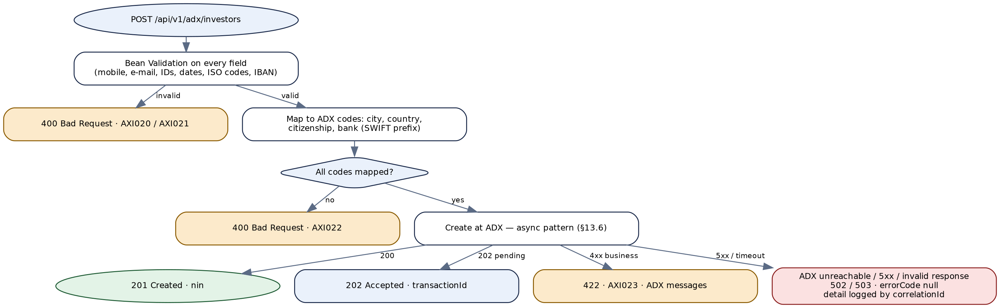

*Figure 6 — Target process flow for POST /api/v1/adx/investors*

The creation pattern shared by Chapters 6–8 is drawn in Figure 10 (§13.6) — it is referred to here rather than repeated.


# 7. API — Open ADX Trading Account


## 7.1 Endpoint summary


| Field | Detail |
|---|---|
| **Legacy service** | `ADXIntegrations.v2.services:tradingAccountCreation` — not REST-exposed. (The older `services:tradingAccountCreation` targets a different ADX API; see §11.1.) |
| **Target endpoint** | `POST /api/v1/adx/investors/{investorNumber}/trading-accounts` |
| **Resource type** | Create, asynchronous at ADX: `201` / `202` as Chapter 6. |
| **Authorization** | `adx.investors.write`; `Idempotency-Key` required. |

> **Legacy vs. target endpoint**
>
> The legacy input `primaryIdNumber` is sent to ADX as `investorNumber` — it is the investor's NIN, not an identity-document number, despite the name. The target puts it in the path, so the account is created under the investor it belongs to.


## 7.2 Request schema


| Field | In | Type | Required | Rules and legacy notes |
|---|---|---|---|---|
| `investorNumber` | path | String, digits, 1–20 | Yes | **Legacy:** body `primaryIdNumber`, validated by the external validator as required with length ≤ 30, then converted with `commonUtility.string.stringToObject` (probably to a number; NOT DETERMINABLE) and sent as `investorNumber`. |
| Body | — | — | — | None. The ADX request carries only `investorNumber`. |
| `Idempotency-Key` | header | UUID | Yes | **New.** |


## 7.3 Business logic summary


1. Validate. Legacy: a validator failure is thrown via `commonUtility.services:checkAndThrowError` with the validator's message; the catch returns `1069` only if that message starts with `1069`, otherwise `500` — which one happens depends on the external validator (NOT DETERMINABLE).
2. `POST {ADX_BASE_URL}{ADX_CRTRDACC_PATH}` with body `{"investorNumber": …}` and the broker key. The logged copy of the headers masks the key as `**********` (unlike Chapters 4–5).
3. `resultCode = S` and HTTP `200` → `response.tradingAccountNumber` becomes `cashTradingNumber`. HTTP `202` → the same polling as §6.3, with the number again taken from the original 202 body. Otherwise as §6.3.
4. Log the request, headers (masked) and response to Seq and the database; apply the UAT mock (AF-03).

> **Business-logic observations for the target design**
>
> **Declared contract.** The service signature declares `response` as an empty record; the real field is `cashTradingNumber` (AF-19). The target names it `tradingAccountNumber`, matching ADX.
>
> **One account per call.** ADX returns one trading-account number. Whether a second call for the same investor creates a second account or is rejected is ADX behaviour not visible in the source.


## 7.4 Sample request


```
POST /api/v1/adx/investors/10000000001/trading-accounts
Idempotency-Key: 0e7a3c51-9b2d-4f64-8d10-a5c2e9b4f736
Authorization: Bearer <token>
```


## 7.5 Response schema


| Field | Type | Description |
|---|---|---|
| correlationID, responseCode, responseMessage, errorCode, errorMsg | — | Standard envelope. Client codes `AXI030`, `AXI031`, `AXI024`. |
| response.investorNumber | String | **New** — echo. |
| response.tradingAccountNumber | String \| null | ← ADX `response.tradingAccountNumber`. **Legacy name:** `response.cashTradingNumber`. |
| response.status, response.transactionId | enum, String | As §6.5. |


## 7.6 HTTP status code reference


**Legacy returns HTTP 200 inside Integration Server.** Statuses follow the shared registry.


### Client input errors


| HTTP Status | Service Error Code | Description | Legacy Error Code |
|---|---|---|---|
| 400 | `AXI030` | `investorNumber` is not 1–20 digits. | `1069` — Middleware system validation error : … or `500` — Internal Server Error (depends on the external validator's message) |
| 422 | `AXI031` | ADX rejected the request (HTTP 4xx, or `resultCode` ≠ `S`); ADX's messages in `errorMsg`. | `<ADX HTTP status>` — `Request Failed - <ADX errorMessages>`; **`200`** when ADX answered HTTP 200 |
| 409 | `AXI024` | `Idempotency-Key` reused with a different request. | — |


### Backend / provider errors


| HTTP Status | Service Error Code | Description | Legacy Error Code |
|---|---|---|---|
| 503 | `AXI901` | ADX unreachable, connection or read timeout, or the circuit breaker is open. | `500` — Internal Server Error |
| 502 | `AXI902` | ADX returned 5xx, or a non-success outcome that is not a business rejection of the caller's input. | `<ADX HTTP status>` — `Request Failed - <ADX errorMessages>` (or `Unknown Error`) |
| 502 | `AXI903` | ADX rejected Al Ramz's credentials (`401` / `403`). Separate from `AXI902` because it needs an operator — usually a rotated or expired key. | `<ADX HTTP status>` — `Request Failed - <ADX errorMessages>` (or `Unknown Error`) |
| 502 | `AXI904` | ADX returned a body that is not JSON, or JSON without the expected fields. | `500` — Internal Server Error (non-JSON body) |
| 500 | `AXI900` | Any other unexpected error inside the service. | `500` — Internal Server Error |

Asynchronous outcomes `201` / `202` exactly as §6.6. Legacy returns `400` — Bad Request whenever no account number is available at the end, including after a 202.


## 7.7 Example target response envelopes


#### Created


```
HTTP/1.1 201 Created

{
  "correlationID": "0e7a3c51-9b2d-4f64-8d10-a5c2e9b4f736",
  "responseCode": "201",
  "responseMessage": "Created",
  "errorCode": null,
  "errorMsg": null,
  "response": { "investorNumber": "10000000001", "tradingAccountNumber": "4000001",
    "status": "COMPLETED", "transactionId": null }
}
```


#### Rejected by ADX


```
HTTP/1.1 422 Unprocessable Entity

{
  "correlationID": "9f2b6d0e-4c8a-4135-b7e1-3d0a5f9c2e68",
  "responseCode": "422",
  "responseMessage": "Unprocessable Entity",
  "errorCode": "AXI031",
  "errorMsg": "ADX rejected the request: Investor not found.",
  "response": null
}
```


## 7.8 Target process flow (Spring Boot)


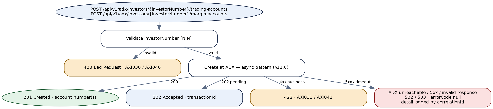

*Figure 7 — Target process flow for trading- and margin-account creation*


# 8. API — Open ADX Margin Account


## 8.1 Endpoint summary


| Field | Detail |
|---|---|
| **Legacy service** | `ADXIntegrations.v2.services:marginAccountCreation` — not REST-exposed. |
| **Target endpoint** | `POST /api/v1/adx/investors/{investorNumber}/margin-accounts` |
| **Resource type** | Create, asynchronous at ADX: `201` / `202` as Chapter 6. |
| **Authorization** | `adx.investors.write`; `Idempotency-Key` required. |

> **Legacy vs. target endpoint**
>
> Same shape as Chapter 7. The difference is in the answer: ADX returns a **list** `marginAccountNumbers`, and the legacy flow keeps only the last element (AF-18). The target returns the whole list.


## 8.2 Request schema


As §7.2: `investorNumber` in the path (legacy body `primaryIdNumber`, required, length ≤ 30, sent as `investorNumber`), `Idempotency-Key` header.


## 8.3 Business logic summary


1. Validate as §7.3.
2. `POST {ADX_BASE_URL}{ADX_CREATE_MARGIN_ACCOUNT_PATH}` with `{"investorNumber": …}` and the broker key (masked in the log copy).
3. `resultCode = S` and HTTP `200` → loop over `response.marginAccountNumbers[]`, converting each to a string and writing it to the same scalar `marginAccountNumber` — so only the **last** survives. HTTP `202` → poll as §6.3, then the same loop over the original 202 body. Otherwise as §6.3.
4. Log; UAT mock (AF-03).

> **Business-logic observations for the target design**
>
> **Why a list?** ADX can evidently return more than one margin account per request (for example per currency or market segment); which number Al Ramz's back office needs is not visible in the source. The target returns all of them in ADX's order; Appendix E item 11 asks which one consumers have been using.


## 8.4 Sample request


```
POST /api/v1/adx/investors/10000000001/margin-accounts
Idempotency-Key: 4a9d1e6b-2c7f-4053-9e81-b6f0c3d5a297
Authorization: Bearer <token>
```


## 8.5 Response schema


| Field | Type | Description |
|---|---|---|
| correlationID, responseCode, responseMessage, errorCode, errorMsg | — | Standard envelope. Client codes `AXI040`, `AXI041`, `AXI024`. |
| response.investorNumber | String | **New** — echo. |
| response.marginAccountNumbers | List<String> | ← ADX `response.marginAccountNumbers[]`, all elements. **Legacy vs. target field format:** legacy returns one string `marginAccountNumber` — the last element. |
| response.status, response.transactionId | enum, String | As §6.5. |


## 8.6 HTTP status code reference


### Client input errors


| HTTP Status | Service Error Code | Description | Legacy Error Code |
|---|---|---|---|
| 400 | `AXI040` | `investorNumber` is not 1–20 digits. | `1069` — Middleware system validation error : … or `500` — Internal Server Error (validator-dependent) |
| 422 | `AXI041` | ADX rejected the request; ADX's messages in `errorMsg`. | `<ADX HTTP status>` — `Request Failed - <ADX errorMessages>`; **`200`** when ADX answered HTTP 200 |
| 409 | `AXI024` | `Idempotency-Key` reused with a different request. | — |


### Backend / provider errors


| HTTP Status | Service Error Code | Description | Legacy Error Code |
|---|---|---|---|
| 503 | `AXI901` | ADX unreachable, connection or read timeout, or the circuit breaker is open. | `500` — Internal Server Error |
| 502 | `AXI902` | ADX returned 5xx, or a non-success outcome that is not a business rejection of the caller's input. | `<ADX HTTP status>` — `Request Failed - <ADX errorMessages>` (or `Unknown Error`) |
| 502 | `AXI903` | ADX rejected Al Ramz's credentials (`401` / `403`). Separate from `AXI902` because it needs an operator — usually a rotated or expired key. | `<ADX HTTP status>` — `Request Failed - <ADX errorMessages>` (or `Unknown Error`) |
| 502 | `AXI904` | ADX returned a body that is not JSON, or JSON without the expected fields. | `500` — Internal Server Error (non-JSON body) |
| 500 | `AXI900` | Any other unexpected error inside the service. | `500` — Internal Server Error |


## 8.7 Example target response envelopes


#### Created


```
HTTP/1.1 201 Created

{
  "correlationID": "4a9d1e6b-2c7f-4053-9e81-b6f0c3d5a297",
  "responseCode": "201",
  "responseMessage": "Created",
  "errorCode": null,
  "errorMsg": null,
  "response": { "investorNumber": "10000000001", "marginAccountNumbers": ["5000001"],
    "status": "COMPLETED", "transactionId": null }
}
```


#### Client input error


```
HTTP/1.1 400 Bad Request

{
  "correlationID": "b8e3f0a2-6d1c-4e97-a4b5-0c2d9f7e3a61",
  "responseCode": "400",
  "responseMessage": "Bad Request",
  "errorCode": "AXI040",
  "errorMsg": "investorNumber must be 1 to 20 digits.",
  "response": null
}
```


## 8.8 Target process flow (Spring Boot)


Identical to Figure 7 (§7.8), with the margin-account path and `AXI040` / `AXI041`.


# 9. API — Get ADX Transaction Status


## 9.1 Endpoint summary


| Field | Detail |
|---|---|
| **Legacy service** | `ADXIntegrations.v2.services:getStatus` — not REST-exposed. Called by the three creation services on an ADX `202`, and possibly by other packages. |
| **Target endpoint** | `GET /api/v1/adx/transactions/{transactionId}` |
| **Resource type** | Single resource addressed by ADX's transaction id. Unknown id → `404`. |
| **Authorization** | `adx.transactions.read`. |
| **Idempotent / cacheable** | Yes / no (`no-store`) — the status changes. |

> **Legacy vs. target endpoint**
>
> This is the `Location` returned with every `202` from Chapters 6–8, so callers can follow an asynchronous creation to its end instead of being told `400` after 30 seconds. The legacy service returns `200` for "Success", `400` for a successful read with any other message, and ADX's own HTTP status (which may be `200`) when `resultCode` ≠ `S`; the target adds the outcome of the original operation when this service started it (§9.5).


## 9.2 Request schema


| Field | In | Type | Required | Rules and legacy notes |
|---|---|---|---|---|
| `transactionId` | path | String, `^[A-Za-z0-9-]{1,64}$` (provisional) | Yes | **Legacy:** `transactionID`, not validated, and substituted **raw** for the literal `%transactionid%` in the configured path — so `/`, `?` or `..` in the value change the URL called at ADX (AF-13).<br>The target validates the format and URL-encodes the value as a path variable. |
| `X-Correlation-Id` | header | UUID | No | **Legacy:** `correlationID`. |


## 9.3 Business logic summary


1. Build the URL from `ADX_BASE_URL` + `ADX_NCSD_PATH` with `%transactionid%` replaced; headers `Content-Type: application/json` and the broker key.
2. `GET`; convert the body to text and parse it as JSON — **without** the content-type check the other services make, so a non-JSON body throws and returns `500`.
3. `resultCode = S` and `resultMessage = "Success"` → `200 OK`. `resultCode = S` with any other message → `400 Bad Request` with the message in `response.errorMessages[]` — this is also what an operation still in progress looks like. `resultCode` ≠ `S` → ADX's HTTP status and reason phrase, with ADX's `errorMessages` in `response.errorMessages[]`.
4. Log request and response to Seq and the database (`logToDatabase=Y`); clear the pipeline keeping `correlationID`, `responseCode`, `responseMessage`, `response` and `lastError`.
5. **Target:** map ADX's answer to a status (`COMPLETED`, `PENDING`, `FAILED`); merge in the stored operation from `adx_operation` (operation type, investor number, resulting number) when this service started the transaction; mark the row final when ADX reports a final state.

> **Business-logic observations for the target design**
>
> **ADX's status vocabulary is not in the source.** The flow knows only that `resultMessage = "Success"` means done. The target treats any other `resultMessage` with `resultCode = S` as `PENDING`, and `resultCode` ≠ `S` on a 2xx as `FAILED`. Confirming ADX's real values is Appendix E item 2 — it decides whether a failed registration can be told apart from a slow one.


## 9.4 Sample request


```
GET /api/v1/adx/transactions/TXN-0000001
Authorization: Bearer <token>
```


## 9.5 Response schema


| Field | Type | Description |
|---|---|---|
| correlationID, responseCode, responseMessage, errorCode, errorMsg | — | Standard envelope. Client codes `AXI050`, `AXI051`. |
| response.transactionId | String | Echo. |
| response.status | enum `COMPLETED` / `PENDING` / `FAILED` | Derived as §9.3. **Legacy:** `200` vs `400` with a message. |
| response.adxResultMessage | String | ADX's `resultMessage`, verbatim. |
| response.errorMessages | List<String> | ADX's `errorMessages[]` (legacy `response.errorMessages`). |
| response.operation | Object \| null | **New.** Present when the transaction was started by this service: `type` (`CREATE_INVESTOR` / `CREATE_TRADING_ACCOUNT` / `CREATE_MARGIN_ACCOUNT`), `investorNumber`, `resultNumbers` (the NIN or account numbers, once known), `createdAt`. |


## 9.6 HTTP status code reference


### Client input errors


| HTTP Status | Service Error Code | Description | Legacy Error Code |
|---|---|---|---|
| 400 | `AXI050` | `transactionId` fails the format rule. | — (not validated; spliced into the URL) |
| 404 | `AXI051` | ADX does not know the transaction (ADX `404`). | `404` — `<ADX reason phrase>` (ADX status passed through) |


### Backend / provider errors


| HTTP Status | Service Error Code | Description | Legacy Error Code |
|---|---|---|---|
| 503 | `AXI901` | ADX unreachable, connection or read timeout, or the circuit breaker is open. | `500` — Internal Server Error |
| 502 | `AXI902` | ADX returned 5xx, or a non-success outcome that is not a business rejection of the caller's input. | `<ADX HTTP status>` — `<ADX reason phrase>` with ADX `errorMessages` |
| 502 | `AXI903` | ADX rejected Al Ramz's credentials (`401` / `403`). Separate from `AXI902` because it needs an operator — usually a rotated or expired key. | `<ADX HTTP status>` — `<ADX reason phrase>` with ADX `errorMessages` |
| 502 | `AXI904` | ADX returned a body that is not JSON, or JSON without the expected fields. | `500` — Internal Server Error |
| 500 | `AXI900` | Any other unexpected error inside the service. | `500` — Internal Server Error |

A `PENDING` or `FAILED` status is a successful read of the status — `200` with the status in the body. Legacy returns `400 Bad Request` for a pending transaction (`resultCode = S`, message not `Success`) and ADX's HTTP status — `200` if ADX answered 200 — when `resultCode` ≠ `S`.


## 9.7 Example target response envelopes


#### Completed


```
HTTP/1.1 200 OK

{
  "correlationID": "1e6c9b3a-7f0d-4a52-8b4e-d3a0f6c2e917",
  "responseCode": "200",
  "responseMessage": "OK",
  "errorCode": null,
  "errorMsg": null,
  "response": { "transactionId": "TXN-0000001", "status": "COMPLETED", "adxResultMessage": "Success",
    "errorMessages": [],
    "operation": { "type": "CREATE_INVESTOR", "investorNumber": null,
                   "resultNumbers": ["10000000001"], "createdAt": "2026-10-02T09:15:04+04:00" } }
}
```


#### Client input error


```
HTTP/1.1 400 Bad Request

{
  "correlationID": "f07d2a5c-3e9b-4c18-a6d0-8b4e1f9c2a73",
  "responseCode": "400",
  "responseMessage": "Bad Request",
  "errorCode": "AXI050",
  "errorMsg": "transactionId contains characters that are not allowed.",
  "response": null
}
```


#### Not found


```
HTTP/1.1 404 Not Found

{
  "correlationID": "2a8f4c0e-6b1d-4e73-9c5a-e0b7d3f1a846",
  "responseCode": "404",
  "responseMessage": "Not Found",
  "errorCode": "AXI051",
  "errorMsg": "ADX has no transaction TXN-9999999.",
  "response": null
}
```


## 9.8 Target process flow (Spring Boot)


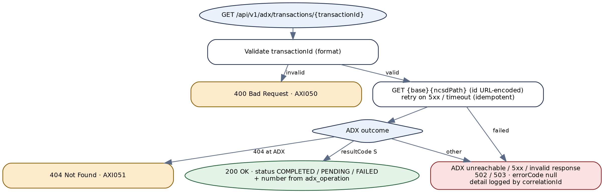

*Figure 8 — Target process flow for GET /api/v1/adx/transactions/{transactionId}*


# 10. API — Get ADX Exchange Rate


## 10.1 Endpoint summary


| Field | Detail |
|---|---|
| **Legacy service** | `ADXIntegrations.services:GetCurrencyExchangeRate` — not REST-exposed; called by the FX job (§11.3) and possibly by other packages. |
| **Target endpoint** | `GET /api/v1/adx/exchange-rates?from={ISO 4217}&to={ISO 4217}` |
| **Resource type** | Single value addressed by a currency pair. No rate → `404`. |
| **Authorization** | `adx.fx.read`. |
| **Idempotent / cacheable** | Yes / yes — `Cache-Control: max-age=300` and a 5-minute server-side cache per pair (confirm how often ADX updates the rate, Appendix E item 12). |

> **Legacy vs. target endpoint**
>
> A read of one value, so `GET` with the pair as query parameters, the same shape as the programme's `GET /api/v1/exchange-rates` in CurrencyIntegration — but under `/adx`, because this is ADX's rate, not XE's. The programme now has two FX sources; which one each consumer should use is Appendix E item 12.


## 10.2 Request schema


| Field | In | Type | Required | Rules and legacy notes |
|---|---|---|---|---|
| `from` | query | String, ISO 4217 (`^[A-Z]{3}$`) | Yes | **Legacy:** `fromCurrency`, required, length 3 (external validator); sent to ADX as `from_currency`. |
| `to` | query | String, ISO 4217 | Yes | **Legacy:** `toCurrency`, as above; sent as `to_currency`. The target also rejects `from = to`. |
| `X-Correlation-Id` | header | UUID | No | **Legacy:** `correlationID`. |


## 10.3 Business logic summary


1. Validate (§10.2). Legacy: validator failure → `checkAndThrowError` → `1069` if the validator's message starts with `1069`, otherwise `500`.
2. Read the URL from static data (`ADX_GET_CURRENCY_EXCHANGE_RATE_URL`).
3. Serialise `{from_currency, to_currency}` as the log copy, **then** add `apiKey` (global variable) to the same document, and send it as **query parameters** of a `GET`, with `Authorization: Bearer <token>` (global variable). The API key therefore appears in the URL (AF-15).
4. If the response content type is JSON: `code = R200` → `data.currency_ratio` is the rate; an empty ratio → `400 Bad Request`. Any other `code` → ADX's HTTP status — **including 200** — with `Request Failed - <errors joined by ','>` or `Unknown Error` (AF-04). A non-JSON response → `500`.
5. Finally: Seq ingestion with no explicit mapping (whatever the logging service reads from the pipeline — what it ships is NOT DETERMINABLE; the request document carrying `apiKey` and the header map carrying the bearer token are dropped right after the HTTP call, so on the normal path neither reaches it — the exposure is the key in the URL, AF-15), then `clearPipeline`.
6. **Target:** `R200` with a ratio → `200`; `R200` without one → `404` / `AXI061`; ADX business error (4xx, or non-`R200` code) → `422` / `AXI062`; technical failure → `502` / `503`.

> **Business-logic observations for the target design**
>
> **Precision.** The ratio arrives as a string and is returned as a string; the target parses it into `BigDecimal` with no rounding. (The FX job rounds it to two places before writing to eTradeFIT — AF-08, §11.3.)
>
> **No data is an error** — consistent with the API owner's CurrencyIntegration decision; legacy reported this case as `400`.


## 10.4 Sample request


```
GET /api/v1/adx/exchange-rates?from=USD&to=AED
Authorization: Bearer <token>
```

Legacy: Integration Server invoke of `services:GetCurrencyExchangeRate` with `fromCurrency=USD`, `toCurrency=AED`.


## 10.5 Response schema


| Field | Type | Description |
|---|---|---|
| correlationID, responseCode, responseMessage, errorCode, errorMsg | — | Standard envelope. Client codes `AXI060`–`AXI062`. |
| response.from, response.to | String (ISO 4217) | **New** — echo. |
| response.rate | BigDecimal (JSON number) | Units of `to` per one unit of `from`. ← ADX `data.currency_ratio`. **Legacy vs. target field format:** legacy `response.currencyExchangeRate` as a string. |
| response.source | String | **New** — always `ADX`. |
| response.retrievedAt | OffsetDateTime | **New** — when the service obtained the rate (cache-aware). |


## 10.6 HTTP status code reference


### Client input errors


| HTTP Status | Service Error Code | Description | Legacy Error Code |
|---|---|---|---|
| 400 | `AXI060` | `from` or `to` missing or not three upper-case letters, or the same currency twice. | `1069` — Middleware system validation error : … or `500` — Internal Server Error (validator-dependent) |
| 404 | `AXI061` | ADX answered `R200` but with no rate for the pair. | `400` — Bad Request |
| 422 | `AXI062` | ADX rejected the pair (HTTP 4xx, or a code other than `R200`); ADX's errors in `errorMsg`. | `<ADX HTTP status>` — `Request Failed - <ADX errors>`; **`200`** when ADX answered HTTP 200 |

> **Design decision — no rate is 404, following the programme rule**
>
> Same rule and reasoning as CurrencyIntegration `FXR015`: the request passed validation and the provider answered, but the resource asked for — a rate for that pair — does not exist there.


### Backend / provider errors


| HTTP Status | Service Error Code | Description | Legacy Error Code |
|---|---|---|---|
| 503 | `AXI901` | ADX unreachable, connection or read timeout, or the circuit breaker is open. | `500` — Internal Server Error |
| 502 | `AXI902` | ADX returned 5xx, or a non-success outcome that is not a business rejection of the caller's input. | `<ADX HTTP status>` — `Request Failed - <ADX errors>` |
| 502 | `AXI903` | ADX rejected Al Ramz's credentials (`401` / `403`). Separate from `AXI902` because it needs an operator — usually a rotated or expired key. | `<ADX HTTP status>` — `Request Failed - <ADX errors>` |
| 502 | `AXI904` | ADX returned a body that is not JSON, or JSON without the expected fields. | `500` — Internal Server Error (non-JSON content type) |
| 500 | `AXI900` | Any other unexpected error inside the service. | `500` — Internal Server Error |


## 10.7 Example target response envelopes


#### Success


```
HTTP/1.1 200 OK

{
  "correlationID": "c6a2e9f0-4d1b-4b83-9e75-0f3d8a1c6b29",
  "responseCode": "200",
  "responseMessage": "OK",
  "errorCode": null,
  "errorMsg": null,
  "response": { "from": "USD", "to": "AED", "rate": 3.6725, "source": "ADX",
    "retrievedAt": "2026-10-02T10:00:03+04:00" }
}
```


#### Client input error


```
HTTP/1.1 400 Bad Request

{
  "correlationID": "83f1c5d7-0a9e-4e62-b1d4-6c2a9f0e7b35",
  "responseCode": "400",
  "responseMessage": "Bad Request",
  "errorCode": "AXI060",
  "errorMsg": "from and to must be different ISO 4217 currency codes.",
  "response": null
}
```


#### No data


```
HTTP/1.1 404 Not Found

{
  "correlationID": "5e0b7a3d-2c6f-4918-a8e1-d9f4c0b2a657",
  "responseCode": "404",
  "responseMessage": "Not Found",
  "errorCode": "AXI061",
  "errorMsg": "ADX has no exchange rate for XAU-AED.",
  "response": null
}
```


## 10.8 Target process flow (Spring Boot)


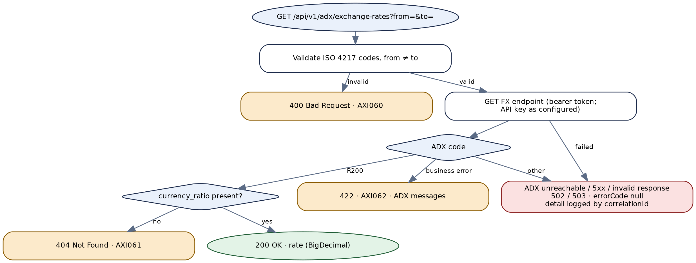

*Figure 9 — Target process flow for GET /api/v1/adx/exchange-rates*


# 11. Downstream & Internal Services


Nothing in this chapter is a public API of the target. A search of the whole export finds no caller for §11.1 or for the two jobs — but only this package was supplied, so callers in other packages, and the scheduler triggers, cannot be seen. Check Integration Server service-usage statistics before retiring anything (Appendix E item 3).


## 11.1 Legacy trading-account creation (v1) — `services:tradingAccountCreation`


> **Internal only — recommended for retirement**
>
> Calls an **older ADX API** — `POST {NIN_ADX_BASE_URL}/ds-public/createtradingaccount` with form parameters `primaryidnumber` and `subscriptionid` (`data/args`, sent URL-encoded in the POST body) and header `Adx-Subscription-Key` — that the v2 service (Chapter 7) replaced. Migrate only if usage statistics show a live caller; otherwise retire it with the two `AdxSubscription*` global variables.

| Field | Detail |
|---|---|
| **Signature** | In: `primaryIdNumber`. Out: `Message { TradingAccount, StatusMessage, StatusCode }` (ADX's body, returned as is), `responseCode`, `responseMessage`, `lastError`. |
| **Behaviour** | No validation. Calls ADX, parses the JSON and copies `Message`. If `Message` is absent → `400 Bad Request` and exit by failure (the catch keeps the code because it does not overwrite). If present, the code is set only inside a logging step: `StatusCode` `1000` or `2200` → `200`; anything else → **no `responseCode` at all** (AF-24). Logs through `commonUtility.services:logResponse` with a `pk_id` taken from a variable that is never set, and through Seq. |


### HTTP status code reference


| Legacy code | Message / meaning | Condition | Target |
|---|---|---|---|
| `200` | (no message set) | `Message.StatusCode` is `1000` or `2200` | Chapter 7 (`201`) |
| `400` | Bad Request | ADX body has no `Message` | Chapter 7 (`422` / `502`) |
| (none) | — | Any other `StatusCode` | — |
| `500` | Internal Server Error | Exception | `500` / `502` / `503` |


## 11.2 Job — ADX holdings to Quod — `services.Quod:TransferHoldingCSV`


> **Internal only — scheduled job**
>
> No input; output a `commonUtility.documents:Status` (`code`, `message_en`). Its trigger is not in the package. Target: `QuodHoldingsTransferJob`, `@Scheduled(cron = "${jobs.quod-transfer.cron}")` under ShedLock (§16.2).

1. Generate a correlation id (`pub.utils:generateUUID`) and today's date as `yyyyMMdd` (JVM default time zone). Build two file names: `ADX_Retail_Holding_<date>.csv` and `ADX_MarketMaking_Holding_<date>.csv`. **Only the first is ever used** (AF-10).
2. SFTP login with alias `Quad`, `reuseSession=true`. Non-zero return code → status `1102` with the SFTP message.
3. `cd /opt/quod/positions/Input/`. Non-zero → `1102`.
4. Call `services:GetHoldingsCSV` with `interfaceSystem=BROKER`. Not `200` → status = that service's code and message.
5. Parse and re-serialise the file through `services.Quod.utils:parseADXHoldingCSV` (§11.4), which replaces every investor name with `N/A`.
6. `sftp:put` the stream as `ADX_Retail_Holding_<date>.csv` (overwriting any file of that name). Non-zero → `1102`.
7. `sftp:logout`. Return code `0` → status `200` "ADX CPU Holdings transferred successfully to Quod system" (only if no status was set earlier). Any other logout code sets nothing — so a successful transfer whose logout fails ends with **no status code**, which the next step treats as a failure (AF-12).
8. If the status code is not `200`: read the recipient from static data `ADX_HOLDING_TRANSFER_TO_EMAIL` and send template `ADX_HOLDING_TRANSFER_FAILURE` with placeholders: file name, date, status message, `SFTP`, `ADX CPU`, `QUOD`.
9. Catch: an exception message starting `1094` → `1094` "Middleware Exception : …"; starting `1102` → `1102` "Quod Exception : …"; any other message → `1094` with the error text, also written to the server log with `pub.flow:debugLog`; only when the error text is null are the full error dump used as the message and written to the log. Then logout and the same failure e-mail — whose first placeholder refers to a variable that does not exist on this path, so it is blank (AF-12).
10. Log to Seq through `common:logReqResToSeq`.


### Outcome codes


| Legacy status code | Meaning | Target (logged; job metrics) |
|---|---|---|
| `200` | File uploaded and session closed | INFO, metric `quod_transfer_rows` |
| `1102` | Quod SFTP login, directory or upload failed (registry `1102` → `502`) | `AXI910`, ERROR, failure e-mail |
| `1094` | CSV could not be parsed, or another middleware exception (registry → `500`) | `AXI914` (parse) / `AXI900`, ERROR, failure e-mail |
| Code of `GetHoldingsCSV` | ADX holdings report unavailable | `AXI901`–`AXI904`, ERROR, failure e-mail |

> **Business-logic observations for the target design**
>
> **Market-making holdings are never sent.** The second file name is built and never used. Whether Quod should also receive the market-maker positions is Appendix E item 5.
>
> **Atomic upload.** Quod may pick the file up while it is being written. The target uploads to `<name>.part` and renames on completion.
>
> **Re-runs.** A second run on the same day overwrites the file, which is the desired behaviour; the target keeps it and logs the replacement.


## 11.3 Job — ADX exchange rates to eTradeFIT — `schedulers:updateExchangeRatesTabadulHub`


> **Internal only — scheduled job**
>
> No input or output. Trigger not in the package. Target: `ExchangeRateSyncJob` under ShedLock (§16.3).

1. Read the pair list from static data `ADX_GET_CURRENCY_EXCHANGE_RATE_PAIRS`; split on `,`, then each pair on `-`.
2. For each pair call `services:GetCurrencyExchangeRate(fromCurrency, toCurrency)`.
3. On `200` with a rate: **round to 2 decimal places** (`pub.math:roundNumber`), take today's date as `MM/dd/yyyy` (JVM time zone), and call `eTradeFIT.services.Operations:UpdateExchangeRate` with `ExchangeRate` = the rounded rate and `Currency` = **the source currency only**; the date is passed implicitly by name (`UpdDate`). Append the rate — or `<code> - <message>` if eTradeFIT failed — to a result list.
4. No rate → append `NA`; rate call failed → append `<code> - <message>`. Continue with the next pair.
5. Log the pair list and the result list to Seq with `200 OK`; on an exception, log `500` with the failing service name and error.

> **Business-logic observations for the target design**
>
> **Precision (AF-08).** Rounding to two places changes USD/AED 3.6725 to 3.67 — a 0.07% error on every converted amount in eTradeFIT. The target writes the full precision eTradeFIT can store (`jobs.exchange-rate-sync.scale`, default 6); the eTradeFIT column's precision is Appendix E item 6.
>
> **Quote currency dropped.** eTradeFIT receives only `Currency = from`; the job therefore only works if every configured pair is quoted against the same base (presumably AED). The target validates at start-up that every configured pair has the configured base currency.
>
> **Shared pipeline (verify).** `GetCurrencyExchangeRate` clears the pipeline on exit. If it clears the caller's pipeline, the job loses `fromCurrency` and its result list on every iteration (AF-09) — eTradeFIT would then receive no currency. Check the eTradeFIT rate table after a run.


## 11.4 CSV re-formatting for Quod — `services.Quod.utils:parseADXHoldingCSV`


> **Internal only**
>
> Called only by §11.2. Target: `HoldingsCsvMasker` (pure function, unit-tested).

1. `pub.flatFile:convertToValues` with schema `services.Quod.ff:HoldingCSVSch`, UTF-8, validation on.
2. If valid: loop over the records; for every record **except the first** (taken to be the header row) set `Investor Name` to `N/A`. The assignment is written against an indexed path inside the loop; whether it masks each row or only the first data row is **NOT DETERMINABLE** without a run (AF-11).
3. `convertToString` back to UTF-8 bytes; if non-empty, return a stream. Invalid or empty → throw `1094 Unable to parse ADX Holding CSV file`.

Flat-file definition (`HoldingCSVSch`, dictionary `HoldingCSVDict`, document type `HoldingCSVSchDT`, comment "ADX CPU Holdings"): delimited records with no record identifier, undefined data allowed, one record type `Holding` with 13 fields. The field names are below in the dictionary's order; the column positions are stored in an encoded form only partly readable, so the target matches columns **by header name**:

| Field | Masked for Quod? | Matching JSON field (§4.5) |
|---|---|---|
| Account Number | No | `accountNumber` |
| Available Shares | No | `availableShares` |
| Blocked Shares | No | `blockedShares` |
| Broker Code | No | `brokerCode` |
| ISIN | No | `isin` |
| Instrument Code | No | `instrumentCode` |
| Instrument Name | No | `instrumentName` |
| Investor Name | **Yes — `N/A`** | `investorName` |
| NIN | No | `nin` |
| Pending Delivery Shares | No | `pendingDeliveryShares` |
| Pending Settlement Shares | No | `pendingSettlementShares` |
| Total Shares | No | `totalShares` |
| Valid From | No | `validFrom` |


## 11.5 Java service — `java:queryNIN`


> **Internal only — dead code, do not migrate**
>
> Posts an **empty** SOAP body to an ADX IPO web-service URL hard-coded in the Java source (plain HTTP; host not reproduced here), with no credentials, and puts each response line into `Result1` in turn, so only the last line survives — while the declared output is `Result`. Errors are caught and written to `Result`. No caller exists in the package. The empty folders `java/queryBroker` and `java/submitApplication` suggest abandoned siblings.


## 11.6 Package helpers — `common:getStaticData`, `common:logReqResToSeq`


| Field | Detail |
|---|---|
| **`common:getStaticData`** | Wraps `commonUtility.services:getStaticData(application, key)`. If the call does not return `200`, or returns an empty value, exits with failure `1095 Failed to get static parameters` (the message's `%keys%` placeholder refers to a variable that does not exist). Target: replaced by validated configuration properties; a missing value stops the application from starting. |
| **`common:logReqResToSeq`** | Concatenates `requestHeader` and `requestBody` and calls `SEQDatalust.services:asynchronousIngestion`. Target: structured logging (§17.3). |


## 11.7 External services called


| Service (external package) | Used by | Contract seen in the flows | Target |
|---|---|---|---|
| `commonUtility.adapter:getADXCityCode` | NIN | In `CITY_CODE_1` (indexed); out `results[]{CITY_CODE, CITY_NAME}` | `AdxReferenceCodeService.city(code)` |
| `commonUtility.adapter:getADXCountryCode` | NIN (twice) | In `ISO3_CODE_1`; out `results[]{COUNTRY_CODE}` | `.country(iso3)` |
| `commonUtility.adapter:getADXBankCode` | NIN | In `BANK_CODE_1` (first 6 of SWIFT); out `results[]{ADX_BANK_CODE}` | `.bank(swiftPrefix)` |
| `commonUtility.string.removeSpecialChar` | NIN | `inString` → `outString`; rules not in package | Allow-list in `AdxAddressNormalizer` |
| `commonUtility.string.validatePhoneNumber` | NIN | `inString` → `outString`; rules not in package | libphonenumber → ADX format |
| `commonUtility.string.stringToObject` | Trading, margin | `inputString` → `outputObject` | Explicit `Long` / string per ADX spec |
| `commonValidator.genericValidator:validateInputList` | NIN, trading, margin, FX | `inputList[]` → `responseCode`, `responseMessage` | Bean Validation |
| `commonUtility.services:checkAndThrowError` | Trading, margin, FX | Throws `errorMessage` | Exceptions + `@ControllerAdvice` |
| `eTradeFIT.services.Operations:UpdateExchangeRate` | FX job | In `ExchangeRate`, `Currency`, (`UpdDate` implicit); out `responseCode`, `responseMessage` | `EtradeFitClient` (contract from the eTradeFIT migration) |
| `Notifications.EMail.services:sendEmail` | Quod job | `to`, `templateName`, `language`, `placeholders[]` | `NotificationClient` |
| `SEQDatalust.services:asynchronousIngestion` | Most services | Pipeline fields; `logToDatabase=Y` in the v2 services | Logging |


# 12. Data Mapping Reference


## 12.1 Investor registration — target request → ADX request body


The ADX field names are those the legacy flow writes (`v2/services/NINCreation/flow.xml`, request-body map); they are ADX's contract and must not be renamed.

| ADX field | Target source | Transform | Legacy source |
|---|---|---|---|
| `primaryIdNumber` | `primaryIdNumber` | → JSON number (`Long`) | `primaryidnumber` |
| `emiratesId` | `emiratesId` | → JSON number (`Long`) | `emiratesid` |
| `investorNameAr` / `investorNameEn` | `investorNameAr` / `investorNameEn` | — | `investorname` / `investornameenglish` |
| `clientType`, `gender`, `minor` | same | Map to ADX codes per configuration | `clienttype`, `gender`, `minor` (raw) |
| `birthDate` | `birthDate` | ISO-8601 → ADX format (to confirm) | `birthdate` (raw) |
| `citizenship` | `citizenship` | ISO alpha-3 → ADX country code | `citizenship` via `getADXCountryCode` |
| `country` | `address.country` | ISO alpha-3 → ADX country code | `country` via `getADXCountryCode` |
| `cityCode` | `address.city` | → ADX city code | `city` via `getADXCityCode` |
| `cityName` | (derived) | ADX city name from the look-up | `CITY_NAME` from the look-up |
| `provinceCode` | (derived) | = `cityCode` — legacy behaviour, confirm with ADX | `city` (mapped) |
| `provinceName` | (derived) | = `cityName` — as above | `CITY_NAME` |
| `address1`–`address3` | `address.line1`–`line3` | Character allow-list | `address1`–`address3` via `removeSpecialChar` |
| `postalCode` | `address.postalCode` | Left-pad with `0` to 5 | `postalcode`, padded |
| `poBox` | `address.postalCode` | Same value as `postalCode` — legacy behaviour | `postalcode`, padded |
| `telephoneNumber` | `telephoneNumber` | E.164 → ADX format | `telephonenumber` (raw) |
| `mobileNumber` | `mobileNumber` | E.164 → ADX format | `mobilenumber` via `validatePhoneNumber` |
| `familyId` | `familyId` | — | `familyid` |
| `passportNumber` | `passportNumber` | — | `passportnumber` |
| `email` | `email` | — | `email` |
| `bankCode` | `bank.swiftCode` | First 6 characters → ADX bank code | `bankcode` via `getADXBankCode` (only if non-blank) |
| `iban` | `bank.iban` | Upper-case, no spaces | `iban` (raw) |
| `maritalStatus` | — | Constant `Unknown` | Constant `Unknown` |


## 12.2 Normalisation rules


| Rule | Legacy | Target |
|---|---|---|
| Address characters | `commonUtility.string.removeSpecialChar` (rules not in the package) | Keep letters (any script), digits, space and `, . - / #`; collapse spaces; trim to 100. Confirm against the external helper before go-live (Appendix E item 14). |
| Mobile number | `commonUtility.string.validatePhoneNumber` (rules not in the package) | Parse with libphonenumber, region `AE`; send in the format the helper produced (capture examples from production logs). |
| Postal code | Pad left with `0` when length < 5 | Same. |
| Bank code | First 6 characters of the SWIFT/BIC | Same — the 4-letter bank code plus the 2-letter country code. |
| Unmapped reference code | Original value sent to ADX | Reject with `AXI022`. |


## 12.3 ADX balances → holdings


Field-for-field, `response.balances[]` → `holdings[]`, as listed in §4.5. `response.recordCount` → `recordCount`; `resultCode` / `resultMessage` drive the status and are not returned.


## 12.4 ADX creation responses → target


| ADX field | Operation | Target field | Legacy field |
|---|---|---|---|
| `resultCode` | All | drives status (`S` = success) | — |
| `resultMessage` | All | logged; `adxResultMessage` on status reads | — |
| `errorMessages[]` | All | `errorMsg` on `422` (sanitised, joined) | in `responseMessage` after `Request Failed - ` |
| `response.investorNumber` | Investor | `nin` | `response.NIN` |
| `response.tradingAccountNumber` | Trading account | `tradingAccountNumber` | `response.cashTradingNumber` |
| `response.marginAccountNumbers[]` | Margin account | `marginAccountNumbers[]` | `response.marginAccountNumber` (last element) |
| `response.transactionId` | All (on 202) | `transactionId` + `Location` | used internally for polling |


## 12.5 ADX exchange rate


| ADX field | Target field | Legacy field |
|---|---|---|
| `code` (`R200` = success) | drives status | — |
| `data.currency_ratio` | `rate` (`BigDecimal`) | `response.currencyExchangeRate` (string) |
| `errors[]` | `errorMsg` on `422` | in `responseMessage` after `Request Failed - ` |


# 13. Implementation Guide — Foundations


Part II tells a developer how to build `adx-integration-service`. It assumes Part I for **what** each API must do, and gives the structure, configuration, class skeletons and contracts for **how**. Method bodies are described where the logic is short and given where it is easy to get wrong.


## 13.1 Build order


| Phase | Deliverable | Done when |
|---|---|---|
| 1 | Skeleton: project (§13.2), configuration with Key Vault (§13.4), envelope and error handling (§15.3), security (§17.1), correlation id (§17.2) | A `GET /actuator/health` behind APIM returns `UP`; a request without a token is `401`. |
| 2 | `AdxClient` with WireMock contract tests built from the fixtures in §17.5 | Every ADX outcome in Chapters 4–10 has a passing test, including non-JSON bodies, `401`, timeouts. |
| 3 | Holdings JSON and CSV (Chapters 4–5) + `LegacyAdxController` | Parallel run against the legacy service shows identical holdings (§18.3). |
| 4 | Exchange rate (Chapter 10) and `ExchangeRateSyncJob` (§16.3), against an eTradeFIT stub | eTradeFIT stub receives full-precision rates for every configured pair. |
| 5 | Database, idempotency and the asynchronous creation pattern (§13.5, §13.6); transaction status (Chapter 9) | Concurrent duplicate requests with one key create one ADX call; a stubbed 202 ends in `202` + `Location`, and the status read completes it. |
| 6 | Reference codes (§14.5) and investor registration (Chapter 6); trading and margin accounts (Chapters 7–8) | All validation rules in §6.2 have tests; unmapped codes return `AXI022`. |
| 7 | `QuodHoldingsTransferJob` (§16.2) against an SFTP test container | Uploaded file has every investor name masked; partial upload never visible under the final name. |
| 8 | Observability, alerts and the `adx-stub` profile; cut-over (Chapter 18) | Dashboards and alerts in place; callers switched; IS triggers disabled. |


## 13.2 Project structure


One Maven module; packages by feature, with the ADX client and the jobs separated so the integration layer can be tested on its own.

```
adx-integration-service/
├── pom.xml
└── src/main/java/ae/alramz/adx/
    ├── AdxIntegrationApplication.java
    ├── config/            AdxProperties, JobProperties, RestClientConfig, SecurityConfig,
    │                      SchedulingConfig (ShedLock), CacheConfig
    ├── common/            ApiResponse, ErrorCodes, ApiException, GlobalExceptionHandler,
    │                      CorrelationIdFilter, OperationResult, MaskingConverter
    ├── adx/               AdxClient, AdxInterfaceSystem, AdxOutcome, AdxErrorDecoder,
    │   └── dto/           AdxBalancesResponse, AdxCreateInvestorRequest, AdxCreateResponse,
    │                      AdxStatusResponse, AdxFxResponse
    ├── reference/         AdxReferenceCodeService, ReferenceCodeRepository
    ├── holdings/          HoldingsController, HoldingsService, HoldingDto, HoldingsCsvStreamer
    ├── investor/          InvestorController, InvestorService, InvestorRegistrationRequest,
    │                      AdxInvestorMapper, AdxAddressNormalizer
    ├── operation/         PendingOperationService, AdxOperation (entity), AdxOperationRepository,
    │                      IdempotencyService
    ├── transaction/       TransactionController, TransactionStatusService
    ├── fx/                ExchangeRateController, ExchangeRateService
    ├── legacy/            LegacyAdxController (removed after cut-over)
    └── jobs/              QuodHoldingsTransferJob, HoldingsCsvMasker, QuodSftpClient,
                           ExchangeRateSyncJob, EtradeFitClient, NotificationClient
src/main/resources/  application.yml, application-adx-stub.yml, db/migration/V1__adx_operation.sql,
                     V2__shedlock.sql, logback-spring.xml
src/test/resources/adx-fixtures/   one JSON (or CSV) file per ADX outcome — see §17.5
```


## 13.3 Dependencies


```
<parent>org.springframework.boot:spring-boot-starter-parent:3.3.x</parent>
<properties><java.version>21</java.version></properties>

spring-boot-starter-web                 spring-boot-starter-validation
spring-boot-starter-security            spring-boot-starter-oauth2-resource-server
spring-boot-starter-actuator            spring-boot-starter-data-jdbc
spring-boot-starter-cache               com.github.ben-manes.caffeine:caffeine
org.postgresql:postgresql               org.flywaydb:flyway-core, flyway-database-postgresql
io.github.resilience4j:resilience4j-spring-boot3
net.javacrumbs.shedlock:shedlock-spring, shedlock-provider-jdbc-template
com.azure.spring:spring-cloud-azure-starter-keyvault-secrets
com.hierynomus:sshj                     org.apache.commons:commons-csv
com.googlecode.libphonenumber:libphonenumber
net.logstash.logback:logstash-logback-encoder   io.micrometer:micrometer-registry-azure-monitor

test: spring-boot-starter-test, org.wiremock:wiremock-standalone,
      org.testcontainers:postgresql, org.testcontainers:junit-jupiter,
      (SFTP) atmoz/sftp image via GenericContainer, com.tngtech.archunit:archunit-junit5
```


## 13.4 Configuration


Every legacy static-data key and global variable has a property. Secrets come from Key Vault through the Spring Cloud Azure property source; nothing secret is in `application.yml`.

```
spring:
  cloud.azure.keyvault.secret.property-sources[0]:
    endpoint: ${KEY_VAULT_URI}
  datasource: { url: ${DB_URL}, username: ${DB_USER}, password: ${db-password} }   # db-password from Key Vault
  security.oauth2.resourceserver.jwt.issuer-uri: ${OAUTH_ISSUER}

app.zone: Asia/Dubai

adx:
  base-url: https://<adx-gateway-host>               # was ADX_BASE_URL
  paths:
    balances: <path>                                  # ADX_BALANCES_PATH
    balances-report: <path>                           # ADX_BALANCES_REPORT_PATH
    create-investor: <path>                           # ADX_CRNIN_PATH
    create-trading-account: <path>                    # ADX_CRTRDACC_PATH
    create-margin-account: <path>                     # ADX_CREATE_MARGIN_ACCOUNT_PATH
    transaction-status: <path with {transactionId}>   # ADX_NCSD_PATH, %transactionid% -> {transactionId}
  api-keys:
    broker: ${adx-broker-api-key}                     # KEY_ADX_BROKER_APIKEY
    market-maker: ${adx-market-maker-api-key}         # KEY_ADX_MARKET_MAKER_APIKEY
  fx:
    url: https://<fx-endpoint>                        # ADX_GET_CURRENCY_EXCHANGE_RATE_URL
    bearer-token: ${adx-fx-bearer-token}              # ADX_CURRENCY_EXCHANGE_RATE_BEARER_TOKEN
    api-key: ${adx-fx-api-key}                        # ADX_CURRENCY_EXCHANGE_RATE_API_KEY
    cache-ttl: PT5M
  http: { connect-timeout: PT3S, read-timeout: PT20S, report-read-timeout: PT60S }
  async: { max-polls: 2, poll-interval: PT15S }      # legacy RETRY count=2, back-off 15 s
  codes:                                              # ADX value lists - to be confirmed (Appendix E)
    client-types: [ ... ]
    genders: [ ... ]

jobs:
  quod-transfer:
    enabled: true
    cron: "0 30 6 * * MON-FRI"                        # placeholder - real trigger not in package
    interface-system: BROKER
    remote-directory: /opt/quod/positions/Input/
    file-name-pattern: ADX_Retail_Holding_{yyyyMMdd}.csv
    failure-recipients: [ ... ]                       # ADX_HOLDING_TRANSFER_TO_EMAIL
  exchange-rate-sync:
    enabled: true
    cron: "0 0 7 * * *"                               # placeholder
    base-currency: AED
    pairs: [ USD-AED, EUR-AED ]                       # ADX_GET_CURRENCY_EXCHANGE_RATE_PAIRS
    scale: 6

quod.sftp: { host: <host>, port: 22, username: <user>, private-key: ${quod-sftp-private-key},
             known-hosts: ${quod-sftp-known-hosts}, connect-timeout: PT10S }
etradefit: { base-url: <url>, ... }                   # from the eTradeFIT migration
notifications: { base-url: <url>, failure-template: ADX_HOLDING_TRANSFER_FAILURE }
```

```
@Validated
@ConfigurationProperties(prefix = "adx")
public record AdxProperties(
        @NotNull @Pattern(regexp = "https://.+") URI baseUrl,
        @Valid @NotNull Paths paths,
        @Valid @NotNull ApiKeys apiKeys,
        @Valid @NotNull Fx fx,
        @Valid @NotNull Http http,
        @Valid @NotNull Async async,
        @Valid @NotNull Codes codes) {
    public record Paths(@NotBlank String balances, @NotBlank String balancesReport,
                        @NotBlank String createInvestor, @NotBlank String createTradingAccount,
                        @NotBlank String createMarginAccount,
                        @NotBlank @Pattern(regexp = ".*\\{transactionId}.*") String transactionStatus) {}
    public record ApiKeys(@NotBlank String broker, @NotBlank String marketMaker) {
        public String forSystem(AdxInterfaceSystem s) { return s == AdxInterfaceSystem.BROKER ? broker : marketMaker; }
        @Override public String toString() { return "ApiKeys[****]"; }   // never print keys
    }
    // Fx, Http, Async, Codes: same pattern
}
```

> **Why validation at start-up matters here**
>
> Legacy reads each URL from the static-data store on every request; a missing key surfaces as a customer-facing `500` (the `1095` path in §11.6). With `@Validated` properties a missing or non-HTTPS URL stops the deployment instead.


## 13.5 Database


The service owns two tables in its own schema on Azure Database for PostgreSQL (the programme's database choice from CoreDataProvider): `adx_operation` for idempotency and pending ADX operations, and the standard ShedLock table. It writes nothing to Broker Insight. DDL is in Appendix C; Flyway migrations `V1__adx_operation.sql` and `V2__shedlock.sql` create them.

| Column | Purpose |
|---|---|
| `idempotency_key` (PK) | The caller's `Idempotency-Key`. |
| `request_hash` | SHA-256 of the canonical request body; a different body with the same key → `409` / `AXI024`. |
| `operation_type` | `CREATE_INVESTOR`, `CREATE_TRADING_ACCOUNT`, `CREATE_MARGIN_ACCOUNT`. |
| `investor_number` | Path parameter for account operations. |
| `state` | `IN_PROGRESS` → `COMPLETED` / `PENDING` → `COMPLETED` / `FAILED`. |
| `adx_transaction_id` | From ADX's `202`; unique when present; key for Chapter 9. |
| `result_numbers` | NIN or account numbers (JSON array). |
| `response_status`, `response_body` | The response returned to the caller, replayed for a repeated key. |
| `created_at`, `updated_at`, `expires_at` | Retention: keys expire after 30 days (configurable). |


## 13.6 The asynchronous creation pattern


Chapters 6–8 share one algorithm, implemented once in `PendingOperationService`. It replaces the legacy `RETRY` + `getStatus` block, which blocked the caller for about 30 seconds and then answered `400` while ADX might still complete (AF-05).

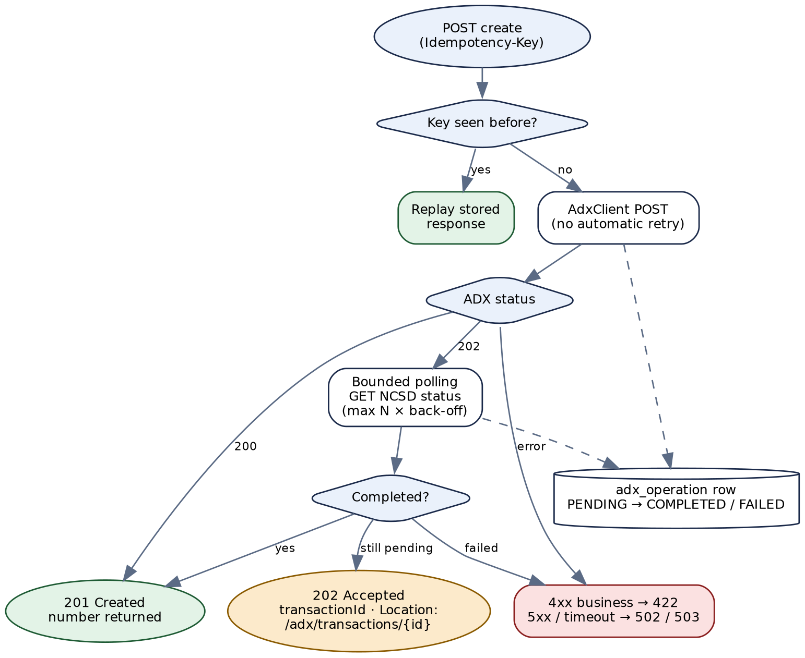

*Figure 10 — Asynchronous creation pattern shared by Chapters 6–8*

1. **Claim the key.** `INSERT … ON CONFLICT (idempotency_key) DO NOTHING RETURNING …`. If the row already exists: same `request_hash` → replay `response_status` / `response_body` (or, while `IN_PROGRESS`, return `409` with `Retry-After: 2` — a concurrent duplicate); different hash → `409` / `AXI024`.
2. **Call ADX once.** No automatic retry on the `POST`: a timeout after ADX received the request is indistinguishable from one before, and a retry could create a second investor or account. On a timeout, mark the row `FAILED` with `AXI901` and return `503`; the caller must check the investor's state before trying again with a **new** key (the response says so).
3. **ADX 200 + `S`** → `COMPLETED`, store the number(s), return `201`.
4. **ADX 202** → store `adx_transaction_id` and any number already present in the 202 body, state `PENDING`; poll `GET` status up to `adx.async.max-polls` times, `poll-interval` apart (defaults reproduce legacy: 2 × 15 s). On `COMPLETED` → `201`; on `FAILED` → `422` with ADX's messages; still pending → `202` with `transactionId` and `Location`.
5. **ADX rejection** (4xx or `resultCode` ≠ `S`) → `FAILED`, `422` with the API's business code (`AXI023` / `AXI031` / `AXI041`). **ADX 5xx / invalid body** → `FAILED`, `502`.
6. **Later status reads** (Chapter 9) update the row and return the stored number(s) once ADX reports completion.

> **Design decision — keep a short synchronous wait**
>
> Returning `202` immediately would be simpler, but every current caller expects a number in the response. The bounded wait keeps that behaviour for the common case and bounds the worst case. Set `max-polls: 0` to switch to pure asynchronous behaviour once callers handle `202` (Appendix E item 15).
>
> **Request threads.** A 30-second wait ties up a servlet thread. Run the service on Java 21 virtual threads (`spring.threads.virtual.enabled=true`) so waiting requests do not exhaust the pool.

```
public interface PendingOperationService {
    /** Runs the whole pattern for one creation; never retries the ADX POST. */
    <R> CreationResult<R> execute(String idempotencyKey, OperationType type, Object canonicalRequest,
                                  Supplier<AdxOutcome<R>> adxCall,
                                  Function<R, List<String>> numbersOf);
}
public record CreationResult<R>(CreationState state, List<String> numbers, String transactionId,
                                List<String> adxMessages, String failureCode) {}
public enum CreationState { COMPLETED, PENDING, REJECTED, FAILED, REPLAYED }
```


# 14. Implementation Guide — ADX Integration Layer


## 14.1 AdxClient


One class owns every call to ADX. It is the only place that knows the base URL, the paths, the API keys, the timeouts and how ADX reports errors.

```
@Configuration
class RestClientConfig {
    @Bean RestClient adxRestClient(RestClient.Builder b, AdxProperties p) {
        var rf = new JdkClientHttpRequestFactory(HttpClient.newBuilder()
                .connectTimeout(p.http().connectTimeout()).build());
        rf.setReadTimeout(p.http().readTimeout());
        return b.baseUrl(p.baseUrl().toString())
                .requestFactory(rf)
                .defaultHeader(HttpHeaders.CONTENT_TYPE, MediaType.APPLICATION_JSON_VALUE)
                .requestInterceptor(new CorrelationIdPropagator())   // X-Correlation-Id downstream
                .requestInterceptor(new AdxCallMetrics())            // timer per operation + status
                .build();                                           // NO body/header logging interceptor
    }
}

@Component
public class AdxClient {
    AdxOutcome<AdxBalancesResponse> getBalances(AdxInterfaceSystem system);          // §4
    void streamBalancesReport(AdxInterfaceSystem system, ReportSink sink);         // §5
    AdxOutcome<AdxCreateResponse> createInvestor(AdxCreateInvestorRequest body);     // §6
    AdxOutcome<AdxCreateResponse> createTradingAccount(long investorNumber);        // §7
    AdxOutcome<AdxCreateResponse> createMarginAccount(long investorNumber);         // §8
    AdxOutcome<AdxStatusResponse> getTransactionStatus(String transactionId);       // §9
    AdxOutcome<AdxFxResponse> getExchangeRate(String from, String to);              // §10
}
```

Each method sets the header `adx-Gateway-APIKey` per call from `AdxProperties.apiKeys().forSystem(...)` — `BROKER` for every operation except market-maker holdings — and uses URI templates, so a transaction id is encoded as a path segment (AF-13).


## 14.2 Decoding ADX responses


ADX answers in three shapes, all handled by `AdxErrorDecoder` so no controller ever sees raw HTTP:

| ADX answer | Detected by | AdxOutcome |
|---|---|---|
| `200` (or `202`) JSON with `resultCode = "S"` | status + body | `Completed` (or `Accepted` with `response.transactionId`) |
| `200` JSON with `resultCode` ≠ `S` | body | `Rejected(200, errorMessages + resultMessage)` — **never** a success (AF-04) |
| `4xx` JSON with `errorMessages[]` | status | `Rejected(status, errorMessages)`; `401`/`403` → exception `AXI903` instead |
| `5xx` | status | exception `AXI902` |
| Body not JSON (any status) | `Content-Type` not `application/json` (parameters ignored, case-insensitive) or parse failure | exception `AXI904` — legacy compared six spellings of the header by hand |
| I/O error, timeout | `ResourceAccessException` | exception `AXI901` |
| FX endpoint | `code = "R200"` instead of `resultCode = "S"`; errors in `errors[]` | Same mapping with the FX field names |

```
// ADX's common envelope, as read by the legacy flows
@JsonIgnoreProperties(ignoreUnknown = true)
public record AdxEnvelope<T>(String resultCode, String resultMessage, List<String> errorMessages, T response) {}

public record AdxBalancesResponse(Integer recordCount, List<AdxBalance> balances) {}
public record AdxBalance(String nin, String investorName, String brokerCode, String accountNumber,
        String instrumentCode, String instrumentName, String isin, BigDecimal totalShares,
        BigDecimal availableShares, BigDecimal pendingDeliveryShares, BigDecimal blockedShares,
        BigDecimal pendingSettlementShares, String validFrom) {}

public record AdxCreateResponse(JsonNode investorNumber, JsonNode tradingAccountNumber,
        List<JsonNode> marginAccountNumbers, String transactionId) {}   // numbers may be JSON numbers

public record AdxFxResponse(String code, AdxFxData data, List<String> errors) {}
public record AdxFxData(String currency_ratio) {}
```


## 14.3 Resilience policy per call


| Call | Timeout (read) | Retry | Circuit breaker | Why |
|---|---|---|---|---|
| Balances (JSON) | 20 s | 2 retries, 500 ms × 2 back-off, on I/O error and `502`/`503`/`504` only | `adx` | Idempotent read. |
| Balances report (CSV) | 60 s | As above, only before the first byte is streamed to the client | `adx` | Large body. |
| Create investor / trading / margin | 20 s | **None** | `adx-write` (separate, so reads keep working if writes trip it) | Not idempotent at ADX (§13.6). |
| Transaction status | 10 s | 2 retries as for balances | `adx` | Idempotent read. |
| Exchange rate | 10 s | 2 retries as for balances | `adx-fx` | Separate host and credentials. |

```
resilience4j:
  retry.instances.adx-read: { max-attempts: 3, wait-duration: 500ms, enable-exponential-backoff: true,
                              retry-exceptions: [ae.alramz.adx.adx.AdxTransientException] }
  circuitbreaker.instances:
    adx:       { sliding-window-size: 20, failure-rate-threshold: 50, wait-duration-in-open-state: 30s }
    adx-write: { sliding-window-size: 10, failure-rate-threshold: 50, wait-duration-in-open-state: 60s }
    adx-fx:    { sliding-window-size: 20, failure-rate-threshold: 50, wait-duration-in-open-state: 30s }
  bulkhead.instances.adx-write: { max-concurrent-calls: 10 }
```


## 14.4 The exchange-rate call


The FX endpoint differs from the rest of ADX: its own URL, `Authorization: Bearer <token>`, and an `apiKey` query parameter. Send the query parameters `from_currency`, `to_currency` and `apiKey` exactly as legacy does, but ask ADX whether the key can travel in a header (AF-15); until then, exclude the query string from access logs and from the `http.client.requests` metric URI tag (use the URI template). Cache results per pair for `adx.fx.cache-ttl` with Caffeine.


## 14.5 Reference codes


The three legacy look-ups come from `commonUtility` adapters whose tables and SQL are **not in this package**. Until the `commonUtility` extraction names them, `ReferenceCodeRepository` is an interface with one JDBC implementation to be completed from that package (Appendix E item 13). Results are cached for a day; a cache miss on a value that does not map is `AXI022`, a database failure `AXI913`.

```
public interface ReferenceCodeRepository {
    Optional<AdxCity> findCity(String alRamzCityCode);           // was getADXCityCode: CITY_CODE, CITY_NAME
    Optional<String>  findCountry(String iso3);                   // was getADXCountryCode: COUNTRY_CODE
    Optional<String>  findBank(String swiftPrefix6);              // was getADXBankCode: ADX_BANK_CODE
}
public record AdxCity(String adxCityCode, String adxCityName) {}

@Service
class AdxReferenceCodeService {
    @Cacheable("adx-city")    public Optional<AdxCity> city(String code)    { ... }
    @Cacheable("adx-country") public Optional<String>  country(String iso3) { ... }
    @Cacheable("adx-bank")    public Optional<String>  bank(String swift)   { return repo.findBank(swift.substring(0, 6)); }
}
```

> **More than one row**
>
> Legacy takes the first row of each look-up without ordering. The repository must return exactly one value per key; if the underlying table can hold several (for example two ADX city codes for one Al Ramz city), the query must say which wins — decide with the table owner rather than reproducing "first row".


# 15. Implementation Guide — API Layer


## 15.1 Controllers


```
@RestController @RequestMapping("/api/v1/adx/holdings") @Validated
class HoldingsController {
    @GetMapping(produces = MediaType.APPLICATION_JSON_VALUE)
    @PreAuthorize("@scopes.canReadHoldings(#interfaceSystem)")
    ApiResponse<HoldingsDto> holdings(@RequestParam @NotNull AdxInterfaceSystem interfaceSystem) {
        return ApiResponse.ok(service.getHoldings(interfaceSystem));       // 404 AXI002 thrown if empty
    }

    @GetMapping(path = "/report", produces = "text/csv")
    @PreAuthorize("@scopes.canReadHoldings(#interfaceSystem)")
    ResponseEntity<StreamingResponseBody> report(@RequestParam @NotNull AdxInterfaceSystem interfaceSystem) {
        // 1. open the ADX stream and read header + first data line (throws AXI011 if none)
        // 2. only then commit 200 + Content-Disposition, and stream the rest with a 64 KiB buffer
        ReportStream rs = service.openReport(interfaceSystem);
        return ResponseEntity.ok()
                .header(HttpHeaders.CONTENT_DISPOSITION, rs.contentDisposition())
                .contentType(MediaType.parseMediaType("text/csv; charset=UTF-8"))
                .body(rs::transferTo);
    }
}

@RestController @RequestMapping("/api/v1/adx/investors") @Validated
class InvestorController {
    @PostMapping
    ResponseEntity<ApiResponse<InvestorCreatedDto>> register(
            @RequestHeader("Idempotency-Key") @NotNull UUID key,
            @Valid @RequestBody InvestorRegistrationRequest body) { ... }   // 201 / 202 + Location

    @PostMapping("/{investorNumber}/trading-accounts")
    ResponseEntity<ApiResponse<TradingAccountDto>> openTrading(
            @RequestHeader("Idempotency-Key") @NotNull UUID key,
            @PathVariable @Pattern(regexp = "\\d{1,20}") String investorNumber) { ... }

    @PostMapping("/{investorNumber}/margin-accounts")
    ResponseEntity<ApiResponse<MarginAccountDto>> openMargin(...) { ... }
}

@RestController @RequestMapping("/api/v1/adx/transactions")
class TransactionController {
    @GetMapping("/{transactionId}")
    ApiResponse<TransactionStatusDto> get(@PathVariable @Pattern(regexp = "[A-Za-z0-9-]{1,64}") String transactionId) { ... }
}

@RestController @RequestMapping("/api/v1/adx/exchange-rates")
class ExchangeRateController {
    @GetMapping
    ApiResponse<ExchangeRateDto> get(@RequestParam @Pattern(regexp = "[A-Z]{3}") String from,
                                     @RequestParam @Pattern(regexp = "[A-Z]{3}") String to) { ... }
}
```


## 15.2 Request records


```
public record InvestorRegistrationRequest(
        @NotBlank @Pattern(regexp = "\\d{1,18}")        String primaryIdNumber,
        @Pattern(regexp = "784\\d{12}")                 String emiratesId,
        @Size(max = 20) @Pattern(regexp = "[A-Za-z0-9]*") String passportNumber,
        @NotBlank @Size(max = 150)                       String investorNameAr,
        @NotBlank @Size(max = 150)                       String investorNameEn,
        @NotBlank @AllowedCode("client-types")          String clientType,
        @NotBlank @AllowedCode("genders")               String gender,
        @NotNull                                          Boolean minor,
        @NotNull @Past                                    LocalDate birthDate,
        @NotBlank @Pattern(regexp = "[A-Z]{3}")          String citizenship,
        @Valid @NotNull                                   Address address,
        @NotBlank @E164                                   String mobileNumber,
        @E164                                             String telephoneNumber,
        @Email                                            String email,
        @Size(max = 30)                                   String familyId,
        @Valid                                            Bank bank) {
    public record Address(@NotBlank String city, @NotBlank @Size(max = 100) String line1,
            @Size(max = 100) String line2, @Size(max = 100) String line3,
            @Pattern(regexp = "\\d{1,10}") String postalCode, @NotBlank @Pattern(regexp = "[A-Z]{3}") String country) {}
    public record Bank(@Pattern(regexp = "[A-Z]{6}[A-Z0-9]{2}([A-Z0-9]{3})?") String swiftCode, @Iban String iban) {}
}
// @AllowedCode, @E164, @Iban: small custom constraints (config-backed list, libphonenumber, mod-97 check).
// A class-level constraint makes iban required when swiftCode is present, and emiratesId when citizenship = ARE.
```

Missing field → `AXI020`; failed rule → `AXI021`. The `GlobalExceptionHandler` turns `MethodArgumentNotValidException` into one envelope whose `errorMsg` lists every failing field (`field: message; …`), so callers see all problems at once.


## 15.3 Envelope and error handling


```
public record ApiResponse<T>(String correlationID, String responseCode, String responseMessage,
                             String errorCode, String errorMsg, T response) {
    static <T> ApiResponse<T> ok(T body) { ... }           // fills correlationID from MDC
}

public class ApiException extends RuntimeException {      // carries status + AXI code
    private final HttpStatus status; private final ErrorCode code; private final boolean clientFacing;
}

@RestControllerAdvice
class GlobalExceptionHandler {
    // ApiException(clientFacing=true)  -> status, errorCode, errorMsg
    // ApiException(clientFacing=false) -> status, errorCode=null, errorMsg=null; log code + detail
    // MethodArgumentNotValidException  -> 400 AXI020/AXI021 (per API block)
    // CallNotPermittedException (CB)   -> 503 AXI901 (not exposed)
    // anything else                    -> 500 AXI900 (not exposed)
}
```

`ErrorCode` is an enum holding every code in Appendix D with its HTTP status and default message, so the catalogue, the tables in Part I and the code cannot drift apart: a unit test asserts the enum matches Appendix D.


## 15.4 Legacy compatibility controller


`LegacyAdxController` serves `GET /adxintegration/v1/getHoldingsJSON` and `/getHoldingsCSV` (APIM rewrites them to `/legacy/...`) and renders the legacy body: transport `200`, `responseCode` / `responseMessage` strings, `response.holdings[]` with the legacy field names, and for the CSV the raw bytes as `application/octet-stream`. Map target outcomes back: `AXI001`/`AXI010` → `1069` with the legacy message; ADX failures → `1094` with ADX's messages; anything else → `500 Internal Server Error`. Remove the controller and the APIM rewrite once the access log shows no traffic for 30 days.


# 16. Implementation Guide — Scheduled Jobs


## 16.1 Scheduling infrastructure


```
@Configuration @EnableScheduling
@EnableSchedulerLock(defaultLockAtMostFor = "PT30M")
class SchedulingConfig {
    @Bean LockProvider lockProvider(DataSource ds) {
        return new JdbcTemplateLockProvider(JdbcTemplateLockProvider.Configuration.builder()
                .withJdbcTemplate(new JdbcTemplate(ds)).usingDbTime().build());
    }
}
```

Each job is `@ConditionalOnProperty("jobs.<name>.enabled")`, takes its cron from configuration with `zone = "${app.zone}"`, and records a run summary (start, end, outcome, counts) in the log and as metrics. The legacy trigger times are not in the package; the crons in §13.4 are placeholders until operations confirm them (Appendix E item 4). Both jobs can also be started on demand through an admin endpoint (`POST /admin/jobs/{name}/runs`, scope `adx.admin`), replacing the Integration Server "run now".


## 16.2 QuodHoldingsTransferJob


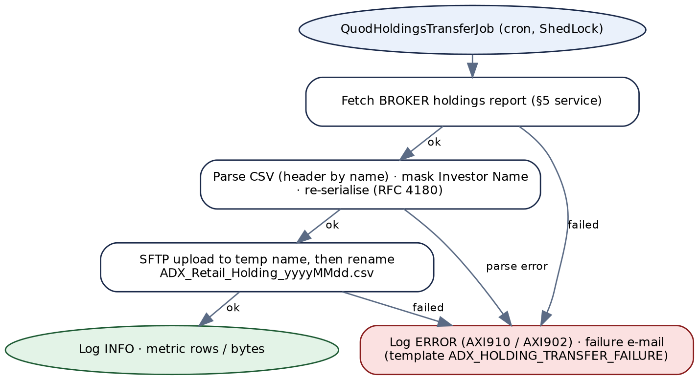

*Figure 11 — Target flow of the Quod holdings transfer job*

```
@Component @ConditionalOnProperty("jobs.quod-transfer.enabled")
class QuodHoldingsTransferJob {
    @Scheduled(cron = "${jobs.quod-transfer.cron}", zone = "${app.zone}")
    @SchedulerLock(name = "quod-holdings-transfer", lockAtMostFor = "PT20M")
    void run() {
        var date = LocalDate.now(zone);
        var fileName = props.fileName(date);                      // ADX_Retail_Holding_yyyyMMdd.csv
        try (var report = holdings.openReport(props.interfaceSystem());   // same path as Chapter 5
             var masked = masker.mask(report.inputStream())) {             // HoldingsCsvMasker
            sftp.uploadAtomically(props.remoteDirectory(), fileName, masked);  // .part then rename
            log.info("quod transfer ok file={} rows={}", fileName, masked.rowCount());
        } catch (ApiException | IOException e) {
            log.error("quod transfer failed code={} file={}", codeOf(e), fileName, e);
            notifications.send(props.failureTemplate(), props.failureRecipients(),
                    List.of(fileName, date.toString(), messageOf(e), "SFTP", "ADX CPU", "QUOD"));
            throw e;                                              // marks the run failed (metric + alert)
        }
    }
}
```

| Component | Specification |
|---|---|
| `HoldingsCsvMasker` | Commons CSV, `CSVFormat.RFC4180` with header; finds the column named `Investor Name` (case-insensitive; fails with `AXI914` if absent); writes every data row with that column set to `N/A` and every other column unchanged; preserves column order and the header. Unit tests: header kept, all rows masked, quoted commas survive, empty file → `AXI011` before any upload. |
| `QuodSftpClient` | sshj; host-key verification against `known-hosts` (never "accept any"); key authentication; connect timeout; `put` to `<name>.part`, then `rename` to `<name>` (overwriting an earlier file of the same day); always disconnect in `finally`. Errors → `AXI910`. |
| Failure e-mail | Template `ADX_HOLDING_TRANSFER_FAILURE`, the six positional placeholders of §11.2 — all filled on every path (legacy left the first one blank on exceptions). |
| Market-making file | Not sent, as today. If Appendix E item 5 says it should be, add a second iteration with `MARKET_MAKER` and the second file-name pattern. |


## 16.3 ExchangeRateSyncJob


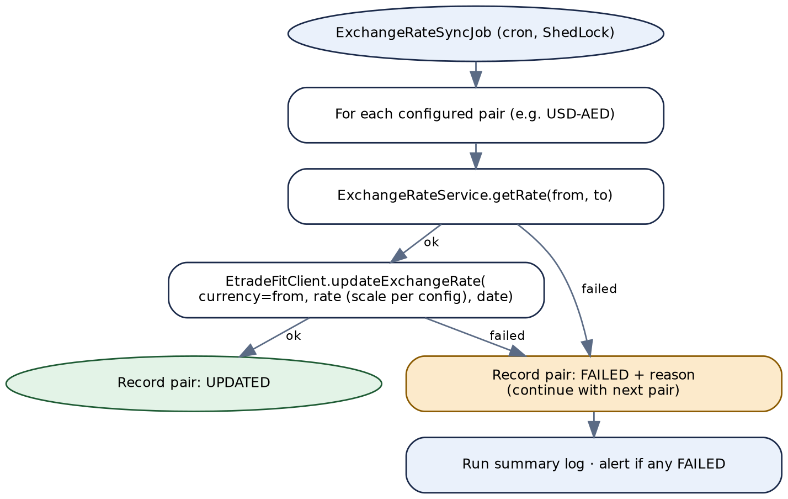

*Figure 12 — Target flow of the exchange-rate synchronisation job*

```
@Scheduled(cron = "${jobs.exchange-rate-sync.cron}", zone = "${app.zone}")
@SchedulerLock(name = "exchange-rate-sync", lockAtMostFor = "PT10M")
void run() {
    var results = new ArrayList<PairResult>();
    for (CurrencyPair pair : props.pairs()) {                    // validated at start-up: quote == base-currency
        try {
            BigDecimal rate = fx.getRate(pair.from(), pair.to())   // Chapter 10 service, uncached for the job
                                .setScale(props.scale(), RoundingMode.HALF_UP);
            etradeFit.updateExchangeRate(pair.from(), rate, LocalDate.now(zone));
            results.add(PairResult.updated(pair, rate));
        } catch (ApiException e) {
            results.add(PairResult.failed(pair, e.code()));         // continue with next pair
        }
    }
    log.info("fx sync summary {}", results);                      // metric per outcome
    if (results.stream().anyMatch(PairResult::failed)) alerts.raise("fx-sync-partial-failure");
}
```

`EtradeFitClient.updateExchangeRate(currency, rate, date)` replaces the Integration Server call to `eTradeFIT.services.Operations:UpdateExchangeRate`. Its transport (REST or database procedure) and exact field formats come from the eTradeFIT migration; the legacy inputs are `Currency`, `ExchangeRate` and `UpdDate` (`MM/dd/yyyy`). Until eTradeFIT is migrated, the client calls the existing Integration Server service over its REST invoke URL with a technical user. eTradeFIT failures are `AXI912`.


# 17. Implementation Guide — Cross-cutting Concerns


## 17.1 Security


```
@Bean SecurityFilterChain api(HttpSecurity http) throws Exception {
    return http.csrf(c -> c.disable())
        .sessionManagement(s -> s.sessionCreationPolicy(STATELESS))
        .authorizeHttpRequests(a -> a
            .requestMatchers(GET,  "/api/v1/adx/holdings/**").hasAuthority("SCOPE_adx.holdings.read")
            .requestMatchers(POST, "/api/v1/adx/investors/**").hasAuthority("SCOPE_adx.investors.write")
            .requestMatchers(GET,  "/api/v1/adx/transactions/**").hasAuthority("SCOPE_adx.transactions.read")
            .requestMatchers(GET,  "/api/v1/adx/exchange-rates").hasAuthority("SCOPE_adx.fx.read")
            .requestMatchers("/admin/**").hasAuthority("SCOPE_adx.admin")
            .requestMatchers("/actuator/health/**").permitAll()
            .anyRequest().denyAll())
        .oauth2ResourceServer(o -> o.jwt(Customizer.withDefaults()))
        .build();
}
// MARKET_MAKER holdings additionally require SCOPE_adx.holdings.read.market-maker (@PreAuthorize, §15.1).
```


## 17.2 Correlation id


`CorrelationIdFilter` reads `X-Correlation-Id` (or generates a UUID), puts it in the MDC and the response header, and `CorrelationIdPropagator` forwards it to ADX, eTradeFIT and the notification service. Jobs create one id per run and one child id per pair or file.


## 17.3 Logging and masking


| Event | Logged | Never logged |
|---|---|---|
| Inbound request | method, path template, interface system, correlation id, caller (client id from the token) | request body |
| ADX call | operation, HTTP status, `resultCode`, duration, record count, transaction id | headers (API key), request body (identity data), response body |
| ADX rejection | `errorMessages` (they describe the request, not the person — review with compliance) | the request that caused it |
| Job run | summary: files, rows, pairs, outcomes | file content, investor names, NINs |

A Logback `MaskingConverter` additionally blanks values of fields named like `apiKey`, `adx-Gateway-APIKey`, `Authorization`, `iban`, `emiratesId`, `passportNumber`, `nin`, `mobileNumber`, `email` wherever they appear in a log message — a safety net, not the primary control. This replaces both legacy behaviours: the clear-text key in the holdings logs (AF-01) and the full identity record in the NIN logs (AF-02).


## 17.4 Observability


| Metric | Type / tags | Alert |
|---|---|---|
| `adx_call_seconds` | timer; `operation`, `outcome` (`completed`/`accepted`/`rejected`/`error`) | p95 > 10 s for 10 min |
| `adx_errors_total` | counter; `code` (`AXI901`…`AXI904`) | `AXI903` > 0 (credentials) — page; others rate-based |
| `adx_pending_operations` | gauge; `operation_type` | any older than 1 hour |
| `job_run_total` | counter; `job`, `outcome` | any `failed`; no successful run within the expected window |
| `fx_sync_pairs_total` | counter; `outcome` | any `failed` |
| `quod_transfer_rows` | gauge | 0 rows (would also raise `AXI011`) |


## 17.5 Testing


| Level | What | How |
|---|---|---|
| Unit | Mappers (§12), normalisers, `HoldingsCsvMasker`, `AdxErrorDecoder`, ADX code mapping, status derivation, the `ErrorCode` ↔ Appendix D check | JUnit 5; table-driven tests with one case per row of Chapter 12 and §14.2 |
| Contract (ADX) | `AdxClient` against WireMock, one fixture per outcome: `balances-ok.json`, `balances-empty.json`, `balances-resultcode-F.json`, `balances-401.json`, `html-error-page.html`, `report-ok.csv`, `report-header-only.csv`, `create-200.json`, `create-202.json`, `create-400-errors.json`, `create-200-resultcode-F.json`, `status-success.json`, `status-pending.json`, `fx-r200.json`, `fx-r200-empty.json`, `fx-error.json`, plus a delayed response for timeouts | Fixtures are invented until real ones are captured — capturing one sanitised response per endpoint from UAT is the first task of phase 2 (Appendix E item 8) |
| Integration | Idempotency under concurrency, pending-operation life cycle, ShedLock | Testcontainers PostgreSQL; two threads posting the same key |
| SFTP | Atomic upload, host-key rejection, failure path and e-mail | Testcontainers with an SFTP image; a stub notification endpoint |
| Architecture | Controllers never call `AdxClient` directly; only `adx` package uses `RestClient`; no logging of `HttpHeaders` | ArchUnit |
| Stub profile | `adx-stub` runs WireMock in-process with the fixtures, for UAT environments without ADX — **replacing the legacy `environment=UAT` mock branch** (AF-03) | Spring profile; never active in production (start-up check fails if `adx-stub` and `prod` are both active) |


# 18. Implementation Guide — Deployment & Cut-over


## 18.1 Azure resources


| Resource | Purpose |
|---|---|
| Azure Container Apps or AKS (programme standard) | Two instances minimum; the jobs run on one at a time through ShedLock. |
| Azure API Management | OAuth2 validation, scopes, legacy-path rewrites, rate limits per consumer. |
| Azure Key Vault | ADX broker and market-maker keys, FX bearer token and API key, Quod SFTP private key and known-hosts, database password. |
| Azure Database for PostgreSQL (flexible server) | `adx_operation`, `shedlock`. |
| Azure Monitor / Application Insights | Logs, metrics, alerts of §17.4. |
| NAT gateway with a static public IP | Egress to ADX and Quod (§18.2). |


## 18.2 Network


- **ADX** API gateways commonly allow-list member IP addresses. Route all egress through a NAT gateway with a static IP and register it with ADX before the first test call; ask ADX for its requirement (Appendix E item 16).
- **Quod SFTP** (port 22) must accept the same egress IP; obtain Quod's host key for `known-hosts` out of band.
- **eTradeFIT and the reference database** are internal: private endpoints or VNet integration, no public exposure.


## 18.3 Cut-over


1. **Prepare:** provision §18.1; load secrets; register the egress IP with ADX; capture ADX fixtures from UAT; confirm the open items marked "before go-live" in Appendix E.
2. **Rotate credentials:** the current broker and market-maker API keys have been written to Seq in clear (AF-01). Request new keys from ADX for the target, and revoke the old ones once the legacy service is retired; purge or restrict the affected Seq entries.
3. **Parallel run — holdings and FX (read-only):** call the target and legacy services side by side for one week; compare holdings record by record, CSV byte by byte, and rates; differences must be explained (AF-08 rounding is an expected one).
4. **Switch readers:** point APIM's legacy paths at `LegacyAdxController`; move consumers to the target paths at their own pace.
5. **Switch jobs:** disable the Integration Server triggers for `TransferHoldingCSV` and `updateExchangeRatesTabadulHub` the same day the target jobs are enabled — never both, or Quod receives two files and eTradeFIT two updates.
6. **Switch creators:** migrate the onboarding callers of NIN, trading and margin creation to the target APIs, handling `202`; there is no parallel run for creations (each creates real records at ADX).
7. **Retire:** after 30 days without legacy traffic, remove the legacy controller, the APIM rewrites and the package; delete the `environment` global variable and the `AdxSubscription*` variables.


## 18.4 Definition of done


- Every status in every table of Chapters 4–10 is covered by a test.
- No secret and no identity field appears in any log line in a full test run (grep of captured logs in CI).
- Every outbound call has a timeout; no `POST` to ADX is retried automatically.
- Both jobs have run successfully in UAT against real Quod and eTradeFIT test endpoints, with masking verified on the uploaded file.
- Appendix E items marked "before go-live" are answered and reflected in this document.


# Appendix


## A. Pseudocode (as built)


### A.1 GetHoldingsJSON


```
correlationID = supplied or GenerateGUID(); requestTimestampLOG = now(GMT+4)
switch interfaceSystem:
    BROKER:       apiKey = global KEY_ADX_BROKER_APIKEY
    MARKET_MAKER: apiKey = global KEY_ADX_MARKET_MAKER_APIKEY
    default:      responseCode, responseMessage = '1069', 'Middleware validation error : Missing ...'; exit flow
url = staticData(ADX_BASE_URL) + staticData(ADX_BALANCES_PATH)        // each: exit '1095 ...' if empty
headers = {Content-Type: application/json, adx-Gateway-APIKey: apiKey}
headerJSON = json(headers)                                             // key in clear (AF-01)
resp = http GET url headers                                            // no timeout (AF-06)
if resp.status == 200:
    doc = parse(resp.body); holdings[] = doc.response.balances[] (field by field)
    if doc.resultCode == 'S': responseCode = '200'; responseMessage = doc.resultMessage
    else:                     responseCode = '500'; responseMessage = doc.resultMessage   // holdings still returned
    responseJSON = json(holdings ...)
else:
    doc = parse(resp.body)                                             // non-JSON -> exception -> 500
    responseCode = '1094'; responseMessage = join(doc.errorMessages, '  ')
    set-if-absent responseCode, responseMessage = '503', 'Backend Service Unavailable'  // no effect
catch: responseCode, responseMessage = '500', 'Internal Server Error'
SEQ(requestBody = headerJSON, responseBody = responseJSON)            // not in a try
```


### A.2 NINCreation (v2)


```
requestTimestamp = now(GMT+4); requestBodyToLog = json(correlationID + 27 inputs) or '{}'
correlationID = supplied or GUID
validate([{mobilenumber, required, length 30, isMobileNumber}])
if not 200: responseCode='1069'; message='Input validation failed ...'; EXIT $parent FAILURE ''
                                         // -> catch: error '' does not match ^1069 -> 500 (AF-07)
city, cityName = getADXCityCode(city).results[0]          // unchanged if no row (AF-16)
country       = getADXCountryCode(country).results[0]
citizenship   = getADXCountryCode(citizenship).results[0]
if length(postalcode) < 5: postalcode = padLeft(postalcode, '0', 5)
address1..3 = removeSpecialChar(...); mobilenumber = validatePhoneNumber(mobilenumber)
if bankcode non-blank: bankcode = getADXBankCode(substring(bankcode, 0, 6)).results[0]
primaryIdNum = toLong(primaryidnumber); emiratesIdNum = toLong(emiratesid)   // non-numeric -> 500
body = {... §12.1 ..., provinceCode = city, provinceName = cityName, poBox = postalcode,
        maritalStatus = 'Unknown'}
resp = http POST base + ADX_CRNIN_PATH, body, broker key
if content-type is JSON:
    if resultCode == 'S':
        if status == 200: NIN = response.investorNumber
        if status == 202: retry up to 2 more times, 15 s apart:
                              s = getStatus(response.transactionId)   // clears pipeline (verify, AF-05)
                              if s.responseCode == '200': NIN = response.investorNumber; stop
        responseCode = NIN ? '200' OK : '400' Bad Request
    else: responseCode = resp.status; message = 'Request Failed - ' + join(errorMessages, ',')  (AF-04)
else: 500 Internal Server Error
finally: SEQ(..., logToDatabase='Y')                       // full identity record (AF-02)
         if global environment == 'UAT': responseCode='200', NIN=<fixed value>   (AF-03)
         clearPipeline(keep responseCode, responseMessage, response, correlationID, lastError)
```

The trading- and margin-account services follow the same skeleton with a one-field body (`investorNumber`), validation through `checkAndThrowError`, and the result fields of §12.4; the margin service keeps only the last element of `marginAccountNumbers[]`.


## B. Findings register


Severity is this document's assessment. "Verify" marks behaviour that depends on Integration Server runtime semantics and should be confirmed on a running server before it is relied on.

| ID | Severity | Finding | Where handled |
|---|---|---|---|
| AF-01 | Critical | `GetHoldingsJSON` and `GetHoldingsCSV` serialise their request headers — including `adx-Gateway-APIKey` in clear — and log them to Seq as the request body. Both the broker and the market-maker keys are exposed. (The v2 services mask the key.) | §3.4, §17.3, §18.3 |
| AF-02 | High | Personal data in logs: the first holdings record (one investor's name and NIN) in the holdings JSON log; the first 2,000 characters of the CSV; the full identity record (names, Emirates ID, passport, IBAN, date of birth, address, mobile, e-mail) of every NIN registration, to Seq and the database log. | §3.4, §17.3 |
| AF-03 | High | Test code in production flows: when the global variable `environment` is `UAT`, the NIN, trading- and margin-account services replace any outcome — including failures — with `200 OK` and a fixed hard-coded number. | §17.5, §18.3 |
| AF-04 | High | Failures reported as success: when ADX answers HTTP 200 with `resultCode` ≠ `S` (or FX `code` ≠ `R200`), the NIN, trading-account, margin-account and FX services return `responseCode 200` with "Request Failed - …", and `getStatus` returns `200` with ADX's reason phrase — which the creation flows then treat as completion (AF-05). (Holdings JSON returns `500` in the same situation.) | §14.2 |
| AF-05 | High | Asynchronous creations: on an ADX `202` the caller waits about 30 s, the number is taken from the original 202 body, and if ADX has not finished the caller gets `400` although the investor or account may still be created — inviting a duplicate on retry. Conversely, because `getStatus` passes ADX's HTTP 200 through for a failed transaction, a failed operation can be reported as success. If, as is usual, `getStatus`'s `clearPipeline` clears the caller's pipeline, the 202 path can never succeed (verify). | §13.6 |
| AF-06 | High | No timeout on any of the eight live `pub.client:http` calls (a ninth sits in the disabled block of `GetHoldingsJSON`). | §14.1, §14.3 |
| AF-07 | High | NIN registration validates only the mobile number; a failure of that check is reported as `500` because the exit carries an empty message the catch does not recognise. | §6.2, §15.2 |
| AF-08 | High | The FX job rounds every rate to two decimals before writing to eTradeFIT, and passes only the source currency. | §11.3, §16.3 |
| AF-09 | Medium | `GetCurrencyExchangeRate` clears the pipeline inside the FX job's loop; if that clears the caller's pipeline, `fromCurrency` and the result list are lost on every iteration (verify). | §11.3 |
| AF-10 | Medium | The Quod job builds a market-making file name but transfers only the retail (broker) holdings. | §11.2, §16.2 |
| AF-11 | Medium | Investor-name masking for Quod is written against an indexed path inside the loop; whether every row is masked is not certain (verify on a real file). It also assumes the first record is the header. | §11.4, §16.2 |
| AF-12 | Medium | Quod job: a failed SFTP logout after a successful upload leaves no status code and triggers a failure e-mail; the exception-path e-mail uses an undefined placeholder. | §11.2 |
| AF-13 | Medium | `getStatus` substitutes the transaction id into the URL without validation or encoding. | §9.2, §14.1 |
| AF-14 | Medium | Transport HTTP status is 200 for every outcome; the result travels in the body's `responseCode`, except for a successful CSV download, where the body is the file. | Every §x.6 |
| AF-15 | Medium | The FX API key is sent as a URL query parameter. | §14.4 |
| AF-16 | Medium | Reference-code look-ups take the first row and, when nothing matches, send the original Al Ramz value to ADX unchanged. | §6.3, §14.5 |
| AF-17 | Medium | Five NIN inputs (`shareholdername`, `shareholdertype`, `adxreferencenumber`, `jointholder`, `bankaccounttype`) are accepted and logged but never sent; `provinceCode`, `provinceName` and `poBox` are copies of other fields; `maritalStatus` is always `Unknown`. | §6.2, §12.1 |
| AF-18 | Medium | Margin-account creation returns only the last of ADX's `marginAccountNumbers`. | §8.3 |
| AF-19 | Low | Declared signatures are incomplete: v2 trading-account `response` is an empty record (real field `cashTradingNumber`); `getStatus` `response` is untyped. | §7.3 |
| AF-20 | Low | Holdings: the `503 Backend Service Unavailable` assignment always runs but never takes effect (it does not overwrite); a non-JSON ADX error page becomes `500`. | §4.3 |
| AF-21 | Low | The CSV service trims its log copy with `pub.string:substring(endIndex=2000)` in a step outside the try; if that throws for a shorter body, the service fails after the response was set (verify). | §5.3 |
| AF-22 | Low | `common:getStaticData`'s failure message references an undefined variable; configuration is read on every request. | §11.6, §13.4 |
| AF-23 | Info | Dead or legacy code: v1 trading-account service (older ADX API); `java:queryNIN` (hard-coded plain-HTTP URL, empty request); empty `java/queryBroker` and `java/submitApplication`; a fully disabled earlier implementation inside `GetHoldingsJSON`; 5 `.bak` files. | §11.1, §11.5 |
| AF-24 | Low | v1 trading-account service: an unknown `StatusCode` leaves `responseCode` unset; its DB log uses a key that is never set. | §11.1 |
| AF-25 | Low | Time handling: fixed `GMT+4` timestamps; job dates in the JVM default zone; Quod uses a different id generator (`pub.utils:generateUUID`). | §13.4 |
| AF-26 | Medium | No authorization in the package (`check_internal_acls=no` everywhere); the caller chooses whether to act as broker or market maker. | §3.4, §17.1 |


## C. Persistence and type mapping


**The legacy package has no database objects of its own** — no JDBC adapter, table or procedure is defined in it, so there is no source DDL to reproduce. It reads three code-mapping tables through `commonUtility` adapters (outside the package) and writes only logs. The target adds two service-owned tables; their DDL follows.

```
-- V1__adx_operation.sql
CREATE TABLE adx_operation (
  idempotency_key     UUID         PRIMARY KEY,
  request_hash        CHAR(64)     NOT NULL,
  operation_type      VARCHAR(32)  NOT NULL
      CHECK (operation_type IN ('CREATE_INVESTOR','CREATE_TRADING_ACCOUNT','CREATE_MARGIN_ACCOUNT')),
  investor_number     VARCHAR(20),
  state               VARCHAR(16)  NOT NULL
      CHECK (state IN ('IN_PROGRESS','PENDING','COMPLETED','FAILED')),
  adx_transaction_id  VARCHAR(64)  UNIQUE,
  result_numbers      JSONB,
  failure_code        VARCHAR(8),
  response_status     SMALLINT,
  response_body       JSONB,                 -- envelope only: numbers, no identity data
  correlation_id      UUID         NOT NULL,
  created_at          TIMESTAMPTZ  NOT NULL DEFAULT now(),
  updated_at          TIMESTAMPTZ  NOT NULL DEFAULT now(),
  expires_at          TIMESTAMPTZ  NOT NULL
);
CREATE INDEX adx_operation_pending ON adx_operation (state, updated_at) WHERE state = 'PENDING';

-- V2__shedlock.sql (standard ShedLock schema)
CREATE TABLE shedlock (
  name       VARCHAR(64)  PRIMARY KEY,
  lock_until TIMESTAMPTZ  NOT NULL,
  locked_at  TIMESTAMPTZ  NOT NULL,
  locked_by  VARCHAR(255) NOT NULL
);
```

| Legacy value | Legacy type | Target type | Reason |
|---|---|---|---|
| Share quantities in holdings | `object` (JSON number) | `BigDecimal` | Exact; fractional units possible. |
| FX rate | string, then rounded to 2 dp for eTradeFIT | `BigDecimal`, scale 6 for eTradeFIT | AF-08. |
| `primaryIdNumber`, `emiratesId` to ADX | `java.lang.Long` | `long` in the ADX DTO, string in the API | Preserve leading characters in the API; ADX expects a number. |
| `investorNumber` to ADX (accounts) | `stringToObject` result (likely numeric) | `long` — confirm | Appendix E item 7. |
| Dates (`birthDate`, `validFrom`) | strings, ADX format | `LocalDate`, converted at the ADX boundary | ISO-8601 in the API. |
| NIN, account numbers from ADX | objects converted to strings | `String` | Identifiers, not quantities. |


## D. Service error-code catalogue


Client codes are returned in `errorCode`; `AXI9xx` codes are logged and counted only.

| Code | HTTP | Meaning | API |
|---|---|---|---|
| `AXI001` | 400 | `interfaceSystem` missing or invalid | Holdings (4) |
| `AXI002` | 404 | No holdings returned by ADX | Holdings (4) |
| `AXI010` | 400 | `interfaceSystem` missing or invalid | Holdings report (5) |
| `AXI011` | 404 | Report has no data rows | Holdings report (5); Quod job |
| `AXI020` | 400 | Required field missing | Investor (6) |
| `AXI021` | 400 | Field format invalid | Investor (6) |
| `AXI022` | 400 | City / country / citizenship / bank not mappable to an ADX code | Investor (6) |
| `AXI023` | 422 | ADX rejected the registration | Investor (6) |
| `AXI024` | 409 | Idempotency key reused with a different request | Chapters 6–8 |
| `AXI030` | 400 | `investorNumber` invalid | Trading account (7) |
| `AXI031` | 422 | ADX rejected the request | Trading account (7) |
| `AXI040` | 400 | `investorNumber` invalid | Margin account (8) |
| `AXI041` | 422 | ADX rejected the request | Margin account (8) |
| `AXI050` | 400 | `transactionId` invalid | Status (9) |
| `AXI051` | 404 | Transaction unknown at ADX | Status (9) |
| `AXI060` | 400 | Currency codes invalid | Exchange rate (10) |
| `AXI061` | 404 | No rate for the pair | Exchange rate (10) |
| `AXI062` | 422 | ADX rejected the pair | Exchange rate (10) |
| `AXI900` | 500 | Unexpected error | All |
| `AXI901` | 503 | ADX unreachable / timeout / circuit open | All ADX calls |
| `AXI902` | 502 | ADX 5xx or other non-business failure | All ADX calls |
| `AXI903` | 502 | ADX rejected Al Ramz's credentials | All ADX calls |
| `AXI904` | 502 | ADX response not JSON / not as expected | All ADX calls |
| `AXI910` | — (job) | Quod SFTP failure | Quod job |
| `AXI911` | — (job) | Failure e-mail could not be sent | Quod job |
| `AXI912` | — (job) | eTradeFIT update failed | FX job |
| `AXI913` | 500 | Reference-code database unavailable | Investor (6) |
| `AXI914` | — (job) | Holdings CSV could not be parsed / has no Investor Name column | Quod job |


## E. Open items


Nothing below can be settled from the package source. Items marked **before go-live** block the cut-over.

| # | Item | Why it matters | Owner |
|---|---|---|---|
| 1 | Holdings: confirm `404` for an empty balance list, in particular for the market-maker account, which can legitimately be flat. | §4.6 follows the programme rule. | API owner |
| 2 | **Before go-live.** ADX's asynchronous behaviour: does the `202` body already contain the investor / account number? What `resultMessage` values does the status endpoint return for pending and failed? | §13.6 and Chapter 9 depend on it. | ADX / developer (capture from UAT) |
| 3 | **Before go-live.** Who calls NIN, trading, margin, status and FX today, and is the v1 trading-account service still used? (IS service-usage statistics.) | Cut-over order; retirement of §11.1. | Operations |
| 4 | Current trigger times of the Quod and FX jobs. | Target crons in §13.4 are placeholders. | Operations |
| 5 | Should Quod also receive the market-making holdings (AF-10)? Does Quod need the investor-name column at all? | §16.2. | Business owner / Quod |
| 6 | **Before go-live.** eTradeFIT exchange-rate column precision and the `UpdateExchangeRate` contract; is every pair quoted against AED? | AF-08 fix; §16.3. | eTradeFIT owner |
| 7 | ADX field types: is `investorNumber` (accounts) and `primaryIdNumber` / `emiratesId` (NIN) a JSON number or string? | Exact request bodies. | ADX specification |
| 8 | **Before go-live.** Capture one sanitised real response per ADX endpoint (balances, report, each creation incl. 202, status, FX) and a real report file; confirm date formats (`birthDate`, `validFrom`). | Contract tests (§17.5), CSV columns (§11.4). | Developer |
| 9 | Does ADX still require the `Channel-ID: Brokerage` header seen in the disabled holdings steps? | Request headers. | ADX |
| 10 | Should ADX receive `shareholdername`, `shareholdertype`, `adxreferencenumber`, `jointholder`, `bankaccounttype` (AF-17)? Are `provinceCode = cityCode` and `poBox = postalCode` correct for ADX? | NIN request content. | ADX / onboarding owner |
| 11 | Which margin account number have consumers been using — ADX returns a list (AF-18)? | §8.5. | Back office |
| 12 | How often does ADX update its FX rate, and which consumers should use ADX's rate versus XE's (CurrencyIntegration)? | Cache TTL; programme consistency. | API owner |
| 13 | **Before go-live.** Tables and SQL behind `commonUtility.adapter:getADXCityCode`, `getADXCountryCode`, `getADXBankCode`. | `ReferenceCodeRepository` (§14.5). | Owner of `commonUtility` |
| 14 | Rules of `commonUtility.string.removeSpecialChar` and `validatePhoneNumber`; ADX value lists for `clientType`, `gender`, `minor`. | §12.2, §15.2. | Owner of `commonUtility` / ADX |
| 15 | Polling budget: keep the legacy 2 × 15 s synchronous wait, or return `202` immediately (`max-polls: 0`) once callers handle it? | §13.6. | API owner / onboarding |
| 16 | **Before go-live.** ADX's IP allow-listing and new API keys for the target (and revocation of the logged ones, AF-01); Quod host key. | §18.2, §18.3. | ADX / Quod / Security |


## F. Glossary


| Term | Meaning |
|---|---|
| ADX | Abu Dhabi Securities Exchange. Old exchange code `ADSM`. |
| NCSD | National Central Securities Depository — ADX's depository; registrations and account openings are NCSD transactions. |
| NIN | Investor number at the NCSD, returned by investor registration. |
| Interface system | Which Al Ramz identity calls ADX: `BROKER` (retail brokerage) or `MARKET_MAKER`. Each has its own ADX API key. |
| CPU holdings | The ADX holdings (balances) file; "ADX CPU" in the legacy e-mail placeholders. |
| Quod | The order-management platform that receives the daily holdings file over SFTP. |
| eTradeFIT | Al Ramz's back-office trading system; the FX job writes rates into it. "TabadulHub" in the job name refers to the same feed. |
| Idempotency key | Caller-supplied id that makes a repeated create request return the original result instead of creating again. |
| ShedLock | Library that lets only one instance run a scheduled job at a time, using a database lock. |
| Pipeline | Integration Server's per-invocation variable map, shared between a Flow service and the services it invokes. |
