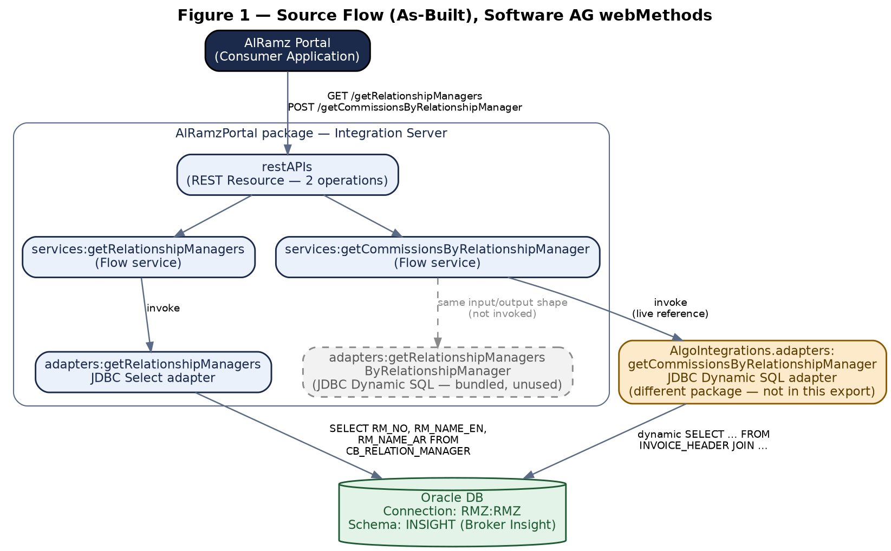
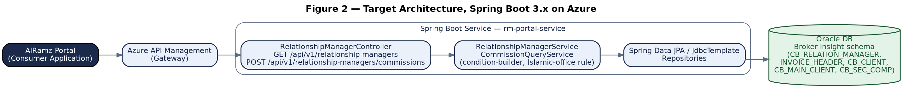
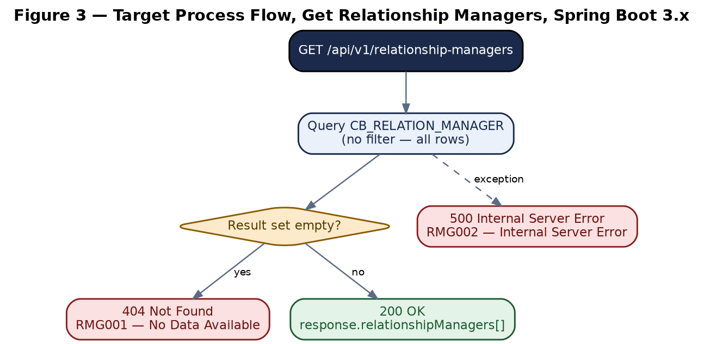
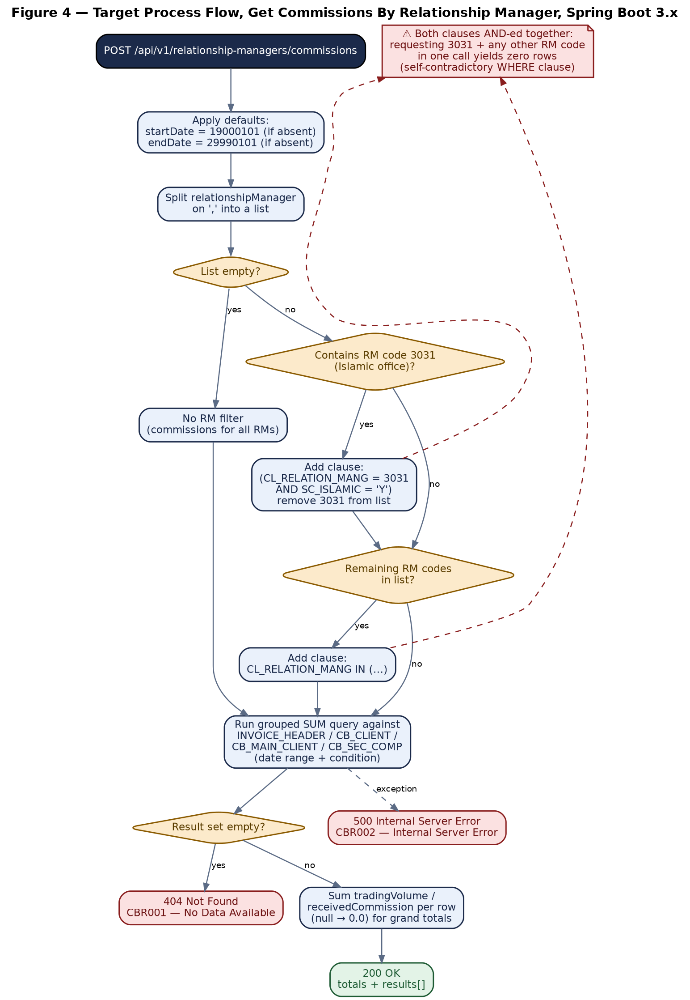

***AL RAMZ CAPITAL***

***MIDDLEWARE MIGRATION PROGRAMME***

**AlRamzPortal Service**

API Documentation & Integration Reference

*Software AG webMethods → Spring Boot 3.x / Java 21 Migration*

**Document Control**

| **Attribute**    | **Detail**                                                                 |
|------------------|----------------------------------------------------------------------------|
| Source package   | AlRamzPortal (Software AG webMethods Integration Server), built 2023-07-20 |
| Services covered | getRelationshipManagers, getCommissionsByRelationshipManager               |
| Document version | v1.0 — Initial Reverse-Engineered Documentation                            |
| Prepared for     | Software AG webMethods → Azure Cloud / Spring Boot migration               |

## Table of Contents

- [1. Overview](#1-overview)
  - [1.1 Purpose](#11-purpose)
  - [1.2 Scope](#12-scope)
  - [1.3 Executive Summary](#13-executive-summary)
  - [1.4 Key Migration Notes](#14-key-migration-notes)
- [2. Solution Architecture](#2-solution-architecture)
  - [2.1 As-Built Service Map](#21-as-built-service-map)
  - [2.2 Target Architecture — Spring Boot 3.x on Azure](#22-target-architecture-spring-boot-3x-on-azure)
  - [2.3 Target Response & Result Model](#23-target-response-result-model)
- [3. Prerequisites & Static Configuration](#3-prerequisites-static-configuration)
  - [3.1 Database Connectivity](#31-database-connectivity)
  - [3.2 Environment & Service Availability Prerequisites](#32-environment-service-availability-prerequisites)
- [4. Primary API — Get Relationship Managers](#4-primary-api-get-relationship-managers)
  - [4.1 Endpoint Summary](#41-endpoint-summary)
  - [4.2 Request Schema](#42-request-schema)
  - [4.3 Business Logic Summary](#43-business-logic-summary)
  - [4.4 Sample Request](#44-sample-request)
  - [4.5 Response Schema](#45-response-schema)
    - [4.5.1 Success Response (200)](#451-success-response-200)
    - [4.5.2 No Data Response (404)](#452-no-data-response-404)
    - [4.5.3 Technical Failure (500)](#453-technical-failure-500)
  - [4.6 HTTP Status Code Reference](#46-http-status-code-reference)
  - [4.7 Target Process Flow (Spring Boot)](#47-target-process-flow-spring-boot)
- [5. Primary API — Get Commissions By Relationship Manager](#5-primary-api-get-commissions-by-relationship-manager)
  - [5.1 Endpoint Summary](#51-endpoint-summary)
  - [5.2 Request Schema](#52-request-schema)
  - [5.3 Business Logic Summary](#53-business-logic-summary)
  - [5.4 Sample Request](#54-sample-request)
  - [5.5 Response Schema](#55-response-schema)
    - [5.5.1 Success Response (200)](#551-success-response-200)
    - [5.5.2 No Data Response (404)](#552-no-data-response-404)
    - [5.5.3 Technical Failure (500)](#553-technical-failure-500)
  - [5.6 HTTP Status Code Reference](#56-http-status-code-reference)
  - [5.7 Target Process Flow (Spring Boot)](#57-target-process-flow-spring-boot)
- [6. Downstream Integration — Database Adapters](#6-downstream-integration-database-adapters)
  - [6.1 getRelationshipManagers Adapter](#61-getrelationshipmanagers-adapter)
    - [Table Columns (CB_RELATION_MANAGER)](#table-columns-cb_relation_manager)
  - [6.2 getCommissionsByRelationshipManager Adapter](#62-getcommissionsbyrelationshipmanager-adapter)
- [7. Data Mapping Reference](#7-data-mapping-reference)
  - [7.1 getRelationshipManagers](#71-getrelationshipmanagers)
  - [7.2 getCommissionsByRelationshipManager](#72-getcommissionsbyrelationshipmanager)
- [8. Appendix](#8-appendix)
  - [Appendix A — Pseudocode: Condition-Builder Logic](#appendix-a-pseudocode-condition-builder-logic)
  - [Appendix B — Glossary](#appendix-b-glossary)
  - [Appendix C — Source Table & Column Reference](#appendix-c-source-table-column-reference)
    - [C.1 CB_RELATION_MANAGER — fully known](#c1-cb_relation_manager-fully-known)
    - [C.2 INVOICE_HEADER, CB_CLIENT, CB_MAIN_CLIENT, CB_SEC_COMP — referenced columns only](#c2-invoice_header-cb_client-cb_main_client-cb_sec_comp-referenced-columns-only)
  - [Appendix D — Findings & Recommendations](#appendix-d-findings-recommendations)

# 1. Overview

## 1.1 Purpose

This document defines the Application Programming Interface (API) contract, business rules, and integration behaviour of the **AlRamzPortal** service package — two reporting endpoints that expose relationship-manager reference data and relationship-manager commission/trading-volume summaries — as implemented in Software AG webMethods. It is intended to serve as the authoritative technical reference for the engineering team migrating this service to a Spring Boot 3.x / Java 21 implementation on Azure Cloud.

## 1.2 Scope

- The REST contract for both APIs exposed by the AlRamzPortal.restAPIs:restAPIs resource: GET /getRelationshipManagers and POST /getCommissionsByRelationshipManager.

- The functional and validation business rules enforced by the existing Flow services, including the relationship-manager code special-casing (RM 3031, the Islamic trading office).

- The two JDBC database adapters invoked by these services, including a cross-package dependency discovered during analysis (Section 2.1, Section 6.2).

- Request/response schemas, sample payloads, and the error-handling contract for each API.

- Data mapping between the underlying Oracle database columns and the JSON response fields.

- Findings and recommendations surfaced during source analysis, including one source-verified logic defect and one SQL-injection-shaped construction pattern (Appendix D).

## 1.3 Executive Summary

The package exposes two read-only reporting APIs backed by the Broker Insight Oracle schema (connection alias RMZ:RMZ, schema INSIGHT). getRelationshipManagers (GET) takes no parameters and returns the full list of relationship-manager records from CB_RELATION_MANAGER — identifier and English/Arabic names. getCommissionsByRelationshipManager (POST) accepts an optional date range and an optional comma-separated list of relationship-manager codes, and returns per-client trading-volume and commission totals aggregated from INVOICE_HEADER joined against CB_CLIENT, CB_MAIN_CLIENT, and CB_SEC_COMP, plus grand totals across all returned clients.

Both services follow the same response envelope and error pattern: a literal responseCode/responseMessage pair, with 1012/"No Data Available" when the underlying query returns no rows, and 500/"Internal Server Error" as a generic exception fallback — there is no other legacy error-code scheme in either service (Section 4.6, 5.6). The commissions endpoint applies one piece of non-trivial business logic: relationship-manager code 3031 is treated as the Islamic trading office and is filtered using a dedicated SC_ISLAMIC = 'Y' clause rather than a plain code match. Analysis of the underlying SQL found that this special case is combined with the general relationship-manager filter using AND rather than OR — a source-verified defect that silently produces an empty result whenever 3031 is requested alongside any other relationship-manager code (Section 5.3).

The commissions adapter that the live Flow actually invokes, AlgoIntegrations.adapters:getCommissionsByRelationshipManager, lives in a different Integration Server package that is not included in this export. An identically-shaped adapter of the same name is bundled inside AlRamzPortal itself but is never invoked by the Flow — it is presented here as a high-confidence reconstruction of the live query, not as directly verified source (Section 2.1, Section 6.2).

## 1.4 Key Migration Notes

> **Important — behaviours to confirm or preserve during migration:**
>
> **Islamic-office filter defect.** Requesting relationship-manager code 3031 together with any other code in the same call produces a self-contradictory WHERE clause and silently returns 404/No Data instead of the union of both relationship managers' commissions. The adapter's own SQL retains a commented-out original condition using OR, confirming this is a regression, not the intended design — see Section 5.3 and the Section 6.2 callout.
>
> **Cross-package adapter dependency.** The commissions API's real database dependency is AlgoIntegrations.adapters:getCommissionsByRelationshipManager, not a service inside this package. Locate and analyze the AlgoIntegrations package before treating this migration as complete — the SQL reproduced in Section 6.2 is a reconstruction from an unused, identically-shaped local copy, not the verified live source.
>
> **SQL built by textual substitution, not bind variables.** All three inputs to the dynamic commissions query (condition, startDate, endDate) use webMethods' ${var} textual-substitution syntax rather than :var bind parameters, and none are format-validated before substitution. This is a SQL-injection-shaped construction pattern that should not be carried into the Spring Boot target — see Section 6.2 and Appendix D.
>
> **`RM_DISABLES` is never filtered.** CB_RELATION_MANAGER carries a disabled/inactive flag that getRelationshipManagers never applies — confirm with business whether disabled relationship managers should be excluded from the target API (Section 6.1).
>
> **Response envelope has no `correlationID`.** Unlike the org API standard used elsewhere in this migration programme, neither endpoint returns a correlation/trace identifier — confirm whether these two reporting endpoints should be aligned to that standard (Section 2.3).

# 2. Solution Architecture

## 2.1 As-Built Service Map

The package defines a single REST resource (restAPIs, 2 operations) mapping directly onto two Flow services, each invoking one JDBC adapter. getRelationshipManagers calls a Select-template adapter bundled in this same package. getCommissionsByRelationshipManager calls a Dynamic-SQL adapter — but the live INVOKE reference in the Flow targets AlgoIntegrations.adapters:getCommissionsByRelationshipManager, a different package not present in this export. An identically-shaped adapter of the same name **is** bundled under AlRamzPortal.adapters, but nothing in either Flow invokes it — it appears to be an unused leftover copy.



*Figure 1 — Source Flow (As-Built), Software AG webMethods*

> **As-built finding — likely clone origin**
>
> getCommissionsByRelationshipManager's success-path cleanup deletes several pipeline variables that never otherwise appear in this Flow — getMarketMakingTradesOutput/Input, userCode, type, RM1/RM2/RM3, RM. Combined with the cross-package adapter reference above, this suggests the service was cloned from an existing AlgoIntegrations "market-making trades"–style service and adapted for relationship-manager commissions, without the clone being fully cleaned up. No functional effect was observed, but it is useful context when locating the real adapter dependency.

## 2.2 Target Architecture — Spring Boot 3.x on Azure

The target design consolidates both endpoints into a single Spring Boot service behind Azure API Management, reading directly from the same Broker Insight Oracle schema via Spring Data JPA / JdbcTemplate. No other system is involved — unlike other services in this migration programme, this package has no downstream CRM, eTradeFIT, or notification dependencies; it is a pure read/reporting service once the AlgoIntegrations adapter dependency (Section 2.1) is resolved.



*Figure 2 — Target Architecture, Spring Boot 3.x on Azure*

## 2.3 Target Response & Result Model

Both APIs already use a simple, self-contained response envelope — responseCode / responseMessage / response{} — with no downstream orchestration and no internal-only service boundary inside the request. This is materially simpler than services elsewhere in this migration programme that chain multiple internal calls (and therefore need a typed OperationResult\<T\> to separate transport from domain result — see the DFM Onboarding API Documentation, Section 2.4, for that pattern). For AlRamzPortal, the target design can carry the existing envelope forward directly as a response DTO per endpoint:

```
public class RelationshipManagersResponse {
private String responseCode; // "200" / "1012" / "500"
private String responseMessage;
private RelationshipManagersData response; // null on error
}
public class CommissionsResponse {
private String responseCode;
private String responseMessage;
private CommissionsData response; // totals + results[], null on error
}
```

**Migration note**: neither response includes a correlationID, unlike the org API standard used for the dual-exposure/vendor-facing services documented elsewhere in this programme. Confirm with the API owner whether these two internal reporting endpoints should adopt the same standard, or are intentionally out of scope for it.

# 3. Prerequisites & Static Configuration

## 3.1 Database Connectivity

Both adapters connect through the same connection alias, resolved per environment via the Integration Server connection pool configuration:

|                                                  |                                                                                                                                                                                                                                                                              |
|--------------------------------------------------|------------------------------------------------------------------------------------------------------------------------------------------------------------------------------------------------------------------------------------------------------------------------------|
| **Connection alias**                             | RMZ:RMZ                                                                                                                                                                                                                                                                      |
| **Schema (getRelationshipManagers)**             | INSIGHT — Broker Insight schema, table CB_RELATION_MANAGER                                                                                                                                                                                                                   |
| **Schema (getCommissionsByRelationshipManager)** | Not explicitly qualified in the reconstructed SQL (Section 6.2); tables referenced (INVOICE_HEADER, CB_CLIENT, CB_MAIN_CLIENT, CB_SEC_COMP) are consistent with the same Broker Insight schema — confirm the resolved default schema for connection RMZ:RMZ per environment. |
| **Credentials**                                  | Adapter-level overrideCredentials.\$dbUser / \$dbPassword inputs are declared but unused by either Flow in this package — both calls run under the pooled connection's own credentials.                                                                                      |

## 3.2 Environment & Service Availability Prerequisites

- **Database connectivity to the Broker Insight schema.** Both APIs require a live, correctly-permissioned JDBC connection (RMZ:RMZ) to the Oracle schema hosting CB_RELATION_MANAGER, INVOICE_HEADER, CB_CLIENT, CB_MAIN_CLIENT, and CB_SEC_COMP in every environment.

- **Resolution of the \`AlgoIntegrations\` package dependency.** getCommissionsByRelationshipManager's live adapter call targets a package not present in this export (Section 2.1). The target migration cannot be validated end-to-end against the real query until that package is located and reconciled against the reconstruction in Section 6.2.

- **No external service, CRM, or messaging dependency.** Unlike other services in this migration programme, neither API in this package makes an outbound HTTP call, invokes a CRM, or sends email/SMS — the only external dependency is the Oracle database connection above.

# 4. Primary API — Get Relationship Managers

## 4.1 Endpoint Summary

|                    |                                                                             |
|--------------------|-----------------------------------------------------------------------------|
| **HTTP Method**    | GET                                                                         |
| **Endpoint**       | /getRelationshipManagers                                                    |
| **Content Type**   | application/json                                                            |
| **Request Body**   | None — no query parameters or body fields are declared or read by the Flow. |
| **Source service** | AlRamzPortal.services:getRelationshipManagers                               |

## 4.2 Request Schema

This endpoint takes no request parameters. The Flow's declared input signature is empty, and no query-string or path parameters are read anywhere in the service.

## 4.3 Business Logic Summary

**1.** Invoke the getRelationshipManagers adapter — an unconditional query of RM_NO, RM_NAME_EN, RM_NAME_AR from CB_RELATION_MANAGER (INSIGHT schema); no WHERE clause, no pagination (Section 6.1).

**2.** If the result set is empty, set responseCode 1012 / "No Data Available", clear the response object, and return immediately (Section 4.6, RMG001).

**3.** Otherwise, set responseCode 200 / "OK" and return the mapped relationshipManagers array.

**4.** Any adapter/database exception is caught and converted to responseCode 500 / "Internal Server Error" (Section 4.6, RMG002).

## 4.4 Sample Request

```
GET /getRelationshipManagers HTTP/1.1
Accept: application/json
```

## 4.5 Response Schema

| **HTTP Status**           | **responseCode** | **Meaning**                              | **Body Fields**                                                       |
|---------------------------|------------------|------------------------------------------|-----------------------------------------------------------------------|
| 200 OK                    | 200              | One or more relationship managers found. | responseCode, responseMessage = OK, response.relationshipManagers\[\] |
| 404 Not Found             | 1012             | No relationship-manager records exist.   | responseCode, responseMessage = No Data Available                     |
| 500 Internal Server Error | 500              | Unhandled fallback failure.              | responseCode, responseMessage = Internal Server Error                 |

### 4.5.1 Success Response (200)

```json
{
"responseCode": "200",
"responseMessage": "OK",
"response": {
"relationshipManagers": [
{
"relationshipManagerID": "3030",
"relationshipManagerNameEN": "Ahmed Al Suwaidi",
"relationshipManagerNameAR": "أحمد السويدي"
},
{
"relationshipManagerID": "3031",
"relationshipManagerNameEN": "Islamic Trading Desk",
"relationshipManagerNameAR": "مكتب التداول الإسلامي"
}
]
}
}
```

### 4.5.2 No Data Response (404)

```json
{
"responseCode": "1012",
"responseMessage": "No Data Available"
}
```

### 4.5.3 Technical Failure (500)

```json
{
"responseCode": "500",
"responseMessage": "Internal Server Error"
}
```

## 4.6 HTTP Status Code Reference

| **HTTP Status** | **Service Error Code** | **Description**                                               | **Legacy Error Code**    |
|-----------------|------------------------|---------------------------------------------------------------|--------------------------|
| 200             | —                      | Relationship managers retrieved successfully.                 | —                        |
| 404             | RMG001                 | No relationship-manager records found in CB_RELATION_MANAGER. | 1012 — No Data Available |
| 500             | RMG002                 | Unhandled fallback failure (adapter/database exception).      | —                        |

*Source-verification note: getRelationshipManagers' flow.xml sets exactly two literal response codes beyond "200" — "1012" (mapped to HTTP 404 per the project's Error-Code-to-HTTP-Status-Mapping registry, which already lists 1012 → 404 "Query returned nothing for the given criteria") and "500" (already an HTTP-shaped literal, not a distinct legacy scheme). No other codes exist in source.*

## 4.7 Target Process Flow (Spring Boot)

Reduced to its essential orchestration stages, the migrated Get Relationship Managers endpoint should implement:



*Figure 3 — Target Process Flow, Get Relationship Managers, Spring Boot 3.x*

# 5. Primary API — Get Commissions By Relationship Manager

## 5.1 Endpoint Summary

|                    |                                                           |
|--------------------|-----------------------------------------------------------|
| **HTTP Method**    | POST                                                      |
| **Endpoint**       | /getCommissionsByRelationshipManager                      |
| **Content Type**   | application/json                                          |
| **Idempotency**    | Read-only reporting call; safe to retry.                  |
| **Source service** | AlRamzPortal.services:getCommissionsByRelationshipManager |

## 5.2 Request Schema

| **Field**           | **Type**                 | **Required** | **Description**                                                                                                                                                                                              |
|---------------------|--------------------------|--------------|--------------------------------------------------------------------------------------------------------------------------------------------------------------------------------------------------------------|
| startDate           | String (date, YYYYMMDD)  | No           | Inclusive start of the invoice date range. Defaults to 19000101 only when the field is entirely absent from the request — see the Finding below.                                                             |
| endDate             | String (date, YYYYMMDD)  | No           | Inclusive end of the invoice date range. Defaults to 29990101 only when entirely absent.                                                                                                                     |
| relationshipManager | String (comma-separated) | No           | One or more relationship-manager codes, comma-separated (e.g. "3030,3032"). Omitted or empty ⇒ commissions for all relationship managers. Code 3031 is treated specially — see Business Logic Summary below. |

> **Finding — empty string bypasses the date default**
>
> The 19000101 / 29990101 defaults are applied with OVERWRITE="false", which only fires when the field is **absent** from the pipeline — a caller-supplied empty string ("startDate": "") is left as-is and substituted directly into TO_DATE(${startDate}, 'YYYYMMDD') (Section 6.2), which raises an Oracle date-conversion error. That error is caught generically and surfaces as 500/Internal Server Error rather than a targeted 400 validation message. Recommend explicit blank-string handling in the target design.

## 5.3 Business Logic Summary

**1.** Default startDate to 19000101 and endDate to 29990101 when either field is entirely absent from the request (Section 5.2).

**2.** Split relationshipManager on , into a list of relationship-manager codes; an absent/empty value produces a zero-length list.

**3.** If the list is empty, build the query condition as a single blank space — i.e. apply no relationship-manager filter at all; commissions are aggregated across all relationship managers.

**4.** Otherwise, iterate the code list: for the code 3031 specifically, add the clause ( CL_RELATION_MANG = 3031 and CB_SEC_COMP.SC_ISLAMIC = 'Y' ) AND and remove 3031 from the list — this is the Islamic-office carve-out (RM 3031 identifies the Islamic trading desk, whose commissions must also match SC_ISLAMIC = 'Y').

**5.** After the loop, if any codes remain in the list, join them with commas and append CL_RELATION_MANG in (\<codes\>) and to whatever condition step 4 already built.

**6.** Invoke the commissions adapter (AlgoIntegrations.adapters:getCommissionsByRelationshipManager — a cross-package dependency not included in this export, Section 2.1, 6.2) with startDate, endDate, and the built condition, all substituted as raw text into the dynamic SQL (Section 6.2 — flagged as a SQL-injection-shaped construction pattern in Appendix D).

**7.** If the result set is empty, set responseCode 1012 / "No Data Available", clear the response object, and return immediately (Section 5.6, CBR001).

**8.** Otherwise, for each result row, default a null tradingVolume/receivedCommission to 0.0, then accumulate running totals via string-based float addition (pub.string:objectToString → pub.math:addFloats → pub.math:toNumber — see Appendix D for a recommendation to use BigDecimal in the target design instead).

**9.** Set responseCode 200 / "OK", populate response.totalTradingVolume / response.totalReceivedCommission from the accumulated sums, and return response.results\[\].

**10.** Any adapter/database exception — including a malformed startDate/endDate that fails Oracle's TO_DATE conversion (Section 5.2 Finding) — is caught, response is cleared, and responseCode is set to 500 / "Internal Server Error" (Section 5.6, CBR002).

> **⚠ Source-verified defect — steps 4–5 combine with AND, not OR**
>
> Step 4's Islamic-office clause and step 5's IN (...) clause are joined with AND, not OR. A request for relationshipManager = "3030,3031" therefore builds ( CL_RELATION_MANG = 3031 and SC_ISLAMIC = 'Y' ) AND CL_RELATION_MANG in (3030) and ... — a WHERE clause no single row can satisfy, since CL_RELATION_MANG cannot equal both 3031 and 3030 at once. The call silently returns 404/No Data Available instead of the union of both relationship managers' commissions, with no error raised.
>
> This is verifiably a regression rather than the intended design: the adapter's own SQL (Section 6.2) retains a commented-out original condition — (CL_RELATION_MANG = 3030 or ( CL_RELATION_MANG = 3031 and CB_SEC_COMP.SC_ISLAMIC = 'Y' )) — which used OR. Recommend the target implementation OR the two predicates together (or issue one query per relationship-manager group and merge results) rather than reproducing the AND.

## 5.4 Sample Request

```
POST /getCommissionsByRelationshipManager HTTP/1.1
Content-Type: application/json
{
"startDate": "20260101",
"endDate": "20260630",
"relationshipManager": "3030,3032"
}
```

## 5.5 Response Schema

| **HTTP Status**           | **responseCode** | **Meaning**                                        | **Body Fields**                                                                                                    |
|---------------------------|------------------|----------------------------------------------------|--------------------------------------------------------------------------------------------------------------------|
| 200 OK                    | 200              | Commissions retrieved and aggregated successfully. | responseCode, responseMessage, response.totalTradingVolume, response.totalReceivedCommission, response.results\[\] |
| 404 Not Found             | 1012             | No commission records matched the given filters.   | responseCode, responseMessage = No Data Available                                                                  |
| 500 Internal Server Error | 500              | Unhandled fallback failure.                        | responseCode, responseMessage = Internal Server Error                                                              |

### 5.5.1 Success Response (200)

```json
{
"responseCode": "200",
"responseMessage": "OK",
"response": {
"totalTradingVolume": 4523980.50,
"totalReceivedCommission": 18760.25,
"results": [
{
"clientNumber": "100234",
"clientName": "Acme Trading LLC",
"tradingVolume": 2500000.00,
"receivedCommission": 9500.00
},
{
"clientNumber": "100567",
"clientName": "Gulf Investments FZE",
"tradingVolume": 2023980.50,
"receivedCommission": 9260.25
}
]
}
}
```

### 5.5.2 No Data Response (404)

```json
{
"responseCode": "1012",
"responseMessage": "No Data Available"
}
```

### 5.5.3 Technical Failure (500)

```json
{
"responseCode": "500",
"responseMessage": "Internal Server Error"
}
```

> **Finding — possible internal exception leak on 500**
>
> The declared output signature for this service includes a lastError field (pub.event:exceptionInfo) that is never cleared on the success path and is unconditionally repopulated by pub.flow:getLastError after the try/catch block completes. If the REST binding serializes the full declared output signature, a 500 response can include internal exception class names and messages in lastError, alongside the intended responseCode/responseMessage fields shown above. Confirm the actual REST-binding serialization behaviour before assuming the sample above is complete; do not carry a raw exception object into the Spring Boot target's error response regardless.

## 5.6 HTTP Status Code Reference

| **HTTP Status** | **Service Error Code** | **Description**                                                                                                                                                                            | **Legacy Error Code**    |
|-----------------|------------------------|--------------------------------------------------------------------------------------------------------------------------------------------------------------------------------------------|--------------------------|
| 200             | —                      | Commissions retrieved and aggregated successfully.                                                                                                                                         | —                        |
| 404             | CBR001                 | No commission records found for the given filters. Also returned — misleadingly — when relationshipManager combines RM code 3031 with any other code in the same request; see Section 5.3. | 1012 — No Data Available |
| 500             | CBR002                 | Unhandled fallback failure (adapter/database exception, including a malformed startDate/endDate that fails Oracle's TO_DATE conversion — Section 5.2).                                     | —                        |

*Source-verification note: as with getRelationshipManagers, getCommissionsByRelationshipManager's flow.xml sets exactly two literal response codes beyond "200" — "1012" (→ 404 per the project's Error-Code-to-HTTP-Status-Mapping registry) and "500". No other legacy code scheme exists in source.*

## 5.7 Target Process Flow (Spring Boot)

Reduced to its essential orchestration stages, the migrated Get Commissions By Relationship Manager endpoint should implement:



*Figure 4 — Target Process Flow, Get Commissions By Relationship Manager, Spring Boot 3.x*

# 6. Downstream Integration — Database Adapters

Neither API in this package calls another REST service, CRM, or messaging system — the only downstream integration in scope is the Oracle database, reached through two JDBC adapters. This section documents both, including the cross-package discrepancy discovered for the commissions adapter.

## 6.1 getRelationshipManagers Adapter

|                      |                                                     |
|----------------------|-----------------------------------------------------|
| **Service type**     | AdapterService                                      |
| **Adapter type**     | JDBC                                                |
| **Adapter template** | Select (com.wm.adapter.wmjdbc.services.Select)      |
| **Connection**       | RMZ:RMZ                                             |
| **Schema / Table**   | INSIGHT.CB_RELATION_MANAGER (table type TABLE)      |
| **Input record**     | getRelationshipManagersInput (no bound fields used) |
| **Output record**    | getRelationshipManagersOutput.results\[\]           |

This is a Select-template adapter: the query is generated by the adapter framework from table/column metadata rather than authored as literal SQL text. Reconstructed from that metadata (column list, selected-column mapping, and the absence of any WHERE/join/filter metadata):

```sql
-- Reconstructed from Select-adapter metadata (Designer table/column mapping),
-- not literal source SQL text.
SELECT t1.RM_NO, t1.RM_NAME_EN, t1.RM_NAME_AR
FROM INSIGHT.CB_RELATION_MANAGER t1
-- no WHERE clause; no pagination (select.maxRows unset); queryTimeOut = -1 (unbounded)
```

### Table Columns (CB_RELATION_MANAGER)

The adapter's Designer metadata carries the full column list for this table, though only three columns are actually selected (marked below):

| **Column**     | **Oracle Type** | **Selected by this adapter?**   |
|----------------|-----------------|---------------------------------|
| RM_NO          | NUMBER(4)       | Yes → relationshipManagerID     |
| RM_NAME_AR     | VARCHAR2(50)    | Yes → relationshipManagerNameAR |
| RM_NAME_EN     | VARCHAR2(50)    | Yes → relationshipManagerNameEN |
| RM_BR_CODE     | NUMBER(4)       | No                              |
| RM_CID         | VARCHAR2(10)    | No                              |
| RM_EMPLOYEE_ID | VARCHAR2(16)    | No                              |
| UPD_TIME       | DATE            | No                              |
| RM_DISABLES    | VARCHAR2(1)     | No — see Finding below          |

> **Finding — RM_DISABLES is never filtered**
>
> CB_RELATION_MANAGER carries an RM_DISABLES flag, but the query applies no WHERE clause at all — every row is returned regardless of this flag. If RM_DISABLES marks a relationship manager as inactive/retired, this API currently returns inactive relationship managers to callers indistinguishably from active ones. Confirm with business whether the target query should add a filter such as WHERE RM_DISABLES <> 'Y' (exact semantics of the flag's values were not determinable from the adapter metadata alone).

## 6.2 getCommissionsByRelationshipManager Adapter

> **Finding — the live adapter is not in this export**
>
> The Flow's INVOKE targets AlgoIntegrations.adapters:getCommissionsByRelationshipManager — a different Integration Server package, not included in this AlRamzPortal export (Section 2.1). This package separately bundles an adapter of the identical name under AlRamzPortal.adapters, with an identical input/output field signature (startDate, endDate, condition → clientNumber, clientName, tradingVolume, receivedCommission), but nothing in either Flow invokes it. The SQL below is decoded directly from that unused local copy and is presented as a **high-confidence reconstruction** of the live query — not as directly verified source. Confirm it byte-for-byte against the real AlgoIntegrations package before finalizing the target implementation.

|                      |                                                                                                                                      |
|----------------------|--------------------------------------------------------------------------------------------------------------------------------------|
| **Service type**     | AdapterService                                                                                                                       |
| **Adapter type**     | JDBC                                                                                                                                 |
| **Adapter template** | DynamicSQL (com.wm.adapter.wmjdbc.services.DynamicSQL)                                                                               |
| **Connection**       | RMZ:RMZ                                                                                                                              |
| **Input record**     | new_adapterServiceInput — startDate, endDate, condition (all textual-substitution SQL variables, \${...} syntax — see Finding below) |
| **Output record**    | new_adapterServiceOutput.results\[\] — clientNumber, clientName, tradingVolume (Double), receivedCommission (Double)                 |

Literal SQL text, decoded from the Dynamic SQL adapter's stored query (this **is** authored source text, unlike Section 6.1's Select-template reconstruction):

```sql
SELECT
CB_MAIN_CLIENT.CL_MAIN_CLIENT_ID,
CB_MAIN_CLIENT.CLE_CLIENT_NAME,
SUM(TOTAL) AS tradingVolume,
SUM((LOC_OFFICE_COMM) / 2) AS receivedCommission
FROM
INVOICE_HEADER
LEFT JOIN
CB_CLIENT ON CB_CLIENT.CL_CLIENT_ID = INVOICE_HEADER.CLIENT_ID
LEFT JOIN
CB_MAIN_CLIENT ON CB_CLIENT.CL_MAIN_CLIENT_ID = CB_MAIN_CLIENT.CL_MAIN_CLIENT_ID
LEFT JOIN
CB_SEC_COMP ON INVOICE_HEADER.comp_id = CB_SEC_COMP.SC_COMP_ID
WHERE ${condition}
--(CL_RELATION_MANG = 3030 or ( CL_RELATION_MANG = 3031 and CB_SEC_COMP.SC_ISLAMIC = 'Y' )) and
(total_comm <> 0.0 )
AND (TRUNC(INV_DATE) BETWEEN TO_DATE(${startDate},'YYYYMMDD') AND TO_DATE(${endDate},'YYYYMMDD'))
GROUP BY
CB_MAIN_CLIENT.CL_MAIN_CLIENT_ID, CB_MAIN_CLIENT.CLE_CLIENT_NAME
order by CB_MAIN_CLIENT.CLE_CLIENT_NAME
```

The commented-out line is reproduced verbatim from source — it is the original, OR-based condition the query was designed around, and is the direct evidence behind the Section 5.3 defect finding: the Flow's condition-builder no longer reproduces this OR for the general case.

> **⚠ Finding — SQL built by textual substitution, not bind variables**
>
> All three inputs — condition, startDate, endDate — use webMethods' ${var} textual-substitution syntax, which is replaced directly into the SQL text before the statement is sent to the database. None use the :var bind-parameter syntax the same adapter framework also supports. The adapter declares no separate bound input fields at all (sqlInputField is empty in the adapter metadata) — every value reaching this query is substituted as raw text.
>
> No format validation or allow-listing occurs on relationshipManager, startDate, or endDate anywhere in the calling Flow (Section 5.2, 5.3) before they reach this substitution. While the current condition-builder only ever concatenates numeric-looking codes from a comma split, the construction pattern itself is SQL-injection-shaped and must not be carried into the Spring Boot target as-is — use parameterized queries (JPA @Query with bind parameters, or a Criteria/Querydsl IN predicate) for both the date range and the relationship-manager filter.

# 7. Data Mapping Reference

## 7.1 getRelationshipManagers

| **Source Column (\`CB_RELATION_MANAGER\`)** | **Response Field**                                          |
|---------------------------------------------|-------------------------------------------------------------|
| RM_NO                                       | response.relationshipManagers\[\].relationshipManagerID     |
| RM_NAME_EN                                  | response.relationshipManagers\[\].relationshipManagerNameEN |
| RM_NAME_AR                                  | response.relationshipManagers\[\].relationshipManagerNameAR |

*RM_BR_CODE, RM_CID, RM_EMPLOYEE_ID, UPD_TIME, and RM_DISABLES exist on the table but are not selected or returned by this API (Section 6.1).*

## 7.2 getCommissionsByRelationshipManager

| **SQL Expression / Request Field**             | **Response Field**                                                                                    |
|------------------------------------------------|-------------------------------------------------------------------------------------------------------|
| CB_MAIN_CLIENT.CL_MAIN_CLIENT_ID               | response.results\[\].clientNumber                                                                     |
| CB_MAIN_CLIENT.CLE_CLIENT_NAME                 | response.results\[\].clientName                                                                       |
| SUM(TOTAL) AS tradingVolume                    | response.results\[\].tradingVolume (also summed into response.totalTradingVolume)                     |
| SUM(LOC_OFFICE_COMM / 2) AS receivedCommission | response.results\[\].receivedCommission (also summed into response.totalReceivedCommission)           |
| request.startDate / request.endDate            | \${startDate} / \${endDate} — TRUNC(INV_DATE) BETWEEN ... (textual substitution, Section 6.2)         |
| request.relationshipManager                    | \${condition} — CL_RELATION_MANG predicate, built per Section 5.3 (textual substitution, Section 6.2) |

*Column-name note: the query filters on total_comm (lower-case, as it appears in source) while summing TOTAL (upper-case) as tradingVolume — these are read here as two distinct columns on INVOICE_HEADER, consistent with how they are used (a non-zero-commission filter vs. a trading-value aggregate); their exact business definitions were not independently confirmable from the adapter metadata alone.*

# 8. Appendix

## Appendix A — Pseudocode: Condition-Builder Logic

The only non-trivial business logic in this package is the WHERE-clause condition builder inside getCommissionsByRelationshipManager. Pseudocode, annotated with the Section 5.3 defect:

```
function buildCondition(relationshipManagerParam):
codes = split(relationshipManagerParam, ",") // empty/absent -> []
if length(codes) == 0:
return " " // no RM filter at all
condition = ""
for code in codes:
if code == "3031":
condition += "( CL_RELATION_MANG = 3031 and SC_ISLAMIC = 'Y' ) AND "
remove "3031" from codes
// any other code: no special handling here — stays in `codes`
if length(codes) > 0:
inList = join(codes, ",")
condition += "CL_RELATION_MANG in (" + inList + ") and"
// BUG: this appends with the same string concatenation used for the
// 3031 clause above -> the two predicates end up AND-ed together.
// Source SQL's own comment shows the intended relationship was OR:
// (CL_RELATION_MANG = 3030 or (CL_RELATION_MANG = 3031 and SC_ISLAMIC = 'Y'))
return condition
```

## Appendix B — Glossary

| **Term**                        | **Definition**                                                                                                                                                                                         |
|---------------------------------|--------------------------------------------------------------------------------------------------------------------------------------------------------------------------------------------------------|
| RM                              | Relationship Manager — a broker-side staff member (or the Islamic trading desk, code 3031) associated with one or more client accounts.                                                                |
| Flow service                    | A webMethods Integration Server service authored visually in Designer (flow.xml) — the equivalent of a Java/Spring service method.                                                                     |
| Adapter service                 | A webMethods service that executes a database (or other resource) operation — here, JDBC Select and Dynamic SQL adapters against Oracle.                                                               |
| restResource                    | The webMethods artifact (node.ndf, node_type=restResource) that maps HTTP method + URL template pairs onto Flow services — the source-side equivalent of a Spring @RestController mapping.             |
| \${var} vs :var                 | webMethods Dynamic SQL syntax: \${var} is a textual substitution performed before the SQL reaches the driver; :var is a true JDBC bind parameter. This package uses \${var} exclusively (Section 6.2). |
| TRY / CATCH sequence            | webMethods' structured exception handling — a SEQUENCE FORM="TRY" paired with a sibling SEQUENCE FORM="CATCH", analogous to a Java try { } catch (Exception e) { } block.                              |
| EXIT SIGNAL="SUCCESS"           | An early-return statement inside a Flow — exits the enclosing scope while marking the service as having completed successfully (as opposed to SIGNAL="FAILURE", which would raise an exception).       |
| Broker Insight / INSIGHT schema | The Oracle schema hosting the brokerage's core client, invoice, and relationship-manager reference data, queried read-only by this package.                                                            |

## Appendix C — Source Table & Column Reference

This package owns no database table of its own — both APIs are read-only reports against existing Broker Insight tables. No target DDL is proposed for this reason (contrast with services elsewhere in this migration programme that persist their own records and therefore require a target-schema translation). The tables below are documented at the level of confidence the source metadata actually supports.

### C.1 CB_RELATION_MANAGER — fully known

Full column list and Oracle types, sourced directly from the Select-adapter's Designer table metadata (Section 6.1):

```sql
-- INSIGHT.CB_RELATION_MANAGER (column list/types per adapter metadata;
-- constraints, keys, and indexes were not present in that metadata and
-- are not asserted here)
RM_NO NUMBER(4)
RM_NAME_AR VARCHAR2(50)
RM_NAME_EN VARCHAR2(50)
RM_BR_CODE NUMBER(4)
RM_CID VARCHAR2(10)
RM_EMPLOYEE_ID VARCHAR2(16)
UPD_TIME DATE
RM_DISABLES VARCHAR2(1)
```

### C.2 INVOICE_HEADER, CB_CLIENT, CB_MAIN_CLIENT, CB_SEC_COMP — referenced columns only

These four tables are joined by the commissions query (Section 6.2), but only the columns actually referenced in that query are known from this export — full table definitions (all columns, keys, constraints) are not available and are not fabricated here:

| **Table**      | **Referenced Columns**                                           |
|----------------|------------------------------------------------------------------|
| INVOICE_HEADER | CLIENT_ID, comp_id, TOTAL, LOC_OFFICE_COMM, total_comm, INV_DATE |
| CB_CLIENT      | CL_CLIENT_ID, CL_MAIN_CLIENT_ID                                  |
| CB_MAIN_CLIENT | CL_MAIN_CLIENT_ID, CLE_CLIENT_NAME                               |
| CB_SEC_COMP    | SC_COMP_ID, SC_ISLAMIC                                           |

## Appendix D — Findings & Recommendations

Consolidated from the callouts throughout this document, ranked by severity:

| **\#** | **Severity** | **Finding**                                                                                                                                                                                                                                                                                                                                  | **Section** |
|--------|--------------|----------------------------------------------------------------------------------------------------------------------------------------------------------------------------------------------------------------------------------------------------------------------------------------------------------------------------------------------|-------------|
| 1      | High         | SQL is built by textual substitution (\${condition}, \${startDate}, \${endDate}) with no format validation upstream — a SQL-injection-shaped pattern. Replace with bound/parameterized queries in the target design.                                                                                                                         | 5.2, 6.2    |
| 2      | High         | The Islamic-office clause and the general RM-code IN(...) clause are AND-ed instead of OR-ed, so requesting 3031 with any other RM code silently returns 404/No Data instead of the union of results. Source SQL's own comment shows the originally-intended OR.                                                                             | 5.3, 6.2    |
| 3      | Medium       | The live commissions adapter (AlgoIntegrations.adapters:...) is not in this export; the SQL documented here is reconstructed from an unused, identically-shaped local copy and should be confirmed against the real package.                                                                                                                 | 2.1, 6.2    |
| 4      | Medium       | A declared lastError field (pub.event:exceptionInfo) is never cleared on success and is repopulated unconditionally after every call — a possible internal-exception leak on 500 responses if the REST binding serializes it.                                                                                                                | 5.5         |
| 5      | Medium       | CB_RELATION_MANAGER's RM_DISABLES flag is never filtered — disabled/inactive relationship managers are returned identically to active ones.                                                                                                                                                                                                  | 6.1         |
| 6      | Low          | Commission/volume totals are summed via a string round-trip (objectToString → addFloats → toNumber) rather than native decimal arithmetic. Recommend BigDecimal aggregation in the target design.                                                                                                                                            | 5.3         |
| 7      | Low          | Neither response envelope includes a correlationID, unlike the org API standard used for dual-exposure services elsewhere in this migration programme. Confirm intended alignment.                                                                                                                                                           | 2.3         |
| 8      | Low          | startDate/endDate defaults only apply when the field is entirely absent; an empty-string value bypasses the default and reaches Oracle's TO_DATE unconverted, surfacing as an untargeted 500 rather than a 400.                                                                                                                              | 5.2         |
| 9      | Low          | Pipeline cleanup in the commissions service's success path deletes fields (getMarketMakingTradesOutput/Input, userCode, type, RM1–RM3, RM) that never otherwise appear in this Flow — evidence the service was cloned from an AlgoIntegrations "market-making trades"–style service and not fully cleaned up. No functional effect observed. | 2.1         |
