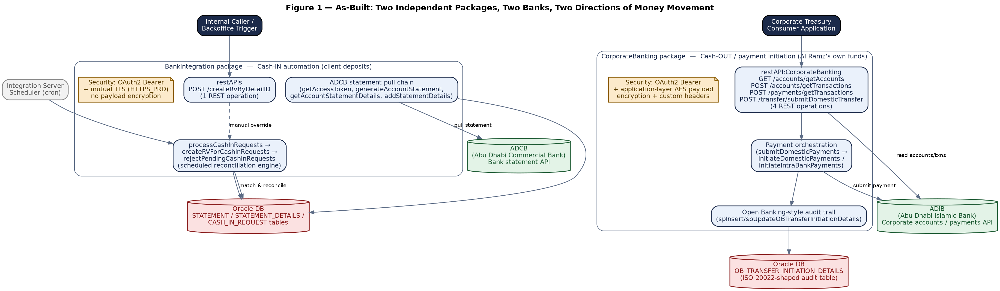
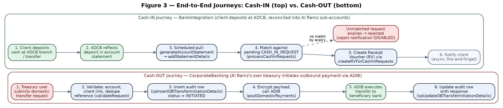
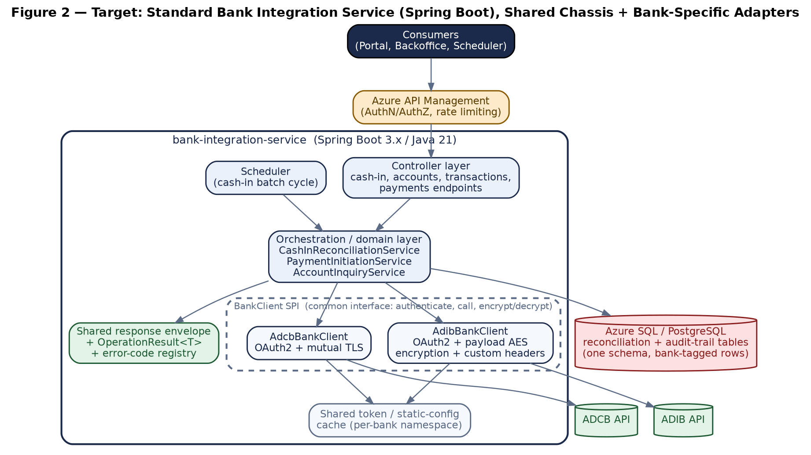
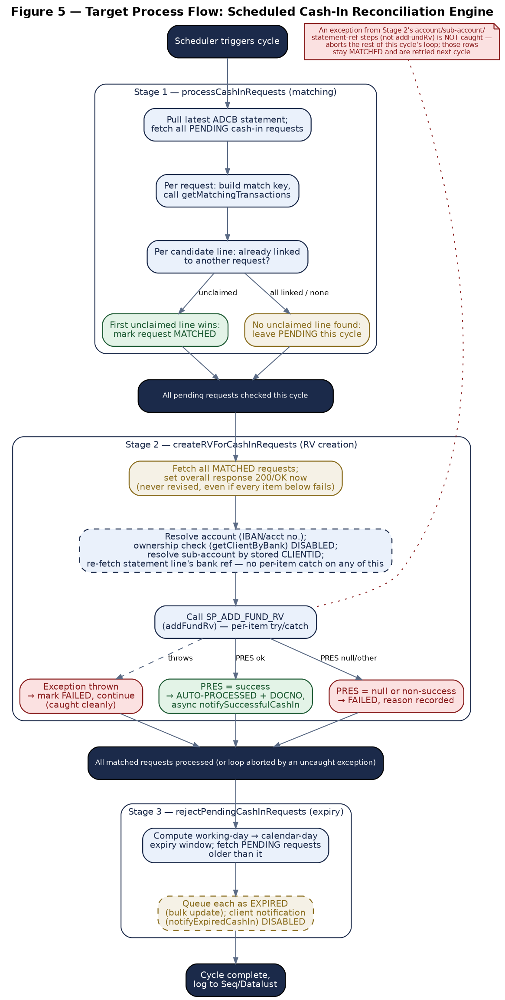
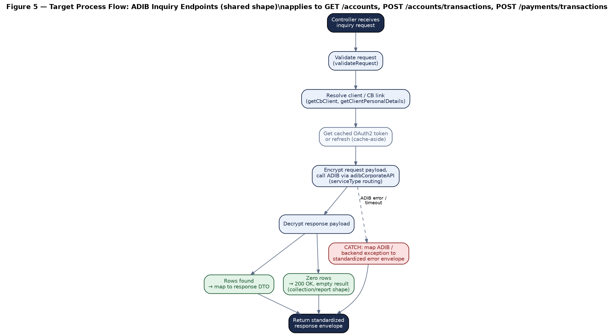

***AL RAMZ CAPITAL***

***MIDDLEWARE MIGRATION PROGRAMME***

**Bank Integration Services**

BankIntegration (ADCB Cash-In) + CorporateBanking (ADIB Cash-Out)

API Documentation, Combination Feasibility Assessment & Service Standardization

*Software AG webMethods → Spring Boot 3.x / Java 21 Migration*

**Document Control**

  -----------------------------------------------------------------------------------------------------------------------------------------------------------------------------------------------------------------------------------------
  **Attribute**         **Detail**
  --------------------- -------------------------------------------------------------------------------------------------------------------------------------------------------------------------------------------------------------------
  Source packages       BankIntegration v1.0 (webMethods IS, exported 21-May-2026) and CorporateBanking v1.0 (webMethods IS, exported 20-Jul-2026)

  Services covered      BankIntegration: 1 REST endpoint + scheduled cash-in reconciliation engine + ADCB statement-pull chain. CorporateBanking: 4 REST endpoints + payment-initiation orchestration + ADIB account/statement inquiries.

  Document version      v1.0 — first combined issue

  Prepared for          Software AG webMethods → Azure Cloud / Spring Boot migration; package combination and service-structure standardization assessment
  -----------------------------------------------------------------------------------------------------------------------------------------------------------------------------------------------------------------------------------------

## Table of Contents

- [1. Overview](#1-overview)
  - [1.1 Purpose](#11-purpose)
  - [1.2 Scope](#12-scope)
  - [1.3 Executive Summary](#13-executive-summary)
  - [1.4 Key Migration Notes](#14-key-migration-notes)
- [2. Solution Architecture & Package Combination Recommendation](#2-solution-architecture-package-combination-recommendation)
  - [2.1 As-Built Architecture](#21-as-built-architecture)
  - [2.2 End-to-End Journeys](#22-end-to-end-journeys)
  - [2.3 Can BankIntegration and CorporateBanking Be Combined?](#23-can-bankintegration-and-corporatebanking-be-combined)
    - [What is genuinely different](#what-is-genuinely-different)
    - [What is genuinely shared](#what-is-genuinely-shared)
  - [2.4 Recommendation: Standard Bank Integration Service](#24-recommendation-standard-bank-integration-service)
  - [2.5 Target Response & Result Model](#25-target-response-result-model)
  - [2.6 Proposed Standardized Service Structure](#26-proposed-standardized-service-structure)
- [3. Prerequisites & Static Configuration](#3-prerequisites-static-configuration)
  - [3.1 Integration Server Global Variables](#31-integration-server-global-variables)
  - [3.2 Static / Feature-Flag Configuration](#32-static-feature-flag-configuration)
  - [3.3 Upstream / Downstream Dependencies](#33-upstream-downstream-dependencies)
  - [3.4 Security Notes](#34-security-notes)
- [4. BankIntegration (ADCB) — Cash-In Automation](#4-bankintegration-adcb-cash-in-automation)
  - [4.1 POST /createRvByDetailID](#41-post-creatervbydetailid)
    - [Endpoint Summary](#endpoint-summary)
    - [Request Schema](#request-schema)
    - [Business Logic Summary](#business-logic-summary)
    - [Sample Request](#sample-request)
    - [Response Schema](#response-schema)
    - [HTTP Status Code Reference](#http-status-code-reference)
    - [Example Target Response Envelopes](#example-target-response-envelopes)
    - [Target Process Flow (Spring Boot)](#target-process-flow-spring-boot)
  - [4.2 Scheduled Cash-In Reconciliation Engine](#42-scheduled-cash-in-reconciliation-engine)
    - [Stage 1 — processCashInRequests (statement matching)](#stage-1-processcashinrequests-statement-matching)
    - [Stage 2 — createRVForCashInRequests (RV creation)](#stage-2-creatervforcashinrequests-rv-creation)
    - [Stage 3 — rejectPendingCashInRequests (expiry)](#stage-3-rejectpendingcashinrequests-expiry)
    - [Target Process Flow (Spring Boot)](#target-process-flow-spring-boot-1)
  - [4.3 ADCB Statement Pull Chain](#43-adcb-statement-pull-chain)
- [5. CorporateBanking (ADIB) — Cash-Out / Payment Initiation](#5-corporatebanking-adib-cash-out-payment-initiation)
  - [5.1 GET /accounts/getAccounts](#51-get-accountsgetaccounts)
    - [Endpoint Summary](#endpoint-summary-1)
    - [Request Schema](#request-schema-1)
    - [Business Logic Summary](#business-logic-summary-1)
    - [Response Schema](#response-schema-1)
    - [HTTP Status Code Reference](#http-status-code-reference-1)
    - [Example Target Response Envelopes](#example-target-response-envelopes-1)
    - [Target Process Flow (Spring Boot)](#target-process-flow-spring-boot-2)
  - [5.2 POST /accounts/getTransactions](#52-post-accountsgettransactions)
    - [Endpoint Summary](#endpoint-summary-2)
    - [Request Schema](#request-schema-2)
    - [Business Logic Summary](#business-logic-summary-2)
    - [Response Schema](#response-schema-2)
    - [HTTP Status Code Reference](#http-status-code-reference-2)
    - [Example Target Response Envelopes](#example-target-response-envelopes-2)
    - [Target Process Flow (Spring Boot)](#target-process-flow-spring-boot-3)
  - [5.3 POST /transfer/submitDomesticTransfer](#53-post-transfersubmitdomestictransfer)
    - [Endpoint Summary](#endpoint-summary-3)
    - [Request Schema](#request-schema-3)
    - [Business Logic Summary](#business-logic-summary-3)
    - [Response Schema](#response-schema-3)
    - [HTTP Status Code Reference](#http-status-code-reference-3)
    - [Example Target Response Envelopes](#example-target-response-envelopes-3)
    - [Target Process Flow (Spring Boot)](#target-process-flow-spring-boot-4)
  - [5.4 POST /payments/getTransactions](#54-post-paymentsgettransactions)
    - [Endpoint Summary](#endpoint-summary-4)
    - [Request Schema](#request-schema-4)
    - [Business Logic Summary](#business-logic-summary-4)
    - [Response Schema](#response-schema-4)
    - [HTTP Status Code Reference](#http-status-code-reference-4)
    - [Example Target Response Envelopes](#example-target-response-envelopes-4)
    - [Target Process Flow (Spring Boot) — shared with Sections 5.1 and 5.2](#target-process-flow-spring-boot-shared-with-sections-51-and-52)
  - [5.5 Payment Orchestration Internals](#55-payment-orchestration-internals)
  - [5.6 Account/Statement Internals](#56-accountstatement-internals)
- [6. Shared Infrastructure Services](#6-shared-infrastructure-services)
  - [6.1 Caching](#61-caching)
  - [6.2 Static / Feature-Flag Configuration Lookup](#62-static-feature-flag-configuration-lookup)
  - [6.3 OAuth2 Token Acquisition](#63-oauth2-token-acquisition)
  - [6.4 Error-Code Propagation Pattern](#64-error-code-propagation-pattern)
  - [6.5 Standardized Response Envelope](#65-standardized-response-envelope)
  - [6.6 No-Data Classification](#66-no-data-classification)
  - [6.7 Logging](#67-logging)
- [7. Data Mapping Reference](#7-data-mapping-reference)
  - [7.1 BankIntegration — Statement & Cash-In Tables](#71-bankintegration-statement-cash-in-tables)
  - [7.2 CorporateBanking — Payment Audit Trail (OB_TRANSFER_INITIATION_DETAILS)](#72-corporatebanking-payment-audit-trail-ob_transfer_initiation_details)
- [8. Appendix](#8-appendix)
  - [Appendix A — Pseudocode](#appendix-a-pseudocode)
    - [A.1 processCashInRequests → createRVForCashInRequests → rejectPendingCashInRequests (one scheduled cycle)](#a1-processcashinrequests-creatervforcashinrequests-rejectpendingcashinrequests-one-scheduled-cycle)
    - [A.2 submitDomesticPayments (routing + audit)](#a2-submitdomesticpayments-routing-audit)
  - [Appendix B — Glossary](#appendix-b-glossary)
  - [Appendix C — DDL: Source and Target Type Mapping](#appendix-c-ddl-source-and-target-type-mapping)
    - [C.1 Source (as typed in webMethods adapter signatures)](#c1-source-as-typed-in-webmethods-adapter-signatures)
    - [C.2 Target (Spring Boot / JPA entity types)](#c2-target-spring-boot-jpa-entity-types)
  - [Appendix D — Findings & Recommendations Summary](#appendix-d-findings-recommendations-summary)
  - [Still-Open Items](#still-open-items)

# 1. Overview

## 1.1 Purpose

This document covers two webMethods packages together, at the request of the migration team: **BankIntegration**, which automates cash-IN reconciliation against Abu Dhabi Commercial Bank (ADCB), and **CorporateBanking**, which exposes Al Ramz's own corporate accounts at Abu Dhabi Islamic Bank (ADIB) for inquiry and initiates outbound (cash-OUT) domestic payments. It documents the API contract, business rules, and integration behaviour of both packages as implemented in Software AG webMethods; assesses, with source evidence, whether the two should be combined into a single standard bank-integration package; and proposes a standardized service structure for whichever bank-integration codebase the target design ends up with. It is the authoritative technical reference for the engineering team carrying this work to Spring Boot 3.x / Java 21 on Azure Cloud.

## 1.2 Scope

-   The REST contract for BankIntegration's one exposed operation (`POST /createRvByDetailID`) and CorporateBanking's four (`GET /accounts/getAccounts`, `POST /accounts/getTransactions`, `POST /payments/getTransactions`, `POST /transfer/submitDomesticTransfer`).

-   The scheduled/batch business logic behind BankIntegration's cash-in reconciliation engine, and the orchestration behind CorporateBanking's payment initiation and account/statement inquiries.

-   A source-evidenced feasibility assessment of combining both packages into one standard bank-integration package, and a proposed standardized service structure (Section 2).

-   Security posture for both packages' outbound bank calls (ADCB mutual TLS vs. ADIB application-layer payload encryption) and inbound access control (Section 3.4).

-   Request/response schemas, sample payloads, and the error-handling contract for every primary API, plus the shared infrastructure (caching, token management, static configuration) both packages depend on.

-   Findings and recommendations surfaced during source analysis, including confirmed logic defects in both packages (Appendix D).

## 1.3 Executive Summary

**BankIntegration** is a scheduled reconciliation engine, not a request/response API in the conventional sense: a cron-triggered batch (`processCashInRequests`) pulls ADCB's account statement, matches transaction lines against client-submitted `CASH_IN_REQUEST` records, and books a Receipt Voucher (RV) via an Oracle stored procedure for every match (`createRVForCashInRequests`). Unmatched requests past their working-day expiry window are rejected (`rejectPendingCashInRequests`). The package's only REST endpoint, `createRvByDetailID`, is a manual override for a single ADCB statement-detail row — it is a separate, independently-implemented code path that calls the same underlying stored procedure directly, not a wrapper around the batch engine (Section 4.1, Section 4.2). Outbound calls to ADCB use OAuth2 client-credentials plus mutual TLS; no payload is encrypted beyond transport.

**CorporateBanking** is a conventional synchronous REST service fronting ADIB. Three of its four endpoints are inquiries against Al Ramz's own ADIB accounts (balances, account transactions, payment transactions); the fourth, `submitDomesticTransfer`, initiates an outbound payment, writing a full ISO 20022-style audit row before the call and updating it with ADIB's response after. Every ADIB call is OAuth2-authenticated and additionally encrypts the request/response body at the application layer, using a key derived from the OAuth2 token response itself, plus a set of custom correlation headers.

Both packages share the same structural weaknesses common to this migration programme: no access control enforced at the Integration Server layer on any REST-exposed service (`check_internal_acls = no` throughout, manifest `listACL` unset), a `responseCode`/responseMessage envelope wrapped in an HTTP 200 regardless of the real outcome, and legacy error codes carried as literal text through `EXIT ... SIGNAL=FAILURE` and reconstructed downstream by substring matching — a fragile convention documented in Section 6.4. Two confirmed logic defects were found in BankIntegration (Section 4, both involving `DISABLED` error/notification handlers) and two in CorporateBanking (Section 5, both involving exception-handling code copy-pasted from a sibling service without updating the target document type — one of which also bypasses request validation entirely).

Section 2 answers the user's core question — can these two packages be combined into one standard bank-integration package — with a **qualified yes**: not as one merged Flow-for-Flow migration, but as one Spring Boot service built around a shared chassis (response envelope, error-code registry, caching, scheduling, audit-trail pattern) with a pluggable per-bank adapter for the parts that are genuinely bank-specific (authentication scheme, payload shape, encryption). The reasoning and the standardized service structure that follows from it are laid out there in full, since the user asked for the recommendation before the endpoint documentation.

## 1.4 Key Migration Notes

+-------------------------------------------------------------------------------------------------------------------------------------------------------------------------------------------------------------------------------------------------------------------------------------------------------------------------------------------------------------------------------------------------------------------------------------------------------------------------------------------------------------------------------------------------------------------------------------------------------------------------------------------------------------------------------------------------------+
| **Important — behaviours to confirm or preserve during migration:**                                                                                                                                                                                                                                                                                                                                                                                                                                                                                                                                                                                                                                   |
|                                                                                                                                                                                                                                                                                                                                                                                                                                                                                                                                                                                                                                                                                                       |
| **Combine as one service, not one Flow.** BankIntegration and CorporateBanking solve different business problems (inbound reconciliation vs. outbound payment initiation) against different banks with different security models. Section 2.3 lays out the evidence; the recommendation is a shared chassis with per-bank adapters, not a literal merge of the two Flow codebases.                                                                                                                                                                                                                                                                                                                    |
|                                                                                                                                                                                                                                                                                                                                                                                                                                                                                                                                                                                                                                                                                                       |
| **BankIntegration: `createRVForCashInRequests` never verifies bank-account ownership, and two steps ahead of its one protected call are unprotected.** The client-bank-ownership check (`getClientByBank`) is entirely `DISABLED` in source — the RV is booked on trust of whatever CLIENTID is already stored on the request, never verified against the resolved bank account. Separately, only the `SP_ADD_FUND_RV` call itself has a per-item try/catch; the two lookups immediately before it do not, so a failure there aborts the rest of that cycle's matched-request processing (the affected rows stay MATCHED and are retried next cycle, not lost). See Section 4.2 and Appendix D Finding 1. |
|                                                                                                                                                                                                                                                                                                                                                                                                                                                                                                                                                                                                                                                                                                       |
| **BankIntegration: `DISABLED` expiry notification.** `rejectPendingCashInRequests` calls `notifyExpiredCashIn` through a `DISABLED` invoke — clients whose cash-in request expires unmatched are never notified. See Section 4.2 and Appendix D Finding 2.                                                                                                                                                                                                                                                                                                                                                                                                                                                    |
|                                                                                                                                                                                                                                                                                                                                                                                                                                                                                                                                                                                                                                                                                                       |
| **BankIntegration: the manual-override endpoint is an independent code path, not a wrapper.** `createRvByDetailID` (Section 4.1) does not invoke `createRVForCashInRequests` or any part of the scheduled batch engine (Section 4.2) — it re-implements client resolution and RV creation on its own, calling `SP_ADD_FUND_RV` directly through a different adapter chain. A fix to the batch engine's `DISABLED` error handling (Finding 1) does not automatically apply here; the target design should have one shared reconciliation service both the scheduler and this endpoint call, rather than two independent implementations of the same operation. See Section 4.1.                                |
|                                                                                                                                                                                                                                                                                                                                                                                                                                                                                                                                                                                                                                                                                                       |
| **CorporateBanking: two services' CATCH blocks target the wrong response document type.** `accountsAndTransactions:GetTransactionDetails`'s exception handler sets `Status` on `AccountSummaryResponse` (copied from the sibling `GetAccountDetails` service) in 19 of 24 assignments, instead of the service's own declared `AccountStatementResponse` type. `payments:GetTransactionDetails` (the `GetPaymentSummary` endpoint) is worse: only 1 of 14 CATCH assignments targets its own `PaymentStatementResponse` type — the rest target `AccountSummaryResponse` and `AccountStatementResponse`, copied from two different sibling services. See Section 5.6 and Appendix D Findings 3–4.                            |
|                                                                                                                                                                                                                                                                                                                                                                                                                                                                                                                                                                                                                                                                                                       |
| **CorporateBanking: `GetPaymentSummary` skips request validation.** Unlike its three sibling REST endpoints, `payments:GetTransactionDetails` never invokes `validations:validateRequest`, and its one schema-validation call maps the request through a field typed as a different service's request document (`SubmitDomesticTransferRequest`) — a live copy-paste defect that likely makes the validation a no-op. See Section 5.6 and Appendix D Finding 4.                                                                                                                                                                                                                                           |
|                                                                                                                                                                                                                                                                                                                                                                                                                                                                                                                                                                                                                                                                                                       |
| **No access control enforced at the Integration Server layer, on either package.** All five REST-exposed services declare `check_internal_acls = no`, and both manifests leave `listACL` unset. Confirm what (if anything) sits in front of Integration Server for these calls today, and carry equivalent enforcement into Azure API Management / Spring Boot explicitly. See Section 3.4.                                                                                                                                                                                                                                                                                                               |
|                                                                                                                                                                                                                                                                                                                                                                                                                                                                                                                                                                                                                                                                                                       |
| **Legacy error codes are reused across unrelated conditions.** Code `1069` is set for five distinct validation failures across both packages (four in CorporateBanking's payment validation code, one in BankIntegration's `createRvByDetailID`), and `1094` for three distinct conditions in CorporateBanking. A client cannot distinguish these conditions from the code alone today; the target design should not inherit this ambiguity. See Section 6.4.                                                                                                                                                                                                                                               |
|                                                                                                                                                                                                                                                                                                                                                                                                                                                                                                                                                                                                                                                                                                       |
| **No-data is reclassified from 404 to 200 for every collection/report endpoint in this document**, consistent with this migration programme's standing convention (see the project's `Error-Code-to-HTTP-Status-Mapping.md` registry and its documented no-data exception). All three CorporateBanking inquiry endpoints are collection/report shapes; this affects their Client Input Errors tables in Section 5.                                                                                                                                                                                                                                                                                      |
+-------------------------------------------------------------------------------------------------------------------------------------------------------------------------------------------------------------------------------------------------------------------------------------------------------------------------------------------------------------------------------------------------------------------------------------------------------------------------------------------------------------------------------------------------------------------------------------------------------------------------------------------------------------------------------------------------------+

# 2. Solution Architecture & Package Combination Recommendation

## 2.1 As-Built Architecture

Figure 1 shows both packages as they exist in source, side by side. They share no code, no configuration namespace, and no runtime trigger: BankIntegration is scheduler-driven with one manual-override endpoint; CorporateBanking is entirely REST-driven. The only structural similarity is that each talks to exactly one external bank through an OAuth2-secured HTTP adapter with its own token cache.

*Figure 1 — As-Built: two independent packages, two banks, two directions of money movement.*

## 2.2 End-to-End Journeys

Figure 3 (kept adjacent to the architecture discussion, ahead of the per-package chapters, since it is the clearest illustration of why these are different business processes) traces both flows from their real-world trigger to their final state. The cash-in journey starts outside the system entirely — a client depositing cash at an ADCB branch — and BankIntegration only learns about it on the next scheduled statement pull. The cash-out journey starts inside the system, with a treasury user's own action, and completes synchronously within a single request.

*Figure 3 — Cash-IN journey (BankIntegration/ADCB) vs. Cash-OUT journey (CorporateBanking/ADIB).*

## 2.3 Can BankIntegration and CorporateBanking Be Combined?

Short answer: **combine them at the service/chassis level, not by merging the two Flow codebases line-for-line.** The evidence below is organized as "what's genuinely shared" versus "what's genuinely different" — the recommendation in Section 2.4 follows directly from where that line falls.

### What is genuinely different

  -------------------------------------------------------------------------------------------------------------------------------------------------------------------------------------------------------------------------------------------------------------------------------------------------------------------------
  **Dimension**                   **BankIntegration (ADCB)**                                                             **CorporateBanking (ADIB)**
  ------------------------------- -------------------------------------------------------------------------------------- --------------------------------------------------------------------------------------------------------------------------------------------------------------------------------------------------
  Business direction              Cash-IN: reconciling money already received against client requests                    Cash-OUT: initiating money leaving Al Ramz's own account

  Whose money / whose accounts    Client sub-accounts, reconciled against Al Ramz's ADCB collection account              Al Ramz's own corporate ADIB accounts (confirmed: `getAccountSummary` builds its ADIB request entirely from static Al-Ramz-identity configuration, never from a per-caller parameter)

  Trigger model                   Scheduled batch (cron), one manual REST override for a single item                     Synchronous REST, every call

  Outbound auth to bank           OAuth2 client-credentials + mutual TLS (`HTTPS_PRD` keystore/truststore)                 OAuth2 client-credentials, no mTLS evidence found

  Payload protection              None beyond transport TLS                                                              Application-layer AES-style encryption of the entire request/response body, keyed from a value returned inside the OAuth2 token response itself

  Correlation / channel headers   None found                                                                             Custom `x-channel-id`, `x-customer-id`, `x-unique-id` (random, 613-prefixed) on every ADIB call

  Idempotency approach            Dedupe by `STATEMENT_ID`/BANK_REFERENCE_NUMBER lookup-before-insert on statement lines   Dedupe by a DB uniqueness check on a concatenated `(transferDescription + referenceNumber)` string, inside an explicit ART transaction

  Audit trail shape               Flat statement/statement-detail tables                                                 Full ISO 20022 / Open-Banking-shaped table (`OB_TRANSFER_INITIATION_DETAILS`) with debtor/creditor scheme details, consent ID, instruction/end-to-end IDs, encrypted and plaintext payload columns
  -------------------------------------------------------------------------------------------------------------------------------------------------------------------------------------------------------------------------------------------------------------------------------------------------------------------------

### What is genuinely shared

-   **Shape of the integration, not its content.** Both packages follow the identical skeleton: resolve/validate the caller → get a cached OAuth2 token or refresh it → call a single external bank over HTTPS → map the bank's response into an internal document → wrap it in the same kind of `responseCode`/responseMessage envelope → log to the same Seq/Datalust sink. The \*steps\* are the same story told twice; the \*content\* of several of those steps (the auth mechanics, the payload encoding, the header set) is not.

-   **Cross-cutting concerns, not business logic**: static/feature-flag configuration lookup (`getStaticData`/getStaticDataList), a cache-aside token/config cache (structurally identical `pub.cache:get`/put usage in both, differing only in cache-name resolution), and centralized logging. These are infrastructure, and infrastructure is exactly what a shared chassis should own once instead of twice.

-   **The response-envelope and error-classification problem.** Both packages independently reinvented the same `responseCode`/responseMessage-in-a-200 pattern and the same brittle numeric-code-as-substring recovery convention (Section 6.4). Neither package's specific business logic needs to be shared for this to be worth unifying — it's a target-design decision, not a source-code merge.

+--------------------------------------------------------------------------------------------------------------------------------------------------------------------------------------------------------------------------------------------------------------------------------------------------------------------------------------------------------------------------------------------------------------------------------------------------------------------------------------------------------------------------------------------------------------+
| **Design-decision callout — why "combine" does not mean "merge the Flows"**                                                                                                                                                                                                                                                                                                                                                                                                                                                                                  |
|                                                                                                                                                                                                                                                                                                                                                                                                                                                                                                                                                              |
| A literal Flow-to-Flow merge would force one of two bad outcomes: either CorporateBanking's payload-encryption and audit-trail machinery gets bolted onto BankIntegration's reconciliation logic where it serves no purpose, or BankIntegration's scheduler/batch-matching logic gets bolted onto CorporateBanking's synchronous request handling where it equally serves no purpose. Neither package's core business logic reduces the other's — they are two different domain problems that happen to both be "a webMethods package that calls one bank."  |
|                                                                                                                                                                                                                                                                                                                                                                                                                                                                                                                                                              |
| What \*does\* generalize cleanly is the plumbing: authentication, caching, the response envelope, the error-code registry, and — most importantly for future banks — a common `BankClient` abstraction that both ADCB's mTLS-only style and ADIB's OAuth2-plus-payload-encryption style can implement without either one leaking into the other. That abstraction is exactly what "one standard bank integration package" should mean going forward: one place a third bank integration plugs into, not one Flow both existing integrations get squeezed into. |
+--------------------------------------------------------------------------------------------------------------------------------------------------------------------------------------------------------------------------------------------------------------------------------------------------------------------------------------------------------------------------------------------------------------------------------------------------------------------------------------------------------------------------------------------------------------+

## 2.4 Recommendation: Standard Bank Integration Service

Combine at the Spring Boot service level: **one `bank-integration-service`** containing a shared chassis (controllers, orchestration layer, standardized response envelope/OperationResult\<T\>, error-code registry, scheduler, shared token/config cache) plus a small `BankClient` interface (authenticate, call, encrypt/decrypt-if-applicable) implemented once per bank — `AdcbBankClient` and `AdibBankClient` today, with room for a third bank's client to be added later without touching either existing one or the orchestration layer above them. Figure 2 shows this target shape.

*Figure 2 — Target: standard bank-integration service, shared chassis + bank-specific adapters.*

-   **Why one service and not two.** Both are small (5 REST-adjacent flows total between them, plus supporting orchestration) and both will need the same chassis work done regardless (envelope standardization, error-code registry, auth-header/mTLS externalization, caching). Building that chassis once and pointing two thin bank clients at it is materially less work — and less drift risk — than building it twice.

-   **Why not literally merge the domain logic.** The reconciliation engine (BankIntegration) and the payment-initiation/inquiry orchestration (CorporateBanking) stay as separate orchestration classes/packages inside the one service, mirroring the "genuinely different" column in Section 2.3. This keeps the migration itself low-risk — each domain's business rules move over on their own, verifiable in isolation — while still getting the combination benefit where it actually pays off.

-   **A future third bank is the real test of this design.** If a new bank integration can be added by writing one `BankClient` implementation and zero changes to the shared chassis or to either existing domain's orchestration, the combination has succeeded. If it instead requires touching shared code paths that ADCB or ADIB also depend on, the abstraction boundary was drawn in the wrong place — that is the concrete criterion to validate the design against once BankIntegration and CorporateBanking are both migrated.

## 2.5 Target `Response` & Result Model

Internal-only calls between the orchestration layer and each `BankClient` should return a typed `OperationResult`\<T\> (success flag, payload, and — on failure — a structured cause distinguishing validation failure / bank-provider error / infrastructure error) rather than the loosely-typed {result: "SUCCESS"}-shaped IData the legacy Flow pipelines pass around internally. Every externally-facing response follows the standardized envelope defined in Section 6.5, applied identically across both bank domains: `responseCode`/responseMessage (always present, HTTP-status-shaped) and `errorCode`/errorMsg (nullable, populated only for client-input errors).

## 2.6 Proposed Standardized Service Structure

The two packages currently structure services differently — BankIntegration groups everything under `services/CashIn` and `services/ADCB`/services/MWservices with no validations/utils/wrappers separation; CorporateBanking is organized per-domain (`accountsAndTransactions`, payments, common) with a consistent `services/{validations,utils,wrappers}` split inside each domain, plus a `common/ws/consumers` layer for the outbound ADIB client and a `common/ws/providers/restAPI` layer for the inbound REST surface. CorporateBanking's structure is the better convention of the two — it separates validation, business logic, and integration wrappers cleanly — and is recommended as the standard both bank domains (and any future one) should follow in the target codebase:

  --------------------------------------------------------------------------------------------------------------------------------------------------------------------------------------------------------------------------------------------------------------------------------------------------------------------------------------------------------------------------
  **Layer**             **Purpose**                                                                                                                      **BankIntegration today**                                   **CorporateBanking today**                       **Standardized target package**
  --------------------- -------------------------------------------------------------------------------------------------------------------------------- ----------------------------------------------------------- ------------------------------------------------ ------------------------------------------------------------------------------------------------------
  api / REST resource   Inbound REST contract only — thin, maps HTTP to the orchestration layer                                                          `restAPIs/BankIntegration` (1 op)                             `common/ws/providers/restAPI` (4 ops)              \<bank\>.api — controller classes, one per resource

  orchestration         The domain's real business logic: reconciliation matching, payment initiation, batch cycles                                      `services/CashIn` (mixed with REST + batch)                   payments, `accountsAndTransactions` domain roots   \<bank\>.orchestration — one service class per use case

  validations           Request/business-rule validation, kept out of orchestration flows                                                                None — validation is inlined into `CashIn` flows              `{domain}/services/validations`                    \<bank\>.validation — one validator per use case, always present even where today's logic is trivial

  wrappers              Thin pass-through adapters to DB stored procedures / external calls, isolating the orchestration layer from adapter signatures   None — adapters invoked directly from orchestration flows   `{domain}/services/wrappers`                       \<bank\>.repository (DB) / \<bank\>.client (external)

  utils                 Shared per-domain helpers (date arithmetic, field mapping) not worth promoting to the common chassis                             `services/MWservices` (notifications only)                    `{domain}/services/utils`                          \<bank\>.util

  Bank client / auth    OAuth2 token acquisition + bank-specific transport concerns (mTLS vs. payload encryption)                                        `services/ADCB` (mixed with statement-pull logic)             `common/ws/consumers` (clean separation)           \<bank\>.client.`BankClient` implementation (Section 2.4)
  --------------------------------------------------------------------------------------------------------------------------------------------------------------------------------------------------------------------------------------------------------------------------------------------------------------------------------------------------------------------------

*This table is the structural target for both domains in the new codebase; it does not require BankIntegration's source Flow tree to be reorganized before migration — the standardization happens as part of writing the Spring Boot classes, not as a separate webMethods refactor step.*

# 3. Prerequisites & Static Configuration

## 3.1 Integration Server Global Variables

Neither package declares package-level global variables (`node.ndf`/manifest.v3 show none). All environment-specific values are resolved at runtime through the shared `getStaticData`/getStaticDataList lookup service (Section 6.2), keyed by an application + key pair — e.g. `MIDDLEWARE` / `ADIBOAUTH2_CACHE_NAME`. In the target design these become Spring `@ConfigurationProperties`, namespaced per bank (bank-integration.adcb.\*, bank-integration.adib.\*).

## 3.2 Static / Feature-Flag Configuration

  ----------------------------------------------------------------------------------------------------------------------------------------------------------------------------------------------------------------------------------------------------------------------------------------------------------------------------------------------
  **Key (as looked up via `getStaticData`)**             **Package**                                      **Purpose**
  ---------------------------------------------------- ------------------------------------------------ ----------------------------------------------------------------------------------------------------------------------------------------------------------------------------------------------------------------------------------------
  `INTEGRATION_CACHE_MANAGER`                            Both (shared cache-name-resolution convention)   Names the `pub.cache` manager instance to use for token/config caching

  `ADIBOAUTH2_CACHE_NAME`                                CorporateBanking                                 Cache name for the ADIB OAuth2 access token

  `ADIBACCOUNT_CACHE_NAME`                               CorporateBanking                                 Cache name for the Al-Ramz-owned ADIB account list (keyed by a single static `alRamzUserId`, shared across all callers — see Section 3.4)

  `CORPORATE_BANKING_ADIB_ISADIB`                        CorporateBanking                                 Configured SWIFT-code fragment used to test whether a creditor account is on-network (intra-bank) vs. off-network (domestic transfer), driving the `initiateIntraBankPayments`/initiateDomesticPayments branch in `submitDomesticPayments`

  `IntegrationsCache` / ADCB (cache manager/name pair)   BankIntegration                                  Token cache for the ADCB OAuth2 client-credentials flow
  ----------------------------------------------------------------------------------------------------------------------------------------------------------------------------------------------------------------------------------------------------------------------------------------------------------------------------------------------

## 3.3 Upstream / Downstream Dependencies

Candidate health-check dependencies for the target services, in call order:

-   **BankIntegration**: ADCB statement/OAuth2 API (external) → Oracle DB (`STATEMENT`, `STATEMENT_DETAILS`, `CASH_IN_REQUEST` and related tables) → `commonUtility` (static config, GUID, encrypt/decrypt — shared package, not included in this export) → `Notifications.EMail` / `Notifications.SMS` (shared package, not included in this export) → Seq/Datalust logging sink.

-   **CorporateBanking**: ADIB OAuth2 + Corporate API (external) → Oracle DB (`OB_TRANSFER_INITIATION_DETAILS` and client/account reference tables) → `commonUtility` (same shared dependency as BankIntegration — a strong signal both domains can share one client library for it in the target) → Seq/Datalust logging sink.

+----------------------------------------------------------------------------------------------------------------------------------------------------------------------------------------------------------------------------------------------------------------------------------------------------------------------------------------------------------------------------------------------------------------------------------------------------------------------------------------------------------------------------------------------------------------------------------------------+
| **Open item — shared package not in either export**                                                                                                                                                                                                                                                                                                                                                                                                                                                                                                                                          |
|                                                                                                                                                                                                                                                                                                                                                                                                                                                                                                                                                                                              |
| `commonUtility` (static-config lookup, GUID generation, XML schema validation, error-message-table lookup, encrypt/decrypt and random-string Java services, server-IP helper) is invoked by both packages but is not included in either zip, the same gap already flagged against `AlgoIntegrations` in the AlRamzPortal document. Until it is provided, `commonUtility`'s own implementation (in particular its encrypt/decrypt Java services, which CorporateBanking's ADIB payload encryption depends on directly) is documented here from its call sites and effects, not from its own source. |
+----------------------------------------------------------------------------------------------------------------------------------------------------------------------------------------------------------------------------------------------------------------------------------------------------------------------------------------------------------------------------------------------------------------------------------------------------------------------------------------------------------------------------------------------------------------------------------------------+

## 3.4 Security Notes

Neither package enforces access control at the Integration Server layer on any of its five REST-exposed services: all five declare `check_internal_acls = no`, icontext_policy = `$null`, and both packages' manifests leave `listACL` unset. Neither package configures a WS-Security policy or basic-auth binding on its exposed REST resource. In practice, whatever authenticates a caller today does so entirely outside Integration Server — most likely a network-layer control or an API gateway not present in either export. The target design should make this explicit rather than implicit: Azure API Management (or equivalent) authenticating and authorizing every inbound call before it reaches the Spring Boot service, for both bank domains identically (Figure 2).

  ------------------------------------------------------------------------------------------------------------------------------------------------------------------------------------------------------------------------------------------------------------------------------------------------------------------------------------------------------------
  **Aspect**                 **BankIntegration → ADCB**                                                    **CorporateBanking → ADIB**
  -------------------------- ----------------------------------------------------------------------------- ---------------------------------------------------------------------------------------------------------------------------------------------------------------------------------------------------------------------------------------------------
  Outbound authentication    OAuth2 client-credentials                                                     OAuth2 client-credentials

  Transport security         Mutual TLS — `pub.security.keystore:setKeyAndChain`, keystore alias `HTTPS_PRD`   Standard TLS; no mutual-TLS call site found

  Payload-level protection   None — request/response bodies are plaintext JSON over TLS                    Every request/response body is additionally encrypted at the application layer; the AES-style key is derived by decrypting an `encKey` field returned inside the OAuth2 token response itself

  Correlation headers        None found                                                                    `x-channel-id`, `x-customer-id`, `x-unique-id` (random, 613-prefixed) on every call, routed through the shared `adibCorporateAPI` proxy service

  Token caching              `pub.cache` cache-aside, manager/name `IntegrationsCache`/ADCB                    `pub.cache` cache-aside, manager/name resolved via `getStaticData` per caller (Section 3.2); the same mechanism also caches the full Al-Ramz-owned ADIB account list under one static `alRamzUserId` key shared by every caller — see the callout below
  ------------------------------------------------------------------------------------------------------------------------------------------------------------------------------------------------------------------------------------------------------------------------------------------------------------------------------------------------------------

+-----------------------------------------------------------------------------------------------------------------------------------------------------------------------------------------------------------------------------------------------------------------------------------------------------------------------------------------------------------------------------------------------------------------------------------------------------------------------------------------------------------------------------------------------------------------------------------------------------------------+
| **Design-decision callout — a single shared cache key across all callers**                                                                                                                                                                                                                                                                                                                                                                                                                                                                                                                                      |
|                                                                                                                                                                                                                                                                                                                                                                                                                                                                                                                                                                                                                 |
| CorporateBanking's cache for the Al-Ramz-owned ADIB account list is keyed by one static `alRamzUserId` value, not per-request or per-caller. This is consistent with the Section 2.3 finding that these are Al Ramz's own accounts (one fixed identity, correctly cached once) rather than a per-client dataset — but it does mean any code path that assumes per-caller cache isolation would be wrong here, and the target design should keep this single-key-per-bank-identity cache scope explicit rather than accidentally generalizing it to a per-caller cache when the chassis is unified in Section 2.4. |
+-----------------------------------------------------------------------------------------------------------------------------------------------------------------------------------------------------------------------------------------------------------------------------------------------------------------------------------------------------------------------------------------------------------------------------------------------------------------------------------------------------------------------------------------------------------------------------------------------------------------+

# 4. BankIntegration (ADCB) — Cash-In Automation

This package has one REST endpoint and one real orchestration engine behind it, both documented below at full depth; the ADCB statement-pull chain that feeds the engine is documented at the depth it needs (moderate — it is real business logic, but each step is a single, undramatic call) and no more.

## 4.1 `POST /createRvByDetailID`

### Endpoint Summary

  --------------------- --------------------------------------------------------------------------------------------------------------------------------------
  **Method / Path**     `POST /createRvByDetailID`

  **Backing service**   BankIntegration.services.`CashIn`:`createRvByDetailID`

  **Purpose**           Manual override: create a Receipt Voucher (RV) for one specific, already-identified cash-in match, outside the scheduled batch cycle

  **Access control**    None enforced at Integration Server (`check_internal_acls = no`); no `listACL` entry in the package manifest
  --------------------- --------------------------------------------------------------------------------------------------------------------------------------

### Request Schema

  ----------------------------------------------------------------------------------------------------------------------------------------------------------------------------------------------------------------------------------------------------------------------------------
  **Field**           **Legacy Type**   **Required**   **Notes**
  ------------------- ----------------- -------------- -----------------------------------------------------------------------------------------------------------------------------------------------------------------------------------------------------------------------------
  statementDetailID   string            Yes            Identifies the ADCB statement-detail row to book against `STATEMENT_DETAILS`. Legacy type is string; recommended target type is a numeric/UUID identifier depending on how the table's primary key is finalized in Section 7.

  ----------------------------------------------------------------------------------------------------------------------------------------------------------------------------------------------------------------------------------------------------------------------------------

### Business Logic Summary

**1.** Generate a correlation ID if the caller didn't supply one.

**2.** Validate statementDetailID is not null/empty.

**3.** Look up the specific statement-detail row directly (getStatementDetailsByBankRefNo adapter, a literal SQL query in source): must be a credit transaction, not already manually processed, and not already linked to an existing cashin_requests row, matching the given statementDetailID.

**4.** Resolve the client by the statement detail's remitter bank account/IBAN (getClientsByBank, keyed on the row's REMITTER_INFO3 field).

**5.** Call `SP_ADD_FUND_RV` directly (addFundRv adapter) with the resolved client, IBAN, amount, and bank reference number.

**6.** On success (PRES == '0'), return 200 with the booked RV document number, and mark the statement-detail row IS_MANUALLY_PROCESSED = 'Y' with that RV number (updateStatementDetails).

**7.** On any other PRES value, return 402 directly with a message embedding the raw PRES value — this flow uses 402 as a literal HTTP-shaped code here, not a 1000-series legacy code routed through the registry.

**8.** Log the outcome to the shared Seq/Datalust sink and return the response envelope.

+-------------------------------------------------------------------------------------------------------------------------------------------------------------------------------------------------------------------------------------------------------------------------------------------------------------------------------------------------------------------------------------------------------------------------------------------------------------------------------------------------------------------------------------------------------------------------------------------------------------------------------------------------------------------------------------------------------------------------------------------------------------------------------------------------------------------------------------------------------------------------------------------------------------------------------------------------------------------------------------------------------------------+
| **Business-logic observation for the target design**                                                                                                                                                                                                                                                                                                                                                                                                                                                                                                                                                                                                                                                                                                                                                                                                                                                                                                                                                              |
|                                                                                                                                                                                                                                                                                                                                                                                                                                                                                                                                                                                                                                                                                                                                                                                                                                                                                                                                                                                                                   |
| This endpoint does **not** invoke `createRVForCashInRequests` or any other part of the scheduled batch engine (Section 4.2) — it is a separate, independently-implemented code path that calls `SP_ADD_FUND_RV` directly through its own adapter chain (getStatementDetailsByBankRefNo / getClientsByBank / addFundRv / updateStatementDetails, all distinct from the batch engine's `getMatchingTransactions` / `getClientByBank` / `getPoolOrNormalSubaccount` / `updateCashInRequest`). Concretely, this means the Section 4.2 DISABLED-handler defect (Finding 1) does not apply here — this endpoint handles its success/failure cases explicitly and inline, with no per-item loop to speak of. It also means the reverse is true: fixing one path does not fix the other. The target design should collapse this into one shared reconciliation service that both the scheduler and this manual-override endpoint call, rather than carrying forward two independent implementations of the same underlying operation. |
|                                                                                                                                                                                                                                                                                                                                                                                                                                                                                                                                                                                                                                                                                                                                                                                                                                                                                                                                                                                                                   |
| Minor source-verified quirk: on the non-success branch (PRES != '0'), the flow still copies addFundRvOutput/PDOCN into response/rvDocNo before setting the 402 status — so a failure response can carry a (possibly null or stale) rvDocNo value. Low-impact, but worth not carrying forward into the target response contract.                                                                                                                                                                                                                                                                                                                                                                                                                                                                                                                                                                                                                                                                                   |
+-------------------------------------------------------------------------------------------------------------------------------------------------------------------------------------------------------------------------------------------------------------------------------------------------------------------------------------------------------------------------------------------------------------------------------------------------------------------------------------------------------------------------------------------------------------------------------------------------------------------------------------------------------------------------------------------------------------------------------------------------------------------------------------------------------------------------------------------------------------------------------------------------------------------------------------------------------------------------------------------------------------------+

### Sample Request

+-----------------------------------------------------------------------+
| `POST /createRvByDetailID`                                              |
|                                                                       |
| {                                                                     |
|                                                                       |
| "statementDetailID": "8842911"                                        |
|                                                                       |
| }                                                                     |
+-----------------------------------------------------------------------+

### `Response` Schema

Legacy shape, confirmed from the service's own output signature: correlationID / `responseCode` / `responseMessage` / response.rvDocNo, all top-level — there is no `Status` sub-record here (unlike CorporateBanking's pattern, Section 5). Target design note: restated below against the standardized envelope (Section 6.5) for consistency with every other endpoint in this document; `errorCode`/errorMsg are a target-design addition, not present in the legacy signature.

### HTTP `Status` Code Reference

**Client Input Errors**

  ------------------------------------------------------------------------------------------------------------------------------------------------------------------------------------------------------
  **HTTP `Status`**   **Service Error Code**   **Description**                                                           **Legacy Error Code**
  ----------------- ------------------------ ------------------------------------------------------------------------- ---------------------------------------------------------------------------------
  400               BIN001                   statementDetailID is null or empty                                        `1069` — statementDetailID cannot be null or empty

  404               BIN002                   No unprocessed credit transaction found for the given statementDetailID   1127 — No unprocessed credit transactions found for the given statementDetailID

  404               BIN003                   No client found for the statement detail's IBAN/account number            1128 — No clients found with the given IBAN/account number

  409               BIN004                   More than one client found for the given IBAN/account number              1129 — More than one client found with the given IBAN/account number
  ------------------------------------------------------------------------------------------------------------------------------------------------------------------------------------------------------

*This is a genuine single-resource lookup by identifier (not a collection/report endpoint), so 404 is the correct classification for BIN002/BIN003 per the registry's default rule — unlike the CorporateBanking inquiry endpoints in Section 5, which are collection/report shapes and use 200+empty instead (Section 6.6). All four codes and their HTTP mappings are cross-checked against the project's `Error-Code-to-HTTP-Status-Mapping.md` registry, which already carries these exact four (`1069`/1127/1128/1129) with matching rationale.*

**Backend/Provider Errors**

  -------------------------------------------------------------------------------------------------------------------------------------------------------------------------------------------------------
  **HTTP `Status`**   **Service Error Code**   **Description**                                    **Legacy Error Code**
  ----------------- ------------------------ -------------------------------------------------- ---------------------------------------------------------------------------------------------------------
  402               —                        `SP_ADD_FUND_RV` returned a non-success PRES value   402 (used directly as the literal `responseCode` in source, not routed through a 1000-series legacy code)

  500               —                        Any unhandled exception (generic CATCH block)      — (no distinct legacy code — generic 500/"Internal Server Error")
  -------------------------------------------------------------------------------------------------------------------------------------------------------------------------------------------------------

### Example Target `Response` Envelopes

Success:

+-----------------------------------------------------------------------+
| {                                                                     |
|                                                                       |
| "`responseCode`": "200",                                                |
|                                                                       |
| "`responseMessage`": "OK",                                              |
|                                                                       |
| "`errorCode`": null,                                                    |
|                                                                       |
| "`errorMsg`": null,                                                     |
|                                                                       |
| "response": { "rvDocNo": "RV-2026-004471" }                           |
|                                                                       |
| }                                                                     |
+-----------------------------------------------------------------------+

Client input error (404, no unprocessed credit transaction):

+----------------------------------------------------------------------------------------+
| {                                                                                      |
|                                                                                        |
| "`responseCode`": "404",                                                                 |
|                                                                                        |
| "`responseMessage`": "Not Found",                                                        |
|                                                                                        |
| "`errorCode`": "BIN002",                                                                 |
|                                                                                        |
| "`errorMsg`": "No unprocessed credit transaction found for the given statementDetailID", |
|                                                                                        |
| "response": null                                                                       |
|                                                                                        |
| }                                                                                      |
+----------------------------------------------------------------------------------------+

Backend/provider error (402, `SP_ADD_FUND_RV` non-success):

+-----------------------------------------------------------------------+
| {                                                                     |
|                                                                       |
| "`responseCode`": "402",                                                |
|                                                                       |
| "`responseMessage`": "`SP_ADD_FUND_RV` returned 1",                       |
|                                                                       |
| "`errorCode`": null,                                                    |
|                                                                       |
| "`errorMsg`": null,                                                     |
|                                                                       |
| "response": null                                                      |
|                                                                       |
| }                                                                     |
+-----------------------------------------------------------------------+

### Target Process Flow (Spring Boot)

*Figure 4 — Target Process Flow, `createRvByDetailID`, Spring Boot 3.x.*

## 4.2 Scheduled Cash-In Reconciliation Engine

Not a REST endpoint — a scheduled batch (per business confirmation; the specific IS Scheduler cron/interval is server-side configuration external to the package export, so it is not visible in source). This is the package's actual core logic: three services invoked as one pipeline every cycle — `processCashInRequests` (matching), which on completion invokes `createRVForCashInRequests` (RV creation) and then `rejectPendingCashInRequests` (expiry) in turn. It does not share code with `createRvByDetailID` (Section 4.1) — see that section's design-observation callout. Each stage is documented below at full depth, followed by one combined workflow diagram (Figure 5).

### Stage 1 — `processCashInRequests` (statement matching)

**1.** Generate a correlation ID if the caller didn't supply one (relevant only when this service is invoked directly/manually — the scheduler itself supplies none).

**2.** Pull the latest ADCB statement into `STATEMENT`/STATEMENT_DETAILS (BankIntegration.services.ADCB:`addStatementDetails`, Section 4.3) — wrapped in its own try/catch, so a statement-pull failure is logged but does not stop the rest of this cycle.

**3.** Fetch every `CASH_IN_REQUEST` currently STATUS = 'PENDING' (getCashInRequests).

**4.** Look up the configured working-days window (`getStaticData`, application `MIDDLEWARE`) and convert it to calendar days (`getCalendarDaysFromWorkingDays`) — computed once per cycle here; not used by this stage's own matching logic, it is recomputed independently by Stage 3 below.

**5.** For each pending request, build a match key from its IBAN/account number, amount, and request date (reformatted to dd/MM/yyyy via convertDateString).

**6.** Call `getMatchingTransactions` (IBAN, account number, amount, request date, daysOld = 0) — an adapter query against `STATEMENT_DETAILS` for candidate statement lines that plausibly match this request.

**7.** For each candidate line returned, check whether it is already linked to some other cash-in request (getCashInRequests, filtered on that line's STATEMENT_DETAIL_ID).

**8.** The **first candidate line found not already linked** to any request wins: mark this request STATUS = 'MATCHED', record the winning STATEMENT_DETAIL_ID, set STATUSDETAILS = 'Pending RV creation', and stop checking further candidate lines for this request. A request for which no unclaimed candidate line exists is simply left PENDING for this cycle.

**9.** Once every pending request has been checked, invoke `createRVForCashInRequests` (Stage 2) and then `rejectPendingCashInRequests` (Stage 3) — each wrapped in its own try/catch, so a failure in one stage is logged but does not prevent the other from running.

**10.** Return 200/OK, log the cycle to the shared Seq/Datalust sink.

+--------------------------------------------------------------------------------------------------------------------------------------------------------------------------------------------------------------------------------------------------------------------------------------------------------------------------------------------------------------------------------------------------------------------------------------------------------------------------------------------------------------------------------------------------------------------------------------------------------------------------------+
| **Business-logic observation for the target design — Stage 1**                                                                                                                                                                                                                                                                                                                                                                                                                                                                                                                                                                 |
|                                                                                                                                                                                                                                                                                                                                                                                                                                                                                                                                                                                                                                |
| First-unclaimed-match, not best-match: if two pending requests could plausibly match the same statement line (e.g. two clients transferring the identical amount on the same day), whichever pending request happens to be reached first in the outer loop claims it. Source shows no explicit ordering on the getCashInRequests call that drives that outer loop, so today's tie-break is implicit DB-return order, not a deliberate rule. Worth an explicit, deterministic ordering and tie-break policy (e.g. oldest request first) in the target design rather than carrying forward an implicit dependency on read order. |
+--------------------------------------------------------------------------------------------------------------------------------------------------------------------------------------------------------------------------------------------------------------------------------------------------------------------------------------------------------------------------------------------------------------------------------------------------------------------------------------------------------------------------------------------------------------------------------------------------------------------------------+

### Stage 2 — `createRVForCashInRequests` (RV creation)

**1.** Generate a correlation ID if not supplied.

**2.** Fetch every `CASH_IN_REQUEST` currently STATUS = 'MATCHED' (getCashInRequests) — not scoped to only what Stage 1 just matched in this same cycle; anything still sitting at MATCHED from an earlier cycle (e.g. because this stage stopped partway through last time — see the design observation below) is retried too.

**3.** Set the overall response to 200/OK **before** the per-item loop begins — a whole-call summary status set up front, not a per-item outcome; see the design observation below.

**4.** For each matched request: resolve the bank account to book against — its IBAN if present, otherwise its ACCOUNTNUMBER.

**5. Dead code, never executes**: a client-ownership verification step (`getClientByBank`, checking that the resolved account genuinely belongs to the request's stored client) exists in source, but its entire try/catch block — including the INVOKE itself — is `DISABLED`. See the design observation below.

**6.** Resolve the client's pooled-or-normal sub-account (`getPoolOrNormalSubaccount`), keyed on the CLIENTID already stored on the request record — not on anything just verified against the bank, since that verification never runs.

**7.** Re-fetch the matched statement line's own bank reference number (getStatementDetailsByBankRefNo, queried fresh by the STATEMENT_DETAIL_ID recorded in Stage 1).

**8.** Call `SP_ADD_FUND_RV` (addFundRv) with the resolved IBAN/account, amount, bank reference number, client ID, and sub-account ID — wrapped in a per-item try/catch.

**9.** On an exception from that call: log it, mark this one request STATUS = 'FAILED' with a clear reason, and move cleanly to the next request. This specific failure mode — the stored-procedure call itself throwing — is handled correctly, per item.

**10.** If the call completes without throwing, branch on the stored procedure's own PRES output: success → STATUS = 'AUTO-PROCESSED', record the RV number (DOCNO), fire a success notification asynchronously (`commonUtility.java:asyncInvoke`, fire-and-forget); PRES came back null → STATUS = 'FAILED' ("null data from `SP_ADD_FUND_RV`"); PRES came back any other value → STATUS = 'FAILED', embedding the raw PRES value in STATUSDETAILS. These are the three legitimate, distinct branches distinguished by webMethods case-matching on PRES (a named success case, a `$null` case, a `$default` case) — not an anomaly.

**11.** Log the cycle to the shared Seq/Datalust sink.

+-----------------------------------------------------------------------------------------------------------------------------------------------------------------------------------------------------------------------------------------------------------------------------------------------------------------------------------------------------------------------------------------------------------------------------------------------------------------------------------------------------------------------------------------------------------------------------------------------------------------------------------------------------------------------------------------------------------------------------------------------------------------------------------------------------------------------------------------------------------------------------------------------------------------------+
| **Appendix D Finding 1 — unprotected steps and a disabled verification step in `createRVForCashInRequests` (corrected)**                                                                                                                                                                                                                                                                                                                                                                                                                                                                                                                                                                                                                                                                                                                                                                                                |
|                                                                                                                                                                                                                                                                                                                                                                                                                                                                                                                                                                                                                                                                                                                                                                                                                                                                                                                       |
| This finding was inaccurately described in the first-issued version of this document (it claimed `SP_ADD_FUND_RV` failures propagate uncaught — they do not; see below) and is corrected here based on a direct re-read of source.                                                                                                                                                                                                                                                                                                                                                                                                                                                                                                                                                                                                                                                                                      |
|                                                                                                                                                                                                                                                                                                                                                                                                                                                                                                                                                                                                                                                                                                                                                                                                                                                                                                                       |
| **`DISABLED` client-bank-ownership verification.** The `getClientByBank` step above — including its own failure handling for a null or error lookup — is entirely disabled in source, not merely its error path: the SEQUENCE wrapping the INVOKE itself carries `DISABLED`="true", so the call is skipped, not just its exception handling. In practice this means `createRVForCashInRequests` never confirms that the bank account being credited actually belongs to the client recorded on the request; it trusts whatever CLIENTID is already stored there.                                                                                                                                                                                                                                                                                                                                                              |
|                                                                                                                                                                                                                                                                                                                                                                                                                                                                                                                                                                                                                                                                                                                                                                                                                                                                                                                       |
| **Unprotected steps ahead of the one protected call.** Only the `SP_ADD_FUND_RV` call has a per-item try/catch. The two steps immediately before it — `getPoolOrNormalSubaccount` and getStatementDetailsByBankRefNo — have none. An exception from either (e.g. no sub-account resolvable for a client, or the linked statement-detail row missing) is not caught locally: it propagates out of the per-item loop entirely, aborting the rest of that cycle's matched-request processing. Anything not yet reached stays MATCHED and is simply retried on the next scheduled cycle (Stage 2's own first step re-fetches all MATCHED rows every time), so this is a delay/visibility gap rather than silent data loss — but one bad row can stall every other request queued behind it in that cycle's loop order, with no log entry distinguishing which row caused it beyond the generic 500 raised at the outer catch. |
|                                                                                                                                                                                                                                                                                                                                                                                                                                                                                                                                                                                                                                                                                                                                                                                                                                                                                                                       |
| **The whole-call `200`/`OK` is set before the loop runs and is never revised.** Even a cycle where every single matched request ends up FAILED inside the loop still returns 200/OK from `createRVForCashInRequests` itself — failure visibility exists only per-row, in `CASH_IN_REQUEST`.STATUS/STATUSDETAILS, not in this service's own response. Worth a monitoring/alerting note for the target design: alert on a rising FAILED count in the data, not on this service's own response code.                                                                                                                                                                                                                                                                                                                                                                                                                     |
+-----------------------------------------------------------------------------------------------------------------------------------------------------------------------------------------------------------------------------------------------------------------------------------------------------------------------------------------------------------------------------------------------------------------------------------------------------------------------------------------------------------------------------------------------------------------------------------------------------------------------------------------------------------------------------------------------------------------------------------------------------------------------------------------------------------------------------------------------------------------------------------------------------------------------+

### Stage 3 — `rejectPendingCashInRequests` (expiry)

**1.** Generate a correlation ID if not supplied.

**2.** Look up the same working-days configuration value as Stage 1 (`getStaticData`) and convert it to calendar days (`getCalendarDaysFromWorkingDays`) — computed independently here, not reused from Stage 1's computation, since each of the three stages runs as its own top-level service invocation with its own pipeline.

**3.** Fetch every `CASH_IN_REQUEST` still STATUS = 'PENDING' and older than that many days (getCashInRequestsForReject, DAYS_OLD = the computed value).

**4.** For each, append an update entry to an in-memory bulk-update list: STATUS = 'EXPIRED', STATUSDETAILS = 'Auto-expired on \<timestamp\>'.

**5. Dead code, never executes**: attempt to notify the client of the expiry (`notifyExpiredCashIn`) — the invoke is `DISABLED`; see Appendix D Finding 2 below (unchanged from the original finding, confirmed still accurate on this re-read).

**6.** Once every overdue request has been queued, persist all of them in one call (bulkUpdateCashInRequest) — only if the list is non-empty.

**7.** Return 200/OK, log the cycle.

+--------------------------------------------------------------------------------------------------------------------------------------------------------------------------------------------------------------------------------------------------------------------------------------------------------------------------------------------------------------------------------------------------------+
| **Appendix D Finding 2 — `DISABLED` expiry notification**                                                                                                                                                                                                                                                                                                                                                |
|                                                                                                                                                                                                                                                                                                                                                                                                        |
| `rejectPendingCashInRequests`'s call to `notifySuccessfulCashIn`'s sibling, `notifyExpiredCashIn`, is wired through a `DISABLED` invoke. Clients whose cash-in request expires unmatched are marked rejected in the database but never told — a silent failure mode from the client's perspective, confirmed at the source level (the invoke node itself carries `DISABLED`="true", not a downstream condition). |
+--------------------------------------------------------------------------------------------------------------------------------------------------------------------------------------------------------------------------------------------------------------------------------------------------------------------------------------------------------------------------------------------------------+

### Target Process Flow (Spring Boot)

*Figure 5 — Target Process Flow, Scheduled Cash-In Reconciliation Engine, Spring Boot 3.x.*

## 4.3 ADCB Statement Pull Chain

Feeds Section 4.2's matching step. Documented at moderate depth — real integration logic, but a straightforward linear chain with no branching worth diagramming separately from Figure 1.

**1. `getAccessToken`**: OAuth2 client-credentials against ADCB, over mutual TLS (`HTTPS_PRD` keystore alias). Token is cached (`IntegrationsCache`/ADCB, cache-aside) and reused until expiry.

**2. `generateAccountStatement`**: requests a statement generation job from ADCB for the configured collection account and date range.

**3. `getAccountStatementDetails`**: retrieves the generated statement's line items.

**4. `addStatementDetails`**: inserts new statement/line-item rows, deduplicating by `STATEMENT_ID`/BANK_REFERENCE_NUMBER lookup-before-insert so a re-pulled statement does not create duplicate rows.

# 5. CorporateBanking (ADIB) — Cash-Out / Payment Initiation

Four REST endpoints, documented below at full depth. Three (5.1, 5.2, 5.4) are inquiry/report endpoints sharing one structural shape — validate → resolve client link → cached token → encrypted ADIB call → decrypt → map — so they share a single Target Process Flow diagram (Figure 6) rather than three near-identical ones; each subsection calls out only what differs. The fourth (5.3) initiates a real payment and gets its own diagram (Figure 7). Sections 5.5–5.6 cover the supporting orchestration at moderate depth.

## 5.1 `GET /accounts/getAccounts`

### Endpoint Summary

  --------------------- -------------------------------------------------------------------------------------------------
  **Method / Path**     `GET /accounts/getAccounts`

  **Backing service**   CorporateBanking.ADIB.common.ws.providers.restAPI.CorporateBanking\_.services:`GetAccountDetails`

  **Purpose**           List Al Ramz's own corporate accounts held at ADIB, with balances

  **Access control**    None enforced at Integration Server (`check_internal_acls = no`); manifest `listACL` unset
  --------------------- -------------------------------------------------------------------------------------------------

### Request Schema

No request body — GET, no parameters. The account set returned is resolved server-side from static Al-Ramz-identity configuration, not from any caller-supplied filter (Section 2.3).

### Business Logic Summary

**1.** Get a cached ADIB OAuth2 token (or refresh it — Section 5.5).

**2.** Call ADIB's account-summary operation through the shared `adibCorporateAPI` proxy (`serviceType` routing, Section 5.5), with the request payload encrypted at the application layer.

**3.** Decrypt the response payload and map each returned account into `AccountDetails` (Section 5's field list below).

**4.** Return the standardized envelope; zero accounts is a normal 200 outcome, not an error (this is a report/collection endpoint — Section 6.6).

### `Response` Schema

  -----------------------------------------------------------------------------------------------------------------------------------------------------------------------------------------------------
  **Field**                                                                                                **Legacy Type**   **Notes**
  -------------------------------------------------------------------------------------------------------- ----------------- --------------------------------------------------------------------------
  correlationID                                                                                            string            Carried through from the request context

  totalRecords                                                                                             string            Standardize to integer in target

  requestTimeStamp                                                                                         string            Legacy ad-hoc format; standardize to ISO 8601 in target — Section 7

  `AccountDetails`\[\]                                                                                       record (array)    One per account — see fields below

  `AccountDetails`\[\].accountNumber / IBAN                                                                  string            —

  `AccountDetails`\[\].accountName / accountType / accountStatus / branchName                                string            —

  `AccountDetails`\[\].currency                                                                              string            Standardize to ISO 4217 in target — Section 7

  `AccountDetails`\[\].country                                                                               string            Standardize to ISO 3166 in target — Section 7

  `AccountDetails`\[\].ledgerBalanceAmount / availableBalance / actualBalance / lockedAmount / limitAmount   string            Standardize to numeric (decimal) in target — Section 7

  `AccountDetails`\[\].openDate                                                                              string            Legacy ad-hoc format; standardize to ISO 8601 date in target — Section 7

  `Status`                                                                                                   record (recref)   code / `message_en` / message_ar — Section 6.5
  -----------------------------------------------------------------------------------------------------------------------------------------------------------------------------------------------------

### HTTP `Status` Code Reference

**Client Input Errors**: none — see Section 6.6 (no request parameters exist to be invalid, and a zero-account result is 200, not an error).

**Backend/Provider Errors**

  --------------------------------------------------------------------------------------------------------------------------------------------------
  **HTTP `Status`**   **Service Error Code**   **Description**                           **Legacy Error Code**
  ----------------- ------------------------ ----------------------------------------- -------------------------------------------------------------
  502               —                        ADIB call failed or timed out             `1093` (shared generic ADIB-service-error code — Section 6.4)

  500               —                        Token acquisition or decryption failure   `1093` / `1094` / `401` (Section 5.5, Section 6.4)
  --------------------------------------------------------------------------------------------------------------------------------------------------

### Example Target `Response` Envelopes

Success (with results):

+----------------------------------------------------------------------------------------------------------------------+
| {                                                                                                                    |
|                                                                                                                      |
| "`responseCode`": "200",                                                                                               |
|                                                                                                                      |
| "`responseMessage`": "OK",                                                                                             |
|                                                                                                                      |
| "`errorCode`": null,                                                                                                   |
|                                                                                                                      |
| "`errorMsg`": null,                                                                                                    |
|                                                                                                                      |
| "response": {                                                                                                        |
|                                                                                                                      |
| "totalRecords": 2,                                                                                                   |
|                                                                                                                      |
| "accounts": \[ { "accountNumber": "11223344", "IBAN": "AE...", "currency": "AED", "availableBalance": 154302.10 } \] |
|                                                                                                                      |
| }                                                                                                                    |
|                                                                                                                      |
| }                                                                                                                    |
+----------------------------------------------------------------------------------------------------------------------+

Success (empty result):

+-----------------------------------------------------------------------+
| {                                                                     |
|                                                                       |
| "`responseCode`": "200",                                                |
|                                                                       |
| "`responseMessage`": "OK",                                              |
|                                                                       |
| "`errorCode`": null,                                                    |
|                                                                       |
| "`errorMsg`": null,                                                     |
|                                                                       |
| "response": { "totalRecords": 0, "accounts": \[\] }                   |
|                                                                       |
| }                                                                     |
+-----------------------------------------------------------------------+

### Target Process Flow (Spring Boot)

Follows the shared inquiry-endpoint flow — Figure 6, Section 5.4.

## 5.2 `POST /accounts/getTransactions`

### Endpoint Summary

  --------------------- ----------------------------------------------------------------------------------------
  **Method / Path**     `POST /accounts/getTransactions`

  **Backing service**   CorporateBanking.ADIB.`accountsAndTransactions`.services:`GetTransactionDetails`

  **Purpose**           Retrieve account-statement transaction lines for a date range

  **Access control**    None enforced at Integration Server (`check_internal_acls = no`); manifest `listACL` unset
  --------------------- ----------------------------------------------------------------------------------------

### Request Schema

  ----------------------------------------------------------------------------------------------------------------------------------------------------------------------
  **Field**      **Legacy Type**   **Required**   **Notes**
  -------------- ----------------- -------------- ----------------------------------------------------------------------------------------------------------------------
  `startDate`      string            Yes            Legacy YYYYMMDD-style string; standardize to ISO 8601 date — Section 7. Legacy vs. target field format note applies.

  `endDate`        string            Yes            Same as above.
  ----------------------------------------------------------------------------------------------------------------------------------------------------------------------

### Business Logic Summary

**1.** Validate the request against the `AccountStatementRequest` schema (`commonUtility.documents:isValidXml`, correctly typed in this service — contrast with Section 5.4's defect).

**2.** Get cached ADIB token, call ADIB's statement operation via `adibCorporateAPI`, decrypt response.

**3.** Compute a memo flag per transaction using business-day arithmetic (`getMemoFlag`, Section 5.6) — flags transactions that landed on a non-working day for downstream reconciliation display.

**4.** Map to AccountStatement\[\]; zero rows is 200 with an empty array (report endpoint — Section 6.6).

+--------------------------------------------------------------------------------------------------------------------------------------------------------------------------------------------------------------------------------------------------------------------------------------------------------------------------------------------------------------------------------------------------------------------------------------------------------------------------------------------------------------------------------------------------------------------------------------------------------------------------------------------------------------------------------------------------------------------------------------------------------------------------------------------------------------------------------------------------+
| **Appendix D Finding 3 — CATCH block targets the wrong response document type**                                                                                                                                                                                                                                                                                                                                                                                                                                                                                                                                                                                                                                                                                                                                                                  |
|                                                                                                                                                                                                                                                                                                                                                                                                                                                                                                                                                                                                                                                                                                                                                                                                                                                  |
| This service's declared output is `Response` of type `AccountStatementResponse` (confirmed from the service's own `node.ndf` signature). Its exception-handling CATCH block, however, sets `Status` fields on `AccountSummaryResponse` — the sibling `GetAccountDetails` service's response type (Section 5.1) — in 19 of its 24 status-setting assignments; only 5 correctly target `AccountStatementResponse`. On most exception paths, the caller-facing `Response/Status` field is never populated, because the code is writing to a field the actual output document doesn't have. This is best explained as the CATCH block being copy-pasted from `GetAccountDetails` without updating every field reference to the new service's document type. Verified directly against both services' `node.ndf` output signatures and a full occurrence count in source. |
+--------------------------------------------------------------------------------------------------------------------------------------------------------------------------------------------------------------------------------------------------------------------------------------------------------------------------------------------------------------------------------------------------------------------------------------------------------------------------------------------------------------------------------------------------------------------------------------------------------------------------------------------------------------------------------------------------------------------------------------------------------------------------------------------------------------------------------------------------+

### `Response` Schema

  -------------------------------------------------------------------------------------------------------------------------------------------------------------------------------------------------------------------
  **Field**                                                            **Legacy Type**   **Notes**
  -------------------------------------------------------------------- ----------------- ----------------------------------------------------------------------------------------------------------------------------
  correlationID / totalRecords / requestTimeStamp                      string            Same standardization notes as Section 5.1

  AccountStatement\[\].accountNumber                                   string            —

  AccountStatement\[\].creditORDebit                                   string            Recommend a target enum (`CREDIT`/DEBIT) rather than the legacy free-form string

  AccountStatement\[\].`referenceNumber` / customerReference / remarks   string            —

  AccountStatement\[\].transactionAmount                               string            Standardize to numeric (decimal) — Section 7

  AccountStatement\[\].currency                                        string            Standardize to ISO 4217 — Section 7

  AccountStatement\[\].valueDate / transactionDate                     string            Standardize to ISO 8601 date — Section 7

  AccountStatement\[\].runningBalance                                  string            Standardize to numeric (decimal) — Section 7

  `Status`                                                               record (recref)   code / `message_en` / message_ar — Section 6.5. Populated correctly only on the 5 of 24 CATCH paths noted above — Finding 3.
  -------------------------------------------------------------------------------------------------------------------------------------------------------------------------------------------------------------------

### HTTP `Status` Code Reference

**Client Input Errors**: none populated in source — this service relies entirely on the shared schema-validation service (`isValidXml`, not included in this export) for input rejection, and its own `EXIT ... SIGNAL=FAILURE` count in source is zero. Confirm with the `commonUtility` package owner what codes that shared validator raises before finalizing this table.

**Backend/Provider Errors**

  -------------------------------------------------------------------------------------------------------------------------------------------------------------
  **HTTP `Status`**   **Service Error Code**   **Description**                                                                            **Legacy Error Code**
  ----------------- ------------------------ ------------------------------------------------------------------------------------------ -----------------------
  502               —                        ADIB call failed or timed out                                                              `1093` (Section 6.4)

  500               —                        Exception path where Finding 3 applies — status may not reach the caller correctly today   See Finding 3
  -------------------------------------------------------------------------------------------------------------------------------------------------------------

### Example Target `Response` Envelopes

Success (empty result — no transactions in range):

+-----------------------------------------------------------------------+
| {                                                                     |
|                                                                       |
| "`responseCode`": "200",                                                |
|                                                                       |
| "`responseMessage`": "OK",                                              |
|                                                                       |
| "`errorCode`": null,                                                    |
|                                                                       |
| "`errorMsg`": null,                                                     |
|                                                                       |
| "response": { "totalRecords": 0, "transactions": \[\] }               |
|                                                                       |
| }                                                                     |
+-----------------------------------------------------------------------+

Backend/provider error (502):

+-----------------------------------------------------------------------+
| {                                                                     |
|                                                                       |
| "`responseCode`": "502",                                                |
|                                                                       |
| "`responseMessage`": "Bad Gateway",                                     |
|                                                                       |
| "`errorCode`": null,                                                    |
|                                                                       |
| "`errorMsg`": null,                                                     |
|                                                                       |
| "response": null                                                      |
|                                                                       |
| }                                                                     |
+-----------------------------------------------------------------------+

### Target Process Flow (Spring Boot)

Follows the shared inquiry-endpoint flow — Figure 6, Section 5.4. In the target implementation, Finding 3 is resolved by construction: one typed response DTO per endpoint, so there is no wrong-document-type field to mis-map.

## 5.3 `POST /transfer/submitDomesticTransfer`

### Endpoint Summary

  --------------------- ------------------------------------------------------------------------------------------------------------------
  **Method / Path**     `POST /transfer/submitDomesticTransfer`

  **Backing service**   CorporateBanking.ADIB.payments.services:`SubmitDomesticPayment`

  **Purpose**           Initiate an outbound domestic (or intra-bank, if the creditor is also ADIB) payment from an Al Ramz ADIB account

  **Access control**    None enforced at Integration Server (`check_internal_acls = no`); manifest `listACL` unset
  --------------------- ------------------------------------------------------------------------------------------------------------------

### Request Schema

  ------------------------------------------------------------------------------------------------------------------------------------------
  **Field**                **Legacy Type**   **Required**   **Notes**
  ------------------------ ----------------- -------------- --------------------------------------------------------------------------------
  amount                   string            Yes            Standardize to numeric (decimal) in target — Section 7

  transferDescription      string            Yes            Combined with `referenceNumber` for the duplicate-submission check (Section 5.5)

  `referenceNumber`          string            Yes            Same as above; caller-supplied idempotency key, effectively

  clientID                 string            Yes            Al Ramz internal client identifier for the debtor side

  clientSubAccountNumber   string            Yes            Debtor sub-account
  ------------------------------------------------------------------------------------------------------------------------------------------

+-----------------------------------------------------------------------------------------------------------------------------------------------------------------------------------------------------------------------------------------------------------------------------------------------------------------------------------------------------------------------------------------------------------------------------------------------------------------------------------------------------------------------------------------------------------+
| **Business-logic observation for the target design**                                                                                                                                                                                                                                                                                                                                                                                                                                                                                                      |
|                                                                                                                                                                                                                                                                                                                                                                                                                                                                                                                                                           |
| The request carries no explicit creditor (beneficiary) account/bank fields at the top level of `SubmitDomesticTransferRequest` itself — creditor resolution happens inside `submitDomesticPayments` via `getClientPersonalDetails` (Section 5.5), which is a design choice worth confirming with business: it implies the beneficiary is always another \*known client\* resolved by clientID/sub-account, not an arbitrary external IBAN. If free-form external beneficiaries are a target requirement, the request schema needs extending, not just retyping. |
+-----------------------------------------------------------------------------------------------------------------------------------------------------------------------------------------------------------------------------------------------------------------------------------------------------------------------------------------------------------------------------------------------------------------------------------------------------------------------------------------------------------------------------------------------------------+

### Business Logic Summary

**1.** Validate via `payments/validations:validateRequest`: confirm the client/sub-account link, and reject a duplicate submission — a DB uniqueness check on the concatenated `(transferDescription + referenceNumber)` string, run inside an explicit ART transaction (Section 5.5).

**2.** Resolve creditor details via `getClientPersonalDetails` (payments/utils) and determine intra-bank vs. domestic routing by testing the creditor's SWIFT code against the configured ADIB SWIFT fragment (`CORPORATE_BANKING_ADIB_ISADIB`, Section 3.2).

**3.** Insert an audit row via `spInsertOBTransferInitiationDetails` (status INITIATED) inside an ART transaction, before calling ADIB — full ISO 20022-shaped fields: transfer type, client/sub-account, consent ID, instruction/end-to-end identification, local instrument, debtor and creditor account scheme/name/secondary-ID, creditor address, remittance information, beneficiary bank name/SWIFT/country/city, risk payment context code.

**4.** Encrypt the payload and call ADIB (`postDomesticPayments` or `postIntraBankPayments`, per the routing decision) via `adibCorporateAPI`.

**5.** Update the same audit row via `spUpdateOBTransferInitiationDetails`, using the `transferInitiationID` returned from the insert — one branch for `Status/code == 200`, logging the encrypted/decrypted response and ADIB's transaction reference; a second branch for any non-200 outcome, logging the error payload and a reconstructed status message instead. Both branches are correctly wired to the same audit row — this insert-then-update pattern was verified clean in both `initiateDomesticPayments` and `initiateIntraBankPayments`.

**6.** Return the standardized envelope.

### `Response` Schema

  ----------------------------------------------------------------------------------------------------------------------------------------------------------------------------------------------
  **Field**                    **Legacy Type**   **Notes**
  ---------------------------- ----------------- -----------------------------------------------------------------------------------------------------------------------------------------------
  correlationID                string            —

  transactionReferenceNumber   string            ADIB's own payment/transaction reference, when returned

  status / statusDescription   string            Legacy free-text duplicate of `Status.code`/message_en — recommend dropping in the target in favor of the standard envelope alone (Section 6.5)

  `Status`                       record (recref)   code / `message_en` / message_ar — Section 6.5
  ----------------------------------------------------------------------------------------------------------------------------------------------------------------------------------------------

### HTTP `Status` Code Reference

**Client Input Errors**

  ---------------------------------------------------------------------------------------------------------------------------------------------------------------------------------------------------------------------------------------------------------------------------------------
  **HTTP `Status`**   **Service Error Code**   **Description**                                                                    **Legacy Error Code**
  ----------------- ------------------------ ---------------------------------------------------------------------------------- ---------------------------------------------------------------------------------------------------------------------------------------------------------
  409               `COR001`                   Duplicate submission — same transferDescription + `referenceNumber` already exists   `1069` — Request with same combination of transferDescription and `referenceNumber` already exists

  402               COR002                   Client has insufficient withdrawable balance                                       `1069` — Client has insufficient withdrawable balance

  400               COR003                   clientID and clientSubAccountNumber are not linked together                        `1069` — Request Failed - clientID and clientSubAccountNumber not linked together

  404               `COR004`                   Creditor's client details could not be retrieved                                   `1069` — Request Failed - Client Details could not be retrieved

  409               `COR005`                   Duplicate or unresolvable creditor information (more than one match, or none)      `1094` — Duplicate Creditor information found / Creditor information not found (two distinct source conditions sharing one legacy code — see Section 6.4)
  ---------------------------------------------------------------------------------------------------------------------------------------------------------------------------------------------------------------------------------------------------------------------------------------

+--------------------------------------------------------------------------------------------------------------------------------------------------------------------------------------------------------------------------------------------------------------------------------------------------------------------------------------------------------------------------------------------------------------------------------------------------------------------------------------------------------------------------------------------------------------------------------------------------------------------------------------------------------------------------------------------------------------------------------------------------------------------------------------------------------------------+
| **Design-decision callout — legacy code `1069` covers four unrelated conditions here alone**                                                                                                                                                                                                                                                                                                                                                                                                                                                                                                                                                                                                                                                                                                                         |
|                                                                                                                                                                                                                                                                                                                                                                                                                                                                                                                                                                                                                                                                                                                                                                                                                    |
| Within this one payment path, legacy code `1069` is set, as literal text in the EXIT node's failure message, for four distinct conditions: a duplicate transfer submission, insufficient balance, an unlinked client/sub-account pair, and a failed client-details lookup. A caller (or an on-call engineer reading a log) cannot distinguish these from the code alone today — only the accompanying free-text message differs, and that text is not part of any structured contract. The service-error-code split above (`COR001`–`COR004`) is how the target design resolves this; it is a genuine behavior change from legacy (more granular, not less), not a documentation-only relabeling, and worth confirming with business that these four should in fact map to four different HTTP statuses rather than one. |
+--------------------------------------------------------------------------------------------------------------------------------------------------------------------------------------------------------------------------------------------------------------------------------------------------------------------------------------------------------------------------------------------------------------------------------------------------------------------------------------------------------------------------------------------------------------------------------------------------------------------------------------------------------------------------------------------------------------------------------------------------------------------------------------------------------------------+

**Backend/Provider Errors**

  ------------------------------------------------------------------------------------------------------------------------------
  **HTTP `Status`**   **Service Error Code**   **Description**                                             **Legacy Error Code**
  ----------------- ------------------------ ----------------------------------------------------------- -----------------------
  502               —                        ADIB call failed, timed out, or returned a non-200 status   `1093` (Section 6.4)

  ------------------------------------------------------------------------------------------------------------------------------

### Example Target `Response` Envelopes

Success:

+-------------------------------------------------------------------------------------------------+
| {                                                                                               |
|                                                                                                 |
| "`responseCode`": "200",                                                                          |
|                                                                                                 |
| "`responseMessage`": "OK",                                                                        |
|                                                                                                 |
| "`errorCode`": null,                                                                              |
|                                                                                                 |
| "`errorMsg`": null,                                                                               |
|                                                                                                 |
| "response": { "transactionReferenceNumber": "ADIB-TXN-88213345", "correlationID": "c-9f2a..." } |
|                                                                                                 |
| }                                                                                               |
+-------------------------------------------------------------------------------------------------+

Client input error (409, duplicate):

+--------------------------------------------------------------------------------------------------------+
| {                                                                                                      |
|                                                                                                        |
| "`responseCode`": "409",                                                                                 |
|                                                                                                        |
| "`responseMessage`": "Conflict",                                                                         |
|                                                                                                        |
| "`errorCode`": "`COR001`",                                                                                 |
|                                                                                                        |
| "`errorMsg`": "Request with same combination of transferDescription and `referenceNumber` already exists", |
|                                                                                                        |
| "response": null                                                                                       |
|                                                                                                        |
| }                                                                                                      |
+--------------------------------------------------------------------------------------------------------+

Backend/provider error (502):

+-----------------------------------------------------------------------+
| {                                                                     |
|                                                                       |
| "`responseCode`": "502",                                                |
|                                                                       |
| "`responseMessage`": "Bad Gateway",                                     |
|                                                                       |
| "`errorCode`": null,                                                    |
|                                                                       |
| "`errorMsg`": null,                                                     |
|                                                                       |
| "response": null                                                      |
|                                                                       |
| }                                                                     |
+-----------------------------------------------------------------------+

### Target Process Flow (Spring Boot)

*Figure 7 — Target Process Flow, `submitDomesticTransfer`, Spring Boot 3.x.*

*Source note: `SubmitDomesticPayment` itself was verified clean (no logic defect) — its only source-quality issue is debug-leftover code (a `savePipelineToFile` call and a disabled `restorePipelineFromFile`), which should simply be dropped in the target rather than migrated.*

## 5.4 `POST /payments/getTransactions`

### Endpoint Summary

  --------------------- ----------------------------------------------------------------------------------------------------
  **Method / Path**     `POST /payments/getTransactions`

  **Backing service**   CorporateBanking.ADIB.payments.services:`GetTransactionDetails` (REST-exposed as `GetPaymentSummary`)

  **Purpose**           Retrieve submitted-payment status/history for a date range and/or a specific transaction reference

  **Access control**    None enforced at Integration Server (`check_internal_acls = no`); manifest `listACL` unset
  --------------------- ----------------------------------------------------------------------------------------------------

### Request Schema

  -------------------------------------------------------------------------------------------------------------------------
  **Field**                    **Legacy Type**   **Required**   **Notes**
  ---------------------------- ----------------- -------------- -----------------------------------------------------------
  `startDate` / `endDate`          string            Yes            Legacy ad-hoc format; standardize to ISO 8601 — Section 7

  transactionReferenceNumber   string            No             Optional filter to a single payment
  -------------------------------------------------------------------------------------------------------------------------

+----------------------------------------------------------------------------------------------------------------------------------------------------------------------------------------------------------------------------------------------------------------------------------------------------------------------------------------------------------------------------------------------------------------------------------------------------------------------------------------------------------------------------------------------------------------------------------------------------------------------------------------------------------------------------------------------------------------------------------------------------------------------------------------------------------------------------------------------------------------------------------------------------------------------------------------------------------------------------------------------------------------------------------------------------------------------------------------------------------------+
| **Appendix D Finding 4 — validation bypass and near-total CATCH-block document-type mismatch (most serious finding in either package)**                                                                                                                                                                                                                                                                                                                                                                                                                                                                                                                                                                                                                                                                                                                                                                                                                                                                                                                                                                        |
|                                                                                                                                                                                                                                                                                                                                                                                                                                                                                                                                                                                                                                                                                                                                                                                                                                                                                                                                                                                                                                                                                                                |
| This is the one REST-exposed inquiry endpoint, across both packages, that never invokes a `validateRequest` service — its three sibling inquiry/payment endpoints (Sections 5.1, 5.2, 5.3) all do. In its place, a single schema-validation call maps `/Request` — via `MAPCOPY` FROM="`/Request`;4;0;CorporateBanking.ADIB.payments.documents:`SubmitDomesticTransferRequest`" — into the generic validation input, while separately declaring `conformsTo = PaymentStatementRequest`. This service's actual request type is `PaymentStatementRequest`, not `SubmitDomesticTransferRequest`; the qualified type on the `MAPCOPY`'s FROM path does not match what the pipeline actually holds, which in webMethods means the field lookup resolves to nothing and the validation call is handed an effectively empty document to check. This live code is not `DISABLED` — it runs on every call, evidently checking nothing. For contrast, the sibling `accountsAndTransactions:GetTransactionDetails` (Section 5.2) performs the equivalent step correctly, with FROM and `conformsTo` referring to the same, correct document type. |
|                                                                                                                                                                                                                                                                                                                                                                                                                                                                                                                                                                                                                                                                                                                                                                                                                                                                                                                                                                                                                                                                                                                |
| Separately: this service's declared output is `Response` of type `PaymentStatementResponse` (confirmed from its `node.ndf` signature), but its CATCH block sets `Status` fields on three different document types across its 14 status-setting assignments — 9 on `AccountSummaryResponse` (copied from `GetAccountDetails`, Section 5.1), 4 on `AccountStatementResponse` (copied from `GetTransactionDetails`, Section 5.2), and only 1 on its own correct `PaymentStatementResponse`. A debug `debugLog` literal reading "CorporateBanking.ADIB.`accountsAndTransactions`.services:`GetAccountDetails` :::::", found twice in this flow, corroborates that this service's exception handling was copy-pasted wholesale from a sibling and never fully adapted.                                                                                                                                                                                                                                                                                                                                                                      |
|                                                                                                                                                                                                                                                                                                                                                                                                                                                                                                                                                                                                                                                                                                                                                                                                                                                                                                                                                                                                                                                                                                                |
| Combined effect: a malformed request to this endpoint is unlikely to be rejected as invalid (the validation step checks nothing), and if a downstream exception does occur, the caller has roughly a 1-in-14 chance of actually seeing a populated `Status` in the response they receive. This is flagged as the highest-priority source defect in either package for the migration team to confirm and fix — not carry forward — in the target implementation.                                                                                                                                                                                                                                                                                                                                                                                                                                                                                                                                                                                                                                                  |
+----------------------------------------------------------------------------------------------------------------------------------------------------------------------------------------------------------------------------------------------------------------------------------------------------------------------------------------------------------------------------------------------------------------------------------------------------------------------------------------------------------------------------------------------------------------------------------------------------------------------------------------------------------------------------------------------------------------------------------------------------------------------------------------------------------------------------------------------------------------------------------------------------------------------------------------------------------------------------------------------------------------------------------------------------------------------------------------------------------------+

### Business Logic Summary

**1.** (Live, but see Finding 4) Attempt schema validation of the request.

**2.** Get cached ADIB token, call ADIB's payment-status operation via `adibCorporateAPI`, decrypt response.

**3.** Map to PaymentStatement\[\]; zero rows is 200 with an empty array (report endpoint — Section 6.6).

**4.** (See Finding 4) On any exception, populate `Status` — reliably, on only 1 of 14 possible paths in source.

### `Response` Schema

  ---------------------------------------------------------------------------------------------------------------------------------------------------------------------------------------------------------------------------------------------------------------------------
  **Field**                                                                                                           **Legacy Type**   **Notes**
  ------------------------------------------------------------------------------------------------------------------- ----------------- -------------------------------------------------------------------------------------------------------------------------------------
  correlationID / totalRecords / requestTimeStamp                                                                     string            Same standardization notes as Section 5.1

  PaymentStatement\[\].`referenceNumber` / transactionCustomerReferenceNumber / invoiceNumber                           string            —

  PaymentStatement\[\].transactionCurrency                                                                            string            Standardize to ISO 4217 — Section 7

  PaymentStatement\[\].transactionType / transactionStatus / rejectReason                                             string            Recommend target enums where the legacy value set is closed

  PaymentStatement\[\].customerNumber / debitAccountNumber / beneficieryAccountNumber / beneficieryName / createdBy   string            beneficiery\* spelling is the legacy field name, carried here verbatim — recommend correcting to beneficiary\* in the target schema

  PaymentStatement\[\].transactionDate / createdDate                                                                  string            Standardize to ISO 8601 — Section 7

  PaymentStatement\[\].transactionAmount                                                                              string            Standardize to numeric (decimal) — Section 7

  `Status`                                                                                                              record (recref)   code / `message_en` / message_ar — Section 6.5. Populated correctly on only 1 of 14 CATCH paths — Finding 4.
  ---------------------------------------------------------------------------------------------------------------------------------------------------------------------------------------------------------------------------------------------------------------------------

### HTTP `Status` Code Reference

**Client Input Errors**: none reliably enforced in source today — see Finding 4. The target implementation should add real validation (date-range sanity, reference-number format) rather than carry forward the current no-op.

**Backend/Provider Errors**

  ----------------------------------------------------------------------------------------------------------------------------------------------------------------
  **HTTP `Status`**   **Service Error Code**   **Description**                                                                               **Legacy Error Code**
  ----------------- ------------------------ --------------------------------------------------------------------------------------------- -----------------------
  502               —                        ADIB call failed or timed out                                                                 `1093` (Section 6.4)

  500               —                        Any other exception — see Finding 4 for why the source rarely surfaces this correctly today   See Finding 4
  ----------------------------------------------------------------------------------------------------------------------------------------------------------------

### Example Target `Response` Envelopes

Success (empty result):

+-----------------------------------------------------------------------+
| {                                                                     |
|                                                                       |
| "`responseCode`": "200",                                                |
|                                                                       |
| "`responseMessage`": "OK",                                              |
|                                                                       |
| "`errorCode`": null,                                                    |
|                                                                       |
| "`errorMsg`": null,                                                     |
|                                                                       |
| "response": { "totalRecords": 0, "payments": \[\] }                   |
|                                                                       |
| }                                                                     |
+-----------------------------------------------------------------------+

Backend/provider error (502):

+-----------------------------------------------------------------------+
| {                                                                     |
|                                                                       |
| "`responseCode`": "502",                                                |
|                                                                       |
| "`responseMessage`": "Bad Gateway",                                     |
|                                                                       |
| "`errorCode`": null,                                                    |
|                                                                       |
| "`errorMsg`": null,                                                     |
|                                                                       |
| "response": null                                                      |
|                                                                       |
| }                                                                     |
+-----------------------------------------------------------------------+

### Target Process Flow (Spring Boot) — shared with Sections 5.1 and 5.2

Figure 6 shows the one target flow shape all three ADIB inquiry endpoints should follow. In the target implementation, Finding 4's two defects are resolved by construction: a real, correctly-typed validator replaces the no-op schema check, and one typed response DTO per endpoint removes any possibility of writing status to the wrong type.

*Figure 6 — Target Process Flow (shared shape), ADIB inquiry endpoints: getAccounts, accounts/getTransactions, payments/getTransactions.*

## 5.5 Payment Orchestration Internals

Supports Section 5.3. Documented at moderate depth.

**1. `validateRequest` (payments)**: client/sub-account link check; duplicate-submission dedupe via a DB uniqueness check on `(transferDescription + referenceNumber)`, inside an explicit `pub.art.transaction` block; withdrawable-balance check against `FITIntegrations` (shared package, not in this export).

**2. `getClientPersonalDetails` (payments/utils)**: resolves the creditor's client/sub-account link and personal details; also determines intra-bank routing by testing the creditor's bank SWIFT code against the configured ADIB SWIFT fragment (`CORPORATE_BANKING_ADIB_ISADIB`, `commonUtility.string.contains:contains`).

**3. `spInsertOBTransferInitiationDetails` / `spUpdateOBTransferInitiationDetails`**: the insert-then-update audit pattern described in Section 5.3, backing the `OB_TRANSFER_INITIATION_DETAILS` table (full column list in Section 7).

**4. `getOauth2AccessToken` / `adibAccessToken`**: OAuth2 client-credentials against ADIB; the response's `encKey` field is decrypted to derive the application-layer payload-encryption key used by every subsequent ADIB call in this session. One stale literal, "OpenBanking.adibV2...", found in `adibAccessToken`, is copy-paste residue from an earlier/different integration and has no functional effect but is worth cleaning up during migration.

**5. `adibCorporateAPI`**: the generic outbound proxy all ADIB calls go through — routes by a `serviceType` parameter (5 distinct service types identified: account summary, account statement, payment statement, domestic payment, intra-bank payment) to build the correct endpoint/payload shape, then encrypts the request and decrypts the response uniformly regardless of which service type was called.

## 5.6 Account/Statement Internals

Supports Sections 5.1–5.2 and 5.4. Documented at moderate depth.

**1. `getAccountSummary`**: builds the ADIB account-list request entirely from static Al-Ramz-identity configuration — no caller-supplied parameter influences which accounts are requested, which is the direct evidence behind the Section 2.3 finding that these are Al Ramz's own accounts, not a per-client dataset.

**2. `getAccountsTransactionStatement`**: the account-statement equivalent, parameterized by the caller's `startDate`/endDate.

**3. `getMemoFlag`**: business-day arithmetic (`getWorkingDays`/getCalendarDaysFromWorkingDays, shared with BankIntegration's expiry-window logic, Section 4.2) — flags statement lines that landed on a non-working day, for downstream reconciliation display.

**4. `getPaymentTransactionStatement`**: the payment-history equivalent feeding Section 5.4.

# 6. Shared Infrastructure Services

Generic plumbing invoked repeatedly by both packages' business flows, documented once here rather than repeated in every endpoint section above — the direct application of Section 2.6's standardization principle.

## 6.1 Caching

Both packages use `pub.cache` cache-aside (get/put), but CorporateBanking's `getCache`/putCache wrapper is a genuinely reusable, self-discovering utility worth carrying into the target chassis largely as-is: it calls `pub.flow:getCallingService` to identify its own caller by service name, then resolves the correct cache manager/cache name for that caller via a small `BRANCH` keyed on the caller's short name (currently two cases: `adibAccessToken` and `GetAccountDetails`). BankIntegration's token cache (`IntegrationsCache`/ADCB) is simpler — a single fixed manager/name pair, no caller-discovery logic.

+---------------------------------------------------------------------------------------------------------------------------------------------------------------------------------------------------------------------------------------------------------------------------------------------------------------------------------------------------------------------------------------------------------------------------------------------------------+
| **Business-logic observation for the target design**                                                                                                                                                                                                                                                                                                                                                                                                    |
|                                                                                                                                                                                                                                                                                                                                                                                                                                                         |
| The self-discovering cache utility's caller list is a small, hard-coded set today (2 cases). Extending it to a third cache use (e.g. the static-config cache, or a future bank) means adding a new hard-coded `BRANCH` case in source — not a defect, but worth replacing in the target design with a convention-based cache-name resolution (e.g. derived from a `@Cacheable` annotation's own name) so a new cache does not require editing shared code. |
+---------------------------------------------------------------------------------------------------------------------------------------------------------------------------------------------------------------------------------------------------------------------------------------------------------------------------------------------------------------------------------------------------------------------------------------------------------+

## 6.2 Static / Feature-Flag Configuration Lookup

`getStaticData` (single key) and `getStaticDataList` (key set) are the shared configuration-lookup services both packages call for every environment-specific value (Section 3.2) — application + key in, a `staticData` record out. Neither package's own export includes the backing table/service; treat this the same as the `commonUtility` gap (Section 3.3) — a dependency to confirm, not to guess at.

## 6.3 OAuth2 Token Acquisition

Both packages implement OAuth2 client-credentials independently, with the different security postures already compared in Section 3.4. Both cache the resulting token (Section 6.1) and both raise the same class of failure through the same fragile pattern described in Section 6.4 below.

## 6.4 Error-Code Propagation Pattern

A consistent, fragile convention runs through both packages: a numeric code and message are embedded as literal text in a Flow EXIT ... SIGNAL="FAILURE" FAILURE-MESSAGE="\<code\> \<message\>", and reconstructed downstream — where a caller needs to react to the specific code — by pub.string:replace-style substring pattern-matching against the caught exception text (searching for '`1069`', '`1092`', '`1093`', '`1094`', '`401`', etc. as literal substrings of the error string). This works today because the message text is controlled and predictable, but it is inherently false-positive-prone: any future message that happens to contain one of these substrings elsewhere (e.g. an account number, an amount, a date) would be misclassified. The target design's structured `OperationResult`/exception-type approach (Section 2.5) removes this pattern entirely rather than carrying it forward.

Several legacy codes are additionally overloaded — reused for multiple, unrelated business conditions within the same codebase, sometimes within the same flow:

  ----------------------------------------------------------------------------------------------------------------------------------------------------------------------------------------------------------------------------------------------------------------------------------------------------------------------------------------------------------------------------------------------------
  **Legacy Code**   **Conditions it is set for**                                                                                                                                                                       **Where**
  ----------------- -------------------------------------------------------------------------------------------------------------------------------------------------------------------------------------------------- -------------------------------------------------------------------------------------------------------------------------------------------------------------------------------
  `1069`              Duplicate transfer submission · insufficient withdrawable balance · unlinked client/sub-account · client details not found · statementDetailID null/empty (5 distinct conditions, both packages)   CorporateBanking: `payments/validations:validateRequest` (2), `payments/utils:getClientPersonalDetails` (2). BankIntegration: services.`CashIn`:`createRvByDetailID` (1, Section 4.1)

  `1094`              Duplicate creditor information found · creditor information not found · generic OAuth2 token-request failure (3 distinct conditions)                                                               CorporateBanking: `payments/utils:submitDomesticPayments` (2), `common:getOauth2AccessToken` (1)

  `1093`              Generic ADIB service/exception error (used consistently for this one meaning, but reused across many unrelated call sites)                                                                         CorporateBanking: `payments/utils:initiateDomesticPayments`, `initiateIntraBankPayments`, `common:getOauth2AccessToken`
  ----------------------------------------------------------------------------------------------------------------------------------------------------------------------------------------------------------------------------------------------------------------------------------------------------------------------------------------------------------------------------------------------------

Cross-referenced against the project's `Error-Code-to-HTTP-Status-Mapping.md` registry: `1069` → 400, `1092` → 400, `1093` → 502, `1094` → 500, 1095 → 502, 1131 → 402 are the relevant generic mappings already established there. This document does not change the registry — the per-endpoint service-error-code split (e.g. `COR001`–`COR005` in Section 5.3) is how each overloaded legacy code's distinct conditions are disambiguated in the target design, layered on top of the registry's HTTP-status mapping, not instead of it.

## 6.5 Standardized `Response` Envelope

Every target API response in this document follows the migration programme's fixed convention: `responseCode`/responseMessage (an HTTP-status-like pair, always present) plus `errorCode`/errorMsg (nullable, populated only for client-input errors — left null on success and on backend/provider errors, where the real failure detail is logged server-side only, keyed by correlation ID, never leaked to a client). Every HTTP `Status` Code Reference in Sections 4–5 is split into Client Input Errors and Backend/Provider Errors tables on this basis.

## 6.6 No-Data Classification

All three CorporateBanking inquiry endpoints (Sections 5.1, 5.2, 5.4) are collection/report shapes — a date-range or no-filter query that legitimately returns zero rows on a valid request. Per this migration programme's standing convention (Section 1.4; see the project's `Error-Code-to-HTTP-Status-Mapping.md` registry and its documented no-data exception), the target design returns `200 OK` with an empty result for all three rather than 404. This is a direct application of the registry's own documented exception for collection/report endpoints, not a new deviation requiring its own justification here. `createRvByDetailID` (Section 4.1) is the one endpoint in this document that is a genuine single-resource lookup by identifier, and correctly keeps 404 for a not-found `detailID`.

## 6.7 Logging

Both packages end virtually every flow with the same tail pattern: `SEQDatalust.services:asynchronousIngestion`, pushing a structured log entry to a shared Seq/Datalust sink. Carried forward in the target as structured logging (correlation-ID-keyed) to whatever the target's centralized log aggregation is — this is infrastructure, not business logic, and needs no per-endpoint documentation beyond this note.

# 7. Data Mapping Reference

## 7.1 BankIntegration — Statement & Cash-In Tables

  ----------------------------------------------------------------------------------------------------------------------------------------------------------------------------------------------------------------------------------------------------------------------------------------------------------------------------------------------------------------------------------------------------------------------------------
  **DB Column (as used by adapters)**                                                                                       **`Response` / Domain Field**                       **Notes**
  ------------------------------------------------------------------------------------------------------------------------- ------------------------------------------------- ------------------------------------------------------------------------------------------------------------------------------------------------------------------------------------------------------------------------------------------------------
  `STATEMENT`.`STATEMENT_ID`                                                                                                    Statement identifier                              Dedupe key (with `BANK_REFERENCE_NUMBER`) — Section 4.3

  `STATEMENT`.ACCOUNT_ID / ACCOUNT_NAME / ACCOUNT_CURRENCY / BANK_ID                                                          ADCB collection account identity                  —

  `STATEMENT`.FROM_STATEMENT_DATE / TO_STATEMENT_DATE / CREATION_DATETIME                                                     Statement period                                  Legacy string; standardize to ISO 8601 in target

  `STATEMENT`.OPENING_BALANCE / LEDGER_BALANCE / UNCLEAR_BALANCE / CLOSING_BALANCE / TOTAL_DEBITS / TOTAL_CREDITS             Statement summary amounts                         Legacy string; standardize to numeric (decimal) in target

  `STATEMENT_DETAILS`.STATEMENT_NUMBER / VALUE_DATE / TRANSACTION_DATE / DESCRIPTION                                          Statement line item                               —

  `STATEMENT_DETAILS`.`BANK_REFERENCE_NUMBER` / CUSTOMER_REFERENCE_NUMBER / SWIFT_REFERENCE                                     Line-item references                              Dedupe key (with `STATEMENT_ID`) — Section 4.3

  `STATEMENT_DETAILS`.TRANSACTION_AMOUNT / RUNNING_BALANCE                                                                    Line-item amounts                                 Legacy string; standardize to numeric (decimal)

  `STATEMENT_DETAILS`.CREDIT_DEBIT_INDICATOR                                                                                  Credit/debit flag                                 Legacy string; recommend target enum

  `STATEMENT_DETAILS`.BENEFICIARY_INFO1-3 / REMITTER_INFO1-3 / PAYMENT_DETAILS / VIRTUAL_ACCOUNT_NUMBER                       Matching fields used by `getMatchingTransactions`   Feeds the reconciliation match in Section 4.2

  `CASH_IN_REQUEST` (updated via `updateCashInRequest`): STATUS / STATEMENT_DETAIL_ID / TRANSACTIONID / STATUSDETAILS / DOCNO   RV/reconciliation outcome                         Written by `createRVForCashInRequests` (Section 4.2); DOCNO is the booked RV number

  `STATEMENT_DETAILS`.IS_MANUALLY_PROCESSED / RV_DOC_NO (updated via updateStatementDetails)                                  Manual-override outcome                           Written by `createRvByDetailID` (Section 4.1) directly on the statement-detail row — a separate write path from the `CASH_IN_REQUEST` row above, consistent with that endpoint being an independent code path (Section 4.1's design-observation callout)
  ----------------------------------------------------------------------------------------------------------------------------------------------------------------------------------------------------------------------------------------------------------------------------------------------------------------------------------------------------------------------------------------------------------------------------------

*This table reflects the adapters directly read for this document (insertStatement, insertStatementDetails, `updateCashInRequest`). A complete column-by-column enumeration of every BankIntegration adapter (addFundRv, getCashInRequests, getBankDetails, `getClientByBank`, etc.) was out of scope for this round given the verbosity-reduction goal — see the open items in Appendix D.*

## 7.2 CorporateBanking — Payment Audit Trail (`OB_TRANSFER_INITIATION_DETAILS`)

Written by `spInsertOBTransferInitiationDetails` (Section 5.5) and updated by `spUpdateOBTransferInitiationDetails`. Full ISO 20022 / Open-Banking-shaped payload, verified from the insert wrapper's own field list:

  --------------------------------------------------------------------------------------------------------------------------------------------------------------------------------------------------------------------------------------------
  **DB Column (P\_ prefix, as passed to the stored procedure)**                                                                        **Purpose**
  ------------------------------------------------------------------------------------------------------------------------------------ -------------------------------------------------------------------------------------------------------
  P_TRANSFER_TYPE / P_CLIENT_ID / P_SUB_ACCOUNT_NUMBER                                                                                 Transfer classification and debtor identity

  P_CONSENT_ID / P_INSTRUCTION_IDENTIFICATION / P_END_TO_END_IDENTIFICATION / P_LOCAL_INSTRUMENT                                       Open Banking instruction identifiers

  P_CURRENCY_OF_TRANSFER / P_INSTRUCTED_AMOUNT / P_INSTRUCTED_AMOUNT_CURRENCY                                                          Payment amount and currency (ISO 4217 in target)

  Debtor/creditor account scheme, name, and secondary-ID fields (full set)                                                             Payer/payee account identification

  Creditor address fields (full set)                                                                                                   Payee address, for compliance/regulatory reporting

  P_REMITTANCE_INFORMATION_UNSTRUCTURED / P_REMITTANCE_INFORMATION_REFERENCE                                                           Payment narrative/reference

  Beneficiary bank name / SWIFT / country / city                                                                                       Beneficiary bank identification

  P_RISK_PAYMENT_CONTEXT_CODE                                                                                                          Risk/compliance context tag

  P_ID (update key) / P_RESPONSE_STATUS / P_RESPONSE_STATUS_UPDATE_DATE_TIME / P_RESPONSE_CREATION_DATE_TIME / P_RESPONSE_PAYMENT_ID   Written on update — outcome, timestamps, ADIB's own payment reference

  P_ADIB_PAYLOAD_REQ_ENC / P_ADIB_PAYLOAD_RES_ENC / P_ADIB_PAYLOAD_RES                                                                 Encrypted request, encrypted response, and (on success) decrypted response — full-payload audit trail
  --------------------------------------------------------------------------------------------------------------------------------------------------------------------------------------------------------------------------------------------

# 8. Appendix

## Appendix A — Pseudocode

### A.1 `processCashInRequests` → `createRVForCashInRequests` → `rejectPendingCashInRequests` (one scheduled cycle)

+------------------------------------------------------------------------------------------------------+
| \# Stage 1 — `processCashInRequests`                                                                   |
|                                                                                                      |
| pull latest ADCB statement (`addStatementDetails`)                                                     |
|                                                                                                      |
| FOR EACH `CASH_IN_REQUEST` where STATUS = PENDING:                                                     |
|                                                                                                      |
| candidates = `getMatchingTransactions`(IBAN/acct, amount, requestDate, daysOld=0)                      |
|                                                                                                      |
| FOR EACH candidate line, in returned order:                                                          |
|                                                                                                      |
| IF candidate.STATEMENT_DETAIL_ID not already linked to another request:                              |
|                                                                                                      |
| mark this request STATUS = MATCHED, link STATEMENT_DETAIL_ID                                         |
|                                                                                                      |
| BREAK \# first unclaimed line wins, not best match                                                   |
|                                                                                                      |
| \# else: request stays PENDING this cycle                                                            |
|                                                                                                      |
| TRY: CALL `createRVForCashInRequests` CATCH: log only                                                  |
|                                                                                                      |
| TRY: CALL `rejectPendingCashInRequests` CATCH: log only                                                |
|                                                                                                      |
| \# Stage 2 — `createRVForCashInRequests`                                                               |
|                                                                                                      |
| response = 200/OK \# set now, never revised below                                                    |
|                                                                                                      |
| FOR EACH `CASH_IN_REQUEST` where STATUS = MATCHED:                                                     |
|                                                                                                      |
| bankAcc = request.IBAN or request.ACCOUNTNUMBER                                                      |
|                                                                                                      |
| \[`getClientByBank` ownership check — `DISABLED`, dead code, never runs\]                                |
|                                                                                                      |
| subaccountID = `getPoolOrNormalSubaccount`(request.CLIENTID) \# trusts stored CLIENTID, unverified     |
|                                                                                                      |
| utn = getStatementDetailsByBankRefNo(request.STATEMENT_DETAIL_ID).`BANK_REFERENCE_NUMBER`              |
|                                                                                                      |
| \# \^\^ these two calls have NO per-item catch — an exception here aborts the rest of this loop      |
|                                                                                                      |
| TRY:                                                                                                 |
|                                                                                                      |
| CALL `SP_ADD_FUND_RV`(bankAcc, amount, utn, CLIENTID, subaccountID)                                    |
|                                                                                                      |
| CATCH:                                                                                               |
|                                                                                                      |
| mark request STATUS = FAILED (reason: error in `SP_ADD_FUND_RV`); CONTINUE \# caught cleanly, per item |
|                                                                                                      |
| `BRANCH` on PRES:                                                                                      |
|                                                                                                      |
| CASE \<success value\>: mark STATUS = AUTO-PROCESSED, DOCNO = PDOCN; async `notifySuccessfulCashIn`    |
|                                                                                                      |
| CASE `$null`: \# SP returned no PRES at all                                                           |
|                                                                                                      |
| mark STATUS = FAILED (reason: null data from `SP_ADD_FUND_RV`)                                         |
|                                                                                                      |
| CASE `$default`: \# SP returned a non-zero/error PRES                                                 |
|                                                                                                      |
| mark STATUS = FAILED (reason: PRES = \<value\>)                                                      |
|                                                                                                      |
| \# Stage 3 — `rejectPendingCashInRequests`                                                             |
|                                                                                                      |
| window = calendarDaysFromWorkingDays(`getStaticData`('`MIDDLEWARE`'))                                    |
|                                                                                                      |
| FOR EACH `CASH_IN_REQUEST` where STATUS = PENDING and older than window:                               |
|                                                                                                      |
| queue STATUS = EXPIRED (bulk update)                                                                 |
|                                                                                                      |
| \[`notifyExpiredCashIn` — `DISABLED`, dead code, never runs\]                                            |
|                                                                                                      |
| bulkUpdateCashInRequest(queued) \# one call, only if non-empty                                       |
+------------------------------------------------------------------------------------------------------+

### A.2 `submitDomesticPayments` (routing + audit)

+---------------------------------------------------------------------------------------------------------------+
| `validateRequest`() \# dedupe + balance check, Section 5.5                                                      |
|                                                                                                               |
| `getClientPersonalDetails`() \# resolve creditor, Section 5.5                                                   |
|                                                                                                               |
| IF creditor SWIFT contains configured ADIB fragment:                                                          |
|                                                                                                               |
| route = `initiateIntraBankPayments`                                                                             |
|                                                                                                               |
| ELSE:                                                                                                         |
|                                                                                                               |
| route = `initiateDomesticPayments`                                                                              |
|                                                                                                               |
| insert audit row (status=INITIATED) \# ART transaction                                                        |
|                                                                                                               |
| CALL route(...) \# encrypts payload, calls ADIB                                                               |
|                                                                                                               |
| `BRANCH` (unswitched, first-true):                                                                              |
|                                                                                                               |
| CASE `Status.code`==200 AND `transferInitiationID` != null:                                                       |
|                                                                                                               |
| update audit row SUCCESS (decrypted+encrypted response, ADIB txn ref)                                         |
|                                                                                                               |
| CASE `Status.code`!=200 AND `transferInitiationID` != null:                                                       |
|                                                                                                               |
| update audit row FAILED (error payload, reconstructed status message)                                         |
|                                                                                                               |
| CASE `$default`: \# neither payment branch was attempted — account lookup itself failed upstream               |
|                                                                                                               |
| copy through the already-known (pre-payment) account-lookup status \# correct fallback, verified not a defect |
+---------------------------------------------------------------------------------------------------------------+

## Appendix B — Glossary

  ----------------------------------------------------------------------------------------------------------------------------------------------------------------------------
  **Term**                          **Meaning**
  --------------------------------- ------------------------------------------------------------------------------------------------------------------------------------------
  RV                                Receipt Voucher — the accounting document booked in Al Ramz's ledger when a client cash-in deposit is reconciled

  ADCB / ADIB                       Abu Dhabi Commercial Bank / Abu Dhabi Islamic Bank — the two external banks these packages integrate with

  ART transaction                   webMethods Adapter Runtime explicit transaction demarcation (`pub.art.transaction:startTransaction`/commitTransaction/rollbackTransaction)

  Cache-aside                       Caching pattern: check cache first, fall through to the source and populate the cache on a miss

  OB (Open Banking) audit table     `OB_TRANSFER_INITIATION_DETAILS` — the ISO 20022-shaped payment audit trail described in Section 7.2

  Service type (`adibCorporateAPI`)   The routing discriminator the shared ADIB proxy uses to select which ADIB operation/payload shape to build for a given call
  ----------------------------------------------------------------------------------------------------------------------------------------------------------------------------

## Appendix C — DDL: Source and Target Type Mapping

Source note: every field in both packages' Flow pipelines and adapter signatures is typed string in webMethods, including amounts, dates, and identifiers — this is a platform convention, not a meaningful type signal, and the source DDL below reflects it. The target-type column is this document's standardization recommendation (Section 7's tables give the full field lists this DDL summarizes).

### C.1 Source (as typed in webMethods adapter signatures)

+-------------------------------------------------------------------------------------------------------------+
| -- BankIntegration.`STATEMENT_DETAILS` (illustrative; all columns string-typed in the Flow adapter signature) |
|                                                                                                             |
| `STATEMENT_ID` VARCHAR2                                                                                       |
|                                                                                                             |
| TRANSACTION_AMOUNT VARCHAR2 -- numeric value carried as string                                              |
|                                                                                                             |
| VALUE_DATE VARCHAR2 -- date carried as string, legacy format                                                |
|                                                                                                             |
| `BANK_REFERENCE_NUMBER` VARCHAR2                                                                              |
|                                                                                                             |
| CREDIT_DEBIT_INDICATOR VARCHAR2                                                                             |
|                                                                                                             |
| -- ... (see Section 7.1 for the full column list)                                                           |
+-------------------------------------------------------------------------------------------------------------+

### C.2 Target (Spring Boot / JPA entity types)

+-------------------------------------------------------------------------+
| statement_id VARCHAR -- or BIGINT if a numeric surrogate key is adopted |
|                                                                         |
| transaction_amount NUMERIC(18,2)                                        |
|                                                                         |
| value_date DATE -- ISO 8601 on the wire                                 |
|                                                                         |
| bank_reference_number VARCHAR                                           |
|                                                                         |
| credit_debit_indicator VARCHAR(6) -- or a target enum, per Section 5.2  |
+-------------------------------------------------------------------------+

*This is a representative mapping, not an exhaustive column-by-column DDL for every table in both packages — see the open item below.*

## Appendix D — Findings & Recommendations Summary

  ------------------------------------------------------------------------------------------------------------------------------------------------------------------------------------------------------------------------------------------------------------------------------------------------------------------------------------
  **\#**   **Finding**                                                                                                                                                                                                                                             **Package / Location**                 **Severity**
  -------- ------------------------------------------------------------------------------------------------------------------------------------------------------------------------------------------------------------------------------------------------------- -------------------------------------- ----------------------------
  1        Client-bank-ownership verification is `DISABLED` (dead code) in `createRVForCashInRequests`, and two lookups ahead of its one protected call have no per-item error handling — a failure there aborts the rest of that cycle's matched-request processing   BankIntegration — Section 4.2          High

  2        `DISABLED` expiry-notification call — clients are never told their cash-in request expired                                                                                                                                                                BankIntegration — Section 4.2          Medium

  3        CATCH block targets the wrong response document type in 19 of 24 assignments (copy-pasted from a sibling service)                                                                                                                                       CorporateBanking — Section 5.2         Medium

  4        Validation bypass (live copy-paste type mismatch) + CATCH block correct in only 1 of 14 assignments — the most serious finding in either package                                                                                                        CorporateBanking — Section 5.4         High

  5        Legacy codes `1069`, `1094`, `1093` each reused across 3–4 unrelated conditions, undermining any caller-side branching on code alone                                                                                                                          CorporateBanking — Section 6.4         Medium

  6        Systemic substring-pattern-matching error-code recovery — false-positive-prone by construction                                                                                                                                                          Both packages — Section 6.4            Medium (design, not a bug)

  7        Copy-paste residue: stale debug literals referencing sibling services ("`GetAccountDetails` :::::", "OpenBanking.adibV2")                                                                                                                                 CorporateBanking — Sections 5.4, 5.5   Low

  8        Debug leftovers (`savePipelineToFile` / disabled `restorePipelineFromFile`) in an otherwise clean service                                                                                                                                                   CorporateBanking — Section 5.3         Low
  ------------------------------------------------------------------------------------------------------------------------------------------------------------------------------------------------------------------------------------------------------------------------------------------------------------------------------------

## Still-Open Items

-   `commonUtility` and `FITIntegrations` (shared packages, not included in either export) should be reviewed directly — several security- and validation-critical behaviors (payload encrypt/decrypt, withdrawable-balance check, schema validation error codes) currently rest on services documented here only from their call sites and effects (Sections 3.3, 5.2, 5.5).

-   A complete, column-by-column DDL for every BankIntegration and CorporateBanking adapter (beyond the ones directly read for this document — Section 7, Appendix C) is recommended as a follow-up pass once the target entity model is being finalized, rather than in this round, per the verbosity-reduction goal.

-   Confirm with business whether the four distinct conditions now separated under legacy code `1069` (Section 5.3) should in fact map to four different HTTP statuses, or whether some should be consolidated.

-   Confirm what (if anything) currently authenticates callers in front of Integration Server for all five REST-exposed services, given none enforce access control at that layer (Section 3.4).

-   Once BankIntegration and CorporateBanking are both migrated onto the shared chassis proposed in Section 2.4, validate the combination design against a real third bank integration, per the criterion given there.
