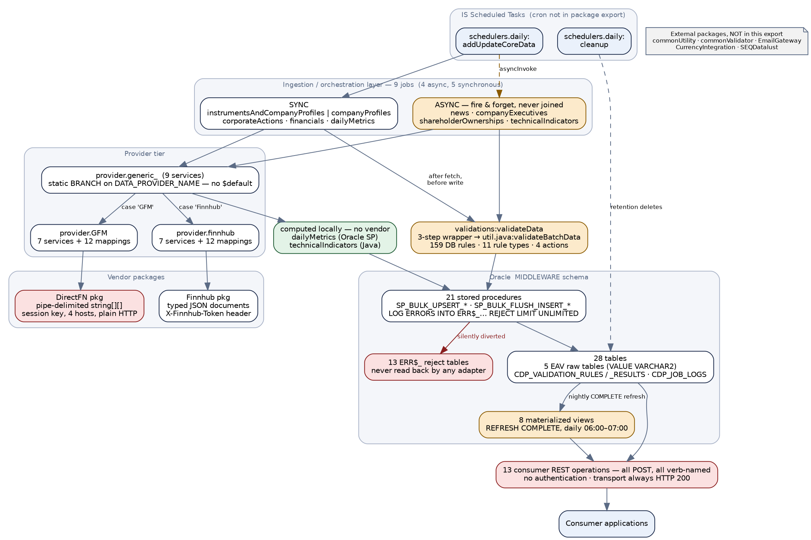
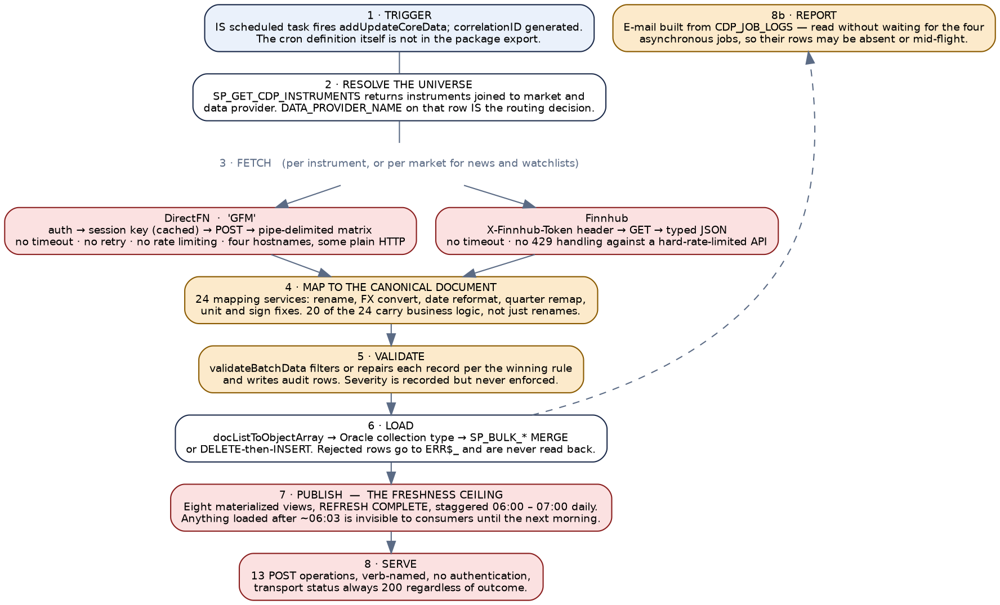
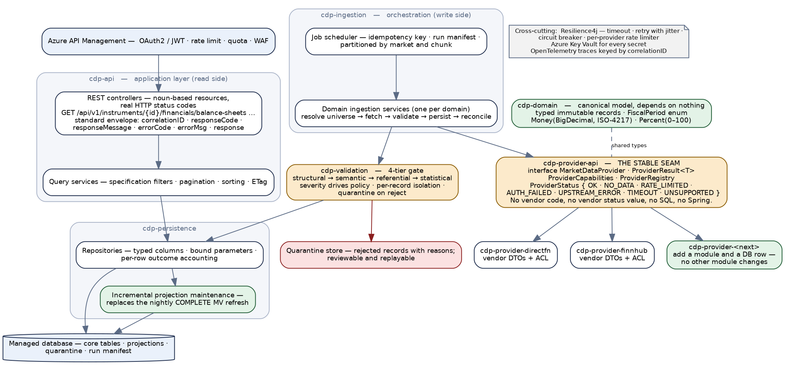
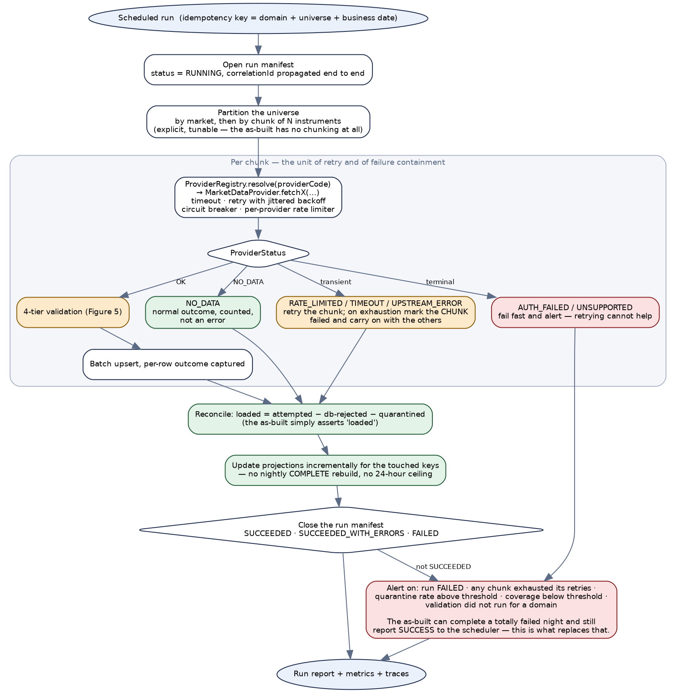
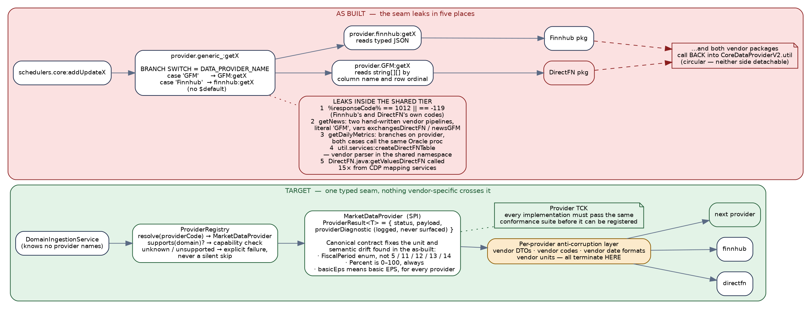
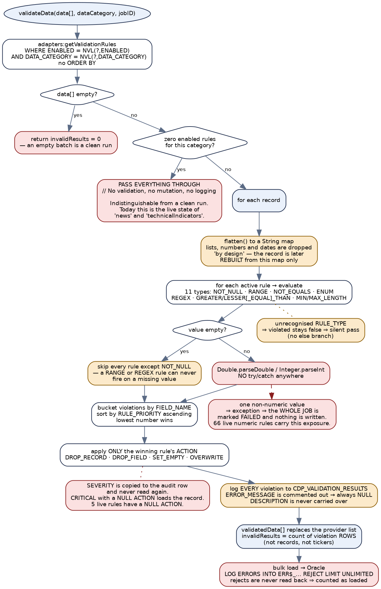
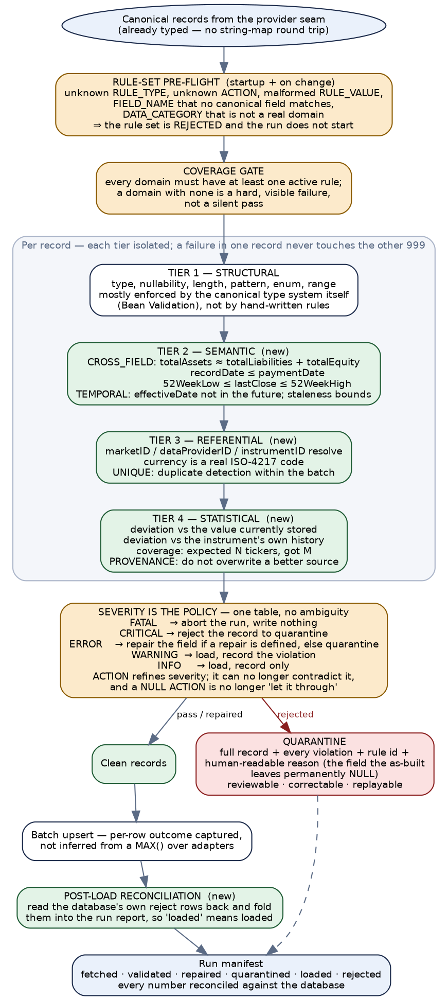

*AL RAMZ CAPITAL*
*MIDDLEWARE MIGRATION PROGRAMME*

# Core Data Provider Engine

CoreDataProviderV2  +  DirectFN  +  Finnhub

Engine Documentation, Layering Assessment & Target Architecture

*Software AG webMethods  →  Azure Cloud / Spring Boot Migration*

## Document Control

| Attribute | Detail |
|---|---|
| Source packages | **CoreDataProviderV2** (76 Flow services, 48 JDBC adapter services, 12 document types, 17 Java services), **DirectFN** (45 Flow services, 46 adapter services, 15 Java services) and **Finnhub** (24 Flow services, 2 adapter services, 2 Java services) — webMethods Integration Server package exports. |
| Database source | Eight Oracle DDL / DML scripts supplied by the API owner: 28 tables, 13 `DBMS_ERRLOG` reject tables, 14 object and collection types, 21 stored procedures, 8 materialized views, and the seed data — including the **159 live rows of `CDP_VALIDATION_RULES`**, which the package export alone does not contain. |
| Scope of analysis | The whole engine, end to end: scheduling and orchestration, the provider-abstraction tier, both vendor integrations, the validation layer, the Oracle persistence and serving layer, and the 13 consumer-facing REST operations. Every behavioural claim in this document is sourced from that material — not inferred from a sibling service, and not carried over from another document in this programme. |
| Document version | v1.0 — first issue |
| Prepared for | Software AG webMethods → Azure Cloud / Spring Boot migration; specifically the two architectural requirements stated by the API owner: **a data-provider layer that stays independent of the application layer**, and **a strong validation layer in front of every database write**. |
| Conventions followed | Standardised response envelope, split Client-Input / Backend-Provider error tables, noun-based target endpoints with real HTTP status codes, and the `CDP` service-error-code prefix — consistent with the other documents in this programme. See `Error-Code-to-HTTP-Status-Mapping.md` for the shared legacy-code registry; Section 8.3 records where this service deliberately departs from it and why. |

> **Key migration notes — read first**
>
> **The engine is well-conceived and the two boundaries you care about already exist — but neither one currently holds.** There is a real provider-abstraction tier (`provider.generic_`, 9 services) and a real, data-driven validation layer (`validations:validateData` over `CDP_VALIDATION_RULES`). Both are the right shapes. This document's central finding is that each is undermined by a small number of specific, fixable defects rather than by its design, and Sections 5 and 6 address them one at a time.
> **The provider seam leaks in five identified places.** The most consequential: the shared, provider-agnostic tier hard-codes both vendors' private error codes in one expression — `%responseCode% == 1012 || %responseCode% == -119`, where `1012` is Finnhub's “no data” and `-119` is DirectFN's — repeated across five generic services. A third provider would have to impersonate one of those vendors' error vocabularies to be classified correctly. See Section 5.3.
> **Adding a third data provider today means editing eight Flow files, not adding a configuration row.** The dispatch is a hand-written two-case `BRANCH` on `DATA_PROVIDER_NAME` with **no `$default` case anywhere**. A row whose provider name is anything other than the exact strings `GFM` or `Finnhub` — including a new provider, a NULL, or a case difference — falls through silently, is never fetched, and is then classified against whatever the previous loop iteration happened to leave in the pipeline. See Section 5.1.
> **Both “swappable” vendor packages call back into CoreDataProviderV2.** `DirectFN.services.FinancialInformation:getFinancialInformation` — the exact service the GFM tier calls — invokes `CoreDataProviderV2.util.services:createDirectFNTable` twelve times, and Finnhub calls `CoreDataProviderV2.util.java:transformStringNewsToHTML`. The dependency is circular in both directions, so neither provider can be removed or replaced independently today. See Section 5.3.
> **Validation severity is recorded but never enforced.** `SEVERITY` appears in exactly one executable statement in the entire codebase — a copy into the audit row. Enforcement is driven solely by the `ACTION` column, whose database default is `NULL`, and whose action chain has no `else` branch. A rule whose `ACTION` is NULL or misspelled writes an audit row and **loads the bad record anyway**, whatever its severity says — five of the 159 live rules have a NULL action, and four `CRITICAL` rules carry a field-level repair rather than the record rejection their severity implies. See Section 6.4.
> **Two live data categories have no validation rules at all.** `news` and `technicalIndicators` are real `dataCategory` values passed by real jobs, and `CDP_VALIDATION_RULES` contains zero rows for either. The engine's response to an empty rule set is, verbatim from source, `// No validation, no mutation, no logging` — so those two domains load entirely unvalidated and the job log is indistinguishable from a clean validated run. See Section 6.5.
> **One malformed value can discard a whole batch.** The rule engine calls `Double.parseDouble` and `Integer.parseInt` with no `try`/`catch`, and `validateData` has no `CATCH` block. 66 of the 159 live rules are numeric comparisons over fields that are declared and stored as strings. A single vendor value of `"N/A"` or `"1,234.5"` in one record therefore aborts the entire job — 999 good records are lost because of one bad one, the exact inverse of the intended per-record isolation. See Section 6.3.
> **The database silently discards rows that validation passed.** Every bulk load procedure ends with `LOG ERRORS INTO ERR$_<table> REJECT LIMIT UNLIMITED`, and **no adapter in the package ever reads an `ERR$_` table back**. A row rejected by Oracle is counted as successfully loaded in `ADDUPDATED_TICKERS`. The success counters are upper bounds, not actuals. See Sections 7.3 and 7.4.
> **The read API cannot be fresher than the next morning.** All eight serving materialized views are `REFRESH COMPLETE ON DEMAND` on a daily schedule staggered between 06:00:00 and 07:00:00. Anything the ETL loads after roughly 06:03 is invisible to every consumer until the following day. Eight of the 13 consumer endpoints read one of these views. See Section 7.5.
> **Security must be treated as net-new, not as a port.** All 141 service definitions in CoreDataProviderV2 declare `check_internal_acls = no`; the manifest's `listACL` has been removed relative to its own backup; there is no WS-Security or any other policy; and 11 of the 12 read adapters build their `WHERE` clause by string interpolation of caller-supplied values rather than by binding them. Separately, the DirectFN package contains **hard-coded plaintext vendor credentials on active code paths**, one of them in a URL sent over unencrypted HTTP. See Sections 3.4, 8.1 and Appendix A.
> **A totally failed night still reports success.** Every one of the nine ingestion jobs wraps its body in a `TRY` whose `CATCH` ends by writing `STATUS = 'FAILED'` to the job log and then returns normally — there is no `EXIT SIGNAL="FAILURE"` anywhere in the layer, the orchestrator has no error handling of its own, and nothing checks the outcome afterwards. There is also **zero retry logic in the entire engine** and no timeout on any of the 64 outbound vendor HTTP calls. See Sections 4.4 and 4.5.

- [Core Data Provider Engine](#core-data-provider-engine)
  - [Document Control](#document-control)
- [1. Overview](#1-overview)
  - [1.1 Purpose](#11-purpose)
  - [1.2 Scope](#12-scope)
    - [In scope](#in-scope)
    - [Out of scope](#out-of-scope)
  - [1.3 Executive Summary](#13-executive-summary)
  - [1.4 How to read this document](#14-how-to-read-this-document)
- [2. Solution Architecture](#2-solution-architecture)
  - [2.1 As-Built Architecture](#21-as-built-architecture)
  - [2.2 End-to-End Data Journey](#22-end-to-end-data-journey)
  - [2.3 Layering assessment — where the boundaries actually hold](#23-layering-assessment-where-the-boundaries-actually-hold)
  - [2.4 Target Architecture](#24-target-architecture)
    - [2.4.1 Module structure and the dependency rule](#241-module-structure-and-the-dependency-rule)
  - [2.5 Target Response & Result Model](#25-target-response-result-model)
    - [2.5.1 The internal provider result](#251-the-internal-provider-result)
    - [2.5.2 The consumer response envelope](#252-the-consumer-response-envelope)
  - [2.6 What is deliberately kept](#26-what-is-deliberately-kept)
- [3. Prerequisites & Static Configuration](#3-prerequisites-static-configuration)
  - [3.1 Integration Server Global Variables](#31-integration-server-global-variables)
  - [3.2 Static / Feature-Flag Configuration](#32-static-feature-flag-configuration)
  - [3.3 Upstream / Downstream Dependencies](#33-upstream-downstream-dependencies)
  - [3.4 Security Notes](#34-security-notes)
    - [3.4.1 Access control](#341-access-control)
    - [3.4.2 Credential handling](#342-credential-handling)
    - [3.4.3 Injection surface](#343-injection-surface)
    - [3.4.4 Information disclosure](#344-information-disclosure)
- [4. Ingestion & Orchestration Layer](#4-ingestion-orchestration-layer)
  - [4.1 The daily orchestrator](#41-the-daily-orchestrator)
  - [4.2 The common job skeleton](#42-the-common-job-skeleton)
  - [4.3 Per-job reference](#43-per-job-reference)
  - [4.4 Job logging and counter semantics](#44-job-logging-and-counter-semantics)
  - [4.5 Resilience posture as built](#45-resilience-posture-as-built)
  - [4.6 Target Process Flow](#46-target-process-flow)
    - [4.6.1 The changes that matter most](#461-the-changes-that-matter-most)
- [5. Provider Abstraction Layer](#5-provider-abstraction-layer)
  - [5.1 The dispatch mechanism as built](#51-the-dispatch-mechanism-as-built)
    - [5.1.1 Three services that do not actually dispatch](#511-three-services-that-do-not-actually-dispatch)
  - [5.2 Canonical model and contract uniformity](#52-canonical-model-and-contract-uniformity)
  - [5.3 Abstraction leaks, ranked](#53-abstraction-leaks-ranked)
    - [Leak 1 — Both vendors' private error codes are hard-coded in the shared tier](#leak-1-both-vendors-private-error-codes-are-hard-coded-in-the-shared-tier)
    - [Leak 2 — `generic_:getNews` is not an abstraction; it is two vendor pipelines in one file](#leak-2-generic_getnews-is-not-an-abstraction-it-is-two-vendor-pipelines-in-one-file)
    - [Leak 3 — The shared tier encodes each provider's capability profile](#leak-3-the-shared-tier-encodes-each-providers-capability-profile)
    - [Leak 4 — A DirectFN-format parser lives in the shared utility namespace](#leak-4-a-directfn-format-parser-lives-in-the-shared-utility-namespace)
    - [Leak 5 — The circular package dependency](#leak-5-the-circular-package-dependency)
    - [5.3.1 One risk that was investigated and ruled out](#531-one-risk-that-was-investigated-and-ruled-out)
  - [5.4 Vendor capability matrix](#54-vendor-capability-matrix)
  - [5.5 Target design — the provider SPI](#55-target-design-the-provider-spi)
    - [5.5.1 How each as-built leak is closed](#551-how-each-as-built-leak-is-closed)
  - [5.6 What a provider swap costs, before and after](#56-what-a-provider-swap-costs-before-and-after)
  - [5.7 Provider conformance kit](#57-provider-conformance-kit)
- [6. Validation Layer](#6-validation-layer)
  - [6.1 The as-built engine](#61-the-as-built-engine)
  - [6.2 The live rule set](#62-the-live-rule-set)
  - [6.3 Rule semantics, precisely](#63-rule-semantics-precisely)
    - [6.3.1 The `ENUM` implementation — and why it currently works anyway](#631-the-enum-implementation-and-why-it-currently-works-anyway)
    - [6.3.2 The empty-value gate](#632-the-empty-value-gate)
    - [6.3.3 The priority contest, and one rule it renders toothless](#633-the-priority-contest-and-one-rule-it-renders-toothless)
    - [6.3.4 One malformed value discards the whole batch](#634-one-malformed-value-discards-the-whole-batch)
  - [6.4 Severity is recorded but never enforced](#64-severity-is-recorded-but-never-enforced)
  - [6.5 Validation gaps](#65-validation-gaps)
  - [6.6 Target validation architecture](#66-target-validation-architecture)
    - [6.6.1 Rule-set pre-flight](#661-rule-set-pre-flight)
    - [6.6.2 Severity is the policy](#662-severity-is-the-policy)
    - [6.6.3 The four tiers](#663-the-four-tiers)
    - [6.6.4 Per-record isolation and quarantine](#664-per-record-isolation-and-quarantine)
  - [6.7 Migrating the existing 159 rules](#67-migrating-the-existing-159-rules)
- [7. Persistence & Serving Layer](#7-persistence-serving-layer)
  - [7.1 Data model](#71-data-model)
    - [7.1.1 The EAV decision](#711-the-eav-decision)
  - [7.2 Bulk load procedures](#72-bulk-load-procedures)
    - [7.2.1 Procedure-level inconsistencies](#721-procedure-level-inconsistencies)
    - [7.2.2 Findings in `SP_CALCULATE_DAILY_METRICS`](#722-findings-in-sp_calculate_daily_metrics)
  - [7.3 DML error logging](#73-dml-error-logging)
  - [7.4 Job logs](#74-job-logs)
  - [7.5 The serving projections](#75-the-serving-projections)
  - [7.6 Target persistence design](#76-target-persistence-design)
- [8. Consumer API Layer](#8-consumer-api-layer)
  - [8.1 The exposed surface as built](#81-the-exposed-surface-as-built)
    - [8.1.1 The response envelope as built](#811-the-response-envelope-as-built)
    - [8.1.2 Error codes as built](#812-error-codes-as-built)
    - [8.1.3 SQL construction](#813-sql-construction)
    - [8.1.4 Unbounded reads](#814-unbounded-reads)
  - [8.2 Target endpoint design](#82-target-endpoint-design)
  - [8.3 Target status codes and error catalogue](#83-target-status-codes-and-error-catalogue)
    - [8.3.1 Client Input Errors — applies to all read endpoints](#831-client-input-errors-applies-to-all-read-endpoints)
    - [8.3.2 Backend / Provider Errors — applies to all read endpoints](#832-backend-provider-errors-applies-to-all-read-endpoints)
  - [8.4 Example target response envelopes](#84-example-target-response-envelopes)
    - [Success — a populated collection](#success-a-populated-collection)
    - [Success — a valid query matching nothing](#success-a-valid-query-matching-nothing)
    - [Client input error](#client-input-error)
    - [Backend / provider error — note what is absent](#backend-provider-error-note-what-is-absent)
- [9. Data Mapping Reference](#9-data-mapping-reference)
  - [9.1 Canonical document → Oracle collection type](#91-canonical-document-oracle-collection-type)
  - [9.2 Data category → storage → procedure](#92-data-category-storage-procedure)
  - [9.3 Vendor field mapping](#93-vendor-field-mapping)
- [10. Appendix](#10-appendix)
  - [10.1 Appendix A — Findings register](#101-appendix-a-findings-register)
    - [Critical](#critical)
    - [High](#high)
    - [Medium](#medium)
    - [Low](#low)
    - [10.1.1 Investigated and ruled out](#1011-investigated-and-ruled-out)
  - [10.2 Appendix B — Validation rule inventory](#102-appendix-b-validation-rule-inventory)
  - [10.3 Appendix C — Source DDL and target type mapping](#103-appendix-c-source-ddl-and-target-type-mapping)
  - [10.4 Appendix D — Glossary](#104-appendix-d-glossary)
  - [10.5 Appendix E — Still-open items](#105-appendix-e-still-open-items)
    - [Requires information not present in the export](#requires-information-not-present-in-the-export)
    - [Requires a decision from the API owner](#requires-a-decision-from-the-api-owner)
    - [Recommended before migration, independent of it](#recommended-before-migration-independent-of-it)


# 1. Overview


## 1.1 Purpose


The Core Data Provider (CDP) engine is Al Ramz Capital's reference-data ETL platform. It pulls instrument masters, company profiles, financial statements, ratios, corporate actions, news, company executives, shareholder ownerships, technical indicators and daily valuation metrics from external market-data vendors, normalises them into a canonical internal model, validates them against a database-driven rule set, loads them into the `MIDDLEWARE` Oracle schema, and serves them to downstream applications through thirteen REST operations.

This document has three jobs. First, to record exactly how the engine works today — comprehensively enough that the behaviour can be reproduced in Spring Boot without access to the webMethods source. Second, to assess the two architectural boundaries the API owner has asked to protect through the migration: the separation between the **data-provider layer** and the **application layer**, and the strength of the **validation layer** that guards every database write. Third, to propose a target design that preserves what the current engine gets right, and fixes — explicitly and one at a time — what it gets wrong.

Where this document proposes rather than reports, it says so. Every statement of current behaviour is sourced from the supplied package exports and database scripts; every recommendation is marked as a target-design proposal and carries the reasoning that produced it.


## 1.2 Scope


### In scope


- **The `CoreDataProviderV2` package in full** — all 76 Flow services across `schedulers`, `provider`, `services`, `validations` and `util`; all 48 JDBC adapter services; all 12 canonical document types; and all 17 Java services, including the validation engine.
- **The `DirectFN` and `Finnhub` vendor packages**, to the depth required to document the coupling surface between them and CDP: every endpoint called, how each is authenticated, the response shapes, the failure semantics, and precisely which fields CDP consumes.
- **The complete Oracle data layer** as supplied: 28 tables, 13 `DBMS_ERRLOG` reject tables, 14 object and collection types, 21 stored procedures, 8 materialized views, and the seed data — including the live validation rule set.
- **The 13 consumer-facing REST operations** and the read path that backs them, including materialized-view dependency and freshness.
- **The target Spring Boot / Azure design** for all of the above, with particular depth on the provider-abstraction seam (Section 5.5) and the validation layer (Section 6.6).


### Out of scope


- **Five packages that CDP calls but that were not part of this export**: `commonUtility` (GUID generation, `asyncInvoke`, `getStaticData`, `checkAndThrowError`), `commonValidator` (`genericValidator:validateInputList`, which performs all consumer-facing input validation), `EmailGateway`, `CurrencyIntegration` (FX rates) and `SEQDatalust` (observability). Their behaviour is stated as unknown wherever it matters, never guessed.
- **Integration Server configuration**: scheduled-task definitions (cron expressions, concurrency, run-as user), JDBC connection-alias definitions and their transaction settings, global-variable values, and the contents of the `MIDDLEWARE` static-data store. None of these live in a package export.
- **The Broker Insight backoffice schema** reached over the `MIDDLEWARE_T_BROK` database link and the `RMZ` connection, beyond documenting which objects are read and what the dependency implies for the target.
- Migration sequencing, environment topology, cutover planning, cost modelling and licensing — all of which depend on decisions outside this document.
- Any change to the shared `Error-Code-to-HTTP-Status-Mapping.md` registry. Section 8.3 documents one deliberate, scoped deviation for this service; it does not propose altering the registry or any other service that uses it.


## 1.3 Executive Summary


CDP is a genuinely enterprise-grade design executed on a platform that could not enforce its own abstractions. The layering is deliberate: a scheduling tier, a provider-dispatch tier with per-vendor implementations behind it, a canonical document model, a data-driven validation gate, bulk set-based persistence with row-level error diversion, and a separate read path served from materialized projections. That is the right architecture. Very little of the target design proposed here is new thinking — most of it is the existing intent, made enforceable.

What has gone wrong is almost entirely a consequence of webMethods Flow having no type system, no module boundaries and no compile step. There is nothing in the platform that can prevent a shared service from referencing a vendor's private error code, prevent a vendor package from calling back into its own consumer, or prevent a rule engine's `SEVERITY` column from being declared, documented, populated with four distinct values across 159 rows, and then never read. Each of those things has happened, and none of them would survive a compiler.

Concretely, the analysis found: five distinct leaks across the provider seam, including two vendor error codes hard-coded into shared code and a circular package dependency in both directions; a validation layer whose severity column is inert, whose default action is to let bad data through, whose `ENUM` rule type is implemented with a Java regex bug that happens to work only because both live `ENUM` rules use single-character values, and which has no rules at all for two of the twelve live data categories; a persistence layer that diverts rejected rows to error tables nobody reads and then reports those rows as loaded; a serving layer whose freshness ceiling is the next morning's 06:00 materialized-view rebuild; an API layer with no authentication, no bound parameters in eleven of twelve read adapters, and a transport status of 200 on every response including internal errors; and an operational posture with no retries, no timeouts, no circuit breakers, no rate limiting against a hard-rate-limited vendor, and no alerting path — a completely failed nightly run returns success to the scheduler.

None of these is exotic. Each has a specific, bounded fix, and the migration is the natural moment to apply them, because most of the fixes are things a typed, modular runtime gives you nearly for free. The proposed target keeps the existing shape — same layers, same canonical model, same database-driven rules — and adds the three things the current platform cannot provide: **enforced module boundaries** so the provider seam cannot leak, **a typed canonical contract** so unit and semantic drift between vendors becomes a compile error or a conformance-test failure rather than a silent data-quality incident, and **a validation layer where severity is the policy** rather than a comment.


## 1.4 How to read this document


Sections 2 through 4 establish the engine as built: architecture, configuration, and the ingestion tier. Sections 5 and 6 are the heart of the document and correspond directly to the two requirements the API owner stated — provider independence and validation strength. Each of those sections is organised the same way: what exists today, what is wrong with it and how that was established, then the target design and the migration path. Sections 7 and 8 cover persistence and the consumer API. Section 9 is the mapping reference, and Section 10 is the appendix, which carries the consolidated findings register, the full validation rule inventory, the source DDL, and the still-open items.

> **A note on evidence and on what could not be determined**
>
> Every factual claim carries its source. Findings sourced from Flow XML cite the file and line; findings sourced from the database scripts cite the object. Where the two disagree, both are shown and the disagreement is itself reported.
> Several questions could not be settled from the supplied material, and are listed in Appendix E rather than answered speculatively. The most significant are: the Integration Server scheduled-task definitions (so the actual run times and concurrency of the nightly jobs are unknown), the JDBC connection aliases' transaction settings, the values behind the static-data configuration keys, and the behaviour of the five external packages listed in Section 1.2.
> Two claims that a first pass of this analysis produced were subsequently **disproved** by cross-checking one source against another, and have been removed rather than shipped. Both are recorded in Appendix A under “Ruled out”, with the evidence that ruled them out, so that a later round does not re-raise them.


# 2. Solution Architecture


## 2.1 As-Built Architecture


Figure 1 shows the engine as it exists today. The shading is diagnostic rather than decorative: amber marks a component that works but carries a documented defect or a design risk, and red marks a component whose current behaviour is a finding in its own right. Everything unshaded is sound.



*Figure 1 — As-built architecture of the Core Data Provider engine. Amber denotes a documented defect or design risk; red denotes a finding.*

Reading the figure top to bottom: Integration Server scheduled tasks fire `schedulers.daily:addUpdateCoreData`, which dispatches nine domain jobs — five synchronously and four through `commonUtility.java:asyncInvoke` with no join. Each job resolves its instrument universe from Oracle, calls the matching `provider.generic_` service, which branches on the `DATA_PROVIDER_NAME` column carried on each instrument row to reach either the `GFM` (DirectFN) or `finnhub` implementation. Two domains — daily metrics and technical indicators — are not vendor-sourced at all and are computed locally, one in an Oracle procedure and one in a Java service.

Results are mapped into one of twelve canonical document types, passed through `validations:validateData`, flattened into Oracle collection types and loaded by one of eleven bulk procedures. Rows that Oracle rejects are diverted to `ERR$_` tables which nothing ever reads. Eight materialized views rebuild nightly from the loaded tables and back eight of the thirteen consumer REST operations.


## 2.2 End-to-End Data Journey


Figure 2 follows a single nightly cycle through all eight stages, and is the fastest way to see where the engine's structural risks sit relative to one another.



*Figure 2 — One nightly ETL cycle, end to end, across every legacy system involved.*

> **The three structural risks visible in the journey**
>
> **Stage 3 — no resilience at the vendor boundary.** Neither vendor call has a timeout, a retry, a circuit breaker or any rate limiting. Finnhub in particular is a hard-rate-limited API being called without pacing, and `getHistoricalQuotes` issues up to 100 back-to-back requests in a loop. A transient vendor problem becomes a lost night, and there is no mechanism to notice.
> **Stage 5 to 6 — the gate does not close, and the loss after it is invisible.** Validation can filter a record out, but only when a rule's `ACTION` column literally says `DROP_RECORD`; and whatever survives can still be rejected by Oracle into an `ERR$_` table that no part of the system reads back. The engine has two independent ways to discard a record silently.
> **Stage 7 — the freshness ceiling.** The nightly `REFRESH COMPLETE` between 06:00 and 07:00 is the only way loaded data reaches eight of the thirteen consumer endpoints. This is the single highest-leverage thing the migration can fix, and Section 7.6 proposes replacing it with incremental projection maintenance on write.


## 2.3 Layering assessment — where the boundaries actually hold


Because provider independence is a stated requirement rather than an incidental concern, it is worth being precise about which parts of the current boundary are sound and which are not. The result is more encouraging than the finding count suggests.

| Boundary | Holds? | Evidence |
|---|---|---|
| Ingestion → provider tier | **Yes — clean** | All nine `schedulers.core:addUpdate*` jobs call exactly one `provider.generic_` service each, 1:1. No scheduler references `provider.GFM` or `provider.finnhub` directly, and no scheduler references `DirectFN` or `Finnhub`. This boundary can be carried into the target unchanged. |
| Provider tier → vendor packages | **Yes — clean at the service level** | Every `provider.GFM subtree` service that reaches a vendor targets the `DirectFN` namespace; every `provider.finnhub subtree` service targets `Finnhub`. Exhaustive grep found zero cross-wiring in either direction, and no `provider.generic_` service calls a vendor package directly. |
| Shared tier free of vendor concepts | **No** | Five distinct leaks, ranked in Section 5.3. The most serious is `%responseCode% == 1012 \|\| %responseCode% == -119` in five generic services — both literals are vendor-private codes. |
| Canonical model is genuinely canonical | **No — nominal in places** | The same canonical field carries different meanings per provider: `basicEpsReported` is basic EPS from DirectFN and diluted EPS from Finnhub; `percentageOwnership` is a percentage from one path and a fraction from the other; `quarter` uses two unrelated code systems. Section 5.2. |
| Vendor packages independent of CDP | **No — circular** | `DirectFN.services.FinancialInformation:getFinancialInformation` calls `CoreDataProviderV2.util.services:createDirectFNTable` twelve times and `CoreDataProviderV2.util.java:stringTableToDocumentList` twelve times; `Finnhub` calls `CoreDataProviderV2.util.java:transformStringNewsToHTML`. Neither package can be deployed or replaced independently. |
| Application (read) tier free of vendor concepts | **Almost — one packaging dependency** | Five read services import `DirectFN.java:appendToStringList`. This is a generic list utility that merely happens to live in a vendor package, so no market data flows through it — but the read layer cannot be built without the DirectFN package present. A packaging dependency, not a data-path leak. |
| Validation independent of provider | **Yes** | `validateBatchData` receives only `data`, `validationRules`, `dataCategory` and `jobID`. It has no provider awareness and no database access. This is a genuinely clean design and is preserved in the target. |

The conclusion that matters for planning: **the structure is right and the top and bottom of the seam are clean.** What leaks is the middle — specifically, vendor vocabulary that has crept into shared code, and a canonical model that is canonical in name but not in unit or meaning. Both are addressable without redesigning the engine, and Section 5.5 sets out how.


## 2.4 Target Architecture


Figure 3 is the proposed Spring Boot / Azure target. It is deliberately the same architecture as Figure 1 — the same layers, in the same order, doing the same jobs. The differences are that each boundary is now a module boundary a build can enforce, the canonical model is typed, the provider seam is an interface rather than a naming convention, and the validation layer is a gate rather than a log.



*Figure 3 — Target architecture. Green denotes a component that is new or substantially redesigned; amber denotes the two seams that carry the stated architectural requirements.*


### 2.4.1 Module structure and the dependency rule


The single most important structural decision is that `cdp-provider-api` — the seam — depends on nothing except `cdp-domain`, and that no provider implementation is visible to anything except through it. In a Maven or Gradle multi-module build this is a compile-time guarantee rather than a convention, which is exactly what the current platform cannot offer.

| Module | Contains | May depend on |
|---|---|---|
| `cdp-domain` | The canonical model: typed, immutable records for all twelve domains, plus the value types that carry the semantics the as-built model loses — `FiscalPeriod`, `Money(BigDecimal, Currency)`, `Percent`, `InstrumentRef`. | Nothing. No Spring, no JDBC, no vendor library. |
| `cdp-provider-api` | `MarketDataProvider`, `ProviderResult<T>`, `ProviderStatus`, `ProviderCapabilities`, `ProviderRegistry`, `ProviderRequest`. | `cdp-domain` only. |
| `cdp-provider-directfn` | The DirectFN client, its vendor DTOs, its authentication and session handling, and the anti-corruption layer that maps vendor codes, dates, units and column ordinals into the canonical model. | `cdp-provider-api`, `cdp-domain`. **Must not be a compile dependency of anything else.** |
| `cdp-provider-finnhub` | As above, for Finnhub. | `cdp-provider-api`, `cdp-domain`. Same restriction. |
| `cdp-validation` | The rule model, the four-tier evaluation pipeline, the severity policy, and the quarantine writer. | `cdp-domain`. |
| `cdp-persistence` | Repositories, batch upsert with per-row outcome accounting, projection maintenance, quarantine and run-manifest storage. | `cdp-domain`. |
| `cdp-ingestion` | Job scheduling, partitioning, the per-domain orchestration services, reconciliation and the run manifest. | `cdp-provider-api`, `cdp-validation`, `cdp-persistence`, `cdp-domain`. **Never a provider implementation.** |
| `cdp-api` | REST controllers, request and response DTOs, query services. | `cdp-persistence`, `cdp-domain`. |

> **Enforce the dependency rule mechanically, not by review**
>
> The as-built engine demonstrates what happens when layering is a convention: `createDirectFNTable` — a DirectFN-format parser — sits in `CoreDataProviderV2.util.services` alongside genuinely generic helpers, and both vendor packages call back into CDP. Nobody decided that; it accreted.
> Recommendation: add an **ArchUnit** test to the build asserting that no class outside `cdp-provider-directfn` imports anything from it, and likewise for each provider module; and that `cdp-domain` imports nothing from the rest of the codebase. A build that fails on a boundary violation is the only mechanism that reliably survives years of maintenance.
> This is cheap — roughly a dozen assertions — and it is the direct, mechanical answer to the requirement to keep the provider layer independent.


## 2.5 Target Response & Result Model


Two distinct result models are needed, and conflating them is part of why the current engine surfaces vendor errors to consumers. They are specified separately below.


### 2.5.1 The internal provider result


Every provider call returns a `ProviderResult<T>`. It is not an HTTP concept and it never reaches a consumer. Its purpose is to let shared orchestration code classify an outcome **without knowing which vendor produced it** — which is precisely what the `1012 || -119` expression does today, and precisely what makes a provider swap expensive.

```
public record ProviderResult<T>(
        ProviderStatus status,
        T payload,                       // null unless status == OK
        ProviderDiagnostic diagnostic    // vendor code + message + latency;
) { }                                    // logged server-side, NEVER surfaced to a caller

public enum ProviderStatus {
    OK,              // data returned
    NO_DATA,         // provider was reached, query was valid, nothing matched.
                     //   A normal outcome, not an error. Replaces 1012 / -119.
    RATE_LIMITED,    // retryable, with backoff. Nothing in the as-built detects this.
    TIMEOUT,         // retryable
    UPSTREAM_ERROR,  // retryable a bounded number of times
    AUTH_FAILED,     // NOT retryable - alert immediately
    UNSUPPORTED      // this provider does not implement this domain.
                     //   Explicit, and checkable in advance via ProviderCapabilities.
}
```

The mapping from each vendor's own vocabulary into this enum is the responsibility of that provider's anti-corruption layer and lives nowhere else. DirectFN's `-119` and Finnhub's `1012` both become `NO_DATA` inside their respective modules; shared code sees only `NO_DATA`. Adding a provider means writing one more such mapping — it does not mean touching shared code, which is the whole point.


### 2.5.2 The consumer response envelope


Every target REST response carries the programme-standard envelope. Unlike the as-built, the transport status code is meaningful and the envelope's `responseCode` mirrors it.

| Field | Type | Nullable | Meaning |
|---|---|---|---|
| `correlationID` | String (UUID) | No | Echoes the caller's `X-Correlation-ID` when supplied, otherwise generated. Propagated through every log line, trace span and downstream call. The as-built already does this well and it is carried forward unchanged. |
| `responseCode` | String | No | Mirrors the actual HTTP status, e.g. `"200"`, `"400"`, `"404"`. Always present. |
| `responseMessage` | String | No | The HTTP reason phrase, e.g. `"OK"`, `"Bad Request"`. Always present. |
| `errorCode` | String | Yes | The service-specific `CDP`-prefixed code. Populated **only** for client-input errors. `null` on success and on every backend or provider failure. |
| `errorMsg` | String | Yes | A caller-actionable message. Same rule as `errorCode`. |
| `response` | Object | Yes | The payload. `null` on error. For collection endpoints this is an object containing the array plus page metadata — never a bare array, so the shape stays stable when pagination metadata is added. |

> **Two rules the as-built breaks, carried into the target as hard constraints**
>
> **Provider detail never reaches a consumer.** Today, nine of the thirteen endpoints return a `lastError` object containing the raw Oracle or Java exception — on endpoints with no authentication. In the target, `errorCode`/`errorMsg` are populated only for client-input errors; every backend or provider failure returns the generic `responseCode`/`responseMessage` pair, with the real detail logged server-side against the correlation ID. This is the split that Sections 8.3.1 and 8.3.2 formalise into two separate error tables per endpoint.
> **The transport status tells the truth.** Today every response is HTTP 200 — success, no-data, validation failure and internal error alike — because no service ever calls `pub.flow:setResponseCode`. Callers cannot use standard HTTP tooling, retries, circuit breakers or monitoring against these endpoints. In the target, the status code carries the outcome and `responseCode` mirrors it.


## 2.6 What is deliberately kept


It is as important to record what should not change. The following are good decisions in the current engine and are preserved in the target, in some cases strengthened:

- **A dispatch driven by data, not by deployment.** Routing on a `DATA_PROVIDER_NAME` column, resolved per instrument, means a single engine can serve markets sourced from different vendors and a provider can be changed for one market without redeploying. The target keeps this exactly; it only replaces the hand-written two-case branch with a registry lookup so that the set of providers is open rather than closed.
- **Database-driven validation rules.** Holding rules in `CDP_VALIDATION_RULES` rather than in code means a data steward can tighten a threshold without a release. This is the right call and the target keeps it, adding the rule-set pre-flight validation that the current engine lacks.
- **Set-based bulk loading through Oracle collection types.** Passing a whole batch as a collection type into a `MERGE` is far better than row-at-a-time DML, and the positional contract between the Flow `fieldNames` arrays and the Oracle object types was verified correct in all eight cases (Section 9.1). The target keeps batch semantics.
- **Row-level error diversion at load time.** `LOG ERRORS INTO ... REJECT LIMIT UNLIMITED` is the correct instinct — one bad row should not fail a batch of fifty thousand. The defect is not the diversion; it is that nothing reads the diverted rows back. The target keeps the mechanism and adds the reconciliation step.
- **A separate serving projection.** Decoupling the read model from the normalised write model is sound. The defect is the refresh strategy, not the idea. The target keeps the projection and changes how it is maintained.
- **Correlation IDs threaded end to end.** Already present, already consistent, and genuinely useful. Carried forward.
- **The `ALLOW_UPDATE` / `ALLOW_FLUSH` protection flags.** These let a steward pin a manually corrected value so an automated load cannot overwrite it — a real requirement in reference-data management, and a thoughtful piece of design. The target preserves the semantics and Section 6.6 extends the idea into the provenance rule type.


# 3. Prerequisites & Static Configuration


This section records everything the engine needs from its environment in order to run. For the target service each item becomes either a configuration property, a Key Vault secret, or a health-check dependency — the final column says which.


## 3.1 Integration Server Global Variables


The engine is remarkably light on Integration Server global variables — configuration is instead concentrated in the database-backed static-data store described in Section 3.2. Exhaustive grep across all three packages found the following.

| Variable | Used by | Purpose | Target treatment |
|---|---|---|---|
| `%location%` | `schedulers.daily:addUpdateCoreData` (flow.xml:9709), `GLOBALVARIABLES="true"` | Environment tag prefixed to the nightly report e-mail subject: `[%location%] %emailReportSubject%`. **Unguarded** — if the global is undefined the literal string `%location%` is sent in the subject line. | `spring.profiles.active` / an `app.environment` property. Fail fast on startup if unset. |
| `%KEY_FINNHUB_ACCESS_TOKEN%` | `Finnhub.services.common:getStockSymbol` (flow.xml:892), `FundamentalData:getCompanyProfile` (:12001), `FundamentalData:getETFCompanyProfile` (:1703) | The Finnhub API key, read as an IS global variable at these three call sites only. **The other 17 call sites read the same secret from the static-data store instead** — two independent stores for one credential. | Azure Key Vault, single source. See the callout below. |

> **Finding — the Finnhub API key has two sources of truth**
>
> 17 call sites resolve the key through `commonUtility.v2.services:getStaticData` with `application='MIDDLEWARE'`, `key='KEY_FINNHUB_ACCESS_TOKEN'`. Three resolve it from an Integration Server global variable of the same name.
> A key rotation applied to one store leaves the other three call sites on a stale key, and the failure mode is a partial, confusing outage rather than a clean one. Which store is authoritative today is **not determinable from this export** — the `config/` directory in the export is empty.
> Target: one secret, in Azure Key Vault, resolved through Spring Cloud Azure config, with rotation handled by the platform. This is a prerequisite item for cutover, not an optional improvement.


## 3.2 Static / Feature-Flag Configuration


The engine's real configuration surface is the `MIDDLEWARE` static-data store, read through `commonUtility.services:getStaticData`. That package is not part of this export, so the store's contents are unknown; the keys the engine asks for, however, are all recoverable from source and are listed below. The supplied seed script inserts two rows into `MIDDLEWARE.STATIC_DATA` — `CDP_JOB_LOGS_REPORT_TO` and `CDP_JOB_LOGS_REPORT_FROM`. A third key, `OTP_POPULAR_SYMBOLS`, is maintained by the eighth supplied script, which rebuilds it as an ordered comma-separated list of instrument IDs after each instrument load — but note that script is an `UPDATE … WHERE key = 'OTP_POPULAR_SYMBOLS'` with no corresponding `INSERT` anywhere in the supplied scripts, so on a fresh environment it silently affects zero rows.

| Key | Read by | Purpose |
|---|---|---|
| `DIRECT_FN_BASE_URL` | All eleven DirectFN `services.FundamentalData` and `services.FinancialInformation` services | The **entire** DirectFN request URL — no path is appended; the configured value is copied straight into `/url`. Note that the remaining DirectFN services bypass this key and use hard-coded literal URLs instead (Section 3.4). |
| `FINNHUB_BASE_URL` | Most `Finnhub.services.*` | Base URL; each service appends its own hard-coded path suffix (`/profile`, `/metric`, `/financials`, `/executive`, `/ownership`, `/dividend`, `/company-news`, `/candle`, `/symbol`, `/indicator`). |
| `KEY_FINNHUB_ACCESS_TOKEN` | 17 Finnhub call sites | API key, sent as the `X-Finnhub-Token` request header. See Section 3.1 for the duplicate-store finding. |
| `FINNHUB_ETF_BASE_URL`, `FINNHUB_ETF_PROFILE_PATH` | `getCompanyProfile` ETF fallback, `getETFCompanyProfile` | Separate base URL and path for the ETF profile endpoint. |
| `FINNHUB_STOCK_SYMBOL_PATH` | `Finnhub.services.common:getStockSymbol` | Path suffix for the symbol-universe endpoint. |
| `CDP_JOB_LOGS_REPORT_FROM`, `CDP_JOB_LOGS_REPORT_TO` | `schedulers.daily:addUpdateCoreData` (flow.xml:9045, :9119) | Sender and recipient for the nightly job-log e-mail report. |
| `OTP_POPULAR_SYMBOLS` | Updated by supplied script 8 (never inserted by any supplied script); not read anywhere in this export | A hand-ranked, comma-separated list of instrument IDs for twelve named tickers (`JPM`, `WMT`, `MSFT`, `AAPL`, `EMIRATESNBD`, `EMPOWER`, `ADCB`, `ADIB`, `ABOB.MSX`, `1120`, `1180`, `2222`), rebuilt after each instrument load. The consumer is outside this export. |

> **Business-logic observation for the target design — the popular-symbols list**
>
> Script 8 rebuilds `OTP_POPULAR_SYMBOLS` with a `LISTAGG` over a `CASE` expression that hard-codes twelve ticker symbols and their display order, then writes the result as one comma-separated string into a key-value table.
> Two things follow. First, the ordering rule is business configuration expressed as deployment SQL — changing the list means editing and re-running a script. Second, the resulting value is a delimited list crammed into a single scalar, which is the pattern this programme's conventions flag for replacement with a proper collection type.
> **Recommendation (target design, not current behaviour):** model this as a small `cdp_featured_instruments` table with an explicit `display_order` column and an effective-dated flag, exposed through the API as a proper collection. It is a twelve-row table that removes a deployment step and a delimited-string parse. Confirm with the API owner who consumes the key before changing its shape, since the consumer is outside this export.


## 3.3 Upstream / Downstream Dependencies


The following must be reachable for the engine to function. Each is a candidate health-check dependency for the target service, and the final column proposes how the target should behave when it is unavailable — a question the current engine does not ask, since it has no health endpoint and no circuit breaker.

| Dependency | Used for | Criticality & proposed degradation behaviour |
|---|---|---|
| **Oracle `MIDDLEWARE` schema** — aliases `MiddlewareConnection:Middleware` and `:MiddlewareNoTrans` | Everything: the instrument universe, all writes, the validation rules, the job log, and all thirteen read endpoints. | **Hard.** No meaningful degradation is possible. Readiness probe must fail. Note the deliberate use of a second, non-transactional alias for `insertJobLog` / `updateJobLog` so that a job-log row survives a rollback of the data write — a good pattern, and one the target should preserve explicitly. |
| **DirectFN** — hosts `uds.feedgfm.com`, `uds.feedgma.com`, `uds-gtn.feedgma.com`, `searchservice*.feedgma.com` | The `GFM` provider: instruments, company profiles, financials, corporate actions, news, executives, ownerships. Uniquely also supplies splits, announcements, filings and Arabic-language content. | **Per-provider, per-domain.** The target should mark the affected markets' ingestion as degraded and continue with other providers, rather than failing the whole run. Today there is no such isolation. |
| **Finnhub** — `FINNHUB_BASE_URL` | The `Finnhub` provider: the same seven domains for its markets. Uniquely supplies FIGI/MIC/SEDOL identifiers and ETF profiles. | **Per-provider, per-domain**, as above. Additionally rate-limited: the target must pace calls, which the as-built does not. |
| **Broker Insight backoffice** via DB link `MIDDLEWARE_T_BROK` (`insight.CB_PRICES`, `insight.CB_SEC_COMP`, `insight.MARKET`, `insight.HOLIDAY_LIST`, `insight.MARKETS_WEEKENDS`) | `SP_CALCULATE_DAILY_METRICS` (prices for returns, dividend yield, P/E, P/B), `SP_GET_CDP_MARKET_HOLIDAYS`, `SP_GET_CDP_MARKET_WEEKENDS`. | **Hard for daily metrics and market calendars.** See the callout below — the current failure mode is silent and this is a significant finding. |
| **`RMZ:RMZ` connection** → `insight.cb_prices`, `insight.cb_sec_comp` | `adapters:getDailyHistoricalPricesFIT`, the OHLCV source for locally computed technical indicators. | **Hard for technical indicators.** A second, separately configured database connection to the same backoffice estate reached a different way — worth consolidating in the target. |
| `commonUtility` | GUID generation, `asyncInvoke`, `getStaticData`, `checkAndThrowError`. | **Hard**, and pervasive. Replaced in the target by framework primitives — `UUID.randomUUID()`, the job scheduler, Spring configuration, and ordinary exceptions. |
| `commonValidator` | `genericValidator:validateInputList` — all consumer-facing input validation on all thirteen read endpoints. | **Hard for the read API.** Replaced by Bean Validation on the request DTOs. Note that its error-code space is unknown, which is why Section 8.3 can only list the three codes CDP pattern-matches against. |
| `CurrencyIntegration` | `MWservices:getCurrencyExchangeRate`, called by `util.services:convertToCurrency` with `precision='daily'`. | **Hard for any FX-converted field.** On failure the service explicitly throws via `checkAndThrowError`, which is correct behaviour and better than most of the engine's error handling. |
| `EmailGateway` | The nightly job-log report only. | **Soft.** A failure here should never affect ingestion. In the as-built it is the last step of the orchestrator and outside any try/catch, so it can abort the orchestrator after all data work has completed — harmless in practice but untidy. |
| `SEQDatalust` | `services:asynchronousIngestion` — fire-and-forget request/response logging. | **Soft.** Present in 8 of the 13 read services — absent from `getScreenerComparableRatios`, `getStockSummaries`, `getResearchMarketData`, `getStockSentiments` and `getTechnicalIndicators` — and in 6 of the 7 GFM provider services (notably absent from `GFM:getFinancialStatements`), so observability coverage is partial today. Replaced wholesale by OpenTelemetry. |

> **Finding — a broken backoffice link produces silent NULLs, not an error**
>
> `SP_CALCULATE_DAILY_METRICS` wraps every one of its fifteen `BEGIN … EXCEPTION` blocks in `BEGIN … EXCEPTION WHEN NO_DATA_FOUND THEN <metric> := NULL; WHEN OTHERS THEN <metric> := NULL; END;`.
> `WHEN OTHERS` catches everything — including `ORA-02019` (database link not found), a dropped link, a permissions failure, or the backoffice being down. The procedure returns successfully with every metric NULL, the ingestion job records success, and the daily-metrics load writes nothing for those keys.
> The observable symptom of a total backoffice outage is therefore identical to the symptom of an instrument that legitimately has no price history. There is no signal anywhere that distinguishes them.
> **Target:** catch `NO_DATA_FOUND` only, and let anything else propagate as a genuine failure. Add a coverage check to the run manifest — “expected N instruments to produce a last close price, got M” — which is the statistical-tier validation proposed in Section 6.6 doing exactly the job it exists for.


## 3.4 Security Notes


The legacy answer to “what authentication and authorisation does this engine enforce?” is, with evidence, **none**. That absence is itself the most important input to the target design, so it is documented explicitly rather than omitted.


### 3.4.1 Access control


| Control | As-built state | Evidence |
|---|---|---|
| Service-level ACLs | Not enforced anywhere | `check_internal_acls = no` on **all 141 service definitions** in `CoreDataProviderV2`, and on all 134 in the two vendor packages. No `exec_acl`, `read_acl` or `write_acl` attribute exists on any node in any of the three packages. |
| Package list ACL | Removed | `manifest.v3` contains `<null name="listACL"/>`. The superseded `manifest.bak` had `<value name="listACL">Default</value>` — so the setting was actively removed relative to its own backup. |
| WS-Security or any policy | None | Case-insensitive grep across the entire export for `wssecurity`, `ws-security`, `policyname` and `<policy` returns zero matches. The REST resource's `attributes` array is empty and `originUri` is null. |
| Transport | No authentication on the 13 consumer operations | The REST resource declares 13 operations with no security attributes. Every service additionally permits all eight HTTP methods at the `/invoke` endpoint (`allowedHTTPMethods` lists `TRACE, HEAD, DELETE, POST, GET, OPTIONS, PUT, PATCH`), even though the REST resource itself restricts to POST. |
| Auditing | Off | `audit_level = off` and `auditoption = 0` on all thirteen consumer services. The only observability is the fire-and-forget `SEQDatalust` call, present in 8 of the 13. |

Authentication and authorisation for these endpoints are therefore delegated entirely to Integration Server configuration and whatever reverse proxy sits in front of it — neither of which is in this export. **For the target this must be treated as a net-new requirement, not as a port of an existing control.** The proposed design places Azure API Management in front of the service with OAuth2 / JWT validation, per-client rate limits and quotas, and per-endpoint scopes; the service itself then enforces method-level authorisation rather than trusting the gateway alone.


### 3.4.2 Credential handling


> **Security finding — plaintext vendor credentials on active code paths**
>
> `ns/DirectFN/services/Authentication/userAuthentication/flow.xml` contains hard-coded vendor usernames and passwords as `MAPSET` literals on **active, non-disabled** branches: the `fundamental` credential pair at lines 3032 and 3052, and the `historical` pair at lines 3206 and 3226. A third copy of the `fundamental` pair is embedded directly in a literal URL at line 5223 — **over plain `http://`**, so the credentials traverse the network in clear text and appear in any proxy or access log on the path.
> `ns/DirectFN/services/Generic/generatePrice/flow.xml:305` embeds a second credential pair in a URL query string on an internet-facing GET. This service is published as `POST /generatePrice` on the DirectFN REST resource. The same pair is hard-coded again in `services/HistoricalData/intradayHistoricalData/flow.xml` at lines 1867, 1887, 1969 and 1989.
> A further set of credentials sits inside a large `DISABLED="true"` region spanning roughly lines 8–2928 of `userAuthentication` — not executed, but still shipped in the source.
> **The specific secret values are deliberately not reproduced in this document.** The file-and-line references above are sufficient to locate every occurrence.
> **Required actions, in order:** treat all of these credentials as compromised and rotate them at the vendor; move every secret to Azure Key Vault; move every vendor call to HTTPS; and remove the disabled region rather than migrating it. None of this should wait for the migration — the rotation in particular is independent of it.

By contrast, the Finnhub package contains **no hard-coded credentials** — exhaustive grep for literal tokens and long alphanumeric literals returns zero hits. Its only credential issue is the two-store problem described in Section 3.1.


### 3.4.3 Injection surface


Fifteen of the 48 CDP adapters use the webMethods `DynamicSQL` template, which substitutes a `${condition}` fragment into the SQL text before execution. Eleven of the twelve adapters backing consumer-facing reads build that fragment by interpolating caller-supplied request values directly into SQL. This is covered in full in Section 8.1.3; it is raised here because it belongs in any security assessment of the engine.

The one read adapter that does **not** do this is `getNews`, which uses positional bind parameters. It is the correct pattern and the proof that the rest could have used it.


### 3.4.4 Information disclosure


Nine of the thirteen consumer endpoints return a `lastError` object built from `pub.event:exceptionInfo`, containing the raw Oracle or Java exception text, on endpoints that require no authentication. Combined with the string-interpolated SQL above, this is the classic pairing that turns an injection surface into an exploitable one, because the error text tells an unauthenticated caller what the database did with their input. Section 2.5.2 makes the prohibition on surfacing provider and database detail a hard constraint of the target envelope.


# 4. Ingestion & Orchestration Layer


This section documents the nine domain jobs and the orchestrator that drives them — the write side of the engine. The read side is Section 8.


## 4.1 The daily orchestrator


`schedulers.daily:addUpdateCoreData` is the single entry point for a nightly run. Its declared inputs are `marketIDs`, `instrumentIDs`, `addNewInstruments` (required, enum `true`/`false`), `newsPeriodInDays` and `emailReportSubject`. It reads `correlationID` from the pipeline at line 8 but does not declare it as an input; when absent it generates one.

Its execution order is as follows. Steps marked **async** are dispatched through `commonUtility.java:asyncInvoke` with `cloneInputs='true'` and are **never joined**.

1. Resolve or generate the `correlationID`.
2. Branch on `addNewInstruments`: `true` → `addUpdateInstrumentsAndCompanyProfiles`; otherwise → `addUpdateCompanyProfiles`. These two are mutually exclusive, so at most eight of the nine jobs run in any invocation. **Synchronous.**
3. Dispatch `addUpdateNews` — **async** — unless `instrumentIDs` is supplied without `marketIDs`.
4. Dispatch `addUpdateCompanyExecutives` — **async**.
5. Dispatch `addUpdateShareholderOwnerships` — **async**.
6. Dispatch `addUpdateTechnicalIndicators` — **async**.
7. Invoke `addUpdateCorporateActions` — **synchronous**.
8. If `instrumentIDs` was supplied, invoke `addUpdateFinancials` for those instruments — **synchronous**.
9. If `marketIDs` was supplied, tokenise it on `,` and invoke `addUpdateFinancials` once **per market** — **synchronous**.
10. Invoke `addUpdateDailyMetrics` — **synchronous**.
11. Read `CDP_JOB_LOGS` by correlation ID, build an HTML table, and send the report e-mail.

> **Business-logic observations for the target design**
>
> **The report races the four asynchronous jobs.** Nothing waits for steps 3–6. The e-mail at step 11 queries `CDP_JOB_LOGS` by correlation ID with no barrier, so the rows for news, executives, ownerships and technical indicators may be absent or still `RUNNING` when the report is built. The report is therefore systematically incomplete, and more so on a slow night. In the target these become tracked job executions with a join before reporting.
> **Financials can run twice over overlapping universes.** Steps 8 and 9 sit under sibling branches that are not mutually exclusive. Supplying both `instrumentIDs` and `marketIDs` in one invocation runs `addUpdateFinancials` once for the instruments and again for every market — re-fetching from the vendor and re-loading any instrument in both sets. Whether that combination is ever used operationally is a question for the API owner; the code permits it.
> **The orchestrator has no error handling at all.** There is no `SEQUENCE FORM="TRY"` anywhere in `addUpdateCoreData`. It survives job failures only because each job swallows its own exception (Section 4.4). A failure in the orchestrator's own steps — `clearPipeline`, `tokenize`, or the e-mail — aborts the run with nothing recorded.
> **`asyncInvoke` semantics are unknown.** The `commonUtility` package is not in this export, so thread-pool size, queue depth, failure handling and whether `cloneInputs='true'` performs a deep copy cannot be determined. This matters for the target: if the four async jobs currently run with unbounded concurrency against a rate-limited vendor, reproducing that faithfully would reproduce a problem. Confirm before porting.


## 4.2 The common job skeleton


Eight of the nine domain jobs share an identical spine; `addUpdateNews`, `addUpdateDailyMetrics`, `addUpdateCompanyProfiles`, `addUpdateInstrumentsAndCompanyProfiles` and `addUpdateFinancials` diverge only in the middle. The spine is:

```
SEQUENCE FORM="TRY"
  |- resolve or generate correlationID
  |- util.services:getCurrentService            -> svcName (used as the job name)
  |- pub.json:documentToJSONString              -> the input echo stored on the job row
  |- adapters:insertJobLog                      -> P_JOB_RUN_ID   (STATUS defaults to RUNNING)
  |- provider.generic_:get<Domain>              -> the entire data pull, one call
  |- validations:validateData                   -> validatedData[], invalidResults
  |- util.java:docListToObjectArray             -> Object[][] matching the Oracle collection type
  |- adapters:bulk<Write>                       -> the load
  |- adapters:updateJobLog                         STATUS = 'FINISHED'
SEQUENCE FORM="CATCH"
  |- pub.flow:getLastError
  |- pub.flow:debugLog   level=Error
  |- responseCode = 500
  |- adapters:updateJobLog                         STATUS = 'FAILED'
pub.flow:clearPipeline
```

Three properties of this skeleton matter for the migration, and all three are uniform across all nine jobs:

- **Validation always runs after the fetch and before the write.** This is correct placement and is preserved in the target. `validateData` is called exactly once per data category — five times in `addUpdateFinancials`, which handles five categories in one job.
- **The validated list replaces the fetched list.** Each job copies `validatedData` back over `response/<list>` before the load, so records the validator dropped genuinely do not reach the database. The gate is real; Section 6.4 explains why it nonetheless lets most bad data through.
- **The `CATCH` never re-throws.** There is no `<EXIT SIGNAL="FAILURE">` anywhere in the layer. Every job returns normally whether it succeeded or failed.


## 4.3 Per-job reference


The nine jobs, with their provider call, data category, write adapter and the shape of their load.

| Job | Provider service | dataCategory | Write adapter | Load shape |
|---|---|---|---|---|
| `addUpdateInstrumentsAndCompanyProfiles` | `generic_:getInstrumentsAndCompanyProfiles` | `instrumentAndCompanyProfile` | `bulkUpsertInstruments`, then `bulkUpsertRawCompanyProfiles` | Per-record loop calling a *bulk* adapter with a one-element array, then one batched EAV write |
| `addUpdateCompanyProfiles` | `generic_:getCompanyProfiles` | `companyProfile` | `bulkUpsertInstruments`, then `bulkUpsertRawCompanyProfiles` | As above |
| `addUpdateFinancials` | `generic_:getFinancialStatements` | `balanceSheet`, `cashFlow`, `incomeStatement`, `ratios`, `dailyMetrics` — five categories | `bulkUpsertRawBalanceSheets`, `…CashFlows`, `…IncomeStatements`, `…Ratios`, `bulkUpsertRawCompanyProfiles` | Five consecutive batched writes, no transaction boundary between them |
| `addUpdateCorporateActions` | `generic_:getCorporateActions` | `corporateAction` | `bulkFlushInsertCorporateActions` | Delete-then-insert, batched |
| `addUpdateCompanyExecutives` | `generic_:getCompanyExecutives` | `companyExecutive` | `bulkFlushInsertCompanyExecutives` | Delete-then-insert; the procedure then loops row-by-row to resolve designations |
| `addUpdateShareholderOwnerships` | `generic_:getShareholderOwnerships` | `shareholderOwnership` | `bulkFlushInsertOwnerships` | Delete-then-insert, batched. **The only write with no job-run attribution and no DML error logging.** |
| `addUpdateNews` | `generic_:getNews` | `news` | `upsertNews` then `updateNewsDetails` | **Row-at-a-time**: two DB round trips per news item inside a bare loop |
| `addUpdateTechnicalIndicators` | `generic_:getTechnicalIndicators` | `technicalIndicators` | `bulkUpsertTechnicalIndicators` | Batched upsert |
| `addUpdateDailyMetrics` | `generic_:getDailyMetrics` | `dailyMetrics` | `bulkUpsertRawCompanyProfiles` | Batched EAV write |

> **Three load-shape observations worth carrying into the target**
>
> **`bulkUpsertRawCompanyProfiles` is the storage target for three unrelated categories** — company profiles, standalone daily metrics, and the daily-metrics block inside the financials job. There is no `bulkUpsertRawDailyMetrics` adapter; the reuse is deliberate, because all three write the same `INSTRUMENT_ID / KEY / VALUE` triple into the same EAV table. The name is simply misleading, and in the target the operation should be named for what it does (`upsertInstrumentAttributes`) rather than for the first caller that needed it.
> **Two jobs call a bulk adapter once per record.** `addUpdateCompanyProfiles` and `addUpdateInstrumentsAndCompanyProfiles` feed `docListToObjectArray` a one-element array inside a loop, so `bulkUpsertInstruments` executes N times with a payload of one. The batching mechanism is present and correct; it is simply not being used. This is a straightforward performance fix in the target and probably the single largest one available on the write path.
> **News is row-at-a-time and non-atomic.** Each item costs two round trips (`upsertNews`, then `updateNewsDetails`) inside a loop with no per-item error containment. A failure on item N aborts the loop, leaves items 1..N-1 committed, and leaves at least one news row with a title but no `DETAILS`. Additionally `SP_UPSERT_CDP_NEWS` is the only bulk procedure that does not `COMMIT`, so its transaction boundary is entirely the caller's.


## 4.4 Job logging and counter semantics


`CDP_JOB_LOGS` is the engine's operational record, and the nightly e-mail is built from it. Understanding exactly what its counters mean is therefore important — and four of the nine jobs populate `ADDUPDATED_TICKERS` with something other than a database-confirmed count.

| Column | Written from | What it actually counts |
|---|---|---|
| `TOTAL_TICKERS` | `response/logs/totalTickers` (provider tier) | Instruments the provider tier attempted. Not written at all by `addUpdateNews`. |
| `FAILED_TICKERS` | `response/logs/failedTickers` | Provider-call failures. `addUpdateNews` maps `logs/failed` instead, because its provider declares a different, two-field log contract. |
| `SUCCESS_TICKERS` | `response/logs/successTickers` | Successful provider calls — **not** successful writes. Not written by `addUpdateNews`. |
| `INVALID_RESULTS` | `invalidResults` from `validateData` | The number of **violation rows**, not of invalid records and not of tickers. A record breaking three rules contributes three. In `addUpdateFinancials` it is the sum across five categories. |
| `ADDUPDATED_TICKERS` | Varies by job — see below | Documented in the report's own legend as “tickers for which data was successfully added or updated in the database”. True for five of nine jobs. |
| `ADDUPDATED_DETAILS` | Varies by job | A comma-separated instrument-ID list. Same caveats. |
| `LAST_ERROR` | `lastErrorString` | JSON of `pub.event:exceptionInfo`. Truncated to 70 characters in the e-mail, with `...` appended unconditionally even when the original was shorter. |
| `STATUS` | Literal | `RUNNING` on insert, then `FINISHED` or `FAILED`. |

How `ADDUPDATED_TICKERS` is derived, per job:

| Job(s) | Source of the count | Trustworthy? |
|---|---|---|
| `addUpdateCompanyExecutives`, `addUpdateCorporateActions`, `addUpdateShareholderOwnerships`, `addUpdateTechnicalIndicators` | The write procedure's own `P_INSTRUMENTS_AFFECTED` output. | **Yes** — this is the reference implementation. Subject only to the `ERR$_` caveat in Section 7.3. |
| `addUpdateDailyMetrics` | `response/logs/successTickers`, captured **before** the loop and **before** the single database write. | **No.** It counts successful provider calls, and is recorded before anything is written. `ADDUPDATED_DETAILS` additionally lists every instrument the provider returned, including those whose metric document is empty and are filtered out before the write. |
| `addUpdateCompanyProfiles`, `addUpdateInstrumentsAndCompanyProfiles` | `+1` per loop iteration, unconditionally. | **No.** It counts records the provider returned. `P_INSTRUMENTS_AFFECTED` is available from the adapter and is simply not read. The increment also sits outside the empty-document check, so records that are skipped still count. |
| `addUpdateFinancials` | The **maximum** of four of the five adapters' `P_INSTRUMENTS_AFFECTED` values. | **No.** Not a sum, not a distinct count, and the fifth write (daily metrics) is excluded entirely. `ADDUPDATED_DETAILS` is whichever single adapter happened to be the maximum. |
| `addUpdateNews` | Variables named `addUpdatedTickers` / `addUpdatedDetails` that **this flow never sets**. | **No — always null.** Exhaustive grep confirms zero producers of either variable in that file. Copy-paste residue from the sibling jobs. |

> **Why this matters more than it looks**
>
> These counters are the only operational visibility the engine has, and the nightly e-mail presents them as facts about the database. For four of nine jobs they are facts about the vendor call instead, and for one they are permanently null.
> Combined with the `ERR$_` finding in Section 7.3 — rows Oracle rejected are still counted as loaded — the practical consequence is that **the engine cannot currently tell you how much data it actually persisted last night.** A silent 30% data loss would look like a normal run.
> In the target this is not a reporting improvement, it is the run manifest (Section 4.6): every number reconciled against the database, `loaded = attempted − rejected − quarantined`, with an alert when the arithmetic does not hold.


## 4.5 Resilience posture as built


Stated plainly, because it determines a large part of the target design:

| Mechanism | State | Evidence |
|---|---|---|
| Retry | **None anywhere in the engine** | No `<REPEAT>` and no `<RETRY>` element exists in the CDP scheduler layer or the provider tier; `retry_max = 0` and `retry_interval = 0` on all 141 service definitions. In the vendor packages the only `RETRY` nodes are two in `userAuthentication` (both with no count and no back-off, two of them disabled) and the two date-window paging loops in Finnhub's historical services. |
| Timeout | **None on any of the 64 outbound HTTP calls** | Across both vendor packages there are 2,867 `TIMEOUT=""` attributes and only four non-empty, all on `RETRY` nodes in `userAuthentication`. No `pub.client:http` call is ever given a `timeout` input. The effective timeout is the Integration Server default, which is not in this export. |
| Circuit breaker | Configured but disabled everywhere | `circuitbreakersettings` is present in all 141 + 134 service definitions and `enabled = false` in every one. The defaults that would apply if enabled are `failureThreshold=5`, `failurePeriod=60`, `timeoutPeriod=60`, `resetPeriod=300`. |
| Rate limiting | **None**, against a hard-rate-limited vendor | Zero occurrences of `429`, `sleep`, `throttle` or `backoff` in either vendor package. `Finnhub:getHistoricalQuotes` issues up to 100 back-to-back requests in a loop with no pacing. |
| Concurrency limit | Configured but disabled | `concurrentRequestLimitEnabled = false` on every service (`maxConcurrentRequests=20` is configured but inactive). |
| Failure propagation | **None** | No `<EXIT SIGNAL="FAILURE">` anywhere in the scheduler layer. Every job's `CATCH` ends by writing `STATUS='FAILED'` and returning normally. |
| Alerting | **None** | Nothing reads job status after a run. The nightly e-mail is informational, is built before the async jobs finish, and has no failure-triggered path. |
| Transaction boundaries | **None declared** | No `pub.art.transaction` service is used anywhere. Every adapter call is its own implicit transaction. `insertJobLog` / `updateJobLog` deliberately use a separate non-transactional alias so job rows survive a data rollback — that part is intentional and correct. |

> **The compounding consequence**
>
> Take these together and one scenario is worth stating explicitly, because it is not hypothetical. Finnhub rate-limits the engine at 02:00. There is no 429 handling, so the responses are treated as ordinary failures. There is no retry, so the affected instruments are simply lost for the night. The Finnhub adapter converts the failure into `1012 / No Data Available` (because its branch tests for the presence of an expected array rather than the HTTP status), so the provider tier classifies those instruments as **“data unavailable” rather than “failed”**. The job completes, writes `STATUS='FINISHED'`, and the nightly e-mail reports a normal run with a slightly higher unavailable count.
> Every individual link in that chain is a small defect. The chain as a whole means a vendor outage is indistinguishable from a quiet market, and nobody is paged. This is the single strongest argument for the target's `ProviderStatus` enum (Section 2.5.1), which forces `RATE_LIMITED` and `NO_DATA` to be different things.


## 4.6 Target Process Flow


Figure 4 shows the proposed ingestion run. The structure is the same as today's — resolve, fetch, validate, load — with the four things the as-built lacks added: explicit partitioning into retryable units, a typed provider outcome that drives the retry decision, reconciliation of what was actually persisted, and a run manifest with an alerting path.



*Figure 4 — Target ingestion run: partitioned, retryable, reconciled, and observable.*


### 4.6.1 The changes that matter most


| Change | Replaces | Why |
|---|---|---|
| **Chunked partitioning** — by market, then by chunk of N instruments, with each chunk an independent unit of retry and failure | No chunking at all; each job makes one provider call for the whole universe | Contains failure. Today one bad instrument can take down a whole domain for the night; with chunking it takes down one chunk, and the run reports partial success honestly. |
| **Idempotency key** = domain + universe + business date, with the run manifest as the ledger | Nothing — a re-run re-fetches and re-writes everything | Makes re-running safe and cheap after a partial failure, which is the normal recovery action and is currently all-or-nothing. |
| **`ProviderStatus`-driven retry** with jittered exponential backoff; `RATE_LIMITED` and `TIMEOUT` retry, `AUTH_FAILED` and `UNSUPPORTED` fail fast | No retry anywhere | Transient vendor problems stop costing a night. Equally important, non-transient ones stop being retried pointlessly and get alerted instead. |
| **Per-provider rate limiter and circuit breaker** (Resilience4j) | Neither, against a rate-limited vendor | Prevents the engine from causing the rate-limit condition it cannot detect, and stops it hammering a provider that is already down. |
| **Reconciliation step** — read the database's own reject rows back and fold them into the count | `ERR$_` tables that nothing reads | Makes “loaded” mean loaded. Closes the gap described in Sections 4.4 and 7.3. |
| **Run manifest + alerting** on failed runs, exhausted chunks, quarantine rate, coverage shortfall, and “validation did not run” | A nightly e-mail built before the async jobs finish, with no failure path | Today a totally failed run reports success. This is the mechanism that changes that. |


# 5. Provider Abstraction Layer


This section addresses the first of the two architectural requirements: **keeping the data-provider layer independent of the application layer, so that changing data providers stays a contained exercise.** It documents the dispatch mechanism as built, measures how well the abstraction actually holds, and specifies the target seam.

Figure 5 contrasts the two. The upper panel is what exists; the lower is what is proposed.



*Figure 5 — The provider seam, as built and as proposed.*


## 5.1 The dispatch mechanism as built


The abstraction tier is `provider.generic_`, nine services, one per data domain. The dispatch is a static two-case `BRANCH`, identical in shape in eight of the nine:

```
LOOP IN-ARRAY="/getInstrumentsOutput/results"
  BRANCH SWITCH="/getInstrumentsOutput/results/DATA_PROVIDER_NAME"
    MAP NAME="GFM"      -> MAPINVOKE CoreDataProviderV2.provider.GFM:getCompanyExecutives
    MAP NAME="Finnhub"  -> MAPINVOKE CoreDataProviderV2.provider.finnhub:getCompanyExecutives
    (no $default case)
```

`DATA_PROVIDER_NAME` is a column on the Oracle result row returned by `adapters:getInstruments` (backed by `SP_GET_CDP_INSTRUMENTS`, which joins `CDP_INSTRUMENTS` → `CDP_MARKETS` → `CDP_DATA_PROVIDERS`). The same row also carries `DATA_PROVIDER_ID`, which is stamped onto the output document for provenance.

| Property | As built |
|---|---|
| Granularity | **Per instrument row, inside a loop** — not global, not per request. Each instrument independently selects its provider. For `getInstrumentsAndCompanyProfiles` and `getNews` the granularity is per market instead, since those services loop markets. |
| Mechanism | A compile-time constant `SERVICE=` string in each branch case. There is **no dynamic invocation anywhere in the tier** — exhaustive search for `pub.flow:invokeService` and for any `INVOKE`/`MAPINVOKE` whose service name is built from a pipeline variable returns nothing. |
| Registry | A provider registry table exists — `adapters:getDataProviders` returns `{ID, NAME}` from `CDP_DATA_PROVIDERS` — but **it is never invoked anywhere in the package.** The provider name is read denormalised off the instrument/market join instead. |
| Default case | **None, on any of the eight dispatching services.** |
| Case sensitivity | Branch labels are the exact strings `GFM` and `Finnhub` — note the capital F, while the namespace folder is lowercase `finnhub`. The database value must match exactly. |

> **Finding — the missing `$default` is the most consequential single defect in this tier**
>
> A row whose `DATA_PROVIDER_NAME` is anything other than exactly `GFM` or `Finnhub` — a new third provider, a NULL, a trailing space, or `finnhub` in lowercase — falls through the branch with no case matching.
> Because this happens inside a loop, the pipeline still holds `responseCode` from the **previous iteration**. The downstream classification branch (`%responseCode% == 200`, then `== 1012 || == -119`) therefore evaluates against a stale value from a different instrument. The instrument is silently attributed the previous one's outcome.
> The practical consequences are: (a) onboarding a third provider requires editing eight Flow files rather than inserting one configuration row, and (b) a data-entry error in `CDP_MARKETS.DATA_PROVIDER_ID` produces silently wrong job statistics rather than a visible failure.
> The target fixes this structurally: `ProviderRegistry.resolve(code)` throws on an unknown code, and `ProviderCapabilities` is checked before dispatch so that an unsupported domain is an explicit `UNSUPPORTED` outcome rather than a fall-through.


### 5.1.1 Three services that do not actually dispatch


Of the nine `generic_` services, only six are genuine provider dispatches. The other three are worth documenting precisely, because two of them look like dispatches and are not.

| Service | Branches on provider? | What it actually does |
|---|---|---|
| `getTechnicalIndicators` | **No branch at all** | Reads OHLCV from the backoffice via `adapters:getDailyHistoricalPricesFIT`, then computes indicators locally in `util.java:buildTechnicalIndicators`. Keys off `TICKER_BACKOFFICE`, not off any provider field. Neither vendor supplies this. Hard-codes `minCandles=66`, `maxCandles=650` and the bar list `["Daily", "Weekly"]`. |
| `getDailyMetrics` | Yes — but both cases do the same thing | Branches on `DATA_PROVIDER_NAME`, and **both cases invoke the same Oracle procedure**, `adapters:calculateDailyMetrics`. The only difference is which metrics are requested: the `GFM` case maps back 13 outputs; the `Finnhub` case sets `P_REQUIREDMETRICS = 'evEbitTTM'` and maps back one, because the other 35 metrics already arrived via `finnhub:getFinancialStatements`. The shared tier is encoding the knowledge “Finnhub supplies most of these already, DirectFN supplies none” — a provider fact, invisible to anyone reading the provider directories. |
| `getNews` | Branch is present but only buckets | The branch appends to a string list rather than calling a provider. The two providers are then handled by **two entirely separate hand-written pipelines** in the same service — GFM is called once in bulk by exchange list, Finnhub per instrument in a loop. See Section 5.3, leak 2. |


## 5.2 Canonical model and contract uniformity


The engine declares twelve canonical document types in `CoreDataProviderV2.documents`. Every field in all twelve is declared `string` with no list children and no non-string type — the only nesting is a `companyProfile` sub-record in two of them. That flatness is what makes the as-built validation engine's string-map round trip work at all (Section 6.3), and it is the first thing the target changes.

More importantly, the model is canonical in **name** but not consistently in **meaning**. Four concrete divergences were found where the same canonical field carries different semantics depending on which provider populated it.

| Canonical field | From DirectFN (`GFM`) | From Finnhub | Consequence |
|---|---|---|---|
| `incomeStatement.basicEpsReported` | `IS_RotBasEPS` — **basic** EPS | `dilutedEPS` — **diluted** EPS | Two different financial concepts in one column. Nothing downstream can distinguish them, and diluted EPS is systematically lower than basic, so any cross-market comparison or screener using this field is comparing unlike quantities. |
| `shareholderOwnership.percentageOwnership` | Vendor `OWN_PCT` / `OWN_PCT_IND` taken verbatim; the service filters on `> 0` and multiplies by shares outstanding to derive `sharesOwned` | **Derived as a fraction**: `sharesOwned ÷ sharesOutstanding` at precision 6 — so `0.052`, not `5.2` | The two paths cannot both be right given the field name. The DirectFN scale is not determinable from this export, but a value of `0.052` and a value of `5.2` in one column, labelled “percentage”, is a live data-quality risk. **Confirm against production data before migrating.** |
| `{balanceSheet,cashFlow,incomeStatement,ratios}.quarter` | The vendor's `PERIOD` code, remapped for exactly three values: `12→2`, `13→3`, `14→4`. No `$default`, and **no case for `11`** | Computed from a date: annual rows get the literal `5`; quarterly rows get 1–4 from `util.java:getRelativeFiscalYearQuarter` | Two unrelated code systems in one column. By the arithmetic of the three handled cases, a DirectFN Q1 row would be emitted with `quarter = "11"`. Whether DirectFN actually emits `11` is not determinable from this export — listed in Appendix E. |
| `corporateAction.caType` | The vendor's `ACTION_TYPE_NAME`, whatever it is | **Hard-coded** to `'Cash Dividend'` / `'توزيعات نقدية'` unconditionally — Finnhub corporate actions are dividends only | Finnhub can never produce a split, a capital increase or a par-value change. Section 5.4 quantifies the capability gap this creates. |

A fifth divergence is structural rather than semantic: **which fields each provider populates at all.** Canonical coverage was computed per document type by tracing every mapping service's field writes.

| Canonical document | Fields | Populated by DirectFN only | Populated by Finnhub only | Populated by both |
|---|---|---|---|---|
| `companyExecutive` | 18 | 7 | 3 | **3** |
| `corporateAction` | 23 | 7 | 2 | 9 |
| `ratios` | 27 | 8 | 1 | 13 |
| `shareholderOwnership` | 10 | 2 | 0 | 3 |
| `balanceSheet` | 25 | 0 | 1 | 19 |
| `cashFlow` | 21 | 0 | 3 | 13 |
| `incomeStatement` | 33 | 0 | 1 | 27 |
| `instrumentAndCompanyProfile` | 58 | 4 | 1 | 12 |
| `dailyMetrics` | 44 | 0 | 36 | 0 |
| `news` | 10 | 0 | 5 | 0 |

> **What the coverage table means in practice**
>
> `companyExecutive` is the starkest case: of eighteen canonical fields, **only three are populated by both providers**. Switching an exchange from one provider to the other silently changes which half of every executive record exists — DirectFN supplies Arabic names, designations in Arabic, e-mail, LinkedIn, phone, prefix and resignation date; Finnhub supplies salary, salary currency and sex; and only `designationEn`, `englishName` and `since` come from both.
> This is not a defect in either adapter — the vendors genuinely offer different things. It is a gap in the **contract**: nothing declares which fields a consumer can rely on, so a provider swap changes the data silently rather than failing a test.
> **Target:** make coverage explicit and testable. Each canonical field is annotated as `REQUIRED` (every provider must supply it, enforced by the conformance kit in Section 5.7), `OPTIONAL`, or `PROVIDER_SPECIFIC`. A provider that cannot supply a `REQUIRED` field fails registration rather than failing quietly at 02:00.


## 5.3 Abstraction leaks, ranked


Five places where vendor-specific knowledge has escaped into code that is supposed to be provider-agnostic. They are ranked by how much each would cost during an actual provider swap.


### Leak 1 — Both vendors' private error codes are hard-coded in the shared tier


The generic tier classifies a per-instrument outcome as “unavailable” rather than “failed” using this expression:

```
MAP NAME="%responseCode% == 1012 || %responseCode% == -119"
  COMMENT: --log unavailable data--
```

It appears verbatim in five generic services: `getCompanyExecutives` (flow.xml:3575), `getCompanyProfiles` (:7607), `getCorporateActions` (:3581), `getFinancialStatements` (:10751) and `getShareholderOwnerships` (:3581). `1012` is Finnhub's “no data” code; `-119` is DirectFN's, and it appears natively inside the DirectFN package itself. **This is the clearest single proof that the provider-agnostic tier is not provider-agnostic:** a third provider must emit `1012` or `-119` — must impersonate one of the incumbents' error vocabularies — to be classified correctly. There is no translation layer.

The same problem appears in reverse at the other end: where a concrete provider service has no `$default` on its response-code branch, the vendor's own `responseCode` and `responseMessage` propagate **verbatim** through the generic tier and into `response/logs/failedDetails`, which is persisted to the job log. Raw vendor error text reaches the operational record.


### Leak 2 — `generic_:getNews` is not an abstraction; it is two vendor pipelines in one file


This is the worst-affected service in the tier. It contains, inside the supposedly shared layer:

- **The provider name as a data value** — a `pub.document:searchDocuments` filters on `key = "DATA_PROVIDER_NAME"`, `value = "GFM"`, with `GFM` as a `MAPSET` literal (flow.xml:4057, :4080).
- **Vendor-named pipeline variables**: `exchangesGFM`, `marketIDsFinnhub`, `exchangesDirectFN`, `newsGFM`, `directFNlogs`, `finnhubResponseCode`. Note that `exchangesDirectFN` leaks a *third* name — `DirectFN` — for the same provider the database calls `GFM`.
- **GFM's wire format decoded in shared code** — roughly 5,200 lines tokenising `newsGFM/symbols` and `newsGFM/exchanges`, which DirectFN returns as comma-delimited strings, and fanning them back out against instruments and markets. The entire GFM-to-canonical news mapping lives here rather than in `GFM/mappings/news`.
- **Structurally different call patterns per provider** — GFM is called once, in bulk, by exchange list; Finnhub is called per instrument inside a loop.
- **Different accounting per provider** — the GFM half copies the provider's own `logs.failed`/`logs.unavailable` counters; the Finnhub half counts per ticker in the generic tier.

Replacing DirectFN for news therefore means rewriting `generic_:getNews`, not swapping an implementation behind it. This service should be treated as a rewrite rather than a port.


### Leak 3 — The shared tier encodes each provider's capability profile


`generic_:getDailyMetrics` branches on provider name and calls the same Oracle procedure in both cases, differing only in which metrics it requests (Section 5.1.1). The knowledge being encoded — “Finnhub already supplied 35 of these via its financials call, DirectFN supplied none” — is a fact about the providers, living in shared code, invisible from the provider directories. In the target this is exactly what `ProviderCapabilities` is for: the provider declares what it supplies, and the orchestrator asks.


### Leak 4 — A DirectFN-format parser lives in the shared utility namespace


`util.services:createDirectFNTable` is named after the vendor and is implemented entirely in terms of DirectFN Java services — `DirectFN.java:properSplitString` with the hard-coded regex `\\|`, then `DirectFN.java:appendToStringTable`. It pivots DirectFN's pipe-delimited `HED`/`DAT` envelope into a string table. It is called six times, all from GFM services.

Its placement in `CoreDataProviderV2.util.services`, alongside genuinely generic helpers like `convertToCurrency` and `multiplyFloats`, means the shared utility namespace cannot be lifted without the DirectFN package coming with it.


### Leak 5 — The circular package dependency


> **The providers are not detachable in either direction**
>
> CDP depends on the vendor packages, as expected. But the vendor packages also depend on CDP:
> `DirectFN.services.FinancialInformation:getFinancialInformation` — **the exact service CDP's GFM tier calls for financial statements** — invokes `CoreDataProviderV2.util.services:createDirectFNTable` twelve times and `CoreDataProviderV2.util.java:stringTableToDocumentList` twelve times, plus `util.services:getCurrentService`.
> `Finnhub.services.NewsAndAnnouncements:getCompanyNews` and `:getMarketNews` invoke `CoreDataProviderV2.util.java:transformStringNewsToHTML`; `Finnhub.services.FundamentalData:getMarketStatus` invokes `CoreDataProvider.adapters.schedulers:getMarkets`.
> Additionally, CDP's mapping tier calls `DirectFN.java:getValuesDirectFN` **13 times**, across seven GFM mapping services directly, and five of the thirteen consumer-facing read services import `DirectFN.java:appendToStringList`.
> So: the vendor adapter calls a CDP utility named after the vendor, and the CDP read layer imports a list helper from the vendor package. Neither side can be deployed, versioned or replaced independently. Worth noting that the manifest declares **no package dependencies at all** (`<null name="requires"/>`), so none of this is visible to the platform's own dependency tracking.
> This is the leak that makes “swap a provider” expensive today, and it is the one the target's module structure (Section 2.4.1) is specifically designed to make impossible.


### 5.3.1 One risk that was investigated and ruled out


The read layer's use of `DirectFN.java:appendToStringList` in five financial services initially looked like a sixth leak. It is not. `appendToStringList` is a generic list utility that merely happens to live in the DirectFN package — no market data passes through it and it has no vendor semantics. It is a **packaging dependency, not a data-path leak**: the read layer cannot be built without the DirectFN package present, but nothing about DirectFN's data format reaches it. It is recorded here so that it is not re-raised as a data-coupling finding in a later round, and its correct fix is simply to move the helper into the shared module.


## 5.4 Vendor capability matrix


What each vendor can actually supply, and what CDP consumes today. This determines what a provider swap would cost in functional terms rather than engineering terms.

| Domain | DirectFN | Finnhub | Consumed by CDP from |
|---|---|---|---|
| Instrument / exchange universe | Yes | Yes | Both |
| Company profile | Yes | Yes (+ ETF fallback) | Both |
| Financial statements (BS / CF / IS) | Yes — one call returns five blocks | Yes — six calls (3 statements × 2 frequencies) | Both |
| Ratios / metrics | Yes (`FR` + `MR` blocks) | Yes (`/metric`) | Both |
| Corporate actions | Yes — **dividends and splits** | **Dividends only** | Both, asymmetrically |
| News | Yes — two-step (list, then per-item body) | Yes — single call, body inline | Both, different shapes |
| Executives | Yes (`INMGT` + `KEY_OF` sections) | Yes | Both |
| Shareholder ownership | Yes | Yes (+ fund ownership) | Both |
| Intraday bars | **Yes** | No | Neither |
| Real-time prices | **Yes** | No | Neither |
| Regulatory filings / documents | **Yes** | No | Neither |
| Corporate announcements | **Yes** | No | Neither |
| Arabic-language content | **Yes** — `language='EN,AR'` on every call | **No** — no language parameter exists | DirectFN only |
| Technical indicators | No | Yes | **Neither** — CDP computes these itself |
| Daily metrics | No | Yes (partially) | **Neither** — CDP computes these in Oracle |
| FIGI / MIC / SEDOL identifiers, ETF profiles | No | **Yes** | Finnhub only |
| Market status | No | Yes | Neither |

> **The asymmetry that actually constrains a provider swap**
>
> Finnhub's exclusive capabilities — technical indicators, daily metrics, market status, fund ownership — are **not consumed by CDP**, which computes the first two itself. So losing Finnhub costs little functionally.
> DirectFN's exclusive capabilities are a different matter: **splits, corporate announcements, regulatory filings, intraday bars, real-time prices, and all Arabic-language content**. Finnhub cannot replace any of them. Note in particular that `corporateAction.caType` is hard-coded to `Cash Dividend` in the Finnhub mapping — a market moved from DirectFN to Finnhub would silently stop receiving share splits, and nothing in the engine would report a gap.
> **Planning consequence:** the realistic near-term modularity goal is *replace or add a provider alongside DirectFN*, not *replace DirectFN wholesale*, unless the replacement also covers announcements, splits and Arabic content. That is a commercial question, not an architectural one, but the architecture should not be the thing that prevents it — which is what Section 5.5 addresses.


## 5.5 Target design — the provider SPI


The seam is a single Java interface in `cdp-provider-api`, depending only on `cdp-domain`. Nothing vendor-specific — no DTO, no status code, no date format, no unit convention — crosses it.

```
public interface MarketDataProvider {

    /** Stable code matching CDP_DATA_PROVIDERS.NAME - the registry key. */
    String providerCode();

    /** What this provider can actually supply. Checked BEFORE dispatch, so an
     *  unsupported domain is an explicit outcome, never a silent fall-through. */
    ProviderCapabilities capabilities();

    ProviderResult<List<Instrument>>           fetchInstruments(MarketRequest r);
    ProviderResult<CompanyProfile>             fetchCompanyProfile(InstrumentRequest r);
    ProviderResult<FinancialStatements>        fetchFinancialStatements(InstrumentRequest r);
    ProviderResult<List<CorporateAction>>      fetchCorporateActions(InstrumentRequest r);
    ProviderResult<List<NewsItem>>             fetchNews(NewsRequest r);
    ProviderResult<List<Executive>>            fetchExecutives(InstrumentRequest r);
    ProviderResult<List<Ownership>>            fetchOwnerships(InstrumentRequest r);
}

public record ProviderCapabilities(
        Set<Domain> supportedDomains,
        Set<Locale> supportedLanguages,     // DirectFN: EN + AR.  Finnhub: EN only.
        Set<CorporateActionType> supportedCorporateActionTypes,  // Finnhub: DIVIDEND only
        Set<String> guaranteedFields        // verified by the conformance kit
) { }
```


### 5.5.1 How each as-built leak is closed


| Leak | Closed by | Enforced how |
|---|---|---|
| Vendor error codes in shared code (`1012 \|\| -119`) | `ProviderStatus` enum. Each provider's anti-corruption layer maps its own vocabulary into it; shared code never sees a vendor code. | The SPI's return type does not carry a vendor code. `ProviderDiagnostic` holds it for logging and is never read by branching logic — enforceable by a single ArchUnit rule. |
| Two vendor pipelines inside `getNews` | One `fetchNews(NewsRequest)` contract. Whether the vendor is called once in bulk or once per instrument becomes an implementation detail inside that provider's module, exactly where it belongs. | The orchestrator calls one method and receives one canonical list. Bulk-versus-loop is invisible to it. |
| Capability knowledge in shared code | `ProviderCapabilities`, declared by each provider and queried by the orchestrator before dispatch. | The orchestrator asks rather than assumes; an unsupported domain returns `UNSUPPORTED` rather than falling through. |
| Vendor parser in the shared utility namespace | The DirectFN table parser moves into `cdp-provider-directfn`. The genuinely generic helpers stay shared. | ArchUnit: nothing outside `cdp-provider-directfn` may import it. |
| Circular package dependency | Provider modules depend on `cdp-provider-api` and `cdp-domain`, and on nothing else in the codebase. Shared utilities move to a `cdp-common` module both sides may use. | Maven / Gradle module graph plus an ArchUnit assertion. A violation fails the build, not a review. |
| Semantic drift (`basicEps`, `percentageOwnership`, `quarter`, `caType`) | Typed value objects in `cdp-domain`: `FiscalPeriod` as an enum rather than 5/11/12/13/14; `Percent` with a documented 0–100 range; `Money(BigDecimal, Currency)`; an explicit `EpsBasis` where both bases are available. | The conformance kit (Section 5.7) asserts the semantics per provider. Unit drift becomes a failing test rather than a silent data-quality incident. |


## 5.6 What a provider swap costs, before and after


| Step | Today | In the target |
|---|---|---|
| Add the provider to the routing | Edit the `BRANCH` in eight `generic_` Flow services; add a case to each. | Insert one row into `CDP_DATA_PROVIDERS`; the registry resolves the bean by `providerCode()`. |
| Implement the fetch logic | Create ~7 provider services plus ~12 mapping services, in Flow, shaped around the vendor's call fan-out. | Implement one interface in one new Maven module. |
| Make error classification work | Ensure the new provider emits `1012` or `-119`, or edit the classification expression in five shared services. | Map the vendor's codes to `ProviderStatus` inside the new module. No shared code changes. |
| Handle a domain the provider lacks | Not expressible — the branch has no default, so the instrument falls through silently. | Declare it absent in `ProviderCapabilities`; the orchestrator records `UNSUPPORTED` and reports it. |
| Verify the canonical semantics | No mechanism. Divergence is discovered in production, as the `basicEps` and `percentageOwnership` cases show. | Run the conformance kit. Unit, scale and period-code divergence fail as tests. |
| Deploy independently | Not possible — the dependency is circular. | The provider module is a separate artefact with no reverse dependency. |
| **Realistic effort** | A multi-week change touching shared code, with a regression surface across every domain. | A self-contained module plus one configuration row, with a conformance suite as the acceptance test. |


## 5.7 Provider conformance kit


The recommendation that most directly serves the stated requirement, and the cheapest one to build: a shared, reusable test suite that any `MarketDataProvider` implementation must pass before it can be registered. It is written once, against the interface, and every provider runs it.

It should assert, at minimum, the things this analysis found diverging between the two existing providers:

- **Every field declared in `guaranteedFields` is populated** for a known-good instrument — the check that would have caught `companyExecutive` having only three of eighteen fields in common.
- **`Percent` values fall in 0–100**, not 0–1 — the `percentageOwnership` divergence.
- **`FiscalPeriod` is a valid enum constant** — impossible to express `11` or `14` at all, which is the point.
- **EPS basis is declared and consistent** — the `basicEps` divergence.
- **Money carries an explicit ISO-4217 currency**, and FX conversion is applied exactly once — the as-built applies the “drop `fxRate` when it is 1” rule in sixteen separate places across both tiers, which is the sort of duplication that eventually diverges.
- **Dates are `LocalDate` / `Instant`**, never vendor-formatted strings — the as-built carries `yyyyMMdd`, `yyyyMMddHHmmss`, `yyyy-MM-dd` and `dd-MM-yyyy` simultaneously.
- **`NO_DATA` is returned for a valid query matching nothing**, and is distinguishable from `UPSTREAM_ERROR` — the check that would have caught Finnhub's adapter reporting a rate-limit response as “no data”.
- **A vendor 5xx surfaces as `UPSTREAM_ERROR`, a 429 as `RATE_LIMITED`, and a timeout as `TIMEOUT`** — asserted against a stubbed vendor, not the live one.

> **Why this is the highest-leverage recommendation in Section 5**
>
> Every semantic divergence documented in Section 5.2 was found by reading two implementations side by side and noticing they disagreed. That is not a repeatable process, and it will not be repeated when a third provider is added under time pressure.
> A conformance kit turns a code-reading exercise into a build step. It is perhaps two or three days of work, it is written once, and it is the mechanism that makes “we can change data providers” a property the system actually has rather than one the architecture diagram claims.


# 6. Validation Layer


This section addresses the second architectural requirement: **a strong validation layer in front of every database write.** The layer exists, its design is sound, and the rule set behind it is substantial and thoughtfully authored. The engine that executes those rules, however, does not enforce them in the way the rule set plainly intends — and this section sets out exactly where the intent and the implementation part company.

This is also the section where having both the source code and the seed data mattered most. The package export alone shows an engine with eleven rule types and four actions; it says nothing about which rules actually exist. The supplied `7. Insert data.sql` contains all **159 live rows** of `CDP_VALIDATION_RULES`, which makes it possible to state what the layer does in production rather than what it could do in principle. Several conclusions below — including one that corrects a plausible-looking defect into a non-defect — are only reachable with both halves.


## 6.1 The as-built engine


`validations:validateData` is a three-step Flow wrapper. Despite being 2,506 lines of XML it contains only three `INVOKE` nodes, no branches, no loops and **no try/catch**:

```
L8     INVOKE adapters:getValidationRules       (DATA_CATEGORY = <category>, ENABLED = 'Y')
L356   INVOKE util.java:validateBatchData       (data, validationRules, dataCategory, jobID)
L1163  INVOKE adapters:bulkInsertValidationResults
```

The engine itself is the Java service `util.java:validateBatchData`. Figure 6 traces its logic, with the defect points marked.



*Figure 6 — The as-built validation engine. Amber marks a design risk; red marks a defect.*

Its contract:

| Field | Detail |
|---|---|
| **Inputs** | `data` (document list, open record), `dataCategory` (string), `jobID` (string) — plus `validationRules` (11 typed fields) on the inner Java service. |
| **Outputs** | `validatedData` (document list) and `invalidResults` (**string**, carrying a count of violation *rows*). |
| **Rule source** | `CDP_VALIDATION_RULES`, filtered `WHERE ENABLED = NVL(?,ENABLED) AND DATA_CATEGORY = NVL(?,DATA_CATEGORY)`, **with no `ORDER BY`**. |
| **Result sink** | `CDP_VALIDATION_RESULTS`, written by a batch insert **before** control returns — so audit rows are committed even if the subsequent data load then fails. That ordering is deliberate and correct. |
| **Enforcement** | The caller copies `validatedData` back over the provider's list before the write, so records the engine drops genuinely never reach the database. |
| **Settings** | `svc_in_validator_options = none`, `svc_out_validator_options = none` — the validation service has the platform's own schema validation switched off on both sides. |


## 6.2 The live rule set


159 rules, all enabled. This is a serious, well-populated rule set — the distributions below show a team that has thought carefully about data quality.

| By data category | Rules | By rule type | Rules | By severity | Rules |
|---|---|---|---|---|---|
| `instrumentAndCompanyProfile` | 37 | `REGEX` | 54 | `ERROR` | 91 |
| `companyProfile` | 28 | `RANGE` | 45 | `WARNING` | 42 |
| `incomeStatement` | 26 | `NOT_NULL` | 20 | `CRITICAL` | 20 |
| `balanceSheet` | 19 | `GREATER_THAN` | 15 | `INFO` | 6 |
| `cashFlow` | 14 | `MIN_LENGTH` | 8 |  |  |
| `dailyMetrics` | 14 | `MAX_LENGTH` | 8 | **By action** |  |
| `ratios` | 13 | `GREATER_EQUAL_THAN` | 5 | `DROP_FIELD` | 136 |
| `shareholderOwnership` | 4 | `ENUM` | 2 | `DROP_RECORD` | 18 |
| `companyExecutive` | 3 | `NOT_EQUALS` | 1 | **`NULL`** | **5** |
| `corporateAction` | 1 | `LESSER_EQUAL_THAN` | 1 |  |  |
| **`news`** | **0** |  |  |  |  |
| **`technicalIndicators`** | **0** |  |  |  |  |

> **Finding — two live data categories have no rules at all**
>
> `news` and `technicalIndicators` are both real `dataCategory` values, passed by `addUpdateNews` and `addUpdateTechnicalIndicators` respectively, and `CDP_VALIDATION_RULES` contains **zero rows** for either.
> The engine's behaviour when the active rule set is empty is, verbatim from `java.java:1034-1038`:
> `if (noValidationRules) { /* No validation, no mutation, no logging */ validatedData.add(record); continue; }`
> So both domains load completely unvalidated, and because the path also skips logging, `INVALID_RESULTS = 0` is written to the job log — **identical to a category that was fully validated and found clean.** There is no signal anywhere that distinguishes “validated, nothing wrong” from “never validated”.
> This is worth checking against intent: it may be a deliberate decision for news (where the content is free text), but `technicalIndicators` writes 17 fields — nine of them numeric, including support and resistance levels, and is the one category whose canonical document carries **no** `marketID`, `dataProviderID` or ticker fields — so even if it did produce violations, the resulting audit rows would have null identifiers and the job-log ticker count would report zero affected. Recommend confirming with the API owner.


## 6.3 Rule semantics, precisely


The eleven rule types, with the exact semantics the engine implements. Several differ from what the type name suggests.

| Rule type | `RULE_VALUE` format | Semantics as implemented | Note |
|---|---|---|---|
| `NOT_NULL` | — | Violated when the field is absent, null, or whitespace-only. | **The only rule type evaluated when the value is empty.** |
| `RANGE` | `min~max` (tilde) | `Double.parseDouble` on both bounds and the value; violated outside the range. | Unguarded parse — see the callout below. |
| `NOT_EQUALS` | literal | Violated when the value **equals** `RULE_VALUE`. Note the inversion: the rule name describes the constraint, the flag records the breach. | 1 live rule. |
| `ENUM` | pipe-delimited | `ruleValue.split("\|")` then `contains(value)`. | **Implemented with a Java regex bug — see the analysis below.** |
| `REGEX` | Java regex | `value.matches(ruleValue)` — implicitly **full-string anchored**, not “contains”. | 54 live rules. Anchoring is easy to get wrong when authoring. |
| `GREATER_THAN` / `LESSER_THAN` | number | Violated when `value <= bound` / `value >= bound` respectively. | Unguarded parse. |
| `GREATER_EQUAL_THAN` / `LESSER_EQUAL_THAN` | number | Violated when `value < bound` / `value > bound`. | Unguarded parse. |
| `MIN_LENGTH` / `MAX_LENGTH` | integer | String length comparison. | Unguarded `Integer.parseInt` on `RULE_VALUE`. |


### 6.3.1 The `ENUM` implementation — and why it currently works anyway


The `ENUM` rule type is implemented as:

```
else if ("ENUM".equals(ruleType)) {
    violated = !Arrays.asList(ruleValue.split("|")).contains(value);
}
```

`String.split(String)` takes a **regular expression**. The pattern `|` is an alternation of two empty branches, which matches the empty string at every position — so `split("|")` splits the value into individual characters rather than on the pipe delimiter. `"M|F".split("|")` returns `["M", "|", "F"]`, not `["M", "F"]`. The correct form is `split("\\|")`, which the codebase does use correctly elsewhere — `util.services:createDirectFNTable` passes exactly that escaped regex for the same delimiter.

> **The rule set and the code had to be read together to get this right**
>
> The obvious conclusion from the code alone is that every `ENUM` rule is broken and fires on every row. **That conclusion is wrong for this rule set**, and it is worth recording why, so the correction is not lost.
> Both live `ENUM` rules use **single-character** value sets: `companyExecutive.sex = M|F` and `instrumentAndCompanyProfile.isShariaCompliant = Y|N`. Because the character-wise split of `"M|F"` yields `["M", "|", "F"]`, a lookup of `"M"` or `"F"` succeeds and a lookup of `"X"` fails — which is exactly the intended behaviour. **Both rules work correctly today, by accident.**
> The bug is therefore **latent, not active**. It becomes live the moment anyone authors a multi-character enum — `ACTIVE|INACTIVE`, `EN|AR`, `Q1|Q2|Q3|Q4` — at which point that rule fires on 100% of rows and, with `DROP_FIELD` as the action, silently blanks the field for every record. A data steward adding an apparently ordinary rule would trigger a large, silent data loss with no indication of why.
> It should still be fixed, and it is a one-character change. But it is a latent defect rather than an active one, and mis-reporting it as active would have sent someone looking for a data-quality problem that is not there.


### 6.3.2 The empty-value gate


All ten non-`NOT_NULL` rule types sit behind `} else if (!empty) {`. A null or whitespace-only value therefore **skips every rule except `NOT_NULL`**. To express “must be present and must be in range” an author must write two rules with coordinated priorities — and nothing documents or enforces that pairing. An author who writes only the `RANGE` rule gets no protection at all against the field being missing.

The live rule set shows this pattern being used correctly in places (`instrumentAndCompanyProfile.tradingCurrency` pairs `NOT_NULL` at priority 1 with `REGEX` at priority 2) and incorrectly in one — see the next section.


### 6.3.3 The priority contest, and one rule it renders toothless


When several rules on the **same field** are violated by the same record, they are sorted by `RULE_PRIORITY` ascending and **only the lowest-numbered rule's `ACTION` is applied**. Every violation is still logged, with `ACTION_TAKEN` set on the winner and null on the others — which is a good audit design.

38 of the rule set's field groupings carry more than one rule. Almost all are benign: the `REGEX` + `RANGE` pairs across the financial statements share the same `DROP_FIELD` action, so which one wins does not change the outcome. (Incidentally, `balanceSheet` orders them `RANGE`-then-`REGEX` while `cashFlow`, `incomeStatement` and `ratios` order them the other way — a consistency smell with no behavioural effect.)

One grouping is not benign:

| Field | Rule | Priority | Severity | Action | Effect |
|---|---|---|---|---|---|
| `instrumentAndCompanyProfile.isin` | `REGEX ^[A-Z]{2}[A-Z0-9]{9}[0-9]$` | 1 (wins) | ERROR | `DROP_FIELD` | A malformed ISIN is blanked. Correct. |
| `instrumentAndCompanyProfile.isin` | `NOT_NULL` | 2 | ERROR | **`NULL`** | **Never has any effect.** |

> **Why the ISIN `NOT_NULL` rule can never do anything**
>
> Consider a record with a **missing** ISIN. The `REGEX` rule is skipped entirely by the empty-value gate (Section 6.3.2), so the only rule that fires is `NOT_NULL`. Being the only violation on that field, it **wins** its own contest — and its `ACTION` is `NULL`, which the action chain has no `else` branch for. So the engine logs an audit row and loads the record unchanged.
> Now consider a record with a **malformed** ISIN. `NOT_NULL` does not fire; `REGEX` does, wins, and blanks the field.
> In neither case does the `NOT_NULL` rule change anything. It is pure audit noise. The rule's author plainly intended ISIN to be mandatory — severity `ERROR` says so — but the engine's fail-open default for a NULL `ACTION` means the intent is not realised.
> Four further rules have a NULL `ACTION`: the `MIN_LENGTH` rules on `companyProfile/description` and `companyProfile/descriptionAr` in both profile categories, all at severity `INFO`. For those the intent probably *is* log-only, so they are correct — which is exactly why a fail-open default is dangerous: the same configuration means “deliberately informational” in four places and “this was supposed to be mandatory” in the fifth, and nothing distinguishes them.


### 6.3.4 One malformed value discards the whole batch


> **The most serious defect in the validation layer**
>
> `validateBatchData` calls `Double.parseDouble` and `Integer.parseInt` across eight parsing branches (eleven literal call sites) with **no `try`/`catch`**, and `validateData` has **no `CATCH` block**. An exception therefore propagates out of the validation service and into the calling job's `CATCH`, which marks the entire job `FAILED` and writes nothing.
> **66 of the 159 live rules are numeric comparisons** (`RANGE`, `GREATER_THAN`, `LESSER_THAN`, `GREATER_EQUAL_THAN`, `LESSER_EQUAL_THAN`) across 8 data categories. Every one of them targets a field that is declared `string` in the canonical document and stored as `VARCHAR2(4000)` in the database.
> So a single vendor value of `"N/A"`, `"-"`, `"1,234.5"` or an empty-but-not-blank string in one record of one batch throws `NumberFormatException` and **discards the entire batch** — 999 good records lost because of one bad one. This is the exact inverse of the per-record isolation the design intends.
> Note the asymmetry this creates: a malformed **rule** is fail-closed (the batch dies), while a malformed **record** that happens to parse is fail-open (it loads). Both defaults are the wrong way round.
> A related, smaller case: the `REGEX` type calls `value.matches(ruleValue)` unguarded, so a malformed regex in the rules table throws `PatternSyntaxException` with the same batch-wide consequence. With 54 live `REGEX` rules, the rules table is itself an unvalidated input to a production job.


## 6.4 Severity is recorded but never enforced


This is the finding that most directly answers the question “how strong is the validation layer today?”

`SEVERITY` appears in exactly **one** executable statement in the entire codebase — a copy into the audit row:

```
IDataUtil.put(oc, "SEVERITY", IDataUtil.getString(vrc, "SEVERITY"));
```

It never appears in an `if`, a comparison, a switch or a sort key. Enforcement is driven **solely** by the `ACTION` column, whose chain is:

```
if      ("DROP_RECORD".equals(action)) { dropRecord = true; }
else if ("DROP_FIELD".equals(action))  { flatMap.remove(field); }
else if ("SET_EMPTY".equals(action))   { flatMap.put(field, ""); }
else if ("OVERWRITE".equals(action))   { flatMap.put(field, actionValue); }
// no else
```

There is no `else`. Any other `ACTION` value — including `NULL`, which is the column's **database default** — results in the record passing through completely unmodified, with only an audit row written. The complete outcome matrix:

| Winning rule's `ACTION` | Record reaches the DB? | Data mutated? | Audit row? | Effect of `SEVERITY` |
|---|---|---|---|---|
| `DROP_RECORD` | **No** | n/a | Yes | **None** |
| `DROP_FIELD` | Yes | Field removed | Yes | **None** |
| `SET_EMPTY` | Yes | Field set to `""` | Yes | **None** |
| `OVERWRITE` | Yes | Field := `ACTION_VALUE` | Yes | **None** |
| **anything else, or `NULL`** | **Yes, unchanged** | No | Yes | **None** |

> **The rule set clearly intends severity to mean something**
>
> Cross-tabulating the 159 live rules shows an author consistently *encoding policy in severity* and then hand-mirroring it into the action column: `CRITICAL` → `DROP_RECORD` in 16 of 20 cases, `ERROR` and `WARNING` → `DROP_FIELD` in 130 cases.
> But the mirroring is imperfect, and because only `ACTION` is read, every mismatch is resolved in favour of the weaker behaviour: **four `CRITICAL` rules carry `DROP_FIELD`** rather than `DROP_RECORD`, and **one `ERROR` rule carries a NULL action** (the ISIN case in Section 6.3.3) and so does nothing at all.
> The honest summary for the API owner: **today the validation layer is an audit log with an optional per-field repair, not a gate.** The one exception is the 18 rules whose action is `DROP_RECORD` — including all four `shareholderOwnership` rules and the `companyExecutive.designationEn` rule — which genuinely do reject records.
> This is the single change that most directly delivers the requested “strong validation layer”, and Section 6.6.2 specifies it: **make severity the policy**, so that an author who writes `CRITICAL` gets rejection whether or not they also remember to fill in the action column.


## 6.5 Validation gaps


What the current layer does not check. Each is asserted from the rule-type dispatch and the action chain, not inferred.

| # | Absent concern | Why it cannot be expressed today |
|---|---|---|
| G1 | **Referential integrity** | No rule type performs a lookup. `validateBatchData` receives no database connection — its only inputs are `data`, `validationRules`, `dataCategory` and `jobID`. A `marketID` pointing at a non-existent market passes validation and is caught, if at all, by an Oracle foreign key at load time and diverted to `ERR$_`. |
| G2 | **Cross-field consistency** | Every rule targets exactly one `FIELD_NAME` and compares it to a literal. `totalAssets = totalLiabilities + totalEquity`, `recordDate <= paymentDate`, `52WeekLow <= lastClosePrice <= 52WeekHigh` are all inexpressible — and these are precisely the checks that catch a mis-mapped vendor column. |
| G3 | **Outlier / statistical checks** | The only numeric comparators take a constant from `RULE_VALUE`. Nothing sees the batch, the instrument's history, or peer values. “Revenue moved 400% since last quarter” cannot be expressed; the live `RANGE` rules are mostly `-1e15~1e15`, which is a type check wearing a range check's clothing. |
| G4 | **Temporal / staleness** | No rule type parses a date. The only parsers used are `parseDouble` and `parseInt`. Dates are validated only as opaque strings via `REGEX` or `MIN_LENGTH`. “Effective date must not be in the future” and “this price is five days stale” are inexpressible. |
| G5 | **Duplicate detection** | Records are processed independently in a loop with no shared state. Notably, a helper named `buildCompositeKey()` **exists in the same Java class and is never called by the validation engine** — it is used only by the unrelated `mergeDocumentLists` service, and it is exactly the primitive a duplicate-detection rule type would need. |
| G6 | **Completeness / volume** | An empty batch short-circuits to `invalidResults = 0` and success. “Expected ~500 tickers, got 12” — the signature of a partial vendor outage — is not expressible, and is precisely the failure mode Section 4.5 shows the engine is blind to. |
| G7 | **Type / format** | Every canonical field is a string, so there is no declared type to check against. A non-numeric value in a numeric field throws and kills the batch rather than recording a violation (Section 6.3.4). |
| G8 | **Severity-differentiated policy** | `SEVERITY` is never read. Section 6.4. |
| G9 | **Unknown-rule-type safety** | No `else` after the dispatch chain — a misspelled `RULE_TYPE` silently passes everything, while appearing active in the rules table. |
| G10 | **Unknown-action safety** | No `else` after the action chain — a misspelled or NULL `ACTION` logs and loads. Five live rules are in this state. |
| G11 | **Empty-value coverage** | Ten of eleven rule types are skipped for empty values. Section 6.3.2. |
| G12 | **No-rules safety** | Zero active rules means total, unlogged bypass — the live state of `news` and `technicalIndicators`. Section 6.2. |
| G13 | **Post-load reconciliation** | The layer never learns what the database actually accepted. Oracle's `ERR$_` reject rows are read by nothing. Section 7.3. |
| G14 | **Provenance / authority** | No rule compares an incoming value against the currently stored one, so a worse source can silently overwrite a better one. The `ALLOW_UPDATE` flags protect manually pinned rows, but nothing arbitrates between two automated sources. |


## 6.6 Target validation architecture


Figure 7 shows the proposed pipeline. The two things worth noting before the detail: the rule set is still database-driven — that part of the current design is right and is kept — and every tier is additive, so the 159 existing rules migrate as-is into Tier 1 and Tier 2 without rewriting.



*Figure 7 — Target validation pipeline. Green denotes capability that does not exist today.*


### 6.6.1 Rule-set pre-flight


Before any run, the rule set itself is validated — closing G9, G10 and the malformed-regex case in one step. A rule set that fails pre-flight is rejected, loudly, and the run does not start.

- Every `RULE_TYPE` is a known constant; every `ACTION` is a known constant.
- `RULE_VALUE` parses for its type — `RANGE` has exactly one tilde and two parseable bounds; `REGEX` compiles; length rules parse as integers.
- `FIELD_NAME` resolves against the canonical model for that `DATA_CATEGORY`. A typo'd field name currently produces a rule that silently never fires; this makes it a startup failure.
- `DATA_CATEGORY` is a real domain — catching the inverse typo.
- **Coverage**: every domain has at least one active rule, so the `news` / `technicalIndicators` situation becomes visible rather than silent. If a domain is deliberately unvalidated, that is an explicit configured exemption, which is a different thing from an accident.


### 6.6.2 Severity is the policy


The central change. Severity stops being decorative and becomes the enforcement mechanism, with `ACTION` demoted to an optional refinement that cannot contradict it.

| Severity | Default outcome | Rationale |
|---|---|---|
| `FATAL` | Abort the run; write nothing. | New level, for structural breakage — e.g. the provider returned a payload the canonical mapper cannot read at all. Prevents a corrupted load from starting. |
| `CRITICAL` | Reject the record to quarantine. | Matches what 16 of the 20 live `CRITICAL` rules already do via `DROP_RECORD` — and makes the other four behave as their severity says. |
| `ERROR` | Repair the field if a repair is defined, else quarantine the record. | Matches the 88 live `ERROR` + `DROP_FIELD` rules. The difference is the *else*: an `ERROR` with no repair no longer silently loads. |
| `WARNING` | Load, record the violation. | Matches the 42 live `WARNING` rules' evident intent. |
| `INFO` | Load, record only. | Matches the 6 live `INFO` rules, including the four descriptions that deliberately have no action today. |

`ACTION` remains available to refine *how* a repair is done (`SET_EMPTY`, `OVERWRITE`, `DROP_FIELD`), but a NULL or unrecognised action no longer means “do nothing” — it falls back to the severity default. The fail-open default is removed, and the ISIN rule in Section 6.3.3 starts doing what its author intended without anyone editing it.


### 6.6.3 The four tiers


| Tier | Checks | Closes | Notes |
|---|---|---|---|
| **1 — Structural** | Type, nullability, length, pattern, enum, range. | G7, G11 | Mostly free: a typed canonical model plus Bean Validation handles type and nullability before any rule runs. The 159 existing rules migrate here largely unchanged, and the empty-value gate is replaced by explicit `required` semantics so “must be present and in range” is one rule, not two. |
| **2 — Semantic** | `CROSS_FIELD` expressions over the whole record; `TEMPORAL` bounds and staleness. | G2, G4 | New. `CROSS_FIELD` takes an expression (SpEL or a small safe DSL) evaluated against the typed record — `totalAssets ≈ totalLiabilities + totalEquity` within a tolerance, `recordDate <= paymentDate`, `52WeekLow <= lastClosePrice <= 52WeekHigh`. These are the checks that catch a mis-mapped vendor column, which is the most likely defect a provider swap introduces. |
| **3 — Referential** | Foreign-key resolution; ISO-4217 currency; `UNIQUE` within the batch. | G1, G5 | New, and cheap — the engine gains a read-only repository. `buildCompositeKey()`, already written and currently unused, is the primitive for duplicate detection. |
| **4 — Statistical** | Deviation versus stored value; deviation versus the instrument's own history; batch coverage; provenance. | G3, G6, G14 | New, and the highest-value tier operationally. Coverage in particular (“expected N, got M”) is the check that would surface a partial vendor outage, a rate-limit event, or the silent backoffice-link failure described in Section 3.3 — none of which any current mechanism detects. |


### 6.6.4 Per-record isolation and quarantine


Two structural changes that between them close G13 and the batch-kill defect:

- **Each record's evaluation is wrapped.** A parse failure, a bad regex or an unexpected exception produces a violation *on that record* — severity `CRITICAL`, reason recorded — and the other 999 proceed. This is a small change with a large effect: it inverts the current behaviour where one bad value costs an entire night's batch.
- **Rejected records go to quarantine, not to nothing.** A quarantine table holding the full record, every violation, the rule IDs and a human-readable reason. Reviewable, correctable, and replayable. Today a `DROP_RECORD` rejection leaves only an audit row with the field name and the original value — and `ERROR_MESSAGE` is permanently NULL because the only line that would populate it is commented out in the source, and the rules table's own `DESCRIPTION` column is never carried over either. An operator investigating a rejection today has a rule ID and a raw value, and nothing else.
- **Post-load reconciliation.** After the write, read the database's own reject rows back and fold them into the run manifest, so `loaded = attempted − quarantined − db-rejected` is arithmetic that holds rather than an assertion. This is what makes the counters in Section 4.4 trustworthy.


## 6.7 Migrating the existing 159 rules


The migration is mostly mechanical, which is a good reason to do it rather than start over. The rules represent real accumulated domain knowledge about these vendors' data.

| Step | Action | Effort |
|---|---|---|
| 1 | Carry all 159 rows across unchanged into the Tier-1 rule table. The `RULE_TYPE` vocabulary is preserved exactly, so no re-authoring is needed. | Low — a data migration. |
| 2 | Apply the severity-as-policy default. Review the five NULL-action rules: four `INFO` descriptions keep log-only semantics; the `isin` `NOT_NULL` rule starts enforcing, which is what its `ERROR` severity always claimed. | Low, but **needs a decision** on the four `CRITICAL` rules currently carrying `DROP_FIELD` — does the author want rejection or repair? Listed in Appendix E. |
| 3 | Drop the redundant halves of the `NOT_NULL` + `REGEX`/`RANGE` pairs where the target's `required` semantics make the second rule unnecessary. | Low — reduces the rule count and removes a coordination trap. |
| 4 | Fix the `ENUM` split before any multi-character enum is authored. One character. | Trivial, but do it first. |
| 5 | Add Tier-2 cross-field rules for the financial statements — the balance-sheet identity, the statement-to-ratio consistency checks, the date-ordering checks on corporate actions. | Medium, and this is where the real quality improvement comes from. |
| 6 | Add Tier-4 coverage rules per domain per market, calibrated from a few weeks of production run history. | Medium. Needs observation before the thresholds can be set, so schedule it after cutover rather than before. |
| 7 | Author the first rules for `news` and `technicalIndicators`, or record an explicit exemption for them. | Low — but it needs the API owner's decision on intent. |


# 7. Persistence & Serving Layer


## 7.1 Data model


28 tables in the `MIDDLEWARE` schema, organised into five groups. The design is sound: proper identity columns, real foreign keys, meaningful unique constraints, and check constraints on every enumerated column.

| Group | Tables | Notes |
|---|---|---|
| **Reference / dimension** | `CDP_MARKETS`, `CDP_DATA_PROVIDERS`, `CDP_SECTORS`, `CDP_INSTRUMENT_TYPES`, `CDP_BARS`, `CDP_DESIGNATIONS`, `CDP_CORPORATE_ACTION_TYPES` | Small, stable, seeded by script 7. |
| **Provider mapping** | `CDP_SECTORS_MAPPING`, `CDP_INSTRUMENT_TYPES_MAPPING` | Map each provider's own vocabulary onto the internal dimension. **This is a genuinely good piece of design** — it is the one place where the engine correctly externalises a provider-specific concept instead of hard-coding it, and the target should extend the same pattern to the other places Section 5.2 identifies. Both are auto-populated by `SP_BULK_UPSERT_CDP_INSTRUMENTS` when an unseen value arrives. |
| **Core entity** | `CDP_INSTRUMENTS` (24 cols), `CDP_MARKET_SESSIONS`, `CDP_MARKET_TICK_SIZE`, `CDP_MARKET_MIN_ORDER_VALUE` | `CDP_INSTRUMENTS` carries seven identifier columns (`ticker`, `display_ticker`, `isin`, `figi`, `cusip`, `ticker_backoffice`, `ticker_data_provider`, plus two aliases and Reuters/Bloomberg), reflecting the reality of reconciling one instrument across a backoffice, two vendors and two index providers. |
| **Fact — typed** | `CDP_CORPORATE_ACTIONS`, `CDP_COMPANY_EXECUTIVES`, `CDP_OWNERSHIP`, `CDP_TECHNICAL_INDICATORS`, `CDP_NEWS`, `CDP_NEWS_MAPPING` | Proper columns. Note that `CDP_CORPORATE_ACTIONS` stores every numeric as `VARCHAR2(200)` while `CDP_TECHNICAL_INDICATORS` and `CDP_OWNERSHIP` correctly use `NUMBER` — an inconsistency worth resolving in the target. |
| **Fact — EAV** | `CDP_RAW_BALANCE_SHEETS`, `CDP_RAW_CASH_FLOWS`, `CDP_RAW_INCOME_STATEMENTS`, `CDP_RAW_RATIOS` (all keyed `instrument_id, year, quarter, key`), `CDP_RAW_COMPANY_PROFILES` (keyed `instrument_id, key`) | `VALUE VARCHAR2(4000)` throughout. See Section 7.1.1. |
| **Operational** | `CDP_JOB_LOGS`, `CDP_VALIDATION_RULES`, `CDP_VALIDATION_RESULTS`, plus 13 `ERR$_` reject tables | See Sections 7.3 and 7.4. |


### 7.1.1 The EAV decision


Five of the six fact stores are entity-attribute-value: one row per instrument, period and metric name, with the value as a string. This is a deliberate choice and it buys something real — a new vendor metric requires no schema change, which matters when two vendors supply overlapping but non-identical metric sets, and the coverage table in Section 5.2 shows just how non-identical they are.

It also costs something real, and the costs are visible elsewhere in this document:

- **Every numeric is a string.** `VALUE` is `VARCHAR2(4000)`, so `SP_CALCULATE_DAILY_METRICS` relies on implicit conversion (`SELECT value INTO v_eps` where `v_eps` is `NUMBER`), and the validation engine's `Double.parseDouble` calls are unguarded against exactly the values this permits. The batch-kill defect in Section 6.3.4 is a direct consequence of this choice.
- **No constraint can express a metric's domain.** A check constraint cannot say “`peTTM` must be numeric” when `peTTM` is a value in a key column. All such enforcement is pushed into the validation layer, which is precisely why that layer's weaknesses matter so much here.
- **Reads require a pivot.** Hence the `MV_CDP_JSON_*` materialized views and their nightly rebuild — the freshness ceiling in Section 7.5 exists because of the EAV shape.

> **Recommendation — a typed core with an EAV extension, not one or the other**
>
> Do not simply flatten everything into typed columns; the flexibility is genuinely needed, and the coverage analysis in Section 5.2 shows why (Finnhub alone populates 36 `dailyMetrics` fields that DirectFN does not supply at all).
> Instead: promote the fields that are **common to all providers and referenced by the API** into typed columns with real types and constraints — for balance sheets that is roughly the 19 fields both providers populate — and keep an EAV extension table for the provider-specific long tail.
> The typed core gets database-enforced correctness, indexable columns and no pivot on read. The extension keeps the schema-free flexibility where it actually earns its keep. This also makes the Tier-2 cross-field rules of Section 6.6.3 straightforward, since `totalAssets ≈ totalLiabilities + totalEquity` is trivial over columns and awkward over an EAV pivot.
> **Migration note:** this can be done incrementally. Start by adding the typed columns alongside the EAV table and dual-writing, then move readers across, then retire the EAV rows for promoted keys. No big-bang cutover is needed.


## 7.2 Bulk load procedures


Eleven write procedures in two families. Both are set-based and take an Oracle collection type as input — the correct approach.

| Family | Procedures | Semantics |
|---|---|---|
| **Upsert** (`SP_BULK_UPSERT_*`) | `CDP_INSTRUMENTS`, `CDP_RAW_BALANCE_SHEETS`, `…CASH_FLOWS`, `…INCOME_STATEMENTS`, `…RATIOS`, `…COMPANY_PROFILES`, `CDP_TECHNICAL_INDICATORS` | `MERGE` on the natural key. `WHEN MATCHED THEN UPDATE … WHERE allow_update = 'Y'`, so a pinned row is protected from automated overwrite. `WHEN NOT MATCHED THEN INSERT` always. |
| **Flush-insert** (`SP_BULK_FLUSH_INSERT_*`) | `CDP_COMPANY_EXECUTIVES`, `CDP_CORPORATE_ACTIONS`, `CDP_OWNERSHIP` | `DELETE ... WHERE allow_flush = 'Y' AND instrument_id IN (…)` then insert the new set. Used where the provider returns a complete replacement set for an instrument rather than a delta. |

`SP_BULK_UPSERT_CDP_INSTRUMENTS` is the most substantial of them and is worth describing in full, because it is where the provider-mapping dimension is maintained:

1. `MERGE` any unseen `(data_provider_id, sector_en)` pair into `CDP_SECTORS_MAPPING`.
2. `MERGE` any unseen `(data_provider_id, instrument_type_en)` pair into `CDP_INSTRUMENT_TYPES_MAPPING`.
3. `MERGE` the instruments themselves on `(market_id, ticker_data_provider)`, resolving the two mapping IDs by join. Every updated column uses `COALESCE(src.x, tgt.x)`, so a null from the provider never erases an existing value — a **null-safe update**, and a good pattern.
4. Aggregate the affected IDs into a CLOB and return the count.

> **Two observations on the procedures, one favourable and one not**
>
> **Favourable — the null-safe update is exactly right.** `COALESCE(src.x, tgt.x)` combined with the `allow_update = 'Y'` guard means an automated load can enrich a row without ever destroying data that a steward pinned or that a previous, better-populated provider supplied. Combined with the empty-string placeholders that `addUpdateCompanyProfiles` passes for fields it does not own (Oracle treats `''` as NULL, so `COALESCE` falls through to the existing value), the effect is a genuinely careful merge. This should be preserved explicitly in the target, because an ORM's default “update all columns” behaviour would silently destroy it.
> **Not favourable — `SP_BULK_UPSERT_CDP_INSTRUMENTS` over-reports.** Its final step counts every instrument in the target table matching the input keys, **regardless of whether the `allow_update = 'Y'` guard actually let the update happen**. Rows that were deliberately protected are still counted as “affected”. Combined with the counter findings in Section 4.4, the reported figure is an upper bound in yet another way.


### 7.2.1 Procedure-level inconsistencies


| Procedure | Deviates from its siblings by | Consequence |
|---|---|---|
| `SP_BULK_FLUSH_INSERT_OWNERSHIPS` | Has **no `p_job_run_id` parameter** and **no `LOG ERRORS` clause** — the only write procedure with neither. There is correspondingly no `ERR$_CDP_OWNERSHIP` table. | Ownership rows cannot be attributed to a job run, and a bad ownership row **fails the entire batch** rather than being diverted. This procedure alone has different failure semantics from every other load path. |
| `SP_BULK_FLUSH_INSERT_COMPANY_EXECS` | Inserts **row by row in a PL/SQL loop** (to resolve each designation via `SP_GET_OR_CREATE_DESIGNATION`) rather than as one set-based insert, and increments `p_rows_inserted` once per iteration **before** knowing whether the insert succeeded. | Slower by a large factor on a full load; and because `LOG ERRORS` silently diverts failures, `p_rows_inserted` counts attempts, not successes. The designation lookup could be done as a set-based `MERGE` first, then a single insert. |
| `SP_UPSERT_CDP_NEWS` | Is **row-at-a-time by design** (one news item per call) and is the **only write procedure with no `COMMIT`**. | Two round trips per news item (Section 4.3). More seriously: after the `MERGE`, it does `SELECT id INTO p_news_id`. If the merge's insert was diverted to `ERR$_CDP_NEWS` by `LOG ERRORS`, that `SELECT` raises `NO_DATA_FOUND` with **no handler** — so a silently rejected news row becomes an unhandled exception that aborts the whole loop. |
| `SP_BULK_UPSERT_CDP_RAW_COMPANY_PROFILES` | Returns only `p_rows_affected` — no `p_instruments_affected`, no `p_instrument_ids`. | Its four callers cannot populate `ADDUPDATED_TICKERS` or `ADDUPDATED_DETAILS` from it, which is part of why those counters are derived by other means in the jobs that use it. |
| `SP_CALCULATE_DAILY_METRICS` | Is **per instrument**, not set-based, and is the only compute procedure invoked inside a row loop. Also reaches the backoffice over a database link. | N round trips per run, each crossing a database link. See also the silent-failure finding in Section 3.3 and the semantic findings below. |


### 7.2.2 Findings in `SP_CALCULATE_DAILY_METRICS`


This procedure computes fifteen valuation metrics and warrants specific attention, because several of its outputs do not mean quite what their names say.

| Finding | Detail |
|---|---|
| **`epsTTM`, `roeTTM`, `evEbitTTM`, `evEbitdaTTM`, `evRevenueTTM` are not necessarily trailing-twelve-month figures** | Each is the latest value by `ORDER BY year DESC, quarter DESC` over the EAV ratios table. Since the engine encodes **annual** periods as `quarter = 5`, an annual row sorts *above* Q4 of the same year. So each of these `TTM`-suffixed outputs is “the latest annual figure if one exists for the most recent year, otherwise the latest quarterly figure” — which is not a trailing-twelve-month calculation. Worth confirming with the business whether the naming or the calculation is what should change. |
| **`pb` mixes annual and quarterly book value** | The procedure computes `bvpsAnnual` (filtered `quarter = 5`) and `bvpsQuarterly` (filtered `quarter IN (1,2,3,4)`) correctly and separately — but the `v_bvps` used as the denominator of `pb` applies **no quarter filter at all**. So the price-to-book ratio is computed against whichever book value happens to be most recent, annual or quarterly, varying per instrument and over time. Given that both filtered variants already exist three lines away, this looks like an oversight rather than a decision. |
| **Every exception is swallowed** | All fifteen `BEGIN … EXCEPTION` blocks use `WHEN NO_DATA_FOUND THEN <null>; WHEN OTHERS THEN <null>;`. A failed database link, a permissions error or a non-numeric EAV value all produce a NULL metric indistinguishable from “no data”. See the callout in Section 3.3. |
| **Dividend lookup keys on an English literal** | The TTM dividend sum joins `CDP_CORPORATE_ACTION_TYPES` on `english_name = 'Cash Dividend'`. Since corporate-action types are auto-created per provider from the vendor's own label, a provider whose label differs by so much as a case or spacing produces a silent zero dividend yield. Note that the Finnhub mapping hard-codes exactly `'Cash Dividend'` (Section 5.2) — so this works today by agreement between two unrelated pieces of code, not by design. |
| **Metric selection is substring-matched** | `is_required(m)` is `INSTR(v_requiredMetrics, LOWER(m)) > 0`. No current metric name is a substring of another, so it works — but it is the same latent class of defect as the `ENUM` split: the first metric name added that happens to be a substring of another will silently over-trigger. |


## 7.3 DML error logging


Every bulk procedure except the ownerships one ends its DML with:

```
LOG ERRORS INTO ERR$_<table> (NVL(p_job_run_id, 'BULK_UPSERT')) REJECT LIMIT UNLIMITED
```

… where the tag literal varies by procedure (`BULK_UPSERT` on seven, `BULK_INSERT` on two, `INSERT` on two, and `NEWS_MERGE` / `NEWS_MAPPING_INSERT` on the news procedure). This is the right instinct — one malformed row should not fail a fifty-thousand-row batch. Thirteen `ERR$_` tables exist, created by `DBMS_ERRLOG.CREATE_ERROR_LOG`. But:

> **Finding — nothing ever reads the reject tables**
>
> None of the 48 CDP adapters references any `ERR$_` table. `getJobLogs` derives its counts solely from `CDP_VALIDATION_RESULTS`. No flow, no procedure and no report reads a rejected row back.
> The consequence is direct: **a record that passes validation and is then silently rejected by Oracle is counted as successfully loaded.** `ADDUPDATED_TICKERS` is derived either from `P_INSTRUMENTS_AFFECTED` — which is computed from the *input* set, not from what the DML actually wrote — or from a provider-side counter. Either way the rejection is invisible.
> Two secondary consequences. First, `SP_CLEANUP_CDP_JOB_LOGS` only deletes `ERR$_` rows whose `ORA_ERR_TAG$` is **numeric**, matching a job-run ID. But the procedures tag with `NVL(p_job_run_id, 'BULK_UPSERT')` — so any run that did not pass a job-run ID writes a non-numeric tag, and those rows are **never cleaned up**. The reject tables grow without bound for exactly the runs that are hardest to trace.
> Second, `SP_UPSERT_CDP_NEWS` turns a silent rejection into a hard failure, as described in Section 7.2.1 — the one place where a diverted row does not stay silent, and it does so by crashing.
> **Target:** keep the diversion; add the reconciliation. After each batch, count and classify the rows the database rejected for that run, fold them into the run manifest, and alert when the rate exceeds a threshold. This is Section 6.6.4's reconciliation step, and it is what makes every other counter in the system trustworthy.


## 7.4 Job logs


`CDP_JOB_LOGS` carries seventeen columns: identity and correlation, timing, the JSON input echo, status, six counters, three CLOB detail fields and the last error. Its semantics are dissected in Section 4.4. Two structural observations here:

- **The write side and the read side do not use the same names.** `updateJobLog` writes `INVALID_RESULTS`, `UNAVAILABLE_TICKERS`, `UNAVAILABLE_DETAILS`, `FAILED_DETAILS` and `ADDUPDATED_DETAILS`. `getJobLogs` returns `INVALID_DATA_POINTS`, `INVALID_TICKERS` and `DATA_UNAVAILABLE_TICKERS`, and returns no `*_DETAILS` columns at all. The translation happens inside the `getJobLogs` SQL, which computes `invalid_results_tickers` as a `COUNT(DISTINCT ticker_data_provider, market_data_provider)` correlated subquery over `CDP_VALIDATION_RESULTS`. So the report shows a *ticker* count derived from the audit table, while the write side stored a *violation-row* count — two different quantities with similar names.
- **`insertJobLog` accepts eight counter parameters that no caller ever supplies.** All nine jobs pass only `P_JOB_NAME`, `P_CORRELATION_ID` and `P_INPUT`; the remaining eight are always null on insert and are populated later by `updateJobLog`. Harmless, but it means the procedure signature misrepresents how it is used.
- **There is no index on `CDP_VALIDATION_RESULTS` beyond its primary key.** `getJobLogs` runs a correlated `COUNT(DISTINCT ...)` subquery against it per job row. As that table grows monotonically — and nothing prunes it except the job-log cleanup — the nightly report's cost grows with the total history rather than with the night's volume. An index on `(JOB_RUN_ID)` is a one-line fix worth applying before migration, not after.


## 7.5 The serving projections


Eight materialized views back eight of the thirteen consumer endpoints. Their refresh configuration is the engine's most significant operational constraint, and it is fully determinable from the supplied DDL:

| Materialized view | Refresh | Scheduled | Backs |
|---|---|---|---|
| `MV_CDP_JSON_BALANCE_SHEETS` | `COMPLETE ON DEMAND` | daily 06:00:36 | `getBalanceSheets` |
| `MV_CDP_JSON_CASH_FLOWS` | `COMPLETE ON DEMAND` | daily 06:01:12 | `getCashflowStatements` |
| `MV_CDP_JSON_INCOME_STATEMENTS` | `COMPLETE ON DEMAND` | daily 06:01:48 | `getIncomeStatements` |
| `MV_CDP_JSON_RATIOS` | `COMPLETE ON DEMAND` | daily 06:02:24 | `getRatios` |
| `MV_CDP_JSON_COMPANY_PROFILES` | `COMPLETE ON DEMAND` | daily 06:03:00 | `getCompanyProfiles` |
| `MV_CDP_STOCK_SUMMARIES` | `COMPLETE ON DEMAND` | daily 06:03:36 | `getStockSummaries` |
| `MV_CDP_SENTIMENTS` | `COMPLETE ON DEMAND` | daily 06:00:00 | `getStockSentiments` |
| `MV_CDP_RESEARCH_MARKET_DATA` | `COMPLETE ON DEMAND` | daily 07:00:00 | `getResearchMarketData` |

> **Finding — the freshness ceiling, and why it is the highest-leverage fix available**
>
> All eight are `REFRESH COMPLETE` — a full rebuild, not an incremental one — on a `NEXT` schedule that staggers them between 06:00:00 and 07:00:00 every day.
> **Anything the ETL loads after approximately 06:03 is invisible to every consumer of those seven endpoints until the following morning.** If a nightly run overruns, or is re-run during the day to fix a problem, the corrected data does not reach consumers until the next scheduled rebuild. An operator who fixes a data error at 09:00 has no way to publish the fix.
> A full rebuild of a pivot over five growing EAV tables is also the most expensive possible refresh strategy, and its cost grows with total history rather than with what changed.
> **Target:** maintain the projections incrementally as part of the write transaction — when a batch writes instrument X's balance sheet, that instrument's projection row is rebuilt, and nothing else is touched. Cost becomes proportional to change, and the freshness ceiling disappears entirely. If a database-side approach is preferred over application-side maintenance, `REFRESH FAST ON COMMIT` with materialized-view logs achieves the same end, though it constrains the view definitions.
> This single change converts the read API from next-day to near-real-time, and it is largely independent of the rest of the migration — worth sequencing early.

One related inconsistency: a base table `CDP_JSON_COMPANY_PROFILES` exists, with its own identity column, unique constraint and foreign key — but no adapter reads it and no procedure writes it. `getCompanyProfiles` reads `MV_CDP_JSON_COMPANY_PROFILES` instead. The table appears to be superseded; confirm before migrating it.


## 7.6 Target persistence design


| Concern | As built | Target |
|---|---|---|
| Numeric storage | `VARCHAR2(4000)` in five EAV tables; `VARCHAR2(200)` for every numeric in `CDP_CORPORATE_ACTIONS` | Typed columns (`NUMERIC`, `DATE`, `BOOLEAN`) for the common core; EAV extension retained for the provider-specific tail. Removes the implicit-conversion class of defect entirely. |
| Batch semantics | Collection types + `MERGE` — correct, but two jobs call the bulk path once per record | Keep batch semantics; fix the two callers. Expect the largest single write-path performance gain here. |
| Row rejection | `LOG ERRORS` into tables nothing reads | Keep the diversion, add reconciliation and alerting. `loaded = attempted − quarantined − rejected` becomes arithmetic that holds. |
| Protection flags | `ALLOW_UPDATE` / `ALLOW_FLUSH` with `COALESCE` null-safe merge | **Preserve deliberately.** Model as an explicit `FieldProvenance` concept so an ORM cannot silently overwrite it, and extend it into the Tier-4 provenance rule (Section 6.6.3). |
| Serving projection | 8 MVs, `REFRESH COMPLETE`, nightly | Incremental maintenance on write. Removes the next-day freshness ceiling. |
| Transactions | None declared; each adapter call its own implicit transaction; five consecutive financial writes with no boundary | Explicit transaction boundaries per chunk. Job-log writes stay deliberately outside the data transaction — the as-built already does this correctly with its separate non-transactional alias. |
| Backoffice access | Two different mechanisms — a database link (`MIDDLEWARE_T_BROK`) and a second JDBC connection (`RMZ`) — to the same estate | One mechanism. Prefer an API or a replicated read model over a database link, which does not translate cleanly to a managed cloud database and is a migration blocker in its own right. |
| Indexing | No index on `CDP_VALIDATION_RESULTS` beyond the PK, yet it carries a correlated subquery per job-log read | Index `JOB_RUN_ID`; add a retention policy. Apply before migration — it is a one-line fix. |


# 8. Consumer API Layer


## 8.1 The exposed surface as built


A single REST resource declares **thirteen operations, all `POST`, all verb-named**. The resource carries no security attributes and `isjsonapi` is false. The generated REST wrapper services directory is empty and its doc type has no fields, so the REST layer contributes no schema of its own — the contract is entirely the Flow service signature.

| # | Operation (`urlTemplate`) | Backing service | Declared inputs | Data source |
|---|---|---|---|---|
| 1 | `POST /getBalanceSheets` | `services.financials:getBalanceSheets` | `tickerID`, `exchangeID`, `quarterID`, `year`, `groupBy` | `MV_CDP_JSON_BALANCE_SHEETS` |
| 2 | `POST /getCashflowStatements` | `services.financials:getCashflowStatements` | same five | `MV_CDP_JSON_CASH_FLOWS` |
| 3 | `POST /getIncomeStatements` | `services.financials:getIncomeStatements` | same five | `MV_CDP_JSON_INCOME_STATEMENTS` |
| 4 | `POST /getRatios` | `services.financials:getRatios` | same five | `MV_CDP_JSON_RATIOS` |
| 5 | `POST /getCompanyProfiles` | `services.fundamentals:getCompanyProfiles` | `tickerID`, `exchangeID` | `MV_CDP_JSON_COMPANY_PROFILES` |
| 6 | `POST /getCorporateActions` | `services.fundamentals:getCorporateActions` | `tickerID`, `exchangeID`, `year` | base tables |
| 7 | `POST /getNews` | `services.news:getNews` | `tickerID`, `exchangeID`, `fromDate`, `toDate`, `language`, `limit` | base tables |
| 8 | `POST /getTechnicalIndicators` | `services.technicals:getTechnicalIndicators` | `barID`, `exchangeIDs[]`, `tickerIDs[]` | base tables |
| 9 | `POST /getStockSentiments` | `services.others:getStockSentiments` | `tickerIDs[]`, `exchangeIDs[]`, `actions[]` | `MV_CDP_SENTIMENTS` |
| 10 | `POST /getStockSummaries` | `services.others:getStockSummaries` | `category[]` — **never read** | `MV_CDP_STOCK_SUMMARIES` |
| 11 | `POST /getMarketsData` | `services.others:getMarketsData` | `exchangeIDs[]`, `year` | base tables + 5 procedures |
| 12 | `POST /getResearchMarketData` | `services.others:getResearchMarketData` | `isinCode`, `exchange` | `MV_CDP_RESEARCH_MARKET_DATA` |
| 13 | `POST /getScreenerComparableRatios` | `services.financials:getScreenerComparableRatios` | **none — signature is empty** | base tables |

Two facts about the contract as declared: **no field on any of the thirteen is marked required** — there are zero `field_opt` markers and every input is `nillable` — and **signature validation is off on both sides** of all thirteen (`svc_in_validator_options = none`, `svc_out_validator_options = none`). The declared signature is documentation, not an enforced contract.


### 8.1.1 The response envelope as built


There is a consistent envelope, and it is entirely in the message body:

```
{ "correlationID": "…",
  "responseCode":  "200",          // a business code, NOT the HTTP status
  "responseMessage": "OK",
  "response": { "<payloadKey>": [ … ] },
  "lastError": { … }               // raw exception detail; present on failure,
}                                   //   on 9 of the 13 endpoints
```

**No service ever sets an HTTP status.** Grep across all thirteen for `setResponseCode`, `setResponse`, `setResponseHeader` and `getTransportInfo` returns zero matches, so every response — success, no-data, validation failure and internal error alike — is returned over transport **HTTP 200**. Callers cannot use standard HTTP tooling, retry policy, circuit breaking or monitoring against these endpoints.

Field naming is uniformly camelCase; an exhaustive search for `response_code`, `error_code`, `status_code`, `error_message`, `errorMsg` and `statusCode` found zero matches, so there is **no snake_case/camelCase mismatch** in this package. The one signature-versus-runtime mismatch is singular/plural: `getCompanyProfiles` declares its payload key as `companyProfile` and emits `companyProfiles`. Because output validation is off, the declared contract is simply wrong, and any client stub or Swagger document generated from the signature will look for a key that never appears.


### 8.1.2 Error codes as built


Every code below is a literal in the Flow XML. Nothing here is inferred, and the list is complete.

| Code | Message | Raised by | Trigger |
|---|---|---|---|
| `200` | `OK` | All except `getRatios` | Non-empty result (or unconditionally, in `getStockSummaries`) |
| `200` | **`Success`** | **`getRatios` only** | Non-empty result. A single-service divergence that breaks any client asserting on the message. |
| `1011` | `No year passed` | The four financials services | `quarterID` supplied without `year` |
| `1012` | `No Data Available` | All except `getStockSummaries` | Result count is zero |
| `402` | `Request Failed` | 8 of 13 — those with an inner catch around the adapter call | Database or adapter failure |
| `500` | `Internal Server Error` | **All 13** | Outermost catch |
| *(derived)* | *(from the error text)* | `getNews`, `getCorporateActions` | Error text starting `1069` — rewritten to a validation message |
| *(derived)* | *(from the error text)* | `getNews` only | Error text starting `1025` |
| *(derived)* | *(tokenised on `\|`)* | `getMarketsData` only | Error text starting `1061`, split into code and message |

Codes `1011`, `1012`, `1025`, `1061` and `1069` belong to the external `commonValidator` package's code space, which is not in this export — so the **full validation error-code space is not determinable**. The five values above are the only ones CDP itself authors or pattern-matches against.

> **Three defects in the error handling, with evidence**
>
> **`getCorporateActions`'s validation branch can never match its own validation failures.** It throws validation errors carrying only the message (`errorMessage = responseMessage`), but its catch matches on error text *starting with the numeric code* (`/^(1069)/`). Its sibling `getNews` does the same match but deliberately prepends the code first (`errorMessage = '%responseCode% %responseMessage%'`). Unless `commonValidator`'s message itself happens to begin with `1069` — which the `getNews` workaround strongly implies it does not — every validation failure in `getCorporateActions` falls to `$default` and returns **`500 / Internal Server Error`** instead of the intended validation code. The two services cannot both be right.
> **`getStockSummaries` never reports “no data”.** It sets `200 / OK` unconditionally, has no size check and no `1012` path. An empty or unrefreshed materialized view is reported to the caller as a successful response with an empty payload — a downstream data problem silently converted into a success. It also accepts a `category[]` parameter that the flow never reads, and its category branch has only `TOP_STOCKS` and `TRENDING_STOCKS` cases with no default, so any new category value in the view is silently dropped.
> **`getIncomeStatements` drops `correlationID` on its `1011` path.** Its three near-identical siblings preserve `[correlationID, responseCode, responseMessage]`; this one preserves only the latter two. A caller hitting that one endpoint with that one error loses request/response correlation. Textbook copy-paste-then-edit residue across four 42,000-line near-duplicate services.


### 8.1.3 SQL construction


> **Critical finding — eleven of twelve read adapters build SQL by string interpolation**
>
> Every read adapter except `getNews` uses the webMethods `DynamicSQL` template with `sqlVariables = 'condition'`, and the flows build that fragment by interpolating caller-supplied values directly into SQL text. Representative examples, verbatim from the flows:
> `SET /fromItem = 'JBS.INSTRUMENT_ID = %tickerID%'` · `SET /fromItem = "JBS.YEAR = '%year%'"` · `SET /fromItem = 'ss.INSTRUMENT_ID in (%tickers%)'` · `SET /inString2 = " and ISIN_CODE = '%isinCode%'"`
> The `%field%` syntax is webMethods variable substitution performed **before** the string reaches the adapter. There is no bind.
> The only mitigations are the external validator's `length` and `isNumeric` checks, and they are weak here: every input is optional by default; `getMarketsData` and `getStockSummaries` perform no validation at all; and `getResearchMarketData` validates `isinCode` and `exchange` with `isNumeric = 'N'`, then interpolates a 20-character free-text value straight into a quoted SQL literal.
> Combined with the unauthenticated endpoints (Section 3.4.1) and the raw exception text returned in `lastError` (Section 3.4.4), this is the highest-severity finding in the document. **`getNews` proves the correct pattern was available** — it uses positional bind parameters throughout. Every adapter must be converted to bound parameters in the target; this is not optional and should not wait for the full migration.


### 8.1.4 Unbounded reads


No read adapter declares a row cap or a query timeout in the exported metadata, so both are left at the adapter defaults. Four endpoints invoke their adapter with an entirely empty input map when no filter is supplied, so `${condition}` is never set and the query is a full table or view scan: `getCompanyProfiles`, `getStockSentiments`, `getStockSummaries` and `getResearchMarketData`. `getMarketsData` additionally reads **every** row of `CDP_MARKETS` joined to `CDP_DATA_PROVIDERS` on every request regardless of its `exchangeIDs` input, then filters in memory.

No endpoint supports pagination in the API sense — there is no `page`, `pageSize`, `offset`, `cursor`, `sortBy` or `sortOrder` input anywhere. The only row-count controls that exist are `getNews`'s `limit` (bound as a parameter, with **no maximum enforced** and no default set in the flow), an in-flow cap of 5 items that applies only when `groupBy = 'S'` on the four financials services, and implicit date windows. Those windows are themselves inconsistent: with any filter present the financials look back **6 years**; with no filter at all they look back **5 years**; and `getCorporateActions` uses a third formulation, `add_months(trunc(sysdate,'YYYY'), -60)`, which is calendar-aligned rather than rolling. So `POST /getBalanceSheets {}` and `POST /getBalanceSheets {"exchangeID":"..."}` return different amounts of history for reasons no caller could guess.


## 8.2 Target endpoint design


The legacy paths are verb-named because webMethods exposes a REST resource as a thin wrapper around a Flow service name. The target adopts noun-based resources with the HTTP method carrying the verb, and real status codes. **This is a proposal, not a rename that has happened** — the legacy paths are what is deployed today and remain the contract until consumers migrate.

| Legacy operation | Proposed target | Notes |
|---|---|---|
| `POST /getBalanceSheets` | `GET /api/v1/instruments/{instrumentId}/financials/balance-sheets` | Filters (`year`, `quarter`, `groupBy`) become query parameters. A collection under a single-resource parent. |
| `POST /getCashflowStatements` | `GET /api/v1/instruments/{instrumentId}/financials/cash-flows` | As above. |
| `POST /getIncomeStatements` | `GET /api/v1/instruments/{instrumentId}/financials/income-statements` | As above. |
| `POST /getRatios` | `GET /api/v1/instruments/{instrumentId}/financials/ratios` | As above. |
| `POST /getCompanyProfiles` | `GET /api/v1/instruments/{instrumentId}/profile` (single)<br/>`GET /api/v1/company-profiles?marketId=` (collection) | The legacy operation serves both shapes depending on whether `tickerID` is supplied. Splitting them is a judgment call, and it is the split that lets the single-resource form return a truthful `404`. |
| `POST /getCorporateActions` | `GET /api/v1/instruments/{instrumentId}/corporate-actions?year=` | Collection. |
| `POST /getNews` | `GET /api/v1/news?instrumentId=&marketId=&from=&to=&language=&page=&size=` | A search across a collection, so a top-level resource with query parameters rather than a sub-resource. |
| `POST /getTechnicalIndicators` | `GET /api/v1/instruments/{instrumentId}/technical-indicators?barId=` | Collection under a parent. |
| `POST /getStockSentiments` | `GET /api/v1/sentiments?instrumentIds=&marketIds=&actions=` | Repeated query parameters replace the delimited-list-in-a-string pattern. |
| `POST /getStockSummaries` | `GET /api/v1/stock-summaries?marketId=&category=` | And `category` is actually read, unlike today. |
| `POST /getMarketsData` | `GET /api/v1/markets` and `GET /api/v1/markets/{marketId}` | The legacy operation returns sessions, holidays, weekends, tick sizes and minimum order values in one payload. Consider sub-resources (`/markets/{id}/sessions`) if callers want them independently. |
| `POST /getResearchMarketData` | `GET /api/v1/research/market-data?isin=&marketId=` | Collection. |
| `POST /getScreenerComparableRatios` | `GET /api/v1/screener/comparable-ratios?marketId=&page=&size=` | Currently takes no inputs and returns the entire active universe unpaged. The target adds filtering and pagination. |

> **Two design decisions worth stating explicitly**
>
> **These renames are judgment calls, not mechanical transformations.** `getMarketsData` in particular aggregates five different sub-resources into one response, and whether to keep that composite or decompose it depends on how consumers actually use it. The proposals above are a starting point for that conversation, not a completed decision.
> **Empty results are `200`, not `404`, for every collection endpoint.** A valid query matching zero rows is a successful outcome — the resource being addressed is the query, and it executed correctly. Only the single-resource forms (`/instruments/{id}/profile`) return `404`, and only when the instrument itself does not exist. This deliberately departs from the generic `no data found → 404` entry in the shared `Error-Code-to-HTTP-Status-Mapping.md` registry; see Section 8.3.1.


## 8.3 Target status codes and error catalogue


Per the programme convention, each endpoint's errors split into two tables. **Client Input Errors** carry an actionable `errorCode`/`errorMsg` to the caller. **Backend / Provider Errors** leave both null and surface only the generic pair, with detail logged server-side against the correlation ID — which is what stops the current raw-exception disclosure.

The `CDP` prefix is proposed. It does not collide with anything in the existing scheme: the legacy codes are numeric (`1011`, `1012`, `1025`, `1061`, `1069`, `402`, `500`) and validation rules are identified by a numeric `RULE_ID`, so there is no visually similar alphabetic family to confuse it with. **Not yet user-confirmed** — see Appendix E.


### 8.3.1 Client Input Errors — applies to all read endpoints


These services have no legacy error code of their own for input conditions — input validation is delegated entirely to the external `commonValidator`, whose code space is not in this export — so the Legacy Error Code column is omitted rather than shown as a column of dashes.

| HTTP Status | Service Error Code | Description |
|---|---|---|
| `400 Bad Request` | `CDP001` | A path or query parameter failed structural validation — non-numeric identifier, malformed date, out-of-range page size. |
| `400 Bad Request` | `CDP002` | `quarter` supplied without `year` on a financials endpoint. This is the legacy `1011 / No year passed` condition, promoted from a body field to a real 400. |
| `400 Bad Request` | `CDP003` | An enumerated parameter carries an unrecognised value — `groupBy` outside `{Q, Y, S}`, an unknown `category`, an unknown `action`. Today `groupBy` silently falls through to an undocumented default and `category` is ignored entirely. |
| `400 Bad Request` | `CDP004` | A date range is invalid — `from` after `to`, or a window exceeding the configured maximum. |
| `404 Not Found` | `CDP005` | The addressed single resource does not exist — `/instruments/{id}` where no such instrument exists. **Single-resource lookups only**; never returned by a collection endpoint. |
| `422 Unprocessable Entity` | `CDP006` | Syntactically valid but semantically rejected — e.g. a requested period predates the configured retention window. |

> **Design decision — a deliberate, scoped deviation from the shared registry**
>
> The shared `Error-Code-to-HTTP-Status-Mapping.md` registry maps “no data found” generically to `404` for the services that use those legacy codes. **This document deviates from that mapping for CDP's collection endpoints**, and the deviation is recorded here rather than applied silently.
> Reason: the registry's mapping is correct for a single-resource lookup addressed by an identifier, where the resource genuinely is not there. It is a well-documented REST anti-pattern for a collection, search or report endpoint, where the resource being addressed is the *query* — and a valid query matching zero rows executed perfectly. Eleven of CDP's thirteen operations are collection or report endpoints.
> So: empty collection → `200 OK` with an empty array and zero totals. Missing single resource → `404` with `CDP005`. The legacy `1012 / No Data Available` therefore becomes a successful `200` for most endpoints.
> **Scope of this deviation:** CDP only. The registry itself is unchanged, and no other service that shares those legacy codes is affected. A broader consistency pass across the registry and the other documents that use it is a separate, larger decision for the API owner to authorise — flagged in Appendix E as an open item, not acted on here.


### 8.3.2 Backend / Provider Errors — applies to all read endpoints


`errorCode` and `errorMsg` are `null` on every row below. The caller receives only `responseCode`/`responseMessage`; the underlying cause is logged server-side against the correlation ID and never surfaced.

| HTTP Status | Description | Legacy behaviour it replaces |
|---|---|---|
| `500 Internal Server Error` | Unhandled server-side failure. | Legacy `500 / Internal Server Error` over transport 200, **with the raw Oracle or Java exception attached in `lastError`**. The target logs it and returns nothing. |
| `503 Service Unavailable` | The database or a required dependency is unavailable; includes circuit-breaker-open. `Retry-After` is set where a retry interval is known. | Legacy `402 / Request Failed` — present on only 8 of the 13 services, so the same underlying failure currently surfaces as `402` from some endpoints and `500` from others. |
| `504 Gateway Timeout` | A dependency exceeded its timeout budget. | No equivalent — nothing in the engine has a timeout today, so this condition currently manifests as a hung request. |

Two notes on the legacy side of this table. First, the `402 / Request Failed` code is a genuine oddity: `402 Payment Required` has nothing to do with a database failure, and eight services return it for exactly that. Second, because the legacy transport status is always `200`, the *only* way a caller can currently detect any failure is by parsing the body — which is why several consumers may be doing so, and why the transport change needs a coordinated consumer migration rather than a silent switch.


## 8.4 Example target response envelopes


### Success — a populated collection


```
HTTP/1.1 200 OK
Content-Type: application/json
X-Correlation-ID: 8f1c2d4e-9a3b-4c7d-8e5f-1a2b3c4d5e6f

{
  "correlationID": "8f1c2d4e-9a3b-4c7d-8e5f-1a2b3c4d5e6f",
  "responseCode": "200",
  "responseMessage": "OK",
  "errorCode": null,
  "errorMsg": null,
  "response": {
    "balanceSheets": [
      { "instrumentId": 10432,
        "fiscalYear": 2025,
        "fiscalPeriod": "ANNUAL",            // enum, not 5 / 11 / 12 / 13 / 14
        "reportingCurrency": "AED",
        "totalAssets":      { "amount": 184320000.00, "currency": "AED" },
        "totalLiabilities": { "amount": 121004000.00, "currency": "AED" },
        "totalEquity":      { "amount":  63316000.00, "currency": "AED" },
        "sourceProvider": "GFM",             // provenance, not a routing key
        "asOf": "2026-09-22T06:14:03Z"
      }
    ],
    "page": { "number": 0, "size": 20, "totalElements": 4, "totalPages": 1 }
  }
}
```


### Success — a valid query matching nothing


Not an error. This is the case that the legacy engine reports as `1012 / No Data Available`, and that a naive reading of the shared registry would map to `404`.

```
HTTP/1.1 200 OK

{
  "correlationID": "3b7e1f90-52a4-4c11-9d8e-7f6a5b4c3d2e",
  "responseCode": "200",
  "responseMessage": "OK",
  "errorCode": null,
  "errorMsg": null,
  "response": {
    "balanceSheets": [],
    "page": { "number": 0, "size": 20, "totalElements": 0, "totalPages": 0 }
  }
}
```


### Client input error


```
HTTP/1.1 400 Bad Request

{
  "correlationID": "c4d5e6f7-8a9b-4c0d-1e2f-3a4b5c6d7e8f",
  "responseCode": "400",
  "responseMessage": "Bad Request",
  "errorCode": "CDP002",
  "errorMsg": "'quarter' requires 'year' to be supplied.",
  "response": null
}
```


### Backend / provider error — note what is absent


```
HTTP/1.1 503 Service Unavailable
Retry-After: 30

{
  "correlationID": "9e8d7c6b-5a4f-4e3d-2c1b-0a9f8e7d6c5b",
  "responseCode": "503",
  "responseMessage": "Service Unavailable",
  "errorCode": null,        // NOT populated for backend failures
  "errorMsg": null,         // NOT populated for backend failures
  "response": null
}

// The cause - ORA-12541, a circuit-breaker-open event, whatever it was - is
// logged server-side against correlationID 9e8d7c6b-... and reaches no caller.
// Contrast the as-built, which returns the raw exception in lastError on an
// endpoint that requires no authentication.
```


# 9. Data Mapping Reference


## 9.1 Canonical document → Oracle collection type


The load path is positional, and this is the most fragile contract in the engine. `util.java:docListToObjectArray` takes a document list and a `fieldNames` array, and produces an `Object[][]` whose **column order is defined by that array**. The array is then bound to an Oracle collection type whose attribute order must match exactly. Nothing validates the correspondence — a mismatch would silently load every value into the wrong column.

**All eight positional contracts, across seven distinct Oracle collection types, were verified against the supplied type DDL. All eight match.** This closes an item that the package export alone left undeterminable, and it materially de-risks the migration.

| Job / caller | `fieldNames` (Flow) | Oracle collection type | Attrs | Verified |
|---|---|---|---|---|
| `addUpdateCompanyExecutives` | 13 names: `instrumentID, dataProviderID, designationEn, designationAr, englishName, arabicName, since, phone, email, linkedIn, sex, salary, salaryCurrency` | `CDP_COMPANY_EXEC_TAB` of `CDP_COMPANY_EXEC_OBJ` | 13 | **Match** |
| `addUpdateCorporateActions` | 20 names beginning `instrumentID, caType, caTypeAr, dataProviderID, effectiveDate, …` | `CDP_CORPORATE_ACTION_TAB` of `CDP_CORPORATE_ACTION_OBJ` | 20 | **Match** |
| `addUpdateShareholderOwnerships` | 6 names: `instrumentID, shareholderNameEn, shareholderNameAr, shareholderType, percentageOwnership, sharesOwned` | `CDP_OWNERSHIP_TAB` of `CDP_OWNERSHIP_OBJ` | 6 | **Match** |
| `addUpdateTechnicalIndicators` | 17 names beginning `instrumentID, barID, aggregateSignal, movingAverage20Value, …` | `CDP_TECHNICAL_INDICATORS_TAB` | 17 | **Match** |
| `addUpdateInstrumentsAndCompanyProfiles` | 22 positions, 2 intentionally blank | `CDP_INSTRUMENT_TAB` of `CDP_INSTRUMENT_OBJ` | 22 | **Match** |
| `addUpdateCompanyProfiles` | 22 positions, **8 intentionally blank** | `CDP_INSTRUMENT_TAB` of `CDP_INSTRUMENT_OBJ` | 22 | **Match** — see the note below |
| All financial-statement writes | 5 names: `INSTRUMENT_ID, YEAR, QUARTER, KEY, VALUE` | `CDP_RAW_FINANCIALS_TAB` | 5 | **Match** |
| Company-profile and daily-metric EAV writes | 3 names: `INSTRUMENT_ID, KEY, VALUE` | `CDP_RAW_COMPANY_PROFILES_TAB` | 3 | **Match** |

> **Why `addUpdateCompanyProfiles`'s eight blank positions are correct, not a bug**
>
> That job passes empty strings at positions 3, 4, 7, 8, 11, 13, 14 and 20 — which land exactly on `TICKER`, `DISPLAY_TICKER`, `DP_INST_TYPE_EN`, `DP_INST_TYPE_AR`, `TRADING_CURRENCY`, `ISIN`, `FIGI` and `IS_SHARIA_COMPLIANT`.
> These are precisely the fields the company-profile refresh does not own — they belong to the instrument-master load, which its sibling `addUpdateInstrumentsAndCompanyProfiles` performs (that job fills 20 of the 22).
> The mechanism that makes this safe is subtle and worth recording: Oracle treats the empty string as `NULL`, and `SP_BULK_UPSERT_CDP_INSTRUMENTS` updates every column with `COALESCE(src.x, tgt.x)`. So a blank position falls through to the existing stored value rather than erasing it. **The two jobs can therefore write to the same table without one destroying the other's fields.**
> This is a genuinely careful piece of design, and it is also exactly the kind of behaviour a naive ORM port would destroy — a default JPA `merge` writes every mapped column, blanks included. Flagging it as a migration hazard: the target must implement partial update semantics explicitly.


## 9.2 Data category → storage → procedure


| `dataCategory` | Canonical document | Target table(s) | Procedure | Load semantics |
|---|---|---|---|---|
| `instrumentAndCompanyProfile` | `instrumentAndCompanyProfile` (24 + 33 nested) | `CDP_INSTRUMENTS`, `CDP_SECTORS_MAPPING`, `CDP_INSTRUMENT_TYPES_MAPPING`, `CDP_RAW_COMPANY_PROFILES` | `SP_BULK_UPSERT_CDP_INSTRUMENTS`, `SP_BULK_UPSERT_CDP_RAW_COMPANY_PROFILES` | Merge, null-safe, `allow_update` guarded |
| `companyProfile` | `companyProfile` (14 + 33 nested) | `CDP_INSTRUMENTS`, `CDP_RAW_COMPANY_PROFILES` | same two | Merge, 8 fields deliberately not owned |
| `balanceSheet` | `balanceSheet` (25) | `CDP_RAW_BALANCE_SHEETS` | `SP_BULK_UPSERT_CDP_RAW_BALANCE_SHEETS` | EAV merge on `(instrument, year, quarter, key)` |
| `cashFlow` | `cashFlow` (21) | `CDP_RAW_CASH_FLOWS` | `SP_BULK_UPSERT_CDP_RAW_CASH_FLOWS` | as above |
| `incomeStatement` | `incomeStatement` (33) | `CDP_RAW_INCOME_STATEMENTS` | `SP_BULK_UPSERT_CDP_RAW_INCOME_STATEMENTS` | as above |
| `ratios` | `ratios` (27) | `CDP_RAW_RATIOS` | `SP_BULK_UPSERT_CDP_RAW_RATIOS` | as above |
| `dailyMetrics` | `dailyMetrics` (44) | `CDP_RAW_COMPANY_PROFILES` | `SP_BULK_UPSERT_CDP_RAW_COMPANY_PROFILES` | EAV merge on `(instrument, key)` — shares a table with company profiles |
| `corporateAction` | `corporateAction` (23) | `CDP_CORPORATE_ACTIONS`, `CDP_CORPORATE_ACTION_TYPES` | `SP_BULK_FLUSH_INSERT_CORP_ACTIONS` | Delete-then-insert, `allow_flush` guarded; CA types auto-created per provider |
| `companyExecutive` | `companyExecutive` (18) | `CDP_COMPANY_EXECUTIVES`, `CDP_DESIGNATIONS` | `SP_BULK_FLUSH_INSERT_COMPANY_EXECS` | Delete-then-insert; row-by-row designation resolution |
| `shareholderOwnership` | `shareholderOwnership` (10) | `CDP_OWNERSHIP` | `SP_BULK_FLUSH_INSERT_OWNERSHIPS` | Delete-then-insert. **No job attribution, no DML error logging.** |
| `technicalIndicators` | `technicalIndicators` (17) | `CDP_TECHNICAL_INDICATORS` | `SP_BULK_UPSERT_CDP_TECHNICAL_INDICATORS` | Merge on `(instrument, bar)`. **No validation rules exist.** |
| `news` | `news` (10) | `CDP_NEWS`, `CDP_NEWS_MAPPING` | `SP_UPSERT_CDP_NEWS` + `updateNewsDetails` | **Row-at-a-time**, two round trips per item, no `COMMIT` in the procedure. **No validation rules exist.** |


## 9.3 Vendor field mapping


The two vendors are consumed through structurally different mechanisms, and that difference is the deepest technical reason a provider swap is hard today.

| Field | Detail |
|---|---|
| **DirectFN access pattern** | Services return `string[][]` — a positional matrix in which row 0 is a pipe-delimited header row. CDP reads values by calling `DirectFN.java:getValuesDirectFN(table, iteration, fields[])`, passing an array of **vendor column names** and reading the result back **by index**. These vendor column-name arrays are hard-coded across seven GFM mapping services, at 13 call sites. |
| **DirectFN column families** | `companyProfile`: `SECTOR, COMP_NAME, EST_DATE, ADDR_1, PHN, FAX, WEB, EMAIL, MAIN_ACTIVITY, LISTING_DATE, REUTER_SYMBOL, BLOOMBERG_SYMBOL, TOTAL_STOCKS` · `executives`: `PHN, EMAIL, DESIGNATION, INDIVIDUAL_NAME, LINKED_IN, PREFIX` plus `MGT_START_DATE`/`MGT_RESIGN_DATE` (management) or `DESIGNATION_DATE`/`RESIGNATION_DATE` (key officers) · `corporateAction`: `ACTION_TYPE_NAME, EFFECTIVE_DATE, DIVIDEND_AMOUNT, CURRENCY, ANNOUNCE_DATE, RECORD_DATE, SPLIT_FACTOR, NUMBER_OF_SHARES` · `ownership`: `INDIVIDUAL_NAME, OWN_PCT_IND, OWN_COMP_NAME, OWN_PCT` · financial statements: `BS_*`, `CF_*`, `IS_*`, `FR_*` prefixed codes plus `DUR_YEAR` and `PERIOD`. |
| **Finnhub access pattern** | Services return typed, named JSON documents declared field-by-field in each `node.ndf`. CDP reads them by name. Unit normalisation (×1,000,000 / ×1,000 / ×100), field renaming (`marketCapitalization` → `marketCap`, `shareOutstanding` → `sharesOutstanding`) and enumeration decoding (numeric dividend frequency 0–7 → labels) all happen **inside the Finnhub adapter**, before CDP sees the data. |
| **Why this matters for a swap** | A new provider must pick a side — there is no neutral contract. Worse, the choice determines how much CDP code changes: a matrix-returning provider needs `getValuesDirectFN`-style positional extraction in CDP's own mapping tier, while a JSON-returning one does not. The target's SPI removes the question entirely by making the canonical record the only thing that crosses the seam. |
| **Row-ordinal coupling** | Three GFM mappings pass hard-coded row indices — `iteration = '2'` in `mappings/companyProfile` and `mappings/news`, `'3'` in `mappings/companyProfile` — which assumes DirectFN returns a specific number of rows in a specific order. `provider/GFM/getNews` additionally reads `/news[0]` as the news ID, i.e. column index 0. Any DirectFN column re-ordering silently corrupts data rather than failing. |
| **Silent-failure mechanism** | `DirectFN.java:getValuesDirectFN` pre-initialises every requested field to `""` and, if a column name is not found in the header row, leaves it empty with no error. Its body also ends in `catch (Exception e) { e.printStackTrace(); }`. **A DirectFN column rename therefore produces blank data in the Oracle load, with a stack trace on stdout as the only signal.** This is the function CDP invokes 13 times. |


# 10. Appendix


## 10.1 Appendix A — Findings register


Every finding from this analysis, ranked by severity. “Layer” indicates where the fix belongs; “Section” points to the full treatment.


### Critical


| ID | Finding | Layer | § |
|---|---|---|---|
| CDP-01 | **SQL built by string interpolation in 11 of 12 read adapters**, on endpoints with no authentication, which also return raw exception text. `getNews` proves the bound-parameter pattern was available. | API | 8.1.3 |
| CDP-02 | **Plaintext vendor credentials hard-coded on active code paths** in the DirectFN package, one pair embedded in a URL sent over unencrypted HTTP, another on a REST-published service. Rotate at the vendor before anything else. | Vendor | 3.4.2 |
| CDP-03 | **No authentication or authorisation anywhere.** `check_internal_acls = no` on all 141 service definitions; `listACL` removed from the manifest; no policy of any kind. Must be treated as net-new in the target. | Security | 3.4.1 |
| CDP-04 | **One malformed value discards an entire batch.** Unguarded `parseDouble` / `parseInt` across 66 live numeric rules over string-typed fields, with no `CATCH` in `validateData`. | Validation | 6.3.4 |
| CDP-05 | **Validation severity is never enforced.** `SEVERITY` is read once, into the audit row. Enforcement depends solely on `ACTION`, whose database default is `NULL` and whose chain has no `else`. Five live rules are in that state, including an `ERROR`-severity `NOT_NULL` on ISIN that can never fire. | Validation | 6.4 |
| CDP-06 | **Database rejections are invisible.** `LOG ERRORS` diverts rows to 13 `ERR$_` tables that nothing reads; rejected rows are counted as loaded. Cleanup also misses any row tagged from a run without a job-run ID, so those tables grow unbounded. | Persistence | 7.3 |


### High


| ID | Finding | Layer | § |
|---|---|---|---|
| CDP-07 | **Vendor error codes hard-coded in the provider-agnostic tier** — `1012 \|\| -119` across five generic services. A third provider must impersonate an incumbent's error vocabulary. | Provider | 5.3 |
| CDP-08 | **No `$default` on any dispatch branch.** An unrecognised provider name falls through silently and is classified against the previous loop iteration's stale response code. | Provider | 5.1 |
| CDP-09 | **Circular package dependency.** Both vendor packages call back into CoreDataProviderV2; CDP's mapping tier calls `DirectFN.java:getValuesDirectFN` 13 times. Neither side is independently deployable. The manifest declares no dependencies at all. | Provider | 5.3 |
| CDP-10 | **Two live data categories have no validation rules**, so `news` and `technicalIndicators` load entirely unvalidated with no log entry — indistinguishable from a clean validated run. | Validation | 6.2 |
| CDP-11 | **Zero retry, zero timeout, no circuit breaker, no rate limiting** across the whole engine, against a hard-rate-limited vendor. A transient failure costs a night's data. | Ingestion | 4.5 |
| CDP-12 | **A totally failed run reports success.** No `EXIT SIGNAL="FAILURE"` anywhere; the orchestrator has no error handling; nothing checks status afterwards; there is no alerting path. | Ingestion | 4.5 |
| CDP-13 | **Read API freshness ceiling of one day.** All eight serving views are `REFRESH COMPLETE` between 06:00 and 07:00; data loaded later is invisible until the next morning, and an intraday correction cannot be published at all. | Serving | 7.5 |
| CDP-14 | **A vendor failure is recorded as “no data”.** Finnhub adapters overwrite the real HTTP status with `1012 / No Data Available` when the expected array is absent, so an outage looks like a quiet market. | Vendor | 4.5 |
| CDP-15 | **`ADDUPDATED_TICKERS` is not a database-confirmed count in 4 of 9 jobs** — provider-side counters, unconditional increments, a `MAX()` across four adapters, and in `addUpdateNews` two variables the flow never sets. | Ingestion | 4.4 |
| CDP-16 | **Canonical semantic drift between providers.** `basicEpsReported` is basic EPS from one provider and diluted from the other; `percentageOwnership` is a percentage from one and a fraction from the other; `quarter` uses two unrelated code systems. | Provider | 5.2 |
| CDP-17 | **Unbounded reads.** Four endpoints run a full table or view scan when no filter is supplied; no read adapter declares a row cap or query timeout; no endpoint supports pagination. | API | 8.1.4 |
| CDP-18 | **Silent backoffice failure.** `SP_CALCULATE_DAILY_METRICS` catches `WHEN OTHERS` in all fifteen of its exception blocks, so a dead database link yields NULL metrics indistinguishable from an instrument with no history. | Persistence | 3.3 |


### Medium


| ID | Finding | Layer | § |
|---|---|---|---|
| CDP-19 | `generic_:getNews` is two hand-written vendor pipelines in one file, with the vendor name as a data literal and vendor-named variables throughout. Treat as a rewrite, not a port. | Provider | 5.3 |
| CDP-20 | `SP_BULK_FLUSH_INSERT_OWNERSHIPS` alone has no `p_job_run_id` and no `LOG ERRORS`, so ownership rows have no lineage and a bad row fails the whole batch. | Persistence | 7.2.1 |
| CDP-21 | `SP_UPSERT_CDP_NEWS` selects the news ID immediately after a `MERGE` that may have diverted the insert — an unhandled `NO_DATA_FOUND` aborts the whole news loop. It is also the only procedure with no `COMMIT`. | Persistence | 7.2.1 |
| CDP-22 | News is persisted row-at-a-time, two round trips per item, non-atomically, with no per-item error containment. | Ingestion | 4.3 |
| CDP-23 | Two jobs call a *bulk* adapter once per record with a one-element payload. The batching mechanism exists and is simply unused. | Ingestion | 4.3 |
| CDP-24 | `getCorporateActions`'s validation branch can never match its own validation failures — it throws the message without the code but matches on the code. Every validation failure returns `500` instead. | API | 8.1.2 |
| CDP-25 | `getStockSummaries` never reports “no data”, ignores its only parameter entirely, and silently drops any unrecognised category. | API | 8.1.2 |
| CDP-26 | `epsTTM` / `roeTTM` / `ev*TTM` are not trailing-twelve-month figures — annual rows (`quarter = 5`) sort above Q4, so each is “latest annual, else latest quarterly”. | Persistence | 7.2.2 |
| CDP-27 | `pb` is computed from an unfiltered book value, mixing annual and quarterly, while correctly filtered annual and quarterly variants exist three lines away. | Persistence | 7.2.2 |
| CDP-28 | The Finnhub API key has two independent configuration stores; rotation applied to one leaves three call sites stale. | Config | 3.1 |
| CDP-29 | Job-log write-side and read-side column names do not correspond, and a *violation-row* count is presented in the report as a *ticker* count. | Ingestion | 7.4 |
| CDP-30 | The nightly report races the four asynchronous jobs and is built before their rows exist. | Ingestion | 4.1 |
| CDP-31 | `SP_BULK_UPSERT_CDP_INSTRUMENTS` counts rows as affected even when the `allow_update` guard prevented the update. | Persistence | 7.2 |
| CDP-32 | No index on `CDP_VALIDATION_RESULTS` beyond its PK, yet `getJobLogs` runs a correlated `COUNT(DISTINCT ...)` against it per job row, over a monotonically growing table. | Persistence | 7.4 |
| CDP-33 | Error taxonomy is inconsistent across siblings: `402`-then-`500` on 8 services, `500`-only on 5; three different error-text pattern schemes; `lastError` returned by 9, declared-but-withheld by 1, absent from 2. | API | 8.1.2 |
| CDP-34 | Default look-back windows are internally inconsistent: 6 years with a filter, 5 years without, and a third calendar-aligned formulation in `getCorporateActions`. | API | 8.1.4 |
| CDP-35 | `SP_GET_CDP_MARKET_MIN_ORDER_VALUES` and `SP_GET_CDP_MARKET_TICK_SIZES` return an **empty cursor** on invalid input rather than raising, so bad input is indistinguishable from no data. | Persistence | 8.3 |
| CDP-36 | Delimited-list-in-a-scalar is used pervasively — `p_market_ids`, `p_instrument_ids`, `p_exchange_ids`, `OTP_POPULAR_SYMBOLS`, `P_INSTRUMENT_IDS` returned as a CLOB. | All | 3.2 |


### Low


| ID | Finding | Layer | § |
|---|---|---|---|
| CDP-37 | **`ENUM` rule type is implemented with a Java regex bug** — `split("\|")` splits into characters. Currently harmless because both live `ENUM` rules use single-character value sets, so it is **latent**: the first multi-character enum authored will silently blank that field on every row. | Validation | 6.3.1 |
| CDP-38 | `getCompanyProfiles` declares its payload key as `companyProfile` and emits `companyProfiles`. Any generated client stub looks for a key that never appears. | API | 8.1.1 |
| CDP-39 | `getIncomeStatements` drops `correlationID` on its `1011` path; its three siblings do not. | API | 8.1.2 |
| CDP-40 | `getRatios` returns `Success` where its three siblings return `OK`. | API | 8.1.2 |
| CDP-41 | `getScreenerComparableRatios` declares two output fields the SQL hard-codes to `null`, takes no inputs, and returns the whole active universe unpaged. | API | 8.1 |
| CDP-42 | Six of 48 adapters are dead code (zero references anywhere in the export), including a coherent abandoned `*ForLookup` feature set and the unused `getDataProviders` provider registry. | Persistence | 7.1 |
| CDP-43 | `buildCompositeKey()` exists in the same Java class as the validation engine but is never called by it (only by `mergeDocumentLists`) — it is exactly the primitive duplicate detection would need. | Validation | 6.5 |
| CDP-44 | `SP_CALCULATE_DAILY_METRICS` selects metrics by substring match — works today, but the same latent class as CDP-37. | Persistence | 7.2.2 |
| CDP-45 | The TTM dividend lookup keys on the English literal `'Cash Dividend'`, matched only because the Finnhub mapping hard-codes exactly that string. | Persistence | 7.2.2 |
| CDP-46 | `CDP_VALIDATION_RESULTS.ERROR_MESSAGE` is always NULL — the only line that would populate it is commented out — and the rules table's `DESCRIPTION` is never carried over. A rejected record leaves no human-readable reason. | Validation | 6.6.4 |
| CDP-47 | `addUpdateFinancials` can run twice over overlapping universes when both `instrumentIDs` and `marketIDs` are supplied. | Ingestion | 4.1 |
| CDP-48 | Stale `flow.xml.bak` files ship beside every service — 76 in CoreDataProviderV2 alone, of which 70 differ from the live file (140 across all three packages, 118 differing). One still contains a disabled empty-catch version of `cleanup`. | Packaging | — |
| CDP-49 | `manifest.v3` names the package `Finnhub` while its patch history names `CoreDataProviderV2`, and declares no package dependencies despite many cross-package calls. | Packaging | — |
| CDP-50 | The nightly e-mail truncates `LAST_ERROR` to 70 characters and appends `...` unconditionally, even when the original was shorter. | Ingestion | 4.4 |


### 10.1.1 Investigated and ruled out


Four candidate findings were raised during analysis and **disproved** by cross-checking one source against another. They are recorded so a later round does not re-raise them.

| Candidate finding | Why it is not a defect |
|---|---|
| `addUpdateShareholderOwnerships` deletes the adapter's output record **before** the two `MAPCOPY` operations that read from it, unlike its eight siblings which copy first. | **Ruled out.** In webMethods, the XML child order inside a single `MAP` step is *serialisation* order, not execution order — `MAPDELETE` is applied after the links. The same ordering appears on demonstrably working, load-bearing paths elsewhere, for example `getBalanceSheets` where `MAPDELETE /endDate` precedes `MAPCOPY /endDate → /year` on the default-year branch that every unfiltered financials request depends on. The asymmetry with the siblings is real but cosmetic. |
| `getValidationRules` has no `ORDER BY`, so when two rules on the same field share a `RULE_PRIORITY` the winner is decided by Oracle's row order and could vary between runs. | **Ruled out by the schema.** `CDP_VALIDATION_RULES_UK1` is `UNIQUE (DATA_CATEGORY, FIELD_NAME, RULE_PRIORITY)` — so two rules on the same field *cannot* share a priority. The sort is fully deterministic. This one is worth noting as a case where the DDL supplied by the API owner disproved a finding that the package export alone strongly suggested. |
| Every `ENUM` rule is broken and fires on 100% of rows. | **Corrected, not ruled out.** The regex bug is real, but both live `ENUM` rules use single-character value sets, for which the character-wise split coincidentally produces the correct membership test. The defect is latent rather than active — recorded as CDP-37 at Low severity rather than as a live data-quality incident. |
| The read layer's use of `DirectFN.java:appendToStringList` is a sixth provider-abstraction leak. | **Ruled out as a data-path leak.** It is a generic list utility that merely happens to live in a vendor package; no market data and no vendor semantics pass through it. It is a packaging dependency — real, and fixed by moving the helper to a shared module — but not a coupling of the read layer to DirectFN's data format. |


## 10.2 Appendix B — Validation rule inventory


The 159 live rules in `CDP_VALIDATION_RULES`, summarised by category. All are `ENABLED = 'Y'`. Every count below is from the supplied seed data.

| Data category | Rules | Rule types used | Severities | Actions |
|---|---|---|---|---|
| `instrumentAndCompanyProfile` | 37 | `ENUM`, `GREATER_EQUAL_THAN`, `GREATER_THAN`, `MAX_LENGTH`, `MIN_LENGTH`, `NOT_NULL`, `RANGE`, `REGEX` | CRITICAL, ERROR, WARNING, INFO | `DROP_FIELD`×31, `DROP_RECORD`×3, NULL×3 |
| `companyProfile` | 28 | `GREATER_EQUAL_THAN`, `GREATER_THAN`, `MAX_LENGTH`, `MIN_LENGTH`, `NOT_NULL`, `RANGE`, `REGEX` | CRITICAL, ERROR, WARNING, INFO | `DROP_FIELD`×26, NULL×2 |
| `incomeStatement` | 26 | `NOT_NULL`, `RANGE`, `REGEX` | CRITICAL, ERROR | `DROP_FIELD`×24, `DROP_RECORD`×2 |
| `balanceSheet` | 19 | `NOT_EQUALS`, `NOT_NULL`, `RANGE`, `REGEX` | CRITICAL, ERROR, WARNING | `DROP_FIELD`×17, `DROP_RECORD`×2 |
| `cashFlow` | 14 | `NOT_NULL`, `RANGE`, `REGEX` | CRITICAL, ERROR | `DROP_FIELD`×12, `DROP_RECORD`×2 |
| `dailyMetrics` | 14 | `GREATER_EQUAL_THAN`, `GREATER_THAN`, `RANGE` | ERROR | `DROP_FIELD`×14 |
| `ratios` | 13 | `GREATER_EQUAL_THAN`, `GREATER_THAN`, `NOT_NULL`, `RANGE`, `REGEX` | CRITICAL, ERROR | `DROP_FIELD`×11, `DROP_RECORD`×2 |
| `shareholderOwnership` | 4 | `GREATER_THAN`, `LESSER_EQUAL_THAN`, `NOT_NULL` | CRITICAL, ERROR | **`DROP_RECORD`×4** — all four |
| `companyExecutive` | 3 | `ENUM`, `NOT_NULL` | CRITICAL, WARNING | `DROP_RECORD`×2, `DROP_FIELD`×1 |
| `corporateAction` | 1 | `NOT_NULL` | CRITICAL | `DROP_RECORD`×1 |
| **`news`** | **0** | — | — | **No rules exist** |
| **`technicalIndicators`** | **0** | — | — | **No rules exist** |

Observations that fall out of the inventory:

- **The rule set is concentrated on reference data, not on facts.** The two profile categories carry 65 of the 159 rules between them, while `corporateAction` carries one and the two unvalidated categories carry none. Given that corporate actions drive dividend yield and split adjustment, one `NOT_NULL` rule is thin coverage.
- **The financial statements are validated almost identically and almost entirely structurally.** Their 72 rules are nearly all `REGEX` (a numeric-format check) paired with `RANGE` — and 26 of the 45 `RANGE` rules use one of just two very wide bounds (`-1e14~1e14` on 18, `-1e15~1e15` on 8), which is a type check wearing a range check's clothing. This is exactly the coverage that a typed canonical model makes redundant, freeing the rule budget for the cross-field checks of Section 6.6.3 that would actually catch a mis-mapped column.
- **`shareholderOwnership` is the model to follow.** All four of its rules use `DROP_RECORD`, so they genuinely gate — the only category where the layer behaves as a validation layer throughout. Five other categories do gate partially: `incomeStatement`, `balanceSheet`, `cashFlow` and `ratios` each carry two `CRITICAL` `NOT_NULL` rules on `year` and `quarter` that reject the record, and `corporateAction`'s single rule does the same. But in those four financial categories that is 2 rules out of 13–26; everything else repairs a field and loads.
- **46 rules target nested paths** across 19 distinct paths of the form `companyProfile/<field>` — the `/`-joined path produced by the engine's flattening step. Nothing in the schema or the rules table documents or enforces that convention, so an author who writes `marketCap` instead of `companyProfile/marketCap` creates a rule that silently never fires. The target's rule pre-flight (Section 6.6.1) resolves field names against the canonical model precisely to catch this.


## 10.3 Appendix C — Source DDL and target type mapping


The supplied scripts are the authoritative source DDL and are reproduced in the delivery working set rather than inline here, to keep this document reviewable. The type-mapping decisions that the migration must make are recorded below, with the reasoning, so that the translated DDL is traceable back to source rather than simply asserted.

| Source type / pattern | Occurrences | Proposed target | Reasoning |
|---|---|---|---|
| `VARCHAR2(4000)` holding a numeric (`CDP_RAW_*.VALUE`) | 5 EAV tables | `NUMERIC(38,10)` for the promoted typed core; `TEXT` retained in the EAV extension | Removes the implicit-conversion class of defect entirely (CDP-04), and lets the database enforce what the validation layer currently cannot. |
| `VARCHAR2(200)` holding a numeric (`CDP_CORPORATE_ACTIONS` money and share counts) | 10 columns | `NUMERIC(38,10)` | These are typed columns already — there is no EAV justification, and the sibling tables `CDP_TECHNICAL_INDICATORS` and `CDP_OWNERSHIP` already use `NUMBER` correctly. |
| `CHAR(1)` flags (`ALLOW_UPDATE`, `ALLOW_FLUSH`, `ENABLED`, `IS_ACTIVE`, `IS_SHARIA_COMPLIANT`, `PRICE_RANGE_VALIDATION`) | 15 columns | `BOOLEAN`, except `IS_SHARIA_COMPLIANT` | Keep `IS_SHARIA_COMPLIANT` nullable three-valued — `Y`, `N` and genuinely unknown are three distinct states, and collapsing unknown into false would be a data-quality regression. |
| `NUMBER GENERATED ALWAYS AS IDENTITY` | 27 of 28 tables | `GENERATED ALWAYS AS IDENTITY` (PostgreSQL) or unchanged (Oracle) | Direct equivalent. Preserve `ALWAYS` rather than `BY DEFAULT` so the sequence cannot be bypassed. |
| `TIMESTAMP(6) DEFAULT CURRENT_TIMESTAMP` | 26 of 28 tables | `TIMESTAMPTZ` with a default | **Add the time zone.** The current columns are zone-less while the engine spans markets in several zones and a database link to a backoffice — a latent correctness problem the migration should not carry forward. |
| `CLOB` | `INPUT`, `FAILED_DETAILS`, `ADDUPDATED_DETAILS`, `LAST_ERROR`, `DETAILS`, `JSON` | `TEXT`, except the `*_DETAILS` ID lists | The `*_DETAILS` columns hold comma-separated ID lists and should become a proper child table or a native array — see CDP-36. |
| `quarter NUMBER` with `5` meaning annual | 4 EAV tables | `fiscal_period` enum `{Q1, Q2, Q3, Q4, ANNUAL}` | Removes the two-code-system problem (CDP-16) and makes DirectFN's unhandled `11` inexpressible rather than silently stored. |
| Database link `@MIDDLEWARE_T_BROK` | 5 procedures | An API call or a replicated read model | Database links do not translate cleanly to managed cloud databases and are a migration blocker in their own right. This needs an architectural decision, not a type mapping — flagged in Appendix E. |


## 10.4 Appendix D — Glossary


| Term | Meaning |
|---|---|
| CDP | Core Data Provider — the engine documented here, implemented as the `CoreDataProviderV2` webMethods package. |
| GFM | The provider code used in `CDP_DATA_PROVIDERS` and in every dispatch branch for the **DirectFN** integration. Verified equivalent: every `provider.GFM subtree` service targets the `DirectFN` namespace. Note the source also uses the literal `DirectFN` in some variable names inside the shared tier, so three names exist for one provider. |
| Data category | The string key identifying which canonical document type a batch contains, used to select validation rules. Twelve live values, listed in Section 9.2. |
| EAV | Entity-Attribute-Value — the key/value storage shape used by the five `CDP_RAW_*` tables. Section 7.1.1. |
| Flush-insert | The load pattern that deletes an instrument's existing rows (where `ALLOW_FLUSH = 'Y'`) and inserts the provider's complete replacement set. Used for corporate actions, executives and ownerships. |
| `ALLOW_UPDATE` / `ALLOW_FLUSH` | Per-row protection flags. When `'N'`, an automated load may not overwrite or delete that row — the mechanism by which a steward pins a manually corrected value. |
| `ERR$_` table | An Oracle DML error-logging table created by `DBMS_ERRLOG`. Rows that violate a constraint during a bulk DML are diverted here instead of failing the statement. Thirteen exist; nothing reads them (CDP-06). |
| Job run | One execution of one domain job, identified by `JOB_RUN_ID` and grouped with its siblings by `CORRELATION_ID`. |
| Correlation ID | A UUID generated per orchestration run and threaded through every job, log row and provider call. One of the engine's better features. |
| Canonical document | One of the twelve internal record shapes in `CoreDataProviderV2.documents` that all providers map into. Canonical in name; see Section 5.2 for where it is not canonical in meaning. |
| SPI | Service Provider Interface — the proposed `MarketDataProvider` seam that a provider implementation satisfies (Section 5.5). |
| TCK | Technology Compatibility Kit — the proposed shared conformance suite every provider implementation must pass (Section 5.7). |
| Quarantine | The proposed store for records rejected by validation, holding the full record and its reasons so the rejection is reviewable and replayable (Section 6.6.4). |
| Run manifest | The proposed per-run ledger recording fetched, validated, repaired, quarantined, loaded and rejected counts, reconciled against the database (Section 4.6). |


## 10.5 Appendix E — Still-open items


Questions this analysis could not settle, and decisions that belong to the API owner. Each needs an answer before or during migration; none is answered speculatively in this document.


### Requires information not present in the export


- **Integration Server scheduled-task definitions** — cron expressions, frequency, concurrency and run-as user for the nightly jobs and the cleanup job. Without these, the actual run times and therefore the true size of the materialized-view freshness window (CDP-13) cannot be confirmed.
- **JDBC connection-alias configuration** — pool sizes and, critically, the transaction type of `MiddlewareConnection:Middleware` versus `:MiddlewareNoTrans`. The naming strongly implies the latter is `NO_TRANSACTION`, but the target's transaction design should be based on the actual setting.
- **The contents of the `MIDDLEWARE` static-data store** — the configured values behind every key in Section 3.2, and which of the two stores is authoritative for the Finnhub key (CDP-28).
- **Behaviour of the five external packages** — in particular `commonUtility.java:asyncInvoke` (thread pool, queue depth, failure handling, whether `cloneInputs` deep-copies) and `commonValidator.genericValidator:validateInputList` (its full error-code space, of which only `1025`, `1061` and `1069` are visible here).
- **Whether DirectFN actually emits `PERIOD = 11`**, and what it emits for an annual period. This determines whether the unhandled-quarter-code case in Section 5.2 is a live defect or dead by construction.
- **The scale of DirectFN's `OWN_PCT` / `OWN_PCT_IND`** — percentage or fraction. This determines whether the `percentageOwnership` divergence (CDP-16) is currently corrupting data. **Recommend checking production values before migrating**; it is a five-minute query and it settles a material question.
- **Whether the `BatchInsert` adapter template no-ops or throws on a zero-length array.** `bulkInsertValidationResults` is invoked unconditionally, including with an empty array, from a flow with no `CATCH`. If it throws, every clean batch fails — which would be very visible, so it probably no-ops, but this is the single highest-value runtime check to perform against the live system before migrating.


### Requires a decision from the API owner


- **Are `news` and `technicalIndicators` deliberately unvalidated?** (CDP-10.) If deliberate, it should become an explicit configured exemption rather than an accidental empty rule set. If not, they need rules.
- **Four `CRITICAL` rules carry `DROP_FIELD` rather than `DROP_RECORD`.** Under the proposed severity-as-policy model these would begin rejecting records. Confirm that is intended, or downgrade their severity to match the behaviour the author actually wants (Section 6.7 step 2).
- **Should `epsTTM`, `roeTTM` and the `ev*TTM` metrics be genuine trailing-twelve-month calculations, or is “latest available period” the intended meaning?** (CDP-26.) The names and the implementation disagree; one of them should change.
- **Is `pb` intended to use annual or quarterly book value?** (CDP-27.) Both filtered variants already exist; the ratio uses neither.
- **Confirm the `CDP` error-code prefix** for the target API (Section 8.3), and the proposed noun-based endpoint paths (Section 8.2) — particularly whether `getMarketsData` should stay a composite resource or decompose into sub-resources.
- **Confirm the deviation from the shared error-code registry** for collection endpoints returning `200` rather than `404` on an empty result (Section 8.3.1). This document scopes the deviation to CDP only and leaves the registry unchanged; whether to run a broader consistency pass across the other services that share those legacy codes is a separate, larger decision.
- **Is `addUpdateFinancials` ever invoked with both `instrumentIDs` and `marketIDs`?** (CDP-47.) If so, the double-run is happening today and should be fixed rather than reproduced.
- **Who consumes `OTP_POPULAR_SYMBOLS`?** The consumer is outside this export, and the recommendation to model it as a table rather than a delimited string (Section 3.2) depends on the answer.
- **Is `CDP_JSON_COMPANY_PROFILES` (the base table, not the view) still needed?** Nothing in this export reads or writes it.
- **Database link versus API for the backoffice dependency** (Appendix C). This is an architectural decision with cost and latency implications that reach beyond this engine.


### Recommended before migration, independent of it


- **Rotate the DirectFN credentials** identified in Section 3.4.2 and move every vendor call to HTTPS. This is independent of the migration and should not wait for it.
- **Convert the eleven string-interpolated read adapters to bound parameters** (CDP-01). Also independent, also should not wait.
- **Add an index on `CDP_VALIDATION_RESULTS(JOB_RUN_ID)`** and a retention policy (CDP-32). One line, immediate benefit.
- **Fix the `ENUM` split** before anyone authors a multi-character enum rule (CDP-37). One character.
- **Add a `$default` case to the eight dispatch branches**, even in the legacy engine, logging the unrecognised provider name (CDP-08). It converts a silent failure into a visible one at very low risk.
