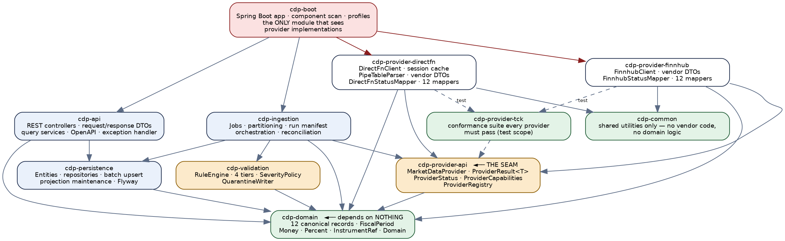
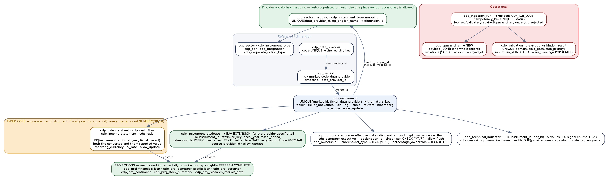
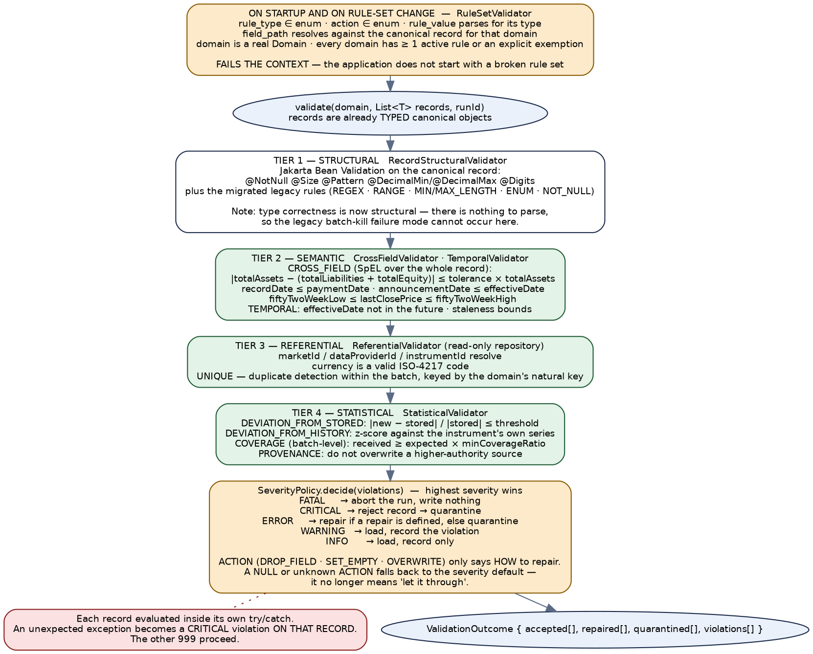
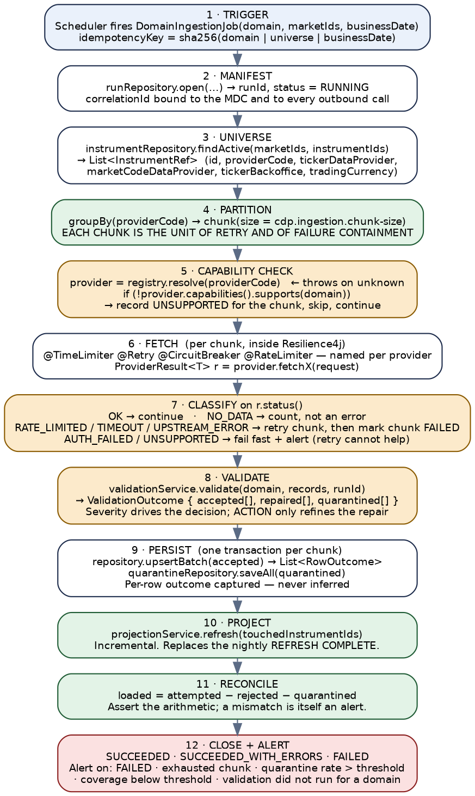

# Core Data Provider Engine — Spring Boot Implementation Guide

*Al Ramz Capital — Middleware Migration Programme*

**The developer's build manual** — module structure, canonical model, database, provider integrations, validation, schedulers and REST API.

*Java 21 · Spring Boot 3.x · Azure Database for PostgreSQL*


## Document Control


| Attribute | Detail |
|---|---|
| Purpose | **The single source of truth for building the CDP engine on Spring Boot.** A developer with no access to the webMethods source should be able to implement the whole engine from this document. Every vendor endpoint, every field mapping, every REST contract, every scheduled job and every algorithm is specified here. |
| Relationship to the assessment document | `CoreDataProvider-Engine-Documentation.docx` (v1.0) documents the **as-built** engine and assesses it — 50 numbered findings, the layering analysis and the validation-layer critique. **That document is the “why”; this one is the “how”.** Where this guide departs from legacy behaviour it says so and points at the finding that justifies the change. You do not need the assessment document to build from this one, but you do need it to answer “why is it different from the old engine?” |
| Target platform (confirmed) | **Java 21** (LTS) · **Spring Boot 3.x** · **Azure Database for PostgreSQL** · **typed core + EAV extension** for metric storage · code presented as **interfaces, signatures and contracts with described method bodies** rather than fully written-out implementations. |
| Source of every fact | The webMethods package exports for `CoreDataProviderV2`, `DirectFN` and `Finnhub`, plus the eight supplied Oracle scripts including the seed data. Field mappings were resolved through the positional `getValuesDirectFN` indirection rather than transcribed from indices. Anything not determinable from that material is marked as such in Appendix D rather than guessed. |
| Document version | v1.0 — first issue |

> **Read this before you start — five things that will bite you otherwise**
>
> **The legacy `quarter` column is not a quarter.** It encodes `1`–`4` for quarters, `5` for annual, and — from DirectFN — the raw codes `12`, `13`, `14` remapped to `2`, `3`, `4`, with `11` never remapped at all. The target replaces it with a `FiscalPeriod` enum (§3.1). Every query that sorts `ORDER BY year DESC, quarter DESC` in the legacy engine is silently sorting annual above Q4. Do not reproduce that.
>
> **The same canonical field means different things depending on the provider.** `basicEpsReported` is basic EPS from DirectFN and **diluted** EPS from Finnhub; `percentageOwnership` is a percentage on one path and a **fraction** on the other. §3.3 defines the contract that fixes this, and the conformance kit (§5.5) enforces it. Do not port the ambiguity forward.
>
> **Two jobs write to the same instrument table and must not overwrite each other.** The legacy engine relies on Oracle treating `''` as `NULL` plus `COALESCE(src, tgt)` in the merge. A default JPA `merge` writes every mapped column and **would destroy this**. §4.6 specifies explicit partial-update semantics; implement them deliberately.
>
> **The technical-indicator EMA is not a standard EMA.** It seeds from the first close of the entire series and runs over every candle, with the period affecting only the smoothing constant. §10.1.3 gives the exact algorithm. If you implement a textbook EMA you will not match the legacy output — decide consciously which you want.
>
> **Every value in the legacy database is a string**, including every financial figure. The target types them properly, which means the migration has to parse ~15 years of history and decide what to do with values that do not parse. §4.9 covers this; budget real time for it.


## Table of Contents


- [Core Data Provider Engine — Spring Boot Implementation Guide](#core-data-provider-engine-spring-boot-implementation-guide)
  - [Document Control](#document-control)
  - [Table of Contents](#table-of-contents)
- [1. Using this document](#1-using-this-document)
  - [1.1 What is specified and what is left to you](#11-what-is-specified-and-what-is-left-to-you)
  - [1.2 Build order](#12-build-order)
  - [1.3 Conventions used in this guide](#13-conventions-used-in-this-guide)
- [2. Solution structure](#2-solution-structure)
  - [2.1 Module layout](#21-module-layout)
  - [2.2 Enforcing the dependency rule](#22-enforcing-the-dependency-rule)
  - [2.3 Package structure](#23-package-structure)
  - [2.4 Maven setup](#24-maven-setup)
  - [2.5 Configuration](#25-configuration)
  - [2.6 Local development](#26-local-development)
- [3. The canonical domain model](#3-the-canonical-domain-model)
  - [3.1 Value types](#31-value-types)
    - [FiscalPeriod](#fiscalperiod)
    - [Money, Percent and the other value types](#money-percent-and-the-other-value-types)
  - [3.2 The twelve canonical records](#32-the-twelve-canonical-records)
    - [3.2.1 Instrument](#321-instrument)
    - [3.2.2 CompanyProfile](#322-companyprofile)
    - [3.2.3 The four financial-statement records](#323-the-four-financial-statement-records)
    - [3.2.4 The remaining six records](#324-the-remaining-six-records)
  - [3.3 The field semantics contract](#33-the-field-semantics-contract)
- [4. Database and persistence](#4-database-and-persistence)
  - [4.1 Oracle → PostgreSQL type mapping](#41-oracle-postgresql-type-mapping)
  - [4.2 Typed core plus EAV extension](#42-typed-core-plus-eav-extension)
  - [4.3 Key design decisions in the schema](#43-key-design-decisions-in-the-schema)
  - [4.4 Flyway layout](#44-flyway-layout)
  - [4.5 Entities and repositories](#45-entities-and-repositories)
  - [4.6 The batch upsert and partial-update semantics](#46-the-batch-upsert-and-partial-update-semantics)
    - [4.6.1 The behaviour to preserve](#461-the-behaviour-to-preserve)
    - [4.6.2 Per-row outcome, not an inferred count](#462-per-row-outcome-not-an-inferred-count)
  - [4.7 Projections — replacing the nightly materialized views](#47-projections-replacing-the-nightly-materialized-views)
  - [4.8 Retention](#48-retention)
  - [4.9 Migrating the historical data](#49-migrating-the-historical-data)
- [5. The provider seam](#5-the-provider-seam)
  - [5.1 MarketDataProvider](#51-marketdataprovider)
  - [5.2 ProviderResult and ProviderStatus](#52-providerresult-and-providerstatus)
  - [5.3 Capabilities and the registry](#53-capabilities-and-the-registry)
  - [5.4 Resilience](#54-resilience)
  - [5.5 The provider conformance kit](#55-the-provider-conformance-kit)
  - [5.6 Adding a third provider](#56-adding-a-third-provider)
- [6. The DirectFN provider](#6-the-directfn-provider)
  - [6.1 Module contents](#61-module-contents)
  - [6.2 Transport and the request envelope](#62-transport-and-the-request-envelope)
  - [6.3 Authentication and session management](#63-authentication-and-session-management)
  - [6.4 The response envelope and the pipe table](#64-the-response-envelope-and-the-pipe-table)
    - [6.4.1 Splitting a row — the one thing that must be exactly right](#641-splitting-a-row-the-one-thing-that-must-be-exactly-right)
  - [6.5 Operation reference](#65-operation-reference)
  - [6.6 Field mappings](#66-field-mappings)
    - [6.6.1 Instruments — the exchange watchlist (`TD`)](#661-instruments-the-exchange-watchlist-td)
    - [6.6.2 Company profile (`CP` and `STK`)](#662-company-profile-cp-and-stk)
    - [6.6.3 Executives (`INMGT` and `KEY_OF`)](#663-executives-inmgt-and-key_of)
    - [6.6.4 Ownerships (`OWN`)](#664-ownerships-own)
    - [6.6.5 Corporate actions (`CDS/CPAC`)](#665-corporate-actions-cdscpac)
    - [6.6.6 News (`NWSL` search, `NWS` detail)](#666-news-nwsl-search-nws-detail)
    - [6.6.7 Financial statements (`BS`, `CF`, `IS`, `FR`, `MR`)](#667-financial-statements-bs-cf-is-fr-mr)
  - [6.7 Status mapping](#67-status-mapping)
  - [6.8 Gotcha checklist](#68-gotcha-checklist)
- [7. The Finnhub provider](#7-the-finnhub-provider)
  - [7.1 Module contents](#71-module-contents)
  - [7.2 Authentication and configuration](#72-authentication-and-configuration)
  - [7.3 Endpoint reference](#73-endpoint-reference)
  - [7.4 Normalisation — units, renames and decodes](#74-normalisation-units-renames-and-decodes)
    - [7.4.1 Unit scaling — complete](#741-unit-scaling-complete)
    - [7.4.2 Field renames](#742-field-renames)
    - [7.4.3 Dividend frequency decode](#743-dividend-frequency-decode)
    - [7.4.4 Timestamps](#744-timestamps)
  - [7.5 Rate limiting](#75-rate-limiting)
  - [7.6 Field mappings](#76-field-mappings)
    - [7.6.1 Instruments — the symbol list](#761-instruments-the-symbol-list)
    - [7.6.2 Company profile](#762-company-profile)
    - [7.6.3 Executives](#763-executives)
    - [7.6.4 Ownerships](#764-ownerships)
    - [7.6.5 Corporate actions — dividends only](#765-corporate-actions-dividends-only)
    - [7.6.6 Financial statements](#766-financial-statements)
  - [7.7 Status mapping — the important correction](#77-status-mapping-the-important-correction)
  - [7.8 Gotcha checklist](#78-gotcha-checklist)
- [8. The validation layer](#8-the-validation-layer)
  - [8.1 What the legacy layer does, and what it cannot do](#81-what-the-legacy-layer-does-and-what-it-cannot-do)
  - [8.2 The rule model](#82-the-rule-model)
  - [8.3 Startup validation of the rule set](#83-startup-validation-of-the-rule-set)
  - [8.4 The engine](#84-the-engine)
  - [8.5 Severity as policy](#85-severity-as-policy)
  - [8.6 Quarantine](#86-quarantine)
  - [8.7 Post-load reconciliation](#87-post-load-reconciliation)
  - [8.8 Migrating the 159 existing rules](#88-migrating-the-159-existing-rules)
- [9. Ingestion and scheduling](#9-ingestion-and-scheduling)
  - [9.1 The job skeleton](#91-the-job-skeleton)
  - [9.2 The run manifest](#92-the-run-manifest)
  - [9.3 Job specifications](#93-job-specifications)
    - [9.3.1 instruments — `InstrumentMasterJob`](#931-instruments-instrumentmasterjob)
    - [9.3.2 company-profiles — `CompanyProfileJob`](#932-company-profiles-companyprofilejob)
    - [9.3.3 financials — `FinancialsJob`](#933-financials-financialsjob)
    - [9.3.4 corporate-actions — `CorporateActionJob`](#934-corporate-actions-corporateactionjob)
    - [9.3.5 news — `NewsJob](#935-news-newsjob)
    - [9.3.6 executives — `ExecutiveJob`](#936-executives-executivejob)
    - [9.3.7 ownerships — `OwnershipJob`](#937-ownerships-ownershipjob)
    - [9.3.8 technical-indicators — `TechnicalIndicatorJob`](#938-technical-indicators-technicalindicatorjob)
    - [9.3.9 daily-metrics — `DailyMetricsJob`](#939-daily-metrics-dailymetricsjob)
    - [9.3.10 cleanup — `RetentionJob`](#9310-cleanup-retentionjob)
  - [9.4 The orchestrator](#94-the-orchestrator)
  - [9.5 Scheduling](#95-scheduling)
- [10. Locally computed domains](#10-locally-computed-domains)
  - [10.1 Technical indicators](#101-technical-indicators)
    - [10.1.1 The price source](#1011-the-price-source)
    - [10.1.2 Candle parsing and the weekly roll-up](#1012-candle-parsing-and-the-weekly-roll-up)
    - [10.1.3 The indicator algorithms](#1013-the-indicator-algorithms)
    - [10.1.4 Signals and the aggregate](#1014-signals-and-the-aggregate)
  - [10.2 Daily metrics](#102-daily-metrics)
    - [10.2.1 The selective-calculation contract](#1021-the-selective-calculation-contract)
    - [10.2.2 The formulas, as built](#1022-the-formulas-as-built)
    - [10.2.3 Which metrics each provider gets](#1023-which-metrics-each-provider-gets)
    - [10.2.4 Reimplementing it](#1024-reimplementing-it)
- [11. The REST API](#11-the-rest-api)
  - [11.1 Target shape](#111-target-shape)
  - [11.2 The response envelope](#112-the-response-envelope)
  - [11.3 Endpoint reference](#113-endpoint-reference)
    - [11.3.1 The four financial statements](#1131-the-four-financial-statements)
    - [11.3.2 The other nine operations](#1132-the-other-nine-operations)
  - [11.4 Controller and query-service shape](#114-controller-and-query-service-shape)
  - [11.5 Security](#115-security)
  - [11.6 Admin and operations endpoints](#116-admin-and-operations-endpoints)
  - [11.7 OpenAPI](#117-openapi)
- [12. Cross-cutting concerns](#12-cross-cutting-concerns)
  - [12.1 Observability](#121-observability)
    - [12.1.1 Structured logging](#1211-structured-logging)
    - [12.1.2 Metrics](#1212-metrics)
    - [12.1.3 Health and alerting](#1213-health-and-alerting)
  - [12.2 Secrets and configuration](#122-secrets-and-configuration)
- [Fail fast on a missing or malformed setting. A @ConfigurationProperties record](#fail-fast-on-a-missing-or-malformed-setting-a-configurationproperties-record)
- [with @Validated turns every configuration mistake into a startup failure](#with-validated-turns-every-configuration-mistake-into-a-startup-failure)
- [instead of a 02:00 incident.](#instead-of-a-0200-incident)
  - [12.3 Testing](#123-testing)
- [13. Migration and cutover](#13-migration-and-cutover)
  - [13.1 Sequence](#131-sequence)
  - [13.2 Blockers to resolve before you can finish](#132-blockers-to-resolve-before-you-can-finish)
  - [13.3 Parallel running](#133-parallel-running)
  - [13.4 Cutover and rollback](#134-cutover-and-rollback)
- [Appendix A — PostgreSQL schema](#appendix-a-postgresql-schema)
  - [A.1 Enums](#a1-enums)
  - [A.2 Instrument](#a2-instrument)
  - [A.3 The typed financial core](#a3-the-typed-financial-core)
  - [A.4 The EAV extension](#a4-the-eav-extension)
  - [A.5 The other fact tables](#a5-the-other-fact-tables)
- [Appendix B — Configuration reference](#appendix-b-configuration-reference)
- [Appendix C — Legacy to target traceability](#appendix-c-legacy-to-target-traceability)
  - [C.1 Services](#c1-services)
  - [C.2 Database objects](#c2-database-objects)
- [Appendix D — Open decisions](#appendix-d-open-decisions)
- [Where to start](#where-to-start)


# 1. Using this document


## 1.1 What is specified and what is left to you


This guide specifies **behaviour, contracts and data** exhaustively, and **implementation technique** by example. Every endpoint, every field mapping, every validation rule, every algorithm and every database column is given here. Class names, interfaces, method signatures and annotations are given so that the shape of the codebase is unambiguous. Method bodies are described as numbered logic rather than written out, on the understanding that a competent Spring developer will write better Java for their own codebase than a document can dictate.

Where a body would be genuinely hard to infer — the DirectFN pipe-table parser, the technical-indicator maths, the batch upsert — the logic is given step by step in enough detail to be transcribed directly.


## 1.2 Build order


The modules have a dependency order and the work has a natural sequence. This is the order that keeps you able to test at every step, rather than the order the chapters appear in.

| Phase | Build | Done when | Guide sections |
|---|---|---|---|
| **0 — Skeleton** | Multi-module Maven build, `cdp-domain` with the canonical records and value types, `cdp-common`, ArchUnit dependency tests, CI pipeline. | `mvn verify` passes and an ArchUnit violation fails the build. | §2, §3 |
| **1 — Database** | Flyway migrations for the full schema, JPA entities, repositories, batch upsert, the partial-update semantics, Testcontainers integration tests. | You can round-trip every canonical record to PostgreSQL and back, and a protected row survives a load. | §4 |
| **2 — Provider seam** | `cdp-provider-api` (the SPI, `ProviderResult`, `ProviderStatus`, capabilities, registry) and `cdp-provider-tck` (the conformance suite) — **before either provider implementation**. | The TCK compiles and fails against a deliberately broken stub provider. | §5 |
| **3 — First provider** | `cdp-provider-finnhub` first: it is JSON-typed and far simpler than DirectFN, so it proves the seam without the pipe-table parser in the way. | Finnhub passes the TCK; a live call returns canonical records. | §7 |
| **4 — Second provider** | `cdp-provider-directfn`: session auth, the pipe-table parser, the positional column resolution, 12 mappers. | DirectFN passes the same TCK. **This is the moment the provider-independence claim is actually proven.** | §6 |
| **5 — Validation** | Rule model, rule-set pre-flight, the four tiers, severity policy, quarantine, and the migration of the 159 legacy rules. | A malformed record is quarantined with a readable reason and the other records in its batch still load. | §8 |
| **6 — Ingestion** | Run manifest, partitioning, the nine domain jobs, reconciliation, scheduling, alerting. | A full nightly cycle runs against a test universe and the run manifest's arithmetic reconciles. | §9 |
| **7 — Computed domains** | Technical indicators and daily metrics in Java, replacing the Oracle procedure and the legacy Java service. | Output matches the legacy engine on a sample, or differs only where §10 says it deliberately should. | §10 |
| **8 — REST API** | The thirteen endpoints, envelope, error handling, pagination, OpenAPI, security. | Contract tests green; API Management in front with OAuth2. | §11 |
| **9 — Data migration** | The historical load out of Oracle: reference data, instruments, the typed core with fiscal-period conversion, the EAV tail, then a projection rebuild. | Row counts and a sampled value-level comparison are both clean. | §4.9 |
| **10 — Parallel run and cutover** | Both engines running against the same providers, compared daily; then the switch. | The data owner has accepted the remaining differences in writing. | §13 |

> **Why the TCK is built in phase 2, before any provider**
>
> It is tempting to build DirectFN first because it is the incumbent, and to add the conformance suite later once there is something to conform. Resist both.
>
> Building the TCK against the interface alone forces the interface to be honest: if the contract cannot be expressed as a test without a provider in front of you, the contract is underspecified. And building Finnhub first means the first implementation exercises the seam without simultaneously fighting a pipe-delimited positional matrix.
>
> By the time DirectFN lands in phase 4, the seam has already been proven by a second implementation — which is the entire point of the exercise, and the thing the legacy engine never achieved.


## 1.3 Conventions used in this guide


| Convention | Meaning |
|---|---|
| `legacy:` prefix | Names an as-built webMethods artefact — a Flow service, an Oracle object, a vendor column. Given so you can grep the old system; **never** an instruction to reproduce it. |
| **Carry forward** | Behaviour that must be preserved exactly. Usually because a consumer depends on it or because the legacy logic is correct and subtle. |
| **Deliberate change** | Behaviour that intentionally differs from the legacy engine, with the reason and the assessment-document finding ID (e.g. `CDP-05`) that justifies it. |
| **Decision needed** | Something this guide cannot settle. All of these are collected in Appendix D; none is left implicit in the body. |
| Field paths | Canonical fields are written in Java form (`balanceSheet.totalAssets`). Legacy webMethods paths keep their slash form (`/balanceSheet/totalAssets`) so they are recognisable in the old source. |
| SQL | PostgreSQL dialect throughout. Where the legacy Oracle SQL is quoted for reference it is labelled as such. |
| Data types | The target uses real types, not the legacy all-strings model: `BigDecimal` for money and every financial measure, `LocalDate`/`Instant` for dates and timestamps rendered as ISO-8601, ISO-4217 for currency, ISO-3166 alpha-2 for country, and an enum wherever the legacy model used a magic string or number. Where this changes what a consumer sees, the section says so. |


# 2. Solution structure


## 2.1 Module layout


Eleven Maven modules. The structure exists to make one property true and mechanically enforceable: **nothing outside a provider module may reference that provider, and the seam may reference nothing but the domain.** That is the whole architecture in one sentence; everything else is ordinary layering.



*Figure 1 — Module dependency graph. Arrows point from dependent to dependency. Only cdp-boot sees a provider implementation.*

| Module | Contains | Depends on | Must NOT depend on |
|---|---|---|---|
| `cdp-domain` | The 12 canonical records, the value types (`FiscalPeriod`, `Money`, `Percent`, `InstrumentRef`), the `Domain` enum, and nothing else. | Nothing. Not Spring, not JPA, not Jackson. | Everything. |
| `cdp-common` | Genuinely generic utilities — string helpers, date parsing, a delimited-list splitter. This is where the generic half of `legacy: util.services:createDirectFNTable` belongs. | `cdp-domain` | Any provider module; any vendor library. |
| `cdp-provider-api` | `MarketDataProvider`, `ProviderResult<T>`, `ProviderStatus`, `ProviderCapabilities`, `ProviderRegistry`, the request records. | `cdp-domain` | Spring, JPA, any vendor library, any provider module. |
| `cdp-provider-tck` | The conformance suite (§5.5). Consumed at test scope by every provider module. | `cdp-provider-api`, `cdp-domain`, JUnit | Any specific provider. |
| `cdp-provider-directfn` | `DirectFnClient`, session cache, `PipeTableParser`, vendor DTOs, `DirectFnStatusMapper`, 12 mappers. | `cdp-provider-api`, `cdp-domain`, `cdp-common`, Spring (for `@Component`/`RestClient`) | `cdp-ingestion`, `cdp-api`, `cdp-persistence`, `cdp-provider-finnhub`. |
| `cdp-provider-finnhub` | `FinnhubClient`, vendor DTOs, `FinnhubStatusMapper`, 12 mappers. | As above. | As above, plus `cdp-provider-directfn`. |
| `cdp-validation` | Rule model, `RuleSetValidator`, the four tier validators, `SeverityPolicy`, `QuarantineWriter`. | `cdp-domain`, Spring | Any provider module; `cdp-api`. |
| `cdp-persistence` | Entities, repositories, batch upsert, projection maintenance, Flyway migrations. | `cdp-domain`, Spring Data JPA | Any provider module; `cdp-api`; `cdp-ingestion`. |
| `cdp-ingestion` | Job definitions, partitioning, orchestration, run manifest, reconciliation, scheduling. | `cdp-provider-api`, `cdp-validation`, `cdp-persistence`, `cdp-domain` | **Any provider implementation.** This is the most important single rule in the build. |
| `cdp-api` | Controllers, request/response DTOs, query services, exception handler, OpenAPI config. | `cdp-persistence`, `cdp-domain` | Any provider module; `cdp-ingestion`. |
| `cdp-boot` | The `@SpringBootApplication`, component scan, profiles, `application.yml`. The only module that declares a dependency on a provider implementation. | Everything. | — |


## 2.2 Enforcing the dependency rule


The Maven module graph enforces most of this at compile time, but not all of it — `cdp-boot` legitimately depends on everything, so a stray import from `cdp-ingestion` into a provider would still compile if someone added the dependency. Make it a test.

```
// cdp-boot/src/test/java/.../ArchitectureTest.java
@AnalyzeClasses(packages = "ae.alramz.cdp", importOptions = ImportOption.DoNotIncludeTests.class)
class ArchitectureTest {

    @ArchTest
    static final ArchRule domain_depends_on_nothing =
        noClasses().that().resideInAPackage("..cdp.domain..")
            .should().dependOnClassesThat()
            .resideInAnyPackage("..cdp.provider..", "..cdp.persistence..",
                                "..cdp.api..", "..cdp.ingestion..", "..cdp.validation..",
                                "org.springframework..", "jakarta.persistence..");

    @ArchTest
    static final ArchRule seam_is_vendor_free =
        noClasses().that().resideInAPackage("..cdp.provider.api..")
            .should().dependOnClassesThat()
            .resideInAnyPackage("..cdp.provider.directfn..", "..cdp.provider.finnhub..");

    @ArchTest   // THE rule. If only one survives code review, make it this one.
    static final ArchRule nobody_but_boot_sees_a_provider_impl =
        noClasses().that().resideOutsideOfPackages("..cdp.provider.directfn..",
                                                   "..cdp.provider.finnhub..",
                                                   "..cdp.boot..")
            .should().dependOnClassesThat()
            .resideInAnyPackage("..cdp.provider.directfn..", "..cdp.provider.finnhub..");

    @ArchTest
    static final ArchRule providers_do_not_see_each_other =
        noClasses().that().resideInAPackage("..cdp.provider.directfn..")
            .should().dependOnClassesThat().resideInAPackage("..cdp.provider.finnhub..");

    @ArchTest   // vendor status codes must not escape their module
    static final ArchRule no_vendor_codes_outside_providers =
        noClasses().that().resideOutsideOfPackages("..cdp.provider.directfn..",
                                                   "..cdp.provider.finnhub..")
            .should().callMethodWhere(target(name("vendorCode")));
}
```

> **Deliberate change — this is the mechanical answer to the stated requirement**
>
> The as-built engine leaks vendor concepts into shared code in five places, the worst being the literal expression `%responseCode% == 1012 || %responseCode% == -119` — Finnhub's and DirectFN's private “no data” codes — repeated across five supposedly provider-agnostic services (assessment finding `CDP-07`). It also has a **circular** package dependency: both vendor packages call back into CoreDataProviderV2 (`CDP-09`).
>
> None of that was a decision anybody made. It accreted, because webMethods has no module boundaries and no compile step, so nothing could refuse it.
>
> These five ArchUnit rules are perhaps an hour's work and they make the same class of mistake impossible. **Add them in phase 0, before there is any code to violate them.**


## 2.3 Package structure


```
ae.alramz.cdp
  domain/                      cdp-domain
    Instrument, CompanyProfile, BalanceSheet, CashFlow, IncomeStatement,
    Ratios, CorporateAction, NewsItem, Executive, Ownership,
    DailyMetrics, TechnicalIndicators                    // the 12 canonical records
    value/  FiscalPeriod, Money, Percent, InstrumentRef, EpsBasis, Domain

  provider/api/                cdp-provider-api
    MarketDataProvider, ProviderResult, ProviderStatus,
    ProviderCapabilities, ProviderRegistry, ProviderDiagnostic
    request/  InstrumentRequest, MarketRequest, NewsRequest

  provider/directfn/           cdp-provider-directfn
    DirectFnMarketDataProvider                            // implements the SPI
    client/  DirectFnClient, DirectFnSession, DirectFnSessionCache
    parse/   PipeTableParser, PipeTable, DirectFnEnvelope
    map/     CompanyProfileMapper, ExecutiveMapper, ... (12)
    DirectFnStatusMapper, DirectFnProperties

  provider/finnhub/            cdp-provider-finnhub          // mirror structure

  validation/                  cdp-validation
    ValidationService, RuleSetValidator, SeverityPolicy
    tier/    StructuralValidator, CrossFieldValidator, TemporalValidator,
             ReferentialValidator, StatisticalValidator
    model/   ValidationRule, RuleType, Severity, RuleAction, Violation,
             ValidationOutcome

  persistence/                 cdp-persistence
    entity/, repository/, batch/  BatchUpsertSupport, RowOutcome
    projection/  ProjectionMaintenanceService

  ingestion/                   cdp-ingestion
    job/     DomainIngestionJob, IngestionScheduler
    run/     RunManifestService, ReconciliationService
    compute/ TechnicalIndicatorCalculator, DailyMetricsCalculator
    fx/      CurrencyConversionService

  api/                         cdp-api
    controller/, dto/, query/, error/  ApiExceptionHandler, ErrorCode
```


## 2.4 Maven setup


The parent POM. Only the parts that matter are shown; the rest is conventional.

```
<properties>
  <java.version>21</java.version>
  <spring-boot.version>3.3.5</spring-boot.version>
  <resilience4j.version>2.2.0</resilience4j.version>
  <archunit.version>1.3.0</archunit.version>
  <testcontainers.version>1.20.3</testcontainers.version>
  <mapstruct.version>1.6.2</mapstruct.version>
</properties>

<modules>
  <module>cdp-domain</module>          <module>cdp-common</module>
  <module>cdp-provider-api</module>    <module>cdp-provider-tck</module>
  <module>cdp-provider-directfn</module>
  <module>cdp-provider-finnhub</module>
  <module>cdp-validation</module>      <module>cdp-persistence</module>
  <module>cdp-ingestion</module>       <module>cdp-api</module>
  <module>cdp-boot</module>
</modules>
```

| Dependency | Module(s) | Why |
|---|---|---|
| `spring-boot-starter-web` | `cdp-api`, `cdp-boot` | REST controllers. |
| `spring-boot-starter-data-jpa` | `cdp-persistence` | Entities and repositories. Note §4.6 — the batch upsert deliberately bypasses JPA. |
| `spring-boot-starter-validation` | `cdp-api`, `cdp-validation` | Jakarta Bean Validation. Tier 1 of the validation pipeline leans on it (§8.4). |
| `spring-boot-starter-quartz` | `cdp-ingestion` | Scheduling with persistent, clustered triggers — §9.5 explains why not `@Scheduled`. |
| `resilience4j-spring-boot3` | provider modules | Timeout, retry, circuit breaker, rate limiter. Configured per provider (§5.4). |
| `flyway-core`, `flyway-database-postgresql` | `cdp-persistence` | Schema migrations. |
| `org.postgresql:postgresql` | `cdp-persistence` | JDBC driver. |
| `mapstruct` | provider modules | Vendor DTO → canonical record mapping. Optional but it makes the mapper classes in §6.6 and §7.5 declarative. |
| `spring-cloud-azure-starter-keyvault` | `cdp-boot` | Secrets (§12.2). Replaces the hard-coded credentials found in the legacy DirectFN package. |
| `micrometer-tracing-bridge-otel`, `opentelemetry-exporter-otlp` | `cdp-boot` | Tracing (§12.1). |
| `springdoc-openapi-starter-webmvc-ui` | `cdp-api` | OpenAPI generation (§11.6). |
| `archunit-junit5` | `cdp-boot` (test) | §2.2. |
| `testcontainers:postgresql` | `cdp-persistence` (test) | Integration tests against a real PostgreSQL, not H2 — the schema uses enums, `JSONB` and `ON CONFLICT`, none of which H2 emulates faithfully. |
| `wiremock-standalone` | provider modules (test) | Vendor stubs for the TCK and for regression fixtures captured from the live vendors. |


## 2.5 Configuration


The complete property surface. Appendix B repeats this as a flat reference; this section explains the ones with judgment in them. Everything under `cdp.*` is bound to `@ConfigurationProperties` records with `@Validated`, so a missing or malformed value fails startup rather than producing a surprise at 02:00.

```
cdp:
  environment: ${ENVIRONMENT}          # replaces legacy %location%; no default - fail fast

  ingestion:
    chunk-size: 200                    # instruments per retryable unit. NEW - legacy had no chunking
    parallelism: 4                     # concurrent chunks per provider
    default-news-period-days: 90       # legacy hard-coded -90 in two places; one property now
    business-date-zone: Asia/Dubai     # explicit. Legacy used server-local SYSDATE
    jobs:
      instruments:        { cron: "0 0 1 * * *", enabled: true }
      company-profiles:   { cron: "0 15 1 * * *", enabled: true }
      financials:         { cron: "0 30 1 * * *", enabled: true }
      corporate-actions:  { cron: "0 0 2 * * *", enabled: true }
      news:               { cron: "0 30 2 * * *", enabled: true }
      executives:         { cron: "0 45 2 * * *", enabled: true }
      ownerships:         { cron: "0 0 3 * * *", enabled: true }
      technical-indicators:{ cron: "0 30 3 * * *", enabled: true }
      daily-metrics:      { cron: "0 0 4 * * *", enabled: true }
      cleanup:            { cron: "0 0 5 * * *", enabled: true }
    retention:
      run-manifest-days: 90
      validation-result-days: 90
      quarantine-days: 180             # longer - quarantine is meant to be reviewed
      news-days: 365

  validation:
    fail-on-invalid-rule-set: true     # rule-set pre-flight; see 8.3
    exempt-domains: []                 # explicit exemptions only. Legacy silently
                                       #   skipped news + technicalIndicators (CDP-10)
    coverage:
      min-ratio: 0.80                  # alert if a domain returns < 80% of expected
    deviation:
      default-threshold: 0.50          # 50% move vs stored value -> violation

  providers:
    directfn:
      enabled: true
      base-url: ${DIRECTFN_BASE_URL}
      username: ${DIRECTFN_USERNAME}   # Key Vault. NEVER a literal - see 12.2
      password: ${DIRECTFN_PASSWORD}
      user-id:  ${DIRECTFN_USER_ID}
      session-ttl: PT8H
      page-size: 100000000             # legacy literal; see 6.3
      languages: [EN, AR]
    finnhub:
      enabled: true
      base-url: ${FINNHUB_BASE_URL}
      etf-base-url: ${FINNHUB_ETF_BASE_URL}
      api-key: ${FINNHUB_API_KEY}      # ONE source. Legacy had two (CDP-28)
      ownership-limit: 20

  api:
    default-page-size: 20
    max-page-size: 200                 # legacy enforced no maximum at all (CDP-17)
    default-history-years: 5           # legacy used 5 or 6 inconsistently (CDP-34)

resilience4j:
  timelimiter.instances:
    directfn: { timeoutDuration: 30s }
    finnhub:  { timeoutDuration: 20s }
  retry.instances:
    directfn:
      maxAttempts: 3
      waitDuration: 2s
      enableExponentialBackoff: true
      exponentialBackoffMultiplier: 2
      enableRandomizedWait: true       # jitter - do not let all chunks retry in lockstep
    finnhub: { maxAttempts: 4, waitDuration: 5s, enableExponentialBackoff: true }
  circuitbreaker.instances:
    directfn: { slidingWindowSize: 20, failureRateThreshold: 50, waitDurationInOpenState: 60s }
    finnhub:  { slidingWindowSize: 20, failureRateThreshold: 50, waitDurationInOpenState: 60s }
  ratelimiter.instances:
    finnhub:  { limitForPeriod: 30, limitRefreshPeriod: 1s, timeoutDuration: 5s }
                                       # Finnhub is hard-rate-limited and the legacy
                                       #   engine did not pace it at all (CDP-11)
```

> **Three configuration values that encode a decision, not a preference**
>
> **`chunk-size: 200`** — the legacy engine had no chunking whatsoever: each job made one provider call for the entire universe, so one bad instrument could cost the whole domain for the night. The chunk is the unit of retry and of failure containment, so this number is the granularity of your blast radius. 200 is a starting point; tune it against observed provider latency.
>
> **`business-date-zone: Asia/Dubai`** — the legacy engine used the database server's `SYSDATE` and stored zone-less timestamps, while covering markets in several time zones. Making the business date explicit is the only way “yesterday's close” means the same thing in every environment.
>
> **`exempt-domains: []`** — an empty list plus `fail-on-invalid-rule-set: true` means every domain must have at least one active validation rule or the application will not start. The legacy engine silently ran `news` and `technicalIndicators` with no rules at all and reported it as a clean run (`CDP-10`). If you genuinely want a domain unvalidated, you must now say so out loud here.


## 2.6 Local development


A `docker-compose.yml` with PostgreSQL 16 and WireMock, plus a `local` profile, is enough to run the whole engine on a laptop with no vendor access. This matters more than it sounds: the legacy engine could only be exercised against live DirectFN and Finnhub, which is a large part of why its failure paths were never tested.

- **PostgreSQL 16** via Testcontainers for tests and docker-compose for interactive work. Flyway runs on startup.
- **WireMock** serving recorded vendor fixtures. Capture these once from the live vendors per domain and per error condition — particularly a 429 from Finnhub and a session-expired response from DirectFN, which are the two failure paths the legacy engine handles worst.
- **A `local` profile** that points the provider base URLs at WireMock, disables the Quartz schedule, and exposes a small `/admin/jobs/{domain}/run` endpoint so a job can be triggered by hand.
- **Seed data**: a Flyway `afterMigrate` callback loading a handful of markets, instruments and the full 159-rule validation set, so that a fresh database is immediately useful.


# 3. The canonical domain model


`cdp-domain` is the module every other module shares and that depends on nothing. It holds twelve immutable records and the value types that carry the semantics the legacy model lost. Getting this module right is the highest-leverage work in the project, because every mapping, every validation rule and every database column is expressed in its terms.


## 3.1 Value types


These exist because the legacy model expressed all of them as strings, and every one of them caused a real defect. They are not ceremony.


### FiscalPeriod


```
public enum FiscalPeriod {
    Q1(1), Q2(2), Q3(3), Q4(4), ANNUAL(5);

    private final int legacyCode;                  // for migration and for legacy-parity queries

    /** Legacy Oracle stored 1-4 for quarters and 5 for annual. */
    public static FiscalPeriod fromLegacyCode(int code) { ... }

    /** DirectFN's own PERIOD vocabulary. The legacy mapper handled only 12/13/14
     *  and passed 1, 5 and 11 through untouched - see 6.6.7. */
    public static FiscalPeriod fromDirectFnPeriod(String period) { ... }

    public boolean isQuarterly() { return this != ANNUAL; }
}
```

> **Deliberate change — this enum removes an entire class of defect**
>
> The legacy `quarter` column is a `NUMBER` carrying at least three different vocabularies at once: `1`–`4` from Finnhub, `5` meaning annual, and DirectFN's raw `12`/`13`/`14` remapped to `2`/`3`/`4` by five separate mapping services that each contain the same three-case branch with **no default and no case for `11`** (assessment finding `CDP-16`).
>
> It also means every legacy query of the form `ORDER BY year DESC, quarter DESC` sorts **annual above Q4 of the same year**. `SP_CALCULATE_DAILY_METRICS` relies on exactly that ordering for `epsTTM`, `roeTTM` and the three `ev*TTM` metrics, which is why none of them is actually a trailing-twelve-month figure (`CDP-26`).
>
> With an enum, `11` is inexpressible, the ordering is explicit, and “annual” cannot accidentally outrank a quarter. **Sort by `(fiscalYear, fiscalPeriod)` only where that ordering is what you mean**, and write TTM calculations against `isQuarterly()`.


### Money, Percent and the other value types


| Type | Shape | Why it exists |
|---|---|---|
| `Money` | `record Money(BigDecimal amount, Currency currency)` | The legacy model stored every financial figure as a `VARCHAR2(4000)` with the currency in a neighbouring field that was not always populated. `BigDecimal` is mandatory — `double` is wrong for money and the legacy engine's use of `Double.parseDouble` throughout is one reason its validation layer could kill a batch (`CDP-04`). |
| `Percent` | `record Percent(BigDecimal value)` with a **documented 0–100 range**, validated in the compact constructor. | `percentageOwnership` arrives as a percentage from DirectFN and as a **fraction** from Finnhub (`CDP-16`). A type with an enforced range makes the divergence a construction-time failure in whichever adapter is wrong, instead of a silent data-quality incident. See §3.3. |
| `InstrumentRef` | `record InstrumentRef(long instrumentId, long marketId, String providerCode, String tickerDataProvider, String marketCodeDataProvider, String tickerBackoffice, Currency tradingCurrency, Currency reportingCurrency)` | The identity bundle every provider call and every canonical record needs. Replaces the five loose identity fields (`instrumentID`, `marketID`, `dataProviderID`, `tickerDataProvider`, `marketDataProvider`) copied into **eleven of the twelve** legacy document types — the exception is `technicalIndicators`, which carries only `instrumentID` and `barID` (§3.2.4). |
| `EpsBasis` | `enum EpsBasis { BASIC, DILUTED, UNKNOWN }` | Resolves the single worst semantic collision in the legacy model: `basicEpsReported` carries **basic** EPS from DirectFN and **diluted** EPS from Finnhub. See §3.3. |
| `Domain` | `enum Domain { INSTRUMENT, COMPANY_PROFILE, BALANCE_SHEET, CASH_FLOW, INCOME_STATEMENT, RATIOS, CORPORATE_ACTION, NEWS, EXECUTIVE, OWNERSHIP, DAILY_METRICS, TECHNICAL_INDICATORS }` | Replaces the twelve `dataCategory` string literals scattered across thirteen legacy call sites with no shared constant. Drives validation-rule lookup, capability checks and the run manifest. |
| `Signal` | `enum Signal { BUY, HOLD, SELL, NOT_AVAILABLE }` | The legacy engine wrote `"Buy"`/`"Hold"`/`"Sell"` and the **empty string** for insufficient data, into a `VARCHAR2(4)` column. `NOT_AVAILABLE` makes the fourth state explicit. |


## 3.2 The twelve canonical records


Field lists are complete and in the order they should be declared. Types are the target types, not the legacy string types. `*Reported` fields hold the value in the issuer's own reporting currency; the unsuffixed field holds the value converted to the instrument's trading currency — carry this pair forward, it is load-bearing for the API.


### 3.2.1 Instrument


```
public record Instrument(
    Long            instrumentId,        // null on insert; assigned by the database
    long            marketId,
    long            dataProviderId,
    String          tickerDataProvider,  // natural key with marketId - see 4.3
    String          ticker,
    String          displayTicker,
    String          tickerBackoffice,    // joins to the Broker Insight estate
    String          tickerReuters,
    String          tickerBloomberg,
    String          isin,                // ^[A-Z]{2}[A-Z0-9]{9}[0-9]$
    String          figi,
    String          cusip,
    String          englishName,
    String          arabicName,
    String          sectorNameEn,        // provider vocabulary; mapped via cdp_sector_mapping
    String          sectorNameAr,
    String          instrumentTypeEn,    // provider vocabulary; mapped via cdp_instrument_type_mapping
    String          instrumentTypeAr,
    Currency        tradingCurrency,
    Currency        reportingCurrency,
    Boolean         shariaCompliant,     // NULLABLE - three-valued, see the note
    CompanyProfile  companyProfile       // nested; null when not fetched
) {}
```

**Carry forward:** `shariaCompliant` stays nullable. `Y`, `N` and genuinely unknown are three distinct states in this data, and collapsing unknown into `false` would be a data-quality regression. The legacy `CHAR(1)` column is nullable for the same reason.


### 3.2.2 CompanyProfile


Nested inside `Instrument` and also standalone. 33 fields, unchanged in content from the legacy `companyProfile` sub-record.

```
public record CompanyProfile(
    String  address, String addressAr, String city, String countryIso2,
    String  description, String descriptionAr,
    Integer totalEmployees,
    String  industry,
    BigDecimal floatingShares, BigDecimal sharesOutstanding,
    String  gics1Sector, String gics2IndustryGroup,
    String  gics3Industry, String gics4SubIndustry,
    LocalDate listingDate, LocalDate incorporationDate,
    String  logo,
    Money   marketCap,             // marketCapCurrency folds into Money
    Money   marketCapTradingCcy,   BigDecimal fxRateMarketCap,
    Money   authorizedCap,         Money authorizedCapTradingCcy,
    BigDecimal fxRateAuthorizedCap,
    String  sedol,
    String  website, String phone, String fax, String email,
    String  linkedIn, String facebook, String twitter
) {}
```


### 3.2.3 The four financial-statement records


All four share the same key — `(instrumentId, fiscalYear, fiscalPeriod)` — and the same `*Reported` / converted pairing. Field lists below are the legacy field sets, typed.

| Record | Key | Measure fields (each present twice: `X` converted, `XReported` as issued) |
|---|---|---|
| `BalanceSheet` | `InstrumentRef ref, int fiscalYear, FiscalPeriod fiscalPeriod` | `totalAssets`, `totalLiabilities`, `totalEquity`, `totalGrossLoans`, `totalDeposits`, `totalReserves`, `totalLiabilitiesAndEquity`, `totalDebt` — 8 pairs, all `Money`. Plus `Currency reportingCurrency`, `BigDecimal fxRate`. |
| `CashFlow` | same | `cashFlowOperations`, `cashFlowInvesting`, `cashFlowFinancing`, `endingCashBalance`, `changesInWorkingCapital`, `changesInCashBalance` — 6 pairs. Plus currency and `fxRate`. |
| `IncomeStatement` | same | `revenue`, `grossProfit`, `operatingIncome`, `netOperatingIncome`, `netIncome`, `netIncomeAfterTax`, `loanLossProvision`, `netPremiumEarned`, `totalUnderwritingRevenue`, `netClaimsIncurred`, `totalOtherNonOperatingIncome` — 11 `Money` pairs — plus `basicEps`/`basicEpsReported` (`Money`) **and the new `EpsBasis epsBasis`** (§3.3). Plus currency and `fxRate`. |
| `Ratios` | same | `roe`, `epsGrowth`, `evToRevenue`, `evToEbitda`, `evToEbit`, `dividendYield`, `peRatio`, `pbRatio`, `pcfRatio`, `psRatio` as `BigDecimal` (dimensionless — **not** FX-converted); `eps`, `ev`, `bvps`, `dps` as `Money` pairs (FX-converted); `noOfShares` as `BigDecimal`. Plus currency and `fxRate`. |

> **Carry forward — which ratio fields are FX-converted and which are not**
>
> The legacy DirectFN mapping converts `eps`, `ev` and `bvps` by the FX rate and deliberately leaves `roe`, `epsGrowth`, `evToRevenue`, `evToEbitda`, `evToEbit` and `noOfShares` alone, because those are dimensionless ratios or counts. That distinction is correct and must be preserved.
>
> But note an inconsistency in the same legacy code: the market-ratio mapping (`legacy: mappings/financialStatementsMR`) applies **no FX conversion at all and emits no `fxRate` field**, even though `dps` — dividend per share — is a currency amount. In the target, `dps` is a `Money` and should be converted like `eps`.
>
> **Decision needed (Appendix D):** confirm with the business that `dps` should be FX-converted. It is the one place where this guide proposes changing a number that consumers can see.


### 3.2.4 The remaining six records


| Record | Fields |
|---|---|
| `CorporateAction` | `InstrumentRef ref`, `CorporateActionType type` (resolved from the provider's own label via `cdp_corporate_action_type`), `LocalDate effectiveDate`, `LocalDate announcementDate`, `LocalDate paymentDate`, `LocalDate recordDate`, `Money dividendAmount` + `dividendAmountReported`, `Currency currencyReported`, `BigDecimal fxRate`, `String frequency`, `BigDecimal splitFactor`, `BigDecimal oldNumberOfShares`, `newNumberOfShares`, `oldParValue`, `newParValue`, `issuePrice`, `numberOfTreasuryStocks`. |
| `Executive` | `InstrumentRef ref`, `String designationEn`, `designationAr`, `englishName`, `arabicName`, `LocalDate since`, `String phone`, `email`, `linkedIn`, `Sex sex`, `Money salary`. **Note** the legacy `prefix` and `resignationDate` fields are consumed and discarded before the record is emitted — see §6.6.3; keep that behaviour but consider persisting `resignationDate`, since discarding it is why resigned executives simply vanish with no audit trail. |
| `Ownership` | `InstrumentRef ref`, `String shareholderNameEn`, `shareholderNameAr`, `ShareholderType type` (`INDIVIDUAL`/`COMPANY`), `Percent percentageOwnership`, `BigDecimal sharesOwned`. |
| `NewsItem` | `String providerNewsId`, `long dataProviderId`, `Instant newsDateTime`, `String title`, `String details`, `Locale language`, `List<Long> instrumentIds`, `List<Long> marketIds`. **Deliberate change:** the legacy model carried a single `instrumentID`/`marketID` pair per news row and expressed the many-to-many through a separate mapping table populated row by row; modelling the lists on the record makes the relationship explicit and lets the whole item be written in one batch. |
| `DailyMetrics` | `InstrumentRef ref`, `LocalDate businessDate`, and 38 measures: `lastClosePrice` (`Money`), `lastCloseDate`, `threeMonthAverageTradingVolume`, `fiftyTwoWeekHigh`/`Low` + their dates, `fiftyTwoWeekPriceReturnDaily`, `ytdPriceReturnDaily`, `bvpsAnnual`/`Quarterly`, `currentDividendYieldTtm`, `dividendYieldIndicatedAnnual`, `dpsTtm`/`Annual`, `epsTtm`/`Annual`, `evEbitdaTtm`, `evRevenueTtm`, `evEbitTtm`, `pb`/`pbAnnual`/`pbQuarterly`, `peTtm`/`peAnnual`, `psTtm`/`psAnnual`, `ptbvAnnual`/`Quarterly`, `roeTtm`, `roaTtm`, `roiTtm`, plus the `*Reported` variants and `fxRate`. **Note** the legacy field names begin with a digit (`52WeekHigh`), which is not a legal Java identifier — rename as shown and map in the DTO layer (§11.3). |
| `TechnicalIndicators` | `long instrumentId`, `long barId`, `Signal aggregateSignal`, and six indicators of which only four are complete (value, signal) pairs — `movingAverage20`, `macd`, `rsi14` and `stochasticK14` carry both; `movingAverage50` carries a **value only** (the legacy schema has no MA50 signal) and `movingAverageCrossover20v50` carries a **signal only**. Plus `firstResistance`, `secondResistance`, `firstSupport`, `secondSupport` as `BigDecimal`. **This is the only canonical record with no `InstrumentRef`** — the legacy document type carries only `instrumentID` and `barID`, which is why its validation audit rows have null identifiers. Give it a full `InstrumentRef` in the target. |


## 3.3 The field semantics contract


This section is the contract that a provider implementation must satisfy, and that the conformance kit (§5.5) enforces. It exists because the legacy canonical model is canonical in name but not in meaning, and every divergence below was found by reading the two existing adapters side by side and noticing they disagreed — which is not a repeatable process.

| Field or type | The contract | What the legacy engine did |
|---|---|---|
| `Percent` | **Always 0–100.** A 5.2% holding is `5.2`, never `0.052`. Enforced in the compact constructor. | DirectFN's `OWN_PCT` passed through verbatim (scale unconfirmed); Finnhub's derived as `sharesOwned ÷ sharesOutstanding` at precision 6, i.e. a **fraction**. The two cannot both be right. **Decision needed** — check production values before migrating (Appendix D). |
| `FiscalPeriod` | An enum. `ANNUAL` is not a quarter and must never sort as one. | An integer with three vocabularies and an unhandled `11`. |
| `EpsBasis` | Every `IncomeStatement` declares which basis its EPS is on. A provider that cannot tell must set `UNKNOWN`, not guess. | `basicEpsReported` held basic EPS from DirectFN and diluted from Finnhub, in the same column, indistinguishable downstream. |
| `Money` | Always carries its currency. The `*Reported` field is in the issuer's reporting currency; the unsuffixed field is in the instrument's trading currency; `fxRate` is the rate used. | Same intent, but the rate was dropped whenever it equalled 1 — in **sixteen separate places** across both tiers — so a reader cannot distinguish “no conversion needed” from “conversion not attempted”. **Deliberate change:** always populate `fxRate`, including when it is exactly 1. |
| Dates | `LocalDate` for dates, `Instant` for timestamps, `ZoneId` explicit at every boundary. | Four simultaneous string formats — `yyyyMMdd`, `yyyyMMddHHmmss`, `yyyy-MM-dd`, `dd-MM-yyyy` — converted between each other by a shared helper, stored in zone-less columns. |
| `CorporateActionType` | Resolved to an internal type via the provider-mapping table, exactly as sectors and instrument types already are. | Auto-created per provider from the vendor's own label, and then matched by the English literal `'Cash Dividend'` in the daily-metrics procedure — which works only because the Finnhub mapper hard-codes precisely that string (`CDP-45`). |
| Null vs absent | A `null` field means “this provider did not supply it”. It never means zero, and it never means “deleted”. The partial-update semantics in §4.6 depend on this distinction. | Empty string and null were interchangeable, which Oracle's `''`≡`NULL` equivalence made invisible — and which is precisely the mechanism the two instrument-writing jobs rely on to avoid clobbering each other. |

> **Field coverage is part of the contract too**
>
> Of the eighteen fields on the legacy `companyExecutive` document type, **only three are populated by both providers**. DirectFN supplies Arabic names, Arabic designations, e-mail, LinkedIn, phone, prefix and resignation date; Finnhub supplies salary, salary currency and sex; only `designationEn`, `englishName` and `since` come from both.
>
> That is not a defect in either adapter — the vendors genuinely offer different things. It is a gap in the contract: nothing declared which fields a consumer could rely on, so changing provider changed the data silently.
>
> **In the target**, annotate each canonical field as `REQUIRED` (every provider must supply it), `OPTIONAL`, or `PROVIDER_SPECIFIC`, and have `ProviderCapabilities.guaranteedFields()` declare what each implementation actually delivers. The TCK asserts it. A provider that cannot supply a `REQUIRED` field then fails registration at startup, rather than failing quietly at 02:00.


# 4. Database and persistence


Target: **Azure Database for PostgreSQL**, with a **typed core plus an EAV extension**. This chapter gives the schema, the type-mapping decisions behind it, the entity and repository design, the batch upsert, the projection strategy that replaces the nightly materialized-view rebuild, and the historical data migration.



*Figure 2 — Target schema. Amber is the typed core; green is new or substantially changed; red is operational. Full DDL in Appendix A.*


## 4.1 Oracle → PostgreSQL type mapping


| Legacy Oracle | Occurrences | Target PostgreSQL | Reasoning |
|---|---|---|---|
| `VARCHAR2(4000)` holding a number (`CDP_RAW_*.VALUE`) | 5 EAV tables | `NUMERIC(38,10)` in the typed core; `value_num NUMERIC` in the extension | Removes the parse-failure class of defect entirely. The legacy validation engine's unguarded `Double.parseDouble` over string-typed numeric fields is what lets one bad value discard a whole batch (`CDP-04`); with a typed column the value never gets that far. |
| `VARCHAR2(200)` holding a number (`CDP_CORPORATE_ACTIONS`) | 10 columns | `NUMERIC(38,10)` | These are already typed columns with no EAV justification, and the sibling tables `CDP_TECHNICAL_INDICATORS` and `CDP_OWNERSHIP` already use `NUMBER` correctly. |
| `NUMBER` (quarter) | 5 tables | `fiscal_period` enum `('Q1','Q2','Q3','Q4','ANNUAL')` | §3.1. Makes `11` inexpressible and the annual-vs-Q4 ordering explicit. **The fifth table is `CDP_VALIDATION_RESULTS`**, which carries the same encoding and needs the same conversion — easy to miss, because it is not a fact table. |
| `CHAR(1)` flags | 15 columns | `BOOLEAN`, except `is_sharia_compliant` | `is_sharia_compliant` stays three-valued (`BOOLEAN NULL`). The rest — `allow_update`, `allow_flush`, `enabled`, `is_active`, `price_range_validation` — are genuinely two-valued. |
| `NUMBER GENERATED ALWAYS AS IDENTITY` | 27 of 28 tables | `GENERATED ALWAYS AS IDENTITY` | Direct equivalent. Keep `ALWAYS` rather than `BY DEFAULT` so the sequence cannot be bypassed by a migration script. |
| `TIMESTAMP(6) DEFAULT CURRENT_TIMESTAMP` | 26 of 28 tables | `TIMESTAMPTZ DEFAULT now()` | **Add the time zone.** The legacy columns are zone-less while the engine spans markets in several zones and reads a backoffice over a database link. This is a latent correctness problem that the migration should not carry forward. |
| `CLOB` | 7 columns | `TEXT`, except the `*_DETAILS` ID lists | The `FAILED_DETAILS` / `ADDUPDATED_DETAILS` columns hold comma-separated ID lists; these become `JSONB` arrays on the run manifest, or rows in `cdp_quarantine`. |
| Object + collection types (`CDP_*_OBJ` / `_TAB`) | 14 types | **Removed.** Replaced by JDBC batch with `ON CONFLICT` (§4.6). | The Oracle collection types existed to pass a batch into a `MERGE`. PostgreSQL's `INSERT ... ON CONFLICT` plus JDBC batching does the same job with no positional contract to get wrong — and that positional contract was the single most fragile thing in the legacy load path. |
| Database link `@MIDDLEWARE_T_BROK` | 3 procedures | **Decision needed** — replication or an API | Database links do not translate to managed PostgreSQL. The three procedures are `SP_CALCULATE_DAILY_METRICS`, `SP_GET_CDP_MARKET_HOLIDAYS` and `SP_GET_CDP_MARKET_WEEKENDS`. This is a migration blocker in its own right and is called out in Appendix D. The engine needs Broker Insight prices for daily metrics and technical indicators. |


## 4.2 Typed core plus EAV extension


The legacy engine stores financial statements, ratios, company profiles and daily metrics as entity-attribute-value: one row per instrument, period and metric name, with the value as a string. That choice buys real flexibility — a new vendor metric needs no schema change, and the two vendors genuinely supply overlapping but non-identical metric sets (Finnhub alone populates 36 `dailyMetrics` fields that DirectFN does not supply at all). It also costs type safety, constraint enforcement and a pivot on every read.

The target keeps both properties by splitting them:

|  | Typed core | EAV extension |
|---|---|---|
| Tables | `cdp_balance_sheet`, `cdp_cash_flow`, `cdp_income_statement`, `cdp_ratio` | `cdp_instrument_attribute` |
| What goes here | Every field that **both providers populate** and that the API exposes. For balance sheets that is the 19 fields common to both; for income statements, 27. | The provider-specific long tail — including all 36 Finnhub-only `dailyMetrics` fields and anything a future provider adds. |
| Key | `(instrument_id, fiscal_year, fiscal_period)` | `(instrument_id, attribute_key, fiscal_year, fiscal_period)` — the period columns nullable for non-periodic attributes such as company-profile values. |
| Value storage | One real typed column per metric: `NUMERIC(38,10)`, `DATE`, `TEXT`. | Three typed value columns — `value_num NUMERIC`, `value_text TEXT`, `value_date DATE` — with a check constraint that exactly one is non-null. **Not one `VARCHAR` for everything.** |
| Constraints | Real `CHECK`s, real `NOT NULL`s, real foreign keys. | FK on instrument and provider; the one-value-populated check. |
| Adding a metric | A migration. | Nothing — insert a row. |
| Read cost | A column read. | A pivot, but only for the tail nobody queries in bulk. |

> **How to decide which fields are core**
>
> The rule is **both providers populate it and the API exposes it**, not “it seems important”. The coverage analysis in the assessment document gives the per-domain counts; use them rather than re-deriving.
>
> This can be done incrementally and should be: add the typed columns alongside the EAV table, dual-write for a period, move readers across, then retire the EAV rows for promoted keys. There is no need for a big-bang conversion, and doing it gradually lets the parse failures surface in manageable batches rather than all at once.
>
> **The typed core is also what makes Tier-2 validation possible.** `totalAssets ≈ totalLiabilities + totalEquity` is trivial over columns and awkward over an EAV pivot — which is a large part of why the legacy validation layer has no cross-field rules at all (`G2`).


## 4.3 Key design decisions in the schema


| Decision | Rationale |
|---|---|
| `cdp_instrument` keeps `UNIQUE (market_id, ticker_data_provider)` | **Carry forward.** This is the natural key the legacy merge uses and it is correct: an instrument is identified by its market plus the provider's own ticker for it. The other ten identifier columns — `ticker`, `display_ticker`, `isin`, `figi`, `cusip`, `ticker_backoffice`, `ticker_alias_1`, `ticker_alias_2`, Reuters and Bloomberg — are attributes, not keys: they are nullable and not all populated. |
| `cdp_data_provider.code` is `UNIQUE` and is the registry key | The legacy dispatch branched on `DATA_PROVIDER_NAME` read denormalised off an instrument join, while an unused provider registry table sat alongside it. In the target, `code` is what `ProviderRegistry.resolve()` looks up, so the table finally does the job it was created for. |
| `allow_update` / `allow_flush` retained on every fact table | **Carry forward, deliberately.** These let a data steward pin a manually corrected value so an automated load cannot overwrite it — a real requirement in reference-data management. §4.6 implements the semantics explicitly, because an ORM's default behaviour would silently destroy them. |
| `source_provider_id` on the EAV extension and on fact rows | New. Records which provider supplied each value, which is what makes the Tier-4 provenance rule possible (“do not let a lower-authority source overwrite a higher-authority one”) and what makes a provider swap auditable. |
| `cdp_ingestion_run` replaces `CDP_JOB_LOGS` | Same idea, honest counters. Columns for `fetched`, `validated`, `repaired`, `quarantined`, `loaded` and `db_rejected` — all of which the run reconciles before it closes (§8.7). The legacy table's `ADDUPDATED_TICKERS` is not a database-confirmed count in four of nine jobs (`CDP-15`). |
| `cdp_quarantine` is new | Holds the full rejected record as `JSONB`, its violations, a human-readable reason, and a `replayed_at`. The legacy engine drops a rejected record entirely, leaving only an audit row whose `ERROR_MESSAGE` column is permanently NULL because the only line that would populate it is commented out (`CDP-46`). |
| `cdp_validation_result.run_id` is indexed | One line, and it fixes a real problem: the legacy `CDP_VALIDATION_RESULTS` has no index beyond its primary key, yet the job-log read runs a correlated `COUNT(DISTINCT ...)` against it per job row, over a monotonically growing table (`CDP-32`). |
| Projections are tables, not materialized views | §4.7. They are maintained incrementally on write rather than rebuilt nightly, which removes the legacy engine's one-day freshness ceiling (`CDP-13`). |


## 4.4 Flyway layout


```
src/main/resources/db/migration/
  V1__reference_tables.sql          markets, providers, sectors, instrument types, bars,
                                    designations, corporate action types
  V2__provider_mapping.sql          sector + instrument-type mapping tables
  V3__instrument.sql                cdp_instrument + indexes
  V4__financial_core.sql            the four typed statement tables
  V5__instrument_attribute.sql      the EAV extension
  V6__other_facts.sql               corporate actions, executives, ownership,
                                    technical indicators, news + news_instrument
  V7__validation.sql                rule + result tables, enums
  V8__operational.sql               ingestion_run, quarantine
  V9__projections.sql               the five projection tables
  V10__seed_reference.sql           markets, providers, sectors, bars, CA types
  V11__seed_validation_rules.sql    the 159 migrated rules - see 8.8

  R__functions.sql                  repeatable: projection refresh helpers
```

Keep enum types in the migration that first needs them and never `ALTER TYPE ... DROP VALUE` — PostgreSQL does not support it. If a signal or severity value has to go, add a new type and migrate the column.


## 4.5 Entities and repositories


Use JPA for the read side and for single-record work, and plain JDBC for the batch write path. This is not a purity argument — it is that the batch path needs `ON CONFLICT` with per-column conditional updates, which JPA cannot express and should not be made to.

```
// Read side - ordinary Spring Data
public interface InstrumentRepository extends JpaRepository<InstrumentEntity, Long> {

    @Query("""
           select new ae.alramz.cdp.domain.value.InstrumentRef(
                  i.id, m.id, dp.code, i.tickerDataProvider,
                  m.marketCodeDataProvider, i.tickerBackoffice,
                  i.tradingCurrency, i.reportingCurrency)
           from InstrumentEntity i
             join i.market m
             join m.dataProvider dp
           where i.isActive = true
             and (:marketIds is null or m.id in :marketIds)
             and (:instrumentIds is null or i.id in :instrumentIds)
           """)
    List<InstrumentRef> findActiveRefs(@Param("marketIds") Collection<Long> marketIds,
                                       @Param("instrumentIds") Collection<Long> instrumentIds);
}
```

> **Deliberate change — replace the CSV-in-a-scalar parameter**
>
> The legacy `SP_GET_CDP_INSTRUMENTS` takes `p_market_ids` and `p_instrument_ids` as comma-separated strings inside a single `VARCHAR2`, then splits them with `REGEXP_SUBSTR ... CONNECT BY`. The same pattern appears in `p_exchange_ids` on five other procedures and in the `OTP_POPULAR_SYMBOLS` configuration value (`CDP-36`).
>
> In the target these are `Collection<Long>` parameters bound as arrays. Besides being safe and indexable, it removes a whole category of injection surface — which matters, because **nine of the twelve** legacy read adapters build their `WHERE` clause by interpolating raw request values (`CDP-01`). Of the remaining three, `getNews` uses real bind parameters, and two build a `${condition}` that carries nothing from the request at all.
>
> Also note the legacy procedure treats supplying both market IDs and instrument IDs as a **union** (`OR`), not an intersection. Preserve that semantic or change it deliberately; do not let it be an accident of how you write the JPQL.


## 4.6 The batch upsert and partial-update semantics


This is the most subtle piece of the persistence layer, and the place where a naive port does real damage.


### 4.6.1 The behaviour to preserve


The legacy engine has two jobs that both write to `CDP_INSTRUMENTS`: the instrument-master load fills 20 of 22 columns, and the company-profile refresh fills only 12 and deliberately passes **empty strings** for eight of the ten it leaves blank (`ticker`, `display_ticker`, instrument type EN/AR, `trading_currency`, `isin`, `figi`, `is_sharia_compliant`). Oracle treats `''` as `NULL`, and the merge updates every column with `COALESCE(src.x, tgt.x)` — so a blank falls through to the stored value instead of erasing it. The two jobs can therefore write the same row without destroying each other's fields.

**A default JPA `merge` writes every mapped column, nulls included, and would wipe eight columns on every company-profile refresh.** Implement this deliberately:

```
INSERT INTO cdp_instrument (market_id, ticker_data_provider, ticker, display_ticker,
                            english_name, arabic_name, isin, figi, cusip,
                            trading_currency, reporting_currency, is_sharia_compliant,
                            sector_mapping_id, inst_type_mapping_id,
                            source_provider_id, is_active, allow_update)
VALUES (?, ?, ?, ?, ?, ?, ?, ?, ?, ?, ?, ?, ?, ?, ?, ?, true)
ON CONFLICT (market_id, ticker_data_provider) DO UPDATE SET
    ticker             = COALESCE(EXCLUDED.ticker,             cdp_instrument.ticker),
    display_ticker     = COALESCE(EXCLUDED.display_ticker,     cdp_instrument.display_ticker),
    english_name       = COALESCE(EXCLUDED.english_name,       cdp_instrument.english_name),
    arabic_name        = COALESCE(EXCLUDED.arabic_name,        cdp_instrument.arabic_name),
    isin               = COALESCE(EXCLUDED.isin,               cdp_instrument.isin),
    -- ... every updatable column, same shape ...
    updated_at         = now()
WHERE cdp_instrument.allow_update = true      -- the steward's pin, preserved
RETURNING id, (xmax = 0) AS inserted;          -- per-row outcome, see 4.6.2
```

| Rule | Implementation |
|---|---|
| A `null` canonical field means “not supplied” and must never erase a stored value | `COALESCE(EXCLUDED.col, table.col)` on every updatable column. Never a bare `EXCLUDED.col`. |
| A pinned row is never touched by an automated load | `WHERE table.allow_update = true` on the `DO UPDATE`. Note the row still counts as “matched” — see the counting note below. |
| Deleting a value must be possible, but only explicitly | Since `null` means “not supplied”, an explicit clear needs its own path. Provide an admin operation rather than overloading the load path. The legacy engine had no way to do this at all. |
| The flush-insert domains (corporate actions, executives, ownerships) replace a set | `DELETE FROM t WHERE instrument_id = ANY(?) AND allow_flush = true` then `INSERT`. **In one transaction** — the legacy procedures commit inside themselves, so a failure between the delete and the insert leaves the instrument with no data at all. |


### 4.6.2 Per-row outcome, not an inferred count


The legacy load path reports how many rows it *attempted*, not how many landed. `SP_BULK_UPSERT_CDP_INSTRUMENTS` counts every instrument matching the input keys regardless of whether the `allow_update` guard actually let the update happen (`CDP-31`), and **nine of the ten** bulk procedures end with `LOG ERRORS INTO ERR$_<table> REJECT LIMIT UNLIMITED` — diverting bad rows to thirteen error tables that **no adapter ever reads** (`CDP-06`). A rejected row is therefore counted as loaded. The tenth, `SP_BULK_FLUSH_INSERT_OWNERSHIPS`, has **no `LOG ERRORS` clause at all**, so one bad ownership row aborts the whole insert — the opposite failure mode, and a reason to handle both cases explicitly.

```
public record RowOutcome(long instrumentId, Outcome outcome, String detail) {
    public enum Outcome { INSERTED, UPDATED, SKIPPED_PROTECTED, REJECTED }
}

// BatchUpsertSupport
// 1. jdbcTemplate.batchUpdate with the ON CONFLICT ... RETURNING statement above
// 2. read the RETURNING result set:
//      row present, inserted = true   -> INSERTED
//      row present, inserted = false  -> UPDATED
//      row ABSENT for an input key    -> SKIPPED_PROTECTED  (allow_update was false)
// 3. catch BatchUpdateException; map each failed index back to its input record
//      -> REJECTED, with the SQLState and constraint name as detail
// 4. return List<RowOutcome> - one entry per input record, no exceptions
```

> **This is what makes every downstream number trustworthy**
>
> `RETURNING id, (xmax = 0) AS inserted` is a PostgreSQL idiom worth knowing: on an `ON CONFLICT DO UPDATE`, `xmax = 0` is true for a freshly inserted row and false for an updated one. A row that the `WHERE` clause excluded does not appear in the result set at all — which is exactly how you detect a protected row without a second query.
>
> Combined with mapping `BatchUpdateException` indices back to input records, this gives an exact per-row outcome for the whole batch. That is what `cdp_ingestion_run` records, and it is what lets the reconciliation step in §8.7 assert `loaded = fetched − quarantined − db_rejected` as arithmetic rather than as an assumption.
>
> **Keep the `ERR$_` concept, not the table.** Diverting a bad row rather than failing a 50,000-row batch is the right instinct. The defect was never reading the diverted rows back.


## 4.7 Projections — replacing the nightly materialized views


The legacy read API is backed by eight materialized views, every one of them `REFRESH COMPLETE ON DEMAND` on a daily schedule staggered between 06:00:00 and 07:00:00. Seven of the eight refresh between 06:00:00 and 06:03:36, so anything loaded after roughly 06:03 is invisible to those consumers until the next morning; the eighth, backing the research endpoint, refreshes at 07:00:00. Either way an intraday correction cannot be published at all (`CDP-13`). A full rebuild of a pivot over five growing tables is also the most expensive refresh strategy available, and its cost grows with total history rather than with what changed.

| Legacy MV | Target projection | Maintained |
|---|---|---|
| `MV_CDP_JSON_BALANCE_SHEETS` | `cdp_proj_financials_json` (one table, `statement_type` discriminator) | On write, per touched `(instrument_id, fiscal_year, fiscal_period)` |
| `MV_CDP_JSON_CASH_FLOWS` | same table | same |
| `MV_CDP_JSON_INCOME_STATEMENTS` | same table | same |
| `MV_CDP_JSON_RATIOS` | same table | same |
| `MV_CDP_JSON_COMPANY_PROFILES` | `cdp_proj_company_profile_json` | On write, per touched `instrument_id` |
| `MV_CDP_SENTIMENTS` | `cdp_proj_sentiment` | On write |
| `MV_CDP_STOCK_SUMMARIES` | `cdp_proj_stock_summary` | On write |
| `MV_CDP_RESEARCH_MARKET_DATA` | `cdp_proj_research_market_data` | On write |

```
public interface ProjectionMaintenanceService {
    /** Rebuild the projection rows for exactly these instruments. Idempotent.
     *  Called at the end of each chunk's transaction, with the ids the chunk touched. */
    void refreshFinancials(Collection<Long> instrumentIds);
    void refreshCompanyProfiles(Collection<Long> instrumentIds);
    ...
    /** Full rebuild. For backfill and for the reconciliation job only - never on the hot path. */
    void rebuildAll();
}
```

Implement each `refresh` as a single `INSERT ... ON CONFLICT DO UPDATE` reading from the typed core, scoped by `instrument_id = ANY(?)`. Cost becomes proportional to what changed rather than to total history, and the freshness ceiling disappears entirely.

> **Sequence this early — it is largely independent of the rest**
>
> This single change converts the read API from next-day to near-real-time, and it does not depend on the provider work, the validation work or the API work. If the programme needs an early demonstrable win, this is the one.
>
> If your DBA team prefers a database-side mechanism, `REFRESH MATERIALIZED VIEW CONCURRENTLY` on a short schedule is a middle option — it removes the read lock but not the full-rebuild cost. Incremental maintenance on write is better; concurrent refresh is still far better than what exists.


## 4.8 Retention


The legacy cleanup job deletes job logs and news older than a supplied number of days, with no default — if the scheduled task passes nothing, it silently does nothing. It also only removes `ERR$_` rows whose tag is numeric, so any run that did not pass a job-run id leaves rows behind for ever (`CDP-06`).

In the target, retention windows are configuration (§2.5), every deletion is counted and logged, and the cleanup job writes a run-manifest row like any other job so that “cleanup did not run” is visible.


## 4.9 Migrating the historical data


This is the largest single piece of unglamorous work in the project and it needs a real budget. The core difficulty: **every numeric value in the legacy database is a string**, and the target types them.

1. **Profile first.** Before writing any migration, run a query per EAV table that attempts a numeric cast and counts failures per `key`. You will find values like `"N/A"`, `"-"`, `"1,234.5"` and empty-but-not-null strings. The count and distribution of these determines how much of the next step is automated and how much is a business decision.
2. **Decide per key, not globally.** For each metric key: does a non-numeric value mean zero, mean unknown, or mean the row should not exist? This is a data-owner decision. Record it in a mapping table so the migration is reproducible and auditable.
3. **Migrate reference data first** — providers, markets, sectors, instrument types, bars, designations, corporate-action types — then the mapping tables, then instruments. Instruments are the FK anchor for everything else.
4. **Migrate the typed core with `fiscal_period` conversion.** `quarter = 5 → ANNUAL`, `1–4 → Q1–Q4`. **Any value of `11`, `12`, `13` or `14` that survived in the data is a defect** — the legacy mappers were supposed to remap 12/13/14 and never handled 11. Report these rather than guessing; they indicate rows loaded through a path the mapping did not cover.
5. **Migrate the tail into the EAV extension**, routing each value to `value_num`, `value_text` or `value_date` by its profiled type.
6. **Rebuild projections** with `rebuildAll()` once, after the core data is in.
7. **Reconcile.** Row counts per table per instrument, and a value-level comparison on a sampled set of instruments across a few reporting periods. Any discrepancy is a migration bug, not a rounding artefact — chase it.

> **Decision needed — how much history to bring**
>
> The legacy read API's default look-back is five or six years depending on which filter was supplied (`CDP-34`), so consumers have never seen more than about six years even though the database holds more.
>
> Migrating everything is safest and simplest to reason about. Migrating six years is faster and makes the parse-failure problem much smaller. Either is defensible; what is not defensible is discovering the choice implicitly, halfway through a cutover weekend.
>
> Recorded in Appendix D.


# 5. The provider seam


This chapter delivers the first of the two architectural requirements: **the data-provider layer must stay independent of the application layer, so a provider can be replaced without touching anything else.** `cdp-provider-api` is that seam. Build it, and its conformance kit, before you write a single line of either provider.

> **The one rule that makes this work**
>
> No module outside `cdp-boot` may reference `cdp-provider-directfn` or `cdp-provider-finnhub`. Not the ingestion jobs, not the validation layer, not the persistence layer, and above all not each other.
>
> In the legacy engine this rule does not exist, and the cost is visible: **eight** dispatch services each branch on `DATA_PROVIDER_NAME` with their own hand-written case per provider, driving **fourteen** provider-specific invocations. Adding a third provider means editing all eight, each with its own `$default` behaviour — one of which silently does nothing. Provider identity is a routing decision that belongs in exactly one place.
>
> The ArchUnit rule in §2.2 (`nobody_but_boot_sees_a_provider_impl`) enforces it. Do not weaken it, and do not add exceptions — the day it becomes inconvenient is the day it is doing its job.


## 5.1 MarketDataProvider


One interface, one method per domain. Every method returns a `ProviderResult`, never throws for an expected condition, and never returns `null`.

```
package ae.alramz.cdp.provider.api;

public interface MarketDataProvider {

    /** Stable identifier. Must match cdp_data_provider.code. Never a display name. */
    String code();

    /** What this provider can actually do. Read once at startup; must be constant. */
    ProviderCapabilities capabilities();

    // ---- instrument master -------------------------------------------------
    ProviderResult<List<Instrument>> fetchInstruments(MarketRef market, InstrumentFilter filter);
    ProviderResult<CompanyProfile>   fetchCompanyProfile(InstrumentRef instrument);

    // ---- financials --------------------------------------------------------
    ProviderResult<FinancialStatements> fetchFinancialStatements(InstrumentRef instrument,
                                                                 FinancialsRequest request);

    // ---- events and people -------------------------------------------------
    ProviderResult<List<CorporateAction>> fetchCorporateActions(InstrumentRef instrument,
                                                                DateRange range);
    ProviderResult<List<Executive>>       fetchExecutives(InstrumentRef instrument);
    ProviderResult<List<Ownership>>       fetchOwnerships(InstrumentRef instrument);

    // ---- news --------------------------------------------------------------
    ProviderResult<List<NewsItem>> fetchNews(Collection<MarketRef> markets, DateRange range);

    // ---- optional, capability-gated ---------------------------------------
    default ProviderResult<DailyMetrics> fetchDailyMetrics(InstrumentRef instrument) {
        return ProviderResult.unsupported(code(), Domain.DAILY_METRICS);
    }
}
```

| Design point | Why |
|---|---|
| Every parameter is a canonical type — `InstrumentRef`, `MarketRef`, `DateRange`, not `String symbol, String exchange` | The caller must not know that DirectFN wants `ADX~ALDAR` and Finnhub wants `ALDAR.AD`. Symbol construction is a provider concern; `InstrumentRef` carries everything either of them needs. |
| `FinancialStatements` is one aggregate, not four calls | DirectFN returns balance sheet, cash flow, income statement and both ratio sets **in a single response** (`CFT=BS,CF,IS,FR,MR`). Four separate methods would mean four identical HTTP calls. Finnhub, which genuinely has separate endpoints, fans out internally — which is the adapter's job, not the caller's. |
| No method throws a checked exception | An expected failure — no data, rate limited, auth expired — is a `ProviderResult` value. Only a genuine programming error should propagate, and that is `ProviderStatus.UPSTREAM_ERROR` by the time it leaves the module. |
| `fetchDailyMetrics` has a default implementation | DirectFN does not supply daily metrics; Finnhub does. A `default` that returns `UNSUPPORTED` is better than forcing a provider to write an empty method, and it pairs with `capabilities()` so the ingestion layer can skip the call entirely. |
| No method takes a page token | Deliberately. Paging shapes differ so much between vendors that exposing it would leak vendor detail. A provider that pages does so internally and returns the complete list — with a configured hard cap so it cannot run away. See §6.5 for what the legacy engine did instead, which was to request a page size of `100000000` and hope. |


## 5.2 ProviderResult and ProviderStatus


```
public record ProviderResult<T>(
        ProviderStatus status,
        T              data,           // null unless status == OK
        String         providerCode,
        Domain         domain,
        String         vendorCode,     // the vendor's own code, verbatim: "-119", "1012"
        String         vendorMessage,
        Duration       elapsed,
        Instant        fetchedAt) {

    public boolean isOk()       { return status == ProviderStatus.OK; }
    public boolean isRetryable(){ return status.retryable(); }

    public static <T> ProviderResult<T> ok(T data, String provider, Domain d, Duration took) { ... }
    public static <T> ProviderResult<T> noData(String provider, Domain d, String vendorCode) { ... }
    public static <T> ProviderResult<T> unsupported(String provider, Domain d) { ... }
}
```

| `ProviderStatus` | Meaning | Retryable | What the ingestion layer does | Legacy equivalent |
|---|---|---|---|---|
| `OK` | Data returned. May be an empty list — that is still `OK`. | — | Validate and load. | `responseCode = 200` |
| `NO_DATA` | The provider has nothing for this instrument. A normal outcome, not a failure. | No | Count as `unavailable`. Do not alert. Do not retry. | DirectFN `-119`, Finnhub `1012` |
| `RATE_LIMITED` | The provider is throttling. | **Yes**, after a delay | Back off and re-queue. Never treat as a data error. | **None.** The legacy engine has no concept of rate limiting at all — no limiter, no backoff, and a 429 is simply parsed as if it were a payload (§7.7). |
| `AUTH_FAILED` | Credentials or session rejected, after the adapter's own re-auth attempt. | No | Fail the job and alert. This is an operational fault, not a data fault. | Session-expiry replay, which had no failure path of its own |
| `UPSTREAM_ERROR` | The provider returned an error, or an unexpected exception escaped the adapter. | Yes | Retry per policy, then quarantine the request. | `responseCode = 500` |
| `TIMEOUT` | The call exceeded its time limit. | Yes | Retry per policy. | None — no timeout is configured anywhere |
| `UNSUPPORTED` | This provider does not offer this domain at all. | No | Skip silently. Should never happen if `capabilities()` is consulted first. | None — the legacy engine calls anyway and counts a failure |

> **Keep `vendorCode` verbatim — do not normalise it away**
>
> `ProviderStatus` is what the application reasons about. `vendorCode` is what an operator needs when a vendor is asked why a particular symbol returned nothing at 02:14 on a Tuesday.
>
> Log both, store both on the run manifest, and expose neither through the public API.


## 5.3 Capabilities and the registry


```
public record ProviderCapabilities(
        Set<Domain>              supportedDomains,
        Map<Domain, Set<String>> guaranteedFields,   // canonical field names, always populated
        boolean                  supportsIncrementalNews,
        boolean                  supportsHistoricalFinancials,
        int                      maxInstrumentsPerCall,   // 1 when the API is per-instrument
        Duration                 typicalLatency,
        RateLimitProfile         rateLimit) {}

@Component
public class ProviderRegistry {
    private final Map<String, MarketDataProvider> byCode;

    /** Spring injects every MarketDataProvider bean on the classpath. */
    public ProviderRegistry(List<MarketDataProvider> providers) {
        // index by code(); fail fast on a duplicate code
        // fail fast if any capabilities() declares a guaranteed field that is not
        //   a real field on that domain's canonical record
    }

    public MarketDataProvider require(String code) { ... }   // throws if absent
    public Optional<MarketDataProvider> find(String code) { ... }
    public List<MarketDataProvider> supporting(Domain domain) { ... }
}
```

The registry is the **only** place that maps a provider code to an implementation. An ingestion job resolves the provider from the market's `data_provider.code` and calls it; it never names a provider in source. Adding a third provider is then: write the module, add its dependency to `cdp-boot`, insert a `cdp_data_provider` row, point some markets at it. No existing code changes.


## 5.4 Resilience


The legacy engine has no timeout, no circuit breaker and no rate limiter on any vendor call, and its only retry is a single un-delayed replay after a session expiry. Wrap every outbound call, in this order — the order matters, because a rate limiter inside a retry will serialise the retries into the same bucket:

```
@Component
class DirectFnClient {

    @RateLimiter(name = "directfn")          // outermost: never exceed the vendor's budget
    @CircuitBreaker(name = "directfn", fallbackMethod = "circuitOpen")
    @Retry(name = "directfn")                 // jittered exponential backoff
    @TimeLimiter(name = "directfn")           // innermost: bound a single attempt
    CompletableFuture<DirectFnEnvelope> call(DirectFnRequest request) { ... }

    ProviderResult<?> circuitOpen(DirectFnRequest r, CallNotPermittedException e) {
        // Do NOT rethrow. Return UPSTREAM_ERROR so the job records it and moves on.
    }
}
```

| Concern | Setting | Reasoning |
|---|---|---|
| Time limit | DirectFN 30 s, Finnhub 20 s (§2.5) | DirectFN's `getFinancialInformation` returns five statement tables at once and is genuinely slow. Finnhub's endpoints are single-purpose. Neither should be unbounded — a hung socket in the legacy engine stalls the whole job. |
| Retry | 3 attempts DirectFN, 4 Finnhub; exponential backoff ×2, jitter on | **Retry only on `TIMEOUT`, `UPSTREAM_ERROR` and `RATE_LIMITED`.** Never retry `NO_DATA` — it is an answer. Never retry `AUTH_FAILED` past the adapter's own single re-auth. |
| Circuit breaker | Sliding window 20, failure rate 50%, open 60 s | Per provider, not per endpoint. When a vendor is down, every call is failing; 400 instruments × 3 retries × 30 s is a job that never finishes. |
| Rate limiter | Finnhub 30 calls/s, configurable. **None on DirectFN.** | Finnhub publishes a hard limit and **the legacy engine does nothing to respect it** — there is no throttle anywhere in the package. It stays under the limit only by being serial, which stops being true as soon as §9.1 parallelises the work. Set this from the contracted plan, not by guesswork. |
| Bulkhead | Optional; bound concurrent calls per provider to `ingestion.parallelism` | Prevents one slow provider from consuming the whole thread pool when two jobs overlap. |


## 5.5 The provider conformance kit


`cdp-provider-tck` is an abstract JUnit 5 test class that every provider module extends. **Write it before the first provider.** It is what turns “the seam is independent” from an intention into something CI can prove, and it is the cheapest possible insurance against the divergences catalogued in §3.3.

```
public abstract class MarketDataProviderContractTest {

    protected abstract MarketDataProvider provider();
    protected abstract InstrumentRef knownInstrument();
    protected abstract MockWebServer vendorStub();      // fixtures, never the live vendor

    // ---- identity ----------------------------------------------------------
    @Test void code_is_stable_and_matches_a_data_provider_row();
    @Test void capabilities_are_constant_across_calls();

    // ---- the result contract -----------------------------------------------
    @Test void never_returns_null_from_any_method();
    @Test void never_throws_for_an_empty_upstream_response();
    @Test void empty_result_is_OK_with_an_empty_list_not_NO_DATA();
    @Test void vendor_no_data_code_maps_to_NO_DATA();
    @Test void vendor_auth_failure_maps_to_AUTH_FAILED_after_one_reauth();
    @Test void http_429_maps_to_RATE_LIMITED();
    @Test void malformed_payload_maps_to_UPSTREAM_ERROR_not_an_exception();
    @Test void every_result_carries_providerCode_domain_and_elapsed();

    // ---- the semantics contract (chapter 3.3) ------------------------------
    @Test void percent_fields_are_expressed_0_to_100();
    @Test void fiscal_period_is_never_null_on_a_financial_record();
    @Test void income_statement_declares_its_eps_basis();
    @Test void money_fields_always_carry_a_currency();
    @Test void fx_rate_is_populated_even_when_it_equals_one();
    @Test void dates_are_LocalDate_and_timestamps_are_Instant();

    // ---- capability honesty ------------------------------------------------
    @Test void every_guaranteed_field_is_populated_on_a_full_fixture();
    @Test void unsupported_domains_return_UNSUPPORTED_and_do_not_call_the_vendor();

    // ---- isolation ---------------------------------------------------------
    @Test void no_vendor_type_appears_on_any_public_signature();
}
```

> **Three of these tests would have caught real production defects**
>
> `percent_fields_are_expressed_0_to_100` catches the `percentageOwnership` fraction-versus-percentage split between the two adapters.
>
> `income_statement_declares_its_eps_basis` catches basic EPS and diluted EPS sharing one column.
>
> `fx_rate_is_populated_even_when_it_equals_one` catches the sixteen places where the rate is deleted when it is exactly 1, leaving a consumer unable to tell “no conversion needed” from “conversion not attempted”.
>
> None of these is exotic. They are the tests you write once you have noticed the problem — which is exactly why the kit belongs in the repository before the providers do.


## 5.6 Adding a third provider


1. Create `cdp-provider-<name>` depending only on `cdp-provider-api`, `cdp-domain` and `cdp-common`.
2. Write the vendor DTOs and the client. Everything vendor-shaped stays package-private.
3. Write the anti-corruption mappers: vendor DTO → canonical record. **One mapper per domain**, each independently testable against a captured fixture.
4. Write the status mapper: vendor code → `ProviderStatus`. Document every code you have seen, and map everything unrecognised to `UPSTREAM_ERROR`.
5. Declare `ProviderCapabilities` honestly. Under-declaring is safe; over-declaring fails the TCK.
6. Extend `MarketDataProviderContractTest`. Green means the provider is usable.
7. Add the module to `cdp-boot`'s dependencies and add the `cdp_data_provider` row.
8. Point the relevant `cdp_market` rows at the new provider. **No other module is edited.**


# 6. The DirectFN provider


DirectFN (referred to internally as **GFM**) is the harder of the two adapters: a positional, pipe-delimited wire format inside a JSON envelope, a session that expires without warning, interleaved English/Arabic rows, and a family of parsing conventions that must be reproduced exactly. Everything in this chapter is resolved to column names — no positional indices remain.

> **Security — read before you start this module**
>
> The legacy DirectFN package contains **hard-coded plaintext vendor credentials on live code paths**, in `userAuthentication/flow.xml`, `generatePrice/flow.xml` and `intradayHistoricalData/flow.xml`. The values are not reproduced in this document; retrieve them from source only when you need to provision the new configuration, and treat them as compromised.
>
> Worse, the `fundamental` authentication call transmits the username and password **as query parameters over plain HTTP** to `uds.feedgfm.com`. The `historical` path uses HTTPS to a different host.
>
> **In the target:** credentials come from Azure Key Vault via `${DIRECTFN_PASSWORD}` and never appear in configuration files or source. Force HTTPS on every DirectFN endpoint. If the vendor's fundamental endpoint genuinely does not offer TLS, that is a vendor conversation to open now, and an item for Appendix D — not something to carry forward silently.


## 6.1 Module contents


```
cdp-provider-directfn/
  DirectFnProvider.java            implements MarketDataProvider   (the only public type)
  DirectFnProperties.java          @ConfigurationProperties("cdp.providers.directfn")
  client/
    DirectFnClient.java            one call() method; resilience annotations live here
    DirectFnSessionManager.java    auth, cache, single-flight refresh
    DirectFnRequest.java           typed builder for the arg map
  wire/
    DirectFnEnvelope.java          STAT / HED / DAT
    PipeTable.java                 header + rows, name-addressed
    PipeTableParser.java           envelope -> PipeTable
    DirectFnStatusMapper.java      vendor code -> ProviderStatus
  map/
    InstrumentMapper.java          ExecutiveMapper.java    OwnershipMapper.java
    CompanyProfileMapper.java      CorporateActionMapper.java
    NewsMapper.java                FinancialStatementsMapper.java
  DirectFnCapabilities.java
```


## 6.2 Transport and the request envelope


Every data call is an HTTP `POST` with a form-encoded body to a single endpoint. There is one URL for everything; the operation is selected by the `RT` argument. **An argument whose value is null is omitted from the body entirely** — the legacy behaviour, and it is load-bearing (§6.5).

| Arg | Meaning | Value CDP sends |
|---|---|---|
| `RT` | Request type — the operation selector | `1000`, `1001`, `27`, `28`, `30`, `32`, `131`, `303` — see §6.5 |
| `SID` | Session ID | The cached session key |
| `UID` | User ID | A configured literal. **Not** the `UserID` the auth call returns — see gotcha G8 |
| `S` | Symbol | Two shapes: `<exchange>~<symbol>` tilde-joined for `RT=32`/`30`/`131`; the bare symbol for `RT=27` |
| `E` / `UE` / `SRC` | Exchange, user exchange, source exchange | The market's `market_code_data_provider` |
| `CIT` | Company info type | `CP,STK` (profile), `INMGT,KEY_OF` (executives), `OWN` (ownership) |
| `CFT` | Company financial type | `BS,CF,IS,FR,MR` — all five statement blocks in one call |
| `Q` | Quarter list | `1,12,13,14,5` — see §6.6.7 for what these codes mean |
| `Y` | Year | **Never sent.** The vendor's default year range applies |
| `L` | Language | `EN,AR` on most calls; `EN` only on `getFinancialInformation`; **omitted** on the watchlist |
| `H` | Request the header row | `1` on the watchlist and financials |
| `PGS` / `PGI` | Page size / page index | `PGS=100000000` on news; **both omitted** on corporate actions — see G3 |
| `FC`, `M`, `AS`, `MOD`, `UNC`, `SCDT`, `PDM`, `DES`, `APPI`, `AE` | Opaque vendor flags | Reproduce the literals in §6.5 exactly. **No documentation of their meaning exists in the legacy export** — do not attempt to rationalise them |

```
public record DirectFnRequest(int rt, Map<String, String> args) {

    public static Builder of(int rt) { ... }

    public static final class Builder {
        /** Null and blank values are DROPPED, reproducing pub.client:http's behaviour. */
        public Builder arg(String name, String value) { ... }
        public Builder symbol(InstrumentRef ref)   { /* exchange~symbol */ }
        public Builder bareSymbol(InstrumentRef r) { /* symbol only, RT=27 */ }
        public Builder session(String sid)         { ... }
        public DirectFnRequest build()             { ... }
    }
}
```


## 6.3 Authentication and session management


Two steps, both against a separate authentication endpoint from the data endpoint.

| Step | Request | Response | Notes |
|---|---|---|---|
| 1 — authentication key | `RT=1000`, `UNM=<user>`, `PWD=<pass>`, plus `SSO=0` and `prd=46` on the fundamental credential set | `DAT.UserKey` → the authentication key | `GET`, not `POST`. The fundamental path is **plain HTTP with credentials in the query string** — see the security callout. |
| 2 — session key | `RT=1001`, `ATH=<authentication key>` | `DAT/UserValue/SID` → the session key, cached | **Note the asymmetry:** the authentication key is a scalar directly under `DAT`, while the session key sits one level deeper at `DAT/UserValue/SID`. The `UserID` this call returns is **never used** — every downstream call sends a hard-coded `UID` literal instead. |

There are two credential sets, selected by a `dataType` argument: `fundamental` (everything CDP uses) and `historical`. They authenticate against **different hosts**. The legacy cache key is the username, so the two sets never collide — preserve that by keying on the credential-set name.

```
@Component
class DirectFnSessionManager {

    /** Returns a valid session key, refreshing if absent or expired.
     *  Concurrent callers during a refresh WAIT for the in-flight refresh
     *  - they must not each start their own. Use a per-key CompletableFuture
     *  or a striped lock; the legacy pub.cache has no such guard and a
     *  200-instrument job can stampede the auth endpoint on expiry. */
    String sessionKey(CredentialSet set);

    /** Invalidate and re-authenticate. Called exactly once per failed request
     *  by the retry-on-expiry path in DirectFnClient. */
    String refresh(CredentialSet set);
}
```

> **Session expiry is signalled by a missing field, not by an error**
>
> On `companyProfileData`, `corporateActions` and `getFinancialInformation`, an expired session returns a response whose **`STAT` node is simply absent**. There is no error code. The legacy services branch on `STAT == null`, re-authenticate, and replay the identical request once.
>
> On `newsSearch` and `newsDetails` the sentinel is different again: any `responseCode` other than `200` triggers the replay.
>
> **In the target:** implement this as `ProviderStatus.AUTH_FAILED` detection inside `DirectFnClient`, with exactly one automatic re-auth-and-replay, then give up and return `AUTH_FAILED`. Do not loop — the legacy replay is single-shot and that is the right behaviour; a loop against a genuinely bad credential will hammer the vendor.
>
> Set the session TTL (`cdp.providers.directfn.session-ttl`, default 8 h) below the vendor's real expiry so most refreshes are proactive rather than reactive. The vendor's actual TTL is not documented in the legacy export — confirm it (Appendix D).

**Carry forward with a fix:** the legacy replay on `companyProfileData` writes its global-status fallback to an *indexed* pipeline target rather than the scalar the consuming branch reads, so that fallback is dead on the replay path. Implement the primary and replay paths as **the same code**, not as two copies — which is what let the two drift apart in the first place. The same divergence, in a worse form, appears in the standalone financial-statement schedulers, where the replay requests a **different set of periods** (`1,2,3,4,5`) than the primary call (`1,12,13,14,5`). Those services are not on the CDP path; reproduce the intended behaviour, never the divergence.


## 6.4 The response envelope and the pipe table


Every DirectFN response is a single JSON document with three parallel branches keyed by the same domain path:

```
{
  "STAT": { "COMPINF": "200|OK|..."                       },
  "HED":  { "COMPINF": { "CP": "SECTOR|COMP_NAME|EST_DATE" } },
  "DAT":  { "COMPINF": { "CP": [ "Banks|Emirates NBD|19680716",
                                   "البنوك|بنك الإمارات دبي الوطني|19680716" ] } }
}
```

| Branch | Shape | Meaning |
|---|---|---|
| `STAT` | One pipe-delimited string | `items[0]` = response code, `items[1]` = message. Everything after is vendor detail. |
| `HED` | One pipe-delimited string | The column names. |
| `DAT` | An **array** of pipe-delimited strings | One per data row. |

Combine `HED` and `DAT` into a name-addressed table. In the legacy engine this is `createDirectFNTable`, which places the split header at `table[0]` and the data rows after it — which is why every positional read is 1-based *counting the header as row 1*. **Do not reproduce that.** Build a type with a name-to-index map and a list of data rows, and the off-by-one problem disappears permanently.

```
public final class PipeTable {

    private final Map<String, Integer> columnIndex;   // case-INSENSITIVE, first wins
    private final List<String[]> rows;                // DATA rows only; header excluded

    public int rowCount();
    public boolean hasColumn(String name);

    /** Returns the value, or empty when the column is absent OR the cell is blank.
     *  NEVER returns null; never throws for a missing column - but DOES log a
     *  warning the first time a requested column is not in the header, because
     *  a renamed vendor column must not be silent. See G1. */
    public Optional<String> get(int row, String column);

    public Optional<BigDecimal> decimal(int row, String column);
    public Optional<LocalDate>  date(int row, String column, DateTimeFormatter fmt);

    /** EN/AR pairing: row i is English, row i+1 is Arabic. See G2. */
    public Stream<BilingualRow> bilingualRows();
}
```


### 6.4.1 Splitting a row — the one thing that must be exactly right


The legacy splitter is a 48-line Java method that looks broken and is not. It splits the input on the literal string `"|"` (which, as a regex, is an empty alternation that matches at every position), counts the trailing pipe characters from that result, splits again on the real escaped delimiter, and pads the result with that many empty strings.

**What it is actually doing:** Java's `String.split` discards trailing empty fields, so a row whose last two columns are blank comes back two elements short and misaligns every positional read against the header. The counting-and-padding restores them. The entire method is equivalent to one call:

```
// The whole of properSplitString, correctly:
String[] cells = row.split("\\|", -1);   // negative limit keeps trailing empties
```

Use exactly that. Do not port the original — its behaviour is Java-version-dependent, and its trailing-count logic silently computes the wrong padding for any delimiter other than a pipe.


## 6.5 Operation reference


Eight operations, one endpoint. `${BASE}` is `cdp.providers.directfn.base-url`; the legacy value is resolved from a configuration store not present in the export, but every hard-coded sibling points to the same host and path. News bypasses the lookup entirely and hard-codes it.

| # | Canonical call | `RT` | Args sent | Response path read |
|---|---|---|---|---|
| 1 | `fetchInstruments` — the exchange watchlist | `303` | `H=1`, `M=1`, `UNC=0`, `MOD=TD`, `AS=1`, `SRC=<exchange>`, `SID`. **No `UID`, no `L`** | `STAT/TD`, `HED/TD`, `DAT/TD[]` |
| 2 | `fetchCompanyProfile` | `32` | `FC=1`, `L=EN,AR`, `S=<exch>~<sym>`, `UID`, `CIT=CP,STK`, `SID` | `HED/COMPINF/CP`, `HED/COMPINF/STK`, `DAT/COMPINF/CP[]`, `DAT/COMPINF/STK[]` |
| 3 | `fetchExecutives` | `32` | as #2 but `CIT=INMGT,KEY_OF` | `HED`/`DAT` under `COMPINF/INMGT` and `COMPINF/KEY_OF` |
| 4 | `fetchOwnerships` | `32` | as #2 but `CIT=OWN` | `HED`/`DAT` under `COMPINF/OWN` |
| 5 | `fetchCorporateActions` | `30` | `FC=1`, `SCDT=CPAC`, `S=<exch>~<sym>`, `L=EN,AR`, `UID`, `SID`. **`PGS` and `PGI` omitted** | `STAT/CDS/CPAC` falling back to `STAT/CDS`; `HED`/`DAT` under `CDS/CPAC` |
| 6 | `fetchFinancialStatements` | `131` | `H=1`, `FC=1`, `DES=1`, `PDM=41`, `APPI=1`, `UNC=0`, `L=EN`, `UE=<exch>`, `S=<exch>~<sym>`, `Q=1,12,13,14,5`, `CFT=BS,CF,IS,FR,MR`, `UID`, `SID`. **`Y` omitted** | `STAT/COMPFIN`; `HED`/`DAT` under `COMPFIN/QTR/<X>` and `COMPFIN/MINMAX/<X>` for `<X>` in `BS`, `CF`, `IS`, `FR`, `MR`, `DR` |
| 7a | `fetchNews` — search | `27` | `M=1`, `L=EN,AR`, `E=<exchanges>`, `UE=<exchanges>`, `AE=1`, `SD`/`ED` as `yyyyMMdd`, `PGS=100000000`, `UID`, `SID`. **`S` omitted** | `STAT/NWSL`, `HED/NWSL`, `DAT/NWSL[]` |
| 7b | `fetchNews` — detail, per item | `28` | `M=1`, `UNC=0`, `L=EN,AR`, `NI=<news id>`, `UID`, `SID` | `STAT/NWS`, `HED/NWS`, `DAT/NWS[]` |
| 8 | Authentication | `1000`, `1001` | §6.3 | `DAT/UserKey` for `RT=1000`; **`DAT/UserValue/SID`** for `RT=1001` |

| Behaviour to reproduce | Detail |
|---|---|
| News date window | `endDate` = today; `startDate` = today − `periodInDays`, **defaulting to 90 days** when the caller supplies nothing. Both formatted `yyyyMMdd`. Anchor “today” to `cdp.ingestion.business-date-zone`, not the server default. |
| `AE` is inverted relative to its name | The legacy code sets the “all exchanges” flag to `1` **when a specific exchange is supplied** and `0` when it is not. Reproduce the observed behaviour, and add a comment saying so — otherwise the next reader will “fix” it. |
| Multi-value `CIT` changes the response shape | The legacy vendor service pre-parses single-value `CIT` into a ready table, but `CP,STK` and `INMGT,KEY_OF` fall through its own switch to a default that produces only the raw response. That is why the profile and executive paths parse `HED`/`DAT` themselves while the ownership path uses the pre-built table. **In the target there is only one parser**, so this distinction disappears — but it explains why the legacy code looks inconsistent. |
| A header-only response is success with no rows | Not an error. `responseCode = 200`, zero data rows, `ProviderStatus.OK` with an empty list. |
| Vendor code `-119` is not a failure | It means “no data for this instrument”. Map to `NO_DATA` and count it as unavailable, never as failed. |


## 6.6 Field mappings


Complete and resolved. `EN row` / `AR row` refer to the interleaving described in G2. Every source name below is a **column name in the `HED` row**, matched case-insensitively.


### 6.6.1 Instruments — the exchange watchlist (`TD`)


One row per instrument; **not** EN/AR interleaved, because the watchlist call sends no language argument.

| Canonical field | DirectFN column | Transform |
|---|---|---|
| `ticker` | `SYMBOL` | direct |
| `tickerDataProvider` | `SYMBOL` | direct — **the same column, written twice**. Keep both: `ticker` is the display identity and `tickerDataProvider` is half the natural key, and a future provider may well distinguish them. |
| `instrumentTypeEn` | `INSTRUMENT_TYPE` | direct; resolved to an internal type via `cdp_instrument_type_mapping` |
| `tradingCurrency` | `CURRENCY` | direct → `Currency` |
| `displayTicker` | `DS` | direct |
| `isin` | `ISIN_CODE` | direct |
| `figi` | `BBGID` | direct |
| `englishName` | `SYMBOL_DESCRIPTION` | direct |
| `marketCodeDataProvider` | — | the request's own exchange code, copied through |
| *(filter only)* | `MARKET_ID` | not a canonical field — drives the exclusion filter below |

**Row filter — reproduce exactly.** A row is skipped when any of these holds:

- `MARKET_ID` is `'B'` — the legacy comment says these are duplicates,
- `MARKET_ID` is `'4'` — present in the condition but **not** in the comment; its reason is undocumented and should be confirmed with the business (Appendix D),
- the instrument type is not in the configured allow-list — an **empty** allow-list means allow everything,
- the ticker is in the configured exclusion list.

Surviving rows are then enriched with a per-instrument company-profile call (#2). **The instrument is kept even when that call fails**, carrying only the watchlist fields — preserve this, but record the enrichment outcome on the run manifest so a partially-populated instrument is visible rather than merely present.


### 6.6.2 Company profile (`CP` and `STK`)


Three reads. The legacy code uses **hard-coded row indices** — the first English row, the first Arabic row, and the first `STK` row — so only the first company record in a payload is ever read. That is correct for a single-symbol request; make it explicit in the target with a `rowCount() > 1` warning rather than a silent truncation.

| Canonical field | Table · row | DirectFN column | Transform |
|---|---|---|---|
| `sectorNameEn` | `CP` · EN | `SECTOR` | direct; resolved via `cdp_sector_mapping` |
| `englishName` | `CP` · EN | `COMP_NAME` | direct |
| `reportingCurrency` | `CP` · EN | `COMP_CURRENCY` | direct → `Currency` |
| `companyProfile.incorporationDate` | `CP` · EN | `EST_DATE` | `yyyyMMdd` → `LocalDate` |
| `companyProfile.address` | `CP` · EN | `ADDR_1` | direct |
| `companyProfile.phone` | `CP` · EN | `PHN` | direct |
| `companyProfile.fax` | `CP` · EN | `FAX` | direct |
| `companyProfile.website` | `CP` · EN | `WEB` | direct |
| `companyProfile.email` | `CP` · EN | `EMAIL` | direct |
| `companyProfile.countryIso2` | `CP` · EN | `CTRY_CODE` | direct |
| `companyProfile.description` | `CP` · EN | `MAIN_ACTIVITY` | direct |
| `companyProfile.gics1Sector` | `CP` · EN | `GICS_L1_DESC` | direct |
| `companyProfile.gics2IndustryGroup` | `CP` · EN | `GICS_L2_DESC` | direct |
| `companyProfile.gics3Industry` | `CP` · EN | `GICS_L3_DESC` | direct |
| `companyProfile.gics4SubIndustry` | `CP` · EN | `GICS_L4_DESC` | direct |
| `companyProfile.marketCap` | `CP` · EN | `CP_MCAP` + `COMP_CURRENCY` | → `Money`. The currency column is **reused** from the reporting currency |
| `companyProfile.authorizedCap` | `CP` · EN | `AUTH_CAPITAL` + `AUTHORISED_CAPITAL_CURRENCY` | → `Money` |
| `companyProfile.linkedIn` | `CP` · EN | `LINKED_IN` | direct |
| `companyProfile.facebook` | `CP` · EN | `FACEBOOK` | direct |
| `companyProfile.twitter` | `CP` · EN | `TWITTER` | direct |
| `shariaCompliant` | `CP` · EN | `SHARIA_COMPLIANT` | **The legacy code requests this column and then never maps it anywhere.** The canonical field exists and is left null on this path. Map it in the target — `Y` → true, `N` → false, anything else → null. |
| `sectorNameAr` | `CP` · AR | `SECTOR` | direct |
| `arabicName` | `CP` · AR | `COMP_NAME` | direct |
| `companyProfile.addressAr` | `CP` · AR | `ADDR_1` | direct |
| `companyProfile.descriptionAr` | `CP` · AR | `MAIN_ACTIVITY` | direct |
| `companyProfile.listingDate` | `STK` | `LISTING_DATE` | `yyyyMMdd` → `LocalDate` |
| `tickerReuters` | `STK` | `REUTER_SYMBOL` | direct |
| `tickerBloomberg` | `STK` | `BLOOMBERG_SYMBOL` | direct |
| `companyProfile.sharesOutstanding` | `STK` | `TOTAL_STOCKS` | → `BigDecimal` |

> **Eight fields the legacy profile path silently never populates**
>
> When the profile is fetched standalone (rather than as part of the watchlist enrichment), the legacy service reassigns the whole document to a narrower type, and `ticker`, `displayTicker`, `instrumentType*`, `tradingCurrency`, `isin`, `figi` and `shariaCompliant` are simply absent — they exist only on the watchlist path.
>
> This is exactly the partial-update problem §4.6 is about: the profile job writes a row that is missing those columns, and only Oracle's `''`≡`NULL` plus `COALESCE` stops them being erased. In the target, `null` means “not supplied” and the upsert preserves the stored value — so the behaviour is the same, but by design rather than by accident.


### 6.6.3 Executives (`INMGT` and `KEY_OF`)


Two tables, read by two independent loops appending to the same list. Both are EN/AR interleaved. The two tables differ in **exactly two column names**:

| Canonical field | `INMGT` column | `KEY_OF` column | Row |
|---|---|---|---|
| `phone` | `PHN` | `PHN` | EN |
| `email` | `EMAIL` | `EMAIL` | EN |
| `designationEn` | `DESIGNATION` | `DESIGNATION` | EN |
| `englishName` | `INDIVIDUAL_NAME` | `INDIVIDUAL_NAME` | EN |
| `linkedIn` | `LINKED_IN` | `LINKED_IN` | EN |
| `since` | **`MGT_START_DATE`** | **`DESIGNATION_DATE`** | EN |
| *(filter)* resignation date | **`MGT_RESIGN_DATE`** | **`RESIGNATION_DATE`** | EN |
| *(transform)* name prefix | `PREFIX` | `PREFIX` | EN |
| `designationAr` | `DESIGNATION` | `DESIGNATION` | AR |
| `arabicName` | `INDIVIDUAL_NAME` | `INDIVIDUAL_NAME` | AR |

**Per-row logic, applied in this order:**

1. **Resignation filter.** If the resignation-date column is non-blank, the record is **discarded entirely**. Only currently-serving executives are emitted.
2. **Name prefixing.** If `PREFIX` is non-blank, `englishName` becomes `"<prefix> " + englishName` — note the single separating space. **The Arabic name is not prefixed.**
3. **Date conversion.** `since` is parsed from `yyyyMMdd` to a `LocalDate`.
4. `PREFIX` and the resignation date are then dropped and never reach the canonical record.

> **Deliberate change — keep the resignation date**
>
> Silently discarding resigned executives means a departure is invisible: the row simply stops appearing, with no record of when or why, and no way to answer “who was CFO in 2023”.
>
> **Recommendation:** persist `resignationDate` on the canonical record, keep the *default* API filter as “currently serving” so consumers see no change, and expose the history behind a query parameter. The extra column costs nothing and the audit value is real.
>
> If the business prefers strict parity, filter in the mapper as the legacy code does — but make that a recorded decision (Appendix D), not an inherited accident.


### 6.6.4 Ownerships (`OWN`)


EN/AR interleaved. The shareholder type is not a column — it is **inferred from which of the two name columns is populated**, with individual winning if both are.

| Condition | `shareholderType` | `shareholderNameEn` | `shareholderNameAr` | `percentageOwnership` |
|---|---|---|---|---|
| `INDIVIDUAL_NAME` (EN row) is non-blank | `INDIVIDUAL` | `INDIVIDUAL_NAME` (EN) | `INDIVIDUAL_NAME` (AR) | `OWN_PCT_IND` |
| else `OWN_COMP_NAME` (EN row) is non-blank | `COMPANY` | `OWN_COMP_NAME` (EN) | `OWN_COMP_NAME` (AR) | `OWN_PCT` |
| both blank | — the record is dropped — | — | — | — |

**Filters and derived fields:**

- **Zero filter** — a holding is emitted only when `percentageOwnership > 0`.
- **`sharesOwned`** is computed by the provider, not the vendor: `percentageOwnership × sharesOutstanding`, where `sharesOutstanding` is read back from the already-stored company profile. The legacy code rounds to **zero decimal places** and applies **no division by 100**.
- **Empty-result override** — when no holding survives the filters, the legacy service replaces the status with the literal code `1012` and the message *“No non-zero percentage shareholders available”*. In the target this is `ProviderStatus.OK` with an empty list. Note `1012` is also **Finnhub's** no-data code, reused here for an unrelated purpose — do not let it leak into the status mapper.

> **Decision needed — this is the `Percent` divergence, and it has a wrong answer**
>
> `sharesOwned = percentageOwnership × sharesOutstanding` with no division by 100 is arithmetically correct **only if the vendor returns a fraction**. The Finnhub adapter derives the same canonical field as `sharesOwned ÷ sharesOutstanding`, i.e. explicitly a fraction, while nothing in the legacy DirectFN code divides by 100 — implying the two providers disagree about what this field means, or one of them has been producing values 100× wrong.
>
> **This cannot be settled from the source.** Pull a known holding from production — a shareholder with a publicly reported stake — and compare. Then fix whichever adapter is wrong, and let the `Percent` compact constructor keep it fixed.
>
> Until it is settled, do not migrate `sharesOwned` blindly; recompute it from the corrected percentage after the decision. Recorded in Appendix D.


### 6.6.5 Corporate actions (`CDS/CPAC`)


EN/AR interleaved; only the action type is read from the Arabic row.

| Canonical field | DirectFN column | Row | Transform |
|---|---|---|---|
| `type` | `ACTION_TYPE_NAME` | EN | resolved via `cdp_corporate_action_type` — see the note below |
| *(Arabic label)* | `ACTION_TYPE_NAME` | AR | stored on the mapping row, not on the action |
| `effectiveDate` | `EFFECTIVE_DATE` | EN | `yyyyMMdd` → `LocalDate` |
| `announcementDate` | `ANNOUNCE_DATE` | EN | `yyyyMMdd` → `LocalDate` |
| `recordDate` | `RECORD_DATE` | EN | `yyyyMMdd` → `LocalDate` |
| `dividendAmountReported` | `DIVIDEND_AMOUNT` | EN | → `Money` with `currencyReported` |
| `currencyReported` | `CURRENCY` | EN | → `Currency` |
| `splitFactor` | `SPLIT_FACTOR` | EN | → `BigDecimal` |
| `oldNumberOfShares` | `NUMBER_OF_SHARES` | EN | **dropped when equal to `newNumberOfShares`** |
| `newNumberOfShares` | `NUMBER_OF_SHARES_NEW` | EN | **dropped when equal to `oldNumberOfShares`** |
| `oldParValue` | `OLD_PAR_VALUE` | EN | **dropped when equal to `newParValue`** |
| `newParValue` | `PAR_VALUE_NEW` | EN | **dropped when equal to `oldParValue`** |
| `issuePrice` | `ISSUE_PRICE` | EN | → `Money` |
| `numberOfTreasuryStocks` | `NUMBER_TREASURY_STOCKS` | EN | → `BigDecimal` |
| `dividendAmount` | *derived* | — | `dividendAmountReported × fxRate`, converting `currencyReported` → the instrument's trading currency |
| `fxRate` | *derived* | — | the daily rate used. **Legacy drops it when it equals 1 — the target always populates it** (§3.3) |

**The four equality drops are deliberate and worth keeping:** when a corporate action does not change the share count or the par value, the vendor repeats the same number in both columns, and storing it twice would make every action look like a restructuring. Drop both sides, as the legacy code does. The FX short-circuit is also worth keeping: when the reported currency already equals the trading currency, skip the rate lookup entirely — but still write `fxRate = 1`.

> **Carry forward — the corporate-action type is a load-bearing string**
>
> The legacy engine auto-creates a corporate-action type per provider from the vendor's own English label, and the daily-metrics procedure then matches on the literal `'Cash Dividend'` to compute dividend yield. That works only because the Finnhub mapper happens to emit precisely that string; a DirectFN label of `'Cash Dividends'` would compute a silently wrong yield for every DirectFN instrument.
>
> **In the target**, resolve the vendor label to a `CorporateActionType` enum through the mapping table — the same mechanism sectors and instrument types already use — and have the dividend calculation match on the enum. An unmapped vendor label then becomes a visible, fixable gap instead of a wrong number.


### 6.6.6 News (`NWSL` search, `NWS` detail)


Two calls: a search returning one row per item, then a detail call per item. **Not** EN/AR interleaved — language is a data column.

| Canonical field | DirectFN column (`NWS` detail) | Transform |
|---|---|---|
| `providerNewsId` | `ID` | direct |
| `newsDateTime` | `DT` | `yyyyMMddHHmmss` → `Instant`, in the market's zone |
| `title` | `HED` | direct — the **headline column inside the data row**, not the envelope's header block. Do not conflate them. |
| `details` | `BOD` | direct |
| `language` | `L` | direct → `Locale` |
| `instrumentIds` | `S` | comma-delimited vendor symbols, resolved against `cdp_instrument.ticker_data_provider` |
| `marketIds` | `E` | comma-delimited vendor exchange codes, resolved against `cdp_market.market_code_data_provider` |

An item may resolve to instruments, to markets, or to both — the legacy fan-out uses sibling branch cases, so both can fire, producing an instrument-scoped and a market-scoped copy of the same story. In the target this is one `NewsItem` carrying both lists, written once, which is why the canonical record models them as lists (§3.2.4).

> **Highest-risk item in the whole DirectFN extraction — verify before you build**
>
> The legacy `getNews` takes the news id to pass to the detail call from **column 0** of the search row, positionally. A sibling scheduler service reads the same payload **by column name**, with a field order implying that column 0 is `DT` — the timestamp — and that `ID` is the fourth column.
>
> The two cannot both be right, and no captured sample response exists in the legacy export to settle it. If column 0 is in fact `DT`, the production news job has been passing a timestamp where a news id belongs.
>
> **Before writing `NewsMapper`, capture one live `NWSL` response and read its `HED` row.** Then address the column by name, never by index. This is a fifteen-minute task that de-risks the entire news domain.


### 6.6.7 Financial statements (`BS`, `CF`, `IS`, `FR`, `MR`)


A single call returns all five blocks. Unlike every other DirectFN payload, these are addressed **by column name**, not positionally — the legacy code converts each block into a list of name-keyed documents before mapping. That makes this the least fragile of the DirectFN mappings and the one closest to a direct port.


#### Period handling — read this first


The request sends `Q=1,12,13,14,5`. All five mappings then apply the same remap, identically:

| Vendor `PERIOD` | Legacy `quarter` | Target `FiscalPeriod` | Note |
|---|---|---|---|
| `1` | `1` | `Q1` | passes through untouched |
| `12` | `2` | `Q2` | remapped |
| `13` | `3` | `Q3` | remapped |
| `14` | `4` | `Q4` | remapped |
| `5` | `5` | `ANNUAL` | passes through untouched |
| `11` | **`11`** | **must fail** | The legacy branch has no case for `11` and no default, so an `11` would be stored verbatim in a column whose other values mean Q1–Q4 and annual. Nothing requests `11`, so this is latent — but `FiscalPeriod.fromDirectFnPeriod` must reject it loudly rather than inherit the silence. |


#### FX conversion


`BS`, `CF`, `IS` and `FR` multiply each `*Reported` measure by the FX rate to produce the converted field. **`MR` does not, and emits no `fxRate` at all** — see the note in §3.2.3, since `dps` is a currency amount. The legacy multiplier has a subtle failure worth naming: it branches on the rate with a case for `1` and a case for “non-blank”, and **no default** — so a null or blank rate matches neither, the output is never written, and **every converted field on every statement comes back null while the `*Reported` fields look perfectly fine**. Guard the rate explicitly; a missing FX rate must be a validation failure, not a silent half-record.


#### Balance sheet (`BS`)


| Canonical `*Reported` field | DirectFN column |
|---|---|
| `totalAssetsReported` | `BS_TotAst` |
| `totalLiabilitiesReported` | `BS_TotLib` |
| `totalEquityReported` | `BS_TOEAMINT` |
| `totalGrossLoansReported` | `BS_TotGrsLoa` |
| `totalDepositsReported` | `BS_TotDps` |
| `totalReservesReported` | `BS_TOTRES` |
| `totalLiabilitiesAndEquityReported` | `BS_TotLibShdEqt` |
| `totalDebtReported` | `BS_TotDbt` |
| `fiscalYear` | `DUR_YEAR` |
| `fiscalPeriod` | `PERIOD` — remapped as above |


#### Cash flow (`CF`) — three coalescing chains


| Canonical `*Reported` field | DirectFN columns, tried in this order |
|---|---|
| `cashFlowOperationsReported` | `CF_CFODisp` → `CF_CFONetDSP` → `CF_NetCFODisp` |
| `cashFlowInvestingReported` | `CF_CFIDisp` → `CF_CFINetDSP` → `CF_NetCFIDisp` |
| `cashFlowFinancingReported` | `CF_CFFDisp` → `CF_CFFNetDSP` → `CF_NetCFFDisp` |
| `endingCashBalanceReported` | `CF_NetCshEndBal` |
| `changesInWorkingCapitalReported` | `CF_ChgWrkCap` |
| `fiscalYear` / `fiscalPeriod` | `DUR_YEAR` / `PERIOD` |

**Order matters.** The first candidate whose trimmed value is non-empty wins. Note the legacy helper trims *for the test* but returns the value **untrimmed**, so leading and trailing whitespace survives into the canonical field — trim on the way out in the target.


#### Income statement (`IS`)


| Canonical `*Reported` field | DirectFN columns, tried in order |
|---|---|
| `revenueReported` | `IS_Rvn` → `IS_TotRvn` → `IS_GrsRvn` |
| `operatingIncomeReported` | `IS_OprInc` → `IS_OprIncBnkrv` |
| `totalOtherNonOperatingIncomeReported` | `IS_TotOthNonIL` → `IS_OthNonopIE` → `IS_ONOprIncExn` |
| `grossProfitReported` | `IS_GrsPft` |
| `netOperatingIncomeReported` | `IS_NETOPERINLO` |
| `netIncomeReported` | `IS_NetInc` |
| `netIncomeAfterTaxReported` | `IS_NPBMI` |
| `loanLossProvisionReported` | `IS_UnrLos` |
| `netPremiumEarnedReported` | `IS_NetPrmErn` |
| `totalUnderwritingRevenueReported` | `IS_TotUWGRv` |
| `netClaimsIncurredReported` | `IS_NCLAINC` |
| `basicEpsReported` | `IS_RotBasEPS` — **this is genuinely basic EPS.** Set `epsBasis = BASIC`. Finnhub populates the same canonical field with *diluted* EPS; see §3.3 |
| `fiscalYear` / `fiscalPeriod` | `DUR_YEAR` / `PERIOD` |


#### Ratios — `FR` and `MR`, merged


| Canonical field | Block | DirectFN column | FX |
|---|---|---|---|
| `roe` | `FR` | `FR_ROAE` | no — dimensionless |
| `epsReported` → `eps` | `FR` | `FR_EPS` | **yes** |
| `evReported` → `ev` | `FR` | `FR_EV` | **yes** |
| `bvpsReported` → `bvps` | `FR` | `FR_BVPS` | **yes** |
| `noOfShares` | `FR` | `NUMBER_OF_SHARES_NEW` | no — a count |
| `epsGrowth` | `FR` | `FR_EPSGrwt` | no |
| `evToRevenue` | `FR` | `FR_EV_REV` | no |
| `evToEbitda` | `FR` | `FR_EV_EBITDA` | no |
| `evToEbit` | `FR` | `FR_EV_EBIT` | no |
| `dps` | `MR` | `FR_DPS` | **legacy: no. Target: yes** — see §3.2.3 |
| `dividendYield` | `MR` | `FR_DivYld` | no |
| `peRatio` | `MR` | `FR_PER` | no |
| `pbRatio` | `MR` | `FR_PBR` | no |
| `pcfRatio` | `MR` | `FR_PCFR` | no |
| `psRatio` | `MR` | `FR_PSR` | no |

Note the `MR` block's columns are prefixed `FR_`, not `MR_`, despite living in the market-ratio section — this is the vendor's naming, not a transcription error.

The two blocks are then **merged into one `Ratios` record per `(fiscalYear, fiscalPeriod)`**. The legacy merge copies the `FR` document, overlays the matching `MR` document field by field with **`MR` winning any collision**, and appends unmatched `MR` documents at the end. Since the two blocks share only `fiscalYear` and `fiscalPeriod`, no collision actually occurs today — but implement the merge as an explicit field-by-field combination of two typed records rather than a generic map overlay, so that a future overlapping field is a compile error rather than a silent overwrite.


## 6.7 Status mapping


```
@Component
class DirectFnStatusMapper {

    ProviderStatus map(String vendorCode, boolean statNodeAbsent, int httpStatus) {
        if (statNodeAbsent)                return ProviderStatus.AUTH_FAILED;  // see 6.3
        if (httpStatus == 429)             return ProviderStatus.RATE_LIMITED;
        if (httpStatus >= 500)             return ProviderStatus.UPSTREAM_ERROR;
        return switch (vendorCode) {
            case "200"  -> ProviderStatus.OK;
            case "-119" -> ProviderStatus.NO_DATA;
            default     -> ProviderStatus.UPSTREAM_ERROR;   // log the code verbatim
        };
    }
}
```

`AUTH_FAILED` here is what triggers the single re-auth-and-replay inside `DirectFnClient`. It is only returned to the caller if the replay also fails. Every unrecognised vendor code becomes `UPSTREAM_ERROR` **and is logged with the code and message verbatim** — that log line is how the next unknown code gets added to this switch.


## 6.8 Gotcha checklist


Work through these before you consider the module done. Each has bitten the legacy engine.

| # | Gotcha | What to do |
|---|---|---|
| G1 | A missing column returns an **empty string, never null**, with no error. A renamed vendor column silently blanks every field that depends on it. | `PipeTable.get` returns `Optional.empty()` **and logs a warning the first time a requested column is absent from the header**. Do not reproduce the silence. Existing production data may contain blanks produced this way. |
| G2 | EN/AR interleaving: with `L=EN,AR`, every logical record is **two physical rows** — English then Arabic. Getting this wrong halves or doubles your record count. | Use `PipeTable.bilingualRows()`. Applies to company profile, executives, ownerships and corporate actions. **Does not apply** to the watchlist (no `L` sent) or news (language is a column). |
| G3 | Corporate actions are fetched **unpaginated**: the legacy caller passes neither page size nor page index, and the vendor service defines no default, so both are omitted and the vendor's server-side default applies. A symbol with more actions than that default silently loses the tail, and nothing detects it. | Send an explicit page size, and page properly. At minimum, log loudly when a response returns exactly the page size — that is the signature of a truncation. |
| G4 | News page size is `100000000`; the vendor service's own default is `1000000000000`. There is **no page-index parameter at all** on the news endpoint. | Treat both as “fetch everything” sentinels. Cap the result in the adapter so a bad date range cannot return a million rows into memory. |
| G5 | An unparseable date is **silently replaced by null**, overwriting whatever was there. A malformed date erases the field rather than failing. | Parse strictly. An unparseable date is a Tier-1 validation violation on that record, not a null. |
| G6 | The coalescing helper trims for the emptiness test but returns the value **untrimmed**. | Trim on output. |
| G7 | The FX multiplier has no default case — a null or blank rate produces **no output at all**, so every converted field is null while `*Reported` looks fine. | Require the rate explicitly. Missing rate → validation failure, never a half-populated record. |
| G8 | The `UserID` returned by authentication is **never used**; every call sends a hard-coded `UID` literal instead. | Resolve `UID` once from configuration (`cdp.providers.directfn.user-id`). Do not try to make the auth response's value work — it is not what the vendor expects here. |
| G9 | The corporate-action status lives at two different nesting depths depending on the response. | Read the deeper path, fall back to the shallower one. Handle both. |
| G10 | Vendor flag arguments (`PDM=41`, `APPI=1`, `DES=1`, `FC=1`, `H=1`, `M=1`, `AS=1`, `UNC=0`, `prd=46`, `SSO=0`) are **undocumented anywhere in the legacy source**. | Reproduce the literals exactly and put them in configuration, not in code, so they can be changed without a release when the vendor eventually explains them. |
| G11 | Defaults in the legacy vendor services are set with an overwrite-if-absent semantic — they apply only when the caller supplied nothing. Reading them as unconditional assignments inverts the service's behaviour. | Relevant only when cross-checking this guide against the legacy source. The target has no such mechanism. |
| G12 | Two different hosts are in play, and the fundamental path is plain HTTP. | See the security callout at the head of this chapter. |


# 7. The Finnhub provider


Finnhub is the easier adapter and therefore the one to build first: typed JSON, a single header for authentication, one endpoint per concern, and no session to manage. Its difficulty lies elsewhere — in a normalisation layer that scales values by six orders of magnitude, and in an error-handling path that turns vendor failures into “no data”.

> **The two things that will bite you**
>
> **Unit scaling.** Finnhub returns market capitalisation, shares outstanding, floating shares and every financial-statement value in millions. The legacy adapter multiplies them by 1,000,000 before CDP sees anything. Skip that step and every financial figure in the system is wrong by a factor of a million. §7.4 lists every scaling, exhaustively.
>
> **Silent failure masking.** Twelve of the nineteen legacy adapter services **never look at the HTTP status**. A 401, 403, 429 or 500 is parsed as if it were a payload, found to be empty, and reported as vendor code `1012` — “no data available”. Downstream that is counted as an *unavailable ticker*, so a rate-limit incident or an expired token is indistinguishable from a genuinely unlisted symbol. §7.7 fixes this, and it is the single most valuable correction in this chapter.


## 7.1 Module contents


```
cdp-provider-finnhub/
  FinnhubProvider.java             implements MarketDataProvider   (the only public type)
  FinnhubProperties.java           @ConfigurationProperties("cdp.providers.finnhub")
  client/
    FinnhubClient.java             one call per endpoint; resilience annotations here
    FinnhubStatusMapper.java       HTTP status + body -> ProviderStatus
  wire/                            vendor DTOs, package-private, one per endpoint
    FhProfile.java  FhSymbol.java  FhExecutive.java  FhOwnership.java
    FhDividend.java FhNews.java    FhFinancials.java FhBasicFinancials.java
  normalise/
    UnitScaler.java                the x1_000_000 / x1_000 / x100 table, in ONE place
    DividendFrequencyDecoder.java
    FiscalPeriodResolver.java      the fiscal-year / quarter arithmetic - see 7.6.6
  map/                             one mapper per domain
  FinnhubCapabilities.java
```


## 7.2 Authentication and configuration


One header on every request:

```
X-Finnhub-Token: ${FINNHUB_API_KEY}
```

There is no query-parameter token anywhere. **Carry forward with a fix:** the legacy package resolves this token from *two different places* — a static-configuration store for most calls, and an Integration Server global variable for three others, including the ETF profile fallback. A deployment that populates one and not the other passes every stock lookup and fails every ETF lookup, surfacing as “no data” rather than as an auth error. In the target there is **one** source: Key Vault, bound to `cdp.providers.finnhub.api-key`.

| Configuration key | Target property | Notes |
|---|---|---|
| `KEY_FINNHUB_ACCESS_TOKEN` | `cdp.providers.finnhub.api-key` | From Key Vault. Never in a properties file, never in source. |
| `FINNHUB_BASE_URL` | `cdp.providers.finnhub.base-url` | The legacy value ends in `/stock`, and news, support-resistance and indicator calls strip that suffix before use. **In the target, store the root** (`https://…/api/v1`) and append `/stock` where it belongs — string-surgery on a base URL is how a misconfiguration becomes a 404 nobody can explain. |
| `FINNHUB_ETF_BASE_URL`, `FINNHUB_ETF_PROFILE_PATH` | `cdp.providers.finnhub.etf-base-url`, `.etf-profile-path` | Used only by the ETF profile fallback (§7.6.2). |
| `FINNHUB_STOCK_SYMBOL_PATH` | `cdp.providers.finnhub.stock-symbol-path` | Used by a symbol-lookup service CDP does not call. Include the property; the endpoint is optional. |


## 7.3 Endpoint reference


Every call is a `GET`. `${BASE}` is the configured root.

| Canonical call | Path | Query parameters | Response root |
|---|---|---|---|
| `fetchInstruments` | `${BASE}/stock/symbol` | `exchange`; optionally `mic`, `currency`, `securityType` | a JSON array of symbol records |
| `fetchCompanyProfile` (stock) | `${BASE}/stock/profile` | `symbol`, optionally `isin`, `cusip` | a flat 35-field object |
| `fetchCompanyProfile` (ETF fallback) | `${ETF_BASE}${ETF_PATH}` | `symbol`, optionally `isin`, `cusip` | a `profile` object; **six fields only** — see §7.6.2 |
| `fetchExecutives` | `${BASE}/stock/executive` | `symbol` | `{ symbol, executive[] }` |
| `fetchOwnerships` | `${BASE}/stock/ownership` | `symbol`, `limit` | `{ symbol, ownership[] }` |
| `fetchCorporateActions` | `${BASE}/stock/dividend` | `symbol`, `from`, `to` | `{ dividends[] }`. **Dividends are the only corporate action Finnhub supplies** — no splits, bonuses or rights issues |
| `fetchNews` | `${BASE}/company-news` | `symbol`, `from`, `to` | a JSON array of news records |
| `fetchFinancialStatements` (×6) | `${BASE}/stock/financials` | `symbol`, `statement` ∈ {`bs`,`cf`,`ic`}, `freq` ∈ {`annual`,`quarterly`} | `{ symbol, financials[] }` — **six calls**, one per statement × frequency |
| `fetchFinancialStatements` (metrics) | `${BASE}/stock/metric` | `symbol`, `metric=all` | `{ metric, series: { annual[], quarterly[] } }` — the seventh call, supplying ratios and daily metrics |

> **`fetchFinancialStatements` is seven HTTP calls behind one method**
>
> Balance sheet, cash flow and income statement each need an annual and a quarterly call — six — plus one metrics call that yields both ratio series and the whole daily-metrics block.
>
> Issue them **concurrently**, bounded by the rate limiter. The legacy engine issues them serially, and — worth knowing before you tune anything — there is **no throttling of any kind anywhere in the legacy package**: no sleep, no delay, no limiter. Compliance with Finnhub’s published limit is currently a matter of the calls simply not being fast enough to breach it.
>
> A non-success on any one of the seven skips that call's contribution and continues — preserve that. Losing the quarterly cash flow should not lose the annual balance sheet. Record which of the seven failed on the run manifest so a systematically missing statement type is visible.

**Date defaults to carry forward:** the legacy corporate-actions call passes no date range, so the adapter's own default of **today − 8 years … today** applies. Make that an explicit, configurable property rather than a hidden default two layers down. The financial-statements call caps at **40 rows** per statement — keep the cap, make it configuration, and log when it is hit.


## 7.4 Normalisation — units, renames and decodes


This layer runs before anything canonical exists. Put all of it in `normalise/`, in one place, with the table below as a test fixture. A reimplementation that skips it produces values wrong by six orders of magnitude.


### 7.4.1 Unit scaling — complete


| Endpoint | Field | Factor | Guard |
|---|---|---|---|
| `/stock/profile` | `floatingShare`, `marketCapitalization`, `shareOutstanding`, `usShare` | **× 1,000,000** | only when the raw value is non-blank |
| ETF profile *(standalone endpoint)* | `floatingShare`, `shareOutstanding`, `usShare` | × 1,000,000 |  |
| ETF profile *(standalone endpoint)* | `marketCapitalization` | **× 1,000** — see G6 |  |
| `/stock/financials` | **every** value in a `financials[]` row | **× 1,000,000** | **except** `period`, `dilutedEPS` and `year`. See G8 |
| `/stock/metric` — `metric` block | `marketCapitalization` | **× 1,000** |  |
| `/stock/metric` — `metric` block | `3MonthAverageTradingVolume`, `enterpriseValue` | × 1,000,000 |  |
| `/stock/metric` — `metric` block | `52WeekHighDate`, `52WeekLowDate` | **none** — copied verbatim | they are dates |
| `/stock/metric` — `series.annual` | `ev`, `bookValue` | × 1,000,000 |  |
| `/stock/metric` — `series.annual` | **`roe`** | **× 100** | converts a fraction to a percentage |
| `/stock/metric` — `series.quarterly` | `ev`, `bookValue` | × 1,000,000 |  |
| `/stock/metric` — `series.quarterly` | **`roeTTM`** | **× 100** |  |
| `/stock/metric` — `metric` block | **`roeTTM`** | **none** | **← this is the inconsistency. See G7** |

> **Two scaling traps worth naming before you write the code**
>
> **G7 — `roe` is on two different scales in the same response.** The legacy adapter multiplies `roe` by 100 in the `series` blocks but not in the `metric` block. Both land in the canonical model: `Ratios.roe` as a percentage, `DailyMetrics.roeTtm` as a fraction. **These two fields are not comparable and must never be merged.** In the target, normalise both to a percentage in `UnitScaler` and let the `Percent` type enforce it.
>
> **G8 — the financial-statements scaler is a blanket rule with three exceptions.** Every value in a statement row is multiplied by a million unless its key is `period`, `dilutedEPS` or `year`. That means **any field Finnhub adds in future is silently inflated by a million.** Invert the logic in the target: scale an explicit allow-list of known monetary keys, and log an unrecognised key rather than transforming it.


### 7.4.2 Field renames


The legacy adapter renames a set of vendor fields on the way in, because its JSON parser returned untyped objects that could not be assigned to string signature fields. That reason does not exist in a typed Java client — but the renamed names are what the mappings reference, so the table matters when cross-reading this guide against the legacy source.

| Vendor JSON field | Legacy name | Endpoint |
|---|---|---|
| `marketCapitalization` | `marketCap` | profile, ETF profile |
| `shareOutstanding` | `sharesOutstanding` | profile, ETF profile |
| `floatingShare` | `floatingShares` | profile, ETF profile |
| `usShare` | `usShares` | profile, ETF profile |
| `employeeTotal` | `employeesTotal` | profile, ETF profile |
| `age` | `ages` | executives |
| `compensation` | `salary` | executives |
| `share` | `shares` | ownership |
| `change` | `difference` | ownership |
| `amount` | `dps` | dividends |
| `adjustedAmount` | `dpsAdjusted` | dividends |
| `franking` | `frankings` | dividends |
| `datetime` | `dateTime` | news |

**In the target, bind the vendor DTO to the vendor's own field names** (`@JsonProperty("shareOutstanding")`) and do the renaming in the mapper, where it is visible. One legacy service declares a dividend field as `frequency` in its signature while the flow actually writes `freq`; a developer who generates a DTO from the declared signature gets a field that is null on every row. Bind to the wire, not to the legacy declaration.


### 7.4.3 Dividend frequency decode


| Vendor value | Label |
|---|---|
| `0` | Annually |
| `1` | Monthly |
| `2` | Quarterly |
| `3` | Semi-annually |
| `4` | Other |
| `5` | Bi-monthly |
| `6` | Trimesterly |
| `7` | Weekly |
| anything else, including null | **Other** |

Make this an enum with an explicit `UNKNOWN` rather than folding unknown values into `OTHER` — a new vendor code should be visible, not absorbed.


### 7.4.4 Timestamps


News timestamps arrive as Unix epoch seconds. **Carry forward with a fix:** the legacy company-news path converts the epoch and then adds **four hours**; the market-news path converts and adds nothing. Since both feed the same canonical field, the two news sources land on different clocks. The `+4` is almost certainly an attempt to express Gulf Standard Time, which appears explicitly as a `GMT+4` timezone argument elsewhere in the package.

**In the target:** parse the epoch to an `Instant` and stop. `Instant` is unambiguous; render in `Asia/Dubai` at the API boundary when a local time is wanted. Do not add hours to a timestamp.


## 7.5 Rate limiting


Finnhub enforces a published call limit, and **the legacy engine does nothing whatsoever to respect it** — there is no sleep, no delay and no limiter anywhere in the package. It stays under the limit only because it issues its calls serially. That is not a guarantee, and it stops being true the moment you parallelise, which §9.1 does.

Use the Resilience4j rate limiter configured in §2.5 (`limitForPeriod: 30`, `limitRefreshPeriod: 1s`), set from the contracted plan, and treat HTTP 429 as `ProviderStatus.RATE_LIMITED` so the retry policy backs off rather than counting it as a data failure — which is what happens today (§7.7).


## 7.6 Field mappings


### 7.6.1 Instruments — the symbol list


| Canonical field | Finnhub field | Transform |
|---|---|---|
| `ticker` | `symbol` | direct |
| `tickerDataProvider` | `symbol` | direct — the same source, written twice |
| `displayTicker` | `displaySymbol` | direct |
| `instrumentTypeEn` | `type` | direct; resolved via `cdp_instrument_type_mapping` |
| `tradingCurrency` | `currency` | → `Currency` |
| `isin` | `isin` | direct |
| `figi` | `figi` | direct |
| `englishName` | `description` | direct — **overwritten by the profile's `name` when the profile call succeeds.** See G3 |
| `marketCodeDataProvider` | — | the request's own exchange code |
| *(filter only)* | `mic` | drives the MIC allow-list filter |

**Row filter — three lists, and note the asymmetric sentinels.** A row is skipped when its `mic` is not in the configured MIC allow-list, **or** its type is not in the instrument-type allow-list, **or** its ticker is in the exclusion list. An **empty allow-list means allow everything**; an empty exclusion list excludes nothing. The legacy implementation encodes these as index sentinels that default to `1` for the allow-lists and `−1` for the exclusion list — get one backwards and a whole filter inverts. In the target, write them as three named predicates and unit-test each.

Surviving rows are enriched with a per-instrument profile call. **The instrument is appended in all three outcomes** — success, no-data and failure — so a failed enrichment still produces a watchlist-only instrument. Preserve this, and record the enrichment outcome per instrument on the run manifest. Note also that the legacy total counts only rows that passed the filters, so `total = success + failed + unavailable` holds but `total` is **not** the size of the symbol list; name the counters accordingly.


### 7.6.2 Company profile


| Canonical field | Finnhub field | Transform |
|---|---|---|
| `englishName` | `name` | direct |
| `sectorNameEn` | `gsector` | direct; resolved via `cdp_sector_mapping` |
| `reportingCurrency` | `currency` | → `Currency` |
| `cusip` | `cusip` | direct |
| `companyProfile.address` | `address` | direct |
| `companyProfile.city` | `city` | direct |
| `companyProfile.countryIso2` | `country` | direct |
| `companyProfile.description` | `description` | direct |
| `companyProfile.totalEmployees` | `employeeTotal` | → `Integer` |
| `companyProfile.industry` | `finnhubIndustry` | direct — **only Finnhub supplies this** |
| `companyProfile.floatingShares` | `floatingShare` | **× 1,000,000** → `BigDecimal` |
| `companyProfile.sharesOutstanding` | `shareOutstanding` | **× 1,000,000** → `BigDecimal` |
| `companyProfile.marketCap` | `marketCapitalization` + `marketCapCurrency` | **× 1,000,000** → `Money` |
| `companyProfile.gics1Sector` | `gsector` | direct — **the same source as `sectorNameEn`** |
| `companyProfile.gics2IndustryGroup` | `ggroup` | direct |
| `companyProfile.gics3Industry` | `gind` | direct |
| `companyProfile.gics4SubIndustry` | `gsubind` | direct |
| `companyProfile.listingDate` | `ipo` | `yyyy-MM-dd` → `LocalDate` |
| `companyProfile.logo` | `logo` | direct — **only Finnhub** |
| `companyProfile.sedol` | `sedol` | direct — **only Finnhub** |
| `companyProfile.website` | `weburl` | direct |
| `companyProfile.phone` | `phone` | direct |
| `companyProfile.incorporationDate` | **— no source** | The legacy mapping applies a date conversion to this field *in place* with nothing feeding it, so it is a no-op. Leave null; DirectFN supplies it. |


#### The ETF fallback


When the stock profile returns an empty payload, the legacy service retries against a **separate ETF endpoint** and maps six fields only: `name`, `logo`, `isin`, `cusip`, `description`, and `navCurrency` → the reporting currency. Everything else — sector, GICS, market cap, shares outstanding, employees, website, phone, address, listing date — is simply absent for an ETF.

**Implement this as an explicit second call with its own mapper**, and set `ProviderCapabilities.guaranteedFields()` accordingly, so a consumer can tell that an ETF profile is legitimately sparse rather than incompletely loaded. Note that the legacy fallback re-runs the stock scaling branches afterwards against fields the ETF response never creates — dead code; do not port it.


### 7.6.3 Executives


| Canonical field | Finnhub field | Transform |
|---|---|---|
| `englishName` | `name` | direct |
| `designationEn` | `position` | direct |
| `since` | `since` | **the legacy path applies no date conversion at all** — parse it properly in the target and fail loudly if the vendor format changes |
| `salary` | `compensation` + `currency` | → `Money` — **only Finnhub supplies this** |
| `sex` | `sex` | `male` → `M`, `female` → `F`, **anything else passes through unchanged** in the legacy code. Map to an enum with an explicit `UNKNOWN` |
| *(not mapped)* | `age`, `title` | available and never used. Consider mapping `title` |

Note that Finnhub supplies **no Arabic name, no Arabic designation, no phone, no e-mail, no LinkedIn and no resignation date** — exactly the fields DirectFN does supply. Declare that honestly in `guaranteedFields()`; this is the coverage gap discussed in §3.3.


### 7.6.4 Ownerships


| Canonical field | Source | Transform |
|---|---|---|
| `shareholderNameEn` | `name` | direct |
| `sharesOwned` | `share` | → `BigDecimal` |
| `percentageOwnership` | *derived* | `sharesOwned ÷ sharesOutstanding` at precision 6, where `sharesOutstanding` is read from the **already-stored company profile**, not from Finnhub. **No ×100** — so this is a fraction. See the decision note in §6.6.4 |
| `shareholderType` | — | **not supplied.** Finnhub's ownership endpoint does not distinguish individuals from companies. Leave null; do not guess |
| `shareholderNameAr` | — | not supplied |

`limit` is hard-coded to `20` in the legacy caller. Make it configuration (`cdp.providers.finnhub.ownership-limit`). Rows with `sharesOwned ≤ 0` are dropped; rows where `sharesOutstanding` is missing or non-positive are **still emitted, with `percentageOwnership` silently absent** — in the target that is a Tier-1 validation warning, not a silent gap.


### 7.6.5 Corporate actions — dividends only


| Canonical field | Finnhub field | Transform |
|---|---|---|
| `type` | — | **hard-coded to Cash Dividend.** The `/dividend` endpoint is the only corporate-action source, so splits, bonuses and rights issues are **not represented at all** for Finnhub instruments. Map to `CorporateActionType.CASH_DIVIDEND`, not to a string — see §6.6.5 |
| `dividendAmountReported` | `amount` | → `Money` with `currency` |
| `currencyReported` | `currency` | → `Currency` |
| `effectiveDate` | `date` | `yyyy-MM-dd` → `LocalDate` |
| `announcementDate` | `declarationDate` | `yyyy-MM-dd` → `LocalDate` |
| `paymentDate` | `payDate` | `yyyy-MM-dd` → `LocalDate` |
| `recordDate` | `recordDate` | `yyyy-MM-dd` → `LocalDate` |
| `frequency` | `freq` | decoded per §7.4.3. **Bind to `freq`, not to `frequency`** — see G2 |
| `dividendAmount` | *derived* | converted from `currencyReported` to the instrument's trading currency |
| `fxRate` | *derived* | the rate used. Always populate, including when it is 1 |


### 7.6.6 Financial statements


Three statements × two frequencies. The annual rows carry `FiscalPeriod.ANNUAL`; the quarterly rows need real fiscal-period arithmetic.


#### Balance sheet


| Canonical `*Reported` field | Finnhub field | Note |
|---|---|---|
| `totalAssetsReported` | `totalAssets` |  |
| `totalLiabilitiesReported` | `totalLiabilities` |  |
| `totalEquityReported` | `totalEquity` |  |
| `totalGrossLoansReported` | **`netLoans`** | **Net loans mapped to a field called *gross* loans.** DirectFN supplies a genuinely gross figure for the same canonical field, so the two providers populate it with different measures. Flag for the business (Appendix D) |
| `totalDepositsReported` | `totalDeposits` |  |
| `totalReservesReported` | `cashDueFromBanks` | Also a loose equivalence — worth confirming |
| `totalLiabilitiesAndEquityReported` | `liabilitiesShareholdersEquity` |  |
| `totalDebtReported` | `totalDebt` |  |


#### Cash flow


| Canonical `*Reported` field | Finnhub field |
|---|---|
| `cashFlowOperationsReported` | `netOperatingCashFlow` |
| `cashFlowInvestingReported` | `netInvestingCashFlow` |
| `cashFlowFinancingReported` | `netCashFinancingActivities` |
| `changesInWorkingCapitalReported` | `changesinWorkingCapital` — note the vendor's lower-case `in` |
| `changesInCashBalanceReported` | `changeinCash` |
| `endingCashBalanceReported` | `cashNet` |


#### Income statement


| Canonical `*Reported` field | Finnhub field(s) | Note |
|---|---|---|
| `operatingIncomeReported` | `ebit` |  |
| `revenueReported` | `revenue`, else `bankInterestIncome + bankNonInterestIncome` | **The bank special case.** If `revenue` is present it wins. Otherwise, if *both* bank income fields are present, their **sum** becomes revenue. The sum is computed before FX conversion, so it is converted like any other revenue figure |
| `grossProfitReported` | `grossIncome` → `netInterestIncome` | first non-empty wins |
| `netOperatingIncomeReported` | `netInterestIncAfterLoanLossProv` → `pretaxIncome` | first non-empty wins |
| `netIncomeReported` | `netIncome` |  |
| `netIncomeAfterTaxReported` | `netIncomeAfterTaxes` |  |
| `loanLossProvisionReported` | `loanLossProvision` |  |
| `netPremiumEarnedReported` | `grossPremiumsEarned` |  |
| `totalUnderwritingRevenueReported` | `otherRevenue` | Another loose equivalence |
| `netClaimsIncurredReported` | `benefitsClaimsLossAdjustment` |  |
| `totalOtherNonOperatingIncomeReported` | `totalOtherIncomeExpenseNet` |  |
| `basicEpsReported` | **`dilutedEPS`** | **Diluted EPS written into a field named basic EPS.** Set `epsBasis = DILUTED`. This is the collision described in §3.3, and the `EpsBasis` enum is what resolves it |

> **`period`, `bankInterestIncome` and `bankNonInterestIncome` are read but not declared**
>
> The legacy mapping services read these three fields from the vendor payload without declaring them in their own input signatures. A developer who generates DTOs mechanically from the legacy declarations will drop all three — and silently break the fiscal-period logic and the entire bank-revenue path.
>
> Bind the DTO to the **vendor's JSON**, and let a contract test against a captured fixture prove every field you rely on is present.


#### Ratios and daily metrics — the metrics call


The seventh call returns three blocks: a `metric` object (the daily-metrics block), and `series.annual[]` / `series.quarterly[]` (the ratio series). Ratios map as follows; the field on the left is `Ratios`:

| Canonical field | Annual series | Quarterly series |
|---|---|---|
| `roe` | `roe` (×100) | `roeTTM` (×100) |
| `epsReported` → `eps` | `eps` | `eps` |
| `evReported` → `ev` | `ev` (×1,000,000) | `ev` (×1,000,000) |
| `evToRevenue` | `evRevenue` | `evRevenueTTM` |
| `evToEbitda` | `evEbitda` | `evEbitdaTTM` |
| `peRatio` | `pe` | `peTTM` |
| `pbRatio` | `pb` | `pb` — **not** a TTM variant |
| `psRatio` | `ps` | `psTTM` |
| `fiscalPeriod` | `ANNUAL` | derived — see below |

The daily-metrics block maps to the canonical record as **29 direct copies** from the `metric` object plus **six FX-converted pairs** — `bvpsAnnual`, `bvpsQuarterly`, `dpsTtm`, `dpsAnnual`, `epsTtm` and `epsAnnual`, each of which also keeps its `*Reported` twin — and `fxRate`, giving 36 written fields out of the canonical record’s 38 measures. **`lastClosePrice`, `lastCloseDate` and `evEbitTtm` are not written by Finnhub at all**; the first two are computed locally and the third is the one ratio Finnhub does not supply (§10.2). Renames and scalings are as listed above: `yearToDatePriceReturnDaily` becomes `ytdPriceReturnDaily`, and the `52Week*` fields are renamed to legal Java identifiers as described in §3.2.4.

> **Decision needed — the fiscal-period arithmetic is not reconstructible from the legacy export**
>
> Finnhub returns a `period` date, not a fiscal year and quarter. The legacy engine derives both with two Java helpers — one inferring the fiscal-year-end month from a date, one computing a fiscal year and quarter relative to a base period — and **the source of both is absent from the package export.** Only their signatures survive.
>
> What is known: the annual rows are marked `ANNUAL` directly; the quarterly rows are resolved relative to a base fiscal year and base date captured from the *annual* call that precedes them, with the base fiscal quarter always the literal `4`.
>
> **You need either those two implementations or a written specification of the fiscal-calendar rules** — in particular, how a non-December fiscal year end maps a calendar date to a fiscal quarter. This is a genuine blocker for the financials domain and is recorded in Appendix D. Until it is resolved, `FiscalPeriodResolver` should be written against the documented rules and covered by a table-driven test with cases for December, March and June year ends.


## 7.7 Status mapping — the important correction


```
@Component
class FinnhubStatusMapper {

    ProviderStatus map(int httpStatus, boolean payloadEmpty) {
        // HTTP STATUS IS AUTHORITATIVE. This is the fix.
        if (httpStatus == 429)               return ProviderStatus.RATE_LIMITED;
        if (httpStatus == 401 || httpStatus == 403)
                                             return ProviderStatus.AUTH_FAILED;
        if (httpStatus == 402)               return ProviderStatus.AUTH_FAILED;  // plan limit
        if (httpStatus >= 500)               return ProviderStatus.UPSTREAM_ERROR;
        if (httpStatus >= 400)               return ProviderStatus.UPSTREAM_ERROR;
        if (payloadEmpty)                    return ProviderStatus.NO_DATA;      // vendor 1012
        return ProviderStatus.OK;
    }
}
```

| Legacy code | What it actually meant | Target status |
|---|---|---|
| `1012` / *No Data Available* | The payload was empty — **or the call failed with any HTTP error and nobody looked** | `NO_DATA`, but only when the HTTP status was 2xx |
| `402` / *Request Failed* | **The configuration lookup failed**, before any network call. Nothing to do with Finnhub's own HTTP 402 | A startup failure. Configuration is validated at boot in the target, so this state cannot arise at run time |
| `500` / *Internal server error* | An exception escaped the adapter | `UPSTREAM_ERROR` |
| `503` / *Internal Server Error* | The same thing, in two historical services only | `UPSTREAM_ERROR`. Note the legacy message strings differ in capitalisation between services — **never match on message text** |
| `400` / *Bad Request* | Input validation failed | A programming error; should be unreachable with typed inputs |

> **Expect the unavailable-ticker count to change after migration**
>
> Because the legacy engine reports vendor failures as “no data”, some portion of today's *unavailable ticker* count is really authentication, rate-limit or upstream failures.
>
> After the fix those move into the failed and rate-limited buckets, and the unavailable count will **drop**. That is the correction working, not a regression — but tell the operations team beforehand, and keep the legacy classification alongside the new one during parallel running (§13) so the two can be reconciled.


## 7.8 Gotcha checklist


| # | Gotcha | What to do |
|---|---|---|
| G1 | Twelve of the nineteen legacy adapter services never inspect the HTTP status; any error becomes “no data”. | §7.7. HTTP status is authoritative. |
| G2 | A dividend field is declared as `frequency` but written as `freq`. Build a DTO from the declaration and it is null on every row. | Bind vendor DTOs to the vendor's JSON, verified against a captured fixture. |
| G3 | `englishName` has two sources: the symbol list's `description`, overwritten by the profile's `name` — but only when the profile call succeeds. | Decide which wins and apply it consistently. Recommendation: profile `name` when present, symbol `description` otherwise, and record which was used. |
| G4 | The FX multiplier produces **no output at all** when the rate is null — every converted field comes back unset while `*Reported` looks fine. | Require the rate. Missing rate → validation failure. |
| G5 | The legacy FX-suppression compares the rate as a **string** against `"1"`. A rate of `1.0` or `1.00` is not suppressed, and is multiplied through as well. | Moot in the target — `fxRate` is a `BigDecimal` and is always populated. Relevant only when reconciling legacy data. |
| G6 | The standalone ETF profile endpoint scales market cap by **×1,000** while the stock profile uses **×1,000,000**. | Do not unify the two into one client method without keeping the factors separate. CDP reaches ETF data only through the fallback, which uses ×1,000,000. |
| G7 | `roe` is ×100 in the series blocks and unscaled in the metric block — two canonical fields on two scales. | Normalise both to a percentage in `UnitScaler`. |
| G8 | Statement-row scaling is a blanket ×1,000,000 with three named exceptions, so any new vendor field is inflated by a million. | Scale an explicit allow-list; log unknown keys. |
| G9 | Company news is shifted +4 h; market news is not. | Parse to `Instant` and add nothing. |
| G10 | `language` on a Finnhub news item is hard-coded to `EN`. | Keep it, but as an explicit default with a comment — Finnhub genuinely supplies only English here. |
| G11 | `percentageOwnership` is a fraction from Finnhub and apparently a percentage from DirectFN. | §6.6.4. Settle it against production data, then let `Percent` enforce the answer. |
| G12 | Fields **only** Finnhub supplies: `logo`, `sedol`, `floatingShares`, `industry`, executive `salary`, `salaryCurrency` and `sex`, and **most of the daily-metrics domain**. Note that GICS levels 1–4, `figi`, `ev`/`evReported`, `evToRevenue`, `evToEbitda` and `percentageOwnership` are **also supplied by DirectFN** (§6.6.1, §6.6.2, §6.6.4, §6.6.7) — they are not Finnhub-only. | Declare the genuinely Finnhub-only fields in `guaranteedFields()`. If Finnhub were replaced, those are what would go dark; daily metrics in particular would have to be computed entirely locally, as it already is for DirectFN instruments. |
| G13 | The financial-statements loop caps at 40 rows and the cap is live. | Keep it as configuration; log when it is reached so a truncated history is visible. |
| G14 | The two “exchange watchlist” services in the legacy package are **byte-identical** — there is no ETF-specific behaviour in the ETF-named one. | Implement one method. ETF filtering, if wanted, comes from the `securityType` parameter. |


# 8. The validation layer


This chapter delivers the second architectural requirement: **a strong validation layer before anything is written to the database.** The legacy engine has a validation layer, and it is worth understanding why it does not deliver that guarantee, because each of its limitations maps directly onto a design decision here.



*Figure 3 — The four-tier validation pipeline, with the rule-set check that runs at startup and the severity policy that decides each record's fate.*


## 8.1 What the legacy layer does, and what it cannot do


| Legacy behaviour | Consequence | Target |
|---|---|---|
| Eleven rule types, all single-field: `NOT_NULL`, `RANGE`, `NOT_EQUALS`, `ENUM`, `REGEX`, four comparators, `MIN_LENGTH`, `MAX_LENGTH`. | No rule can see two fields at once, so `totalAssets ≈ totalLiabilities + totalEquity` is inexpressible. | **Tier 2** adds cross-field and temporal rules over the whole typed record. |
| No rule receives the batch or any history. | No outlier detection, no “this value moved 400% since yesterday”, no coverage check. | **Tier 4** adds deviation-from-stored, deviation-from-history and batch coverage. |
| Every field is a string; `RANGE` calls `Double.parseDouble` with no guard. | **One `"N/A"` in a numeric field throws, the exception escapes to the job's catch block, and the entire batch is marked failed** — 999 good records discarded because of one bad value. | Typed records mean there is nothing to parse. Each record is additionally evaluated inside its own try/catch. |
| `severity` is stored on every rule and **never read** by the engine. | A `CRITICAL` rule and an `INFO` rule have identical effect. The only thing that changes behaviour is `action`. | **Severity is policy** (§8.5). It decides the outcome; `action` only says how to repair. |
| `action` has four values and **no default branch** — a null or unrecognised action leaves the record completely unmodified. | Four `INFO` rules and one `ERROR` rule in the live rule set have a null action and therefore do nothing at all. | A null action falls back to the severity default. It can no longer mean “let it through”. |
| An unrecognised `rule_type` silently passes. | A rule with a typo is loaded, counted as active, and enforces nothing. There is no validation of the rule table itself. | **The rule set is validated at startup** and a bad rule fails the context (§8.3). |
| Ten of the eleven rule types are skipped when the value is null or blank. | To enforce “present and in range” an operator must write two coordinated rules. Nothing documents or enforces the pairing. | Presence and constraint are separate, explicit concerns on the typed record. |
| A rejected record is dropped; the audit row's error-message column is never populated (the only line that would write it is commented out). | There is no way to find out what a rejected record contained or why. | **Quarantine** stores the whole record and its violations, and can be replayed (§8.6). |
| The rules query has **no `ORDER BY`**, and the priority sort is stable. | When two rules on a field share a priority, which action wins depends on the database's row order. | A unique constraint on `(domain, field_path, rule_priority)` plus an explicit sort makes the order total and deterministic. |
| Two domains — news and technical indicators — have **zero rules**. | They are validated by an engine that finds nothing to check and reports zero invalid records — indistinguishable from a clean load. | Every domain must have at least one active rule or an explicit, configured exemption. Startup fails otherwise. |

> **The one genuinely good idea in the legacy layer**
>
> Rules live in a **database table**, not in code, so a data steward can tighten a threshold without a release. That is the right instinct and the target keeps it: Tier 1's field constraints and all of Tiers 2–4 are configuration-driven.
>
> What the target adds is that the configuration is **validated** — at startup, against the canonical records — so a rule that cannot possibly fire is a deployment failure rather than a silent gap.


## 8.2 The rule model


```
CREATE TYPE validation_tier     AS ENUM ('STRUCTURAL','SEMANTIC','REFERENTIAL','STATISTICAL');
CREATE TYPE validation_severity AS ENUM ('FATAL','CRITICAL','ERROR','WARNING','INFO');
CREATE TYPE validation_action   AS ENUM ('DROP_RECORD','DROP_FIELD','SET_EMPTY','OVERWRITE',
                                         'CLAMP','DEFAULT');

CREATE TABLE cdp_validation_rule (
    id              BIGINT GENERATED ALWAYS AS IDENTITY PRIMARY KEY,
    domain          TEXT               NOT NULL,   -- matches Domain enum; checked at startup
    tier            validation_tier    NOT NULL,
    field_path      TEXT,                          -- null for record- and batch-level rules
    rule_type       TEXT               NOT NULL,
    rule_value      TEXT,
    severity        validation_severity NOT NULL,
    action          validation_action,             -- null => the severity default applies
    action_value    TEXT,
    rule_priority   INT                NOT NULL,
    enabled         BOOLEAN            NOT NULL DEFAULT true,
    description     TEXT               NOT NULL,   -- NOT NULL: a rule must say what it is for
    created_at      TIMESTAMPTZ        NOT NULL DEFAULT now(),
    updated_at      TIMESTAMPTZ        NOT NULL DEFAULT now(),

    CONSTRAINT cdp_validation_rule_uk
        UNIQUE (domain, field_path, rule_priority)   -- makes ordering total
);

CREATE INDEX ON cdp_validation_rule (domain, enabled) WHERE enabled;
```

| Rule type | Tier | `rule_value` | Meaning |
|---|---|---|---|
| `NOT_NULL` | 1 | — | The field must be present. |
| `RANGE` | 1 | `min~max` | Inclusive. Carried over from the legacy encoding so the 159 rules migrate unchanged. |
| `REGEX` | 1 | a Java regex | **Full-string anchored** — the legacy engine uses `String.matches()`, which anchors implicitly. A pattern written as if it were a “contains” match behaves differently. |
| `ENUM` | 1 | pipe-delimited | **Split on `\\\|`.** The legacy code splits on `"\|"` unescaped, which as a regex matches every position and returns individual characters — so any multi-character enum value always fails. Both rules in the live rule set happen to use single-character values, which is why nobody noticed. |
| `MIN_LENGTH` / `MAX_LENGTH` | 1 | an integer |  |
| `GREATER_THAN`, `LESSER_THAN`, `GREATER_EQUAL_THAN`, `LESSER_EQUAL_THAN` | 1 | a number | Kept with the legacy names so existing rules migrate without editing. |
| `NOT_EQUALS` | 1 | a string | **A string comparison, not a numeric one** — the legacy engine calls `value.equals(ruleValue)`. The single live rule is `balanceSheet.totalEquity != '0'`, which means `"0.00"` passes and `"0"` fails. Migrating it as a numeric comparator **changes its behaviour**; decide which you want and record it. |
| `CROSS_FIELD` | **2** | a SpEL expression over the record | New. `#r.totalAssets.subtract(#r.totalLiabilities.add(#r.totalEquity)).abs() <= #r.totalAssets.multiply(0.01)` |
| `TEMPORAL` | **2** | `<field> <op> <bound>` | New. `effectiveDate <= TODAY`, `recordDate <= paymentDate`, staleness windows. |
| `REFERENTIAL` | **3** | the referenced entity | New. The market, provider or instrument must resolve; a currency must be a valid ISO-4217 code. |
| `UNIQUE` | **3** | the natural key | New. Duplicate detection **within the batch**, before the database rejects it. |
| `DEVIATION_FROM_STORED` | **4** | a fractional threshold | New. `\|new − stored\| / \|stored\| ≤ threshold`. |
| `DEVIATION_FROM_HISTORY` | **4** | a z-score bound | New. Against the instrument's own series. |
| `COVERAGE` | **4** | a minimum ratio | New, **batch-level**. `received ≥ expected × ratio`. This is what makes “the feed returned 3 of 400 instruments” an alert instead of a quiet Tuesday. |
| `PROVENANCE` | **4** | provider authority order | New. Do not let a lower-authority source overwrite a higher-authority one. |


## 8.3 Startup validation of the rule set


Run before the application accepts traffic, and on every rule-set change. **A failure here fails the context** — the application does not start with a rule set that cannot do its job.

```
@Component
class RuleSetValidator implements ApplicationRunner {

    // 1. rule_type is one of the known types for its tier
    // 2. rule_value parses for that rule_type
    //      RANGE   -> two numbers around a '~'
    //      REGEX   -> Pattern.compile succeeds
    //      ENUM    -> non-empty after splitting on \|
    //      SpEL    -> parses AND every referenced property exists on the record
    // 3. field_path resolves against the canonical record for that domain
    // 4. domain is a real Domain enum constant
    // 5. action is compatible with rule_type
    //      (OVERWRITE requires action_value; CLAMP requires a RANGE rule)
    // 6. EVERY Domain has >= 1 enabled rule, or appears in
    //      cdp.validation.exempt-domains with a recorded reason
    // 7. no two enabled rules share (domain, field_path, rule_priority)
    //      - also enforced by the unique constraint; checked here for a better message
}
```

Checks 3 and 4 are the ones that matter most. In the legacy engine a `field_name` that does not exist on the document type, or a `data_category` with a typo, produces a rule that is loaded, counted as active and never fires — and the job reports zero invalid records, which looks exactly like a clean load.


## 8.4 The engine


```
public interface ValidationEngine {
    <T> ValidationOutcome<T> validate(Domain domain, List<T> records, UUID runId);
}

public record ValidationOutcome<T>(
        List<T>               accepted,      // clean, or repaired
        List<RepairedRecord<T>> repaired,    // what was changed, and by which rule
        List<QuarantinedRecord<T>> quarantined,
        List<Violation>       violations,    // every violation, including on accepted records
        boolean               aborted) {}    // true when a FATAL fired

public record Violation(
        long   ruleId, Domain domain, ValidationTier tier,
        String fieldPath, ValidationSeverity severity,
        String recordKey,          // the natural key, so a violation is traceable
        String observedValue,      // TRUNCATED and redacted before it is stored
        String message) {}
```

| Engine property | Implementation |
|---|---|
| **Per-record isolation** | Each record is evaluated inside its own try/catch. An unexpected exception becomes a `CRITICAL` violation **on that record**; the other 999 proceed. This is the single most important behavioural difference from the legacy engine. |
| **Deterministic ordering** | Rules are sorted by `(tier, rule_priority, id)`. The unique constraint guarantees no ties within a field. Two runs over the same data always produce the same outcome. |
| **Short-circuit per tier** | A record that fails Tier 1 does not proceed to Tier 2 — a cross-field rule over a structurally invalid record produces noise, not information. |
| **No I/O in Tiers 1 and 2** | These are pure functions of the record. Tier 3 and Tier 4 take read-only repositories, and their lookups are **batched per chunk**, not per record. |
| **Every violation is recorded** | Including on accepted records. A `WARNING` that never becomes visible is not a warning. |
| **`observedValue` is truncated and redacted** | Cap it, and never store a value from a field flagged as sensitive. A validation table is not a place for a copy of the payload — that is what quarantine is for, with its own retention. |


## 8.5 Severity as policy


This is the change that makes the layer meaningful. In the legacy engine severity is decoration; here it decides what happens.

| Severity | Default outcome | Use for |
|---|---|---|
| `FATAL` | **Abort the run. Write nothing.** | Conditions that mean the whole batch is untrustworthy: the coverage check failed, the FX rate is missing for every record, the provider returned a different market's data. |
| `CRITICAL` | Reject the record → quarantine. | The record cannot be stored correctly: a missing natural key, an unresolvable instrument, a duplicate within the batch. |
| `ERROR` | Repair if an action is defined, else quarantine. | A single field is wrong but the record is otherwise sound: a value outside its range, a malformed ISIN. |
| `WARNING` | Load, and record the violation. | Suspicious but plausible: a large deviation from the stored value, a stale date. |
| `INFO` | Load, and record only. | Observations worth counting — a field a provider never populates, a vendor code seen for the first time. |

```
@Component
class SeverityPolicy {

    /** The HIGHEST severity among a record's violations decides its fate.
     *  ACTION only says HOW to repair, never WHETHER to let it through.
     *  A null or unrecognised ACTION falls back to the severity default. */
    Decision decide(List<Violation> violations);

    enum Decision { ABORT_RUN, QUARANTINE, REPAIR_THEN_LOAD, LOAD_WITH_VIOLATION }
}
```

| Action | Effect | Requires |
|---|---|---|
| `DROP_RECORD` | The record is quarantined rather than silently discarded. | — |
| `DROP_FIELD` | The field is set to null. Given the partial-update semantics of §4.6, the stored value is **preserved**, not erased. | — |
| `SET_EMPTY` | The field is set to an empty value. **Prefer `DROP_FIELD`** — an empty string and “not supplied” are different things in the target, and `SET_EMPTY` on a typed numeric column has no meaning. | — |
| `OVERWRITE` | The field is replaced with `action_value`. | `action_value` |
| `CLAMP` | **New.** The value is clamped to the nearest bound of its range. More useful than dropping a value that is 0.1% out. | a `RANGE` rule on the same field |
| `DEFAULT` | **New.** A null field is given `action_value`. Repairs absence rather than error. | `action_value` |

**Every repair is recorded** — the rule, the field, the value before and after — on the run manifest and in the validation results. The legacy engine repairs silently, so a value that was clamped or overwritten is indistinguishable from one the vendor supplied.


## 8.6 Quarantine


```
CREATE TABLE cdp_quarantine (
    id              BIGINT GENERATED ALWAYS AS IDENTITY PRIMARY KEY,
    run_id          UUID        NOT NULL REFERENCES cdp_ingestion_run(id),
    domain          TEXT        NOT NULL,
    provider_code   TEXT        NOT NULL,
    record_key      TEXT        NOT NULL,   -- the natural key, for lookup
    payload         JSONB       NOT NULL,   -- the WHOLE canonical record
    violations      JSONB       NOT NULL,
    reason          TEXT        NOT NULL,   -- human-readable, for an operator
    quarantined_at  TIMESTAMPTZ NOT NULL DEFAULT now(),
    replayed_at     TIMESTAMPTZ,
    replay_run_id   UUID REFERENCES cdp_ingestion_run(id)
);

CREATE INDEX ON cdp_quarantine (run_id);
CREATE INDEX ON cdp_quarantine (domain, quarantined_at);
CREATE INDEX ON cdp_quarantine (record_key);
```

A quarantined record is **not lost**. An operator can see exactly what arrived and which rule rejected it, and — once the rule is corrected or the vendor fixes the data — replay it:

```
public interface QuarantineService {
    Page<QuarantinedRecord<?>> search(Domain domain, DateRange range, Pageable page);

    /** Re-run validation against the CURRENT rule set and load if it now passes.
     *  Stamps replayed_at and replay_run_id either way. Idempotent. */
    ReplayResult replay(Collection<Long> quarantineIds);

    /** Explicit disposal, with a recorded reason. Never a silent delete. */
    void discard(Collection<Long> quarantineIds, String reason, String actor);
}
```

Expose search and replay through the admin API (§11.6). Retain for `cdp.ingestion.retention.quarantine-days` (default 180) — longer than validation results, because quarantine is the record of what was *rejected*, and that is what an audit asks about.


## 8.7 Post-load reconciliation


Validation says a record is acceptable. Reconciliation proves it landed. Run at the end of every job, before the run is marked complete:

1. `fetched − quarantined − db_rejected = loaded`. Arithmetic, from the per-row outcomes of §4.6.2 — not an assumption.
2. Row counts per domain per instrument match the accepted set.
3. A sampled value-level check: pick N records from the accepted set and re-read them from the database. Any mismatch is a persistence bug and should fail the run loudly.
4. Projection freshness: every instrument the run touched has a projection row no older than the run.

A reconciliation failure marks the run `INCONSISTENT` — a distinct state from `FAILED` — and alerts. The legacy engine has no equivalent: in four of its nine jobs the reported count is not a database-confirmed number at all, so a load that silently wrote nothing reports success.


## 8.8 Migrating the 159 existing rules


The rule set is real operational knowledge and must not be rewritten from scratch. Migrate it mechanically, then extend.

1. **Export** all 159 rows. Every one becomes a `STRUCTURAL` (Tier 1) rule — that is the only tier the legacy engine has. **Note that 132 of the 159 carry a NULL description**, while the target schema makes `description` `NOT NULL` (§8.2). Writing one line per rule saying what it is for is an unavoidable half-day, and it is the cheapest documentation this system will ever get.
2. **Map the field path.** Legacy `field_name` values use the legacy document paths; map each to its canonical field. Any that does not resolve is **already dead** in production and should be reported, not migrated.
3. **Fix the ENUM rules.** Re-split on `\\|`. Both live rules use single-character values so their behaviour does not change — but any multi-character enum rule added since would have been failing 100% of rows.
4. **Assign real severities.** The legacy severity column has values but no effect, so it has never been tested. Treat each rule's stored severity as a *proposal* and review it against §8.5 with the data owner. This is a half-day workshop, not a code change.
5. **Give every null action a severity default.** Five live rules — one `ERROR` and four `INFO` — have a null action and currently do nothing.
6. **Check for priority collisions.** There are none today — all 159 `(domain, field_path, rule_priority)` triples are already distinct, so the unique constraint costs nothing to adopt and closes the legacy non-determinism permanently. Re-run the check whenever a rule is added.
7. **Add the missing domains.** News and technical indicators have zero rules today. At minimum: news needs a non-null title and a plausible timestamp; technical indicators need every value finite and every signal in its enum.
8. **Then add Tiers 2–4.** Start with the balance-sheet identity, the corporate-action date ordering, the 52-week-range containment, and a coverage rule per job. These four alone would have caught most of the data-quality incidents the legacy engine cannot see.

> **Two legacy rules worth looking at before you migrate them**
>
> The ISIN `NOT_NULL` rule is **toothless**: the legacy `NOT_NULL` check treats an empty string as present, and the DirectFN adapter returns an empty string — never null — for a missing column. So the rule passes on exactly the data it exists to catch. In the target, `NOT_NULL` means not null **and** not blank.
>
> The numeric range rules cluster at `-1e14~1e14` (eighteen rules) and `-1e15~1e15` (eight). Those bounds are wide enough to catch a sign error or a unit error by a factor of a million — which is exactly the Finnhub scaling risk — but nothing narrower. Once the typed core exists, per-field bounds become worth tightening.


# 9. Ingestion and scheduling


Nine jobs, one orchestrator and a cleanup task. This chapter gives the shared job skeleton, the run manifest that replaces the legacy job log, each job's specification, and the scheduling configuration.



*Figure 4 — The twelve steps every ingestion job follows, from run manifest to reconciliation.*


## 9.1 The job skeleton


Eight of the nine legacy jobs follow one template: open a job log, call the provider layer, validate, flatten to a positional array, call a bulk procedure, close the job log. The target keeps the shape and changes four things: the run manifest is honest, work is chunked, each chunk is its own transaction, and the run reconciles before it closes.

```
public abstract class AbstractIngestionJob<T> {

    protected abstract Domain domain();
    protected abstract ProviderResult<List<T>> fetch(MarketDataProvider p, InstrumentRef ref);
    protected abstract List<RowOutcome> persist(List<T> validated);

    public final IngestionRunSummary run(JobRequest request) {
        // 1  resolve the work set: instrument refs from marketIds / instrumentIds
        //      (a UNION, not an intersection - see 4.5)
        // 2  open cdp_ingestion_run  (idempotency_key = job + businessDate + scope hash)
        //      an existing RUNNING row with the same key => refuse and return it
        // 3  partition the work set into chunks of cdp.ingestion.chunk-size
        // 4  for each chunk, bounded by cdp.ingestion.parallelism:
        //      4a  resolve the provider from the market's data_provider.code
        //      4b  skip the domain when capabilities() does not support it
        //      4c  fetch; classify the ProviderResult (OK / NO_DATA / ... )
        //      4d  validate the OK results  -> ValidationOutcome
        //      4e  write quarantined records
        //      4f  persist accepted + repaired -> List<RowOutcome>
        //      4g  refresh projections for the instrument ids this chunk touched
        //      4h  accumulate counters      <- ONE transaction per chunk, 4d-4g
        // 5  reconcile (8.7). Mismatch => status INCONSISTENT
        // 6  close the run: COMPLETED | COMPLETED_WITH_ERRORS | INCONSISTENT | FAILED
    }
}
```

| Design point | Why it differs from the legacy job |
|---|---|
| **One transaction per chunk**, not per job and not per row | The legacy bulk procedures commit inside themselves, so a job that fails half way through has already written half its data with no record of where it stopped. A chunk boundary is a resumable, reportable unit. |
| **The run manifest is opened before any work and closed in a `finally`** | The legacy job log is written outside the job transaction deliberately — so it survives a rollback — and that instinct is right. Keep the manifest on its own transaction (`REQUIRES_NEW`). |
| **Counters come from per-row outcomes** (§4.6.2) | Four of the nine legacy jobs do not report a database-confirmed count at all. One reports the **maximum** of four write counts rather than the sum. One derives its counters from the provider's own logs before the write even happens. |
| **The provider is resolved per market, from the registry** | Eight legacy dispatch services each branch on the provider name, driving fourteen provider-specific invocations. Here the provider is data. |
| **Capability check before the call** | `fetchDailyMetrics` against DirectFN is `UNSUPPORTED` — skip it rather than calling and counting a failure. |
| **Idempotency key** | A job re-triggered for the same business date and scope refuses rather than double-writing. The legacy engine has no such guard, and its orchestrator fires four jobs fire-and-forget. |
| **No positional array contract** | The legacy flatten step passes `Object[rows][cols]` into an Oracle collection type whose attribute order must match a hard-coded `fieldNames` array — eight such contracts across seven types, including one where `firstResistance, firstSupport, secondResistance, secondSupport` on the write side faces `FIRST_RESISTANCE, SECOND_RESISTANCE, FIRST_SUPPORT, SECOND_SUPPORT` on the read side. Named parameters remove the whole class of defect. |


## 9.2 The run manifest


```
CREATE TYPE run_status AS ENUM ('RUNNING','COMPLETED','COMPLETED_WITH_ERRORS',
                                'INCONSISTENT','FAILED','ABORTED');

CREATE TABLE cdp_ingestion_run (
    id                UUID        PRIMARY KEY DEFAULT gen_random_uuid(),
    correlation_id    UUID        NOT NULL,      -- groups an orchestrated set of runs
    job_name          TEXT        NOT NULL,
    domain            TEXT,
    business_date     DATE        NOT NULL,
    idempotency_key   TEXT        NOT NULL,
    scope             JSONB       NOT NULL,      -- marketIds, instrumentIds, periodInDays
    status            run_status  NOT NULL DEFAULT 'RUNNING',
    started_at        TIMESTAMPTZ NOT NULL DEFAULT now(),
    finished_at       TIMESTAMPTZ,

    -- counters, every one database-confirmed
    instruments_in_scope INT NOT NULL DEFAULT 0,
    fetched              INT NOT NULL DEFAULT 0,
    no_data              INT NOT NULL DEFAULT 0,
    fetch_failed         INT NOT NULL DEFAULT 0,
    rate_limited         INT NOT NULL DEFAULT 0,
    validated            INT NOT NULL DEFAULT 0,
    repaired             INT NOT NULL DEFAULT 0,
    quarantined          INT NOT NULL DEFAULT 0,
    inserted             INT NOT NULL DEFAULT 0,
    updated              INT NOT NULL DEFAULT 0,
    skipped_protected    INT NOT NULL DEFAULT 0,
    db_rejected          INT NOT NULL DEFAULT 0,

    failed_details       JSONB,     -- [{instrumentId, ticker, status, vendorCode, message}]
    no_data_details      JSONB,
    error_message        TEXT,      -- POPULATED. see 8.1

    CONSTRAINT cdp_ingestion_run_idem_uk
        UNIQUE (job_name, business_date, idempotency_key)
);

CREATE INDEX ON cdp_ingestion_run (correlation_id);
CREATE INDEX ON cdp_ingestion_run (job_name, started_at DESC);
CREATE INDEX ON cdp_ingestion_run (status) WHERE status IN ('RUNNING','FAILED','INCONSISTENT');
```

| Legacy column | Replaced by | Note |
|---|---|---|
| `TOTAL_TICKERS` | `instruments_in_scope` | Renamed because the legacy value counts only instruments that passed the provider's filters — it is not the size of the work set, and it was read as if it were. |
| `SUCCESS_TICKERS` | `fetched` |  |
| `UNAVAILABLE_TICKERS` | `no_data` | Will **drop** after the Finnhub status fix (§7.7), because vendor failures currently land here. |
| `FAILED_TICKERS` | `fetch_failed` + `rate_limited` | Split, because a rate limit is an operational condition and a failure is not. |
| `ADDUPDATED_TICKERS` | `inserted` + `updated` + `skipped_protected` | Three numbers instead of one ambiguous one. The legacy value counts rows *matching the input keys* regardless of whether the protection guard let the update happen. |
| `INVALID_RESULTS` | `quarantined` + `repaired` | The legacy single number conflates “record rejected” with “field repaired”. |
| `LAST_ERROR` | `error_message` | **Actually populated.** In the legacy engine the only line that would write the equivalent field on the validation-results table is commented out. |
| — | `db_rejected` | New. The legacy bulk procedures divert rejected rows to thirteen error tables that no code ever reads, so a rejected row is counted as loaded. |


## 9.3 Job specifications


Each table below is a job's complete contract. `fetch` names the provider method; `persist` names the write strategy from §4.6.


### 9.3.1 instruments — `InstrumentMasterJob`


| Field | Detail |
|---|---|
| **Provider call** | `fetchInstruments(market, filter)` then `fetchCompanyProfile` per surviving instrument |
| **Domain** | `INSTRUMENT` (validated as `instrumentAndCompanyProfile` in the legacy rule set) |
| **Scope** | **Markets only.** This job discovers instruments, so it cannot be scoped by instrument id |
| **Filter inputs** | `allowedInstrumentTypes`, `excludedSymbols`, `allowedMics` — from `cdp_market.allowed_inst_types_data_provider` and configuration |
| **Persist** | Upsert `cdp_instrument` on `(market_id, ticker_data_provider)` with `COALESCE` partial-update semantics, then upsert the profile fields |
| **Writes 22 columns** | The legacy positional array is 22 slots wide and this job fills **20** of them. The two blanks, positions 18 and 19, are `TICKER_ALIAS_1` and `TICKER_ALIAS_2` (from the `CDP_INSTRUMENT_OBJ` type declaration) — **neither of the two instrument-writing jobs sets them**, although the upsert procedure does update them, so today they can only be populated by hand |
| **Counters** | An instrument is counted `fetched` even when its profile enrichment failed, and the enrichment outcome is recorded separately |
| **Schedule** | Daily, first — everything else has a foreign key to its output |


### 9.3.2 company-profiles — `CompanyProfileJob`


| Field | Detail |
|---|---|
| **Provider call** | `fetchCompanyProfile(instrument)` |
| **Domain** | `COMPANY_PROFILE` |
| **Scope** | Markets and/or instruments |
| **Persist** | **Two writes.** Upsert the instrument's own columns — this job fills only **12** of the 22 positions — then upsert the profile attributes |
| **The critical detail** | The legacy job leaves ten positions blank. Eight of them are **instrument-identity columns it deliberately does not own** — `ticker`, `displayTicker`, instrument type EN/AR, `tradingCurrency`, `isin`, `figi`, `shariaCompliant`; the other two are the ticker aliases that no job writes. It passes **empty strings** for all ten so that Oracle's `''`≡`NULL` plus `COALESCE` leaves them untouched. **In the target this must be explicit** — pass `null` and rely on the `COALESCE` upsert of §4.6. A default JPA merge would erase all eight on every run |
| **Schedule** | Daily, after instruments |


### 9.3.3 financials — `FinancialsJob`


| Field | Detail |
|---|---|
| **Provider call** | `fetchFinancialStatements(instrument, request)` — one call returning five lists |
| **Domains validated separately** | `BALANCE_SHEET`, `CASH_FLOW`, `INCOME_STATEMENT`, `RATIOS`, `DAILY_METRICS` — five validation passes, five counters |
| **Persist** | Five upserts into the four typed statement tables plus the EAV extension for daily metrics |
| **Counters — fix this** | The legacy job reports the **maximum** of the four captured write counts, not the sum, and takes its detail list from whichever write happened to be the largest. **Report each domain's count separately and sum them.** |
| **Legacy oddity** | The daily-metrics slice of this job writes into the **company-profile** raw table, the same target as three other jobs. In the target, daily metrics have their own destination |
| **Scope** | Markets and/or instruments. **The legacy orchestrator runs this one market at a time, serially** — chunk and parallelise instead |
| **Schedule** | Daily, after profiles |


### 9.3.4 corporate-actions — `CorporateActionJob`


| Field | Detail |
|---|---|
| **Provider call** | `fetchCorporateActions(instrument, range)` |
| **Domain** | `CORPORATE_ACTION` |
| **Persist** | **Flush-and-insert**: delete this instrument's rows where `allow_flush = true`, then insert. **In one transaction** — the legacy procedure commits internally, so a failure between the two leaves the instrument with no corporate actions at all |
| **Writes 20 columns** | See §6.6.5 and §7.6.5 for the two providers' mappings |
| **Schedule** | Daily |


### 9.3.5 news — `NewsJob


| Field | Detail |
|---|---|
| **Provider call** | `fetchNews(markets, range)` |
| **Domain** | `NEWS` — **which has zero validation rules in the legacy rule set.** Add them (§8.8) |
| **Scope** | Markets and a look-back window. Default **90 days** when none is supplied |
| **Persist** | Upsert `cdp_news` on `(provider_news_id, data_provider_id, language)`, then insert the `cdp_news_instrument` links |
| **Legacy inefficiency to fix** | The legacy job issues **two statements per news item** — an upsert, then a separate update for the `details` CLOB, because the procedure signature has no CLOB parameter. At a few thousand items a night that is thousands of round trips. Batch the whole thing |
| **Legacy gap** | This job never populates its add/update counters at all, so those two job-log columns are always null for news |
| **Skipped when** | The legacy orchestrator skips news entirely when instrument ids are supplied without market ids. Preserve or fix deliberately — it is surprising behaviour |
| **Schedule** | Daily, and a good candidate for a more frequent intraday run once the provider seam is in place |


### 9.3.6 executives — `ExecutiveJob`


| Field | Detail |
|---|---|
| **Provider call** | `fetchExecutives(instrument)` |
| **Domain** | `EXECUTIVE` |
| **Persist** | Flush-and-insert, one transaction, `allow_flush` respected |
| **Writes 13 columns** | `instrumentId`, `dataProviderId`, `designationEn`, `designationAr`, `englishName`, `arabicName`, `since`, `phone`, `email`, `linkedIn`, `sex`, `salary`, `salaryCurrency` |
| **Not written today** | `marketId`, `tickerDataProvider`, `marketCodeDataProvider`, `prefix`, `resignationDate` — the last two are consumed as a filter and a transform and then discarded (§6.6.3). **Recommendation: persist `resignationDate`** |
| **Schedule** | Weekly is sufficient — executive rosters do not change daily, and the legacy daily run is wasted vendor budget |


### 9.3.7 ownerships — `OwnershipJob`


| Field | Detail |
|---|---|
| **Provider call** | `fetchOwnerships(instrument)` |
| **Domain** | `OWNERSHIP` |
| **Persist** | Flush-and-insert, one transaction |
| **Writes 6 columns** | `instrumentId`, `shareholderNameEn`, `shareholderNameAr`, `shareholderType`, `percentageOwnership`, `sharesOwned` |
| **Legacy gap to fix** | The ownership flush procedure is the **only one of the three that takes no job-run id**, so ownership writes are not attributable to a run. Attribute them |
| **Blocked on** | The `Percent` scale decision (§6.6.4). Do not migrate `sharesOwned` until it is settled |
| **Schedule** | Weekly |


### 9.3.8 technical-indicators — `TechnicalIndicatorJob`


| Field | Detail |
|---|---|
| **Not a provider call** | Computed locally from Broker Insight price history — see §10.1 |
| **Domain** | `TECHNICAL_INDICATORS` — **also zero validation rules today** |
| **Output** | **Two rows per instrument**, one Daily and one Weekly, differing only by `bar_id` |
| **Persist** | Upsert on `(instrument_id, bar_id)` |
| **Writes 17 columns** | Note the legacy write order interleaves value and signal and orders support/resistance as `firstResistance, firstSupport, secondResistance, secondSupport`, while the read side returns `FIRST_RESISTANCE, SECOND_RESISTANCE, FIRST_SUPPORT, SECOND_SUPPORT`. **Named parameters; never a positional array** |
| **Skip conditions** | No backoffice ticker → counted as failed with the reason recorded. Fewer than 66 daily candles → counted as no-data |
| **Schedule** | Daily, after the close |


### 9.3.9 daily-metrics — `DailyMetricsJob`


| Field | Detail |
|---|---|
| **Two paths** | For DirectFN instruments, **all thirteen metrics are computed locally** from the stored statements. For Finnhub instruments, twelve come from the vendor and **only `evEbitTtm` is computed locally** — because it is the one ratio Finnhub does not supply |
| **Domain** | `DAILY_METRICS` |
| **Legacy gap** | There is **no default branch** on the provider split, so an instrument belonging to any third provider gets no calculation at all, silently, and is counted as unavailable. `failedTickers` is initialised and never incremented by this flow. In the target, an unknown provider is a `FATAL`-severity configuration error, not a quiet skip |
| **Persist** | Upsert into the typed daily-metrics columns and the EAV extension |
| **Counters** | The legacy job derives its add/update counters from the provider's own log **before the write happens**. Use the row outcomes |
| **Schedule** | Daily, **last** — it depends on the freshly written statements |


### 9.3.10 cleanup — `RetentionJob`


| Field | Detail |
|---|---|
| **What it deletes** | Run manifests, validation results, quarantine rows and news older than their configured windows (§2.5) |
| **Legacy gaps** | No default retention — if the scheduled task passes nothing, it silently does nothing. No job log, so “cleanup did not run” is invisible. The error-table cleanup only removes rows whose tag is numeric, so anything tagged otherwise stays for ever. And only the news table is cleaned — whether its mapping table cascades is not determinable from the export |
| **Target** | Every window has a default. Every deletion is counted. The job writes a run-manifest row like any other |
| **Schedule** | Daily, off-peak |


## 9.4 The orchestrator


The legacy orchestrator runs some jobs synchronously and fires four others fire-and-forget, then e-mails a report that reads the job-log table immediately — so it captures only whichever asynchronous jobs happen to have finished. There is no join and no await. Reproducing the current behaviour means not awaiting them; reproducing the current **intent** means awaiting them.

**Recommendation:** await everything, with explicit dependencies. The dependency graph is real and short:

```
instruments  (or company-profiles, when addNewInstruments is false)
      |
      +--> company-profiles
      |
      +--> financials ------------+
      |                           |
      +--> corporate-actions      +--> daily-metrics   (needs fresh statements)
      |
      +--> news          -+
      +--> executives     |  independent of each other;
      +--> ownerships     |  run concurrently
      +--> technical-ind. -+
                                        |
                                        +--> retention
                                        +--> report
```

```
@Component
class DailyOrchestrator {

    /** One correlationId for the whole set, stamped on every run manifest row,
     *  so the report and any investigation can see the set as a unit. */
    OrchestrationResult runDaily(LocalDate businessDate, OrchestrationRequest request) {
        // 1  instruments OR company-profiles, per request.addNewInstruments
        // 2  financials, corporate-actions, news, executives, ownerships,
        //      technical-indicators - concurrently, each awaited
        // 3  daily-metrics
        // 4  retention
        // 5  report - now genuinely complete, because everything was awaited
    }
}
```

> **Three defects in the legacy report worth not carrying forward**
>
> The report step overwrites **all fifteen columns with the literal `'-'`** using an overwrite-true assignment. As written, every cell of the e-mailed report is a dash. Either these were intended as null defaults and the overwrite flag is wrong, or the report has been broken for some time — check a real sent e-mail before replicating anything here.
>
> Three of the column names it sets do not exist in the query's result set, so those assignments create new fields rather than filling existing ones.
>
> The step also **overwrites the caller's report subject** with a hard-coded literal, and the subject template references a variable that is never set anywhere in the flow.
>
> In the target: build the report from the run manifest rows for the correlation id, render it from a template, and unit-test it. It is the only thing operations sees every morning — it deserves better than this.


## 9.5 Scheduling


Use Quartz with the JDBC job store, so schedules survive a restart and only one instance of a job runs across the cluster. The legacy scheduler configuration lives in Integration Server and is **not in the package export** — the cron expressions below are a proposal to confirm with operations, not an extraction (Appendix D).

```
spring:
  quartz:
    job-store-type: jdbc
    jdbc.initialize-schema: never        # Flyway owns the Quartz tables too
    properties:
      org.quartz.scheduler.instanceId: AUTO
      org.quartz.jobStore.isClustered: true
      org.quartz.jobStore.clusterCheckinInterval: 20000
      org.quartz.threadPool.threadCount: 4
```

| Job | Proposed schedule (Asia/Dubai) | Misfire policy | Notes |
|---|---|---|---|
| `daily-orchestration` | `0 30 1 * * MON-FRI` | Do nothing — tomorrow's run will catch up | The single entry point. Individual jobs are also triggerable on demand |
| `news` | `0 0 */4 * * *` | Fire once now | A candidate for more frequent running — it is the only near-real-time domain |
| `executives` | `0 0 3 * * SAT` | Fire once now | Weekly is enough |
| `ownerships` | `0 30 3 * * SAT` | Fire once now | Weekly is enough |
| `retention` | `0 0 4 * * *` | Do nothing | After everything else |
| `reconciliation-sweep` | `0 0 6 * * *` | Fire once now | New. Finds runs left `RUNNING` by a crash and marks them `FAILED`, and rebuilds any stale projection |

| Scheduling rule | Why |
|---|---|
| Every job is **also** invocable through the admin API with an explicit scope | The legacy jobs are only reachable through the scheduler or a direct service call. An operator who needs to re-run one instrument should not need a scheduler change. |
| A job **refuses** to start when a run with the same idempotency key is still `RUNNING` | Prevents an operator's manual re-run from racing the scheduled one. |
| Business date is resolved in `cdp.ingestion.business-date-zone`, never from the server default | The container runs in UTC; the markets do not. A job that starts at 01:30 Dubai time is working on the previous UTC day. |
| No job throttles by hand | Rate limiting is the rate limiter's job (§5.4). Do not introduce fixed delays between calls — they are slow when the budget is free and no guarantee when two jobs overlap. |
| `@DisallowConcurrentExecution` on every job class | Belt and braces alongside the clustered job store and the idempotency key. |


# 10. Locally computed domains


Two domains are not fetched from anyone: technical indicators and daily metrics. Both are computed from data already in the estate, and both need care during migration because their arithmetic is idiosyncratic — reproducing it exactly is the difference between a migration consumers do not notice and one that changes every published number.


## 10.1 Technical indicators


### 10.1.1 The price source


Prices come from the **Broker Insight estate**, not from a data provider — a different schema reached over an Oracle database link. This is a migration blocker in its own right (§4.1, Appendix D): database links do not exist in managed PostgreSQL.

```
-- The legacy query, translated. Binds: tickerBackoffice, minCandles=66, maxCandles=650.
WITH ordered AS (
  SELECT to_char(pr_price_date,'DD/MM/YYYY') AS dt,
         pr_op_price AS op, pr_h_price AS hig, pr_l_price AS low,
         pr_c_price  AS cls, pr_vol     AS vol,
         row_number() OVER (ORDER BY pr_price_date DESC) AS rn
  FROM   insight.cb_prices
  JOIN   insight.cb_sec_comp ON pr_comp_id = sc_comp_id
  WHERE  ticker_id = :tickerBackoffice
), cnt AS (SELECT count(*) AS total_rows FROM ordered)
SELECT dt, op, hig, low, cls, vol
FROM   ordered, cnt
WHERE  cnt.total_rows >= :minCandles     -- 66: fewer than this returns ZERO rows
AND    ordered.rn     <= :maxCandles     -- 650 most recent
ORDER  BY ordered.rn;                    -- newest first; the code re-sorts
```

| Property | Value | Consequence |
|---|---|---|
| Join key | The instrument's **backoffice ticker**, not its provider ticker | An instrument with no backoffice ticker cannot be computed at all — counted as failed with the reason recorded |
| `minCandles` | **66** | The predicate is on the *total* row count, so an instrument with 65 days of history returns **zero rows**, not 65. This is the “insufficient candles” path |
| `maxCandles` | **650** | About 2½ years of daily bars, or roughly 130 weekly bars |
| Date format | `DD/MM/YYYY` as a string | Parsed with a lenient `d/M/uuuu` pattern that accepts both `01/02/2023` and `1/2/2023` |
| Schema | `insight`, not the CDP schema | Model it as a separate read-only data source with its own connection pool |


### 10.1.2 Candle parsing and the weekly roll-up


```
public record Candle(LocalDate date, double open, double high,
                     double low, double close, double volume) {}

// Parsing rules, from the legacy implementation - reproduce exactly:
//  - pattern d/M/uuuu
//  - a row with a null date or a null close is SKIPPED
//  - commas are stripped from numbers before parsing
//  - a blank numeric becomes NaN  <- see the NaN note below
//  - any parse exception skips the row SILENTLY
//  - the list is sorted OLDEST -> NEWEST; every downstream routine assumes this
```

| Weekly field | Rule |
|---|---|
| bucket | ISO week fields — Monday-based, keyed on week-based year plus week of week-based year |
| `date` | the **earliest** daily date in the week |
| `open` | the first day's open |
| `close` | the last day's close |
| `high` | the maximum of the daily highs |
| `low` | the minimum of the daily lows |
| `volume` | the sum of the daily volumes |

Partial weeks at either end are kept as they are. Each instrument produces **two output rows** — the whole bundle computed once over the daily series and once over the weekly series.


### 10.1.3 The indicator algorithms


> **Read this before you write a line of indicator code**
>
> **Two of these algorithms are not the textbook versions.** If you implement standard MACD and standard Wilder RSI, every published indicator value and a good share of the published signals will change on cutover — for every instrument, on day one.
>
> That may well be the right outcome. It is not an acceptable *accident*. Decide explicitly, and if you fix them, publish both values in parallel during the cutover window (§13) so consumers can see the difference before it becomes the only number.
>
> Recorded in Appendix D.

| Indicator | Formula — as built | Insufficient data |
|---|---|---|
| **SMA20** | `sum(close[n−20 .. n−1]) / 20` | fewer than 20 bars → null |
| **SMA50** | `sum(close[n−50 .. n−1]) / 50` | fewer than 50 bars → null |
| **MACD** | `EMA(12) − EMA(26)` — **see the EMA note**. There is **no 9-period signal line**; the “signal” is just the sign of the difference | either EMA null → null |
| **RSI14** | **A simple arithmetic mean, not Wilder's smoothing.** Sum the gains and the losses over the last 14 period-to-period changes, divide each by 14, then `100 − 100/(1+avgGain/avgLoss)` | 14 bars or fewer → null. Flat → **50.0**. No losses → **100.0** |
| **Stochastic %K14** | `((close − min(low[n−14..n−1])) / (max(high[n−14..n−1]) − min(low[n−14..n−1]))) × 100`. **%K only — there is no %D** | fewer than 14 bars → null. `high == low` → **50.0** |
| **Pivot / S / R** | From the **last bar only**: `pivot = (h+l+c)/3`, `r1 = 2p − l`, `s1 = 2p − h`, `r2 = p + (h−l)`, `s2 = p − (h−l)` | always computed when there is at least one bar |


#### The EMA — the non-standard part, precisely


```
// AS BUILT. Note what the period argument actually controls.
double k   = 2.0 / (period + 1.0);
double ema = bars.get(0).close();          // seed = the FIRST close of the WHOLE series
for (int i = 1; i < bars.size(); i++) {
    ema = (bars.get(i).close() - ema) * k + ema;
}
return ema;                                // the loop runs over EVERY bar, not a window
```

So `period` affects **only the smoothing constant**. There is no 12- or 26-bar window, and no SMA seeding: both EMAs traverse the entire series — up to 650 daily bars — from the same seed value. A standard implementation would seed from an SMA of the first `period` closes and would be far less sensitive to how much history happens to be available. Here, changing `maxCandles` changes the MACD.

**`pivot` is computed and never emitted.** Only `r1`, `r2`, `s1` and `s2` reach the output. A timeframe label is likewise computed and discarded. Emit the pivot in the target — it is free and consumers ask for it.


### 10.1.4 Signals and the aggregate


| Signal | Rule |
|---|---|
| `movingAverage20Signal` | `close > ma20` → Buy; `close < ma20` → Sell; equal → Hold; null ma → not available |
| `movingAverageConvergenceDivergenceSignal` | `macd > 0` → Buy; `< 0` → Sell; `== 0` → Hold |
| `movingAverageCrossover20v50Signal` | `sma20 > sma50` → Buy; `<` → Sell; equal → Hold. **This is a level comparison, not a crossover event** — it reports which average is currently on top, with no reference to the previous bar. The name is misleading and the behaviour is what it is |
| `relativeStrengthIndexSignal` | `rsi ≥ 70` → **Sell**; `rsi ≤ 30` → **Buy**; otherwise Hold |
| `stochasticOscillatorSignal` | `k ≥ 80` → **Sell**; `k ≤ 20` → **Buy**; otherwise Hold |
| `movingAverage50Signal` | **Does not exist.** MA50 contributes a value but no signal of its own — it appears only inside the crossover |

```
// Aggregate signal: a weighted vote. Buy = +1, Hold = 0, Sell = -1,
// not-available = 0. Weights sum to 1.00.
double score = 0.20 * w(ma20Signal)
             + 0.20 * w(macdSignal)
             + 0.30 * w(crossoverSignal)        // the heaviest component
             + 0.20 * w(rsiSignal)
             + 0.10 * w(stochasticSignal);

return score > 0 ? Signal.BUY : score < 0 ? Signal.SELL : Signal.HOLD;
```

> **Two output-marshalling behaviours to change deliberately**
>
> **Every value is emitted as a string** via Java's `double` formatting, so the stored values include things like `1.0E-4` for small numbers. The target stores `NUMERIC` and lets the API format. That changes the exact text a consumer sees for very small or very large values — worth mentioning in the cutover note.
>
> **Only the four support/resistance fields are NaN-guarded.** A blank price in the source becomes `NaN`, which propagates through the averages, and `movingAverage20Value`, `movingAverage50Value`, `macd`, `rsi14` and `stochasticK14` can be written as the literal string `"NaN"`. Guard all of them: a non-finite result is `null`, and — better — a blank close should be a Tier-1 validation failure on the price series, not silently propagated.


## 10.2 Daily metrics


Thirteen metrics plus the last close, computed today by the Oracle procedure `SP_CALCULATE_DAILY_METRICS`. Its body **is** in the supplied DDL set, so every formula is specified below — this is a reimplementation task, not a reverse-engineering one.


### 10.2.1 The selective-calculation contract


The procedure takes an instrument id and an optional `requiredMetrics` string, and gates each calculation block on a containment test:

```
// As built. Note that this is a SUBSTRING test on a lower-cased string,
// not a set membership test - so 'pb' matches 'bvpsAnnual' is FALSE but
// 'pettm' would also be satisfied by a value containing it as a substring.
is_required(m)  ==  requiredMetrics IS NULL  OR  INSTR(lower(requiredMetrics), lower(m)) > 0

// DirectFN instruments  -> requiredMetrics = NULL  -> every block runs
// Finnhub instruments   -> requiredMetrics = 'evEbitTTM'  -> ONLY block 7 runs
```

**In the target, make this a `Set<Metric>` rather than a substring test on a string.** The legacy form is a latent bug waiting for a metric name that happens to contain another; and because the parameter is `NULL` for one provider and a single literal for the other, it has never been exercised with a real list.


### 10.2.2 The formulas, as built


Every result is rounded to **4 decimal places**. Every block is individually wrapped so a failure in one metric yields `null` for that metric and does not affect the others — that behaviour is correct and must be preserved. All of the ratio reads come from the EAV ratio table by metric key.

| # | Metric | Formula, as built | Notes for the port |
|---|---|---|---|
| 1 | `lastClosePrice`, `lastCloseDate` | The close and date of the **most recent price row with a non-zero close**, from the Broker Insight estate, joined instrument → `ticker_backoffice` → company → prices. | **Currently discarded** — the calling flow maps neither output (§9.3.9). Persist both. Note the `pr_c_price != 0` filter: a zero close is treated as absent, not as a price of zero. |
| 2 | `fiftyTwoWeekPriceReturnDaily` | `(lastClose − close365) / close365 × 100`, where `close365` is the most recent non-zero close **on or before `today − 365 days`**. | Calendar days, not trading days. Null when no such price exists or it is zero. |
| 3 | `ytdPriceReturnDaily` | `(lastClose − closeYtd) / closeYtd × 100`, where `closeYtd` is the most recent non-zero close **strictly before 1 January of the current year**. | So it is measured from the last close of the previous year, which is the right convention. |
| 4 | `dpsTtm` | `sum(dividend_amount)` over corporate actions of type **Cash Dividend** with `effective_date` in the **last 365 days** up to today. | **This is a genuine trailing-twelve-month figure.** It is also the calculation that depends on the corporate-action type label matching the literal `'Cash Dividend'` exactly — see §6.6.5, and use the enum. |
| 5 | `currentDividendYieldTtm` | `dpsTtm / lastClose × 100`. | Null when the last close is missing or zero. |
| 6 | `epsTtm` | **The single most recent `eps` ratio value**, ordered `year DESC, quarter DESC`. | **Not a TTM figure.** See the callout below. |
| 7 | `peTtm` | `lastClose / epsTtm`. | Inherits the problem above, and is null when EPS is zero. |
| 8 | `bvpsAnnual` | The most recent `bvps` value **with `quarter = 5`** (annual), ordered `year DESC`. | Correctly scoped to annual rows. |
| 9 | `bvpsQuarterly` | The most recent `bvps` value **with `quarter IN (1,2,3,4)`**, ordered `year DESC, quarter DESC`. | Correctly scoped to quarters. **These two are the only metrics that filter on period properly** — note the pattern and apply it to the five below. |
| 10 | `pb` | `lastClose / bvpsLatest`, where `bvpsLatest` is the most recent `bvps` of **any** period. | Mixes annual and quarterly book values depending on which row happens to be newest. |
| 11 | `evEbitTtm` | The most recent `evToEbit` ratio value. **If none exists**, a fallback computes `ev / ebitTtm`, where `ev` is the most recent quarterly `ev` and `ebitTtm` is the **sum of the last four quarterly `operatingIncome` values**. | **The fallback is the only genuine TTM arithmetic in the whole procedure.** It is also the one metric computed for Finnhub instruments. Note the fallback triggers on `NO_DATA_FOUND` only. |
| 12 | `roeTtm` | The most recent `roe` ratio value, any period. | Not a TTM figure. |
| 13 | `evEbitdaTtm` | The most recent `evToEbitda` ratio value, any period. | Not a TTM figure. |
| 14 | `evRevenueTtm` | The most recent `evToRevenue` ratio value, any period. | Not a TTM figure. |

> **Why five of these are not trailing-twelve-month figures, precisely**
>
> Metrics 6, 10, 12, 13 and 14 all select a single row with `ORDER BY year DESC, quarter DESC` and **no period filter**. Because the legacy `quarter` column encodes **annual as `5`** (§3.1), an annual row sorts **above Q4 of the same year** — so “the most recent period” is the annual figure whenever one exists for the latest year, and a quarterly figure otherwise.
>
> A trailing-twelve-month value is the sum of the last four quarters. These are single-period snapshots, and which period they come from depends on what the vendor happened to publish last.
>
> The procedure shows that the author knew the difference: `bvpsAnnual` and `bvpsQuarterly` filter on period explicitly, and the `evEbitTtm` fallback genuinely sums four quarters. The five above simply never got the same treatment.
>
> **Decide before you reimplement (D5):** compute genuine TTM values, which changes all five numbers; or reproduce the current behaviour and rename the fields to say what they are. `FiscalPeriod.isQuarterly()` makes the honest version straightforward, and `ANNUAL` can no longer masquerade as the latest quarter.


### 10.2.3 Which metrics each provider gets


| Metric | DirectFN instruments | Finnhub instruments |
|---|---|---|
| `lastClosePrice`, `lastCloseDate` | computed (and then discarded by the caller) | **not computed** — the gate excludes them |
| `fiftyTwoWeekPriceReturnDaily`, `ytdPriceReturnDaily` | computed | from the vendor |
| `bvpsAnnual`, `bvpsQuarterly`, `pb` | computed | from the vendor |
| `currentDividendYieldTtm`, `dpsTtm` | computed | from the vendor |
| `epsTtm`, `peTtm` | computed | from the vendor |
| `roeTtm`, `evEbitdaTtm`, `evRevenueTtm` | computed | from the vendor |
| **`evEbitTtm`** | computed | **computed — the only one.** Finnhub does not supply this ratio |
| The other 24 daily-metric fields | **no source at all** | from the vendor (§7.6.6) |

The legacy dispatch has **no default branch**, so an instrument belonging to any third provider gets no calculation at all and is counted as unavailable. In the target that is a configuration error, not a silent skip.


### 10.2.4 Reimplementing it


**Write this as a Java service, not as a PostgreSQL function.** These are business calculations over data the application already holds in typed form, and they belong where they can be unit-tested against known inputs. The legacy structure translates directly:

```
public interface DailyMetricsCalculator {
    /** Compute the requested metrics for one instrument. An individual metric
     *  that cannot be computed comes back absent, never as zero, and never
     *  fails the others - reproduce the legacy per-block isolation. */
    DailyMetrics calculate(InstrumentRef ref, Set<Metric> required, LocalDate businessDate);
}

// Two collaborators, both read-only:
//   PriceRepository   - last non-zero close, close on-or-before a date,
//                       close before 1 January  (the Broker Insight source, D3)
//   RatioRepository   - latest ratio value by key, optionally period-scoped;
//                       and the last four quarterly values of a measure
```

Write a table-driven test per metric before touching the formulas — an instrument, a set of statements and prices, an expected value — with the expected values taken from the current production database so that parity is measurable rather than asserted. The rounding is to 4 decimal places; match it, or every comparison will show spurious differences.

Note finally that the screener read path expects two metric keys — the trading-currency market cap and return on invested capital — that **this procedure does not produce on either branch**. They must come from a vendor mapping or another writer; confirm where, or the screener has been reading nothing for those two columns.


# 11. The REST API


Thirteen operations, all of them `POST` today, all of them backed by a materialized view. This chapter gives the target shape, the endpoint-by-endpoint contract, and the security and documentation setup.


## 11.1 Target shape


| Legacy | Target | Why |
|---|---|---|
| All 13 are `POST` with a body, including parameterless reads | `GET` with query parameters for every read; `POST` only where a filter list is genuinely too large for a URL | These are reads. `GET` gives caching, safe retries, and a URL an analyst can paste. Two operations take **no input at all** and are still `POST` |
| `/getBalanceSheets`, `/getCompanyProfiles`, … | `/api/v1/instruments/{id}/balance-sheets`, `/api/v1/instruments/{id}/profile`, … | Resource-oriented paths. Keep the legacy paths alive as deprecated aliases for the whole parallel-running period (§13) |
| `tickerID`, `exchangeID`, `quarterID` | `instrumentId`, `marketId`, `fiscalPeriod` | `tickerID` is not a ticker — it is the instrument's surrogate id. `exchangeID` is the market id. The legacy names have misled every consumer at least once |
| Every value a string, including numbers and dates | Real JSON types; dates ISO-8601; currency as ISO-4217 | The data-types convention in §1.3 |
| Unbounded result sets | Page everything, `default-page-size: 20`, `max-page-size: 200` | One endpoint returns every row of a view with no filter at all |
| Fields named `52WHigh`, `52WeekHigh` | `fiftyTwoWeekHigh`, with `@JsonProperty` preserving the wire name during parallel running | **A field name cannot start with a digit in Java.** Several do |
| Every filter string-concatenated into SQL | Bind parameters, everywhere, no exceptions | **Nine of the twelve** read adapters interpolate raw request values into the SQL text. One (`getNews`) is properly parameterised, and two build a condition that carries nothing from the request at all. See §11.5 |


## 11.2 The response envelope


Keep the legacy envelope — consumers depend on it — and make it consistent, which it currently is not: two operations omit the error field from their declared output entirely.

```
public record ApiResponse<T>(
        String  correlationId,     // echoed, or generated
        String  responseCode,      // the HTTP status as a string, e.g. "200"
        String  responseMessage,   // the reason phrase, e.g. "OK"
        String  errorCode,         // service error code; null on success and on 5xx
        String  errorMsg,          // caller-facing message; null likewise
        T       response,
        PageMeta page) {}          // null on a non-paged operation

public record PageMeta(int page, int size, long totalElements, int totalPages) {}
```

| Legacy code | Meaning | Target HTTP status | Note |
|---|---|---|---|
| `200` / *OK* | success | `200` |  |
| `1012` / *No Data Available* | the result list was empty | **`200` with an empty array** | **This is the most important change in the chapter.** Every one of these thirteen operations is a collection or report query. A valid query matching zero rows executed correctly — it is not a `404`. See the callout |
| `1011` / *No year passed* | a fiscal period was supplied without a year — four financials operations only | `400` | A real client-input error. Keep it, as `CDP001` |
| `1069` / *validation error* | input validation failed | `400` | Two operations only |
| `1025` | a validator message with the prefix stripped | `400` | One operation only |
| `1061` | a stored procedure raised `1061\|<message>` | `400` or `500` by case | **The message catalogue is not in the export** — recover it from the procedure bodies. Appendix D |
| `402` / *Request Failed* | an inner catch block | `500` | Not the HTTP meaning of 402. In the target, configuration is validated at startup so this state cannot arise |
| `500` / *Internal Server Error* | an unhandled exception | `500` | `errorCode` and `errorMsg` stay **null**; the detail is logged server-side against the correlation id and never returned |

> **No data is 200 with an empty array, not 404**
>
> A `404` is correct for a single-resource lookup addressed by an identifier — `GET /instruments/{id}` where that instrument does not exist. All thirteen of these operations are **collection, search or report queries**: the resource being addressed is the query, and a query that matched nothing executed perfectly.
>
> So `1012` becomes `200` with an empty array and a `page` block showing zero elements. Where an operation has no client-input error condition at all — the two parameterless ones — say so explicitly rather than leaving an empty error table for a reader to interpret.
>
> **One knock-on effect to note:** today a broken filter often surfaces as an unusual response code. Once empty is a normal `200`, a filter that silently matches nothing looks exactly like a legitimate empty result. Compensate with the Tier-4 coverage rule (§8.2) and with a metric on empty-result rate per endpoint.


## 11.3 Endpoint reference


Paths are the proposed target. Every operation also keeps its legacy `POST` path as a deprecated alias.


### 11.3.1 The four financial statements


`balance-sheets`, `cash-flows`, `income-statements` and `ratios` are structurally identical. One controller, one query service, four resource paths.

```
GET /api/v1/financials/{statementType}
        ?instrumentId=&marketId=&fiscalYear=&fiscalPeriod=&groupBy=&page=&size=

   statementType : balance-sheets | cash-flows | income-statements | ratios
   instrumentId  : Long,   optional
   marketId      : Long,   optional
   fiscalYear    : Integer, optional
   fiscalPeriod  : Q1|Q2|Q3|Q4|ANNUAL, optional
   groupBy       : QUARTER | YEAR | STATEMENT, optional, case-insensitive
```

| Behaviour | As built | Target |
|---|---|---|
| Default year window | `fiscalYear >= currentYear − 6` | **Keep `−6`.** A second constant of `−5` also exists in the code but is **unreachable** — the branch that would use it can never be taken. Implement one rule; do not reintroduce the discrepancy. Make it `cdp.api.default-history-years` |
| Fiscal period without a year | error `1011` | `400` with `errorCode CDP001`. A real client error, worth keeping |
| `groupBy` shape | The result is a **map** under `QUARTER` or `YEAR` grouping and a **list** otherwise — while the declared output says list in every case | **Two distinct response types, explicitly.** A field that is sometimes an object and sometimes an array is unusable from a typed client. Either two endpoints or a discriminated union — not a shape that changes with a parameter |
| Grouping key | `groupBy` is upper-cased before the switch, so lower case works | Accept both; document the canonical form |
| A known bug | In the `ratios` operation's quarter grouping, the fiscal year and period are read from the **first row of the group** with an explicit index rather than from each row — so every statement in a quarter group is stamped with the first row's period | Fix. Read per row |
| Another | The income-statements operation drops the correlation id from its validation-failure response, unlike its three siblings | Fix. The envelope is uniform |


### 11.3.2 The other nine operations


| Target endpoint | Parameters | Returns | Notes |
|---|---|---|---|
| `GET /api/v1/instruments/{instrumentId}/profile`<br>`GET /api/v1/company-profiles` | `instrumentId`, `marketId` | profile per instrument | **A declared-name defect to resolve:** the legacy output declares a singular list name while the flow reads and writes the plural, and at run time the flow wins — so the wire name is almost certainly the plural. **Confirm against the live endpoint before you fix the DTO** |
| `GET /api/v1/corporate-actions` | `instrumentId`, `marketId`, `fiscalYear`, paging | actions grouped by year | Field names inside the action object are **PascalCase** in the legacy payload because they come straight from adapter column aliases. Normalise to camelCase in v1 and keep the PascalCase names as aliases during parallel running |
| `GET /api/v1/news` | `instrumentId`, `marketId`, `fromDate`, `toDate`, `language`, paging | news items | **The only legacy operation that already uses bind parameters.** Its date parameters are `YYYY-MM-DD`. Three of its declared inputs — both dates and the limit — are **never validated**, and its market-id length allows 50 where every sibling allows 2. `instrumentIds` and `marketIds` arrive as comma-joined aggregates that the flow then splits — return real arrays |
| `GET /api/v1/screener/comparable-ratios` | **none today** | one row per instrument with 12 ratios | **Takes no input at all and returns every row.** Add `marketId`, sector and paging; this is the endpoint most likely to be the source of a slow-query incident |
| `GET /api/v1/sentiments` | `instrumentIds[]`, `marketIds[]`, `actions[]` | sentiment per instrument | The percentage is returned as a **string with a trailing ` %`**. Return a number and let the client format. Note the `actions` filter is declared numeric while carrying transaction-type strings — **resolve against the validator before porting**, because as declared it may be unable to pass validation at all |
| `GET /api/v1/stock-summaries` | **none effectively** | top and trending tickers per market | A category filter is declared and **never referenced anywhere in the flow** — the operation ignores its only input and always returns every row. There is no validation step at all. Either wire the filter up or drop it from the contract |
| `GET /api/v1/technical-indicators` | `barId` (Daily/Weekly), `instrumentIds[]`, `marketIds[]` | the 15-field indicator bundle | Expose `barId` as a readable `bar=DAILY\\|WEEKLY`. Add the pivot (§10.1.3) |
| `GET /api/v1/research/market-data` | `isin`, `marketCode` | 27 research fields per instrument | **Two fields start with a digit** — the 52-week high and low — and need `@JsonProperty`. The backing query is a `SELECT *`, so its column set is pinned only by the adapter's output list — pin it explicitly in the target |
| `GET /api/v1/markets` | `marketIds[]`, `year` | market metadata: sessions, weekends, holidays, tick sizes, minimum order values | **Six queries, five of them stored procedures, and the market table is read in full and filtered in memory — one linear scan per requested market.** Replace with one query per concern, filtered in SQL. `isOpen` is declared and **never assigned** — always null; either compute it from the sessions and the timezone, or remove it. This operation has **no input validation whatsoever** |


## 11.4 Controller and query-service shape


```
@RestController
@RequestMapping("/api/v1/financials")
@Validated
class FinancialsController {

    private final FinancialsQueryService queryService;

    @GetMapping("/{statementType}")
    ApiResponse<List<FinancialStatementDto>> get(
            @PathVariable StatementType statementType,
            @Valid @ModelAttribute FinancialsQuery query,
            @PageableDefault(size = 20) Pageable pageable,
            @RequestHeader(value = "X-Correlation-Id", required = false) String correlationId) {
        ...
    }
}

// Legacy alias, deprecated, same handler, unchanged response body:
@PostMapping("/getBalanceSheets")
@Deprecated(since = "1.0", forRemoval = true)
ApiResponse<?> legacyGetBalanceSheets(@RequestBody LegacyFinancialsRequest body) { ... }
```

| Layer | Responsibility |
|---|---|
| Controller | Bind and validate the request, resolve the correlation id, delegate, wrap in the envelope. **No business logic and no SQL.** |
| Query service | Build the query, read through the repository, map to DTOs. Read-only transaction. |
| Repository | Spring Data plus a criteria or jOOQ builder for the optional filters. **Every value bound, never interpolated.** |
| DTO mapper | MapStruct. One mapper per resource, with a test per mapper against a fixture. |
| Exception handler | One `@RestControllerAdvice` producing the envelope for every failure, so no operation can invent its own error shape — which is exactly what the two legacy service generations do. |

**Read from the projections** (§4.7), not from the typed core, for the operations that are backed by a materialized view today. That keeps the read path as simple as it is now, while the projections being incrementally maintained removes the one-day freshness ceiling.


## 11.5 Security


| Concern | As built | Target |
|---|---|---|
| Authentication | **None.** No service in the package declares an ACL beyond the default, and there is no gateway in front of it | OAuth2 resource server behind Azure API Management. Validate the JWT in the application too — never rely on the gateway alone |
| Authorisation | None | Scope per resource group: `cdp.read.financials`, `cdp.read.news`, `cdp.admin`. The admin operations of §11.6 require `cdp.admin` |
| SQL injection | **Nine of the twelve read adapters interpolate raw request values into the SQL text.** Two of those interpolate non-numeric values inside quotes. The only defence is a numeric-format check in a validator whose implementation is not even in the export | Bind parameters everywhere. This is not optional and it is not a later phase |
| Rate limiting | None | At the gateway, per client |
| Input validation | A shared validator whose semantics are unknown — the package is absent from the export. Two operations have no validation at all | Jakarta Bean Validation on the request records, with an explicit `@Size`, `@Pattern` or range per field. Everything the legacy validator did, visible in the DTO |
| Secrets | Vendor credentials hard-coded in plaintext in flow source; one credential path over plain HTTP | Key Vault with managed identity. See §6 and §12.2 |


## 11.6 Admin and operations endpoints


New, and the thing that will make this system pleasant to run. None of it exists today.

| Endpoint | Purpose |
|---|---|
| `POST /api/v1/admin/jobs/{jobName}/run` | Trigger a job with an explicit scope. Returns the run id. Refuses when a run with the same idempotency key is already in flight |
| `GET /api/v1/admin/runs` | Search run manifests by job, status, business date or correlation id |
| `GET /api/v1/admin/runs/{runId}` | One run with all its counters, failure details and validation summary |
| `GET /api/v1/admin/quarantine` | Search quarantined records by domain and date |
| `POST /api/v1/admin/quarantine/replay` | Re-validate and load the given quarantined records against the current rule set |
| `GET /api/v1/admin/validation/rules` | The active rule set, with the startup validation report |
| `GET /api/v1/admin/providers` | Registered providers, their capabilities, and their circuit-breaker state |
| `POST /api/v1/admin/projections/rebuild` | Rebuild projections for a set of instruments, or all |


## 11.7 OpenAPI


Use springdoc-openapi, and treat the generated specification as a deliverable rather than a side effect.

- Document every response code from §11.2, with an example body for a success, an empty result and a client error.
- Mark the legacy `POST` aliases `deprecated: true` with a removal note, so a consumer reading the spec learns the migration path without being told.
- Publish the spec at `/v3/api-docs` and Swagger UI at `/swagger-ui.html`, both behind authentication in non-development profiles.
- **Snapshot-test the spec.** A contract change should show up as a failing test in the pull request, not as a support ticket — which is how the legacy declared-versus-actual name mismatches survived as long as they have.


# 12. Cross-cutting concerns


## 12.1 Observability


The legacy engine's entire observability surface is one job-log table and an e-mail that may be blanking all of its own cells. Everything below is new, and most of it is configuration rather than code.


### 12.1.1 Structured logging


```
// Every log line carries the correlation id and, where applicable, the run id.
// Put them in the MDC once, at the entry point, not on every call.
MDC.put("correlationId", correlationId);
MDC.put("runId", run.id().toString());
MDC.put("jobName", jobName);
MDC.put("provider", providerCode);
MDC.put("domain", domain.name());

// Log in JSON in every deployed profile, so Azure Monitor can query fields:
// logging.structured.format.console: ecs
```

| Never log | Instead |
|---|---|
| A vendor credential, token or session key, in any form, at any level | Log the credential-set **name**. Redact at the appender as a second line of defence |
| A full vendor response body at `INFO` | Log it at `TRACE`, off by default, and cap the length. A payload with thousands of rows in a log file helps nobody |
| A whole rejected record | Quarantine it (§8.6) and log its natural key and the rule that rejected it |
| A raw exception in an API response | Log it against the correlation id; return `errorCode` and `errorMsg` as null. The legacy API returns the raw exception object to an **unauthenticated** caller |


### 12.1.2 Metrics


| Metric | Type | Tags | What it answers |
|---|---|---|---|
| `cdp.provider.calls` | counter | `provider`, `domain`, `status` | Which provider is failing, and how |
| `cdp.provider.latency` | timer | `provider`, `domain` | Is a vendor degrading before it breaks |
| `cdp.provider.circuit.state` | gauge | `provider` | Is a breaker open right now |
| `cdp.provider.rate_limited` | counter | `provider` | Is the configured limit wrong |
| `cdp.validation.violations` | counter | `domain`, `tier`, `severity`, `ruleId` | **The single most valuable metric here.** A rule that suddenly fires on everything is a vendor change; one that never fires is dead |
| `cdp.validation.quarantined` | counter | `domain`, `provider` | Is data quality degrading |
| `cdp.ingestion.run.duration` | timer | `job` | Is the nightly window still long enough |
| `cdp.ingestion.rows` | counter | `job`, `outcome` | `inserted`/`updated`/`skipped_protected`/`rejected`, from the row outcomes |
| `cdp.ingestion.coverage` | gauge | `job`, `market` | **received ÷ expected.** This is what makes “the feed returned 3 of 400 instruments” an alert |
| `cdp.api.requests` | timer | `endpoint`, `status` | Standard |
| `cdp.api.empty_results` | counter | `endpoint` | Compensates for empty being a normal `200` (§11.2) |
| `cdp.projection.lag` | gauge | `projection` | Is a projection falling behind its source |


### 12.1.3 Health and alerting


| Health indicator | Checks |
|---|---|
| `db` | Standard PostgreSQL check |
| `priceSource` | The Broker Insight read path — separate, because it is a separate estate |
| `providers` | Per provider: registered, credentials resolvable, circuit closed. **Does not call the vendor** — a health check must not consume the rate-limit budget |
| `ruleSet` | The startup rule-set validation result (§8.3). Degraded if any domain lacks rules and has no exemption |
| `lastSuccessfulRun` | Per job: age of the most recent `COMPLETED` run against its expected cadence. **This is what catches “the job silently stopped running”**, which the legacy engine cannot detect at all |

| Alert | Condition | Severity |
|---|---|---|
| Job did not run | No `COMPLETED` run for a job within its cadence plus a grace window | **High** — silence is the failure mode the legacy engine is blindest to |
| Run inconsistent | Any run reaching status `INCONSISTENT` | High |
| Coverage breach | `cdp.ingestion.coverage` below the configured ratio | High |
| Quarantine spike | Quarantined count for a domain more than 3× its 7-day median | Medium |
| Circuit open | A provider breaker open longer than 5 minutes | Medium |
| Auth failure | Any `AUTH_FAILED` from any provider | High — it means a credential or a session policy changed |
| Projection lag | Any projection older than its source by more than the configured window | Medium |


## 12.2 Secrets and configuration


> **What has to change on day one**
>
> The legacy DirectFN package contains **hard-coded plaintext vendor credentials on live code paths** — in the authentication service and in two price services. They are in source control, visible to anyone with repository access, and the fundamental authentication path sends them **as query parameters over plain HTTP**.
>
> Treat these credentials as compromised. Rotate them as part of the migration, not after it. The specific values are not reproduced in this document.

| Setting | Source | Notes |
|---|---|---|
| `cdp.providers.directfn.password`, `.username`, `.user-id` | Key Vault via managed identity | Never in a properties file, never in source, never in a log line |
| `cdp.providers.finnhub.api-key` | Key Vault | **One** source. The legacy package resolves this token from two different places, and a deployment that populates one and not the other fails every ETF lookup while passing every stock lookup |
| Database credentials | Managed identity where possible, otherwise Key Vault |  |
| Base URLs, page sizes, vendor flag literals, retention windows, thresholds | `application.yml` per profile | Not secret, and they change — keeping them in configuration is what lets an undocumented vendor flag be corrected without a release |

```
spring:
  cloud:
    azure:
      keyvault:
        secret:
          property-sources:
            - endpoint: ${AZURE_KEYVAULT_ENDPOINT}
              credential.managed-identity-enabled: true

# Fail fast on a missing or malformed setting. A @ConfigurationProperties record
# with @Validated turns every configuration mistake into a startup failure
# instead of a 02:00 incident.
```


## 12.3 Testing


The legacy engine has no automated tests — none are present in the export, and the Flow language makes them impractical. This is the strongest single argument for the migration, and it would be a poor outcome to arrive at the other side without them.

| Level | What it covers | Tooling |
|---|---|---|
| **Unit** | Every mapper, against a **captured vendor fixture**. Every value type's invariants. Every indicator algorithm, against hand-computed expectations. Every daily-metric formula. The severity policy's decision table | JUnit 5, AssertJ |
| **Provider contract (the TCK)** | §5.5. Every provider, against a stubbed vendor. **The thing that keeps the seam honest** | JUnit 5 abstract base, MockWebServer |
| **Architecture** | §2.2. The five ArchUnit rules, above all that nobody outside the boot module sees a provider implementation | ArchUnit |
| **Persistence** | The `COALESCE` upsert preserves a stored value when a field is null. The `allow_update` guard is honoured. Row outcomes are correct for insert, update, protected and rejected. Flush-and-insert is atomic | Testcontainers PostgreSQL — **never H2**; the upsert depends on real PostgreSQL semantics |
| **Validation** | Each rule type. The startup rule-set validation rejects each malformed shape. Per-record isolation: one bad record in a thousand quarantines one record | JUnit 5 + Testcontainers |
| **Ingestion** | A job end to end against stubbed providers: counters reconcile, the manifest is closed, projections refresh, a duplicate run is refused | `@SpringBootTest` + Testcontainers + MockWebServer |
| **API** | Every endpoint's contract, including the empty-result `200` and every error shape. An OpenAPI snapshot test | `@WebMvcTest`, MockMvc, springdoc snapshot |
| **Parity** | The legacy and target systems over the same inputs, field by field. **This is the acceptance gate, not a nice-to-have** — see §13.3 | A standalone comparison harness |

> **Capture fixtures from production now, before anything else**
>
> Every mapping table in chapters 6 and 7 was derived by reading legacy code, and several open questions in Appendix D exist **only** because no captured vendor response survives anywhere in the export — including the news column-order question, which is the highest-risk item in the whole DirectFN extraction.
>
> Capture, for each provider: one full response per endpoint, for an instrument with rich data, one with sparse data, an ETF, a bank (for the revenue special case), and an error response of each kind you can provoke. **Redact nothing except credentials**, store them in the repository as test resources, and record the date and instrument.
>
> This is perhaps two days of work and it de-risks the two largest chapters of this guide. Do it in week one.


# 13. Migration and cutover


## 13.1 Sequence


The phases restate §1.2 with their exit criteria. Nothing here requires the legacy engine to stop running.

| Phase | Deliverable | Exit criterion |
|---|---|---|
| **0 — Skeleton** | The eleven modules, ArchUnit rules, CI, the canonical domain model (§3) | ArchUnit green on an empty codebase. The domain module compiles and depends on nothing |
| **1 — Database** | Flyway migrations, entities, the batch upsert, projections (§4) | Testcontainers proves the `COALESCE` upsert, the protection guard and the row outcomes |
| **2 — Provider seam** | The SPI, registry, resilience wiring, **and the TCK** (§5) | The TCK compiles and is red for a deliberately broken stub provider |
| **3 — Finnhub** | The Finnhub provider (§7) | TCK green. Every mapper tested against a captured fixture |
| **4 — DirectFN** | The DirectFN provider (§6) | TCK green. The pipe-table parser tested against captured fixtures including a ragged row and a header-only response |
| **5 — Validation** | The engine, four tiers, severity policy, quarantine, the 159 migrated rules (§8) | The rule set validates at startup. Per-record isolation proven |
| **6 — Ingestion** | The nine jobs, the run manifest, the orchestrator, Quartz (§9) | Every job runs end to end against stubbed providers and reconciles |
| **7 — Computed domains** | Technical indicators, daily metrics (§10) | Indicator values match the legacy engine bar for bar on a sample of 50 instruments — **or the differences are explained and accepted** |
| **8 — REST API** | Thirteen operations plus the admin endpoints (§11) | Contract tests green. The legacy aliases return byte-identical bodies |
| **9 — Data migration** | Historical data (§4.9), reconciled | Row counts and a sampled value comparison both clean |
| **10 — Parallel run and cutover** | §13.3 | Parity accepted by the data owner |


## 13.2 Blockers to resolve before you can finish


Three of these are hard dependencies on artefacts outside the package export. Start them now; they have lead times that have nothing to do with development.

| # | Blocker | What is needed | Blocks |
|---|---|---|---|
| B1 | **The daily-metrics calculation.** The Oracle procedure body is not in the export, and thirteen metric formulas depend on it | The procedure source, or a written specification per metric | Phase 7, and the daily-metrics domain entirely |
| B2 | **The fiscal-calendar arithmetic.** Two Java helpers — fiscal-year-end inference and relative fiscal quarter — exist only as signatures | The two implementations, or the fiscal-calendar rules in writing | Phase 3, the Finnhub financials domain |
| B3 | **The Broker Insight price source.** Reached today over an Oracle database link, which does not exist in managed PostgreSQL | A decision: replication into the target database, or an API in front of it | Phase 7, and daily metrics |
| B4 | **The instrument upsert's null semantics**, and what positions 18 and 19 of its 22-column contract are | The procedure body | Phase 1's instrument write |
| B5 | **The shared input validator.** Its package is absent; its length, numeric and date semantics are unknown | The package, or a decision to specify validation afresh from the DTOs | Phase 8 |
| B6 | **One stored-procedure error catalogue** raised by the market operations | The procedure bodies | Phase 8, the markets endpoint |


## 13.3 Parallel running


Run both engines against the same providers, writing to separate databases, for a full reporting cycle — long enough to include at least one quarterly results season, because that is when the financials paths are exercised hardest.

1. **Compare loads daily.** Per domain, per instrument: row counts, then field-by-field values. Automate it; a spreadsheet will not survive week two.
2. **Classify every difference** into one of three buckets before anyone argues about it: a **target defect** (fix it), an **intended correction** (the FX rate now always populated, the EPS basis now declared, `1012` no longer masking vendor failures, the fiscal period now an enum), or an **undecided divergence** (the items in Appendix D — stop and decide).
3. **Expect the operational counters to move**, and tell operations why: unavailable counts drop because vendor failures move into the failed bucket; invalid counts change because severity now has effect; add/update counts change because they are now database-confirmed.
4. **Compare the API, not just the database.** Run the legacy deprecated aliases against both systems and diff the response bodies. Byte-identical is the target for the alias paths.
5. **Publish indicator values in parallel** if you decided to correct the EMA or the RSI (§10.1.3), so consumers see both before one disappears.
6. **Get a written acceptance** from the data owner on the remaining differences. That signature is the cutover gate.


## 13.4 Cutover and rollback


| Step | Detail |
|---|---|
| Freeze | Stop the legacy schedulers. Let any in-flight job finish |
| Final delta migration | Re-run the historical migration for anything written since the last full pass; reconcile |
| Switch reads | Point API Management at the new service. The legacy aliases keep working, so consumers need not change on the same day |
| Enable schedules | Turn on the Quartz triggers. Watch the first full nightly cycle end to end |
| Keep the legacy engine cold but intact | **For at least one full reporting cycle.** Its schedulers off, its database read-only, nothing deleted |
| Rollback | Re-enable the legacy schedulers and repoint API Management. This stays possible for as long as the legacy database is intact, which is why nothing is deleted on cutover day |
| Decommission | Only after a full cycle of clean operation, an accepted parity report, and every consumer migrated off the deprecated aliases |

> **The one thing not to compromise on**
>
> Do not decommission the legacy database on cutover weekend, however much pressure there is to reclaim the licence. The parity comparison in §13.3 is only meaningful while both sides exist, and the historical migration in §4.9 involves parsing fifteen years of string-typed numbers — a category of work where the mistake you find is in month three, not week one.


# Appendix A — PostgreSQL schema


The core of the target schema. Reference tables, mapping tables and the Quartz tables are omitted for space — they are direct translations of their legacy counterparts using the type mapping in §4.1. Every table carries `created_at`/`updated_at` as `TIMESTAMPTZ DEFAULT now()`, omitted below for brevity except where noted.


## A.1 Enums


```
CREATE TYPE fiscal_period        AS ENUM ('Q1','Q2','Q3','Q4','ANNUAL');
CREATE TYPE eps_basis            AS ENUM ('BASIC','DILUTED','UNKNOWN');
CREATE TYPE shareholder_type     AS ENUM ('INDIVIDUAL','COMPANY');
CREATE TYPE indicator_signal     AS ENUM ('BUY','HOLD','SELL','NOT_AVAILABLE');
CREATE TYPE run_status           AS ENUM ('RUNNING','COMPLETED','COMPLETED_WITH_ERRORS',
                                          'INCONSISTENT','FAILED','ABORTED');
CREATE TYPE validation_tier      AS ENUM ('STRUCTURAL','SEMANTIC','REFERENTIAL','STATISTICAL');
CREATE TYPE validation_severity  AS ENUM ('FATAL','CRITICAL','ERROR','WARNING','INFO');
CREATE TYPE validation_action    AS ENUM ('DROP_RECORD','DROP_FIELD','SET_EMPTY','OVERWRITE',
                                          'CLAMP','DEFAULT');
```


## A.2 Instrument


```
CREATE TABLE cdp_instrument (
    id                     BIGINT GENERATED ALWAYS AS IDENTITY PRIMARY KEY,
    market_id              BIGINT NOT NULL REFERENCES cdp_market(id),
    source_provider_id     BIGINT NOT NULL REFERENCES cdp_data_provider(id),

    ticker_data_provider   TEXT   NOT NULL,        -- half the natural key
    ticker                 TEXT,
    display_ticker         TEXT,
    ticker_backoffice      TEXT,                   -- joins to the price estate
    ticker_reuters         TEXT,
    ticker_bloomberg       TEXT,
    isin                   TEXT,
    figi                   TEXT,
    cusip                  TEXT,

    english_name           TEXT,
    arabic_name            TEXT,
    sector_mapping_id      BIGINT REFERENCES cdp_sector_mapping(id),
    inst_type_mapping_id   BIGINT REFERENCES cdp_instrument_type_mapping(id),

    trading_currency       CHAR(3),
    reporting_currency     CHAR(3),
    is_sharia_compliant    BOOLEAN,                -- NULLABLE: three-valued on purpose

    is_active              BOOLEAN NOT NULL DEFAULT true,
    allow_update           BOOLEAN NOT NULL DEFAULT true,
    created_at             TIMESTAMPTZ NOT NULL DEFAULT now(),
    updated_at             TIMESTAMPTZ NOT NULL DEFAULT now(),

    CONSTRAINT cdp_instrument_uk UNIQUE (market_id, ticker_data_provider),
    CONSTRAINT cdp_instrument_isin_ck
        CHECK (isin IS NULL OR isin ~ '^[A-Z]{2}[A-Z0-9]{9}[0-9]$')
);

CREATE INDEX ON cdp_instrument (isin)              WHERE isin IS NOT NULL;
CREATE INDEX ON cdp_instrument (ticker_backoffice) WHERE ticker_backoffice IS NOT NULL;
CREATE INDEX ON cdp_instrument (market_id)         WHERE is_active;
```


## A.3 The typed financial core


One table per statement type, all with the same key and the same `*_reported` / converted pairing. The balance sheet is shown in full; the other three follow the field lists in §3.2.3.

```
CREATE TABLE cdp_balance_sheet (
    instrument_id                    BIGINT        NOT NULL REFERENCES cdp_instrument(id),
    fiscal_year                      INT           NOT NULL,
    fiscal_period                    fiscal_period NOT NULL,

    reporting_currency               CHAR(3),
    fx_rate                          NUMERIC(20,10),   -- ALWAYS populated, even when 1

    total_assets                     NUMERIC(38,10),
    total_assets_reported            NUMERIC(38,10),
    total_liabilities                NUMERIC(38,10),
    total_liabilities_reported       NUMERIC(38,10),
    total_equity                     NUMERIC(38,10),
    total_equity_reported            NUMERIC(38,10),
    total_gross_loans                NUMERIC(38,10),
    total_gross_loans_reported       NUMERIC(38,10),
    total_deposits                   NUMERIC(38,10),
    total_deposits_reported          NUMERIC(38,10),
    total_reserves                   NUMERIC(38,10),
    total_reserves_reported          NUMERIC(38,10),
    total_liab_and_equity            NUMERIC(38,10),
    total_liab_and_equity_reported   NUMERIC(38,10),
    total_debt                       NUMERIC(38,10),
    total_debt_reported              NUMERIC(38,10),

    source_provider_id               BIGINT NOT NULL REFERENCES cdp_data_provider(id),
    allow_update                     BOOLEAN NOT NULL DEFAULT true,
    created_at                       TIMESTAMPTZ NOT NULL DEFAULT now(),
    updated_at                       TIMESTAMPTZ NOT NULL DEFAULT now(),

    PRIMARY KEY (instrument_id, fiscal_year, fiscal_period),
    CONSTRAINT cdp_balance_sheet_year_ck CHECK (fiscal_year BETWEEN 1900 AND 2200)
);

CREATE INDEX ON cdp_balance_sheet (instrument_id, fiscal_year DESC);

-- cdp_cash_flow        : 6 pairs  (3.2.3)
-- cdp_income_statement : 11 pairs + basic_eps / basic_eps_reported + eps_basis eps_basis
-- cdp_ratio            : 10 dimensionless NUMERIC + 4 Money pairs + no_of_shares
```


## A.4 The EAV extension


```
CREATE TABLE cdp_instrument_attribute (
    instrument_id      BIGINT        NOT NULL REFERENCES cdp_instrument(id),
    attribute_key      TEXT          NOT NULL,
    fiscal_year        INT,                       -- NULL for non-periodic attributes
    fiscal_period      fiscal_period,             -- NULL likewise

    value_num          NUMERIC(38,10),
    value_text         TEXT,
    value_date         DATE,

    source_provider_id BIGINT NOT NULL REFERENCES cdp_data_provider(id),
    allow_update       BOOLEAN NOT NULL DEFAULT true,
    created_at         TIMESTAMPTZ NOT NULL DEFAULT now(),
    updated_at         TIMESTAMPTZ NOT NULL DEFAULT now(),

    PRIMARY KEY (instrument_id, attribute_key,
                 COALESCE(fiscal_year, -1),
                 COALESCE(fiscal_period, 'ANNUAL')),

    CONSTRAINT cdp_attr_one_value_ck CHECK (
        (value_num  IS NOT NULL)::int
      + (value_text IS NOT NULL)::int
      + (value_date IS NOT NULL)::int = 1)
);

CREATE INDEX ON cdp_instrument_attribute (attribute_key, instrument_id);
```

Note the primary key uses `COALESCE` expressions because PostgreSQL treats nulls as distinct in a unique constraint — without it, the same attribute could be inserted repeatedly for a non-periodic key. If your PostgreSQL version supports `NULLS NOT DISTINCT`, prefer that; it is clearer.


## A.5 The other fact tables


```
CREATE TABLE cdp_corporate_action (
    id                        BIGINT GENERATED ALWAYS AS IDENTITY PRIMARY KEY,
    instrument_id             BIGINT NOT NULL REFERENCES cdp_instrument(id),
    action_type_id            BIGINT NOT NULL REFERENCES cdp_corporate_action_type(id),
    effective_date            DATE   NOT NULL,
    announcement_date         DATE,   payment_date DATE,   record_date DATE,
    dividend_amount           NUMERIC(38,10),
    dividend_amount_reported  NUMERIC(38,10),
    currency_reported         CHAR(3),
    fx_rate                   NUMERIC(20,10),
    frequency                 TEXT,
    split_factor              NUMERIC(38,10),
    old_number_of_shares      NUMERIC(38,10),   new_number_of_shares NUMERIC(38,10),
    old_par_value             NUMERIC(38,10),   new_par_value        NUMERIC(38,10),
    issue_price               NUMERIC(38,10),
    number_of_treasury_stocks NUMERIC(38,10),
    source_provider_id        BIGINT NOT NULL REFERENCES cdp_data_provider(id),
    allow_flush               BOOLEAN NOT NULL DEFAULT true,
    CONSTRAINT cdp_ca_dates_ck CHECK (record_date IS NULL OR payment_date IS NULL
                                      OR record_date <= payment_date)
);
CREATE INDEX ON cdp_corporate_action (instrument_id, effective_date DESC);

CREATE TABLE cdp_company_executive (
    id                 BIGINT GENERATED ALWAYS AS IDENTITY PRIMARY KEY,
    instrument_id      BIGINT NOT NULL REFERENCES cdp_instrument(id),
    designation_id     BIGINT REFERENCES cdp_designation(id),
    designation_en     TEXT,  designation_ar TEXT,
    english_name       TEXT NOT NULL,  arabic_name TEXT,
    since              DATE,
    resignation_date   DATE,               -- NEW: see 6.6.3
    phone TEXT, email TEXT, linked_in TEXT,
    sex                CHAR(1) CHECK (sex IN ('M','F')),
    salary             NUMERIC(38,10),  salary_currency CHAR(3),
    source_provider_id BIGINT NOT NULL REFERENCES cdp_data_provider(id),
    allow_flush        BOOLEAN NOT NULL DEFAULT true
);
CREATE INDEX ON cdp_company_executive (instrument_id) WHERE resignation_date IS NULL;

CREATE TABLE cdp_ownership (
    id                     BIGINT GENERATED ALWAYS AS IDENTITY PRIMARY KEY,
    instrument_id          BIGINT NOT NULL REFERENCES cdp_instrument(id),
    shareholder_name_en    TEXT NOT NULL,  shareholder_name_ar TEXT,
    shareholder_type       shareholder_type,
    percentage_ownership   NUMERIC(9,6) CHECK (percentage_ownership BETWEEN 0 AND 100),
    shares_owned           NUMERIC(38,10),
    source_provider_id     BIGINT NOT NULL REFERENCES cdp_data_provider(id),
    allow_flush            BOOLEAN NOT NULL DEFAULT true
);

CREATE TABLE cdp_technical_indicator (
    instrument_id          BIGINT NOT NULL REFERENCES cdp_instrument(id),
    bar_id                 BIGINT NOT NULL REFERENCES cdp_bar(id),
    aggregate_signal       indicator_signal NOT NULL,
    moving_average_20      NUMERIC(20,8),  moving_average_20_signal  indicator_signal,
    moving_average_50      NUMERIC(20,8),
    ma_crossover_20_50_signal indicator_signal,
    macd                   NUMERIC(20,8),  macd_signal               indicator_signal,
    rsi_14                 NUMERIC(20,8),  rsi_14_signal             indicator_signal,
    stochastic_k_14        NUMERIC(20,8),  stochastic_k_14_signal    indicator_signal,
    pivot                  NUMERIC(20,8),      -- NEW: computed today, never emitted
    first_resistance       NUMERIC(20,8),  second_resistance NUMERIC(20,8),
    first_support          NUMERIC(20,8),  second_support    NUMERIC(20,8),
    computed_at            TIMESTAMPTZ NOT NULL DEFAULT now(),
    PRIMARY KEY (instrument_id, bar_id)
);

CREATE TABLE cdp_news (
    id                 BIGINT GENERATED ALWAYS AS IDENTITY PRIMARY KEY,
    provider_news_id   TEXT        NOT NULL,
    data_provider_id   BIGINT      NOT NULL REFERENCES cdp_data_provider(id),
    language           CHAR(2)     NOT NULL,
    news_dt            TIMESTAMPTZ NOT NULL,
    title              TEXT        NOT NULL,
    details            TEXT,
    CONSTRAINT cdp_news_uk UNIQUE (provider_news_id, data_provider_id, language)
);
CREATE INDEX ON cdp_news (news_dt DESC);

CREATE TABLE cdp_news_instrument (
    news_id       BIGINT NOT NULL REFERENCES cdp_news(id) ON DELETE CASCADE,
    instrument_id BIGINT     REFERENCES cdp_instrument(id),
    market_id     BIGINT     REFERENCES cdp_market(id),
    CONSTRAINT cdp_news_instrument_scope_ck
        CHECK (instrument_id IS NOT NULL OR market_id IS NOT NULL)
);
CREATE INDEX ON cdp_news_instrument (instrument_id);
CREATE INDEX ON cdp_news_instrument (market_id);
```

The `ON DELETE CASCADE` on the news link table answers a question the legacy schema leaves open: its cleanup job deletes from the news table only, and whether the mapping rows cascade or orphan is not determinable from the export.


# Appendix B — Configuration reference


Every property, its default, and what it controls. The complete `application.yml` is in §2.5.

| Property | Default | Controls |
|---|---|---|
| `cdp.ingestion.chunk-size` | `200` | Instruments per transaction. Larger means fewer commits and a coarser failure unit |
| `cdp.ingestion.parallelism` | `4` | Concurrent chunks. Bound by the vendor rate limit, not by CPU |
| `cdp.ingestion.default-news-period-days` | `90` | The legacy default, preserved |
| `cdp.ingestion.business-date-zone` | `Asia/Dubai` | **Never the server default.** The container runs in UTC |
| `cdp.ingestion.retention.run-manifest-days` | `90` |  |
| `cdp.ingestion.retention.validation-result-days` | `90` |  |
| `cdp.ingestion.retention.quarantine-days` | `180` | Longer — it is the record of what was rejected |
| `cdp.ingestion.retention.news-days` | `365` |  |
| `cdp.validation.fail-on-invalid-rule-set` | `true` | **Leave it true.** False reintroduces the legacy silent-pass behaviour |
| `cdp.validation.exempt-domains` | `[]` | Domains permitted to have no rules. Every entry needs a recorded reason |
| `cdp.validation.coverage.min-ratio` | `0.80` | The Tier-4 batch coverage floor |
| `cdp.validation.deviation.default-threshold` | `0.50` | Fractional change that raises a deviation warning |
| `cdp.providers.directfn.session-ttl` | `PT8H` | Set **below** the vendor's real expiry so refreshes are proactive. The vendor's actual TTL is unconfirmed |
| `cdp.providers.directfn.page-size` | `100000000` | The legacy news sentinel, preserved |
| `cdp.providers.directfn.languages` | `[EN, AR]` | Drives the interleaving in §6.4 |
| `cdp.providers.finnhub.ownership-limit` | `20` | Hard-coded in the legacy caller; now configuration |
| `cdp.providers.finnhub.statement-row-cap` | `40` | The legacy cap, preserved and now visible |
| `cdp.providers.finnhub.dividend-lookback-years` | `8` | The legacy adapter's hidden default, surfaced |
| `cdp.api.default-page-size` / `.max-page-size` | `20` / `200` |  |
| `cdp.api.default-history-years` | `6` | The effective legacy default. **Not 5** — that constant exists but is unreachable (§11.3.1) |
| `resilience4j.timelimiter.*` | DirectFN 30 s, Finnhub 20 s | §5.4 |
| `resilience4j.retry.*` | 3 / 4 attempts, exponential with jitter | §5.4 |
| `resilience4j.circuitbreaker.*` | window 20, 50%, open 60 s | Per provider |
| `resilience4j.ratelimiter.finnhub` | 30 per second | **Set from the contracted plan**, not guessed |


# Appendix C — Legacy to target traceability


Every legacy artefact and where its behaviour now lives. Use this when a consumer asks “what happened to X”.


## C.1 Services


| Legacy service | Target |
|---|---|
| `provider.GFM:getInstrumentsAndCompanyProfiles` | `DirectFnProvider.fetchInstruments` + `fetchCompanyProfile` (§6.6.1–2) |
| `provider.GFM:getCompanyProfile` | `DirectFnProvider.fetchCompanyProfile` |
| `provider.GFM:getCompanyExecutives` | `DirectFnProvider.fetchExecutives` (§6.6.3) |
| `provider.GFM:getShareholderOwnerships` | `DirectFnProvider.fetchOwnerships` (§6.6.4) |
| `provider.GFM:getCorporateActions` | `DirectFnProvider.fetchCorporateActions` (§6.6.5) |
| `provider.GFM:getNews` | `DirectFnProvider.fetchNews` (§6.6.6) |
| `provider.GFM:getFinancialStatements` | `DirectFnProvider.fetchFinancialStatements` (§6.6.7) |
| `provider.GFM/mappings/*` — 12 services | `map/*Mapper` in `cdp-provider-directfn` |
| `provider.finnhub/*` — 7 services | `FinnhubProvider` (§7.6) |
| `provider.finnhub/mappings/*` — 12 services | `map/*Mapper` in `cdp-provider-finnhub` |
| `provider.generic_:get<Domain>` — the per-provider dispatch | `ProviderRegistry` + the market's `data_provider.code`. **Thirteen branch sites become one lookup** (§5.3) |
| `provider.generic_:getTechnicalIndicators` | `TechnicalIndicatorService` (§10.1) |
| `provider.generic_:getDailyMetrics` | `DailyMetricsService` (§10.2) |
| `schedulers.core:addUpdate*` — 9 jobs | `*Job` extending `AbstractIngestionJob` (§9.3) |
| `schedulers.daily:addUpdateCoreData` | `DailyOrchestrator` (§9.4) |
| `schedulers.daily:cleanup` | `RetentionJob` (§9.3.10) |
| `validations:validateData` | `ValidationEngine` (§8.4) |
| `util.java:validateBatchData` | The four tiers plus `SeverityPolicy` (§8.4–5) |
| `util.java:docListToObjectArray` | **Removed.** Named parameters (§9.1) |
| `util.services:createDirectFNTable` | `PipeTableParser` (§6.4) |
| `DirectFN.java:getValuesDirectFN` | `PipeTable.get` — by name, not by index (§6.4) |
| `DirectFN.java:properSplitString` | `row.split("\\\|", -1)` (§6.4.1) |
| `util.java:mergeDocumentLists` | Explicit field-by-field record combination (§6.6.7) |
| `util.services:multiplyFloats` | Typed FX conversion with a **required** rate (§6.6.7 G7) |
| `util.java:convertDateString` | `DateTimeFormatter`, strict. An unparseable date is a violation, not a null |
| `util.java:getFirstNonEmptyString` | A coalescing helper that **trims its output** (§6.6.7) |
| `util.java:isDocumentNullOrEmpty` | Not needed — typed records make emptiness explicit |
| `services.financials\|fundamentals\|news\|others\|technicals:*` — 13 operations | The controllers of §11.3 |
| `adapters:*` — 48 adapters | Repositories and the batch upsert (§4.5–6) |


## C.2 Database objects


| Legacy object | Target |
|---|---|
| `CDP_INSTRUMENTS` | `cdp_instrument` |
| `CDP_RAW_BALANCE_SHEETS`, `_CASH_FLOWS`, `_INCOME_STATEMENTS`, `_RATIOS` | The four typed statement tables, plus `cdp_instrument_attribute` for the tail (§4.2) |
| `CDP_RAW_COMPANY_PROFILES` | Typed profile columns on `cdp_instrument` + `cdp_instrument_attribute`. **Four jobs write this one table today** |
| `CDP_CORPORATE_ACTIONS`, `CDP_COMPANY_EXECUTIVES`, `CDP_OWNERSHIP`, `CDP_TECHNICAL_INDICATORS`, `CDP_NEWS`, `CDP_NEWS_MAPPING` | Direct equivalents, typed (Appendix A.5) |
| `CDP_VALIDATION_RULES`, `CDP_VALIDATION_RESULTS` | `cdp_validation_rule`, `cdp_validation_result` — plus tier, a unique ordering constraint, and an index on the run id |
| `CDP_JOB_LOGS` | `cdp_ingestion_run` — honest counters (§9.2) |
| `ERR$_*` — 13 tables nothing reads | `cdp_quarantine` — replayable (§8.6) |
| `MV_CDP_JSON_*` and the four other MVs — 8 nightly full rebuilds | Six projection tables, maintained incrementally on write (§4.7) |
| `SP_BULK_*` — 13 procedures | `BatchUpsertSupport` with per-row outcomes (§4.6) |
| `SP_CALCULATE_DAILY_METRICS` | `DailyMetricsService` — **blocked on B1** (§10.2) |
| `SP_GET_CDP_INSTRUMENTS` | `InstrumentRepository.findActiveRefs` with bound array parameters (§4.5) |
| `CDP_*_OBJ` / `_TAB` — 14 types | **Removed.** No positional contract survives |
| `@MIDDLEWARE_T_BROK` — the database link | **Blocked on B3.** Replication or an API (§13.2) |


# Appendix D — Open decisions


Nothing in this list can be settled by reading code. Each needs a person: a data owner, an architect, or a vendor. They are ordered by how much work they block.

| # | Decision | Why it cannot be settled from the source | Blocks | Owner |
|---|---|---|---|---|
| D1 | **The thirteen daily-metric formulas.** Reimplement from a specification, or extract from the Oracle procedure | The procedure body is not in the package export | The whole daily-metrics domain (B1) | Data owner + DBA |
| D2 | **The fiscal-calendar arithmetic** — how a calendar date maps to a fiscal year and quarter for a non-December year end | Two Java helpers survive only as signatures | Finnhub financials (B2) | Data owner |
| D3 | **The Broker Insight price source.** Replicate into PostgreSQL, or put an API in front of it | A database link has no managed-PostgreSQL equivalent; this is an architecture choice | Technical indicators and daily metrics (B3) | Architecture |
| D4 | **Is `percentageOwnership` a percentage or a fraction?** The two adapters disagree | Nothing in either code path settles the vendor's scale; one of them has been wrong | Ownership migration and the `Percent` type | Data owner — check a known holding against production |
| D5 | **Are the TTM metrics meant to be TTM?** Five are currently single-period figures wearing a TTM name | It is a business question, not a code question | Daily metrics, and every consumer of those five fields | Data owner |
| D6 | **Correct the non-standard EMA and RSI, or keep parity?** | Both are defensible; the choice changes every published indicator value | Technical indicators, and the parity comparison | Data owner + consumers |
| D7 | **The news search column order.** Is the news id at column 0, or is that the timestamp? | No captured vendor response exists anywhere in the export, and two legacy code paths imply different answers | The whole DirectFN news domain. **Highest-risk single item** | Developer — capture one live response |
| D8 | **Should the market-ratio `dps` be FX-converted?** The legacy code converts every other currency amount and not this one | An inconsistency with no recorded rationale | Ratios | Data owner |
| D9 | **Is Finnhub's `netLoans` an acceptable source for `totalGrossLoans`?** DirectFN supplies a genuinely gross figure for the same field | The two providers populate one canonical field with different measures | Balance sheets, and any cross-provider comparison | Data owner |
| D10 | **How much history to migrate?** Consumers have never seen more than about six years | A cost-versus-completeness trade-off | The data migration's size and duration | Data owner + architecture |
| D11 | **Persist executive resignation dates?** Today a resigned executive silently vanishes | A product decision | Executives, and any audit of officer history | Data owner |
| D12 | **What are positions 18 and 19 of the 22-column instrument contract?** | The procedure body is not in the export | The instrument write (B4) | DBA |
| D13 | **Does the DirectFN fundamental endpoint support TLS?** Credentials go over plain HTTP today | A vendor question | Security sign-off | Vendor + security |
| D14 | **The vendor session TTL**, so the proactive refresh window can be set correctly | Undocumented in the export | Session management tuning | Vendor |
| D15 | **The meaning of ten undocumented vendor flag arguments** | No source in the export documents them | Nothing — the literals are reproduced. But they cannot be tuned until someone knows | Vendor |
| D16 | **Specify input validation afresh, or recover the shared validator?** | The validator package is absent from the export | The API's validation layer (B5) | Architecture |
| D17 | **The market stored procedures' error catalogue** | The procedure bodies are not in the export | The markets endpoint (B6) | DBA |
| D18 | **The scheduler cron expressions.** The proposal in §9.5 is not an extraction | Integration Server scheduler configuration is server-side, not in the package export | Scheduling | Operations |
| D19 | **Is the daily report actually working?** As written it may be blanking every cell | The code says one thing; a sent e-mail would say another | The report | Operations — check a real e-mail |
| D20 | **Why is market id `'4'` excluded** from the DirectFN instrument load? It is in the condition and not in the comment | Undocumented | The instrument filter | Data owner |

> **Four of these have a cheap answer available this week**
>
> **D7** — capture one live news search response and read its header row. Fifteen minutes, and it de-risks an entire domain.
>
> **D4** — pull one shareholder with a publicly reported stake and compare. An hour.
>
> **D19** — find one of yesterday's report e-mails. Five minutes.
>
> **D14** — one e-mail to the vendor.
>
> Doing these four early removes the two riskiest unknowns and one embarrassment, before any of them has code written against a guess.


# Where to start


If this document is doing its job, most of it is reference material you will read a section at a time. Three things are worth doing in the first week, before any of the eleven modules exists.

1. **Capture vendor fixtures from production** (§12.3). Everything in chapters 6 and 7 was derived from legacy code rather than from observed traffic, and several questions in Appendix D exist only because no captured response survives. Two days of work; it de-risks the two largest chapters here.
2. **Answer D7, D4, D19 and D14.** They are cheap, and three of them are currently blocking a decision rather than a task.
3. **Open the conversations behind D1, D2 and D3.** The daily-metric formulas, the fiscal-calendar rules and the price-source architecture all have lead times measured in weeks and none of them shortens by waiting.

After that, follow the build order in §1.2, and write the conformance kit before the first provider. The single structural decision that determines whether this migration achieves what it set out to — a data-provider layer genuinely independent of the application — is the ArchUnit rule that nothing outside the boot module may name a provider implementation. It costs five lines and it will be inconvenient at least once. Keep it anyway.
