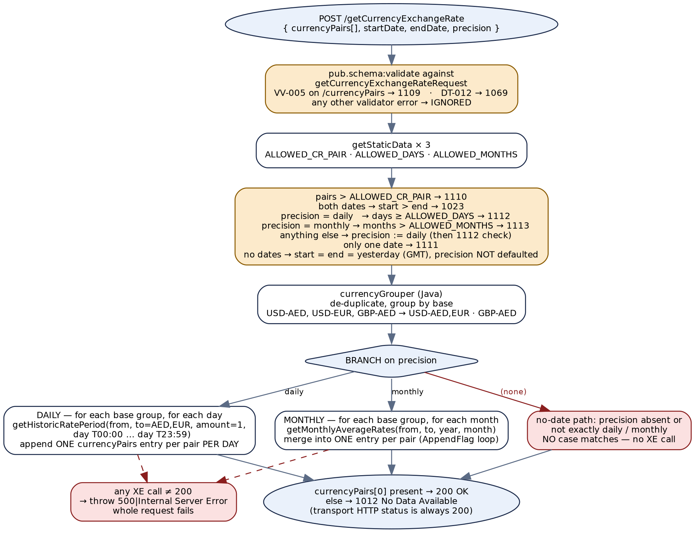
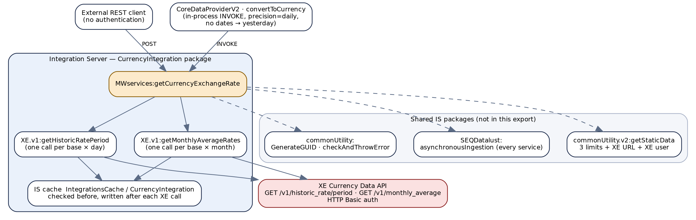
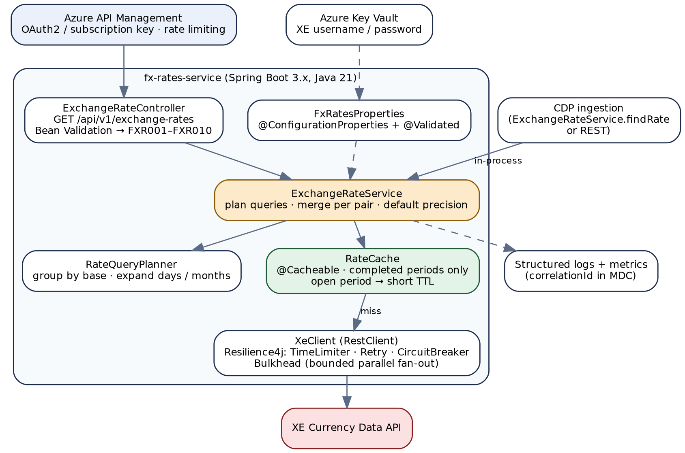
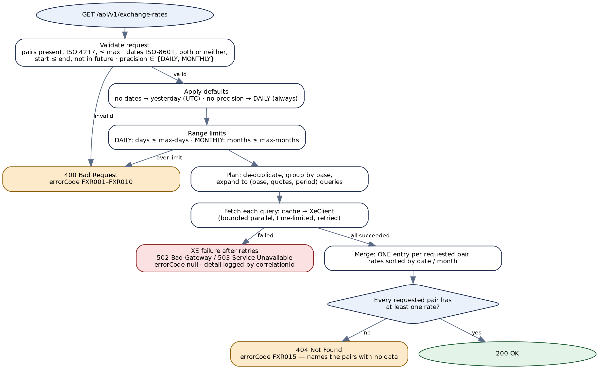

# CurrencyIntegration — API Documentation & Migration Guide

*Al Ramz Capital — Middleware Migration Programme*

Foreign-exchange rates from XE — webMethods Integration Server to Azure / Spring Boot


## Document Control


| Attribute | Detail |
|---|---|
| Package | `CurrencyIntegration` (manifest v1.0; created 23-10-2025; last patch recorded 14-08-2026) |
| Scope of source analysed | All 3 Flow services, all 3 Java services, the 1 request document type, the REST resource definition, and the package configuration (`globalVariables.cnf`). The 3 `flow.xml.bak` files are stale Designer backups and were not used as evidence. |
| Related documents | `CoreDataProvider-SpringBoot-Implementation-Guide` — CoreDataProviderV2 is this package's only internal caller (§4.1, §5.4). `Error-Code-to-HTTP-Status-Mapping` — the shared legacy-code registry used for every HTTP status in this document (§4.6). |
| Target platform | Java 21 · Spring Boot 3.x · Azure API Management in front · Azure Key Vault for the XE credentials |
| Document version | v1.1 |
| Change history | v1.0 — first issue.<br>v1.1 — **no data is now an error.** A request for which XE returns no rate for a requested pair now fails with `404 Not Found` and error code `FXR015`, in line with the shared registry's `1012 → 404`, replacing v1.0's proposal of `200` with an empty list. Decision of the API owner. Affects §1.3, §4.3, §4.5, §4.6, §4.7, §4.8 (Figure 4), §5.4 and Appendix E. |

> **A note on credentials**
>
> The XE password is held as an Integration Server **secure** global variable, and the package export also carries the encrypted password-store files. No credential value appears anywhere in this document — only the names of the settings that hold them (§3.1, §3.4).


## Table of Contents


- [CurrencyIntegration — API Documentation & Migration Guide](#currencyintegration-api-documentation-migration-guide)
  - [Document Control](#document-control)
  - [Table of Contents](#table-of-contents)
- [1. Overview](#1-overview)
  - [1.1 Purpose](#11-purpose)
  - [1.2 Scope](#12-scope)
  - [1.3 Executive summary](#13-executive-summary)
- [2. Solution Architecture](#2-solution-architecture)
  - [2.1 As-built service flow](#21-as-built-service-flow)
  - [2.2 End-to-end journey](#22-end-to-end-journey)
  - [2.3 Target architecture (Spring Boot)](#23-target-architecture-spring-boot)
  - [2.4 Target response and result model](#24-target-response-and-result-model)
- [3. Prerequisites & Static Configuration](#3-prerequisites-static-configuration)
  - [3.1 Integration Server global variables](#31-integration-server-global-variables)
  - [3.2 Static and feature-flag configuration](#32-static-and-feature-flag-configuration)
  - [3.3 Upstream and downstream dependencies](#33-upstream-and-downstream-dependencies)
  - [3.4 Security notes](#34-security-notes)
- [4. API — Get Currency Exchange Rates](#4-api-get-currency-exchange-rates)
  - [4.1 Endpoint summary](#41-endpoint-summary)
  - [4.2 Request schema](#42-request-schema)
  - [4.3 Business logic summary](#43-business-logic-summary)
  - [4.4 Sample request](#44-sample-request)
  - [4.5 Response schema](#45-response-schema)
  - [4.6 HTTP status code reference](#46-http-status-code-reference)
    - [Client input errors](#client-input-errors)
    - [Backend / provider errors](#backend-provider-errors)
    - [No data](#no-data)
  - [4.7 Example target response envelopes](#47-example-target-response-envelopes)
  - [4.8 Target process flow (Spring Boot)](#48-target-process-flow-spring-boot)
- [5. Downstream & Backoffice Integration APIs](#5-downstream-backoffice-integration-apis)
  - [5.1 XE historic rate for a period](#51-xe-historic-rate-for-a-period)
    - [Signature](#signature)
    - [XE call](#xe-call)
    - [Behaviour](#behaviour)
    - [HTTP status code reference](#http-status-code-reference)
  - [5.2 XE monthly average rates](#52-xe-monthly-average-rates)
  - [5.3 Java utilities](#53-java-utilities)
  - [5.4 Internal consumer — CoreDataProviderV2](#54-internal-consumer-coredataproviderv2)
    - [Internal call signature](#internal-call-signature)
    - [Sample response — internal form (legacy)](#sample-response-internal-form-legacy)
    - [Sample response — internal form (target)](#sample-response-internal-form-target)
- [6. Data Mapping Reference](#6-data-mapping-reference)
  - [6.1 Request → XE query (daily)](#61-request-xe-query-daily)
  - [6.2 Request → XE query (monthly)](#62-request-xe-query-monthly)
  - [6.3 XE response → API response (daily)](#63-xe-response-api-response-daily)
  - [6.4 XE response → API response (monthly)](#64-xe-response-api-response-monthly)
  - [6.5 Configuration → target properties](#65-configuration-target-properties)
  - [6.6 Legacy → target field names](#66-legacy-target-field-names)
- [7. Appendix](#7-appendix)
  - [A. Pseudocode](#a-pseudocode)
    - [A.1 getCurrencyExchangeRate — as built](#a1-getcurrencyexchangerate-as-built)
    - [A.2 XE adapter — as built (both adapters)](#a2-xe-adapter-as-built-both-adapters)
  - [B. Findings register](#b-findings-register)
  - [C. Persistence and type mapping](#c-persistence-and-type-mapping)
  - [D. Glossary](#d-glossary)
  - [E. Open items](#e-open-items)


# 1. Overview


## 1.1 Purpose


`CurrencyIntegration` returns foreign-exchange rates for one or more currency pairs over a date range, either as **daily** rates or as **monthly averages**. It sources every rate from the **XE Currency Data API** and caches each XE response in the Integration Server cache.

It has two consumers: an external REST client calling `POST /getCurrencyExchangeRate`, and **CoreDataProviderV2**, which invokes the same Flow service in-process whenever it converts a vendor figure (a dividend, a market capitalisation, a financial-statement line) from the issuer's reporting currency into the instrument's trading currency.


## 1.2 Scope


**In scope:**

- The one REST operation, `getCurrencyExchangeRate` (Chapter 4).
- The two XE adapter services it calls — `getHistoricRatePeriod` and `getMonthlyAverageRates` — and the three Java helpers (Chapter 5).
- The internal call contract used by CoreDataProviderV2 (§4.1, §5.4).
- All configuration, caching, security and data-mapping behaviour needed to rebuild the service on Spring Boot.

**Out of scope:**

- The shared packages this one depends on but which are not in the export: `commonUtility` (static data, GUID generation, error throwing) and `SEQDatalust` (log shipping). Their behaviour is described only as far as this package's calls reveal it.
- The XE API itself, beyond the endpoints, parameters and response fields this package actually uses.
- CoreDataProviderV2's own conversion logic, which is covered by its implementation guide. Only the part that affects this service's contract is repeated here.


## 1.3 Executive summary


This is a small package — three Flow services and three short Java utilities — with one public operation. The logic is straightforward in intent: validate the request, apply configured limits, group the pairs by base currency so that XE can be asked for several quote currencies in one call, call XE once per base currency per day (or per month), and assemble the result.

It works for the case it is most often used for — CoreDataProviderV2 asking for yesterday's daily rate for one pair — but the source shows several behaviours that a direct port would carry into the new platform, and which the target design in this document corrects:

- **A request that omits both dates returns `1012 No Data Available` without calling XE at all unless `precision` is exactly `daily` or `monthly`** — including when `precision` is simply left out. The `precision` default is applied only on the path where dates are supplied (§4.3, finding CI-01).
- **Daily results are not grouped by pair.** Each day produces a separate `currencyPairs` entry, so a 30-day request for one pair returns 30 entries for that pair; monthly results are merged into one entry per pair. The two precisions return differently shaped data (CI-02).
- **A single failed XE call fails the whole request** with `500`, discarding every rate already fetched, and XE's own client errors (an unsupported currency, a future date) reach the caller as `500` rather than as input errors (CI-03).
- **`precision` is case-sensitive and loosely handled.** With dates supplied, any unrecognised value — `"Monthly"` with a capital M included — is silently turned into `daily`; without dates, the same value makes no XE call and returns `1012` (CI-01, CI-05).
- **Validation errors outside two specific validator codes are ignored** and the request continues (CI-04).
- **No authentication** is enforced on the REST resource, and every XE call is made serially with no timeout or retry configured.

> **Key migration notes**
>
> **One service, two consumers.** The REST contract and the in-process contract used by CoreDataProviderV2 must be migrated together. CoreDataProviderV2 reads only the first rate of the first pair, and ignores the response code: when this service fails, the converted amount simply comes back empty with no FX rate recorded, and nothing downstream can tell a failed conversion from a missing amount (§2.4, §5.4). The target gives it a typed lookup instead.
>
> **The target is a `GET`, not a `POST`.** This operation reads data and changes nothing. §4.1 proposes `GET /api/v1/exchange-rates` and keeps the legacy path as a deprecated alias.
>
> **No data is an error, not an empty success.** If XE returns no rate for any requested pair, the request fails with `404 Not Found` and `FXR015`, naming the pairs — the shared registry's own mapping for `1012 No Data Available` (§4.6).
>
> **Every legacy code maps exactly as the shared registry says**: `1109`, `1110`, `1111`, `1112`, `1113`, `1023` and `1069` are all `400`, and `1012` is `404`. XE failures become `502`/`503` rather than `500`.
>
> **Proposed error prefix `FXR`** ("FX Rates") — checked against every prefix already used in this programme; no collision. Not yet confirmed by the API owner.


# 2. Solution Architecture


## 2.1 As-built service flow


Figure 1 shows `getCurrencyExchangeRate` as it executes today. The amber boxes are validation; the red boxes are the defects described in Appendix B.



*Figure 1 — As-built flow of CurrencyIntegration.services.MWservices:getCurrencyExchangeRate*


## 2.2 End-to-end journey


Figure 2 places the service among every system it touches: its two callers, the two XE adapters and the IS cache inside the package, the shared utility services outside it (from two packages, `commonUtility` and `SEQDatalust`), and the XE API.



*Figure 2 — End-to-end journey: callers, package services, shared packages and the XE API*


## 2.3 Target architecture (Spring Boot)


The target is a single small service, `fx-rates-service`, behind Azure API Management. The two XE adapters collapse into one `XeClient`; the three Java helpers become ordinary methods on a `RateQueryPlanner`; the IS cache becomes a Spring cache abstraction with a TTL policy that distinguishes completed periods from the current one.



*Figure 3 — Target Spring Boot architecture*

| Legacy component | Target component | Note |
|---|---|---|
| `MWservices:getCurrencyExchangeRate` | `ExchangeRateController` + `ExchangeRateService` | Controller does binding and validation only; the service owns defaults, limits, planning and merging. |
| `XE.v1:getHistoricRatePeriod`, `XE.v1:getMonthlyAverageRates` | `XeClient` — two methods | The two adapters are the same template, differing only in URL, query parameters, cache-key fields, and four default-value assignments in the monthly one (§5.1, §5.2). One client, two methods. |
| `utils.java:currencyGrouper`, `daysListGenerator`, `monthListGenerator` | `RateQueryPlanner` | Pure functions; unit-testable without a container (§5.3). |
| `pub.cache:get` / `pub.cache:put` on `IntegrationsCache` / `CurrencyIntegration` | `RateCache` (Spring `@Cacheable` over Caffeine, or Azure Cache for Redis if more than one instance runs) | TTL chosen per entry: long for completed days and months, short for today and the current month (finding CI-06). |
| `commonUtility.v2:getStaticData` (MIDDLEWARE) | `FxRatesProperties` (`@ConfigurationProperties`, validated at startup) | The legacy service reads its three limits from the static-data store on **every request**, and the XE URL and username on every uncached XE call. |
| IS secure global variable `CURRENCY_EXCHANGE_RATE_XE_PASSWORD` | Azure Key Vault secret | Bound to the same properties class via the Key Vault property source. |
| `SEQDatalust:asynchronousIngestion` | Structured JSON logging with the correlation id in the MDC | Ship to whichever log sink the platform standardises on. |


## 2.4 Target response and result model


The public API returns the standard envelope described in §4.5. Internal calls — from `ExchangeRateService` to `XeClient`, and from CoreDataProviderV2 to `ExchangeRateService` — use a typed result instead of the legacy pattern of inspecting a string `responseCode` and then reading a loosely typed `response` record.

```
public record OperationResult<T>(
        boolean success,
        T       data,              // null unless success
        String  failureCode,       // FXR011 ... FXR999, for logging and metrics
        String  failureDetail) {   // server-side only; never returned to an API caller

    public static <T> OperationResult<T> ok(T data) { ... }
    public static <T> OperationResult<T> failed(String code, String detail) { ... }
}

public interface ExchangeRateService {

    /** The full query behind the REST operation. */
    OperationResult<ExchangeRates> getRates(ExchangeRateQuery query);

    /** The narrow lookup CoreDataProviderV2 actually needs: one pair, one date.
     *  Replaces reading response/currencyPairs[0]/rates[0]/rate from the full
     *  response, and makes a failure impossible to mistake for a rate of 1. */
    OperationResult<FxRate> findRate(Currency base, Currency quote, LocalDate date);
}

public record FxRate(Currency base, Currency quote, LocalDate date,
                     BigDecimal rate, String source) {}   // source = "XE"
```

> **Why CoreDataProviderV2 needs findRate rather than the full response**
>
> Today CoreDataProviderV2's `convertToCurrency` invokes this service with one pair and `precision=daily`, then copies `response/currencyPairs[]/rates[]/rate` — a path with no index, which Integration Server resolves to the first element of each list.
>
> When this service fails, the rate comes back empty, `convertToCurrency` throws its own error into its own `CATCH` block, and that block **deletes its output** — the converted values — and logs. So the caller receives no converted amount and no FX rate, with nothing to say why: a failed conversion is indistinguishable from a vendor that sent no amount. The failure is visible only in the log.
>
> `findRate` returning an `OperationResult` makes the failure a value the caller has to handle. The CoreDataProvider implementation guide's rule that `fxRate` is always populated then does the rest.

`OperationResult` is internal only. It is never serialised to an API caller.


# 3. Prerequisites & Static Configuration


## 3.1 Integration Server global variables


| Global variable | Secure | Used by | Purpose | Target |
|---|---|---|---|---|
| `CURRENCY_EXCHANGE_RATE_XE_PASSWORD` | Yes (`isSecure = true`) | Both XE adapters, via a `MAPSET` with global-variable substitution (`%CURRENCY_EXCHANGE_RATE_XE_PASSWORD%`) | XE API password for HTTP Basic authentication | Key Vault secret `xe-api-password`, bound to `fx.xe.password` |

This is the package's only global variable. Note that the password is resolved from a global variable while the matching username comes from the static-data store (§3.2) — two different configuration mechanisms for one credential pair. The target keeps both halves in Key Vault.


## 3.2 Static and feature-flag configuration


All five settings are read through `commonUtility.v2.services:getStaticData` with `application = MIDDLEWARE`. Their **values are not in the package export** — they live in the shared static-data store.

| Key | Read by | When | Meaning | Target property |
|---|---|---|---|---|
| `CURRENCY_EXCHANGE_RATE_ALLOWED_CR_PAIR` | `getCurrencyExchangeRate` | Every request | Maximum number of entries in `currencyPairs` (counted **before** de-duplication — CI-10). Exceeded → `1110`. | `fx.limits.max-pairs` |
| `CURRENCY_EXCHANGE_RATE_ALLOWED_DAYS` | `getCurrencyExchangeRate` | Every request | Maximum length of a daily range. The check is `dayDifference >= ALLOWED_DAYS`, so the largest accepted range is exactly `ALLOWED_DAYS` calendar days, inclusive of both ends. Exceeded → `1112`. | `fx.limits.max-days` |
| `CURRENCY_EXCHANGE_RATE_ALLOWED_MONTHS` | `getCurrencyExchangeRate` | Every request | Maximum number of calendar months (inclusive) in a monthly range. The check is `monthCount > ALLOWED_MONTHS`. Exceeded → `1113`. | `fx.limits.max-months` |
| `CURRENCY_EXCHANGE_RATE_XE_BASE_URL` | Both XE adapters | Every uncached XE call | XE API base URL; the adapters append `/v1/historic_rate/period` or `/v1/monthly_average`. | `fx.xe.base-url` |
| `CURRENCY_EXCHANGE_RATE_XE_USERNAME` | Both XE adapters | Every uncached XE call | XE API username (HTTP Basic). | Key Vault secret `xe-api-username`, bound to `fx.xe.username` |

Hard-coded values that should also become configuration in the target:

| Legacy literal | Where | Target property |
|---|---|---|
| Cache manager `IntegrationsCache`, cache `CurrencyIntegration` | Both XE adapters | `spring.cache.*` plus `fx.cache.completed-period-ttl` and `fx.cache.open-period-ttl` |
| `amount = 1` | `getCurrencyExchangeRate`, daily path | Not configurable — a rate for one unit is the definition of a rate. Keep as a constant. |
| Daily window `T00:00` to `T23:59` | `getCurrencyExchangeRate`, daily path | Constant in `XeClient` |
| Timezone `GMT` for the default date, `GMT+4` for log timestamps | `getCurrencyExchangeRate` | `fx.default-date-zone` (recommend `UTC`, see CI-09) |


## 3.3 Upstream and downstream dependencies


Each of these is a candidate health-check dependency for the target service.

| Dependency | Direction | Used for | Failure behaviour today | Target health check |
|---|---|---|---|---|
| XE Currency Data API | Downstream | Every rate | Non-200 → the request fails with `500`. No timeout, no retry. | **Yes** — a lightweight authenticated call, cached, or the circuit-breaker state. Must not consume meaningful quota. |
| IS cache `IntegrationsCache` / `CurrencyIntegration` | Internal | Avoiding repeat XE calls | Not observable from the flow. | Cache health if Redis is used; none needed for an in-process cache. |
| `commonUtility.v2.services:getStaticData` | Internal (shared package) | Limits, XE URL, XE username | An exception escapes to the catch block → `500`. A **missing** value is not detected: the limit comparisons then run against a null. | Replaced by startup-validated configuration — no runtime dependency. |
| `commonUtility.services:checkAndThrowError`, `commonUtility.java:GenerateGUID` | Internal (shared package) | Error signalling; correlation ids | — | Replaced by exceptions and a request filter. |
| `SEQDatalust.services:asynchronousIngestion` | Internal (shared package) | Shipping request/response logs | Called in every service's `Finally` block with the whole pipeline implicitly — which fields it ships is not determinable from this export. | Replaced by structured logging. |
| CoreDataProviderV2 | Upstream (caller) | FX conversion during ingestion | Treats a failure as "no rate": the converted amount comes back empty and no FX rate is recorded (§2.4). | Not a dependency of this service; listed because a change here changes its behaviour. |


## 3.4 Security notes


| Aspect | Legacy | Target |
|---|---|---|
| Caller authentication | **None.** The REST resource declares no authentication; all six services have `check_internal_acls = no`; the package manifest's `listACL` is null. | Azure API Management in front, OAuth2 client-credentials (or subscription keys) per consuming application. The service also validates the JWT itself — the gateway is not the only line of defence. |
| Authorisation | None | One scope, e.g. `fx.rates.read`. The operation is read-only, so there is nothing further to separate. |
| Outbound credentials | XE username from the static-data store; password from a secure IS global variable; sent as HTTP Basic auth on every uncached call. The URL scheme depends on the configured base URL, which is not in the export. | Both from Key Vault via managed identity. **Enforce `https://`** in the `@Validated` properties class — Basic auth over plain HTTP sends the password in clear. |
| Credential hygiene on failure | The XE adapters remove `username` and `password` from the pipeline after a successful HTTP call. If the call throws, those removals are skipped, and the `Finally` block passes the whole pipeline to `SEQDatalust` before `clearPipeline` runs. Whether `SEQDatalust` ships those fields is not determinable from this export — **verify** (open item). | Credentials live only inside `XeClient`'s HTTP interceptor and never enter a log context. |
| Package export contents | The export carries `config/passman.cnf`, `empw.dat`, `txnPassStore.dat` and `globalVariables.cnf`. These are encrypted, but a password store should not travel inside a code package. | Not applicable — secrets never enter the build artefact. |
| Error detail returned to callers | On an error the flow preserves `lastError` in the pipeline although the service's output signature does not declare it. Whether Integration Server serialises it into the REST response is not determinable from source — **verify against a live error response** (open item). The `1069` message also returns the validator's internal text verbatim. | Backend errors return only `responseCode`/`responseMessage`; detail is logged against the correlation id. |
| Input handling | Values are interpolated into the XE URL with `%from%`, `%to%` etc. They are constrained by the request pattern `^[A-Z]{3}-[A-Z]{3}$` before use, so injection into the XE query string is not possible today — provided that validation actually runs (see CI-04). | Query parameters built with `UriComponentsBuilder`, never string interpolation, even though inputs are validated. |


# 4. API — Get Currency Exchange Rates


## 4.1 Endpoint summary


| Field | Detail |
|---|---|
| **Legacy endpoint** | `POST /getCurrencyExchangeRate` — URL template on REST resource `CurrencyIntegration.restAPI:CurrencyIntegration` |
| **Legacy service** | `CurrencyIntegration.services.MWservices:getCurrencyExchangeRate` |
| **Target endpoint** | `GET /api/v1/exchange-rates` — see the note below |
| **Purpose** | Daily rates or monthly average rates for one or more currency pairs over a date range |
| **Downstream** | XE Currency Data API, via the two adapters in §5.1 and §5.2 |
| **Legacy transport status** | Always **HTTP 200**. The flow never sets a transport status; the outcome is carried only in the body's `responseCode`. |
| **Authentication** | Legacy: none. Target: OAuth2 via API Management (§3.4) |
| **Error prefix** | `FXR` (proposed) |

> **Legacy vs. target endpoint**
>
> The legacy path is verb-shaped (`getCurrencyExchangeRate`) and uses `POST` for an operation that reads data and changes nothing.
>
> **Proposed:** `GET /api/v1/exchange-rates?pairs=USD-AED&pairs=EUR-AED&startDate=2026-09-01&endDate=2026-09-07&precision=DAILY`. The resource is the collection of exchange rates, filtered by query parameters; the HTTP method carries the verb. This is a judgment call rather than a mechanical rename: the operation is a filtered query over a collection, so there is no natural `{id}` segment, and the request is small enough (bounded by `fx.limits.max-pairs`) to fit comfortably in a query string.
>
> `GET` also makes the response cacheable by API Management and safe to retry, which suits a read of historical data.
>
> Keep `POST /getCurrencyExchangeRate` as a deprecated alias, returning the legacy body shape, for the whole parallel-running period.

> **Dual exposure — REST API and in-process function**
>
> **REST form:** `POST /getCurrencyExchangeRate`, called by external clients, request and response as in §4.2 and §4.5.
>
> **Internal form:** CoreDataProviderV2's `util.services:convertToCurrency` invokes the same Flow service directly, passing exactly one pair and `precision = daily` and no dates — so it always asks for yesterday's rate. It is invoked from 7 call sites across 5 CoreDataProviderV2 Flow services.
>
> The two forms share one implementation, so every behaviour in this chapter applies to both. §5.4 documents the internal form's signature, what it reads back, and its sample response separately.


## 4.2 Request schema


Legacy: a JSON body. Target: query parameters. The legacy request is validated against the document type `CurrencyIntegration.documents:getCurrencyExchangeRateRequest`, whose constraints are reproduced here exactly.

| Field (legacy → target) | Type | Required | Constraints | Description |
|---|---|---|---|---|
| `currencyPairs` → `pairs` | Legacy `String[]` → target `List<String>` | Yes | Legacy: required, not nillable; each item matches `^[A-Z]{3}-[A-Z]{3}$`, minimum length 1.<br>Target: 1 to `fx.limits.max-pairs` items after de-duplication; each item is two ISO 4217 codes joined by `-`; base ≠ quote. | Currency pairs, base first: `USD-AED` is the price of 1 USD in AED.<br>**Legacy vs. target field format:** the legacy pattern accepts any three capital letters, so `ABC-XYZ` passes validation and fails only if and when XE rejects it — and any XE rejection reaches the caller as a `500` (CI-03). The target validates both halves against the ISO 4217 code list and rejects `USD-USD`. The pair string packs two values into one field; it is kept as the wire format because `BASE-QUOTE` is the conventional FX notation and it keeps the URL readable, but the response also returns `baseCurrency` and `quoteCurrency` separately (§4.5). |
| `startDate` | Legacy `String` → target `LocalDate` | No — but see `endDate` | Legacy: optional; matches `^[0-9]{4}-(((0[13578]\|(10\|12))-(0[1-9]\|[1-2][0-9]\|3[0-1]))\|(02-(0[1-9]\|[1-2][0-9]))\|((0[469]\|11)-(0[1-9]\|[1-2][0-9]\|30)))$`.<br>Target: ISO-8601 `yyyy-MM-dd`, strictly parsed; not after today. | First date of the range, inclusive.<br>**Legacy vs. target field format:** the legacy format is already ISO-8601, so the wire format is unchanged. But the legacy pattern accepts 29 February in every year (`2025-02-29` passes), and what the downstream date parsing then does with it is not determinable from source (CI-08). The target parses with `LocalDate.parse`, which rejects it. |
| `endDate` | Legacy `String` → target `LocalDate` | Only together with `startDate` | As `startDate`.<br>Target: supply both or neither; `startDate ≤ endDate`; not in the future. | Last date of the range, inclusive. When **both** dates are omitted, the range defaults to yesterday.<br>**Legacy vs. target:** the legacy default computes "yesterday" in GMT (CI-09). The target keeps UTC deliberately — XE's timestamps are UTC — and says so in the API documentation. A future `endDate` is not checked in the legacy service; it reaches XE and fails as a `500`. The target rejects it as `FXR010`. |
| `precision` | Legacy `String` → target `enum Precision { DAILY, MONTHLY }` | No | Legacy: optional, no enumeration, no pattern. The flow recognises exactly `daily` and `monthly`, case-sensitively.<br>Target: `DAILY` or `MONTHLY`, bound case-insensitively; default `DAILY`. | Daily rates, or monthly average rates.<br>**Legacy vs. target field format:** in the legacy service an unrecognised value — including `Monthly` or `DAILY` — is silently replaced by `daily` when dates are supplied (CI-05). When no dates are supplied, `precision` is never defaulted or corrected at all, so an **absent or unrecognised** value makes no XE call and the request returns `1012` (CI-01). The target applies the default on every path and rejects any other value with `FXR009`. |
| `correlationID` → header `X-Correlation-Id` | `String` (UUID) | No | Legacy: **not declared** in the input signature, but read from the pipeline if present and generated otherwise.<br>Target: request header, generated when absent, echoed in the body and in every log line. | Traces one request through every log line and every XE call.<br>**Legacy vs. target:** moving it from the body to a header keeps it out of the `GET` query string and matches how API Management propagates correlation ids. |


## 4.3 Business logic summary


What the legacy service does, in order. Every step is taken from `flow.xml`; nothing here is inferred except where marked.

1. **Prepare.** Records a request timestamp (`GMT+4`), serialises the request to JSON for logging (falling back to `{ }` if that fails), and generates a `correlationID` when none is present. Copies `startDate` and `endDate` into local variables.
2. **Schema validation.** Validates the request against `getCurrencyExchangeRateRequest`. For each validator error: code `VV-005` on path `/currencyPairs` → throws `1109`; code `DT-012` on any path → throws `1069` with the message `<pathName><validator message>`, concatenated with no separator. **Every other error is ignored and processing continues** (CI-04). Which validator code each constraint actually produces is not determinable from source — see the open items.
3. **Load limits.** Reads `ALLOWED_CR_PAIR`, `ALLOWED_DAYS` and `ALLOWED_MONTHS` from the static-data store — on every request.
4. **Pair-count limit.** If the number of entries in `currencyPairs` exceeds `ALLOWED_CR_PAIR`, throws `1110 Inquiry Limit Exceeded`. Duplicates are counted (CI-10).
5. **Date handling.** (a) **Both dates supplied:** if `startDate` is after `endDate`, throws `1023`. Then, by `precision`: `daily` → if the day difference is `≥ ALLOWED_DAYS`, throws `1112`; `monthly` → builds the list of calendar months in the range and, if it has more than `ALLOWED_MONTHS` entries, throws `1113`; **anything else** → sets `precision = daily` and applies the `1112` check. (b) **Exactly one date supplied:** throws `1111 Date missing`. (c) **Neither supplied:** sets both dates to yesterday, computed in `GMT`. **`precision` is not defaulted on this path.**
6. **Group pairs.** `currencyGrouper` removes exact duplicates and groups the pairs by base currency, keeping first-seen order: `USD-AED, USD-EUR, GBP-AED` becomes `USD-AED,EUR` and `GBP-AED`.
7. **Fetch, per base-currency group.** Splits the group into `from` (the base) and `to` (the comma-joined quotes), then branches on `precision`:
8. `daily` — for **each day** in the range, calls `getHistoricRatePeriod` with `amount = 1`, `start_timestamp = <day>T00:00`, `end_timestamp = <day>T23:59`. On XE status `200`, for each requested quote currency found in XE's `to` object, appends **a new** `currencyPairs` entry `{ currencyPair: "<from>-<quote>", rates: [ { date, rate } ] }`, where `rate` is XE's `mid` and `date` is XE's `timestamp` up to the `T`. So each day produces its own entry for each pair (CI-02). Any other XE status → throws `500 Internal Server Error`, failing the whole request (CI-03).
9. `monthly` — for **each month** in the range (reusing the list built in step 5 when there is one), calls `getMonthlyAverageRates` with `year` and `month`. On XE status `200`, for each requested quote currency found, builds `rates: [ { year, month, rate } ]` from XE's `year`, `month` and `monthlyAverage`, and **merges** them into the existing entry for that pair if there is one, otherwise adds a new entry. Any other XE status → throws `500`.
10. Any other `precision` value matches no branch, and **no XE call is made**. This happens on the no-date path, where `precision` was never defaulted or corrected: an absent value, `Monthly`, `DAILY`, an empty string — anything other than exactly `daily` or `monthly`.
11. **Result.** If `response.currencyPairs` has at least one entry → `200 OK`. Otherwise → `1012 No Data Available`.
12. **Catch.** If the error message starts with `1069`, `1109`, `1110`, `1012`, `1023`, `1111`, `1112` or `1113`, splits it on `|` into `responseCode` and `responseMessage`. Anything else → `500 Internal Server Error`. (`1012` is in that list but is never thrown — it is set directly in step 11; the thrown `500|Internal Server Error` is not in the list but falls through to the same `500`.)
13. **Finally.** Ships the pipeline to `SEQDatalust`, then clears it, keeping `responseCode`, `responseMessage`, `response`, `correlationID` and `lastError`.

> **Business-logic observations for the target design**
>
> **All-or-nothing, or partial results?** Today one failed XE call discards every rate already fetched. **Recommendation:** keep all-or-nothing for the REST contract — a caller asking for 30 days expects 30 days — but retry each XE call before giving up, and return `502`/`503` rather than `500`. A `207 Multi-Status` with per-pair outcomes is possible but adds a response shape no current consumer needs. Decision for the API owner.
>
> **Weekends and holidays.** The legacy service does not filter them: it requests every calendar day and returns whatever XE supplies. Keep that; it is XE's data, not ours to thin out.
>
> **The current month in a monthly request.** XE's monthly average for the current month is a month-to-date figure. Today it is cached exactly like a completed month (CI-06). Recommendation: allow it, cache it briefly, and document that it moves. Whether to also flag it in the response is a decision for the API owner.
>
> **Future dates.** Not checked today; the target rejects them (`FXR010`) rather than spending an XE call to find out.
>
> **No data for a pair.** Today a pair XE does not return is silently left out of the response, and only a response with **no** pairs at all becomes `1012`. The target treats a missing pair as an error: if any requested pair has no rate anywhere in the range, the request fails with `404` / `FXR015` and the message names the pairs. This is consistent with the all-or-nothing policy above — a caller should never have to diff its request against the response to discover what is missing.
>
> **Duplicates in the pair list.** Counted against the limit today (CI-10). Recommendation: de-duplicate first, then count.
>
> **The default date.** "Yesterday" in UTC. Between midnight and 04:00 Dubai time this is two calendar days ago locally (CI-09). UTC is the right choice for XE data; make it explicit.


## 4.4 Sample request


#### Legacy


```
POST /getCurrencyExchangeRate
Content-Type: application/json

{
  "currencyPairs": ["USD-AED", "EUR-AED", "USD-SAR"],
  "startDate": "2026-09-01",
  "endDate":   "2026-09-03",
  "precision": "daily"
}
```


#### Target


```
GET /api/v1/exchange-rates?pairs=USD-AED&pairs=EUR-AED&pairs=USD-SAR
                          &startDate=2026-09-01&endDate=2026-09-03&precision=DAILY
Authorization: Bearer <token>
X-Correlation-Id: 5b0c1f9e-2d7a-4e61-9a3b-7f4c2e8d1a60
```


## 4.5 Response schema


The target body follows the programme's standard envelope. Rates in the examples are illustrative.

| Field | Type | Description |
|---|---|---|
| correlationID | String (UUID) | Echo of `X-Correlation-Id`, or the generated value. |
| responseCode | String | The HTTP status as a string, e.g. `"200"`. Always present. |
| responseMessage | String | The HTTP reason phrase, e.g. `"OK"`. Always present. |
| errorCode | String \| null | `FXR001`–`FXR010` and `FXR015` for client errors; `null` on success and on every backend error. |
| errorMsg | String \| null | Caller-facing message for client input errors; `null` otherwise. |
| response | Object \| null | `null` on any error. |
| └─ precision | enum `DAILY` \| `MONTHLY` | The precision actually applied, after defaulting.<br>**Legacy vs. target:** legacy returns lowercase `daily`/`monthly`, and the value it returns may differ from what the caller sent (CI-05). |
| └─ startDate | LocalDate | The resolved start of the range. **New.**<br>**Legacy vs. target:** not returned today, so a caller relying on the default cannot tell which day it was given. |
| └─ endDate | LocalDate | The resolved end of the range. **New.** |
| └─ currencyPairs[] | Array | **One entry per requested pair**, in request order.<br>**Legacy vs. target:** for `daily`, legacy returns one entry per pair **per day**, ordered by base-currency group, then day, then quote currency (CI-02). For `monthly` it already returns one entry per pair. The target makes both precisions behave like `monthly`. The deprecated legacy alias keeps the legacy shape. |
| &nbsp;&nbsp;└─ currencyPair | String | `BASE-QUOTE`, e.g. `USD-AED`. |
| &nbsp;&nbsp;└─ baseCurrency | String (ISO 4217) | **New.** The base half of the pair. |
| &nbsp;&nbsp;└─ quoteCurrency | String (ISO 4217) | **New.** The quote half of the pair. |
| &nbsp;&nbsp;└─ rates[] | Array | Sorted ascending by date or month. **Never empty in a `200` response** — a pair with no rate in the range fails the whole request with `404` / `FXR015` (§4.6). |
| &nbsp;&nbsp;└─ rates[].date | LocalDate | `DAILY` only. The date of the rate.<br>**Legacy vs. target:** legacy derives it by splitting XE's timestamp at `T`, and returns it as a string. Same value, now typed. |
| &nbsp;&nbsp;└─ rates[].month | String `yyyy-MM` | `MONTHLY` only.<br>**Legacy vs. target field format:** legacy returns two separate string fields, `year` and `month`, the month as XE supplies it. The target uses a single ISO-8601 year-month. |
| &nbsp;&nbsp;└─ rates[].rate | BigDecimal (JSON number) | Units of quote currency per one unit of base currency. XE's `mid` for daily, `monthlyAverage` for monthly.<br>**Legacy vs. target:** the output signature declares this as `object`; at run time it is the Double XE's JSON parser produced. The target parses XE's number straight into `BigDecimal` so no binary-floating-point rounding enters a rate that CoreDataProviderV2 then multiplies financial figures by. |


## 4.6 HTTP status code reference


**The legacy service always returns transport HTTP 200.** The legacy codes below are the body's `responseCode` / `responseMessage`, taken from `flow.xml`. The HTTP status column is the proposed target transport status. Mappings for every legacy code follow the shared registry `Error-Code-to-HTTP-Status-Mapping.md`, with no exceptions.


### Client input errors


| HTTP Status | Service Error Code | Description | Legacy Error Code |
|---|---|---|---|
| 400 | `FXR001` | `pairs` is missing or empty. | `1109` — At least one currency pair in currencyPairs to be specified. (Only when the validator reports `VV-005` on `/currencyPairs`.) |
| 400 | `FXR002` | A pair is not two ISO 4217 codes joined by `-`, or its base and quote are the same. | `1069` — `<pathName><validator message>` (only when the validator reports `DT-012`). Base = quote is not checked today. |
| 400 | `FXR003` | `startDate` or `endDate` is not a valid ISO-8601 date. | `1069` — `<pathName><validator message>` (`DT-012`) |
| 400 | `FXR004` | More pairs than `fx.limits.max-pairs`. | `1110` — Inquiry Limit Exceeded |
| 400 | `FXR005` | Only one of `startDate` / `endDate` was supplied. | `1111` — Date missing |
| 400 | `FXR006` | `startDate` is after `endDate`. | `1023` — Incorrect Start and/or End Date |
| 400 | `FXR007` | A `DAILY` range longer than `fx.limits.max-days`. | `1112` — Inquiry Limit Exceeded |
| 400 | `FXR008` | A `MONTHLY` range longer than `fx.limits.max-months`. | `1113` — Inquiry Limit Exceeded |
| 400 | `FXR009` | `precision` is not `DAILY` or `MONTHLY`. | — (silently treated as `daily`; CI-05) |
| 400 | `FXR010` | `endDate` is in the future. | — (not checked; XE rejects it and the caller receives `500`) |
| 404 | `FXR015` | No exchange-rate data: XE answered successfully but returned no rate for one or more requested pairs anywhere in the range — typically a currency XE does not quote, or a date outside XE's history. The message names the affected pairs. | `1012` — No Data Available. **Legacy raises it only when no pair at all has data;** a request where some pairs have data returns `200` with the others silently absent. |

`1110`, `1112` and `1113` are named like rate limits but are input-size limits, which is why the shared registry maps them to `400` rather than `429`. This document follows the registry.


### Backend / provider errors


`errorCode` and `errorMsg` are `null` for every row. The `FXR` codes here are **server-side only** — they appear in logs and metrics, never in a response.

| HTTP Status | Service Error Code | Description | Legacy Error Code |
|---|---|---|---|
| 502 | `FXR011` | XE returned a non-2xx status after retries — including XE's own rejection of a currency or date it does not support. | `500` — Internal Server Error (the adapter returns XE's status as its `responseCode`; the parent turns any non-200 into `500`) |
| 502 | `FXR012` | XE returned a body that is not JSON. | `500` — Internal Server Error (set by the adapter) |
| 502 | `FXR013` | XE rejected our credentials (`401` / `403`). Separate from `FXR011` because it needs an operator, not a retry. | `500` — Internal Server Error |
| 503 | `FXR014` | XE unreachable, timed out, or the circuit breaker is open. | `500` — Internal Server Error (exception → catch block) |
| 500 | `FXR999` | Any unexpected error inside the service. | `500` — Internal Server Error |

XE is a named external system, so its failures map to `502`, following the registry's own convention of reserving `500` for failures inside the middleware and `503` for a dependency that is down entirely.


### No data


> **Design decision — no data is 404 Not Found, following the registry**
>
> **Rule:** if XE returns no rate for any requested pair anywhere in the requested range, the whole request fails with `404 Not Found`, `errorCode = FXR015`, and an `errorMsg` naming the pairs — for example *No exchange-rate data found for USD-XAU between 2026-09-01 and 2026-09-03.* No partial response is returned.
>
> **Why an error and not an empty success:** by the time the service asks XE, the request has passed every input check and XE has answered successfully. If a requested pair still has no rate, the caller cannot use the response for its purpose — CoreDataProviderV2, for example, needs a rate to convert with, not an empty list. Returning `200` would make the caller responsible for noticing that something it asked for is missing.
>
> **Why `404`:** it is the shared registry's mapping for `1012 No Data Available`, so this service behaves like every other service in the programme. The resource the caller asked for — a rate for that pair on those dates — does not exist at the provider.
>
> **Why a client-facing code, with `errorCode` populated:** the two usual causes are both things the caller can act on — a currency XE does not quote, or a date range XE has no history for. The caller gets `FXR015` and the list of pairs so it can correct the request.
>
> **When it is really a provider problem:** XE may occasionally omit a currency it normally quotes. The service cannot tell that apart from an unsupported currency, so it returns the same `404` — but it logs the pair, the dates and XE's raw response against the correlation id, and a metric on `FXR015` by pair lets operations see a sudden rise for a currency that normally works. XE's own error statuses remain `502` (`FXR011`–`FXR013`), and an unreachable XE remains `503` (`FXR014`).

> **How this compares with the legacy service**
>
> The legacy service returns `1012` only when **no** pair has any data. If some pairs have data and others do not, it returns `200` and the missing pairs are simply absent. The target is stricter: one missing pair fails the request.
>
> In practice the most common legacy `1012` is not "XE had no data" at all — it is defect CI-01, where a request with no dates and an absent or mis-cased `precision` never calls XE. In the target that request either succeeds (`precision` defaults to `DAILY`) or fails validation (`FXR009`), so a `404` from the target always means XE was asked and had nothing.


## 4.7 Example target response envelopes


#### Success — DAILY


```
HTTP/1.1 200 OK

{
  "correlationID": "5b0c1f9e-2d7a-4e61-9a3b-7f4c2e8d1a60",
  "responseCode": "200",
  "responseMessage": "OK",
  "errorCode": null,
  "errorMsg": null,
  "response": {
    "precision": "DAILY",
    "startDate": "2026-09-01",
    "endDate": "2026-09-03",
    "currencyPairs": [
      { "currencyPair": "USD-AED", "baseCurrency": "USD", "quoteCurrency": "AED",
        "rates": [ { "date": "2026-09-01", "rate": 3.6725 },
                   { "date": "2026-09-02", "rate": 3.6725 },
                   { "date": "2026-09-03", "rate": 3.6726 } ] },
      { "currencyPair": "EUR-AED", "baseCurrency": "EUR", "quoteCurrency": "AED",
        "rates": [ { "date": "2026-09-01", "rate": 4.0412 },
                   { "date": "2026-09-02", "rate": 4.0388 },
                   { "date": "2026-09-03", "rate": 4.0451 } ] },
      { "currencyPair": "USD-SAR", "baseCurrency": "USD", "quoteCurrency": "SAR",
        "rates": [ { "date": "2026-09-01", "rate": 3.7503 },
                   { "date": "2026-09-02", "rate": 3.7502 },
                   { "date": "2026-09-03", "rate": 3.7504 } ] }
    ]
  }
}
```

For comparison, the **legacy** body for the same request returns nine `currencyPairs` entries — `USD-AED`, `USD-SAR` for 1 September, the same two for 2 and 3 September, then `EUR-AED` for each of the three days — each holding one rate.


#### Client input error


```
HTTP/1.1 400 Bad Request

{
  "correlationID": "9a41e7c2-0b5d-4f38-8e16-3c7d2a9b5f04",
  "responseCode": "400",
  "responseMessage": "Bad Request",
  "errorCode": "FXR007",
  "errorMsg": "The date range exceeds the maximum of 30 days for DAILY precision.",
  "response": null
}
```

The `30` in the message is illustrative; the service renders the configured `fx.limits.max-days`.


#### No data


```
HTTP/1.1 404 Not Found

{
  "correlationID": "3f8d2b61-7c4e-4a09-9e5d-b2a7c1f06e48",
  "responseCode": "404",
  "responseMessage": "Not Found",
  "errorCode": "FXR015",
  "errorMsg": "No exchange-rate data found for USD-XAU between 2026-09-01 and 2026-09-03.",
  "response": null
}
```


#### Backend / provider error — note what is absent


```
HTTP/1.1 502 Bad Gateway

{
  "correlationID": "e2c7b9a0-6f14-4d83-b5a2-18c9e0f7d3b6",
  "responseCode": "502",
  "responseMessage": "Bad Gateway",
  "errorCode": null,
  "errorMsg": null,
  "response": null
}

// Logged server-side only, against the correlation id:
//   FXR011  XE GET /v1/historic_rate/period  status=400  from=USD to=AED
//           window=2026-09-02T00:00..2026-09-02T23:59  attempts=3
```


## 4.8 Target process flow (Spring Boot)




*Figure 4 — Target process flow for GET /api/v1/exchange-rates*

```
@RestController
@RequestMapping("/api/v1/exchange-rates")
@Validated
class ExchangeRateController {

    @GetMapping
    ApiResponse<ExchangeRatesDto> get(@Valid ExchangeRateQueryParams params,
                                      @RequestHeader(value = "X-Correlation-Id", required = false)
                                      String correlationId) { ... }

    /** Deprecated alias; returns the LEGACY body shape (per-day entries, lowercase
     *  precision, string year/month) so existing callers see no change. */
    @Deprecated(forRemoval = true)
    @PostMapping(path = "/getCurrencyExchangeRate")
    LegacyCurrencyRateResponse legacy(@RequestBody LegacyCurrencyRateRequest body) { ... }
}

class ExchangeRateService {
    // 1 apply defaults: no dates -> yesterday (UTC); no precision -> DAILY, on EVERY path
    // 2 de-duplicate, then enforce max-pairs / max-days / max-months
    // 3 plan: group by base currency; one query per (base, quotes, day|month)
    // 4 fetch through RateCache -> XeClient, bounded parallelism
    // 5 any query failing after retries -> the whole request fails (502 / 503)
    // 6 merge: one entry per requested pair; rates sorted
    // 7 any requested pair with no rate in the range -> 404 / FXR015, naming the pairs
}
```


# 5. Downstream & Backoffice Integration APIs


None of the services in this chapter is exposed through the REST resource. The first two are the XE adapters; the third section covers the Java helpers; the fourth documents the internal form of the Chapter 4 service as CoreDataProviderV2 uses it.


## 5.1 XE historic rate for a period


`CurrencyIntegration.services.XE.v1:getHistoricRatePeriod`

> **Internal only — not exposed as an API**
>
> Called only by `getCurrencyExchangeRate`'s daily path, once per base-currency group per day. Its target form is a method on `XeClient` returning `OperationResult<XeHistoricRates>` (§2.4), not the public envelope.


### Signature


| Direction | Field | Type | Notes |
|---|---|---|---|
| In | `from` | String | Base currency, e.g. `USD`. |
| In | `to` | String | One or more quote currencies, comma-joined, e.g. `AED,EUR`. A multi-value string — the target takes `List<Currency>` and joins it only when building the URL. |
| In | `amount` | String | Always `1` from the caller. |
| In | `start_timestamp`, `end_timestamp` | String | `<yyyy-MM-dd>T00:00` and `<yyyy-MM-dd>T23:59`. |
| Out | `responseCode`, `responseMessage` | String | XE's HTTP status and reason phrase, or `500` / `Internal Server Error`. |
| Out | `response` | Record | XE's parsed body when XE returned `200` with JSON. Declared fields: `terms`, `privacy`, `from`, `amount` (object), `to` (record). |
| Out | `correlationID` | String | Echoed, or generated. |


### XE call


```
GET {CURRENCY_EXCHANGE_RATE_XE_BASE_URL}/v1/historic_rate/period
      ?from={from}&to={to}&amount={amount}
      &start_timestamp={start_timestamp}&end_timestamp={end_timestamp}
Authorization: Basic <CURRENCY_EXCHANGE_RATE_XE_USERNAME : CURRENCY_EXCHANGE_RATE_XE_PASSWORD>
accept: application/json
```

Response fields consumed by the parent service: `to.<CURRENCY>[].mid` and `to.<CURRENCY>[].timestamp`, where `to` is an object keyed by quote currency. Every point XE returns within the window is mapped; the legacy code does not assume there is exactly one.


### Behaviour


1. Records a request timestamp, serialises the inputs for logging, and generates a `correlationID` if absent.
2. Builds the cache key `<from>_<to>_<amount>_<start_timestamp>_<end_timestamp>` and looks it up in cache `CurrencyIntegration` of cache manager `IntegrationsCache`. **On a hit**, parses the cached JSON and returns `200 OK` immediately — no static-data lookup, no XE call.
3. On a miss, reads the XE base URL and username from the static-data store and the password from the secure global variable, then calls XE. No timeout is set on the HTTP call, and there is no retry.
4. Copies XE's HTTP status and reason phrase into `responseCode` and `responseMessage`, and removes the credentials from the pipeline.
5. If the response `Content-Type` is JSON — six exact spellings are tested, covering `content-type` / `Content-Type` and `application/json` with or without `; charset=utf-8` and with or without the space — parses the body into `response`. Then, if XE's status was `200`, **writes the raw body to the cache**; otherwise **drops `response`**, so XE's own error body never reaches the caller.
6. If the response is not JSON, sets `500 Internal Server Error`.
7. On any exception, sets `500 Internal Server Error`.
8. `Finally`: ships the pipeline to `SEQDatalust`, then clears it, keeping `responseCode`, `responseMessage`, `response`, `correlationID`.

> **Two properties of the cache key worth knowing**
>
> The quote list is part of the key **in the order given**. `AED,EUR` and `EUR,AED` are separate entries, both holding the same data. Harmless, but it halves the hit rate for callers who order pairs differently. The target's cache key sorts the quote list.
>
> Nothing in the key distinguishes a completed day from today. A request whose range includes today caches a partial-day answer for as long as the cache's TTL allows (CI-06). The TTL is server configuration and is not in the export.


### HTTP status code reference


Internal service — these outcomes are returned to `ExchangeRateService` as `OperationResult` failures and surface to an API caller only through the mappings in §4.6.

| Target outcome | Service Error Code | Description | Legacy Error Code |
|---|---|---|---|
| success | — | XE `200` with JSON, or a cache hit. | `200` — OK (XE's status passed through, or set on a cache hit) |
| failure | `FXR011` | XE non-2xx. | XE's own status and reason phrase, passed through; body dropped |
| failure | `FXR012` | XE body not JSON. | `500` — Internal Server Error |
| failure | `FXR013` | XE `401` / `403`. | XE's own status, passed through |
| failure | `FXR014` | Connection failure or timeout. | `500` — Internal Server Error |


## 5.2 XE monthly average rates


`CurrencyIntegration.services.XE.v1:getMonthlyAverageRates`

> **Internal only — not exposed as an API**
>
> Called only by `getCurrencyExchangeRate`'s monthly path, once per base-currency group per month. Target: a second method on `XeClient`.

Identical in structure to §5.1. Only the differences are listed.

| Aspect | `getMonthlyAverageRates` |
|---|---|
| Inputs | `from`, `to` (comma-joined), `year` (`yyyy`), `month` (`MM`, from the parent's `yyyy-MM` split on `-`) |
| XE call | `GET {base}/v1/monthly_average?from={from}&to={to}&year={year}&month={month}`, same authentication and headers |
| Response fields consumed | `year` (top level), `to.<CURRENCY>[].month`, `to.<CURRENCY>[].monthlyAverage` |
| Cache key | `<from>_<to>_<year>_<month>` |
| Default values | `from`, `to`, `year` and `month` are each given an empty-string **default** (set with overwrite off, so a supplied value always wins). The effect is that a call missing, say, `month` does not fail while building the cache key — it goes on to call XE with `month=` empty. The historic adapter has no such defaults. Neither case is reachable from the parent today, which always supplies all four. |
| Status handling | Identical to §5.1 |

HTTP status code reference: identical to §5.1.


## 5.3 Java utilities


> **Internal only — not exposed as an API**
>
> Three static Java services in `CurrencyIntegration.utils.java`. In the target they become ordinary methods on `RateQueryPlanner`, tested without any container. They have no error codes of their own: an exception propagates to the caller's catch block and becomes `500`.

| Service | In → Out | Behaviour | Edge cases |
|---|---|---|---|
| `currencyGrouper` | `currencyPairs[]` → `groupedCurrencyPairs[]` | Removes exact duplicates, then groups by the text before the first `-`, keeping first-seen order: `[USD-AED, USD-EUR, GBP-AED, USD-AED]` → `[USD-AED,EUR, GBP-AED]`. | Case-sensitive: `usd-AED` and `USD-AED` are different groups. A pair with no `-` throws `ArrayIndexOutOfBoundsException`; a pair with two `-` keeps only the middle part as its quote. Both are reachable only if schema validation fails to reject the input (CI-04). |
| `daysListGenerator` | `startDate`, `endDate`, two formats → `days[]` | Every calendar day from start to end inclusive, formatted with the **start** date's pattern. | `start > end` → an empty list. No upper bound — the day limit is enforced by the caller, before this runs. |
| `monthListGenerator` | `startDate`, `endDate`, two formats → `months[]` | Every calendar month from the start date's month to the end date's month inclusive, as `yyyy-MM`. | Counts calendar months touched, not elapsed months: `2026-01-31` to `2026-02-01` is **two** months. The `1113` limit therefore counts months touched. |

```
final class RateQueryPlanner {

    /** De-duplicate, group by base, keep first-seen order. */
    List<RateQuery> plan(List<CurrencyPair> pairs, Precision precision,
                         LocalDate start, LocalDate end) {
        // DAILY   -> start.datesUntil(end.plusDays(1))
        // MONTHLY -> YearMonth.from(start) .. YearMonth.from(end), inclusive
    }
}

record RateQuery(Currency base, List<Currency> quotes, LocalDate day, YearMonth month) {}
```


## 5.4 Internal consumer — CoreDataProviderV2


> **Dual exposure — the internal form of §4**
>
> **Identity:** the same Flow service as Chapter 4, `CurrencyIntegration.services.MWservices:getCurrencyExchangeRate`, invoked in-process by `CoreDataProviderV2.util.services:convertToCurrency`.
>
> **Callers:** 7 invocation sites across 5 CoreDataProviderV2 Flow services — the GFM and Finnhub corporate-action mappings, and the generic company-profile, financial-statement and instrument-master providers.


### Internal call signature


| Direction | Field | Value supplied / read |
|---|---|---|
| In | `currencyPairs[0]` | `<fromCurrency>-<toCurrency>`, built by concatenation. Only called when both currencies are non-blank and different. |
| In | `precision` | Literal `daily` |
| In | `correlationID` | CoreDataProviderV2's own correlation id — which is why the service reads an undeclared `correlationID` from the pipeline |
| In | `startDate`, `endDate` | **Not supplied** — so the service always resolves to yesterday (GMT) |
| Out (read) | `response/currencyPairs[]/rates[]/rate` | No index given; Integration Server resolves it to the first element of each list. Becomes `exchangeRate`, then `fxRateUsed`. |
| Out (read) | `response/currencyPairs[]/rates[]/date` | Read into `fxRateDate` |
| Out (ignored) | `responseCode`, `responseMessage` | **Not inspected.** An empty rate is the only failure signal. |


### Sample response — internal form (legacy)


```
// What convertToCurrency receives for USD-AED; it reads only the first rate.
{
  "correlationID": "<CoreDataProviderV2's id>",
  "responseCode": "200",
  "responseMessage": "OK",
  "response": {
    "precision": "daily",
    "currencyPairs": [
      { "currencyPair": "USD-AED", "rates": [ { "date": "2026-09-27", "rate": 3.6725 } ] }
    ]
  }
}
```


### Sample response — internal form (target)


```
OperationResult<FxRate> r = exchangeRateService.findRate(USD, AED, LocalDate.of(2026, 9, 27));

// success:  r.success() == true
//           r.data()    == FxRate[base=USD, quote=AED, date=2026-09-27, rate=3.6725, source=XE]
// failure:  r.success() == false, r.failureCode() == "FXR015" (XE has no rate for the pair/date)
//           or FXR011-FXR014 (XE error, or XE unreachable)
//           -> the caller MUST decide; there is no rate to fall back on silently
```

> **Behaviour to change on the CoreDataProviderV2 side, not here**
>
> When this service fails, `convertToCurrency`'s `CATCH` block deletes its converted values and logs — so the caller receives no converted amount and no FX rate, and a failed conversion looks exactly like a vendor record that carried no amount. The response code of this service is never inspected.
>
> That is a CoreDataProviderV2 defect, recorded here because it is the consequence of this service's failure mode. The CoreDataProvider implementation guide already requires a missing FX rate to be a validation failure; `findRate`'s `OperationResult` is what lets it detect one.


# 6. Data Mapping Reference


## 6.1 Request → XE query (daily)


| API field | Transformation | XE query parameter |
|---|---|---|
| `currencyPairs[]` / `pairs` | De-duplicate; group by base currency; one XE call per group | `from` = the base currency |
| `currencyPairs[]` / `pairs` | The group's quote currencies, comma-joined | `to` |
| — | Constant | `amount` = `1` |
| `startDate` … `endDate` | One XE call per calendar day `d` in the range, inclusive | `start_timestamp` = `d` + `T00:00` |
| `startDate` … `endDate` | Same day | `end_timestamp` = `d` + `T23:59` |


## 6.2 Request → XE query (monthly)


| API field | Transformation | XE query parameter |
|---|---|---|
| `currencyPairs[]` / `pairs` | As §6.1 | `from`, `to` |
| `startDate` … `endDate` | One XE call per calendar month touched by the range (`yyyy-MM`), split on `-` | `year` = `yyyy` |
| `startDate` … `endDate` | Same month | `month` = `MM` |


## 6.3 XE response → API response (daily)


| XE field | Legacy output | Target output |
|---|---|---|
| key of `to` (e.g. `AED`), matched against each requested quote currency | `currencyPairs[].currencyPair` = `<from>-<key>` — **a new entry per day** | `currencyPairs[].currencyPair`, `baseCurrency`, `quoteCurrency` — **one entry per pair** |
| `to.<CCY>[].mid` | `rates[].rate` (Double as `object`) | `rates[].rate` (`BigDecimal`) |
| `to.<CCY>[].timestamp` | `rates[].date` = the text before `T` | `rates[].date` (`LocalDate`) |
| `terms`, `privacy`, `from`, `amount` | Not mapped | Not mapped. `terms` and `privacy` are XE's licence URLs — keep them in the client's logs if the XE contract requires attribution. |


## 6.4 XE response → API response (monthly)


| XE field | Legacy output | Target output |
|---|---|---|
| key of `to`, matched as in §6.3 | `currencyPairs[].currencyPair` — merged into one entry per pair | Same, plus `baseCurrency` and `quoteCurrency` |
| `year` (top level) | `rates[].year` (string) | Combined into `rates[].month` = `yyyy-MM` |
| `to.<CCY>[].month` | `rates[].month` (string, as XE supplies it) | Combined into `rates[].month` = `yyyy-MM` |
| `to.<CCY>[].monthlyAverage` | `rates[].rate` | `rates[].rate` (`BigDecimal`) |


## 6.5 Configuration → target properties


| Legacy source | Legacy key | Target property | Target source |
|---|---|---|---|
| Static data (MIDDLEWARE) | `CURRENCY_EXCHANGE_RATE_ALLOWED_CR_PAIR` | `fx.limits.max-pairs` | `application.yml` |
| Static data (MIDDLEWARE) | `CURRENCY_EXCHANGE_RATE_ALLOWED_DAYS` | `fx.limits.max-days` | `application.yml` |
| Static data (MIDDLEWARE) | `CURRENCY_EXCHANGE_RATE_ALLOWED_MONTHS` | `fx.limits.max-months` | `application.yml` |
| Static data (MIDDLEWARE) | `CURRENCY_EXCHANGE_RATE_XE_BASE_URL` | `fx.xe.base-url` | `application.yml`, validated as `https://` |
| Static data (MIDDLEWARE) | `CURRENCY_EXCHANGE_RATE_XE_USERNAME` | `fx.xe.username` | Key Vault |
| Secure global variable | `CURRENCY_EXCHANGE_RATE_XE_PASSWORD` | `fx.xe.password` | Key Vault |
| Flow literal | `IntegrationsCache` / `CurrencyIntegration` | `spring.cache.cache-names: xe-rates` | `application.yml` |
| IS cache configuration (not in export) | TTL | `fx.cache.completed-period-ttl`, `fx.cache.open-period-ttl` | `application.yml` |
| — (none today) | — | `fx.xe.timeout`, `fx.xe.retry.*`, `fx.xe.max-concurrency` | `application.yml` / Resilience4j |

```
fx:
  limits:
    max-pairs:  ${FX_MAX_PAIRS}     # migrate the current static-data values
    max-days:   ${FX_MAX_DAYS}
    max-months: ${FX_MAX_MONTHS}
  default-date-zone: UTC
  xe:
    base-url: ${FX_XE_BASE_URL}      # must start with https://
    username: ${xe-api-username}     # Key Vault
    password: ${xe-api-password}     # Key Vault
    timeout: PT10S
    max-concurrency: 4
  cache:
    completed-period-ttl: P30D
    open-period-ttl: PT15M

resilience4j:
  retry.instances.xe:           { maxAttempts: 3, waitDuration: 500ms,
                                  enableExponentialBackoff: true, randomizedWaitFactor: 0.5 }
  circuitbreaker.instances.xe:  { slidingWindowSize: 20, failureRateThreshold: 50,
                                  waitDurationInOpenState: 60s }
```

Retry only on connection failures, timeouts and XE `5xx`. Never retry an XE `4xx` — it is an answer, not a transient failure. The timeout, concurrency, retry and TTL values are proposals: none of them exists in the legacy configuration.


## 6.6 Legacy → target field names


| Legacy | Target | Change |
|---|---|---|
| `currencyPairs` (body) | `pairs` (query) | Renamed; moved to query string |
| `startDate`, `endDate` (body) | `startDate`, `endDate` (query) | Same name; typed `LocalDate` |
| `precision` = `daily` / `monthly` | `precision` = `DAILY` / `MONTHLY` | Enum; case-insensitive input; always defaulted |
| `correlationID` (undeclared pipeline field) | `X-Correlation-Id` header; `correlationID` in the body | Header on the request, echoed in the body |
| `response.currencyPairs[].rates[].year` + `.month` | `response.currencyPairs[].rates[].month` (`yyyy-MM`) | Merged |
| — | `response.startDate`, `response.endDate` | New |
| — | `response.currencyPairs[].baseCurrency`, `.quoteCurrency` | New |
| — | `errorCode`, `errorMsg` | New envelope fields |


# 7. Appendix


## A. Pseudocode


### A.1 getCurrencyExchangeRate — as built


```
getCurrencyExchangeRate(currencyPairs[], startDate, endDate, precision):
  correlationID = correlationID ?: newGuid()

  for err in schemaValidate(request, getCurrencyExchangeRateRequest):
      if err.code == 'VV-005' and err.path == '/currencyPairs': throw 1109
      if err.code == 'DT-012':                                  throw 1069 (err.path + err.message)
      // every other error: ignored

  maxPairs, maxDays, maxMonths = staticData(...)            // every request
  if size(currencyPairs) > maxPairs: throw 1110              // before de-duplication

  if startDate and endDate:
      if startDate > endDate: throw 1023
      if   precision == 'daily':   if daysBetween >= maxDays:          throw 1112
      elif precision == 'monthly': months = monthList(start, end)
                                   if size(months) > maxMonths:        throw 1113
      else:                        precision = 'daily'
                                   if daysBetween >= maxDays:          throw 1112
  elif startDate or endDate: throw 1111
  else: startDate = endDate = yesterday(GMT)                  // precision NOT defaulted or corrected

  for group in currencyGrouper(currencyPairs):                // 'USD-AED,EUR'
      from, to = split(group, '-')
      if precision == 'daily':
          for day in dayList(startDate, endDate):
              xe = getHistoricRatePeriod(from, to, 1, day+'T00:00', day+'T23:59')
              if xe.code != '200': throw 500
              for quote in split(to, ','):
                  if quote in xe.to:
                      append pair {from-quote, [{date, rate=mid} for each point]}   // new entry
      elif precision == 'monthly':
          for ym in (months ?: monthList(startDate, endDate)):
              xe = getMonthlyAverageRates(from, to, year(ym), month(ym))
              if xe.code != '200': throw 500
              for quote in split(to, ','):
                  if quote in xe.to:
                      mergeInto pair from-quote: [{year, month, rate=monthlyAverage}]
      // else: nothing

  return pairs ? (200, 'OK') : (1012, 'No Data Available')     // HTTP 200 either way
```


### A.2 XE adapter — as built (both adapters)


```
xeAdapter(params):
  key = join(params, '_')
  if cached = cache('IntegrationsCache', 'CurrencyIntegration').get(key):
      return (200, 'OK', parse(cached))
  url, user = staticData(...); pass = globalVariable(...)
  http = GET(url + path + query(params), basicAuth(user, pass))     // no timeout, no retry
  code, message = http.status, http.statusMessage
  if isJson(http.contentType):
      response = parse(http.body)
      if code == 200: cache.put(key, http.body) else: response = null
  else: code, message = 500, 'Internal Server Error'
  on exception: code, message = 500, 'Internal Server Error'
```


## B. Findings register


Defects and risks found in the source. Finding IDs use the `CI-` prefix, which is deliberately distinct from the `FXR` error-code prefix.

| ID | Severity | Finding | Evidence | Target resolution |
|---|---|---|---|---|
| CI-01 | High | A request with neither date makes **no XE call** and returns `1012 No Data Available` unless `precision` is exactly `daily` or `monthly` — so an absent `precision`, or `Monthly`, `DAILY` or an empty string, all end here. `precision` is defaulted or corrected only on the path where both dates are supplied; the execution branch has cases for `daily` and `monthly` and no default. | `getCurrencyExchangeRate/flow.xml` — validation `BRANCH` on `/precision` sits inside the both-dates path; execution `BRANCH` on `/precision` has no `$default` | Default on every path; any value other than `DAILY`/`MONTHLY` → `FXR009` (§4.2). A target `404` therefore always means XE was actually asked (§4.6) |
| CI-02 | High | Daily results are **not merged per pair**: every day appends a new `currencyPairs` entry. Monthly results are merged. The two precisions return differently shaped data. | Daily path appends `tempCurrencyPairs` per day; monthly path has the `AppendFlag` merge loop | One entry per pair for both (§4.5); legacy shape kept on the deprecated alias |
| CI-03 | High | Any single XE non-200 fails the whole request with `500`, discarding fetched rates; XE's own client errors (an unsupported currency, a future date) reach the caller as `500`. | `checkAndThrowError('500\|Internal Server Error')` in the `$default` of both `XEResponseCode` branches | Retries; `502`/`503`; input checks that make most XE rejections impossible (`FXR002`, `FXR010`) |
| CI-04 | Medium | Schema-validation errors are handled only for `VV-005` on `/currencyPairs` and for `DT-012`. **Every other validator error is ignored** and processing continues — which could let an input the document type forbids reach `currencyGrouper` and the XE URL. | `LOOP` over `errors` with a `BRANCH` on `errorCode` that has two cases and no default | Bean Validation on the request; every violation is a `400` |
| CI-05 | Medium | `precision` is case-sensitive. With dates supplied, any value other than `daily`/`monthly` becomes `daily`: `Monthly` returns daily rates and is subject to the **daily** range limit. Without dates, the same value falls into CI-01. | `$default` of the validation `BRANCH` on `/precision` sets `precision = daily` | Enum, case-insensitive; other values → `FXR009` |
| CI-06 | Medium | Partial periods are cached like completed ones: today's daily rate and the current month's month-to-date average are stored under the same key a completed period would use, for the full cache TTL (not in the export). | Both adapters: `pub.cache:put` whenever XE returns `200`, keyed only on the request parameters | Two TTLs — long for completed periods, short for the open one |
| CI-07 | Medium | XE calls are serial: base-currency groups × days (or months), each uncached call also doing two static-data lookups, with no timeout and no retry. Latency grows linearly with the range. | Nested `LOOP`s; `pub.client:http` with no timeout input | Bounded parallel fetch, time limiter, retry (§6.5) |
| CI-08 | Low | The date pattern accepts 29 February in every year. What the subsequent date comparison does with an impossible date is not determinable from source. | Document-type pattern on `startDate` / `endDate` | Strict `LocalDate` parsing |
| CI-09 | Low | The default "yesterday" is computed in `GMT` while every logged timestamp uses `GMT+4`. From 00:00 to 04:00 Dubai time the default is two local days ago. | `pub.date:getCurrentDateString` with `timezone = GMT` in the no-date path | Keep UTC deliberately and document it |
| CI-10 | Low | The pair-count limit (`1110`) is applied before de-duplication, so repeated pairs count against it. | `sizeOfList(currencyPairs)` precedes `currencyGrouper` | De-duplicate, then count |
| CI-11 | Low | The `1069` message is the validator's path and message concatenated with no separator, returned to the caller verbatim. | `errorMessage = '1069\|%errors/pathName%%errors/errorMessage%'` | Caller-facing messages written by the service |
| CI-12 | Low | `lastError` is preserved in the pipeline on exit although the output signature does not declare it. Whether it reaches REST callers is not determinable from source. | `clearPipeline` preserve list includes `lastError` | Backend detail logged only |
| CI-13 | Info | No authentication or ACL on the REST resource or any service; the package export includes encrypted password-store files. | `check_internal_acls = no` on all six services; `listACL` null; `config/` contents | API Management + OAuth2; secrets only in Key Vault |
| CI-14 | Info | Two configuration mechanisms for one credential pair: username in the static-data store, password in a global variable. | Both XE adapters | Both in Key Vault |
| CI-15 | Info — consumer impact | When this service fails, CoreDataProviderV2's `convertToCurrency` returns no converted amount and no FX rate. It never inspects this service's response code, so a failed conversion is indistinguishable from a record with no amount; the failure is visible only in its log. | `CoreDataProviderV2.util.services:convertToCurrency` — `CATCH` deletes `convertedValues` ("drop output"), then logs | `findRate` returns `OperationResult` (§2.4); fix belongs to CoreDataProviderV2 |


## C. Persistence and type mapping


**This package has no database objects.** It declares no JDBC adapter, no table and no stored procedure, so there is no source DDL to reproduce and no target DDL to translate. Its only persistent state is the Integration Server cache, mapped below.

| Aspect | Legacy (IS cache) | Target |
|---|---|---|
| Store | Cache manager `IntegrationsCache`, cache `CurrencyIntegration` | Caffeine in-process for a single instance; Azure Cache for Redis once more than one instance runs, so every instance shares one set of XE answers |
| Key — daily | `<from>_<to>_<amount>_<start_timestamp>_<end_timestamp>` with `to` in caller order | `xe:daily:<base>:<sorted quotes>:<date>` |
| Key — monthly | `<from>_<to>_<year>_<month>` | `xe:monthly:<base>:<sorted quotes>:<yyyy-MM>` |
| Value | XE's raw JSON body, as a string | The parsed, typed XE result |
| Written when | XE returned `200` with a JSON content type | Same |
| Expiry | Server configuration — **not in the export** | `completed-period-ttl` for past days and months; `open-period-ttl` for today and the current month |
| Type mapping | `rate` stored as JSON text; read back as `Double` | `BigDecimal` end to end |


## D. Glossary


| Term | Meaning |
|---|---|
| Base currency | The first currency of a pair. `USD` in `USD-AED`. |
| Quote currency | The second currency of a pair; the rate is expressed in it. |
| Mid rate (`mid`) | XE's mid-market rate for a point in time — the midpoint between buy and sell. |
| Monthly average (`monthlyAverage`) | XE's average rate over a calendar month; month-to-date for the current month. |
| Precision | `daily` / `DAILY` or `monthly` / `MONTHLY` — which XE endpoint is used and how the range is expanded. |
| Static data | The shared `MIDDLEWARE` key/value configuration store read through `commonUtility.v2.services:getStaticData`. |
| Pipeline | Integration Server's per-invocation variable map, shared between a Flow service and the services it invokes. |
| `VV-005`, `DT-012` | Integration Server validator error codes that this flow maps to `1109` and `1069` respectively. Their exact meaning is defined by the platform, not by this package. |


## E. Open items


Nothing below can be settled from the package source.

| # | Item | Why it matters | Owner |
|---|---|---|---|
| 1 | Confirm the `FXR` prefix and the proposed `GET /api/v1/exchange-rates` path. | Both are proposals of this document. | API owner |
| 2 | Confirm the strict rule for no data: **one** requested pair without a rate fails the whole request with `404` / `FXR015`, rather than returning the pairs that do have data. | The legacy service returns partial results silently; the target does not (§4.6). | API owner |
| 3 | Which validator error codes do the document type's pattern and `minLength` constraints actually produce? If any is neither `VV-005` nor `DT-012`, that constraint is not enforced today (CI-04). | Determines how much invalid input the legacy service currently accepts. | Developer — one test call per constraint in a dev IS |
| 4 | The IS cache TTL for `IntegrationsCache` / `CurrencyIntegration`. | Bounds how stale a cached partial period can be (CI-06). | Operations |
| 5 | The current values of the three `ALLOWED_*` limits and the XE base URL (including its scheme). | Needed to configure the target identically; the scheme determines whether Basic auth currently travels in clear. | Operations |
| 6 | Does `SEQDatalust.services:asynchronousIngestion` ship the whole pipeline? If so, a failed XE call can send the XE username and password to the log store. | Credential exposure (§3.4). | Owner of `SEQDatalust` |
| 7 | Does `lastError` reach REST callers on an error (CI-12)? | Information disclosure. | Developer — one failing call |
| 8 | All-or-nothing versus partial results for multi-day requests. | Response contract (§4.3). | API owner |
| 9 | Should a monthly request that includes the current month flag the month-to-date value? | Consumers may treat it as final. | API owner |
| 10 | Does XE support every ISO 4217 code this service will be asked for, and what does it return for one it does not? | Determines whether `FXR011` remains reachable for well-formed input. | Vendor (XE) |
