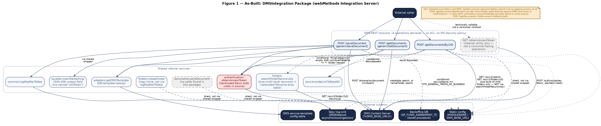
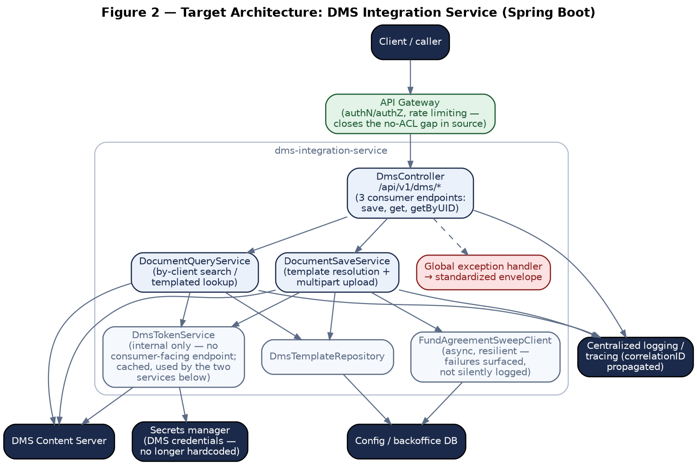
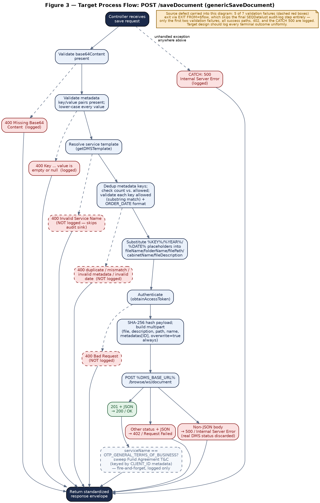
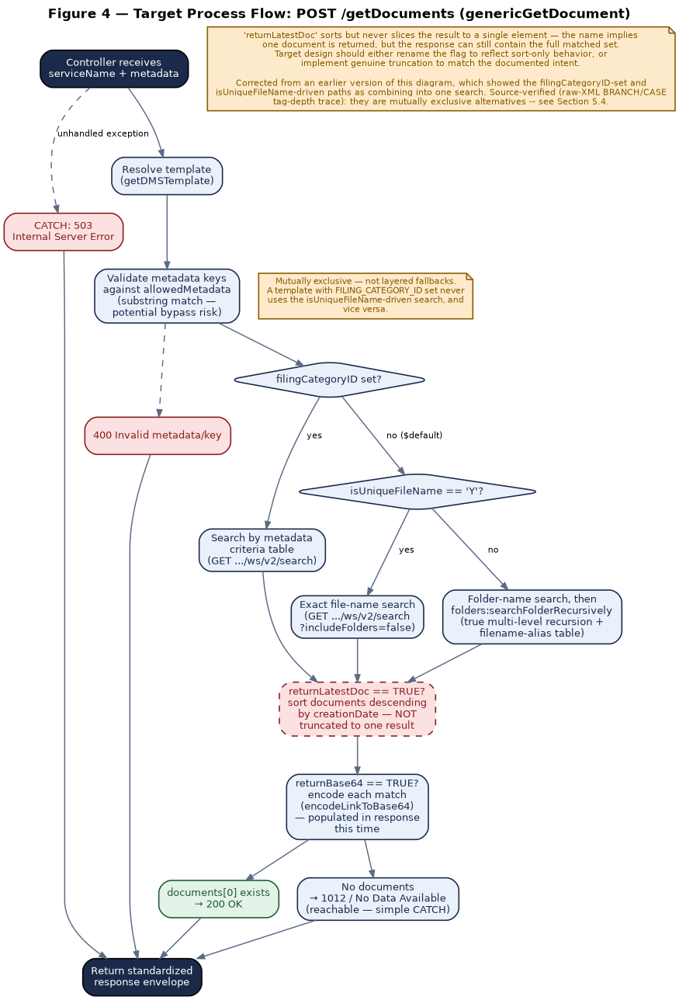
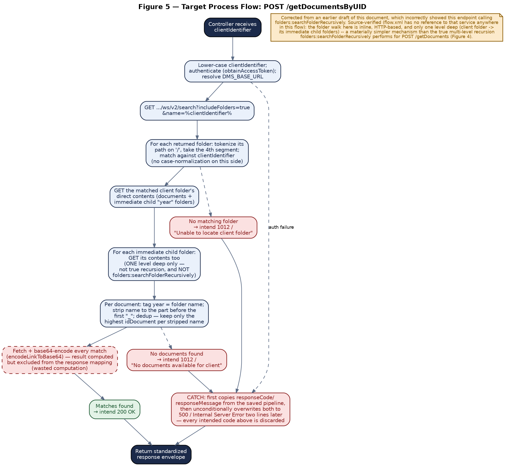

***MIDDLEWARE MIGRATION PROGRAMME***

***Software AG webMethods → Azure Cloud / Spring Boot***

**DMS Integration Service**

DMSIntegration package --- document save, retrieval and folder
management against the corporate Document Management System

API Documentation & Migration Notes

**Document Control**

  -----------------------------------------------------------------------
  **Attribute**      **Detail**
  ------------------ ----------------------------------------------------
  Source package     DMSIntegration v1.0 (webMethods Integration Server
                     export; manifest time-stamped 2023-04-30, latest
                     patch \"Release v78_0\" 2026-08-21)

  Services covered   3 consumer-facing REST APIs --- saveDocument,
                     getDocuments, getDocumentsByUID (Sections 4--6) ---
                     plus a 4th REST-declared operation,
                     obtainAccessToken, confirmed from source to be an
                     internal token-minting utility only and documented
                     as a supporting internal service (Section 7.1)
                     rather than a primary chapter; plus 9 further
                     internal services/adapters/java utilities
                     reverse-engineered from flow.xml and node.ndf source
                     --- every business-logic claim in this document is
                     sourced directly from that export, not inferred or
                     carried over from a sibling package or from a
                     summary of the source rather than the source itself.

  Document version   v1.0 --- first issue

  Prepared for       Software AG webMethods → Azure Cloud / Spring Boot
                     migration

  Conventions        Standardized response envelope, split Client-Input /
  followed           Backend-Provider error tables, and the DMS
                     service-error-code prefix, consistent with the other
                     documents in this migration programme (see
                     Error-Code-to-HTTP-Status-Mapping.md for the shared
                     legacy-code registry).
  -----------------------------------------------------------------------

+-----------------------------------------------------------------------+
| **Key migration notes --- read first**                                |
|                                                                       |
| **Only 3 of the package\'s 4 REST-declared operations are             |
| consumer-facing.** saveDocument, getDocuments, and getDocumentsByUID  |
| are the APIs this document treats as primary (Sections 4--6). GET     |
| /obtainAccessToken is also declared on the same REST resource, but is |
| source-confirmed to be an internal token-minting utility with no      |
| consumer contract of its own --- it is documented as a supporting     |
| internal service instead (Section 7.1).                               |
|                                                                       |
| **\`getDocumentsByUID\` does not call                                 |
| \`folders:searchFolderRecursively\`, and does not perform true        |
| multi-level recursion.** An earlier draft of this document            |
| incorrectly stated that it did. Source-verified (no reference to that |
| service anywhere in getDocumentsByUID\'s flow.xml): it implements its |
| own separate, inline, HTTP-based folder walk that is only one level   |
| deep --- the client\'s matched folder, then that folder\'s immediate  |
| child folders. folders:searchFolderRecursively, with its true         |
| multi-level recursion and its hardcoded filename-alias table, is used |
| exclusively by POST /getDocuments (genericGetDocument)\'s             |
| folder-search fallback path --- see Section 6.3 and Section 5.4.      |
|                                                                       |
| **No access control anywhere in this package.** All 4 REST            |
| operations, and every one of the 9 internal services, declare         |
| check_internal_acls = no; the package manifest\'s listACL is unset;   |
| no WS-Security policy is configured on the REST resource. GET         |
| /obtainAccessToken mints a live DMS access token using hardcoded      |
| plaintext credentials found in source. Combined, any caller who can   |
| reach this middleware\'s HTTP listener today can obtain a live DMS    |
| token on demand, unauthenticated. See Section 3.4 and Section 7.1.    |
|                                                                       |
| **A confirmed, source-verified defect in \`getDocumentsByUID\`**: its |
| outer exception handler first copies the responseCode/responseMessage |
| set before the throw, then two lines later unconditionally overwrites |
| both to 500/\"Internal Server Error\" regardless --- discarding every |
| deliberate business-outcome code the service sets (two distinct       |
| 1012/\"No Data Available\"-style cases and an auth-failure case). In  |
| the currently deployed behavior, this endpoint can only ever return   |
| 200 or 500. See Section 6.                                            |
|                                                                       |
| **Two independent, divergent implementations of \"save a document\"   |
| exist in this package** --- the REST-exposed genericSaveDocument      |
| (backs POST /saveDocument) and an internal documents:saveDocument     |
| service that no flow in this export calls. They differ in filename    |
| handling, exception-persistence behavior, and which hardcoded DMS     |
| metadata-field IDs are live vs. disabled. See Section 4 and Section   |
| 7.4.                                                                  |
|                                                                       |
| **A logging-coverage gap in \`genericSaveDocument\`**: 5 of its 7     |
| validation-failure paths exit the service via EXIT FROM=\$flow, which |
| skips the final audit-log step entirely --- only the first two        |
| validation failures, all success paths, the 402 case, and the         |
| catch-all 500 are ever written to the shared log sink. See Section    |
| 4.6.                                                                  |
|                                                                       |
| **A resolved but reworked routing rule in \`genericGetDocument\`**:   |
| the document-lookup logic branches on whether the resolved service    |
| template has a FILING_CATEGORY_ID --- this document initially misread |
| that branch as \"both search paths run together\"; a precise raw-XML  |
| tag-depth trace (not just the flattened pseudocode view) showed they  |
| are in fact mutually exclusive alternatives. See Section 5.4 for the  |
| corrected logic and Section 5.9 for how the misread was caught.       |
+-----------------------------------------------------------------------+

**Table of Contents**

**1. Overview**

**1.1 Purpose**

DMSIntegration is the webMethods package that lets other middleware
flows save, retrieve, and organize documents in the firm\'s corporate
Document Management System (DMS) --- customer onboarding documents
(passports, Emirates ID, signed agreements, IBAN letters),
account-opening evidence, and general correspondence, addressed either
by a fixed \"service template\" (a named document type with a
pre-configured folder/naming convention) or by a client identifier that
maps to a folder tree in the DMS.

**1.2 Scope**

**In scope** --- of the 4 operations declared on the package\'s single
REST resource (DMS), only 3 are exposed to consumers and are documented
here as primary APIs, one chapter each (Sections 4--6). The 4th,
obtainAccessToken, is source-confirmed to be an internal token-minting
utility with no consumer-facing contract of its own and is documented as
a supporting internal service instead (Section 7.1). Every internal
service, adapter, and Java utility reached from these flows is also in
scope:

-   POST /saveDocument (backed by genericSaveDocument) ---
    template-driven document upload (Section 4).

-   POST /getDocuments (backed by genericGetDocument) ---
    template-driven document lookup, including a true multi-level
    recursive folder search via folders:searchFolderRecursively on its
    fallback path (Section 5).

-   POST /getDocumentsByUID --- client-identifier-keyed document search,
    implemented as its own inline, one-level-deep HTTP folder walk --- a
    materially simpler mechanism than getDocuments\' recursive search,
    and one that does **not** call folders:searchFolderRecursively
    (Section 6).

-   GET /obtainAccessToken --- mints a DMS access token; declared on the
    DMS REST resource but not a consumer-facing API for the purposes of
    this document (Section 7.1).

-   Supporting internal services: folders:createFolder,
    folders:searchFolderRecursively, documents:saveDocument (orphaned),
    adapters:getDMSTemplate, adapters:SP_FUND_AGREEMENT_TC /
    wrappers:SP_FUND_AGREEMENT_TC, javaServices:fileHashing /
    stringHashing, java:encodeLinkToBase64, common:logReqResToSeq
    (Section 7).

**Out of scope** --- the DMS Content Server\'s own implementation
(treated as an external system); the backoffice database behind
SP_FUND_AGREEMENT_TC (treated as an external system; its DDL is not
present in this export --- see Section 8.4); the restAPIs/DMS\_ and
docTypes/DMS nodes, confirmed to be auto-generated REST-interface
scaffolding with no additional endpoints.

**1.3 Executive Summary**

Functionally, the package is small and coherent: one auth endpoint, one
save endpoint, two read endpoints. Structurally, it shows the signs of
incremental, multi-author extension typical of a long-lived integration
package --- a duplicated \"save\" implementation with no confirmed
caller, an inconsistent logging convention (three different patterns
across nine services), a validation scheme that skips its own audit
trail on most failure paths, and one endpoint (getDocumentsByUID) whose
exception handling silently discards its own intended error codes. None
of these are exotic; all are precisely source-verified below and each
has a corresponding, concrete recommendation for the target Spring Boot
design.

**2. Solution Architecture**

**2.1 As-Built (Legacy)**

Every one of the 4 REST operations ultimately talks to one external
system --- the DMS Content Server --- with two conditional
side-branches: genericSaveDocument optionally updates a backoffice
\"fund agreement sweep flag\" via a stored-procedure adapter when saving
a specific document type, and most operations resolve their DMS base URL
from static configuration. Because every endpoint\'s chain terminates at
the same single external system, a separate end-to-end \"journey\"
diagram would only repeat Figure 1 with the branches removed --- it is
omitted for that reason, per this document\'s own diagramming
convention, rather than by oversight.

{width="6.666666666666667in"
height="1.4099781277340333in"}

*Figure 1 --- As-Built: DMSIntegration package (webMethods Integration
Server)*

**2.2 Target Architecture (Spring Boot)**

The target design consolidates the package\'s 9 internal services into 3
application services behind a single controller, puts an API Gateway in
front of everything (closing the no-ACL gap documented in Section 3.4),
moves the hardcoded DMS credentials into a secrets manager, and makes
the currently fire-and-forget backoffice sweep call a tracked, alertable
operation instead of a log-only side effect.

{width="6.458333333333333in"
height="4.314115266841645in"}

*Figure 2 --- Target Architecture: DMS Integration Service (Spring
Boot)*

**2.3 Target Response & Result Model**

All 3 consumer-facing endpoints --- and, internally, obtainAccessToken
and every downstream service --- adopt one standardized response
envelope:

+-----------------------------------------------------------------------+
| {                                                                     |
|                                                                       |
| \"correlationID\": \"string\",                                        |
|                                                                       |
| \"responseCode\": \"string\", // mirrors the real HTTP status, always |
| present                                                               |
|                                                                       |
| \"responseMessage\": \"string\",// always present                     |
|                                                                       |
| \"errorCode\": \"string\|null\", // populated only for client-input   |
| errors; null otherwise                                                |
|                                                                       |
| \"errorMsg\": \"string\|null\", // populated only for client-input    |
| errors; null otherwise                                                |
|                                                                       |
| \"response\": { \... } // endpoint-specific payload                   |
|                                                                       |
| }                                                                     |
+-----------------------------------------------------------------------+

+-----------------------------------------------------------------------+
| **Design-decision callout --- errorCode/errorMsg are a wholly         |
| proposed addition**                                                   |
|                                                                       |
| No service in this package\'s source ever sets a distinct             |
| error-code/error-message pair alongside responseCode/responseMessage  |
| --- DMSIntegration has no legacy custom-error-code scheme at all      |
| (contrast the DFM Onboarding programme\'s 1000-series numeric codes,  |
| referenced only twice in this package --- see Section 6.6 and Section |
| 5.4 --- and even then inconsistently with the rest of this package\'s |
| own convention of literal HTTP-status-like values). The DMS-prefixed  |
| codes introduced in Sections 4--6 below are therefore a full          |
| target-design proposal, not a translation of anything already in      |
| source.                                                               |
+-----------------------------------------------------------------------+

For internal (non-REST) service-to-service calls, the target design
proposes a typed OperationResult\<T\> wrapper --- {success: boolean,
data: T, errorCode, errorMsg} --- in place of the ad-hoc {responseCode,
responseMessage, response} shape the legacy Flow services pass between
each other today.

**3. Prerequisites & Static Configuration**

**3.1 Integration Server Global Variables**

None found. No service in this package reads an IS global variable
(%variable% outside of a static-config lookup) --- every configurable
value is either a literal in source or resolved via the static-config
service documented next.

**3.2 Static / Feature-Flag Configuration**

One static-config key is used throughout, resolved via
commonUtility.services:getStaticData (older) or
commonUtility.v2.services:getStaticData (newer) --- both appear across
this package for the identical purpose, an API-version inconsistency
worth flattening onto one client in the target design:

  -----------------------------------------------------------------------------------
  **Application**   **Key**         **Used by**                **Purpose**
  ----------------- --------------- -------------------------- ----------------------
  MIDDLEWARE        DMS_BASE_URL    obtainAccessToken,         Base URL of the DMS
                                    createFolder,              Content Server, e.g.
                                    genericSaveDocument,       %baseURL%/ws/v2/\...
                                    genericGetDocument,        
                                    saveDocument (internal)    

  -----------------------------------------------------------------------------------

+-----------------------------------------------------------------------+
| **Inconsistency worth flattening**                                    |
|                                                                       |
| All 4 read/write paths resolve DMS_BASE_URL for themselves rather     |
| than sharing one resolution point --- including getDocumentsByUID,    |
| which was incorrectly documented in an earlier draft of this document |
| as not resolving it at all. Source-verified: getDocumentsByUID        |
| resolves its own base URL via commonUtility.v2.services:getStaticData |
| (the array/batch-keys variant of the static-data lookup, distinct     |
| from the singular-key variant most of the rest of the package uses    |
| --- Section 6.3). This isn\'t a defect on its own (every path still   |
| traces back to the same static-config key), but the duplicated        |
| resolution logic, and the two different static-data service           |
| signatures used to do it, are worth flattening onto one shared client |
| in the target design.                                                 |
+-----------------------------------------------------------------------+

**3.3 Upstream / Downstream Dependencies**

Candidate health-check dependencies for the target service, in call
order:

-   **DMS Content Server** (external, HTTP) --- every one of the 4 REST
    operations depends on it directly or transitively; it is the only
    external system every endpoint\'s chain terminates at (Section 2.1).

-   **Backoffice DB --- \`SP_FUND_AGREEMENT_TC\` stored procedure**
    (external, DB adapter, not HTTP) --- invoked only from
    genericSaveDocument, only when serviceName ==
    \'OTP_GENERAL_TERMS_OF_BUSINESS\' and a CLIENT_ID metadata entry is
    present (Section 4.5, Section 7.5).

-   **DMS service-template config table** (external, DB adapter via
    getDMSTemplate) --- resolves the per-serviceName file/folder-naming
    template used by both genericSaveDocument and genericGetDocument.
    Its underlying DDL/connection SQL is not present in this export ---
    see Section 8.4.

-   **Seq / log sink** (SEQDatalust.services:asynchronousIngestion,
    external) --- the shared audit-log destination, though not every
    service reaches it the same way (Section 3.4, Section 4.6).

**3.4 Security Notes**

This package enforces no access control at any layer available to it.
Every one of the 4 REST operations and all 9 internal services declare
check_internal_acls = no and icontext_policy = \$null; the package
manifest\'s listACL is null; no WS-Security policy or basic-auth binding
is configured on the DMS REST resource. Whatever authenticates an
inbound caller today does so entirely outside Integration Server ---
most likely a network-layer control not present in this export.

+-----------------------------------------------------------------------+
| **Security finding --- publicly mintable DMS tokens**                 |
|                                                                       |
| GET /obtainAccessToken is one of the package\'s 4 REST-exposed        |
| operations. Its implementation (Section 7.1) authenticates to the DMS |
| Content Server using hardcoded, plaintext Basic-Auth credentials      |
| found directly in source. Because this operation has no inbound       |
| access control of its own, any caller who can reach the middleware\'s |
| HTTP listener can invoke it directly and receive a live DMS access    |
| token --- the same token internal flows use for every subsequent DMS  |
| call --- without presenting any credentials of their own. The target  |
| design (Figure 2) must gate every endpoint behind the API Gateway,    |
| not only the save/read endpoints; token minting is the more sensitive |
| of the two given it requires no other information to invoke.          |
+-----------------------------------------------------------------------+

Two further data-handling points are folded into their relevant endpoint
sections rather than repeated here: genericSaveDocument\'s failure-path
persistence of raw document content, including passports and Emirates ID
images per the alias table in Section 7.3 (Section 4.8), and the
overwrite-always behavior of every document save (Section 4.3).

**4. POST /saveDocument (genericSaveDocument)**

**4.1 Endpoint Summary**

  ------------------- -------------------------------------------------------
  **Method / Path**   POST /saveDocument

  **Backing service** DMSIntegration.services.documents:genericSaveDocument

  **Purpose**         Uploads a document to the DMS, resolving its
                      destination (cabinet/folder/filename/metadata) from a
                      named service template rather than a caller-supplied
                      path.

  **Access control**  None; see Section 3.4.

  **Related but not   documents:saveDocument implements a structurally
  REST-exposed**      similar but distinct upload with no confirmed caller in
                      this export --- Section 7.4.
  ------------------- -------------------------------------------------------

**4.2 Request Schema**

  --------------------------------------------------------------------------------------
  **Field**            **Type**   **Required**   **Notes**
  -------------------- ---------- -------------- ---------------------------------------
  base64Content        string     Yes            The file content, base64-encoded.

  serviceName          string     Yes            Looked up (case-insensitive ---
                                                 upper-cased before lookup) against the
                                                 DMS service-template table via
                                                 getDMSTemplate (Section 8.1).

  correlationID        string     No             Generated (GUID) if not supplied.

  metadata             array      No             Legacy vs. target field format: source
                                                 declares this as a key/value record
                                                 array (a list of 2-field objects),
                                                 already a proper array --- not a CSV
                                                 string, so no standardization is needed
                                                 here, unlike several fields documented
                                                 in Section 8.2.

  └─ metadata\[\].key  string     ---            Matched (by substring containment
                                                 against the template\'s
                                                 ALLOWED_METADATA CSV --- Section 4.6)
                                                 to a metadata ID/type pair from the
                                                 resolved template.

  └─                   string     ---            Every metadata value is lower-cased by
  metadata\[\].value                             the service before use, regardless of
                                                 key --- see the observation in Section
                                                 4.3.
  --------------------------------------------------------------------------------------

**4.3 Business Logic Summary**

**1.** Generate correlationID if not supplied.

**2.** Validate base64Content is present → DMS001 if not.

**3.** Loop metadata: validate every key and value present → DMS002 if
not; lower-case every metadata value in place.

**4.** Resolve the service template via getDMSTemplate (serviceName
upper-cased first) → fileName, folderName, filePath, cabinetName,
fileDescription, allowedMetadata, allowedExtensions, filingCategoryID,
metadataIDs, metadataTypes. If fileName comes back empty (unknown
serviceName) → DMS003.

**5.** Reject duplicate metadata keys → DMS004.

**6.** Reject if the metadata count doesn\'t match the template\'s
allowed count → DMS005.

**7.** For each metadata entry: reject if its key isn\'t found as a
substring of the template\'s allowedMetadata CSV string → DMS006 (see
the substring-match observation below); if the key is ORDER_DATE,
validate its value against dd/MM/yyyy → DMS007 if invalid.

**8.** Substitute %KEY% (each metadata key/value pair), %YEAR%, and
%DATE% placeholders into fileName, folderName, filePath, cabinetName,
and fileDescription (today\'s date, GMT+4).

**9.** Authenticate via obtainAccessToken (Section 7.1); any non-200
result → responseCode = \'400\', responseMessage = \'Bad Request\'
(Backend/Provider --- see Section 4.6).

**10.** SHA-256-hash the decoded payload (fileHashing) --- the hash is
written into a field literally named jwtToken (see the naming
observation below), then used as the OB-CHECKSUM MIME header.

**11.** Build a multipart body: the file itself (name=\"file\", using
the resolved fileName), description, path, name (also the resolved
fileName --- see the divergence noted against documents:saveDocument in
Section 7.4), and, if filingCategoryID is set, a type part plus one
metadatas\[\<ID\>\] (or metadatas\[\<ID\>\]\[\] for list-typed metadata,
comma-tokenized) part per resolved metadata ID. An overwrite part is
always sent as the literal string \'true\' --- every save
unconditionally overwrites any existing document at that destination;
the caller has no way to request non-overwrite behavior.

**12.** POST the multipart body to %DMS_BASE_URL%/browse/ws/document.

**13.** If the DMS response is 201 with a JSON body: map to 200/OK. If
serviceName == \'OTP_GENERAL_TERMS_OF_BUSINESS\', additionally loop the
request\'s own metadata for a CLIENT_ID entry and invoke
wrappers:SP_FUND_AGREEMENT_TC with it (Section 4.5) --- this outcome is
logged but never affects the response.

**14.** If the DMS response is any other status with a JSON body:
402/Request Failed.

**15.** If the DMS response body is not JSON at all: 500/Internal Server
Error --- the real DMS status is discarded in this branch.

**16.** CATCH: 500/Internal Server Error, with the underlying exception
detail (truncated to 2000 characters) captured for the audit log only.

+-----------------------------------------------------------------------+
| **Business-logic observations for the target design**                 |
|                                                                       |
| **Field naming**: fileHashing\'s own declared output field is named   |
| jwtToken (confirmed in its node.ndf, not just at this call site) even |
| though it holds a SHA-256 content hash with no relationship to JWTs   |
| --- a straightforward, source-verified naming defect worth not        |
| carrying into the target DTO.                                         |
|                                                                       |
| **Global lower-casing of metadata values**: the source comment at     |
| this step (\"convert username to lower\") suggests it was intended    |
| for a specific username-type key, but the code applies                |
| pub.string:toLower to every metadata value unconditionally. If any    |
| metadata value is meant to be case-preserving (e.g. a mixed-case      |
| reference number), this legacy behavior silently lower-cases it.      |
| Flagged for confirmation with the API owner before the target design  |
| decides whether to keep, scope, or drop this normalization.           |
|                                                                       |
| **Substring-containment metadata validation**: the allowed-key check  |
| (DMS006) tests whether the \*raw\* allowedMetadata CSV string         |
| \*contains\* the supplied key as a substring, not whether the key     |
| exactly matches one of the tokenized list entries. A key that is a    |
| substring of an allowed key (e.g. ID against an allowed CLIENT_ID)    |
| would pass validation incorrectly. The target design should validate  |
| against the tokenized list with exact match.                          |
|                                                                       |
| **Overwrite is always on**: every save silently replaces any existing |
| document at the resolved destination. This is documented as current   |
| behavior, not flagged as a defect on its own, but it is a behavior    |
| callers may not expect and the target API should make it an explicit, |
| documented contract (or a caller-controlled flag) rather than an      |
| invisible default.                                                    |
+-----------------------------------------------------------------------+

**4.4 Sample Request**

+-----------------------------------------------------------------------+
| POST /saveDocument HTTP/1.1                                           |
|                                                                       |
| Content-Type: application/json                                        |
|                                                                       |
| {                                                                     |
|                                                                       |
| \"serviceName\": \"CUSTOMERPASSPORT\",                                |
|                                                                       |
| \"base64Content\": \"JVBERi0xLjQKJ\...\",                             |
|                                                                       |
| \"metadata\": \[                                                      |
|                                                                       |
| { \"key\": \"CLIENT_ID\", \"value\": \"FIT-100234\" }                 |
|                                                                       |
| \]                                                                    |
|                                                                       |
| }                                                                     |
+-----------------------------------------------------------------------+

**4.5 Response Schema**

  ---------------------------------------------------------------------------
  **Field**             **Type**    **Notes**
  --------------------- ----------- -----------------------------------------
  correlationID         string      

  responseCode          string      Mirrors HTTP status

  responseMessage       string      

  errorCode             string \|   Populated for DMS001--DMS007 only
                        null        

  errorMsg              string \|   Populated for DMS001--DMS007 only
                        null        

  response              object      

  └─                    string      From the DMS response\'s ID-DOCUMENT
  response.documentID               header, captured before the response-type
                                    branch --- present on both the 200 and
                                    402 outcomes, absent on 500.

  └─ response.message   string      DMS\'s own Result field, passed through
                                    verbatim.
  ---------------------------------------------------------------------------

**4.5.1 Fund Agreement T&C sweep (conditional side effect)**

When serviceName == \'OTP_GENERAL_TERMS_OF_BUSINESS\' and the save
succeeds, the service separately loops the request\'s metadata for a
CLIENT_ID entry and invokes wrappers:SP_FUND_AGREEMENT_TC with it as
FITNumber, receiving a sweepFlag back from a backoffice stored
procedure. The outcome --- success (0), null/empty client ID (1), client
ID not found (2), or any other value (general exception) --- is logged
directly to the Seq sink (not via the shared logReqResToSeq wrapper used
elsewhere) but **never affects the \`/saveDocument\` response**:
responseCode/responseMessage stay 200/OK regardless of whether the sweep
succeeded.

+-----------------------------------------------------------------------+
| **Business-logic observation for the target design**                  |
|                                                                       |
| A failure to update the backoffice sweep flag is currently silent to  |
| the API caller --- logged, but not surfaced, retried, or alertable.   |
| Whether this fire-and-forget behavior is intentional (the document    |
| save is the operation of record; the sweep is best-effort) or should  |
| become a tracked async operation with its own visibility is a product |
| decision, not a technical one --- flagged here for that decision      |
| rather than resolved unilaterally.                                    |
+-----------------------------------------------------------------------+

**4.6 HTTP Status Code Reference**

**Client Input Errors**

  --------------------------------------------------------------------------
  **HTTP     **Service   **Description**                        **Legacy
  Status**   Error                                              Error Code**
             Code**                                             
  ---------- ----------- -------------------------------------- ------------
  400        DMS001      base64Content missing                  ---

  400        DMS002      A metadata key or value is empty or    ---
                         null                                   

  400        DMS003      serviceName does not resolve to a      ---
                         known template                         

  400        DMS004      Duplicate metadata keys in the request ---

  400        DMS005      Metadata count does not match the      ---
                         template\'s allowed count              

  400        DMS006      Metadata key not recognized for this   ---
                         template (substring match against      
                         ALLOWED_METADATA)                      

  400        DMS007      ORDER_DATE metadata value is not a     ---
                         valid dd/MM/yyyy date                  
  --------------------------------------------------------------------------

**Backend / Provider Errors**

  --------------------------------------------------------------------------
  **HTTP     **Service   **Description**                        **Legacy
  Status**   Error                                              Error Code**
             Code**                                             
  ---------- ----------- -------------------------------------- ------------
  400        ---         Internal token acquisition failed      ---
                         (legacy reuses the 400 status for what 
                         is an upstream auth failure, not a     
                         caller mistake --- reproduced here     
                         as-is, flagged as an oddity rather     
                         than corrected)                        

  402        ---         DMS accepted the request but returned  ---
                         a non-201 status with a JSON error     
                         body                                   

  500        ---         DMS returned a non-JSON error body --- ---
                         the real DMS status is discarded in    
                         this branch                            

  500        ---         Unhandled exception (CATCH)            ---
  --------------------------------------------------------------------------

+-----------------------------------------------------------------------+
| **Logging-coverage defect --- most validation failures skip the audit |
| sink**                                                                |
|                                                                       |
| Of the 7 client-input validation failures above, only DMS001 and      |
| DMS002 reach the final logReqResToSeq step (they exit via EXIT        |
| FROM=TRY, which falls through to it). DMS003--DMS007, and the Bad     |
| Request backend/provider case, all exit via EXIT FROM=\$flow, which   |
| terminates the entire service immediately and skips the audit-log     |
| step entirely. All success paths, the 402 case, and the CATCH 500     |
| case are logged normally. This is a genuine, source-verified gap:     |
| roughly two-thirds of this endpoint\'s own documented failure modes   |
| leave no audit trail today. The target design should log every        |
| terminal outcome uniformly, which a centralized exception handler     |
| (Figure 2) achieves by construction.                                  |
+-----------------------------------------------------------------------+

**4.7 Example Target Response Envelopes**

+-----------------------------------------------------------------------+
| // Success                                                            |
|                                                                       |
| {                                                                     |
|                                                                       |
| \"correlationID\": \"e1a2\...\", \"responseCode\": \"200\",           |
| \"responseMessage\": \"OK\",                                          |
|                                                                       |
| \"errorCode\": null, \"errorMsg\": null,                              |
|                                                                       |
| \"response\": { \"documentID\": \"DOC-88213\", \"message\":           |
| \"Success\" }                                                         |
|                                                                       |
| }                                                                     |
|                                                                       |
| // Client-input error                                                 |
|                                                                       |
| {                                                                     |
|                                                                       |
| \"correlationID\": \"e1a2\...\", \"responseCode\": \"400\",           |
| \"responseMessage\": \"Bad Request\",                                 |
|                                                                       |
| \"errorCode\": \"DMS006\", \"errorMsg\": \"Invalid                    |
| metadata/key\[CLNTID\]\",                                             |
|                                                                       |
| \"response\": null                                                    |
|                                                                       |
| }                                                                     |
|                                                                       |
| // Backend / provider error                                           |
|                                                                       |
| {                                                                     |
|                                                                       |
| \"correlationID\": \"e1a2\...\", \"responseCode\": \"500\",           |
| \"responseMessage\": \"Internal Server Error\",                       |
|                                                                       |
| \"errorCode\": null, \"errorMsg\": null,                              |
|                                                                       |
| \"response\": null                                                    |
|                                                                       |
| }                                                                     |
+-----------------------------------------------------------------------+

**4.8 Failure-path data handling**

+-----------------------------------------------------------------------+
| **Data-handling finding --- raw document content persisted on         |
| failure**                                                             |
|                                                                       |
| This finding applies to the internal documents:saveDocument service   |
| (Section 7.4), not to genericSaveDocument documented above --- the    |
| two are structurally similar but distinct implementations, and this   |
| behavior is specific to the one with no confirmed caller. It is       |
| called out here because it is the more serious of the two services\'  |
| defects and belongs beside the rest of this chapter\'s                |
| failure-handling discussion: on any non-200 result (unless the caller |
| passes exceptionHandlingProcess=\'1\'), documents:saveDocument        |
| invokes ExceptionHandling.services:insertException with a requestBody |
| that includes the raw base64 file content --- meaning a failed save   |
| can persist the full document body, potentially a passport, Emirates  |
| ID, or signed agreement per the alias table in Section 7.3, into an   |
| exception/retry-tracking table. genericSaveDocument (the live,        |
| REST-exposed path documented above) does not do this.                 |
+-----------------------------------------------------------------------+

**4.9 Target Process Flow (Spring Boot)**

{width="6.666666666666667in"
height="10.48075021872266in"}

*Figure 3 --- Target Process Flow: POST /saveDocument
(genericSaveDocument)*

**5. POST /getDocuments (genericGetDocument)**

**5.1 Endpoint Summary**

  ------------------- ------------------------------------------------------
  **Method / Path**   POST /getDocuments

  **Backing service** DMSIntegration.services.documents:genericGetDocument

  **Purpose**         Looks up documents for a named service template,
                      either via a metadata-criteria search or via an exact
                      file/folder name, depending on how the template is
                      configured. On the folder-name path, this is the one
                      service in the package that performs a true,
                      multi-level recursive folder search --- contrast
                      getDocumentsByUID (Section 6), whose own folder walk
                      is a different, inline, one-level-deep mechanism.

  **Access control**  None; see Section 3.4.
  ------------------- ------------------------------------------------------

**5.2 Request Schema**

  ------------------------------------------------------------------------------------
  **Field**         **Type**           **Required**   **Notes**
  ----------------- ------------------ -------------- --------------------------------
  serviceName       string             Yes            Upper-cased and resolved against
                                                      the DMS service-template table
                                                      via getDMSTemplate (Section
                                                      8.1).

  returnLatestDoc   string             No             See the naming-vs-behavior
                    (\"TRUE\"/other)                  observation in Section 5.4 ---
                                                      despite the name, this does
                                                      **not** truncate the result to a
                                                      single document.

  returnBase64      string             No             Unlike getDocumentsByUID
                    (\"TRUE\"/other)                  (Section 6.5), when set the
                                                      base64 content is genuinely
                                                      included in the response
                                                      (Section 5.6).

  metadata          array              No             key/value pairs used as search
                                                      criteria; validated against the
                                                      template\'s allowed-metadata
                                                      list (Section 5.4).
  ------------------------------------------------------------------------------------

+-----------------------------------------------------------------------+
| **Not a declared input**                                              |
|                                                                       |
| %YEAR%/%DATE% placeholder substitution happens inside this service    |
| exactly as it does in genericSaveDocument (Section 4.3) --- computed  |
| internally from today\'s date, not supplied by the caller. Confirmed  |
| from this service\'s own node.ndf: neither year nor date appears in   |
| its declared input signature.                                         |
+-----------------------------------------------------------------------+

**5.3 Business Logic Summary**

**1.** Generate correlationID if not supplied.

**2.** Validate every metadata key/value pair is present → DMS008 if
not.

**3.** Resolve the service template via getDMSTemplate → fileName,
folderName, allowedMetadata, isUniqueFileName, filingCategoryID,
metadataIDs, metadataTypes. Empty fileName (unknown serviceName) →
DMS009.

**4.** Reject duplicate metadata keys → DMS010.

**5.** A metadata-count-matches-allowed-count check exists in source but
is **disabled** (SEQUENCE \... \*\*DISABLED\*\*) --- dead code, listed
here only for completeness, never active.

**6.** For each metadata entry, reject if its key isn\'t a substring of
the template\'s allowedMetadata CSV → DMS011 (the same substring-match
design noted for genericSaveDocument in Section 4.3 --- same risk
applies here).

**7.** Authenticate via obtainAccessToken (Section 7.1); non-200 →
responseCode = \'400\', responseMessage = \'Bad Request\'.

**8.** Resolve DMS_BASE_URL; upper-case folderName/fileName.

**5.4 Document lookup routing --- corrected**

This is the service\'s central branch point, and an earlier pass over
this document initially misread it. The flattened pseudocode view shows
BRANCH on /filingCategoryID followed, at what looks like the same
nesting level, by BRANCH on /isUniqueFileName --- which reads as \"both
run, and their results combine.\" Precise raw-flow.xml tag-depth tracing
(matching every \<BRANCH\>/\</BRANCH\> pair explicitly, the same
technique used for the Section 6.3 CATCH-overwrite finding) shows the
second BRANCH is in fact the \$default **case** of the first --- i.e.,
the two paths are mutually exclusive alternatives, not siblings that
both execute:

-   **\`filingCategoryID\` is set** → search DMS by metadata criteria:
    GET %baseURL%/ws/v2/search with a data table built from the
    request\'s metadata (list-typed values tokenized on comma first).
    Every result is appended to response.documents.

-   **\`filingCategoryID\` is empty** (the \$default case) →

-   if isUniqueFileName == \'Y\': search DMS by exact file name (GET
    \.../ws/v2/search?includeFolders=false&name=%fileName%), keeping
    only results whose upper-cased name exactly equals the resolved
    fileName;

-   otherwise: search DMS by folder name (GET
    \.../ws/v2/search?includeFolders=true&name=%folderName%), find the
    folder whose upper-cased name exactly equals the resolved
    folderName, then recursively walk it via
    folders:searchFolderRecursively (Section 7.2, including its
    filename-alias table) to collect matching documents. **This is the
    package\'s only true, multi-level recursive folder search** ---
    getDocumentsByUID (Section 6) does not call this service and does
    not recurse to more than one level.

Continuing the business logic:

**1.** If returnLatestDoc == \'TRUE\' and documents were found: sort
response.documents descending by creationDate. **This step sorts but
does not truncate** --- the subsequent pub.list:appendToDocumentList
call re-appends the full sorted array back onto itself; no indices-style
restriction to a single element exists anywhere in this step. One
caveat, flagged rather than asserted: the pipeline wiring at this exact
step copies a dimension-1 array field into a dimension-0 (single-record)
target field before the append call --- a type mismatch whose precise
runtime effect in the webMethods built-in pub.list:appendToDocumentList
cannot be determined from source alone. Documented here as an open,
source-flagged uncertainty rather than a confirmed behavior either way;
recommended for functional verification before migration rather than
assumed.

**2.** If returnBase64 == \'TRUE\': base64-encode every matched document
(java:encodeLinkToBase64) and **this time the result is genuinely
written into the response** (response.documents\[\].base64) --- contrast
getDocumentsByUID\'s wasted computation in Section 6.3.

**3.** The DMS access token is echoed back as response.authentication.

**4.** If at least one document was found: 200/OK. If none: responseCode
= \'1012\', responseMessage = \'No Data Available\' --- this path is
**not** guarded by anything equivalent to Section 6.3\'s CATCH-overwrite
bug; it is a plain assignment inside the main TRY sequence and reaches
the caller correctly.

**5.** CATCH: 503/Internal Server Error.

+-----------------------------------------------------------------------+
| **Business-logic observation for the target design**                  |
|                                                                       |
| Because the filingCategoryID-set and filingCategoryID-empty paths are |
| mutually exclusive, any service template that has FILING_CATEGORY_ID  |
| populated will never use the isUniqueFileName-driven name/folder      |
| search, and vice versa --- the two lookup strategies are              |
| template-level design choices, not layered fallbacks. Worth           |
| confirming with the API owner that every existing template is         |
| configured for exactly the lookup strategy intended, since a template |
| with FILING_CATEGORY_ID set unintentionally would silently never use  |
| the name/folder-based search even if that were the actual intent for  |
| that document type.                                                   |
+-----------------------------------------------------------------------+

**5.5 Sample Request**

+-----------------------------------------------------------------------+
| POST /getDocuments HTTP/1.1                                           |
|                                                                       |
| Content-Type: application/json                                        |
|                                                                       |
| {                                                                     |
|                                                                       |
| \"serviceName\": \"CUSTOMERPASSPORT\",                                |
|                                                                       |
| \"returnLatestDoc\": \"TRUE\",                                        |
|                                                                       |
| \"returnBase64\": \"FALSE\",                                          |
|                                                                       |
| \"metadata\": \[ { \"key\": \"CLIENT_ID\", \"value\": \"FIT-100234\"  |
| } \]                                                                  |
|                                                                       |
| }                                                                     |
+-----------------------------------------------------------------------+

**5.6 Response Schema**

  --------------------------------------------------------------------------------------------
  **Field**                             **Type**    **Notes**
  ------------------------------------- ----------- ------------------------------------------
  correlationID                         string      

  responseCode                          string      

  responseMessage                       string      

  errorCode                             string \|   Populated for DMS008--DMS011 only
                                        null        

  errorMsg                              string \|   Populated for DMS008--DMS011 only
                                        null        

  response                              object      

  └─ response.documents                 array       Can contain more than one element even
                                                    when returnLatestDoc == \'TRUE\' --- see
                                                    Section 5.4.

    └─                                  string      
  response.documents\[\].downloadURL                

    └─ response.documents\[\].fileName  string      

    └─                                  string      Legacy vs. target field format: source
  response.documents\[\].creationDate               keeps DMS\'s own datetime string as-is
                                                    (yyyy-MM-dd\'T\'HH:mm:ss, used directly as
                                                    the sort key in Section 5.4); target
                                                    should normalize to ISO 8601 with an
                                                    explicit UTC offset rather than passing
                                                    the DMS-native string through unchanged.

    └─ response.documents\[\].base64    string \|   Populated when returnBase64 == \'TRUE\'
                                        null        (Section 5.4).

  └─ response.authentication            string      Nested under response here --- contrast
                                                    getDocumentsByUID\'s top-level
                                                    authentication field (Section 6.5); the
                                                    same underlying value, placed
                                                    inconsistently between the two sibling
                                                    endpoints.
  --------------------------------------------------------------------------------------------

**5.7 HTTP Status Code Reference**

**Client Input Errors**

  --------------------------------------------------------------------------
  **HTTP     **Service   **Description**                        **Legacy
  Status**   Error                                              Error Code**
             Code**                                             
  ---------- ----------- -------------------------------------- ------------
  400        DMS008      A metadata key or value is empty or    ---
                         null                                   

  400        DMS009      serviceName does not resolve to a      ---
                         known template                         

  400        DMS010      Duplicate metadata keys in the request ---

  400        DMS011      Metadata key not recognized for this   ---
                         template (substring match against      
                         ALLOWED_METADATA)                      
  --------------------------------------------------------------------------

**Backend / Provider Errors**

  --------------------------------------------------------------------------
  **HTTP     **Service   **Description**                        **Legacy
  Status**   Error                                              Error Code**
             Code**                                             
  ---------- ----------- -------------------------------------- ------------
  400        ---         Internal token acquisition failed      ---
                         (same oddity as Section 4.6 --- a      
                         backend failure surfaced via the       
                         client-error status)                   

  503        ---         Unhandled exception (CATCH)            ---
  --------------------------------------------------------------------------

+-----------------------------------------------------------------------+
| **Design-decision callout --- same collection-shape deviation as      |
| Section 6.6**                                                         |
|                                                                       |
| genericGetDocument is a templated \*query\*, not a lookup by a single |
| opaque identifier --- the same reasoning applied to getDocumentsByUID |
| in Section 6.6 applies here. Unlike that endpoint, this service\'s    |
| 1012/\"No Data Available\" path is live and reaches the caller today  |
| (Section 5.4), so this is a genuine current-behavior change, not a    |
| moot recommendation on top of an already-broken path: the target      |
| design should return 200 OK with an empty documents array for the     |
| zero-match case, deviating from the shared registry\'s generic        |
| 1012→404 mapping for this endpoint specifically, for the same         |
| collection/report-shape reasoning --- not because the registry is     |
| wrong in general.                                                     |
+-----------------------------------------------------------------------+

**5.8 Example Target Response Envelopes**

+-----------------------------------------------------------------------+
| // Success                                                            |
|                                                                       |
| {                                                                     |
|                                                                       |
| \"correlationID\": \"e1a2\...\", \"responseCode\": \"200\",           |
| \"responseMessage\": \"OK\",                                          |
|                                                                       |
| \"errorCode\": null, \"errorMsg\": null,                              |
|                                                                       |
| \"response\": {                                                       |
|                                                                       |
| \"documents\": \[ { \"downloadURL\": \"\...\", \"fileName\":          |
| \"PASSPORT_01012025\", \"creationDate\": \"2025-01-01T10:15:00\",     |
| \"base64\": null } \],                                                |
|                                                                       |
| \"authentication\": \"Key \...\"                                      |
|                                                                       |
| }                                                                     |
|                                                                       |
| }                                                                     |
|                                                                       |
| // Success --- zero matches (target design; see design-decision       |
| callout above)                                                        |
|                                                                       |
| {                                                                     |
|                                                                       |
| \"correlationID\": \"e1a2\...\", \"responseCode\": \"200\",           |
| \"responseMessage\": \"OK\",                                          |
|                                                                       |
| \"errorCode\": null, \"errorMsg\": null,                              |
|                                                                       |
| \"response\": { \"documents\": \[\], \"authentication\": \"Key \...\" |
| }                                                                     |
|                                                                       |
| }                                                                     |
+-----------------------------------------------------------------------+

**5.9 Target Process Flow (Spring Boot)**

{width="6.25in"
height="9.2in"}

*Figure 4 --- Target Process Flow: POST /getDocuments
(genericGetDocument)*

+-----------------------------------------------------------------------+
| **Verification note --- how the filingCategoryID misread was caught** |
|                                                                       |
| This section\'s routing logic (5.4) was initially documented, in an   |
| earlier pass of this same engagement, as \"both search paths run and  |
| combine.\" That reading came from the flattened pseudocode\'s         |
| indentation alone. Before finalizing this document, the claim was     |
| re-verified directly against flow.xml by counting matched             |
| \<BRANCH\>/\</BRANCH\> tag pairs from the exact byte offsets of both  |
| BRANCH nodes, which showed the isUniqueFileName branch is nested      |
| inside the \$default case of the filingCategoryID branch, not a       |
| sibling of it. The corrected reading is what appears in 5.4 above.    |
| This note is kept in the delivered document deliberately, as a record |
| of the verification method for anything else in this document that    |
| touches the same routing pattern (a BRANCH node acting as another     |
| BRANCH\'s case, via a NAME attribute) elsewhere in this package ---   |
| including the separate, unrelated correction to getDocumentsByUID in  |
| Section 6.3, which was a different class of error (an incorrect claim |
| about which service is called, not a misread branch structure) caught |
| the same way: by re-reading the full source rather than relying on a  |
| summary.                                                              |
+-----------------------------------------------------------------------+

**6. POST /getDocumentsByUID**

**6.1 Endpoint Summary**

  ------------------- -----------------------------------------------------
  **Method / Path**   POST /getDocumentsByUID

  **Backing service** DMSIntegration.services.documents:getDocumentsByUID

  **Purpose**         Searches the DMS folder tree for every document
                      belonging to a given client identifier, via its own
                      inline, HTTP-based folder walk that is only one level
                      deep (the client\'s matched folder, then that
                      folder\'s immediate child folders). This is a
                      materially simpler mechanism than
                      genericGetDocument\'s folder-search path (Section
                      5.4) --- it does **not** call
                      folders:searchFolderRecursively and does not perform
                      true multi-level recursion, correcting an earlier
                      draft of this document that stated otherwise.

  **Access control**  None; see Section 3.4.

  **Known defect**    The outer exception handler first copies the response
                      code/message set before the throw, then
                      unconditionally overwrites both to 500/\"Internal
                      Server Error\" two lines later --- see Section 6.3
                      and Section 6.6.
  ------------------- -----------------------------------------------------

**6.2 Request Schema**

  ---------------------------------------------------------------------------------
  **Field**          **Type**   **Required**   **Notes**
  ------------------ ---------- -------------- ------------------------------------
  clientIdentifier   string     Yes (by        Not actually validated as present in
                                contract)      source --- a missing/empty value is
                                               not rejected; it simply yields zero
                                               matches (Section 6.6). Lower-cased
                                               by the service before use
                                               (pub.string:toLower) --- corrected
                                               from an earlier draft of this
                                               document, which incorrectly stated
                                               it was upper-cased.

  ---------------------------------------------------------------------------------

**6.3 Business Logic Summary**

+-----------------------------------------------------------------------+
| **Correction --- this endpoint does not call                          |
| folders:searchFolderRecursively**                                     |
|                                                                       |
| An earlier draft of this document incorrectly documented this service |
| as recursively walking the DMS folder tree via                        |
| folders:searchFolderRecursively (Section 7.2), including that         |
| service\'s hardcoded filename-alias table. Both claims were wrong.    |
| Source-verified two ways: a full re-read of the service\'s own        |
| pseudocode extraction, and a direct grep of its raw flow.xml for      |
| searchFolderRecursively, which returns zero matches anywhere in this  |
| service. getDocumentsByUID has its own entirely separate, inline,     |
| HTTP-based folder-walk implementation --- described correctly below   |
| --- that goes only one level deep and has no relationship to          |
| folders:searchFolderRecursively or its alias table. That service and  |
| table are used exclusively by genericGetDocument\'s own, different,   |
| folder-search fallback path (Section 5.4), which performs true        |
| multi-level recursion. Two further claims from the same earlier draft |
| are also corrected below: clientIdentifier is lower-cased, not        |
| upper-cased, before use; and this service resolves DMS_BASE_URL       |
| itself, rather than receiving an already-resolved value from a        |
| caller.                                                               |
+-----------------------------------------------------------------------+

**1.** Generate correlationID if not supplied; TRY/CATCH-wrapped
JSON-serialization of the request body for logging (falls back to an
empty object if serialization fails).

**2.** Lower-case clientIdentifier (pub.string:toLower).

**3.** Authenticate via obtainAccessToken (Section 7.1): on success,
build authentication = \'Key \' + accessToken; on any other status,
commonUtility.services:checkAndThrowError(errorMessage=\'Unable to
obtain access token\') --- a genuine thrown exception, not a plain EXIT.

**4.** Resolve DMS_BASE_URL itself, via
commonUtility.v2.services:getStaticData --- the batch/array-keys variant
of the static-data lookup (distinct from the singular-key variant most
of the rest of the package uses, Section 3.2). This service does not
receive a pre-resolved base URL from anywhere else.

**5.** GET
%baseURL%/ws/v2/search?includeFolders=true&name=%clientIdentifier% ---
search DMS for folders (and documents) matching the lower-cased
clientIdentifier.

**6.** For each returned folder: tokenize its path on / and take the 4th
segment (valueList\[3\]) as a folder-identifying directory name, then
compare it directly against clientIdentifier. This comparison is **not**
case-normalized on the DMS-returned side --- only the caller-supplied
clientIdentifier was lower-cased in step 2. If no folder\'s directory
name matches: checkAndThrowError(errorMessage=\'Unable to locate client
folder\').

**7.** GET the matched client folder\'s own contents
(%baseURL%/ws/v2/folder/{targetFolderId}) --- its direct documents and
its immediate child (\"year\") folders. Same checkAndThrowError(\'Unable
to locate client folder\') pattern if this GET fails to resolve.

**8. The core folder walk, and the point of the correction above**: for
each of the client folder\'s immediate child folders, GET that child
folder\'s own contents too, via the identical GET-folder-by-ID call.
This is **one additional level only** --- an inline, HTTP-based walk,
not a recursive service call and not folders:searchFolderRecursively.
The same checkAndThrowError(\'Unable to locate client folder\') pattern
applies if any of these child-folder GETs fails.

**9.** For every document found (directly in the client folder, and in
each immediate child folder): tag it with year = the child folder\'s own
name; strip its name to the portion before the first \_ (a
TRY/CATCH-wrapped pub.string:tokenize --- on failure, the untokenized
name is silently kept); deduplicate against documents already collected
under the same stripped name, keeping only the one with the higher
idDocument (pub.document:searchDocuments / deleteDocuments /
insertDocument --- in-memory list operations against the working result
set, not DMS/filesystem calls).

**10.** If no documents were found anywhere in the walk:
checkAndThrowError(errorMessage=\'No documents available for client\')
--- a distinct message from the two folder-not-found cases above, though
the same 1012 code underlies all three (Section 6.6).

**11.** If at least one document was found: intend 200/OK. For every
matched document, fetch and base64-encode it (java:encodeLinkToBase64)
--- **this result is computed but then explicitly excluded from the
response mapping** (the source comment at that step literally reads
\"Map documents except base64 to response\"). This computation is wasted
on every call.

+-----------------------------------------------------------------------+
| **Confirmed defect --- intended business-outcome codes are            |
| unreachable**                                                         |
|                                                                       |
| **CATCH block**, source-verified via raw flow.xml (not just the       |
| flattened pseudocode view, to avoid the kind of misread documented in |
| Section 5.9): it first copies whatever responseCode/responseMessage   |
| had already been set into the pipeline --- i.e. it does genuinely     |
| attempt to recover the specific intended outcome --- but then, two    |
| MAPSET steps later, unconditionally overwrites both to responseCode = |
| \'500\' / responseMessage = \'Internal Server Error\' regardless of   |
| what was just copied, despite a misleading source comment reading     |
| \"Set responseCode and message if not set\". Because every one of     |
| this service\'s error paths reaches the CATCH block via a thrown      |
| exception (checkAndThrowError, 6 call sites total: 1 auth-failure, 4  |
| folder-not-found, 1 no-documents-found), every one of them is         |
| overwritten to 500 before the response leaves the service. The 1012   |
| variants and the auth-failure code are all dead in practice. This was |
| verified two ways: from the pseudocode extraction, then independently |
| from the raw flow.xml via grep/sed to confirm the exact \<MAP\>       |
| boundaries around the CATCH block --- precisely the kind of claim     |
| this document\'s methodology requires confirming against source       |
| before stating it as fact.                                            |
|                                                                       |
| **Logging**: the \"Finally\" block calls                              |
| SEQDatalust.services:asynchronousIngestion directly, not via the      |
| shared common:logReqResToSeq wrapper used elsewhere (Section 7.8),    |
| then clears the pipeline.                                             |
+-----------------------------------------------------------------------+

**6.4 Sample Request**

+-----------------------------------------------------------------------+
| POST /getDocumentsByUID HTTP/1.1                                      |
|                                                                       |
| Content-Type: application/json                                        |
|                                                                       |
| { \"clientIdentifier\": \"FIT-100234\" }                              |
+-----------------------------------------------------------------------+

**6.5 Response Schema**

  ---------------------------------------------------------------------------------
  **Field**                   **Type**    **Notes**
  --------------------------- ----------- -----------------------------------------
  correlationID               string      

  responseCode                string      In practice, only 200 or 500 (Section
                                          6.3)

  responseMessage             string      

  authentication              string      Declared at the top level of the output
                                          signature (not nested under response,
                                          unlike genericGetDocument\'s equivalent
                                          field --- Section 5.6) --- echoes the DMS
                                          access token used for the search back to
                                          the caller.

  documents                   array       

  └─                          string      
  documents\[\].downloadURL               

  └─ documents\[\].fileName   string      The stripped name (portion before the
                                          first \_), not the raw DMS document name
                                          --- Section 6.3.

  └─ documents\[\].base64     string \|   Declared in the output signature but
                              null        never populated by the mapping logic in
                                          the current source --- see step 10 in
                                          Section 6.3. Reserved here in the target
                                          DTO for contract stability, but callers
                                          should not expect it to be non-null.

  └─ documents\[\].year       string      Populated from the name of the immediate
                                          child folder the document was found in
                                          (Section 6.3) --- corrected from an
                                          earlier draft of this document, which
                                          stated this field was not populated.
  ---------------------------------------------------------------------------------

**6.6 HTTP Status Code Reference**

**Client Input Errors** --- none reach the caller. clientIdentifier is
not validated for presence; an empty value simply searches nothing and
falls into the \"no data\" path below.

**Actual behavior (as currently deployed)**

  --------------------------------------------------------------------------
  **HTTP     **Service   **Description**                        **Legacy
  Status**   Error                                              Error Code**
             Code**                                             
  ---------- ----------- -------------------------------------- ------------
  200        ---         One or more documents matched.         ---

  500        ---         Every other outcome --- no matching    ---
                         client folder, a client folder with    
                         zero documents, auth failure, or a     
                         genuine backend error --- collapses to 
                         this single status (Section 6.3).      
  --------------------------------------------------------------------------

**Source-intended (present in source, but unreachable today)**

  -----------------------------------------------------------------------
  **Intended      **Description**                     **Legacy Error
  Status**                                            Code**
  --------------- ----------------------------------- -------------------
  400 (auth       \"Unable to obtain access token\"   ---
  failure)                                            

  404, per the    \"Unable to locate client folder\"  1012
  shared registry --- no DMS folder matches           
                  clientIdentifier at all             

  404, per the    \"No documents available for        1012
  shared registry client\" --- the client\'s folder   
                  was found, but it (and its          
                  immediate child folders) contain no 
                  documents                           
  -----------------------------------------------------------------------

+-----------------------------------------------------------------------+
| **Design-decision callout --- deviating from the shared registry for  |
| this endpoint**                                                       |
|                                                                       |
| The project\'s Error-Code-to-HTTP-Status-Mapping.md registry maps     |
| legacy code 1012 (\"No Data Available\") to 404, and that is the      |
| right default for a single-resource lookup addressed by an identifier |
| that doesn\'t exist. This endpoint\'s two distinct 1012 cases are not |
| quite the same shape, though, and are worth telling apart in the      |
| target design rather than collapsing to one status: \"Unable to       |
| locate client folder\" is closer to a genuine                         |
| single-resource-not-found (the clientIdentifier itself doesn\'t       |
| resolve to anything in DMS) and is a reasonable 404; \"No documents   |
| available for client\" is a valid, resolved client folder that simply |
| has zero matching documents in it today --- the collection/search     |
| shape this document\'s methodology treats as a normal successful      |
| outcome, not a missing resource, and the target design should return  |
| 200 OK with an empty documents array for that case instead. Both      |
| remain target-state proposals --- today neither 404 nor a clean       |
| 200-empty-array is actually reachable for either case; the            |
| CATCH-overwrite defect above (Section 6.3) collapses everything to    |
| 500 regardless.                                                       |
+-----------------------------------------------------------------------+

**6.7 Example Target Response Envelopes**

+-----------------------------------------------------------------------+
| // Success --- matches found                                          |
|                                                                       |
| {                                                                     |
|                                                                       |
| \"correlationID\": \"e1a2\...\", \"responseCode\": \"200\",           |
| \"responseMessage\": \"OK\",                                          |
|                                                                       |
| \"errorCode\": null, \"errorMsg\": null,                              |
|                                                                       |
| \"authentication\": \"Key \...\",                                     |
|                                                                       |
| \"documents\": \[ { \"downloadURL\": \"\...\", \"fileName\":          |
| \"PASSPORT_01012025\", \"base64\": null, \"year\": \"2025\" } \]      |
|                                                                       |
| }                                                                     |
|                                                                       |
| // Success --- zero matches (target design; see design-decision       |
| callout above)                                                        |
|                                                                       |
| {                                                                     |
|                                                                       |
| \"correlationID\": \"e1a2\...\", \"responseCode\": \"200\",           |
| \"responseMessage\": \"OK\",                                          |
|                                                                       |
| \"errorCode\": null, \"errorMsg\": null,                              |
|                                                                       |
| \"authentication\": \"Key \...\",                                     |
|                                                                       |
| \"documents\": \[\]                                                   |
|                                                                       |
| }                                                                     |
+-----------------------------------------------------------------------+

**6.8 Target Process Flow (Spring Boot)**

{width="5.833333333333333in"
height="5.381496062992126in"}

*Figure 5 --- Target Process Flow: POST /getDocumentsByUID*

**7. Downstream & Backoffice Integration APIs**

Internal services invoked by the 3 consumer-facing REST endpoints above
(Sections 4--6), plus GET /obtainAccessToken itself --- REST-declared
but, per Section 1.2, not a consumer-facing API --- documented once here
rather than repeated in every calling section.

**7.1 GET /obtainAccessToken (internal utility)**

+-----------------------------------------------------------------------+
| **Declared on the REST resource, but internal-only in practice**      |
|                                                                       |
| obtainAccessToken is one of the 4 operations declared on the          |
| package\'s DMS REST resource, so it is technically callable directly  |
| (Figure 1) --- but every other service in this package treats it      |
| purely as an internal token-minting utility, and this document        |
| follows that treatment rather than documenting it as a fourth primary |
| API chapter (Section 1.2).                                            |
+-----------------------------------------------------------------------+

  ------------------- ----------------------------------------------------------
  **Method / Path**   GET /obtainAccessToken

  **Backing service** DMSIntegration.services.authentication:obtainAccessToken

  **Inputs /          No declared inputs. Outputs: responseCode,
  Outputs**           responseMessage, response.accessToken,
                      response.dateCreated, response.id, response.userID.

  **Logic**           Resolves DMS_BASE_URL from static configuration (Section
                      3.2); POSTs to %DMS_BASE_URL%/auth/ws/apikey using HTTP
                      Basic authentication with a **hardcoded, plaintext
                      username and password embedded directly in source**
                      (middleware_T / Test@12346); on DMS status 201, maps to
                      200/Success and returns the token; on any other status,
                      invokes pub.flow:throwExceptionForRetry (a built-in
                      webMethods retry-trigger service); CATCH: 503/Internal
                      Server Error.

  **Callers**         genericSaveDocument (Section 4.3), genericGetDocument
                      (Section 5.3), getDocumentsByUID (Section 6.3), and
                      createFolder (Section 7.3) each authenticate via this
                      service independently --- there is no shared token cache
                      in source.

  **Field format      The returned accessToken carries no Bearer/Key prefix ---
  note**              each caller adds its own prefix individually (e.g.
                      getDocumentsByUID builds \'Key \' + accessToken) rather
                      than this service returning a ready-to-use header value.

  **Security**        No inbound access control of its own (Section 3.4) --- any
                      caller who can reach the middleware\'s HTTP listener can
                      invoke this directly and receive a live DMS access token
                      without presenting any credentials, since it takes no
                      input at all. Given it needs no other information to
                      invoke, this is treated as the more urgent half of the
                      package\'s no-ACL finding (Section 3.4, Section 9.3).
  ------------------- ----------------------------------------------------------

**7.2 folders:searchFolderRecursively**

+-----------------------------------------------------------------------+
| **Internal only**                                                     |
|                                                                       |
| Not REST-exposed. Called only by genericGetDocument\'s folder-search  |
| fallback path (Section 5.4) --- **not** by getDocumentsByUID, which   |
| implements its own separate, one-level-deep folder walk instead       |
| (Section 6.3). An earlier draft of this document incorrectly stated   |
| getDocumentsByUID called this service; that has been corrected.       |
+-----------------------------------------------------------------------+

  ------------------- ---------------------------------------------------
  **Inputs**          idFolder, fileName, authentication, baseURL ---
                      takes a pre-resolved token and base URL rather than
                      resolving them itself.

  **Outputs**         documents\[\] (downloadURL, fileName, creationDate)

  **Logic**           Upper-cases fileName; GETs
                      %baseURL%/ws/v2/folder/{idFolder}; for each
                      document in the folder whose upper-cased name
                      matches fileName (directly, or via the alias table
                      in Section 7.3), appends it to the result; recurses
                      into every subfolder via a self-call --- the
                      package\'s only true, multi-level recursive folder
                      search. No exception handling of its own --- any
                      downstream failure propagates unhandled to the
                      caller.
  ------------------- ---------------------------------------------------

**7.3 folders:createFolder**

+-----------------------------------------------------------------------+
| **Internal only**                                                     |
|                                                                       |
| Not REST-exposed by this package\'s REST resource. Not called by any  |
| of the 4 REST-exposed services traced for this document --- kept here |
| as inventory since it is a complete, self-contained DMS integration   |
| in its own right and may be invoked by callers outside this export.   |
+-----------------------------------------------------------------------+

  ------------------- ---------------------------------------------------
  **Inputs**          idParentFolder, name, description, correlationID

  **Outputs**         responseCode, responseMesssage \*(sic --- three
                      s\'s, a literal typo present in the declared
                      node.ndf signature, reproduced here rather than
                      silently corrected)\*, response.folderURL,
                      response.message

  **Logic**           Authenticates via obtainAccessToken; POSTs to
                      %baseURL%/ws/v2/folder; rewrites the returned
                      folderURL from a /ws/v2/folder/\... API path to a
                      /ui/browse/folder/\... human-browsable path; maps
                      201 to 200/Success, anything else passes DMS\'s own
                      status/message through unchanged (this service does
                      not normalize failures to a fixed code the way
                      genericSaveDocument/genericGetDocument do).

  **Logging**         Logs directly to
                      SEQDatalust.services:asynchronousIngestion inline,
                      not via the shared common:logReqResToSeq wrapper
                      used by genericSaveDocument --- one of three
                      distinct logging patterns found across this package
                      (Section 7.8).
  ------------------- ---------------------------------------------------

**Filename-alias table (used by Section 7.2 only --- not by
getDocumentsByUID, Section 6.3)**

searchFolderRecursively matches a requested fileName two ways: a direct
match, and --- per a source comment reading verbatim \"WORKAROUND AS
ENFORCED BY RAEF, SHOULD DELETE LATER\", present 7 times --- a hardcoded
alias table for specific onboarding document types:

  ----------------------------------------------------------------------------------------
  **Requested name**                                   **Also matches DMS name**
  ---------------------------------------------------- -----------------------------------
  CUSTOMERSIGNATURE\_\<date\>                          SIGNATURE\_\<date\>

  CUSTOMERPASSPORT\_\<date\>                           PASSPORT\_\<date\>

  CUSTOMEREIDFRONT\_\<date\>                           EMIRATESIDFRONT\_\<date\>

  CUSTOMEREIDBACK\_\<date\>                            EMIRATESIDBACK\_\<date\>

  CUSTOMERIBANLETTER\_\<date\>                         IBANLETTER\_\<date\>

  CUSTOMERFACEIMAGE\_\<date\>                          FACEIMAGE\_\<date\>

  CUSTOMERACCOUNTOPENINGTERMSANDCONDITIONS\_\<date\>   SIGNEDAGREEMENT\_\<date\>
  ----------------------------------------------------------------------------------------

+-----------------------------------------------------------------------+
| **Migration note**                                                    |
|                                                                       |
| The source comment marks this as a known, deliberately temporary      |
| workaround. The target design should confirm with the API owner       |
| whether the underlying DMS naming inconsistency it works around has   |
| since been fixed at the source --- if so, this table can be retired;  |
| if not, it should be moved to configuration rather than remain        |
| hardcoded in application code.                                        |
+-----------------------------------------------------------------------+

**7.4 documents:saveDocument (orphaned)**

+-----------------------------------------------------------------------+
| **No confirmed caller in this export**                                |
|                                                                       |
| Not REST-exposed, and no flow.xml in this package\'s own export       |
| invokes it. It is structurally similar to, but distinct from,         |
| genericSaveDocument (Section 4) --- most plausibly an earlier         |
| implementation later superseded by the template-driven                |
| genericSaveDocument, kept in the package but not wired to anything    |
| within it. Documented here as inventory and because two of its        |
| behaviors are materially different from its apparent successor and    |
| worth carrying into any migration-risk assessment even without a      |
| confirmed live caller.                                                |
+-----------------------------------------------------------------------+

  ------------------- ---------------------------------------------------
  **Inputs**          description, docBase64, caseName, fileName,
                      cabinetName, path --- takes an already-resolved
                      destination, unlike genericSaveDocument\'s
                      template-driven resolution.

  **Outputs**         responseCode, responseMessage, response.message,
                      response.documentID
  ------------------- ---------------------------------------------------

Two confirmed divergences from genericSaveDocument:

-   **Filename handling**: immediately before building the multipart
    \"name\" field, fileName is reassigned to the literal string
    \'defaultName\' --- so the DMS \"name\" form field is always
    literally defaultName for every document saved through this path,
    regardless of the caller-supplied fileName. The multipart \"file\"
    part\'s own filename= attribute still correctly carries the real
    name (set earlier, before the reassignment). genericSaveDocument has
    no equivalent reassignment --- its \"name\" part uses the real
    resolved fileName throughout.

-   **Hardcoded metadata field IDs**: DMS metadata-field IDs 11323,
    11476, and 11480 are added as extra multipart parts when cabinetName
    == \'CustomerService\' --- this block is **live** in
    documents:saveDocument. The identical block appears in
    genericSaveDocument (Section 4.3) but is **disabled** there
    (\*\*DISABLED\*\* markers on all three SEQUENCE blocks). Same magic
    numbers, opposite live/dead state, in two sibling services.

Failure-path exception handling: on any non-200 result (unless the
caller passes exceptionHandlingProcess=\'1\'), this service invokes
ExceptionHandling.services:insertException, whose requestBody includes
the raw base64 file content --- see the data-handling finding in Section
4.8.

**7.5 Backoffice stored procedure --- SP_FUND_AGREEMENT_TC**

+-----------------------------------------------------------------------+
| **Dual exposure --- DB adapter + thin wrapper**                       |
|                                                                       |
| adapters:SP_FUND_AGREEMENT_TC is the DB adapter itself (a             |
| stored-procedure call, not an HTTP integration);                      |
| wrappers:SP_FUND_AGREEMENT_TC is a thin pass-through service around   |
| it. Only the wrapper form is invoked in this export, from             |
| genericSaveDocument (Section 4.5).                                    |
+-----------------------------------------------------------------------+

  ------------------- ---------------------------------------------------
  **Adapter inputs /  FITNumber (in) → sweepFlag (out)
  outputs**           

  **Nature**          Database stored-procedure invocation --- grouped
                      under \"REST APIs\" conventionally in this document
                      series, but this integration has no HTTP surface of
                      its own; it is included here as the package\'s one
                      backoffice-DB dependency.

  **DDL**             Not present in this export --- see Section 8.4.
  ------------------- ---------------------------------------------------

**7.6 adapters:getDMSTemplate**

  ------------------- ---------------------------------------------------
  **Inputs**          SERVICE_NAME_1 (string)

  **Outputs**         ID, SERVICE_NAME, CABINET_NAME, FILE_NAME,
                      ALLOWED_EXTENSIONS, PATH, DESCRIPTION,
                      ALLOWED_METADATA, FOLDER_NAME, IS_UNIQUE_FILE_NAME,
                      FILING_CATEGORY_ID, METADATA_ID, METADATA_TYPE

  **Nature**          Database adapter --- resolves the per-serviceName
                      document template row consumed by
                      genericSaveDocument (Section 4) and
                      genericGetDocument (Section 5). Schema/DDL detail
                      in Section 8.1; connection-level SQL is not present
                      in this export.
  ------------------- ---------------------------------------------------

**7.7 Java utility services**

  ----------------------------------------------------------------------------------
  **Service**                  **Inputs → Outputs**  **Notes**
  ---------------------------- --------------------- -------------------------------
  javaServices:fileHashing     algorithm, payload →  SHA-256 content hash. Output
                               jwtToken              field literally named jwtToken
                                                     in its own declared node.ndf
                                                     signature --- see the naming
                                                     observation in Section 4.3.

  javaServices:stringHashing   algorithm, payload →  Identical signature to
                               jwtToken              fileHashing. Not invoked by any
                                                     of the 4 REST-exposed services
                                                     traced for this document ---
                                                     kept here as inventory.

  java:encodeLinkToBase64      documentLink,         Downloads a document from its
                               authHeader →          DMS downloadURL and
                               documentBase64        base64-encodes it. Called by
                                                     getDocumentsByUID (Section 6.3,
                                                     result discarded) and,
                                                     conditionally,
                                                     genericGetDocument (Section
                                                     5.4, result used).
  ----------------------------------------------------------------------------------

**7.8 common:logReqResToSeq and logging conventions**

Every terminal outcome, package-wide, ultimately reaches (or is supposed
to reach) SEQDatalust.services:asynchronousIngestion, the shared
Seq/Datalust log sink --- but this package reaches it three different
ways, confirmed by a direct search of every flow.xml in the export for
both the wrapper and the raw logging service:

  ---------------------------------------------------------------------------
  **Service**               **Logging pattern**
  ------------------------- -------------------------------------------------
  genericSaveDocument       Via the shared common:logReqResToSeq wrapper ---
                            but only reached by 2 of its 7 client-input error
                            paths, per the EXIT FROM=\$flow gap documented in
                            Section 4.6.

  getDocumentsByUID         Calls SEQDatalust.services:asynchronousIngestion
                            directly, not via the shared wrapper.

  createFolder              Calls SEQDatalust.services:asynchronousIngestion
                            directly, not via the shared wrapper.

  documents:saveDocument    Calls SEQDatalust.services:asynchronousIngestion
  (orphaned)                directly, not via the shared wrapper.

  genericGetDocument        **No logging call of any kind** --- confirmed
                            absent from its flow.xml entirely.

  obtainAccessToken         **No logging call of any kind** --- confirmed
                            absent from its flow.xml entirely.

  searchFolderRecursively   No logging call of any kind.
  ---------------------------------------------------------------------------

+-----------------------------------------------------------------------+
| **Cross-cutting finding for the target design**                       |
|                                                                       |
| Only one of the package\'s 4 REST-exposed endpoints                   |
| (genericSaveDocument) uses the shared logging wrapper, and even that  |
| one skips most of its own failure paths. The other three either log   |
| directly (bypassing whatever the wrapper is meant to standardize) or  |
| don\'t log at all. A centralized logging interceptor in the target    |
| Spring Boot design (Figure 2) --- applied uniformly at the controller |
| or filter layer rather than left to each service to call individually |
| --- resolves all three inconsistencies (missing calls,                |
| direct-vs-wrapper calls, and partial coverage) at once, rather than   |
| requiring each migrated service to remember to call a shared client   |
| correctly.                                                            |
+-----------------------------------------------------------------------+

**8. Data Mapping Reference**

**8.1 DMS service-template configuration**

Resolved by adapters:getDMSTemplate (Section 7.6) and consumed by both
genericSaveDocument (Section 4) and genericGetDocument (Section 5).
Column meanings below are inferred from their call-site usage, since the
adapter\'s own connection-level SQL/DDL is not present in this export
(see Section 8.4).

  --------------------------------------------------------------------------------
  **Column**            **Used    **Inferred purpose**
                        by**      
  --------------------- --------- ------------------------------------------------
  SERVICE_NAME          Lookup    Matched against the caller\'s (upper-cased)
                        key       serviceName.

  FILE_NAME             Save, Get Filename template, with %KEY%/%YEAR%/%DATE%
                                  placeholders.

  FOLDER_NAME           Save, Get Folder-path template, same placeholder
                                  convention.

  CABINET_NAME          Save      DMS cabinet; drives the cabinetName ==
                                  \'CustomerService\' hardcoded-metadata branch
                                  (Section 7.4).

  PATH                  Save      Full DMS path template.

  DESCRIPTION           Save      Description template.

  ALLOWED_METADATA      Save, Get CSV of allowed metadata keys --- validated by
                                  substring containment, not exact tokenized match
                                  (Sections 4.3, 5.3).

  ALLOWED_EXTENSIONS    Save      Resolved but not observed being checked against
                                  the uploaded file\'s extension in the traced
                                  logic --- flagged as unconfirmed rather than
                                  asserted either way.

  IS_UNIQUE_FILE_NAME   Get       Routes genericGetDocument\'s
                                  filingCategoryID-empty case between
                                  exact-file-name search (Y) and folder-based
                                  recursive search (any other value) --- Section
                                  5.4.

  FILING_CATEGORY_ID    Save, Get When set, routes genericGetDocument to the
                                  metadata-criteria search instead of the
                                  name/folder search (Section 5.4); when set in
                                  genericSaveDocument, drives the (currently
                                  disabled) hardcoded-metadata-ID block (Section
                                  7.4).

  METADATA_ID           Save, Get CSV, parallel-indexed to ALLOWED_METADATA ---
                                  resolves a metadata key to the numeric DMS field
                                  ID used as metadatas\[\<ID\>\] in the multipart
                                  upload.

  METADATA_TYPE         Save, Get CSV, parallel-indexed to ALLOWED_METADATA ---
                                  e.g. LIST, driving comma-tokenized multi-value
                                  handling (Section 4.3).
  --------------------------------------------------------------------------------

+-----------------------------------------------------------------------+
| **Design note --- parallel-CSV-array pattern**                        |
|                                                                       |
| ALLOWED_METADATA, METADATA_ID, and METADATA_TYPE are three separately |
| tokenized CSV strings resolved by matching index --- a fragile        |
| pattern (a mismatched count or ordering between the three columns     |
| would silently misattribute metadata IDs/types to the wrong keys,     |
| with no validation catching it). The target design should model this  |
| as a single List\<MetadataFieldDefinition\> per template row instead. |
+-----------------------------------------------------------------------+

**8.2 Legacy vs. target field format summary**

Consolidated from the per-endpoint notes in Sections 4--6:

  --------------------------------------------------------------------------------
  **Field**                    **Legacy format**          **Target format**
  ---------------------------- -------------------------- ------------------------
  ORDER_DATE metadata value    dd/MM/yyyy string,         ISO 8601 date
  (Section 4.3)                validated by a custom      (yyyy-MM-dd)
                               regex-style check          

  documents\[\].creationDate   DMS-native                 ISO 8601 datetime with
  (Section 5.6)                yyyy-MM-dd\'T\'HH:mm:ss,   explicit UTC offset
                               no UTC offset, passed      
                               through unchanged          

  metadata (Sections 4.2, 5.2) Already a proper key/value Same shape carried
                               array in source --- no     forward
                               change needed              

  ALLOWED_METADATA /           Three parallel CSV         Single structured list,
  METADATA_ID / METADATA_TYPE  strings, index-matched     one entry per metadata
  (Section 8.1)                                           field
  --------------------------------------------------------------------------------

**8.3 Request field → DMS multipart field mapping
(genericSaveDocument)**

  -----------------------------------------------------------------------
  **Request / resolved field**    **DMS multipart part**
  ------------------------------- ---------------------------------------
  base64Content (decoded)         file (Content-Disposition
                                  name=\"file\"; filename=\"\<resolved
                                  fileName\>\")

  fileDescription (resolved)      description

  filePath (resolved)             path

  fileName (resolved)             name

  filingCategoryID (resolved)     type (only sent when filingCategoryID
                                  is set)

  metadata\[\].value, per         metadatas\[\<ID\>\], or
  resolved metadata ID            metadatas\[\<ID\>\]\[\] per value for
                                  LIST-typed metadata

  (fixed)                         overwrite = literal \'true\', always
  -----------------------------------------------------------------------

**8.4 DDL and connection SQL --- not present in this export**

Neither adapters:getDMSTemplate nor adapters:SP_FUND_AGREEMENT_TC\'s own
connection/SQL definitions are included in this package export --- their
node.ndf files declare only the adapter\'s input/output signature
(reproduced in Sections 7.5--7.6), not the underlying table/procedure
DDL or connection configuration. Rather than reconstruct or guess at DDL
that isn\'t present in source, this is recorded as an open item --- see
Section 9.3.

**9. Appendix**

**9.1 Pseudocode --- business-logic-heavy services**

Full pseudocode transcripts (via automated flow.xml extraction,
cross-checked against raw XML at every finding flagged as a defect in
Sections 4--7, including the getDocumentsByUID/searchFolderRecursively
correction in Section 6.3) are retained in the delivery working set for
genericSaveDocument, getDocumentsByUID, genericGetDocument,
documents:saveDocument, createFolder, and searchFolderRecursively ---
available on request; omitted from the delivered document body to keep
it to a reviewable length, consistent with this document series\'
verbosity convention.

**9.2 Glossary**

  -----------------------------------------------------------------------
  **Term**        **Meaning**
  --------------- -------------------------------------------------------
  DMS             Document Management System --- the external
                  content-repository system this package integrates with.

  Filing category A DMS-side document classification (FILING_CATEGORY_ID)
                  that, when configured on a service template, routes
                  genericGetDocument to a metadata-criteria search rather
                  than a name/folder search (Section 5.4).

  Service         A named row in the DMS service-template configuration
  template        (Section 8.1), resolved by serviceName, defining where
                  and how a given document type is filed.

  FIT number      The client identifier used to key the backoffice
                  SP_FUND_AGREEMENT_TC stored-procedure lookup (Section
                  7.5).

  Sweep flag      The outcome of the SP_FUND_AGREEMENT_TC backoffice call
                  --- indicates whether a client\'s fund-agreement terms
                  sweep succeeded (Section 4.5).
  -----------------------------------------------------------------------

**9.3 Still-open items**

-   Confirm whether documents:saveDocument (Section 7.4) genuinely has
    no caller anywhere in the broader estate (this export contains only
    the DMSIntegration package) before deciding whether to migrate it at
    all.

-   Obtain the connection-level SQL/DDL for adapters:getDMSTemplate and
    adapters:SP_FUND_AGREEMENT_TC (Section 8.4) --- not present in this
    export.

-   Confirm with the API owner whether the global lower-casing of every
    metadata value in genericSaveDocument (Section 4.3) is intentional
    for all metadata keys, or scoped only to whichever key the original
    \"convert username to lower\" comment referred to.

-   Resolve, functionally rather than from source alone, the exact
    runtime effect of the dimension-mismatched
    pub.list:appendToDocumentList call in genericGetDocument\'s
    returnLatestDoc step (Section 5.4) before relying on its current
    behavior in the target design.

-   Confirm what (if anything) currently authenticates callers in front
    of Integration Server for all 4 REST-declared operations, given none
    enforce access control at that layer (Section 3.4) --- and treat GET
    /obtainAccessToken\'s exposure as the more urgent of the two given
    it needs no other information to invoke.

-   Decide, as a product question rather than a technical one, whether
    the SP_FUND_AGREEMENT_TC sweep-flag update (Section 4.5) should
    remain a fire-and-forget side effect in the target design or become
    a tracked, alertable operation.

-   Confirm with the API owner whether getDocumentsByUID\'s
    one-level-deep folder walk (Section 6.3) is intentionally shallower
    than genericGetDocument\'s true recursive search (Section 5.4), or
    whether client folder structures deeper than one level of \"year\"
    subfolders exist in production and are currently silently missed by
    this endpoint.
