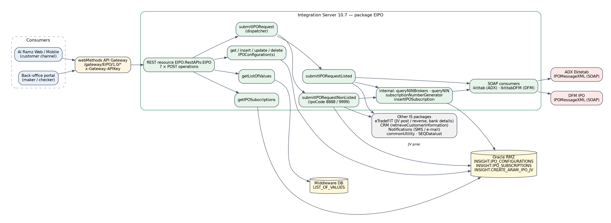
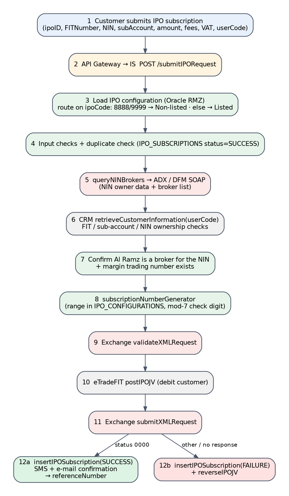
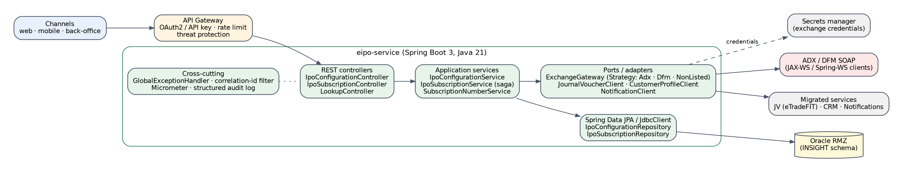
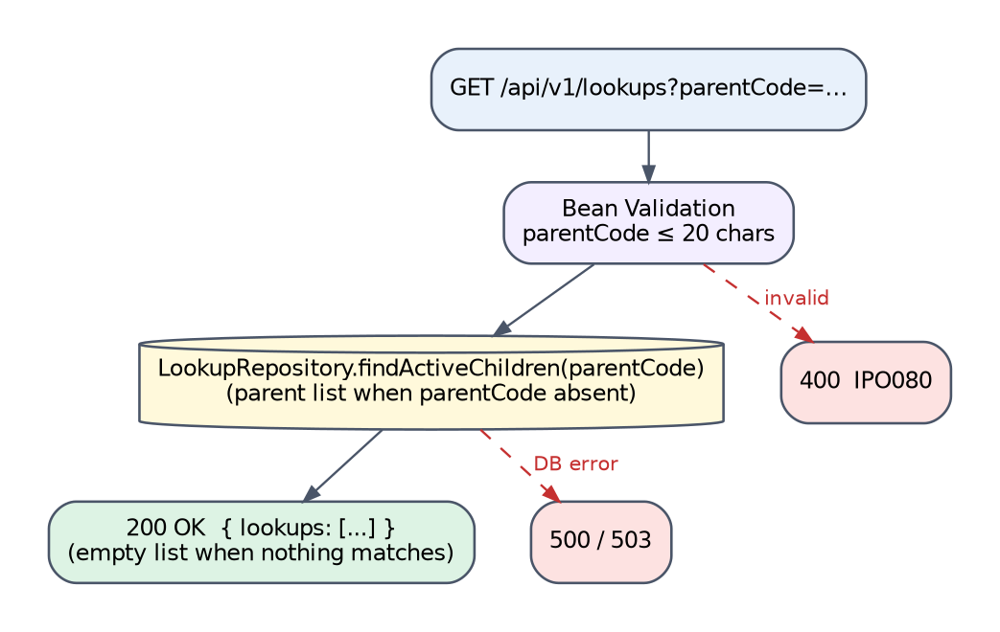
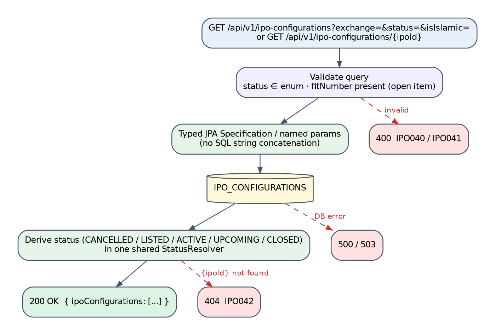
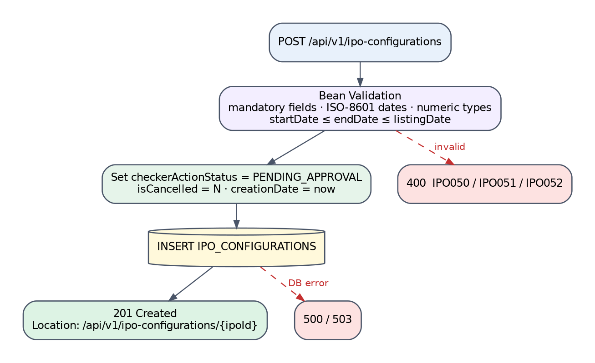
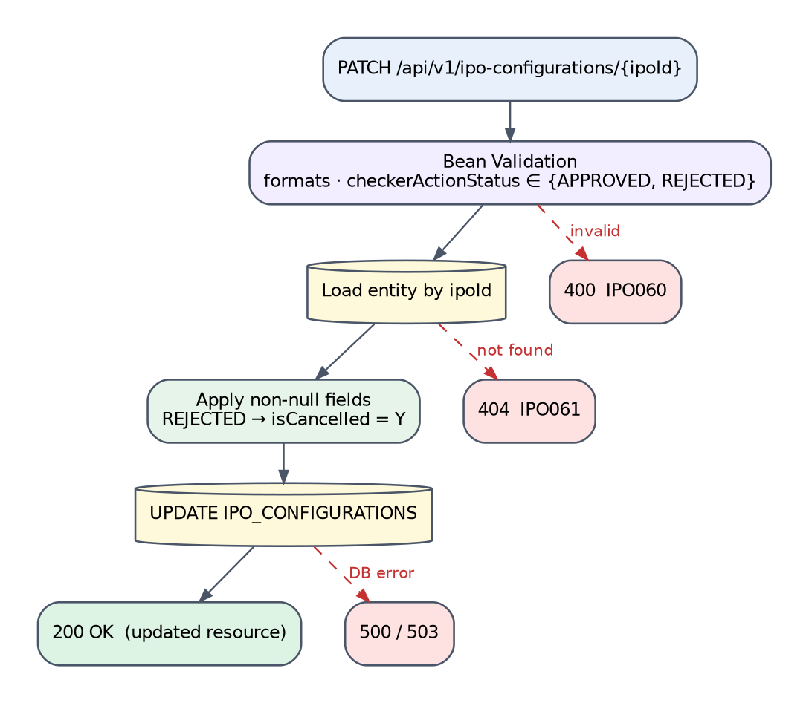
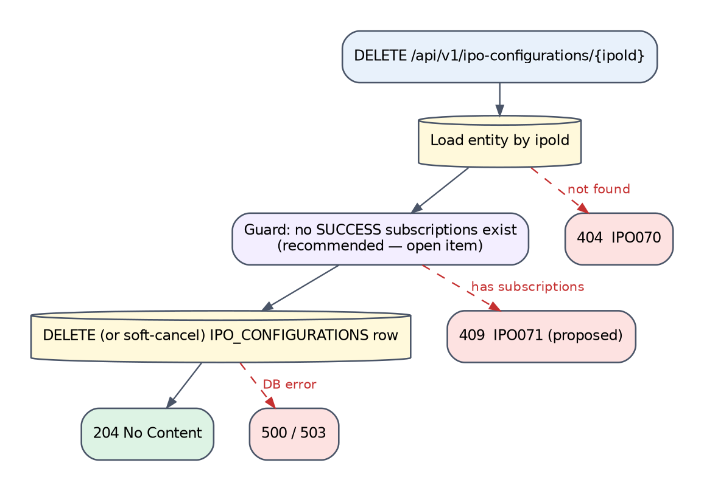
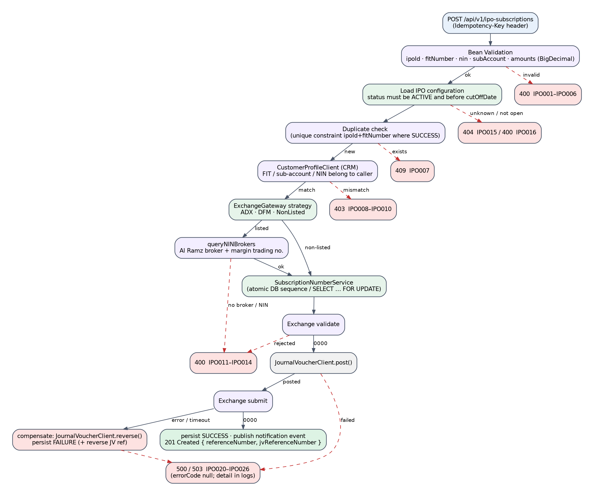
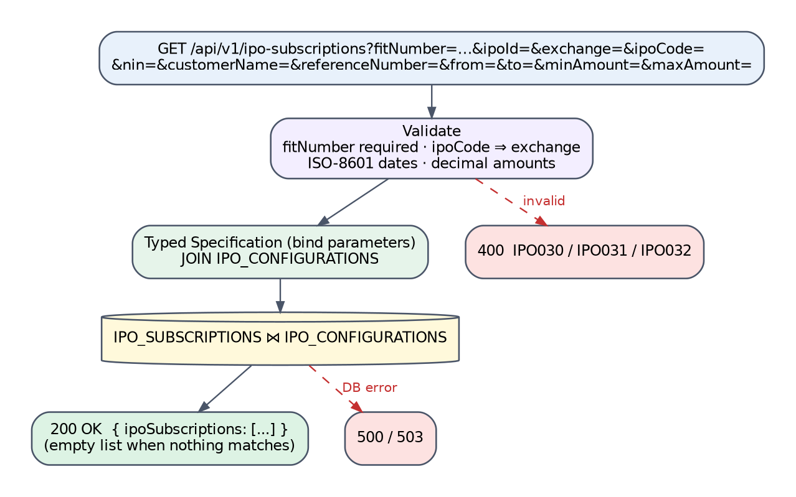

# EIPO Package — API Design & Migration Specification

_webMethods Integration Server 10.7 → Java 21 / Spring Boot 3 · Al Ramz Middleware Migration_

| Field | Value |
|---|---|
| Document | EIPO-API-Design-Document |
| Version | 0.1 — first draft for review |
| Date | 24 September 2026 |
| Source | IS package export `EIPO.zip` (13 flow services, 11 JDBC adapters, 2 WSDL consumers); Confluence space INTEGRATIO |
| Excluded | `EIPO.services:submitIPORequest_1`, `EIPO.services:submitIPORequestSimulationTest` |
| Status | Draft — proposals in this document are not yet agreed (see Appendix E) |

## Contents

- [1. Overview](#1-overview)
  - [1.1 Purpose](#11-purpose)
  - [1.2 Scope](#12-scope)
  - [1.3 Executive Summary](#13-executive-summary)
- [2. Solution Architecture](#2-solution-architecture)
  - [2.1 As-Built Legacy Architecture](#21-as-built-legacy-architecture)
  - [2.2 End-to-End Journey — IPO Subscription](#22-end-to-end-journey--ipo-subscription)
  - [2.3 Target Architecture (Spring Boot)](#23-target-architecture-spring-boot)
  - [2.4 Target Response & Result Model](#24-target-response--result-model)
  - [2.5 Legacy-to-Target Endpoint Map](#25-legacy-to-target-endpoint-map)
- [3. Prerequisites & Static Configuration](#3-prerequisites--static-configuration)
  - [3.1 Integration Server Global Variables](#31-integration-server-global-variables)
  - [3.2 Static / Feature-Flag Configuration](#32-static--feature-flag-configuration)
  - [3.3 Upstream / Downstream Dependencies](#33-upstream--downstream-dependencies)
  - [3.4 Security Notes](#34-security-notes)
- [4. API — Lookups (getListOfValues)](#4-api--lookups-getlistofvalues)
  - [4.1 Endpoint Summary](#41-endpoint-summary)
  - [4.2 Request Schema](#42-request-schema)
  - [4.3 Business Logic Summary](#43-business-logic-summary)
  - [4.4 Sample Request](#44-sample-request)
  - [4.5 Response Schema](#45-response-schema)
  - [4.6 HTTP Status Code Reference](#46-http-status-code-reference)
  - [4.7 Example Target Response Envelopes](#47-example-target-response-envelopes)
  - [4.8 Target Process Flow (Spring Boot)](#48-target-process-flow-spring-boot)
- [5. API — Get IPO Configurations](#5-api--get-ipo-configurations)
  - [5.1 Endpoint Summary](#51-endpoint-summary)
  - [5.2 Request Schema](#52-request-schema)
  - [5.3 Business Logic Summary](#53-business-logic-summary)
  - [5.4 Sample Request](#54-sample-request)
  - [5.5 Response Schema](#55-response-schema)
  - [5.6 HTTP Status Code Reference](#56-http-status-code-reference)
  - [5.7 Example Target Response Envelopes](#57-example-target-response-envelopes)
  - [5.8 Target Process Flow (Spring Boot)](#58-target-process-flow-spring-boot)
- [6. API — Create IPO Configuration](#6-api--create-ipo-configuration)
  - [6.1 Endpoint Summary](#61-endpoint-summary)
  - [6.2 Request Schema](#62-request-schema)
  - [6.3 Business Logic Summary](#63-business-logic-summary)
  - [6.4 Sample Request](#64-sample-request)
  - [6.5 Response Schema](#65-response-schema)
  - [6.6 HTTP Status Code Reference](#66-http-status-code-reference)
  - [6.7 Example Target Response Envelopes](#67-example-target-response-envelopes)
  - [6.8 Target Process Flow (Spring Boot)](#68-target-process-flow-spring-boot)
- [7. API — Update IPO Configuration](#7-api--update-ipo-configuration)
  - [7.1 Endpoint Summary](#71-endpoint-summary)
  - [7.2 Request Schema](#72-request-schema)
  - [7.3 Business Logic Summary](#73-business-logic-summary)
  - [7.4 Sample Request](#74-sample-request)
  - [7.5 Response Schema](#75-response-schema)
  - [7.6 HTTP Status Code Reference](#76-http-status-code-reference)
  - [7.7 Example Target Response Envelopes](#77-example-target-response-envelopes)
  - [7.8 Target Process Flow (Spring Boot)](#78-target-process-flow-spring-boot)
- [8. API — Delete IPO Configuration](#8-api--delete-ipo-configuration)
  - [8.1 Endpoint Summary](#81-endpoint-summary)
  - [8.2 Request Schema](#82-request-schema)
  - [8.3 Business Logic Summary](#83-business-logic-summary)
  - [8.4 Sample Request](#84-sample-request)
  - [8.5 Response Schema](#85-response-schema)
  - [8.6 HTTP Status Code Reference](#86-http-status-code-reference)
  - [8.7 Example Target Response Envelopes](#87-example-target-response-envelopes)
  - [8.8 Target Process Flow (Spring Boot)](#88-target-process-flow-spring-boot)
- [9. API — Submit IPO Subscription](#9-api--submit-ipo-subscription)
  - [9.1 Endpoint Summary](#91-endpoint-summary)
  - [9.2 Request Schema](#92-request-schema)
  - [9.3 Business Logic Summary](#93-business-logic-summary)
  - [9.4 Sample Request](#94-sample-request)
  - [9.5 Response Schema](#95-response-schema)
  - [9.6 HTTP Status Code Reference](#96-http-status-code-reference)
  - [9.7 Example Target Response Envelopes](#97-example-target-response-envelopes)
  - [9.8 Target Process Flow (Spring Boot)](#98-target-process-flow-spring-boot)
- [10. API — Search IPO Subscriptions](#10-api--search-ipo-subscriptions)
  - [10.1 Endpoint Summary](#101-endpoint-summary)
  - [10.2 Request Schema](#102-request-schema)
  - [10.3 Business Logic Summary](#103-business-logic-summary)
  - [10.4 Sample Request](#104-sample-request)
  - [10.5 Response Schema](#105-response-schema)
  - [10.6 HTTP Status Code Reference](#106-http-status-code-reference)
  - [10.7 Example Target Response Envelopes](#107-example-target-response-envelopes)
  - [10.8 Target Process Flow (Spring Boot)](#108-target-process-flow-spring-boot)
- [11. Downstream & Back-office Integration APIs](#11-downstream--back-office-integration-apis)
  - [11.1 submitIPORequestListed](#111-submitiporequestlisted)
  - [11.2 submitIPORequestNonListed](#112-submitiporequestnonlisted)
  - [11.3 queryNINBrokers](#113-queryninbrokers)
  - [11.4 queryNIN](#114-querynin)
  - [11.5 subscriptionNumberGenerator](#115-subscriptionnumbergenerator)
  - [11.6 insertIPOSubscription](#116-insertiposubscription)
  - [11.7 Exchange SOAP Services (ADX Ektetab, DFM)](#117-exchange-soap-services-adx-ektetab-dfm)
  - [11.8 Other IS Package Dependencies](#118-other-is-package-dependencies)
- [12. Data Mapping Reference](#12-data-mapping-reference)
  - [12.1 IPO Configuration API ↔ INSIGHT.IPO_CONFIGURATIONS](#121-ipo-configuration-api--insightipo_configurations)
  - [12.2 Subscription Record — Column Sources (submit path)](#122-subscription-record--column-sources-submit-path)
  - [12.3 Exchange Subscription Form (subscriptionFormVO)](#123-exchange-subscription-form-subscriptionformvo)
  - [12.4 IPO Status Derivation](#124-ipo-status-derivation)
- [Appendix A — Pseudocode](#appendix-a--pseudocode)
  - [A.1 submitIPORequest (legacy behaviour, listed path)](#a1-submitiporequest-legacy-behaviour-listed-path)
  - [A.2 subscriptionNumberGenerator](#a2-subscriptionnumbergenerator)
  - [A.3 getIPOSubscriptions condition builder](#a3-getiposubscriptions-condition-builder)
- [Appendix B — Glossary](#appendix-b--glossary)
- [Appendix C — Database DDL](#appendix-c--database-ddl)
  - [C.1 Source DDL (reconstructed)](#c1-source-ddl-reconstructed)
  - [C.2 Type-Mapping Decisions](#c2-type-mapping-decisions)
  - [C.3 Target DDL (proposed, delta)](#c3-target-ddl-proposed-delta)
- [Appendix D — Source Findings](#appendix-d--source-findings)
- [Appendix E — Open Items & Assumptions](#appendix-e--open-items--assumptions)

## 1. Overview

### 1.1 Purpose

This document reverse-engineers the webMethods Integration Server 10.7 package **EIPO** (Electronic IPO subscription) into a migration-ready API specification for the target Java 21 / Spring Boot 3 platform. It describes what the legacy Flow services actually do (sourced from `flow.xml`, `node.ndf` and the JDBC adapter metadata in the package export), proposes a RESTful target contract for every exposed operation, and records every source defect found along the way so that the migration does not faithfully re-implement them.

### 1.2 Scope

**In scope**

- The REST resource `EIPO.RestAPIs:EIPO` and its seven operations: `getListOfValues`, `getIPOConfiguration`, `insertIPOConfiguration`, `updateIPOConfiguration`, `deleteIPOConfiguration`, `submitIPORequest`, `getIPOSubscription`.
- Internal services invoked by those operations: `submitIPORequestListed`, `submitIPORequestNonListed`, `queryNINBrokers`, `subscriptionNumberGenerator`, `insertIPOSubscription`; and `queryNIN` (present in the package, documented for completeness).
- The 11 JDBC adapter services in `EIPO.adapters` and the Oracle tables / stored procedure they touch.
- The two exchange SOAP consumers generated from WSDL: `EIPO.wsdls.iktitab` (ADX Ektetab) and `EIPO.wsdls.IktitabDFM` (DFM).
**Out of scope**

- `EIPO.services:submitIPORequest_1` and `EIPO.services:submitIPORequestSimulationTest` — excluded at the requester’s instruction. They are not exposed by the REST resource. (They do call `queryNINBrokers`, `subscriptionNumberGenerator` and `insertIPOSubscription`, which is noted where caller counts matter.)
- Services owned by other IS packages that EIPO calls (eTradeFIT JV posting, CRM customer profile, Notifications, commonUtility, SEQDatalust logging). They appear here only as dependencies with their observed contract.
- Exchange-side behaviour of ADX / DFM beyond the SOAP contract visible in the WSDL.

### 1.3 Executive Summary

EIPO lets Al Ramz customers subscribe to IPOs on ADX and DFM (and to two “non-listed” offerings routed on magic IPO codes `8888` / `9999`) and lets back-office users maintain the IPO catalogue through a maker/checker workflow. All seven operations are exposed as verb-named `POST` endpoints that always return HTTP 200, with the real outcome carried in `responseCode` / `responseMessage`.

The subscription path (`submitIPORequest`) is the only business-logic-heavy service: it validates the request, verifies customer ownership through CRM, confirms Al Ramz is a registered broker for the investor NIN at the exchange, allocates a subscription number from a per-IPO range, validates and submits the application to the exchange over SOAP, and posts / reverses a journal voucher (JV) through eTradeFIT. The configuration and lookup operations are thin JDBC wrappers.

> [!CAUTION]
> **Key migration notes**
>
> - **Non-production stub in production code:** when the IS global variable `environment` is not `PROD`, `submitIPORequestListed` discards the real outcome and returns HTTP-200 with a fixed reference number. Must not be carried forward (Appendix D, F-01).
> - **Secrets in code and data:** exchange credentials are hard-coded in `queryNIN` and stored in plaintext in `IPO_CONFIGURATIONS.USERNAME/PASSWORD`; the DFM `queryNIN` endpoint is a UAT host over plain HTTP (F-02, F-03).
> - **SQL injection:** `getIPOSubscriptions` concatenates caller input into a `${condition}` SQL fragment; an unparenthesised `OR` also lets a `customerName` filter escape the FIT-number scoping (F-04).
> - **No caller binding:** the customer identity (`userCode`) is taken from the request body; the service ACL check is off. The target must derive identity from the access token (F-05).
> - **Non-atomic subscription-number allocation** (read → increment → write) can hand out duplicate numbers under concurrency; the caller also ignores generator failures (F-07, F-08).
> - **Legacy codes collide with the shared registry** (e.g. `1032` used for “IPO Validation Failed” but registered as “Token Expired”). Target codes use a new, distinct `IPO` prefix (Section 2.4).

#### 1.3.1 Source Artefacts and References

| Artefact | Detail |
|---|---|
| Package export | `EIPO.zip` — IS 10.7 package, manifest build 2023-11-02, last patch `FITCusInfoReplacement_05Jun26` (2026-06-05), publisher ARC-MWPRD-IS2 |
| Flow services analysed | 13 services in `EIPO.services` (2 excluded, see 1.2) |
| Adapter services | 11 JDBC adapter services (`EIPO.adapters`), connections `RMZ:RMZ` (Oracle, schema INSIGHT) and `MiddlewareConnection:Middleware` |
| WSDL consumers | `iktitab` (ADX, 13 operations) and `IktitabDFM` (DFM, 6 operations) |
| Confluence (INTEGRATIO) | Pages \*SubmitIPORequest\*, \*getIPOSubscription\*, \*getIPOConfiguration\*, \*insertIPOConfiguration\*, \*updateIPOConfiguration\*, \*queryNin – Internal\*, \*queryNinBrokers – Internal\*, \*insertIPOSubscription – Internal\*, \*getListOfValues (Lookups)\*, release notes v58 / v60 (non-listed IPO subscription) |
| Error-code registry | Confluence \*REST API response codes\* (page 2795896833) — shared catalogue of legacy numeric codes `1001`–`1135`. It lists codes and meanings but no HTTP-status mapping. |

## 2. Solution Architecture

### 2.1 As-Built Legacy Architecture

All consumer traffic enters through the webMethods API Gateway (`/gateway/EIPO/1.0/*`, API-key header) and reaches the IS REST resource `EIPO.RestAPIs:EIPO`, which maps seven POST URL templates onto Flow services. Configuration and lookup services read / write Oracle directly through JDBC adapters; the subscription path fans out to CRM, both exchanges, eTradeFIT and Notifications.


<p align="center"><em>Figure 2-1 — EIPO as-built component view (legacy)</em></p>

| Colour | Meaning |
|---|---|
| Light blue | Consumer channels |
| Amber | API Gateway |
| Green | EIPO Flow services on Integration Server |
| Grey | Other IS packages / internal systems |
| Red | Exchange systems (ADX, DFM) |
| Yellow cylinder | Databases |

| Legacy REST template (POST) | Flow service | Nature |
|---|---|---|
| `/getListOfValues` | `EIPO.services:getListOfValues` | Lookup read (Middleware DB) |
| `/getIPOConfiguration` | `EIPO.services:getIPOConfigurations` | Catalogue read (RMZ) |
| `/insertIPOConfiguration` | `EIPO.services:insertIPOConfiguration` | Catalogue create — maker |
| `/updateIPOConfiguration` | `EIPO.services:updateIPOConfiguration` | Catalogue partial update — maker / checker |
| `/deleteIPOConfiguration` | `EIPO.services:deleteIPOConfigurations` | Catalogue hard delete |
| `/submitIPORequest` | `EIPO.services:submitIPORequest` | Subscription orchestration |
| `/getIPOSubscription` | `EIPO.services:getIPOSubscriptions` | Subscription search (RMZ) |

### 2.2 End-to-End Journey — IPO Subscription

Only the subscription operation spans more than one downstream system; every other operation has a single database hop that is already fully shown in Figure 2-1, so no separate journey diagram is drawn for them. The listed-IPO journey below is the superset; the non-listed path (ipoCode `8888` / `9999`) skips steps 5, 7, 9 and 11 and posts the JV through the Oracle procedure `INSIGHT.CREATE_ARAM_IPO_JV` instead of eTradeFIT.


<p align="center"><em>Figure 2-2 — submitIPORequest end-to-end journey (legacy, listed IPO)</em></p>

### 2.3 Target Architecture (Spring Boot)

The target is a single `eipo-service` Spring Boot application behind the API Gateway. Exchange differences (ADX, DFM, non-listed) are isolated behind an `ExchangeGateway` strategy interface; JV, CRM and notification calls sit behind client ports so they can point at the migrated equivalents of the eTradeFIT / CRM / Notifications packages. Shared components (subscription-number allocation, status derivation) are single beans, not per-caller copies.


<p align="center"><em>Figure 2-3 — Target component view</em></p>

```
ae.alramz.eipo
 ├─ api            IpoConfigurationController, IpoSubscriptionController, LookupController, dto/*
 ├─ application    IpoConfigurationService, IpoSubscriptionService, SubscriptionNumberService, IpoStatusResolver
 ├─ domain         IpoConfiguration, IpoSubscription, ExchangeCode, IpoStatus, CheckerDecision, OperationResult
 ├─ port           ExchangeGateway, JournalVoucherClient, CustomerProfileClient, NotificationClient
 ├─ adapter
 │   ├─ exchange    AdxExchangeGateway, DfmExchangeGateway, NonListedExchangeGateway (Spring-WS clients)
 │   ├─ jv          EtradeFitJournalVoucherClient, OracleProcJournalVoucherClient (CREATE_ARAM_IPO_JV)
 │   └─ persistence IpoConfigurationRepository, IpoSubscriptionRepository, LookupRepository
 └─ config         SecurityConfig, WebServiceClientConfig, GlobalExceptionHandler, CorrelationIdFilter
```

### 2.4 Target Response & Result Model

#### 2.4.1 Standard response envelope

Every target endpoint returns the same four envelope fields next to its payload. The legacy services already return `responseCode` / `responseMessage` / `correlationID` / `response`; the target keeps the payload key `response` for consumer continuity and adds `errorCode` / `errorMsg`.

| Field | Type | Always present | Meaning |
|---|---|---|---|
| responseCode | String | Yes | Duplicates the HTTP status code, e.g. `"201"`, `"400"`. |
| responseMessage | String | Yes | HTTP reason phrase, e.g. `"Created"`, `"Bad Request"`. |
| errorCode | String (nullable) | Yes | Service error code `IPO###` — populated **only** for client-input errors; `null` on success and on backend / provider errors. |
| errorMsg | String (nullable) | Yes | Caller-actionable message for client-input errors; `null` otherwise. |
| correlationId | String (UUID) | Yes | Echo of `X-Correlation-Id` (generated if absent). Replaces legacy `correlationID`.<br>_Legacy vs. target field format:_ legacy key `correlationID` (upper-case ID) is renamed to camelCase `correlationId`; the gateway can emit both during a transition window if existing consumers parse it. |
| response | Object (nullable) | On success | Operation payload. |

Backend / provider failures (database, exchange SOAP, eTradeFIT, CRM) never expose the provider detail to the caller: only `responseCode` / `responseMessage` are set, and the provider, operation, exchange status code and exception are logged server-side under the correlation id.

#### 2.4.2 Service error-code scheme

Target service error codes use the prefix **IPO** followed by three digits, allocated in per-API blocks so a code identifies its endpoint at a glance. The prefix is deliberately distinct from the legacy numeric registry codes (`1001`–`1135`) and from the finding identifiers used in Appendix D (`F-nn`).

| Block | Endpoint |
|---|---|
| IPO001 – IPO029 | Submit IPO subscription (Chapter 9) |
| IPO030 – IPO039 | Search IPO subscriptions (Chapter 10) |
| IPO040 – IPO049 | Get IPO configurations (Chapter 5) |
| IPO050 – IPO059 | Create IPO configuration (Chapter 6) |
| IPO060 – IPO069 | Update IPO configuration (Chapter 7) |
| IPO070 – IPO079 | Delete IPO configuration (Chapter 8) |
| IPO080 – IPO089 | Lookups (Chapter 4) |
| IPO090 – IPO099 | Internal services (Chapter 11) |

#### 2.4.3 Internal result type

Internal calls (exchange gateway, JV client, subscription-number service, persistence of the subscription record) replace the legacy untyped pipeline convention — a `responseCode` string left in the pipeline that the caller may or may not inspect — with a sealed result type. This makes the legacy defect in F-08 (caller silently ignoring a failed generator call) a compile-time concern.

```java
public sealed interface OperationResult<T> permits Success, BusinessFailure, TechnicalFailure {
  record Success<T>(T value) implements OperationResult<T> {}
  record BusinessFailure<T>(String serviceErrorCode, String message, Map<String,Object> detail) implements OperationResult<T> {}
  record TechnicalFailure<T>(String serviceErrorCode, String provider, Throwable cause) implements OperationResult<T> {}
}

// usage
switch (subscriptionNumberService.allocate(ipo)) {
  case Success<String> s          -> form.setSubscriptionNumber(s.value());
  case BusinessFailure<String> b  -> throw new IpoBusinessException(b);   // mapped by GlobalExceptionHandler
  case TechnicalFailure<String> t -> throw new IpoBackendException(t);    // 500/503, errorCode null
}
```

### 2.5 Legacy-to-Target Endpoint Map

Every legacy path is verb-named and POST-only. The proposed target paths centre on the resources `lookups`, `ipo-configurations` and `ipo-subscriptions`; the HTTP method carries the verb. Each chapter repeats the relevant row with its reasoning. These are proposals: the legacy paths remain what is deployed today.

| Legacy (deployed) | Target (proposed) | Success status |
|---|---|---|
| POST /getListOfValues | GET /api/v1/lookups?parentCode={code} | 200 OK |
| POST /getIPOConfiguration | GET /api/v1/ipo-configurations (query filters)<br>GET /api/v1/ipo-configurations/{ipoId} | 200 OK |
| POST /insertIPOConfiguration | POST /api/v1/ipo-configurations | 201 Created |
| POST /updateIPOConfiguration | PATCH /api/v1/ipo-configurations/{ipoId} | 200 OK |
| POST /deleteIPOConfiguration | DELETE /api/v1/ipo-configurations/{ipoId} | 204 No Content |
| POST /submitIPORequest | POST /api/v1/ipo-subscriptions | 201 Created |
| POST /getIPOSubscription | GET /api/v1/ipo-subscriptions (query filters) | 200 OK |

## 3. Prerequisites & Static Configuration

### 3.1 Integration Server Global Variables

| Variable | Used by | Behaviour | Target |
|---|---|---|---|
| `environment` | `submitIPORequestListed` (final step) | If value ≠ `PROD`, overwrites the result with `responseCode 200`, `response.referenceNumber = "12200000012034"` (see F-01). | Remove. Use Spring profiles + a test double of `ExchangeGateway` in non-prod. |

### 3.2 Static / Feature-Flag Configuration

#### 3.2.1 commonUtility static data (application = MIDDLEWARE)

| Key | Read by | Purpose |
|---|---|---|
| `IPO_ADX_BANKRECCODE`, `IPO_DFM_BANKRECCODE` | queryNINBrokers (v1 getStaticData) | Receiving-bank code sent in the SOAP header block |
| `IPO_{EXCHANGE}_BANKRECCODE` | submitIPORequestListed (v2) | Same, keyed by exchange |
| `IPO_{EXCHANGE}_ALRAMZBRANCHCODE` | submitIPORequestListed (v2) | Al Ramz branch code on the subscription form |
| `IPO_{EXCHANGE}_ALRAMZCODE` | submitIPORequestListed (v2) | Al Ramz broker code matched against the exchange broker list |

#### 3.2.2 Per-IPO configuration held in IPO_CONFIGURATIONS

Several operational settings live in the catalogue table rather than in configuration: `API_URL` (exchange SOAP endpoint), `USERNAME` / `PASSWORD` (exchange credentials, plaintext), `SUBSCRIPTION_RANGE_START` / `SUBSCRIPTION_RANGE_END` (subscription-number range), `DEBIT_BANK_ACCOUNT_CODE` / `CREDIT_BANK_ACCOUNT_CODE`, `COMPANY_TYPE_ID`, `REFUND_TYPE`, `CUTOFF_DATE`. None of these are writable through `insertIPOConfiguration` / `updateIPOConfiguration`; they are maintained directly in the database.

> [!NOTE]
> **Target recommendation**
>
> Keep business attributes (dates, amounts, ranges) in the table, but move `USERNAME` / `PASSWORD` to the secrets manager keyed by exchange + IPO code, and move `API_URL` to externalised configuration per environment. Expose range and cut-off maintenance through an authorised admin endpoint rather than direct SQL.

#### 3.2.3 Hard-coded literals found in the Flow source

| Literal | Where | Target |
|---|---|---|
| Exchange user IDs and passwords (values redacted in this document) | queryNIN (ADX and DFM branches) | Secrets manager |
| `https://ektetab.adx.ae/ADXIPO/IPOMessageXML`, `http://ipouat.dfm.ae/OFFER01/IPOMessageXML` | queryNIN `_url` | Per-environment config; HTTPS only |
| recBankCode `B513` (ADX) / `066` (DFM) | queryNIN | Static data (as already done in queryNINBrokers) |
| poBox `345345` | Listed ADX validateXMLRequest | Remove — send the investor’s PO box (F-12) |
| poBox default `11111` | Listed / NonListed when PO box missing | Business decision (open item) |
| currencyCode `AED` | eTradeFIT getIPOBankDetails | Use `IPO_CONFIGURATIONS.CURRENCY` |
| debit / refund account numbers `1` / `2`, branchCode / brokerID `RAMZ`, debitAccountBank `014` | submitIPORequestNonListed | Configuration per non-listed offering |
| A developer’s personal e-mail address (redacted) | NonListed, ipoCode 8888 branch | Remove (F-06) |
| ipoCode `8888`, `9999` = non-listed | submitIPORequest dispatcher | Explicit `listingType` column on IPO_CONFIGURATIONS |

### 3.3 Upstream / Downstream Dependencies

Candidate health-check dependencies for the target service (Spring Boot Actuator health groups). “Critical” means the subscription endpoint cannot succeed without it.

| Dependency | Legacy access | Used by | Criticality |
|---|---|---|---|
| Oracle RMZ — INSIGHT.IPO_CONFIGURATIONS, IPO_SUBSCRIPTIONS, CREATE_ARAM_IPO_JV | JDBC adapter `RMZ:RMZ` | All except lookups | Critical |
| Middleware DB — LIST_OF_VALUES | JDBC adapter `MiddlewareConnection:Middleware` | getListOfValues | Critical for lookups |
| ADX Ektetab IPOMessageXML (SOAP) | `EIPO.wsdls.iktitab` connectors; URL from `API_URL` | submit (ADX), queryNINBrokers | Critical (ADX IPOs) |
| DFM IPOMessageXML (SOAP) | `EIPO.wsdls.IktitabDFM` connectors; URL from `API_URL` | submit (DFM), queryNINBrokers | Critical (DFM IPOs) |
| eTradeFIT — `eTradeFIT.services.EIPO:postIPOJV`, `reverseIPOJV`, `getIPOBankDetails` | IS service call | submit (listed) | Critical |
| CRM — `CRM.services.crmOnboarding:retrieveCustomerInformation` | IS service call | submit | Critical |
| Notifications — `Notifications.SMS.services:sendSMS`, `Notifications.EMail.services:sendEmail` | IS service call inside TRY/CATCH | submit | Non-critical (failures swallowed) |
| commonUtility — GenerateGUID, getStaticData (v1/v2), removeLeadingZeros, getCityName, getADXCountryCodeFromFITCode, documentListToJSONString | IS service call | submit, internal | Critical (static data) |
| DirectFN.java:appendToStringList | IS Java service | getIPOSubscriptions | Replaced by plain Java |
| SEQDatalust.services:asynchronousIngestion | IS service call (disabled in subscriptionNumberGenerator) | queryNIN, queryNINBrokers, insertIPOSubscription | Non-critical (audit log) |

### 3.4 Security Notes

| Aspect | Legacy (as-built) | Target |
|---|---|---|
| Caller authentication | API Gateway API key (`x-Gateway-APIKey`, per Confluence). No user token is validated by IS; `submitIPORequest*` read an `accessToken` HTTP header into the pipeline but never use it. | OAuth2 / OIDC bearer token validated at the gateway **and** by Spring Security (resource server). |
| Service ACL | `check_internal_acls = no` on every EIPO service; package `listACL` is null. Any IS user able to reach the port can invoke any service. | Endpoint-level authorisation via scopes / roles. |
| Customer binding | `userCode` is taken from the request body; ownership checks compare FIT / sub-account / NIN with the CRM profile of that **caller-supplied** userCode. | `userCode` derived from the token subject; request body no longer carries it. |
| Maker / checker | `makerUserID` / `checkerUserID` are free-text body fields; nothing prevents maker = checker. | Taken from the token; enforce maker ≠ checker and role `IPO_CHECKER` for decisions. |
| Exchange credentials | Hard-coded in queryNIN; plaintext columns in IPO_CONFIGURATIONS; DFM queryNIN URL is plain HTTP to a UAT host. | Secrets manager, HTTPS / mutual TLS, rotation. |
| Injection | Dynamic SQL built from caller strings in getIPOSubscriptions (F-04). | Bind parameters only (JPA Criteria / JdbcClient). |
| PII in logs | queryNIN / queryNINBrokers log full NIN owner data (names, Emirates ID, passport) to SEQDatalust. | Mask PII in audit logs; log identifiers only. |

## 4. API — Lookups (getListOfValues)

### 4.1 Endpoint Summary

| Attribute | Value |
|---|---|
| Legacy operation | POST `/getListOfValues` → `EIPO.services:getListOfValues` |
| Gateway URL (Confluence) | `https://api-uat.alramz.ae/gateway/common/2.0/getLookups` (the same Flow is also reachable through the EIPO resource) |
| Target operation | GET `/api/v1/lookups?parentCode={code}` |
| Success status | 200 OK |
| Consumers | Web / mobile and back-office UIs (populate IPO dropdowns: `IPO_BANKS`, `IPO_STATUS`, `IPO_PAYMENT_TYPE`, …) |
| Data source | Middleware DB table `LIST_OF_VALUES` via `EIPO.adapters:getListOfValues` (Custom SQL) |

> [!IMPORTANT]
> **Legacy vs. target endpoint**
>
> Legacy `POST /getListOfValues` is verb-named and uses POST for a read. Target: `GET /api/v1/lookups?parentCode=IPO_BANKS`. This is a filtered collection read, so `parentCode` is a query parameter rather than a path segment — a judgment call: `/lookups/{parentCode}/values` would read naturally but would imply a 404 for an unknown parent, which the underlying query cannot distinguish from an empty list.

### 4.2 Request Schema

| Field | Target Type | Required | Description |
|---|---|---|---|
| `parentCode` (query) | String (≤20) | No | Parent lookup code. Absent → the list of parent categories is returned (`parent_id = -1`). Present → active children of that parent.<br>_Legacy vs. target field format:_ legacy body field of the same name; an empty string is treated like null (both branches delete `parentCode` before the adapter call). Length 20 is from the Confluence page — the LOV column types are not in the export. |

<em>Confluence also documents a `filters[]` (key / values) block for exchanges, sectors and instruments. That block is **not** in the EIPO Flow signature — it belongs to the separate `common/2.0/getLookups` implementation — and is out of scope here.</em>

### 4.3 Business Logic Summary

1. If `parentCode` is null or empty it is removed from the pipeline.
2. Custom SQL: `SELECT ID, ARABIC_VALUE, ENGLISH_VALUE, CODE FROM LIST_OF_VALUES WHERE active = 1 AND parent_id = CASE WHEN ? IS NOT NULL THEN (SELECT ID FROM LIST_OF_VALUES WHERE code = ?) ELSE -1 END`.
3. Rows are copied to `response.LOVs[]` (`ID`, `arabicValue`, `englishValue`, `code`).
4. If `LOVs[0]` is null → `1012 / No Data Available`; otherwise `200 / OK` (the final setter uses \*overwrite = false\*, so 1012 survives).
5. Any exception → CATCH → `500 / Internal Server Error`.

> [!NOTE]
> **Business-logic observations for the target design**
>
> - An unknown `parentCode` and a known parent with no active children both produce an empty result — they cannot be told apart. The target keeps this as a 200 with an empty list (see 4.6).
> - The sub-select `SELECT ID … WHERE code = ?` fails with ORA-01427 if two parents share a code; the target should enforce a unique constraint on `CODE` for parent rows.
> - Lookups change rarely — cache per `parentCode` (e.g. Caffeine, 10 min TTL) in the target.

### 4.4 Sample Request

```http
GET /api/v1/lookups?parentCode=IPO_BANKS
Authorization: Bearer <token>
X-Correlation-Id: 3f2b8c1e-5a7d-4c1e-9b2a-6d0e4f1a7c55
```

Legacy equivalent: `POST /getListOfValues` with body `{"parentCode":"IPO_BANKS"}`.

### 4.5 Response Schema

| Field | Target Type | Description |
|---|---|---|
| responseCode / responseMessage / errorCode / errorMsg / correlationId | envelope | See 2.4.1. |
| `response.lookups[]` | Array | Lookup rows (empty array when nothing matches).<br>_Legacy vs. target field format:_ legacy array name `LOVs` → `lookups`. |
| `response.lookups[].id` | String | Row id (`ID`).<br>_Legacy vs. target field format:_ legacy key `ID` (upper case) → `id`. |
| `response.lookups[].code` | String | Code passed to other EIPO APIs. |
| `response.lookups[].englishValue` | String | English label. |
| `response.lookups[].arabicValue` | String | Arabic label. |

### 4.6 HTTP Status Code Reference

Legacy transport status: none of the EIPO services call `pub.flow:setResponseCode`, so the legacy endpoint answers **HTTP 200** for every handled outcome; the codes in the “Legacy Error Code” column are the inner `responseCode — responseMessage` pair, quoted from `flow.xml`. The HTTP Status column is the **proposed target** transport status.

> [!WARNING]
> **Design decision — empty result is 200, not an error**
>
> The shared registry (Confluence \*REST API response codes\*) defines `1012 – No Data Available` as a generic “query returned no data” code, and every EIPO read service emits it for an empty result. For this endpoint the resource being addressed is the filtered collection itself; a valid query that matches zero rows executed correctly, so the target returns **200 OK with `lookups: []`** rather than a 4xx. This is a per-endpoint deviation; the registry itself is unchanged.

#### 4.6.1 Client Input Errors

| HTTP Status | Service Error Code | Description |
|---|---|---|
| 400 Bad Request | IPO080 | `parentCode` longer than 20 characters or containing characters outside `[A-Za-z0-9_]` (new target validation — the legacy service has no input validation). |

#### 4.6.2 Backend / Provider Errors

| HTTP Status | Service Error Code | Description | Legacy Error Code |
|---|---|---|---|
| 200 OK | — | No matching rows → empty list (deviation, see above). | HTTP 200 · 1012 — No Data Available |
| 500 Internal Server Error | IPO085 | Unexpected database / SQL error. | HTTP 200 · 500 — Internal Server Error |
| 503 Service Unavailable | IPO086 | Middleware DB connection pool exhausted or DB unreachable. | HTTP 200 · 500 — Internal Server Error (no distinct legacy code) |

### 4.7 Example Target Response Envelopes

Success:

```json
{
  "responseCode": "200",
  "responseMessage": "OK",
  "errorCode": null,
  "errorMsg": null,
  "correlationId": "3f2b8c1e-5a7d-4c1e-9b2a-6d0e4f1a7c55",
  "response": {
    "lookups": [
      {
        "id": "40",
        "code": "001",
        "englishValue": "Dubai Islamic Bank",
        "arabicValue": "بنك دبي الإسلامي"
      }
    ]
  }
}
```

Success — no matching rows:

```json
{
  "responseCode": "200",
  "responseMessage": "OK",
  "errorCode": null,
  "errorMsg": null,
  "correlationId": "3f2b8c1e-5a7d-4c1e-9b2a-6d0e4f1a7c55",
  "response": {
    "lookups": []
  }
}
```

Client input error:

```json
{
  "responseCode": "400",
  "responseMessage": "Bad Request",
  "errorCode": "IPO080",
  "errorMsg": "parentCode must be at most 20 characters",
  "correlationId": "3f2b8c1e-5a7d-4c1e-9b2a-6d0e4f1a7c55"
}
```

### 4.8 Target Process Flow (Spring Boot)


<p align="center"><em>Figure 4-1 — Lookups target flow</em></p>

## 5. API — Get IPO Configurations

### 5.1 Endpoint Summary

| Attribute | Value |
|---|---|
| Legacy operation | POST `/getIPOConfiguration` → `EIPO.services:getIPOConfigurations` |
| Gateway URL (Confluence) | `https://api-uat.alramz.ae/gateway/EIPO/1.0/getIPOConfiguration` |
| Target operations | GET `/api/v1/ipo-configurations?exchange=&status=&isIslamic=` (collection)<br>GET `/api/v1/ipo-configurations/{ipoId}` (single resource) |
| Success status | 200 OK |
| Consumers | Customer channel (IPO list / detail) and back-office (maker / checker queue via `status=PENDING_APPROVAL`) |
| Data source | `INSIGHT.IPO_CONFIGURATIONS` via `EIPO.adapters:getIPOConfiguration` (Dynamic SQL) |

> [!IMPORTANT]
> **Legacy vs. target endpoint**
>
> Legacy `POST /getIPOConfiguration` → target `GET /api/v1/ipo-configurations` with query filters. Because the legacy body also accepts a single `ipoID`, the target adds the single-resource form `GET /api/v1/ipo-configurations/{ipoId}` — the only form where “not found” is a 404.

### 5.2 Request Schema

| Field | Target Type | Required | Description |
|---|---|---|---|
| `ipoId` (path, single form) | String | Path | Record id. Legacy: body `ipoID`, `LIKE` match (default `%`).<br>_Legacy vs. target field format:_ legacy compares with `ID LIKE ?`, so a caller could send `1%` and get ids 1, 10, 11… Target is an exact match. |
| `exchange` (query) | enum ExchangeCode | No | Filter by exchange (`LIKE`, default `%`). |
| `status` (query) | enum IpoStatus + `PENDING_APPROVAL` | No | ACTIVE, UPCOMING, CLOSED, CANCELLED, LISTED, PENDING_APPROVAL (case-insensitive). Any other non-blank value → error. |
| `isIslamic` (query) | Boolean | No | Only `Y` filters (`is_Islamic = 'Y'`); `N` is ignored.<br>_Legacy vs. target field format:_ legacy accepts `Y` only; `N` silently returns everything. Target boolean `true`/`false` filters both ways. |
| `fitNumber` (query) | String | Legacy: Yes | Mandatory in legacy (1069 if blank) but not used by the SQL in this export (F-14). Target: see open item below.<br>_Legacy vs. target field format:_ legacy name `FITNumber` → `fitNumber`. |

### 5.3 Business Logic Summary

1. If `FITNumber` is blank → `1069 / Missing FITNumber`, exit (success signal — no CATCH).
2. Defaults (overwrite = false): `ipoID = %`, `exchange = %`, `condition = "and 1=1"`.
3. `status` upper-cased and mapped to a fixed SQL fragment: ACTIVE → `start_date < sysDate and end_date > sysDate`; UPCOMING → `start_Date > sysdate`; CLOSED → `end_Date < sysdate and listing_date >= sysdate and UPPER(IS_CANCELLED) != 'Y'`; CANCELLED → `IS_CANCELLED = 'Y'`; LISTED → `listing_date <= sysdate and UPPER(IS_CANCELLED) != 'Y'`; PENDING_APPROVAL → `UPPER(CHECKER_ACTION_STATUS) = 'PENDING_APPROVAL'`; any other non-blank value → `1025 / Invalid Status`, exit.
4. `isIslamic = Y` → condition replaced by `and is_Islamic = 'Y'` — which **overwrites** any status condition set in step 3.
5. Adapter: `SELECT … , CASE WHEN UPPER(IS_CANCELLED)='Y' THEN 'CANCELLED' WHEN listing_date < sysdate THEN 'LISTED' WHEN start_Date<=sysDate AND end_Date>sysDate THEN 'ACTIVE' WHEN start_Date>sysdate THEN 'UPCOMING' ELSE 'CLOSED' END AS STATUS … FROM insight.IPO_CONFIGURATIONS WHERE exchange LIKE ? AND ID LIKE ? ${condition} ORDER BY LISTING_DATE DESC`.
6. A disabled older copy of the same adapter call is still present in the Flow (ignored).
7. Empty result → `1012 / No Data Available`; else `200 / OK`. Exception → `500`.

> [!NOTE]
> **Business-logic observations for the target design**
>
> - **isIslamic overwrites status** (step 4): `status=ACTIVE&isIslamic=Y` returns all Islamic IPOs of any status. Target combines filters with AND.
> - **Status filter and status column disagree**: ACTIVE filter uses `start_date < sysdate`, the derived column uses `<=`; CLOSED filter requires `listing_date >= sysdate`, the column’s ELSE bucket does not. One `IpoStatusResolver` (Java or a DB view) must drive both.
> - **FIT number is mandatory but unused**: presumably intended for a per-customer eligibility / “already subscribed” flag. Open item — confirm intent before deciding whether the target keeps it.
> - The SQL fragment is chosen from fixed literals (not caller text) and `exchange` / `ipoID` are bind parameters, so this service is not injectable — unlike Chapter 10.
> - List responses carry three Base64 CLOBs per row (logos, application form). The target should omit binaries from the collection response and serve them from a document sub-resource.

### 5.4 Sample Request

```http
GET /api/v1/ipo-configurations?exchange=ADX&status=ACTIVE
GET /api/v1/ipo-configurations/1
```

Legacy: `POST /getIPOConfiguration` `{"ipoID":"1","exchange":"ADX","FITNumber":"1100102974693"}`.

### 5.5 Response Schema

`response.ipoConfigurations[]` (collection) or `response.ipoConfiguration` (single). Legacy array name: `IPOs`.

| Field | Target Type | Returned | Description |
|---|---|---|---|
| `ipoId` | String | Yes | Catalogue record id (server-generated). DB: `ID` VARCHAR2(20) NOT NULL.<br>_Legacy vs. target field format:_ legacy JSON name `ipoID`; target `ipoId`. Kept as String because the column is VARCHAR2 and values are not guaranteed numeric. |
| `exchange` | enum ExchangeCode {ADX, DFM} | Yes | Exchange of the offering. DB: `EXCHANGE` VARCHAR2(20) NOT NULL.<br>_Legacy vs. target field format:_ legacy stores both `ADX` and `ADSM` for Abu Dhabi (submitIPORequestListed maps ADSM→ADX, subscriptionNumberGenerator maps ADX→ADSM). Target normalises to `ADX` / `DFM` at the API; the persistence adapter maps to the stored value (open item: confirm stored spelling). |
| `ipoCode` | String | Yes | IPO code assigned by the exchange (`8888` / `9999` = non-listed). DB: `IPO_CODE` VARCHAR2(20) NOT NULL. |
| `issuerCompany` | String (≤100) | Yes | Issuer company name (English). DB: `ISSUER_COMPANY` VARCHAR2(100) NOT NULL. |
| `leadReceivingBank` | String (LOV `IPO_BANKS`) | Yes | Lead receiving bank code. DB: `LEAD_RECEIVING_BANK` VARCHAR2(20) NOT NULL. |
| `receivingBanks` | List&lt;String&gt; (LOV `IPO_BANKS`) | Yes | Other receiving banks. DB: `RECEIVING_BANKS` VARCHAR2(20) / VARCHAR2(100).<br>_Legacy vs. target field format:_ legacy is one comma-separated string (`"004,005,097"`). Target is a JSON array; the adapter joins / splits for storage. Column length differs between adapters in the export (20 vs 100) — confirm live DDL. |
| `offerType` | List&lt;String&gt; (LOV `IPO_OFFER_TYPES`) | Yes | Offer types. DB: `OFFER_TYPE` VARCHAR2(20) NOT NULL.<br>_Legacy vs. target field format:_ comma-separated string → JSON array. |
| `totalOfferedShares` | Long | Yes | Total shares offered. DB: `TOTAL_OFFERED_SHARES` NUMBER NOT NULL.<br>_Legacy vs. target field format:_ legacy declared `string`; column is NUMBER and the update SQL wraps it in `TO_NUMBER(?)`. |
| `sharePriceType` | String (LOV `IPO_SHARE_PRICE_TYPES`) | Yes | Fixed price / price range. DB: `SHARE_PRICE_TYPE` VARCHAR2(20) NOT NULL. |
| `sharePrice` | BigDecimal | Yes | Offer price per share. DB: `SHARE_PRICE` FLOAT.<br>_Legacy vs. target field format:_ legacy `string`; column FLOAT. Target BigDecimal (monetary) — FLOAT storage should also move to NUMBER(p,s). |
| `subscriptionFee` | BigDecimal | Yes | Subscription fee. DB: `SUBSCRIPTION_FEE` FLOAT.<br>_Legacy vs. target field format:_ string → BigDecimal. |
| `startDate` | LocalDate (ISO 8601 `yyyy-MM-dd`) | Yes | Subscription window start. DB: `START_DATE` DATE NOT NULL.<br>_Legacy vs. target field format:_ legacy string, documented as `YYYY-MM-DD` but not validated; output is a JDBC `object` (Timestamp). Target ISO 8601 date on input and output. |
| `endDate` | LocalDate (ISO 8601) | Yes | Subscription window end. DB: `END_DATE` DATE NOT NULL. |
| `backlogClearingDays` | Integer | Yes | Days for backlog clearing. DB: `BACKLOG_CLEARING_DAYS` NUMBER.<br>_Legacy vs. target field format:_ string → Integer. |
| `allotmentDays` | Integer | Yes | Days for allotment. DB: `ALLOTMENT_DAYS` NUMBER. |
| `allocationDeliveryDate` | LocalDate (ISO 8601) | Yes | Allocation delivery date. DB: `ALLOCATION_DELIVERY_DATE` DATE. |
| `allocationApprovalDate` | LocalDate (ISO 8601) | Yes | Allocation approval date. DB: `ALLOCATION_APPROVAL_DATE` DATE. |
| `refundFileGenerationDate` | LocalDate (ISO 8601) | Yes | Refund file generation date. DB: `REFUND_FILE_GENERATION_DATE` DATE. |
| `refundSMSDate` | LocalDate (ISO 8601) | Yes | Refund SMS date. DB: `REFUND_SMS_DATE` DATE. |
| `refundProcessingDate` | LocalDate (ISO 8601) | Yes | Refund processing date. DB: `REFUND_PROCESSING_DATE` DATE. |
| `retailOfferSharebookSubmission` | LocalDate (ISO 8601) | Yes | Retail offer share-book submission date. DB: `RETAILOFFER_SHAREBK_SUBMISSION` DATE. |
| `listingDate` | LocalDate (ISO 8601) | Yes | Listing date. DB: `LISTING_DATE` DATE NOT NULL. |
| `applicableTranches` | List&lt;String&gt; (LOV `IPO_TRANCHES`) | Yes | Applicable tranches. DB: `APPLICABLE_TRANCHES` VARCHAR2(20) NOT NULL.<br>_Legacy vs. target field format:_ comma-separated string → JSON array. |
| `subscriptionTypes` | List&lt;String&gt; (LOV `IPO_SUBSCRIPTION_TYPE`) | Yes | Subscription types. DB: `SUBSCRIPTION_TYPES` VARCHAR2(20) NOT NULL.<br>_Legacy vs. target field format:_ comma-separated string → JSON array. |
| `individualClientTypes` | List&lt;String&gt; (LOV `IPO_INDIVIDUAL_CLIENT_TYPES`) | Yes | Eligible individual client types. DB: `INDIVIDUAL_CLIENT_TYPES` VARCHAR2(20) NOT NULL.<br>_Legacy vs. target field format:_ comma-separated string → JSON array. NOT NULL in DB but Optional on the Confluence page. |
| `minimumAmount` | BigDecimal | Yes | Minimum subscription amount. DB: `MIN_AMOUNT` FLOAT NOT NULL. |
| `maximumAmount` | BigDecimal | Yes | Maximum subscription amount. DB: `MAX_AMOUNT` FLOAT. |
| `amountMultiple` | BigDecimal | Yes | Allowed amount increment. DB: `AMOUNT_MULTIPLE` FLOAT NOT NULL. |
| `mandatorySubscriptionDetails` | String | Yes | Mandatory subscription details. DB: `MANDATORY_SUBSCRIPTION_DETAILS` VARCHAR2(20).<br>_Legacy vs. target field format:_ legacy spells the field `mandatorySubcriptionDetails` in insert / get and `mandatorySubscriptionDetails` in update. Target uses the correct spelling everywhere. |
| `paymentTypes` | List&lt;String&gt; (LOV `IPO_PAYMENT_TYPE`) | Yes | Accepted payment types. DB: `PAYMENT_TYPES` VARCHAR2(20) NOT NULL.<br>_Legacy vs. target field format:_ comma-separated string → JSON array. |
| `issuerLogo` | String (Base64) | Yes | Issuer logo image. DB: `ISSUER_LOGO` CLOB.<br>_Legacy vs. target field format:_ recommend moving binaries to `PUT /ipo-configurations/{ipoId}/documents/{type}` to keep list responses small. |
| `leadReceivingBankLogo` | String (Base64) | Yes | Lead bank logo. DB: `LEAD_RECEIVING_BANK_LOGO` CLOB. |
| `applicationForm` | String (Base64) | Yes | Application form document. DB: `APPLICATION_FORM` CLOB. |
| `refundInterestRate` | String | Yes | Refund interest rate (free text, sample `"3bp"`). DB: `REFUND_INTEREST_RATE` VARCHAR2(20).<br>_Legacy vs. target field format:_ kept as String — sample value mixes number and unit; converting to a decimal needs a business decision (open item). |
| `companyClientTypes` | List&lt;String&gt; (LOV `IPO_COMPANY_CLIENT_TYPES`) | Yes | Eligible company client types. DB: `COMPANY_CLIENT_TYPES` VARCHAR2(20).<br>_Legacy vs. target field format:_ comma-separated string → JSON array. |
| `currency` | String (ISO 4217) | Yes | Offer currency. DB: `CURRENCY` VARCHAR2(20).<br>_Legacy vs. target field format:_ legacy free text; target validates against ISO 4217 (`AED`). |
| `announcementDate` | LocalDate (ISO 8601) | Yes | Announcement date. DB: `ANNOUNCEMENT_DATE` DATE. |
| `isIslamic` | Boolean | Yes | Shariah-compliant issuer. DB: `IS_ISLAMIC` VARCHAR2(1).<br>_Legacy vs. target field format:_ legacy `Y`/`N`. Not accepted by the insert / update Flow signatures although Confluence documents it (F-16). |
| **Workflow / derived fields** |  |  |  |
| `status` | enum IpoStatus | Yes | Derived: CANCELLED, LISTED, ACTIVE, UPCOMING, CLOSED. DB: `(derived)` CASE expression.<br>_Legacy vs. target field format:_ derived in the SELECT; getIPOSubscriptions uses `COMPLETED` for the same state (F-15). Target derives in one `IpoStatusResolver`. |
| `checkerActionStatus` | enum {PENDING_APPROVAL, APPROVED, REJECTED} | Yes | Maker/checker state. DB: `CHECKER_ACTION_STATUS` VARCHAR2(20). |
| `makerUserId` | String | Yes | Maker user. DB: `MAKER_USER_ID` VARCHAR2(20).<br>_Legacy vs. target field format:_ legacy `makerUserID`. |
| `creationDate` | OffsetDateTime (ISO 8601) | Yes | Creation timestamp. DB: `CREATION_DATE` DATE.<br>_Legacy vs. target field format:_ legacy writes `yyyy-MM-dd` only (time lost). |
| `checkerUserId` | String | Yes | Checker user. DB: `CHECKER_USER_ID` VARCHAR2(20). |
| `checkDate` | OffsetDateTime (ISO 8601) | Yes | Checker decision timestamp. DB: `CHECK_DATE` DATE. |
| `isSubscribable` | Boolean | Yes | Subscribable flag (column name misspelt in DB). DB: `IS_SUSCRIBABLE` VARCHAR2(1). |
| `cutOffDate` | OffsetDateTime (ISO 8601) | Yes | Time after which subscriptions are refused. DB: `CUTOFF_DATE` not in export metadata.<br>_Legacy vs. target field format:_ only referenced in the adapter SQL; type not confirmed by the export (open item). |
| `issuerCompanyAr` | String | Yes | Issuer name (Arabic) — documented in Confluence. DB: `— (not in adapter)` —.<br>_Legacy vs. target field format:_ the Flow maps `ISSUERCOMPANYAR`, but the adapter in this export has no such output column, so the field is never populated from this package version (F-14). |

> [!WARNING]
> **Never exposed**
>
> The adapter also returns `USERNAME`, `PASSWORD`, `APIURL`, `DEBITBANKACCOUNTCODE`, `CREDITBANKACCOUNTCODE`, `REFUNDTYPE`, `COMPANTTYPEID`. The legacy Flow does not map username / password / URL into the response (correct); the target DTO must not contain them at all.

### 5.6 HTTP Status Code Reference

Legacy transport status: none of the EIPO services call `pub.flow:setResponseCode`, so the legacy endpoint answers **HTTP 200** for every handled outcome; the codes in the “Legacy Error Code” column are the inner `responseCode — responseMessage` pair, quoted from `flow.xml`. The HTTP Status column is the **proposed target** transport status.

> [!WARNING]
> **Design decision — collection vs. single resource**
>
> For the collection form an empty result is **200 with an empty array** (deviation from the registry’s generic `1012` — same reasoning as 4.6). For the single-resource form `/{ipoId}` a missing id is a genuine **404** (IPO042).

#### 5.6.1 Client Input Errors

| HTTP Status | Service Error Code | Description | Legacy Error Code |
|---|---|---|---|
| 400 Bad Request | IPO040 | `fitNumber` missing (only if the target keeps it mandatory — open item). | HTTP 200 · 1069 — Missing FITNumber (registry meaning of 1069 is “Validation List Failed”, F-09) |
| 400 Bad Request | IPO041 | `status` is not one of the supported values. | HTTP 200 · 1025 — Invalid Status |
| 404 Not Found | IPO042 | `GET /ipo-configurations/{ipoId}` — no such record. | HTTP 200 · 1012 — No Data Available (inferred: legacy has no single-resource form) |

#### 5.6.2 Backend / Provider Errors

| HTTP Status | Service Error Code | Description | Legacy Error Code |
|---|---|---|---|
| 200 OK | — | Collection query matched nothing → empty list. | HTTP 200 · 1012 — No Data Available |
| 500 Internal Server Error | IPO045 | Unexpected database error. | HTTP 200 · 500 — Internal Server Error |
| 503 Service Unavailable | IPO046 | RMZ database unreachable / pool exhausted. | HTTP 200 · 500 — Internal Server Error |

### 5.7 Example Target Response Envelopes

Success (collection, abridged):

```json
{
  "responseCode": "200",
  "responseMessage": "OK",
  "errorCode": null,
  "errorMsg": null,
  "correlationId": "3f2b8c1e-5a7d-4c1e-9b2a-6d0e4f1a7c55",
  "response": {
    "ipoConfigurations": [
      {
        "ipoId": "1",
        "exchange": "ADX",
        "ipoCode": "90",
        "issuerCompany": "ADNOC Gas PLC",
        "leadReceivingBank": "FAB",
        "receivingBanks": [
          "ADIB",
          "ADCB"
        ],
        "offerType": [
          "1"
        ],
        "totalOfferedShares": 2302542660,
        "sharePriceType": "1",
        "sharePrice": null,
        "subscriptionFee": 0,
        "startDate": "2023-02-23",
        "endDate": "2023-03-01",
        "listingDate": "2023-03-13",
        "applicableTranches": [
          "1",
          "2"
        ],
        "subscriptionTypes": [
          "1",
          "2"
        ],
        "individualClientTypes": [
          "1",
          "2"
        ],
        "minimumAmount": 5000,
        "maximumAmount": null,
        "amountMultiple": 1000,
        "paymentTypes": [
          "10",
          "11",
          "12"
        ],
        "currency": "AED",
        "isIslamic": true,
        "status": "LISTED",
        "checkerActionStatus": "APPROVED",
        "cutOffDate": "2023-03-01T12:00:00+04:00"
      }
    ]
  }
}
```

Client input error:

```json
{
  "responseCode": "400",
  "responseMessage": "Bad Request",
  "errorCode": "IPO041",
  "errorMsg": "status must be one of ACTIVE, UPCOMING, CLOSED, CANCELLED, LISTED, PENDING_APPROVAL",
  "correlationId": "3f2b8c1e-5a7d-4c1e-9b2a-6d0e4f1a7c55"
}
```

Backend error:

```json
{
  "responseCode": "503",
  "responseMessage": "Service Unavailable",
  "errorCode": null,
  "errorMsg": null,
  "correlationId": "3f2b8c1e-5a7d-4c1e-9b2a-6d0e4f1a7c55"
}
```

### 5.8 Target Process Flow (Spring Boot)


<p align="center"><em>Figure 5-1 — Get IPO configurations target flow</em></p>

## 6. API — Create IPO Configuration

### 6.1 Endpoint Summary

| Attribute | Value |
|---|---|
| Legacy operation | POST `/insertIPOConfiguration` → `EIPO.services:insertIPOConfiguration` |
| Gateway URL (Confluence) | `https://api-uat.alramz.ae/gateway/EIPO/1.0/insertIPOConfiguration` |
| Target operation | POST `/api/v1/ipo-configurations` |
| Success status | 201 Created, `Location: /api/v1/ipo-configurations/{ipoId}` |
| Consumers | Back-office portal (maker) |
| Data source | `INSIGHT.IPO_CONFIGURATIONS` via `EIPO.adapters:insertIPOConfigurations` (Insert template) |

> [!IMPORTANT]
> **Legacy vs. target endpoint**
>
> Legacy `POST /insertIPOConfiguration` → target `POST /api/v1/ipo-configurations` returning 201 with a `Location` header and the created resource (including the generated `ipoId`, which the legacy response does not return).

### 6.2 Request Schema

“Required” reflects the target rule: NOT NULL columns in the adapter metadata plus fields Confluence marks mandatory.

| Field | Target Type | Required | Description |
|---|---|---|---|
| `exchange` | enum ExchangeCode {ADX, DFM} | Yes | Exchange of the offering. DB: `EXCHANGE` VARCHAR2(20) NOT NULL.<br>_Legacy vs. target field format:_ legacy stores both `ADX` and `ADSM` for Abu Dhabi (submitIPORequestListed maps ADSM→ADX, subscriptionNumberGenerator maps ADX→ADSM). Target normalises to `ADX` / `DFM` at the API; the persistence adapter maps to the stored value (open item: confirm stored spelling). |
| `ipoCode` | String | Yes | IPO code assigned by the exchange (`8888` / `9999` = non-listed). DB: `IPO_CODE` VARCHAR2(20) NOT NULL. |
| `issuerCompany` | String (≤100) | Yes | Issuer company name (English). DB: `ISSUER_COMPANY` VARCHAR2(100) NOT NULL. |
| `leadReceivingBank` | String (LOV `IPO_BANKS`) | Yes | Lead receiving bank code. DB: `LEAD_RECEIVING_BANK` VARCHAR2(20) NOT NULL. |
| `receivingBanks` | List&lt;String&gt; (LOV `IPO_BANKS`) | No | Other receiving banks. DB: `RECEIVING_BANKS` VARCHAR2(20) / VARCHAR2(100).<br>_Legacy vs. target field format:_ legacy is one comma-separated string (`"004,005,097"`). Target is a JSON array; the adapter joins / splits for storage. Column length differs between adapters in the export (20 vs 100) — confirm live DDL. |
| `offerType` | List&lt;String&gt; (LOV `IPO_OFFER_TYPES`) | Yes | Offer types. DB: `OFFER_TYPE` VARCHAR2(20) NOT NULL.<br>_Legacy vs. target field format:_ comma-separated string → JSON array. |
| `totalOfferedShares` | Long | Yes | Total shares offered. DB: `TOTAL_OFFERED_SHARES` NUMBER NOT NULL.<br>_Legacy vs. target field format:_ legacy declared `string`; column is NUMBER and the update SQL wraps it in `TO_NUMBER(?)`. |
| `sharePriceType` | String (LOV `IPO_SHARE_PRICE_TYPES`) | Yes | Fixed price / price range. DB: `SHARE_PRICE_TYPE` VARCHAR2(20) NOT NULL. |
| `sharePrice` | BigDecimal | No | Offer price per share. DB: `SHARE_PRICE` FLOAT.<br>_Legacy vs. target field format:_ legacy `string`; column FLOAT. Target BigDecimal (monetary) — FLOAT storage should also move to NUMBER(p,s). |
| `subscriptionFee` | BigDecimal | No | Subscription fee. DB: `SUBSCRIPTION_FEE` FLOAT.<br>_Legacy vs. target field format:_ string → BigDecimal. |
| `startDate` | LocalDate (ISO 8601 `yyyy-MM-dd`) | Yes | Subscription window start. DB: `START_DATE` DATE NOT NULL.<br>_Legacy vs. target field format:_ legacy string, documented as `YYYY-MM-DD` but not validated; output is a JDBC `object` (Timestamp). Target ISO 8601 date on input and output. |
| `endDate` | LocalDate (ISO 8601) | Yes | Subscription window end. DB: `END_DATE` DATE NOT NULL. |
| `backlogClearingDays` | Integer | No | Days for backlog clearing. DB: `BACKLOG_CLEARING_DAYS` NUMBER.<br>_Legacy vs. target field format:_ string → Integer. |
| `allotmentDays` | Integer | No | Days for allotment. DB: `ALLOTMENT_DAYS` NUMBER. |
| `allocationDeliveryDate` | LocalDate (ISO 8601) | No | Allocation delivery date. DB: `ALLOCATION_DELIVERY_DATE` DATE. |
| `allocationApprovalDate` | LocalDate (ISO 8601) | No | Allocation approval date. DB: `ALLOCATION_APPROVAL_DATE` DATE. |
| `refundFileGenerationDate` | LocalDate (ISO 8601) | No | Refund file generation date. DB: `REFUND_FILE_GENERATION_DATE` DATE. |
| `refundSMSDate` | LocalDate (ISO 8601) | No | Refund SMS date. DB: `REFUND_SMS_DATE` DATE. |
| `refundProcessingDate` | LocalDate (ISO 8601) | No | Refund processing date. DB: `REFUND_PROCESSING_DATE` DATE. |
| `retailOfferSharebookSubmission` | LocalDate (ISO 8601) | No | Retail offer share-book submission date. DB: `RETAILOFFER_SHAREBK_SUBMISSION` DATE. |
| `listingDate` | LocalDate (ISO 8601) | Yes | Listing date. DB: `LISTING_DATE` DATE NOT NULL. |
| `applicableTranches` | List&lt;String&gt; (LOV `IPO_TRANCHES`) | Yes | Applicable tranches. DB: `APPLICABLE_TRANCHES` VARCHAR2(20) NOT NULL.<br>_Legacy vs. target field format:_ comma-separated string → JSON array. |
| `subscriptionTypes` | List&lt;String&gt; (LOV `IPO_SUBSCRIPTION_TYPE`) | Yes | Subscription types. DB: `SUBSCRIPTION_TYPES` VARCHAR2(20) NOT NULL.<br>_Legacy vs. target field format:_ comma-separated string → JSON array. |
| `individualClientTypes` | List&lt;String&gt; (LOV `IPO_INDIVIDUAL_CLIENT_TYPES`) | Yes | Eligible individual client types. DB: `INDIVIDUAL_CLIENT_TYPES` VARCHAR2(20) NOT NULL.<br>_Legacy vs. target field format:_ comma-separated string → JSON array. NOT NULL in DB but Optional on the Confluence page. |
| `minimumAmount` | BigDecimal | Yes | Minimum subscription amount. DB: `MIN_AMOUNT` FLOAT NOT NULL. |
| `maximumAmount` | BigDecimal | No | Maximum subscription amount. DB: `MAX_AMOUNT` FLOAT. |
| `amountMultiple` | BigDecimal | Yes | Allowed amount increment. DB: `AMOUNT_MULTIPLE` FLOAT NOT NULL. |
| `mandatorySubscriptionDetails` | String | No | Mandatory subscription details. DB: `MANDATORY_SUBSCRIPTION_DETAILS` VARCHAR2(20).<br>_Legacy vs. target field format:_ legacy spells the field `mandatorySubcriptionDetails` in insert / get and `mandatorySubscriptionDetails` in update. Target uses the correct spelling everywhere. |
| `paymentTypes` | List&lt;String&gt; (LOV `IPO_PAYMENT_TYPE`) | Yes | Accepted payment types. DB: `PAYMENT_TYPES` VARCHAR2(20) NOT NULL.<br>_Legacy vs. target field format:_ comma-separated string → JSON array. |
| `issuerLogo` | String (Base64) | No | Issuer logo image. DB: `ISSUER_LOGO` CLOB.<br>_Legacy vs. target field format:_ recommend moving binaries to `PUT /ipo-configurations/{ipoId}/documents/{type}` to keep list responses small. |
| `leadReceivingBankLogo` | String (Base64) | No | Lead bank logo. DB: `LEAD_RECEIVING_BANK_LOGO` CLOB. |
| `applicationForm` | String (Base64) | No | Application form document. DB: `APPLICATION_FORM` CLOB. |
| `refundInterestRate` | String | No | Refund interest rate (free text, sample `"3bp"`). DB: `REFUND_INTEREST_RATE` VARCHAR2(20).<br>_Legacy vs. target field format:_ kept as String — sample value mixes number and unit; converting to a decimal needs a business decision (open item). |
| `companyClientTypes` | List&lt;String&gt; (LOV `IPO_COMPANY_CLIENT_TYPES`) | No | Eligible company client types. DB: `COMPANY_CLIENT_TYPES` VARCHAR2(20).<br>_Legacy vs. target field format:_ comma-separated string → JSON array. |
| `currency` | String (ISO 4217) | No | Offer currency. DB: `CURRENCY` VARCHAR2(20).<br>_Legacy vs. target field format:_ legacy free text; target validates against ISO 4217 (`AED`). |
| `announcementDate` | LocalDate (ISO 8601) | No | Announcement date. DB: `ANNOUNCEMENT_DATE` DATE. |
| `isIslamic` | Boolean | Yes | Shariah-compliant issuer. DB: `IS_ISLAMIC` VARCHAR2(1).<br>_Legacy vs. target field format:_ legacy `Y`/`N`. Not accepted by the insert / update Flow signatures although Confluence documents it (F-16). |
| `makerUserId` | String | Derived | Legacy body field `makerUserID`. Target takes it from the authenticated principal.<br>_Legacy vs. target field format:_ caller-supplied in legacy, so any caller can claim any maker id (Section 3.4). |

### 6.3 Business Logic Summary

1. Set `isCancelled = "0"` (only if absent) and `checkerActionStatus = PENDING_APPROVAL`.
2. `creationDate` = current date formatted `yyyy-MM-dd` (time discarded).
3. Insert all mapped fields into `IPO_CONFIGURATIONS` (the `ID` column is not in the insert column list — generated by a DB trigger / default, not visible in the export).
4. Adapter `result` = 1 → `200 / OK`; any other value → `400 / Bad Request`. Exception (e.g. NOT NULL or type-conversion error) → `500`.

> [!NOTE]
> **Business-logic observations for the target design**
>
> - **No input validation at all**: a missing mandatory field or a malformed date surfaces as an ORA error → 500. The target validates first (IPO050 / IPO051).
> - **No date-sequence rule**: nothing prevents `endDate < startDate`. Proposed rule IPO052: `startDate ≤ endDate ≤ listingDate` (confirm with business).
> - `isIslamic` is Confluence-mandatory but absent from the Flow signature, so it is never stored on create (F-16).
> - `IS_CANCELLED` is written as `"0"` here but compared to `'Y'` elsewhere — the target uses a boolean (`N`/`Y` in storage).
> - No duplicate guard on (exchange, ipoCode). Open item: add a unique constraint and a 409.
> - The generated id is not returned, forcing clients to re-query. Target returns it.

### 6.4 Sample Request

```json
{
  "exchange": "DFM",
  "ipoCode": "90",
  "issuerCompany": "ADNOC Gas PLC",
  "leadReceivingBank": "003",
  "receivingBanks": [
    "004",
    "005",
    "097"
  ],
  "offerType": [
    "2"
  ],
  "totalOfferedShares": 2302542660,
  "sharePriceType": "1",
  "subscriptionFee": 0,
  "startDate": "2023-02-23",
  "endDate": "2023-03-01",
  "listingDate": "2023-03-13",
  "applicableTranches": [
    "1",
    "2"
  ],
  "subscriptionTypes": [
    "1",
    "2"
  ],
  "individualClientTypes": [
    "1",
    "2"
  ],
  "minimumAmount": 5000,
  "amountMultiple": 1000,
  "paymentTypes": [
    "1"
  ],
  "currency": "AED",
  "announcementDate": "2023-01-10",
  "isIslamic": true
}
```

### 6.5 Response Schema

| Field | Target Type | Description |
|---|---|---|
| envelope | — | See 2.4.1. |
| `response.ipoConfiguration` | Object | The created record (same shape as 5.5), including `ipoId`, `checkerActionStatus = PENDING_APPROVAL`.<br>_Legacy vs. target field format:_ legacy returns only `responseCode` / `responseMessage` (plus `correlationID` per Confluence, which this Flow does not actually set). |

### 6.6 HTTP Status Code Reference

Legacy transport status: none of the EIPO services call `pub.flow:setResponseCode`, so the legacy endpoint answers **HTTP 200** for every handled outcome; the codes in the “Legacy Error Code” column are the inner `responseCode — responseMessage` pair, quoted from `flow.xml`. The HTTP Status column is the **proposed target** transport status.

#### 6.6.1 Client Input Errors

| HTTP Status | Service Error Code | Description | Legacy Error Code |
|---|---|---|---|
| 400 Bad Request | IPO050 | One or more mandatory fields missing (list returned in `errorMsg`). | HTTP 200 · 500 — Internal Server Error (ORA-01400 in CATCH; no distinct legacy code) |
| 400 Bad Request | IPO051 | Field format invalid: date not ISO 8601, non-numeric amount / share count, unknown currency or exchange. | HTTP 200 · 500 — Internal Server Error (ORA conversion error) |
| 400 Bad Request | IPO052 | Date sequence invalid (`startDate ≤ endDate ≤ listingDate` violated) — proposed new rule. | — (not checked in legacy) |

#### 6.6.2 Backend / Provider Errors

| HTTP Status | Service Error Code | Description | Legacy Error Code |
|---|---|---|---|
| 500 Internal Server Error | IPO055 | Insert affected ≠ 1 row, or unexpected DB error. | HTTP 200 · 400 — Bad Request (row count ≠ 1) / 500 — Internal Server Error |
| 503 Service Unavailable | IPO056 | RMZ database unreachable. | HTTP 200 · 500 — Internal Server Error |

### 6.7 Example Target Response Envelopes

Success:

```json
{
  "responseCode": "201",
  "responseMessage": "Created",
  "errorCode": null,
  "errorMsg": null,
  "correlationId": "3f2b8c1e-5a7d-4c1e-9b2a-6d0e4f1a7c55",
  "response": {
    "ipoConfiguration": {
      "ipoId": "57",
      "exchange": "DFM",
      "ipoCode": "90",
      "checkerActionStatus": "PENDING_APPROVAL",
      "status": "UPCOMING",
      "…": "…"
    }
  }
}
```

Client input error:

```json
{
  "responseCode": "400",
  "responseMessage": "Bad Request",
  "errorCode": "IPO050",
  "errorMsg": "Missing mandatory fields: listingDate, paymentTypes",
  "correlationId": "3f2b8c1e-5a7d-4c1e-9b2a-6d0e4f1a7c55"
}
```

Backend error:

```json
{
  "responseCode": "500",
  "responseMessage": "Internal Server Error",
  "errorCode": null,
  "errorMsg": null,
  "correlationId": "3f2b8c1e-5a7d-4c1e-9b2a-6d0e4f1a7c55"
}
```

### 6.8 Target Process Flow (Spring Boot)


<p align="center"><em>Figure 6-1 — Create IPO configuration target flow</em></p>

## 7. API — Update IPO Configuration

### 7.1 Endpoint Summary

| Attribute | Value |
|---|---|
| Legacy operation | POST `/updateIPOConfiguration` → `EIPO.services:updateIPOConfiguration` |
| Gateway URL (Confluence) | `https://api-uat.alramz.ae/gateway/EIPO/1.0/updateIPOConfiguration` |
| Target operation | PATCH `/api/v1/ipo-configurations/{ipoId}` (optionally POST `/api/v1/ipo-configurations/{ipoId}/decision` for the checker action) |
| Success status | 200 OK (returns the updated resource) |
| Consumers | Back-office portal (maker edits, checker approve / reject) |
| Data source | `INSIGHT.IPO_CONFIGURATIONS` via `EIPO.adapters:updateIPOConfigurations` (Custom SQL, `CASE WHEN ? IS NOT NULL THEN ? ELSE col END` per column) |

> [!IMPORTANT]
> **Legacy vs. target endpoint**
>
> Legacy `POST /updateIPOConfiguration` → target `PATCH /api/v1/ipo-configurations/{ipoId}`. PATCH (not PUT) because the legacy SQL only overwrites columns whose new value is non-null — partial-update semantics. Judgment call: the checker’s approve / reject is a state transition rather than a field edit, so a dedicated `POST …/{ipoId}/decision` sub-resource is recommended; if the team prefers a single endpoint, PATCH with `checkerActionStatus` keeps legacy parity.

### 7.2 Request Schema

All body fields are optional; only non-null fields are applied. Types and notes are identical to 6.2 and are repeated for completeness.

| Field | Target Type | Required | Description |
|---|---|---|---|
| `ipoId` (path) | String | Yes | Record to update. Legacy body field `ipoID`. |
| `exchange` | enum ExchangeCode {ADX, DFM} | No | Exchange of the offering. DB: `EXCHANGE` VARCHAR2(20) NOT NULL.<br>_Legacy vs. target field format:_ legacy stores both `ADX` and `ADSM` for Abu Dhabi (submitIPORequestListed maps ADSM→ADX, subscriptionNumberGenerator maps ADX→ADSM). Target normalises to `ADX` / `DFM` at the API; the persistence adapter maps to the stored value (open item: confirm stored spelling). |
| `ipoCode` | String | No | IPO code assigned by the exchange (`8888` / `9999` = non-listed). DB: `IPO_CODE` VARCHAR2(20) NOT NULL. |
| `issuerCompany` | String (≤100) | No | Issuer company name (English). DB: `ISSUER_COMPANY` VARCHAR2(100) NOT NULL. |
| `leadReceivingBank` | String (LOV `IPO_BANKS`) | No | Lead receiving bank code. DB: `LEAD_RECEIVING_BANK` VARCHAR2(20) NOT NULL. |
| `receivingBanks` | List&lt;String&gt; (LOV `IPO_BANKS`) | No | Other receiving banks. DB: `RECEIVING_BANKS` VARCHAR2(20) / VARCHAR2(100).<br>_Legacy vs. target field format:_ legacy is one comma-separated string (`"004,005,097"`). Target is a JSON array; the adapter joins / splits for storage. Column length differs between adapters in the export (20 vs 100) — confirm live DDL. |
| `offerType` | List&lt;String&gt; (LOV `IPO_OFFER_TYPES`) | No | Offer types. DB: `OFFER_TYPE` VARCHAR2(20) NOT NULL.<br>_Legacy vs. target field format:_ comma-separated string → JSON array. |
| `totalOfferedShares` | Long | No | Total shares offered. DB: `TOTAL_OFFERED_SHARES` NUMBER NOT NULL.<br>_Legacy vs. target field format:_ legacy declared `string`; column is NUMBER and the update SQL wraps it in `TO_NUMBER(?)`. |
| `sharePriceType` | String (LOV `IPO_SHARE_PRICE_TYPES`) | No | Fixed price / price range. DB: `SHARE_PRICE_TYPE` VARCHAR2(20) NOT NULL. |
| `sharePrice` | BigDecimal | No | Offer price per share. DB: `SHARE_PRICE` FLOAT.<br>_Legacy vs. target field format:_ legacy `string`; column FLOAT. Target BigDecimal (monetary) — FLOAT storage should also move to NUMBER(p,s). |
| `subscriptionFee` | BigDecimal | No | Subscription fee. DB: `SUBSCRIPTION_FEE` FLOAT.<br>_Legacy vs. target field format:_ string → BigDecimal. |
| `startDate` | LocalDate (ISO 8601 `yyyy-MM-dd`) | No | Subscription window start. DB: `START_DATE` DATE NOT NULL.<br>_Legacy vs. target field format:_ legacy string, documented as `YYYY-MM-DD` but not validated; output is a JDBC `object` (Timestamp). Target ISO 8601 date on input and output. |
| `endDate` | LocalDate (ISO 8601) | No | Subscription window end. DB: `END_DATE` DATE NOT NULL. |
| `backlogClearingDays` | Integer | No | Days for backlog clearing. DB: `BACKLOG_CLEARING_DAYS` NUMBER.<br>_Legacy vs. target field format:_ string → Integer. |
| `allotmentDays` | Integer | No | Days for allotment. DB: `ALLOTMENT_DAYS` NUMBER. |
| `allocationDeliveryDate` | LocalDate (ISO 8601) | No | Allocation delivery date. DB: `ALLOCATION_DELIVERY_DATE` DATE. |
| `allocationApprovalDate` | LocalDate (ISO 8601) | No | Allocation approval date. DB: `ALLOCATION_APPROVAL_DATE` DATE. |
| `refundFileGenerationDate` | LocalDate (ISO 8601) | No | Refund file generation date. DB: `REFUND_FILE_GENERATION_DATE` DATE. |
| `refundSMSDate` | LocalDate (ISO 8601) | No | Refund SMS date. DB: `REFUND_SMS_DATE` DATE. |
| `refundProcessingDate` | LocalDate (ISO 8601) | No | Refund processing date. DB: `REFUND_PROCESSING_DATE` DATE. |
| `retailOfferSharebookSubmission` | LocalDate (ISO 8601) | No | Retail offer share-book submission date. DB: `RETAILOFFER_SHAREBK_SUBMISSION` DATE. |
| `listingDate` | LocalDate (ISO 8601) | No | Listing date. DB: `LISTING_DATE` DATE NOT NULL. |
| `applicableTranches` | List&lt;String&gt; (LOV `IPO_TRANCHES`) | No | Applicable tranches. DB: `APPLICABLE_TRANCHES` VARCHAR2(20) NOT NULL.<br>_Legacy vs. target field format:_ comma-separated string → JSON array. |
| `subscriptionTypes` | List&lt;String&gt; (LOV `IPO_SUBSCRIPTION_TYPE`) | No | Subscription types. DB: `SUBSCRIPTION_TYPES` VARCHAR2(20) NOT NULL.<br>_Legacy vs. target field format:_ comma-separated string → JSON array. |
| `individualClientTypes` | List&lt;String&gt; (LOV `IPO_INDIVIDUAL_CLIENT_TYPES`) | No | Eligible individual client types. DB: `INDIVIDUAL_CLIENT_TYPES` VARCHAR2(20) NOT NULL.<br>_Legacy vs. target field format:_ comma-separated string → JSON array. NOT NULL in DB but Optional on the Confluence page. |
| `minimumAmount` | BigDecimal | No | Minimum subscription amount. DB: `MIN_AMOUNT` FLOAT NOT NULL. |
| `maximumAmount` | BigDecimal | No | Maximum subscription amount. DB: `MAX_AMOUNT` FLOAT. |
| `amountMultiple` | BigDecimal | No | Allowed amount increment. DB: `AMOUNT_MULTIPLE` FLOAT NOT NULL. |
| `mandatorySubscriptionDetails` | String | No | Mandatory subscription details. DB: `MANDATORY_SUBSCRIPTION_DETAILS` VARCHAR2(20).<br>_Legacy vs. target field format:_ legacy spells the field `mandatorySubcriptionDetails` in insert / get and `mandatorySubscriptionDetails` in update. Target uses the correct spelling everywhere. |
| `paymentTypes` | List&lt;String&gt; (LOV `IPO_PAYMENT_TYPE`) | No | Accepted payment types. DB: `PAYMENT_TYPES` VARCHAR2(20) NOT NULL.<br>_Legacy vs. target field format:_ comma-separated string → JSON array. |
| `issuerLogo` | String (Base64) | No | Issuer logo image. DB: `ISSUER_LOGO` CLOB.<br>_Legacy vs. target field format:_ recommend moving binaries to `PUT /ipo-configurations/{ipoId}/documents/{type}` to keep list responses small. |
| `leadReceivingBankLogo` | String (Base64) | No | Lead bank logo. DB: `LEAD_RECEIVING_BANK_LOGO` CLOB. |
| `applicationForm` | String (Base64) | No | Application form document. DB: `APPLICATION_FORM` CLOB. |
| `refundInterestRate` | String | No | Refund interest rate (free text, sample `"3bp"`). DB: `REFUND_INTEREST_RATE` VARCHAR2(20).<br>_Legacy vs. target field format:_ kept as String — sample value mixes number and unit; converting to a decimal needs a business decision (open item). |
| `companyClientTypes` | List&lt;String&gt; (LOV `IPO_COMPANY_CLIENT_TYPES`) | No | Eligible company client types. DB: `COMPANY_CLIENT_TYPES` VARCHAR2(20).<br>_Legacy vs. target field format:_ comma-separated string → JSON array. |
| `currency` | String (ISO 4217) | No | Offer currency. DB: `CURRENCY` VARCHAR2(20).<br>_Legacy vs. target field format:_ legacy free text; target validates against ISO 4217 (`AED`). |
| `announcementDate` | LocalDate (ISO 8601) | No | Announcement date. DB: `ANNOUNCEMENT_DATE` DATE. |
| `isIslamic` | Boolean | No | Shariah-compliant issuer. DB: `IS_ISLAMIC` VARCHAR2(1).<br>_Legacy vs. target field format:_ legacy `Y`/`N`. Not accepted by the insert / update Flow signatures although Confluence documents it (F-16). |
| **Checker fields** |  |  |  |
| `checkerActionStatus` | enum {APPROVED, REJECTED} | No | Upper-cased. `REJECTED` also sets `IS_CANCELLED = Y`. |
| `checkerUserId` | String | Derived | Legacy `checkerUserID` (body). Target: authenticated principal. |
| `checkDate` | OffsetDateTime | Derived | Legacy body string. Target: server time.<br>_Legacy vs. target field format:_ legacy accepts `checkDate` as a free string from the caller; target sets it server-side. |

### 7.3 Business Logic Summary

1. `checkerActionStatus` upper-cased; `REJECTED` → `isCancelled = Y`.
2. Custom SQL `UPDATE insight.ipo_configurations SET col = CASE WHEN ? IS NOT NULL THEN ? ELSE col END, … WHERE id = ?` for 44 columns (TOTAL_OFFERED_SHARES via `TO_NUMBER(?)`).
3. Result `1` → `200 / OK`; `0` → `1029 / Record not found`; other → `400 / Bad Request`. Exception → `500`.

> [!NOTE]
> **Business-logic observations for the target design**
>
> - **Cannot clear a field**: null means “keep”, so an optional value (e.g. `maximumAmount`) can never be removed. With JSON Merge Patch (RFC 7396) the target can distinguish “absent” from explicit `null`.
> - **No state-machine guard**: an APPROVED IPO can be edited or re-decided; maker = checker is not prevented; editing does not reset approval to PENDING. Proposed: edits after approval return the record to PENDING_APPROVAL; decisions require role `IPO_CHECKER` and maker ≠ checker.
> - The Flow maps `/maker` into the adapter but nothing ever sets it (dead mapping); `isIslamic` is not in the signature (F-16).
> - `mandatorySubscriptionDetails` here vs `mandatorySubcriptionDetails` on insert — clients must use different spellings per call (F-16).

### 7.4 Sample Request

```http
PATCH /api/v1/ipo-configurations/1
Content-Type: application/merge-patch+json

{
  "endDate": "2023-03-02",
  "maximumAmount": null,
  "checkerActionStatus": "APPROVED"
}
```

### 7.5 Response Schema

| Field | Target Type | Description |
|---|---|---|
| envelope | — | See 2.4.1. |
| `response.ipoConfiguration` | Object | The updated record (shape as 5.5).<br>_Legacy vs. target field format:_ legacy returns only `responseCode` / `responseMessage`. |

### 7.6 HTTP Status Code Reference

Legacy transport status: none of the EIPO services call `pub.flow:setResponseCode`, so the legacy endpoint answers **HTTP 200** for every handled outcome; the codes in the “Legacy Error Code” column are the inner `responseCode — responseMessage` pair, quoted from `flow.xml`. The HTTP Status column is the **proposed target** transport status.

#### 7.6.1 Client Input Errors

| HTTP Status | Service Error Code | Description | Legacy Error Code |
|---|---|---|---|
| 400 Bad Request | IPO060 | Invalid field format or `checkerActionStatus` not APPROVED / REJECTED. | HTTP 200 · 500 — Internal Server Error (ORA conversion error); invalid status values are stored as-is |
| 404 Not Found | IPO061 | No configuration with this `ipoId`. | HTTP 200 · 1029 — Record not found |
| 403 Forbidden | IPO062 | Checker decision by the maker, or caller lacks `IPO_CHECKER` role (proposed). | — (not enforced in legacy) |

#### 7.6.2 Backend / Provider Errors

| HTTP Status | Service Error Code | Description | Legacy Error Code |
|---|---|---|---|
| 500 Internal Server Error | IPO065 | Update affected &gt; 1 row or unexpected DB error. | HTTP 200 · 400 — Bad Request (row count not 0/1) / 500 — Internal Server Error |
| 503 Service Unavailable | IPO066 | RMZ database unreachable. | HTTP 200 · 500 — Internal Server Error |

### 7.7 Example Target Response Envelopes

Success:

```json
{
  "responseCode": "200",
  "responseMessage": "OK",
  "errorCode": null,
  "errorMsg": null,
  "correlationId": "3f2b8c1e-5a7d-4c1e-9b2a-6d0e4f1a7c55",
  "response": {
    "ipoConfiguration": {
      "ipoId": "1",
      "endDate": "2023-03-02",
      "checkerActionStatus": "APPROVED",
      "…": "…"
    }
  }
}
```

Client input error:

```json
{
  "responseCode": "404",
  "responseMessage": "Not Found",
  "errorCode": "IPO061",
  "errorMsg": "IPO configuration 999 not found",
  "correlationId": "3f2b8c1e-5a7d-4c1e-9b2a-6d0e4f1a7c55"
}
```

Backend error:

```json
{
  "responseCode": "500",
  "responseMessage": "Internal Server Error",
  "errorCode": null,
  "errorMsg": null,
  "correlationId": "3f2b8c1e-5a7d-4c1e-9b2a-6d0e4f1a7c55"
}
```

### 7.8 Target Process Flow (Spring Boot)


<p align="center"><em>Figure 7-1 — Update IPO configuration target flow</em></p>

## 8. API — Delete IPO Configuration

### 8.1 Endpoint Summary

| Attribute | Value |
|---|---|
| Legacy operation | POST `/deleteIPOConfiguration` → `EIPO.services:deleteIPOConfigurations` |
| Gateway URL | Not documented on Confluence (no page found for this operation) |
| Target operation | DELETE `/api/v1/ipo-configurations/{ipoId}` |
| Success status | 204 No Content |
| Consumers | Back-office portal |
| Data source | `INSIGHT.IPO_CONFIGURATIONS` via `EIPO.adapters:deleteIPOConfiguration` (Delete template, `WHERE ID = ?`) |

> [!IMPORTANT]
> **Legacy vs. target endpoint**
>
> Legacy `POST /deleteIPOConfiguration` with body `{"ipoID":…}` → target `DELETE /api/v1/ipo-configurations/{ipoId}` with no body.

### 8.2 Request Schema

| Field | Target Type | Required | Description |
|---|---|---|---|
| `ipoId` (path) | String | Yes | Record to delete.<br>_Legacy vs. target field format:_ legacy body field `ipoID`; a null id simply deletes nothing and returns 1029. |

### 8.3 Business Logic Summary

1. `DELETE FROM INSIGHT.IPO_CONFIGURATIONS WHERE ID = ?`.
2. Rows deleted = 0 → `1029 / Record not found`; otherwise `200 / OK` (overwrite = false keeps 1029).
3. Exception (e.g. a child-record constraint, if one exists) → `500`.

> [!NOTE]
> **Business-logic observations for the target design**
>
> - **Hard delete vs. soft cancel**: rejecting via update sets `IS_CANCELLED = Y`, while this operation physically removes the row. Subscriptions reference `IPO_ID`; whether a foreign key exists is not visible in the export (open item). Proposed: forbid delete when subscriptions exist (409, IPO071) and prefer soft cancellation.
> - No maker / checker control on delete.

### 8.4 Sample Request

```http
DELETE /api/v1/ipo-configurations/57
```

### 8.5 Response Schema

204 No Content — empty body. (Where a gateway policy requires a body, return 200 with the envelope and `response: null`.)

### 8.6 HTTP Status Code Reference

Legacy transport status: none of the EIPO services call `pub.flow:setResponseCode`, so the legacy endpoint answers **HTTP 200** for every handled outcome; the codes in the “Legacy Error Code” column are the inner `responseCode — responseMessage` pair, quoted from `flow.xml`. The HTTP Status column is the **proposed target** transport status.

#### 8.6.1 Client Input Errors

| HTTP Status | Service Error Code | Description | Legacy Error Code |
|---|---|---|---|
| 404 Not Found | IPO070 | No configuration with this `ipoId`. | HTTP 200 · 1029 — Record not found |
| 409 Conflict | IPO071 | Configuration has subscriptions — proposed guard. | — (not checked; FK violation, if any, → 500) |

#### 8.6.2 Backend / Provider Errors

| HTTP Status | Service Error Code | Description | Legacy Error Code |
|---|---|---|---|
| 500 Internal Server Error | IPO075 | Unexpected database error. | HTTP 200 · 500 — Internal Server Error |
| 503 Service Unavailable | IPO076 | RMZ database unreachable. | HTTP 200 · 500 — Internal Server Error |

### 8.7 Example Target Response Envelopes

Success: `204 No Content` (no body).

Client input error:

```json
{
  "responseCode": "409",
  "responseMessage": "Conflict",
  "errorCode": "IPO071",
  "errorMsg": "IPO configuration 57 has subscriptions and cannot be deleted",
  "correlationId": "3f2b8c1e-5a7d-4c1e-9b2a-6d0e4f1a7c55"
}
```

Backend error:

```json
{
  "responseCode": "503",
  "responseMessage": "Service Unavailable",
  "errorCode": null,
  "errorMsg": null,
  "correlationId": "3f2b8c1e-5a7d-4c1e-9b2a-6d0e4f1a7c55"
}
```

### 8.8 Target Process Flow (Spring Boot)


<p align="center"><em>Figure 8-1 — Delete IPO configuration target flow</em></p>

## 9. API — Submit IPO Subscription

### 9.1 Endpoint Summary

| Attribute | Value |
|---|---|
| Legacy operation | POST `/submitIPORequest` → `EIPO.services:submitIPORequest` (dispatcher) → `submitIPORequestListed` or `submitIPORequestNonListed` |
| Gateway URL (Confluence) | `https://api-uat.alramz.ae/gateway/EIPO/1.0/submitIPORequest` |
| Target operation | POST `/api/v1/ipo-subscriptions` |
| Success status | 201 Created, `Location: /api/v1/ipo-subscriptions/{referenceNumber}` |
| Consumers | Customer web / mobile channel |
| Downstream | Oracle RMZ, CRM, ADX / DFM SOAP, eTradeFIT JV, Oracle proc CREATE_ARAM_IPO_JV (non-listed), Notifications |
| Idempotency | Proposed `Idempotency-Key` header (legacy has none; a client retry after a timeout can double-debit — mitigated only by the “already subscribed” check, which runs before the JV) |

> [!IMPORTANT]
> **Legacy vs. target endpoint**
>
> Legacy `POST /submitIPORequest` → target `POST /api/v1/ipo-subscriptions`. The operation creates a subscription record, so a create on the `ipo-subscriptions` collection returning **201** is the natural shape. `202 Accepted` was considered (the exchange call is slow) but rejected: the legacy call is synchronous and returns the final exchange outcome, and consumers depend on that.

### 9.2 Request Schema

| Field | Target Type | Required | Description |
|---|---|---|---|
| `ipoId` | String | Yes | IPO configuration id.<br>_Legacy vs. target field format:_ legacy `ipoID`; “validated” with regex `/\d*/`, which matches any string (F-10). Target: must reference an existing configuration. |
| `fitNumber` | String (digits, ≤20) | Yes | Customer FIT number; must equal the CRM `customerId` of the caller.<br>_Legacy vs. target field format:_ legacy `FITNumber`, same ineffective `/\d*/` check. Target pattern `^\d{1,20}$`. |
| `nin` | String (≤20) | Listed: Yes · Non-listed: ignored | Investor NIN at the exchange. Must appear in the caller’s CRM access-market records.<br>_Legacy vs. target field format:_ legacy `NIN`; the non-listed Flow signature has no NIN at all, although the dispatcher passes it. |
| `subAccount` | String (digits) | Yes | Pool sub-account; must belong to the caller. |
| `subscriptionAmount` | BigDecimal (&gt; 0) | Yes | Amount to subscribe.<br>_Legacy vs. target field format:_ legacy string, only checked for null. Target: positive decimal, ≥ `minimumAmount`, ≤ `maximumAmount` (if set) and a multiple of `amountMultiple` — proposed rules (open item). |
| `feesAmount` | BigDecimal (≥ 0) | No (default 0) | Additional fees.<br>_Legacy vs. target field format:_ Confluence says Mandatory; source defaults it to `0` when absent. |
| `vatAmount` | BigDecimal (≥ 0) | No (default 0) | VAT on fees. |
| `userCode` | — | Derived | Removed from the body — taken from the token subject.<br>_Legacy vs. target field format:_ legacy body field (error `1043` when missing); caller-supplied identity is a security gap (F-05). |

### 9.3 Business Logic Summary

#### 9.3.1 Dispatcher (submitIPORequest)

1. Read the IPO configuration (`getIPOConfiguration` adapter, `ipoID`, exchange `%`) → `exchange`, `ipoCode`; upper-case the exchange.
2. Branch on `ipoCode`: `9999` or `8888` → `submitIPORequestNonListed`; anything else → `submitIPORequestListed`.

#### 9.3.2 Listed IPO (submitIPORequestListed)

1. Generate a correlation id; read the `accessToken` header (unused); trim all inputs.
2. Load the IPO configuration: exchange, lead bank, share price, **exchange username / password / API URL**, payment / refund type, company type, currency, issuer name, debit / credit bank account codes. Defaults: `feesAmount = vatAmount = 0`.
3. eTradeFIT `getIPOBankDetails(currency=AED, exchange)` → debit / refund account numbers. Map `ADSM` → `ADX`. Static data: receiving-bank code and Al Ramz branch code for the exchange.
4. Validations (each fails the step with a code): already subscribed (`subscribedToIPO`: SUCCESS row for ipoID + FIT) → 1033; NIN blank → 1036; FIT → 1037; sub-account → 1038; userCode → 1043; ipoID → 1039; subscriptionAmount null → 1011.
5. `totalAmountIncludingAdditionalFees = subscriptionAmount + feesAmount + vatAmount` (float addition).
6. `queryNINBrokers(ipoCode, leadBank, NIN, exchange)` → NIN owner data + broker list (Chapter 11.3).
7. CRM `retrieveCustomerInformation(userCode)`; strip leading zeros from every access-market trading number.
8. If queryNINBrokers returned 200: reformat birth date; read static `IPO_{EX}_ALRAMZCODE`; find Al Ramz in the broker list; for that broker account find a matching CRM NORMAL sub-account → `alramzMarginTradingNumber`. None → 1030 (two variants). Otherwise pass the queryNINBrokers code / message through and stop.
9. Ownership checks against CRM: FIT = `customerId` else 1042 (FIT); sub-account in `subAccountDetails` else 1042 (sub-account); NIN in any access market else 1042 (NIN).
10. Derive exchange classification: category / type / company-type from `clientType` and citizenship; gender `M/F → 1/2`. Fill missing PO box (`11111`), city (CRM city code → name), country (FIT → ADX code), birth date (CRM); record missing items — the rejection step (1043) is **disabled**.
11. **ADX**: exchange → `ADSM`; `numberOfShares = subscriptionAmount / sharePrice`; `subscriptionNumberGenerator`; blank optional NIN fields; `validateXMLRequest` (poBox hard-coded `345345`). **DFM**: currency `AED → 1`; citizenship rule; e-mail fallback to CRM; PO box default; `subscriptionNumberGenerator`; `validateXMLRequest`.
12. Validation status ≠ `0000` → 1032 “IPO Validation Failed”. Else new `reqUIID`; eTradeFIT `postIPOJV(amount, fees, VAT, total, ipoID, exchange, subAccount)`; `responseCode` ≠ 200 → 1044 “JV request failed”.
13. `submitXMLRequest` (same form). Status `0000` → `insertIPOSubscription(SUCCESS, …)`, SMS (`IPO_CONFIGURATION` template) + e-mail (`IPO_CONFIRMATION`) — both failures swallowed — then `200 / OK` with `referenceNumber`.
14. Any other status (or null on ADX) → `insertIPOSubscription(FAILURE, comments = exchange error JSON)`, then `reverseIPOJV`, then `1033 / IPO Submission Failed`.
15. CATCH: if a JV exists and no reversal was recorded → `reverseIPOJV`; then `500 / Internal Server Error` (overwrite = false, so any earlier code set before the failure survives).
16. **If global `environment` ≠ PROD**: overwrite everything with `200 / OK`, `referenceNumber = 12200000012034` (F-01). Clear pipeline except the envelope.

#### 9.3.3 Non-listed IPO (submitIPORequestNonListed, ipoCode 8888 / 9999)

1. Same configuration load and input validations as Listed except NIN (no NIN field); no queryNINBrokers, no broker check, no NIN ownership check; debit / refund account numbers hard-coded `1` / `2`.
2. CRM lookup and FIT / sub-account ownership checks (1042); classification from CRM (`clientType 6` = individual, nationality, gender `0/1 → 1/2`).
3. `responseCode` is set to `200` and immediately tested — the “JV request failed” branch can never run.
4. `subscriptionNumberGenerator`; exchange status hard-coded `0000`.
5. JV via Oracle procedure `INSIGHT.CREATE_ARAM_IPO_JV(PSUBCLIENTID = subAccount, PAMOUNT, PFeesAmount, PVATAmount, PUTN = "<first word of issuer>-<subscriptionNumber>")` → `PDOCN` = JV reference; the procedure’s `PRES` result is never checked.
6. `insertIPOSubscription(SUCCESS, brokerID = branchCode = RAMZ, debitAccountBank = 014, …)`, SMS + e-mail, `200 / OK`. The `8888` branch overwrites the customer e-mail with a developer’s personal address before sending (F-06).
7. Failure branches (status ≠ `0000`) exist but are unreachable because the status is hard-coded.

> [!NOTE]
> **Business-logic observations for the target design**
>
> - **Order of operations**: validation → JV debit → submit → compensate on failure is a saga. The target should persist a `PENDING` subscription row \*before\* the JV so that a crash between JV and submit is recoverable, and run reversal from an outbox / retry job rather than only inline.
> - **Exchange submit failure after a successful debit** is a provider failure (backend table, 500) — the customer cannot fix it; the legacy code `1033` also collides with “already subscribed”.
> - **Exchange validation rejection** (`1032`) is classified here as a client-input error (400) because the exchange returns field-level `errors[]` the customer can act on (e.g. missing address data). Judgment call — see open items.
> - **Unknown ipoId**: the legacy path continues with a null exchange and ends in queryNINBrokers’ `1010 No exchange passed` (inferred from the Flow, not observed). Target returns 404 up front.
> - **IPO window not checked**: the legacy relies on the exchange to reject closed IPOs and never evaluates `START_DATE`/`END_DATE`/`CUTOFF_DATE`. Proposed IPO016.
> - Notification failures must not fail the subscription — keep as asynchronous events after commit.

### 9.4 Sample Request

```http
POST /api/v1/ipo-subscriptions
Authorization: Bearer <token>
Idempotency-Key: 2f6e0b55-8e4b-4f1e-9d8e-0c7c1a2b3d4e
Content-Type: application/json

{
  "ipoId": "1",
  "fitNumber": "1100106928495",
  "nin": "784196892475390",
  "subAccount": "2947755",
  "subscriptionAmount": 5000,
  "feesAmount": 0,
  "vatAmount": 0
}
```

Legacy body (Confluence): `{"FITNumber":"1100106928495","ipoID":"1","userCode":"4414","NIN":"784196892475390","subAccount":"2947755","subscriptionAmount":"5000","feesAmount":"1000","vatAmount":"1000"}`.

### 9.5 Response Schema

| Field | Target Type | Description |
|---|---|---|
| envelope | — | See 2.4.1. |
| `response.referenceNumber` | String | Subscription number (see 10.5 for format). |
| `response.status` | enum {SUCCESS} | Always SUCCESS on 201. |
| `response.jvReferenceNumber` | String | Debit JV reference.<br>_Legacy vs. target field format:_ Confluence documents `jvReferenceNumber` and `reverseJVReferenceNumber` in the response, but the Flow signature only returns `response.referenceNumber`. Target adds `jvReferenceNumber`; the reversal reference is irrelevant on success. |
| `response.ipoId`, `response.amount` | String, BigDecimal | Echo for client reconciliation. |

### 9.6 HTTP Status Code Reference

Legacy transport status: always **HTTP 200** for handled outcomes (no `pub.flow:setResponseCode` anywhere in the package); an unhandled exception in the dispatcher `submitIPORequest` (which has no TRY/CATCH of its own) would surface as IS’s default HTTP 500. The “Legacy Error Code” column quotes the inner `responseCode — responseMessage` literally from `flow.xml`; **L** = produced by submitIPORequestListed, **N** = by submitIPORequestNonListed. The HTTP Status column is the proposed target status.

#### 9.6.1 Client Input Errors

| HTTP Status | Service Error Code | Description | Legacy Error Code |
|---|---|---|---|
| 400 Bad Request | IPO001 | `nin` missing (listed IPOs). | L · HTTP 200 · 1036 — No NIN Passed |
| 400 Bad Request | IPO002 | `fitNumber` missing or not numeric. | L/N · HTTP 200 · 1037 — Invalid/missing FIT Number |
| 400 Bad Request | IPO003 | `subAccount` missing or not numeric. | L/N · HTTP 200 · 1038 — No Subaccount Number Passed |
| 400 Bad Request | IPO004 | Caller identity missing (legacy: `userCode` absent). Target: normally 401 from the security layer; kept for internal callers. | L/N · HTTP 200 · 1043 — Request failed due to missing: userCode |
| 400 Bad Request | IPO005 | `ipoId` missing. | L/N · HTTP 200 · 1039 — No ipoID Passed |
| 400 Bad Request | IPO006 | `subscriptionAmount` missing, not positive, or outside min / max / multiple rules. | L/N · HTTP 200 · 1011 — subscriptionAmount is not passed (registry 1011 = “No year passed”, F-09) |
| 409 Conflict | IPO007 | Customer already has a SUCCESS subscription for this IPO. | L/N · HTTP 200 · 1033 — Customer has already subscribed to IPO |
| 403 Forbidden | IPO008 | FIT number does not belong to the caller. | L/N · HTTP 200 · 1042 — Customer Information not matching -- FIT Number |
| 403 Forbidden | IPO009 | Sub-account does not belong to the caller. | L/N · HTTP 200 · 1042 — Customer Information not matching - subaccountNumber |
| 403 Forbidden | IPO010 | NIN is not one of the caller’s access-market NINs. | L · HTTP 200 · 1042 — Customer Information not matching - NIN |
| 400 Bad Request | IPO011 | Customer has no Al Ramz margin trading number matching the exchange broker account. | L · HTTP 200 · 1030 — Al Ramz Margin Trading Number does not exist for the client |
| 400 Bad Request | IPO012 | Al Ramz is not in the broker list for this NIN at the exchange. | L · HTTP 200 · 1030 — Invalid Broker Code - Al Ramz does not exist in the list of brokers defined for the user at the exchnage |
| 400 Bad Request | IPO013 | NIN not found at the exchange (queryNINBrokers non-0000). | L · HTTP 200 · exchange status code passed through from queryNINBrokers (1012 — No Data Available only when the status is null) |
| 400 Bad Request | IPO014 | Exchange rejected the subscription form at validation (exchange `errors[]` summarised in `errorMsg`). | L · HTTP 200 · 1032 — IPO Validation Failed (registry 1032 = “Token Expired”, F-09) |
| 404 Not Found | IPO015 | `ipoId` does not exist. | L · HTTP 200 · 1010 — No exchange passed (inferred: null exchange reaches queryNINBrokers) |
| 400 Bad Request | IPO016 | IPO not open for subscription (not ACTIVE, or past `cutOffDate`) — proposed rule. | — (not checked in legacy) |

#### 9.6.2 Backend / Provider Errors

| HTTP Status | Service Error Code | Description | Legacy Error Code |
|---|---|---|---|
| 500 Internal Server Error | IPO020 | Unexpected error (DB, mapping, CRM fault). JV compensated if one was posted. | L/N · HTTP 200 · 500 — Internal Server Error |
| 503 Service Unavailable | IPO021 | Exchange SOAP, CRM, eTradeFIT or DB unreachable / timed out. | L/N · HTTP 200 · 500 — Internal Server Error (no distinct legacy code) |
| 500 Internal Server Error | IPO022 | JV posting failed. | L · HTTP 200 · 1044 — JV request failed (N: branch unreachable) |
| 500 Internal Server Error | IPO023 | Exchange submit failed or returned no response after the JV was posted; JV reversed. | L · HTTP 200 · 1033 — IPO Submission Failed (code reused, F-09) |
| 500 Internal Server Error | IPO024 | JV reversal failed (manual reconciliation needed; raise alert). | — · 1045 — Reverse JV request failed is listed in Confluence but **not produced** by the source |
| 500 Internal Server Error | IPO025 | Subscription-number range exhausted for the IPO. | — · Confluence lists 1031 — Subscription ID out of Range; source yields 500 (F-08) |
| 500 Internal Server Error | IPO026 | Subscription-number configuration missing or range update failed. | — · generator sets 402 / 1040 but the caller ignores it and continues (F-08) |

<em>Codes documented on the Confluence \*SubmitIPORequest\* page but not emitted anywhere in the in-scope source: `1031`, `1040` (only inside the generator), `1041 No package subscribed`, `1045`, `0001 Internal Error: User in not ACTIVE for this offer` (the latter is an exchange message that could appear inside failure `comments`).</em>

### 9.7 Example Target Response Envelopes

Success:

```json
{
  "responseCode": "201",
  "responseMessage": "Created",
  "errorCode": null,
  "errorMsg": null,
  "correlationId": "9d1c7e2a-0b4f-4f7e-8a31-2c5d6e7f8a90",
  "response": {
    "referenceNumber": "8712345006",
    "status": "SUCCESS",
    "jvReferenceNumber": "153137",
    "ipoId": "1",
    "amount": 5000
  }
}
```

Client input error:

```json
{
  "responseCode": "409",
  "responseMessage": "Conflict",
  "errorCode": "IPO007",
  "errorMsg": "You have already subscribed to this IPO",
  "correlationId": "9d1c7e2a-0b4f-4f7e-8a31-2c5d6e7f8a90"
}
```

Backend / provider error (exchange submit failed, JV reversed):

```json
{
  "responseCode": "500",
  "responseMessage": "Internal Server Error",
  "errorCode": null,
  "errorMsg": null,
  "correlationId": "9d1c7e2a-0b4f-4f7e-8a31-2c5d6e7f8a90"
}
```

### 9.8 Target Process Flow (Spring Boot)


<p align="center"><em>Figure 9-1 — Submit IPO subscription target flow (NonListedExchangeGateway implements validate / submit as local no-ops and posts the JV through CREATE_ARAM_IPO_JV)</em></p>

## 10. API — Search IPO Subscriptions

### 10.1 Endpoint Summary

| Attribute | Value |
|---|---|
| Legacy operation | POST `/getIPOSubscription` → `EIPO.services:getIPOSubscriptions` |
| Gateway URL (Confluence) | `https://api-uat.alramz.ae/gateway/EIPO/1.0/getIPOSubscription` |
| Target operation | GET `/api/v1/ipo-subscriptions?fitNumber=…&…` (+ optional GET `/api/v1/ipo-subscriptions/{referenceNumber}`) |
| Success status | 200 OK |
| Consumers | Customer channel (“my IPO subscriptions”), back-office search |
| Data source | `IPO_SUBSCRIPTIONS ⋈ IPO_CONFIGURATIONS` via `EIPO.adapters:getIPOSubscription` (Dynamic SQL with `${condition}`) |

> [!IMPORTANT]
> **Legacy vs. target endpoint**
>
> Legacy `POST /getIPOSubscription` is a filtered search → target `GET /api/v1/ipo-subscriptions` with query parameters. This is a collection / report endpoint, not a single-resource lookup (judgment call); a single-resource form by `referenceNumber` is proposed for detail views.

### 10.2 Request Schema

| Field (query) | Target Type | Required | Legacy SQL built | Notes |
|---|---|---|---|---|
| `fitNumber` | String | Yes | `FIT_NUMBER like %FITNumber%` | Unquoted and without wildcards — effectively an exact match via implicit conversion.<br>_Legacy vs. target field format:_ legacy `FITNumber` (1037 when blank). For customer callers the target forces it to the token’s FIT; back-office callers may omit it (role-based). |
| `ipoId` | String | No | `IPO_ID = %ipoID%` | Unquoted. |
| `exchange` | enum ExchangeCode | No | `IPO_ID in (select ID … where EXCHANGE = '%exchange%')` |  |
| `ipoCode` | String | No (needs exchange) | `… UPPER(IPO_CODE) like UPPER('%ipoCode%')` | 1010 if exchange missing. |
| `companyName` | String | No | `… UPPER(ISSUER_COMPANY) like UPPER('%%companyName%%')` | Contains-match. |
| `minAmount` / `maxAmount` | BigDecimal | No | `TOTAL_AMOUNT >= / <= %value%` | <br>_Legacy vs. target field format:_ legacy names `minimumAmountSubscribed` / `maximumAmountSubscribed`, strings pasted unquoted into SQL. |
| `nin` | String | No | `NIN = %NIN%` | Unquoted — leading zeros lost / type error for alphanumeric NINs (DFM NINs such as `JO00872517`). |
| `customerName` | String | No | ` UPPER(NAME) like … OR UPPER(NAME1) like … OR UPPER(NAME2) like …` | **No parentheses** — the OR escapes all other filters, including FIT (F-04). |
| `referenceNumber` | String | No | `REFERENCE_NUMBER = '%referenceNumber%'` |  |
| `from` / `to` | LocalDate (ISO 8601) | No | `APPLICATION_DATE >= %startSubscriptionDate%` | Unquoted: Oracle parses `2023-05-01` as the arithmetic expression 2017, and DATE vs NUMBER raises ORA-00932 → 500. The date filter cannot work as documented.<br>_Legacy vs. target field format:_ legacy `startSubscriptionDate` / `endSubscriptionDate`, format undocumented. Target ISO 8601 dates, bound as DATE parameters; `to` is inclusive of the whole day. |
| `isIslamic` | Boolean | No | `insight.IPO_CONFIGURATIONS.IS_ISLAMIC = 'Y'` | Only `Y` filters. |
| `page`, `size` | Integer | No | — | New: pagination (legacy returns all rows). |

### 10.3 Business Logic Summary

1. `condition = "1=1"` (default). If `ipoCode` is given without `exchange` → `1010 / No exchange passed`.
2. For each non-null filter append a SQL fragment (with `%var%` substitution of the raw caller value) to a list via `DirectFN.java:appendToStringList`.
3. `FITNumber` blank → `1037 / Missing FIT Number`.
4. Join the fragments with ` and ` into `condition`; run `SELECT … FROM IPO_SUBSCRIPTIONS INNER JOIN IPO_CONFIGURATIONS … WHERE ${condition} ORDER BY applicationDate DESC`.
5. Map rows into `response.ipoSubscriptions[]` with a nested `ipoConfiguration` object (derived status: CANCELLED / LISTED / ACTIVE / UPCOMING / **COMPLETED**).
6. Empty → `1012 / No Data Available`; else `200 / OK`. The two validation exits signal FAILURE, so they pass through CATCH, whose 500 setter does not overwrite the earlier code.

> [!NOTE]
> **Business-logic observations for the target design**
>
> - **Injection and data leakage** (F-04): every filter value is spliced into SQL. Even without malicious input, `customerName` returns other customers’ subscriptions. The target builds a JPA Specification with bind parameters only.
> - **Scoping**: a customer must only see their own subscriptions — FIT comes from the token, not the query string.
> - **Status vocabulary** differs from Chapter 5 (`COMPLETED` vs `CLOSED`) — unify via `IpoStatusResolver`.
> - SQL aliases contain typos (`exchance`, `sharePRiceType`) that only work because the adapter maps by position.
> - No pagination; a back-office search without FIT (not possible today because FIT is mandatory) would be unbounded.

### 10.4 Sample Request

```http
GET /api/v1/ipo-subscriptions?fitNumber=12345678910&ipoId=101&from=2023-05-01&to=2023-05-31&page=0&size=50
```

### 10.5 Response Schema

`response.ipoSubscriptions[]` — one element per subscription, plus `response.page` metadata. Columns and types from `INSIGHT.IPO_SUBSCRIPTIONS` adapter metadata.

| Field | Target Type | Description |
|---|---|---|
| **Request identity** |  |  |
| `id` | String | Subscription row id. DB: `ID` VARCHAR2(20) NOT NULL. |
| `ipoId` | String | Owning IPO configuration. DB: `IPO_ID` VARCHAR2(20) NOT NULL.<br>_Legacy vs. target field format:_ legacy `ipoID`. |
| `referenceNumber` | String | Subscription number returned to the customer. DB: `REFERENCE_NUMBER` VARCHAR2(30) NOT NULL.<br>_Legacy vs. target field format:_ Confluence describes the format `market-ipoCode-last6(FIT)` (e.g. `ADX-87-123245`); that generator is **disabled** in insertIPOSubscription. The value actually stored is the exchange subscription number `ipoCode + rangeCounter + "00" + checkDigit` (Chapter 11.5). |
| `requestUuid` | UUID | Exchange request id (`reqUIID`). DB: `REQUEST_UUID` VARCHAR2(100).<br>_Legacy vs. target field format:_ legacy `requestUUID`. |
| `requestType` | String | Always `0`. DB: `REQUEST_TYPE` VARCHAR2(20). |
| `applicationDate` | OffsetDateTime (ISO 8601) | Submission time. DB: `APPLICATION_DATE` DATE.<br>_Legacy vs. target field format:_ legacy writes `yyyy-MM-dd HH:mm:ss.SSS` (GMT+4) on success but `yyyy-MM-dd` on some failure paths; output is a raw JDBC timestamp string. Target: ISO 8601 with offset. |
| `status` | enum {SUCCESS, FAILURE} | Outcome at the exchange. DB: `STATUS` VARCHAR2(20).<br>_Legacy vs. target field format:_ SQL alias `subscriptionStatus`, Flow output `status`. |
| `comments` | String | Exchange error JSON on failure. DB: `COMMENTS` VARCHAR2(2000). |
| `fitNumber` | String | Customer FIT number. DB: `FIT_NUMBER` VARCHAR2(20) NOT NULL.<br>_Legacy vs. target field format:_ legacy `FITNumber`. |
| **Investor (from exchange NIN record / CRM)** |  |  |
| `nin` | String | Investor NIN. DB: `NIN` VARCHAR2(20).<br>_Legacy vs. target field format:_ legacy `NIN`. |
| `name / name1 / name2` | String | Investor names. DB: `NAME, NAME1, NAME2` VARCHAR2(100). |
| `nationalityName` | String | Nationality. DB: `NATIONALITY_NAME` VARCHAR2(100). |
| `citizenship / country` | String (ISO 3166-1 alpha-3) | Citizenship / country of residence. DB: `CITIZENSHIP, COUNTRY` VARCHAR2(20).<br>_Legacy vs. target field format:_ legacy free text; sample `UAE`, `SYR`. Target validates alpha-3. |
| `city` | String | City. DB: `CITY` VARCHAR2(100). |
| `dateOfBirth` | LocalDate (ISO 8601) | Date of birth. DB: `DATE_OF_BIRTH` DATE.<br>_Legacy vs. target field format:_ legacy output `1977-08-29 00:00:00.0` (Confluence sample). Target `1977-08-29`. |
| `gender` | enum {MALE, FEMALE} | Gender. DB: `GENDER` CHAR(1).<br>_Legacy vs. target field format:_ Listed stores `1`/`2` (mapped from exchange `M`/`F`); NonListed maps CRM `0`/`1` → `1`/`2`; Confluence documents `M`/`F`. Target enum, mapped at the adapter. |
| `minor` | Boolean | Investor is a minor. DB: `MINOR` CHAR(1).<br>_Legacy vs. target field format:_ `Y`/`N` → boolean. |
| `guardianName / guardianNin` | String | Guardian (minors). DB: `GUARDIAN_NAME, GUARDIAN_NIN` VARCHAR2(20).<br>_Legacy vs. target field format:_ GUARDIAN_NAME is only 20 chars — likely truncation risk (open item). |
| `poaName / poaContactNumber` | String | Power of attorney. DB: `POA_NAME, POA_CONTACT_NUMBER` VARCHAR2(20). |
| `mobileNumber` | String (E.164) | Mobile number. DB: `MOBILE_NUMBER` VARCHAR2(20).<br>_Legacy vs. target field format:_ legacy local format (`0506615288`); target E.164 `+971…`. |
| `passportNumber, visaNumber` | String | Identity documents. DB: `PASSPORT_NUMBER, VISA_NUMBER` VARCHAR2(20). |
| `visaExpiryDate` | LocalDate (ISO 8601) | Visa expiry. DB: `VISA_EXPIRY_DATE` DATE. |
| `familyBook, familyBookPageNumber` | String | UAE family book. DB: `FAMILY_BOOK, FAMILY_BOOK_PAGE_NO` VARCHAR2(20). |
| `pobox` | String | PO box (truncated to 20 chars). DB: `POBOX` VARCHAR2(20). |
| `typeId, individualTypeId, companyTypeId, categoryId` | String codes | Exchange client classification. DB: `TYPE_ID, INDIVIDUAL_TYPE_ID, COMPANY_TYPE_ID, CATEGORY_ID` VARCHAR2(20).<br>_Legacy vs. target field format:_ the legacy response key for individualTypeID contains a leading space (`" individualTypeID"`) — F-22. |
| `employerName, tradeLicenseNumber, tradeRegistrationNumber, tradeIncorporatedIn` | String | Employer / corporate details. DB: `EMPLOYER_NAME, TRADE_*` VARCHAR2.<br>_Legacy vs. target field format:_ request field `tradeLicenceNumber` (British spelling) vs column `TRADE_LICENSE_NUMBER`. |
| **Broker / bank / payment** |  |  |
| `brokerId, brokerAccount` | String | Al Ramz broker code and trading account at the exchange. DB: `BROKER_ID, BROKER_ACCOUNT` VARCHAR2(20). |
| `bankId, branchCode, recBankCode` | String | Receiving bank / branch. DB: `BANK_ID, BRANCH_CODE, REC_BANK_CODE` VARCHAR2(20). |
| `channelId` | String | Channel (LOV `IPO_CHANNELS`). DB: `CHANNEL_ID` VARCHAR2(20). |
| `paymentType, refundType` | String codes | Payment / refund method. DB: `PAYMENT_TYPE, REFUND_TYPE` VARCHAR2(20). |
| `debitAccountBank, debitAccountNumber, refundAccountBank, refundAccountNumber` | String | Debit and refund accounts. DB: `DEBIT_*, REFUND_*` VARCHAR2(20).<br>_Legacy vs. target field format:_ Listed stores the exchange form’s `refundAccountBranch` into REFUND_ACCOUNT_NUMBER (field mismatch, F-23). |
| `chequeBank, chequeNumber, chequeDate` | String / LocalDate | Cheque payment (unused by the online channel). DB: `CHEQUE_*` VARCHAR2 / DATE. |
| **Amounts** |  |  |
| `numberOfShares, actualShares, currencyShares` | Long | Share counts. DB: `NUMBER_OF_SHARES, ACTUAL_SHARES, CURRENCY_SHARES` NUMBER.<br>_Legacy vs. target field format:_ legacy string. ADX path sends the **amount** as `numberOfShares` (F-12). |
| `shareAmount, currencyAmount, currencyShareAmount, totalAmount` | BigDecimal | Subscription amounts. DB: `SHARE_AMOUNT, CURRENCY_AMOUNT (FLOAT), CURRENCY_SHARE_AMOUNT (NUMBER), TOTAL_AMOUNT (FLOAT)` FLOAT / NUMBER.<br>_Legacy vs. target field format:_ FLOAT columns for money — target BigDecimal and NUMBER(18,2) storage. |
| `sharePrice` | BigDecimal | Share price. DB: `SHARE_PRICE` FLOAT. |
| `subscriptionCharges, currencyCharges` | BigDecimal | Fees. DB: `SUBSCRIPTION_CHARGES, CURRENCY_CHARGES` FLOAT. |
| `vatAmount` | BigDecimal | VAT on fees. DB: `VAT_AMOUNT` VARCHAR2(20).<br>_Legacy vs. target field format:_ stored as VARCHAR2 although numeric by usage (summed with `pub.math:addFloatList`); both the Flow signature and the column say string — the target type is inferred from usage. |
| `currencyId` | String (ISO 4217) | Currency. DB: `CURRENCY_ID` VARCHAR2(20).<br>_Legacy vs. target field format:_ DFM path converts `AED`→`1` for the exchange and back before storing. |
| **Journal vouchers** |  |  |
| `jvReferenceNumber` | String | Debit JV reference. DB: `JV_REFERENCE_NUMBER` VARCHAR2(20). |
| `refundJvReferenceNumber` | String | Reversal JV reference. DB: `REFUND_JV_REFERENCE_NUMBER` NUMBER(20).<br>_Legacy vs. target field format:_ type differs from JV_REFERENCE_NUMBER (VARCHAR2 vs NUMBER); a separate `REVERESEJVREFERENCENUMBER NUMBER(20)` column also exists and is never written. Always null in practice (F-11). |
| **Nested ipoConfiguration (subset of Chapter 5.5)** |  |  |
| `ipoConfiguration.{exchange, ipoCode, issuerCompany, leadReceivingBank, totalOfferedShares, sharePriceType, sharePrice, ipoStartDate, ipoEndDate, allocationDeliveryDate, listingDate, minimumAmount, maximumAmount, currency, announcementDate, issuerLogo, isIslamic, ipoStatus}` | as Chapter 5.5 | Configuration of the subscribed IPO.<br>_Legacy vs. target field format:_ legacy key `ipoExchange` → `exchange`; `ipoStatus` uses `COMPLETED` where Chapter 5 uses `CLOSED`; `issuerLogo` (Base64) should be dropped from list rows. |

### 10.6 HTTP Status Code Reference

Legacy transport status: always **HTTP 200**. The HTTP Status column is the proposed target status.

> [!WARNING]
> **Design decision — empty result is 200, not an error**
>
> The registry’s generic `1012 – No Data Available` is replaced by **200 OK with an empty `ipoSubscriptions` array**: this is a search over a collection, and a valid search with no hits is a successful outcome. Registry unchanged; per-endpoint deviation only.

#### 10.6.1 Client Input Errors

| HTTP Status | Service Error Code | Description | Legacy Error Code |
|---|---|---|---|
| 400 Bad Request | IPO030 | `fitNumber` missing (customer role). | HTTP 200 · 1037 — Missing FIT Number |
| 400 Bad Request | IPO031 | `ipoCode` given without `exchange`. | HTTP 200 · 1010 — No exchange passed |
| 400 Bad Request | IPO032 | Malformed filter (date not ISO 8601, amount not decimal, `from` &gt; `to`, page size &gt; 200). | — (legacy passes the text into SQL; typically ORA error → 500) |

#### 10.6.2 Backend / Provider Errors

| HTTP Status | Service Error Code | Description | Legacy Error Code |
|---|---|---|---|
| 200 OK | — | No matching subscriptions → empty list. | HTTP 200 · 1012 — No Data Available |
| 500 Internal Server Error | IPO035 | Unexpected database error. | HTTP 200 · 500 — Internal Server Error |
| 503 Service Unavailable | IPO036 | RMZ database unreachable. | HTTP 200 · 500 — Internal Server Error |

### 10.7 Example Target Response Envelopes

Success (abridged):

```json
{
  "responseCode": "200",
  "responseMessage": "OK",
  "errorCode": null,
  "errorMsg": null,
  "correlationId": "9d1c7e2a-0b4f-4f7e-8a31-2c5d6e7f8a90",
  "response": {
    "page": {
      "number": 0,
      "size": 50,
      "totalElements": 1
    },
    "ipoSubscriptions": [
      {
        "id": "141",
        "ipoId": "101",
        "referenceNumber": "8712345006",
        "status": "SUCCESS",
        "fitNumber": "12345678910",
        "nin": "784196892475390",
        "applicationDate": "2023-05-15T10:21:07+04:00",
        "totalAmount": 115000,
        "currencyId": "AED",
        "jvReferenceNumber": "153137",
        "ipoConfiguration": {
          "exchange": "ADX",
          "ipoCode": "87",
          "issuerCompany": "ADNOC Gas PLC",
          "ipoStatus": "LISTED"
        }
      }
    ]
  }
}
```

Success — no matches:

```json
{
  "responseCode": "200",
  "responseMessage": "OK",
  "errorCode": null,
  "errorMsg": null,
  "correlationId": "9d1c7e2a-0b4f-4f7e-8a31-2c5d6e7f8a90",
  "response": {
    "page": {
      "number": 0,
      "size": 50,
      "totalElements": 0
    },
    "ipoSubscriptions": []
  }
}
```

Client input error:

```json
{
  "responseCode": "400",
  "responseMessage": "Bad Request",
  "errorCode": "IPO031",
  "errorMsg": "exchange is required when ipoCode is supplied",
  "correlationId": "9d1c7e2a-0b4f-4f7e-8a31-2c5d6e7f8a90"
}
```

### 10.8 Target Process Flow (Spring Boot)


<p align="center"><em>Figure 10-1 — Search IPO subscriptions target flow</em></p>

## 11. Downstream & Back-office Integration APIs

None of the services in this chapter is bound to the REST resource or documented with a gateway URL. The Confluence pages for queryNin, queryNinBrokers and insertIPOSubscription are explicitly titled “Internal”. Each is therefore **internal only** — no dual exposure.

| Service | Callers within this package (in-scope) | Target form |
|---|---|---|
| `submitIPORequestListed` | submitIPORequest | `AdxExchangeGateway` / `DfmExchangeGateway` + `IpoSubscriptionService` |
| `submitIPORequestNonListed` | submitIPORequest | `NonListedExchangeGateway` + `IpoSubscriptionService` |
| `queryNINBrokers` | submitIPORequestListed (also the excluded `_1` / SimulationTest variants) | `ExchangeGateway.queryNinBrokers()` |
| `queryNIN` | No caller found \*within this package\* (callers may exist in other packages) | `ExchangeGateway.queryNin()` — only if a consumer is confirmed |
| `subscriptionNumberGenerator` | submitIPORequestListed, submitIPORequestNonListed | `SubscriptionNumberService.allocate()` — shared bean |
| `insertIPOSubscription` | submitIPORequestListed, submitIPORequestNonListed | `IpoSubscriptionRepository.save()` |

### 11.1 submitIPORequestListed

> [!NOTE]
> **Internal only**
>
> Signature: `EIPO.services:submitIPORequestListed(FITNumber, ipoID, userCode, NIN, subAccount, subscriptionAmount, feesAmount, vatAmount) → responseCode, responseMessage, response.referenceNumber, correlationID, lastError`. Invoked only by the dispatcher; behaviour is fully described in 9.3.2. Target: the listed branch of `IpoSubscriptionService.subscribe()` with the exchange-specific parts in `AdxExchangeGateway` / `DfmExchangeGateway`.

#### 11.1.1 ADX vs. DFM differences

| Aspect | ADX branch | DFM branch |
|---|---|---|
| Exchange code sent | `ADSM` (mapped from ADX) | `DFM` |
| numberOfShares | `subscriptionAmount / sharePrice` → `actualShares`; the **amount** is sent as `numberOfShares` (header and form) | Not calculated |
| PO box | Hard-coded `345345` | NIN PO box, default `11111` |
| Name on form | `investorName` | `longName` |
| Broker id / account on form | Broker code / account from exchange broker list | `alramzCode` / `alramzMarginTradingNumber` |
| Currency | Configuration value | `AED` → `1` before validate, `1` → `AED` before insert |
| Citizenship rule | — | Branch on `/citizenship` (never populated — F-23): `UAE` → paymentType / refundType `6` |
| Family book, passport | Not sent | Sent |
| Failure branch on null status | Separate “no response from ADX” branch | Treated as generic failure |

#### 11.1.2 HTTP Status Code Reference

Internal services are not HTTP endpoints in the target; the HTTP Status column is the status the **calling** endpoint maps the result to (via `OperationResult`, 2.4.3).

| HTTP Status | Service Error Code | Description | Legacy Error Code |
|---|---|---|---|
| 400 / 403 / 404 / 409 | IPO001–IPO003, IPO005–IPO015 | Input, ownership, broker and exchange-validation errors (full list in 9.6.1). | 1011, 1030, 1032, 1033, 1036–1039, 1042, 1043, 1012 / 1010 pass-through |
| 500 / 503 | IPO020–IPO026 | Backend / provider errors (full list in 9.6.2). | 500, 1044, 1033 (submit failed) |

### 11.2 submitIPORequestNonListed

> [!NOTE]
> **Internal only**
>
> Signature: as 11.1 without `NIN`. Invoked by the dispatcher for ipoCode `8888` / `9999` (release v58 / v60, April 2026). Behaviour in 9.3.3. Target: `NonListedExchangeGateway` (validate / submit are local no-ops) + `OracleProcJournalVoucherClient` calling `INSIGHT.CREATE_ARAM_IPO_JV`.

| Stored procedure parameter | Direction | Source |
|---|---|---|
| PSUBCLIENTID | IN | `subAccount` |
| PAMOUNT | IN (DECIMAL) | `subscriptionAmount` |
| PFeesAmount | IN | `feesAmount` |
| PVATAmount | IN | `vatAmount` |
| PUTN | IN | `"<first word of issuerCompany>-<subscriptionNumber>"` |
| PRES | OUT | Result — **not checked** by the Flow |
| PDOCN | OUT | JV document number → `jvReferenceNumber` |

#### 11.2.1 HTTP Status Code Reference

Internal services are not HTTP endpoints in the target; the HTTP Status column is the status the **calling** endpoint maps the result to (via `OperationResult`, 2.4.3).

| HTTP Status | Service Error Code | Description | Legacy Error Code |
|---|---|---|---|
| 400 / 403 / 409 | IPO002, IPO003, IPO005–IPO009 | Input and ownership errors (9.6.1). | 1011, 1033, 1037–1039, 1042, 1043 |
| 500 | IPO022 | JV procedure failed (target checks `PRES`). | — (1044 branch unreachable; PRES ignored) |
| 500 / 503 | IPO020, IPO021, IPO025, IPO026 | Unexpected / unavailable / numbering errors. | 500 |

### 11.3 queryNINBrokers

> [!NOTE]
> **Internal only**
>
> Signature: `EIPO.services:queryNINBrokers(ipCode, leadBankCode, nin, marketShortname, correlationID) → responseCode, responseMessage, brokerDetails[] (brokerCode, brokerName, brokerAccount), ninInfo (exchangeSpecificNIN), correlationID`. Target: `ExchangeGateway.queryNinBrokers(ipoCode, leadBank, nin) : OperationResult<NinBrokerInfo>`.

1. Correlation id (generate if absent); build request JSON for the audit log.
2. By `marketShortname`: **ADX** — credentials and URL from `IPO_CONFIGURATIONS` (exchange `ADSM`, `IPO_CODE = ipCode`), recBankCode from static `IPO_ADX_BANKRECCODE`, call iktitab `queryNINBrokers` (`arg2 = 0`, `numberOfShares = 0`). **DFM** — same with exchange `DFM`, `IPO_DFM_BANKRECCODE`, IktitabDFM connector. Other → `1010 / No exchange passed`.
3. Map `return.status / description / ninInfo / brokerDetails`. Status `0000` → `200 / OK`; `1010` kept; anything else → `1012 / No Data Available` (overwrite = false — exchange `status` is already in `responseCode`, so the exchange’s own code actually survives; the 1012 default applies only when status is null).
4. Trim 35 `ninInfo` string fields. CATCH → 500. Log request / response (full PII) to SEQDatalust.

> [!WARNING]
> **Observation**
>
> Because the default-branch setter uses overwrite = false, a non-`0000` exchange status (e.g. an exchange error code) is returned **as is** in `responseCode`, and submitIPORequestListed then passes it straight to the customer. The set of such exchange codes is not in the source (exchange-defined). The target maps any non-`0000` status to IPO091 and logs the exchange code.

#### 11.3.1 HTTP Status Code Reference

Internal services are not HTTP endpoints in the target; the HTTP Status column is the status the **calling** endpoint maps the result to (via `OperationResult`, 2.4.3).

| HTTP Status | Service Error Code | Description | Legacy Error Code |
|---|---|---|---|
| 404 (→ IPO015 in submit) | IPO090 | Exchange of the IPO is neither ADX nor DFM (or IPO unknown). | HTTP 200 · 1010 — No exchange passed |
| 400 (→ IPO013 in submit) | IPO091 | Exchange returned a non-success status (NIN not found / not eligible). | HTTP 200 · exchange status passed through, or 1012 — No Data Available when null |
| 500 | IPO095 | SOAP fault or mapping error. | HTTP 200 · 500 — Internal Server Error |
| 503 | IPO096 | Exchange endpoint unreachable / timeout. | HTTP 200 · 500 — Internal Server Error |

### 11.4 queryNIN

> [!NOTE]
> **Internal only — no caller found within this package**
>
> Signature: `EIPO.services:queryNIN(ipCode, leadBankCode, nin, marketShortname, correlationID) → responseCode, responseMessage, ninInfo (38 fields), correlationID`. Returns NIN owner details only (no broker list). No in-scope or excluded EIPO service calls it; it may be called from another package — confirm with the service catalogue before deciding to migrate it.

1. As queryNINBrokers, but credentials, receiving-bank codes and endpoint URLs are **hard-coded in the Flow** (values redacted): ADX → `https://ektetab.adx.ae/ADXIPO/IPOMessageXML`, `arg2 = 0`; DFM → `http://ipouat.dfm.ae/OFFER01/IPOMessageXML` (UAT host, plain HTTP), `arg2 = 50`.
2. Status `0000` → 200; `1010` kept; anything else → `1012 / No Data Available` (overwrite = true here, so exchange codes are collapsed).
3. Unlike queryNINBrokers, the main logic is not inside a TRY block — an exchange fault propagates to the caller as an IS error.

#### 11.4.1 HTTP Status Code Reference

Shares the queryNINBrokers codes: IPO090 (`1010 — No exchange passed`), IPO091 (`1012 — No Data Available`), IPO095 / IPO096 (unhandled exception → IS error; no legacy code).

### 11.5 subscriptionNumberGenerator

> [!NOTE]
> **Internal only**
>
> Signature: `EIPO.services:subscriptionNumberGenerator(exchange, ipoCode, correlationID) → responseCode, responseMessage, response.subscriptionNumber, correlationID`. Target: shared bean `SubscriptionNumberService.allocate(exchange, ipoCode) : OperationResult<String>`.

1. Map `ADX` → `ADSM`. `ipoCode` or `exchange` null / empty → `1025 / Invalid Request Parameters` (FAILURE). Upper-case exchange.
2. Read `SUBSCRIPTION_RANGE_START`, `SUBSCRIPTION_RANGE_END` from `IPO_CONFIGURATIONS` (`IPO_CODE`, `EXCHANGE`). Start empty → `402 / Request Failed - Application Number Configurations Not Found`.
3. `rangeStart = rangeStart + 1` (`pub.math:addInts`). If `rangeStart > rangeEnd` → exit FAILURE with **no code set** (it copies `responseCode` onto itself) → CATCH sets `500`.
4. `UPDATE ipo_configurations SET SUBSCRIPTION_RANGE_START = ? WHERE EXCHANGE = ? AND IPO_CODE = ?`; result ≠ 1 → `1040 / 1040 - Unable to update IPO Subscription Range`.
5. `factor1 = ipoCode ‖ rangeStart ‖ "00"`; `checkDigit = factor1 − 7 × trunc(factor1 / 7)` — i.e. `factor1 mod 7`, computed with `divideFloats` and string tokenising on “.”; `subscriptionNumber = factor1 ‖ checkDigit`.
6. Response log to SEQDatalust is disabled.

> [!CAUTION]
> **Observations**
>
> - **Race condition**: steps 2–4 are read → increment → write without a lock, so two concurrent subscriptions for the same IPO can receive the same number. Target: `SELECT … FOR UPDATE` in the same transaction, or an Oracle sequence per IPO.
> - **Floating-point modulo**: for large `factor1` values the double division may be rendered in exponent form or lose precision, corrupting the check digit. Target: `BigInteger.mod(7)`.
> - Range bounds are VARCHAR2; the `>` comparison in the Flow expression should be verified to be numeric, not lexical.
> - **Callers ignore failures** (F-08): Listed / NonListed read only `response.subscriptionNumber` and carry on with null.

```java
// target
String allocate(ExchangeCode ex, String ipoCode) {
  var cfg = repo.lockRange(ex, ipoCode);                 // SELECT … FOR UPDATE
  long next = cfg.rangeStart() + 1;
  if (next > cfg.rangeEnd()) return failure("IPO098");
  repo.updateRangeStart(ex, ipoCode, next);
  BigInteger f1 = new BigInteger(ipoCode + next + "00");
  return f1.toString() + f1.mod(BigInteger.valueOf(7));
}
```

#### 11.5.1 HTTP Status Code Reference

Internal services are not HTTP endpoints in the target; the HTTP Status column is the status the **calling** endpoint maps the result to (via `OperationResult`, 2.4.3).

| HTTP Status | Service Error Code | Description | Legacy Error Code |
|---|---|---|---|
| 500 (programming error) | IPO092 | ipoCode / exchange missing in the internal call. | HTTP 200 · 1025 — Invalid Request Parameters |
| 500 (→ IPO026) | IPO097 | Range configuration not found for the IPO. | HTTP 200 · 402 — Request Failed - Application Number Configurations Not Found |
| 500 (→ IPO025) | IPO098 | Range exhausted. | HTTP 200 · 500 — Internal Server Error (no code set, see step 3) |
| 500 (→ IPO026) | IPO099 | Range update affected ≠ 1 row. | HTTP 200 · 1040 — 1040 - Unable to update IPO Subscription Range |

### 11.6 insertIPOSubscription

> [!NOTE]
> **Internal only**
>
> Signature: 69 string inputs (all subscription columns + `correlationID`) → `responseCode, responseMessage, response.referenceNumber, correlationID`. Target: `IpoSubscriptionRepository.save(IpoSubscription)` inside the subscription transaction.

1. Log request JSON; truncate `pobox` to 20 characters.
2. Read the IPO configuration (exchange, ipoCode). The block that built `referenceNumber = exchange-ipoCode-last6(FIT)` is **disabled**; the caller-supplied `referenceNumber` (the subscription number) is stored.
3. Insert into `INSIGHT.IPO_SUBSCRIPTIONS` (67 columns). Result 1 → `200 / OK` + referenceNumber; else `400 / Bad Request` (FAILURE). CATCH → 500. Log response to SEQDatalust.

#### 11.6.1 HTTP Status Code Reference

Internal services are not HTTP endpoints in the target; the HTTP Status column is the status the **calling** endpoint maps the result to (via `OperationResult`, 2.4.3).

| HTTP Status | Service Error Code | Description | Legacy Error Code |
|---|---|---|---|
| 500 (→ IPO020) | IPO093 | Insert affected ≠ 1 row. | HTTP 200 · 400 — Bad Request |
| 500 / 503 (→ IPO020 / IPO021) | IPO094 | Database error (constraint, type conversion) or unavailable. | HTTP 200 · 500 — Internal Server Error |

> [!WARNING]
> **Observation**
>
> The callers ignore the result of `insertIPOSubscription`: on the success path the customer receives `200 / OK` even if the insert failed, because the Listed flow overwrites `responseCode` after the call. The target writes the record transactionally and fails the request if it cannot.

### 11.7 Exchange SOAP Services (ADX Ektetab, DFM)

Generated WSDL consumers. Both expose `IPOMessageXML` with an `ipoxmlRequest` header block (`userId`, `password`, `ipoCode`, `leadBankCode`, `recBankCode`, `reqUIID`, `requestType`, `numberOfShares`) and return `ipoxmlResponse` (`status`, `description`, `errors[]{errorCode, errorField, errorDescription}`, `ninInfo`, `brokerDetails[]`, `subscriptions`, `reqUIID`).

| Operation | ADX (iktitab) | DFM (IktitabDFM) | Used by EIPO |
|---|---|---|---|
| queryNIN | ✓ | ✓ | queryNIN |
| queryNINBrokers | ✓ | ✓ | queryNINBrokers |
| validateXMLRequest | ✓ | ✓ | Listed |
| submitXMLRequest | ✓ | ✓ | Listed |
| auditXMLRequest, deleteXMLRequest | ✓ | ✓ | — |
| reportNonDFMCheckedSubscriptions | — | ✓ | — |
| bankList / cityList / countryListForNinCreation, ninCreationService, newSubscriptionNumber, persistXMLSubObject, calculateShareAmountDetails | ✓ | — | — |

| Attribute | Value |
|---|---|
| WSDL default endpoints | ADX `http://ektetab2.adx.ae:80/ADXIPO/IPOMessageXML`; DFM `http://ipouat.dfm.ae:80/OFFER01/IPOMessageXML` — both overridden at runtime by `IPO_CONFIGURATIONS.API_URL` (except in queryNIN) |
| Namespaces | ADX `http://wsdl.integration.generic.oms.ttsme.com/`; DFM `http://ttsims.integration.ims.ttsme.com/` |
| Authentication | Credentials in the SOAP body header block (no WS-Security policy in the export) |
| Target client | Spring-WS / JAX-WS generated from the two WSDLs, one `WebServiceTemplate` per exchange, TLS, timeouts (connect 5 s / read 30 s proposed), Resilience4j circuit breaker |

#### 11.7.1 HTTP Status Code Reference

The exchange’s own status / error codes are not present in the package source (only the success value `0000` is tested), so the legacy-code column is dropped for this table.

| HTTP Status | Service Error Code | Description |
|---|---|---|
| 200 (success) | — | `return.status = 0000`. |
| 400 (→ IPO013 / IPO014) | IPO091 | Any other status with `errors[]` — business rejection; `errors[]` summarised to the caller for validate, logged for submit. |
| 503 (→ IPO021) | IPO096 | Connection refused, TLS failure, timeout. |
| 500 (→ IPO020 / IPO023) | IPO095 | SOAP fault, unparsable response, or null status after submit. |

### 11.8 Other IS Package Dependencies

Observed contracts only (the services live in other packages). In the target these become client ports pointing to the migrated services.

| Service | Inputs used | Outputs used | Failure handling in EIPO |
|---|---|---|---|
| `eTradeFIT.services.EIPO:getIPOBankDetails` | currencyCode (`AED`), exchange, correlationID | `response.bankDetails.debitBankAccountNumber`, `refundBankAccountNumber` | Not checked |
| `eTradeFIT.services.EIPO:postIPOJV` | amount, vatAmount, totalAmount, ipoID, exchange, subaccountNumber, chargeAmount | `responseCode`, `response.jvReferenceNumber` | ≠ 200 → 1044 |
| `eTradeFIT.services.EIPO:reverseIPOJV` | jvReferenceNumber, correlationID | `response.reverseJVReferenceNumber` | Not checked |
| `CRM.services.crmOnboarding:retrieveCustomerInformation` | onlineTradingUserId (= userCode), section `[0]` | customerId, clientInformation (name, e-mail, mobile, DOB, clientType, gender, nationality), subAccountDetails[] (subAccountNumber, accountType, accessMarket[] (tradingNumber, ninNumber)), mainAccountInformation.addressDetails | Not checked — missing profile surfaces as 1042 mismatch |
| `Notifications.SMS.services:sendSMS` | templateName `IPO_CONFIGURATION`, language EN, mobileNumbers, placeholders [issuer, subscriptionNumber] | responseCode | Swallowed (TRY/CATCH) |
| `Notifications.EMail.services:sendEmail` | templateName `IPO_CONFIRMATION`, to, placeholders [name, issuer, subscriptionNumber] | responseCode | Swallowed |

#### 11.8.1 HTTP Status Code Reference

Failures of these dependencies are never client-actionable; the legacy-code column is dropped because EIPO emits a distinct code only for postIPOJV (1044, shown in 9.6.2).

| HTTP Status | Service Error Code | Description |
|---|---|---|
| 500 (→ IPO022) | IPO022 | JV posting failed. |
| 500 (→ IPO024) | IPO024 | JV reversal failed — raise an operational alert; persist the subscription with `reversalPending = true`. |
| 503 (→ IPO021) | IPO021 | CRM / eTradeFIT unavailable. |
| — (logged only) | — | SMS / e-mail failure — subscription still succeeds; notification retried from the outbox. |

## 12. Data Mapping Reference

### 12.1 IPO Configuration API ↔ INSIGHT.IPO_CONFIGURATIONS

| Target JSON field | Legacy JSON field | Column | Column type | Target Java type |
|---|---|---|---|---|
| ipoId | ipoID | ID | VARCHAR2(20) NOT NULL | String |
| exchange | exchange | EXCHANGE | VARCHAR2(20) NOT NULL | enum ExchangeCode {ADX, DFM} |
| ipoCode | ipoCode | IPO_CODE | VARCHAR2(20) NOT NULL | String |
| issuerCompany | issuerCompany | ISSUER_COMPANY | VARCHAR2(100) NOT NULL | String (≤100) |
| leadReceivingBank | leadReceivingBank | LEAD_RECEIVING_BANK | VARCHAR2(20) NOT NULL | String (LOV `IPO_BANKS`) |
| receivingBanks | receivingBanks | RECEIVING_BANKS | VARCHAR2(20) / VARCHAR2(100) | List&lt;String&gt; (LOV `IPO_BANKS`) |
| offerType | offerType | OFFER_TYPE | VARCHAR2(20) NOT NULL | List&lt;String&gt; (LOV `IPO_OFFER_TYPES`) |
| totalOfferedShares | totalOfferedShares | TOTAL_OFFERED_SHARES | NUMBER NOT NULL | Long |
| sharePriceType | sharePriceType | SHARE_PRICE_TYPE | VARCHAR2(20) NOT NULL | String (LOV `IPO_SHARE_PRICE_TYPES`) |
| sharePrice | sharePrice | SHARE_PRICE | FLOAT | BigDecimal |
| subscriptionFee | subscriptionFee | SUBSCRIPTION_FEE | FLOAT | BigDecimal |
| startDate | startDate | START_DATE | DATE NOT NULL | LocalDate (ISO 8601 `yyyy-MM-dd`) |
| endDate | endDate | END_DATE | DATE NOT NULL | LocalDate (ISO 8601) |
| backlogClearingDays | backlogClearingDays | BACKLOG_CLEARING_DAYS | NUMBER | Integer |
| allotmentDays | allotmentDays | ALLOTMENT_DAYS | NUMBER | Integer |
| allocationDeliveryDate | allocationDeliveryDate | ALLOCATION_DELIVERY_DATE | DATE | LocalDate (ISO 8601) |
| allocationApprovalDate | allocationApprovalDate | ALLOCATION_APPROVAL_DATE | DATE | LocalDate (ISO 8601) |
| refundFileGenerationDate | refundFileGenerationDate | REFUND_FILE_GENERATION_DATE | DATE | LocalDate (ISO 8601) |
| refundSMSDate | refundSMSDate | REFUND_SMS_DATE | DATE | LocalDate (ISO 8601) |
| refundProcessingDate | refundProcessingDate | REFUND_PROCESSING_DATE | DATE | LocalDate (ISO 8601) |
| retailOfferSharebookSubmission | retailOfferSharebookSubmission | RETAILOFFER_SHAREBK_SUBMISSION | DATE | LocalDate (ISO 8601) |
| listingDate | listingDate | LISTING_DATE | DATE NOT NULL | LocalDate (ISO 8601) |
| applicableTranches | applicableTranches | APPLICABLE_TRANCHES | VARCHAR2(20) NOT NULL | List&lt;String&gt; (LOV `IPO_TRANCHES`) |
| subscriptionTypes | subscriptionTypes | SUBSCRIPTION_TYPES | VARCHAR2(20) NOT NULL | List&lt;String&gt; (LOV `IPO_SUBSCRIPTION_TYPE`) |
| individualClientTypes | individualClientTypes | INDIVIDUAL_CLIENT_TYPES | VARCHAR2(20) NOT NULL | List&lt;String&gt; (LOV `IPO_INDIVIDUAL_CLIENT_TYPES`) |
| minimumAmount | minimumAmount | MIN_AMOUNT | FLOAT NOT NULL | BigDecimal |
| maximumAmount | maximumAmount | MAX_AMOUNT | FLOAT | BigDecimal |
| amountMultiple | amountMultiple | AMOUNT_MULTIPLE | FLOAT NOT NULL | BigDecimal |
| mandatorySubscriptionDetails | mandatorySubcriptionDetails / mandatorySubscriptionDetails | MANDATORY_SUBSCRIPTION_DETAILS | VARCHAR2(20) | String |
| paymentTypes | paymentTypes | PAYMENT_TYPES | VARCHAR2(20) NOT NULL | List&lt;String&gt; (LOV `IPO_PAYMENT_TYPE`) |
| issuerLogo | issuerLogo | ISSUER_LOGO | CLOB | String (Base64) |
| leadReceivingBankLogo | leadReceivingBankLogo | LEAD_RECEIVING_BANK_LOGO | CLOB | String (Base64) |
| applicationForm | applicationForm | APPLICATION_FORM | CLOB | String (Base64) |
| refundInterestRate | refundInterestRate | REFUND_INTEREST_RATE | VARCHAR2(20) | String |
| companyClientTypes | companyClientTypes | COMPANY_CLIENT_TYPES | VARCHAR2(20) | List&lt;String&gt; (LOV `IPO_COMPANY_CLIENT_TYPES`) |
| currency | currency | CURRENCY | VARCHAR2(20) | String (ISO 4217) |
| announcementDate | announcementDate | ANNOUNCEMENT_DATE | DATE | LocalDate (ISO 8601) |
| isIslamic | isIslamic | IS_ISLAMIC | VARCHAR2(1) | Boolean |
| status | status | (derived) | CASE expression | enum IpoStatus |
| checkerActionStatus | checkerActionStatus | CHECKER_ACTION_STATUS | VARCHAR2(20) | enum {PENDING_APPROVAL, APPROVED, REJECTED} |
| makerUserId | makerUserID | MAKER_USER_ID | VARCHAR2(20) | String |
| creationDate | creationDate | CREATION_DATE | DATE | OffsetDateTime (ISO 8601) |
| checkerUserId | checkerUserID | CHECKER_USER_ID | VARCHAR2(20) | String |
| checkDate | checkDate | CHECK_DATE | DATE | OffsetDateTime (ISO 8601) |
| isSubscribable | isSubscribable | IS_SUSCRIBABLE | VARCHAR2(1) | Boolean |
| cutOffDate | cutOffDate | CUTOFF_DATE | not in export metadata | OffsetDateTime (ISO 8601) |
| issuerCompanyAr | issuerCompanyAR | — (not in adapter) | — | String |
| — (never exposed) | — | USERNAME, PASSWORD | VARCHAR2(50) | moved to secrets manager |
| — (internal) | — | API_URL | VARCHAR2(4000) | externalised config |
| — (internal) | — | SUBSCRIPTION_RANGE_START / _END | VARCHAR2(20) | Long (SubscriptionNumberService) |
| — (internal) | — | DEBIT_BANK_ACCOUNT_CODE, CREDIT_BANK_ACCOUNT_CODE | VARCHAR2(10) | String |
| — (internal) | — | COMPANY_TYPE_ID, REFUND_TYPE | VARCHAR2(20) | String |
| — (internal) | isCancelled | IS_CANCELLED | VARCHAR2(20) | Boolean |

### 12.2 Subscription Record — Column Sources (submit path)

Where each `IPO_SUBSCRIPTIONS` column comes from when `submitIPORequestListed` / `NonListed` call `insertIPOSubscription`. “Form” = the exchange `subscriptionFormVO` sent to validate / submit.

| Column(s) | Listed source | Non-listed source |
|---|---|---|
| IPO_ID, FIT_NUMBER | request | request |
| REFERENCE_NUMBER | subscriptionNumberGenerator | subscriptionNumberGenerator |
| REQUEST_UUID | form `reqUIID` (regenerated after validation) | form `reqUIID` (empty — no exchange call) |
| BROKER_ID | broker code from exchange broker list | `RAMZ` (literal) |
| BRANCH_CODE, BANK_ID, REC_BANK_CODE | static data / form | `RAMZ` / form |
| NIN, names, CITY, COUNTRY, CITIZENSHIP, DATE_OF_BIRTH, GENDER, MINOR, GUARDIAN_\*, MOBILE, PASSPORT, VISA_\*, FAMILY_BOOK\* | exchange `ninInfo` (queryNINBrokers), gaps filled from CRM | CRM profile |
| TYPE_ID, CATEGORY_ID, INDIVIDUAL_TYPE_ID, COMPANY_TYPE_ID | derived from `ninInfo.clientType` / citizenship; config | derived from CRM clientType / nationality; config |
| PAYMENT_TYPE, REFUND_TYPE, CURRENCY_ID | IPO configuration (DFM citizenship override) | IPO configuration |
| DEBIT_ACCOUNT_BANK, REFUND_ACCOUNT_BANK | config DEBIT / CREDIT_BANK_ACCOUNT_CODE | `014` / config |
| DEBIT_ACCOUNT_NUMBER, REFUND_ACCOUNT_NUMBER | eTradeFIT getIPOBankDetails (REFUND_ACCOUNT_NUMBER ← form `refundAccountBranch`) | `1` / `2` (literals) |
| NUMBER_OF_SHARES, ACTUAL_SHARES | form (ADX: amount / computed shares) | form |
| SHARE_AMOUNT, CURRENCY_AMOUNT, CURRENCY_SHARE_AMOUNT | form (= subscriptionAmount) | form |
| TOTAL_AMOUNT | subscriptionAmount (not the total incl. fees) | subscriptionAmount |
| SUBSCRIPTION_CHARGES, VAT_AMOUNT | feesAmount, vatAmount | feesAmount, vatAmount |
| SHARE_PRICE | config SHARE_PRICE | config SHARE_PRICE |
| APPLICATION_DATE | current timestamp (success) / current date (failure) | same |
| JV_REFERENCE_NUMBER | eTradeFIT postIPOJV | CREATE_ARAM_IPO_JV `PDOCN` |
| REFUND_JV_REFERENCE_NUMBER | intended: reverseIPOJV — always null (F-11) | same |
| STATUS, COMMENTS | SUCCESS / FAILURE + exchange error JSON | SUCCESS |
| REVERESEJVREFERENCENUMBER, APPLICATION_NUMBER | never written | never written |

### 12.3 Exchange Subscription Form (subscriptionFormVO)

| Form field | ADX source | DFM source |
|---|---|---|
| nin, idNumber | `ninInfo.nin`, `ninInfo.emiratesId` | same |
| name / name1–name5 | `investorName` / `nameOne…nameFive` | `longName` / `nameOne…nameFive` |
| address1, address2, city, country, poBox | ninInfo; **poBox = 345345** | ninInfo; poBox = NIN PO box or `11111` |
| emailId, mobileNumber, gender, dateOfBirth, citizenship, minor | ninInfo (gender 1/2, DOB dd/MM/yyyy) | ninInfo (+ CRM e-mail fallback) |
| guardianName, guardianNin, visaNumber, fax | ninInfo | ninInfo (`visaNumber` from pipeline) |
| passportNumber, familyNumber | — | ninInfo |
| typeId, categoryId, individualTypeId, companyTypeId | derived | derived |
| brokerId, brokerAccount | exchange broker list (Al Ramz entry) | `alramzCode`, `alramzMarginTradingNumber` |
| subscriptionNumber, applicationDate | generator, current date | same |
| recBankCode, branchCode, debitAccountBank/Number, refundAccountBank/Number | static data, config, eTradeFIT | same |
| currencyId, paymentType, refundType | config | config (`AED`→`1`) |
| shareAmount, currencyAmount, currencyShareAmount | subscriptionAmount | subscriptionAmount |
| numberOfShares / actualShares | subscriptionAmount / computed shares | — |
| totalAmount | amount + fees + VAT | subscriptionAmount |
| sharePrice | config | config |
| action, active, deleted, deletedHistId, generateSubNo, xmlAction, version, accountUpdate, auditStatus | `new`, `1`, `false`, `0`, `false`, `1`, `0`, `false`, `1` | same (`deleted = 0` for DFM) |

### 12.4 IPO Status Derivation

| Status | getIPOConfiguration column (CASE, first match wins) | getIPOConfiguration filter | getIPOSubscription column |
|---|---|---|---|
| CANCELLED | `UPPER(IS_CANCELLED) = 'Y'` | `IS_CANCELLED = 'Y'` (case-sensitive) | same as column |
| LISTED | `listing_date < sysdate` | `listing_date <= sysdate AND UPPER(IS_CANCELLED) != 'Y'` | same as column |
| ACTIVE | `start_date <= sysdate AND end_date > sysdate` | `start_date < sysdate AND end_date > sysdate` | same as column |
| UPCOMING | `start_date > sysdate` | `start_date > sysdate` | same as column |
| CLOSED / COMPLETED | ELSE → `CLOSED` | `end_date < sysdate AND listing_date >= sysdate AND UPPER(IS_CANCELLED) != 'Y'` | ELSE → `COMPLETED` |

Target: a single `IpoStatusResolver` (and an equivalent DB view for filtering) with the precedence CANCELLED → LISTED → ACTIVE → UPCOMING → CLOSED, `Clock` injected for testability, and the time zone fixed to Asia/Dubai.

## Appendix A — Pseudocode

### A.1 submitIPORequest (legacy behaviour, listed path)

```
submitIPORequest(req):
  cfg = db.getIpoConfiguration(req.ipoID)                  // exchange, ipoCode
  if cfg.ipoCode in {"8888","9999"}: return submitNonListed(req)
  return submitListed(req)

submitListed(req):
  TRY
    trim inputs; fees = fees ?: 0; vat = vat ?: 0
    cfg  = db.getIpoConfiguration(req.ipoID)               // incl. username/password/apiUrl
    bank = eTradeFIT.getIPOBankDetails("AED", cfg.exchange)
    ex   = cfg.exchange == "ADSM" ? "ADX" : cfg.exchange
    if db.subscribedToIPO(req.ipoID, req.FIT): fail 1033
    require NIN(1036) FIT(1037) subAccount(1038) userCode(1043) ipoID(1039) amount(1011)
    total = amount + fees + vat
    nb   = queryNINBrokers(cfg.ipoCode, cfg.leadBank, req.NIN, ex)
    crm  = CRM.retrieveCustomerInformation(req.userCode)
    if nb.code != 200: fail nb.code / nb.message
    broker = nb.brokers.find(b -> b.code == static("IPO_"+ex+"_ALRAMZCODE"))
    margin = crm.normalSubAccounts.find(tradingNumber == broker.account)
    if !margin: fail 1030; if !broker: fail 1030
    if req.FIT != crm.customerId: fail 1042
    if req.subAccount not in crm.subAccounts: fail 1042
    if req.NIN not in crm.accessMarkets.nin: fail 1042
    form = buildForm(nb.ninInfo, crm, cfg, bank)           // see 12.3
    form.subscriptionNumber = subscriptionNumberGenerator(ex, cfg.ipoCode).number  // result not checked
    v = exchange[ex].validateXMLRequest(form, cfg.username, cfg.password, cfg.apiUrl)
    if v.status != "0000": fail 1032
    jv = eTradeFIT.postIPOJV(amount, vat, total, ipoID, ex, subAccount, fees)
    if jv.code != 200: fail 1044
    s = exchange[ex].submitXMLRequest(form)
    if s.status == "0000":
       insertIPOSubscription(SUCCESS, form, jv.ref); sms(); email()
       result = 200 OK, referenceNumber
    else:
       insertIPOSubscription(FAILURE, form, comments = s.errors, refundJv = reverseJv /*still null*/)
       reverseJv = eTradeFIT.reverseIPOJV(jv.ref)
       result = 1033 "IPO Submission Failed"
  CATCH
    if jv.ref and !reverseJv: eTradeFIT.reverseIPOJV(jv.ref)
    result = result ?: 500
  if globals.environment != "PROD": result = 200 OK, referenceNumber = "12200000012034"   // F-01
  return result
```

### A.2 subscriptionNumberGenerator

```
generate(exchange, ipoCode):
  if exchange == "ADX": exchange = "ADSM"
  if blank(ipoCode) or blank(exchange): fail 1025
  (start, end) = db.select RANGE_START, RANGE_END where IPO_CODE=ipoCode and EXCHANGE=exchange
  if blank(start): fail 402
  start = start + 1
  if start > end: fail (no code) -> 500
  if db.update RANGE_START = start (…) != 1: fail 1040          // not atomic with the select
  f1 = ipoCode + start + "00"
  check = f1 - 7 * floor(f1 / 7.0)                                // float division
  return f1 + check
```

### A.3 getIPOSubscriptions condition builder

```
conds = []
if ipoCode and !exchange: fail 1010
if ipoID:       conds += "IPO_ID = " + ipoID
if exchange:    conds += "IPO_ID in (select ID from IPO_CONFIGURATIONS where EXCHANGE = '" + exchange + "')"
if companyName: conds += "IPO_ID in (… UPPER(ISSUER_COMPANY) like UPPER('%" + companyName + "%'))"
if ipoCode:     conds += "IPO_ID in (… UPPER(IPO_CODE) like UPPER('" + ipoCode + "'))"
if minAmt:      conds += "TOTAL_AMOUNT > =  " + minAmt
if maxAmt:      conds += "TOTAL_AMOUNT < =  " + maxAmt
if NIN:         conds += "NIN = " + NIN
if FIT:         conds += "FIT_NUMBER  like " + FIT   else fail 1037
if customerName:conds += " UPPER(NAME) like … OR UPPER(NAME1) like … OR UPPER(NAME2) like … "   // no parentheses
if referenceNumber: conds += "REFERENCE_NUMBER = '" + ref + "'"
if startDate:   conds += "APPLICATION_DATE >= " + startDate
if endDate:     conds += "APPLICATION_DATE <= " + endDate
if isIslamic == "Y": conds += "insight.IPO_CONFIGURATIONS.IS_ISLAMIC = 'Y'"
condition = join(conds, " and ")                                  // executed as ${condition}
```

## Appendix B — Glossary

| Term | Meaning |
|---|---|
| ADX / ADSM | Abu Dhabi Securities Exchange. `ADSM` is the legacy market code used in the configuration table and by the exchange; the APIs use `ADX`. |
| DFM | Dubai Financial Market. |
| Ektetab / Iktitab | Exchange IPO subscription platforms exposing the `IPOMessageXML` SOAP service. |
| NIN | National Investor Number — the investor’s identifier at an exchange. |
| FIT number | Al Ramz customer number in the FIT back-office (`customerId` in CRM). |
| Sub-account | Customer’s pool sub-account debited for the subscription. |
| Margin trading number | The customer’s Al Ramz trading account number at the exchange (must match the exchange broker account). |
| JV | Journal voucher — GL posting that debits the customer for the subscription amount, fees and VAT; reversed on failure. |
| Lead / receiving bank | Bank(s) appointed to collect IPO subscription money. |
| Subscription number | Number allocated from the per-IPO range with a mod-7 check digit; returned to the customer as `referenceNumber`. |
| Non-listed IPO | Offering routed on ipoCode `8888` / `9999` — no exchange interaction; JV via Oracle procedure. |
| Maker / checker | Four-eyes workflow on IPO configurations (`PENDING_APPROVAL` → `APPROVED` / `REJECTED`). |
| LOV | List of values (lookup table). |
| Pipeline | webMethods in-memory key/value document passed between Flow steps. |

## Appendix C — Database DDL

### C.1 Source DDL (reconstructed)

> [!WARNING]
> **Provenance**
>
> The package export contains no DDL scripts. The statements below are reconstructed from the table metadata that the JDBC adapter services cache in their `node.ndf` (column name, type, nullability, JDBC type, ordinal). Primary keys, indexes, defaults, triggers and foreign keys are **not** in that metadata and are therefore not shown. `CUTOFF_DATE` is referenced by the adapter SQL but absent from the cached metadata (added to the table after the adapters were generated). `LIST_OF_VALUES` column types are not available — only referenced column names.

```sql
CREATE TABLE INSIGHT.IPO_CONFIGURATIONS (
  ID VARCHAR2(20) NOT NULL,             EXCHANGE VARCHAR2(20) NOT NULL,
  IPO_CODE VARCHAR2(20) NOT NULL,       ISSUER_COMPANY VARCHAR2(100) NOT NULL,
  LEAD_RECEIVING_BANK VARCHAR2(20) NOT NULL, RECEIVING_BANKS VARCHAR2(100),  -- 20 in older adapters
  OFFER_TYPE VARCHAR2(20) NOT NULL,     TOTAL_OFFERED_SHARES NUMBER NOT NULL,
  SHARE_PRICE_TYPE VARCHAR2(20) NOT NULL, SHARE_PRICE FLOAT, SUBSCRIPTION_FEE FLOAT,
  START_DATE DATE NOT NULL, END_DATE DATE NOT NULL,
  BACKLOG_CLEARING_DAYS NUMBER, ALLOTMENT_DAYS NUMBER,
  ALLOCATION_DELIVERY_DATE DATE, ALLOCATION_APPROVAL_DATE DATE, REFUND_FILE_GENERATION_DATE DATE,
  REFUND_SMS_DATE DATE, REFUND_PROCESSING_DATE DATE, RETAILOFFER_SHAREBK_SUBMISSION DATE,
  LISTING_DATE DATE NOT NULL,
  APPLICABLE_TRANCHES VARCHAR2(20) NOT NULL, SUBSCRIPTION_TYPES VARCHAR2(20) NOT NULL,
  INDIVIDUAL_CLIENT_TYPES VARCHAR2(20) NOT NULL,
  MIN_AMOUNT FLOAT NOT NULL, MAX_AMOUNT FLOAT, AMOUNT_MULTIPLE FLOAT NOT NULL,
  MANDATORY_SUBSCRIPTION_DETAILS VARCHAR2(20), PAYMENT_TYPES VARCHAR2(20) NOT NULL,
  ISSUER_LOGO CLOB, LEAD_RECEIVING_BANK_LOGO CLOB, APPLICATION_FORM CLOB,
  COMPANY_CLIENT_TYPES VARCHAR2(20), REFUND_INTEREST_RATE VARCHAR2(20), CURRENCY VARCHAR2(20),
  ANNOUNCEMENT_DATE DATE, CHECKER_ACTION_STATUS VARCHAR2(20), IS_CANCELLED VARCHAR2(20),
  MAKER_USER_ID VARCHAR2(20), CHECKER_USER_ID VARCHAR2(20), CREATION_DATE DATE, CHECK_DATE DATE,
  IS_ISLAMIC VARCHAR2(1), IS_SUSCRIBABLE VARCHAR2(1), COMPANY_TYPE_ID VARCHAR2(20), REFUND_TYPE VARCHAR2(20),
  USERNAME VARCHAR2(50), PASSWORD VARCHAR2(50),
  SUBSCRIPTION_RANGE_START VARCHAR2(20), SUBSCRIPTION_RANGE_END VARCHAR2(20),
  API_URL VARCHAR2(4000), DEBIT_BANK_ACCOUNT_CODE VARCHAR2(10), CREDIT_BANK_ACCOUNT_CODE VARCHAR2(10),
  CUTOFF_DATE /* type not in export */
);

CREATE TABLE INSIGHT.IPO_SUBSCRIPTIONS (
  ID VARCHAR2(20) NOT NULL, IPO_ID VARCHAR2(20) NOT NULL, REQUEST_UUID VARCHAR2(100), REQUEST_TYPE VARCHAR2(20),
  ACTUAL_SHARES NUMBER, APPLICATION_DATE DATE, BANK_ID VARCHAR2(20), BRANCH_CODE VARCHAR2(20),
  BROKER_ACCOUNT VARCHAR2(20), BROKER_ID VARCHAR2(20), CATEGORY_ID VARCHAR2(20), CHANNEL_ID VARCHAR2(20),
  CHEQUE_BANK VARCHAR2(20), CHEQUE_DATE DATE, CHEQUE_NUMBER VARCHAR2(20), CITIZENSHIP VARCHAR2(20),
  CITY VARCHAR2(100), COMPANY_TYPE_ID VARCHAR2(20), COUNTRY VARCHAR2(20),
  CURRENCY_AMOUNT FLOAT, CURRENCY_CHARGES FLOAT, CURRENCY_ID VARCHAR2(20),
  CURRENCY_SHARE_AMOUNT NUMBER, CURRENCY_SHARES NUMBER, DATE_OF_BIRTH DATE,
  DEBIT_ACCOUNT_BANK VARCHAR2(20), DEBIT_ACCOUNT_NUMBER VARCHAR2(20), EMPLOYER_NAME VARCHAR2(100),
  FAMILY_BOOK VARCHAR2(20), FAMILY_BOOK_PAGE_NO VARCHAR2(20), GENDER CHAR(1),
  GUARDIAN_NAME VARCHAR2(20), GUARDIAN_NIN VARCHAR2(20), INDIVIDUAL_TYPE_ID VARCHAR2(20), MINOR CHAR(1),
  MOBILE_NUMBER VARCHAR2(20), NAME VARCHAR2(100), NAME1 VARCHAR2(100), NAME2 VARCHAR2(100),
  NATIONALITY_NAME VARCHAR2(100), NIN VARCHAR2(20), NUMBER_OF_SHARES NUMBER, PASSPORT_NUMBER VARCHAR2(20),
  PAYMENT_TYPE VARCHAR2(20), POBOX VARCHAR2(20), POA_CONTACT_NUMBER VARCHAR2(20), POA_NAME VARCHAR2(20),
  REC_BANK_CODE VARCHAR2(20), REFUND_ACCOUNT_BANK VARCHAR2(20), REFUND_ACCOUNT_NUMBER VARCHAR2(20),
  REFUND_TYPE VARCHAR2(20), SHARE_AMOUNT FLOAT, SHARE_PRICE FLOAT, SUBSCRIPTION_CHARGES FLOAT, TOTAL_AMOUNT FLOAT,
  TRADE_INCORPORATED_IN VARCHAR2(20), TRADE_LICENSE_NUMBER VARCHAR2(20), TRADE_REGISTRATION_NUMBER VARCHAR2(20),
  TYPE_ID VARCHAR2(20), VISA_EXPIRY_DATE DATE, VISA_NUMBER VARCHAR2(20),
  FIT_NUMBER VARCHAR2(20) NOT NULL, REFERENCE_NUMBER VARCHAR2(30) NOT NULL, JV_REFERENCE_NUMBER VARCHAR2(20),
  VAT_AMOUNT VARCHAR2(20), STATUS VARCHAR2(20), COMMENTS VARCHAR2(2000),
  REVERESEJVREFERENCENUMBER NUMBER(20), REFUND_JV_REFERENCE_NUMBER NUMBER(20), APPLICATION_NUMBER VARCHAR2(100)
);

-- Middleware DB (types not in export): LIST_OF_VALUES(ID, PARENT_ID, CODE, ENGLISH_VALUE, ARABIC_VALUE, ACTIVE)
-- Procedure: INSIGHT.CREATE_ARAM_IPO_JV(PSUBCLIENTID IN, PAMOUNT IN DECIMAL, PFeesAmount IN, PVATAmount IN,
--                                       PUTN IN, PRES OUT VARCHAR2, PDOCN OUT VARCHAR2)
```

### C.2 Type-Mapping Decisions

| Source type | Columns | Target column type | Java type | Reason |
|---|---|---|---|---|
| FLOAT | SHARE_PRICE, SUBSCRIPTION_FEE, MIN/MAX_AMOUNT, AMOUNT_MULTIPLE, SHARE_AMOUNT, CURRENCY_AMOUNT/CHARGES, SUBSCRIPTION_CHARGES, TOTAL_AMOUNT | NUMBER(18,4) (price) / NUMBER(18,2) (money) | BigDecimal | Binary floating point is unsuitable for money. |
| VARCHAR2(20) holding numbers | VAT_AMOUNT | NUMBER(18,2) | BigDecimal | Numeric by usage. |
| VARCHAR2(20) holding numbers | SUBSCRIPTION_RANGE_START / _END | NUMBER(12) | long | Arithmetic and comparison in generator. |
| NUMBER (unscaled) | TOTAL_OFFERED_SHARES, NUMBER_OF_SHARES, ACTUAL_SHARES, CURRENCY_SHARES, \*_DAYS | NUMBER(15) / NUMBER(5) | Long / Integer | Explicit precision. |
| VARCHAR2 CSV lists | RECEIVING_BANKS, OFFER_TYPE, APPLICABLE_TRANCHES, SUBSCRIPTION_TYPES, \*_CLIENT_TYPES, PAYMENT_TYPES | unchanged VARCHAR2(200) in phase 1; child tables in phase 2 | List&lt;String&gt; | API standardised first; storage normalised later to avoid a big-bang data migration. |
| VARCHAR2(1) / VARCHAR2(20) / CHAR(1) flags | IS_ISLAMIC, IS_SUSCRIBABLE, IS_CANCELLED, MINOR | CHAR(1) CHECK IN ('Y','N') | boolean | IS_CANCELLED today holds `0`, `Y` or null. |
| DATE (date-only use) | START/END/LISTING/… dates, DATE_OF_BIRTH, VISA_EXPIRY_DATE | DATE | LocalDate | No time component intended. |
| DATE (timestamp use) | APPLICATION_DATE, CREATION_DATE, CHECK_DATE, CUTOFF_DATE | TIMESTAMP WITH TIME ZONE | OffsetDateTime | Time lost or ambiguous today. |
| VARCHAR2(50) credentials | USERNAME, PASSWORD | dropped | — | Secrets manager. |
| NUMBER(20) vs VARCHAR2(20) | REFUND_JV_REFERENCE_NUMBER vs JV_REFERENCE_NUMBER | VARCHAR2(30) both | String | References are identifiers, not quantities. |
| unused | REVERESEJVREFERENCENUMBER, APPLICATION_NUMBER | drop after confirming no other writer | — | Never written by EIPO. |

### C.3 Target DDL (proposed, delta)

```sql
-- phase-1 changes on the existing Oracle schema (Flyway V1__eipo_baseline, V2__eipo_hardening)
ALTER TABLE INSIGHT.IPO_CONFIGURATIONS ADD CONSTRAINT PK_IPO_CONFIGURATIONS PRIMARY KEY (ID);   -- if absent
ALTER TABLE INSIGHT.IPO_CONFIGURATIONS ADD CONSTRAINT UQ_IPO_CFG_EXCH_CODE UNIQUE (EXCHANGE, IPO_CODE);
ALTER TABLE INSIGHT.IPO_CONFIGURATIONS ADD (LISTING_TYPE VARCHAR2(10) DEFAULT 'LISTED' NOT NULL
       CONSTRAINT CK_IPO_CFG_LISTING CHECK (LISTING_TYPE IN ('LISTED','NON_LISTED')));   -- replaces 8888/9999
ALTER TABLE INSIGHT.IPO_CONFIGURATIONS MODIFY (SHARE_PRICE NUMBER(18,4), SUBSCRIPTION_FEE NUMBER(18,2),
       MIN_AMOUNT NUMBER(18,2), MAX_AMOUNT NUMBER(18,2), AMOUNT_MULTIPLE NUMBER(18,2));
ALTER TABLE INSIGHT.IPO_CONFIGURATIONS ADD (RANGE_NEXT NUMBER(12), RANGE_END NUMBER(12));      -- migrate from VARCHAR2 range
ALTER TABLE INSIGHT.IPO_CONFIGURATIONS DROP (USERNAME, PASSWORD);                               -- after secrets cut-over

ALTER TABLE INSIGHT.IPO_SUBSCRIPTIONS ADD CONSTRAINT FK_IPO_SUB_CFG FOREIGN KEY (IPO_ID)
       REFERENCES INSIGHT.IPO_CONFIGURATIONS (ID);
CREATE UNIQUE INDEX UX_IPO_SUB_ONE_SUCCESS ON INSIGHT.IPO_SUBSCRIPTIONS
       (CASE WHEN STATUS = 'SUCCESS' THEN IPO_ID END, CASE WHEN STATUS = 'SUCCESS' THEN FIT_NUMBER END);
CREATE UNIQUE INDEX UX_IPO_SUB_REF ON INSIGHT.IPO_SUBSCRIPTIONS (REFERENCE_NUMBER);
CREATE INDEX IX_IPO_SUB_FIT_DATE ON INSIGHT.IPO_SUBSCRIPTIONS (FIT_NUMBER, APPLICATION_DATE);
ALTER TABLE INSIGHT.IPO_SUBSCRIPTIONS ADD (IDEMPOTENCY_KEY VARCHAR2(64), REVERSAL_PENDING CHAR(1) DEFAULT 'N');
ALTER TABLE INSIGHT.IPO_SUBSCRIPTIONS MODIFY (VAT_AMOUNT NUMBER(18,2), TOTAL_AMOUNT NUMBER(18,2),
       SHARE_AMOUNT NUMBER(18,2), SUBSCRIPTION_CHARGES NUMBER(18,2), REFUND_JV_REFERENCE_NUMBER VARCHAR2(30));
ALTER TABLE INSIGHT.IPO_SUBSCRIPTIONS ADD CONSTRAINT CK_IPO_SUB_STATUS
       CHECK (STATUS IN ('PENDING','SUCCESS','FAILURE'));
```

<em>Type modifications on populated columns require a copy-column migration (add new column → backfill → swap) rather than an in-place `MODIFY`; the statements above express the end state.</em>

## Appendix D — Source Findings

Defects and risks found in the legacy source. Severity: **Critical** (security / financial integrity), **High** (wrong results or data), **Medium** (latent / inconsistent), **Low** (cosmetic). None is “fixed” in the legacy description above — each is documented as-is and addressed only in the target design.

| ID | Severity | Service | Finding | Target action |
|---|---|---|---|---|
| F-01 | Critical | submitIPORequestListed | When global `environment` ≠ `PROD`, the final step overwrites the real outcome with `200 OK` and reference `12200000012034` — failed subscriptions look successful in UAT, and a mis-set variable in production would do the same. | Remove; use profile-specific test doubles. |
| F-02 | Critical | queryNIN | Exchange user IDs and passwords hard-coded in `flow.xml`; DFM URL is a UAT host over plain HTTP. | Secrets manager; per-environment HTTPS URLs; rotate the exposed credentials. |
| F-03 | Critical | IPO_CONFIGURATIONS | Exchange credentials stored in plaintext columns USERNAME / PASSWORD and read on every subscription. | Secrets manager; drop columns. |
| F-04 | Critical | getIPOSubscriptions | SQL built by concatenating caller input into `${condition}`. `customerName` adds an unparenthesised `OR` that bypasses the FIT filter and returns other customers’ subscriptions; date filters raise ORA-00932; unquoted NIN fails for alphanumeric NINs. | Bind parameters; token-scoped FIT. |
| F-05 | Critical | All | `userCode`, `makerUserID`, `checkerUserID` are caller-supplied; `check_internal_acls = no`; `accessToken` header read but unused. | Identity from token; role checks; maker ≠ checker. |
| F-06 | High | submitIPORequestNonListed | ipoCode `8888` branch overwrites the customer e-mail with a developer’s personal address before sending the confirmation — customer PII (name, issuer, subscription number) leaves the organisation. | Remove; review mail logs for exposure. |
| F-07 | High | subscriptionNumberGenerator | Read–increment–write of the range is not atomic → duplicate subscription numbers under concurrency; check digit computed with floating-point division. | Row lock / sequence; BigInteger mod 7. |
| F-08 | High | Listed / NonListed → generator | Callers ignore the generator’s result: 402 / 1040 / range-exhausted leave `subscriptionNumber` null and the exchange call proceeds. The range-exhausted branch sets no code at all (→ 500); 1031 is never emitted. | `OperationResult`; fail fast. |
| F-09 | Medium | Several | Legacy codes collide with the shared registry: 1011 (“No year passed”), 1032 (“Token Expired”), 1069 (“Validation List Failed”) reused with other meanings; 1033 means both “already subscribed” and “IPO Submission Failed”; non-standard `402`. | New `IPO###` codes; registry untouched. |
| F-10 | Medium | Listed / NonListed | Branch labels `/\d*/` match any string (zero digits), so FIT, sub-account and ipoID format checks only catch null. | Bean Validation patterns. |
| F-11 | High | Listed / NonListed | On submit failure the FAILURE row is inserted **before** `reverseIPOJV` runs, so REFUND_JV_REFERENCE_NUMBER is always null — reversals are untraceable from the subscription table. | Persist after reversal / update row. |
| F-12 | High | Listed (ADX) | validateXMLRequest sends hard-coded poBox `345345` and the subscription **amount** as `numberOfShares`. | Confirm ADX contract; send true values. |
| F-13 | High | NonListed | Status forced to `0000`; JV check tests a code set one line earlier; `CREATE_ARAM_IPO_JV.PRES` ignored; debit / refund account numbers `1` / `2`; failure branches unreachable. | Check procedure result; configurable accounts. |
| F-14 | Medium | getIPOConfigurations | FITNumber mandatory but unused; Flow maps `fitNumber` input and `ISSUERCOMPANYAR` output that the adapter in this export does not have (version drift between Flow and adapter). | Confirm deployed adapter; decide FIT usage. |
| F-15 | Medium | get services | Status derivation differs between filter and column, and between services (`CLOSED` vs `COMPLETED`); `isIslamic=Y` overwrites the status filter. | `IpoStatusResolver`; AND filters. |
| F-16 | Medium | insert / update config | `isIslamic` not accepted (Confluence says mandatory); `mandatorySubcriptionDetails` vs `mandatorySubscriptionDetails`; `IS_CANCELLED` written `0` vs `Y`; `/maker` mapped but never set. | Single DTO; boolean flag. |
| F-17 | Medium | deleteIPOConfigurations | Hard delete while rejection is a soft cancel; no guard for existing subscriptions. | Soft delete or 409 guard. |
| F-18 | Medium | Listed / NonListed | Missing-information rejection (1043 with field list) is disabled; incomplete investor data is sent to the exchange. | Decide rule with business. |
| F-19 | Low | All | Transport status is always HTTP 200; outcome only in body. | Proper HTTP statuses (Section 2.5). |
| F-20 | Low | Listed / NonListed | SMS template `IPO_CONFIGURATION` vs e-mail template `IPO_CONFIRMATION` — probable typo (verify the template exists). | Verify template name. |
| F-21 | Medium | queryNIN / queryNINBrokers | queryNIN collapses all exchange errors to 1012 while queryNINBrokers passes raw exchange codes to the customer; queryNIN logic is outside TRY. queryNIN has no caller within this package. | Uniform mapping; confirm queryNIN consumers. |
| F-22 | Low | getIPOSubscriptions | Response key `" individualTypeID"` has a leading space; SQL alias typos `exchance`, `sharePRiceType`. | Clean DTO. |
| F-23 | Medium | Listed (DFM) / insert | DFM citizenship rule branches on `/citizenship` (never set; value is in `ninInfo.citizenship`), so paymentType / refundType `6` is never applied; REFUND_ACCOUNT_NUMBER is filled from the form field `refundAccountBranch`. | Verify intent; fix mapping. |
| F-24 | Medium | insertIPOSubscription callers | Insert failure is not propagated — the customer receives 200 even if the record was not written. | Transactional write. |
| F-25 | Low | Documentation | Confluence describes reference format `market-ipoCode-FIT6` (generator disabled in source), lists response fields `jvReferenceNumber` / `reverseJVReferenceNumber` not returned, and codes 1031 / 1041 / 1045 / 0001 not produced. | Update Confluence after migration. |

## Appendix E — Open Items & Assumptions

| # | Item | Type | Owner (proposed) |
|---|---|---|---|
| 1 | Error-code prefix `IPO` and the per-API block allocation (2.4.2) — confirmed prefix; blocks are a proposal. | Decision | Integration lead |
| 2 | All proposed noun-based endpoint renames (2.5), especially `PATCH` + separate `/decision` sub-resource for checker actions (7.1) and `201` (not `202`) for submission (9.1). | Decision | API governance |
| 3 | Per-endpoint deviation from the registry’s generic `1012 No Data Available`: collection reads (lookups, configurations, subscriptions) return 200 with an empty list; only `/ipo-configurations/{ipoId}` returns 404. Registry left unchanged; a registry-wide consistency pass is a separate decision. | Decision | Integration lead |
| 4 | Classification of exchange validation rejection (`1032`) as a client-input 400 (IPO014) rather than a provider error. | Decision | Business + integration |
| 5 | Inferred legacy outcomes (not observed at runtime): unknown ipoID → `1010` (IPO015); legacy transport HTTP 200 for all handled outcomes; exchange status pass-through in queryNINBrokers. | Verify | QA |
| 6 | Whether `fitNumber` stays mandatory on get-configurations (F-14) and which adapter version is actually deployed (fitNumber / ISSUER_COMPANY_AR). | Verify | Middleware team |
| 7 | Stored exchange spelling for Abu Dhabi (`ADX` vs `ADSM`) in IPO_CONFIGURATIONS.EXCHANGE. | Verify | DBA |
| 8 | Live DDL: PK / FK / unique constraints, `ID` generation, `CUTOFF_DATE` type, RECEIVING_BANKS length, LIST_OF_VALUES types. | Verify | DBA |
| 9 | Proposed new business rules: IPO016 (IPO window / cut-off), subscription amount min / max / multiple (IPO006), date sequence on configuration (IPO052), delete guard (IPO071), maker ≠ checker (IPO062), default PO box `11111`. | Decision | Business |
| 10 | Type decisions not backed by metadata: `refundInterestRate` kept as String; `vatAmount` inferred numeric from usage although stored as VARCHAR2. | Decision | Business + DBA |
| 11 | queryNIN consumers outside this package (search the service catalogue before retiring it). | Verify | Middleware team |
| 12 | ADX contract for `numberOfShares` (amount vs share count) and PO box (F-12). | Verify | ADX liaison |
| 13 | Disabled code documented but not active: 1043 missing-information rejection, reference-number builder in insertIPOSubscription, SEQDatalust logging in the generator, the older duplicate adapter call in getIPOConfigurations. | Info | — |
| 14 | Credential rotation for the values exposed in queryNIN (F-02) and review of mail logs for F-06 — operational follow-ups independent of the migration. | Action | Security |
