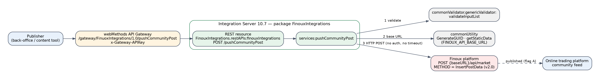
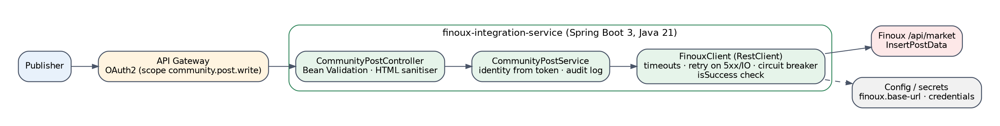
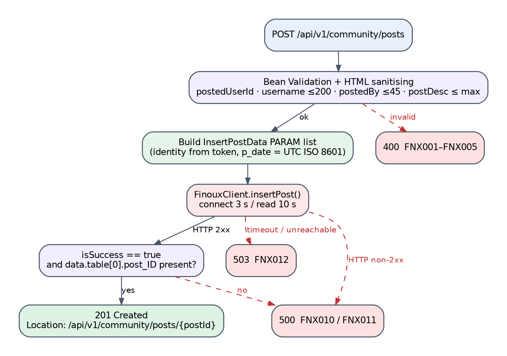

# FinouxIntegrations Package — API Design & Migration Specification

_webMethods Integration Server 10.7 → Java 21 / Spring Boot 3 · Al Ramz Middleware Migration · Finoux Community_

| Field | Value |
|---|---|
| Document | FinouxIntegrations-API-Design-Document |
| Version | 0.1 — first draft for review |
| Date | 2 October 2026 |
| Source | IS package export `FinouxIntegrations.zip` (1 REST Flow service, patch of 13 Jan 2026); Confluence space INTEGRATIO |
| Downstream | Finoux community platform (InsertPostData) |
| Status | Draft — proposals in this document are not yet agreed (see Appendix E) |

## Contents

- [1. Overview](#1-overview)
  - [1.1 Purpose](#11-purpose)
  - [1.2 Scope](#12-scope)
  - [1.3 Executive Summary](#13-executive-summary)
- [2. Solution Architecture](#2-solution-architecture)
  - [2.1 As-Built Legacy Architecture](#21-as-built-legacy-architecture)
  - [2.2 End-to-End Journey](#22-end-to-end-journey)
  - [2.3 Target Architecture (Spring Boot)](#23-target-architecture-spring-boot)
  - [2.4 Target Response & Result Model](#24-target-response--result-model)
  - [2.5 Legacy-to-Target Endpoint Map](#25-legacy-to-target-endpoint-map)
- [3. Prerequisites & Static Configuration](#3-prerequisites--static-configuration)
  - [3.1 Integration Server Global Variables](#31-integration-server-global-variables)
  - [3.2 Static / Feature-Flag Configuration](#32-static--feature-flag-configuration)
  - [3.3 Upstream / Downstream Dependencies](#33-upstream--downstream-dependencies)
  - [3.4 Security Notes](#34-security-notes)
- [4. API — Create Community Post (pushCommunityPost)](#4-api--create-community-post-pushcommunitypost)
  - [4.1 Endpoint Summary](#41-endpoint-summary)
  - [4.2 Request Schema](#42-request-schema)
  - [4.3 Business Logic Summary](#43-business-logic-summary)
  - [4.4 Sample Request](#44-sample-request)
  - [4.5 Response Schema](#45-response-schema)
  - [4.6 HTTP Status Code Reference](#46-http-status-code-reference)
  - [4.7 Example Target Response Envelopes](#47-example-target-response-envelopes)
  - [4.8 Target Process Flow (Spring Boot)](#48-target-process-flow-spring-boot)
- [5. Downstream & Back-office Integration APIs](#5-downstream--back-office-integration-apis)
  - [5.1 Finoux InsertPostData](#51-finoux-insertpostdata)
  - [5.2 commonValidator.genericValidator:validateInputList](#52-commonvalidatorgenericvalidatorvalidateinputlist)
- [6. Data Mapping Reference](#6-data-mapping-reference)
  - [6.1 Request → Finoux InsertPostData PARAM](#61-request--finoux-insertpostdata-param)
  - [6.2 Finoux response → target response](#62-finoux-response--target-response)
- [Appendix A — Pseudocode](#appendix-a--pseudocode)
  - [A.1 pushCommunityPost (legacy)](#a1-pushcommunitypost-legacy)
- [Appendix B — Glossary](#appendix-b--glossary)
- [Appendix C — Database DDL](#appendix-c--database-ddl)
- [Appendix D — Source Findings](#appendix-d--source-findings)
- [Appendix E — Open Items & Assumptions](#appendix-e--open-items--assumptions)

## 1. Overview

### 1.1 Purpose

This document reverse-engineers the webMethods Integration Server 10.7 package **FinouxIntegrations** into a migration-ready API specification for Java 21 / Spring Boot 3. The package publishes administrator posts to the **community** section of the online trading platform, which is hosted by the vendor **Finoux**. It records what the legacy Flow does (from `flow.xml`, `node.ndf` and the package manifest, including the January 2026 patch), proposes a RESTful target contract, and lists the defects the migration should not carry forward.

### 1.2 Scope

**In scope**

- REST resource `FinouxIntegrations.restAPIs:finouxIntegrations` with its single operation `POST /pushCommunityPost` → `FinouxIntegrations.services:pushCommunityPost`.
- The outbound call to Finoux `POST {baseURL}/api/market` with `METHOD = InsertPostData`, version 2.0.
- Dependencies on `commonValidator.genericValidator:validateInputList` and `commonUtility` (GUID, static data).
**Out of scope**

- Other community APIs documented on Confluence (e.g. \*getPortfolioPerformance (community)\*) — they live in other packages.
- The \*FINOUX to CRM\* integration (separate Confluence page, not in this package).
- Internals of the external `commonValidator` package — only its observed contract is described.

### 1.3 Executive Summary

The package contains **one Flow service**. It validates four mandatory fields with the shared validator, builds a Finoux `InsertPostData` request (18 fixed parameters plus 6 taken from the request and the clock), reads the Finoux base URL from static data, and POSTs it with `pub.client:http`. Finoux HTTP 200 → the Finoux response body is returned as-is under `response`; any other HTTP status → `402 Request Failed`; any exception → `500 Internal Server Error`. The legacy endpoint always answers HTTP 200.

Patch `pushCommunitPost fix` (13 Jan 2026, release v41, ticket 22405) added the optional `tagSymbol` input (sent as `p_tag_sc_comp_id`) and changed the post timestamp from GMT+4 to GMT — confirmed by diffing the shipped `flow.xml` against the `flow.xml.bak` left in the export.

> [!CAUTION]
> **Key migration notes**
>
> - **Posts are published as ADMIN with caller-supplied identity:** `p_posted_user_flag = ADMIN` and `p_publish_flag = A` are hard-coded, while `postedUserID`, `username` and `postedBy` come from the request body. Anyone holding the gateway key can publish instantly under any name (F-01).
> - **HTML content forwarded unsanitised** — `postDesc` is documented as “HTML supported” and is passed straight to the public community feed (F-02).
> - **Finoux business failures look like success:** an HTTP-200 Finoux response with `isSuccess: false` is returned as `200 OK` (F-03).
> - **No timeout, no authentication, no audit log** on the outbound call (F-04, F-05, F-06).
> - On exceptions the pipeline keeps `lastError` (stack trace, internal URL) and is likely serialised back to the caller (F-07 — verify).

#### 1.3.1 Source Artefacts and References

| Artefact | Detail |
|---|---|
| Package export | `FinouxIntegrations.zip` — build 2025-07-24 15:40 GST, publisher ARC-MWPRD-IS2; patch `pushCommunitPost fix_myBuild_1768309288746` (2026-01-13) |
| Services | `services:pushCommunityPost` (Flow); `flow.xml.bak` = pre-patch version |
| REST resource | `restAPIs:finouxIntegrations` — one operation, POST `/pushCommunityPost` |
| Confluence (INTEGRATIO) | Page \*pushCommunityPost\* (Jul 2025); \*09/01/2026 – Release Note\* v41 (ticket 22405 “Add New parameter in PushCommunityPost Method”) |
| Error-code registry | Confluence \*REST API response codes\* (page 2795896833): `402 – REQUEST FAILED`, `1069 – Validation List Failed`, `1061`/`1063`/`1064` value / length / number validation codes. |

## 2. Solution Architecture

### 2.1 As-Built Legacy Architecture


<p align="center"><em>Figure 2-1 — FinouxIntegrations as-built component view</em></p>

| Colour | Meaning |
|---|---|
| Light blue | Publisher (consumer) and the community feed |
| Amber | API Gateway |
| Green | Flow service in FinouxIntegrations |
| Grey | Shared IS packages |
| Red | External vendor (Finoux) |

The consumer is not identifiable from the source; Confluence describes the API as used “to post news on the community section of the online trading platform”, with admin user codes — i.e. an internal publishing tool or back-office user.

### 2.2 End-to-End Journey

The service has a single downstream system (Finoux); the two shared IS utilities are in-process calls. A separate journey diagram would repeat Figure 2-1 hop for hop, so none is drawn — the numbered edges in Figure 2-1 show the order.

### 2.3 Target Architecture (Spring Boot)


<p align="center"><em>Figure 2-3 — Target component view</em></p>

```
ae.alramz.finoux
 ├─ api           CommunityPostController, dto/CreateCommunityPostRequest, dto/CommunityPostResponse
 ├─ application   CommunityPostService (identity from token, HTML sanitising, audit)
 ├─ client        FinouxClient (RestClient), InsertPostDataRequest builder, FinouxResponse
 └─ config        FinouxProperties (base-url, timeouts, credentials), SecurityConfig, GlobalExceptionHandler
```

### 2.4 Target Response & Result Model

#### 2.4.1 Standard response envelope

| Field | Type | Always present | Meaning |
|---|---|---|---|
| responseCode | String | Yes | Duplicates the HTTP status, e.g. `"201"`. |
| responseMessage | String | Yes | HTTP reason phrase. |
| errorCode | String (nullable) | Yes | `FNX###` for client-input errors only. |
| errorMsg | String (nullable) | Yes | Caller-actionable message. |
| correlationId | String (UUID) | Yes | Echo of `X-Correlation-Id`, generated if absent.<br>_Legacy vs. target field format:_ legacy key `correlationID`, always generated by `GenerateGUID` unless an undeclared `correlationID` is sent in the body. |
| response | Object (nullable) | On success | Created post (see 4.5). |

#### 2.4.2 Service error-code scheme

Prefix **FNX** (confirmed). FNX001–FNX009 client input, FNX010–FNX019 Finoux / backend, FNX090–FNX099 internal client errors. Findings use `F-nn`.

#### 2.4.3 Internal result type

```
sealed interface FinouxResult permits Posted, Rejected, Unavailable {
  record Posted(long postId, OffsetDateTime publishedAt) implements FinouxResult {}
  record Rejected(int httpStatus, String finouxMessage) implements FinouxResult {}   // non-2xx or isSuccess=false
  record Unavailable(Throwable cause) implements FinouxResult {}                    // timeout / connection
}
// replaces the legacy “copy Finoux body into response and set 200” behaviour
```

### 2.5 Legacy-to-Target Endpoint Map

| Legacy (deployed) | Target (proposed) | Success status |
|---|---|---|
| POST /pushCommunityPost (gateway path `/gateway/FinuoxIntegrations/1.0/…`) | POST /api/v1/community/posts | 201 Created |

## 3. Prerequisites & Static Configuration

### 3.1 Integration Server Global Variables

None used.

### 3.2 Static / Feature-Flag Configuration

| Item | Source | Value / behaviour | Target |
|---|---|---|---|
| `FINOUX_API_BASE_URL` | commonUtility static data, application MIDDLEWARE | Base URL; the Flow appends `/api/market`. If missing, the URL becomes `/api/market` and the call fails with an exception → 500. | `finoux.base-url` (validated at start-up) |
| Fixed InsertPostData parameters | literal JSON template in the Flow | `p_posted_user_flag = ADMIN`, `p_publish_flag = A`, `p_posttype_id = 2`, `p_post_id = ""`, 14 parameters `null` | `finoux.post.*` properties; publish flag a business decision |
| Timestamp | `getCurrentDateString` pattern `yyyy-MM-dd'T'HH:mm:ss`, time zone GMT (was GMT+4 before the Jan 2026 patch) | No offset in the string | ISO 8601 with offset (open item: what Finoux expects) |

### 3.3 Upstream / Downstream Dependencies

| Dependency | Use | Criticality (health check) |
|---|---|---|
| Finoux `POST {baseURL}/api/market` | Create the post | Critical |
| `commonValidator.genericValidator:validateInputList` | Mandatory / numeric / length checks; sets `responseCode` / `responseMessage` | Replaced by Bean Validation |
| `commonUtility.services:getStaticData` | Base URL | Replaced by configuration |
| `commonUtility.java:GenerateGUID` | Correlation id | Replaced by filter |

### 3.4 Security Notes

| Aspect | Legacy (as-built) | Target |
|---|---|---|
| Caller authentication | Gateway API key only (`x-Gateway-APIKey`, “to be provided” on Confluence). | OAuth2; scope `community.post.write`; identity from token. |
| Service ACL | `check_internal_acls = no`; manifest has no `listACL`. | Spring Security. |
| Author identity | `postedUserID`, `username`, `postedBy` free-text from the body; flag hard-coded `ADMIN` (F-01). | Derived from the token; role `COMMUNITY_ADMIN` required to post as admin. |
| Outbound authentication | None — only `Content-Type` header is sent to Finoux (F-05). | Vendor-issued credentials / mTLS, stored in a secrets manager. |
| Content | HTML passed through unmodified (F-02). | Allow-list sanitiser (e.g. OWASP Java HTML Sanitizer). |
| Error leakage | `lastError` preserved in the output pipeline (F-07). | Log server-side only. |

## 4. API — Create Community Post (pushCommunityPost)

### 4.1 Endpoint Summary

| Attribute | Value |
|---|---|
| Legacy operation | POST `/pushCommunityPost` → `FinouxIntegrations.services:pushCommunityPost` |
| Gateway URLs (Confluence) | DEV `http://ARC-MWD-API:5555/gateway/FinuoxIntegrations/1.0/pushCommunityPost`; UAT `https://api-uat.alramz.ae/gateway/FinuoxIntegrations/1.0/…`; PROD `https://api.alramz.ae/gateway/FinuoxIntegrations/1.0/…` (note the “Finuox” spelling in the gateway API name) |
| Target operation | POST `/api/v1/community/posts` |
| Success status | 201 Created, `Location: /api/v1/community/posts/{postId}` |
| Downstream | Finoux `POST {baseURL}/api/market`, `METHOD = InsertPostData` |

> [!IMPORTANT]
> **Legacy vs. target endpoint**
>
> Legacy `POST /pushCommunityPost` (verb-named) → target `POST /api/v1/community/posts`. The call creates a post in Finoux and Finoux returns its `post_ID`, so a create on the `posts` collection returning **201** with a `Location` header fits. The synchronous legacy behaviour is kept (no 202).

### 4.2 Request Schema

| Field | Target Type | Required | Description |
|---|---|---|---|
| **Author** |  |  |  |
| `postedUserId` | Long | Derived (legacy: Yes) | Admin user code → `p_posted_user_id`.<br>_Legacy vs. target field format:_ legacy `postedUserID` string; validator flags `isNumeric = Y`, `isOptional = N`. Finoux echoes it as a number (`posted_User_ID: 2`). Target takes it from the token for human callers; accepted in the body only for a trusted service client (open item). |
| `username` | String (≤ 200) | Derived (legacy: Yes) | Admin user name → `p_user_name`.<br>_Legacy vs. target field format:_ validator length 200, mandatory. |
| `postedBy` | String (≤ 45) | Yes | Display name shown on the post → `p_posted_by`.<br>_Legacy vs. target field format:_ validator length 45, mandatory. |
| **Content** |  |  |  |
| `postDesc` | String (HTML, ≤ 10 000 after sanitising) | Yes | Post body → `p_post_desc`.<br>_Legacy vs. target field format:_ legacy: mandatory, no length limit, HTML accepted and forwarded unchanged. The maximum length is a proposal (open item); sanitising is mandatory in the target. |
| `tagSymbol` | String | No | Company tag → `p_tag_sc_comp_id`.<br>_Legacy vs. target field format:_ added by the Jan 2026 patch; set to empty when absent. Despite the name, Finoux receives it as a **company id** (`sc_comp_id`) — whether callers send a ticker or an id is an open item. Not documented on the Confluence page (F-09). |

### 4.3 Business Logic Summary

1. Generate `correlationID` unless one is in the pipeline.
2. Build a validation list: `postedUserID` (mandatory, numeric), `username` (mandatory, length 200), `postedBy` (mandatory, length 45), `postDesc` (mandatory). Default `tagSymbol` to empty.
3. Call `commonValidator.genericValidator:validateInputList`. If the resulting `responseCode` ≠ `200` → clear the pipeline (keeping `correlationID`, `responseCode`, `responseMessage`) and exit with success — the validator’s code and message are returned unchanged.
4. Parse the literal `InsertPostData` v2.0 template (18 parameters) into a document.
5. `datetime` = now, pattern `yyyy-MM-dd'T'HH:mm:ss`, time zone GMT.
6. Append `p_posted_user_id`, `p_user_name`, `p_posted_by`, `p_post_desc`, `p_date`, `p_tag_sc_comp_id` to `PARAM` and serialise to JSON (properly escaped by `documentToJSONString`).
7. Read `FINOUX_API_BASE_URL`; `pub.client:http` POST `%baseURL%/api/market`, `Content-Type: application/json`, no credentials, no timeout.
8. HTTP 200 → parse the body into `response`, set `200 / OK`. Any other status → `402 / Request Failed` (Finoux body discarded).
9. Clear the pipeline (keeping `correlationID`, `responseCode`, `responseMessage`, `response`). CATCH: `500 / Internal Server Error`, pipeline kept with `lastError`.

> [!NOTE]
> **Business-logic observations for the target design**
>
> - **Finoux outcome is not inspected**: the Confluence sample shows Finoux’s own envelope (`isSuccess`, `message`, `statusCode`, `data.table[]`). A 200 with `isSuccess: false` is reported as success. Target treats it as a provider failure (FNX011).
> - **Classification of a Finoux rejection**: Finoux may reject content for reasons the caller could fix (e.g. moderation). Without Finoux’s error catalogue these are treated as backend errors (500, `errorCode` null); if Finoux documents client-actionable codes, they can be mapped to 4xx later (open item).
> - **Immediate publication**: `p_publish_flag = A` and `p_moderation_score` / `p_threshold_score` null — posts skip any moderation. Confirm this is intended for admin posts only.
> - **No retry and no idempotency**: a timeout after Finoux stored the post leads callers to resend and create duplicates. Target sends an idempotency token if Finoux supports one, otherwise does not auto-retry POSTs (open item).
> - No audit trail of who posted what (no SEQDatalust call, unlike other packages).

### 4.4 Sample Request

```http
POST /api/v1/community/posts
Authorization: Bearer <token>
Content-Type: application/json

{
  "postedBy": "admin",
  "postDesc": "<p>Market update: DFM index closes higher</p>",
  "tagSymbol": "1234"
}
```

Legacy body (Confluence): `{"username":"admin","postDesc":"hello worldss","postedBy":"admin","postedUserID":"2"}`.

### 4.5 Response Schema

| Field | Target Type | Description |
|---|---|---|
| envelope | — | See 2.4.1. |
| `response.post` | Object | Created post.<br>_Legacy vs. target field format:_ legacy `response` is the **entire Finoux response** (`type`, `isSuccess`, `data.table[]`, `data.table1[]`, `message`, `statusCode`, `newToken`, `resData`) passed through untyped. The target exposes a stable subset and keeps the vendor shape internal. |
| `postId` | Long | Finoux `data.table[0].post_ID`. |
| `postedUserId` | Long | `posted_User_ID`. |
| `postedBy` | String | `posted_By`. |
| `status` | enum {ACTIVE, …} | `status` (`A`).<br>_Legacy vs. target field format:_ Finoux code values beyond `A` are not known from the source (open item). |
| `createdAt` | OffsetDateTime (ISO 8601) | `created_Dtm`.<br>_Legacy vs. target field format:_ Finoux returns local time without offset (`2025-07-24T16:40:42`); the Jan 2026 patch changed what Al Ramz sends to GMT, so the offset must be agreed with Finoux. |
| `publishedAt` | OffsetDateTime (ISO 8601) | `publish_dtm`. |
| `postType` | String | `posttype` (`2`). |

### 4.6 HTTP Status Code Reference

Legacy transport status: always **HTTP 200** (no `pub.flow:setResponseCode`). “Legacy Error Code” quotes the inner `responseCode — responseMessage` from `flow.xml`, or states that it is passed through from the external validator. The HTTP Status column is the **proposed target** status.

> [!WARNING]
> **Validation codes come from another package**
>
> The four input checks are executed by `commonValidator.genericValidator:validateInputList`, which is not in this export; this Flow only forwards its `responseCode` / `responseMessage`. Confluence documents the result as `1069 — Input Validation Error`. Whether the validator emits `1069` for every rule or the registry’s specific codes (`1061` null/empty, `1063` length, `1064` not a number) cannot be confirmed from this source — open item.

#### 4.6.1 Client Input Errors

| HTTP Status | Service Error Code | Description | Legacy Error Code |
|---|---|---|---|
| 400 Bad Request | FNX001 | `postedUserId` missing or not numeric. | HTTP 200 · validator pass-through; Confluence: 1069 — Input Validation Error |
| 400 Bad Request | FNX002 | `username` missing or longer than 200. | HTTP 200 · validator pass-through; Confluence: 1069 — Input Validation Error |
| 400 Bad Request | FNX003 | `postedBy` missing or longer than 45. | HTTP 200 · validator pass-through; Confluence: 1069 — Input Validation Error |
| 400 Bad Request | FNX004 | `postDesc` missing, empty after sanitising, or longer than the maximum. | HTTP 200 · validator pass-through (missing only); no length or content check in legacy |
| 400 Bad Request | FNX005 | `tagSymbol` not in the expected format — proposed. | — (not validated in legacy) |

#### 4.6.2 Backend / Provider Errors

| HTTP Status | Service Error Code | Description | Legacy Error Code |
|---|---|---|---|
| 500 Internal Server Error | FNX010 | Finoux returned a non-2xx HTTP status. | HTTP 200 · 402 — Request Failed |
| 500 Internal Server Error | FNX011 | Finoux returned 2xx but `isSuccess` is false or no `post_ID`. | HTTP 200 · 200 — OK (failure not detected, F-03) |
| 503 Service Unavailable | FNX012 | Finoux unreachable or timed out. | HTTP 200 · 500 — Internal Server Error |
| 500 Internal Server Error | FNX013 | Unexpected error (mapping, configuration). | HTTP 200 · 500 — Internal Server Error |

<em>`402` is the registry’s “REQUEST FAILED” (parameters valid but the request failed) — it is not a standard HTTP status for this purpose and is replaced by 500 in the target.</em>

### 4.7 Example Target Response Envelopes

Success:

```json
{
  "responseCode": "201",
  "responseMessage": "Created",
  "errorCode": null,
  "errorMsg": null,
  "correlationId": "2afe4a42-44f7-4e12-aae7-df0e42d4d757",
  "response": {
    "post": {
      "postId": 4747,
      "postedUserId": 2,
      "postedBy": "admin",
      "status": "ACTIVE",
      "createdAt": "2025-07-24T16:40:42+04:00",
      "publishedAt": "2025-07-24T16:40:42+04:00",
      "postType": "2"
    }
  }
}
```

Client input error:

```json
{
  "responseCode": "400",
  "responseMessage": "Bad Request",
  "errorCode": "FNX003",
  "errorMsg": "postedBy must be at most 45 characters",
  "correlationId": "2afe4a42-44f7-4e12-aae7-df0e42d4d757"
}
```

Backend / provider error:

```json
{
  "responseCode": "503",
  "responseMessage": "Service Unavailable",
  "errorCode": null,
  "errorMsg": null,
  "correlationId": "2afe4a42-44f7-4e12-aae7-df0e42d4d757"
}
```

### 4.8 Target Process Flow (Spring Boot)


<p align="center"><em>Figure 4-1 — Create community post target flow</em></p>

## 5. Downstream & Back-office Integration APIs

### 5.1 Finoux InsertPostData

> [!NOTE]
> **Internal only (outbound vendor call)**
>
> Called only by pushCommunityPost; never exposed by Al Ramz. Identity: `POST {FINOUX_API_BASE_URL}/api/market`, body `{"METHOD":"InsertPostData","Version":"2.0","PARAM":[{"Key":…,"Value":…}, …]}` — a generic RPC envelope where the operation is named in the body. Target: `FinouxClient.insertPost(InsertPostCommand) : FinouxResult`.

Observed response (Confluence sample): `{ type, isSuccess, data: { table: [ {post_ID, user_name, posted_User_ID, posted_By, post_Desc, like_Counter, follow_Counter, parent_comment_count, share_Counter, ticker_id, is_active, created_Dtm, created_By, modification_Dtm, modified_By, is_deleted, publish_dtm, posted_user_flag, pin_flag, …, status, posttype, contentLanguage} ], table1: [ {flag} ] }, message, statusCode, newToken, resData }`. The presence of `newToken` suggests Finoux supports token-based authentication that Al Ramz does not use (open item).

#### 5.1.1 HTTP Status Code Reference

Finoux’s own error codes are not visible in the source (the Flow only tests for HTTP 200), so the legacy-code column is dropped.

| HTTP Status | Service Error Code | Description |
|---|---|---|
| 201 (endpoint) | — | Finoux HTTP 2xx with `isSuccess = true` and a `post_ID`. |
| 500 (→ FNX010) | FNX090 | Finoux HTTP 4xx / 5xx — status and body logged with the correlation id. |
| 500 (→ FNX011) | FNX091 | Finoux HTTP 2xx with `isSuccess = false` — `message` / `statusCode` logged. |
| 503 (→ FNX012) | FNX092 | Connect / read timeout, DNS or TLS failure. |

### 5.2 commonValidator.genericValidator:validateInputList

> [!NOTE]
> **Internal only (shared IS package)**
>
> Input `inputList[]` of `{key, value, isOptional, isNumeric, length}`; outputs `responseCode` / `responseMessage` (200 when valid). Target: Jakarta Bean Validation annotations on the request DTO (`@NotBlank`, `@Size`, `@Digits`).

#### 5.2.1 HTTP Status Code Reference

Mapped to FNX001–FNX004 (Section 4.6.1). The validator’s own codes are not in this export.

## 6. Data Mapping Reference

### 6.1 Request → Finoux InsertPostData PARAM

| PARAM Key | Legacy value | Source | Target |
|---|---|---|---|
| p_post_id | `""` | literal | literal (new post) |
| p_posted_user_id | `postedUserID` | request | token / service client |
| p_user_name | `username` | request | token |
| p_posted_by | `postedBy` | request | request |
| p_post_desc | `postDesc` | request | request (sanitised) |
| p_date | now, `yyyy-MM-dd'T'HH:mm:ss`, GMT | clock | clock, agreed time zone |
| p_tag_sc_comp_id | `tagSymbol` (empty if absent) | request | request |
| p_posted_user_flag | `ADMIN` | literal | derived from caller role |
| p_publish_flag | `A` | literal | config (business decision) |
| p_posttype_id | `2` | literal | config |
| p_image_nm, p_Image_Height, p_Image_Width | null | literal | null (images not supported — confirm) |
| p_m_title, p_m_desc, p_m_type, p_url, p_y_dataid | null | literal | null (link / media preview not supported) |
| p_is_located, p_categoryname, p_contentLanguage | null | literal | null; `p_contentLanguage` could be set (en / ar) |
| p_moderation_score, p_threshold_score, p_content_flag | null | literal | null (no moderation) |

### 6.2 Finoux response → target response

| Finoux field | Target field |
|---|---|
| data.table[0].post_ID | post.postId |
| data.table[0].posted_User_ID | post.postedUserId |
| data.table[0].posted_By | post.postedBy |
| data.table[0].status | post.status |
| data.table[0].created_Dtm / publish_dtm | post.createdAt / post.publishedAt |
| data.table[0].posttype | post.postType |
| isSuccess, message, statusCode | internal (FinouxResult) |
| all other fields | not exposed |

## Appendix A — Pseudocode

### A.1 pushCommunityPost (legacy)

```
correlationID = correlationID ?: GUID()
r = validateInputList([postedUserID: mandatory numeric, username: mandatory len 200, postedBy: mandatory len 45, postDesc: mandatory])
if r.responseCode != "200": return {correlationID, r.responseCode, r.responseMessage}
doc = parse(TEMPLATE_InsertPostData_v2)                // 18 fixed PARAMs
doc.PARAM += [p_posted_user_id, p_user_name, p_posted_by, p_post_desc, p_date=now(GMT), p_tag_sc_comp_id=tagSymbol ?: ""]
url = getStaticData("FINOUX_API_BASE_URL") + "/api/market"
res = http.post(url, toJson(doc), headers={Content-Type: application/json})   // no auth, no timeout
if res.status == 200: return {correlationID, "200", "OK", response: parse(res.body)}
else:                  return {correlationID, "402", "Request Failed"}
on exception:          return {correlationID, "500", "Internal Server Error", lastError}
```

## Appendix B — Glossary

| Term | Meaning |
|---|---|
| Finoux | Vendor hosting the online trading platform front-end, including the community feed. |
| Community post | A message shown in the trading platform’s community section; here posted by an administrator. |
| InsertPostData | Finoux RPC method that creates a post. |
| sc_comp_id | Security / company identifier used to tag a post to a listed company. |
| Publish flag `A` | Post is active / published immediately. |

## Appendix C — Database DDL

Not applicable — the package has no JDBC adapters and no database access. All persistence happens inside Finoux.

## Appendix D — Source Findings

| ID | Severity | Finding | Target action |
|---|---|---|---|
| F-01 | High | Author identity (`postedUserID`, `username`, `postedBy`) comes from the request body while the post is hard-coded as `ADMIN` and published immediately (`A`) — any holder of the gateway key can publish as any admin. | Identity from token; role check. |
| F-02 | High | `postDesc` HTML forwarded unsanitised to a public feed (stored-XSS risk depends on Finoux rendering). | Server-side allow-list sanitising. |
| F-03 | Medium | Finoux’s `isSuccess` is ignored; a business failure inside HTTP 200 is returned as `200 OK`. | Check `isSuccess` and `post_ID`. |
| F-04 | Medium | `pub.client:http` without timeout — a slow Finoux holds IS threads indefinitely. | Connect / read timeouts, circuit breaker. |
| F-05 | Medium | No authentication on the outbound call; only network position protects the Finoux endpoint. | Vendor credentials / mTLS. |
| F-06 | Medium | No audit logging (no SEQDatalust) and Finoux error bodies are discarded on non-200. | Structured audit + error logging. |
| F-07 | Medium (verify) | CATCH keeps `lastError` in the preserved pipeline; IS REST output typically serialises the whole pipeline, exposing stack traces / internal URLs to the caller. | Never return exception detail. |
| F-08 | Low | `402 Request Failed` and HTTP-200 transport for all outcomes. | Proper HTTP statuses. |
| F-09 | Low | Confluence page lacks `tagSymbol` (added Jan 2026) and spells the gateway API “FinuoxIntegrations”; `tagSymbol` is sent as a company id despite its name. | Update docs; clarify field. |
| F-10 | Low | Post timestamp sent without offset; time zone changed from GMT+4 to GMT in the Jan 2026 patch, while Finoux returns local-looking times. | Agree ISO 8601 with offset. |
| F-11 | Low | Missing `FINOUX_API_BASE_URL` silently produces a relative URL and a 500. | Fail fast at start-up. |

## Appendix E — Open Items & Assumptions

| # | Item | Type |
|---|---|---|
| 1 | Endpoint rename to `POST /api/v1/community/posts` with 201. | Decision |
| 2 | Exact codes emitted by `commonValidator.validateInputList` (1069 vs 1061 / 1063 / 1064). | Verify |
| 3 | Whether `postedUserId` / `username` may still be supplied by a trusted service client, or always come from the token. | Decision |
| 4 | Maximum `postDesc` length and the allowed HTML tags. | Decision |
| 5 | `tagSymbol` semantics (ticker vs `sc_comp_id`) and validation. | Verify |
| 6 | Finoux authentication options (`newToken` in responses), error catalogue, idempotency support, and expected time zone for `p_date`. | Vendor |
| 7 | Whether admin posts should bypass moderation (`p_publish_flag = A`). | Business |
| 8 | F-07: confirm whether `lastError` reaches the REST caller today. | Verify |
| 9 | Mapping of Finoux rejections to 4xx once Finoux documents client-actionable errors. | Decision |
