# FITIntegrations — API Documentation & Migration Guide

*Al Ramz Capital — Middleware Migration Programme*

Client, market-data, share-transfer and consent services on Broker Insight — webMethods Integration Server to Azure / Spring Boot


## Document Control


| Attribute | Detail |
|---|---|
| Package | `FITIntegrations` (manifest v1.0, description `Algo_WA_`; created 07-07-2022; last patch recorded 21-05-2026) |
| Scope of source analysed | All 19 Flow services, all 34 JDBC adapters, the 3 document types under `documents/` (plus 2 empty REST document types), the 2 REST resources (`tradingCatalog`, `tradingCatalog2`), the REST API descriptor `tradingCatalog_rad` and the package configuration. The 6 `flow.xml.bak` files are stale Designer backups that Integration Server never loads; they were not used as evidence. |
| Related documents | `Error-Code-to-HTTP-Status-Mapping` — the shared legacy-code registry used for every HTTP status in this document. `DFM-Onboarding-API-Documentation` — owns the DFM onboarding-request data that the client-profile API reads (§4.3). `CurrencyIntegration-API-Documentation` — the source of the programme's "no data is an error" decision applied here (§1.3). |
| Target platform | Java 21 · Spring Boot 3.x · Azure API Management with OAuth2 in front · Azure Key Vault for database credentials |
| Document version | v1.0 |
| Change history | v1.0 — first issue (30-09-2026). |

> **A note on credentials and personal data**
>
> No database credential appears in the package: every adapter refers to a connection alias (`RMZ:RMZ`, `MiddlewareConnection:Middleware`) defined on the server, and the `overrideCredentials` inputs are never mapped. The REST descriptor `tradingCatalog_rad` carries an internal production host name; it is deliberately not reproduced here.
>
> All sample values in this document — names, identifiers, e-mail addresses, IBANs, prices — are invented. No customer data was copied from the source.


## Table of Contents


- [1. Overview](#1-overview)
  - [1.1 Purpose](#11-purpose)
  - [1.2 Scope](#12-scope)
  - [1.3 Executive summary](#13-executive-summary)
- [2. Solution Architecture](#2-solution-architecture)
  - [2.1 As-built service flow](#21-as-built-service-flow)
  - [2.2 End-to-end journey](#22-end-to-end-journey)
  - [2.3 Target architecture (Spring Boot)](#23-target-architecture-spring-boot)
  - [2.4 Target response and result model](#24-target-response-and-result-model)
- [3. Prerequisites & Static Configuration](#3-prerequisites-static-configuration)
  - [3.1 Integration Server global variables](#31-integration-server-global-variables)
  - [3.2 Static and feature-flag configuration](#32-static-and-feature-flag-configuration)
  - [3.3 Upstream and downstream dependencies](#33-upstream-and-downstream-dependencies)
  - [3.4 Security notes](#34-security-notes)
- [4. API — Get Client Profile](#4-api-get-client-profile)
  - [4.1 Endpoint summary](#41-endpoint-summary)
  - [4.2 Request schema](#42-request-schema)
  - [4.3 Business logic summary](#43-business-logic-summary)
  - [4.4 Sample request](#44-sample-request)
  - [4.5 Response schema](#45-response-schema)
  - [4.6 HTTP status code reference](#46-http-status-code-reference)
  - [4.7 Example target response envelopes](#47-example-target-response-envelopes)
  - [4.8 Target process flow (Spring Boot)](#48-target-process-flow-spring-boot)
- [5. API — List Market Indices](#5-api-list-market-indices)
  - [5.1 Endpoint summary](#51-endpoint-summary)
  - [5.2 Request schema](#52-request-schema)
  - [5.3 Business logic summary](#53-business-logic-summary)
  - [5.4 Sample request](#54-sample-request)
  - [5.5 Response schema](#55-response-schema)
  - [5.6 HTTP status code reference](#56-http-status-code-reference)
  - [5.7 Example target response envelopes](#57-example-target-response-envelopes)
  - [5.8 Target process flow (Spring Boot)](#58-target-process-flow-spring-boot)
- [6. API — Search Securities](#6-api-search-securities)
  - [6.1 Endpoint summary](#61-endpoint-summary)
  - [6.2 Request schema](#62-request-schema)
  - [6.3 Business logic summary](#63-business-logic-summary)
  - [6.4 Sample request](#64-sample-request)
  - [6.5 Response schema](#65-response-schema)
  - [6.6 HTTP status code reference](#66-http-status-code-reference)
  - [6.7 Example target response envelopes](#67-example-target-response-envelopes)
  - [6.8 Target process flow (Spring Boot)](#68-target-process-flow-spring-boot)
- [7. API — Get Security Closing Prices by Interval](#7-api-get-security-closing-prices-by-interval)
  - [7.1 Endpoint summary](#71-endpoint-summary)
  - [7.2 Request schema](#72-request-schema)
  - [7.3 Business logic summary](#73-business-logic-summary)
  - [7.4 Sample request](#74-sample-request)
  - [7.5 Response schema](#75-response-schema)
  - [7.6 HTTP status code reference](#76-http-status-code-reference)
  - [7.7 Example target response envelopes](#77-example-target-response-envelopes)
  - [7.8 Target process flow (Spring Boot)](#78-target-process-flow-spring-boot)
- [8. API — Get Instrument Close Prices by Date](#8-api-get-instrument-close-prices-by-date)
  - [8.1 Endpoint summary](#81-endpoint-summary)
  - [8.2 Request schema](#82-request-schema)
  - [8.3 Business logic summary](#83-business-logic-summary)
  - [8.4 Sample request](#84-sample-request)
  - [8.5 Response schema](#85-response-schema)
  - [8.6 HTTP status code reference](#86-http-status-code-reference)
  - [8.7 Example target response envelopes](#87-example-target-response-envelopes)
  - [8.8 Target process flow (Spring Boot)](#88-target-process-flow-spring-boot)
- [9. API — Get Market Watch](#9-api-get-market-watch)
  - [9.1 Endpoint summary](#91-endpoint-summary)
  - [9.2 Request schema](#92-request-schema)
  - [9.3 Business logic summary](#93-business-logic-summary)
  - [9.4 Sample request](#94-sample-request)
  - [9.5 Response schema](#95-response-schema)
  - [9.6 HTTP status code reference](#96-http-status-code-reference)
  - [9.7 Example target response envelopes](#97-example-target-response-envelopes)
  - [9.8 Target process flow (Spring Boot)](#98-target-process-flow-spring-boot)
- [10. API — List Customers Changed on a Date](#10-api-list-customers-changed-on-a-date)
  - [10.1 Endpoint summary](#101-endpoint-summary)
  - [10.2 Request schema](#102-request-schema)
  - [10.3 Business logic summary](#103-business-logic-summary)
  - [10.4 Sample request](#104-sample-request)
  - [10.5 Response schema](#105-response-schema)
  - [10.6 HTTP status code reference](#106-http-status-code-reference)
  - [10.7 Example target response envelopes](#107-example-target-response-envelopes)
  - [10.8 Target process flow (Spring Boot)](#108-target-process-flow-spring-boot)
- [11. API — List Share-Transfer Requests](#11-api-list-share-transfer-requests)
  - [11.1 Endpoint summary](#111-endpoint-summary)
  - [11.2 Request schema](#112-request-schema)
  - [11.3 Business logic summary](#113-business-logic-summary)
  - [11.4 Sample request](#114-sample-request)
  - [11.5 Response schema](#115-response-schema)
  - [11.6 HTTP status code reference](#116-http-status-code-reference)
  - [11.7 Example target response envelopes](#117-example-target-response-envelopes)
  - [11.8 Target process flow (Spring Boot)](#118-target-process-flow-spring-boot)
- [12. API — Process a Share Transfer](#12-api-process-a-share-transfer)
  - [12.1 Endpoint summary](#121-endpoint-summary)
  - [12.2 Request schema](#122-request-schema)
  - [12.3 Business logic summary](#123-business-logic-summary)
  - [12.4 Sample request](#124-sample-request)
  - [12.5 Response schema](#125-response-schema)
  - [12.6 HTTP status code reference](#126-http-status-code-reference)
  - [12.7 Example target response envelopes](#127-example-target-response-envelopes)
  - [12.8 Target process flow (Spring Boot)](#128-target-process-flow-spring-boot)
- [13. API — Record a Margin-Trading Consent](#13-api-record-a-margin-trading-consent)
  - [13.1 Endpoint summary](#131-endpoint-summary)
  - [13.2 Request schema](#132-request-schema)
  - [13.3 Business logic summary](#133-business-logic-summary)
  - [13.4 Sample request](#134-sample-request)
  - [13.5 Response schema](#135-response-schema)
  - [13.6 HTTP status code reference](#136-http-status-code-reference)
  - [13.7 Example target response envelopes](#137-example-target-response-envelopes)
  - [13.8 Target process flow (Spring Boot)](#138-target-process-flow-spring-boot)
- [14. API — Record Insider-Trading Consents](#14-api-record-insider-trading-consents)
  - [14.1 Endpoint summary](#141-endpoint-summary)
  - [14.2 Request schema](#142-request-schema)
  - [14.3 Business logic summary](#143-business-logic-summary)
  - [14.4 Sample request](#144-sample-request)
  - [14.5 Response schema](#145-response-schema)
  - [14.6 HTTP status code reference](#146-http-status-code-reference)
  - [14.7 Example target response envelopes](#147-example-target-response-envelopes)
  - [14.8 Target process flow (Spring Boot)](#148-target-process-flow-spring-boot)
- [15. Downstream & Internal Services](#15-downstream-internal-services)
  - [15.1 List banks — `services:getBank`](#151-list-banks-servicesgetbank)
  - [15.2 List custodians — `services:getCustodians`](#152-list-custodians-servicesgetcustodians)
  - [15.3 List exchanges — `services:getExchangeInformation`](#153-list-exchanges-servicesgetexchangeinformation)
  - [15.4 List markets — `services:getMarkets`](#154-list-markets-servicesgetmarkets)
  - [15.5 Insert one insider-trading consent — `v2.wrapper:createInsiderTradingConsent`](#155-insert-one-insider-trading-consent-v2wrappercreateinsidertradingconsent)
  - [15.6 Scheduled job — expired-KYC report — `schedulers:sendKYCExpiredClientsToCS`](#156-scheduled-job-expired-kyc-report-schedulerssendkycexpiredclientstocs)
  - [15.7 Scheduled job — onboarding audit report — `schedulers:sendOnboardingAuditLog`](#157-scheduled-job-onboarding-audit-report-schedulerssendonboardingauditlog)
  - [15.8 Adapters with no caller](#158-adapters-with-no-caller)
- [16. Data Mapping Reference](#16-data-mapping-reference)
  - [16.1 Client profile — Broker Insight to target](#161-client-profile-broker-insight-to-target)
  - [16.2 Decode rules](#162-decode-rules)
- [Appendix](#appendix)
  - [A. Pseudocode (as built)](#a-pseudocode-as-built)
  - [B. Findings register](#b-findings-register)
  - [C. Persistence, SQL and type mapping](#c-persistence-sql-and-type-mapping)
  - [D. Service error-code catalogue](#d-service-error-code-catalogue)
  - [E. Open items](#e-open-items)
  - [F. Glossary](#f-glossary)


# 1. Overview


## 1.1 Purpose


`FITIntegrations` is the middleware façade over **Broker Insight** — the Oracle back-office database (JDBC alias `RMZ:RMZ`, schema `INSIGHT`) that holds Al Ramz's clients, sub-accounts, securities, prices, market-watch data, consents and share-transfer requests. "FIT number" throughout is the Broker Insight main-client identifier, `CB_MAIN_CLIENT.CL_MAIN_CLIENT_ID`.

The package exposes twelve REST operations over two REST resources, and runs two scheduled e-mail reports. Apart from reading one table owned by the DFM onboarding package and sending e-mails through the shared notification service, every operation is a query, stored-procedure call or insert against Broker Insight.


## 1.2 Scope


**In scope:**

- The twelve REST-exposed operations, documented as eleven target APIs — the two versions of `getClientInformation` become one API (Chapter 4). Chapters 4–14.
- The one internal wrapper service, the four Flow services that exist but are not REST-exposed (`getBank`, `getCustodians`, `getExchangeInformation`, `getMarkets`), the two scheduled jobs, and the thirteen adapters that nothing calls (Chapter 15).
- Data mapping from Broker Insight columns to target fields (Chapter 16); pseudocode, findings, SQL and DDL traceability, glossary and open items (Appendix).

**Out of scope:**

- The shared packages this one calls but does not contain — `commonUtility`, `commonValidator`, `DirectFN`, `Notifications`, `SEQDatalust`, `eTradeFIT.common` and `DFMIntegrations`. Their behaviour is described only through the inputs and outputs these flows use, and is marked **NOT DETERMINABLE** where it matters.
- The bodies of the Broker Insight stored procedures and functions (`GET_RMS_CUST_INFO`, `SP_GET_AUTO_SHARE_TRANSFER_REQUESTS`, `SP_PROCESS_AUTO_SHARE_TRANSFER`, `insight.cryptor`, `rmz.totalCommPercWDis`). They live in the database and are called unchanged by the target.
- Scheduler trigger definitions (interval, time, run-as user). Integration Server stores them outside packages.


## 1.3 Executive summary


The package is twelve independent request/response services with no shared state beyond the database. Migration is therefore mostly a **re-implementation of queries with a proper contract**, not a re-design. The work that matters is in four areas:

1. **Close three SQL-injection holes before anything else** (FT-01, FT-02, FT-03). Three operations splice caller input into SQL text through webMethods DynamicSQL adapters: symbol search, symbol closing prices and client profile v2. All three are reachable by any caller that can reach the REST resources. Every target query uses bound parameters only.
2. **Put an authorization boundary in front of personal data** (FT-05, FT-06). The client-profile API returns decrypted tax identification numbers, IBANs, identity documents and dates of birth for any `userCode` or FIT number supplied; nothing in the package checks who is asking, and v2 writes every full response to the log store (v1 on the caller's request). The target puts the API behind OAuth2 scopes and masks sensitive fields in logs.
3. **Give every outcome a real HTTP status** (FT-07). Today every response, including database failures, is transport `200` with the outcome in a string `responseCode`. The target maps every legacy code through the shared registry.
4. **Decide on contract changes the legacy services force** — most visibly, v1 and v2 of the client profile encode the same fields differently (FT-17), and several services return field names that differ from their declared signatures (FT-21). Chapter 4 recommends the v2 encoding; the open items list what needs a business decision.

> **Key migration notes**
>
> **No data is an error, following the registry.** Every legacy `1012 No Data Available`, `1034` and `1122` maps to `404 Not Found` with a populated `errorCode`, as the shared registry specifies and as the API owner decided for `CurrencyIntegration` (v1.1). This includes search-style endpoints. For the batch price look-ups, `404` is returned only when **no** requested item has data; partial results are `200` with a per-item status. Two endpoints where an empty result is a normal daily occurrence — customers changed on a date and share-transfer requests for a date — are flagged for confirmation (Appendix E, items 1–2).
>
> **One error-code prefix for the package: `TRC`** (from the legacy resource name `tradingCatalog`). Client-input codes are allocated in blocks of ten per API (`TRC001`–`TRC109`); backend codes, which are logged but never returned, are shared `TRC9xx` codes. The prefix does not collide with any prefix already used in the programme (ONB, AUP, CFE, CIS, CLD, CON, FBT, FBU, LIT, LIU, GMU, APU, SLU, RMG, CBR, IBV, VPH, DMS, CDP, FXR). Findings use the visually distinct prefix `FT-`.
>
> **Legacy paths stay reachable during transition.** Each chapter gives the legacy `POST /<operation>` path. Azure API Management routes it to a deprecated legacy-shape adapter in the new service so existing consumers see no change while they move to the target paths (§2.3).
>
> **Transport HTTP 200 today.** Legacy error codes in this document are the body's `responseCode`, taken from each `flow.xml`.


# 2. Solution Architecture


## 2.1 As-built service flow


Figure 1 shows each REST operation, the Flow service behind it, and what that service reaches. The three services shaded red are the ones with SQL-injection findings. `tradingCatalog_rad` is a REST API descriptor with an empty resource list; it exposes nothing and is omitted.

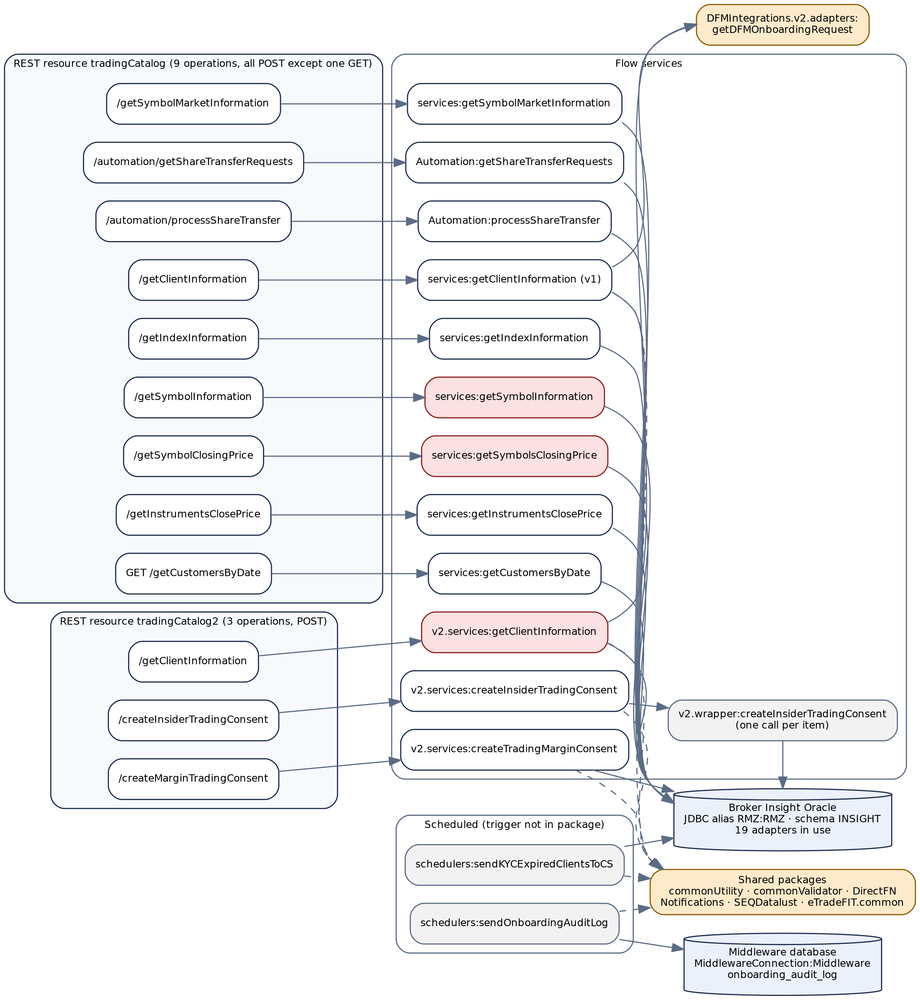

*Figure 1 — As-built: REST operations, Flow services and the systems they reach*

| Legacy operation | Resource | Flow service | Target API (chapter) |
|---|---|---|---|
| `POST /getClientInformation` | `tradingCatalog` | `services:getClientInformation` (v1) | Client profile (4) |
| `POST /getClientInformation` | `tradingCatalog2` | `v2.services:getClientInformation` | Client profile (4) |
| `POST /getIndexInformation` | `tradingCatalog` | `services:getIndexInformation` | Market indices (5) |
| `POST /getSymbolInformation` | `tradingCatalog` | `services:getSymbolInformation` | Securities (6) |
| `POST /getSymbolClosingPrice` | `tradingCatalog` | `services:getSymbolsClosingPrice` | Security closing prices by interval (7) |
| `POST /getInstrumentsClosePrice` | `tradingCatalog` | `services:getInstrumentsClosePrice` | Instrument close prices by date (8) |
| `POST /getSymbolMarketInformation` | `tradingCatalog` | `services:getSymbolMarketInformation` | Market watch (9) |
| `GET /getCustomersByDate` | `tradingCatalog` | `services:getCustomersByDate` | Customers changed on a date (10) |
| `POST /automation/getShareTransferRequests` | `tradingCatalog` | `services.Automation:getShareTransferRequests` | Share-transfer requests (11) |
| `POST /automation/processShareTransfer` | `tradingCatalog` | `services.Automation:processShareTransfer` | Process a share transfer (12) |
| `POST /createMarginTradingConsent` | `tradingCatalog2` | `v2.services:createTradingMarginConsent` | Margin-trading consent (13) |
| `POST /createInsiderTradingConsent` | `tradingCatalog2` | `v2.services:createInsiderTradingConsent` | Insider-trading consents (14) |

Both REST resources are legacy URL-template resources. Integration Server decodes the JSON body into top-level pipeline variables and serialises what is left of the pipeline as the response. The absolute URL prefix depends on the server's REST directive and any gateway in front of it, so it is **NOT DETERMINABLE** from the package; paths in this document are relative to the resource.


## 2.2 End-to-end journey


Figure 2 places the package among every system it touches. There is no outbound HTTP integration: all data comes from Broker Insight, the Middleware database and the DFM onboarding data (whose connection is defined outside the package), and the only side effects outside Broker Insight are e-mails and log records.

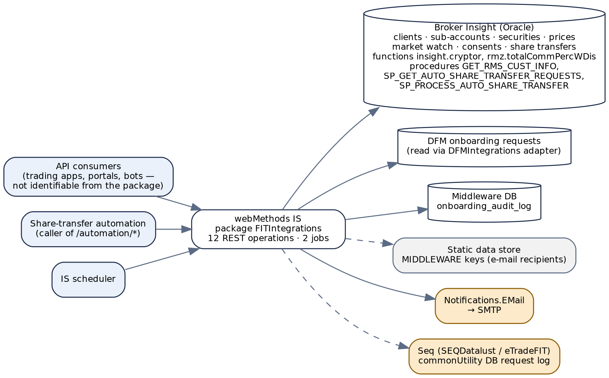

*Figure 2 — End-to-end journey: callers, Integration Server, data stores and shared services*

Who calls the REST operations cannot be determined from the package: no consumer is named and no ACL is declared. Operation names suggest trading front-ends (market data, client profile), an onboarding or portal flow (consents) and a robotic-process caller (`/automation/*`). Appendix E item 12 asks for the consumer list, which the cut-over plan needs.


## 2.3 Target architecture (Spring Boot)


The target is one service, `fit-integration-service`, behind Azure API Management. Controllers are grouped by business area; each owns validation and status mapping for its APIs; repositories use `JdbcClient` and `SimpleJdbcCall` with bound parameters only. The two scheduled jobs move into the same service, guarded by ShedLock so that only one instance runs each job.

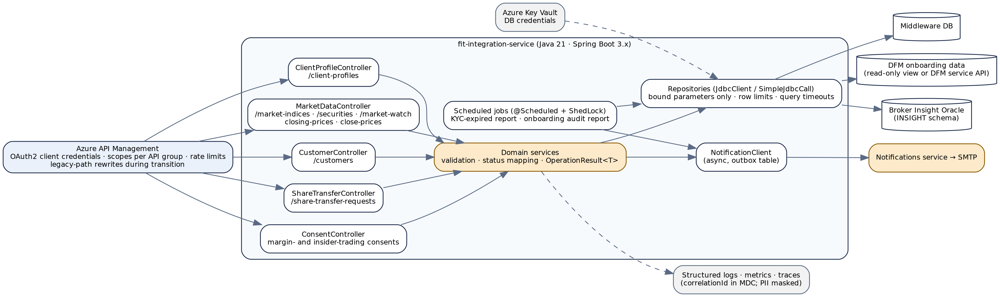

*Figure 3 — Target Spring Boot architecture*

| Legacy component | Target component | Note |
|---|---|---|
| REST resources `tradingCatalog`, `tradingCatalog2` | Five `@RestController`s under `/api/v1` | Noun-based paths (§4.1 … §14.1). APIM keeps the twelve legacy paths as rewrites to `LegacyFitController`, which returns the legacy body shapes until consumers migrate, then is removed. |
| JDBC adapters on `RMZ:RMZ` (CustomSQL, Select, DynamicSQL, StoredProcedure, Insert) | `*Repository` classes over `JdbcClient` / `SimpleJdbcCall` | The three called DynamicSQL adapters on `RMZ:RMZ` become fixed SQL (two more are uncalled, §15.8) with optional predicates and bound parameters. Every query gets a timeout; list queries get paging. |
| `MiddlewareConnection:Middleware` adapter | Second `DataSource` (`middlewareDataSource`) | Used only by the onboarding audit job. |
| `DFMIntegrations.v2.adapters:getDFMOnboardingRequest` | `DfmOnboardingStatusClient` | A read-only view granted to this service, or a call to the DFM onboarding service once that is migrated. One column is used (§4.3). |
| `commonValidator.genericValidator:validateInputList`, `pub.schema:validate` | Jakarta Bean Validation on request records | Validation failures become `400` with a `TRC` code. The validator's own `1069` / `1061` texts are no longer returned. |
| `commonUtility.java:asyncInvoke` → `Notifications.EMail.services:sendEmail` | `NotificationClient` fed from an outbox table | Consent insert and e-mail request commit together; delivery is retried from the outbox (§13.3). |
| `commonUtility.services:getStaticData` (MIDDLEWARE keys) | `FitIntegrationProperties` (`@ConfigurationProperties`) | Report recipients (§3.2). |
| `SEQDatalust.services:asynchronousIngestion`, `eTradeFIT.common.services:logReqResToSeq`, `commonUtility.services:logRequest`/`logResponse` | Structured JSON logging with the correlation id in the MDC; PII masking filter | No request or response body is logged in full (FT-06). |
| IS scheduler triggers | `@Scheduled` + ShedLock | Cron expressions come from configuration; the current trigger times are an open item. |

> **Legacy-path compatibility**
>
> Each legacy operation remains available at its legacy path through APIM, backed by `LegacyFitController`, which calls the same domain services and renders the **legacy** body: transport `200`, legacy `responseCode` / `responseMessage`, legacy field names and encodings. It exists only for the transition; it inherits the target's validation and bound parameters, so the security fixes reach legacy callers on day one.
>
> Where a legacy behaviour is itself the defect (for example an injected WHERE clause, or v1's `selectedProducts` bug, FT-16), the adapter does **not** reproduce it.


## 2.4 Target response and result model


Public APIs return the standard envelope — `correlationID`, `responseCode`, `responseMessage`, `errorCode`, `errorMsg`, `response` — described in each chapter's Response Schema. Internal calls between domain services, repositories and clients use a typed result instead of the legacy pattern of inspecting a string `responseCode` and then reading an untyped `response` record.

```
public record OperationResult<T>(
        boolean success,
        T       data,              // null unless success
        String  failureCode,       // TRC9xx, for logging and metrics
        String  failureDetail) {   // server-side only; never returned to an API caller

    public static <T> OperationResult<T> ok(T data) { ... }
    public static <T> OperationResult<T> failed(String code, String detail) { ... }
}

// Examples of internal contracts that replace legacy pipeline conventions
interface DfmOnboardingStatusClient {
    /** Replaces reading results[0]/ACCOUNT_STATUS from the external DFM adapter (first row). */
    OperationResult<Optional<DfmAccountStatus>> findStatus(long userCode);
}
interface ShareTransferRepository {
    /** Replaces the PRES / PDOCN output pair; the caller maps the outcome to HTTP. */
    OperationResult<ShareTransferOutcome> process(long requestId, TransferDecision decision);
}
record ShareTransferOutcome(ProcessResult result, Long documentNumber) {}
enum ProcessResult { PROCESSED, REQUEST_NOT_FOUND, UNHANDLED_ERROR, JV_CREATION_FAILED,
                     INVOICE_ALREADY_EXISTS, BP_UPDATE_FAILED, UNKNOWN }
```

`OperationResult` is internal only. It is never serialised to an API caller; the controller maps it to the envelope and an HTTP status.


# 3. Prerequisites & Static Configuration


## 3.1 Integration Server global variables


**None.** The package's `config/` directory is empty, and every `MAPSET` in every in-scope flow has `GLOBALVARIABLES="false"`. No `%global%` substitution exists.


## 3.2 Static and feature-flag configuration


The only runtime configuration read from outside the package is four static-data keys, all under application `MIDDLEWARE`, read by the two scheduled jobs through `commonUtility.services:getStaticData`. Their values (e-mail addresses) are held in the static-data store, not in the package.

| Static-data key (application `MIDDLEWARE`) | Read by | Purpose | Target property |
|---|---|---|---|
| `EXPIRED_KYC_USERS_REPORT_TO_EMAIL` | `schedulers:sendKYCExpiredClientsToCS` | `to` of the expired-KYC report | `fit.reports.kyc-expired.to` |
| `EXPIRED_KYC_USERS_REPORT_CC_EMAIL` | same | `cc` of the expired-KYC report | `fit.reports.kyc-expired.cc` |
| `ONBOARDING_AUDIT_LOG_TO_EMAIL` | `schedulers:sendOnboardingAuditLog` | `to` of the onboarding audit report | `fit.reports.onboarding-audit.to` |
| `ONBOARDING_AUDIT_LOG_CC_EMAIL` | same | `cc` of the onboarding audit report | `fit.reports.onboarding-audit.cc` |

Whether each value is a single address or a delimited list is **NOT DETERMINABLE**; the target properties are `List<String>` and the migration copies the current values. The e-mail templates referenced by name are owned by the `Notifications` package:

| Template name | Used by | Inputs supplied |
|---|---|---|
| `POST_LEVERAGE_TRADE_NOTIFICATION` | Margin-trading consent, status `A` only (§13.3) | `to`, `language='EN'`. No placeholders. |
| `EXPIRED_KYC_USERS_REPORT` | Expired-KYC report job (§15.6) | `to`, `cc`, `language='EN'`, one `.xls` attachment. |
| `FAILED_ONBOARDING_AUDIT_LOG` | Onboarding audit report job (§15.7) | `to`, `cc`, `language='EN'`, one `.xls` attachment, seven positional placeholders. |

Hard-coded values that are really configuration and move to properties in the target:

| Value in source | Where | Target property |
|---|---|---|
| Exchange list `'ADSM','DFM','TDWL','BHB','MSX','DSM','NYSE','NSDQ'` | `getSymbolInformation` adapter SQL | `fit.securities.exchanges` |
| Market codes `'5','6','8','11','12','13'` | `getExchangeMaster` adapter SQL | `fit.markets.codes` |
| Excluded sub-account types `11,12,17,18,20,21,22,23,24` | `getClientSubAccountInformation` SQL | `fit.client-profile.excluded-sub-account-types` |
| Commission market codes ADX=6, DFM=5, TDWL=11, DIFX=8, MSX=13, BHB=12 | `getClientSubAccountInformation` SQL | `fit.client-profile.fee-markets` |
| KYC overdue threshold `30` days | `getKYCExpiredClientsForCS` SQL | `fit.reports.kyc-expired.overdue-days` |
| Timezone `GMT+4` | Timestamps in most flows | `fit.zone=Asia/Dubai` (a zone ID, not a fixed offset) |


## 3.3 Upstream and downstream dependencies


Candidate health-check dependencies for the target service:

| Dependency | Legacy access | Used by | Target / health check |
|---|---|---|---|
| Broker Insight Oracle, schema `INSIGHT` (and `RMZ` for `rmz.totalCommPercWDis`, `RMZ.DWH_SECTORS`) | JDBC connection alias `RMZ:RMZ` (defined on the server) | Every REST operation, the KYC job | Primary `DataSource`; readiness probe `SELECT 1 FROM DUAL`. **Critical.** |
| Middleware database, table `onboarding_audit_log` | `MiddlewareConnection:Middleware` | Onboarding audit job only | Secondary `DataSource`; not part of API readiness. |
| DFM onboarding requests | `DFMIntegrations.v2.adapters:getDFMOnboardingRequest` (external package; SQL and connection **NOT DETERMINABLE**) | Client profile (both versions) | `DfmOnboardingStatusClient`; degraded, not failed, if unavailable — see §4.3 observation. |
| Notification service (`Notifications.EMail.services:sendEmail`) → SMTP | Flow invoke (sync for the jobs, `asyncInvoke` for the margin consent) | Margin consent, both jobs | `NotificationClient`; outbox drains retried; not part of API readiness. |
| Static data store | `commonUtility.services:getStaticData` | Both jobs | Replaced by configuration properties. |
| Log store (Seq) | `SEQDatalust`, `eTradeFIT.common`, `commonUtility` DB logging | Most services | Platform log pipeline. |

Database objects the target must be granted — the complete list, with source traceability, is in Appendix C.


## 3.4 Security notes


| Aspect | Legacy | Target |
|---|---|---|
| Authentication | Nothing in the package. Both REST resources have `is_public=false`, but the IS ACLs on them, and any gateway in front, are **NOT DETERMINABLE** from the export. | APIM validates an OAuth2 client-credentials token on every call. |
| Authorization | Every service has `check_internal_acls=no`; the manifest `listACL` is null. No flow checks who the caller is or whether it may see the client asked for. | Scopes per API group: `fit.client-profile.read`, `fit.client-profile.read-sensitive`, `fit.market-data.read`, `fit.customers.read`, `fit.share-transfer.read`, `fit.share-transfer.process`, `fit.consents.write`. |
| Sensitive data in responses | Client profile returns the **decrypted** CRS tax identification number (`insight.cryptor(TIN,'d')` in SQL), IBAN, bank account, identity numbers, date of birth, PEP flag, mobile and e-mail; customers-by-date returns names, e-mails and mobiles in bulk; the unexposed `getCustodians` returns custodian account numbers (FT-05). | `crs[].TIN`, `bankDetails.IBAN`/`accountNumber` and identity numbers are returned only to callers holding `fit.client-profile.read-sensitive`; others receive them masked (last four characters). |
| Sensitive data in logs | v1 client profile logs its full response to Seq when the **caller** sends `seqLogFlag='Y'`, and the error text or error dump on every error. v2 ships the whole pipeline to Seq on every call. Three services have `pipeline_option=2` (IS pipeline "Save") — the two consent services and `getSymbolsClosingPrice` — which, if honoured at runtime, writes each request's pipeline to disk (FT-06). | Bodies are never logged in full; a masking filter covers the fields above plus e-mail and mobile. `seqLogFlag` is removed from the contract. |
| Injection | Three DynamicSQL adapters take caller text into SQL (FT-01–FT-03); a fourth takes a caller-overridable scheduler input (FT-04). | Bound parameters only; no SQL text is assembled from input. |
| Error detail | Several services return `lastError` (message, stack, pipeline) or raw exception text to the caller (FT-08). | Backend failures return the envelope with `errorCode` / `errorMsg` null; detail is logged by correlation id. |
| Credentials | Connection aliases only; no credential in the package. | Database credentials in Key Vault, bound through the Spring Cloud Azure Key Vault property source. |


# 4. API — Get Client Profile (deprecated)


Replaces **both** `POST /getClientInformation` operations: v1 on `tradingCatalog` and v2 on `tradingCatalog2`. They read the same tables and return the same document shape, but differ in lookup keys, validation and — importantly — in how several fields are encoded (§4.3.3). One target API replaces both, using the v2 encodings.


## 4.1 Endpoint summary


| Field | Detail |
|---|---|
| **Legacy endpoints** | `POST /getClientInformation` on `tradingCatalog` → `FITIntegrations.services:getClientInformation` (v1)<br>`POST /getClientInformation` on `tradingCatalog2` → `FITIntegrations.v2.services:getClientInformation` (v2) |
| **Target endpoints** | `GET /api/v1/client-profiles/{fitNumber}` — optional query `userCode` as a cross-check<br>`GET /api/v1/client-profiles/by-user-code/{userCode}` |
| **Resource type** | Single resource addressed by an identifier. Not found → `404`. |
| **Authorization** | Scope `fit.client-profile.read`; unmasked sensitive fields need `fit.client-profile.read-sensitive` (§3.4). |
| **Legacy transport status** | Always **HTTP 200**; outcome in the body's `responseCode` (FT-07). v1's validation failure is the one exception — it ends in an Integration Server exception (FT-09). |
| **Idempotent / cacheable** | Yes / no — personal data; `Cache-Control: no-store`. |

> **Legacy vs. target endpoint**
>
> The legacy operations are `POST` with the identifiers in the body, and v2 accepts `userCode`, `fitNumber` or both. The target reads a single resource, so it uses `GET` and puts the identifier in the path. The two legacy lookup keys become two paths; supplying both (legacy: SQL `AND`) becomes the FIT-number path with `userCode` as a query parameter that must match, otherwise `404`.
>
> Identifiers in the path are internal numeric keys, not personal data, so appearing in access logs is acceptable. APIM keeps both legacy paths for the transition (§2.3).


## 4.2 Request schema


| Field | In | Type | Required | Rules and legacy notes |
|---|---|---|---|---|
| `fitNumber` | path | String of digits | Yes (first path) | Pattern `^\d{1,13}$` — the width of `CL_MAIN_CLIENT_ID` (`NUMBER(13)` per the consent table metadata, §13).<br>**Legacy vs. target:** v2 registers `fitNumber` with the validator as `isNumeric='N'` and splices it unquoted into SQL (FT-03). v1 has no FIT-number lookup. |
| `userCode` | path (second path) or query (cross-check) | String of digits | Yes (second path); No (query) | Pattern `^\d{1,20}$`, provisional — the width of `TBLUSERS.USERID` is not in the package (Appendix E).<br>**Legacy vs. target:** v1 checks it with `pub.string:isNumber`, which accepts `1.5`, `-3` or `1e3`; v2 delegates to the external validator (`isNumeric='Y'`). |
| `X-Correlation-Id` | header | UUID | No | Generated if absent. **Legacy:** an undeclared body field `correlationID`, echoed if it contains a non-space character. |
| `seqLogFlag` | — | — | Removed | **Legacy v1 only:** a caller-controlled switch that made the service log its full response, PII included. Logging is server policy in the target (FT-06). |


## 4.3 Business logic summary


Target behaviour, with the legacy step it replaces:

1. **Validate** the identifier (§4.2). Legacy v1: `isNumber(userCode)` — failure sets `1035` and then `EXIT … SIGNAL=FAILURE`, which fails the service instead of returning `1035` (FT-09). Legacy v2: builds a WHERE-clause string, then calls `commonValidator`; returns `400` if both keys are blank; runs the query only if the validator set `responseCode='200'` (FT-10).
2. **Read the main account** — one row from `CB_MAIN_CLIENT` left-joined to `TBLUSERS` (on `BVUSERID = CL_MAIN_CLIENT_ID`) and to **one** `CB_CLIENT` row that supplies bank and FATCA fields. Legacy v1 picks the `CB_CLIENT` row with `CL_CLIENT_TYPE='27'`; v2 picks `CL_CLIENT_TYPE='1' AND cur_code='AED' AND rownum=1` inside the join condition, which does not reliably select one row (FT-18). The target selects the v2 row deterministically with `ROW_NUMBER()` (Appendix C.2). The legacy join to `ACCOUNT_OPEN_REQUESTS` contributes no column and is dropped.
3. **No row → `404`** (`TRC004`). Legacy `1034` — "Customer does not have a Real Account or does not exist". With the cross-check, a row whose `TBLUSERS.userID` differs from the query `userCode` → `404` (`TRC005`); legacy returns `1034` here too because the SQL `AND` finds nothing.
4. **Read the dependent data** — in parallel, all keyed by the FIT number or user code from step 2: CRS declarations (`CB_CLIENTS_CRS`, TIN decrypted by `insight.cryptor`), sub-accounts with per-market commission and fee figures, the insider lists (`CB_RESTRICTED_SHARES`, forms 2/3/4), income sources (`CLIENT_INCOME_SOURCE`) and the DFM onboarding account status. Legacy reads CRS, DFM status and sub-accounts one after another; v2 gets the insider lists and income sources as `LISTAGG` subqueries of the main query and splits them afterwards (v1 does not read them).
5. **Decode** the stored encodings into the target types: six one-hot experience strings (`000001` … `100000`) into levels, two 9-character product strings into Y/N flags, investment-objective flags into a list of positions, classification codes into `RETAIL` / `PROFESSIONAL`, `Y`/`N` and `'true'`/`'false'` into booleans, dates into ISO-8601. The rules are in §16.1.
6. **Derive** `externalOnboardingStatus` from the DFM account status: `PENDING_KYC_UPDATE` → `PENDING`, `DONE` → `DONE`, anything else or no row → `null` (legacy v2 `''`).
7. **Return `200`** with the profile. Legacy then logs: v1 through `eTradeFIT.common.services:logReqResToSeq` when `seqLogFlag='Y'` or the code is not `200`; v2 through `SEQDatalust.services:asynchronousIngestion` on every call, with the full pipeline.

> **Business-logic observations for the target design**
>
> **DFM status unavailable.** The DFM onboarding status only fills `externalOnboardingStatus`. Recommended: if that lookup fails, return `200` with the field `null` and log `TRC904`, rather than failing the whole profile. Legacy fails the whole request (the call is inside the main `TRY`). Confirm with the API owner (Appendix E).
>
> **More than one row.** Legacy silently uses the first row of every multi-row result — the main query, the DFM lookup — with no `ORDER BY` (FT-18). The target treats more than one main-account row for one key as a data error (`TRC902`, logged) instead of guessing.
>
> **FIT number with no user.** `TBLUSERS` is an outer join, so a client can exist with no user code. Legacy v2 then runs the DFM and sub-account look-ups with a null user code and returns `200` without `subAccountInformation`. The target returns the profile with `userCode: null` and `subAccountInformation: []`, which states the same thing explicitly.
>
> **v1-only fields.** `reasonForKYC` (always `''` or `EXTERNALLY_ONBOARDED`) and `externalOnboarding` (a duplicate of `isKYCRequired`) are dropped, as v2 already does. The legacy adapter keeps them for v1 callers.


### 4.3.1 Legacy status outcomes (both versions)


| Legacy `responseCode` | Message | v1 condition | v2 condition |
|---|---|---|---|
| `200` | OK | Row found and every step succeeded | Same |
| `400` | Bad Request | — | Both `userCode` and `fitNumber` blank |
| `1034` | Customer does not have a Real Account or does not exist | No row for `TBLUSERS.userID = userCode` | No row for the built WHERE clause |
| `1035` | Enter a numeric value for userCode | Set, then the service fails with an IS exception — never returned in a normal body (FT-09) | — |
| `1069` | `Middleware system validation error : …` | — | Validator exception whose text starts with `1069` |
| (validator code) | (validator message) | — | Validator returned a non-`200` code without throwing: passed through, no data (FT-10) |
| `503` | Internal Server Error | Any exception in the main sequence | — |
| `500` | Internal Server Error | — | Any other exception (including ORA errors from a non-numeric `fitNumber`) |


### 4.3.2 Sub-account selection


Sub-accounts come from `CB_CLIENT` joined to `TBLUSERS` on the main-client id, **keyed by user code**, excluding account types `11, 12, 17, 18, 20, 21, 22, 23, 24`, deleted (`CB_DEL_FLAG='N'` required) and dormant (`IS_DORMANT='N'` required) accounts. For each sub-account the query calls `rmz.totalCommPercWDis(market, type, CL_CLIENT_ID, CUR_CODE)` for six markets × three instrument types, reads each market's additional fees from `CB_MARKET_MIN_COMM`, and joins the latest `MARGIN_TRADING_CONSENT` status. The target keeps this query (Appendix C.3) but binds the user code and returns the fee figures as a list per market (§4.5).

> **Fee inconsistency carried in the legacy SQL**
>
> ADX and DFM additional fees include VAT (`ADDITIONAL_FEES * (1 + ADD_FEES_VAT_PERC/100)`) and are null when no fee row exists; TDWL, DIFX, MSX and BHB fees exclude VAT and default to `0`. The target keeps the values as they are — this is a business rule, not a coding error, until the owner says otherwise (Appendix E) — but documents which markets include VAT in `marketFees[].additionalFeesIncludeVat`.


### 4.3.3 Differences between v1 and v2


| Area | v1 | v2 | Target |
|---|---|---|---|
| Lookup | `userCode` only | `userCode`, `fitNumber` or both (`AND`) | Either, by path; both = FIT number + cross-check |
| Main query | CustomSQL, bound `?` | DynamicSQL `where ${condition}` (FT-03) | Bound parameters |
| Bank / FATCA row | `CB_CLIENT` type `27` | Type `1`, currency `AED`, `rownum=1` in the join | v2 rule, made deterministic — **confirm** (Appendix E) |
| Six experience fields | `000001`→`1` … `100000`→`6` | **Reversed:** `000001`→`6` … `100000`→`1` | v2 — **confirm meaning** (Appendix E) |
| Client classification | `O`→`RETAIL`; anything else, **including null**, → `PROFESSIONAL` | `O`→`1`, `P`→`2`, other upper-cased as-is, null → `''` | `O`→`RETAIL`, `P`→`PROFESSIONAL`, else `null` (logged) |
| Products source column | `CB_MAIN_CLIENT.recommendedProducts` | `SYSTEMGENERTEDPRODUCTS` (sic) | v2 |
| Product positions 7–9 | `uaeShortSell`, `fixedIncome`, `internationalCash` | `fixedIncome`, `internationalCash`, `uaeShortSell` | v2 — **confirm** (Appendix E) |
| `selectedProducts` positions 1–2 | **Defect:** written into `recommendedProducts` (FT-16) | Correct | Correct |
| `previousInvestmentFrequency`, `previousAttitudeToFinancialInstruments`, `riskTolerance` | Raw DB codes | Translated in SQL to `1..n` | v2 |
| `sourceOfIncome` | Raw string `CL_SOURCE_OF_FUND` (split step disabled) | List from `CLIENT_INCOME_SOURCE` | List (v2) |
| Insider lists | Always `[]` | Company IDs from `CB_RESTRICTED_SHARES` | v2 |
| `relativesInAlRamz` | `Y`/`N` from `EMP_RELATEDTOEMPLOYEE='1'` | Raw `CB_CLIENT.IS_RELATED_PARTY` | v2 — **confirm values** |
| `annualIncome`, `previousOccupation` | Always `''` | Populated | v2 |
| `kycExpiryDate` | `LAST_DAY(ADD_MONTHS(UPD_TIME, 12))` | `CLIENT_CLASSIF_EXPIRY_DATE` | v2 |
| `idIssuePlace1/2` | Mapped, then deleted | Returned | Returned |
| Extra personal fields | `reasonForKYC`, `externalOnboarding` | `riskClassification`, `isSuspended`, `isDormant`, `isPEP`, `externalOnboardingStatus` | v2 set |
| `response.userCode` | Absent | Input or DB value | Present |
| Mock `proofOfResidence*` fields | Disabled | Always `''` (one misspelt `proofOfResidencAddress`) | Dropped |
| Logging | Seq when `seqLogFlag='Y'` or not `200` | Seq on every call, whole pipeline | Masked structured log, no bodies |


## 4.4 Sample request


```
GET /api/v1/client-profiles/1000245871?userCode=58213
Authorization: Bearer <token>
X-Correlation-Id: 0c6a3d52-8e1f-4b7a-9d24-5f1e7a2b9c30

GET /api/v1/client-profiles/by-user-code/58213
Authorization: Bearer <token>
```

Legacy equivalents: v1 `POST /getClientInformation` with body `{"userCode": "58213"}`; v2 `POST /getClientInformation` with `{"userCode": "58213", "fitNumber": "1000245871"}`.


## 4.5 Response schema


Field names follow v2 except where noted; types are the target's. Every legacy value is a string — the "Legacy vs. target" notes say what changes. The full column-by-column source for each field is in §16.1.

| Field | Type | Description |
|---|---|---|
| correlationID | String (UUID) | Echo of `X-Correlation-Id`, or the generated value. |
| responseCode / responseMessage | String | HTTP status and reason phrase, e.g. `"200"` / `"OK"`. Always present. |
| errorCode / errorMsg | String \| null | `TRC001`–`TRC005` for client errors; `null` on success and on every backend error. |
| response | Object \| null | `null` on any error. |
| └─ userCode | String \| null | `TBLUSERS.userID`. `null` when the client has no user. **Legacy v1:** absent. |
| └─ mainAccountInformation | Object | Main-client profile, sub-documents below. |
| &nbsp;&nbsp;└─ personalInformation | Object | `clientID` (the FIT number), `fullNameEn`, `fullNameAr`, `clientType`, `gender` (`M`/`F`/`null`), `nationality`, `dateOfBirth` (LocalDate), `mobile`, `email`, `accountOpenDate` (LocalDate), `isUAEResident`, `etihadGuestNumber`.<br>Identity: `idType1`, `idNumber1`, `idExpiry1` (LocalDate), `idIssuePlace1`, and the same four with suffix `2`.<br>Status: `preventTrading` (Boolean), `hasSignature` (Boolean), `riskClassification`, `isDeleted` (Boolean — **legacy name `isSuspended`**, see note), `isDormant` (Boolean), `isPEP` (Boolean), `isKYCRequired` (Boolean), `kycExpiryDate` (LocalDate), `externalOnboardingStatus` (`PENDING` / `DONE` / `null`).<br>**Legacy vs. target:** `Y`/`N` and `'true'`/`'false'` strings become booleans; dates are `CAST(<DATE> AS VARCHAR2)` today, so their format follows the database session's `NLS_DATE_FORMAT`, while `kycExpiryDate` uses `MM/DD/YYYY HH:MI:SS AM` (FT-25) — all become ISO-8601. `isSuspended` is sourced from `CB_DEL_FLAG`, a deletion flag; the target names it for what it is. `nationality` is linked with an index on a scalar field in both versions, so whether legacy JSON carries a string or a one-element array is NOT DETERMINABLE; the target returns a string. |
| &nbsp;&nbsp;└─ addressDetails | Object | `country` (ISO 3166 code from `COUNTRY.ISO_CODE`), `city` (city **code**), `pobox`, `unit`, `details`.<br>**Legacy vs. target:** v2 adds four mock `proofOfResidence*` fields that are always empty (one misspelt); the target drops them. |
| &nbsp;&nbsp;└─ fatca | Object | `isUSAResident`, `hasUSAResidenceAddress`, `hasUSAStandingInstruction`, `isUSAPOAHolder` — Boolean. **Legacy:** `'true'`/`'false'` strings from the selected `CB_CLIENT` row. |
| &nbsp;&nbsp;└─ bankDetails | Object | `IBAN`, `accountNumber` (leading zeros stripped by `LTRIM`), `swiftCode`, `bankName`, `bankCountry` (ISO 3166). Sensitive — masked without the `read-sensitive` scope.<br>**Legacy vs. target:** `relationshipWithBank` is never populated in either version (always `''`); dropped. |
| &nbsp;&nbsp;└─ knowYourCustomer | Object | Experience (six fields, Integer 1–6 or `null`): `previousEquitiesExperience`, `previousFixedIncomeExperience`, `previousStructuredProductsExperience`, `futureEquitiesExperience`, `futureFixedIncomeExperience`, `futureStructuredProductsExperience`.<br>Profile: `previousInvestmentFrequency` (1–3), `previousAttitudeToFinancialInstruments` (1–3), `riskTolerance` (1–4), `investmentStrategy` (`S`/`M`/`L`), `futureInvestmentHorizon`, `futureNetWorthToInvest`, `investmentObjectives` (List<Integer>), `recommendedRiskAppetite`, `selectedRiskAppetite`, `recommendedClientClassification` / `selectedClientClassification` (`RETAIL`/`PROFESSIONAL`/`null`).<br>Finances: `annualIncome`, `annualIncomeCurrency` (ISO 4217), `netAssets`, `netAssetsCurrency` (always `AED`), `financialObligations`, `isCreditFacility`, `isLicensedByAuthority`, `sourceOfIncome` (List<String>).<br>Employment: `currentOccupation` (lookup id), `previousOccupation`, `industry`, `currentEmployerNameAndAddress`, `previousEmployerNameAndAddress`.<br>Statements: `dailyStatementFrequency`, `weeklyStatementFrequency`, `monthlyStatementFrequency` — Boolean.<br>`recommendedProducts`, `selectedProducts` — each nine Booleans: `uaeCash`, `uaeMargin`, `uaeIslamic`, `uaeShortTermMargin`, `uaeFutures`, `skyOneFund`, `fixedIncome`, `internationalCash`, `uaeShortSell`.<br>**Legacy vs. target field format:** `netAssets` is sourced from `GROSS_INCOME` and the `future*Experience` fields from `INV_HORIZON_*` — names kept for compatibility, sources noted in §16.1. A stored experience value that is not one of the six one-hot patterns passes through unchanged in legacy; the target returns `null` and logs it. |
| &nbsp;&nbsp;└─ insider | Object | `relativesInAlRamz` (raw value — see §4.3.3), `isBoardMember`, `isExecutiveOrInsider`, `holds5PercentOrMore` — each a List<String> of company ids. **Legacy vs. target field format:** v2 builds each list by splitting a comma-joined `LISTAGG`; the target selects rows and never splits strings. |
| &nbsp;&nbsp;└─ crs[] | Array | One entry per CRS declaration: `country` (ISO 3166), `hasTIN` (Boolean — **legacy `'1'`/`'2'`**), `TIN` (decrypted; sensitive), `noTINReason` (`A`/`B`/`C`), `whyNoTINIssued` (its description).<br>Empty array when none. **Legacy:** the adapter's column prefix is `csr_`, not `crs_`. |
| └─ subAccountInformation[] | Array | One entry per active sub-account (§4.3.2): `subAccountNumber`, `subAccountName`, `subAccountType`, `nin`, `tradingNumber`, `exchange`, `currency` (ISO 4217), `isIslamic`, `preventTrading` (Boolean), `isCashPoolAccount`, `isInternationalTradingAccount`, `marginTradingConsent` (`A`/`C`/`null`, latest by date).<br>`marketFees[]` — one entry per market: `market` (`ADX`, `DFM`, `TDWL`, `DIFX`, `MSX`, `BHB`), `equityCommission`, `futureCommission`, `bondsCommission`, `additionalFees` (BigDecimal), `additionalFeesIncludeVat` (Boolean).<br>**Legacy vs. target field format:** legacy returns 24 flat string fields such as `adxEquityCommission` and `bhbAdditionalMarketFees`; the target groups them by market so a seventh market is a new list entry, not four new fields. |


## 4.6 HTTP status code reference


**The legacy services always return transport HTTP 200.** Legacy codes are the body's `responseCode` / `responseMessage` from each `flow.xml`. Target statuses follow the shared registry `Error-Code-to-HTTP-Status-Mapping.md` with no exceptions (`1034` → 404, `1035` → 400, `1069` → 400).


### Client input errors


| HTTP Status | Service Error Code | Description | Legacy Error Code |
|---|---|---|---|
| 400 | `TRC001` | `fitNumber` is not 1–13 digits. | — v1 has no FIT-number lookup; v2 returns `500` from the ORA error, or data for an injected clause (FT-03) |
| 400 | `TRC002` | `userCode` is not a positive whole number. | `1035` — Enter a numeric value for userCode (v1; ends in an IS exception, FT-09). v2: `1069` — Middleware system validation error : … (validator) |
| 400 | `TRC003` | The `userCode` query cross-check is present but empty. | `400` — Bad Request (v2, both keys blank) |
| 404 | `TRC004` | No client with this FIT number or user code. | `1034` — Customer does not have a Real Account or does not exist |
| 404 | `TRC005` | The client exists, but its user code differs from the `userCode` cross-check. | `1034` — Customer does not have a Real Account or does not exist (v2, both keys supplied) |


### Backend / provider errors


`errorCode` and `errorMsg` are `null` for every row. The `TRC9xx` codes are server-side only — logs and metrics.

| HTTP Status | Service Error Code | Description | Legacy Error Code |
|---|---|---|---|
| 503 | `TRC901` | Broker Insight unreachable, or no connection available within the pool timeout. | `503` — Internal Server Error (v1); `500` — Internal Server Error (v2) |
| 500 | `TRC902` | A Broker Insight statement failed or timed out, or the main query returned more than one row. | `503` (v1) / `500` (v2) — Internal Server Error |
| — | `TRC904` | DFM onboarding status unavailable. **Not an error response:** the profile is returned with `externalOnboardingStatus: null` (§4.3 observation). | `503` (v1) / `500` (v2) — the whole request fails today |
| 500 | `TRC900` | Any other unexpected error. | `503` (v1) / `500` (v2) |


## 4.7 Example target response envelopes


#### Success (abridged — caller holds `read-sensitive`)


```
HTTP/1.1 200 OK

{
  "correlationID": "0c6a3d52-8e1f-4b7a-9d24-5f1e7a2b9c30",
  "responseCode": "200",
  "responseMessage": "OK",
  "errorCode": null,
  "errorMsg": null,
  "response": {
    "userCode": "58213",
    "mainAccountInformation": {
      "personalInformation": { "clientID": "1000245871", "fullNameEn": "Sample Client",
        "gender": "F", "dateOfBirth": "1986-04-11", "preventTrading": false,
        "isKYCRequired": true, "kycExpiryDate": "2027-03-31",
        "externalOnboardingStatus": null, "...": "..." },
      "bankDetails": { "IBAN": "AE070331234567890123456", "bankCountry": "AE", "...": "..." },
      "knowYourCustomer": { "previousEquitiesExperience": 3,
        "selectedClientClassification": "RETAIL", "investmentObjectives": [1, 4],
        "sourceOfIncome": ["SALARY"], "selectedProducts": { "uaeCash": true, "uaeMargin": false, "...": "..." } },
      "crs": [ { "country": "AE", "hasTIN": true, "TIN": "784198612345678",
                 "noTINReason": null, "whyNoTINIssued": null } ]
    },
    "subAccountInformation": [ { "subAccountNumber": "204587", "exchange": "DFM", "currency": "AED",
        "preventTrading": false, "marginTradingConsent": "A",
        "marketFees": [ { "market": "DFM", "equityCommission": 0.15, "futureCommission": 0.10,
                          "bondsCommission": 0.05, "additionalFees": 10.50,
                          "additionalFeesIncludeVat": true } ] } ]
  }
}
```


#### Client input error


```
HTTP/1.1 400 Bad Request

{
  "correlationID": "7e2b9f10-4c3d-4a8e-b1f5-2d6c8a0e9b47",
  "responseCode": "400",
  "responseMessage": "Bad Request",
  "errorCode": "TRC001",
  "errorMsg": "fitNumber must be 1 to 13 digits.",
  "response": null
}
```


#### Not found


```
HTTP/1.1 404 Not Found

{
  "correlationID": "b41f7a2c-9d06-4e3b-8c5a-1f2e7d9b6a03",
  "responseCode": "404",
  "responseMessage": "Not Found",
  "errorCode": "TRC004",
  "errorMsg": "No client found for FIT number 1000245871.",
  "response": null
}
```


#### Backend error — note what is absent


```
HTTP/1.1 503 Service Unavailable

{
  "correlationID": "d9a3c6e1-2f7b-4b58-a0d4-6e1c9b8f2a75",
  "responseCode": "503",
  "responseMessage": "Service Unavailable",
  "errorCode": null,
  "errorMsg": null,
  "response": null
}

// Logged server-side only, against the correlation id:
//   TRC901  Broker Insight pool timeout after 5s  query=clientMainAccount
```


## 4.8 Target process flow (Spring Boot)


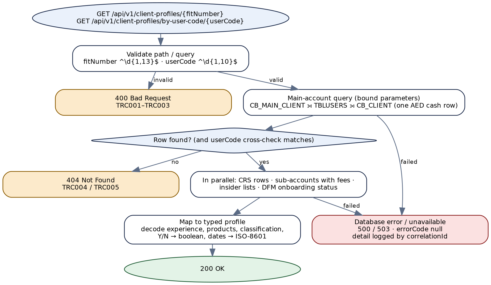

*Figure 4 — Target process flow for the client-profile API*

```
@RestController @RequestMapping("/api/v1/client-profiles") @Validated
class ClientProfileController {
    @GetMapping("/{fitNumber}")
    ApiResponse<ClientProfileDto> byFitNumber(@PathVariable @Pattern(regexp = "\\d{1,13}") String fitNumber,
                                             @RequestParam(required = false) @Pattern(regexp = "\\d{1,20}") String userCode) { ... }
    @GetMapping("/by-user-code/{userCode}")
    ApiResponse<ClientProfileDto> byUserCode(@PathVariable @Pattern(regexp = "\\d{1,20}") String userCode) { ... }
}

class ClientProfileService {
    // 1 main row: repository.findMainAccount(key)   -> empty => 404 TRC004 ; >1 row => TRC902
    // 2 cross-check userCode if supplied               -> mismatch => 404 TRC005
    // 3 CompletableFuture.allOf(crs, subAccounts, insiderLists, incomeSources, dfmStatus)
    //   dfmStatus failure => log TRC904, externalOnboardingStatus = null
    // 4 ClientProfileMapper.decode(...)  (rules in §16.1)
    // 5 SensitiveFieldMasker.apply(profile, callerScopes)
}
```


# 5. API — List Market Indices


## 5.1 Endpoint summary


| Field | Detail |
|---|---|
| **Legacy endpoint** | `POST /getIndexInformation` on `tradingCatalog` → `FITIntegrations.services:getIndexInformation` |
| **Target endpoint** | `GET /api/v1/market-indices?exchange={exchange}&sector={sector}` |
| **Resource type** | Collection / search. No match → `404` (§5.6). |
| **Authorization** | Scope `fit.market-data.read`. |
| **Legacy transport status** | Always **HTTP 200**. |
| **Idempotent / cacheable** | Yes / yes — reference data; `Cache-Control: max-age=300` recommended. |

> **Legacy vs. target endpoint**
>
> A read with two optional filters is a `GET` on a plural noun. The legacy `POST` with a JSON body stays available through APIM during the transition.


## 5.2 Request schema


| Field | In | Type | Required | Rules and legacy notes |
|---|---|---|---|---|
| `exchange` | query | String | No | Exchange code as stored in `CB_CURRENT_INDEX.CI_EXCHANGE`; letters and digits only, 1–10 characters; exact match.<br>**Legacy vs. target:** absent → `'%'`, then `CI_EXCHANGE LIKE ?`. So a caller can send `%` or `_` patterns; and an empty string `""` is **not** defaulted and matches nothing, because Oracle treats `''` as null (FT-23). The target rejects wildcard characters and treats an empty value as absent. |
| `sector` | query | String | No | Same rules against `CI_SECTOR`. |
| `X-Correlation-Id` | header | UUID | No | **Legacy:** this service has no correlation id and no logging at all. |


## 5.3 Business logic summary


1. Default absent filters to "all" (legacy: `'%'` with `OVERWRITE=false`).
2. Query `CB_CURRENT_INDEX` (no schema prefix in the legacy SQL; the target qualifies it as `INSIGHT.CB_CURRENT_INDEX` — confirm, Appendix E) with the filters as bound parameters, ordered by exchange then short name. Legacy has no `ORDER BY`, so row order is arbitrary.
3. No rows → `404` (`TRC012`). Legacy sets `200/OK` first and then overwrites it with `1012` if `response/indices` is absent. Whether Integration Server leaves `indices` absent or empty after mapping zero rows is runtime behaviour and **NOT DETERMINABLE** — legacy may in fact return `200` with an empty list.
4. Return the list. Legacy has no logging step.

> **Business-logic observations for the target design**
>
> **Field names.** The legacy flow writes `indexDescriptionAR`, `indexDescriptionEN` and `isinCode`, but its declared signature says `arabicIndexDescription`, `englishIndexDescription`, `ISIN` and `marketIndexCode` — and `marketIndexCode` is never written although `CI_MRK_INDEX_CODE` is selected (FT-21). The wire contract is what the flow writes; the target keeps those names in camel case and adds `marketIndexCode`.
>
> **Errors leak.** On failure legacy returns `lastError` — exception message, stack and pipeline — to the caller (FT-08).


## 5.4 Sample request


```
GET /api/v1/market-indices?exchange=DFM
Authorization: Bearer <token>
```

Legacy equivalent: `POST /getIndexInformation` with body `{"exchange": "DFM"}`.


## 5.5 Response schema


| Field | Type | Description |
|---|---|---|
| correlationID, responseCode, responseMessage | String | Standard envelope (§4.5). |
| errorCode / errorMsg | String \| null | `TRC010`–`TRC012`; `null` otherwise. |
| response.indices[] | Array | Sorted by `exchange`, then `shortName`. Never empty in a `200`. |
| └─ exchange | String | `CI_EXCHANGE`. |
| └─ sector | String | `CI_SECTOR`. |
| └─ shortName | String | `CI_SHORT_NAME`. |
| └─ indexDescriptionEn / indexDescriptionAr | String | `CIE_DESC` / `CIA_DESC`. **Legacy name:** `indexDescriptionEN` / `indexDescriptionAR`. |
| └─ isinCode | String | `CI_ISIN_CODE`. |
| └─ marketIndexCode | String | `CI_MRK_INDEX_CODE`. **New** — declared but never populated in legacy. |


## 5.6 HTTP status code reference


**Legacy always returns transport HTTP 200.** Statuses follow the shared registry.


### Client input errors


| HTTP Status | Service Error Code | Description | Legacy Error Code |
|---|---|---|---|
| 400 | `TRC010` | `exchange` contains characters other than letters and digits, or is longer than 10. | — (passed into `LIKE`; no validation) |
| 400 | `TRC011` | `sector` fails the same rule. | — (as above) |
| 404 | `TRC012` | No index matches the filters. | `1012` — No Data Available |

> **Design decision — no data is 404, following the registry**
>
> A search that matches nothing returns `404 Not Found` with `errorCode TRC012`. This is the shared registry's mapping for `1012 No Data Available`, and the API owner's stated rule for the programme (CurrencyIntegration v1.1): if the service returns no data, either the inputs were wrong or something is wrong with the data, so a success status would mislead the caller.
>
> The registry is followed with no exception. The alternative REST convention — `200` with an empty list for a search — was considered and not adopted; Appendix E item 3 records it in case the owner wants search endpoints treated differently.


### Backend / provider errors


| HTTP Status | Service Error Code | Description | Legacy Error Code |
|---|---|---|---|
| 503 | `TRC901` | Broker Insight unreachable, or no connection available within the pool timeout. | `500` — Internal Server Error, with `lastError` in the body |
| 500 | `TRC902` | A Broker Insight statement failed or timed out. | `500` — Internal Server Error, with `lastError` in the body |
| 500 | `TRC900` | Any other unexpected error. | `500` — Internal Server Error, with `lastError` in the body |


## 5.7 Example target response envelopes


#### Success


```
HTTP/1.1 200 OK

{
  "correlationID": "6f3e1a9b-0d2c-4f7e-8b5a-3c9d1e7f2a60",
  "responseCode": "200",
  "responseMessage": "OK",
  "errorCode": null,
  "errorMsg": null,
  "response": { "indices": [
      { "exchange": "DFM", "sector": "GEN", "shortName": "DFMGI",
        "indexDescriptionEn": "DFM General Index", "indexDescriptionAr": "مؤشر سوق دبي المالي العام",
        "isinCode": "AE000A0Q5ZL1", "marketIndexCode": "1" } ] }
}
```


#### Client input error


```
HTTP/1.1 400 Bad Request

{
  "correlationID": "a2d4c8e0-7b1f-4e3a-9c6d-5f0b2e8a1d94",
  "responseCode": "400",
  "responseMessage": "Bad Request",
  "errorCode": "TRC010",
  "errorMsg": "exchange may contain letters and digits only.",
  "response": null
}
```


#### No data


```
HTTP/1.1 404 Not Found

{
  "correlationID": "4c7b2e9f-1a3d-4f60-8e5c-9b0d6a2f7e13",
  "responseCode": "404",
  "responseMessage": "Not Found",
  "errorCode": "TRC012",
  "errorMsg": "No market index matches exchange=XYZ.",
  "response": null
}
```


## 5.8 Target process flow (Spring Boot)


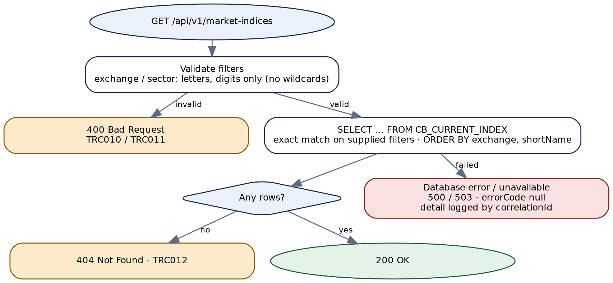

*Figure 5 — Target process flow for GET /api/v1/market-indices*


# 6. API — Search Securities


## 6.1 Endpoint summary


| Field | Detail |
|---|---|
| **Legacy endpoint** | `POST /getSymbolInformation` on `tradingCatalog` → `FITIntegrations.services:getSymbolInformation` |
| **Target endpoint** | `GET /api/v1/securities?exchange=&symbol=&isin=&securityType=&page=&size=` |
| **Resource type** | Collection / search, paged. No match → `404`. |
| **Authorization** | Scope `fit.market-data.read`. |
| **Legacy transport status** | Always **HTTP 200**. |
| **Security** | **Critical legacy finding FT-01:** all four inputs are spliced into SQL text. |

> **Legacy vs. target endpoint**
>
> `GET` on `securities` with optional filters, plus paging — legacy returns every matching row, and with no filter at all may return every tradable security on eight exchanges (FT-23).


## 6.2 Request schema


| Field | In | Type | Required | Rules and legacy notes |
|---|---|---|---|---|
| `exchange` | query | String | When `symbol` or `isin` is given | One of `fit.securities.exchanges` (today `ADSM`, `DFM`, `TDWL`, `BHB`, `MSX`, `DSM`, `NYSE`, `NSDQ`). Case-insensitive.<br>**Legacy:** `ADSM`, not `ADX` — the hard-coded list uses the old Abu Dhabi code, while the unexposed `getMarkets` rewrites `ADSM` to `ADX`. The target accepts both and maps `ADX` → `ADSM`. |
| `symbol` | query | String | No | Ticker; letters, digits, `.` and `-`, 1–20 characters. Case-insensitive. |
| `isin` | query | String | No | ISO 6166 ISIN: `^[A-Z]{2}[A-Z0-9]{9}[0-9]$`.<br>**Legacy vs. target:** the legacy ISIN clause compares `sc_exchange` and `SC_ISIN_CODE` case-sensitively, unlike the other clauses, so a lower-case exchange returns nothing. The target upper-cases. |
| `securityType` | query | String | No | `BONDS`, or a market-book name from `CB_MARKET_BOOK.BOOK_NAME_E`.<br>**Legacy:** undeclared in the signature but used. `BONDS` filters on `SC_IS_BONDS='Y'`; anything else on the book name. The target keeps both behaviours, validates against the book list and documents the field. |
| `page`, `size` | query | Integer | No | **New.** Defaults `0`, `100`; `size` ≤ 500. |


## 6.3 Business logic summary


1. **Validate.** `symbol` without `exchange` → `400` (`TRC020`); `isin` without `exchange` → `400` (`TRC021`). Legacy: `1010` "No exchange passed", set and then an `EXIT … FAILURE` into the catch, whose `500` does not overwrite the code (`OVERWRITE=false`). The target also requires at least one filter (`TRC023`).
2. **Fixed base filters** (unchanged): listed (`SC_LIST_STATUS='0001'`), active (`SC_SYMBOL_STATE='0004'`), tradable, not expired (`expiry_date is null or >= sysdate`), exchange in the configured list, ISIN present, not a derivative.
3. **Optional predicates**, each bound: exchange; exchange + ticker; exchange + ISIN; `BONDS` or book name. Legacy builds these as text — `upper(ticker_id) = upper('<symbol>')` and so on — joins them with `AND`, and passes the whole string to a DynamicSQL adapter as `${condition}` (FT-01). Legacy also adds the exchange clause twice when `symbol` or `isin` is present; harmless, not reproduced.
4. **Query** `CB_SEC_COMP` left-joined to `SECTORS` and `CB_MARKET_BOOK`, ordered by exchange and ticker, one page.
5. **No rows → `404`** (`TRC025`); legacy `1012`. Otherwise map columns to fields (§6.5).

> **Business-logic observations for the target design**
>
> **What legacy does with no filter at all** depends on how the DynamicSQL adapter substitutes a missing `${condition}` — an empty string (every security) or the text `null` (a syntax error, so `500`). **NOT DETERMINABLE**; the target makes the question moot with `TRC023`.
>
> **Duplicated field.** Legacy returns `SC_MRK_BOOK` twice, as `exhangeBook` (sic) and `securityTypeCode` (FT-21). The target keeps `securityTypeCode` only; the legacy adapter keeps both.
>
> **Missing field.** `SC_LOW_FLUCT_PERC` is selected and then dropped, so there is an up-fluctuation limit but no down one. The target returns both.


## 6.4 Sample request


```
GET /api/v1/securities?exchange=DFM&symbol=EMAAR
Authorization: Bearer <token>
```

Legacy: `POST /getSymbolInformation` with `{"exchange": "DFM", "symbol": "EMAAR"}`.


## 6.5 Response schema


| Field | Type | Description |
|---|---|---|
| correlationID, responseCode, responseMessage, errorCode, errorMsg | — | Standard envelope (§4.5). Client codes `TRC020`–`TRC025`. |
| response.page | Object | **New.** `number`, `size`, `totalElements`. |
| response.securities[] | Array | **Legacy:** the top-level `response` is itself the array. |
| └─ Identity | String | `symbolID` (`SC_COMP_ID`), `symbol` (`TICKER_ID`), `isinCode`, `blpSymbol`, `exchange`, `exchangeID` (`SC_MRK_CODE`), `exchangeTypeCode`, `currency` (ISO 4217). |
| └─ Names | String | `fullNameEnglish`, `fullNameArabic`, `shortNameEnglish`, `shortNameArabic`, `addressEnglish`, `addressArabic`, `country`, `city`. |
| └─ Classification | String | `sectorCode`, `sectorDescriptionEN`, `sectorDescriptionAR`, `securityTypeCode` (`SC_MRK_BOOK`), `securityTypeEN` (book name), `securitySubtype`, `shareType`, `assetClass`, `fundType`, `indexCode`. |
| └─ Status | String / Boolean | `symbolStatus`, `symbolState`, `listingStatus`; Booleans `isTradable`, `isBonds`, `isDerivative`, `isETF`, `isIslamic`, `allowsMarginSell`, `includedInMargin`.<br>**Legacy vs. target field format:** flags are `Y`/`N` strings today. |
| └─ Numbers | BigDecimal / Integer | `outstandingShares`, `lotSize`, `decimalPoints` (Integer); `upFluctuationPercentage`, `lowFluctuationPercentage` (**new**), `marginPercentage` (BigDecimal).<br>**Legacy:** `CAST(n AS VARCHAR2(100))` strings. |
| └─ Dates | LocalDate / OffsetDateTime | `listedDate`, `expiryDate` (LocalDate), `updateTime` (OffsetDateTime, Asia/Dubai).<br>**Legacy:** `CAST(<DATE> AS VARCHAR2)`, format set by the database session (FT-25). |


## 6.6 HTTP status code reference


**Legacy always returns transport HTTP 200.** Statuses follow the shared registry (`1010` → 400, `1012` → 404).


### Client input errors


| HTTP Status | Service Error Code | Description | Legacy Error Code |
|---|---|---|---|
| 400 | `TRC020` | `symbol` given without `exchange`. | `1010` — No exchange passed |
| 400 | `TRC021` | `isin` given without `exchange`. | `1010` — No exchange passed |
| 400 | `TRC022` | A filter fails its format rule (§6.2), or `securityType` is not `BONDS` or a known book name. | — (not validated; the value is spliced into SQL, FT-01) |
| 400 | `TRC023` | No filter supplied. | — (unbounded query or `500`; NOT DETERMINABLE) |
| 400 | `TRC024` | `page` negative, or `size` outside 1–500. | — (no paging) |
| 404 | `TRC025` | No security matches. | `1012` — No Data Available |

> **Design decision — no data is 404, following the registry**
>
> A search that matches nothing returns `404 Not Found` with `errorCode TRC025`. This is the shared registry's mapping for `1012 No Data Available`, and the API owner's stated rule for the programme (CurrencyIntegration v1.1): if the service returns no data, either the inputs were wrong or something is wrong with the data, so a success status would mislead the caller.
>
> The registry is followed with no exception. The alternative REST convention — `200` with an empty list for a search — was considered and not adopted; Appendix E item 3 records it in case the owner wants search endpoints treated differently.


### Backend / provider errors


| HTTP Status | Service Error Code | Description | Legacy Error Code |
|---|---|---|---|
| 503 | `TRC901` | Broker Insight unreachable, or no connection available within the pool timeout. | `500` — Internal Server Error, plus `status='Error'` and `lastError` left in the body. Only if no code was set earlier; a failure after `1012` keeps `1012` |
| 500 | `TRC902` | A Broker Insight statement failed or timed out. | `500` — Internal Server Error, plus `status='Error'` and `lastError` left in the body. Only if no code was set earlier; a failure after `1012` keeps `1012` |
| 500 | `TRC900` | Any other unexpected error. | `500` — Internal Server Error, plus `status='Error'` and `lastError` left in the body. Only if no code was set earlier; a failure after `1012` keeps `1012` |


## 6.7 Example target response envelopes


#### Success (abridged)


```
HTTP/1.1 200 OK

{
  "correlationID": "e81c4a27-6b3d-4f09-a5e2-7d1b9c0f3a58",
  "responseCode": "200",
  "responseMessage": "OK",
  "errorCode": null,
  "errorMsg": null,
  "response": { "page": { "number": 0, "size": 100, "totalElements": 1 },
    "securities": [ { "symbolID": "1062", "symbol": "EMAAR", "isinCode": "AEE000301011",
        "exchange": "DFM", "currency": "AED", "fullNameEnglish": "Sample Properties PJSC",
        "isTradable": true, "isBonds": false, "lotSize": 1, "upFluctuationPercentage": 15,
        "lowFluctuationPercentage": 10, "listedDate": "2000-03-26", "...": "..." } ] }
}
```


#### Client input error


```
HTTP/1.1 400 Bad Request

{
  "correlationID": "31f9b0d6-2a7e-4c85-9e14-6b3a8d2c7f05",
  "responseCode": "400",
  "responseMessage": "Bad Request",
  "errorCode": "TRC020",
  "errorMsg": "exchange is required when symbol is supplied.",
  "response": null
}
```


#### Backend error


```
HTTP/1.1 500 Internal Server Error

{
  "correlationID": "c05e8d3a-9f21-4b7c-8d60-2a4e1b9f7c36",
  "responseCode": "500",
  "responseMessage": "Internal Server Error",
  "errorCode": null,
  "errorMsg": null,
  "response": null
}

// Logged: TRC902  ORA-01013 user requested cancel (query timeout 10s)  filters=exchange,symbol
```


## 6.8 Target process flow (Spring Boot)


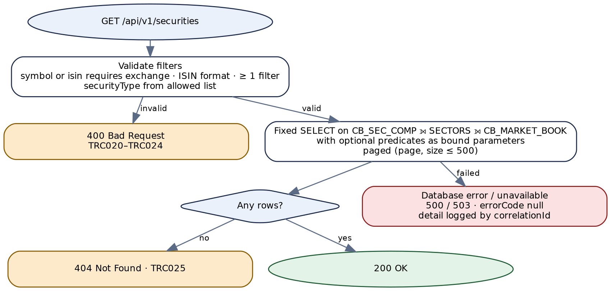

*Figure 6 — Target process flow for GET /api/v1/securities*

```
// Fixed SQL, optional predicates as bound parameters — no text assembled from input
... WHERE <fixed base filters>
  AND (:exchange IS NULL OR UPPER(SC_EXCHANGE) = :exchange)
  AND (:symbol   IS NULL OR UPPER(TICKER_ID)   = :symbol)
  AND (:isin     IS NULL OR SC_ISIN_CODE       = :isin)
  AND (:bonds    = 'N'   OR UPPER(SC_IS_BONDS) = 'Y')
  AND (:book     IS NULL OR UPPER(CB_MARKET_BOOK.BOOK_NAME_E) = :book)
ORDER BY SC_EXCHANGE, TICKER_ID
OFFSET :offset ROWS FETCH NEXT :size ROWS ONLY
```


# 7. API — Get Security Closing Prices by Interval


## 7.1 Endpoint summary


| Field | Detail |
|---|---|
| **Legacy endpoint** | `POST /getSymbolClosingPrice` on `tradingCatalog` → `FITIntegrations.services:getSymbolsClosingPrice` (path says "Symbol", service says "Symbols") |
| **Target endpoint** | `POST /api/v1/securities/closing-prices/search` |
| **Resource type** | Batch look-up with per-item status. `404` only when no item has a price. |
| **Authorization** | Scope `fit.market-data.read`. |
| **Legacy transport status** | **HTTP 200**, except that an exception in the logging step (outside any try) gives an IS error. |
| **Security** | **Critical legacy finding FT-02:** `exchangeCode` is spliced into SQL text. |

> **Legacy vs. target endpoint**
>
> The request carries a list of securities, which does not fit a query string cleanly, so the target keeps `POST` but on a noun path with a `search` sub-resource. It changes nothing on the server, so it is safe to retry.


## 7.2 Request schema


| Field | Type | Required | Rules and legacy notes |
|---|---|---|---|
| `interval` | enum `1D` `1W` `1M` `3M` `6M` `1Y` | Yes | Look-back from today. Case-insensitive in the target.<br>**Legacy:** case-sensitive; missing or unknown → `500 Internal Server Error` and the service exits without logging (FT-19). |
| `securities[]` | Array, 1–100 items | Yes | **Legacy:** no limit; empty or absent → `1012`. |
| `securities[].isin` | String | Yes | ISIN pattern (§6.2). Upper-cased (as legacy). |
| `securities[].exchangeCode` | String | Yes | Letters only, 2–6 characters. Upper-cased (as legacy). **Legacy:** no validation; spliced into SQL (FT-02). |
| `X-Correlation-Id` | UUID (header) | No | **Legacy:** always generates a new id and ignores any supplied. |


## 7.3 Business logic summary


1. Compute `targetDate` = today − interval, with calendar arithmetic (`1M` = one calendar month). Legacy uses the IS JVM's default time zone; the target uses `Asia/Dubai`.
2. For each security: find its ticker by ISIN **and exchange** in `CB_SEC_COMP`. Legacy looks up by ISIN only and silently takes the first row, so an ISIN listed on two exchanges can yield the wrong ticker and no price (FT-19).
3. Read the most recent close on or before `targetDate` from `insight.dfn_his_data` for that ticker and exchange — one row (`FETCH FIRST 1 ROW ONLY`). Legacy reads **every** row up to the date, newest first, and uses the first (FT-19), through a DynamicSQL adapter with `'${symbol}'`, `'${exchange}'`, `'${targetDate}'` substituted as text.
4. Record the item as `FOUND` with price and price date, or `NOT_FOUND`. Legacy silently omits a security with no price.
5. No item found → `404` (`TRC034`); otherwise `200` with every item. Legacy `1012` when none was found; `200` with the found ones otherwise.

> **Business-logic observations for the target design**
>
> **Partial results.** A batch where some securities have prices returns `200` with each item's status. This is the "no data is an error" rule applied to the request as a whole: the caller asked for prices and got some. It differs from CurrencyIntegration's stricter rule (one missing pair fails the request) — Appendix E item 4 asks the owner to confirm one rule for batch look-ups.
>
> **Legacy loop hazards (NOT DETERMINABLE, test before relying on legacy output).** A loop iteration that writes nothing may leave a null or a copy of the previous element in `response/data[]`; and the ticker of a previous iteration may persist when an ISIN is not found.


## 7.4 Sample request


```
POST /api/v1/securities/closing-prices/search
Content-Type: application/json

{ "interval": "1M",
  "securities": [ { "isin": "AEE000301011", "exchangeCode": "DFM" },
                  { "isin": "AEA000201011", "exchangeCode": "ADSM" } ] }
```

The legacy body is the same shape: `{"interval": "1M", "securities": [{"isin": …, "exchangeCode": …}]}`.


## 7.5 Response schema


| Field | Type | Description |
|---|---|---|
| correlationID, responseCode, responseMessage, errorCode, errorMsg | — | Standard envelope. Client codes `TRC030`–`TRC034`. |
| response.targetDate | LocalDate | **New.** The date prices were looked up on or before. |
| response.items[] | Array | One per requested security, in request order. **Legacy:** `response.data[]`, found securities only. |
| └─ isin, exchangeCode | String | As requested, upper-cased. |
| └─ status | enum `FOUND` / `NOT_FOUND` | **New.** |
| └─ price | BigDecimal \| null | `dfn_his_data.CLS`. **Legacy:** string. |
| └─ priceDate | LocalDate \| null | **New.** `dfn_his_data.DT` of that close — selected by legacy but not returned, so callers cannot tell how stale a price is. |


## 7.6 HTTP status code reference


**Legacy returns transport HTTP 200.** Statuses follow the shared registry.


### Client input errors


| HTTP Status | Service Error Code | Description | Legacy Error Code |
|---|---|---|---|
| 400 | `TRC030` | `interval` missing or not one of the six values. | `500` — Internal Server Error (legacy misreports bad input as a server error) |
| 400 | `TRC031` | `securities` missing, empty, or more than 100 items. | `1012` — No Data Available (when empty or absent) |
| 400 | `TRC032` | An `isin` is not a valid ISIN. | — (not validated) |
| 400 | `TRC033` | An `exchangeCode` fails its format rule. | — (not validated; spliced into SQL, FT-02) |
| 404 | `TRC034` | No requested security has a closing price on or before the target date. | `1012` — No Data Available |


### Backend / provider errors


| HTTP Status | Service Error Code | Description | Legacy Error Code |
|---|---|---|---|
| 503 | `TRC901` | Broker Insight unreachable, or no connection available within the pool timeout. | `500` — Internal Server (sic — the literal is truncated in the flow) |
| 500 | `TRC902` | A Broker Insight statement failed or timed out. | `500` — Internal Server (sic — the literal is truncated in the flow) |
| 500 | `TRC900` | Any other unexpected error. | `500` — Internal Server (sic — the literal is truncated in the flow) |


## 7.7 Example target response envelopes


#### Success, one item not found


```
HTTP/1.1 200 OK

{
  "correlationID": "9d2f6b1e-3c8a-4e70-b5d9-1a7c0e4f2b86",
  "responseCode": "200",
  "responseMessage": "OK",
  "errorCode": null,
  "errorMsg": null,
  "response": { "targetDate": "2026-08-30",
    "items": [
      { "isin": "AEE000301011", "exchangeCode": "DFM", "status": "FOUND",
        "price": 8.42, "priceDate": "2026-08-28" },
      { "isin": "AEA000201011", "exchangeCode": "ADSM", "status": "NOT_FOUND",
        "price": null, "priceDate": null } ] }
}
```


#### Client input error


```
HTTP/1.1 400 Bad Request

{
  "correlationID": "5a8e3c0f-7d2b-4196-8f4e-0b6d9a1c3e72",
  "responseCode": "400",
  "responseMessage": "Bad Request",
  "errorCode": "TRC030",
  "errorMsg": "interval must be one of 1D, 1W, 1M, 3M, 6M, 1Y.",
  "response": null
}
```


#### No data


```
HTTP/1.1 404 Not Found

{
  "correlationID": "f3b7a1d9-6e0c-4b28-9a5f-8c2d4e1b7a09",
  "responseCode": "404",
  "responseMessage": "Not Found",
  "errorCode": "TRC034",
  "errorMsg": "No closing price found on or before 2026-08-30 for any requested security.",
  "response": null
}
```


## 7.8 Target process flow (Spring Boot)


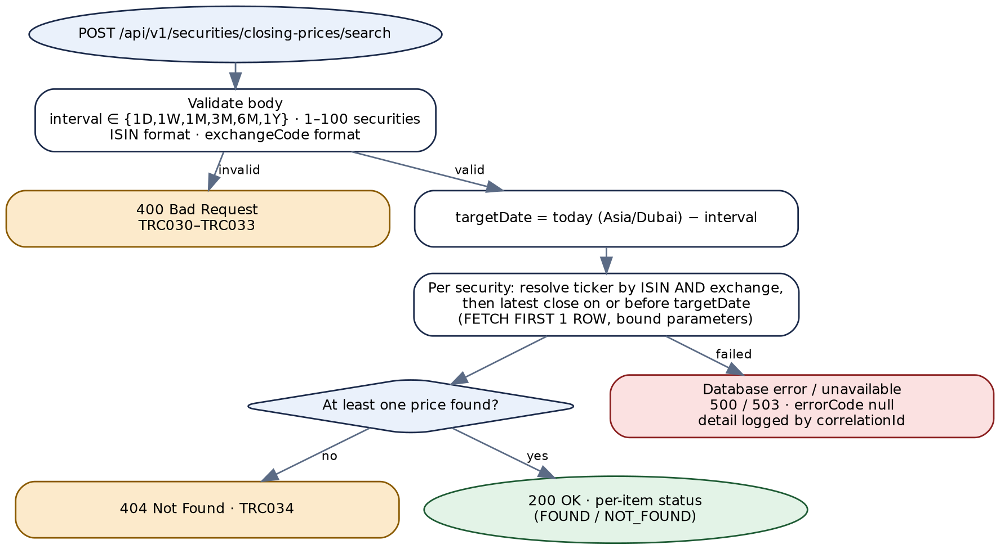

*Figure 7 — Target process flow for closing prices by interval*


# 8. API — Get Instrument Close Prices by Date


## 8.1 Endpoint summary


| Field | Detail |
|---|---|
| **Legacy endpoint** | `POST /getInstrumentsClosePrice` on `tradingCatalog` → `FITIntegrations.services:getInstrumentsClosePrice` |
| **Target endpoint** | `POST /api/v1/instruments/close-prices/search` |
| **Resource type** | Batch look-up with per-item status. `404` only when no item has a price. |
| **Authorization** | Scope `fit.market-data.read`. |
| **Legacy transport status** | Always **HTTP 200** (logging is in a `DONE` sequence, so its failures are swallowed). |

> **Legacy vs. target endpoint**
>
> Same reasoning as §7.1: a list of look-ups in the body, a noun path, a `search` sub-resource, no server-side change. This API differs from Chapter 7 in asking for the close **on an exact date** and in matching by ticker **or** ISIN.


## 8.2 Request schema


| Field | Type | Required | Rules and legacy notes |
|---|---|---|---|
| `instruments[]` | Array, 1–100 items | Yes | **Legacy:** no limit; an empty list reaches the validator with nothing to check, and the outcome is **NOT DETERMINABLE**. |
| `instruments[].exchange` | String | Yes | Exchange code, letters only. **Legacy:** required (`isOptional='N'`). |
| `instruments[].date` | LocalDate (ISO-8601) | Yes | The trading date.<br>**Legacy vs. target field format:** required and checked by the external validator with `isDate='Y'`; the accepted format is **NOT DETERMINABLE**. The adapter binds the string to a `DATE` parameter, which in practice needs `yyyy-MM-dd`. The target requires ISO-8601. |
| `instruments[].shortName` | String | One of `shortName` / `isinCode` | Ticker.<br>**Legacy:** optional, and so is `isinCode` — nothing requires either, so an item with neither simply fails to match (FT-20). |
| `instruments[].isinCode` | String | One of `shortName` / `isinCode` | ISIN pattern (§6.2). **Legacy:** its validation key is `isinCode`, not `isinCode[n]` like the others, so errors do not say which item failed (FT-20). |
| `X-Correlation-Id` | UUID (header) | No | **Legacy:** body field `correlationID`, echoed if non-blank. |


## 8.3 Business logic summary


1. **Validate the whole batch** (§8.2). Legacy builds one validator input list for every item, calls `commonValidator` once, and on any failure throws via `checkAndThrowError`; its catch returns `1069` when the error text starts with `1069`, `1061` with the raw text when it contains "Value is null or empty", `500` otherwise.
2. **For each instrument**, read `CB_PRICES` joined to `CB_SEC_COMP` on company id, where the price date equals `date`, the exchange equals `exchange`, and the ticker equals `shortName` **or** the ISIN equals `isinCode`. The target compares the date as a day range (`PR_PRICE_DATE >= :d AND < :d + 1`) because an equality on a `DATE` column misses rows that carry a time (FT-20).
3. **Exactly one row** → `FOUND`, with the database's ticker and ISIN and the close `PR_C_PRICE`. **No row** → `NOT_FOUND`. **More than one row** → `AMBIGUOUS` (**new**). Legacy treats both zero and several rows as "error — No closing price available for the requested date", which is wrong for the second case: ticker and ISIN matched different securities.
4. **No instrument found** → `404` (`TRC045`). Legacy returns top-level `200 OK` even when every item failed.

> **Business-logic observations for the target design**
>
> The partial-results rule is the same as Chapter 7 and has the same open item (Appendix E item 4).
>
> Legacy echoes the request's `shortName` and `isinCode` on failure but returns the **database's** values on success. The target always returns both the requested identifiers and, when found, the matched ones, in separate fields.


## 8.4 Sample request


```
POST /api/v1/instruments/close-prices/search

{ "instruments": [
    { "exchange": "DFM", "shortName": "EMAAR", "date": "2026-09-29" },
    { "exchange": "ADSM", "isinCode": "AEA000201011", "date": "2026-09-29" } ] }
```

The legacy body has the same shape.


## 8.5 Response schema


| Field | Type | Description |
|---|---|---|
| correlationID, responseCode, responseMessage, errorCode, errorMsg | — | Standard envelope. Client codes `TRC040`–`TRC045`. |
| response.instruments[] | Array | One per requested instrument, in request order. |
| └─ exchange, date | String, LocalDate | As requested. |
| └─ requestedShortName, requestedIsinCode | String \| null | As requested. **Legacy:** echoed in `shortName` / `isinCode` only on failure. |
| └─ shortName, isinCode | String \| null | The matched security's `TICKER_ID` / `SC_ISIN_CODE`; `null` unless `FOUND`. |
| └─ closingPrice | BigDecimal \| null | `CB_PRICES.PR_C_PRICE` (`NUMBER(14,5)`). **Legacy:** string; empty on failure. |
| └─ status | enum `FOUND` / `NOT_FOUND` / `AMBIGUOUS` | **Legacy:** `success` / `error`. |
| └─ message | String \| null | Explanation when not `FOUND`. **Legacy:** always "No closing price available for the requested date" on failure. |


## 8.6 HTTP status code reference


**Legacy always returns transport HTTP 200.** Statuses follow the shared registry (`1061`, `1069` → 400).


### Client input errors


| HTTP Status | Service Error Code | Description | Legacy Error Code |
|---|---|---|---|
| 400 | `TRC040` | `instruments` missing, empty, or more than 100 items. | — (outcome NOT DETERMINABLE) |
| 400 | `TRC041` | An item has no `exchange`. | `1061` — raw validator text containing "Value is null or empty", or `1069` — Middleware system validation error : … (which one depends on the external validator's text; NOT DETERMINABLE) |
| 400 | `TRC042` | An item has neither `shortName` nor `isinCode`. | — (item returned as `error`) |
| 400 | `TRC043` | An item's `date` is missing or not an ISO-8601 date. | `1061` / `1069` — as for `TRC041` |
| 400 | `TRC044` | An item's `shortName`, `isinCode` or `exchange` fails its format rule. | — (not validated) |
| 404 | `TRC045` | No requested instrument has a close price on its date. | — (legacy returns `200 OK` with every item `status: error`) |


### Backend / provider errors


| HTTP Status | Service Error Code | Description | Legacy Error Code |
|---|---|---|---|
| 503 | `TRC901` | Broker Insight unreachable, or no connection available within the pool timeout. | `500` — Internal Server Error |
| 500 | `TRC902` | A Broker Insight statement failed or timed out. | `500` — Internal Server Error |
| 500 | `TRC900` | Any other unexpected error. | `500` — Internal Server Error |


## 8.7 Example target response envelopes


#### Success


```
HTTP/1.1 200 OK

{
  "correlationID": "2e6a9c4f-8b1d-4d73-a0e5-7f3b1c9d6a28",
  "responseCode": "200",
  "responseMessage": "OK",
  "errorCode": null,
  "errorMsg": null,
  "response": { "instruments": [
      { "exchange": "DFM", "date": "2026-09-29", "requestedShortName": "EMAAR", "requestedIsinCode": null,
        "shortName": "EMAAR", "isinCode": "AEE000301011", "closingPrice": 8.51000,
        "status": "FOUND", "message": null },
      { "exchange": "ADSM", "date": "2026-09-29", "requestedShortName": null,
        "requestedIsinCode": "AEA000201011", "shortName": null, "isinCode": null,
        "closingPrice": null, "status": "NOT_FOUND",
        "message": "No closing price for this instrument on 2026-09-29." } ] }
}
```


#### Client input error


```
HTTP/1.1 400 Bad Request

{
  "correlationID": "8b0d2f7a-4e9c-4a16-b3d8-5c1e6f0a9b47",
  "responseCode": "400",
  "responseMessage": "Bad Request",
  "errorCode": "TRC042",
  "errorMsg": "instruments[1]: shortName or isinCode is required.",
  "response": null
}
```


#### No data


```
HTTP/1.1 404 Not Found

{
  "correlationID": "1f5c8a3e-0d7b-4e92-9c6a-3b8f2d0e7c15",
  "responseCode": "404",
  "responseMessage": "Not Found",
  "errorCode": "TRC045",
  "errorMsg": "No close price found for any requested instrument.",
  "response": null
}
```


## 8.8 Target process flow (Spring Boot)


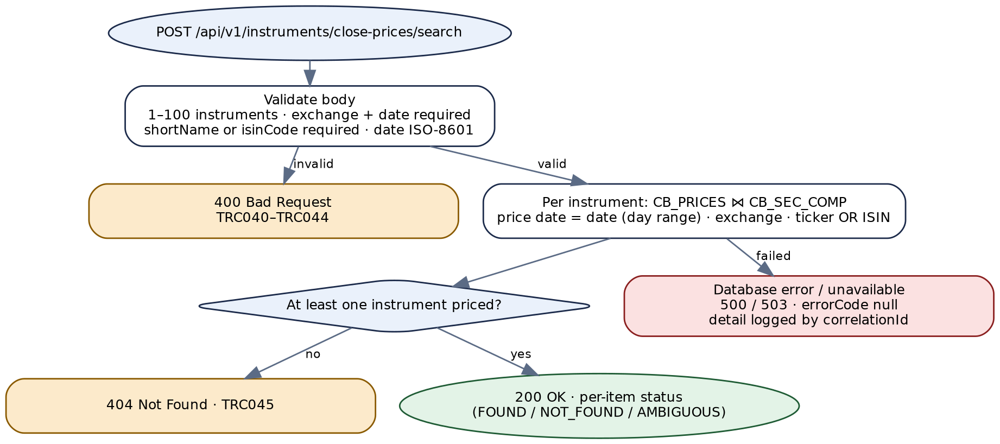

*Figure 8 — Target process flow for instrument close prices by date*


# 9. API — Get Market Watch


## 9.1 Endpoint summary


| Field | Detail |
|---|---|
| **Legacy endpoint** | `POST /getSymbolMarketInformation` on `tradingCatalog` → `FITIntegrations.services:getSymbolMarketInformation` |
| **Target endpoint** | `GET /api/v1/market-watch?exchange=&symbol=&page=&size=` |
| **Resource type** | Collection / search, paged. No match → `404`. |
| **Authorization** | Scope `fit.market-data.read`. |
| **Legacy transport status** | Always **HTTP 200**. |
| **Idempotent / cacheable** | Yes / briefly — intraday data; `max-age` of a few seconds at most. |

> **Legacy vs. target endpoint**
>
> A filtered read, so `GET` on a noun. "Market watch" is the name of the source table (`CB_MARKET_WATCH`) and of the concept users know.


## 9.2 Request schema


| Field | In | Type | Required | Rules and legacy notes |
|---|---|---|---|---|
| `exchange` | query | String | When `symbol` is given | Exchange code, letters only; exact match.<br>**Legacy:** absent → `'%'` into `sc_exchange LIKE ?`; wildcards accepted; `""` matches nothing (FT-23). |
| `symbol` | query | String | No | Ticker; exact match. **Legacy:** as above against `ticker_id`. |
| `page`, `size` | query | Integer | No | **New.** Defaults `0`, `100`; `size` ≤ 500. Legacy returns every row. |
| `X-Correlation-Id` | header | UUID | No | **Legacy:** body field `correlationID`, echoed if non-blank. |


## 9.3 Business logic summary


1. `symbol` without `exchange` → `400` (`TRC050`). Legacy sets `1010` "No exchange passed" and raises it with `pub.flow:throwExceptionForRetry` — a retry signal misused for validation (FT-31); the catch keeps `1010` because it does not overwrite.
2. Query `CB_SEC_COMP` joined to `CB_MARKET_WATCH` for book `0001`, listed, active, tradable, unexpired securities. Legacy writes a `LEFT JOIN` but filters on `mw_book`, so it behaves as an inner join; and it joins on ticker alone, so a ticker listed on two exchanges pairs with both exchanges' market-watch rows (FT-22). The target uses an inner join, and joins on exchange too if `CB_MARKET_WATCH` carries one (Appendix E).
3. No rows → `404` (`TRC052`); legacy `1012`. Otherwise map to camel-case fields (§9.5); legacy returns the rows keyed by the database's upper-case column labels and `responseMessage = 'Success'` (not `OK`).

> **Business-logic observations for the target design**
>
> **Logging.** Legacy calls `commonUtility.services:logRequest` with `pipelineIn` mapped from a variable that does not exist yet, so every request is logged as null (FT-22), and it leaves `jsonString`, `status` and `id1` in the response pipeline. The target logs a masked summary.
>
> **Undeclared contract.** The declared output is an empty `response` record; the real fields are only discoverable from the SQL (FT-21). §9.5 is the first written contract for this API.


## 9.4 Sample request


```
GET /api/v1/market-watch?exchange=DFM&symbol=EMAAR
Authorization: Bearer <token>
```

Legacy: `POST /getSymbolMarketInformation` with `{"exchange": "DFM", "symbol": "EMAAR"}`.


## 9.5 Response schema


| Field | Type | Description |
|---|---|---|
| correlationID, responseCode, responseMessage, errorCode, errorMsg | — | Standard envelope. Client codes `TRC050`–`TRC052`. |
| response.page | Object | **New.** `number`, `size`, `totalElements`. |
| response.marketWatch[] | Array | **Legacy:** `response.symbolMarketInfo[]`, keys are upper-case column labels (legacy key in brackets below). |
| └─ symbol, isinCode, exchange | String | `TICKER_ID` [`SYMBOL`], `SC_ISIN_CODE` [`ISIN_CODE`], `SC_EXCHANGE` [`EXCHANGE`]. |
| └─ lastUpdated | OffsetDateTime | `MW_MOD_DATE` [`LAST_UPDATED`]. **Legacy:** an uncast `DATE`; its JSON rendering is IS-dependent. |
| └─ Prices (BigDecimal) | BigDecimal | `lastTradePrice` [`LAST_TRADE_PRICE`], `change` [`CHANGE`], `percentChange` [`PERCENT_CHANGE`], `openPrice` [`OPEN_PRICE`], `closePrice` [`CLOSE_PRICE`], `highPrice` [`HIGH_PRICE`], `lowPrice` [`LOW_PRICE`], `bestBuyPrice` [`BEST_BUY_PRICE`], `bestSellPrice` [`BEST_SELL_PRICE`], `fiftyTwoWeekHigh` [`FIFTY_TWO_WEEK_HIGH`], `fiftyTwoWeekLow` [`FIFTY_TWO_WEEK_LOW`], `maxPrice` [`MAX_PRICE`], `minPrice` [`MIN_PRICE`], `topPrice` [`TOP_PRICE`]. |
| └─ Volumes | Long / BigDecimal | `tradedVolume` [`TRADED_VOLUME`], `tradedValue` [`TRADED_VALUE`], `numberOfTrades` [`NO_OF_TRADES`], `bestBuyQuantity` [`BEST_BUY_QTY`], `bestSellQuantity` [`BEST_SELL_QTY`]. |


## 9.6 HTTP status code reference


**Legacy always returns transport HTTP 200.** Statuses follow the shared registry (`1010` → 400, `1012` → 404).


### Client input errors


| HTTP Status | Service Error Code | Description | Legacy Error Code |
|---|---|---|---|
| 400 | `TRC050` | `symbol` given without `exchange`. | `1010` — No exchange passed |
| 400 | `TRC051` | A filter fails its format rule, or `page`/`size` is out of range. | — (not validated; wildcards accepted) |
| 404 | `TRC052` | No market-watch row matches. | `1012` — No Data Available |


### Backend / provider errors


| HTTP Status | Service Error Code | Description | Legacy Error Code |
|---|---|---|---|
| 503 | `TRC901` | Broker Insight unreachable, or no connection available within the pool timeout. | `500` — Internal Server Error (only if no code was set earlier) |
| 500 | `TRC902` | A Broker Insight statement failed or timed out. | `500` — Internal Server Error (only if no code was set earlier) |
| 500 | `TRC900` | Any other unexpected error. | `500` — Internal Server Error (only if no code was set earlier) |


## 9.7 Example target response envelopes


#### Success (abridged)


```
HTTP/1.1 200 OK

{
  "correlationID": "7c1e4b9a-2f6d-4083-b7a5-0d9e3c6f1b24",
  "responseCode": "200",
  "responseMessage": "OK",
  "errorCode": null,
  "errorMsg": null,
  "response": { "page": { "number": 0, "size": 100, "totalElements": 1 },
    "marketWatch": [ { "symbol": "EMAAR", "isinCode": "AEE000301011", "exchange": "DFM",
        "lastUpdated": "2026-09-30T13:49:58+04:00", "lastTradePrice": 8.53, "change": 0.02,
        "percentChange": 0.24, "tradedVolume": 4520310, "numberOfTrades": 1187, "...": "..." } ] }
}
```


#### Client input error


```
HTTP/1.1 400 Bad Request

{
  "correlationID": "0a9f3d6c-5b2e-4f71-8d4a-e7c1b0f5a392",
  "responseCode": "400",
  "responseMessage": "Bad Request",
  "errorCode": "TRC050",
  "errorMsg": "exchange is required when symbol is supplied.",
  "response": null
}
```


#### No data


```
HTTP/1.1 404 Not Found

{
  "correlationID": "63d8b1f0-9c4a-4e2d-a5b7-2f0e8c1d4a69",
  "responseCode": "404",
  "responseMessage": "Not Found",
  "errorCode": "TRC052",
  "errorMsg": "No market-watch data for symbol EMAAR on exchange ADSM.",
  "response": null
}
```


## 9.8 Target process flow (Spring Boot)


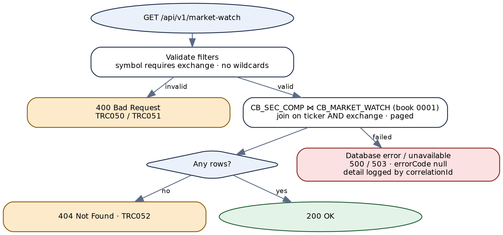

*Figure 9 — Target process flow for GET /api/v1/market-watch*


# 10. API — List Customers Changed on a Date


## 10.1 Endpoint summary


| Field | Detail |
|---|---|
| **Legacy endpoint** | `GET /getCustomersByDate?date=yyyy-MM-dd` on `tradingCatalog` → `FITIntegrations.services:getCustomersByDate` |
| **Target endpoint** | `GET /api/v1/customers?changedOn={date}&page=&size=` |
| **Resource type** | Collection / report, paged. Empty day → `404` (see the design note in §10.6). |
| **Authorization** | Scope `fit.customers.read` — bulk personal data (FT-05). |
| **Legacy transport status** | Always **HTTP 200**. |

> **Legacy vs. target endpoint**
>
> The only legacy `GET`. The target keeps `GET` on the `customers` collection with a named filter. `changedOn` is a provisional name: what the stored procedure `INSIGHT.GET_RMS_CUST_INFO` means by "customers by date" — created, changed, or both — is inside the database and **NOT DETERMINABLE**. The presence of an `isNewRecord` column suggests both new and changed customers. Appendix E item 5.


## 10.2 Request schema


| Field | In | Type | Required | Rules and legacy notes |
|---|---|---|---|---|
| `changedOn` | query | LocalDate (ISO-8601) | Yes | A real calendar date, not in the future.<br>**Legacy:** parameter `date`, checked by a regex that accepts 29 February in **every** year; the lenient date parser then likely rolls a non-leap 29 February to 1 March (FT-27). Converted to `dd/MM/yyyy` for the procedure — the target does the same conversion internally. |
| `page`, `size` | query | Integer | No | **New.** Defaults `0`, `500`; `size` ≤ 1000. |
| `X-Correlation-Id` | header | UUID | No | **Legacy:** query parameter `correlationID`, echoed if non-blank. |


## 10.3 Business logic summary


1. Validate `changedOn`. Missing or invalid → `400` (`TRC060`); legacy `1091` "Middleware system validation error".
2. Call `INSIGHT.GET_RMS_CUST_INFO(PDATE => 'dd/MM/yyyy', P_CURSOR => ref cursor)` and read the cursor into typed rows. The target reads the whole cursor and pages in the service; if volumes make that costly, adding offset/limit parameters to the procedure is a follow-up for the database owner.
3. No rows → `404` (`TRC061`); legacy `1012`. Otherwise return the page, with the requested date echoed.
4. Legacy logs through `SEQDatalust` with no `serviceName`, then clears the pipeline.

> **Business-logic observations for the target design**
>
> **Misleading legacy names** (FT-27): the procedure's `isSuspended` is returned as `deleteFlag`, `isNewRecord` as `recordStatus`, `isDormant` as `dormantFlag`. The target uses the procedure's names.
>
> **Stale values between rows (NOT DETERMINABLE).** The legacy loop copies each column only when it is non-null; if Integration Server reuses the output element, a null column could carry the previous customer's value. Test before treating legacy output as the reference.


## 10.4 Sample request


```
GET /api/v1/customers?changedOn=2026-09-29&page=0&size=500
Authorization: Bearer <token>
```

Legacy: `GET /getCustomersByDate?date=2026-09-29`.


## 10.5 Response schema


| Field | Type | Description |
|---|---|---|
| correlationID, responseCode, responseMessage, errorCode, errorMsg | — | Standard envelope. Client codes `TRC060`–`TRC062`. |
| response.changedOn | LocalDate | The requested date. **Legacy:** `response.date`, absent on `1012`. |
| response.page | Object | **New.** |
| response.customers[] | Array | One per cursor row. |
| └─ customerId | String | Cursor `customerID`. |
| └─ titleEn, titleAr, fullNameEn, fullNameAr | String | Names. |
| └─ clientType, occupation, country | String | As returned by the procedure (codes or descriptions — NOT DETERMINABLE). |
| └─ email, mobile | String | Personal data; masked in logs. |
| └─ investmentFrequency, investmentObjectives | String | As returned. |
| └─ portfolioManager, relationshipManager | String | As returned. |
| └─ isNewRecord | Boolean | **Legacy name:** `recordStatus`. |
| └─ isSuspended | Boolean | **Legacy name:** `deleteFlag`. |
| └─ isDormant | Boolean | **Legacy name:** `dormantFlag`. **Legacy vs. target field format:** all three flags are strings today; their stored values (`Y`/`N` or otherwise) must be confirmed before typing them as Boolean (Appendix E). |


## 10.6 HTTP status code reference


**Legacy always returns transport HTTP 200.** Statuses follow the shared registry (`1091` → 400, `1012` → 404).


### Client input errors


| HTTP Status | Service Error Code | Description | Legacy Error Code |
|---|---|---|---|
| 400 | `TRC060` | `changedOn` missing, not an ISO-8601 date, not a real date, or in the future. | `1091` — Middleware system validation error |
| 400 | `TRC062` | `page` negative or `size` outside 1–1000. | — (no paging) |
| 404 | `TRC061` | No customer for this date. | `1012` — No Data Available |

> **Design decision — an empty day is 404, pending confirmation**
>
> Following the registry and the programme rule, a date with no customers returns `404` / `TRC061`. Unlike a search with wrong inputs, a day with no customer changes is a normal event — a weekend, for instance — and a consumer that runs this report daily will see `404` on those days and must not treat it as a failure.
>
> Appendix E item 1 asks the API owner to confirm `404` here or to make this endpoint an exception returning `200` with an empty list. The consumer contract must state whichever is chosen.


### Backend / provider errors


| HTTP Status | Service Error Code | Description | Legacy Error Code |
|---|---|---|---|
| 503 | `TRC901` | Broker Insight unreachable, or no connection available within the pool timeout. | `500` — Internal Server Error |
| 500 | `TRC902` | A Broker Insight statement failed or timed out. | `500` — Internal Server Error |
| 500 | `TRC900` | Any other unexpected error. | `500` — Internal Server Error |


## 10.7 Example target response envelopes


#### Success


```
HTTP/1.1 200 OK

{
  "correlationID": "4b8e0c2d-7a1f-4d69-9e3b-c5a0f2d8b716",
  "responseCode": "200",
  "responseMessage": "OK",
  "errorCode": null,
  "errorMsg": null,
  "response": { "changedOn": "2026-09-29", "page": { "number": 0, "size": 500, "totalElements": 1 },
    "customers": [ { "customerId": "1000245871", "fullNameEn": "Sample Client",
        "email": "sample.client@example.com", "mobile": "971500000000",
        "isNewRecord": true, "isSuspended": false, "isDormant": false, "...": "..." } ] }
}
```


#### Client input error


```
HTTP/1.1 400 Bad Request

{
  "correlationID": "e9c3a7f1-0b5d-4e28-86f4-1d7b3a9c0e52",
  "responseCode": "400",
  "responseMessage": "Bad Request",
  "errorCode": "TRC060",
  "errorMsg": "changedOn must be a valid ISO-8601 date that is not in the future.",
  "response": null
}
```


#### No data


```
HTTP/1.1 404 Not Found

{
  "correlationID": "58a1d4e7-3c0b-4f96-b2e8-9f6c1a0d3b74",
  "responseCode": "404",
  "responseMessage": "Not Found",
  "errorCode": "TRC061",
  "errorMsg": "No customers found for 2026-09-27.",
  "response": null
}
```


## 10.8 Target process flow (Spring Boot)


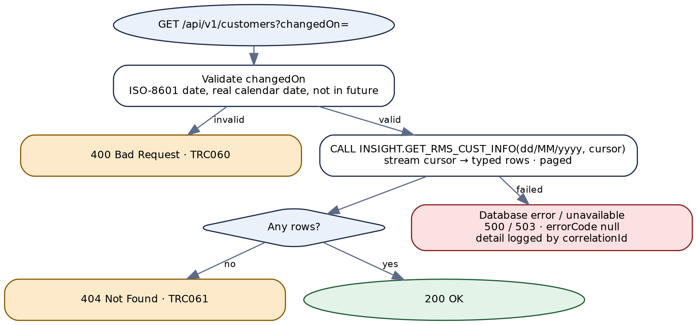

*Figure 10 — Target process flow for GET /api/v1/customers*


# 11. API — List Share-Transfer Requests


## 11.1 Endpoint summary


| Field | Detail |
|---|---|
| **Legacy endpoint** | `POST /automation/getShareTransferRequests` on `tradingCatalog` → `FITIntegrations.services.Automation:getShareTransferRequests` |
| **Target endpoint** | `GET /api/v1/share-transfer-requests?date={date}` |
| **Resource type** | Collection (work queue for the automation that processes transfers, Chapter 12). Empty → `404` (see §11.6). |
| **Authorization** | Scope `fit.share-transfer.read`. |
| **Legacy transport status** | Always **HTTP 200**. |

> **Legacy vs. target endpoint**
>
> A read of a collection, so `GET`; the `automation/` path segment described the caller, not the resource, and is dropped.


## 11.2 Request schema


| Field | In | Type | Required | Rules and legacy notes |
|---|---|---|---|---|
| `date` | query | LocalDate (ISO-8601) | No | Passed to the procedure as `pDATE`.<br>**Legacy vs. target field format:** validated by the external validator with `isOptional='Y'`, `isDate='Y'`, `length=10`, then passed to the procedure **as received**. The date format the validator accepts, the format the procedure expects, and what the procedure does when `pDATE` is null are all **NOT DETERMINABLE** (Appendix E item 6). The target accepts ISO-8601 and converts to whatever the procedure expects. |
| `X-Correlation-Id` | header | UUID | No | **Legacy:** body field `correlationID`, echoed if non-blank. |


## 11.3 Business logic summary


1. Validate `date` (§11.2). Legacy: a validator result other than `200` ends the service with the validator's own code and message.
2. Call `INSIGHT.SP_GET_AUTO_SHARE_TRANSFER_REQUESTS(pDATE IN VARCHAR, P_CURSOR_OUT OUT ref cursor, P_Flag OUT NUMBER)`.
3. Interpret `P_Flag` **first**: `0` → rows (or `404` if the cursor is empty); `1` → `404` (`TRC071`), the procedure's own "no data"; `99` → the procedure reports an unhandled error (`TRC910`, `500`); anything else → `TRC905`, `500`.
4. Legacy interprets `P_Flag` and then overrides the result with `1012` whenever the cursor is empty — so a procedure failure (`99`) with no rows is reported as "No Data Available" (FT-13). The target never lets an empty cursor hide a failure flag.
5. Return the rows. Legacy maps the cursor to `response/shareTransferRequests[]` column-for-column, and returns `lastError` in the body on failure (FT-08).

> **Business-logic observations for the target design**
>
> **This is a work queue, and an empty queue is normal.** Registry-consistent `404` on an empty queue means the automation must treat `404 / TRC071` as "nothing to do". Appendix E item 2 asks whether this endpoint should instead return `200` with an empty list.


## 11.4 Sample request


```
GET /api/v1/share-transfer-requests?date=2026-09-30
Authorization: Bearer <token>
```

Legacy: `POST /automation/getShareTransferRequests` with `{"date": "…"}` in the format the validator accepts.


## 11.5 Response schema


| Field | Type | Description |
|---|---|---|
| correlationID, responseCode, responseMessage, errorCode, errorMsg | — | Standard envelope. Client codes `TRC070`, `TRC071`. **Legacy** also returns `lastError` on failure. |
| response.shareTransferRequests[] | Array | One per cursor row. Every legacy column is a string. |
| └─ requestId | Long | Cursor `requestID` — the key for Chapter 12. |
| └─ requestDate | LocalDateTime | Cursor `requestDate`. **Legacy:** string in the procedure's format. |
| └─ clientMain, clientSub | String | Main-client (FIT number) and sub-account. |
| └─ nin, tradingAccount | String | Investor number and trading account. |
| └─ transferMode, source, status | String | Codes as produced by the procedure; value lists NOT DETERMINABLE. |
| └─ isin, tickerId, companyName, exchange | String | **Legacy names:** `tickerID`, `compName`. |
| └─ quantity | BigDecimal | **Legacy:** string. |
| └─ totalFees | BigDecimal | **Legacy:** string. |


## 11.6 HTTP status code reference


**Legacy always returns transport HTTP 200.** Statuses follow the shared registry (`1012` → 404, `1123` → 500). Legacy `402 Request Failed` is the package's generic "parameters valid, request failed"; the target does not use `402`, which the registry reserves for payment failures.


### Client input errors


| HTTP Status | Service Error Code | Description | Legacy Error Code |
|---|---|---|---|
| 400 | `TRC070` | `date` is not an ISO-8601 date. | Validator pass-through — the code and message come from `commonValidator`, which is not in the package |
| 404 | `TRC071` | No share-transfer request for the date (`P_Flag = 1`, or `0` with an empty cursor). | `1012` — No Data Available |


### Backend / provider errors


| HTTP Status | Service Error Code | Description | Legacy Error Code |
|---|---|---|---|
| 500 | `TRC910` | The procedure reported an unhandled error (`P_Flag = 99`). | `1123` — Unhandled exception (or `1012` when the cursor is also empty, FT-13) |
| 500 | `TRC905` | The procedure returned an unknown `P_Flag`. | `402` — Request Failed (or `1012` when the cursor is empty) |
| 503 | `TRC901` | Broker Insight unreachable. | `402` — Request Failed (adapter exception) |
| 500 | `TRC902` | The procedure call failed or timed out. | `402` — Request Failed (adapter exception) |
| 500 | `TRC900` | Any other unexpected error. | `500` — Internal Server Error |


## 11.7 Example target response envelopes


#### Success


```
HTTP/1.1 200 OK

{
  "correlationID": "c7e2a0b4-9f3d-4c16-8a5e-0b1d7f4c9e38",
  "responseCode": "200",
  "responseMessage": "OK",
  "errorCode": null,
  "errorMsg": null,
  "response": { "shareTransferRequests": [
      { "requestId": 88412, "requestDate": "2026-09-30T09:12:44", "clientMain": "1000245871",
        "clientSub": "204587", "nin": "123456789", "tradingAccount": "204587",
        "transferMode": "IN", "isin": "AEE000301011", "tickerId": "EMAAR",
        "companyName": "Sample Properties PJSC", "exchange": "DFM", "quantity": 1500,
        "status": "P", "source": "PORTAL", "totalFees": 52.50 } ] }
}
```


#### Client input error


```
HTTP/1.1 400 Bad Request

{
  "correlationID": "2b9d5f8e-1c4a-4e07-b6d3-8f0a2c7e5b19",
  "responseCode": "400",
  "responseMessage": "Bad Request",
  "errorCode": "TRC070",
  "errorMsg": "date must be an ISO-8601 date (yyyy-MM-dd).",
  "response": null
}
```


#### No data


```
HTTP/1.1 404 Not Found

{
  "correlationID": "f1a6c3e9-7b0d-4d52-9e8a-4c2b0f6d1a83",
  "responseCode": "404",
  "responseMessage": "Not Found",
  "errorCode": "TRC071",
  "errorMsg": "No share-transfer requests for 2026-09-30.",
  "response": null
}
```


## 11.8 Target process flow (Spring Boot)


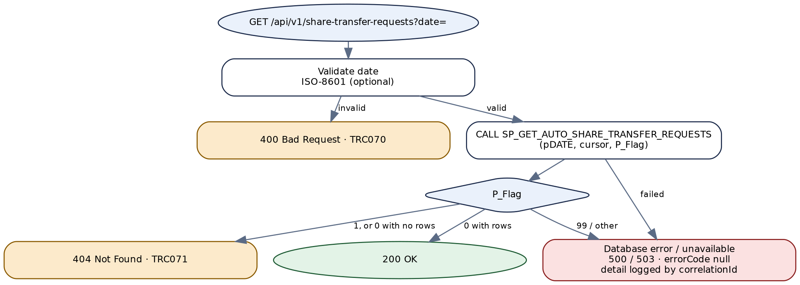

*Figure 11 — Target process flow for GET /api/v1/share-transfer-requests*


# 12. API — Process a Share Transfer


## 12.1 Endpoint summary


| Field | Detail |
|---|---|
| **Legacy endpoint** | `POST /automation/processShareTransfer` on `tradingCatalog` → `FITIntegrations.services.Automation:processShareTransfer` |
| **Target endpoint** | `POST /api/v1/share-transfer-requests/{requestId}/processing` |
| **Resource type** | Action on a single resource. Unknown request → `404`; already invoiced → `409`. |
| **Authorization** | Scope `fit.share-transfer.process`. |
| **Legacy transport status** | Always **HTTP 200**. |
| **Idempotent** | **No.** The procedure posts a journal voucher, an invoice and a business-partner update. The target never retries it automatically (§12.3). |

> **Legacy vs. target endpoint**
>
> The request id moves into the path, making the target resource explicit. `processing` is the sub-resource that records the outcome of processing the request; `POST` because each call triggers financial postings.


## 12.2 Request schema


| Field | In | Type | Required | Rules and legacy notes |
|---|---|---|---|---|
| `requestId` | path | Long | Yes | **Legacy:** body `requestID`, `isOptional='N'`, `isNumeric='Y'`; bound as `NUMERIC` to `PREQUESTID`. |
| `status` | body | String, 1 character | Yes | Decision code passed to the procedure as `PSTATUS`.<br>**Legacy:** `length=1`, not otherwise checked — any single character is accepted. The allowed values and their meaning are inside the procedure and **NOT DETERMINABLE**; the target validates against a configured list (Appendix E item 7). |
| `brokerFees`, `marketFees`, `vat` | body | BigDecimal | No | **Legacy:** validated as optional numbers and then **never used** — the procedure has no parameter for them (FT-12).<br>Target: accepted and validated for compatibility, but not applied, and a warning is logged when supplied, until the owner decides whether the procedure should take them or the fields should be removed (Appendix E item 8). |
| `X-Correlation-Id` | header | UUID | No | **Legacy:** body field `correlationID`. |


## 12.3 Business logic summary


1. Validate (§12.2). Legacy: validator result other than `200` returns the validator's code and message.
2. Call `INSIGHT.SP_PROCESS_AUTO_SHARE_TRANSFER(PREQUESTID IN NUMBER, PSTATUS IN VARCHAR, PRES OUT NUMBER, PDOCN OUT NUMBER)`. Legacy calls it outside any inner try, so an exception goes straight to the outer catch (`500`).
3. Map `PRES`: `0` → `200` with the document number; `1` → `404` (`TRC084`); `4` → `409` (`TRC085`); `2`, `3`, `5` → backend errors (`TRC910`, `TRC911`, `TRC912`); anything else → `TRC905`.
4. Legacy returns `response/docNo` for every `PRES`, success or not, whenever the procedure set `PDOCN`. The target returns the document number only on success, and logs it otherwise.

> **Business-logic observations for the target design**
>
> **Timeouts and retries.** Whether the procedure's postings are atomic is decided inside it and is **NOT DETERMINABLE**. The target therefore disables automatic retry for this call and sets a generous statement timeout; on a timeout it returns `500` (`TRC902`) and the caller must check the request's status through Chapter 11 before trying again. `PRES = 4` (invoice already exists) makes a repeated call safe for the invoice step.
>
> **Fees.** See §12.2 — the only input values that affect money in the request body are silently ignored today.


## 12.4 Sample request


```
POST /api/v1/share-transfer-requests/88412/processing
Content-Type: application/json

{ "status": "A" }
```

Legacy: `POST /automation/processShareTransfer` with `{"requestID": "88412", "status": "A"}`. The value `A` is illustrative — see Appendix E item 7.


## 12.5 Response schema


| Field | Type | Description |
|---|---|---|
| correlationID, responseCode, responseMessage, errorCode, errorMsg | — | Standard envelope. Client codes `TRC080`–`TRC085`. **Legacy** also returns `lastError` on failure. |
| response.requestId | Long | **New** — echo of the path. |
| response.documentNumber | Long | `PDOCN`. **Legacy name:** `docNo`, returned for every outcome. |


## 12.6 HTTP status code reference


**Legacy always returns transport HTTP 200.** Statuses follow the shared registry (`1122` → 404, `1123` → 500, `1124` → 502, `1125` → 409, `1126` → 500).


### Client input errors


| HTTP Status | Service Error Code | Description | Legacy Error Code |
|---|---|---|---|
| 400 | `TRC080` | `requestId` is not a positive whole number. | Validator pass-through (code not in the package) |
| 400 | `TRC081` | `status` missing or not exactly one character. | Validator pass-through |
| 400 | `TRC082` | `status` is not an allowed value. | — (not checked; any character reaches the procedure) |
| 400 | `TRC083` | A fee field is not a non-negative decimal. | Validator pass-through (the value is then ignored, FT-12) |
| 404 | `TRC084` | No matching share-transfer request (`PRES = 1`). | `1122` — No matching share transfer request |
| 409 | `TRC085` | An invoice already exists for this request (`PRES = 4`). | `1125` — Invoice already exists for this request |


### Backend / provider errors


| HTTP Status | Service Error Code | Description | Legacy Error Code |
|---|---|---|---|
| 500 | `TRC910` | The procedure reported an unhandled error (`PRES = 2`). | `1123` — Unhandled exception during processing |
| 502 | `TRC911` | Journal-voucher creation failed (`PRES = 3`). `502` per the registry, which classes JV creation as a back-office dependency. | `1124` — JV Creation Error |
| 500 | `TRC912` | Business-partner update failed (`PRES = 5`). | `1126` — Failure in updating BP |
| 500 | `TRC905` | `PRES` null or unknown. | `402` — Request Failed |
| 503 | `TRC901` | Broker Insight unreachable. | `500` — Internal Server Error |
| 500 | `TRC902` | The procedure call failed or timed out. | `500` — Internal Server Error |
| 500 | `TRC900` | Any other unexpected error. | `500` — Internal Server Error |


## 12.7 Example target response envelopes


#### Success


```
HTTP/1.1 200 OK

{
  "correlationID": "a4f0c8d2-6e3b-4a91-b7c5-2d8e0f1a9c64",
  "responseCode": "200",
  "responseMessage": "OK",
  "errorCode": null,
  "errorMsg": null,
  "response": { "requestId": 88412, "documentNumber": 5510347 }
}
```


#### Conflict


```
HTTP/1.1 409 Conflict

{
  "correlationID": "3e7b1d9c-0a5f-4c28-8d6e-b1f4a2c7e053",
  "responseCode": "409",
  "responseMessage": "Conflict",
  "errorCode": "TRC085",
  "errorMsg": "An invoice already exists for share-transfer request 88412.",
  "response": null
}
```


#### Backend error


```
HTTP/1.1 502 Bad Gateway

{
  "correlationID": "96c2e0a7-4d1b-4f83-a9e5-7b3c0d8f2e16",
  "responseCode": "502",
  "responseMessage": "Bad Gateway",
  "errorCode": null,
  "errorMsg": null,
  "response": null
}

// Logged: TRC911  SP_PROCESS_AUTO_SHARE_TRANSFER PRES=3 requestId=88412 PDOCN=null
```


## 12.8 Target process flow (Spring Boot)


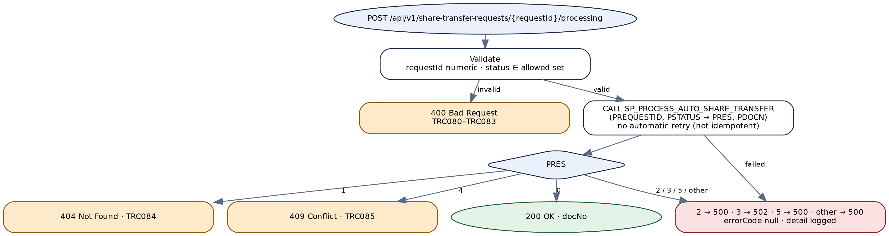

*Figure 12 — Target process flow for processing a share transfer*


# 13. API — Record a Margin-Trading Consent


## 13.1 Endpoint summary


| Field | Detail |
|---|---|
| **Legacy endpoint** | `POST /createMarginTradingConsent` on `tradingCatalog2` → `FITIntegrations.v2.services:createTradingMarginConsent` |
| **Target endpoint** | `POST /api/v1/clients/{fitNumber}/sub-accounts/{subAccount}/margin-trading-consents` |
| **Resource type** | Create. `201 Created`. |
| **Authorization** | Scope `fit.consents.write`. |
| **Legacy transport status** | Always **HTTP 200**. |
| **Names** | The operation has four names in the legacy source — URL `createMarginTradingConsent`, service `createTradingMarginConsent`, adapter `inserTradingtMarginConsent` (sic), log name `createMarginConsent` (FT-29). The target uses **margin-trading consent** throughout. |

> **Legacy vs. target endpoint**
>
> A consent belongs to a client's sub-account, and each call appends a new consent record (the table keeps history; the sub-account query in §4.3.2 reads the latest). So the target creates a resource in that sub-account's `margin-trading-consents` collection.


## 13.2 Request schema


Legacy input is validated against the document type `FITIntegrations.documents:marginTradingConsent` with `pub.schema:validate`; all four fields are required and nillable, so a JSON `null` passes validation and would be inserted as `NULL`.

| Field | In | Type | Required | Rules and legacy notes |
|---|---|---|---|---|
| `fitNumber` | path | String of digits | Yes | `^\d{1,13}$` (unchanged). **Legacy:** body `clientID`. |
| `subAccount` | path | String of digits | Yes | `^\d{1,9}$` (unchanged). **Legacy:** body `subAccount`. |
| `status` | body | enum `ACCEPTED` / `CANCELLED` | Yes | **Legacy vs. target field format:** `A` / `C` (pattern `^(A\|C)$`). Stored as `A` / `C` in the table, unchanged. |
| `notificationEmail` | body | String (e-mail) | When `status` is `ACCEPTED` | Where the leverage-trade notification is sent. Validated as an e-mail address.<br>**Legacy:** `email`, required for every status, checked only for being non-blank (`^(?!\s*$).+`), never checked against the client, and not stored (FT-14). Appendix E item 9 asks whether the target should instead send to the client's e-mail on record. |
| `X-Correlation-Id` | header | UUID | No | **Legacy:** body field `correlationID`, or a generated id. |


## 13.3 Business logic summary


1. **Validate** (§13.2). Legacy: an invalid document raises `checkAndThrowError('1069 <pathName><errorMessage>')`, reported as `1069` "Middleware system validation error : …" with the first schema error only.
2. **Check the sub-account belongs to the client** — **new**: a `CB_CLIENT` row with this `CL_CLIENT_ID` and `CL_MAIN_CLIENT_ID`. Not found → `404` (`TRC095`). Legacy inserts whatever it is given.
3. **Insert** `(CL_MAIN_CLIENT_ID, SUB_CLIENT_ID, STATUS)` into `INSIGHT.MARGIN_TRADING_CONSENT`; `CREATED_DATE` is not bound, so it relies on a database default or trigger (NOT DETERMINABLE — Appendix C.4). In the **same transaction**, for `ACCEPTED`, insert a row in the service's `notification_outbox` with template `POST_LEVERAGE_TRADE_NOTIFICATION`, language `EN`, and the recipient.
4. **Return `201`**. A background publisher sends outbox rows through the notification service and retries failures; a failed e-mail never changes the API outcome and never produces a duplicate consent row.

Legacy, for comparison: after the insert, a `BRANCH` on label expressions — `result > 0 && status == "A"` → fire-and-forget `commonUtility.java:asyncInvoke` of `Notifications.EMail.services:sendEmail` and `200 success`; `result <= 0` → `500 Consent not Inserted in Table`; otherwise → `200 success`. A synchronous `sendEmail` step with identical inputs sits disabled just before the async one. If `asyncInvoke` itself throws, the client receives `500` with the raw exception text while the consent row already exists — an invitation to retry and insert a duplicate (FT-14).

> **Business-logic observations for the target design**
>
> **Duplicates.** Legacy never checks for an existing consent; every call inserts. The target accepts an optional `Idempotency-Key` header and returns the original `201` for a repeated key within 24 hours. Whether a second `ACCEPTED` for a sub-account whose latest consent is already `ACCEPTED` should be `409` is Appendix E item 10.
>
> **No read-back.** The package has an unused `getMarginTradingConsent` adapter but no endpoint; the latest status is visible only inside the client profile (`subAccountInformation[].marginTradingConsent`). A `GET` on the same collection is a natural addition, not in scope.


## 13.4 Sample request


```
POST /api/v1/clients/1000245871/sub-accounts/204587/margin-trading-consents
Content-Type: application/json
Idempotency-Key: 5d0e9a3c-1b7f-4c62-8e4a-f2d6b0c9a137

{ "status": "ACCEPTED", "notificationEmail": "sample.client@example.com" }
```

Legacy: `POST /createMarginTradingConsent` with `{"clientID": "1000245871", "subAccount": "204587", "status": "A", "email": "sample.client@example.com"}`.


## 13.5 Response schema


| Field | Type | Description |
|---|---|---|
| correlationID, responseCode, responseMessage, errorCode, errorMsg | — | Standard envelope. Client codes `TRC090`–`TRC095`. **Legacy** returns `200` / `success` and no `response`; on a non-validation exception `responseMessage` is the raw exception text (FT-08). |
| response.fitNumber, response.subAccount | String | **New** — echo. |
| response.status | enum | `ACCEPTED` / `CANCELLED`. |
| response.createdAt | OffsetDateTime | **New** — `CREATED_DATE` read back after insert. |
| response.notificationQueued | Boolean | **New** — `true` when an e-mail was queued. |


## 13.6 HTTP status code reference


**Legacy always returns transport HTTP 200.** Statuses follow the shared registry (`1069` → 400).


### Client input errors


| HTTP Status | Service Error Code | Description | Legacy Error Code |
|---|---|---|---|
| 400 | `TRC090` | `fitNumber` is not 1–13 digits. | `1069` — Middleware system validation error : `<pathName><message>` |
| 400 | `TRC091` | `subAccount` is not 1–9 digits. | `1069` — as above |
| 400 | `TRC092` | `status` missing or not `ACCEPTED` / `CANCELLED`. | `1069` — as above |
| 400 | `TRC093` | `notificationEmail` missing when `status` is `ACCEPTED`. | `1069` — as above (legacy requires `email` for every status) |
| 400 | `TRC094` | `notificationEmail` is not a valid e-mail address. | — (only non-blank is checked) |
| 404 | `TRC095` | The sub-account does not belong to the client. **New check.** | — (not checked; the row is inserted) |


### Backend / provider errors


| HTTP Status | Service Error Code | Description | Legacy Error Code |
|---|---|---|---|
| 500 | `TRC915` | The insert reported no row inserted. | `500` — Consent not Inserted in Table |
| 503 | `TRC901` | Broker Insight unreachable. | `500` — raw exception text as `responseMessage` |
| 500 | `TRC902` | The insert failed (constraint, timeout). | `500` — raw exception text |
| — | `TRC906` | Notification could not be sent. **Not an error response**: logged, retried from the outbox. | `500` — raw exception text, after the row was inserted (only if `asyncInvoke` itself throws) |
| 500 | `TRC900` | Any other unexpected error. | `500` — raw exception text |


## 13.7 Example target response envelopes


#### Created


```
HTTP/1.1 201 Created

{
  "correlationID": "5d0e9a3c-1b7f-4c62-8e4a-f2d6b0c9a137",
  "responseCode": "201",
  "responseMessage": "Created",
  "errorCode": null,
  "errorMsg": null,
  "response": { "fitNumber": "1000245871", "subAccount": "204587", "status": "ACCEPTED",
    "createdAt": "2026-09-30T10:04:12+04:00", "notificationQueued": true }
}
```


#### Client input error


```
HTTP/1.1 400 Bad Request

{
  "correlationID": "e0b7c4a1-8f2d-4e39-a6c5-9d3f1b0e7a28",
  "responseCode": "400",
  "responseMessage": "Bad Request",
  "errorCode": "TRC092",
  "errorMsg": "status must be ACCEPTED or CANCELLED.",
  "response": null
}
```


#### Not found


```
HTTP/1.1 404 Not Found

{
  "correlationID": "7a3d9f6b-2c0e-4b18-9f7d-c4e1a8b0d635",
  "responseCode": "404",
  "responseMessage": "Not Found",
  "errorCode": "TRC095",
  "errorMsg": "Sub-account 204587 does not belong to client 1000245871.",
  "response": null
}
```


## 13.8 Target process flow (Spring Boot)


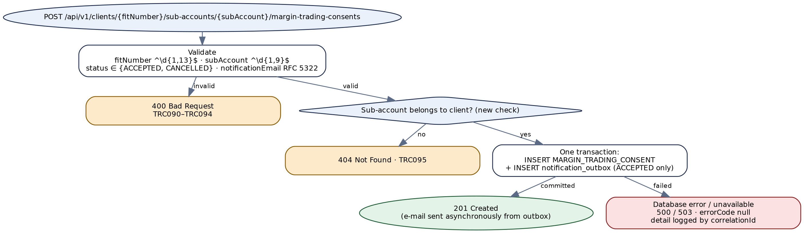

*Figure 13 — Target process flow for recording a margin-trading consent*


# 14. API — Record Insider-Trading Consents


## 14.1 Endpoint summary


| Field | Detail |
|---|---|
| **Legacy endpoint** | `POST /createInsiderTradingConsent` on `tradingCatalog2` → `FITIntegrations.v2.services:createInsiderTradingConsent`, which calls `FITIntegrations.v2.wrapper:createInsiderTradingConsent` once per item (§15.5) |
| **Target endpoint** | `POST /api/v1/insider-trading-consents` |
| **Resource type** | Batch create with per-item outcome: `201` all created, `207` some failed, `500` all failed. |
| **Authorization** | Scope `fit.consents.write`. |
| **Legacy transport status** | Always **HTTP 200**. |

> **Legacy vs. target endpoint**
>
> One consent per order, for many orders in one call — a batch create on the `insider-trading-consents` collection. Registry `207 Multi-Status` expresses "the request was processed, some items failed", which legacy flattens into `200 success` even when every item failed (FT-15).


## 14.2 Request schema


Legacy validates the whole body against `FITIntegrations.documents:tradingConsent` (a required, closed list of `TradingConsentRequest`); every item field is required and nillable.

| Field | Type | Required | Rules and legacy notes |
|---|---|---|---|
| `consents[]` | Array, 1–100 items | Yes | **Legacy:** `TradingConsentRequest[]`; no size limit; an empty array passes validation and returns no `responseCode` at all (FT-15). |
| `consents[].fitNumber` | String of digits | Yes | `^\d{1,13}$`. **Legacy:** `clientID`. |
| `consents[].subAccount` | String of digits | Yes | `^\d{1,9}$`. |
| `consents[].companyId` | String of digits | Yes | `^\d{1,10}$`. **Legacy:** `companyID`. |
| `consents[].orderId` | String of digits | Yes | `^\d{1,20}$`. **Legacy:** `orderID`. Must be unique within the batch (**new**). |
| `X-Correlation-Id` | UUID (header) | No | **Legacy:** never generated in this service or its wrapper; present only if the caller sends a body `correlationID`. |


## 14.3 Business logic summary


1. **Validate the whole batch**; any invalid item rejects it (`400`, `TRC101`), as legacy does with `1069`.
2. **For each item**, insert `(CL_MAIN_CLIENT_ID, CL_CLIENT_ID, SC_COMP_ID, CO_ORDER_ID)` into `INSIGHT.INSIDER_TRADING_CONSENT` in its own transaction and record `CREATED` or `FAILED`. Legacy does the same through the wrapper: `result > 0` → `200`, otherwise `500 Failure`; the parent adds the `orderID` to `successOrderID[]` or `failureOrderID[]` and increments a count.
3. **Outcome**: all created → `201`; some failed → `207`; all failed → `500` (`TRC916`). Every response carries the per-item results. Legacy returns `200 success` in all three cases.

> **Business-logic observations for the target design**
>
> **No duplicate or state check.** Every call inserts, so a retried batch inserts every order again. The registry already has codes for this domain — `1132` PENDING INSIDER TRADING REQUEST EXIST and `1134` APPROVED INSIDER TRADING REQUEST EXIST (both `409`) — and the package has two unused adapters that read insider data (`getClientInsiderData`, `getInsiderData`). Whether the target should reject an order that already has a consent is Appendix E item 11; if yes, it becomes a per-item `CONFLICT` status.
>
> **Legacy pipeline hazards (verify on a running server).** The wrapper runs in the caller's pipeline and ends with `clearPipeline`, which removes the caller's variables — possibly including the loop's current item before the parent reads its `orderID`, which would put `null` in the result lists. The catch block also copies values from `pipeline` before `getLastError` has created it (FT-28).


## 14.4 Sample request


```
POST /api/v1/insider-trading-consents

{ "consents": [
    { "fitNumber": "1000245871", "subAccount": "204587", "companyId": "1062", "orderId": "990001234501" },
    { "fitNumber": "1000245871", "subAccount": "204587", "companyId": "1101", "orderId": "990001234502" } ] }
```

Legacy: `POST /createInsiderTradingConsent` with `{"TradingConsentRequest": [{"clientID": …, "subAccount": …, "companyID": …, "orderID": …}]}`.


## 14.5 Response schema


| Field | Type | Description |
|---|---|---|
| correlationID, responseCode, responseMessage, errorCode, errorMsg | — | Standard envelope. Client codes `TRC100`, `TRC101`. `errorCode` is `null` on `201`, `207` and `500`. |
| response.createdCount, response.failedCount | Integer | **Legacy:** `successOrderCount`, `failureOrderCount` (strings). |
| response.results[] | Array | One per item, in request order. **Legacy:** two string lists, `successOrderID[]` and `failureOrderID[]`. |
| └─ orderId, fitNumber, subAccount, companyId | String | As requested. |
| └─ status | enum `CREATED` / `FAILED` | Per-item outcome. Failure detail is logged against the correlation id, not returned. |


## 14.6 HTTP status code reference


**Legacy always returns transport HTTP 200.** Statuses follow the shared registry (`1069` → 400; `207` for partial success).


### Client input errors


| HTTP Status | Service Error Code | Description | Legacy Error Code |
|---|---|---|---|
| 400 | `TRC100` | `consents` missing, empty, more than 100 items, or with a repeated `orderId`. | `1069` — Middleware system validation error : … when missing; **no `responseCode` at all** when empty (FT-15) |
| 400 | `TRC101` | An item field is missing or fails its pattern. | `1069` — Middleware system validation error : `<pathName><message>` |


### Backend / provider errors


| HTTP Status | Service Error Code | Description | Legacy Error Code |
|---|---|---|---|
| 207 | — | Some items failed. A success-class status with per-item results; `errorCode` null. | `200` — success (failed ids listed in `failureOrderID[]`) |
| 500 | `TRC916` | Every item failed. | `200` — success (all ids in `failureOrderID[]`) |
| — | `TRC902` | One item's insert failed — logged per item; drives `207` / `500` above. | Wrapper: `500` — Failure, or `500` — Internal Server Error |
| 503 | `TRC901` | Broker Insight unreachable before any insert. | `500` — Internal Server Error |
| 500 | `TRC900` | Any other unexpected error. | `500` — Internal Server Error |


## 14.7 Example target response envelopes


#### Partial success


```
HTTP/1.1 207 Multi-Status

{
  "correlationID": "b3e8f1c5-0d6a-4927-8c4b-e1a7d2f0c958",
  "responseCode": "207",
  "responseMessage": "Multi-Status",
  "errorCode": null,
  "errorMsg": null,
  "response": { "createdCount": 1, "failedCount": 1,
    "results": [
      { "orderId": "990001234501", "fitNumber": "1000245871", "subAccount": "204587",
        "companyId": "1062", "status": "CREATED" },
      { "orderId": "990001234502", "fitNumber": "1000245871", "subAccount": "204587",
        "companyId": "1101", "status": "FAILED" } ] }
}
```


#### Client input error


```
HTTP/1.1 400 Bad Request

{
  "correlationID": "0f4a7d2e-9c1b-4e65-b8d3-6a0c5e1f9b27",
  "responseCode": "400",
  "responseMessage": "Bad Request",
  "errorCode": "TRC101",
  "errorMsg": "consents[1].orderId must be 1 to 20 digits.",
  "response": null
}
```


## 14.8 Target process flow (Spring Boot)


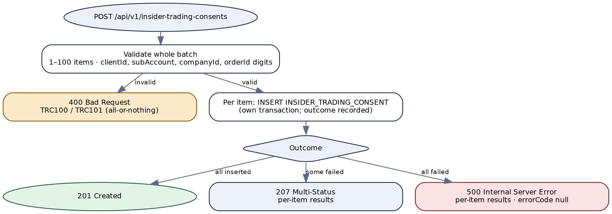

*Figure 14 — Target process flow for recording insider-trading consents*


# 15. Downstream & Internal Services


Nothing in this chapter is exposed through the package's REST resources. A search of the whole export finds no caller for §15.1–§15.4 — but only this package was supplied, so callers in other packages, or direct `/invoke/` calls, cannot be ruled out. Before retiring any of them, check the Integration Server service-usage statistics for the last few months (Appendix E item 12).


## 15.1 List banks — `services:getBank`


> **Internal only — not exposed as an API**
>
> No REST operation and no caller in the package. If a consumer is found, the target is `GET /api/v1/banks` (scope `fit.market-data.read`), reference data, cacheable. Otherwise retire.

| Field | Detail |
|---|---|
| **Signature** | In: none. Out: `responseCode`, `responseMessage`, `correlationID`, `response/banks[]` with 25 fields (`bCode`, `bName`, `eBankName`, `cityCode`, three address lines in Arabic and English, phones, `fax`, `email`, `telex`, `remarks`, `usrCode`, `updTime`, six `b2b*` flags, `segmentID`). |
| **Behaviour** | Correlation id from `pub.utils:generateUUID` (unlike the other services' `GenerateGUID`). Select all rows of `INSIGHT.BANK`; if any, map column for column and `200`; else `1012`. Logs to Seq in a plain sequence **outside** the try, so a logging failure fails the service (FT-31). |
| **Defects** | `updTime` is never populated — the flow copies from `UPD_TIME(1)`, a Designer duplicate-name artefact that does not exist (FT-21). `USR_CODE` is also copied to a phantom `usrCode(1)`. No response body reaches the log. |


### HTTP status code reference


| Legacy `responseCode` | Message | Condition | Target (if kept) |
|---|---|---|---|
| `200` | OK | At least one bank | `200` |
| `1012` | No Data Available | Empty table | `404`, `TRC120` |
| `500` | Internal Server Error | Exception in the try | `500` / `503`, `TRC902` / `TRC901` |


## 15.2 List custodians — `services:getCustodians`


> **Internal only — not exposed as an API**
>
> No REST operation and no caller in the package. If kept: `GET /api/v1/custodians`, and `accountNumber` is returned only with a sensitive-data scope (FT-05).

| Field | Detail |
|---|---|
| **Signature** | In: none. Out: `response/custodians[]` — `code`, `nameA`, `nameE`, `updTime`, `usrCode`, `isDvp`, `custMarkID`, `outSideCust`, `bicCode`, `accountNumber`, `emailAddress`, `cnDisplayNameA`, `cnDisplayNameE`, `segmentID` — plus the envelope. |
| **Behaviour** | Select all rows of `INSIGHT.CB_CUSTODIANS`, map one-to-one, `200` or `1012`. Seq logging outside the try, as §15.1, with nothing mapped into it. |


### HTTP status code reference


| Legacy `responseCode` | Message | Condition | Target (if kept) |
|---|---|---|---|
| `200` | OK | At least one custodian | `200` |
| `1012` | No Data Available | Empty table | `404`, `TRC121` |
| `500` | Internal Server Error | Exception in the try | `500` / `503`, `TRC902` / `TRC901` |


## 15.3 List exchanges — `services:getExchangeInformation`


> **Internal only — not exposed as an API**
>
> No REST operation and no caller in the package. Overlaps §15.4 (both read `INSIGHT.MARKET`); if either is kept, keep one: `GET /api/v1/exchanges`.

| Field | Detail |
|---|---|
| **Signature** | In: none. Out: `response/exchanges[]` — `exchangeID` (`M_CODE`), `exchangeCode` (`M_EXCHANGE`), `exchangeArabicName`, `exchangeEnglishName`, `exchangeArabicShortName`, `exchangeEnglishShortName` — plus `lastError`. |
| **Behaviour** | CustomSQL on `insight.market` for market codes `5, 6, 8, 11, 12, 13` (a commented-out alternative is left in the SQL); 20 columns selected, 6 used. `200` unconditionally — no no-data branch. The catch drops a non-existent field `response(0)`, so a partial `response` can survive an error. |


### HTTP status code reference


| Legacy `responseCode` | Message | Condition | Target (if kept) |
|---|---|---|---|
| `200` | OK | Always on success, even with zero rows | `200`; zero rows → `404`, `TRC122` |
| `500` | Internal Server Error | Exception; `lastError` returned | `500` / `503`, `TRC902` / `TRC901` |


## 15.4 List markets — `services:getMarkets`


> **Internal only — not exposed as an API**
>
> No REST operation and no caller in the package. See §15.3.

| Field | Detail |
|---|---|
| **Signature** | In: none (an undeclared `correlationID` is honoured). Out: `response/markets[]` — `marketID`, `marketName_Ar`, `marketName_En`, `exchange`, `shortName_Ar`, `shortName_En`, `alias_name` — plus the envelope. |
| **Behaviour** | Select `M_CODE, M_NAME, E_M_NAME, M_EXCHANGE, SHORT_NAME_A` from `INSIGHT.MARKET`; in a loop, rewrite `ADSM` to `ADX` when it appears in `exchange`, `marketName_En` **or** `marketName_Ar`; `200 Success`. Logs through `commonUtility.services:logRequest`/`logResponse`, the request as null. |
| **Defects** | `shortName_En` and `alias_name` are mapped from columns the adapter no longer selects, so they are never populated (FT-21). Generic errors return `503` "Internal Server Error. Please try again later.", unlike every other service's `500`. No no-data branch. |


### HTTP status code reference


| Legacy `responseCode` | Message | Condition | Target (if kept) |
|---|---|---|---|
| `200` | Success | Always on success | `200`; zero rows → `404`, `TRC122` |
| `503` | Internal Server Error. Please try again later. | Any exception | `500` / `503`, `TRC902` / `TRC901` |


## 15.5 Insert one insider-trading consent — `v2.wrapper:createInsiderTradingConsent`


> **Internal only — not exposed as an API**
>
> Called only by Chapter 14's service, synchronously, once per item (not through `asyncInvoke`). Its target form is `InsiderConsentRepository.insert(consent)` returning `OperationResult<Void>` (§2.4); it has no public envelope.

| Field | Detail |
|---|---|
| **Signature** | In: `TradingConsentRequest` (one item), `correlationID`. Out: `responseCode`, `responseMessage`. |
| **Behaviour** | Serialise the item for logging (its catch is empty); insert via adapter `insertInsiderTradingConsent`; `result > 0` → `200 success`, else `500 Failure`. Catch: `1069` sets a code with no message (practically unreachable — the wrapper validates nothing); anything else `500 Internal Server Error`. Finally: one Seq record per item, then `clearPipeline` — in the **caller's** pipeline (FT-28). |


### Result mapping


| Legacy `responseCode` | Message | Condition | Target (if kept) |
|---|---|---|---|
| `200` | success | Row inserted | `OperationResult.ok()` → item `CREATED` |
| `500` | Failure | Insert reported no row | `failed(TRC902)` → item `FAILED` |
| `500` | Internal Server Error | Exception | `failed(TRC902 / TRC901)` → item `FAILED` |
| `1069` | (none) | Error text starting with `1069` | Not reproduced |


## 15.6 Scheduled job — expired-KYC report — `schedulers:sendKYCExpiredClientsToCS` (deprecated)


> **Internal only — scheduled job**
>
> Runs from an Integration Server scheduler trigger whose timing is not in the package. Target: `KycExpiredReportJob`, `@Scheduled(cron = "${fit.reports.kyc-expired.cron}")` with ShedLock.

1. Read recipients from static data `MIDDLEWARE` / `EXPIRED_KYC_USERS_REPORT_TO_EMAIL` and `…_CC_EMAIL` (§3.2); the look-ups' own status is not checked.
2. Run adapter `getKYCExpiredClientsForCS`: main clients not prevented from trading, not deleted, whose classification expired **30 or more days** ago, with `ENFORCEKYC = 'Y'` on their user — ordered by expiry date (SQL in Appendix C.5).
3. No rows → set `1012` and stop — **no e-mail**.
4. Build a CSV — header `FIT Number,Customer Name,Creation Date,Risk Classification,Classification Date,Classification Expiry Date,Prevent from Trading` — joining values with commas and no quoting (FT-24); convert it with `commonUtility.java:convertCSVFileToExcelBase64`; send template `EXPIRED_KYC_USERS_REPORT` with attachment `Expired KYC Clients.xls` (content type `MSEXCEL`).
5. Any exception → `503` in the pipeline and a Seq record (without `serviceName`); the scheduler sees success; no alert (FT-24).

> **Verify: the report adapter declares no output columns (FT-11)**
>
> The adapter `getKYCExpiredClientsForCS` has **no output columns** configured — its result fields and output signature are empty — while the flow reads `results[]/FIT_NUMBER` and six other columns by hand-typed paths. The same is true of `getIndices`, `getSymbolMarketInformation`, `getExchangeMaster` and v1 `getClientMainAccountInformation`, which serve live APIs — so the adapter most likely returns rows keyed by the database column labels at run time, and the job most likely works. That runtime behaviour is **NOT DETERMINABLE** from the export; if it does not hold, this job never e-mails (and those four services return no data). **Confirm on the production server** that the report has been received recently (Appendix E item 13). The target maps every column explicitly, so it does not depend on this behaviour.


### Target design and outcome codes


| Outcome | Legacy | Target |
|---|---|---|
| Rows found, e-mail sent | `200` OK (pipeline only) | Log `INFO` with row count; metric `fit_report_rows{report=kyc-expired}`. |
| No rows | `1012`, no e-mail | Send the e-mail with "no clients overdue" — a silent day is indistinguishable from a broken job. **Confirm** (Appendix E item 13). |
| Recipient lookup / DB / e-mail failure | `503`, swallowed | Log `ERROR` with `TRC901` / `TRC902` / `TRC906`; alert on the job-failure metric; ShedLock releases for the next run. |
| Backlog | Every run re-sends every client overdue ≥ 30 days — no upper bound | Unchanged unless the owner wants a window; state it in the e-mail text. |
| File format | CSV text turned into "xls" by an external converter; actual format NOT DETERMINABLE | Real `.xlsx` via Apache POI; values written as cell text, so a leading `=` is never evaluated (FT-24). |


## 15.7 Scheduled job — onboarding audit report — `schedulers:sendOnboardingAuditLog` (deprecated)


> **Internal only — scheduled job**
>
> Trigger not in the package. Target: `OnboardingAuditReportJob` with ShedLock, reading the Middleware database.

1. `days` defaults to `0` **only if absent** — it is an undeclared input a scheduler task or a direct `/invoke` caller can override. Recipients from `MIDDLEWARE` / `ONBOARDING_AUDIT_LOG_TO_EMAIL` and `…_CC_EMAIL`.
2. Failed onboardings: adapter `getOnboardingAuditLog` (DynamicSQL on `MiddlewareConnection:Middleware`) with the WHERE clause built as text — `where (trunc(created_at) >= trunc(SYSDATE) - <days>) and (IS_FIT_API_SUCCESS = 'N' or IS_DMS_UPLOADED = 'N' or IS_CM_EMAIL_SENT = 'N' or IS_CLIENT_EMAIL_SENT = 'N')` (FT-04).
3. No failed rows → `1012` and stop — **no e-mail, not even the counts** (FT-24).
4. Build a CSV of the failed rows (header `Usercode,FIT Number,Onboarding Type,Is Client Created/Updated,Is DMS Uploaded,Is CM Email Sent,Is Client Email Sent,Onboarding datetime`), convert as §15.6.
5. Three more queries count `FINOUX`, `DFM` and `MIGRATION` onboardings in the window (each fetching full rows only to count them). `total = dfm + normal + migrations`; `success = total − failed`.
6. Send template `FAILED_ONBOARDING_AUDIT_LOG` with attachment `Failed onboardings.xls` and seven positional placeholders: `days`, `normalOnboardings`, `dfmOnboardings`, `migrations`, `totalOnboardings`, `successOnboardings`, `failedOnboardings`.

> **Business-logic observations for the target design**
>
> **Counts do not add up.** `failed` counts every onboarding type, `total` only three; if any other type exists, `success` is understated and can go negative. Target: count per type with one `GROUP BY` query and compute failed per type.
>
> **Window.** With `days = 0` the window is "since midnight today, database clock", so what a run covers depends on when it fires — NOT DETERMINABLE. Target: an explicit window in configuration (for example "the previous calendar day, Asia/Dubai").
>
> **Injection.** `days` becomes a bound integer parameter.


### Target design and outcome codes


| Outcome | Legacy | Target |
|---|---|---|
| Failures found | `200`, e-mail with counts and attachment | Same content; `.xlsx` via Apache POI. |
| No failures | `1012`, no e-mail | E-mail with the counts and no attachment. **Confirm** (Appendix E item 13). |
| Any error | `503`, swallowed; Seq log without `serviceName` | `ERROR` log with `TRC903` (Middleware DB) / `TRC906` (e-mail); job-failure alert. |


## 15.8 Adapters with no caller


Thirteen of the 34 adapters are not invoked by any Flow service in the package. They are listed so their SQL is not lost; none needs migrating unless a consumer outside the package is found.

| Adapter | Template | Reads |
|---|---|---|
| `getClientInsiderData` | Select | `INSIGHT.VW_CLIENTS_INSIDER` |
| `getInsiderData` | Select | `INSIGHT.VW_CLIENTS_INSIDER` |
| `getMarginTradingConsent` | DynamicSQL | Margin-trading consents (read-back; see §13.3) |
| `getClientSubAccountInformationBackup` | CustomSQL | Older copy of the sub-account query (§4.3.2) |
| `getCustomerInformationForMigration` | CustomSQL | `CB_MAIN_CLIENT` / `TBLUSERS` customer extract |
| `getClosingPrice` | Select | `dfn_his_data` |
| `getDailyHistoricalPrices` | DynamicSQL | `insight.dfn_his_data` with a row count |
| `getOHLCData` | CustomSQL | `cb_prices` joined to `cb_sec_comp` and `market` |
| `getSectors` | Select | `RMZ.DWH_SECTORS` |
| `getTickersForFinancials` | CustomSQL | `insight.cb_sec_comp` |
| `getPortfolioManagerByFITNumber` | CustomSQL | Portfolio manager by main client |
| `getWithdrawableBalance` | StoredProcedureWithSignature | Procedure `GET_CLIENT_WITHDRAWABLE_BAL` |
| `ifNINOrTradingNumberExist` | CustomSQL | Existence check on NIN / trading number |


# 16. Data Mapping Reference


Mappings for Chapters 5–14 are given in each chapter's Response Schema. This chapter holds the ones too large for that: the client profile, and the decode rules shared by the profile's fields.


## 16.1 Client profile — Broker Insight to target


Source expressions are from the v2 adapter SQL (`v2.adapters:getClientMainAccountInformation`) unless marked v1. `MC` = `INSIGHT.CB_MAIN_CLIENT`, `CC` = the selected `INSIGHT.CB_CLIENT` row, `U` = `INSIGHT.TBLUSERS`. "Default" is what legacy returns when the column is null (`''` unless stated); the target returns `null`.


### personalInformation


| Target field | Source | Transform | v1 difference |
|---|---|---|---|
| `clientID` | `MC.CL_MAIN_CLIENT_ID` | String | — |
| `fullNameEn` / `fullNameAr` | `MC.CLE_CLIENT_NAME` / `MC.CLA_CLIENT_NAME` | — | — |
| `clientType` | `CL_TYPE.E_T_DESC` for `MC.CL_CLIENT_TYPE` | — | — |
| `idType1` / `idType2` | `ID_TYPE.E_I_DESC` for `MC.CL_ID_TYPE` / `CL_ID_TYPE2` | — | — |
| `idNumber1` / `idNumber2` | `MC.CL_ID_NO` / `CL_ID_NO2` | Sensitive | — |
| `idExpiry1` / `idExpiry2` | `MC.CL_ID_EXP` / `CL_ID_EXP2` | `DATE` → LocalDate (legacy casts to text) | — |
| `idIssuePlace1` / `idIssuePlace2` | `MC.CL_ID_ISSUE_PLACE` / `CL_ID2_ISSUE_PLACE` | — | Mapped then deleted — never returned |
| `preventTrading` | `MAIN_PREVENT_TRADING = 'Y' OR MAIN_BLACK_LISTED = 'Y'` | `Y`/`N` → Boolean | — |
| `dateOfBirth` | `MC.CL_BIRTH_DATE` | → LocalDate | — |
| `mobile` / `email` | `MC.CL_PHONE_2` / `MC.CL_EMAIL` | Masked in logs | — |
| `accountOpenDate` | `MC.CREATION_DATE` | → LocalDate | — |
| `gender` | `MC.GENDER`: `0` → `M`, `1` → `F`, else `''` | `''` → null | — |
| `hasSignature` | `CL_MAIN_CLIENT_ID IN (CB_CLIENT_SIGNATURES.MAIN_CLIENT_ID)` | `Y`/`N` → Boolean | — |
| `isUAEResident` | `MC.CL_RESIDENCY` | Raw — value list to confirm | — |
| `nationality` | `NATIONALITY.NAT_SIGN` for `MC.CL_NATION` | String | — (both link with an index on a scalar) |
| `etihadGuestNumber` | `MC.ETIHADGUESTNUMBER` | —; no legacy default (absent when null) | — |
| `riskClassification` | `MC.RISK_CLASSIFICATION` | — | Not returned |
| `isDeleted` (legacy `isSuspended`) | `MC.CB_DEL_FLAG` | → Boolean — confirm values | Not returned |
| `isDormant` | `CC.IS_DORMANT` | → Boolean — confirm values | Not returned |
| `isPEP` | `MC.CL_PEP` | → Boolean — confirm values | Not returned |
| `isKYCRequired` | `U.ENFORCEKYC = 'Y'` → `'true'`/`'false'` | → Boolean | — |
| `kycExpiryDate` | `TO_CHAR(MC.CLIENT_CLASSIF_EXPIRY_DATE, 'MM/DD/YYYY HH:MI:SS AM')` | Read the `DATE` directly → LocalDate | `LAST_DAY(ADD_MONTHS(MC.UPD_TIME, 12))` |
| `externalOnboardingStatus` | DFM `ACCOUNT_STATUS` | `PENDING_KYC_UPDATE` → `PENDING`; `DONE` → `DONE`; else null | Not returned (v1 sets `reasonForKYC='EXTERNALLY_ONBOARDED'` instead) |


### addressDetails, fatca, bankDetails


| Target field | Source | Transform |
|---|---|---|
| `addressDetails.country` | `COUNTRY.ISO_CODE` for `MC.CL_COUNTRY` | ISO 3166 code (alpha-2 or alpha-3 — confirm) |
| `addressDetails.city` / `pobox` / `unit` / `details` | `MC.CL_CITY_CODE` / `CL_PO_BOX` / `UAE_FLAT_NO` / `CLA_ADDRESS1` | — |
| `fatca.isUSAResident` | `CC.UAE_IS_AMERICAN = 'Y'` | `'true'`/`'false'` → Boolean |
| `fatca.hasUSAResidenceAddress` | `CC.US_HOLD_ADDRESS = 'Y'` | → Boolean |
| `fatca.hasUSAStandingInstruction` | `CC.US_TRANSFER_INSTR = 'Y'` | → Boolean |
| `fatca.isUSAPOAHolder` | `CC.US_POA_HOLDER = 'Y'` | → Boolean |
| `bankDetails.IBAN` | `LTRIM(CC.CL_IBAN, '0')` | Sensitive |
| `bankDetails.accountNumber` | `LTRIM(CC.CL_BANK_ID, '0')` | Sensitive |
| `bankDetails.swiftCode` / `bankName` | `CC.SWIFT_CODE` / `CC.CL_BANK_NAME` | — |
| `bankDetails.bankCountry` | `COUNTRY.ISO_CODE` for `CC.CL_BANK_COUNTRY` | ISO 3166 |


### knowYourCustomer and insider


| Target field | Source (v2) | Transform | v1 difference |
|---|---|---|---|
| `previousEquitiesExperience` | `MC.EQUIT_EXPER` | Experience decode (§16.2) | Opposite decode |
| `previousFixedIncomeExperience` | `MC.FIXED_INC_EXPER` | Experience decode | Opposite decode |
| `previousStructuredProductsExperience` | `MC.FUTURES_EXPER` | Experience decode | Opposite decode |
| `futureEquitiesExperience` | `MC.INV_HORIZON_EQUITIES` | Experience decode | Opposite decode |
| `futureFixedIncomeExperience` | `MC.INV_HORIZON_FIXED` | Experience decode | Opposite decode |
| `futureStructuredProductsExperience` | `MC.INV_HORIZON_ETF` | Experience decode | Opposite decode |
| `previousInvestmentFrequency` | `PRV_INVESTMENT_FREQUENCY`: `O`→1, `M`→2, `D`→3 | → Integer | Raw code |
| `previousAttitudeToFinancialInstruments` | `PRV_INVESTMENT_ATTITUDE`: `B`→1, `P`→2, `E`→3 | → Integer | Raw code |
| `riskTolerance` | `RISK_TOLERANCE`: `0`→1 … `3`→4 | → Integer | Raw code |
| `investmentStrategy` | `INV_STRATEGY_LOW='Y'` → `S`; `INV_STRATEGY_MED='Y'` → `M`; else `L` (including both null) | enum | — |
| `futureInvestmentHorizon` | `MC.FUT_INVESTMENTHORIZON` | — | Not returned |
| `futureNetWorthToInvest` | `MC.fut_netWorthToInvest` | — | — |
| `investmentObjectives` | `MC.fut_invObjectives` | Position list (§16.2) | — |
| `recommendedClientClassification` | `MC.calculatedClientClassification` | Classification decode (§16.2) | `O` → RETAIL, else PROFESSIONAL |
| `selectedClientClassification` | `MC.selectedClientClassification` | Classification decode | As above |
| `recommendedRiskAppetite` / `selectedRiskAppetite` | `MC.calculatedRiskAppetite` / `selectedRiskAppetite` | — | — |
| `annualIncome` | `MC.CL_ANNUAL_INCOME` | — | Always `''` |
| `annualIncomeCurrency` | `MC.ANNUAL_INC_CUR` | ISO 4217 | — |
| `netAssets` | `MC.GROSS_INCOME` | Name kept; source noted | — |
| `netAssetsCurrency` | Literal `'AED'` | — | — |
| `financialObligations`, `isCreditFacility`, `isLicensedByAuthority` | `MC.fin_obligations`, `isCreditFacility`, `isLicensedByAuthority` | Raw | — |
| `currentOccupation` | `MC.OCCUPATION_LOOKUP_ID` | Lookup id | — |
| `previousOccupation` | `MC.fin_previousOccupation` | — | Always `''` |
| `industry` | `MC.fin_industry` | — | — |
| `currentEmployerNameAndAddress` | `NVL(MC.CB_EMP_DETAILS, MC.CB_EMP_ADDRESS)` | — | `CB_EMP_DETAILS` only |
| `previousEmployerNameAndAddress` | `MC.FIN_PREVIOUSEMPNAMEADR` | — | — |
| `sourceOfIncome` | Rows of `CLIENT_INCOME_SOURCE.CL_SOURCE_OF_FUND` for the client | List (legacy: `LISTAGG` then split on `,`) | Raw string `MC.CL_SOURCE_OF_FUND` |
| `daily`/`weekly`/`monthlyStatementFrequency` | `MC.STATEMENTFREQUENCY LIKE '%D%'` / `'%W%'` / `'%M%'` | `Y`/`N` → Boolean | — |
| `recommendedProducts.*` | `MC.SYSTEMGENERTEDPRODUCTS` | Product decode (§16.2) | `MC.recommendedProducts` |
| `selectedProducts.*` | `MC.INVEST_PLAN` | Product decode | Positions 1–2 written to `recommendedProducts` (FT-16) |
| `insider.relativesInAlRamz` | `CC.IS_RELATED_PARTY` | Raw — confirm values | `EMP_RELATEDTOEMPLOYEE = '1'` → `Y`/`N` |
| `insider.isExecutiveOrInsider` / `isBoardMember` / `holds5PercentOrMore` | Distinct `CB_RESTRICTED_SHARES.RE_COMP_ID` with `RE_FORM` 2 / 3 / 4 | List of rows | Always `[]` |


### crs[] and subAccountInformation[]


| Target field | Source | Transform |
|---|---|---|
| `crs[].country` | `COUNTRY.ISO_CODE` for `CB_CLIENTS_CRS.country_id` (legacy column `csr_country`) | ISO 3166 |
| `crs[].hasTIN` | `TIN IS NOT NULL` → `'1'`, else `'2'` | → Boolean |
| `crs[].TIN` | `insight.cryptor(TIN, 'd')` | Decrypted in the database; sensitive |
| `crs[].noTINReason` | `WHY_NO_TIN` (`A`/`B`/`C`) | — |
| `crs[].whyNoTINIssued` | `A` → Country does not issue TIN; `B` → Investor not able to get TIN; `C` → No TIN required | — |
| `subAccountNumber` / `subAccountName` | `CB_CLIENT.CL_CLIENT_ID` / `CLE_CLIENT_NAME` | — |
| `nin` / `tradingNumber` | `NIN` / `bv_par_cl_nin_det.C_Account` | — |
| `subAccountType` | `ACC_TYPE.E_I_DESC` for `CL_CLIENT_TYPE` | — |
| `exchange` / `currency` / `isIslamic` | `exchange_ID` / `CUR_CODE` / `IS_ISLAMIC` | — |
| `preventTrading` | `CL_PREVENT_TRADING = 'Y' OR CL_BLACK_LISTED = 'Y'` | → Boolean |
| `isCashPoolAccount` / `isInternationalTradingAccount` | `cash_pool_account` / `UPPER(international_trading)` | Raw |
| `marketFees[].equityCommission` / `futureCommission` / `bondsCommission` | `rmz.totalCommPercWDis(market, 1 / 3 / 2, CL_CLIENT_ID, CUR_CODE)`; market ADX=6, DFM=5, TDWL=11, DIFX=8, MSX=13, BHB=12 | → BigDecimal |
| `marketFees[].additionalFees` | `CB_MARKET_MIN_COMM.ADDITIONAL_FEES` for the market, type `1`, the sub-account currency — with VAT for ADX and DFM, `NVL(…, 0)` for the others | → BigDecimal; `additionalFeesIncludeVat` true for ADX, DFM |
| `marginTradingConsent` | Latest `MARGIN_TRADING_CONSENT.STATUS` by `CREATED_DATE` for (main, sub) | `A` / `C` |


## 16.2 Decode rules


### Experience (six fields)


| Stored value | v1 returns | v2 and target return |
|---|---|---|
| `000001` | 1 | 6 |
| `000010` | 2 | 5 |
| `000100` | 3 | 4 |
| `001000` | 4 | 3 |
| `010000` | 5 | 2 |
| `100000` | 6 | 1 |
| anything else | the stored value unchanged | v2: unchanged; target: `null`, logged |

The two versions disagree on which end of the bit pattern is "most experienced". The target follows v2 because it is the newer service; the business meaning must be confirmed before go-live (Appendix E item 14).


### Products (nine positions of `SYSTEMGENERTEDPRODUCTS` / `INVEST_PLAN`)


Each position is one character; `1` → `true`, anything else or a missing position → `false`. Legacy splits the string with `commonUtility.java:stringToStringList`, whose behaviour is outside the package — splitting into single characters is inferred from how the result is indexed.

| Position | v1 field | v2 and target field |
|---|---|---|
| 1 | `uaeCash` | `uaeCash` |
| 2 | `uaeMargin` | `uaeMargin` |
| 3 | `uaeIslamic` | `uaeIslamic` |
| 4 | `uaeShortTermMargin` | `uaeShortTermMargin` |
| 5 | `uaeFutures` | `uaeFutures` |
| 6 | `skyOneFund` | `skyOneFund` |
| 7 | `uaeShortSell` | `fixedIncome` |
| 8 | `fixedIncome` | `internationalCash` |
| 9 | `internationalCash` | `uaeShortSell` |


### Investment objectives


`fut_invObjectives` is a string of flags. Each position holding `1` contributes its 1-based position to the list: `"100100"` → `[1, 4]`. Same in both versions.


### Client classification


| Stored (upper-cased) | v1 | v2 | Target |
|---|---|---|---|
| `O` | `RETAIL` | `1` | `RETAIL` |
| `P` | `PROFESSIONAL` | `2` | `PROFESSIONAL` |
| other value | `PROFESSIONAL` | the value | `null`, logged |
| null | `PROFESSIONAL` (FT-17) | `''` | `null` |


# Appendix


## A. Pseudocode (as built)


Condensed from the Flow XML; line numbers are `flow.xml` lines of the named service.


### A.1 v2 getClientInformation


```
requestTimestamp = now(GMT+4); requestBody = json({userCode, fitNumber}) or '{ }'
correlationID = correlationID if non-blank else GenerateGUID()
if userCode non-blank:
    inputList += {userCode, isNumeric=Y}; condition = 'insight.TBLUSERS.userID = ' + userCode   // L1579
    if fitNumber non-blank:
        inputList += {fitNumber, isNumeric=N}                                                   // FT-03
        condition = condition + 'AND insight.CB_MAIN_CLIENT.CL_MAIN_CLIENT_ID = ' + fitNumber     // no space
elif fitNumber non-blank:
    inputList += {fitNumber, isNumeric=N}; condition = 'insight.CB_MAIN_CLIENT.CL_MAIN_CLIENT_ID = ' + fitNumber
else: responseCode, responseMessage = '400', 'Bad Request'
if inputList: commonValidator.validateInputList(inputList)       // must set responseCode='200'
if responseCode == '200':                                         // FT-10
    row = DynamicSQL('... where ${condition}')[0]
    if row.FIT_NUMBER is null: responseCode = '1034'; stop
    map ~76 columns; if userCode blank: userCode = row.USER_CODE
    split FIN_SOURCEOFINCOME and three insider LISTAGGs on ','
    decode six experience fields (000001->6 ... 100000->1), objectives, products, classification
    crs[] = getCRSForMigration(row.FIT_NUMBER)                      // TIN decrypted in SQL
    dfm = getDFMOnboardingRequest(USER_CODE=userCode)[0].ACCOUNT_STATUS
    externalOnboardingStatus = {PENDING_KYC_UPDATE:'PENDING', DONE:'DONE'}.get(dfm, '')
    apply ~80 defaults ('' or []); drop reasonForKYC, externalOnboarding
    response.subAccountInformation = getClientSubAccountInformation(userCode)
    responseCode, responseMessage = '200', 'OK'; responseBody = json(response)
    set four mock proofOfResidence* fields = ''                      // after responseBody
catch: restore requestBody, requestTimestamp, correlationID from lastError.pipeline
    if error starts '1069': responseCode='1069'; message = error.replace('1069', 'Middleware system validation error : ')
    else responseCode, responseMessage = '500', 'Internal Server Error'
finally: SEQDatalust.asynchronousIngestion(<whole pipeline>)
         clearPipeline(keep responseCode, responseMessage, response, correlationID)
```

v1 differs as listed in §4.3.3; structurally it has the same try/catch/finally shape, with `isNumber` validation that exits by failure (FT-09), `503` in the catch, and `eTradeFIT` logging gated by `seqLogFlag`.


### A.2 getSymbolInformation


```
if symbol and not exchange:  responseCode='1010'; exit failure -> catch (keeps 1010)
if isinCode and not exchange: responseCode='1010'; exit failure -> catch
conditions = []
if symbol:   conditions += "(upper(sc_exchange) = upper('" + exchange + "') and upper(ticker_id) = upper('" + symbol + "') )"
if securityType == 'BONDS': conditions += "UPPER(SC_IS_BONDS) = 'Y'"
elif securityType:          conditions += "UPPER(CB_MARKET_BOOK.BOOK_NAME_E) = UPPER('" + securityType + "')"
if isinCode: conditions += "(sc_exchange = '" + exchange + "' and SC_ISIN_CODE = '" + isinCode + "' )"
if exchange: conditions += "upper(SC_EXCHANGE)= upper('" + exchange + "') "
condition = 'AND ' + ' and '.join(conditions)                 // FT-01
response[] = DynamicSQL(<fixed select> + '${condition}')
if response[0] is null: responseCode, responseMessage = '1012', 'No Data Available'
rename ~45 columns to camelCase; set 200/OK only if no code yet
catch: drop response; set 500 / Internal Server Error / status=Error only if absent
```


### A.3 Share-transfer automation


```
getShareTransferRequests(date):
    correlationID = supplied or GUID; validateInputList([{date, length 10, optional, isDate}])
    if responseCode != '200': return validator result
    try:   cursor, P_Flag = SP_GET_AUTO_SHARE_TRANSFER_REQUESTS(date)
    catch: return 402 'Request Failed'
    code = {0:'200', 1:'1012', 99:'1123'}.get(P_Flag, '402')
    if cursor is empty: code = '1012'                              // overrides 99 / 402 (FT-13)

processShareTransfer(requestID, status, brokerFees, marketFees, vat):
    validate all five; brokerFees, marketFees, vat never used after this  // FT-12
    PRES, PDOCN = SP_PROCESS_AUTO_SHARE_TRANSFER(requestID, status)
    response.docNo = PDOCN                                          // for every PRES
    code = {0:'200', 1:'1122', 2:'1123', 3:'1124', 4:'1125', 5:'1126'}.get(PRES, '402')
    on exception: 500
```


### A.4 Consents


```
createTradingMarginConsent(clientID, subAccount, status, email):
    schema.validate(marginTradingConsent) else throw '1069 <path><msg>'
    result = INSERT MARGIN_TRADING_CONSENT(clientID, subAccount, status)   // email not stored
    if result > 0 and status == 'A': asyncInvoke(sendEmail, to=email,
                                         template=POST_LEVERAGE_TRADE_NOTIFICATION); 200 success
    elif result <= 0: 500 'Consent not Inserted in Table'
    else: 200 success
    catch: 1069 -> validation message; else 500 with the raw exception text

createInsiderTradingConsent(TradingConsentRequest[]):
    schema.validate(tradingConsent) else throw '1069 ...'           // all-or-nothing
    successOrderCount = failureOrderCount = '0'
    for item in TradingConsentRequest:                               // empty list: no code set
        code = wrapper.createInsiderTradingConsent(item)             // INSERT, 200 or 500
        if code == '200': successOrderID += item.orderID; successOrderCount++
        else:             failureOrderID += item.orderID; failureOrderCount++
        responseCode, responseMessage = '200', 'success'             // even if every item failed
```


## B. Findings register


Severity is this document's assessment. Each finding cites the chapter where its consequence for the target is handled.

| ID | Severity | Finding | Where handled |
|---|---|---|---|
| FT-01 | Critical | `getSymbolInformation` splices `exchange`, `symbol`, `isinCode` and `securityType` into SQL text through a DynamicSQL `${condition}`. | §6.3, §6.8 |
| FT-02 | Critical | `getSymbolsClosingPrice` splices `securities[].exchangeCode` into `exchange='${exchange}'` in adapter `getClosingPriceDate`. | §7.3 |
| FT-03 | Critical | v2 `getClientInformation` splices `fitNumber` (registered with the validator as `isNumeric='N'`, so never checked as numeric) and `userCode` into `where ${condition}`, without even a space before `AND`. A tautology returns another client's full profile with decrypted TIN. | §4.2, §4.3 |
| FT-04 | High | `sendOnboardingAuditLog` builds its WHERE clause from `days`, an undeclared input that a scheduler task or `/invoke` caller can override. | §15.7 |
| FT-05 | High | Personal data without an authorization boundary: decrypted TIN, IBAN, identity numbers (client profile); bulk names, e-mails, mobiles (customers by date); custodian account numbers. All services have `check_internal_acls=no`. | §3.4, §4.5, §10 |
| FT-06 | High | Personal data in logs: v1 profile logs the full response when the caller sends `seqLogFlag='Y'` and the error text on errors; v2 ships the whole pipeline on every call; pipeline-save enabled on the two consent services and `getSymbolsClosingPrice`. | §3.4 |
| FT-07 | High | Transport HTTP status is always `200`; outcomes travel only in a string `responseCode`. | Every §x.6 |
| FT-08 | High | Internal error detail returned to callers: `lastError` (index, securities, exchanges, automation services), raw exception text (margin consent `500`, instrument prices `1061`). | §3.4, §5.3, §11.3, §13.5 |
| FT-09 | High | v1 profile sets `1035` and then exits by failure, so callers get an IS error instead, and logging is skipped. | §4.3 |
| FT-10 | High | v2 profile runs its query only if the external validator sets `responseCode='200'`; otherwise no data is fetched and the caller gets whatever code the validator set, or none at all. | §4.3 |
| FT-11 | Medium | Adapter `getKYCExpiredClientsForCS` (like `getIndices`, `getSymbolMarketInformation`, `getExchangeMaster` and v1 `getClientMainAccountInformation`) declares no output columns; the flows depend on undocumented runtime label-keyed results. If that behaviour does not hold, the KYC job never e-mails. | §15.6 |
| FT-12 | High | `processShareTransfer` validates `brokerFees`, `marketFees` and `vat` and then ignores them. | §12.2 |
| FT-13 | Medium | `getShareTransferRequests` lets an empty cursor override the procedure's failure flag with `1012`. | §11.3 |
| FT-14 | Medium | Consents: no duplicate or idempotency check; a retry inserts and e-mails again; the notification recipient is caller-supplied, unchecked and not stored; an `asyncInvoke` failure returns `500` after the row is committed. | §13.3, §14.3 |
| FT-15 | Medium | Insider consents return `200 success` when every item failed, no `responseCode` for an empty list, and no generated correlation id. | §14.3 |
| FT-16 | Medium | v1 profile writes selected products 1–2 into `recommendedProducts`, so `selectedProducts.uaeCash`/`uaeMargin` go missing and the recommendation is overwritten. | §4.3.3 |
| FT-17 | Medium | v1 and v2 profiles encode the same field names differently (experience reversed, classification, product positions 7–9, `relativesInAlRamz`); v1 reports a null classification as `PROFESSIONAL`. | §4.3.3, §16.2 |
| FT-18 | Medium | Non-deterministic rows: `rownum = 1` inside a join condition (v2 bank/FATCA row); first-row picks with no `ORDER BY` in the main query and the DFM look-up. | §4.3 |
| FT-19 | Medium | Closing prices: bad `interval` reported as `500` and not logged; message truncated to "Internal Server"; ticker resolved by ISIN without exchange; unbounded history scan. | §7.3 |
| FT-20 | Medium | Instrument prices: several matches reported as "no closing price"; nothing requires ticker or ISIN; ISIN validation key not indexed; `DATE` equality misses rows with a time. | §8.3 |
| FT-21 | Medium | Declared and actual contracts differ: index field names and `marketIndexCode`; `exhangeBook`; market-watch raw labels; empty declared records for the profile; `getMarkets` and `getBank` fields never populated. | §5.3, §6.3, §9.3, §15 |
| FT-22 | Medium | Market watch: left join acting as inner join, join on ticker only; request logged as null. | §9.3 |
| FT-23 | Medium | Unbounded result sets and caller-supplied `LIKE` wildcards; empty strings match nothing. | §5.2, §6.1, §9.2, §10 |
| FT-24 | Medium | Report jobs: errors swallowed; no e-mail on a zero-row run (audit counts lost); KYC backlog re-sent every run; audit counts inconsistent; CSV built without escaping. | §15.6, §15.7 |
| FT-25 | Low | Dates and numbers cast to text in SQL, so their format depends on the database session; formats differ within one response. | §4.5, §6.5 |
| FT-26 | Low | Time zones mixed: JVM default, fixed `GMT+4`, and database `SYSDATE`. | §3.2, §7.3 |
| FT-27 | Low | Customers by date: misleading field names; 29 February accepted for every year. | §10.2, §10.3 |
| FT-28 | Low | Insider consent: catch copies from `pipeline` before `getLastError` creates it; the wrapper clears the caller's pipeline; `responseTimestamp` never set on success paths. | §14.3, §15.5 |
| FT-29 | Low | Margin consent has four different names; v2 profile carries four mock fields, one misspelt. | §13.1, §4.5 |
| FT-30 | Info | Dead code: 13 uncalled adapters, 4 unexposed services, disabled steps in v1 profile (split, DFM cases, mock fields) and margin consent (synchronous e-mail). | §15 |
| FT-31 | Low | Market watch uses `throwExceptionForRetry` for validation; `getBank`/`getCustodians` log outside their try, so a logging failure fails them. | §9.3, §15.1 |
| FT-32 | Low | The `1069` message rewrite replaces every occurrence of `1069` in the error text, not just the prefix. | §4.3.1, §8.3 |


## C. Persistence, SQL and type mapping


### C.1 Database objects used


The target is granted exactly these; it creates or alters nothing in Broker Insight.

| Object | Kind | Access | Used by |
|---|---|---|---|
| `INSIGHT.CB_MAIN_CLIENT`, `CB_CLIENT`, `TBLUSERS`, `CL_TYPE`, `ID_TYPE`, `COUNTRY`, `NATIONALITY`, `CB_CLIENT_SIGNATURES`, `CB_CLIENTS_CRS`, `CLIENT_INCOME_SOURCE`, `CB_RESTRICTED_SHARES`, `bv_par_cl_nin_det`, `ACC_TYPE`, `CB_MARKET_MIN_COMM` | Tables | SELECT | Client profile |
| `INSIGHT.cryptor`, `RMZ.totalCommPercWDis` | Functions | EXECUTE | Client profile |
| `CB_CURRENT_INDEX` (unqualified in legacy SQL) | Table | SELECT | Market indices |
| `CB_SEC_COMP`, `SECTORS`, `CB_MARKET_BOOK` (unqualified), `INSIGHT.dfn_his_data`, `INSIGHT.CB_PRICES`, `INSIGHT.cb_market_watch` | Tables | SELECT | Chapters 6–9 |
| `INSIGHT.GET_RMS_CUST_INFO`, `SP_GET_AUTO_SHARE_TRANSFER_REQUESTS`, `SP_PROCESS_AUTO_SHARE_TRANSFER` | Procedures | EXECUTE | Chapters 10–12 |
| `INSIGHT.MARGIN_TRADING_CONSENT`, `INSIDER_TRADING_CONSENT` | Tables | SELECT, INSERT | Chapters 13–14, client profile |
| DFM onboarding requests (owned by `DFMIntegrations`) | Table or view | SELECT (one column) | Client profile |
| `onboarding_audit_log` (Middleware DB) | Table | SELECT | §15.7 |
| `INSIGHT.BANK`, `CB_CUSTODIANS`, `MARKET` | Tables | SELECT | §15.1–§15.4, only if kept |


### C.2 Target main-account query (client profile)


The v2 select list (§16.1) with three changes: bound parameters instead of `${condition}`; exactly one bank/FATCA row per client chosen by `ROW_NUMBER()` instead of `rownum` inside the join; no join to `ACCOUNT_OPEN_REQUESTS`. The tie-break `ORDER BY CL_CLIENT_ID` is a proposal — confirm which AED cash sub-account holds the authoritative bank details.

```
SELECT /* v2 select list, §16.1 */ ...
  FROM INSIGHT.CB_MAIN_CLIENT MC
  LEFT JOIN INSIGHT.TBLUSERS U ON U.BVUSERID = MC.CL_MAIN_CLIENT_ID
  LEFT JOIN (SELECT C.*, ROW_NUMBER() OVER (PARTITION BY C.CL_MAIN_CLIENT_ID
                                           ORDER BY C.CL_CLIENT_ID) AS RN
               FROM INSIGHT.CB_CLIENT C
              WHERE C.CL_CLIENT_TYPE = '1' AND C.CUR_CODE = 'AED') CC
         ON CC.CL_MAIN_CLIENT_ID = MC.CL_MAIN_CLIENT_ID AND CC.RN = 1
 WHERE (:fitNumber IS NULL OR MC.CL_MAIN_CLIENT_ID = :fitNumber)
   AND (:userCode  IS NULL OR U.USERID = :userCode)
```


### C.3 Legacy SQL kept by the target


These adapters' SQL is reproduced in the source extraction and carried over unchanged apart from binding: `getClientSubAccountInformation` (bind `userCode`), `getCRSForMigration` (bind FIT number), `getIndices`, `getSymbolMarketInformation`, `getInstrumentsClosePrice` (as a four-bind join), `getBank`, `getCustodians`, `getMarkets`, `getExchangeMaster`. The four text-built statements are replaced:

| Legacy adapter (template) | Legacy text | Target |
|---|---|---|
| `getSymbolInformation` (DynamicSQL) | `… and upper(cb_sec_comp.is_derivative) = 'N' ${condition}` | Optional bound predicates, §6.8 |
| `getClosingPriceDate` (DynamicSQL) | `SELECT cls,dt FROM insight.dfn_his_data WHERE symbol = '${symbol}' AND exchange='${exchange}' AND dt <= TO_DATE('${targetDate}', 'YYYY/MM/DD') ORDER BY dt DESC` | Same with `:symbol`, `:exchange`, `:targetDate` (a `DATE`) and `FETCH FIRST 1 ROW ONLY` |
| `v2.getClientMainAccountInformation` (DynamicSQL) | `… where ${condition}` | C.2 |
| `getOnboardingAuditLog` (DynamicSQL) | `select … from onboarding_audit_log ${condition} order by created_at desc` | Two fixed queries — failed rows, and counts `GROUP BY ONBOARDING_TYPE` — with `:from` / `:to` bound |


### C.4 Tables written — source metadata, type mapping, target DDL


**Source DDL is not in the package.** The only schema evidence is the column metadata stored in the two Insert adapters; it is reproduced here as the source.

| Table (source metadata) | Column | Oracle type | Bound by legacy | Target Java type |
|---|---|---|---|---|
| `INSIGHT.MARGIN_TRADING_CONSENT` | `CL_MAIN_CLIENT_ID` | `NUMBER(13)` | DECIMAL ← `clientID` | `long` |
|  | `SUB_CLIENT_ID` | `NUMBER(9)` | DECIMAL ← `subAccount` | `int` |
|  | `STATUS` | `VARCHAR2(10)` | VARCHAR ← `status` (`A`/`C`) | enum mapped to `A`/`C` |
|  | `CREATED_DATE` | `DATE` | Not bound — default or trigger, NOT DETERMINABLE | `LocalDateTime` (read back) |
| `INSIGHT.INSIDER_TRADING_CONSENT` | `CL_MAIN_CLIENT_ID` | `NUMBER(13)` | DECIMAL ← `clientID` | `long` |
|  | `CL_CLIENT_ID` | `NUMBER(9)` | DECIMAL ← `subAccount` | `int` |
|  | `SC_COMP_ID` | `NUMBER(10) NOT NULL` | DECIMAL ← `companyID` | `long` |
|  | `CO_ORDER_ID` | `NUMBER(20)` | DECIMAL ← `orderID` | `BigDecimal` (20 digits exceeds `long`) |
|  | `CREATED_DATE` | `DATE` | Not bound | `LocalDateTime` (read back) |

Type-mapping decisions: identifiers stay strings in the API (leading zeros and length patterns are part of the contract) and are converted to numbers only at the binding; `NUMBER(20)` needs `BigDecimal`; `DATE` columns are read as `LocalDateTime` in `Asia/Dubai`. If `CREATED_DATE` has no default, the target binds `SYSTIMESTAMP` — check before go-live (Appendix E).

**Target DDL — service-owned tables only**, in the service's own schema, not in Broker Insight:

```
CREATE TABLE FIT_NOTIFICATION_OUTBOX (
  ID              NUMBER(19)      GENERATED ALWAYS AS IDENTITY PRIMARY KEY,
  CORRELATION_ID  VARCHAR2(36)    NOT NULL,
  TEMPLATE_NAME   VARCHAR2(100)   NOT NULL,
  LANGUAGE        VARCHAR2(5)     DEFAULT 'EN' NOT NULL,
  RECIPIENT       VARCHAR2(320)   NOT NULL,          -- recorded, unlike legacy
  PAYLOAD_JSON    CLOB,
  STATUS          VARCHAR2(10)    DEFAULT 'PENDING' NOT NULL,  -- PENDING | SENT | FAILED
  ATTEMPTS        NUMBER(3)       DEFAULT 0 NOT NULL,
  CREATED_AT      TIMESTAMP WITH TIME ZONE DEFAULT SYSTIMESTAMP NOT NULL,
  SENT_AT         TIMESTAMP WITH TIME ZONE
);
CREATE TABLE FIT_IDEMPOTENCY_KEY (
  IDEMPOTENCY_KEY VARCHAR2(64)    PRIMARY KEY,
  REQUEST_HASH    VARCHAR2(64)    NOT NULL,
  RESPONSE_JSON   CLOB            NOT NULL,
  CREATED_AT      TIMESTAMP WITH TIME ZONE DEFAULT SYSTIMESTAMP NOT NULL
);
-- plus the standard ShedLock table (SHEDLOCK) for the two jobs
```


### C.5 Report job SQL


```
-- getKYCExpiredClientsForCS (legacy, verbatim)
SELECT CAST(CL_MAIN_CLIENT_ID as varchar2(100)) FIT_NUMBER, CLE_CLIENT_NAME,
       CAST(CREATION_DATE AS VARCHAR2(100)) Account_Open_Date, risk_classification,
       CAST(CLIENT_CLASSIFICATION_DATE AS VARCHAR2(100)) classification_date,
       CAST(CLIENT_CLASSIF_EXPIRY_DATE AS VARCHAR2(100)) classification_expiry_date, MAIN_PREVENT_TRADING
FROM insight.cb_main_client
WHERE MAIN_PREVENT_TRADING <> 'Y'
AND CB_DEL_FLAG <> 'Y' and SYSDATE - CLIENT_CLASSIF_EXPIRY_DATE >= 30 and CL_MAIN_CLIENT_ID in
(select bvuserid from insight.tblusers where ENFORCEKYC = 'Y') order by CLIENT_CLASSIF_EXPIRY_DATE
```

`<> 'Y'` excludes rows where either flag is null (three-valued logic); the target keeps the rule but writes it as `NVL(flag, 'N') <> 'Y'` only if the owner confirms nulls should be included (Appendix E). `30` becomes a bound parameter from configuration.


## D. Service error-code catalogue


Client-input codes are returned in `errorCode`; `TRC9xx` codes are logged only. Codes are allocated in blocks of ten per API and need not be contiguous.

| Codes | API | HTTP |
|---|---|---|
| `TRC001`–`TRC005` | Client profile (4) | 400, 404 |
| `TRC010`–`TRC012` | Market indices (5) | 400, 404 |
| `TRC020`–`TRC025` | Securities (6) | 400, 404 |
| `TRC030`–`TRC034` | Closing prices by interval (7) | 400, 404 |
| `TRC040`–`TRC045` | Instrument close prices (8) | 400, 404 |
| `TRC050`–`TRC052` | Market watch (9) | 400, 404 |
| `TRC060`–`TRC062` | Customers by date (10) | 400, 404 |
| `TRC070`, `TRC071` | Share-transfer requests (11) | 400, 404 |
| `TRC080`–`TRC085` | Process share transfer (12) | 400, 404, 409 |
| `TRC090`–`TRC095` | Margin-trading consent (13) | 400, 404 |
| `TRC100`, `TRC101` | Insider-trading consents (14) | 400 |
| `TRC120`–`TRC122` | Banks, custodians, exchanges — only if kept (15) | 404 |
| `TRC900` | Unexpected error | 500 |
| `TRC901` | Broker Insight unavailable | 503 |
| `TRC902` | Broker Insight statement failed or timed out | 500 |
| `TRC903` | Middleware database failure (job) | — (job) |
| `TRC904` | DFM onboarding status unavailable (profile returned without it) | — (degraded) |
| `TRC905` | Stored procedure returned an unknown status | 500 |
| `TRC906` | Notification could not be sent (retried) | — (logged) |
| `TRC910` | Procedure reported an unhandled error | 500 |
| `TRC911` | Journal-voucher creation failed | 502 |
| `TRC912` | Business-partner update failed | 500 |
| `TRC915` | Consent insert affected no row | 500 |
| `TRC916` | Every insider-consent item failed | 500 |


## E. Open items


Nothing below can be settled from the package source.

| # | Item | Why it matters | Owner |
|---|---|---|---|
| 1 | Customers by date: confirm `404` for a date with no customers, or make it an exception returning `200` with an empty list. | A daily consumer sees `404` on every quiet day (§10.6). | API owner |
| 2 | Share-transfer requests: same question for an empty work queue. | The automation must treat `404` as "nothing to do" (§11.3). | API owner |
| 3 | Search endpoints (indices, securities, market watch): confirm `404` for no match, as the registry specifies. | Recorded because common REST practice differs (§5.6). | API owner |
| 4 | Batch price look-ups: confirm "`404` only if no item found, otherwise `200` with per-item status" — or align with CurrencyIntegration's stricter rule (one missing item fails the request). | One rule for all batch look-ups in the programme (§7.3, §8.3). | API owner |
| 5 | What does `GET_RMS_CUST_INFO` return for a date — new customers, changed customers, or both? Confirm the target name `changedOn` and the value lists of `isNewRecord`, `isSuspended`, `isDormant`. | Contract naming and typing (§10). | Database owner |
| 6 | The `pDATE` format `SP_GET_AUTO_SHARE_TRANSFER_REQUESTS` expects, and its behaviour when `pDATE` is null. | Needed to convert the ISO date correctly (§11.2). | Database owner |
| 7 | Allowed values and meanings of `PSTATUS` for `SP_PROCESS_AUTO_SHARE_TRANSFER`. | Validation `TRC082` (§12.2). | Database owner |
| 8 | Should `brokerFees`, `marketFees`, `vat` reach the procedure, or be removed from the contract? | They are silently ignored today (FT-12). | API owner |
| 9 | Margin consent: send the notification to the client's e-mail on record rather than a caller-supplied address? | Today anyone can direct the template to any address (FT-14). | API owner / Compliance |
| 10 | Margin consent: should a second `ACCEPTED` on a sub-account already `ACCEPTED` be `409`? | Duplicate rows and e-mails (§13.3). | API owner |
| 11 | Insider consents: reject an order that already has a consent (registry `1132` / `1134`, `409`)? | Duplicate inserts on retry (§14.3). | API owner / Compliance |
| 12 | Who calls these operations? Service-usage statistics for all 19 services, including the four unexposed ones. | Cut-over plan and retirement of §15.1–§15.4. | Operations |
| 13 | Report jobs: send an e-mail on a zero-row run? Current trigger times, and whether the KYC report has actually been sent in production (FT-11). | A silent job is indistinguishable from a broken one (§15.6, §15.7). | Operations / API owner |
| 14 | Client profile encodings: meaning of the six-bit experience values (v2 order assumed), product positions 7–9 (v2 order assumed), the v2 bank/FATCA row rule and its tie-break, the value lists of `isUAEResident`, `isPEP`, `isDormant`, `CB_DEL_FLAG`, `IS_RELATED_PARTY`, and whether `COUNTRY.ISO_CODE` is alpha-2 or alpha-3. | v1 and v2 disagree; consumers must be told (§4.3.3, §16.2). | Business owner / Database owner |
| 15 | The width of `TBLUSERS.USERID` (provisional pattern `^\d{1,20}$`). | Validation `TRC002`. | Database owner |
| 16 | Client profile: if the DFM status look-up fails, return the profile without it (recommended) or fail the request as legacy does? | Availability of the profile (§4.3). | API owner |
| 17 | Sub-account fees: is the VAT difference between ADX/DFM and the other markets intended? | Fee figures shown to clients (§4.3.2). | Business owner |
| 18 | Does `CB_MARKET_WATCH` carry an exchange column to join on? Is `CB_CURRENT_INDEX` in schema `INSIGHT`? | Query correctness (§9.3, §5.3). | Database owner |
| 19 | Does `CREATED_DATE` on the two consent tables have a default or trigger? Should the KYC report include clients whose prevent-trading or deleted flag is null? | Insert completeness; report scope (C.4, C.5). | Database owner |
| 20 | What does `commonValidator.validateInputList` return for each failure, and does it set `responseCode='200'` on success? Needed only to describe legacy behaviour exactly. | Legacy error codes marked "validator pass-through". | Owner of `commonValidator` |


## F. Glossary


| Term | Meaning |
|---|---|
| Broker Insight | The Oracle back-office database behind JDBC alias `RMZ:RMZ`; schema `INSIGHT`. |
| FIT number | Broker Insight main-client id, `CB_MAIN_CLIENT.CL_MAIN_CLIENT_ID`. Called `clientID` in legacy consent requests and profile responses. |
| User code | `TBLUSERS.userID` — the online user linked to a main client through `TBLUSERS.BVUSERID`. |
| Sub-account | A `CB_CLIENT` row under a main client: one per exchange/currency/account type. |
| NIN | Investor number at the exchange's depository. |
| CRS / TIN | Common Reporting Standard declaration; tax identification number (stored encrypted, decrypted by `insight.cryptor`). |
| FATCA | US Foreign Account Tax Compliance Act declaration flags. |
| KYC | Know-your-customer review; `ENFORCEKYC` marks users who must renew it. |
| PEP | Politically exposed person. |
| JV / BP | Journal voucher; business partner — postings made by the share-transfer procedure. |
| DynamicSQL | webMethods JDBC adapter template that substitutes pipeline text into `${…}` placeholders before execution — the source of FT-01 to FT-04. |
| Pipeline | Integration Server's per-invocation variable map, shared between a Flow service and the services it invokes. |
| Outbox | A table written in the same transaction as a business change, drained by a background publisher, so a message is sent if and only if the change committed. |
