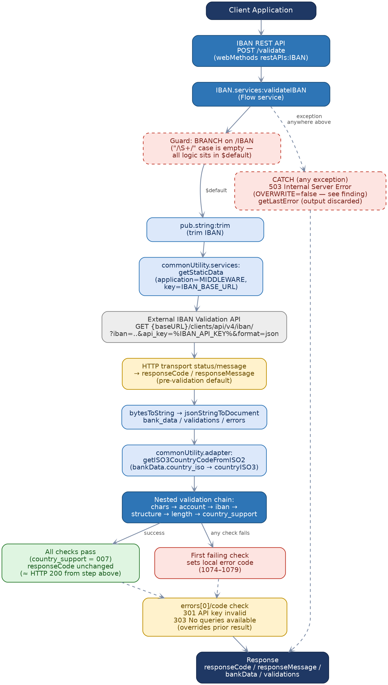
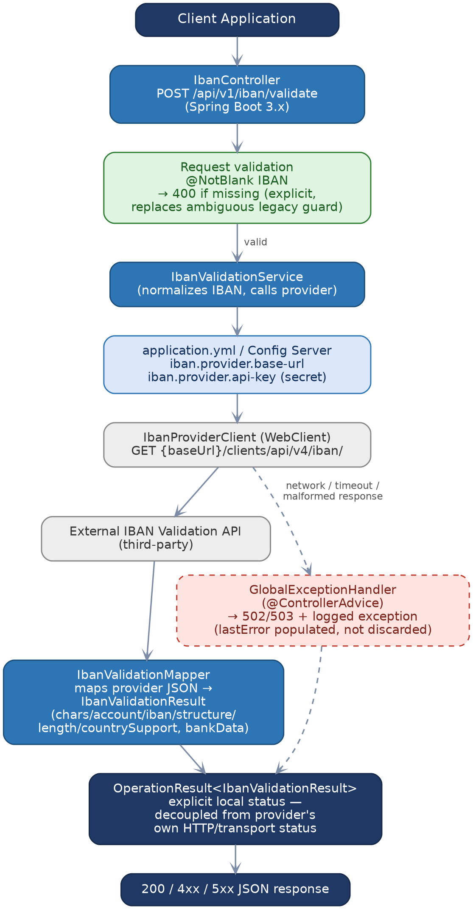

*AL RAMZ CAPITAL*

*MIDDLEWARE MIGRATION PROGRAMME*

# IBAN Validation Service

### API Documentation & Migration Reference

*Software AG webMethods  →  Spring Boot 3\.x / Java 21 Migration*

---

## Document Control

## Table of Contents

- [1. Overview](#1-overview)
  - [1.1 Purpose](#11-purpose)
  - [1.2 Scope](#12-scope)
  - [1.3 Executive Summary](#13-executive-summary)
  - [1.4 Key Migration Notes](#14-key-migration-notes)
- [2. Solution Architecture](#2-solution-architecture)
  - [2.1 As-Built Flow (Source)](#21-as-built-flow-source)
  - [2.2 Target Architecture (Spring Boot)](#22-target-architecture-spring-boot)
  - [2.3 Target Response & Result Model](#23-target-response-result-model)
- [3. Prerequisites & Static Configuration](#3-prerequisites-static-configuration)
  - [3.1 Static Variables](#31-static-variables)
  - [3.2 Environment & Service Availability Prerequisites](#32-environment-service-availability-prerequisites)
- [4. Primary API — IBAN Validation Service](#4-primary-api-iban-validation-service)
  - [4.1 Endpoint Summary](#41-endpoint-summary)
  - [4.2 Request Schema](#42-request-schema)
  - [4.3 Business Logic Summary](#43-business-logic-summary)
  - [4.4 Sample Request](#44-sample-request)
  - [4.5 Response Schema](#45-response-schema)
    - [Sample Response — Success](#sample-response-success)
    - [Sample Response — Validation Failure](#sample-response-validation-failure)
    - [Sample Response — Internal Error](#sample-response-internal-error)
  - [4.6 HTTP Status Code Reference](#46-http-status-code-reference)
  - [4.7 Target Process Flow (Spring Boot)](#47-target-process-flow-spring-boot)
- [5. Data Mapping Reference](#5-data-mapping-reference)
  - [5.1 Provider Response → Service Response (`bankData`)](#51-provider-response-service-response-bankdata)
  - [5.2 Provider Response → Service Response (`validations`)](#52-provider-response-service-response-validations)
- [6. Appendix](#6-appendix)
  - [Appendix A — Glossary](#appendix-a-glossary)
  - [Appendix B — Source Service Inventory](#appendix-b-source-service-inventory)
  - [Appendix C — Findings & Recommendations](#appendix-c-findings-recommendations)

---

# 1\. Overview

## 1\.1 Purpose

This document reverse-engineers the **IBAN** webMethods Integration Server package — a single service, `validateIBAN`, exposed as one REST operation \(`POST /validate`\) — into a migration-ready API specification for the target Spring Boot implementation\. It captures the service's actual, as-built behavior \(not an idealized description\) directly from `flow.xml`, including several source-level inconsistencies worth resolving deliberately in the target design rather than carrying forward silently\.

## 1\.2 Scope

**In scope:**
- The `validateIBAN` service: request/response contract, the external third-party validation call it makes, its internal validation-outcome decision tree, and its error/exception handling\.
- The static configuration \(`MIDDLEWARE` / `IBAN_BASE_URL`\) and global variable \(`IBAN_API_KEY`\) the service depends on\.
- Two shared utility calls the service makes into other packages: `commonUtility.services:getStaticData` and `commonUtility.adapter:getISO3CountryCodeFromISO2`\.

**Out of scope:**
- The internal implementation of `commonUtility.services:getStaticData` and `commonUtility.adapter:getISO3CountryCodeFromISO2` themselves — these belong to the `commonUtility` package, not `IBAN`, and are treated here as external dependencies\.
- The external IBAN validation provider's own implementation — only its observed request/response contract, as consumed by this Flow, is documented\.

## 1\.3 Executive Summary

`validateIBAN` accepts a single field, `IBAN` \(string\), trims it, looks up a base URL from shared static configuration, and calls a third-party IBAN validation API over HTTP GET with the IBAN and an API key\. It parses the JSON response and walks a nested decision tree over six independent per-check status codes the provider returns — for characters, account check digit, IBAN check digit, structure, length, and country support — to decide whether the IBAN is valid\. Each check has its own hardcoded "pass" value and, on failure, its own local error code/message \(already registered in the project's `Error-Code-to-HTTP-Status-Mapping.md` as **1074–1079**\)\. The provider's own bank/branch data \(`bank_data`\) and raw per-check results \(`validations`\) are passed through in the response, with the country's ISO2 code additionally resolved to ISO3 via a shared utility call\.

Because this package is small \(one service, one external dependency, no database\), this document is proportionally shorter than the DFM Onboarding or SocialMedia migration docs — the same chapter shape is used, but sections with nothing to say for this package \(a downstream/backoffice-integration chapter, a DDL appendix\) are omitted rather than padded\.

## 1\.4 Key Migration Notes

> **Important — behaviours and defects to preserve, fix, or explicitly re-confirm during migration:**
>
> - **The success path never sets a local "success" response code\.** `responseCode`/`responseMessage` are set once, early, from the *external provider's own HTTP transport status* \(`pub.client:http`'s `header/status` and `header/statusMessage` — typically `200`/`OK`\) and are only overwritten again if a specific validation check fails\. A fully valid IBAN therefore returns whatever raw HTTP status the third-party call happened to produce, not a locally-defined success convention\. **Recommend** the target service introduce an explicit local success convention decoupled from the provider's own transport status \(see Section 2\.3\)\.
> - **The initial default \(\`1069\` — "Missing IBAN"\) is set unconditionally \(\`OVERWRITE=true\`\) before any real processing, and the \`CATCH\` block's own fallback \(\`503\` — "Internal Server Error"\) is set with \`OVERWRITE=false\`** — i\.e\. "only if not already set"\. Because `responseCode` is never empty by the time an exception is caught \(it was force-set at the very top\), **the \`503\` fallback is effectively dead code**: any unhandled exception anywhere in the flow \(a network timeout calling the provider, malformed JSON, etc\.\) will incorrectly surface to the caller as `1069`/"Missing IBAN" instead of a generic internal-error response\. This is a genuine source defect, not a style choice — confirmed by tracing every `MAPSET` against `responseCode` in `flow.xml`\.
> - **The \`/IBAN\` guard branch's "input present" case is an empty no-op** — all real logic \(trim, the external call, the whole validation chain\) lives in the branch's `$default` case\. In practice this makes the entire service body run unconditionally rather than being gated on IBAN actually being present; the literal string "Missing IBAN" therefore does not correspond to any branch that actually detects a missing IBAN today\. **Recommend** the target controller add a real, explicit `@NotBlank` guard returning `400` before calling the provider at all\.
> - **Schema/runtime field-name mismatch on \`validations\.countrySupport\`\.** The declared output signature \(`node.ndf`\) names this nested field `countrySupport` \(camelCase\), but the actual data is a whole-object pass-through copy of the provider's own `validations` JSON node, and the flow's own branch logic reads that node via the path `/validations/country_support/code` \(snake\_case\) — confirmed directly from the `BRANCH SWITCH` path\. The declared field name does not match the live data's actual key; any consumer coded strictly against the declared schema will find `countrySupport` always empty, with the real data sitting under an undeclared `country_support` key instead\.
> - **\`lastError\` is declared in the output schema but never populated\.** The `CATCH` block does invoke `pub.flow:getLastError`, but its output map is completely empty — the exception detail is captured internally by webMethods and then discarded, never reaching the declared `lastError` output field\. Root-cause diagnosis of a `503` today depends entirely on server logs\.
> - **Two accepted "pass" values for the account check** \(`account.code` = `004` **or** `002`\) versus exactly one accepted value for every other check — verified from source, not a copy-paste artifact to silently collapse\. The semantic difference between the two account states isn't captured anywhere downstream; worth confirming with the provider's documentation before the target design decides whether to preserve or collapse this distinction\.

# 2\. Solution Architecture

## 2\.1 As-Built Flow \(Source\)

The diagram below traces `validateIBAN`'s actual execution path, including the two source-level defects called out in Section 1\.4 \(dashed red boxes\)\.



*Figure 1 — As-Built Flow, Software AG webMethods*

## 2\.2 Target Architecture \(Spring Boot\)

The target design consolidates the legacy Flow's steps into a conventional Spring Boot request/response pipeline, replaces the ambiguous input guard with an explicit validation annotation, and decouples the service's own success/error status from the third-party provider's raw HTTP transport status\.



*Figure 2 — Target Architecture, Spring Boot 3\.x*

## 2\.3 Target Response & Result Model

The legacy Flow conflates the external provider's own HTTP transport status with this service's own success/failure signal \(Section 1\.4\)\. The target design should separate these explicitly with a typed result wrapper, consistent with the `OperationResult<T>` convention already proposed for other services in this migration programme \(see the DFM Onboarding API doc, Section 2\.4\):

```
public class OperationResult<T> {
    private final boolean success;
    private final String statusCode;     // local convention, e.g. "IVL200" / "IVL400" / "IVL502" / "IVL503"
    private final String message;        // human-readable outcome
    private final T data;                // IbanValidationResult on success
    private final String providerStatus; // the third-party provider's own raw HTTP status, kept for traceability
    private final String lastError;      // populated from the caught exception (never discarded, unlike the legacy Flow)
}
```

This keeps the provider's own transport status visible for diagnostics \(`providerStatus`\) without letting it silently double as this service's own success indicator\.

# 3\. Prerequisites & Static Configuration

## 3\.1 Static Variables

The following configuration values must be provisioned per environment before the target service can run\. Values are read from shared static configuration and a webMethods global variable in the source system — sourced directly from `flow.xml`, not inferred\.

| **Name** | **Source \(Legacy\)** | **Purpose** |
| --- | --- | --- |
| `IBAN_BASE_URL` | `commonUtility.services:getStaticData(application="MIDDLEWARE", key="IBAN_BASE_URL")` | Base URL of the external IBAN validation provider\. Request path appended: `/clients/api/v4/iban/`\. |
| `IBAN_API_KEY` | webMethods **global variable** `%IBAN_API_KEY%` \(not sourced via `getStaticData` — resolved directly as a global variable substitution in the `pub.client:http` input map\) | API key sent to the external provider as the `api_key` query parameter\. Treat as a secret in the target design \(e\.g\. a Spring Cloud Config / Vault-backed property\), not a plain application property\. |

## 3\.2 Environment & Service Availability Prerequisites

Candidate health-check dependencies for the target service, carried forward from the source system's own runtime dependencies:
- **External IBAN validation provider** — the service is entirely non-functional without it; every request makes a live outbound call\. No caching or fallback exists in the source Flow\.
- **Shared \`commonUtility\` package** \(`getStaticData`, `getISO3CountryCodeFromISO2`\) — both calls are synchronous and unconditional; an outage of either fails every request via the generic `CATCH` block \(subject to the `503`/`1069` masking defect in Section 1\.4\)\.
- **Provisioned \`IBAN\_API\_KEY\`** — an invalid/expired key does not fail fast at startup; it only surfaces per-request as legacy code `301` \("API Key is invalid"\) once the provider rejects a call\.

# 4\. Primary API — IBAN Validation Service

## 4\.1 Endpoint Summary

| **Attribute** | **Detail** |
| --- | --- |
| HTTP Method | `POST` |
| Endpoint | `/validate` |
| Content Type | `application/json` |
| Function Name | `IBAN.services:validateIBAN` |
| Authentication | None declared on the REST resource itself in this package \(no ACL/token check visible in `node.ndf`\) — confirm the gateway/API Manager policy layer in front of this package, since the Flow itself performs none\. |
| Idempotency | Effectively idempotent — a pure read/validate operation with no persistence; safe to retry\. |

## 4\.2 Request Schema

| **Field** | **Type** | **Required** | **Notes** |
| --- | --- | --- | --- |
| `IBAN` | string | Yes \(see Section 1\.4 re: the guard's actual behavior\) | The IBAN to validate, e\.g\. `AE070331234567890123456`\. Leading/trailing whitespace is trimmed by the service before use; embedded whitespace is not\. |

## 4\.3 Business Logic Summary

In execution order, as traced through `flow.xml`:
- 1\. **Branch on \`/IBAN\`\.** The case matching a populated, single-token value \(`/\S+/`\) is an empty no-op; all logic below lives in the branch's `$default` case \(see Section 1\.4 finding\)\.
- 2\. **Pre-set a default response** — `responseCode=1069`, `responseMessage="Missing IBAN"` \(`OVERWRITE=true`\)\. This is later overwritten by the HTTP call's own transport status \(step 5\) on any normal execution, but see the `503`-masking defect in Section 1\.4\.
- 3\. **Trim the IBAN** — `pub.string:trim`\.
- 4\. **Resolve the provider base URL** — `commonUtility.services:getStaticData(application="MIDDLEWARE", key="IBAN_BASE_URL")` → local variable `baseURL`\.
- 5\. **Call the external IBAN validation provider** — `pub.client:http`, method `GET`, URL `{baseURL}/clients/api/v4/iban/`, query args `iban` \(the trimmed IBAN\), `api_key` \(`%IBAN_API_KEY%`, a global variable\), `format=json`\. The call's raw HTTP `header/status` and `header/statusMessage` are copied straight into `responseCode`/`responseMessage` at this point\.
- 6\. **Parse the response** — `pub.string:bytesToString` then `pub.json:jsonStringToDocument`; the parsed document's `bank_data`, `validations`, and `errors` nodes are copied wholesale into local pipeline variables `bankData`, `validations`, `errors`\.
- 7\. **Resolve ISO3 country code** — `commonUtility.adapter:getISO3CountryCodeFromISO2(bankData.country_iso)` → `bankData.countryISO3`\.
- 8\. **Walk the nested validation chain**, short-circuiting on the first failing check \(each check's own "pass" value, sourced directly from the provider's response fields\):
- chars\.code = "006" — else → local code **1078**, "IBAN contains illegal characters"
- account\.code = "004" or "002" — else → local code **1074**, "Account Number check digit not correct"
- iban\.code = "001" — else → local code **1075**, "IBAN Check digit not correct"
- structure\.code = "005" — else → local code **1077**, "IBAN Structure is not correct"
- length\.code = "003" — else → local code **1076**, "IBAN Length is not correct"
- country\_support\.code = "007" — else → local code **1079**, "Country does not support IBAN standard"
- 9\. **If every check passes**, no further `responseCode` change occurs — the value from step 5 \(the provider's raw HTTP status, typically `200`\) remains as the final result \(see Section 1\.4\)\.
- 10\. **Check \`errors\[0\]/code\`** regardless of the outcome above — `303` → override to "No queries available" \(provider quota/rate limiting\); `301` → override to "API Key is invalid" \(provider rejected the configured key\)\. Any other/absent value leaves the validation-chain outcome from step 8–9 in place\.
- 11\. **Clean up** internal pipeline variables \(`jsonString`, `bytes`, `url`, `method`, `IBAN`, `data`, `header`, `body`, `string`, `document`, `errors`\)\.
- 12\. `CATCH` \(any exception in steps 1–11\): set `responseCode=503`, `responseMessage="Internal Server Error"` — but only if not already set \(`OVERWRITE=false`; see the masking defect in Section 1\.4\); invoke `pub.flow:getLastError` and discard its output entirely\.

## 4\.4 Sample Request

```
{
  "IBAN": "AE070331234567890123456"
}
```

## 4\.5 Response Schema

Declared output fields \(`node.ndf`\)\. `bankData` and `validations` are only meaningfully populated when the provider call succeeds; on an early failure \(e\.g\. a caught exception\) they may be absent\.

| **Field** | **Type** | **Notes** |
| --- | --- | --- |
| `responseCode` | string | See Section 4\.3/4\.6 — either the provider's raw HTTP status, a local `1074`–`1079` validation code, `301`/`303` \(provider-level error\), or `503` \(generic exception — subject to the masking defect in Section 1\.4\)\. |
| `responseMessage` | string | Human-readable text paired with `responseCode`\. |
| `bankData.*` | string \(16 fields\) | `bic`, `branch`, `bank`, `address`, `city`, `state`, `zip`, `phone`, `fax`, `www`, `email`, `country`, `countryISO`, `account`, `bankCode`, `branchCode` — passed straight through from the provider's `bank_data`, plus `countryISO3` computed locally \(Section 4\.3 step 7\)\. |
| `validations.chars` / `.account` / `.iban` / `.structure` / `.length` | object `{code, message}` | Passed straight through from the provider's `validations` node, keyed exactly as the provider returns them\. |
| `validations.countrySupport` | object `{code, message}` \(declared\) | **Declared but not the real runtime key** — the provider \(and the Flow's own branch logic\) actually uses `country_support` \(snake\_case\)\. See the schema/runtime mismatch finding in Section 1\.4\. |
| `lastError` | string \(declared\) | **Never populated** — see finding in Section 1\.4\. |

### Sample Response — Success

```
{
  "responseCode": "200",
  "responseMessage": "OK",
  "bankData": {
    "bic": "BOMLAEAD",
    "branch": "Main Branch",
    "bank": "Example Bank",
    "country": "United Arab Emirates",
    "countryISO": "AE",
    "countryISO3": "ARE",
    "account": "0331234567890123456",
    "bankCode": "033"
  },
  "validations": {
    "chars": { "code": "006", "message": "Valid characters" },
    "account": { "code": "004", "message": "Valid account number" },
    "iban": { "code": "001", "message": "Valid IBAN" },
    "structure": { "code": "005", "message": "Valid structure" },
    "length": { "code": "003", "message": "Valid length" },
    "country_support": { "code": "007", "message": "Country supports IBAN standard" }
  }
}
```

*Note: field values above \(bank name, BIC, etc\.\) are illustrative — no real provider response was available in the source package; the shape is reconstructed from the declared *`node.ndf`* schema and the field paths referenced in *`flow.xml`*\.*

### Sample Response — Validation Failure

```
{
  "responseCode": "1076",
  "responseMessage": "IBAN Length is not correct"
}
```

### Sample Response — Internal Error

```
{
  "responseCode": "503",
  "responseMessage": "Internal Server Error"
}
```

## 4\.6 HTTP Status Code Reference

Service error code prefix: **IBV** \(IBAN Validation\) — checked against every existing prefix family in this migration programme \(DFM: `ONB`/`AUP`/`CFE`/`CIS`/`CLD`/`CON`; SocialMedia: `FBT`/`FBU`/`LIT`/`LIU`/`GMU`/`APU`; AlRamzPortal: `RMG`/`CBR`\); no collision\. **Not yet user-confirmed\.**

The legacy codes `1069` and `1074`–`1079` were already present in the project's `Error-Code-to-HTTP-Status-Mapping.md` registry \(built for the DFM Onboarding migration\) and are reused directly here — no new HTTP-status mappings were invented for them\. `301` and `303` are the *external provider's own* status codes \(not part of the Al Ramz 1000-series scheme\) and are mapped per this document's own judgment, noted below\.

| **HTTP Status** | **Service Error Code** | **Description** | **Legacy Error Code** |
| --- | --- | --- | --- |
| 400 | IBV001 | IBAN contains illegal characters | 1078 — IBAN contains illegal characters |
| 400 | IBV002 | Account number check digit not correct | 1074 — Account Number check digit not correct |
| 400 | IBV003 | IBAN check digit not correct | 1075 — IBAN Check digit not correct |
| 400 | IBV004 | IBAN structure is not correct | 1077 — IBAN Structure is not correct |
| 400 | IBV005 | IBAN length is not correct | 1076 — IBAN Length is not correct |
| 422 | IBV006 | Country does not support the IBAN standard \(well-formed input, unsupported by business rule\) | 1079 — Country does not support IBAN standard |
| 400 | IBV007 | IBAN is missing/blank — **note:** the source guard that should produce this is effectively dead code \(Section 1\.4\); shown here per the registry entry, not because the current Flow reliably reaches it | 1069 — Validation List Failed \(generic message reused across packages\) |
| 502 | IBV008 | External IBAN validation provider rejected the configured API key \(inferred mapping — provider-level code, not in the 1000-series registry\) | 301 — API Key is invalid |
| 502 | IBV009 | External IBAN validation provider has no queries/quota remaining \(inferred mapping — provider-level code, not in the 1000-series registry\) | 303 — No queries available |
| 503 | IBV010 | Unhandled exception during validation \(generic catch-all\) — **caveat:** in the current source Flow this can be masked by IBV007/1069 due to the `OVERWRITE` ordering defect in Section 1\.4 | 503 — Internal Server Error |

## 4\.7 Target Process Flow \(Spring Boot\)

See Figure 2 \(Section 2\.2\) for the full target architecture; the request-level flow for this single endpoint is: validate input → call provider → map response → return `OperationResult<IbanValidationResult>`, with the provider's transport status kept separate from the service's own local status code\.

# 5\. Data Mapping Reference

## 5\.1 Provider Response → Service Response \(\`bankData\`\)

| **Provider Field \(inferred\)** | **Service Output Field** | **Notes** |
| --- | --- | --- |
| `bank_data.bic` | `bankData.bic` | Passthrough |
| `bank_data.branch` | `bankData.branch` | Passthrough |
| `bank_data.bank` | `bankData.bank` | Passthrough |
| `bank_data.address` / `.city` / `.state` / `.zip` | `bankData.address` / `.city` / `.state` / `.zip` | Passthrough |
| `bank_data.phone` / `.fax` / `.www` / `.email` | `bankData.phone` / `.fax` / `.www` / `.email` | Passthrough |
| `bank_data.country` / `.country_iso` | `bankData.country` / `.countryISO` | Passthrough |
| *\(derived\)* | `bankData.countryISO3` | Computed locally via `commonUtility.adapter:getISO3CountryCodeFromISO2(countryISO)` — not present in the provider's own response\. |
| `bank_data.account` / `.bank_code` / `.branch_code` | `bankData.account` / `.bankCode` / `.branchCode` | Passthrough |

## 5\.2 Provider Response → Service Response \(\`validations\`\)

The entire `validations` node is copied wholesale \(`MAPCOPY`, not field-by-field\), so its keys are exactly whatever the provider returns\. Based on the Flow's own `BRANCH SWITCH` paths, the six sub-objects are named `chars`, `account`, `iban`, `structure`, `length`, and `country_support` \(snake\_case for the last one — see the schema/runtime mismatch finding in Section 1\.4, since `node.ndf` declares it as `countrySupport`\)\.

| **Sub-object** | **"Pass" code** | **On failure → local code** |
| --- | --- | --- |
| `chars` | `006` | 1078 |
| `account` | `004` or `002` | 1074 |
| `iban` | `001` | 1075 |
| `structure` | `005` | 1076 *\(see note\)* |
| `length` | `003` | 1076 |
| `country_support` | `007` | 1079 |

*Note: verify the *`structure`*/*`length`* code pairing above against source before final sign-off — *`structure`* failure sets local code ***1077*** \("IBAN Structure is not correct"\) and *`length`* failure sets ***1076*** \("IBAN Length is not correct"\); the table row order follows the nested branch's execution order \(chars → account → iban → structure → length → country\_support\), matching Section 4\.3 step 8\.*

# 6\. Appendix

## Appendix A — Glossary

| **Term** | **Meaning** |
| --- | --- |
| IBAN | International Bank Account Number — a standardized international format for identifying bank accounts\. |
| BIC | Bank Identifier Code \(also known as SWIFT code\)\. |
| ISO2 / ISO3 | Two-letter and three-letter ISO 3166 country codes, respectively\. |
| Provider | The external, third-party IBAN validation API this service calls\. |
| `OperationResult<T>` | The proposed typed result wrapper for internal service calls, decoupling local success/error semantics from any downstream system's own status codes \(see Section 2\.3\)\. |

## Appendix B — Source Service Inventory

| **Element** | **Namespace** | **Notes** |
| --- | --- | --- |
| Package | `IBAN` | Single-service package; `manifest.v3` description: "StaticData\_"\. |
| REST resource | `IBAN.restAPIs:IBAN` | One operation: `POST /validate` → `IBAN.services:validateIBAN`\. |
| Flow service | `IBAN.services:validateIBAN` | 5,626-line `flow.xml`; documented in full in Section 4\. |
| Doc type | `IBAN.restAPIs.IBAN_.docTypes:IBAN` | Empty record — no fields declared; not used for request/response shaping in the Flow itself\. |
| External dependency | `commonUtility.services:getStaticData` | Shared utility from a different package — out of scope \(Section 1\.2\)\. |
| External dependency | `commonUtility.adapter:getISO3CountryCodeFromISO2` | Shared utility from a different package — out of scope \(Section 1\.2\)\. |

## Appendix C — Findings & Recommendations

| **\#** | **Severity** | **Finding** | **Recommendation** |
| --- | --- | --- | --- |
| 1 | High | The `CATCH` block's `503`/"Internal Server Error" fallback is set with `OVERWRITE=false`, but `responseCode` is force-set \(`OVERWRITE=true`\) to `1069` at the very top of the flow before any real processing — meaning the `503` fallback can never actually apply once any prior step has run \(which is always\)\. Any unhandled exception surfaces as `1069`/"Missing IBAN" instead of a generic error\. | Target design: don't force a placeholder value before real processing; or explicitly clear/null the status field at the start of the `catch` block before setting the generic fallback\. |
| 2 | Medium | The declared output field `validations.countrySupport` \(camelCase\) does not match the actual runtime key `country_support` \(snake\_case\) used both by the provider's JSON and the Flow's own `BRANCH SWITCH` path — the declared field will always be empty for any consumer coded strictly against the schema\. | Target `IbanValidationResult` DTO should use `@JsonProperty("country_support")` \(or equivalent\) explicitly, and this should be verified against a live provider response before the target contract is finalized\. |
| 3 | Medium | `lastError` is declared in the output schema but the `CATCH` block's `pub.flow:getLastError` call has a completely empty output map — the field is never populated, and exception diagnostics are only ever visible in server logs\. | Populate `lastError` \(or an equivalent diagnostic field\) from the caught exception in the target `GlobalExceptionHandler`\. |
| 4 | Medium | The `/IBAN` guard branch's populated-input case is an empty no-op; the entire service body actually runs inside the branch's `$default` case, making the "missing IBAN" guard effectively non-functional as a short-circuit\. | Target controller should add an explicit `@NotBlank` \(or equivalent\) validation annotation ahead of calling the provider, returning `400` immediately rather than relying on Flow branch semantics\. |
| 5 | Low | Success responses carry the external provider's own raw HTTP transport status \(typically `200`\) rather than a locally-defined convention — functionally reasonable, but conflates two different concerns \(transport vs\. domain result\)\. | Adopt the `OperationResult<T>` model proposed in Section 2\.3, keeping the provider's status visible separately as `providerStatus`\. |
| 6 | Low | `account.code` accepts two distinct "pass" values \(`004` or `002`\) versus one for every other check, with no documented semantic difference between them anywhere downstream\. | Confirm with the provider's own documentation what the two codes mean before deciding whether the target design should preserve or collapse the distinction\. |
| 7 | Low | No authentication/ACL is declared on the REST resource itself within this package\. | Confirm the API Manager / gateway policy layer enforces authentication in front of this endpoint, since the Flow provides none itself\. |
