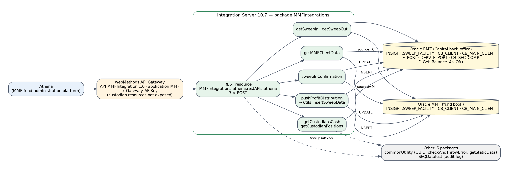
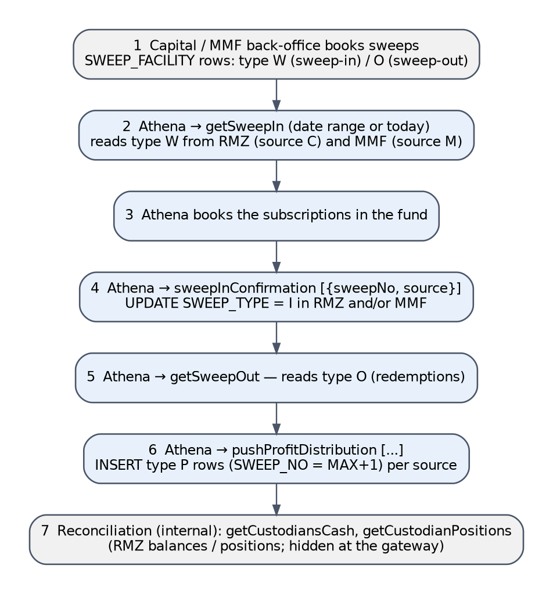
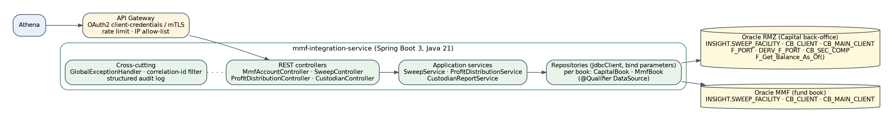
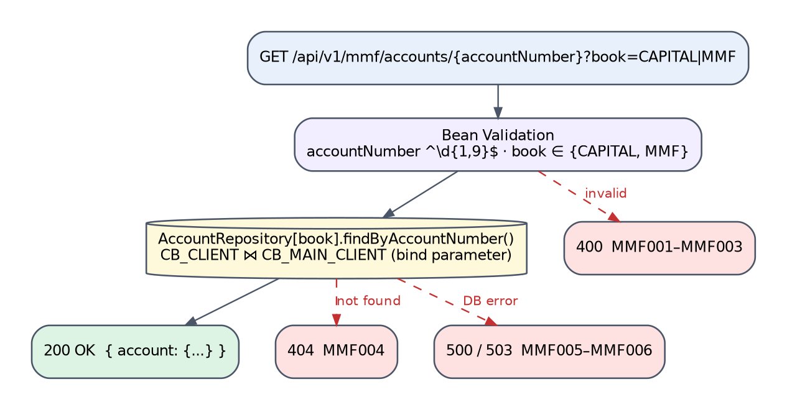
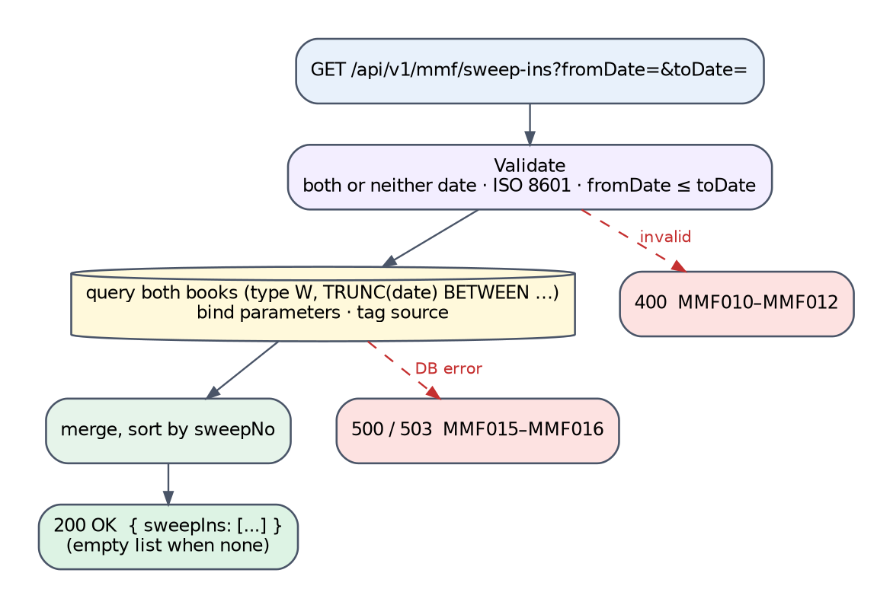
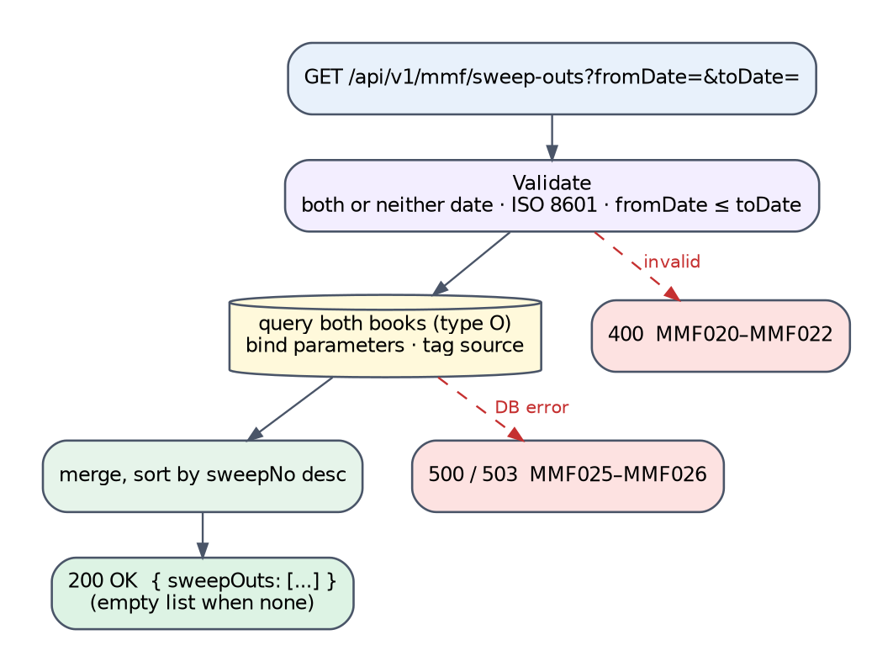
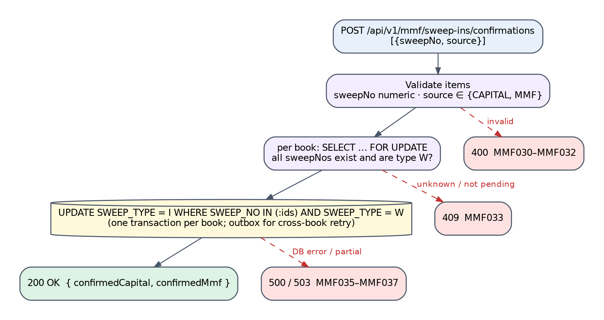
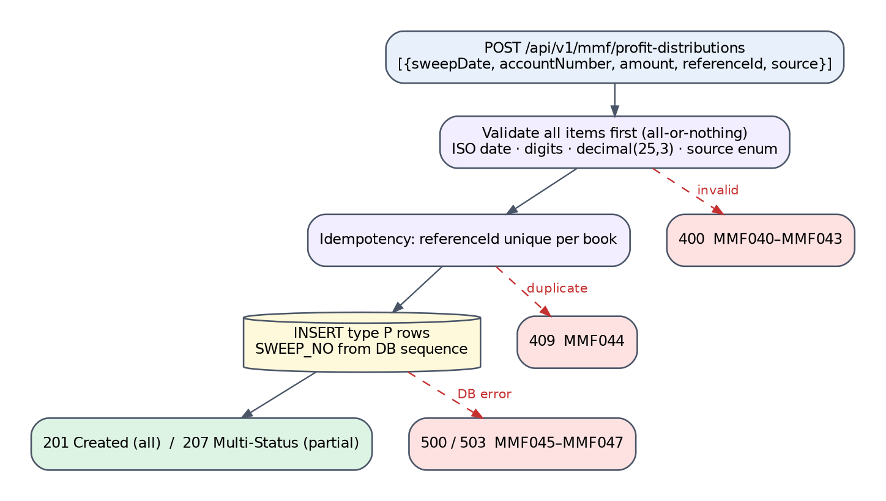
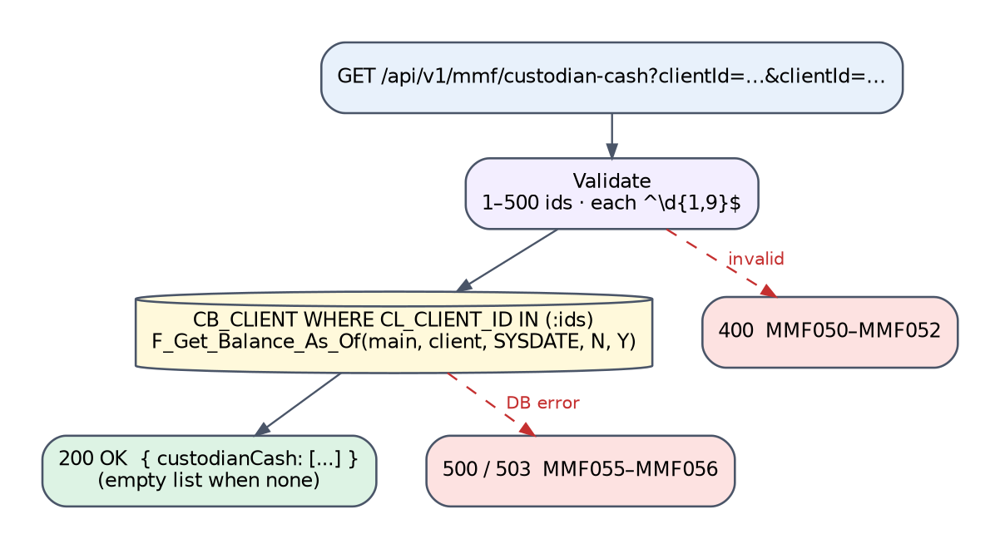
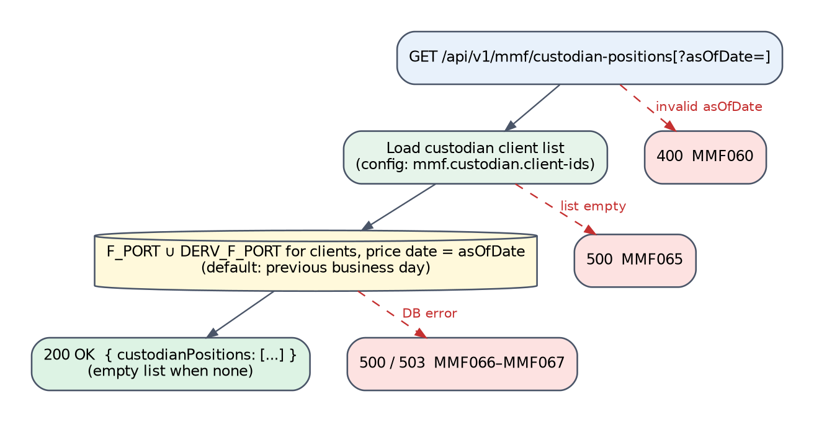

# MMFIntegrations Package — API Design & Migration Specification

_webMethods Integration Server 10.7 → Java 21 / Spring Boot 3 · Al Ramz Middleware Migration · Money Market Fund (Athena)_

| Field | Value |
|---|---|
| Document | MMFIntegrations-API-Design-Document |
| Version | 0.1 — first draft for review |
| Date | 1 October 2026 |
| Source | IS package export `MMFIntegrations.zip` (7 REST services, 1 utility Flow, 1 Java service, 11 JDBC adapters); Confluence space INTEGRATIO |
| Consumer | Athena (fund administration) via API Gateway API MMFIntegration 1.0 |
| Status | Draft — proposals in this document are not yet agreed (see Appendix E) |

## Contents

- [1. Overview](#1-overview)
  - [1.1 Purpose](#11-purpose)
  - [1.2 Scope](#12-scope)
  - [1.3 Executive Summary](#13-executive-summary)
- [2. Solution Architecture](#2-solution-architecture)
  - [2.1 As-Built Legacy Architecture](#21-as-built-legacy-architecture)
  - [2.2 End-to-End Journey — Sweep Lifecycle](#22-end-to-end-journey--sweep-lifecycle)
  - [2.3 Target Architecture (Spring Boot)](#23-target-architecture-spring-boot)
  - [2.4 Target Response & Result Model](#24-target-response--result-model)
  - [2.5 Legacy-to-Target Endpoint Map](#25-legacy-to-target-endpoint-map)
- [3. Prerequisites & Static Configuration](#3-prerequisites--static-configuration)
  - [3.1 Integration Server Global Variables](#31-integration-server-global-variables)
  - [3.2 Static / Feature-Flag Configuration](#32-static--feature-flag-configuration)
  - [3.3 Upstream / Downstream Dependencies](#33-upstream--downstream-dependencies)
  - [3.4 Security Notes](#34-security-notes)
- [4. API — Get MMF Account (getMMFClientData)](#4-api--get-mmf-account-getmmfclientdata)
  - [4.1 Endpoint Summary](#41-endpoint-summary)
  - [4.2 Request Schema](#42-request-schema)
  - [4.3 Business Logic Summary](#43-business-logic-summary)
  - [4.4 Sample Request](#44-sample-request)
  - [4.5 Response Schema](#45-response-schema)
  - [4.6 HTTP Status Code Reference](#46-http-status-code-reference)
  - [4.7 Example Target Response Envelopes](#47-example-target-response-envelopes)
  - [4.8 Target Process Flow (Spring Boot)](#48-target-process-flow-spring-boot)
- [5. API — List Sweep-Ins (getSweepIn)](#5-api--list-sweep-ins-getsweepin)
  - [5.1 Endpoint Summary](#51-endpoint-summary)
  - [5.2 Request Schema](#52-request-schema)
  - [5.3 Business Logic Summary](#53-business-logic-summary)
  - [5.4 Sample Request](#54-sample-request)
  - [5.5 Response Schema](#55-response-schema)
  - [5.6 HTTP Status Code Reference](#56-http-status-code-reference)
  - [5.7 Example Target Response Envelopes](#57-example-target-response-envelopes)
  - [5.8 Target Process Flow (Spring Boot)](#58-target-process-flow-spring-boot)
- [6. API — List Sweep-Outs (getSweepOut)](#6-api--list-sweep-outs-getsweepout)
  - [6.1 Endpoint Summary](#61-endpoint-summary)
  - [6.2 Request Schema](#62-request-schema)
  - [6.3 Business Logic Summary](#63-business-logic-summary)
  - [6.4 Sample Request](#64-sample-request)
  - [6.5 Response Schema](#65-response-schema)
  - [6.6 HTTP Status Code Reference](#66-http-status-code-reference)
  - [6.7 Example Target Response Envelopes](#67-example-target-response-envelopes)
  - [6.8 Target Process Flow (Spring Boot)](#68-target-process-flow-spring-boot)
- [7. API — Confirm Sweep-Ins (sweepInConfirmation)](#7-api--confirm-sweep-ins-sweepinconfirmation)
  - [7.1 Endpoint Summary](#71-endpoint-summary)
  - [7.2 Request Schema](#72-request-schema)
  - [7.3 Business Logic Summary](#73-business-logic-summary)
  - [7.4 Sample Request](#74-sample-request)
  - [7.5 Response Schema](#75-response-schema)
  - [7.6 HTTP Status Code Reference](#76-http-status-code-reference)
  - [7.7 Example Target Response Envelopes](#77-example-target-response-envelopes)
  - [7.8 Target Process Flow (Spring Boot)](#78-target-process-flow-spring-boot)
- [8. API — Push Profit Distributions (pushProfitDistribution)](#8-api--push-profit-distributions-pushprofitdistribution)
  - [8.1 Endpoint Summary](#81-endpoint-summary)
  - [8.2 Request Schema](#82-request-schema)
  - [8.3 Business Logic Summary](#83-business-logic-summary)
  - [8.4 Sample Request](#84-sample-request)
  - [8.5 Response Schema](#85-response-schema)
  - [8.6 HTTP Status Code Reference](#86-http-status-code-reference)
  - [8.7 Example Target Response Envelopes](#87-example-target-response-envelopes)
  - [8.8 Target Process Flow (Spring Boot)](#88-target-process-flow-spring-boot)
- [9. API — Custodian Cash (getCustodiansCash)](#9-api--custodian-cash-getcustodianscash)
  - [9.1 Endpoint Summary](#91-endpoint-summary)
  - [9.2 Request Schema](#92-request-schema)
  - [9.3 Business Logic Summary](#93-business-logic-summary)
  - [9.4 Sample Request](#94-sample-request)
  - [9.5 Response Schema](#95-response-schema)
  - [9.6 HTTP Status Code Reference](#96-http-status-code-reference)
  - [9.7 Example Target Response Envelopes](#97-example-target-response-envelopes)
  - [9.8 Target Process Flow (Spring Boot)](#98-target-process-flow-spring-boot)
- [10. API — Custodian Positions (getCustodianPositions)](#10-api--custodian-positions-getcustodianpositions)
  - [10.1 Endpoint Summary](#101-endpoint-summary)
  - [10.2 Request Schema](#102-request-schema)
  - [10.3 Business Logic Summary](#103-business-logic-summary)
  - [10.4 Sample Request](#104-sample-request)
  - [10.5 Response Schema](#105-response-schema)
  - [10.6 HTTP Status Code Reference](#106-http-status-code-reference)
  - [10.7 Example Target Response Envelopes](#107-example-target-response-envelopes)
  - [10.8 Target Process Flow (Spring Boot)](#108-target-process-flow-spring-boot)
- [11. Downstream & Back-office Integration APIs](#11-downstream--back-office-integration-apis)
  - [11.1 utils:insertSweepData](#111-utilsinsertsweepdata)
  - [11.2 utils:convertStringToDate (Java)](#112-utilsconvertstringtodate-java)
  - [11.3 JDBC Adapter Inventory](#113-jdbc-adapter-inventory)
  - [11.4 Other IS Package Dependencies](#114-other-is-package-dependencies)
- [12. Data Mapping Reference](#12-data-mapping-reference)
  - [12.1 INSIGHT.SWEEP_FACILITY ↔ API fields](#121-insightsweep_facility--api-fields)
  - [12.2 Account / custodian fields](#122-account--custodian-fields)
  - [12.3 Book (source) codes](#123-book-source-codes)
- [Appendix A — Pseudocode](#appendix-a--pseudocode)
  - [A.1 sweepInConfirmation (legacy)](#a1-sweepinconfirmation-legacy)
  - [A.2 pushProfitDistribution + insertSweepData (legacy)](#a2-pushprofitdistribution--insertsweepdata-legacy)
  - [A.3 Target confirmation (sketch)](#a3-target-confirmation-sketch)
- [Appendix B — Glossary](#appendix-b--glossary)
- [Appendix C — Database DDL](#appendix-c--database-ddl)
  - [C.1 Source DDL (reconstructed)](#c1-source-ddl-reconstructed)
  - [C.2 Type-Mapping Decisions](#c2-type-mapping-decisions)
  - [C.3 Target DDL (proposed, delta — apply in both databases)](#c3-target-ddl-proposed-delta--apply-in-both-databases)
- [Appendix D — Source Findings](#appendix-d--source-findings)
- [Appendix E — Open Items & Assumptions](#appendix-e--open-items--assumptions)

## 1. Overview

### 1.1 Purpose

This document reverse-engineers the webMethods Integration Server 10.7 package **MMFIntegrations** (Money Market Fund integration with the Athena fund-administration platform) into a migration-ready API specification for Java 21 / Spring Boot 3. It records what each legacy Flow service actually does — sourced from `flow.xml`, `node.ndf`, the JDBC adapter metadata and the IS Java service in the export — proposes a RESTful target contract for every exposed operation, and lists the source defects the migration must not carry forward.

### 1.2 Scope

**In scope**

- REST resource `MMFIntegrations.athena.restAPIs:athena` (and its Swagger descriptor `athenaDsc`) with seven operations: `getMMFClientData`, `getSweepIn`, `getSweepOut`, `sweepInConfirmation`, `pushProfitDistribution`, `getCustodiansCash`, `getCustodianPositions`.
- Utility services `MMFIntegrations.athena.utils:insertSweepData` (Flow) and `utils:convertStringToDate` (Java).
- The 11 JDBC adapter services in `MMFIntegrations.athena.adapters`, the 13 document types in `athena.docs`, and the two Oracle connections they use (`RMZ:RMZ`, `MMF:MMF`).
**Out of scope**

- The Athena-side APIs Al Ramz calls (`MMF/1.0/Request/sweepIn`, `sweepOut`, `cashRecon`, `positionRecon`, `mmfClients` — Confluence folder \*Athena\*). They are not implemented in this package.
- Shared services from other IS packages (`commonUtility`, `SEQDatalust`) — documented only as dependencies.
- The back-office processes that create sweep rows in `SWEEP_FACILITY` (type `W` / `O`).

### 1.3 Executive Summary

MMFIntegrations is a thin data-access layer that lets **Athena** read and update the cash sweeps between Al Ramz client accounts and the money market fund. Sweeps live in `INSIGHT.SWEEP_FACILITY`, which exists in **two Oracle databases**: the Capital back-office (`RMZ`, source `C`) and the MMF book (`MMF`, source `M`). Athena pulls pending sweep-ins (type `W`) and sweep-outs (type `O`), confirms sweep-ins (`W → I`), and pushes profit distributions (new type `P` rows). Two further operations return custodian cash balances and security positions for reconciliation; they are hidden from consumers at the API Gateway but remain callable on the Integration Server.

All seven operations are verb-named `POST` endpoints that always return HTTP 200; the outcome is carried in `responseCode` (`200`, `204`, `1069`, `500` or `503`). Every service builds SQL by string substitution into a Dynamic-SQL adapter (`${query}`); for three of them the substituted values come from the caller.

> [!CAUTION]
> **Key migration notes**
>
> - **SQL injection in two write/read paths:** `sweepInConfirmation` splices caller-supplied `sweepNo` values into `UPDATE … WHERE SWEEP_NO IN (…)` (the only validation is “not blank”), and `getCustodiansCash` splices unvalidated `clientID` values into a balance query (F-01, F-02).
> - **Request bodies written to the server disk:** `pushProfitDistribution` calls `pub.flow:savePipelineToFile` on every request (F-03).
> - **Non-atomic sweep numbering and cross-database updates:** new sweep numbers are `MAX(SWEEP_NO)+1`; sweep confirmations update two databases with transactions disabled (F-04, F-05).
> - **No idempotency on profit distribution:** re-posting the same batch inserts duplicate payouts; items with an unknown `source` are silently dropped while the call reports success (F-06).
> - **Positional column mapping drift:** `getCustodianPositions` selects 7 columns into a 6-field adapter output, so values are likely shifted (F-09 — verify).
> - **Credentials:** the production-style gateway API key is published in plain text on the Confluence API pages (value not reproduced here) (F-15).

#### 1.3.1 Source Artefacts and References

| Artefact | Detail |
|---|---|
| Package export | `MMFIntegrations.zip` — manifest build 2025-10-24 16:35 GST, description `MMFINTEGRATION_MMFINTEGRATION` |
| Flow services | 7 REST-bound services + `utils:insertSweepData`; Java service `utils:convertStringToDate` |
| Adapters | 11 JDBC adapter services: Custom SQL (`getClientDetails`, `getClientDetailsFromMMF`, `getMaxSweepNo`), Dynamic SQL `${query}` (`getSweepIn`, `getSweepOut`, `getSweepInFromMMF`, `getSweepOutFromMMF`, `updateSweepIn`, `getCustodiansCash`, `getCustodianPositions`), Insert (`pushProfitDistribution`) |
| Swagger descriptor | `athenaDsc` — Swagger 2.0, title \*Athena\*, host `ARC-MWD-IS.alramz.local:5555`, responses 200 / 401 |
| Confluence (INTEGRATIO) | Folder \*MMFIntegrations\*: pages getMMFClientData, getSweepIn, getSweepOut, sweepInConfirmation, pushProfitDistribution, getCustodiansCash, getCustodianPositions; \*26/10/2025 – Deployment Plan\* (v27.0) |
| Error-code registry | Confluence \*REST API response codes\* (page 2795896833) — the shared legacy-code catalogue. It defines `1069` as “Validation List Failed” and `1091` as “Middleware system validation error” (see F-11). |

## 2. Solution Architecture

### 2.1 As-Built Legacy Architecture

Athena reaches the package through the API Gateway API \*MMFIntegration 1.0\* (application \*MMF\*, API-key header). The deployment plan disables “Expose to consumers” for `/getCustodianPositions` and `/getCustodiansCash`, so those two are internal at the gateway — but the IS REST resource itself has no ACL (`check_internal_acls = no`) and still serves them.


<p align="center"><em>Figure 2-1 — MMFIntegrations as-built component view</em></p>

| Colour | Meaning |
|---|---|
| Light blue | Consumer (Athena) |
| Amber | API Gateway |
| Green | Flow services in MMFIntegrations |
| Grey | Other IS packages |
| Yellow cylinder | Oracle databases (RMZ = Capital back-office, MMF = fund book) |

| Legacy REST template (POST) | Flow service | Database(s) | Gateway exposure |
|---|---|---|---|
| `/getMMFClientData` | `athena.services:getMMFClientData` | RMZ or MMF (by `source`) | Exposed |
| `/getSweepIn` | `athena.services:getSweepIn` | RMZ + MMF | Exposed |
| `/getSweepOut` | `athena.services:getSweepOut` | RMZ + MMF | Exposed |
| `/sweepInConfirmation` | `athena.services:sweepInConfirmation` | RMZ + MMF (UPDATE) | Exposed |
| `/pushProfitDistribution` | `athena.services:pushProfitDistribution` | RMZ + MMF (INSERT) | Exposed |
| `/getCustodiansCash` | `athena.services:getCustodiansCash` | RMZ | Not exposed to consumers |
| `/getCustodianPositions` | `athena.services:getCustodianPositions` | RMZ | Not exposed to consumers |

### 2.2 End-to-End Journey — Sweep Lifecycle

Each operation on its own is a single database hop (already shown in Figure 2-1). The journey below shows how Athena uses them together over a business day. Sweep-type codes are taken from the SQL literals in the Flows; their business meaning (`W` = sweep-in awaiting fund confirmation, `I` = confirmed, `O` = sweep-out, `P` = profit distribution) is inferred from usage and listed as an open item.


<p align="center"><em>Figure 2-2 — Sweep lifecycle across Athena, RMZ and MMF</em></p>

### 2.3 Target Architecture (Spring Boot)

One `mmf-integration-service` with two `DataSource` beans (Capital book, MMF book). The legacy duplication of every adapter per database (e.g. `getClientDetails` / `getClientDetailsFromMMF`) collapses into one repository per aggregate, parameterised by book — a shared bean, not a per-caller copy. All SQL uses bind parameters.


<p align="center"><em>Figure 2-3 — Target component view</em></p>

```
ae.alramz.mmf
 ├─ api            MmfAccountController, SweepController, ProfitDistributionController, CustodianController, dto/*
 ├─ application    SweepService, ProfitDistributionService, CustodianReportService
 ├─ domain         Book {CAPITAL, MMF}, SweepType {W, I, O, P}, Sweep, ProfitDistribution, OperationResult
 ├─ persistence    SweepRepository, AccountRepository, CustodianRepository (JdbcClient per Book)
 └─ config         DataSourceConfig (capitalDs, mmfDs), SecurityConfig, GlobalExceptionHandler, CorrelationIdFilter
```

### 2.4 Target Response & Result Model

#### 2.4.1 Standard response envelope

| Field | Type | Always present | Meaning |
|---|---|---|---|
| responseCode | String | Yes | Duplicates the HTTP status, e.g. `"200"`, `"400"`. |
| responseMessage | String | Yes | HTTP reason phrase, e.g. `"OK"`, `"Bad Request"`.<br>_Legacy vs. target field format:_ legacy messages are free text (`success`, `No results found`, `Middleware system validation error : …`). |
| errorCode | String (nullable) | Yes | Service error code `MMF###` — client-input errors only; `null` on success and backend errors. |
| errorMsg | String (nullable) | Yes | Caller-actionable message; `null` otherwise. |
| correlationId | String (UUID) | Yes | Echo of `X-Correlation-Id` (generated if absent).<br>_Legacy vs. target field format:_ legacy key `correlationID`; generated by `GenerateGUID` unless the caller happens to send an undeclared `correlationID` field in the JSON body (IS merges body fields into the pipeline). |
| response | Object (nullable) | On success | Operation payload (legacy key kept). |

#### 2.4.2 Legacy error-handling pattern (shared by all seven services)

1. Validation failures call `commonUtility.services:checkAndThrowError` with a message beginning `1069 …` (or `pub.schema:validate` errors re-thrown as `1069 <path><ISC message>`).
2. CATCH: if `lastError/error` starts with `1069` → `responseCode = 1069`, `responseMessage = "Middleware system validation error : <rest of message>"`.
3. Any other exception → `responseCode = 503`, `responseMessage = "Internal Server Error"` (the two custodian services use `500` instead).
4. Empty result → `responseCode = 204` with message `success` or `No results found`, body `response: null`.
5. FINALLY: `SEQDatalust.services:asynchronousIngestion` audit log, then `clearPipeline` preserving the envelope.

Because there is no `pub.flow:setResponseCode`, the HTTP transport status is always **200** for every handled outcome.

#### 2.4.3 Service error-code scheme

Target codes use the prefix **MMF** + three digits in per-API blocks. Database and book names in this document are always written as “MMF database / MMF book” or `MMF:MMF`, never as a bare code, to keep them distinct from error codes; findings use `F-nn`.

| Block | Endpoint |
|---|---|
| MMF001 – MMF009 | Get MMF account (Chapter 4) |
| MMF010 – MMF019 | List sweep-ins (Chapter 5) |
| MMF020 – MMF029 | List sweep-outs (Chapter 6) |
| MMF030 – MMF039 | Confirm sweep-ins (Chapter 7) |
| MMF040 – MMF049 | Push profit distributions (Chapter 8) |
| MMF050 – MMF059 | Custodian cash (Chapter 9) |
| MMF060 – MMF069 | Custodian positions (Chapter 10) |
| MMF090 – MMF099 | Internal utilities (Chapter 11) |

#### 2.4.4 Internal result type

```java
public sealed interface OperationResult<T> permits Success, BusinessFailure, TechnicalFailure {
  record Success<T>(T value) implements OperationResult<T> {}
  record BusinessFailure<T>(String serviceErrorCode, String message) implements OperationResult<T> {}
  record TechnicalFailure<T>(String serviceErrorCode, Book book, Throwable cause) implements OperationResult<T> {}
}
// replaces the legacy {status: "true"/"false", error: "<raw adapter text>"} returned by utils:insertSweepData
```

### 2.5 Legacy-to-Target Endpoint Map

| Legacy (deployed) | Target (proposed) | Success status |
|---|---|---|
| POST /getMMFClientData | GET /api/v1/mmf/accounts/{accountNumber}?book=CAPITAL\|MMF | 200 OK |
| POST /getSweepIn | GET /api/v1/mmf/sweep-ins?fromDate=&toDate= | 200 OK |
| POST /getSweepOut | GET /api/v1/mmf/sweep-outs?fromDate=&toDate= | 200 OK |
| POST /sweepInConfirmation | POST /api/v1/mmf/sweep-ins/confirmations | 200 OK |
| POST /pushProfitDistribution | POST /api/v1/mmf/profit-distributions | 201 Created / 207 Multi-Status |
| POST /getCustodiansCash | GET /api/v1/mmf/custodian-cash?clientId=… | 200 OK |
| POST /getCustodianPositions | GET /api/v1/mmf/custodian-positions[?asOfDate=] | 200 OK |

## 3. Prerequisites & Static Configuration

### 3.1 Integration Server Global Variables

None. No `%GLOBAL%` variable substitution appears in any MMFIntegrations Flow.

### 3.2 Static / Feature-Flag Configuration

| Item | Where | Value / behaviour | Target |
|---|---|---|---|
| commonUtility static data `MMFATHENA_CUSTODIAN_POSITIONS` (application MIDDLEWARE) | getCustodianPositions | Comma-separated client IDs pasted into `CL_CLIENT_ID IN (…)` | `mmf.custodian.client-ids` list property, bound as parameters |
| JDBC connection `RMZ:RMZ` | all adapters (default) | Capital back-office Oracle, schema INSIGHT | `capitalDataSource` |
| JDBC connection `MMF:MMF` | `*FromMMF` adapters; `$connectionName` override in sweepInConfirmation / insertSweepData | MMF book Oracle, schema INSIGHT. Deployment plan v27.0 notes it existed on only one PROD node (IS1) at the time. | `mmfDataSource` |
| Hard-coded SQL constants | several | `SWEEP_TYPE` W / I / O / P; `USR_CODE = 3`; price date `trunc(sysdate-1)`; market codes 5 = DFM, 8 = DIFX, 6 = ADX; `SEGMENT_ID = 0` | Enums / config |
| File name `tdfs` | pushProfitDistribution | `savePipelineToFile` target on the IS host (F-03) | Remove |

### 3.3 Upstream / Downstream Dependencies

| Dependency | Used by | Criticality (health check) |
|---|---|---|
| Oracle RMZ (INSIGHT: SWEEP_FACILITY, CB_CLIENT, CB_MAIN_CLIENT, F_PORT, DERV_F_PORT, CB_SEC_COMP, functions F_Get_Balance_As_Of, GET_CL_NAME_MAIN_CLIENT) | all | Critical |
| Oracle MMF (INSIGHT: SWEEP_FACILITY, CB_CLIENT, CB_MAIN_CLIENT) | account (book M), sweeps, confirmations, profit distribution | Critical |
| `commonUtility.java:GenerateGUID`, `commonUtility.services:checkAndThrowError`, `commonUtility.services:getStaticData` | all / positions | Replaced by in-service code / config |
| `SEQDatalust.services:asynchronousIngestion` | all seven | Non-critical (audit log) |

### 3.4 Security Notes

| Aspect | Legacy (as-built) | Target |
|---|---|---|
| Caller authentication | Gateway API key (`x-Gateway-APIKey`). The key value is printed on every MMFIntegration Confluence page (not reproduced here). | OAuth2 client-credentials (or mTLS) for Athena; rotate the published key. |
| Service ACL | `check_internal_acls = no` on all services; manifest has no `listACL`. The custodian endpoints are hidden only at the gateway. | Spring Security scopes per endpoint (`mmf.sweeps.read`, `mmf.sweeps.write`, `mmf.custodian.read`). |
| Injection | Dynamic SQL from caller input in sweepInConfirmation and getCustodiansCash (F-01, F-02); date filters are pattern-validated before substitution, so getSweepIn / getSweepOut are not injectable. | Bind parameters only. |
| Data at rest | pushProfitDistribution writes the request pipeline to file `tdfs` on the IS host (F-03). | No pipeline dumps. |
| Error leakage | Raw adapter / ORA exception text returned in `failSweep[].error` and schema ISC messages in `responseMessage`. | Log detail server-side; return codes only. |

## 4. API — Get MMF Account (getMMFClientData)

### 4.1 Endpoint Summary

| Attribute | Value |
|---|---|
| Legacy operation | POST `/getMMFClientData` → `MMFIntegrations.athena.services:getMMFClientData` |
| Gateway URL (Confluence) | `https://api-uat.alramz.ae/gateway/MMFIntegration/1.0/getMMFClientData` |
| Target operation | GET `/api/v1/mmf/accounts/{accountNumber}?book=CAPITAL\|MMF` |
| Success status | 200 OK |
| Consumer | Athena (client onboarding / static data) |
| Data source | `CB_CLIENT ⋈ CB_MAIN_CLIENT` via `getClientDetails` (RMZ) or `getClientDetailsFromMMF` (MMF) — Custom SQL with bind parameter |

> [!IMPORTANT]
> **Legacy vs. target endpoint**
>
> Legacy `POST /getMMFClientData` → target `GET /api/v1/mmf/accounts/{accountNumber}?book=…`. The query is keyed on `CL_CLIENT_ID = ?`, i.e. a single-resource lookup, so the account number becomes a path segment and a miss is a genuine 404. Judgment call: `book` stays a query parameter rather than `/books/{book}/accounts/{n}` because nothing in the export guarantees that an account number is unique across the two books (open item).

### 4.2 Request Schema

| Field | Target Type | Required | Description |
|---|---|---|---|
| `accountNumber` (path) | String (digits, ≤ 9) | Yes | Client sub-account (`CL_CLIENT_ID`).<br>_Legacy vs. target field format:_ legacy body string; schema `mmfClientRequest` only requires “not blank” (`^(?!\s*$).+`). CB_CLIENT column type is not in the export; `SWEEP_FACILITY.CLIENT_ID` is NUMBER(9), so the target pattern `^\d{1,9}$` is inferred — confirm (open item). |
| `book` (query) | enum {CAPITAL, MMF} | Yes | Which database to read.<br>_Legacy vs. target field format:_ legacy `source` = `C` / `M`; any other value → `1069 Invalid Source Type`. The doc type has no pattern on `source`. |

### 4.3 Business Logic Summary

1. Generate correlation id; copy `accountNumber` / `source` into `mmfClientRequest`; serialise for the audit log.
2. Null check on `mmfClientRequest` → `1069 accountNumber and source are required` (never fires: the document is created by the preceding MAP).
3. `pub.schema:validate` against `mmfClientRequest`; invalid → `1069 <path><ISC message>`.
4. `source = C` → `getClientDetails` (RMZ); `source = M` → `getClientDetailsFromMMF` (MMF); other → `1069 Invalid Source Type`.
5. SQL: `SELECT c.CL_MAIN_CLIENT_ID clientID, m.CLE_CLIENT_NAME clientNameEn, m.CLA_CLIENT_NAME clientNameAr, c.CL_CLIENT_ID accountNumber, c.CLE_CLIENT_NAME accountName, c.CUR_CODE baseCurrency FROM INSIGHT.CB_CLIENT c JOIN INSIGHT.CB_MAIN_CLIENT m ON … WHERE c.CL_CLIENT_ID = ?`.
6. Rows ≥ 1 → `200 / success` with `response.MMFClients[]`; 0 rows → `204 / success` (no body).
7. CATCH → `1069 / Middleware system validation error : …` or `503 / Internal Server Error`; FINALLY audit log.

> [!NOTE]
> **Business-logic observations for the target design**
>
> - The legacy response is an array although the key is unique; the target returns a single `account` object.
> - The Swagger doc type `mmfClientResponse` declares `clientNameAR`, `AccountName`, `BaseCurrency`, but the adapter emits `clientNameAr`, `accountName`, `baseCurrency` — consumers built from the Swagger file see nulls (F-10).
> - Confluence’s sample shows `"responseCode": "ok"`, which the source never produces (F-19).

### 4.4 Sample Request

```http
GET /api/v1/mmf/accounts/2939418?book=CAPITAL
Authorization: Bearer <token>
```

Legacy: `POST /getMMFClientData` `{"accountNumber":"2939418","source":"C"}`.

### 4.5 Response Schema

| Field | Target Type | Description |
|---|---|---|
| envelope | — | See 2.4.1. |
| `response.account` | Object | The account.<br>_Legacy vs. target field format:_ legacy `response.MMFClients[]` (array). |
| `clientId` | String | Main client id (`CL_MAIN_CLIENT_ID`), e.g. `1100206936164`.<br>_Legacy vs. target field format:_ legacy `clientID`. |
| `clientNameEn` / `clientNameAr` | String | Main client name, English / Arabic. |
| `accountNumber` | String | Sub-account (`CL_CLIENT_ID`). |
| `accountName` | String | Sub-account name (`CLE_CLIENT_NAME`). |
| `baseCurrency` | String (ISO 4217) | Account currency (`CUR_CODE`).<br>_Legacy vs. target field format:_ value is already ISO 4217 in the sample (`AED`); target validates the code. |

### 4.6 HTTP Status Code Reference

Legacy transport status: always **HTTP 200** (no `pub.flow:setResponseCode`). “Legacy Error Code” quotes the inner `responseCode — responseMessage` set in `flow.xml`; the HTTP Status column is the **proposed target** status.

#### 4.6.1 Client Input Errors

| HTTP Status | Service Error Code | Description | Legacy Error Code |
|---|---|---|---|
| 400 Bad Request | MMF001 | `accountNumber` missing, blank or not numeric. | HTTP 200 · 1069 — Middleware system validation error : /accountNumber[ISC.0082.9034] Field is absent, field must exist (schema message passed through) |
| 400 Bad Request | MMF002 | `book` missing. | HTTP 200 · 1069 — Middleware system validation error : /source[ISC.0082.9034] Field is absent, field must exist |
| 400 Bad Request | MMF003 | `book` not CAPITAL / MMF. | HTTP 200 · 1069 — Middleware system validation error : Invalid Source Type |
| 404 Not Found | MMF004 | No account with this number in the selected book. | HTTP 200 · 204 — success (empty body) |

#### 4.6.2 Backend / Provider Errors

| HTTP Status | Service Error Code | Description | Legacy Error Code |
|---|---|---|---|
| 500 Internal Server Error | MMF005 | Unexpected database / SQL error. | HTTP 200 · 503 — Internal Server Error |
| 503 Service Unavailable | MMF006 | Selected database unreachable. | HTTP 200 · 503 — Internal Server Error |

### 4.7 Example Target Response Envelopes

Success:

```json
{
  "responseCode": "200",
  "responseMessage": "OK",
  "errorCode": null,
  "errorMsg": null,
  "correlationId": "6a1f0c2e-3b7d-4e55-9a10-2f8c4d1e7b33",
  "response": {
    "account": {
      "clientId": "1100206936164",
      "clientNameEn": "1100206936164-INDIVIDUAL",
      "clientNameAr": "1100206936164-INDIVIDUAL",
      "accountNumber": "2939418",
      "accountName": "1100206936164-NORMAL-AED",
      "baseCurrency": "AED"
    }
  }
}
```

Client input error:

```json
{
  "responseCode": "404",
  "responseMessage": "Not Found",
  "errorCode": "MMF004",
  "errorMsg": "Account 2939418 not found in book CAPITAL",
  "correlationId": "6a1f0c2e-3b7d-4e55-9a10-2f8c4d1e7b33"
}
```

Backend error:

```json
{
  "responseCode": "503",
  "responseMessage": "Service Unavailable",
  "errorCode": null,
  "errorMsg": null,
  "correlationId": "6a1f0c2e-3b7d-4e55-9a10-2f8c4d1e7b33"
}
```

### 4.8 Target Process Flow (Spring Boot)


<p align="center"><em>Figure 4-1 — Get MMF account target flow</em></p>

## 5. API — List Sweep-Ins (getSweepIn)

### 5.1 Endpoint Summary

| Attribute | Value |
|---|---|
| Legacy operation | POST `/getSweepIn` → `MMFIntegrations.athena.services:getSweepIn` |
| Gateway URL (Confluence) | `https://api-uat.alramz.ae/gateway/MMFIntegration/1.0/getSweepIn` |
| Target operation | GET `/api/v1/mmf/sweep-ins?fromDate=&toDate=` |
| Success status | 200 OK |
| Consumer | Athena |
| Data source | `INSIGHT.SWEEP_FACILITY` (SWEEP_TYPE = 'W') in RMZ via `getSweepIn` and in MMF via `getSweepOutFromMMF` — Dynamic SQL `${query}` |

> [!IMPORTANT]
> **Legacy vs. target endpoint**
>
> Legacy `POST /getSweepIn` is a read with a date-range body → target `GET /api/v1/mmf/sweep-ins` with query parameters. Collection endpoint, so an empty range is 200 with an empty list (see 5.6). Judgment call: a single `/api/v1/mmf/sweeps?type=SWEEP_IN` resource was considered; separate sub-collections keep the two flows’ different statuses and the confirmation action (Chapter 7) readable.

### 5.2 Request Schema

| Field (query) | Target Type | Required | Description |
|---|---|---|---|
| `fromDate` | LocalDate (ISO 8601) | With `toDate` | Range start (inclusive).<br>_Legacy vs. target field format:_ legacy `DD-MM-YYYY`, validated by doc type `sweepInRequest` pattern `^(0[1-9]\|[12][0-9]\|3[01])-(0[1-9]\|1[0-2])-(19\|20)\d{2}$` (does not reject 31-02-2025). Target ISO 8601 `yyyy-MM-dd`. |
| `toDate` | LocalDate (ISO 8601) | With `fromDate` | Range end (inclusive, whole day).<br>_Legacy vs. target field format:_ legacy compares `SWEEP_DATE BETWEEN TO_DATE(from) AND TO_DATE(to)` **without** `TRUNC`, so rows later than 00:00 on `toDate` are excluded (F-07). |
| (neither) | — | — | Both omitted → today’s sweeps (`TRUNC(SWEEP_DATE) = TRUNC(SYSDATE)`). |

### 5.3 Business Logic Summary

1. Generate correlation id; copy dates into `sweepInRequest`; serialise for the audit log. (An earlier mandatory-dates check and schema validation are present but **disabled**.)
2. Both dates present → validate against the doc-type pattern (`1069` on failure) and build: `SELECT SWEEP_NO, TO_CHAR(SWEEP_DATE,'DD-MM-YYYY') SWEEP_DATE, CLIENT_ID INVESTOR_ID, AMT AMOUNT FROM INSIGHT.SWEEP_FACILITY WHERE SWEEP_DATE BETWEEN TO_DATE('%fromDate%','DD-MM-YYYY') AND TO_DATE('%toDate%','DD-MM-YYYY') AND SWEEP_TYPE = 'W'`.
3. Both absent → `SELECT SWEEP_NO, TO_CHAR(SWEEP_DATE,'DD-MM-YYYY') SWEEP_DATE, CLIENT_ID, AMT … WHERE TRUNC(SWEEP_DATE) = TRUNC(SYSDATE) AND SWEEP_TYPE = 'W' ORDER BY SWEEP_NO DESC`. Exactly one present → `1069 either pass both fromDate and toDate else dont pass both fromDate and toDate`.
4. Run the same SQL against RMZ (`getSweepIn` adapter, tag rows `source = C`) and MMF (`getSweepOutFromMMF` adapter — the sweep-**out** adapter, see F-14, tag `source = M`). Output columns are mapped **by position** to `sweepNo, date, accountNumber, amount`.
5. Append the MMF list to the Capital list; size ≥ 1 → `200 / success` with `response.sweepsIn`; else `204 / success`.
6. CATCH → `1069 / …` or `503 / Internal Server Error`; FINALLY audit log.

> [!NOTE]
> **Business-logic observations for the target design**
>
> - Merged list is Capital rows followed by MMF rows — no global ordering. Target sorts by (date, sweepNo).
> - No validation that `fromDate ≤ toDate` and no upper bound on the range (a decade-long range is accepted). Proposed MMF012 and a maximum range (e.g. 93 days) — open item.
> - Dates are pattern-checked before substitution into SQL, so this service is not injectable; the target still uses bind parameters.
> - Reading sweep-ins does not change their state; confirmation is a separate call (Chapter 7). A sweep read but never confirmed stays `W` indefinitely — consider an ageing report.

### 5.4 Sample Request

```http
GET /api/v1/mmf/sweep-ins?fromDate=2019-12-26&toDate=2020-05-27
```

Legacy: `POST /getSweepIn` `{"fromDate":"26-12-2019","toDate":"27-05-2020"}`.

### 5.5 Response Schema

| Field | Target Type | Description |
|---|---|---|
| envelope | — | See 2.4.1. |
| `response.sweepIns[]` | Array | Sweeps from both books, merged (empty array when none).<br>_Legacy vs. target field format:_ legacy array `sweepsIn` → `sweepIns`; legacy returns `response: null` with code 204 when empty. |
| `sweepNo` | Long | Sweep number. DB: `SWEEP_NO` NUMBER(15) NOT NULL.<br>_Legacy vs. target field format:_ legacy string; column is NUMBER(15). Long is safe in JSON (&lt; 2^53). |
| `date` | LocalDate (ISO 8601 `yyyy-MM-dd`) | Sweep date. DB: `SWEEP_DATE` DATE NOT NULL.<br>_Legacy vs. target field format:_ legacy `DD-MM-YYYY` via `TO_CHAR` in the dated query; the “today” query of getSweepOut returns the raw DATE (`2025-10-01 00:00:00.0`) — two formats from one field (F-08). Target ISO 8601 only. |
| `accountNumber` | String (digits, ≤ 9) | Client sub-account. DB: `CLIENT_ID` NUMBER(9) NOT NULL.<br>_Legacy vs. target field format:_ numeric column, kept as a String identifier with pattern `^\d{1,9}$`. |
| `amount` | BigDecimal (scale 3) | Sweep amount. DB: `AMT` NUMBER(25,3).<br>_Legacy vs. target field format:_ legacy string. |
| `source` | enum Book {CAPITAL, MMF} | Book the row came from.<br>_Legacy vs. target field format:_ legacy `C` / `M`, set by the Flow after the query. The Swagger doc type declares the amount field as `"amount "` (trailing space) (F-10). |

### 5.6 HTTP Status Code Reference

Legacy transport status: always **HTTP 200** (no `pub.flow:setResponseCode`). “Legacy Error Code” quotes the inner `responseCode — responseMessage` set in `flow.xml`; the HTTP Status column is the **proposed target** status.

> [!WARNING]
> **Design decision — empty result is 200, not 204**
>
> The shared registry defines `204 – NO CONTENT` (“request accepted but nothing to return”), and the legacy service returns that code inside an HTTP-200 body. For a collection read, a valid range with no sweeps is a normal outcome; the target returns **200 OK with `sweepIns: []`** (a real HTTP 204 cannot carry the envelope). Per-endpoint deviation; registry unchanged.

#### 5.6.1 Client Input Errors

| HTTP Status | Service Error Code | Description | Legacy Error Code |
|---|---|---|---|
| 400 Bad Request | MMF010 | Only one of `fromDate` / `toDate` supplied. | HTTP 200 · 1069 — Middleware system validation error : either pass both fromDate and toDate else dont pass both fromDate and toDate |
| 400 Bad Request | MMF011 | Date not a valid ISO 8601 calendar date. | HTTP 200 · 1069 — Middleware system validation error : /fromDate[ISC.0082.9469] Value does not match pattern(s) |
| 400 Bad Request | MMF012 | `fromDate` after `toDate`, or range above the maximum — proposed rule. | — (not checked in legacy) |

#### 5.6.2 Backend / Provider Errors

| HTTP Status | Service Error Code | Description | Legacy Error Code |
|---|---|---|---|
| 200 OK | — | No sweeps in range → empty list. | HTTP 200 · 204 — success |
| 500 Internal Server Error | MMF015 | Unexpected database error. | HTTP 200 · 503 — Internal Server Error |
| 503 Service Unavailable | MMF016 | RMZ or MMF database unreachable. | HTTP 200 · 503 — Internal Server Error |

### 5.7 Example Target Response Envelopes

Success:

```json
{
  "responseCode": "200",
  "responseMessage": "OK",
  "errorCode": null,
  "errorMsg": null,
  "correlationId": "6a1f0c2e-3b7d-4e55-9a10-2f8c4d1e7b33",
  "response": {
    "sweepIns": [
      {
        "sweepNo": 52,
        "date": "2019-12-30",
        "accountNumber": "2944237",
        "amount": 3838.02,
        "source": "CAPITAL"
      }
    ]
  }
}
```

Success — no sweeps:

```json
{
  "responseCode": "200",
  "responseMessage": "OK",
  "errorCode": null,
  "errorMsg": null,
  "correlationId": "6a1f0c2e-3b7d-4e55-9a10-2f8c4d1e7b33",
  "response": {
    "sweepIns": []
  }
}
```

Client input error:

```json
{
  "responseCode": "400",
  "responseMessage": "Bad Request",
  "errorCode": "MMF010",
  "errorMsg": "Provide both fromDate and toDate, or neither",
  "correlationId": "6a1f0c2e-3b7d-4e55-9a10-2f8c4d1e7b33"
}
```

### 5.8 Target Process Flow (Spring Boot)


<p align="center"><em>Figure 5-1 — List sweep-ins target flow</em></p>

## 6. API — List Sweep-Outs (getSweepOut)

### 6.1 Endpoint Summary

| Attribute | Value |
|---|---|
| Legacy operation | POST `/getSweepOut` → `MMFIntegrations.athena.services:getSweepOut` |
| Gateway URL (Confluence) | `https://api-uat.alramz.ae/gateway/MMFIntegration/1.0/getSweepOut` |
| Target operation | GET `/api/v1/mmf/sweep-outs?fromDate=&toDate=` |
| Success status | 200 OK |
| Consumer | Athena |
| Data source | `INSIGHT.SWEEP_FACILITY` (SWEEP_TYPE = 'O') in RMZ via `getSweepOut` and in MMF via `getSweepOutFromMMF` — Dynamic SQL `${query}` |

> [!IMPORTANT]
> **Legacy vs. target endpoint**
>
> Legacy `POST /getSweepOut` is a read with a date-range body → target `GET /api/v1/mmf/sweep-outs` with query parameters. Collection endpoint, so an empty range is 200 with an empty list (see 6.6).

### 6.2 Request Schema

| Field (query) | Target Type | Required | Description |
|---|---|---|---|
| `fromDate` | LocalDate (ISO 8601) | With `toDate` | Range start (inclusive).<br>_Legacy vs. target field format:_ legacy `DD-MM-YYYY`, validated by doc type `sweepOutRequest` pattern `^(0[1-9]\|[12][0-9]\|3[01])-(0[1-9]\|1[0-2])-(19\|20)\d{2}$` (does not reject 31-02-2025). Target ISO 8601 `yyyy-MM-dd`. |
| `toDate` | LocalDate (ISO 8601) | With `fromDate` | Range end (inclusive, whole day).<br>_Legacy vs. target field format:_ legacy uses `TRUNC(SWEEP_DATE) BETWEEN …` — whole day included. |
| (neither) | — | — | Both omitted → today’s sweeps (`TRUNC(SWEEP_DATE) = TRUNC(SYSDATE)`). |

### 6.3 Business Logic Summary

1. Generate correlation id; copy dates into `sweepOutRequest`; serialise for the audit log. (An earlier mandatory-dates check and schema validation are present but **disabled**.)
2. Both dates present → validate against the doc-type pattern (`1069` on failure) and build: `SELECT SWEEP_NO, TO_CHAR(SWEEP_DATE,'DD-MM-YYYY') SWEEP_DATE, CLIENT_ID, AMT FROM INSIGHT.SWEEP_FACILITY WHERE TRUNC(SWEEP_DATE) BETWEEN TO_DATE('%fromDate%','DD-MM-YYYY') AND TO_DATE('%toDate%','DD-MM-YYYY') AND SWEEP_TYPE = 'O' ORDER BY SWEEP_NO DESC`.
3. Both absent → `SELECT SWEEP_NO, SWEEP_DATE, CLIENT_ID, AMT … WHERE TRUNC(SWEEP_DATE) = TRUNC(SYSDATE) AND SWEEP_TYPE = 'O' ORDER BY SWEEP_NO DESC`. Exactly one present → `1069 either pass both fromDate and toDate else dont pass both fromDate and toDate`.
4. Run the same SQL against RMZ (`getSweepOut` adapter, tag rows `source = C`) and MMF (`getSweepOutFromMMF` adapter, tag `source = M`). Output columns are mapped **by position** to `sweepNo, date, accountNumber, amount`.
5. Append the MMF list to the Capital list; size ≥ 1 → `200 / success` with `response.sweepsOut`; else `204 / success`.
6. CATCH → `1069 / …` or `503 / Internal Server Error`; FINALLY audit log.

> [!NOTE]
> **Business-logic observations for the target design**
>
> - Merged list is Capital rows followed by MMF rows — no global ordering. Target sorts by (date, sweepNo).
> - No validation that `fromDate ≤ toDate` and no upper bound on the range (a decade-long range is accepted). Proposed MMF022 and a maximum range (e.g. 93 days) — open item.
> - Dates are pattern-checked before substitution into SQL, so this service is not injectable; the target still uses bind parameters.
> - The “today” query returns the DATE column unformatted, unlike the dated query (F-08).

### 6.4 Sample Request

```http
GET /api/v1/mmf/sweep-outs?fromDate=2019-12-26&toDate=2020-05-27
```

Legacy: `POST /getSweepOut` `{"fromDate":"26-12-2019","toDate":"27-05-2020"}`.

### 6.5 Response Schema

| Field | Target Type | Description |
|---|---|---|
| envelope | — | See 2.4.1. |
| `response.sweepOuts[]` | Array | Sweeps from both books, merged (empty array when none).<br>_Legacy vs. target field format:_ legacy array `sweepsOut` → `sweepOuts`; legacy returns `response: null` with code 204 when empty. |
| `sweepNo` | Long | Sweep number. DB: `SWEEP_NO` NUMBER(15) NOT NULL.<br>_Legacy vs. target field format:_ legacy string; column is NUMBER(15). Long is safe in JSON (&lt; 2^53). |
| `date` | LocalDate (ISO 8601 `yyyy-MM-dd`) | Sweep date. DB: `SWEEP_DATE` DATE NOT NULL.<br>_Legacy vs. target field format:_ legacy `DD-MM-YYYY` via `TO_CHAR` in the dated query; the “today” query of getSweepOut returns the raw DATE (`2025-10-01 00:00:00.0`) — two formats from one field (F-08). Target ISO 8601 only. |
| `accountNumber` | String (digits, ≤ 9) | Client sub-account. DB: `CLIENT_ID` NUMBER(9) NOT NULL.<br>_Legacy vs. target field format:_ numeric column, kept as a String identifier with pattern `^\d{1,9}$`. |
| `amount` | BigDecimal (scale 3) | Sweep amount. DB: `AMT` NUMBER(25,3).<br>_Legacy vs. target field format:_ legacy string. |
| `source` | enum Book {CAPITAL, MMF} | Book the row came from.<br>_Legacy vs. target field format:_ legacy `C` / `M`, set by the Flow after the query. The Swagger doc type declares the amount field as `"amount "` (trailing space) (F-10). |

### 6.6 HTTP Status Code Reference

Legacy transport status: always **HTTP 200** (no `pub.flow:setResponseCode`). “Legacy Error Code” quotes the inner `responseCode — responseMessage` set in `flow.xml`; the HTTP Status column is the **proposed target** status.

> [!WARNING]
> **Design decision — empty result is 200, not 204**
>
> The shared registry defines `204 – NO CONTENT` (“request accepted but nothing to return”), and the legacy service returns that code inside an HTTP-200 body. For a collection read, a valid range with no sweeps is a normal outcome; the target returns **200 OK with `sweepOuts: []`** (a real HTTP 204 cannot carry the envelope). Per-endpoint deviation; registry unchanged.

#### 6.6.1 Client Input Errors

| HTTP Status | Service Error Code | Description | Legacy Error Code |
|---|---|---|---|
| 400 Bad Request | MMF020 | Only one of `fromDate` / `toDate` supplied. | HTTP 200 · 1069 — Middleware system validation error : either pass both fromDate and toDate else dont pass both fromDate and toDate |
| 400 Bad Request | MMF021 | Date not a valid ISO 8601 calendar date. | HTTP 200 · 1069 — Middleware system validation error : /fromDate[ISC.0082.9469] Value does not match pattern(s) |
| 400 Bad Request | MMF022 | `fromDate` after `toDate`, or range above the maximum — proposed rule. | — (not checked in legacy) |

#### 6.6.2 Backend / Provider Errors

| HTTP Status | Service Error Code | Description | Legacy Error Code |
|---|---|---|---|
| 200 OK | — | No sweeps in range → empty list. | HTTP 200 · 204 — success |
| 500 Internal Server Error | MMF025 | Unexpected database error. | HTTP 200 · 503 — Internal Server Error |
| 503 Service Unavailable | MMF026 | RMZ or MMF database unreachable. | HTTP 200 · 503 — Internal Server Error |

### 6.7 Example Target Response Envelopes

Success:

```json
{
  "responseCode": "200",
  "responseMessage": "OK",
  "errorCode": null,
  "errorMsg": null,
  "correlationId": "6a1f0c2e-3b7d-4e55-9a10-2f8c4d1e7b33",
  "response": {
    "sweepOuts": [
      {
        "sweepNo": 24294,
        "date": "2020-05-27",
        "accountNumber": "2944758",
        "amount": 50000,
        "source": "CAPITAL"
      }
    ]
  }
}
```

Success — no sweeps:

```json
{
  "responseCode": "200",
  "responseMessage": "OK",
  "errorCode": null,
  "errorMsg": null,
  "correlationId": "6a1f0c2e-3b7d-4e55-9a10-2f8c4d1e7b33",
  "response": {
    "sweepOuts": []
  }
}
```

Client input error:

```json
{
  "responseCode": "400",
  "responseMessage": "Bad Request",
  "errorCode": "MMF020",
  "errorMsg": "Provide both fromDate and toDate, or neither",
  "correlationId": "6a1f0c2e-3b7d-4e55-9a10-2f8c4d1e7b33"
}
```

### 6.8 Target Process Flow (Spring Boot)


<p align="center"><em>Figure 6-1 — List sweep-outs target flow</em></p>

## 7. API — Confirm Sweep-Ins (sweepInConfirmation)

### 7.1 Endpoint Summary

| Attribute | Value |
|---|---|
| Legacy operation | POST `/sweepInConfirmation` → `MMFIntegrations.athena.services:sweepInConfirmation` |
| Gateway URL (Confluence) | `https://api-uat.alramz.ae/gateway/MMFIntegration/1.0/sweepInConfirmation` |
| Target operation | POST `/api/v1/mmf/sweep-ins/confirmations` |
| Success status | 200 OK |
| Consumer | Athena (after booking the subscriptions) |
| Data source | `UPDATE INSIGHT.SWEEP_FACILITY SET SWEEP_TYPE = 'I'` via `updateSweepIn` (Dynamic SQL) with `$connectionName` RMZ:RMZ then MMF:MMF |

> [!IMPORTANT]
> **Legacy vs. target endpoint**
>
> Legacy `POST /sweepInConfirmation` → target `POST /api/v1/mmf/sweep-ins/confirmations`. This is a batch state transition (W → I) across many resources, not a create; a confirmations sub-resource keeps the action explicit and auditable. Alternative: `PATCH /api/v1/mmf/sweep-ins` with `[{sweepNo, book, status:"CONFIRMED"}]`. Judgment call — open item. Returns 200 (state changed, no new resource).

### 7.2 Request Schema

| Field | Target Type | Required | Description |
|---|---|---|---|
| (body) | Array of items (1–1000) | Yes | Sweeps to confirm.<br>_Legacy vs. target field format:_ legacy top-level `sweepInConfirmationRequest[]` wrapped by the Flow into doc `sweepInConfirmation`; Confluence shows a bare JSON array. Empty → `1069 no inputs are passed`. |
| `sweepNo` | Long | Yes | Sweep number (`SWEEP_NO` NUMBER(15)).<br>_Legacy vs. target field format:_ legacy string, pattern `^(?!\s*$).+` (any non-blank text) — and the value is pasted into `IN (…)`: SQL injection (F-01). Target: positive integer, bound as an array parameter. |
| `source` | enum Book {CAPITAL, MMF} | Yes | Book holding the sweep.<br>_Legacy vs. target field format:_ legacy `C` / `M`, pattern `^(C\|M)$` — the only strictly validated field. |

### 7.3 Business Logic Summary

1. Generate correlation id. (`savePipelineToFile` / `restorePipelineFromFile` debug steps present but **disabled**.)
2. Input null / empty → `1069 no inputs are passed`. Wrap the list into `confirmationrequest` and validate against doc `sweepInConfirmation` → `1069 <path><ISC message>`.
3. Split items by `source` (`pub.document:searchDocuments`) into Capital and MMF lists; extract the `sweepNo` lists.
4. Capital list non-empty → join with `,` and run `UPDATE INSIGHT.SWEEP_FACILITY SET SWEEP_TYPE = 'I' WHERE SWEEP_NO IN (<joined>)` on RMZ; `recordsUpdatedInCapital` = row count. Else `0`.
5. Same for the MMF list on `MMF:MMF` → `recordsUpdatedInMMF`.
6. `startTransaction` / `commitTransaction` steps around both updates are **disabled** → each update auto-commits independently.
7. `200 / success`. CATCH → `1069` or `503 / Internal Server Error` (a Capital update already committed is not rolled back).

> [!NOTE]
> **Business-logic observations for the target design**
>
> - **No state guard**: the UPDATE has no `AND SWEEP_TYPE = 'W'`, so sweep-outs (`O`) and profit rows (`P`) can be turned into `I` by number.
> - **Silent partial confirmation**: unknown sweep numbers simply do not match; the caller only gets counts and cannot tell which items failed. Target returns 409 (MMF033) listing unknown / non-pending numbers, or per-item results (open item: all-or-nothing vs partial).
> - **Cross-database consistency**: two auto-committed updates — a failure on the MMF book after the Capital update leaves Athena retrying an already-confirmed half. Target: one transaction per book plus idempotent retry (confirming an already-`I` sweep is a no-op success).

### 7.4 Sample Request

```http
POST /api/v1/mmf/sweep-ins/confirmations
Content-Type: application/json

[
  {
    "sweepNo": 2170411,
    "source": "CAPITAL"
  },
  {
    "sweepNo": 2170412,
    "source": "CAPITAL"
  },
  {
    "sweepNo": 2345,
    "source": "MMF"
  }
]
```

### 7.5 Response Schema

| Field | Target Type | Description |
|---|---|---|
| envelope | — | See 2.4.1. |
| `response.confirmedCapital` | Integer | Rows changed W → I in the Capital book.<br>_Legacy vs. target field format:_ legacy `recordsUpdatedInCapital` (string). |
| `response.confirmedMmf` | Integer | Rows changed W → I in the MMF book.<br>_Legacy vs. target field format:_ legacy `recordsUpdatedInMMF` (string). |
| `response.alreadyConfirmed[]` | Array of {sweepNo, book} | Items that were already `I` (idempotent retry) — new. |

### 7.6 HTTP Status Code Reference

Legacy transport status: always **HTTP 200** (no `pub.flow:setResponseCode`). “Legacy Error Code” quotes the inner `responseCode — responseMessage` set in `flow.xml`; the HTTP Status column is the **proposed target** status.

#### 7.6.1 Client Input Errors

| HTTP Status | Service Error Code | Description | Legacy Error Code |
|---|---|---|---|
| 400 Bad Request | MMF030 | Empty request. | HTTP 200 · 1069 — Middleware system validation error : no inputs are passed |
| 400 Bad Request | MMF031 | Item missing `sweepNo` / `source`, or `source` not CAPITAL / MMF. | HTTP 200 · 1069 — Middleware system validation error : &lt;path&gt;[ISC.0082.xxxx] &lt;schema message&gt; |
| 400 Bad Request | MMF032 | `sweepNo` not a positive integer. | — (accepted and spliced into SQL in legacy, F-01) |
| 409 Conflict | MMF033 | One or more sweep numbers unknown or not in pending (W) state. | — (silently ignored; only counts returned) |

#### 7.6.2 Backend / Provider Errors

| HTTP Status | Service Error Code | Description | Legacy Error Code |
|---|---|---|---|
| 500 Internal Server Error | MMF035 | Unexpected database error (nothing committed). | HTTP 200 · 503 — Internal Server Error |
| 503 Service Unavailable | MMF036 | RMZ or MMF database unreachable. | HTTP 200 · 503 — Internal Server Error |
| 500 Internal Server Error | MMF037 | One book committed, the other failed — compensated / queued for retry; alert raised. | HTTP 200 · 503 — Internal Server Error (partial commit not detectable) |

### 7.7 Example Target Response Envelopes

Success:

```json
{
  "responseCode": "200",
  "responseMessage": "OK",
  "errorCode": null,
  "errorMsg": null,
  "correlationId": "6a1f0c2e-3b7d-4e55-9a10-2f8c4d1e7b33",
  "response": {
    "confirmedCapital": 2,
    "confirmedMmf": 1,
    "alreadyConfirmed": []
  }
}
```

Client input error:

```json
{
  "responseCode": "409",
  "responseMessage": "Conflict",
  "errorCode": "MMF033",
  "errorMsg": "Sweeps not pending: CAPITAL 2170412",
  "correlationId": "6a1f0c2e-3b7d-4e55-9a10-2f8c4d1e7b33"
}
```

Backend error:

```json
{
  "responseCode": "500",
  "responseMessage": "Internal Server Error",
  "errorCode": null,
  "errorMsg": null,
  "correlationId": "6a1f0c2e-3b7d-4e55-9a10-2f8c4d1e7b33"
}
```

### 7.8 Target Process Flow (Spring Boot)


<p align="center"><em>Figure 7-1 — Confirm sweep-ins target flow</em></p>

## 8. API — Push Profit Distributions (pushProfitDistribution)

### 8.1 Endpoint Summary

| Attribute | Value |
|---|---|
| Legacy operation | POST `/pushProfitDistribution` → `MMFIntegrations.athena.services:pushProfitDistribution` → `utils:insertSweepData` per item |
| Gateway URL (Confluence) | `https://api-uat.alramz.ae/gateway/MMFIntegration/1.0/pushProfitDistribution` |
| Target operation | POST `/api/v1/mmf/profit-distributions` |
| Success status | 201 Created (all items) / 207 Multi-Status (mixed outcome) |
| Consumer | Athena (fund profit allocation) |
| Data source | `INSERT INTO INSIGHT.SWEEP_FACILITY` (SWEEP_TYPE = 'P') via adapter `pushProfitDistribution` on RMZ or MMF; `getMaxSweepNo` for the key |

> [!IMPORTANT]
> **Legacy vs. target endpoint**
>
> Legacy `POST /pushProfitDistribution` → target `POST /api/v1/mmf/profit-distributions`, a batch create. The legacy service already reports per-item success / failure; the target keeps that, returning **201** when every item is created and **207 Multi-Status** when some items fail after validation passed. 207 is outside the default status list for this migration and is an explicit open item; the alternative is 200 with per-item results.

### 8.2 Request Schema

| Field | Target Type | Required | Description |
|---|---|---|---|
| (body) | Array of items (1–5000) | Yes | Distributions to book.<br>_Legacy vs. target field format:_ legacy top-level `profitDistributions[]`; Confluence shows a bare JSON array. Empty → `1069 no inputs are passed`. |
| `sweepDate` | LocalDate (ISO 8601) | Yes | Distribution date → `SWEEP_DATE` DATE NOT NULL.<br>_Legacy vs. target field format:_ legacy `DD-MM-YYYY` (pattern-validated, then parsed by Java `convertStringToDate` with `dd-MM-yyyy`, `SimpleDateFormat` is lenient by default, so a pattern-valid `31-02-2025` silently becomes 3 March 2025). |
| `accountNumber` | String (digits, ≤ 9) | Yes | Client sub-account → `CLIENT_ID` NUMBER(9) NOT NULL.<br>_Legacy vs. target field format:_ legacy string with **no** pattern; a non-numeric value fails per item at insert time with a raw adapter error. |
| `amount` | BigDecimal (≤ 22 integer digits, scale ≤ 3) | Yes | Profit amount → `AMT` NUMBER(25,3).<br>_Legacy vs. target field format:_ legacy string, pattern `^[+-]?(\d+(\.\d+)?\|\.\d+)$` — negatives and unlimited decimals accepted. Whether negative distributions are valid is an open item. |
| `referenceId` | String (digits, ≤ 15) | Yes (target) | Athena transaction id → `REF_ID` NUMBER(15); idempotency key.<br>_Legacy vs. target field format:_ legacy `referenceID`, optional and never checked for duplicates (F-06). Target makes it mandatory and unique per book. |
| `source` | enum Book {CAPITAL, MMF} | Yes | Book to post into.<br>_Legacy vs. target field format:_ legacy pattern is only “not blank”; any value other than `C` / `M` is silently dropped (F-06). |

### 8.3 Business Logic Summary

1. **`pub.flow:savePipelineToFile` to file `tdfs` (active)** — the whole request is written to the IS host on every call (F-03).
2. Correlation id; empty input → `1069 no inputs are passed`; validate against doc `profitDistribution` → `1069 <path><ISC message>`.
3. Split items into Capital (`source = C`) and MMF (`source = M`) lists; other sources fall into neither list.
4. For each item call `utils:insertSweepData(connectionName = RMZ:RMZ | MMF:MMF)`: `SELECT MAX(SWEEP_NO)` (whole table) → `+1`; parse `sweepDate`; `UPD_TIME` = today as `yyyy-MM-dd` string; INSERT `SWEEP_NO, SWEEP_DATE, SWEEP_TYPE = P, CLIENT_ID, AMT, REF_ID, SRC_TYPE = source, SEGMENT_ID = 0, UPD_TIME`. Insert count ≥ 1 → `status = true`; exception → `status = false`, `error` = raw exception text.
5. Success → append `accountNumber` to `successSweep.accountNumber[]`; failure → append `{accountNumber, error}` to `failSweep[]`.
6. Always `200 / success` once validation passed, even if every item failed.
7. CATCH → `1069` or `503 / Internal Server Error`. FINALLY audit log (request + response).

> [!NOTE]
> **Business-logic observations for the target design**
>
> - **Key generation**: `MAX(SWEEP_NO)+1` per item, outside any lock — concurrent batches (or a concurrent back-office insert) collide on the key; target uses a DB sequence per book (F-04).
> - **Per-item auto-commit**: a batch can be half-posted; replaying it duplicates the successful half because nothing is idempotent (F-06).
> - **`UPD_TIME` mapping**: the Confluence sample response shows a real failure `IllegalArgument Exception for field: UPD_TIME` — the string `yyyy-MM-dd` passed to a DATE column. Verify whether every insert currently fails (F-12).
> - Result is keyed by `accountNumber`, which is not unique within a batch — two items for the same account cannot be told apart. Target echoes `referenceId` per item.
> - `JV_NO` and `USR_CODE` are never set; whether downstream GL processing needs them is an open item.

### 8.4 Sample Request

```http
POST /api/v1/mmf/profit-distributions
Content-Type: application/json

[
  {
    "sweepDate": "2025-04-20",
    "accountNumber": "1005",
    "amount": 2500.75,
    "referenceId": "987654321",
    "source": "CAPITAL"
  },
  {
    "sweepDate": "2025-04-20",
    "accountNumber": "1006",
    "amount": 3700.5,
    "referenceId": "123456789",
    "source": "CAPITAL"
  }
]
```

### 8.5 Response Schema

| Field | Target Type | Description |
|---|---|---|
| envelope | — | See 2.4.1. |
| `response.results[]` | Array | One entry per request item, in request order.<br>_Legacy vs. target field format:_ legacy `response.successSweep.accountNumber[]` + `response.failSweep[]{accountNumber, error}`. |
| `referenceId`, `accountNumber`, `book` | String / enum | Echo of the item. |
| `status` | enum {CREATED, FAILED} | Item outcome. |
| `sweepNo` | Long | Allocated `SWEEP_NO` (CREATED only). |
| `errorCode` | String (nullable) | Service code for FAILED items (e.g. `MMF047`); the raw database message is logged, not returned.<br>_Legacy vs. target field format:_ legacy `failSweep[].error` carries the raw adapter message, e.g. `[ART.117.4002] Adapter Runtime … IllegalArgument Exception for field: UPD_TIME`. |

### 8.6 HTTP Status Code Reference

Legacy transport status: always **HTTP 200** (no `pub.flow:setResponseCode`). “Legacy Error Code” quotes the inner `responseCode — responseMessage` set in `flow.xml`; the HTTP Status column is the **proposed target** status.

#### 8.6.1 Client Input Errors

Validation is all-or-nothing in the target: any invalid item rejects the whole batch with 400 before anything is written.

| HTTP Status | Service Error Code | Description | Legacy Error Code |
|---|---|---|---|
| 400 Bad Request | MMF040 | Empty request. | HTTP 200 · 1069 — Middleware system validation error : no inputs are passed |
| 400 Bad Request | MMF041 | Item fails field rules (date, amount format, missing field). | HTTP 200 · 1069 — Middleware system validation error : /profitDistribution[0]/sweepDate[ISC.0082.9469] Value does not match pattern(s) |
| 400 Bad Request | MMF042 | `accountNumber` not numeric / longer than 9 digits. | — (legacy: item-level `failSweep` entry with raw adapter error, overall 200) |
| 400 Bad Request | MMF043 | `source` not CAPITAL / MMF. | — (legacy: item silently dropped, overall 200) |
| 409 Conflict | MMF044 | `referenceId` already booked in that book (idempotent replay returns the original result instead, if the payload is identical). | — (not checked in legacy) |

#### 8.6.2 Backend / Provider Errors

| HTTP Status | Service Error Code | Description | Legacy Error Code |
|---|---|---|---|
| 500 Internal Server Error | MMF045 | Unexpected error before any item was processed. | HTTP 200 · 503 — Internal Server Error |
| 503 Service Unavailable | MMF046 | Target database unreachable. | HTTP 200 · 503 — Internal Server Error |
| 207 Multi-Status | MMF047 | Item insert failed after validation (constraint, deadlock); other items succeeded. | HTTP 200 · 200 — success with `failSweep[]` entry (raw adapter error text) |

### 8.7 Example Target Response Envelopes

Success (all created):

```json
{
  "responseCode": "201",
  "responseMessage": "Created",
  "errorCode": null,
  "errorMsg": null,
  "correlationId": "0d4e9b71-58c2-4f3a-b6e1-7a2c9e5f1d08",
  "response": {
    "results": [
      {
        "referenceId": "987654321",
        "accountNumber": "1005",
        "book": "CAPITAL",
        "status": "CREATED",
        "sweepNo": 2170513,
        "errorCode": null
      },
      {
        "referenceId": "123456789",
        "accountNumber": "1006",
        "book": "CAPITAL",
        "status": "CREATED",
        "sweepNo": 2170514,
        "errorCode": null
      }
    ]
  }
}
```

Client input error:

```json
{
  "responseCode": "400",
  "responseMessage": "Bad Request",
  "errorCode": "MMF043",
  "errorMsg": "Item 3: source must be CAPITAL or MMF",
  "correlationId": "0d4e9b71-58c2-4f3a-b6e1-7a2c9e5f1d08"
}
```

Partial (backend) failure:

```json
{
  "responseCode": "207",
  "responseMessage": "Multi-Status",
  "errorCode": null,
  "errorMsg": null,
  "correlationId": "0d4e9b71-58c2-4f3a-b6e1-7a2c9e5f1d08",
  "response": {
    "results": [
      {
        "referenceId": "987654321",
        "accountNumber": "1005",
        "book": "CAPITAL",
        "status": "FAILED",
        "sweepNo": null,
        "errorCode": "MMF047"
      },
      {
        "referenceId": "123456789",
        "accountNumber": "1006",
        "book": "CAPITAL",
        "status": "CREATED",
        "sweepNo": 2170514,
        "errorCode": null
      }
    ]
  }
}
```

### 8.8 Target Process Flow (Spring Boot)


<p align="center"><em>Figure 8-1 — Push profit distributions target flow</em></p>

## 9. API — Custodian Cash (getCustodiansCash)

### 9.1 Endpoint Summary

| Attribute | Value |
|---|---|
| Legacy operation | POST `/getCustodiansCash` → `MMFIntegrations.athena.services:getCustodiansCash` |
| Gateway | Resource present in API \*MMFIntegration\* but “Expose to consumers” disabled (deployment plan v27.0) |
| Target operation | GET `/api/v1/mmf/custodian-cash?clientId=…&clientId=…` |
| Success status | 200 OK |
| Consumer | Internal reconciliation (feeds the Athena cash-recon interface) |
| Data source | RMZ `CB_CLIENT`, functions `GET_CL_NAME_MAIN_CLIENT`, `INSIGHT.F_Get_Balance_As_Of` — Dynamic SQL `${query}` |

> [!IMPORTANT]
> **Legacy vs. target endpoint**
>
> Legacy `POST /getCustodiansCash` with a body list → target `GET /api/v1/mmf/custodian-cash` with a repeated `clientId` query parameter (collection filtered by ids). Judgment call: if lists exceed URL limits, use `POST /api/v1/mmf/custodian-cash/search` instead.

### 9.2 Request Schema

| Field | Target Type | Required | Description |
|---|---|---|---|
| `clientId` (repeated) | List&lt;String&gt; (1–500, each digits ≤ 9) | Yes | Sub-accounts to report.<br>_Legacy vs. target field format:_ legacy `clientID` string list, no validation at all; joined with `,` and pasted into `CL_CLIENT_ID IN (…)` — SQL injection (F-02). |

### 9.3 Business Logic Summary

1. Correlation id; list size ≥ 1 else `1069 clientID cannot be empty`.
2. `makeString(clientID, ",")` → `SELECT CL_MAIN_CLIENT_ID CLIENT_MAIN_ID, CL_CLIENT_ID CLIENT_ID, GET_CL_NAME_MAIN_CLIENT(CL_CLIENT_ID) CLIENT_NAME, INSIGHT.F_Get_Balance_As_Of(CL_MAIN_CLIENT_ID, CL_CLIENT_ID, SYSDATE, 'N', 'Y') CASH_BALANCE FROM CB_CLIENT WHERE CL_CLIENT_ID IN (<list>)`.
3. Rows ≥ 1 → `200 / success`, `response.custodianCash[]` (`clinetMainID`, `clientID`, `clientName`, `cashBalance`); else `204 / No results found`.
4. CATCH → `1069` or **`500`** `/ Internal Server Error` (differs from the 503 used by the other five services).

> [!NOTE]
> **Business-logic observations for the target design**
>
> - Ids not found are silently omitted; the target returns only matches (collection semantics) — the caller compares lists.
> - Balance is as of `SYSDATE` (time of call); the meaning of the `'N', 'Y'` flags of `F_Get_Balance_As_Of` is not visible in the export (open item). An `asOf` parameter is proposed for reproducible reconciliation.
> - `clinetMainID` is a typo carried in the adapter, doc type and Confluence; target `clientMainId`.

### 9.4 Sample Request

```http
GET /api/v1/mmf/custodian-cash?clientId=2001214&clientId=2001216
```

### 9.5 Response Schema

| Field | Target Type | Description |
|---|---|---|
| envelope | — | See 2.4.1. |
| `response.custodianCash[]` | Array | One row per matched sub-account (empty array when none). |
| `clientMainId` | String | Main client id (`CL_MAIN_CLIENT_ID`).<br>_Legacy vs. target field format:_ legacy `clinetMainID` (typo). |
| `clientId` | String | Sub-account (`CL_CLIENT_ID`).<br>_Legacy vs. target field format:_ legacy `clientID`. |
| `clientName` | String | `GET_CL_NAME_MAIN_CLIENT(CL_CLIENT_ID)`. |
| `cashBalance` | String (declared) — BigDecimal proposed | Cash balance as of now.<br>_Legacy vs. target field format:_ adapter output and doc type are `string`; the function’s return type is not in the export, so the numeric type is a proposal pending confirmation (open item). |

### 9.6 HTTP Status Code Reference

Legacy transport status: always **HTTP 200** (no `pub.flow:setResponseCode`). “Legacy Error Code” quotes the inner `responseCode — responseMessage` set in `flow.xml`; the HTTP Status column is the **proposed target** status.

> [!WARNING]
> **Design decision — empty result is 200**
>
> Legacy returns inner `204 / No results found`; as a filtered collection the target returns **200 with `custodianCash: []`** (registry `204 – NO CONTENT` not applied; per-endpoint deviation).

#### 9.6.1 Client Input Errors

| HTTP Status | Service Error Code | Description | Legacy Error Code |
|---|---|---|---|
| 400 Bad Request | MMF050 | No `clientId` supplied. | HTTP 200 · 1069 — Middleware system validation error : clientID cannot be empty |
| 400 Bad Request | MMF051 | `clientId` not numeric / longer than 9 digits. | — (accepted and spliced into SQL in legacy, F-02) |
| 400 Bad Request | MMF052 | More than 500 ids. | — (no limit in legacy) |

#### 9.6.2 Backend / Provider Errors

| HTTP Status | Service Error Code | Description | Legacy Error Code |
|---|---|---|---|
| 200 OK | — | No matching accounts → empty list. | HTTP 200 · 204 — No results found |
| 500 Internal Server Error | MMF055 | Unexpected database / function error. | HTTP 200 · 500 — Internal Server Error |
| 503 Service Unavailable | MMF056 | RMZ unreachable. | HTTP 200 · 500 — Internal Server Error |

### 9.7 Example Target Response Envelopes

Success:

```json
{
  "responseCode": "200",
  "responseMessage": "OK",
  "errorCode": null,
  "errorMsg": null,
  "correlationId": "0d4e9b71-58c2-4f3a-b6e1-7a2c9e5f1d08",
  "response": {
    "custodianCash": [
      {
        "clientMainId": "1100106001214",
        "clientId": "2001214",
        "clientName": "1100106001214-NORMAL-AED",
        "cashBalance": "0"
      }
    ]
  }
}
```

Success — no matches:

```json
{
  "responseCode": "200",
  "responseMessage": "OK",
  "errorCode": null,
  "errorMsg": null,
  "correlationId": "0d4e9b71-58c2-4f3a-b6e1-7a2c9e5f1d08",
  "response": {
    "custodianCash": []
  }
}
```

Client input error:

```json
{
  "responseCode": "400",
  "responseMessage": "Bad Request",
  "errorCode": "MMF051",
  "errorMsg": "clientId must contain 1 to 9 digits",
  "correlationId": "0d4e9b71-58c2-4f3a-b6e1-7a2c9e5f1d08"
}
```

### 9.8 Target Process Flow (Spring Boot)


<p align="center"><em>Figure 9-1 — Custodian cash target flow</em></p>

## 10. API — Custodian Positions (getCustodianPositions)

### 10.1 Endpoint Summary

| Attribute | Value |
|---|---|
| Legacy operation | POST `/getCustodianPositions` → `MMFIntegrations.athena.services:getCustodianPositions` |
| Gateway | Present in API \*MMFIntegration\*, “Expose to consumers” disabled |
| Target operation | GET `/api/v1/mmf/custodian-positions[?asOfDate=]` |
| Success status | 200 OK |
| Consumer | Internal reconciliation (feeds the Athena position-recon interface) |
| Data source | RMZ `F_PORT` ∪ `DERV_F_PORT` ⋈ `CB_CLIENT`, `CB_MAIN_CLIENT`, `CB_SEC_COMP` — Dynamic SQL `${query}`; client list from static data |

> [!IMPORTANT]
> **Legacy vs. target endpoint**
>
> Legacy `POST /getCustodianPositions` takes no input at all → target `GET /api/v1/mmf/custodian-positions`. An optional `asOfDate` is proposed (legacy is fixed to `trunc(sysdate-1)`).

### 10.2 Request Schema

| Field | Target Type | Required | Description |
|---|---|---|---|
| `asOfDate` (query) | LocalDate (ISO 8601) | No | Price date; default previous business day — **new**.<br>_Legacy vs. target field format:_ legacy has an empty input signature and always uses `trunc(sysdate-1)`, which returns nothing on the day after a non-trading day. Confluence documents a `clientID` request list that the service ignores (F-19). |

### 10.3 Business Logic Summary

1. Correlation id; read static data `MMFATHENA_CUSTODIAN_POSITIONS` (application MIDDLEWARE) → comma-separated client ids. Empty → `1069 clientID cannot be empty` (a configuration fault reported as a validation error).
2. Query (two branches, `UNION ALL`): `F.Client_ID ClientID, sc.SC_ISIN_CODE ISIN, sc.TICKER_ID Symbol, F.QTY quantity, f.PR_C_PRICE price, C.CUR_CODE Currency, CASE sc.SC_MRK_CODE WHEN 5 THEN DFM WHEN 8 THEN DIFX WHEN 6 THEN ADX ELSE '' END Market` from `F_PORT` (cash equities) and `DERV_F_PORT` (derivatives), `WHERE CL_CLIENT_ID IN (<static list>) AND PR_PRICE_DATE = trunc(sysdate-1) AND USR_CODE = 3 AND QTY <> 0`.
3. Map rows **by position** into adapter fields `clientID, ISIN, quantity, qlosePrice, currency, market` (6 fields for 7 columns — F-09).
4. Rows ≥ 1 → `200 / success`, `response.custodianPositions[]`; else `204 / No results found`. CATCH → `1069` or `500`.

> [!NOTE]
> **Business-logic observations for the target design**
>
> - **Likely shifted columns (F-09)**: with positional mapping, `quantity` would receive the ticker, `qlosePrice` the quantity, `currency` the price and `market` the currency; the real market is dropped. The Confluence sample (`quantity: 1000, price: 5.46, currency: AED, market: ADX`) predates or contradicts this — verify against a live call before migrating mappings.
> - Field naming drifts three ways: adapter `qlosePrice`, doc type `closePrice`, Confluence `price`. Target `closePrice`, plus the `symbol` column the query already selects.
> - `USR_CODE = 3` and the market-code mapping are hard-coded; move to configuration / a market reference table.

### 10.4 Sample Request

```http
GET /api/v1/mmf/custodian-positions?asOfDate=2025-09-30
```

### 10.5 Response Schema

| Field | Target Type | Description |
|---|---|---|
| envelope | — | See 2.4.1. |
| `response.custodianPositions[]` | Array | Non-zero positions for the configured custodian accounts. |
| `clientId` | String | `F_PORT.CLIENT_ID`. |
| `isin` | String (ISO 6166) | `SC_ISIN_CODE`.<br>_Legacy vs. target field format:_ legacy `ISIN` (upper case). |
| `symbol` | String | `TICKER_ID` — **new** (selected by legacy SQL but never returned correctly). |
| `quantity` | String (declared) — BigDecimal proposed | `QTY`.<br>_Legacy vs. target field format:_ F_PORT column types are not in the export; numeric type pending confirmation. |
| `closePrice` | String (declared) — BigDecimal proposed | `PR_C_PRICE` on the price date.<br>_Legacy vs. target field format:_ legacy key `qlosePrice` (adapter) / `closePrice` (doc type) / `price` (Confluence). |
| `currency` | String (ISO 4217) | `CUR_CODE` of the account. |
| `market` | enum {DFM, DIFX, ADX} | Derived from `SC_MRK_CODE`.<br>_Legacy vs. target field format:_ legacy returns empty string for other markets. |
| `priceDate` | LocalDate | Price date used — **new**. |

### 10.6 HTTP Status Code Reference

Legacy transport status: always **HTTP 200** (no `pub.flow:setResponseCode`). “Legacy Error Code” quotes the inner `responseCode — responseMessage` set in `flow.xml`; the HTTP Status column is the **proposed target** status.

#### 10.6.1 Client Input Errors

None in legacy (the service takes no input). The only target client error exists if the proposed `asOfDate` parameter is adopted.

| HTTP Status | Service Error Code | Description |
|---|---|---|
| 400 Bad Request | MMF060 | `asOfDate` not a valid ISO 8601 date or in the future (proposed). |

#### 10.6.2 Backend / Provider Errors

| HTTP Status | Service Error Code | Description | Legacy Error Code |
|---|---|---|---|
| 200 OK | — | No positions → empty list. | HTTP 200 · 204 — No results found |
| 500 Internal Server Error | MMF065 | Custodian client list not configured. | HTTP 200 · 1069 — Middleware system validation error : clientID cannot be empty |
| 500 Internal Server Error | MMF066 | Unexpected database error. | HTTP 200 · 500 — Internal Server Error |
| 503 Service Unavailable | MMF067 | RMZ unreachable. | HTTP 200 · 500 — Internal Server Error |

### 10.7 Example Target Response Envelopes

Success:

```json
{
  "responseCode": "200",
  "responseMessage": "OK",
  "errorCode": null,
  "errorMsg": null,
  "correlationId": "0d4e9b71-58c2-4f3a-b6e1-7a2c9e5f1d08",
  "response": {
    "custodianPositions": [
      {
        "clientId": "2956871",
        "isin": "AEA001901015",
        "symbol": "<ticker>",
        "quantity": "1000",
        "closePrice": "5.46",
        "currency": "AED",
        "market": "ADX",
        "priceDate": "2025-09-30"
      }
    ]
  }
}
```

Success — no positions:

```json
{
  "responseCode": "200",
  "responseMessage": "OK",
  "errorCode": null,
  "errorMsg": null,
  "correlationId": "0d4e9b71-58c2-4f3a-b6e1-7a2c9e5f1d08",
  "response": {
    "custodianPositions": []
  }
}
```

Backend error:

```json
{
  "responseCode": "500",
  "responseMessage": "Internal Server Error",
  "errorCode": null,
  "errorMsg": null,
  "correlationId": "0d4e9b71-58c2-4f3a-b6e1-7a2c9e5f1d08"
}
```

### 10.8 Target Process Flow (Spring Boot)


<p align="center"><em>Figure 10-1 — Custodian positions target flow</em></p>

## 11. Downstream & Back-office Integration APIs

Everything in this chapter is **internal only** — none of it is bound to the REST resource or the gateway.

### 11.1 utils:insertSweepData

> [!NOTE]
> **Internal only**
>
> Signature: `MMFIntegrations.athena.utils:insertSweepData(profitDistributions: profitDistributionRequest, correlationID, connectionName) → status ("true"/"false"), error`. Caller: pushProfitDistribution (once per item). Target: `SweepRepository.insertProfitDistribution(Book, ProfitDistribution) : OperationResult<Long>` inside the batch service.

1. `getMaxSweepNo` on `connectionName`: `SELECT MAX(SWEEP_NO) AS MAX_SWEEP_NO FROM INSIGHT.SWEEP_FACILITY` (no filter, no lock) → `sweepNo = max + 1` (`pub.math:addInts`; an empty table yields an error because `num1` is null).
2. `convertStringToDate(sweepDate, "dd-MM-yyyy")` → `java.util.Date`.
3. `UPD_TIME` = `getCurrentDateString("yyyy-MM-dd")` (a **string** into a DATE column).
4. Insert adapter `pushProfitDistribution` (template Insert, table `INSIGHT.SWEEP_FACILITY`): `SWEEP_NO, SWEEP_DATE, SWEEP_TYPE='P', CLIENT_ID, AMT, REF_ID, SRC_TYPE, SEGMENT_ID='0', UPD_TIME`.
5. Result ≥ 1 → `status = true`; CATCH → `status = false`, `error = lastError/error` (raw text). Pipeline cleared except status / error.

#### 11.1.1 HTTP Status Code Reference

Internal; the HTTP status shown is how the calling endpoint (Chapter 8) maps the item result.

| HTTP Status | Service Error Code | Description | Legacy Error Code |
|---|---|---|---|
| 400 (→ MMF041) | MMF090 | `sweepDate` cannot be parsed. | `status=false`, `error = "Invalid date format: …"` (ServiceException from convertStringToDate) |
| 207 item (→ MMF047) | MMF091 | Insert failed (type conversion, constraint, `UPD_TIME` argument). | `status=false`, `error = "[ART.117.4002] Adapter Runtime (Adapter Service): Unable to invoke adapter service …"` |
| 207 item (→ MMF047) | MMF092 | Duplicate `SWEEP_NO` from a concurrent `MAX+1`. | `status=false`, raw ORA-00001 text (if a unique constraint exists — not visible in the export) |

### 11.2 utils:convertStringToDate (Java)

> [!NOTE]
> **Internal only**
>
> IS Java service: inputs `dateString`, `datePattern`; output `dateObject` (`java.util.Date`). Uses `new SimpleDateFormat(datePattern).parse(dateString)` — lenient, default time zone of the IS JVM; `ParseException` → `ServiceException("Invalid date format: …")`. Target: `LocalDate.parse(value, DateTimeFormatter.ISO_LOCAL_DATE)` at the API boundary (strict).

#### 11.2.1 HTTP Status Code Reference

| HTTP Status | Service Error Code | Description |
|---|---|---|
| 400 (→ MMF041) | MMF090 | Unparseable date (shared with 11.1). |

### 11.3 JDBC Adapter Inventory

| Adapter | Template | Connection | SQL / table | Callers (this package) |
|---|---|---|---|---|
| getClientDetails | Custom SQL | RMZ:RMZ | CB_CLIENT ⋈ CB_MAIN_CLIENT WHERE CL_CLIENT_ID = ? | getMMFClientData |
| getClientDetailsFromMMF | Custom SQL | MMF:MMF | same | getMMFClientData |
| getSweepIn | Dynamic SQL | RMZ:RMZ | `${query}` → sweepNo, date, accountNumber, amount | getSweepIn |
| getSweepOut | Dynamic SQL | RMZ:RMZ | `${query}` → + sweepType (never filled) | getSweepOut |
| getSweepInFromMMF | Dynamic SQL | MMF:MMF | `${query}` | **none** (getSweepIn uses getSweepOutFromMMF instead) |
| getSweepOutFromMMF | Dynamic SQL | MMF:MMF | `${query}` | getSweepIn, getSweepOut |
| updateSweepIn | Dynamic SQL | RMZ:RMZ (overridden per call) | `${query}` UPDATE | sweepInConfirmation |
| getMaxSweepNo | Custom SQL | RMZ:RMZ (overridden) | SELECT MAX(SWEEP_NO) | insertSweepData |
| pushProfitDistribution | Insert | RMZ:RMZ (overridden) | INSIGHT.SWEEP_FACILITY (11 columns) | insertSweepData |
| getCustodiansCash | Dynamic SQL | RMZ:RMZ | `${query}` → clinetMainID, clientID, clientName, cashBalance | getCustodiansCash |
| getCustodianPositions | Dynamic SQL | RMZ:RMZ | `${query}` → clientID, ISIN, quantity, qlosePrice, currency, market | getCustodianPositions |

### 11.4 Other IS Package Dependencies

| Service | Use | Target |
|---|---|---|
| `commonUtility.java:GenerateGUID` | Correlation id | `UUID.randomUUID()` in a servlet filter |
| `commonUtility.services:checkAndThrowError` | Throws `errorMessage` to reach CATCH | Typed exceptions + `@ControllerAdvice` |
| `commonUtility.services:getStaticData` | `MMFATHENA_CUSTODIAN_POSITIONS` | Spring configuration property |
| `SEQDatalust.services:asynchronousIngestion` | Audit log (serviceName, request / response body) | Structured logging / audit topic |

#### 11.4.1 HTTP Status Code Reference

These are in-process utilities with no distinct legacy codes; failures surface through the calling endpoint’s 500 / 503 rows. Audit-log failures must never fail a request.

## 12. Data Mapping Reference

### 12.1 INSIGHT.SWEEP_FACILITY ↔ API fields

| Column | Type (adapter metadata) | Read by (output field) | Written by | Target field / type |
|---|---|---|---|---|
| SWEEP_NO | NUMBER(15) NOT NULL | sweeps: sweepNo | insertSweepData: MAX+1 | sweepNo / Long (sequence) |
| SWEEP_DATE | DATE NOT NULL | sweeps: date (DD-MM-YYYY or raw) | profit: sweepDate | date / LocalDate |
| SWEEP_TYPE | VARCHAR2(1) NOT NULL | filter W / O | P (insert); I (confirmation) | enum SweepType |
| CLIENT_ID | NUMBER(9) NOT NULL | sweeps: accountNumber | profit: accountNumber | accountNumber / String ^\d{1,9}$ |
| AMT | NUMBER(25,3) | sweeps: amount | profit: amount | amount / BigDecimal |
| JV_NO | NUMBER(8) | — | never | — (open item) |
| USR_CODE | VARCHAR2(4) | — | never | — (open item) |
| REF_ID | NUMBER(15) | — | profit: referenceID | referenceId / String (unique per book) |
| UPD_TIME | DATE | — | today as string `yyyy-MM-dd` | server timestamp |
| SRC_TYPE | VARCHAR2(1) | — | profit: source (C/M) | book code |
| SEGMENT_ID | NUMBER(3) | — | `0` | constant / config |

### 12.2 Account / custodian fields

| Source column / expression | Legacy output key | Target key |
|---|---|---|
| CB_CLIENT.CL_MAIN_CLIENT_ID | clientID / clinetMainID | clientId / clientMainId |
| CB_MAIN_CLIENT.CLE_CLIENT_NAME / CLA_CLIENT_NAME | clientNameEn / clientNameAr (doc: clientNameAR) | clientNameEn / clientNameAr |
| CB_CLIENT.CL_CLIENT_ID | accountNumber / clientID | accountNumber / clientId |
| CB_CLIENT.CLE_CLIENT_NAME | accountName (doc: AccountName) | accountName |
| CB_CLIENT.CUR_CODE | baseCurrency (doc: BaseCurrency) / currency | baseCurrency / currency |
| GET_CL_NAME_MAIN_CLIENT(CL_CLIENT_ID) | clientName | clientName |
| F_Get_Balance_As_Of(main, client, SYSDATE, N, Y) | cashBalance | cashBalance |
| CB_SEC_COMP.SC_ISIN_CODE / TICKER_ID | ISIN / (lost) | isin / symbol |
| F_PORT.QTY / PR_C_PRICE | quantity / qlosePrice (doc: closePrice) | quantity / closePrice |
| CB_SEC_COMP.SC_MRK_CODE (5, 8, 6) | market (DFM, DIFX, ADX) | market |

### 12.3 Book (source) codes

| Legacy `source` | JDBC connection | Target enum | Meaning |
|---|---|---|---|
| C | RMZ:RMZ | CAPITAL | Al Ramz Capital back-office (INSIGHT schema) |
| M | MMF:MMF | MMF | Money-market-fund book (INSIGHT schema in a separate database) |

## Appendix A — Pseudocode

### A.1 sweepInConfirmation (legacy)

```
if empty(request): fail 1069 "no inputs are passed"
validate(request, doc sweepInConfirmation)            // sweepNo: non-blank; source: ^(C|M)$
cap = [i.sweepNo for i in request if i.source == "C"]
mmf = [i.sweepNo for i in request if i.source == "M"]
if cap: n1 = execute(RMZ, "UPDATE INSIGHT.SWEEP_FACILITY SET SWEEP_TYPE='I' WHERE SWEEP_NO IN (" + join(cap, ",") + ")")   // injectable, auto-commit
if mmf: n2 = execute(MMF, same with mmf)                                                                                  // separate auto-commit
return 200 {recordsUpdatedInCapital: n1 ?: 0, recordsUpdatedInMMF: n2 ?: 0}
```

### A.2 pushProfitDistribution + insertSweepData (legacy)

```
savePipelineToFile("tdfs")                            // active
validate(items, doc profitDistribution)
for item in items where source == "C": result(item, insertSweepData(item, RMZ))
for item in items where source == "M": result(item, insertSweepData(item, MMF))
// items with any other source: ignored
return 200 {successSweep.accountNumber[], failSweep[{accountNumber, error}]}

insertSweepData(item, db):
  try:
    no = db.query("SELECT MAX(SWEEP_NO) FROM INSIGHT.SWEEP_FACILITY") + 1   // race
    d  = SimpleDateFormat("dd-MM-yyyy").parse(item.sweepDate)              // lenient
    db.insert(SWEEP_NO=no, SWEEP_DATE=d, SWEEP_TYPE="P", CLIENT_ID=item.accountNumber, AMT=item.amount,
              REF_ID=item.referenceID, SRC_TYPE=item.source, SEGMENT_ID=0, UPD_TIME=today("yyyy-MM-dd"))
    return {status:"true"}
  catch e: return {status:"false", error:e.message}
```

### A.3 Target confirmation (sketch)

```
@Transactional(transactionManager = "#{book.txManager}")
ConfirmResult confirm(Book book, List<Long> sweepNos) {
  var rows = repo.lockByNumbers(book, sweepNos);                 // SELECT … FOR UPDATE
  var invalid = rows.stream().filter(r -> r.type() != W && r.type() != I).toList();
  var missing = difference(sweepNos, rows);
  if (!invalid.isEmpty() || !missing.isEmpty()) throw new MmfConflict("MMF033", missing, invalid);
  int changed = repo.updateType(book, sweepNos, W, I);          // WHERE SWEEP_NO IN (:ids) AND SWEEP_TYPE = 'W'
  return new ConfirmResult(changed, alreadyConfirmed(rows));
}
```

## Appendix B — Glossary

| Term | Meaning |
|---|---|
| MMF | Money Market Fund. |
| Athena | Fund-administration platform that consumes this API and books fund subscriptions, redemptions and profit. |
| Book | One of the two databases holding sweeps: Capital (RMZ, `C`) or MMF (`M`). |
| Sweep-in / sweep-out | Automatic transfer of idle client cash into / out of the fund. |
| SWEEP_TYPE | `W` pending sweep-in, `I` confirmed sweep-in, `O` sweep-out, `P` profit distribution (meanings inferred from usage). |
| Profit distribution | Allocation of fund profit to a client sub-account, posted as a `P` sweep row. |
| Custodian cash / positions | Al Ramz balances and holdings for configured custodian accounts, used for reconciliation with Athena. |
| Dynamic SQL adapter | webMethods JDBC template that executes a caller-built SQL string (`${query}`); outputs mapped by column position. |

## Appendix C — Database DDL

### C.1 Source DDL (reconstructed)

> [!WARNING]
> **Provenance**
>
> No DDL is in the export. `SWEEP_FACILITY` below is reconstructed from the table metadata cached in the Insert adapter `pushProfitDistribution` (name, type, nullability, ordinal); keys, indexes and constraints are not available. `CB_CLIENT`, `CB_MAIN_CLIENT`, `F_PORT`, `DERV_F_PORT` and `CB_SEC_COMP` are referenced only by column name in Custom / Dynamic SQL — their types are unknown. The same `SWEEP_FACILITY` structure is assumed in the MMF database (same adapter metadata is used against both connections).

```sql
CREATE TABLE INSIGHT.SWEEP_FACILITY (      -- RMZ and MMF databases
  SWEEP_NO    NUMBER(15)   NOT NULL,
  SWEEP_DATE  DATE         NOT NULL,
  SWEEP_TYPE  VARCHAR2(1)  NOT NULL,
  CLIENT_ID   NUMBER(9)    NOT NULL,
  AMT         NUMBER(25,3),
  JV_NO       NUMBER(8),
  USR_CODE    VARCHAR2(4),
  REF_ID      NUMBER(15),
  UPD_TIME    DATE,
  SRC_TYPE    VARCHAR2(1),
  SEGMENT_ID  NUMBER(3)
);
-- referenced only (types unknown): CB_CLIENT(CL_CLIENT_ID, CL_MAIN_CLIENT_ID, CLE_CLIENT_NAME, CUR_CODE),
--   CB_MAIN_CLIENT(CL_MAIN_CLIENT_ID, CLE_CLIENT_NAME, CLA_CLIENT_NAME), F_PORT / DERV_F_PORT(CLIENT_ID, COMP_ID,
--   QTY, PR_C_PRICE, PR_PRICE_DATE, USR_CODE), CB_SEC_COMP(SC_COMP_ID, SC_ISIN_CODE, TICKER_ID, SC_MRK_CODE);
--   functions INSIGHT.F_Get_Balance_As_Of(...), GET_CL_NAME_MAIN_CLIENT(...)
```

### C.2 Type-Mapping Decisions

| Column | Source type | Java type | JSON | Reason |
|---|---|---|---|---|
| SWEEP_NO | NUMBER(15) | long | number | Fits in IEEE-754 safe range. |
| SWEEP_DATE | DATE | LocalDate | string (ISO 8601) | Date-only business date. |
| SWEEP_TYPE | VARCHAR2(1) | enum SweepType | string | Closed value set W/I/O/P. |
| CLIENT_ID | NUMBER(9) | String | string | Identifier — keep as text, validate digits. |
| AMT | NUMBER(25,3) | BigDecimal | number | Monetary, exact. |
| REF_ID | NUMBER(15) | String | string | External identifier from Athena. |
| UPD_TIME | DATE | OffsetDateTime → DATE | — | Set by server; fixes the string-to-DATE defect. |
| SRC_TYPE | VARCHAR2(1) | enum Book | string | C / M ↔ CAPITAL / MMF. |

### C.3 Target DDL (proposed, delta — apply in both databases)

```sql
CREATE SEQUENCE INSIGHT.SWEEP_FACILITY_SEQ START WITH <current MAX(SWEEP_NO)+1> NOCACHE;   -- per database
ALTER TABLE INSIGHT.SWEEP_FACILITY ADD CONSTRAINT PK_SWEEP_FACILITY PRIMARY KEY (SWEEP_NO);   -- if absent
ALTER TABLE INSIGHT.SWEEP_FACILITY ADD CONSTRAINT CK_SWEEP_TYPE CHECK (SWEEP_TYPE IN ('W','I','O','P'));
CREATE UNIQUE INDEX UX_SWEEP_PROFIT_REF ON INSIGHT.SWEEP_FACILITY
       (CASE WHEN SWEEP_TYPE = 'P' THEN REF_ID END);                                 -- idempotency
CREATE INDEX IX_SWEEP_TYPE_DATE ON INSIGHT.SWEEP_FACILITY (SWEEP_TYPE, TRUNC(SWEEP_DATE));
```

<em>Coordinate the sequence with any back-office process that inserts sweep rows today (it may also use MAX+1) — open item.</em>

## Appendix D — Source Findings

| ID | Severity | Service | Finding | Target action |
|---|---|---|---|---|
| F-01 | Critical | sweepInConfirmation | `sweepNo` (validated only as non-blank) is joined into `UPDATE … SET SWEEP_TYPE='I' WHERE SWEEP_NO IN (…)` — a crafted value can update any row in either database. | Bind parameters; numeric validation. |
| F-02 | Critical | getCustodiansCash | `clientID` values (no validation) are joined into `WHERE CL_CLIENT_ID IN (…)` — arbitrary SQL against the back-office DB and exposure of any client’s balance. Hidden at the gateway but reachable on IS (`check_internal_acls = no`). | Bind parameters; scope; IS ACL. |
| F-03 | High | pushProfitDistribution | `pub.flow:savePipelineToFile("tdfs")` is active: every request (accounts, amounts) is written to the IS host; concurrent calls overwrite each other. | Remove; purge existing file. |
| F-04 | High | insertSweepData | `SWEEP_NO = MAX+1` without lock, per item — collisions under concurrency or with other writers; empty table fails. | DB sequence. |
| F-05 | High | sweepInConfirmation | Transactions disabled; Capital and MMF updates auto-commit separately; no `SWEEP_TYPE = W` guard; unknown numbers silently ignored. | Per-book transaction, state guard, 409. |
| F-06 | High | pushProfitDistribution | No idempotency (optional `referenceID` never checked) → replays duplicate payouts; items with `source` ∉ {C, M} silently dropped while the call returns `200 success`. | Mandatory unique referenceId; reject unknown source. |
| F-07 | Medium | getSweepIn | Dated query uses `SWEEP_DATE BETWEEN` without `TRUNC` → rows after 00:00 on `toDate` missed (getSweepOut uses TRUNC); no ORDER BY. | TRUNC / half-open range. |
| F-08 | Medium | getSweepOut | “Today” query returns `SWEEP_DATE` unformatted while the dated query returns `DD-MM-YYYY`. | Single ISO format. |
| F-09 | Medium (verify) | getCustodianPositions | SQL returns 7 columns (incl. Symbol) into a 6-field positional adapter output → quantity / price / currency / market likely shifted, market dropped. | Name-based mapping; verify live. |
| F-10 | Medium | Swagger / doc types | Declared names differ from emitted keys: `clientNameAR`, `AccountName`, `BaseCurrency`, `closePrice`, `"amount "` (trailing space); typo `clinetMainID`. | Generate OpenAPI from DTOs. |
| F-11 | Medium | All | `1069` used as “Middleware system validation error” (registry: 1069 = Validation List Failed; 1091 = Middleware system validation error); `503` used as “Internal Server Error” in five services, `500` in two; `204` inside an HTTP-200 body. | New `MMF###` codes; HTTP statuses per 2.5. |
| F-12 | High (verify) | insertSweepData | `UPD_TIME` receives a `yyyy-MM-dd` string; the Confluence sample shows `IllegalArgument Exception for field: UPD_TIME` on insert — profit postings may be failing. | Server timestamp; check production logs. |
| F-13 | Low | getMMFClientData | Null pre-check on the request document can never fire; validation messages expose raw ISC codes. | Bean Validation messages. |
| F-14 | Low | getSweepIn | MMF leg calls `getSweepOutFromMMF`; `getSweepInFromMMF` has no caller within this package. Works only because both are `${query}` adapters. | Single repository. |
| F-15 | High | Security | Gateway API key printed on every MMFIntegration Confluence page (value withheld here); no IS-level ACL; custodian endpoints rely on gateway hiding only. | Rotate key; remove from Confluence; OAuth2. |
| F-16 | Low | getCustodianPositions | Hard-coded `USR_CODE = 3`, market codes, and price date `sysdate-1` (empty after non-trading days); client list from static data pasted into SQL. | Config + asOfDate. |
| F-17 | Low | pushProfitDistribution | Results keyed by `accountNumber` (not unique in a batch); raw adapter errors returned to caller. | Echo referenceId; codes only. |
| F-18 | Low | pushProfitDistribution | Amount pattern allows negatives and unlimited scale; `SimpleDateFormat` lenient (31-02 → 3 March). | Strict validation. |
| F-19 | Low | Documentation | Confluence drift: getCustodianPositions documents an ignored `clientID` input and a `price` key; getMMFClientData sample `responseCode "ok"`. | Regenerate docs. |

## Appendix E — Open Items & Assumptions

| # | Item | Type |
|---|---|---|
| 1 | Per-API code blocks under the confirmed `MMF` prefix (2.4.3). | Decision |
| 2 | Endpoint renames (2.5), notably `POST /sweep-ins/confirmations` vs `PATCH /sweep-ins`, and `book` as query parameter. | Decision |
| 3 | 207 Multi-Status for partial profit-distribution batches (outside the default status list) vs 200 with per-item results. | Decision |
| 4 | Empty collections return 200 with an empty list instead of the legacy inner `204` (lists, custodian reports); the account lookup returns 404. Registry unchanged. | Decision |
| 5 | Confirmation semantics: all-or-nothing 409 vs per-item results; idempotent re-confirmation of `I` rows. | Decision |
| 6 | SWEEP_TYPE meanings (W/I/O/P) inferred from usage. | Verify |
| 7 | F-09 positional shift and F-12 `UPD_TIME` failure — confirm against production responses / logs. | Verify |
| 8 | Types not in the export: CB_CLIENT.CL_CLIENT_ID, F_PORT.QTY / PR_C_PRICE, return type of F_Get_Balance_As_Of (cashBalance kept as declared String). | Verify |
| 9 | Whether negative profit amounts are valid; whether `JV_NO` / `USR_CODE` must be populated. | Business |
| 10 | Other writers to SWEEP_FACILITY (back-office) and their key generation, before introducing a sequence. | Verify |
| 11 | Maximum date range for sweep lists and batch sizes (proposed 93 days / 1000 / 5000 / 500). | Decision |
| 12 | Disabled code documented but inactive: mandatory-date check and first schema validation in getSweepIn / getSweepOut; pipeline save / restore and transaction steps in sweepInConfirmation. | Info |
| 13 | Operational: rotate the published gateway API key; delete the `tdfs` pipeline file from IS hosts. | Action |
