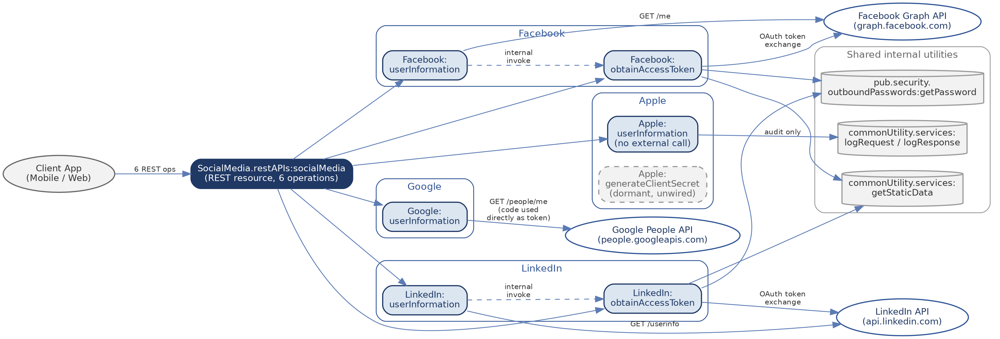
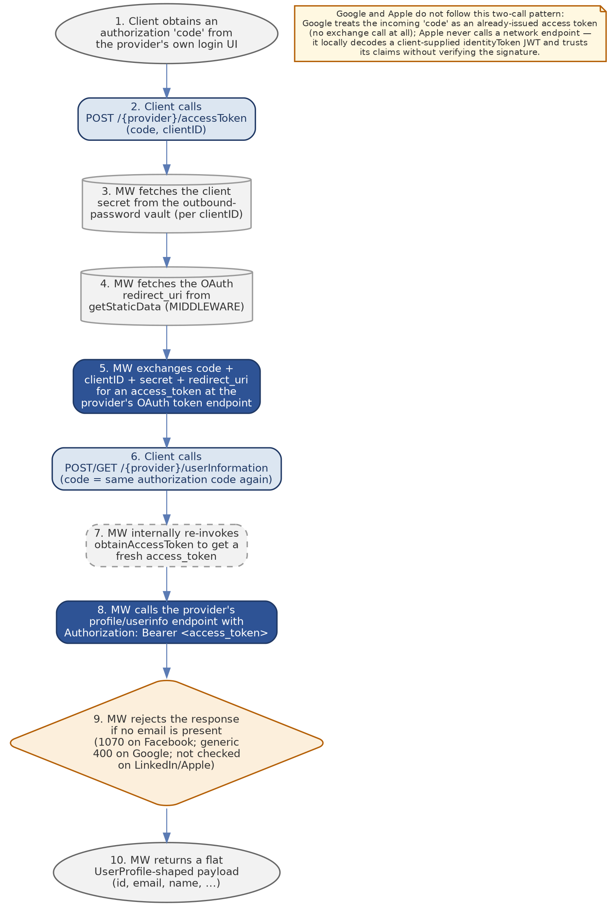
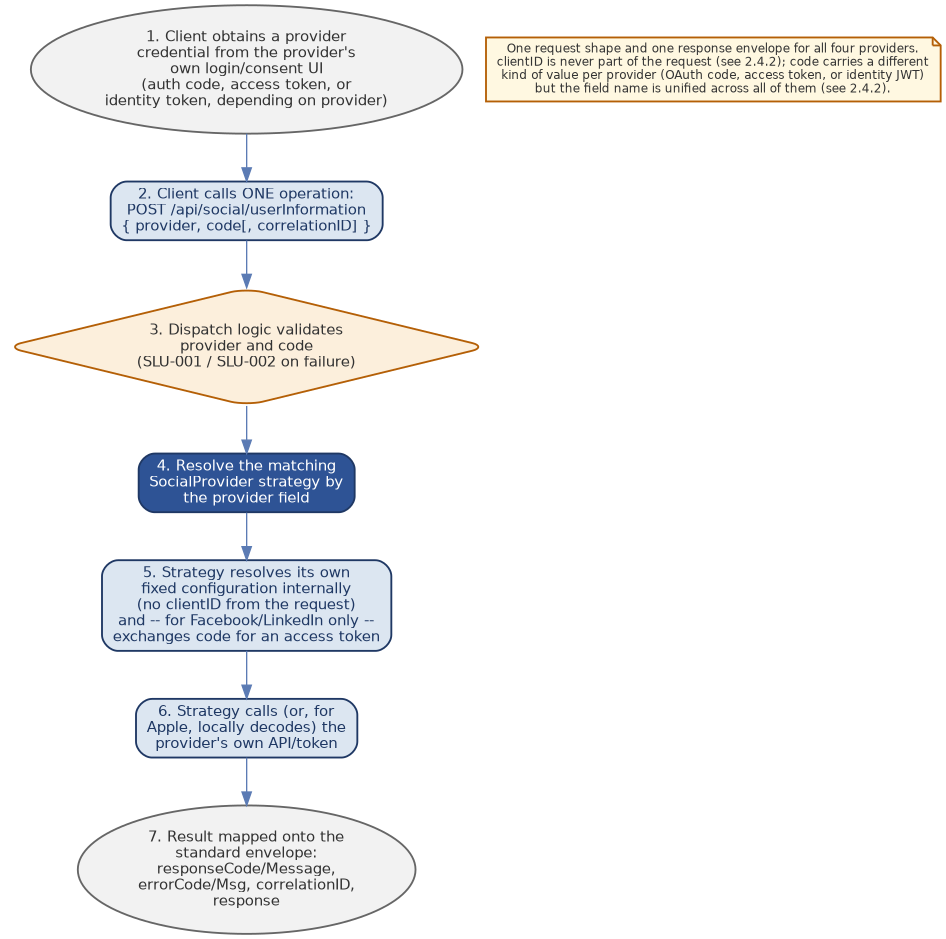

**SocialMedia Integration Service**

**API & Migration Design Documentation**

*Software AG webMethods Integration Server 10.7  →  Java / Spring Boot (Azure)*

Al Ramz Capital — INTEGRATIO Migration Programme

Version 1.0 — Unified Target Design, September 2026

Source package: SocialMedia.zip

# Document Revision History

| **Version** | **Date** | **Change** |
| --- | --- | --- |
| 1.0 | 2026-09-17 | Initial release of the unified social sign-in design. All four providers (Facebook, LinkedIn, Google, Apple) are served by one public REST operation, POST /api/social/userInformation, selected by a `provider` field, instead of six independently-routed legacy operations. Every response uses one standardized envelope that always includes correlationID alongside responseCode/responseMessage/errorCode/errorMsg/response. `clientID` is removed from every request contract and resolved entirely from server-side configuration. Apple's legacy `idToken` field is renamed to `code`, unifying the credential field name across all four providers. |

# 1. Overview

## 1.1 Purpose

The SocialMedia package is Al Ramz's webMethods Integration Server façade for “Sign in / Register with…” social identity providers. In the v1.0 target design it is served by a single, unified public REST operation — POST /api/social/userInformation — that accepts a `provider` selector (FACEBOOK, LINKEDIN, GOOGLE, or APPLE) together with a `code` value and returns a normalized user-profile payload (name, email, provider user id, and a handful of provider-specific extras) inside one standardized response envelope. `code` deliberately carries a different kind of value per provider — an OAuth authorization code for Facebook/LinkedIn, an already-issued access token for Google, or a signed identity token (JWT) for Apple — unified under one field name rather than one per provider (§2.4.2). The middleware never issues its own session or JWT here — it purely mediates the identity-provider handshake and profile lookup on behalf of the client, dispatching internally to one of four provider-specific strategy implementations based on the `provider` field. This is a first-time target-design requirement: no version of this unified endpoint has previously been delivered to any consumer, so this document is versioned 1.0 rather than as an increment on a prior public contract.

## 1.2 Scope

In scope for this document:

- Reverse-engineered business logic for all six underlying legacy Flow services across the four providers — retained here as as-built fact even though none of them survives as its own public route in the target design (see §1.3).
- The unified public contract itself: one REST operation, one request shape, one standardized response envelope (including correlationID), covering all four providers via a `provider` selector field — the full contract is in §2.4.
- Two design decisions that apply across every provider without exception: (a) `clientID` is never part of the request — every provider's client id (and, where applicable, client secret and redirect URI) is a fixed, server-side configuration value (§3), never caller-supplied; (b) the single input field carrying the provider credential is uniformly named `code` for all four providers, including Apple, whose legacy field was named `idToken`.
- The dormant Apple:generateClientSecret Java service, documented for completeness and for its security findings, even though it is not currently invoked by any other service in the package.
- A target Spring Boot design: the unified request/response contract, a standardized response envelope, per-provider internal HTTP status/error-code references, and a proposed package/class structure.

Out of scope:

- Whatever Al Ramz system(s) actually consume the returned UserProfile payload (onboarding, CRM, account linking) — those are downstream of this package and not analyzed here.
- The provider-side OAuth consent/login UI the client app uses to obtain the initial authorization code, access token, or identity token — that happens entirely outside this middleware.
- Database/DDL migration — this package has no persistence layer of its own (it calls a shared credential vault and a shared configuration service, both out of package, and an audit-logging utility used only by Apple).

## 1.3 Endpoint-at-a-glance

**Legacy operations (as they exist in the webMethods REST resource today):**

| **URL Template (legacy)** | **Method(s)** | **Backing Service** | **Purpose** |
| --- | --- | --- | --- |
| /FB/accessToken | POST | Facebook:obtainAccessToken | Exchange a Facebook OAuth authorization code for an access token; called both directly and from within Facebook:userInformation. |
| /FB/userInformation | GET, POST | Facebook:userInformation | Resolve a Facebook profile (id, email, and other fields) for the supplied code. |
| /LI/accessToken | POST | LinkedIn:obtainAccessToken | Exchange a LinkedIn OAuth authorization code for an access token; called both directly and from within LinkedIn:userInformation. |
| /LI/userInformation | GET, POST | LinkedIn:userInformation | Resolve a LinkedIn profile (OIDC userinfo: name, email, picture) for the supplied code. |
| /GM/userInformation | GET, POST | Google:userInformation | Resolve a Google profile (Google People API) — note: the input here is treated as an already-issued Google access token, not an authorization code. |
| /AP/userInformation | POST | Apple:userInformation | Decode an Apple Sign-In identityToken (JWT) and return its email/subject claims — no network call to Apple is made. |

*All six legacy operations above collapse into the single target operation below — none of them survives as an independently callable route in the v1.0 design.*

**Target operation (v1.0 — unified):**

| **URL Template (target)** | **Method** | **Backing Service** | **Purpose** |
| --- | --- | --- | --- |
| /api/social/userInformation | POST | SocialLoginService → provider strategy (Facebook / LinkedIn / Google / Apple, selected by the `provider` field) | Resolve a normalized user profile for any of the four supported providers in one contract — see §2.4 for the full request/response schema. |

## 1.4 Executive Summary

The four underlying provider integrations share a similar shape — accept a provider credential, call (or decode) a provider payload, map a handful of fields into a flat profile, and return it — but they were clearly built independently and at different times: no two of them handle authentication input, error surfacing, or field validation the same way. Two internal architectural inconsistencies affect every provider in the legacy source: none of the six underlying services ever sets an actual HTTP transport status code (the real result always travels in body fields), and none of the four `userInformation` ‘failure’ branches actually raises a webMethods failure signal that would trip an unhandled-error alert — every outcome, success or business error, reports as a normal completion at the service-invocation level.

The most serious finding in the package is architectural rather than incidental: Apple's `userInformation` never verifies the cryptographic signature of the identity token it receives — it splits the JWT on ‘.’, base64-decodes the payload, and trusts whatever `email`/`sub` claims are inside. A second, historical finding surfaced only by comparing the shipped `flow.xml` against its own `flow.xml.bak` in this package: an earlier, currently-disabled version of this same service unconditionally overwrote every successful Apple sign-in's email with one hardcoded personal-looking address.

> **Key design decisions (v1.0)**
> 
> One public operation, not six: the legacy source exposes six independently routed operations across four providers (§1.3, §2.1); the v1.0 target design exposes exactly one — POST /api/social/userInformation — with the caller's `provider` field selecting which internal strategy handles the request (§2.4).
> 
> No client-supplied clientID, anywhere: every provider's client id (and, where applicable, client secret and redirect URI) is a single, fixed configuration value per environment (§3), never a request field at either the public endpoint or any internal method. This eliminates the legacy Facebook/LinkedIn “clientID accepted then silently overwritten” pattern (Findings F-01/F-02/F-06) structurally rather than by convention.
> 
> One field name across all four providers: `code` now carries the provider credential for Facebook, LinkedIn, Google, and Apple alike — Apple's legacy `idToken` field is renamed to `code` for consistency (§2.4.2). The underlying semantics still differ by provider (OAuth code vs. access token vs. identity JWT) and are documented per provider in §4–§7.
> 
> Standardize the response envelope — responseCode/responseMessage/errorCode/errorMsg/correlationID/response — on every response from the unified endpoint, success or failure (§2.3.2). Today none of the six legacy services sets a real transport status or a correlationID consistently; the caller has always had to parse a body field to know if the call worked.
> 
> Do not port forward: the hardcoded Facebook/LinkedIn client IDs, the two disabled hardcoded secrets found in dead code, or the disabled hardcoded test email found via flow.xml.bak. None of these values should ever appear in the Spring Boot codebase, its configuration, or its git history.
> 
> Apple's identity-token verification is a genuine security gap, not a migration nicety — treat JWKS-based signature/issuer/audience/expiry verification as a functional requirement of the target design, not an optional hardening pass.
> 
> The four providers are inconsistent enough (validation, error detail, field coverage) that a single shared ‘SocialProvider’ strategy interface, one implementation per provider, is strongly preferred over one generic parameterized service — even though all four are now reached through one public operation.

# 2. Solution Architecture

## 2.1 As-Built Architecture (Legacy)

All six operations are exposed through a single IS REST resource, `SocialMedia.restAPIs:socialMedia`. Two services (Facebook and LinkedIn's `obtainAccessToken`) are dual-exposed: reachable directly as REST endpoints and invoked internally by their provider's own `userInformation`. Apple's `generateClientSecret` exists in the package but is never invoked by any other service found in this package. This is a legacy fact only — §2.3 and §2.4 cover the v1.0 target design's single unified operation, which does not carry any of these six routes forward.



*Figure 2.1 — As-built service map (solid arrows: live calls; dashed: internal invoke; dashed grey box: dormant/unwired service).*

## 2.2 End-to-End Journey (Legacy Facebook / LinkedIn pattern)

Facebook and LinkedIn follow the same two-call OAuth journey in the legacy source, including a caller-supplied clientID at each step. Google and Apple depart from it significantly — documented as callouts on the diagram rather than as separate journey diagrams. This is the legacy journey only; §2.4 documents the v1.0 unified journey, which replaces the two-call, per-provider pattern below with one call and no clientID input at all.



*Figure 2.2 — Legacy end-to-end journey: authorization code in, normalized profile out.*

## 2.3 Target Architecture (Spring Boot)

The target design collapses all four providers, and all six legacy operations, behind a single controller endpoint and one provider-agnostic facade, with a `SocialProvider` strategy interface implemented once per provider (Facebook/LinkedIn/Google/Apple) and selected at runtime by the request's `provider` field — the full contract is in §2.4. Only Apple's implementation depends on the new `AppleJwtVerifier` component, which does not exist in the legacy source at all — it is a net-new requirement, not a port of existing logic (see §7.1).


*Figure 2.3 — Target Spring Boot architecture. A single controller route accepts `provider` + `code` and dispatches to the matching strategy implementation; none of the four providers has a route of its own, and Facebook/LinkedIn's OAuth token exchange is a private method inside the corresponding strategy class.*

> **Design decisions carried into every provider**
> 
> Single public route: the legacy source exposes six independently routed operations (§2.1); the v1.0 target design exposes exactly one — POST /api/social/userInformation — with the caller's `provider` field selecting which strategy implementation runs (§2.4).
> 
> No client-supplied clientID, anywhere: Facebook's and LinkedIn's obtainAccessToken are private methods on their provider strategy, called only from within that same strategy's userInformation method — and, in addition, the per-provider client id itself is never parameterized by any caller-visible value at all, at either layer. It is a single, fixed configuration entry per environment (§3).
> 
> Consequence for error handling: any failure that would have been obtainAccessToken's own response, or a per-provider configuration failure, now surfaces through the one unified endpoint's own `errorCode` — see §2.4.6 for the endpoint-level view and §4.2.6/§5.2.6/§6.1.6/§7.1.6 for the per-provider detail.

### 2.3.1 Target Response & Result Model

Internally (service-layer to service-layer, not on the wire), each provider strategy returns a typed `OperationResult<UserProfile>` rather than the loosely-typed `{responseCode, responseMessage, response}` object the legacy flows return. `OperationResult<T>` carries: a `success` boolean, the typed payload `T` (nullable on failure), and an `ApiError` (nullable on success) holding the standardized `errorCode`/`errorMsg`. The unified endpoint's dispatch logic (§2.4.3) is what flattens this into the wire-level envelope described in §2.3.2 and sets the real HTTP status.

### 2.3.2 Standard Response Envelope

Every response from the unified endpoint (§2.4) shares the same envelope shape, regardless of which provider handled the request or whether it succeeded:

| Field | Value |
| --- | --- |
| **responseCode / responseMessage** | Always present. An HTTP-status-like pair duplicating the actual HTTP status of the response, e.g. “400” / “Bad Request”. |
| **errorCode / errorMsg** | Nullable. Populated only for Client Input Errors (a condition the caller can act on) with a 3-letter-prefixed code — SLU for the unified endpoint's own input validation (§2.4.6), or FBU/LIU/GMU/APU for a provider-specific downstream failure (§4–§7). Left null on success and on Backend/Provider Errors, where the real failure detail is logged server-side (keyed by correlationID) and never returned to the caller. |
| **correlationID** | Always present, on every response, success or failure. Echoes the value the caller supplied on the request if present and non-blank; otherwise the service generates a UUID (§2.4.3). This is the field to use when correlating a client-reported issue with server-side logs. |
| **response** | Nullable. On success, the normalized cross-provider UserProfile payload for the requested provider (§8.1). On any error — client input or backend/provider — always null. |

> **HTTP status vs. payload code — a legacy ambiguity this design resolves**
> 
> Every legacy service in this package conflates two different ideas inside one `responseCode` string field: sometimes it is a real HTTP-style status (“200”, “400”, a Facebook/LinkedIn/Google pass-through status), and sometimes it is a business/legacy numeric code from the 1000-series scheme (1057, 1069, 1070) that has no inherent HTTP meaning until mapped. The target design's `responseCode`/`responseMessage` pair is always the true HTTP status; any legacy 1000-series code becomes the `errorCode` instead, per the project's `Error-Code-to-HTTP-Status-Mapping.md` registry.

## 2.4 Unified API Contract — POST /api/social/userInformation



*Figure 2.4 — Target unified journey: one request shape, provider-based dispatch, one response envelope.*

### 2.4.1 Endpoint Summary

| Field | Value |
| --- | --- |
| **Route** | POST /api/social/userInformation |
| **Purpose** | Resolve a normalized user profile from any of the four supported identity providers, selected by the `provider` field, without exposing any provider-specific route or the OAuth token-exchange step. |
| **Exposure** | Public — the only externally reachable operation in the entire target design. Every legacy operation (§1.3, §2.1) and every provider's internal obtainAccessToken/profile-fetch logic (§4–§7) is reached exclusively through this one endpoint. |
| **Legacy equivalent** | None directly — this endpoint consolidates all six legacy operations across Facebook, LinkedIn, Google, and Apple (§1.3) into one contract. Net-new at this endpoint level, though the per-provider business logic it dispatches to is ported from the legacy services documented in §4–§7. |

### 2.4.2 Request Schema

| **Field** | **Target Type** | **Required** | **Notes** |
| --- | --- | --- | --- |
| provider | string (enum: FACEBOOK, LINKEDIN, GOOGLE, APPLE) | Yes | Selects which internal strategy implementation handles the request. An unrecognized or missing value is rejected before any provider-specific logic runs — SLU-001 (§2.4.6). |
| code | string | Yes | The single unified credential field for all four providers: an OAuth authorization code for Facebook/LinkedIn (exchanged internally for an access token, §4.1/§5.1); an already-issued access token for Google (used directly as a bearer token, unchanged from legacy behavior, §6.1); the signed identity token (JWT) for Apple, whose legacy field name was `idToken` (§7.1). Missing or blank is rejected — SLU-002 (§2.4.6). |
| correlationID | string | Optional | Standardizes the pattern only Google's legacy service supported (§8.2, historical): used verbatim if supplied and non-blank; a UUID is generated otherwise. Always echoed back in the response envelope (§2.3.2). |

`clientID` is deliberately absent from this schema. *Every provider's client id (and, where applicable, client secret and redirect URI) is a fixed, per-environment configuration value resolved entirely server-side (§3) — never a caller-supplied value, and never selectable per request. This is a v1.0 design decision, not a carried-over legacy behavior; see the Finding F-01/F-02/F-06 notes in §4–§5 for how the legacy source handled (and mishandled) this differently.*

> **Design decision — one field name, four different semantics (supersedes Finding F-09)**
> 
> An earlier draft of this document recommended renaming Google's `code` field to `accessToken` to avoid ambiguity (Finding F-09), since Google's legacy service actually treats the value as an already-issued bearer token rather than an OAuth code to exchange. The v1.0 unified design goes the other direction: every provider — including Apple, whose legacy field was named `idToken` — now shares one field, `code`, favoring one predictable request shape over per-provider naming precision.
> 
> This means client applications and any internal documentation must track the per-provider meaning of `code` separately (§4.1/§4.2 Facebook, §5.1/§5.2 LinkedIn: OAuth authorization code; §6.1 Google: bearer access token; §7.1 Apple: signed identity token/JWT) — the field name alone no longer tells the reader what kind of value it expects.

### 2.4.3 Business Logic Summary (dispatch)

1. Validate that `provider` is present and is one of FACEBOOK, LINKEDIN, GOOGLE, APPLE. On failure: SLU-001.
1. Validate that `code` is present and non-blank. On failure: SLU-002.
1. Use the caller-supplied correlationID if present and non-blank; otherwise generate a UUID — standardizing, for all four providers, the pattern only Google's legacy service supported (§8.2).
1. Resolve the matching `SocialProvider` strategy bean for the validated `provider` value (Facebook/LinkedIn/Google/Apple — §4–§7) and invoke its `userInformation(code)` method internally.
1. Each strategy resolves its own static configuration internally (client id/secret/redirect URI where applicable, §3) — no part of this resolution is influenced by any request field.
1. Map the strategy's `OperationResult<UserProfile>` (§2.3.1) onto the standard envelope (§2.3.2): on success, responseCode/responseMessage mirror HTTP 200 and `response` holds the normalized profile; on failure, responseCode/responseMessage mirror the real HTTP status, errorCode/errorMsg are populated only for a Client Input Error, and `response` is null.
1. Any exception not already mapped to a typed `ApiError` by the strategy is caught here and reported as a generic 500 — one central fallback, not one per provider.

> **Business-logic observations for the target design**
> 
> This dispatch layer is entirely net-new code — the legacy source never had a single entry point, so steps 1–3 and 6–7 above have no legacy equivalent to port from. Steps 4–5 replace what each legacy `userInformation` flow used to do for itself (resolve its own provider-specific setup) with one shared dispatch mechanism.
> 
> Centralizing correlationID handling here (step 3) resolves a legacy inconsistency documented in §8.2: previously only Google's service accepted a caller-supplied correlationID, and Facebook, LinkedIn, and Apple always generated their own with no way for a caller to propagate an existing trace id.

### 2.4.4 Sample Requests

```
// provider = FACEBOOK or LINKEDIN (OAuth authorization code)
POST /api/social/userInformation
Content-Type: application/json

{ "provider": "FACEBOOK", "code": "AQD1a2b3c4..." }

// provider = GOOGLE (already-issued access token, unchanged from legacy behavior)
{ "provider": "GOOGLE", "code": "ya29.a0AfH6..." }

// provider = APPLE (signed identity token / JWT — legacy field name was idToken)
{ "provider": "APPLE", "code": "eyJraWQiOiJXNldjT0tCIiwiYWxnIjoiUlMyNTYifQ...SIGNATURE" }

// optional client-supplied correlationID (any provider)
{ "provider": "LINKEDIN", "code": "AQTz...", "correlationID": "c3f1e9a2-8b7d-4e21-9a3f-2d6b7c1a9e44" }
```

### 2.4.5 Response Schema

Standard envelope (§2.3.2) plus `response` — the normalized cross-provider UserProfile. Field coverage genuinely differs by provider (§8.1); `provider` is echoed back inside `response` so a caller handling multiple providers can tell them apart without inspecting field shapes.

| **Field** | **Target Type** | **Notes** |
| --- | --- | --- |
| response.provider | string | Echoes the request's `provider` value. |
| response.providerUserId | string | Opaque, provider-scoped id — not globally unique across providers (§8.1). |
| response.email | string | Populated for all four providers when the underlying provider returns/reveals one — coverage genuinely differs; see §8.1 for per-provider gaps (e.g. LinkedIn's missing-email check, Finding F-08). |
| response.firstName, lastName, fullName, gender, birthday, imageUrl, mobile, preferredLanguage, emailVerified | varies | Provider-specific coverage — see the full cross-provider mapping in §8.1. |

### 2.4.6 HTTP Status Code Reference

*This is the endpoint-level view: SLU codes are raised by the dispatch logic itself (§2.4.3) before any provider strategy runs. Every other code is raised inside the selected provider's strategy and surfaces here unchanged — see the per-provider tables for full detail.*

**Client Input Errors — raised by the unified dispatch logic, before any provider strategy runs:**

| **HTTP Status** | **Service Error Code** | **Description** |
| --- | --- | --- |
| 400 Bad Request | SLU-001 | `provider` is missing or is not one of FACEBOOK, LINKEDIN, GOOGLE, APPLE. |
| 400 Bad Request | SLU-002 | `code` is missing or blank. |

**Provider-specific errors — raised inside the selected strategy; the prefix and numbering are unchanged from the per-provider design:**

| **provider value** | **Error Code Range** | **Detail** |
| --- | --- | --- |
| FACEBOOK | FBU-001 .. FBU-006 | §4.2.6 |
| LINKEDIN | LIU-001 .. LIU-006 | §5.2.6 |
| GOOGLE | GMU-001 .. GMU-005 | §6.1.6 |
| APPLE | APU-001 .. APU-003 | §7.1.6 |

### 2.4.7 Example Response Envelopes

```
// Success -- 200 OK (provider = FACEBOOK)
{
  "responseCode": "200", "responseMessage": "OK",
  "errorCode": null, "errorMsg": null,
  "correlationID": "c3f1e9a2-8b7d-4e21-9a3f-2d6b7c1a9e44",
  "response": { "provider": "FACEBOOK", "providerUserId": "10159...",
                "email": "jane@example.com", "firstName": null, "lastName": null }
}

// Endpoint-level client input error -- 400 Bad Request
{
  "responseCode": "400", "responseMessage": "Bad Request",
  "errorCode": "SLU-001", "errorMsg": "provider must be one of FACEBOOK, LINKEDIN, GOOGLE, APPLE",
  "correlationID": "e1a2f9b0-3c5d-4a6e-8f12-9d0b1c2e3a44", "response": null
}

// Provider-specific client input error -- 400 Bad Request (provider = LINKEDIN)
{
  "responseCode": "400", "responseMessage": "Bad Request",
  "errorCode": "LIU-001", "errorMsg": "code is required",
  "correlationID": "c3f1e9a2-8b7d-4e21-9a3f-2d6b7c1a9e44", "response": null
}

// Backend/provider error -- 500 Internal Server Error
{
  "responseCode": "500", "responseMessage": "Internal Server Error",
  "errorCode": null, "errorMsg": null,
  "correlationID": "9b7ea3d1-6f42-4c8a-b0d5-2e7a9c4f1b30", "response": null
}
```

### 2.4.8 Target Process Flow

Per Figure 2.3 and Figure 2.4: Client → Azure API Management → Controller (single route) → SocialLoginService facade, which validates `provider`/`code`, resolves correlationID, and dispatches to the matching strategy (§2.4.3) → the selected provider's strategy (§4–§7), which resolves its own configuration and, for Facebook/LinkedIn, exchanges the code for an access token internally before calling its downstream API. The controller flattens whichever `OperationResult` comes back into the standard envelope (§2.3.2) and sets the real HTTP status.

# 3. Prerequisites & Static Configuration

## 3.1 Integration Server Global Variables / Credential Vault

Facebook and LinkedIn's `obtainAccessToken` methods retrieve their OAuth client secret at runtime from the IS outbound-password vault. In the legacy source these lookups are keyed per client (a `%clientID%` template); in the v1.0 target design there is no caller-supplied clientID anywhere (§2.4.2), so each lookup resolves to a single fixed key per environment:

| **Vault Key** | **Used By** | **Holds** |
| --- | --- | --- |
| Azure Key Vault secret: facebook-client-secret (fixed per environment) | FacebookProvider — internal obtainAccessToken (§4.1) | Facebook app client secret. |
| Azure Key Vault secret: linkedin-client-secret (fixed per environment) | LinkedInProvider — internal obtainAccessToken (§5.1) | LinkedIn app client secret. |

Target design: both secrets live in Azure Key Vault, resolved through Spring Cloud Azure's Key Vault property source rather than a runtime string-built lookup key. Since the v1.0 unified contract accepts no client-supplied clientID at all (§2.4.2), there is no per-request or per-tenant variation to preserve here — one secret per provider per environment is sufficient by design.

## 3.2 Static / Feature-Flag Configuration

Both OAuth-exchange components also look up their redirect URI from a shared internal configuration service, `commonUtility.services:getStaticData` (application = `MIDDLEWARE`), again keyed per client in the legacy source but resolved as a single fixed value per environment in the target design:

| **Config Key** | **Used By** | **Holds** |
| --- | --- | --- |
| FACEBOOK_REDIRECT_URL (fixed per environment) | FacebookProvider — internal obtainAccessToken (§4.1) | OAuth redirect_uri registered with Facebook. |
| LINKEDIN_REDIRECT_URL (fixed per environment) | LinkedInProvider — internal obtainAccessToken (§5.1) | OAuth redirect_uri registered with LinkedIn. |

`commonUtility.services:getStaticData` is itself a shared dependency used well beyond this package; migrate it once (e.g. to Azure App Configuration) and have every migrated package consume the same source rather than re-implementing a lookup per package.

## 3.3 Hardcoded Values Found In Source (candidates for externalization)

| **Value** | **Found In** | **Notes** |
| --- | --- | --- |
| Facebook clientID = 878012490744101 | Facebook:userInformation | Legacy source unconditionally overwrites whatever clientID the caller supplied — historical Finding F-02. Superseded in the v1.0 target design, which never accepts a clientID from any caller at all (§2.4.2); this literal becomes the single environment-scoped configuration value from §3.1 instead. |
| LinkedIn clientID = 86fdios2jmsm8c | LinkedIn:userInformation | Same pattern as Facebook — historical Finding F-06, superseded the same way. |
| Facebook Graph API URLs (oauth/access_token, v21.0/me) | Facebook:obtainAccessToken, Facebook:userInformation | Provider base URL/API version should be configuration, not a compiled literal, so a Graph API version bump doesn't require a code change. |
| LinkedIn OAuth/userinfo URLs | LinkedIn:obtainAccessToken, LinkedIn:userInformation | Same rationale. |
| Google People API URL + field mask | Google:userInformation | Same rationale; the field mask (`birthdays,emailAddresses,genders,locales,locations,metadata,names,phoneNumbers,photos`) should also be configuration so added/removed fields don't require redeploy. |
| Apple EC private key and its associated team id / client id / key id (values withheld from this document — see §7.2) | Apple:generateClientSecret (java.frag test harness, unused `public static void main`) | High-severity finding — see §7.2, Finding F-14. A real-looking EC private key checked into source. Must be rotated and never carried into the Spring Boot codebase or its history, regardless of whether generateClientSecret itself is ported. |

## 3.4 Upstream / Downstream Dependencies (candidate health checks)

- Facebook Graph API (graph.facebook.com) — OAuth token endpoint and profile endpoint.
- LinkedIn API (linkedin.com / api.linkedin.com) — OAuth token endpoint and OIDC userinfo endpoint.
- Google People API (people.googleapis.com) — profile endpoint only; no Google OAuth endpoint is called by this package.
- Apple JWKS (appleid.apple.com/auth/keys) — not called anywhere in the current source; becomes a new downstream dependency the moment JWT signature verification is implemented in the target design.
- Internal: outbound-password vault, commonUtility.services:getStaticData, and (Apple only) commonUtility.services:logRequest/logResponse.

## 3.5 Security Notes

All six services declare `check_internal_acls: no` in their node.ndf, and the package manifest's `listACL` is null — i.e. the legacy Integration Server layer enforces no authentication or authorization of its own on any of these six operations; whatever access control exists today is either absent or lives entirely in a fronting API gateway that is outside this package. None of the six services ever calls a transport-level status-setting API (`pub.flow:setResponseCode` or equivalent) — confirmed by grep across all six flow.xml files — so the legacy HTTP response code returned to callers is presumably whatever the IS REST binding defaults to, regardless of the actual outcome encoded in the body.

> **Findings carried into the target design**
> 
> Introduce authentication/authorization ahead of the unified endpoint explicitly in the target design (e.g. Azure API Management with a client-credential or mTLS policy) — the legacy service provides none of its own.
> 
> Facebook's obtainAccessToken (an internal step within the unified endpoint's Facebook strategy — see §2.3, §2.4, §4.1) sends the OAuth code and client secret as URL query-string parameters on an HTTP POST (rather than in the request body), which risks both landing in access/proxy logs on the Facebook side — move to a form-encoded POST body in the target implementation.
> 
> Apple's identity token is accepted and trusted without any signature verification — the package's single highest-severity finding; full detail in §7.

# 4. Facebook Integration

Two internal-only components — `obtainAccessToken` (the OAuth code→token exchange) and `userInformation` (profile resolution) — invoked when the unified endpoint's (§2.4) `provider` field is FACEBOOK. Neither has a route of its own in the target design: the legacy source dual-exposes obtainAccessToken as its own REST endpoint and separately exposes userInformation as a third route, but the v1.0 unified design consolidates all three into the single POST /api/social/userInformation operation (§2.4), with FacebookProvider's two methods reachable only from inside that dispatch. All service error codes therefore use a single FBU prefix; the FBT prefix used for a standalone obtainAccessToken contract in an earlier draft of this document is retired, since the component has never had — and now structurally cannot have — an independent public contract. FBU is proposed only, pending user confirmation; no collision exists with any other scheme in this document.

## 4.1 obtainAccessToken — internal token exchange (no public route)

> **Internal only**
> 
> Design decision: not reachable via any public route, directly or indirectly. The legacy source dual-exposes this as POST /FB/accessToken; the v1.0 design calls it only as a private method from within FacebookProvider's userInformation (§4.2), which is itself invoked only by the unified endpoint's dispatch logic (§2.4) when provider=FACEBOOK. Its failure modes surface as part of the unified endpoint's own response — see FBU-004/FBU-005/FBU-006 in §4.2.6 and §2.4.6.

### 4.1.1 Component Summary

| Field | Value |
| --- | --- |
| **Legacy service** | SocialMedia.Facebook:obtainAccessToken |
| **Legacy REST operation** | POST /FB/accessToken — legacy only; no equivalent route anywhere in the target design. |
| **Purpose** | Exchange a Facebook OAuth authorization code for an access token, using a fixed per-environment client secret retrieved from the credential vault and a fixed per-environment redirect URI retrieved from shared configuration (§3.1, §3.2). |
| **Target exposure** | Internal only — a private method on FacebookProvider, invoked exclusively from its own userInformation method (§4.2), which in turn is invoked only by the unified endpoint (§2.4). |

### 4.1.2 Parameters

*This method takes a single parameter in the v1.0 design — there is no `clientID` parameter here or anywhere else in the target contract (§2.4.2). Facebook's client id, client secret, and redirect URI are all resolved from fixed configuration (§3.1, §3.2), never passed between methods.*

| **Field** | **Target Type** | **Required** | **Notes** |
| --- | --- | --- | --- |
| code | string | Yes | Facebook OAuth authorization code. |

> **Historical note — supersedes Finding F-01**
> 
> The legacy `obtainAccessToken` accepted a `clientID` parameter that genuinely selected the vault secret and redirect URL to use, unlike Facebook's own legacy userInformation (§4.2), where an accepted clientID input was silently overwritten before use (Finding F-02). In the v1.0 unified design this distinction is moot: clientID is not a parameter anywhere, at any layer (§2.4.2), so there is no caller-visible field left to document a defect against.

### 4.1.3 Business Logic Summary

1. Retrieve the Facebook client secret from the outbound-password vault, using the fixed per-environment key (§3.1). On failure: surfaces as FBU-005 (see §4.2.6).
1. Retrieve the OAuth redirect URI from configuration, using the fixed per-environment key (§3.2). On failure: surfaces as FBU-006.
1. Call Facebook's OAuth token endpoint with `code`, `client_id`, `client_secret`, and `redirect_uri` as URL query parameters on an HTTP POST (see Security Notes, §3.5).
1. If Facebook returns HTTP 200: parse the JSON body and return `accessToken`, `tokenType`, `expiresIn`.
1. If Facebook returns any non-200 status: forward Facebook's own HTTP status and `error.message` verbatim as the result (surfaces as FBU-004).
1. Any unhandled exception falls back to a generic 503/“Internal Server Error” (surfaces as FBU-003) — but only if no more specific code was already set.

> **Business-logic observations for the target design**
> 
> The legacy service forwards Facebook's own OAuth error message verbatim to the caller. This is genuinely actionable for the client (it names the actual problem with the code/redirect_uri) but also means Facebook's wording flows directly into Al Ramz's API surface uncensored — confirm this is acceptable before porting it forward as-is, versus mapping to a smaller Al Ramz-authored set of messages.
> 
> The two vault/config failures (FBU-005, FBU-006) reuse the same legacy code (1057) with different messages, and the second failure's internal `FAILURE-MESSAGE` text is copy-pasted from the first (“Auth Password retrieval failed”) even though it concerns the redirect URL, not the password — both are pre-existing inconsistencies in the source, not something to intentionally replicate.
> 
> Because this component is only ever reached through userInformation, which is itself only reached through the unified endpoint (§2.4), its three failure modes are documented here for traceability but are declared and tabulated once, in userInformation's own HTTP Status Code Reference (§4.2.6) — not duplicated in a second table for this section.

### 4.1.4 Sample Internal Invocation

*Illustrative only — this is a private Java method call within FacebookProvider, not a wire-level request:*

```
TokenResult result = exchangeAuthorizationCode(
    code = "AQD1a2b3c4..."
);
// Note: no clientId argument -- Facebook's client id/secret/redirect URI
// are resolved internally from fixed configuration (SS3.1, SS3.2).
```

### 4.1.5 Internal Result Fields

Returned to the calling FacebookProvider.userInformation() method, not serialized directly to any client:

| **Field** | **Target Type** | **Notes** |
| --- | --- | --- |
| accessToken | string | Facebook access token, pass-through. |
| tokenType | string | Pass-through, e.g. “bearer”. |
| expiresIn | integer (seconds) | Legacy vs. target field format: *declared as string in the legacy signature despite always holding Facebook's numeric TTL — correct to Integer in the target DTO.* |

### 4.1.6 Failure Modes

This component has no public HTTP contract of its own, so its failure modes are tabulated once, as part of Facebook:userInformation's own HTTP Status Code Reference — see §4.2.6, codes FBU-004 (Facebook rejected the code), FBU-005 (vault lookup failed), and FBU-006 (redirect-URI lookup failed). These same codes are what the unified endpoint (§2.4.6) surfaces to the caller when provider=FACEBOOK.

### 4.1.7 Target Process Flow

Per Figure 2.3/2.4: a private method on FacebookProvider, called only from that same class's userInformation() method — not reachable from the Controller directly, and not reachable at all unless the unified endpoint dispatches to FacebookProvider (§2.4.3). FacebookProvider resolves the client secret from Azure Key Vault and the redirect URI from Azure App Configuration in place of the vault/getStaticData calls.

## 4.2 userInformation — internal profile resolution (invoked via the unified endpoint)

### 4.2.1 Component Summary

| Field | Value |
| --- | --- |
| **Legacy service** | SocialMedia.Facebook:userInformation |
| **Legacy REST operation** | GET, POST /FB/userInformation — legacy only; no independent route in the target design. |
| **Purpose** | Resolve a Facebook profile for the supplied code, internally exchanging it via obtainAccessToken (§4.1) before calling the Facebook Graph API. |
| **Target exposure** | Internal only — a method on FacebookProvider, invoked exclusively by the unified endpoint's dispatch logic (§2.4) when provider=FACEBOOK. |

### 4.2.2 Parameters

| **Field** | **Target Type** | **Required** | **Notes** |
| --- | --- | --- | --- |
| code | string | Yes | *Treated as an OAuth authorization code, not an access token — re-exchanged internally via obtainAccessToken before use. This is the same `code` value the unified endpoint (§2.4.2) received from the caller, forwarded unchanged. No `clientID` parameter exists at this layer either.* |

> **Historical note — supersedes Finding F-02**
> 
> The legacy flow's very first step — before its TRY block even opens — unconditionally overwrote a caller-supplied `clientID` with the literal `878012490744101`, discarding whatever the caller sent. In the v1.0 unified design there is no request field to overwrite: `clientID` does not exist anywhere in the public or internal contract (§2.4.2). The literal itself survives only as the resolved value of the fixed configuration entry in §3.1/§3.3 — it is no longer a case of silently discarding caller input, because there is no caller input for it to discard.

### 4.2.3 Business Logic Summary

1. Resolve the fixed Facebook client id from configuration internally (no request field exists for this — §2.4.2, §3.1).
1. Call the internal obtainAccessToken method (§4.1) with `code`. Target design fix: any failure raised by that step (vault lookup, redirect-URI lookup, or Facebook rejecting the code) is surfaced directly as this method's own error — FBU-005, FBU-006, or FBU-004 respectively — correcting a legacy gap where the legacy flow keeps only `accessToken` from obtainAccessToken's response and silently discards its responseCode/responseMessage/lastError.
1. Call the Facebook Graph API: `GET /v21.0/me?fields=id,email` with `Authorization: Bearer <accessToken>`.
1. On HTTP 200: map `id`, `first_name`, `last_name`, `name`, `email`, `mobile`, `gender`, `birthday`, `languages`, `picture.data.url` from the response into the output profile.
1. On any non-200 HTTP status from Facebook: forward Facebook's real status/message and stop (FBU-002).
1. If `email` is absent or blank after a 200 response: return FBU-001 (“Email is not returned from facebook”, legacy code 1070).
1. Any unhandled exception falls back to 503/“Internal Server Error” (FBU-003), only if no more specific code was already set.

> **Business-logic observations for the target design**
> 
> New finding (F-04, Medium): the Graph API call only requests `fields=id,email` — yet the success-path mapping reads `first_name`, `last_name`, `name`, `mobile`, `gender`, `birthday`, `languages`, and `picture.data.url` from the same response. Facebook will not return fields that weren't requested, so on a real successful call, everything except `id`/`email` will normally arrive null/empty — the rich profile this endpoint appears to promise is, in practice, mostly unpopulated. Decide in the target design whether to actually request the full field set (requires re-confirming the Facebook app's approved permissions) or to shrink the documented response schema to match what is genuinely ever returned.
> 
> The 1070 (“Email is not returned from facebook”) condition is the only one of the four providers with a dedicated legacy error code for a missing email — LinkedIn doesn't check for it at all, Google uses a generic 400, and Apple has no error taxonomy at all (see §5–§6).
> 
> correlationID is resolved once by the unified endpoint's dispatch logic before this method is ever invoked (§2.4.3) — Facebook's strategy does not generate or accept one of its own.

### 4.2.4 Sample Internal Invocation

*Illustrative only — this method is invoked internally by the unified endpoint's dispatch logic (§2.4.3) when provider=FACEBOOK; it has no request of its own:*

```
UserProfile profile = facebookProvider.userInformation(
    code = "AQD1a2b3c4..."
);
```

### 4.2.5 Internal Result Fields

Returned to the unified endpoint's dispatch logic, which maps it onto the standard envelope's `response` field (§2.3.2, §2.4.5):

| **Field** | **Target Type** | **Notes** |
| --- | --- | --- |
| id | string | Facebook user id — opaque, provider-scoped, not globally unique across providers. |
| email | string | Only field guaranteed populated alongside id, given the current field mask (Finding F-04). |
| firstName / lastName / fullName | string | Populated only if the field mask is widened (Finding F-04). |
| gender, mobile, languages | string / string / array→see note | Legacy vs. target field format: *languages is declared as an array in the legacy schema while Google's equivalent (preferredLanguage) is a single scalar — standardize on one BCP-47 language tag string in the unified UserProfile (§8).* |
| birthday | string (legacy) → ISO-8601 date (target) | Legacy vs. target field format: *source is Facebook's own free-form date string; target should normalize to YYYY-MM-DD.* |
| imageURL | string (URI) | Facebook profile picture URL, pass-through. |

### 4.2.6 HTTP Status Code Reference

*These codes surface through the unified endpoint's `errorCode` field (§2.4.6) whenever provider=FACEBOOK. Includes the three failure modes of the internal obtainAccessToken step (§4.1), which has no HTTP contract of its own (FBU-004, FBU-005, FBU-006).*

**Client Input Errors:**

| **HTTP Status** | **Service Error Code** | **Description** | **Legacy Error Code** |
| --- | --- | --- | --- |
| 502 Bad Gateway | FBU-001 | Facebook did not return an email address for this user (commonly: the user did not grant the email permission during consent). | 1070 — Email is not returned from Facebook |
| 400 Bad Request | FBU-002 | Facebook rejected the access token used to fetch the profile (expired/revoked) — detail forwarded from Facebook's own error response. | — (raw Facebook error; no fixed legacy code) |
| 400 Bad Request | FBU-004 | Facebook rejected the authorization code during the internal token exchange (invalid, expired, already redeemed, or a redirect_uri mismatch) — detail forwarded from Facebook's own OAuth error response. (Formerly obtainAccessToken's own contract; folded in per §2.3.) | — (raw Facebook OAuth error; no fixed legacy code) |

**Backend/Provider Errors:**

| **HTTP Status** | **Service Error Code** | **Description** | **Legacy Error Code** |
| --- | --- | --- | --- |
| 500 Internal Server Error | FBU-003 | Unhandled internal error. | — |
| 500 Internal Server Error | FBU-005 | The Facebook client secret could not be retrieved from the credential vault, during the internal token exchange. | 1057 — Auth Password retrieval failed |
| 500 Internal Server Error | FBU-006 | The OAuth redirect URI could not be retrieved from configuration, during the internal token exchange. | 1057 — Auth Password retrieval failed (reused; see §4.1.3) |

### 4.2.7 Example Target Response Envelopes

```
// Success -- 200 OK
{
  "responseCode": "200", "responseMessage": "OK",
  "errorCode": null, "errorMsg": null,
  "correlationID": "c3f1e9a2-8b7d-4e21-9a3f-2d6b7c1a9e44",
  "response": { "provider": "FACEBOOK", "providerUserId": "10159...", "email": "jane@example.com",
                "firstName": null, "lastName": null, "fullName": null }
}

// Client input error -- 502 Bad Gateway
{
  "responseCode": "502", "responseMessage": "Bad Gateway",
  "errorCode": "FBU-001", "errorMsg": "Email is not returned from Facebook",
  "correlationID": "e1a2f9b0-3c5d-4a6e-8f12-9d0b1c2e3a44", "response": null
}

// Backend/provider error -- 500 Internal Server Error
{
  "responseCode": "500", "responseMessage": "Internal Server Error",
  "errorCode": null, "errorMsg": null,
  "correlationID": "9b7ea3d1-6f42-4c8a-b0d5-2e7a9c4f1b30", "response": null
}
```

### 4.2.8 Target Process Flow

Per Figure 2.3/2.4: unified Controller → SocialLoginService (validates provider/code, resolves correlationID, §2.4.3) → FacebookProvider.userInformation(), which internally calls its own obtainAccessToken (§4.1 — a plain Java method call in the target design, replacing the legacy's internal REST-style INVOKE) before calling the Graph API profile endpoint. No route — unified or provider-specific — exists for the token-exchange step on its own.

# 5. LinkedIn Integration

Structurally similar to Facebook (an OAuth-exchange component plus a profile method that calls it), but LinkedIn's own error handling is meaningfully different in three ways documented below. As with Facebook, obtainAccessToken and userInformation are both internal-only components in the v1.0 design, invoked only when the unified endpoint's (§2.4) `provider` field is LINKEDIN. All service error codes use a single LIU prefix; the LIT prefix used for a standalone obtainAccessToken contract in an earlier draft of this document is retired. LIU is proposed only, pending user confirmation.

## 5.1 obtainAccessToken — internal token exchange (no public route)

> **Internal only**
> 
> Design decision: not reachable via any public route, directly or indirectly. The legacy source dual-exposes this as POST /LI/accessToken; the v1.0 design calls it only as a private method from within LinkedInProvider's userInformation (§5.2), which is itself invoked only by the unified endpoint's dispatch logic (§2.4) when provider=LINKEDIN. Its failure modes surface as part of the unified endpoint's own response — see LIU-004/LIU-005/LIU-006 in §5.2.6 and §2.4.6.

### 5.1.1 Component Summary

| Field | Value |
| --- | --- |
| **Legacy service** | SocialMedia.LinkedIn:obtainAccessToken |
| **Legacy REST operation** | POST /LI/accessToken — legacy only; no equivalent route anywhere in the target design. |
| **Purpose** | Exchange a LinkedIn OAuth authorization code for an access token. |
| **Target exposure** | Internal only — a private method on LinkedInProvider, invoked exclusively from its own userInformation method (§5.2), which in turn is invoked only by the unified endpoint (§2.4). |

### 5.1.2 Parameters

*As with Facebook (§4.1.2), there is no `clientID` parameter here in the v1.0 design — the legacy version of this method genuinely used a caller-supplied clientID to build its lookup keys (unlike its Facebook counterpart), but that distinction is now moot: LinkedIn's client id, secret, and redirect URI are all resolved from fixed configuration (§3.1, §3.2), never passed as a parameter.*

| **Field** | **Target Type** | **Required** | **Notes** |
| --- | --- | --- | --- |
| code | string | Yes | LinkedIn OAuth authorization code. |

### 5.1.3 Business Logic Summary

1. Retrieve the LinkedIn client secret from the outbound-password vault, using the fixed per-environment key (§3.1). On failure: surfaces as LIU-005 (see §5.2.6).
1. Retrieve the redirect URI from configuration, using the fixed per-environment key (§3.2). On failure: surfaces as LIU-006 (reuses the same legacy code as LIU-005, and the same copy-pasted internal failure message — the identical pattern found in Facebook's equivalent, §4.1.3).
1. POST to LinkedIn's OAuth token endpoint with `code`, `grant_type=authorization_code`, `client_id`, `client_secret`, `redirect_uri` as a request body (unlike Facebook, this is correctly sent as a form/body payload, not URL query parameters).
1. On HTTP 200: return `accessToken`, `expiresIn`.
1. On any non-200 status: unlike Facebook, LinkedIn's own response body/JSON is never parsed here — the method returns a fixed generic result (surfaces as LIU-004, 400/“Bad Request — Unable to retrieve LinkedIn access token”) regardless of what LinkedIn actually said.
1. Any unhandled exception falls back to 503 (surfaces as LIU-003), only if no more specific code was already set.

> **Business-logic observations for the target design**
> 
> Finding F-05 (Low): LinkedIn's non-200 handling discards LinkedIn's own error detail entirely, unlike Facebook's equivalent path which forwards Facebook's real message. This is an inconsistency between the two providers' legacy behavior, not a defect in isolation — decide once, for both providers, whether provider error detail should reach the caller (Facebook's current behavior) or stay generic (LinkedIn's current behavior), rather than carrying the inconsistency forward by accident.
> 
> Because this component is only ever reached through userInformation, which is itself only reached through the unified endpoint (§2.4), its three failure modes are documented here for traceability but are declared and tabulated once, in userInformation's own HTTP Status Code Reference (§5.2.6) — not duplicated in a second table for this section.

### 5.1.4 Sample Internal Invocation

*Illustrative only — this is a private Java method call within LinkedInProvider, not a wire-level request:*

```
TokenResult result = exchangeAuthorizationCode(
    code = "AQTz..."
);
// Note: no clientId argument -- LinkedIn's client id/secret/redirect URI
// are resolved internally from fixed configuration (SS3.1, SS3.2).
```

### 5.1.5 Internal Result Fields

Returned to the calling LinkedInProvider.userInformation() method, not serialized directly to any client:

| **Field** | **Target Type** | **Notes** |
| --- | --- | --- |
| accessToken | string | LinkedIn access token, pass-through. |
| expiresIn | integer (seconds) | Legacy vs. target field format: *declared string in the legacy signature; correct to Integer.* |

### 5.1.6 Failure Modes

This component has no public HTTP contract of its own, so its failure modes are tabulated once, as part of LinkedIn:userInformation's own HTTP Status Code Reference — see §5.2.6, codes LIU-004 (LinkedIn rejected the code), LIU-005 (vault lookup failed), and LIU-006 (redirect-URI lookup failed). These same codes are what the unified endpoint (§2.4.6) surfaces to the caller when provider=LINKEDIN.

### 5.1.7 Target Process Flow

Per Figure 2.3/2.4: a private method on LinkedInProvider, called only from that same class's userInformation() method — not reachable from the Controller directly, and not reachable at all unless the unified endpoint dispatches to LinkedInProvider (§2.4.3). Secret/redirect URI resolved from Azure Key Vault / App Configuration.

## 5.2 userInformation — internal profile resolution (invoked via the unified endpoint)

### 5.2.1 Component Summary

| Field | Value |
| --- | --- |
| **Legacy service** | SocialMedia.LinkedIn:userInformation |
| **Legacy REST operation** | GET, POST /LI/userInformation — legacy only; no independent route in the target design. |
| **Purpose** | Validate the incoming code, exchange it internally via obtainAccessToken (§5.1), then call LinkedIn's OIDC userinfo endpoint. |
| **Target exposure** | Internal only — a method on LinkedInProvider, invoked exclusively by the unified endpoint's dispatch logic (§2.4) when provider=LINKEDIN. |

### 5.2.2 Parameters

| **Field** | **Target Type** | **Required** | **Notes** |
| --- | --- | --- | --- |
| code | string | Yes — validated | This is the same `code` value the unified endpoint (§2.4.2) already validated as non-blank (SLU-002); this method additionally validates it via a shared commonValidator.genericValidator:validateInputList call, matching the legacy behavior. No `clientID` parameter exists at this layer. |

> **Historical note — supersedes Finding F-06**
> 
> The legacy flow unconditionally overwrote a caller-supplied `clientID` with the literal `86fdios2jmsm8c` before use — the same pattern as Facebook's Finding F-02. In the v1.0 unified design there is no request field to overwrite: `clientID` does not exist anywhere in the public or internal contract (§2.4.2).

### 5.2.3 Business Logic Summary

1. Resolve the fixed LinkedIn client id from configuration internally (no request field exists for this — §2.4.2, §3.1).
1. Validate that `code` is present via the shared generic validator. If it fails: return LIU-001 (legacy 1069, “Input validation failed”) — and, notably, this path signals SUCCESS at the webMethods flow-control level even though it is returning a client-input error (see the callout below).
1. Call the internal obtainAccessToken method (§5.1) with `code`. Target design fix: any failure raised by that step (vault lookup, redirect-URI lookup, or LinkedIn rejecting the code) is surfaced directly as this method's own error — LIU-005, LIU-006, or LIU-004 respectively.
1. Call LinkedIn's `GET /v2/userinfo` with `Authorization: Bearer <accessToken>`.
1. On HTTP 200: map `sub`→id, `given_name`→firstName, `family_name`→lastName, `email`→emailAddress, `picture`→imageURL.
1. On any non-200 status: forward only the raw HTTP status/status-line text (not LinkedIn's JSON error body, which is never parsed on this path) as LIU-002, falling back to a fixed 400/message if the transport status itself was somehow unavailable.
1. Any unhandled exception falls back to 503 (LIU-003), only if no more specific code was already set.

> **Business-logic observations for the target design**
> 
> Finding F-07 (Medium): the input-validation failure path (LIU-001, legacy 1069) explicitly exits with `SIGNAL="SUCCESS"` at the webMethods flow-control level — meaning any operational monitoring keyed off webMethods-level failure signals would never see this as an error, even though the payload is a client-input error. The Spring Boot replacement removes this ambiguity structurally: an `OperationResult` with `success=false` is always distinguishable regardless of HTTP status chosen.
> 
> Finding F-08 (Low): unlike Facebook's userInformation (§4.2), LinkedIn's non-200 error branch never checks for a missing email at all — there is no LinkedIn equivalent of Facebook's 1070 or Google's generic-400 missing-email check. If LinkedIn's OIDC userinfo response omits email (e.g. the user didn't grant the `email` scope), the service currently returns it as a normal 200 success with `emailAddress` simply absent/null. Decide in the target design whether all four providers should enforce the same missing-email policy for consistency.
> 
> code is validated for presence here — redundantly with the unified endpoint's own SLU-002 check (§2.4.3) — matching legacy behavior; clientID is not validated because it is not a parameter at all (superseded Finding F-06).
> 
> correlationID is resolved once by the unified endpoint's dispatch logic before this method is ever invoked (§2.4.3) — LinkedIn's strategy does not generate or accept one of its own.

### 5.2.4 Sample Internal Invocation

*Illustrative only — this method is invoked internally by the unified endpoint's dispatch logic (§2.4.3) when provider=LINKEDIN; it has no request of its own:*

```
UserProfile profile = linkedInProvider.userInformation(
    code = "AQTz..."
);
```

### 5.2.5 Internal Result Fields

| **Field** | **Target Type** | **Notes** |
| --- | --- | --- |
| id | string | LinkedIn `sub` claim — opaque, provider-scoped. |
| emailAddress | string | Not guaranteed present — see Finding F-08 (no missing-email check on this provider). |
| firstName / lastName | string | From OIDC `given_name` / `family_name`. |
| imageURL | string (URI) | From OIDC `picture`. |

### 5.2.6 HTTP Status Code Reference

*These codes surface through the unified endpoint's `errorCode` field (§2.4.6) whenever provider=LINKEDIN. Includes the three failure modes of the internal obtainAccessToken step (§5.1), which has no HTTP contract of its own (LIU-004, LIU-005, LIU-006).*

**Client Input Errors:**

| **HTTP Status** | **Service Error Code** | **Description** | **Legacy Error Code** |
| --- | --- | --- | --- |
| 400 Bad Request | LIU-001 | The `code` field is missing or fails input validation. | 1069 — Validation List Failed |
| 400 Bad Request | LIU-002 | LinkedIn rejected the access token used to fetch the profile — only the raw HTTP status/reason phrase is available, not LinkedIn's own error detail (Finding F-05-style suppression). | — (raw LinkedIn HTTP status; falls back to a fixed 400 if unavailable) |
| 400 Bad Request | LIU-004 | LinkedIn rejected the authorization code during the internal token exchange — generic message; LinkedIn's own error detail is not forwarded (Finding F-05). (Formerly obtainAccessToken's own contract; folded in per §2.3.) | — (LinkedIn's real HTTP status is not surfaced either — always reported as 400) |

**Backend/Provider Errors:**

| **HTTP Status** | **Service Error Code** | **Description** | **Legacy Error Code** |
| --- | --- | --- | --- |
| 500 Internal Server Error | LIU-003 | Unhandled internal error. | — |
| 500 Internal Server Error | LIU-005 | The LinkedIn client secret could not be retrieved from the credential vault, during the internal token exchange. | 1057 — Auth Password retrieval failed |
| 500 Internal Server Error | LIU-006 | The OAuth redirect URI could not be retrieved from configuration, during the internal token exchange. | 1057 — Auth Password retrieval failed (reused; see §5.1.3) |

### 5.2.7 Example Target Response Envelopes

```
// Success -- 200 OK
{ "responseCode": "200", "responseMessage": "OK", "errorCode": null, "errorMsg": null,
  "correlationID": "c3f1e9a2-8b7d-4e21-9a3f-2d6b7c1a9e44",
  "response": { "provider": "LINKEDIN", "providerUserId": "782ha...", "emailAddress": "jane@example.com",
                "firstName": "Jane", "lastName": "Doe", "imageURL": "https://media.licdn.com/..." } }

// Client input error -- 400 Bad Request
{ "responseCode": "400", "responseMessage": "Bad Request", "errorCode": "LIU-001",
  "errorMsg": "code is required", "correlationID": "c3f1e9a2-8b7d-4e21-9a3f-2d6b7c1a9e44", "response": null }

// Backend/provider error -- 500 Internal Server Error
{ "responseCode": "500", "responseMessage": "Internal Server Error", "errorCode": null,
  "errorMsg": null, "correlationID": "9b7ea3d1-6f42-4c8a-b0d5-2e7a9c4f1b30", "response": null }
```

### 5.2.8 Target Process Flow

Per Figure 2.3/2.4: unified Controller → SocialLoginService → LinkedInProvider, which internally calls its own obtainAccessToken method (§5.1 — a plain Java method call) → WebClient → LinkedIn userinfo endpoint. No route — unified or provider-specific — exists for the token-exchange step on its own.

# 6. Google Integration

An internal-only component, architecturally simpler than Facebook/LinkedIn: there is no separate obtainAccessToken step, because Google's `userInformation` treats its `code` input as an already-issued Google access token rather than an authorization code to be exchanged — confirmed by the absence of any call to Google's OAuth token endpoint anywhere in this service. Invoked only when the unified endpoint's (§2.4) `provider` field is GOOGLE. Proposed prefix: GMU (Google User), proposed only, pending confirmation.

## 6.1 userInformation — internal profile resolution (invoked via the unified endpoint)

### 6.1.1 Component Summary

| Field | Value |
| --- | --- |
| **Legacy service** | SocialMedia.Google:userInformation |
| **Legacy REST operation** | GET, POST /GM/userInformation — legacy only; no independent route in the target design. |
| **Purpose** | Resolve a Google profile via the Google People API, using the caller-supplied value directly as a bearer access token. |
| **Target exposure** | Internal only — a method on GoogleProvider, invoked exclusively by the unified endpoint's dispatch logic (§2.4) when provider=GOOGLE. |

### 6.1.2 Parameters

| **Field** | **Target Type** | **Required** | **Notes** |
| --- | --- | --- | --- |
| code | string | Not explicitly validated beyond the unified endpoint's own non-blank check (SLU-002, §2.4.3) | Legacy vs. target field format: *naming is misleading — despite the field name matching the other three providers' `code`, this is used directly as a Google OAuth access token (`Authorization: Bearer %code%`), never exchanged. An earlier draft of this document (Finding F-09) recommended renaming this field to `accessToken` specifically for Google — the v1.0 unified design goes the other way and keeps `code` for every provider; see the design-decision callout in §2.4.2.* |

### 6.1.3 Business Logic Summary

1. Build `Authorization: Bearer %code%` directly from the input — no token-exchange call is made.
1. Call the Google People API: `GET /v1/people/me?personFields=birthdays,emailAddresses,genders,locales,locations,metadata,names,phoneNumbers,photos`.
1. If the HTTP call itself throws (e.g. a transport-level exception) rather than returning a response: fall back to GMU-004 (401/“Unauthorized”), using the real status if one happened to be available.
1. If Google responds with a non-200 HTTP status: forward Google's real status/message verbatim (GMU-003).
1. On HTTP 200: parse the profile and attempt to build a `birthday` string from separate year/month/day claims, validating it against the pattern dd/MM/yyyy — if the date is malformed or any part is missing, `birthday` is silently dropped with no error raised.
1. If `email` is null or an empty string: return GMU-001/GMU-002 (both currently a generic 400/“Bad Request” — unlike Facebook, there is no distinct legacy numeric code for this condition).
1. Any unhandled exception falls back to 503 (GMU-005), only if no more specific code was already set.

> **Business-logic observations for the target design**
> 
> Finding F-10 (High — source defect, not a security issue): node.ndf declares Google's `response` output as an empty, closed record with zero child fields, while the flow actually populates 9 real fields into it at runtime (email, id, firstName, lastName, fullName, gender, imageURL, preferredLanguage, birthday). A Spring Boot DTO generated mechanically from the declared signature would silently drop the entire payload — the target DTO must be built from the runtime behavior documented here, not from node.ndf.
> 
> The birthday-parsing failure is swallowed entirely (no error, field just disappears) — decide whether the target design should keep this permissive behavior or surface a data-quality warning/log entry when Google's birthday data doesn't parse.
> 
> There is no explicit validation that `code` is meaningfully well-formed on this endpoint beyond the unified layer's non-blank check (§2.4.3) — an empty/missing code simply produces `Authorization: Bearer ` and a 401-style failure from Google, surfaced generically.
> 
> correlationID was, in the legacy source, the one provider that accepted a caller-supplied value directly (§8.2, historical) — that behavior is now standardized for all four providers at the unified endpoint's dispatch logic (§2.4.3), so Google's strategy no longer handles it itself.

### 6.1.4 Sample Internal Invocation

*Illustrative only — this method is invoked internally by the unified endpoint's dispatch logic (§2.4.3) when provider=GOOGLE; it has no request of its own:*

```
UserProfile profile = googleProvider.userInformation(
    code = "ya29.a0AfH6..."
);
```

### 6.1.5 Internal Result Fields

| **Field** | **Target Type** | **Notes** |
| --- | --- | --- |
| id | string | Google `sub`/resourceName-derived id — opaque, provider-scoped. |
| email, firstName, lastName, fullName, gender, imageURL | string | Straight pass-through of Google People API fields. |
| preferredLanguage | string (BCP-47) | Legacy vs. target field format: *a single scalar locale code — contrast with Facebook's languages array (§4.2.5); unify to one BCP-47 tag in the shared UserProfile (§8).* |
| birthday | string (legacy) → ISO-8601 date (target) | Silently absent when Google's birthday data doesn't parse cleanly — see observations above. |

### 6.1.6 HTTP Status Code Reference

*These codes surface through the unified endpoint's `errorCode` field (§2.4.6) whenever provider=GOOGLE.*

**Client Input Errors:**

| **HTTP Status** | **Service Error Code** | **Description** | **Legacy Error Code** |
| --- | --- | --- | --- |
| 400 Bad Request | GMU-001 | Google returned no email address for this user (email field absent). | — (generic; no dedicated legacy code, unlike Facebook's 1070) |
| 400 Bad Request | GMU-002 | Google returned an empty-string email address for this user. | — (same generic 400, treated identically to GMU-001) |
| 400 Bad Request | GMU-003 | Google rejected the supplied access token or returned another client-attributable error — detail forwarded from Google's own HTTP status/message. | — (raw Google HTTP status; no fixed legacy code) |

**Backend/Provider Errors:**

| **HTTP Status** | **Service Error Code** | **Description** | **Legacy Error Code** |
| --- | --- | --- | --- |
| 401 Unauthorized | GMU-004 | The call to Google's People API failed at the transport level (e.g. timeout/connection failure) before any response was received. | — (fixed fallback; a genuinely available real status is used instead when one exists) |
| 500 Internal Server Error | GMU-005 | Unhandled internal error. | — |

### 6.1.7 Example Target Response Envelopes

```
// Success -- 200 OK
{ "responseCode": "200", "responseMessage": "OK", "errorCode": null, "errorMsg": null,
  "correlationID": "c3f1e9a2-8b7d-4e21-9a3f-2d6b7c1a9e44",
  "response": { "provider": "GOOGLE", "providerUserId": "10876...", "email": "jane@gmail.com", "firstName": "Jane",
                "lastName": "Doe", "fullName": "Jane Doe", "gender": "female",
                "imageURL": "https://lh3.googleusercontent.com/...",
                "preferredLanguage": "en", "birthday": "1990-04-12" } }

// Client input error -- 400 Bad Request
{ "responseCode": "400", "responseMessage": "Bad Request", "errorCode": "GMU-001",
  "errorMsg": "Google account has no email address available", "correlationID": "e1a2f9b0-3c5d-4a6e-8f12-9d0b1c2e3a44", "response": null }

// Backend/provider error -- 500 Internal Server Error
{ "responseCode": "500", "responseMessage": "Internal Server Error", "errorCode": null,
  "errorMsg": null, "correlationID": "9b7ea3d1-6f42-4c8a-b0d5-2e7a9c4f1b30", "response": null }
```

### 6.1.8 Target Process Flow

Per Figure 2.3/2.4: unified Controller → SocialLoginService → GoogleProvider → WebClient → Google People API. No credential-vault or config-service dependency exists for Google (it requires no client secret of its own in this flow), which is itself worth confirming is intentional rather than an incomplete implementation.

# 7. Apple Integration

The architectural outlier of the package: `userInformation` makes no network call at all — it locally decodes a client-supplied identity token (a JWT) and returns whatever claims are inside. In the legacy source this field was named `idToken`; the v1.0 unified design renames it to `code` for consistency with the other three providers (§2.4.2) — the value itself is unchanged, still a signed Apple identity token. Invoked only when the unified endpoint's (§2.4) `provider` field is APPLE. A separate, dormant service, `generateClientSecret`, exists in the same package to build an Apple-format JWT client secret but is never invoked by `userInformation` or by anything else found in this package. Proposed prefix: APU (Apple User), proposed only, pending confirmation.

## 7.1 userInformation — internal profile resolution (invoked via the unified endpoint)

### 7.1.1 Component Summary

| Field | Value |
| --- | --- |
| **Legacy service** | SocialMedia.Apple:userInformation |
| **Legacy REST operation** | POST /AP/userInformation — legacy only; no independent route in the target design. |
| **Purpose** | Decode a client-supplied Apple Sign-In identity token and return its email/subject claims. |
| **Target exposure** | Internal only — a method on AppleProvider, invoked exclusively by the unified endpoint's dispatch logic (§2.4) when provider=APPLE. |

### 7.1.2 Parameters

| **Field** | **Target Type** | **Required** | **Notes** |
| --- | --- | --- | --- |
| code | string | Yes | Renamed from the legacy `idToken` for consistency across all four providers (§2.4.2) — same value, same semantics: *the Apple-issued identity token JWT. Its signature, issuer, audience, and expiry are never validated in the legacy source — see the Security Notes callout below (Finding F-11, the package's highest-severity finding).* |

### 7.1.3 Business Logic Summary

1. Log the inbound request (audit trail) via a shared logging utility — the only one of the four providers whose flow writes an audit log.
1. Split `code` (the identity token) on `.` into its three JWT segments; take only the middle (payload) segment.
1. Base64-decode the payload segment and parse it as JSON — no cryptographic verification of any kind is performed at any point; the signature segment is extracted but never read again.
1. Extract `email`, `email_verified`, and `sub` from the decoded (unverified) payload.
1. Build the success response with `email` and `sub`→id; `email_verified` is computed but deleted before it reaches the output (Finding F-13).
1. Log the outcome (success or error) via the same shared logging utility.
1. Any failure anywhere in steps 2–5 — a malformed token, invalid base64, non-JSON payload, or any other exception — is caught by a single generic handler that always returns the same 500/“Internal Server Error”, with no differentiation of cause (Finding F-12).

> **⚠ High severity — identity token signature is never verified — authentication bypass (Finding F-11)**
> 
> Every step that touches the identity token (carried in the unified `code` field, §2.4.2) was traced: it is split on ‘.’, the payload segment is base64-decoded and parsed as JSON, and its claims are returned — the signature segment is extracted but never referenced again anywhere in the flow. There is no JWKS fetch, no signature check, and no issuer/audience/expiry validation anywhere in this service.
> 
> Practical impact: anyone who can construct a syntactically valid three-segment, base64url-encoded-JSON-payload string — no cryptographic material required — and submit it as `code` will have its email/sub claims accepted and returned as if it were a genuine, Apple-signed identity assertion. This is a real authentication bypass, not a hardening suggestion.
> 
> Target design requirement (not optional): verify the JWT signature against Apple's live JWKS (https://appleid.apple.com/auth/keys), and validate iss (https://appleid.apple.com), aud (the app's client/service id), and exp before trusting any claim. This is net-new logic — nothing in the legacy source can be “ported” for it; see §2.3's AppleJwtVerifier component.

### 7.1.4 Sample Internal Invocation

*Illustrative only — this method is invoked internally by the unified endpoint's dispatch logic (§2.4.3) when provider=APPLE; it has no request of its own:*

```
UserProfile profile = appleProvider.userInformation(
    code = "eyJraWQiOiJXNldjT0tCIiwiYWxnIjoiUlMyNTYifQ.eyJpc3MiOiJodHRwczovL2FwcGxlaWQuYXBwbGUuY29tIiwic3ViIjoiMDAxOTM3LmFiYzEyMy4xMjM0IiwiZW1haWwiOiJqYW5lQHByaXZhdGVyZWxheS5hcHBsZWlkLmNvbSJ9.SIGNATURE"
);
// "code" here carries Apple's signed identity token (JWT) -- the legacy
// field name was "idToken"; unified to "code" per SS2.4.2.
```

### 7.1.5 Internal Result Fields

| **Field** | **Target Type** | **Notes** |
| --- | --- | --- |
| id | string | Apple `sub` claim — opaque, provider-scoped. |
| email | string | Apple email (may be a private-relay address if the user chose to hide their real email). |
| emailVerified | boolean | New in target design (Finding F-13): *computed from the token's email_verified claim but currently discarded before reaching the caller — should be included in the target response now that the token is actually going to be verified.* |

### 7.1.6 HTTP Status Code Reference

*These codes surface through the unified endpoint's `errorCode` field (§2.4.6) whenever provider=APPLE. Apple has no numeric legacy error-code scheme at all — only the literal strings “200”/“OK” and “500”/“Internal Server Error” exist in source. Per the documentation convention for a service with no legacy codes, the Legacy Error Code column is dropped below.*

**Client Input Errors (proposed — differentiated for the first time in the target design; see Finding F-12):**

| **HTTP Status** | **Service Error Code** | **Description** |
| --- | --- | --- |
| 400 Bad Request | APU-001 | The supplied `code` is not a well-formed JWT (wrong segment count, invalid base64, or a non-JSON payload). |
| 401 Unauthorized | APU-002 | The `code` token's signature could not be verified against Apple's public keys, or its issuer/audience/expiry failed validation. This condition does not exist in the legacy source — it can only be raised once Finding F-11 is remediated. |

**Backend/Provider Errors:**

| **HTTP Status** | **Service Error Code** | **Description** |
| --- | --- | --- |
| 500 Internal Server Error | APU-003 | Unhandled internal error, or Apple's JWKS endpoint is unreachable when verification is attempted. |

> **Business-logic observations for the target design**
> 
> Finding F-12 (Medium): today, every failure — nearly all of them caused by a malformed or garbage client-supplied token — is reported identically as 500/“Internal Server Error”. This is a genuine misclassification (client-caused conditions reported as server errors), independent of the signature-verification gap; APU-001 above corrects it.
> 
> Finding F-13 (Low): `email_verified` is extracted from the token payload and then explicitly deleted before the response is built — the caller currently receives no signal at all about email verification status.
> 
> correlationID is resolved once by the unified endpoint's dispatch logic before this method is ever invoked (§2.4.3) — Apple's strategy does not generate one of its own, matching its legacy behavior of never accepting a caller-supplied one either.

### 7.1.7 Example Target Response Envelopes

```
// Success -- 200 OK
{ "responseCode": "200", "responseMessage": "OK", "errorCode": null, "errorMsg": null,
  "correlationID": "c3f1e9a2-8b7d-4e21-9a3f-2d6b7c1a9e44",
  "response": { "provider": "APPLE", "providerUserId": "001937.abc123.1234", "email": "jane@privaterelay.appleid.com",
                "emailVerified": true } }

// Client input error -- 401 Unauthorized
{ "responseCode": "401", "responseMessage": "Unauthorized", "errorCode": "APU-002",
  "errorMsg": "identity token signature could not be verified", "correlationID": "e1a2f9b0-3c5d-4a6e-8f12-9d0b1c2e3a44", "response": null }

// Backend/provider error -- 500 Internal Server Error
{ "responseCode": "500", "responseMessage": "Internal Server Error", "errorCode": null,
  "errorMsg": null, "correlationID": "9b7ea3d1-6f42-4c8a-b0d5-2e7a9c4f1b30", "response": null }
```

### 7.1.8 Target Process Flow

Per Figure 2.3/2.4: unified Controller → SocialLoginService → AppleProvider → AppleJwtVerifier (new component — fetches/caches Apple's JWKS, verifies signature/iss/aud/exp) → claim extraction. No WebClient call to a profile endpoint is needed — Apple's identity token already carries the profile claims once genuinely verified.

## 7.2 generateClientSecret — dormant, documented for completeness

A Java service (`SocialMedia.Apple:generateClientSecret`) that builds an ES256-signed JWT client secret (the format Apple requires when a server calls its OAuth token endpoint). Confirmed not invoked by `userInformation`, nor by any other service found in this package — it appears to be prepared for a token-based Apple OAuth flow that isn't wired up yet.

> **⚠ High severity — Real-looking EC private key and identifiers hardcoded in a dead test harness (Finding F-14)**
> 
> The service's shared Java code (`java.frag`) contains an unused `public static void main` test harness with a hardcoded EC private key (PEM-encoded) plus its associated Apple team id, client id, and key id, all as literal strings. This main method is never called by the service itself — it is dead code — but a real-looking private key checked into source control must be rotated and scrubbed from history regardless of runtime reachability. None of the four literal values is reproduced in this document; they are available for review directly in the source package.
> 
> Separately (independent of the hardcoded key): the JWT expiry the shared logic computes is `now + 1 year` (`60*60*24*365` seconds). Apple's documented maximum client-secret validity is 6 months — if this dormant service were ever wired up as-is, Apple would reject the generated secret.

If any future work wires this service up (e.g. to support server-side Apple OAuth token calls), the Spring Boot equivalent should generate the JWT expiry within Apple's 6-month limit and source the private key/team id/client id/key id exclusively from Azure Key Vault — never from a literal in code, test or otherwise.

# 8. Data Mapping Reference

## 8.1 Unified UserProfile Field Mapping

The four providers return four different shapes today. The table below maps each provider's actual runtime-populated fields (not merely their declared node.ndf signature — see Finding F-10 for why that distinction matters for Google specifically) onto the one `UserProfile` type every path through the unified endpoint (§2.4.5) returns.

| **UserProfile field** | **Facebook** | **LinkedIn** | **Google** | **Apple** |
| --- | --- | --- | --- | --- |
| provider | Echoes the request's `provider` value — “FACEBOOK” | “LINKEDIN” | “GOOGLE” | “APPLE” |
| providerUserId | id | id (sub) | id | id (sub) |
| email | email | emailAddress | email | email |
| emailVerified | — (not returned) | — (not returned) | — (not returned) | computed, currently discarded (F-13) |
| firstName | firstName | firstName | firstName | — (not in Apple's claim set used) |
| lastName | lastName | lastName | lastName | — |
| fullName | fullName | — (not mapped) | fullName | — |
| gender | gender | — | gender | — |
| birthday | birthday (free-form) | — | birthday (parsed, may be dropped) | — |
| imageUrl | imageURL | imageURL | imageURL | — |
| mobile | mobile | — | — | — |
| preferredLanguage | languages (array) | — | preferredLanguage (scalar) | — |

Note the coverage gap is not symmetric: Apple returns only id/email(/emailVerified once fixed) by design (the identity token carries no more than that), while LinkedIn's narrower coverage (no gender/birthday/mobile/fullName) reflects what OIDC's standard userinfo claims actually offer versus what Facebook's/Google's richer profile APIs return — the gap is a genuine provider capability difference, not uniformly a defect.

## 8.2 correlationID Origination Comparison (historical — legacy behavior only)

*This inconsistency no longer exists in the v1.0 unified design: correlationID acceptance/generation now happens exactly once, in the unified endpoint's dispatch logic (§2.4.3), for all four providers alike. The table below documents how the legacy source handled it before that consolidation, for historical traceability only.*

| **Service** | **Accepted correlationID as input?** | **Legacy generation behavior** |
| --- | --- | --- |
| Facebook:obtainAccessToken | Yes | Passed through as-is (no generation) — caller/internal-invoker controlled it. |
| Facebook:userInformation | No | Always generated internally; not exposed as a request field. |
| LinkedIn:obtainAccessToken | Yes | Passed through as-is. |
| LinkedIn:userInformation | No | Always generated internally. |
| Google:userInformation | Yes (optional) | Used the caller's value if non-blank; generated one only if blank — the only provider that let an external caller propagate its own trace id. |
| Apple:userInformation | No | Always generated internally. |

v1.0 target design: Google's legacy pattern is now the standard for all four providers, applied once at the unified endpoint rather than per provider — accept an optional caller-supplied correlationID and generate a UUID only when absent (§2.4.2, §2.4.3). None of the four provider strategies in §4–§7 handles correlationID itself anymore.

## 8.3 Provider Dispatch Reference

How the unified endpoint's `provider` field (§2.4.2) maps onto an internal strategy, and what that strategy does before returning a normalized profile:

| **provider value** | **Internal strategy** | **Internal token exchange?** | **Downstream call(s)** |
| --- | --- | --- | --- |
| FACEBOOK | FacebookProvider | Yes — obtainAccessToken (§4.1), internal only | Facebook Graph API (§4.2) |
| LINKEDIN | LinkedInProvider | Yes — obtainAccessToken (§5.1), internal only | LinkedIn OIDC userinfo (§5.2) |
| GOOGLE | GoogleProvider | No — `code` is used directly as a bearer access token (§6.1) | Google People API (§6.1) |
| APPLE | AppleProvider | No — `code` is a signed identity token whose claims are decoded directly, pending JWKS verification (§7.1) | Apple JWKS (net-new, once F-11 is remediated) — otherwise none |

# 9. Appendix

## 9.1 Glossary

| **Term** | **Meaning** |
| --- | --- |
| provider (request field) | The unified endpoint's dispatch selector — one of FACEBOOK, LINKEDIN, GOOGLE, APPLE — determining which internal strategy handles the request (§2.4). |
| OAuth authorization code | A short-lived, single-use code issued by a provider's login/consent UI, exchanged once for an access token. |
| OIDC / userinfo | OpenID Connect — a standardized identity layer on OAuth; LinkedIn and Google's People API expose userinfo-style endpoints returning standard claims (sub, email, given_name, etc.). |
| JWT / JWKS | JSON Web Token; JSON Web Key Set — the public keys a token issuer (e.g. Apple) publishes so relying parties can verify a JWT's signature. |
| correlationID | A trace identifier propagated across a single logical request for cross-system log correlation. |
| IS | Software AG webMethods Integration Server. |
| gvhandle | The webMethods outbound-password vault's runtime lookup-key prefix for a stored credential. |

## 9.2 Source Service Inventory

| **Service** | **Type** | **Legacy REST-exposed?** | **Target Exposure (v1.0)** | **Calls** |
| --- | --- | --- | --- | --- |
| Unified: userInformation (all providers) | Spring Boot — net new | No legacy equivalent (§1.3) | Public — the only externally reachable operation | Dispatches by `provider` to one of the four strategies below (§2.4) |
| Facebook:obtainAccessToken | Flow | Yes (POST /FB/accessToken) | Internal only — invoked via the unified endpoint (§2.4) | Vault, getStaticData, Facebook Graph API |
| Facebook:userInformation | Flow | Yes (GET/POST /FB/userInformation) | Internal only — invoked via the unified endpoint (§2.4) | obtainAccessToken (internal), Facebook Graph API |
| LinkedIn:obtainAccessToken | Flow | Yes (POST /LI/accessToken) | Internal only — invoked via the unified endpoint (§2.4) | Vault, getStaticData, LinkedIn OAuth endpoint |
| LinkedIn:userInformation | Flow | Yes (GET/POST /LI/userInformation) | Internal only — invoked via the unified endpoint (§2.4) | Generic validator, obtainAccessToken (internal), LinkedIn userinfo endpoint |
| Google:userInformation | Flow | Yes (GET/POST /GM/userInformation) | Internal only — invoked via the unified endpoint (§2.4) | Google People API only |
| Apple:userInformation | Flow | Yes (POST /AP/userInformation) | Internal only — invoked via the unified endpoint (§2.4) | Internal logging utility only — no external call |
| Apple:generateClientSecret | Java (shared code in Apple interface) | No — not REST-exposed and not invoked by any other service found in this package | N/A — dormant | None (self-contained JWT builder) |

## 9.3 Consolidated Findings & Recommendations

*All findings below were re-verified directly against the source flow.xml files (not carried forward unverified from any prior review). The v1.0 target design additionally makes several structural decisions — a single unified endpoint, the removal of clientID as a request field, and the renaming of Apple's idToken to code — that are documented as design decisions below the table, not scored for severity, since they are choices rather than defects.*

| **#** | **Severity** | **Finding** | **Location** |
| --- | --- | --- | --- |
| F-11 | High | Apple identity token signature/issuer/audience/expiry is never verified — accepts a self-crafted token with arbitrary claims (authentication bypass). | §7.1.3 |
| F-14 | High | A real-looking EC private key, team id, client id, and key id are hardcoded in an unused test-harness main method; must be rotated regardless of reachability. | §7.2 |
| F-10 | High | Google's declared output signature is an empty closed record while the flow populates 9 real fields at runtime — a mechanical DTO generation from node.ndf would silently drop the entire payload. | §6.1.3 |
| F-02 / F-06 | Medium (historical) | Facebook's and LinkedIn's legacy userInformation both declared a caller-supplied clientID input that was unconditionally overwritten with a hardcoded literal before use. Superseded in v1.0: clientID is no longer a request field at all (§2.4.2), so neither the override nor a fix to it is applicable to the target design; kept here for historical/legacy traceability only. | §4.2.2, §5.2.2 |
| F-04 | Medium | Facebook's userInformation requests only `fields=id,email` from the Graph API yet its success mapping reads 8 additional fields that will normally be empty on a real call. | §4.2.3 |
| F-07 | Medium | LinkedIn's input-validation failure (legacy 1069) exits with SIGNAL=“SUCCESS” at the webMethods flow-control level, making a client-input error invisible to signal-based monitoring. | §5.2.3 |
| F-12 | Medium | Apple's single generic error path (500) reports both client-caused failures (malformed token) and genuine backend failures identically. | §7.1.3 |
| (package-wide) | Medium | No service in the package ever sets a real HTTP transport status code — every result travels in body fields only. | §3.5 |
| (package-wide) | Medium | No service in the package raises a webMethods-level FAILURE signal on a business error — every outcome, success or error, completes as a normal service invocation. | §3.5, §5.2.3 |
| F-05 | Low | LinkedIn's OAuth-exchange failure path discards LinkedIn's own error detail, unlike Facebook's equivalent path which forwards the provider's real message. | §5.1.3 |
| F-08 | Low | LinkedIn's userInformation has no missing-email check at all, unlike Facebook (dedicated code) and Google (generic check). | §5.2.3 |
| F-09 | Low (superseded) | An earlier draft recommended renaming Google's `code` to `accessToken` for clarity. The v1.0 unified design decided the opposite way — one `code` field for all four providers, including Apple's renamed `idToken` — trading per-provider naming precision for one predictable request shape (§2.4.2). | §2.4.2, §6.1.2 |
| F-13 | Low | Apple computes `email_verified` from the token but deletes it before the response is built — never returned to the caller today. | §7.1.3 |
| (1057 reuse) | Low | Legacy code 1057 is reused for two distinct conditions (password retrieval vs. redirect-URL retrieval) on both Facebook and LinkedIn, with a copy-pasted internal failure message on the second occurrence in each case. | §4.1.3, §5.1.3 |
| (historical) | Low | flow.xml.bak alongside Apple's live flow.xml shows an earlier, now-disabled production version unconditionally overwrote every successful login's email with one hardcoded personal-looking address — currently inert, but a personal-data exposure worth purging from version history. | §7.1.3 (Finding note) |
| (Google) | Low | Google's missing-email condition has no distinct legacy code (generic 400, reused identically for null vs. empty-string email), unlike Facebook's dedicated 1070. | §6.1.6 |
| (GET accepted) | Low | The three legacy operations for Facebook, LinkedIn, and Google userInformation accept GET alongside POST on endpoints that take sensitive code/token values as request parameters, which is more likely to be logged (browser history, proxy/access logs, referrer headers) than a POST body — moot in the v1.0 design, which exposes only one POST operation (§2.4.1). | §1.3 |

**v1.0 design decisions (not source defects, not severity-scored):**

- `clientID` is removed entirely as a request field, at both the unified endpoint and every internal method — see §2.4.2 and §3.
- All four providers are unified under one `code` field, superseding the earlier Finding F-09 recommendation to rename Google's field the other way — see §2.4.2.
- Six independently-routed legacy operations are consolidated into one public endpoint, POST /api/social/userInformation, selected by a `provider` field — see §1.3 and §2.4.
- correlationID acceptance/generation is centralized once at the unified endpoint for all four providers, standardizing on the pattern only Google's legacy service supported — see §2.4.3 and §8.2.

## 9.4 Still-Open Items

- All five proposed service-error-code prefixes (SLU, FBU, LIU, GMU, APU) are proposed, not user-confirmed. (The formerly-separate FBT/LIT prefixes were retired in an earlier draft — see §4.1, §5.1 — now that obtainAccessToken is internal-only and folded into FBU/LIU; SLU is new in v1.0 for the unified endpoint's own input validation, §2.4.6.)
- Per-provider “Target Process Flow” subsections reference the one consolidated Figure 2.3/2.4 rather than a diagram per provider — a deliberate scope choice, open to revisiting if per-provider diagrams are wanted.
- Whether Facebook/LinkedIn's userInformation should keep re-using `code` as an authorization code (current behavior) rather than accepting an already-issued access token directly (Google's pattern) is a design question, not resolved here — flagged in §4.2.2/§5.2.2.
- Multi-tenant clientID support for Facebook/LinkedIn is explicitly out of scope for v1.0 — the unified design uses one fixed client id per provider per environment, by decision rather than by omission (§2.4.2, §3). If genuine multi-tenant support becomes a requirement, the unified contract would need to grow a new, deliberately-scoped field for it — clientID itself will not return.
- Whether provider error detail (Facebook's current pass-through behavior) or a generic message (LinkedIn's current behavior) is the desired policy across all four providers, for consistency, is an open design decision (§5.1.3, Finding F-05).
- Whether all four providers should enforce the same missing-email policy (currently: dedicated code on Facebook, generic on Google, none at all on LinkedIn, not applicable to Apple) is an open design decision (§5.2.3, Finding F-08).
- Whether the six legacy operations (§1.3) should remain callable during a transition period (e.g. as deprecated aliases) or be retired immediately when the unified endpoint ships is a rollout decision, not addressed in this document.
- The three High-severity findings (F-10, F-11, F-14) are documented but not remediated in source — this document only covers the target Spring Boot design's handling of them.
