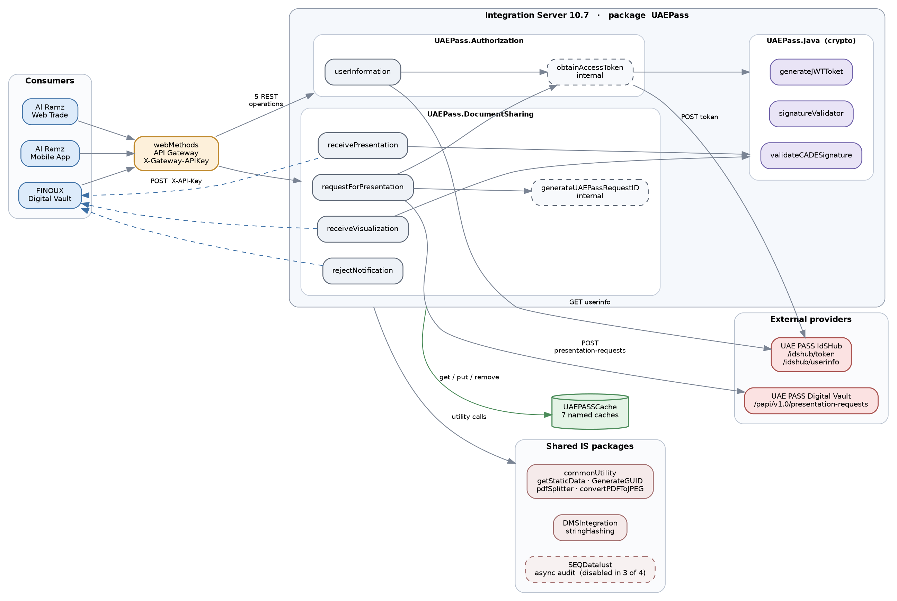
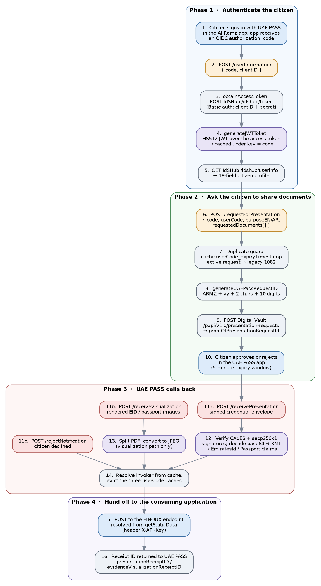
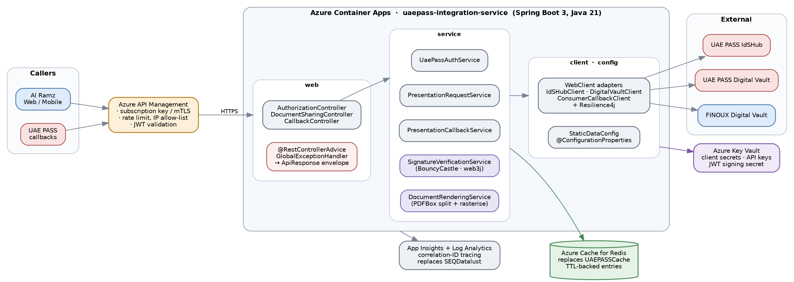
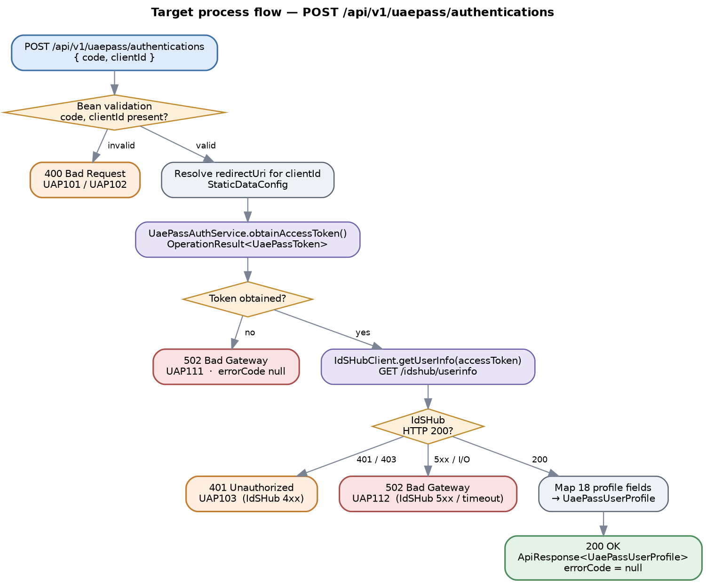
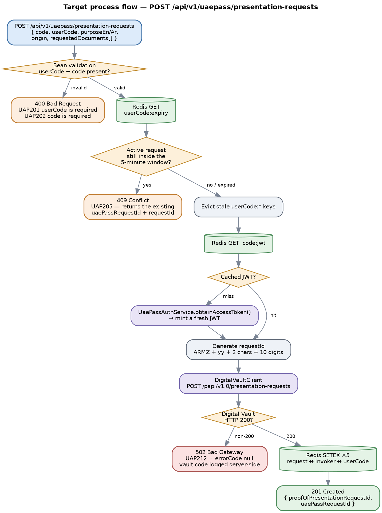
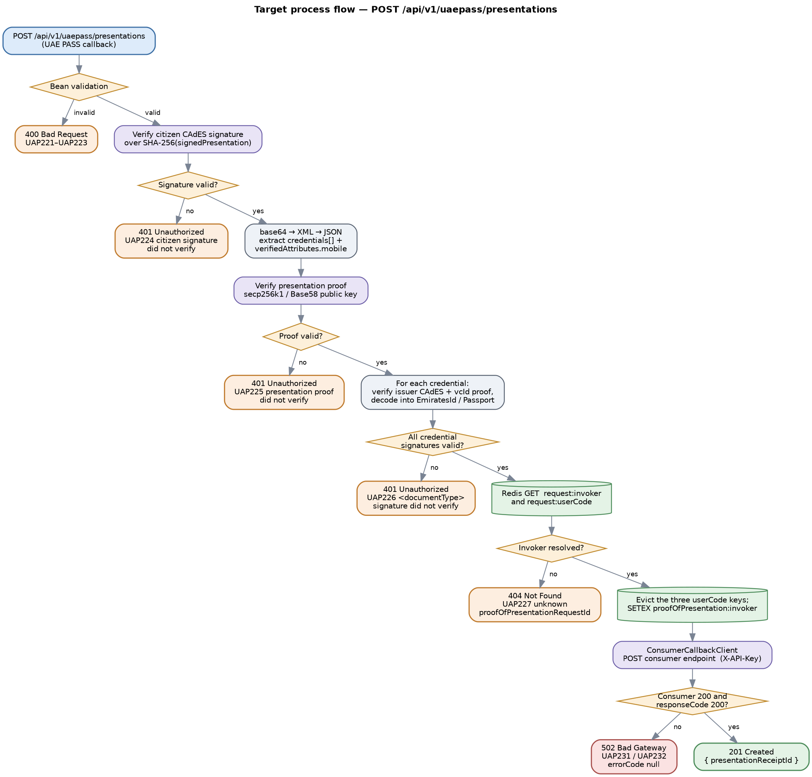
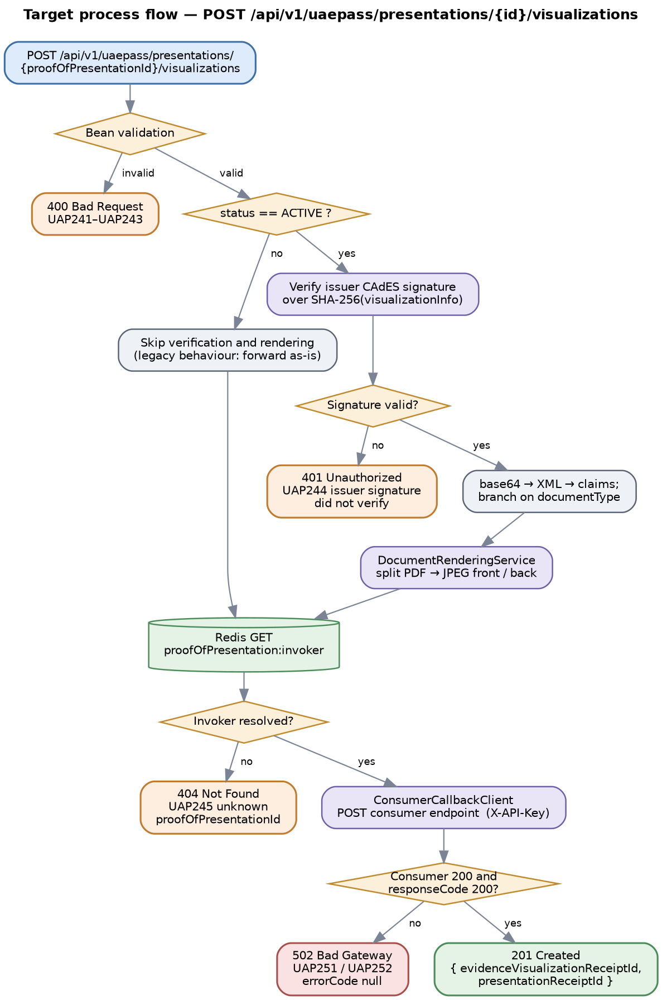
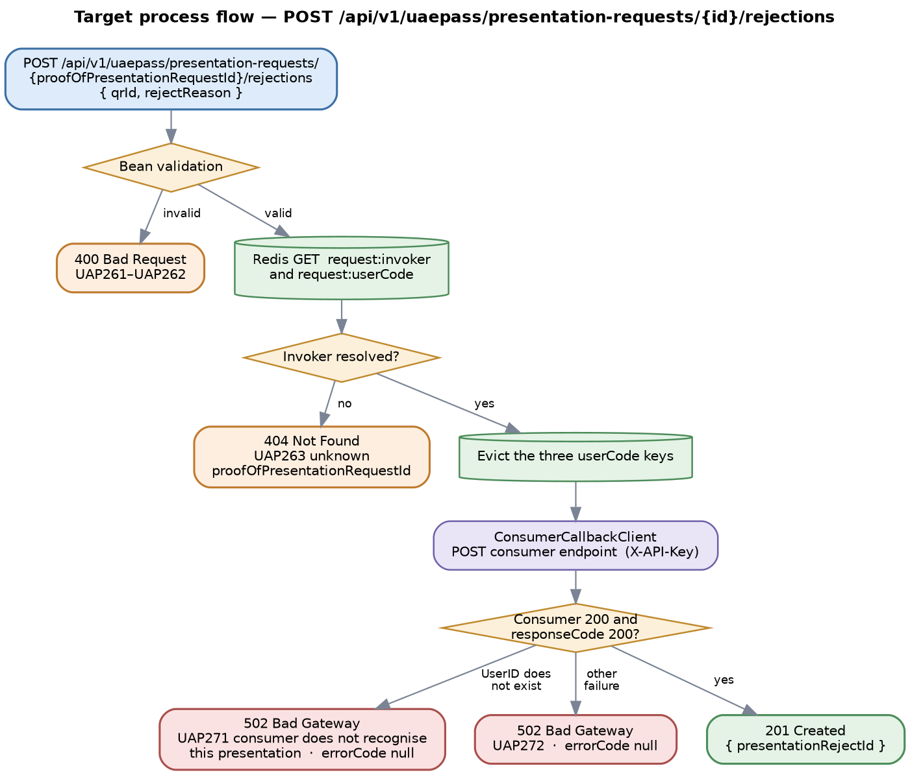
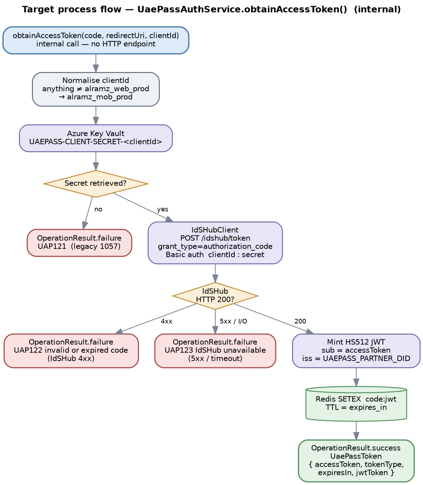

# UAE PASS Integration — Migration Design

Reverse-engineered design specification for the **`UAEPass`** Software AG webMethods Integration
Server package, restated as a target API design for **Java 21 / Spring Boot 3 on Microsoft Azure**.

Everything marked *legacy* is evidenced directly from the exported `flow.xml`, `node.ndf` and
`java.frag` source. Everything marked *target* is a migration proposal and is labelled as such.

| | |
|---|---|
| **Source package** | `UAEPass` · Integration Server 10.7 · exported 2024-03-04 |
| **Target platform** | Java 21 / Spring Boot 3 on Azure Container Apps |
| **Scope** | 7 Flow services (5 REST-exposed, 2 internal) · 4 Java services · 2 REST resource descriptors |
| **Status** | For review — endpoint names, error codes and HTTP statuses are proposals pending sign-off |
| **Version** | 1.0 · 24 September 2026 |

> [!CAUTION]
> **No credentials in this file.** `UAEPASS_API_SECRET`, `UAEPASS_FINOUX_DIGITAL_VAULT_API_KEY`
> and `UAEPASS_PARTNER_DID` are **redacted** — they resolve from Azure Key Vault at runtime.
> Base URLs and consumer callback endpoints are recorded because they are endpoints, not secrets.

> [!IMPORTANT]
> **Three findings block the migration.** [D-1](#appendix-d-source-findings) — signature
> verification reads a field that is never populated. [D-6](#appendix-d-source-findings) — a
> disabled error branch reports consumer failures as successes.
> [D-10](#appendix-d-source-findings) — the minted JWT carries a hard-coded `exp` of **May 2027**.
> All fourteen findings are in [Appendix D](#appendix-d-source-findings); the sixteen open items
> are in [Appendix E](#appendix-e-still-open-items).

---

## Contents

- **[1. Overview](#1-overview)**
  - [1.1 Purpose](#11-purpose)
  - [1.2 Scope](#12-scope)
  - [1.3 Executive summary](#13-executive-summary)
  - [1.4 Source inventory](#14-source-inventory)
  - [1.5 Key migration notes](#15-key-migration-notes)
- **[2. Solution Architecture](#2-solution-architecture)**
  - [2.1 As-built legacy architecture](#21-as-built-legacy-architecture)
  - [2.2 End-to-end document-sharing journey](#22-end-to-end-document-sharing-journey)
  - [2.3 Target architecture — Spring Boot on Azure](#23-target-architecture--spring-boot-on-azure)
  - [2.4 Target response and result model](#24-target-response-and-result-model)
- **[3. Prerequisites and Static Configuration](#3-prerequisites-and-static-configuration)**
  - [3.1 Integration Server global variables](#31-integration-server-global-variables)
  - [3.2 Static and feature-flag configuration](#32-static-and-feature-flag-configuration)
  - [3.3 Cache configuration](#33-cache-configuration)
  - [3.4 Upstream and downstream dependencies](#34-upstream-and-downstream-dependencies)
  - [3.5 Security notes](#35-security-notes)
- **[4. API — Citizen Authentication and Profile](#4-api--citizen-authentication-and-profile)**
  - [4.1 Endpoint summary](#41-endpoint-summary)
  - [4.2 Request schema](#42-request-schema)
  - [4.3 Business logic summary](#43-business-logic-summary)
  - [4.4 Sample request](#44-sample-request)
  - [4.5 Response schema](#45-response-schema)
  - [4.6 HTTP status code reference](#46-http-status-code-reference)
  - [4.7 Example target response envelopes](#47-example-target-response-envelopes)
  - [4.8 Target process flow](#48-target-process-flow)
- **[5. API — Request for Presentation](#5-api--request-for-presentation)**
  - [5.1 Endpoint summary](#51-endpoint-summary)
  - [5.2 Request schema](#52-request-schema)
  - [5.3 Business logic summary](#53-business-logic-summary)
  - [5.4 Sample request](#54-sample-request)
  - [5.5 Response schema](#55-response-schema)
  - [5.6 HTTP status code reference](#56-http-status-code-reference)
  - [5.7 Example target response envelopes](#57-example-target-response-envelopes)
  - [5.8 Target process flow](#58-target-process-flow)
- **[6. API — Receive Presentation](#6-api--receive-presentation)**
  - [6.1 Endpoint summary](#61-endpoint-summary)
  - [6.2 Request schema](#62-request-schema)
  - [6.3 Business logic summary](#63-business-logic-summary)
  - [6.4 Sample request](#64-sample-request)
  - [6.5 Response schema](#65-response-schema)
  - [6.6 HTTP status code reference](#66-http-status-code-reference)
  - [6.7 Example target response envelopes](#67-example-target-response-envelopes)
  - [6.8 Target process flow](#68-target-process-flow)
- **[7. API — Receive Visualization](#7-api--receive-visualization)**
  - [7.1 Endpoint summary](#71-endpoint-summary)
  - [7.2 Request schema](#72-request-schema)
  - [7.3 Business logic summary](#73-business-logic-summary)
  - [7.4 Sample request](#74-sample-request)
  - [7.5 Response schema](#75-response-schema)
  - [7.6 HTTP status code reference](#76-http-status-code-reference)
  - [7.7 Example target response envelopes](#77-example-target-response-envelopes)
  - [7.8 Target process flow](#78-target-process-flow)
- **[8. API — Reject Notification](#8-api--reject-notification)**
  - [8.1 Endpoint summary](#81-endpoint-summary)
  - [8.2 Request schema](#82-request-schema)
  - [8.3 Business logic summary](#83-business-logic-summary)
  - [8.4 Sample request](#84-sample-request)
  - [8.5 Response schema](#85-response-schema)
  - [8.6 HTTP status code reference](#86-http-status-code-reference)
  - [8.7 Example target response envelopes](#87-example-target-response-envelopes)
  - [8.8 Target process flow](#88-target-process-flow)
- **[9. Downstream and Internal Integration Services](#9-downstream-and-internal-integration-services)**
  - [9.1 obtainAccessToken](#91-obtainaccesstoken)
  - [9.2 generateUAEPassRequestID](#92-generateuaepassrequestid)
  - [9.3 Cryptographic services (UAEPass.Java)](#93-cryptographic-services-uaepassjava)
  - [9.4 Consumer callback contract](#94-consumer-callback-contract)
- **[10. Data Mapping Reference](#10-data-mapping-reference)**
  - [10.1 IdSHub userinfo → citizen profile](#101-idshub-userinfo--citizen-profile)
  - [10.2 Emirates ID credential XML → EmiratesIdPresentation](#102-emirates-id-credential-xml--emiratesidpresentation)
  - [10.3 Passport credential XML → PassportPresentation](#103-passport-credential-xml--passportpresentation)
  - [10.4 Legacy cache keys → Redis keys](#104-legacy-cache-keys--redis-keys)
- **[Appendix A. Pseudocode](#appendix-a-pseudocode)**
  - [Appendix A.1 requestForPresentation](#appendix-a1-requestforpresentation)
  - [Appendix A.2 receivePresentation](#appendix-a2-receivepresentation)
  - [Appendix A.3 receiveVisualization](#appendix-a3-receivevisualization)
- **[Appendix B. Glossary](#appendix-b-glossary)**
- **[Appendix C. Legacy Response-Code Inventory](#appendix-c-legacy-response-code-inventory)**
- **[Appendix D. Source Findings](#appendix-d-source-findings)**
- **[Appendix E. Still-Open Items](#appendix-e-still-open-items)**

---

# 1. Overview

## 1.1 Purpose

This document is the migration design specification for the **UAEPass** Software AG webMethods Integration Server package. It reverse-engineers the behaviour that is actually implemented in the exported `flow.xml`, `node.ndf` and `java.frag` source, and restates it as a target API design for **Java / Spring Boot on Microsoft Azure**.

Everything described under the heading *legacy* is evidenced directly from the package source. Everything described as *target* is a design proposal for the migration and is called out as such. Where the two differ — endpoint naming, field types, HTTP status codes, error handling — the difference is stated explicitly rather than silently resolved.

## 1.2 Scope

**In scope**

- The seven Flow services in the `UAEPass` package: five exposed over REST and two internal.
- The four Java services in `UAEPass.Java`, and the shared cryptographic helper code in `code/source/UAEPass/Java.java`.
- The two REST resource descriptors — `UAEPass.restAPIs:UAEPass` and `UAEPass.DocumentSharing.restAPIs:UAEPassCallback` — and the operations they publish.
- The outbound integrations this package performs: UAE PASS IdSHub, UAE PASS Digital Vault, and the consuming application's callback endpoints.
- The `UAEPASSCache` cache manager and the seven named caches the package reads and writes.
- Target endpoint naming, request and response schemas, the standard response envelope, and per-service HTTP status and error-code tables.

**Out of scope**

- The shared `commonUtility`, `DMSIntegration` and `SEQDatalust` packages. They are referenced here as dependencies, with the contract this package relies on, but their own migration is covered separately.
- The consuming application (FINOUX Digital Vault) and its internal processing of the payloads this package forwards.
- The UAE PASS authorisation journey that happens in the browser or mobile app before the authorization `code` reaches this package.
- Database schema work. This package holds no database adapter calls and no DDL — all state is in the in-memory cache.
- Infrastructure provisioning, CI/CD pipelines, and network topology beyond the Azure services named in the target architecture.

## 1.3 Executive summary

The `UAEPass` package integrates Al Ramz with the UAE PASS national digital identity platform. It does two distinct jobs, and the package's folder structure follows that split exactly.

**Citizen authentication.** `UAEPass.Authorization` exchanges an OpenID Connect authorization `code` for an access token at the UAE PASS IdSHub, mints a local HS512 JWT over that token, caches it, and returns the citizen's verified profile — eighteen fields, bilingual, ranging from name and nationality to the verified Emirates ID number for SOP3-assured users.

**Verified document sharing.** `UAEPass.DocumentSharing` asks the citizen, through the UAE PASS app, to share verified copies of their Emirates ID and passport. Al Ramz raises a presentation request against the UAE PASS Digital Vault; the citizen approves or rejects it in the UAE PASS app; UAE PASS then calls back into this package with the signed credentials, with rendered visualisations of the documents, or with a rejection. Each callback verifies the cryptographic signatures on what it received, decodes the credential payloads, and forwards a normalised document to the consuming application.

The package is small — roughly 110,000 lines of Designer-generated XML across seven Flow services — but it is unusually security-sensitive. It handles national identity data, it performs CAdES and secp256k1 signature verification in hand-written Java, it holds client secrets, and three of its five REST operations are inbound callbacks from an external government platform. The migration therefore has to preserve cryptographic behaviour exactly while replacing a good deal of error handling that does not currently hold up.

## 1.4 Source inventory

Every service in the package, as exported. The complexity column reflects branch depth, external calls and signature-verification work, not line count alone.

**Table 1.** Service inventory for the UAEPass package, from the exported node descriptors.

| Service | Type | Exposure | Complexity | Role |
|---|---|---|---|---|
| `UAEPass.Authorization:userInformation` | Flow | REST<br>GET, POST | Medium | Exchange an authorization code for the citizen's verified profile. |
| `UAEPass.Authorization:obtainAccessToken` | Flow | Internal | Medium | OIDC token exchange against IdSHub; mints and caches the local JWT. |
| `UAEPass.DocumentSharing:requestForPresentation` | Flow | REST<br>POST | High | Raise a document-sharing request against the UAE PASS Digital Vault. |
| `UAEPass.DocumentSharing:receivePresentation` | Flow | REST<br>POST | High | Callback: verified credential data has been shared by the citizen. |
| `UAEPass.DocumentSharing:receiveVisualization` | Flow | REST<br>POST | High | Callback: rendered document images for a shared credential. |
| `UAEPass.DocumentSharing:rejectNotification` | Flow | REST<br>POST | Low | Callback: the citizen declined, exited, or UAE PASS failed. |
| `UAEPass.DocumentSharing:generateUAEPassRequestID` | Flow | Internal | Low | Build the `ARMZ`-prefixed correlation identifier for a request. |
| `UAEPass.Java:generateJWTToket` | Java | Internal | Low | HMAC-SHA512 JWT construction. |
| `UAEPass.Java:validateCADESignature` | Java | Internal | High | CAdES / CMS detached-signature verification (BouncyCastle). |
| `UAEPass.Java:signatureValidator` | Java | Internal | High | secp256k1 signature verification with Base58 public-key recovery (web3j). |
| `UAEPass.Java:getRandomString` | Java | Internal | — | Declared but **empty** — the service body is null in the export. |

## 1.5 Key migration notes

> [!IMPORTANT]
> **Key migration notes**
>
> The points below shape the target design more than anything else in this document. Each is evidenced in the chapter that covers it, and each is restated as an open item in Appendix E.
>
> - **Three of the five REST operations are inbound callbacks registered with UAE PASS.** Their paths are not freely ours to change: a rename needs UAE PASS to re-register the endpoint. The RESTful paths proposed in this document are therefore proposals subject to that coordination, not mechanical renames.
>
> - **The same three services are dual-shaped.** Middleware receives a callback from UAE PASS and, in the same transaction, calls an identically named endpoint on the consuming application. The Confluence pages titled *ReceivePresentation*, *ReceiveVisualization* and *RejectNotification* document the **outbound** leg — the contract the consumer must expose — not the inbound leg this package implements. [Section 9.4](#94-consumer-callback-contract) gives both.
>
> - **Transport status is flat 200 today.** Every legacy service returns HTTP 200 regardless of outcome and carries the real result in an inner `responseCode` field. The target design maps the outcome onto the transport status; both are shown in every status table so the tables are never mistaken for a description of current behaviour.
>
> - **Error handling is inconsistent between siblings and, in several places, broken.** A field-name typo, a success path that sets no response code, a catch block that sets nothing, and a disabled error branch that turns downstream failures into successes are all present in the source. [Appendix D](#) lists all nine findings with evidence; none is silently fixed in the schemas.
>
> - **No HTTP call in the package sets a timeout.** All six `pub.client:http` invocations rely on the Integration Server default. The target design puts explicit per-client timeouts and circuit breakers on every outbound call.
>
> - **All state is in an in-memory cache with no visible TTL configuration.** Seven named caches under `UAEPASSCache` hold the JWT, the request correlation keys and the invoker identity. The target replaces these with TTL-backed Redis entries, which also fixes the unbounded growth the current eviction logic leaves behind.

---

# 2. Solution Architecture

## 2.1 As-built legacy architecture

The diagram below is drawn from the package export: the REST resource descriptors give the exposed operations, the `INVOKE` and `MAPINVOKE` nodes in each `flow.xml` give the call graph, and the `pub.client:http` nodes give the outbound endpoints.



*Figure 1. As-built architecture of the UAEPass package on Integration Server 10.7.*

<sub><b style="color:#3C6FA5">■</b> Consumers &nbsp;·&nbsp; <b style="color:#C08A2E">■</b> Gateway &nbsp;·&nbsp; <b style="color:#6D5FA8">■</b> Crypto services &nbsp;·&nbsp; <b style="color:#4C8C5A">■</b> Cache &nbsp;·&nbsp; <b style="color:#A84F4C">■</b> External providers</sub>

Two details in the diagram are worth stating in words, because they are easy to misread.

- **FINOUX appears on both sides.** It is a consumer of `requestForPresentation`, and it is also the target of the outbound calls the three callback services make. The dashed arrows are that outbound leg.
- **`SEQDatalust` audit ingestion is largely dead.** `obtainAccessToken` calls it; in `requestForPresentation` the entire audit block — twelve nodes across two try/catch sequences — carries `DISABLED="true"`, and the other three services never had it. Audit coverage in the package today is one service out of seven.

## 2.2 End-to-end document-sharing journey

The as-built diagram shows structure; this one shows sequence. It spans every system involved in a complete document-sharing transaction, from the citizen tapping *sign in with UAE PASS* to the consuming application receiving verified identity documents.



*Figure 2. End-to-end journey across Al Ramz, webMethods, UAE PASS and the consuming application.*

## 2.3 Target architecture — Spring Boot on Azure

The target is a single Spring Boot service, `uaepass-integration-service`, fronted by Azure API Management. Keeping it as one deployable is deliberate: the authentication half and the document-sharing half share the JWT cache, the signature-verification code and the UAE PASS client configuration, and splitting them would mean either duplicating that or introducing an internal network hop on the critical path of a callback that UAE PASS expects to complete quickly.



*Figure 3. Target architecture: uaepass-integration-service on Azure Container Apps.*

What each legacy element becomes:

**Table 2.** Legacy-to-target component mapping.

| Legacy element | Target replacement | Why |
|---|---|---|
| `webMethods API Gateway`<br>`X-Gateway-APIKey` | Azure API Management<br>subscription key + IP allow-list, mTLS for the UAE PASS callback paths | The gateway is currently the only authentication in front of these services, and the services themselves enforce nothing (see 3.5). APIM keeps that boundary and adds rate limiting and per-caller quotas. |
| `pub.client:http` | `WebClient` adapters with Resilience4j<br>per-client connect and read timeouts, circuit breaker, bounded retry | No legacy call sets a timeout. Named adapters also make the three outbound integrations independently observable and independently degradable. |
| `UAEPASSCache`<br>`(in-memory, 7 named caches)` | Azure Cache for Redis<br>keyed entries with explicit TTL | Survives restarts and scales horizontally. TTL replaces the manual eviction logic, which today leaves orphaned entries whenever a journey is abandoned. |
| `pub.security.outboundPasswords:getPassword`<br>`and %UAEPASS_*% global variables` | Azure Key Vault via managed identity<br>`@ConfigurationProperties` for non-secret values | Secrets stop living in Integration Server configuration and stop being interpolated into flow steps as `%VARIABLE%` strings. |
| `commonUtility.services:getStaticData` | `StaticDataConfig` backed by App Configuration<br>with the per-application endpoint map | Six configuration keys resolve consumer endpoints at runtime. The lookup shape (application + key) is preserved so multi-consumer routing keeps working. |
| `SEQDatalust.services:asynchronousIngestion` | Application Insights + Log Analytics<br>correlation ID on every span | Replaces an audit path that is disabled in three of the four services that once used it. |
| `commonUtility.java:pdfSplitter`<br>`convertPDFToJPEG` | `DocumentRenderingService`<br>Apache PDFBox | Same operation — split a two-page PDF, rasterise each page to JPEG — as a first-class service with its own memory bounds, since it handles citizen document images. |

## 2.4 Target response and result model

Every target API response carries the same four envelope fields alongside its payload. This is a fixed convention across the migration programme, not a per-service proposal.

| Envelope field | Type | Always present | Meaning |
|---|---|---|---|
| `responseCode` | String | Yes | The HTTP status code, repeated in the body — e.g. `"400"`. |
| `responseMessage` | String | Yes | The HTTP reason phrase — e.g. `"Bad Request"`. |
| `errorCode` | String, nullable | No | The service-specific error code. Populated **only** for client input errors. `null` on success and on backend or provider failures. |
| `errorMsg` | String, nullable | No | The caller-facing message for that error code. Same population rule as `errorCode`. |

The payload sits under `response`, matching the shape the current Confluence contracts publish for these endpoints, so existing consumers do not have to relearn where to look.

*The response envelope, shared by every endpoint in the service.*

```java
public record ApiResponse<T>(
        String responseCode,      // "200", "400", "502" ...
        String responseMessage,   // "OK", "Bad Request", "Bad Gateway" ...
        String errorCode,         // "UAP201"  — client input errors only, else null
        String errorMsg,          // caller-facing text — client input errors only, else null
        T      response) {        // the payload; null on error

    public static <T> ApiResponse<T> ok(T body) {
        return new ApiResponse<>("200", "OK", null, null, body);
    }
    public static <T> ApiResponse<T> created(T body) {
        return new ApiResponse<>("201", "Created", null, null, body);
    }
    public static <T> ApiResponse<T> clientError(HttpStatus status, ServiceError e) {
        return new ApiResponse<>(String.valueOf(status.value()), status.getReasonPhrase(),
                                 e.code(), e.message(), null);
    }
    public static <T> ApiResponse<T> providerError(HttpStatus status) {
        // errorCode / errorMsg deliberately null: provider detail is logged, never returned
        return new ApiResponse<>(String.valueOf(status.value()), status.getReasonPhrase(),
                                 null, null, null);
    }
}
```

### 2.4.1 Internal result type

Internal calls — `obtainAccessToken` above all — must not be modelled on the legacy pattern of setting `responseCode` into a shared pipeline and letting the caller inspect it. The legacy flow does exactly that, which is why a failure inside `obtainAccessToken` surfaces to its caller as a stale `responseCode` left lying in the pipeline rather than as a thrown error. The target uses an explicit result type.

*OperationResult<T> — the internal call contract, replacing pipeline-carried response codes.*

```java
public sealed interface OperationResult<T> {

    record Success<T>(T value) implements OperationResult<T> {}

    record Failure<T>(ServiceError error, HttpStatus transportStatus, String diagnostic)
            implements OperationResult<T> {}
    //  The diagnostic field holds the provider's own code and message for the log only.
    //  It never reaches the caller of the public API.

    default boolean isSuccess() { return this instanceof Success<T>; }
}
```

> [!NOTE]
> **Design decision — typed internal results**
>
> The legacy `{ responseCode, responseMessage }` pair is loosely typed and shared across every step of the pipeline, so any step can overwrite any other step's outcome — and in `receivePresentation` one does exactly that, discarding a specific signature-failure message in favour of a generic one ([Appendix D](#), finding D-4). A typed result that the compiler forces the caller to unwrap removes that whole class of defect.

---

# 3. Prerequisites and Static Configuration

Everything the target service needs before its first request can succeed. Each subsection names the legacy source of the value and where it should live in the target.

## 3.1 Integration Server global variables

These appear in the source as `%NAME%` substitutions inside flow steps. All four are secrets or identity values and belong in Azure Key Vault, resolved through managed identity.

**Table 3.** Global variables read by the package, with their target locations.

| Global variable | Used by | Purpose | Target home |
|---|---|---|---|
| `UAEPASS_PARTNER_DID` | `obtainAccessToken`<br>`requestForPresentation` | Al Ramz's decentralised identifier with UAE PASS. Used as the JWT `iss` claim and as `request.partnerId` on the Digital Vault call. A `did:uae:eth:` value. **Redacted here** — resolved from Key Vault at runtime. | `Key Vault`<br>`uaepass-partner-did` |
| `UAEPASS_API_SECRET` | `obtainAccessToken` | HMAC-SHA512 signing secret for the locally minted JWT. **Redacted here** — a 32-character hex value, resolved from Key Vault at runtime. Anyone holding it can mint tokens this service will trust. | `Key Vault`<br>`uaepass-api-secret` |
| `UAEPASS_FINOUX_DIGITAL_VAULT_API_KEY` | `receivePresentation`<br>`receiveVisualization`<br>`rejectNotification` | Sent as the `X-API-Key` header on every outbound call to the consuming application. **Redacted here** — a UUID, resolved from Key Vault at runtime. | `Key Vault`<br>`uaepass-consumer-api-key` |
| `UAEPASS_CLIENT_SECRET_<clientID>` | `obtainAccessToken` | The OIDC client secret. Resolved at runtime by building the key name from the caller's `clientID`, upper-casing it, and reading it through `pub.security.outboundPasswords:getPassword` with `key = gvhandle.<name>`. | `Key Vault`<br>`uaepass-client-secret-<clientId>` |

> [!CAUTION]
> **Security note — constructed secret keys**
>
> The client-secret key name is **constructed from caller-supplied input**: `clientID` arrives in the request body, is concatenated into `UAEPASS_CLIENT_SECRET_%clientID%`, upper-cased, and used as a secret-store lookup key. A preceding branch narrows `clientID` to one of two values, which contains the risk today, but the pattern is fragile. The target should resolve the secret from a fixed enum of known client identifiers, never from a concatenated string.

## 3.2 Static and feature-flag configuration

Six keys are read through `commonUtility.services:getStaticData`, which takes an `application` scope and a `key`. Two are scoped to `MIDDLEWARE`; the other four are scoped to the **calling application**, which is how one middleware deployment routes callbacks to different consumers.

**Table 4.** Static configuration keys resolved at runtime through getStaticData.

| Configuration key | Scope | Read by | Resolves to |
|---|---|---|---|
| `UAEPASS_AUTHENTICATION_BASE_URL` | MIDDLEWARE | `obtainAccessToken`<br>`userInformation` | IdSHub base URL. `/idshub/token` and `/idshub/userinfo` are appended in the flow.<br>Production: `https://id.uaepass.ae` |
| `UAEPASS_DIGITAL_VAULT_BASE_URL` | MIDDLEWARE | `requestForPresentation` | Digital Vault base URL. `/papi/v1.0/presentation-requests` is appended.<br>Production: `https://papi.dv.u.ae` |
| `UAEPASS_REQUESTFORPRESENTATION` | per application | `requestForPresentation` | Read into `redirectURL` — but **never used**. See [Appendix D](#), finding D-9. |
| `UAEPASS_RECEIVEPRESENTATION` | per application | `receivePresentation` | The consumer endpoint that receives the normalised credential payload.<br>Production: `https://webtrade.alramz.ae/uaepass/receivepresentation` |
| `UAEPASS_RECEIVEVISUALIZATION` | per application | `receiveVisualization` | The consumer endpoint that receives the rendered document images.<br>Production: `https://webtrade.alramz.ae/uaepass/receivevisualization` |
| `UAEPASS_REJECTNOTIFICATION` | per application | `rejectNotification` | The consumer endpoint that receives the rejection notice.<br>Production: `https://webtrade.alramz.ae/uaepass/rejectnotification` |

Two hard-coded URLs also sit in the source and should become configuration in the target rather than staying literals:

- `https://webtrade.alramz.ae/tpreturnurlmobile/uaepass` — the default redirect URI in `userInformation`, used for every `clientID` other than `alramz_web_prod`.
- `https://selfcare.uaepass.ae` — the redirect URI `requestForPresentation` passes when it mints a fresh token. Note this differs from the one `userInformation` uses for the same `code`.

## 3.3 Cache configuration

All seven caches live under one cache manager, `UAEPASSCache`. No TTL or eviction policy is visible in the package export — it would be in the Integration Server cache-manager configuration, which is not part of this export and should be confirmed before migration ([Appendix E](#)).

**Table 5.** Cache inventory and the proposed Redis key scheme.

| Legacy cache name | Key → value | Written by | Proposed Redis key | TTL |
|---|---|---|---|---|
| `authenticationCode_JWTToken` | authorization code → JWT | `obtainAccessToken` | `uaepass:code:jwt:{code}` | = `expires_in` |
| `userCode_expiryTimestamp` | userCode → expiry timestamp | `requestForPresentation` | `uaepass:user:{userCode}:expiry` | 300 s |
| `userCode_documentSharingRequestID` | userCode → ARMZ request ID | `requestForPresentation` | `uaepass:user:{userCode}:request-id` | 300 s |
| `userCode_requestForPresentationID` | userCode → proofOfPresentationRequestId | `requestForPresentation` | `uaepass:user:{userCode}:pop-request` | 300 s |
| `requestForPresentationID_userCode` | proofOfPresentationRequestId → userCode | `requestForPresentation` | `uaepass:pop-request:{id}:user` | 24 h |
| `requestForPresentationID_invokerApplicationName` | proofOfPresentationRequestId → application name | `requestForPresentation` | `uaepass:pop-request:{id}:invoker` | 24 h |
| `proofOfPresentation_invokerApplicationName` | proofOfPresentationId → application name | `receivePresentation` | `uaepass:pop:{id}:invoker` | 24 h |

> [!TIP]
> **Business-logic observation — cache lifetime**
>
> The three `requestForPresentationID_*` and `proofOfPresentation_*` entries are written when a request is raised but are **never removed** by any service in the package — only the three `userCode_*` entries are evicted. On an in-memory cache with no TTL that is unbounded growth. The TTLs proposed above are a target-design decision, not a restatement of current behaviour, and the 24-hour figure should be confirmed against the real UAE PASS callback window.

## 3.4 Upstream and downstream dependencies

Candidate health-check dependencies for the target service, with the failure mode each one causes.

**Table 6.** Dependency matrix and failure modes.

| Dependency | Direction | Used by | If it is unavailable |
|---|---|---|---|
| UAE PASS IdSHub | Outbound | obtainAccessToken, userInformation | Authentication fails entirely. Document sharing also fails when the JWT cache misses. |
| UAE PASS Digital Vault | Outbound | requestForPresentation | No new document-sharing request can be raised. In-flight journeys still complete. |
| Consuming application<br>(FINOUX Digital Vault) | Outbound | All three callback services | Callbacks are accepted and verified but cannot be delivered. The citizen has already shared their documents at this point, so this failure is not recoverable by retrying the journey. |
| Azure Cache for Redis<br>(legacy: UAEPASSCache) | Outbound | All except generateUAEPassRequestID | Duplicate-request detection stops working, the JWT is re-minted on every call, and callbacks cannot resolve which consumer to forward to. |
| Azure Key Vault<br>(legacy: outboundPasswords + globals) | Outbound | obtainAccessToken and callbacks | Token exchange fails at the secret lookup; outbound consumer calls lose their API key. |
| App Configuration<br>(legacy: getStaticData) | Outbound | All REST services | Base URLs and consumer endpoints cannot be resolved. Every operation fails. |
| Azure API Management | Inbound | All REST services | No traffic reaches the service. UAE PASS callbacks fail at the edge and are not retried by UAE PASS in all cases. |

## 3.5 Security notes

The legacy answer to *what does this package enforce* is, in almost every respect, *nothing*. That absence is what the target design has to react to, so it is recorded here explicitly rather than left out.

**Table 7.** Security posture: what the legacy package enforces, and what the target adds.

| Control | Legacy position (evidenced) | Target position |
|---|---|---|
| Service-level ACL | **None.** All eleven service descriptors carry `check_internal_acls = no`, and the package manifest has `listACL` null. Any caller reaching the Integration Server can invoke any of these services directly. | APIM is the enforcement point: subscription keys for Al Ramz callers, mTLS plus an IP allow-list for the UAE PASS callback paths. Spring Security denies anything that did not arrive through the gateway. |
| Caller authentication | Delegated entirely to the API Gateway's `X-Gateway-APIKey` header. Two services read it — `userInformation` and `receiveVisualization` — to resolve an application name, and `receiveVisualization` then **discards the result and hard-codes `FINOUX`** ([Appendix D](#), D-2). | The caller identity comes from the APIM subscription and is carried to the service as a validated claim, not as a header the service is free to overwrite. |
| Callback authenticity | Cryptographic only: CAdES and secp256k1 signature verification on the payload. There is no transport-level proof that the caller is UAE PASS. The verification itself has an unresolved input-wiring problem — see [Appendix D](#), D-1. | Keep the signature verification, and add mTLS plus an IP allow-list at APIM so an unsigned or malformed callback is rejected before it reaches application code. |
| Secrets at rest | Integration Server global variables and the outbound-password store. Secret names are **constructed from request input** (3.1). | Azure Key Vault, managed identity, no secret material in configuration files, and secret lookup from a fixed enum of client identifiers. |
| Secrets in flight | `obtainAccessToken` deliberately nulls `accessToken` and `jwtToken` before building its audit payload — a genuinely good practice already present in the source, worth carrying forward. | Structured logging with explicit field masking on token, secret, signature and Base64 document fields. Never log a credential payload. |
| Citizen data in logs | `commonUtility.java:savePipelineJSON` and `commonUtility.services:logRequest` in `userInformation` capture the whole inbound pipeline, including the authorization code. | Log the correlation ID and the outcome. Identity documents, photographs, signatures and the authorization code are never written to logs or traces. |
| Transport timeouts | **None.** All six `pub.client:http` nodes rely on the server default, so a slow provider holds a thread for as long as that default allows. | Explicit connect and read timeouts per client, a circuit breaker per provider, and a bounded retry only on idempotent reads. |

> [!CAUTION]
> **Security note — callback trust boundary**
>
> Three REST operations accept unauthenticated, cryptographically-signed callbacks from an external platform, and the signature check that gates them has an input-wiring problem that makes its behaviour uncertain ([Appendix D](#), D-1). Resolving D-1 is a prerequisite for the migration, not a follow-up.

---

# 4. API — Citizen Authentication and Profile

Implemented by `UAEPass.Authorization:userInformation`. This is the entry point to every UAE PASS journey at Al Ramz: it turns the short-lived authorization code the citizen's browser or app received from UAE PASS into a verified identity profile, and — as a side effect the rest of the package depends on — seeds the JWT cache that document sharing later reads.

## 4.1 Endpoint summary

| Property | Value |
|---|---|
| Legacy path | `/userInformation` on REST resource `UAEPass.restAPIs:UAEPass` |
| Legacy methods | `GET` and `POST` are both registered on the operation |
| Published gateway URL | Production: `https://api.alramz.ae/gateway/uaePass/1.0/userInformation`<br>UAT: `https://api-uat.alramz.ae/gateway/uaePass/1.0/userInformation` |
| Legacy transport status | Always `200`. The outcome is carried in the body's `responseCode`. |
| Backing service | `UAEPass.Authorization:userInformation` |
| Callers | Al Ramz Web Trade and Mobile, via the API Gateway |
| **Proposed target path** | **`POST /api/v1/uaepass/authentications`** |
| Proposed target status | `200 OK` on success |

> [!NOTE]
> **Legacy vs. target endpoint**
>
> The legacy path is verb-named and accepts `GET` as well as `POST`. Two changes are proposed.
>
> - **Drop `GET`.** The request carries a single-use OIDC authorization code. On `GET` that code would travel in the query string, where it lands in access logs, browser history and proxy caches. `POST` with the code in the body is the only safe shape. This is a security fix, not a style change.
>
> - **Name the resource, not the verb.** `POST /api/v1/uaepass/authentications` reads as *create an authentication from this code*, and the citizen profile is the representation of the authentication that was created. The tempting alternative, `GET /api/v1/uaepass/profiles/{code}`, is wrong for the same reason `GET` is wrong above — it puts a secret in the path.
>
> - This is a judgment call, not a mechanical rename: the operation is a credential exchange, which does not map cleanly onto single-resource CRUD. The legacy path is what is deployed today and remains the contract until consumers are migrated.

## 4.2 Request schema

**Table 8.** Request fields for POST /api/v1/uaepass/authentications.

| Field | Target type | Required | Description |
|---|---|---|---|
| `code` | `String` | Yes | The OpenID Connect authorization code returned to the client in the UAE PASS callback URL. Single use, short lived. Also becomes the cache key under which the minted JWT is stored. |
| `clientId` | `ClientId (enum)` | Yes | Identifies the calling channel. Selects both the OIDC client secret and the redirect URI used in the token exchange. Legacy accepts any string and silently treats anything other than `alramz_web_prod` as `alramz_mob_prod`. |

> [!NOTE]
> **Legacy vs. target field format**
>
> `clientId` — legacy type `string`, target type an enum.
>
> - The legacy flow branches on `/clientID` with one case, `alramz_web_prod`, and a `$default` case that **overwrites the caller's value** with `alramz_mob_prod`. A typo in `clientID` therefore does not produce an error; it silently authenticates against the mobile client's credentials.
>
> - The target declares `ClientId` as an enum (`ALRAMZ_WEB_PROD`, `ALRAMZ_MOB_PROD`). An unrecognised value is rejected with `UAP102` rather than coerced.
>
> - The published Confluence contract for this endpoint documents **only** `code` and does not mention `clientId` at all, even though the service signature declares it and the behaviour depends on it. The contract needs updating either way; this document treats the source as authoritative.

## 4.3 Business logic summary

In the order the flow executes it:

1. Capture the inbound pipeline for audit via `commonUtility.java:savePipelineJSON` and `commonUtility.services:logRequest`, including the request headers.
2. Read `X-Gateway-APIKey` from the transport info and resolve it to an application name via `commonUtility.APIgateway:getApplicationName` — then **immediately overwrite the result with the literal `FINOUX`**, so the resolved value is never used.
3. Build the redirect-URI configuration key as `UAEPASS_REDIRECT_URL_<clientID>`, upper-cased.
4. Branch on `clientID`. For `alramz_web_prod`, resolve the redirect URI through `getStaticData`. For anything else, use the hard-coded `https://webtrade.alramz.ae/tpreturnurlmobile/uaepass`.
5. Invoke `UAEPass.Authorization:obtainAccessToken` with the code, the resolved redirect URI and the client ID. That service performs the token exchange, mints the local JWT and caches it ([Section 9.1](#91-obtainaccesstoken)).
6. Resolve the IdSHub base URL from `getStaticData` and call `GET {baseURL}/idshub/userinfo` with `Authorization: Bearer <accessToken>`.
7. Parse the JSON body and map eighteen profile fields into the response document, normalising UAE PASS's mixed casing (`firstnameEN`, `nationalityAR`, `idn`) onto consistent camelCase names.
8. Branch on the HTTP status. `200` sets `responseCode = 200` and `responseMessage = Success`. Anything else sets `responseCode = 400`, copies the IdSHub status message into `responseMessage`, and exits the sequence with a failure signal.
9. The catch block sets `responseCode = 503` and `responseMessage = Internal Server Error`, and captures `lastError`.

> [!TIP]
> **Business-logic observations for the target design**
>
> Judgment calls and open design questions, as distinct from the plain facts above.
>
> - **Steps 1–2 are effectively dead.** The API-key lookup runs, costs a service call, and its result is discarded one step later. In the target the application name should come from the validated APIM subscription identity, and the redundant lookup removed. The literal `FINOUX` should not be hard-coded — if a single consumer really is the only caller, that belongs in configuration.
>
> - **The legacy `400` on a failed userinfo call is the wrong status.** The caller sent a well-formed request; it was IdSHub that rejected the token. The target splits this: an IdSHub `401`/`403` becomes `401 Unauthorized` with `UAP103` — the citizen's code was invalid or expired, which the caller *can* act on by restarting the journey — while an IdSHub `5xx` or timeout becomes `502 Bad Gateway` with no `errorCode`, because there is nothing the caller can do.
>
> - **`503` from the catch block is also wrong.** `503 Service Unavailable` tells the caller to retry shortly, which is misleading when the cause was, say, a JSON parse failure. `500` or `502` depending on origin is the honest answer. The shared response-code registry lists `503` as *Backend Service Unavailable*, which supports narrowing its use to genuine provider outages.
>
> - **The JWT cache seeding is an undocumented side effect.** A caller who never calls this endpoint but later calls `requestForPresentation` with the same code will cause a second token exchange. Worth making explicit in the target so the coupling is visible rather than incidental.

## 4.4 Sample request

```http
POST /api/v1/uaepass/authentications
Content-Type: application/json
X-Correlation-Id: 3f7c1e42-9a55-4c0e-8b31-2d6f0ab4c118

{
  "code": "3da0bdf0-1d80-35fd-afd5-afe10d66163f",
  "clientId": "alramz_web_prod"
}
```

## 4.5 Response schema

The payload sits under `response`, alongside the standard envelope described in [Section 2.4](#24-target-response-and-result-model).

**Table 9.** Response payload for POST /api/v1/uaepass/authentications.

| Field | Target type | Required | Description |
|---|---|---|---|
| `uuid` | `String` | Always | UAE PASS unique user identifier. The key identifier for matching a citizen to their Al Ramz profile. |
| `userType` | `AssuranceLevel (enum)` | Always | `SOP1` (basic) or `SOP3` (verified). Determines which of the fields below are populated. |
| `email` | `String` | Always | Verified email address. |
| `mobile` | `String` | Always | Verified mobile number. |
| `fullNameEn` | `String` | Always | English full name. |
| `firstNameEn / lastNameEn` | `String` | Always | English given and family name. |
| `fullNameAr` | `String` | SOP3 only | Arabic full name. |
| `firstNameAr / lastNameAr` | `String` | SOP3 only | Arabic given and family name. |
| `titleEn / titleAr` | `String` | SOP3 only | Title, English and Arabic. |
| `gender` | `String` | SOP3 only | Gender as reported by UAE PASS. |
| `nationalityEn / nationalityAr` | `String` | SOP3 only | Nationality, English and Arabic. Legacy returns the raw UAE PASS value, which is an ISO 3166 alpha-3 code in English (`EGY`) but a full name in Arabic. |
| `idNumber` | `String` | SOP3 only | Verified Emirates ID number, 15 digits. |
| `idType` | `String` | SOP3 only | Identity document type. |
| `spuuid` | `String` | SOP3 only | SmartPass unique user identifier. |

> [!NOTE]
> **Legacy vs. target field format**
>
> `nationalityEn` — legacy `string`, target `string` with a documented format.
>
> - IdSHub returns `nationalityEN` as an ISO 3166-1 alpha-3 country code (`EGY`) while `nationalityAR` carries a full country name in Arabic. Legacy passes both through unchanged, so a consumer receives two fields with the same name and incompatible representations.
>
> - The target documents `nationalityEn` as **ISO 3166-1 alpha-3** and keeps `nationalityAr` as a display name, stating the asymmetry rather than hiding it. Normalising `nationalityAr` to a code would need a lookup table this package does not have, so it is not proposed here.
>
> - `userType` is an enumeration in fact but a free string in the legacy signature. The target types it as `AssuranceLevel { SOP1, SOP3 }`; an unexpected value is logged and passed through rather than failing the response, since a new UAE PASS assurance level must not break authentication.

## 4.6 HTTP status code reference

Split by category, per the programme convention. **Client input errors** return `errorCode` and `errorMsg` to the caller. **Backend and provider errors** leave both `null`; the service error code in the table is what appears in the server-side log, keyed by correlation ID, and never in the response.

### 4.6.1 Client input errors

**Table 10.** Client input errors — POST /api/v1/uaepass/authentications.

| HTTP status | Service error code | Description | Legacy behaviour |
|---|---|---|---|
| 400 | `UAP101` | `code` is missing, blank, or not a well-formed authorization code. | — no guard exists; the flow proceeds and fails downstream |
| 400 | `UAP102` | `clientId` is missing or is not a recognised client identifier. | — no guard; an unrecognised value is silently coerced to `alramz_mob_prod` |
| 401 | `UAP103` | UAE PASS rejected the authorization code or the derived access token. The code has expired, was already used, or was issued for a different client. | `400` with the IdSHub status message copied into `responseMessage` |

### 4.6.2 Backend and provider errors

**Table 11.** Backend and provider errors — POST /api/v1/uaepass/authentications.

| HTTP status | Service error code | Description | Legacy behaviour |
|---|---|---|---|
| 502 | `UAP111` | The token exchange with UAE PASS IdSHub failed. Covers a failed client-secret lookup and any non-success from `/idshub/token`. | `503 Internal Server Error` from the catch block, or legacy `1057` propagated from `obtainAccessToken` |
| 502 | `UAP112` | IdSHub `/idshub/userinfo` returned `5xx`, timed out, or the response body could not be parsed. | `400` with the IdSHub message, or `503 Internal Server Error` from the catch block |
| 500 | `UAP113` | Unexpected failure inside the service — mapping, serialisation, or an unclassified exception. | `503 Internal Server Error` |

> [!NOTE]
> **Reading the legacy column**
>
> The Legacy behaviour column above records the *transport status plus inner response code* the service produces today, taken from the `MAPSET` literals in `flow.xml`. It is not a claim that the legacy service returns the proposed target status — at transport level it returns `200` in every one of these cases. This endpoint has no legacy numeric error code of its own: `userInformation` never sets a `10xx` code, so that column is not shown.

## 4.7 Example target response envelopes

*Success — a verified (SOP3) citizen.*

```json
HTTP/1.1 200 OK

{
  "responseCode": "200",
  "responseMessage": "OK",
  "errorCode": null,
  "errorMsg": null,
  "response": {
    "uuid": "de328e3b-73c5-47f1-8732-0ac9432d03ec",
    "userType": "SOP3",
    "email": "citizen@example.ae",
    "mobile": "971502540238",
    "fullNameEn": "YASSER SUHAIL CHORGHAY",
    "fullNameAr": "ياسر سهيل شورغاي",
    "firstNameEn": "YASSER",
    "lastNameEn": "CHORGHAY",
    "firstNameAr": "ياسر",
    "lastNameAr": "شورغاي",
    "gender": "Male",
    "nationalityEn": "ARE",
    "nationalityAr": "الإمارات العربية المتحدة",
    "idNumber": "784199991038706",
    "idType": "EmiratesId",
    "titleEn": null,
    "titleAr": null,
    "spuuid": "9f2c1b77-0d31-4a55-9e88-1c0b7a4d2e10"
  }
}
```

*Client input error — the authorization code was rejected by UAE PASS.*

```json
HTTP/1.1 401 Unauthorized

{
  "responseCode": "401",
  "responseMessage": "Unauthorized",
  "errorCode": "UAP103",
  "errorMsg": "The UAE PASS authorization code is invalid or has expired. Restart the sign-in journey.",
  "response": null
}
```

*Backend error — errorCode and errorMsg are null; the provider detail stays in the log.*

```jsonc
HTTP/1.1 502 Bad Gateway

{
  "responseCode": "502",
  "responseMessage": "Bad Gateway",
  "errorCode": null,
  "errorMsg": null,
  "response": null
}

// Server-side log only, keyed by X-Correlation-Id:
//   UAP112  idshub.userinfo  status=503  elapsed=30014ms  correlationId=3f7c1e42-...
```

## 4.8 Target process flow



*Figure 4. Target process flow for POST /api/v1/uaepass/authentications.*

---

# 5. API — Request for Presentation

Implemented by `UAEPass.DocumentSharing:requestForPresentation`. This is the only document-sharing endpoint a consumer *calls*; the other three are endpoints a consumer must *expose*. It raises a document-sharing request against the UAE PASS Digital Vault, which pushes a prompt to the citizen's UAE PASS app asking them to share their Emirates ID, passport, or both.

## 5.1 Endpoint summary

| Property | Value |
|---|---|
| Legacy path | `/requestForPresentation` on REST resource `UAEPass.restAPIs:UAEPass` |
| Legacy method | `POST` |
| Published gateway URL | `https://api-uat.alramz.ae/gateway/uaePass/1.0/requestForPresentation` (UAT) |
| Legacy transport status | Always `200`, including for the two business-error paths |
| Backing service | `UAEPass.DocumentSharing:requestForPresentation` |
| Downstream | `POST {UAEPASS_DIGITAL_VAULT_BASE_URL}/papi/v1.0/presentation-requests` |
| **Proposed target path** | **`POST /api/v1/uaepass/presentation-requests`** |
| Proposed target status | `201 Created` on success |

> [!NOTE]
> **Legacy vs. target endpoint**
>
> The legacy path is verb-named; the operation creates a durable resource with an identifier the caller keeps and the callbacks later reference. `POST /api/v1/uaepass/presentation-requests` returning `201 Created` is the direct RESTful equivalent, and unlike the callback endpoints this one is called only by Al Ramz's own applications — so the rename is ours to make without coordinating with UAE PASS. The `Location` header should carry `/api/v1/uaepass/presentation-requests/{proofOfPresentationRequestId}`.

## 5.2 Request schema

**Table 12.** Request fields for POST /api/v1/uaepass/presentation-requests.

| Field | Target type | Required | Description |
|---|---|---|---|
| `code` | `String` | Yes | The UAE PASS authorization code. Used as the JWT cache key; on a cache miss it is exchanged for a fresh token. |
| `userCode` | `String` | Yes | Al Ramz's own identifier for the citizen. The key for duplicate-request detection. **Undocumented in the published contract** despite being mandatory in code. |
| `purposeEn` | `String` | Yes | English statement of why the documents are being requested, shown to the citizen in the UAE PASS app. |
| `purposeAr` | `String` | Yes | Arabic statement of the same. |
| `origin` | `Origin (enum)` | Yes | `WEB` or `APP` — the channel the request originated from. |
| `requestedDocuments` | `List<RequestedDocument>` | Yes | The documents being asked for. At least one entry. |
| `›  documentType` | `DocumentType (enum)` | Yes | `EmiratesId` or `Passport`. |
| `›  required` | `Boolean` | Yes | Whether the citizen must share this document to complete the request. |
| `requestedVerifiedAttributes` | `List<VerifiedAttribute>` | No | Verified attributes to return alongside the documents — `mobile`, `email`. |

> [!NOTE]
> **Legacy vs. target field format**
>
> `required` — legacy `string`, target `boolean`.
>
> - The service signature declares `requestedDocuments/required` as `string`, but the published sample request sends it as a JSON boolean (`"required": true`) and the value is only ever `true` or `false`. The declared type and the actual usage disagree; the target types it as `boolean`.
>
> - `origin` and `documentType` are likewise free strings in the signature and closed sets in practice (`WEB`/`APP`, `EmiratesId`/`Passport`). The published sample also shows `ResidentVisa`, which the flow never handles — it is passed through to the Digital Vault untouched. The target enum should be confirmed against the UAE PASS document-type catalogue before it is closed ([Appendix E](#)).
>
> - **`requestId` and `expiryDate` are documented as mandatory request fields but are not.** The service generates both: `requestId` from `generateUAEPassRequestID`, and `expiryDate` as *now + 300 seconds*. Anything a caller sends in those fields is discarded. They are omitted from the target request schema entirely.

## 5.3 Business logic summary

1. Guard on `userCode`. If it is absent, set legacy `responseCode = 1069`, set a message, and exit the **whole flow** with a `SUCCESS` signal — so the caller receives HTTP 200 and inner code 1069.
2. Compute an expiry timestamp of *now + 300 seconds* via `commonUtility.java:getUnixTimestamp` and format it as `yyyy-MM-dd HH:mm:ss`.
3. Read cache `userCode_expiryTimestamp`. If an entry exists, compare it against the current timestamp with `pub.date:compareDates`.
4. If the stored expiry is still in the future, an active request exists: set legacy `responseCode = 1082` and `responseMessage = Active UAE Pass Document Sharing Requests Exists`, read the existing `uaePassRequestID` and `proofOfPresentationRequestId` back out of cache, and exit the flow with a `SUCCESS` signal.
5. If the stored expiry has passed, evict `userCode_expiryTimestamp` and `userCode_documentSharingRequestID` and continue.
6. Read cache `authenticationCode_JWTToken` keyed by `code`. On a hit, use the cached JWT. On a miss, resolve `UAEPASS_REQUESTFORPRESENTATION` from `getStaticData` into `redirectURL` — **which is then never used** (finding D-9) — and call `obtainAccessToken` with a hard-coded redirect URI of `https://selfcare.uaepass.ae`, taking its `jwtToken` as the bearer credential.
7. Loop over `requestedDocuments` and null out `selfSignedAccepted` on every entry.
8. Generate the Al Ramz request identifier via `generateUAEPassRequestID` — `ARMZ` + two-digit year + two uppercase characters + ten random digits — and assemble the Digital Vault request body, stamping `partnerId` from `%UAEPASS_PARTNER_DID%`.
9. Resolve `UAEPASS_DIGITAL_VAULT_BASE_URL` and `POST` the body to `{baseURL}/papi/v1.0/presentation-requests` with `Authorization: Bearer <jwt>`.
10. On HTTP 200: capture `proofOfPresentationRequestId`, set `responseCode = 200`, `responseMessage = OK`, hard-code `applicationName = FINOUX`, and write five cache entries linking the request, the invoker and the user code in both directions.
11. On any other status: copy the transport status into `responseCode`, copy the Digital Vault's `document/code` into `responseMessage`, and exit with a failure signal.
12. The catch block sets `responseCode = 500` and `responseMessage = Internal Server Error`.
13. `pub.flow:clearPipeline` retains only `responseCode`, `responseMessage`, `proofOfPresentationRequestId`, `uaePassRequestID` and `lastError`.

> [!TIP]
> **Business-logic observations for the target design**
>
> Judgment calls and open design questions for this endpoint.
>
> - **The duplicate guard is the real business rule here, and `1082` is not an error.** The citizen has an active, unexpired request waiting in their UAE PASS app; asking again would be wrong, and the service helpfully returns the existing identifiers so the caller can resume. `409 Conflict` with the existing identifiers in the body expresses that precisely. `200` would hide a meaningful distinction; a `4xx` with no body would throw away the identifiers the caller needs.
>
> - **The `userCode` guard exits with `SIGNAL=SUCCESS`, not failure.** That is deliberate in the source — it avoids the catch block — but it means a validation failure is indistinguishable from success at transport level. The target returns `400`.
>
> - **The success path hard-codes `applicationName = FINOUX` immediately before caching it.** Every downstream callback then resolves the invoker from that cache entry, so the whole multi-consumer routing design collapses to a single consumer. If more than one consumer is ever expected, this is the line that has to change.
>
> - **Two different redirect URIs are used for the same authorization code.** `userInformation` uses the Al Ramz return URL; this service hard-codes `https://selfcare.uaepass.ae`. Whether IdSHub tolerates that for the same code should be confirmed, since a mismatched `redirect_uri` is a standard OIDC rejection reason ([Appendix E](#)).
>
> - **No client-input error exists for a malformed `requestedDocuments` list.** The loop and the downstream call both accept an empty array, and the Digital Vault decides. The target adds `@NotEmpty`, which is new behaviour and should be confirmed as acceptable.

## 5.4 Sample request

```http
POST /api/v1/uaepass/presentation-requests
Content-Type: application/json
X-Correlation-Id: 8b21c40d-77ae-4f19-9c52-61a0de3f7b84

{
  "code": "654cfa74-29a2-33e1-80f9-767bccaa7958",
  "userCode": "ARZ0012948",
  "purposeEn": "Applying for Account",
  "purposeAr": "التقدم بطلب للحساب",
  "origin": "WEB",
  "requestedDocuments": [
    { "documentType": "EmiratesId", "required": true },
    { "documentType": "Passport",   "required": false }
  ],
  "requestedVerifiedAttributes": [ "mobile", "email" ]
}
```

## 5.5 Response schema

**Table 13.** Response payload for POST /api/v1/uaepass/presentation-requests.

| Field | Target type | Required | Description |
|---|---|---|---|
| `proofOfPresentationRequestId` | `String` | Always | The Digital Vault's identifier for the request. Every subsequent callback references it, and it is what the caller polls or correlates on. |
| `uaePassRequestId` | `String` | Always | Al Ramz's own correlation identifier, format `ARMZ` + `yy` + two uppercase characters + ten digits — for example `ARMZ26A4703918264`. |
| `expiresAt` | `OffsetDateTime` | Always | **New in the target.** When the request stops being actionable. Legacy computes this value and caches it but never returns it, so a caller cannot tell how long the citizen has. |

> [!NOTE]
> **Legacy vs. target field format**
>
> `expiresAt` — new field, ISO 8601.
>
> - Legacy formats the expiry as `yyyy-MM-dd HH:mm:ss` with no timezone, stores it in cache, and sends it to the Digital Vault — but never returns it to the caller. A caller that wants to show the citizen a countdown has to hard-code the five-minute window.
>
> - The target returns it as **ISO 8601 with offset** (`2026-09-23T14:35:12+04:00`). The legacy timezone-less format is genuinely ambiguous: the flow builds it with `pub.date:formatDate` from a Unix timestamp, while other steps in this package explicitly use `GMT+4`, so the two are only consistent while the server stays in Gulf Standard Time.
>
> - `uaePassRequestID` is renamed `uaePassRequestId` for consistency with the other identifiers. This is a breaking rename for existing consumers and belongs in the migration cutover plan.

## 5.6 HTTP status code reference

### 5.6.1 Client input errors

**Table 14.** Client input errors — POST /api/v1/uaepass/presentation-requests.

| HTTP status | Service error code | Description | Legacy code and message |
|---|---|---|---|
| 400 | `UAP201` | `userCode` is missing or blank. | `1069` — "userCode is not passed in the requestBody"<br>(returned with transport 200; see D-3) |
| 400 | `UAP202` | `code` is missing or blank. | — no guard exists |
| 400 | `UAP203` | `requestedDocuments` is absent or empty. | — no guard exists |
| 400 | `UAP204` | `origin` or a `documentType` value is outside the accepted set. | — no guard; the value is forwarded to the Digital Vault unchecked |
| 409 | `UAP205` | An active, unexpired document-sharing request already exists for this `userCode`. The response body carries the existing `proofOfPresentationRequestId` and `uaePassRequestId` so the caller can resume rather than restart. | `1082` — "Active UAE Pass Document Sharing Requests Exists"<br>(returned with transport 200) |

### 5.6.2 Backend and provider errors

**Table 15.** Backend and provider errors — POST /api/v1/uaepass/presentation-requests.

| HTTP status | Service error code | Description | Legacy code and message |
|---|---|---|---|
| 502 | `UAP211` | The JWT could not be obtained — cache miss followed by a failed token exchange. | `1057` propagated from `obtainAccessToken`, or `500 Internal Server Error` from the catch block |
| 502 | `UAP212` | The UAE PASS Digital Vault returned a non-200 status. The vault's own code is logged server-side and is not returned to the caller. | Transport status copied into `responseCode`; the vault's `document/code` copied into `responseMessage` |
| 502 | `UAP213` | The Digital Vault call timed out or the response could not be parsed. | `500 Internal Server Error` |
| 500 | `UAP214` | Unexpected failure inside the service. | `500 Internal Server Error` |

> [!NOTE]
> **Design decision — deviation from the shared registry**
>
> The shared registry at *REST API response codes* maps `1082` to *Active UAE Pass Document Sharing Requests Exists* and names this exact service, so the meaning is confirmed rather than inferred. The registry does not assign an HTTP status to `1082`; `409 Conflict` is this document's proposal, on the grounds that the request is well-formed and fails only because of the current state of the resource. The registry itself is left unchanged. The registry defines `1069` as *Validation List Failed*, whereas this service uses it for a single missing field and other services in the catalogue use it for *Middleware system validation error*; that inconsistency predates this migration and is recorded as an open item rather than resolved here.

## 5.7 Example target response envelopes

*Success — the request has been raised and the citizen has been prompted.*

```json
HTTP/1.1 201 Created
Location: /api/v1/uaepass/presentation-requests/0xa5fdb895a7eea4d9e6041877ce75f38e

{
  "responseCode": "201",
  "responseMessage": "Created",
  "errorCode": null,
  "errorMsg": null,
  "response": {
    "proofOfPresentationRequestId": "0xa5fdb895a7eea4d9e6041877ce75f38e",
    "uaePassRequestId": "ARMZ26A4703918264",
    "expiresAt": "2026-09-23T14:35:12+04:00"
  }
}
```

*Client input error — the duplicate guard, carrying the existing identifiers so the caller can resume.*

```json
HTTP/1.1 409 Conflict

{
  "responseCode": "409",
  "responseMessage": "Conflict",
  "errorCode": "UAP205",
  "errorMsg": "An active document-sharing request already exists for this user. Ask the citizen to complete or cancel it in the UAE PASS app.",
  "response": {
    "proofOfPresentationRequestId": "0xa5fdb895a7eea4d9e6041877ce75f38e",
    "uaePassRequestId": "ARMZ26A4703918264",
    "expiresAt": "2026-09-23T14:35:12+04:00"
  }
}
```

*Backend error — the Digital Vault's own code stays server-side.*

```jsonc
HTTP/1.1 502 Bad Gateway

{
  "responseCode": "502",
  "responseMessage": "Bad Gateway",
  "errorCode": null,
  "errorMsg": null,
  "response": null
}

// Server-side log only:
//   UAP212  digitalvault.presentation-requests  status=403  vaultCode=INVALID_PARTNER
//           correlationId=8b21c40d-...
```

## 5.8 Target process flow



*Figure 5. Target process flow for POST /api/v1/uaepass/presentation-requests.*

---

# 6. API — Receive Presentation

Implemented by `UAEPass.DocumentSharing:receivePresentation`. UAE PASS calls this endpoint once the citizen has approved a document-sharing request. The payload carries the citizen's verifiable credentials, signed twice over — once by the citizen and once by each credential's issuer. The service verifies every signature, decodes the credential XML into structured Emirates ID and passport records, and forwards the result to the consuming application.

> [!IMPORTANT]
> **Dual exposure**
>
> This service is **dual-shaped**. Middleware exposes it as an inbound endpoint that UAE PASS calls, and in the same transaction it calls an identically-named endpoint on the consuming application. The two have different payloads: the inbound one carries signed, Base64-encoded credential envelopes, the outbound one carries the decoded and normalised document. The Confluence page of the same name documents the **outbound** contract — the one a consumer must expose — not the inbound one described in this chapter. [Section 9.4](#94-consumer-callback-contract) gives the outbound contract in full.

## 6.1 Endpoint summary

| Property | Value |
|---|---|
| Legacy path | `/receivePresentation`, registered on **two** REST resources — `UAEPass.restAPIs:UAEPass` and `UAEPass.DocumentSharing.restAPIs:UAEPassCallback` |
| Legacy method | `POST` |
| Legacy transport status | Always `200` |
| Backing service | `UAEPass.DocumentSharing:receivePresentation` |
| Caller | UAE PASS Digital Vault (external, unauthenticated at transport level) |
| Downstream | The consumer endpoint at configuration key `UAEPASS_RECEIVEPRESENTATION`, scoped to the invoking application |
| **Proposed target path** | **`POST /api/v1/uaepass/presentations`** |
| Proposed target status | `201 Created` on success |

> [!NOTE]
> **Legacy vs. target endpoint**
>
> The operation creates a presentation record and returns a receipt identifier, so `POST /api/v1/uaepass/presentations` with `201 Created` is the natural RESTful shape.
>
> - **This rename cannot be made unilaterally.** The path is registered with UAE PASS as a callback URL. Changing it requires UAE PASS to re-register the endpoint, so the proposal above is subject to that coordination and should be sequenced with it ([Appendix E](#)).
>
> - **The same operation is registered on two REST resources** with the same URL template and the same backing service. Whether both are actually reachable, and which one UAE PASS was given, should be confirmed against the deployed Integration Server configuration. The target exposes one path.

## 6.2 Request schema

These are the fields the service's declared input signature accepts. The consumer-facing payload documented in Confluence is a different shape entirely — see [Section 9.4](#94-consumer-callback-contract).

**Table 16.** Inbound request fields for POST /api/v1/uaepass/presentations.

| Field | Target type | Required | Description |
|---|---|---|---|
| `proofOfPresentationId` | `String` | Yes | Blockchain transaction reference that identifies this presentation. Cached against the invoking application so the visualisation callback that follows can be routed to the same consumer. |
| `proofOfPresentationRequestId` | `String` | Yes | The identifier returned by `POST /api/v1/uaepass/presentation-requests`. Resolves the invoking application and the user code. |
| `qrId` | `String` | No | QR identifier from the UAE PASS app. Accepted by the signature and dropped without ever being read. |
| `citizenSignature` | `String (Base64)` | Yes | CAdES detached signature produced by the citizen over the presentation. |
| `signedPresentation` | `String (Base64)` | Yes | Base64-encoded XML envelope containing the verifiable presentation: a `credentials[]` array and a `verifiedAttributes` object. |
| `jwtToken` | `String` | See note | **Not declared in the service signature**, but read by the flow as the data input to signature verification. It can only arrive as an undeclared JSON body field. |

> [!NOTE]
> **Legacy vs. target field format**
>
> `jwtToken` and `qrId` — undeclared and unused fields.
>
> - `jwtToken` appears in the flow only as a **source** — it is copied into `validateCADESignature`'s `inputData` and later dropped — and never as a target of any assignment. It is not in the service's declared input signature, so unless UAE PASS sends it as an extra JSON body field, the verification step receives `null`. This is finding D-1 and is the single most important thing to resolve before migrating this service.
>
> - Immediately before each verification the flow computes `SHA-256` of the payload via `DMSIntegration.services.javaServices:stringHashing` and then **does not use the result** — `inputData` is wired to `jwtToken` instead. The intended design was almost certainly to verify the signature against the hash. The target must not guess: confirm against a captured live payload.
>
> - `qrId` is declared, accepted and dropped. The target keeps it in the DTO for wire compatibility, marks it optional, and documents that it is not used.
>
> - Legacy types every field as `string`. The target types the two Base64 fields as `String` but validates them as Base64 on binding, so a malformed envelope fails as a `400` rather than as a decoding exception deep in the flow.

## 6.3 Business logic summary

1. Compute `SHA-256` over `signedPresentation` — the result is not used.
2. Call `UAEPass.Java:validateCADESignature` with `inputSignature = citizenSignature` and `inputData = jwtToken`. If `validated` is `false`, set `responseMessage = Signature NOT matching` and exit the sequence with a failure signal. **No `responseCode` is set on this path.**
3. Base64-decode `signedPresentation`, convert the resulting XML to a document, and read the `*body` element as a JSON string.
4. Parse that JSON into `credentials[]` (bound to `presentations`) and `verifiedAttributes.mobile` (bound to `verifiedMobileNumber`).
5. Call `UAEPass.Java:signatureValidator` with the presentation's `proof.publicKeyBase58`, `proof.signature` and `id` as the payload. On `false`, set a message naming the document type and exit with failure.
6. Loop over every credential. For each: compute `SHA-256` of `encodedCredential` (again unused), verify the issuer's CAdES signature, then verify the credential's own secp256k1 proof over its `vcId`. Any failure sets a document-type-specific message and exits with failure.
7. Still inside the loop, branch on `credentialDocumentType`. For `EmiratesId`, Base64-decode `encodedCredential`, parse the XML and map eleven claim fields into `emiratesID`. For `Passport`, do the same into `passport` with fourteen fields.
8. Resolve the invoking application from cache `requestForPresentationID_invokerApplicationName` and the user code from `requestForPresentationID_userCode`, both keyed by `proofOfPresentationRequestId`.
9. Evict the three `userCode_*` cache entries — the journey is complete.
10. If the application name did not resolve, set `responseCode = 500` and `responseMessage = INVALID_PROOF_OF_PRESENTATION  APPLICATION_NAME_IS_MISSING` and exit with failure.
11. Cache the application name against `proofOfPresentationId` under `proofOfPresentation_invokerApplicationName`, so the visualisation callback can route to the same consumer.
12. Resolve the consumer endpoint from `UAEPASS_RECEIVEPRESENTATION`, scoped to that application.
13. Build the outbound payload — `proofOfPresentationId`, `EmiratesIDPresentation`, `PassportPresentation`, `proofOfPresentationRequestId`, `verifiedMobileNumber`, plus hard-coded `documentType = emiratesID`, `fileType = pdf` and `status = ACTIVE` — and `POST` it with `X-API-Key: %UAEPASS_FINOUX_DIGITAL_VAULT_API_KEY%`.
14. On transport 200 **and** consumer `responseCode` 200: capture `presentationReceiptID` and set `responseCode = 200`, `responseMessage = OK`.
15. On transport 200 with consumer message *UserID does not exist for this proofOfPresentationId*: set `500` / `INVALID_PROOF_OF_PRESENTATION_FINOUX`. On any other consumer failure, or a non-200 transport status: set `500` / `UNKNOWN_ERROR`.
16. The catch block sets `responseCode = 500` and `responseMessage = UNKNOWN_ERROR`, overwriting whatever the failing branch had set.

> [!TIP]
> **Business-logic observations for the target design**
>
> Judgment calls and open design questions for this endpoint.
>
> - **Every signature-failure path loses its message.** Each sets `responseMessage` and exits with `SIGNAL=FAILURE`, which lands in the catch block — and the catch block overwrites `responseMessage` with `UNKNOWN_ERROR`. So a caller can never distinguish a citizen-signature failure from an issuer signature failure from an unrelated crash. This is finding D-4; the target gives each its own `401` and error code.
>
> - **The outbound `documentType`, `fileType` and `status` are hard-coded** to `emiratesID`, `pdf` and `ACTIVE` regardless of what was actually shared. A passport-only presentation is still labelled `emiratesID` to the consumer. Whether the consumer relies on these fields should be confirmed before the target either preserves the behaviour or fixes it.
>
> - **A failed consumer callback is not recoverable by the caller.** By the time middleware calls the consumer, the citizen has already shared their documents and UAE PASS has already committed the presentation. A `502` tells UAE PASS to retry, but the target should also persist the verified payload so delivery can be retried asynchronously rather than depending on UAE PASS's retry policy. That is a genuine design addition, not a restatement of legacy behaviour.
>
> - **Signature verification order should be preserved exactly.** Citizen signature first, then the presentation proof, then per-credential issuer signature and proof. Reordering changes which failure a malformed payload surfaces as, and the verification is the only trust boundary this endpoint has.

## 6.4 Sample request

```http
POST /api/v1/uaepass/presentations
Content-Type: application/json

{
  "proofOfPresentationId": "0x67add124ca8f96099cb466860333070aa264ba8700676fc3e4b94af80d9c807b",
  "proofOfPresentationRequestId": "0xa5fdb895a7eea4d9e6041877ce75f38e",
  "qrId": "QR-7741208",
  "citizenSignature": "MIIKzAYJKoZIhvcNAQcCoIIKvTCCCrkCAQ... (CAdES, Base64)",
  "signedPresentation": "PD94bWwgdmVyc2lvbj0iMS4wIiBlbmNvZGlu... (Base64 XML)"
}
```

## 6.5 Response schema

**Table 17.** Response payload for POST /api/v1/uaepass/presentations.

| Field | Target type | Required | Description |
|---|---|---|---|
| `presentationReceiptId` | `String (UUID)` | Always | Receipt identifier for the accepted presentation, returned by the consuming application and passed straight back to UAE PASS. |
| `proofOfPresentationId` | `String` | Always | **New in the target.** Echoed back so UAE PASS can correlate the receipt without holding its own request state. |
| `documentTypes` | `List<DocumentType>` | Always | **New in the target.** The document types actually present in the presentation, replacing the hard-coded `documentType` the legacy service sends downstream. |

## 6.6 HTTP status code reference

### 6.6.1 Client input errors

**Table 18.** Client input errors — POST /api/v1/uaepass/presentations.

| HTTP status | Service error code | Description | Legacy behaviour |
|---|---|---|---|
| 400 | `UAP221` | `signedPresentation` is missing or is not valid Base64. | — no guard exists |
| 400 | `UAP222` | `citizenSignature` is missing or is not valid Base64. | — no guard exists |
| 400 | `UAP223` | `proofOfPresentationRequestId` is missing. | — no guard exists |
| 401 | `UAP224` | The citizen's CAdES signature over the presentation did not verify. | `responseMessage = "Signature NOT matching"` with **no response code**, then overwritten by the catch block to `500` / `UNKNOWN_ERROR` |
| 401 | `UAP225` | The presentation's own secp256k1 proof did not verify. | `responseMessage = "<documentType> Signature Not Matching"`, same overwrite |
| 401 | `UAP226` | A credential's issuer CAdES signature or its secp256k1 proof did not verify. The failing document type is named in `errorMsg`. | `responseMessage = "<documentType> Signature Not Matching"`, same overwrite |
| 404 | `UAP227` | `proofOfPresentationRequestId` does not correspond to any presentation request this service raised — the cache entry is absent or has expired. | `500` / `INVALID_PROOF_OF_PRESENTATION  APPLICATION_NAME_IS_MISSING` |

### 6.6.2 Backend and provider errors

**Table 19.** Backend and provider errors — POST /api/v1/uaepass/presentations.

| HTTP status | Service error code | Description | Legacy behaviour |
|---|---|---|---|
| 502 | `UAP231` | The consuming application does not recognise the presentation — it returned *UserID does not exist for this proofOfPresentationId*. | `500` / `INVALID_PROOF_OF_PRESENTATION_FINOUX` |
| 502 | `UAP232` | The consuming application returned a non-200 transport status, a non-200 inner `responseCode`, or the call timed out. | `500` / `UNKNOWN_ERROR` |
| 500 | `UAP233` | Unexpected failure inside the service — XML or JSON decoding, credential mapping, or an unclassified exception. | `500` / `UNKNOWN_ERROR` from the catch block |

> [!NOTE]
> **Design decision — why the consumer's "does not exist" is 502, not 404**
>
> `UAP231` is a **consumer-side** data gap, not a caller-side one. It is tempting to map it to `404`, because a resource is genuinely missing — but the resource that is missing belongs to the consuming application, not to this API, and the caller is UAE PASS, which can do nothing about it. Returning `404` would also collide with `UAP227`, where the identifier really is unknown to *this* service, and would leak the consumer's internal state to an external platform. It is therefore classified as a provider error: `502`, `errorCode` null, with `UAP231` recorded in the log against the correlation ID so operations can still tell the two apart. `UAP271` in [Section 8](#8-api--reject-notification) is classified the same way for the same reason. Neither deviation changes the shared response-code registry, and neither is extended to any other service.

**On "no data" and 404.** None of the five endpoints in this package is a collection, search or report endpoint; every identifier-based lookup here addresses exactly one resource that this service itself created. `404` for an unknown `proofOfPresentationRequestId` or `proofOfPresentationId` is therefore correct, and the empty-result-is-`200` rule that applies to collection endpoints does not arise anywhere in this package.

## 6.7 Example target response envelopes

*Success — both credentials verified and forwarded.*

```json
HTTP/1.1 201 Created

{
  "responseCode": "201",
  "responseMessage": "Created",
  "errorCode": null,
  "errorMsg": null,
  "response": {
    "presentationReceiptId": "8c3349bb-132b-4d40-b5c1-27fe8127870c",
    "proofOfPresentationId": "0x67add124ca8f96099cb466860333070aa264ba8700676fc3e4b94af80d9c807b",
    "documentTypes": [ "EmiratesId", "Passport" ]
  }
}
```

*Client input error — a specific signature failure, which the legacy service cannot express.*

```json
HTTP/1.1 401 Unauthorized

{
  "responseCode": "401",
  "responseMessage": "Unauthorized",
  "errorCode": "UAP226",
  "errorMsg": "The issuer signature on the EmiratesId credential did not verify.",
  "response": null
}
```

*Backend error — the consumer's message is logged, never returned.*

```jsonc
HTTP/1.1 502 Bad Gateway

{
  "responseCode": "502",
  "responseMessage": "Bad Gateway",
  "errorCode": null,
  "errorMsg": null,
  "response": null
}

// Server-side log only:
//   UAP231  consumer=FINOUX  endpoint=UAEPASS_RECEIVEPRESENTATION  innerCode=500
//           innerMessage="UserID does not exist for this proofOfPresentationId"
//           proofOfPresentationId=0x67add124...  correlationId=c41f...
```

## 6.8 Target process flow



*Figure 6. Target process flow for POST /api/v1/uaepass/presentations.*

---

# 7. API — Receive Visualization

Implemented by `UAEPass.DocumentSharing:receiveVisualization`. UAE PASS calls this endpoint after `receivePresentation`, once per shared document, with a rendered visual copy of the document as a PDF. The service verifies the issuer's signature, decodes the visualisation, splits the PDF into its pages, rasterises each page to JPEG, and forwards the images and claims to the consuming application.

> [!IMPORTANT]
> **Dual exposure**
>
> This service is **dual-shaped**. Middleware exposes it as an inbound endpoint that UAE PASS calls, and in the same transaction it calls an identically-named endpoint on the consuming application. The two have different payloads: the inbound one carries signed, Base64-encoded credential envelopes, the outbound one carries the decoded and normalised document. The Confluence page of the same name documents the **outbound** contract — the one a consumer must expose — not the inbound one described in this chapter. [Section 9.4](#94-consumer-callback-contract) gives the outbound contract in full.

## 7.1 Endpoint summary

| Property | Value |
|---|---|
| Legacy path | `/receiveVisualization`, registered on both `UAEPass.restAPIs:UAEPass` and `UAEPass.DocumentSharing.restAPIs:UAEPassCallback` |
| Legacy method | `POST` |
| Legacy transport status | Always `200` |
| Backing service | `UAEPass.DocumentSharing:receiveVisualization` |
| Caller | UAE PASS Digital Vault |
| Downstream | Consumer endpoint at configuration key `UAEPASS_RECEIVEVISUALIZATION` |
| **Proposed target path** | **`POST /api/v1/uaepass/presentations/{proofOfPresentationId}/visualizations`** |
| Proposed target status | `201 Created` on success |

> [!NOTE]
> **Legacy vs. target endpoint**
>
> A visualisation belongs to a presentation and there may be more than one per presentation — UAE PASS calls this endpoint once per shared document. Modelling it as a sub-collection under the presentation expresses that, and puts the correlating identifier in the path where it belongs rather than repeating it in every body. As with [Section 6](#6-api--receive-presentation), the path is registered with UAE PASS and cannot be changed unilaterally.

## 7.2 Request schema

**Table 20.** Inbound request fields for the visualisation callback.

| Field | Target type | Required | Description |
|---|---|---|---|
| `proofOfPresentationId` | `String` | Yes | Path parameter in the target. Identifies the presentation this visualisation belongs to and resolves the consumer to forward to. |
| `requestId` | `String` | Yes | The Digital Vault's request identifier. Forwarded to the consumer unchanged. |
| `status` | `CredentialStatus (enum)` | Yes | `ACTIVE` or `REVOKED`. Only `ACTIVE` triggers signature verification and rendering. |
| `visualizationInfo` | `String (Base64)` | When `ACTIVE` | Base64-encoded XML holding the document claims and the rendered PDF. |
| `issuerSignature` | `String (Base64)` | When `ACTIVE` | CAdES detached signature from the credential issuer. |
| `vcId` | `String` | No | Verifiable-credential identifier. Accepted and dropped without being read. |
| `evidenceInfo` | `String` | No | Accepted and dropped without being read. |
| `fileType` | `String` | No | Declared in the signature, then **explicitly set to null** before the outbound payload is built. |
| `jwtToken` | `String` | See note | As in [Section 6](#6-api--receive-presentation) — not declared, but read as the data input to signature verification. |

> [!NOTE]
> **Legacy vs. target field format**
>
> `fileType` and `documentType` — set to null before use.
>
> - After decoding the visualisation the flow extracts `documentType` from the XML and branches on it to choose the Emirates ID or passport rendering path — then, before building the outbound payload, **sets both `fileType` and `documentType` to null**. The consumer therefore always receives nulls in two fields its own published contract marks as mandatory when `status = ACTIVE`.
>
> - This is finding D-5. It may be deliberate — the consumer may infer the type from which visualisation object is populated — but it contradicts the published contract, so the target must not simply copy it. Confirm with the consumer, then either populate both fields correctly or remove them from the contract.
>
> - `status` is a closed set (`ACTIVE`, `REVOKED`) typed as a free string. The target types it as an enum and rejects anything else with `UAP242`, where legacy silently treats any non-`ACTIVE` value as *skip verification and forward as-is*.

## 7.3 Business logic summary

1. Read `X-Gateway-APIKey` and resolve an application name — then overwrite it with the literal `FINOUX`, discarding the result.
2. Branch on `status`. Everything in steps 3 to 7 runs **only** when `status = ACTIVE`; any other value skips verification and rendering entirely.
3. Compute `SHA-256` of `visualizationInfo` — result unused — then call `validateCADESignature` with `inputSignature = issuerSignature` and `inputData = jwtToken`. On `false`, set `responseMessage = Signature NOT matching` and exit with failure, setting no response code.
4. Base64-decode `visualizationInfo`, parse the XML, and map the claim fields into both `emiratesIDVisualization` (fourteen fields) and `PassportVisualization` (fifteen fields) — the same source claims are mapped into both structures before the branch below decides which to keep.
5. Branch on `documentType`. For `EmiratesId`: drop the passport structure, split the embedded PDF into front and back pages via `commonUtility.java:pdfSplitter`, and rasterise each to JPEG via `convertPDFToJPEG`. For `Passport`: drop the Emirates ID structure and rasterise the single passport page.
6. Set `fileType` and `documentType` to null.
7. Serialise the outbound payload: `requestId`, `proofOfPresentationId`, `status`, the null `fileType` and `documentType`, and whichever visualisation structure survived.
8. Resolve the invoking application from cache `proofOfPresentation_invokerApplicationName`, keyed by `proofOfPresentationId`. If it does not resolve, set `500` / `INVALID_PROOF_OF_PRESENTATION` and exit with failure.
9. Resolve the consumer endpoint from `UAEPASS_RECEIVEVISUALIZATION` and `POST` the payload with the `X-API-Key` header.
10. On transport 200 and consumer `responseCode` 200: capture `presentationReceiptID`, generate a fresh GUID as `evidenceVisualizationReceiptID`, and set `200` / `OK`.
11. On consumer `responseCode` 1101: set `500` / `INVALID_PROOF_OF_PRESENTATION` and exit with failure.
12. On **any other** consumer response code: the error mapping and its exit are `DISABLED` in the source. The live path instead captures the receipt, generates a GUID and sets `200` / `OK` — so an unrecognised consumer failure is reported to UAE PASS as a success.
13. On a non-200 transport status: set `500` / `UNKNOWN_ERROR` and exit with failure.
14. The catch block calls `pub.flow:getLastError` and **sets no `responseCode` or `responseMessage` at all**, so an exception yields whatever those fields happened to hold — usually nothing.

> [!TIP]
> **Business-logic observations for the target design**
>
> Judgment calls and open design questions for this endpoint.
>
> - **Two of the three most serious findings in this document live in this service.** A disabled error branch turns unrecognised consumer failures into successes (D-6), and a catch block that sets nothing returns an empty outcome on any exception (D-7). Both are reproduced faithfully in the *legacy* column of the status tables and deliberately **not** reproduced in the target.
>
> - **PDF rendering is the only CPU- and memory-heavy work in the package.** Splitting and rasterising a multi-megabyte Base64 PDF inside a synchronous callback is a denial-of-service surface. The target should bound the input size, cap rendering concurrency, and treat a rendering failure as `500` / `UAP253` rather than letting it propagate.
>
> - **`status = REVOKED` currently forwards an unverified, unrendered payload.** No signature is checked on that path. Whether the consumer should receive anything at all for a revoked credential is a business question that should be settled before migration rather than carried forward by default.
>
> - **The success path reads `presentationReceiptID` from the consumer but returns a locally generated GUID** as `evidenceVisualizationReceiptID`. The consumer's published contract says it returns `evidenceVisualizationReceiptID`, not `presentationReceiptID`. One of the two is wrong; confirm which before the target fixes the field name.

## 7.4 Sample request

```http
POST /api/v1/uaepass/presentations/0x67add124ca8f9609.../visualizations
Content-Type: application/json

{
  "requestId": "1693981501458",
  "status": "ACTIVE",
  "visualizationInfo": "PD94bWwgdmVyc2lvbj0iMS4wIj8+PERhdGE+... (Base64 XML with embedded PDF)",
  "issuerSignature": "MIIKzAYJKoZIhvcNAQcCoIIKvTCCCrkCAQ... (CAdES, Base64)",
  "vcId": "urn:uuid:1f0c8f2e-7ab3-4a01-9f5e-c23d7a81b904"
}
```

## 7.5 Response schema

**Table 21.** Response payload for the visualisation callback.

| Field | Target type | Required | Description |
|---|---|---|---|
| `evidenceVisualizationReceiptId` | `String (UUID)` | Always | Receipt identifier for the accepted visualisation. Generated locally by this service, not by the consumer. |
| `proofOfPresentationId` | `String` | Always | **New in the target.** Echoed back for correlation. |
| `documentType` | `DocumentType (enum)` | Always | **New in the target.** The document type actually rendered, replacing the null the legacy service forwards downstream. |

## 7.6 HTTP status code reference

### 7.6.1 Client input errors

**Table 22.** Client input errors — the visualisation callback.

| HTTP status | Service error code | Description | Legacy behaviour |
|---|---|---|---|
| 400 | `UAP241` | `proofOfPresentationId` is missing. | — no guard exists |
| 400 | `UAP242` | `status` is missing or is not `ACTIVE` or `REVOKED`. | — no guard; any non-`ACTIVE` value silently skips verification and rendering |
| 400 | `UAP243` | `visualizationInfo` or `issuerSignature` is missing or not valid Base64 while `status = ACTIVE`. | — no guard exists |
| 401 | `UAP244` | The issuer's CAdES signature over the visualisation did not verify. | `responseMessage = "Signature NOT matching"` with **no response code**; the catch block then sets nothing, so the service returns an empty outcome |
| 404 | `UAP245` | `proofOfPresentationId` does not correspond to any presentation this service accepted — the cache entry is absent or has expired. | `500` / `INVALID_PROOF_OF_PRESENTATION` |

### 7.6.2 Backend and provider errors

**Table 23.** Backend and provider errors — the visualisation callback.

| HTTP status | Service error code | Description | Legacy code and behaviour |
|---|---|---|---|
| 502 | `UAP251` | The consuming application rejected the visualisation with its own code `1101`. | `1101` — *Missing user bank details* per the shared registry — mapped to `500` / `INVALID_PROOF_OF_PRESENTATION` |
| 502 | `UAP252` | The consuming application returned any other failure, a non-200 transport status, or timed out. | Non-200 transport → `500` / `UNKNOWN_ERROR`.<br>**Any other inner failure → reported as `200` / `OK`** because the error branch is disabled (D-6) |
| 500 | `UAP253` | Unexpected failure inside the service — XML decoding, PDF splitting, JPEG rasterisation, or an unclassified exception. | The catch block sets **no** `responseCode` or `responseMessage` (D-7) |

> [!NOTE]
> **Design decision — the consumer's 1101**
>
> The consumer's `1101` is defined in the shared *REST API response codes* registry as *Missing user bank details*. That is a business-state condition inside the consuming application and has nothing to do with the visualisation UAE PASS just sent, so it is classified as a provider error — `502`, `errorCode` null — rather than surfaced to UAE PASS. The registry assigns `1101` no HTTP status; `502` is this document's proposal for this service only, and the registry is unchanged. Whether the consumer genuinely intends `1101` here, or is reusing a code that means something else, is an open item ([Appendix E](#)).

## 7.7 Example target response envelopes

*Success — the Emirates ID was rendered to front and back JPEGs and forwarded.*

```json
HTTP/1.1 201 Created

{
  "responseCode": "201",
  "responseMessage": "Created",
  "errorCode": null,
  "errorMsg": null,
  "response": {
    "evidenceVisualizationReceiptId": "0a5fdb89-5a7e-4ea4-d9e6-041877ce75f3",
    "proofOfPresentationId": "0x67add124ca8f96099cb466860333070aa264ba8700676fc3e4b94af80d9c807b",
    "documentType": "EmiratesId"
  }
}
```

*Client input error — an unrecognised status, which legacy would silently forward unverified.*

```json
HTTP/1.1 400 Bad Request

{
  "responseCode": "400",
  "responseMessage": "Bad Request",
  "errorCode": "UAP242",
  "errorMsg": "status must be one of: ACTIVE, REVOKED.",
  "response": null
}
```

*Backend error — where legacy would have reported 200 OK, the target reports the failure.*

```jsonc
HTTP/1.1 502 Bad Gateway

{
  "responseCode": "502",
  "responseMessage": "Bad Gateway",
  "errorCode": null,
  "errorMsg": null,
  "response": null
}

// Server-side log only:
//   UAP251  consumer=FINOUX  endpoint=UAEPASS_RECEIVEVISUALIZATION  innerCode=1101
//           registryMeaning="Missing user bank details"  correlationId=91ba...
```

## 7.8 Target process flow



*Figure 7. Target process flow for the visualisation callback.*

---

# 8. API — Reject Notification

Implemented by `UAEPass.DocumentSharing:rejectNotification`. UAE PASS calls this endpoint when the document-sharing journey ends without documents being shared — the citizen declined, abandoned the app, or UAE PASS itself failed. The service releases the cached journey state and tells the consuming application so it can close the request on its side.

> [!IMPORTANT]
> **Dual exposure**
>
> This service is **dual-shaped**. Middleware exposes it as an inbound endpoint that UAE PASS calls, and in the same transaction it calls an identically-named endpoint on the consuming application. The two have different payloads: the inbound one carries signed, Base64-encoded credential envelopes, the outbound one carries the decoded and normalised document. The Confluence page of the same name documents the **outbound** contract — the one a consumer must expose — not the inbound one described in this chapter. [Section 9.4](#94-consumer-callback-contract) gives the outbound contract in full.

## 8.1 Endpoint summary

| Property | Value |
|---|---|
| Legacy path | `/rejectNotification`, registered on both `UAEPass.restAPIs:UAEPass` and `UAEPass.DocumentSharing.restAPIs:UAEPassCallback` |
| Legacy method | `POST` |
| Legacy transport status | Always `200` |
| Backing service | `UAEPass.DocumentSharing:rejectNotification` |
| Caller | UAE PASS Digital Vault |
| Downstream | Consumer endpoint at configuration key `UAEPASS_REJECTNOTIFICATION` |
| **Proposed target path** | **`POST /api/v1/uaepass/presentation-requests/{proofOfPresentationRequestId}/rejections`** |
| Proposed target status | `201 Created` on success |

> [!NOTE]
> **Legacy vs. target endpoint**
>
> A rejection terminates a specific presentation request, so it belongs as a sub-resource of that request rather than as a standalone verb endpoint. The identifier moves into the path. The same coordination constraint as [Sections 6](#6-api--receive-presentation) and 7 applies: the path is registered with UAE PASS.

## 8.2 Request schema

**Table 24.** Inbound request fields for the rejection callback.

| Field | Target type | Required | Description |
|---|---|---|---|
| `proofOfPresentationRequestId` | `String` | Yes | Path parameter in the target. Identifies the presentation request being rejected and resolves the consumer and user code from cache. |
| `rejectReason` | `RejectReason (enum)` | Yes | Why the journey ended. `USER_REJECTED` — the citizen declined, a permanent failure. `USER_EXITED` — the citizen left without deciding; the request may still be completed while it is active. `UAEPASS_ERROR` — an intermittent UAE PASS failure; the citizen can retry. |
| `qrId` | `String` | No | QR identifier. Forwarded to the consumer but never otherwise read. |

> [!NOTE]
> **Legacy vs. target field format**
>
> `rejectReason` — legacy `string`, target enum; and an identifier naming inconsistency.
>
> - The published contract defines `rejectReason` as an enumeration of exactly three values and attaches distinct business handling to each — permanent failure, resumable, retryable. The legacy signature types it as a free string and the flow never inspects it; it is copied into the outbound payload unchanged. The target types it as an enum so an unrecognised value is rejected rather than silently relayed.
>
> - **The published contract contradicts itself on the identifier.** Its parameter table names `proofOfPresentationRequestId`; its sample request sends `proofOfPresentationId`. The service signature declares `proofOfPresentationRequestId` and the flow uses it as the cache key for `requestForPresentationID_*`, which only ever holds request identifiers — so the parameter table is right and the sample is wrong. The target uses `proofOfPresentationRequestId`.
>
> - `qrId` is declared and forwarded but never read by this service. Kept in the DTO for wire compatibility.

## 8.3 Business logic summary

1. Assemble the outbound payload from `proofOfPresentationRequestId`, `qrId` and `rejectReason` and serialise it to JSON.
2. Resolve the invoking application from cache `requestForPresentationID_invokerApplicationName` and the user code from `requestForPresentationID_userCode`, both keyed by `proofOfPresentationRequestId`.
3. Evict the three `userCode_*` cache entries — expiry timestamp, document-sharing request ID, and presentation request ID — releasing the duplicate-request lock so the citizen can start again.
4. If the application name did not resolve, set `500` / `INVALID_PROOF_OF_PRESENTATION` and exit with failure. **Note that the cache eviction in step 3 has already happened by this point.**
5. Resolve the consumer endpoint from `UAEPASS_REJECTNOTIFICATION` and `POST` the payload with `Content-Type: application/json` and the `X-API-Key` header.
6. On transport 200 and consumer `responseCode` 200: copy `presentationRejectID` out of the consumer's response. **No `responseCode` or `responseMessage` is set on this path** — the success path leaves both empty.
7. On consumer message *UserID does not exist for this proofOfPresentationId*: set `500` / `INVALID_PROOF_OF_PRESENTATION_ID` and exit with failure.
8. On any other consumer failure or a non-200 transport status: set `500` / `UNKNOWN_ERROR` and exit with failure.
9. The catch block sets `500` / `UNKNOWN_ERROR`.
10. `pub.flow:clearPipeline` retains `presentationRejectID`, `responseCode`, `responseMessage` and `lastError`.

> [!TIP]
> **Business-logic observations for the target design**
>
> Judgment calls and open design questions for this endpoint.
>
> - **The success path returns no response code.** Step 6 sets only `presentationRejectID`; `responseCode` and `responseMessage` are preserved by `clearPipeline` but were never assigned, so a successful rejection returns them empty. Its sibling `receivePresentation` sets `200` / `OK` on the equivalent path. This is finding D-8 and is a clear inconsistency between siblings, not a design choice.
>
> - **Cache eviction happens before the failure check.** Step 3 releases the duplicate-request lock; step 4 can then still fail the whole call. If UAE PASS retries, the retry will find the cache empty and fail differently. The target should resolve first and evict only once the outcome is settled.
>
> - **A rejection is arguably idempotent and might be better as `204 No Content`.** `201 Created` is proposed because the operation does create a durable artefact — the consumer returns a rejection receipt identifier that this service relays. If the receipt turns out not to matter to UAE PASS, `204` is the cleaner answer. This is an open design question, not a settled one.
>
> - **`rejectReason` is relayed but never acted on.** The three values carry meaningfully different business semantics — in particular, `USER_EXITED` means the request may still be completable — yet this service evicts the journey cache unconditionally for all three. Whether that is correct for `USER_EXITED` is a business question worth raising ([Appendix E](#)).

## 8.4 Sample request

```http
POST /api/v1/uaepass/presentation-requests/0xa5fdb895a7eea4d9e6041877ce75f38e/rejections
Content-Type: application/json

{
  "rejectReason": "USER_REJECTED",
  "qrId": "QR-7741208"
}
```

## 8.5 Response schema

**Table 25.** Response payload for the rejection callback.

| Field | Target type | Required | Description |
|---|---|---|---|
| `presentationRejectId` | `String (UUID)` | Always | Rejection receipt identifier returned by the consuming application and relayed to UAE PASS. |
| `proofOfPresentationRequestId` | `String` | Always | **New in the target.** Echoed back for correlation. |
| `rejectReason` | `RejectReason (enum)` | Always | **New in the target.** Echoed back so UAE PASS can confirm what was recorded. |

## 8.6 HTTP status code reference

### 8.6.1 Client input errors

**Table 26.** Client input errors — the rejection callback.

| HTTP status | Service error code | Description | Legacy behaviour |
|---|---|---|---|
| 400 | `UAP261` | `proofOfPresentationRequestId` is missing. | — no guard exists |
| 400 | `UAP262` | `rejectReason` is missing or is not one of `USER_REJECTED`, `USER_EXITED`, `UAEPASS_ERROR`. | — no guard; any value is relayed to the consumer unchecked |
| 404 | `UAP263` | `proofOfPresentationRequestId` does not correspond to any presentation request this service raised — the cache entry is absent or has expired. | `500` / `INVALID_PROOF_OF_PRESENTATION` |

### 8.6.2 Backend and provider errors

**Table 27.** Backend and provider errors — the rejection callback.

| HTTP status | Service error code | Description | Legacy behaviour |
|---|---|---|---|
| 502 | `UAP271` | The consuming application does not recognise the presentation — it returned *UserID does not exist for this proofOfPresentationId*. | `500` / `INVALID_PROOF_OF_PRESENTATION_ID` |
| 502 | `UAP272` | The consuming application returned any other failure, a non-200 transport status, or timed out. | `500` / `UNKNOWN_ERROR` |
| 500 | `UAP273` | Unexpected failure inside the service. | `500` / `UNKNOWN_ERROR` |

> [!NOTE]
> **Design decision — consistency with [Section 6](#6-api--receive-presentation)**
>
> `UAP271` is classified as a provider error for exactly the reasons set out for `UAP231` in [Section 6.6](#66-http-status-code-reference): the missing resource belongs to the consuming application, the caller is UAE PASS and cannot act on it, and a `404` here would be indistinguishable from `UAP263`, where the identifier really is unknown to this service. The two services are deliberately consistent on this point.

## 8.7 Example target response envelopes

*Success — the rejection was recorded. Note the legacy service returns an empty responseCode here.*

```json
HTTP/1.1 201 Created

{
  "responseCode": "201",
  "responseMessage": "Created",
  "errorCode": null,
  "errorMsg": null,
  "response": {
    "presentationRejectId": "0531a183-da79-4a1b-ae3e-be0b34e396ac",
    "proofOfPresentationRequestId": "0xa5fdb895a7eea4d9e6041877ce75f38e",
    "rejectReason": "USER_REJECTED"
  }
}
```

*Client input error — an unknown or expired presentation request.*

```json
HTTP/1.1 404 Not Found

{
  "responseCode": "404",
  "responseMessage": "Not Found",
  "errorCode": "UAP263",
  "errorMsg": "No presentation request exists for the supplied identifier, or it has expired.",
  "response": null
}
```

*Backend error — the consumer does not recognise the presentation.*

```jsonc
HTTP/1.1 502 Bad Gateway

{
  "responseCode": "502",
  "responseMessage": "Bad Gateway",
  "errorCode": null,
  "errorMsg": null,
  "response": null
}

// Server-side log only:
//   UAP271  consumer=FINOUX  endpoint=UAEPASS_REJECTNOTIFICATION
//           innerMessage="UserID does not exist for this proofOfPresentationId"
//           correlationId=5d02...
```

## 8.8 Target process flow



*Figure 8. Target process flow for the rejection callback.*

---

# 9. Downstream and Internal Integration Services

The services in this chapter are not exposed as primary APIs. Two are internal Flow services, three are Java services, and the last section documents the outbound contract the three callback services depend on — the endpoints a consuming application must expose.

## 9.1 obtainAccessToken

> [!NOTE]
> **Internal only**
>
> Never exposed over REST. It is invoked in-process by `userInformation` and by `requestForPresentation` on a JWT cache miss. In the target it becomes `UaePassAuthService.obtainAccessToken(...)` returning `OperationResult<UaePassToken>`; it gets no controller and no path.

### 9.1.1 Signature

**Table 28.** Signature of UAEPass.Authorization:obtainAccessToken.

| Direction | Field | Type | Description |
|---|---|---|---|
| In | `code` | `String` | The UAE PASS authorization code. |
| In | `redirectURL` | `String` | Redirect URI to send in the token exchange. Must match the one used to obtain the code. |
| In | `clientID` | `String` | OIDC client identifier. Selects the secret. |
| Out | `accessToken` | `String` | The UAE PASS access token. |
| Out | `tokenType` | `String` | Token type as returned by IdSHub. |
| Out | `expiresIn` | `String` | Lifetime in seconds. Numeric by nature, typed as string in the legacy signature; the target types it as `Duration`. |
| Out | `jwtToken` | `String` | The locally minted HS512 JWT, also written to cache under the authorization code. |
| Out | `responseCode / responseMessage` | `String` | Legacy outcome carried in the shared pipeline. Replaced by `OperationResult` in the target — see [Section 2.4](#24-target-response-and-result-model). |

### 9.1.2 Business logic summary

1. Generate a `correlationID` via `commonUtility.java:GenerateGUID` if one was not supplied, and serialise the inbound pipeline for the audit record.
2. Branch on `clientID`: pass `alramz_web_prod` through, and coerce everything else to `alramz_mob_prod`.
3. Build the secret key name `UAEPASS_CLIENT_SECRET_<clientID>`, upper-case it, and read it via `pub.security.outboundPasswords:getPassword` with `key = gvhandle.<name>` and `isInternal = true`.
4. If the retrieval did not return `true`, set legacy `responseCode = 1057` and `responseMessage = UAEPass Client Secret retrieval from IS failed`, then exit the parent sequence with failure message *Auth Password retrieval failed*.
5. Resolve `UAEPASS_AUTHENTICATION_BASE_URL` from `getStaticData` and `POST` to `{baseURL}/idshub/token` with `grant_type=authorization_code`, the code, the redirect URI, and HTTP Basic authentication using the client ID and secret.
6. Parse the response. On HTTP 200: mint the JWT via `UAEPass.Java:generateJWTToket` with algorithm `HMACSHA512`, header `{"alg":"HS512","typ":"JWT"}`, a payload carrying `sub = accessToken` and `iss = %UAEPASS_PARTNER_DID%`, and secret `%UAEPASS_API_SECRET%`; set `200` / `Success`; and write the JWT to cache `authenticationCode_JWTToken` keyed by the authorization code.
7. On any other status: copy the transport status and status message into `responseCode` / `responseMessage`, overwrite the message with the IdSHub `error_description`, and exit with failure.
8. The catch block sets `responseCode = 503` and `responseMessage = Internal Server Error`.
9. A second try block builds the audit payload — deliberately nulling `accessToken` and `jwtToken` — and sends it to `SEQDatalust.services:asynchronousIngestion`.

> [!WARNING]
> **Source finding D-10 — hard-coded JWT lifetime**
>
> The JWT payload carries **hard-coded `iat` and `exp` claims** — `1699563896` and `1801089207`, corresponding to November 2023 and May 2027. The token's declared lifetime is therefore fixed at roughly three and a half years from a date in the past, regardless of when it is minted, and it will silently start failing any expiry check after May 2027. The target must compute `iat` and `exp` from the current time and the UAE PASS token's own `expires_in`. This is finding D-10 and is the only finding in this document with a hard deadline attached.

### 9.1.3 HTTP status code reference

This service has no transport of its own; the statuses below are what its `OperationResult` maps to when the calling endpoint translates it. There are no client input errors — every input is supplied by another service in this package, not by an external caller — so only the provider table is shown.

**Table 29.** Provider errors for obtainAccessToken, and how they surface to the calling endpoint.

| Mapped status | Service error code | Description | Legacy code and message |
|---|---|---|---|
| 502 | `UAP121` | The OIDC client secret could not be read from the secret store. | `1057` — "UAEPass Client Secret retrieval from IS failed"<br>Registry: *Auth Password retrieval failed* |
| 401 | `UAP122` | IdSHub rejected the authorization code — expired, already used, or issued for a different client or redirect URI. Surfaces to the external caller as `UAP103`. | Transport status copied into `responseCode`; IdSHub `error_description` copied into `responseMessage` |
| 502 | `UAP123` | IdSHub returned `5xx`, timed out, or the response could not be parsed. | `503` — "Internal Server Error"<br>Registry: `503` = *Backend Service Unavailable* |

Legacy `1057` is confirmed against the shared *REST API response codes* registry, which defines it as *Auth Password retrieval failed* — matching the flow's own `EXIT` failure message, though not the `responseMessage` literal it sets. Both are reproduced above.

### 9.1.4 Target process flow



*Figure 9. Target process flow for UaePassAuthService.obtainAccessToken().*

## 9.2 generateUAEPassRequestID

> [!NOTE]
> **Internal only**
>
> Never exposed over REST; invoked only by `requestForPresentation`. In the target it becomes a package-private helper on `PresentationRequestService`.

Takes no input and returns a single field, `requestID`. The identifier is assembled as:

*Identifier construction, from the flow's MAPSET template ARMZ%year%%randomString%%randomDigits%.*

```text
ARMZ  +  yy  +  <2 uppercase chars>  +  <10 random digits>

  ARMZ        literal prefix
  yy          current year, two digits, from pub.date:getCurrentDateString
  2 chars     first two characters of a UUID with digits and hyphens stripped,
              upper-cased. If stripping leaves fewer than two characters the flow
              prepends "T" to the UUID and retries.
  10 digits   commonUtility.java:randomDigits with length 10

Example:  ARMZ26A4703918264
```

### 9.2.1 HTTP status code reference

**None.** This service has no branches that set an error code, no external calls, and no try/catch. It cannot fail in a way it reports. The `errorCode` and `errorMsg` fields still exist on the envelope of any endpoint that calls it, for consistency, but this service never populates them. No status table is shown because there would be nothing in it.

> [!TIP]
> **Business-logic observation — identifier entropy**
>
> The two-character segment is drawn from a UUID with **all digits stripped**, leaving only hex letters `A`–`F`. That is 36 possible two-character combinations, not 1,296. Combined with ten random digits the collision probability is still negligible, but the identifier is narrower than it looks and there is no uniqueness check anywhere in the flow. The target should either use the full alphanumeric range or add a uniqueness constraint.

## 9.3 Cryptographic services (UAEPass.Java)

> [!NOTE]
> **Internal only**
>
> All three are internal Java services with no REST exposure. They carry the entire trust boundary for the three callback endpoints, so their behaviour must be reproduced exactly — including their failure modes.

### 9.3.1 validateCADESignature

Verifies a CAdES / CMS detached signature. Inputs `inputSignature` (Base64 CAdES) and `inputData` (the data the signature should cover); outputs `validated` (boolean) and `errorMessage`.

- Decodes the CAdES structure with BouncyCastle, extracts the enveloped signed content, and compares it to `inputData` with `equalsIgnoreCase`.
- Only if that comparison passes does it verify the signer certificate and the CMS signature itself. A mismatch therefore returns `false` without any cryptographic verification running.
- Every exception path — `CMSException`, `CertificateException`, and a bare `catch (Exception)` — sets `validated = false` and captures the message. A `null` `inputData` raises `NullPointerException` inside the first comparison and lands in that bare catch.
- Target: `SignatureVerificationService.verifyCades(byte[] signature, byte[] expectedContent)` returning a typed result. Keep BouncyCastle; keep the content-equality-then-verify order; replace the silent catch-all with distinct outcomes for *malformed*, *content mismatch* and *signature invalid*.

### 9.3.2 signatureValidator

Verifies a secp256k1 signature by public-key recovery. Inputs `payLoad`, `publicKey` (Base58) and `signature` (hex); outputs `validated` and `error`.

- Splits the 65-byte hex signature into `r` (bytes 0–63), `s` (64–127) and the recovery byte `v` (128+), then recovers the public key with web3j's `Sign.signedMessageToKey`.
- Encodes the recovered key as a zero-padded 128-character hex string with a `0x` prefix, Base58-encodes that string, and compares it case-insensitively to the supplied `publicKey`.
- If that fails it retries with `Sign.signedMessageHashToKey`, which treats the payload as an already-hashed message. The overall result is the logical OR of the two attempts.
- The shared helper contains a `System.out.println` of the recovered public key on every invocation — noisy, and it writes key material to stdout. Remove it in the target.
- Target: `SignatureVerificationService.verifySecp256k1(...)`. Keep the dual message/message-hash attempt, since UAE PASS payloads rely on it; make the fallback explicit and logged rather than a silent `||`.

### 9.3.3 generateJWTToket

Builds an HS512 JWT by hand: Base64 the header, URL-safe Base64 the payload, join with a dot, HMAC the result, and append the URL-safe Base64 signature.

> [!WARNING]
> **Source finding D-11 — mixed Base64 alphabets and swallowed exceptions**
>
> The header is encoded with the **standard** Base64 encoder while the payload and signature use the **URL-safe** encoder. For the headers this package uses the two happen to produce identical output, so the defect is latent rather than active — but any header containing a byte that encodes to `+` or `/` would produce a malformed JWT. The three exception handlers (`UnsupportedEncodingException`, `NoSuchAlgorithmException`, `InvalidKeyException`) only call `printStackTrace()`, so a failure returns an **empty or partial token** rather than raising. The target should use a maintained JWT library and fail loudly. This is finding D-11.

### 9.3.4 getRandomString

Declared as a Java service with an **empty body** — `<null name="body"/>` in the export — and no input or output signature. Nothing in the package invokes it. It should not be carried into the target. This is finding D-12.

## 9.4 Consumer callback contract

> [!IMPORTANT]
> **Dual exposure — the outbound leg**
>
> The three callback services each call an endpoint the consuming application must expose. These outbound calls are what the Confluence pages *ReceivePresentation*, *ReceiveVisualization* and *RejectNotification* actually document — the *UAE Pass Package* overview page states it plainly: *consumers of this service must expose 3 APIs*. The inbound contracts are in [Sections 6](#6-api--receive-presentation) to 8; the outbound ones are here.

### 9.4.1 Common transport

| Property | Value |
|---|---|
| Method | `POST` |
| URL | Resolved per call from `getStaticData`, scoped to the invoking application name |
| Headers | `Content-Type: application/json`<br>`X-API-Key: %UAEPASS_FINOUX_DIGITAL_VAULT_API_KEY%` |
| Expected response | Transport `200` **and** an inner `responseCode` of `200`. Both are checked; either one failing is treated as a failure. |
| Response shape | `{ responseCode, responseMessage, response: { …receiptId } }` |
| Timeout | **None configured.** See finding D-13. |

### 9.4.2 Outbound payloads

**Table 30.** What each callback service sends to the consuming application, and what it reads back.

| Called by | Config key | Payload sent | Receipt field read back |
|---|---|---|---|
| `receivePresentation` | `UAEPASS_RECEIVEPRESENTATION` | `proofOfPresentationId`, `proofOfPresentationRequestId`, `EmiratesIDPresentation`, `PassportPresentation`, `verifiedMobileNumber`, and the hard-coded `documentType = emiratesID`, `fileType = pdf`, `status = ACTIVE` | `response.presentationReceiptID` |
| `receiveVisualization` | `UAEPASS_RECEIVEVISUALIZATION` | `requestId`, `proofOfPresentationId`, `status`, `emiratesIDVisualization` **or** `passportVisualization` with rendered JPEGs, plus `fileType` and `documentType` both **null** | `response.presentationReceiptID`<br>`(the published contract says evidenceVisualizationReceiptID)` |
| `rejectNotification` | `UAEPASS_REJECTNOTIFICATION` | `proofOfPresentationRequestId`, `qrId`, `rejectReason` | `response.presentationRejectID` |

### 9.4.3 Sample outbound response

*A successful consumer acknowledgement, as the callback services parse it.*

```json
HTTP/1.1 200 OK

{
  "responseCode": "200",
  "responseMessage": "OK",
  "response": {
    "presentationReceiptID": "8c3349bb-132b-4d40-b5c1-27fe8127870c"
  }
}
```

### 9.4.4 HTTP status code reference — consumer responses

These are the outcomes this package recognises in a consumer response, not statuses it returns. There are no client input errors on this leg: this package is the client, and it constructs the payload itself.

**Table 31.** Consumer response outcomes and the service error codes they map to.

| Consumer response | Interpreted as | Handled by | Resulting service error code |
|---|---|---|---|
| Transport 200, `responseCode` 200 | Success | All three | `— none` |
| Transport 200, `responseMessage` = *UserID does not exist for this proofOfPresentationId* | The consumer has no record of this presentation | receivePresentation, rejectNotification | `UAP231 / UAP271` |
| Transport 200, `responseCode` 1101 | Registry: *Missing user bank details* | receiveVisualization | `UAP251` |
| Transport 200, any other `responseCode` | Unrecognised consumer failure | All three — but **swallowed as success** by `receiveVisualization` (D-6) | `UAP232 / UAP252 / UAP272` |
| Non-200 transport status | Consumer unavailable or rejecting | All three | `UAP232 / UAP252 / UAP272` |

---

# 10. Data Mapping Reference

Every field transformation the package performs, taken from the `MAPCOPY` and `MAPSET` nodes in the source. Source names are exactly as they appear on the wire; target names are the proposed DTO field names.

## 10.1 IdSHub userinfo → citizen profile

From `userInformation`. UAE PASS uses inconsistent casing on the wire; the target normalises it.

**Table 32.** IdSHub /idshub/userinfo response → UaePassUserProfile.

| IdSHub field | Target field | Type | Note |
|---|---|---|---|
| `uuid` | `uuid` | `String` | Key identifier for matching to an Al Ramz profile. |
| `userType` | `userType` | `AssuranceLevel` | `SOP1` or `SOP3`. |
| `email` | `email` | `String` | Verified. |
| `mobile` | `mobile` | `String` | Verified. |
| `firstnameEN` | `firstNameEn` | `String` | Casing normalised. |
| `firstnameAR` | `firstNameAr` | `String` | Casing normalised. |
| `lastnameEN` | `lastNameEn` | `String` | Casing normalised. |
| `lastnameAR` | `lastNameAr` | `String` | Casing normalised. |
| `fullNameEN` | `fullNameEn` | `String` | Casing normalised. |
| `fullNameAR` | `fullNameAr` | `String` | Casing normalised. |
| `nationalityEN` | `nationalityEn` | `String` | ISO 3166-1 alpha-3 in practice. |
| `nationalityAR` | `nationalityAr` | `String` | Display name, not a code. |
| `titleEn` | `titleEn` | `String` | Already camelCase at source. |
| `titleAr` | `titleAr` | `String` | Already camelCase at source. |
| `gender` | `gender` | `String` | Free text as returned by UAE PASS. |
| `idn` | `idNumber` | `String` | **Renamed.** Emirates ID number, 15 digits. |
| `idType` | `idType` | `String` | Identity document type. |
| `spuuid` | `spuuid` | `String` | SmartPass identifier. |

## 10.2 Emirates ID credential XML → EmiratesIdPresentation

From `receivePresentation`. The source path is the XPath into the decoded credential document; every claim sits under `Data/claim`.

**Table 33.** Emirates ID credential claims → EmiratesIdPresentation.

| Source claim | Target field | Type | Note |
|---|---|---|---|
| `IDN` | `idNumber` | `String` | **Renamed.** 15-digit Emirates ID number. |
| `genderEn` | `gender` | `String` | **Renamed.** `M` or `F` per the published contract. |
| `dateOfBirth` | `dateOfBirth` | `LocalDate` | Legacy `yyyy-MM-dd` string → ISO 8601 date. |
| `expiryDate` | `expiryDate` | `LocalDate` | Legacy `yyyy-MM-dd` string → ISO 8601 date. |
| `cardNumber` | `cardNumber` | `String` | Card number, distinct from the IDN. |
| `nameAr` | `nameAr` | `String` | Arabic full name. |
| `nameEn` | `nameEn` | `String` | English full name. |
| `nationalityAr` | `nationalityAr` | `String` | — |
| `nationalityEn` | `nationalityEn` | `String` | — |
| `photo` | `photo` | `String (Base64)` | Citizen photograph. Never log. |
| `signature` | `signature` | `String (Base64)` | Citizen signature image. Never log. |

> [!NOTE]
> **Legacy vs. target field format**
>
> `dateOfBirth` and `expiryDate` — legacy `string`, target `LocalDate`.
>
> - Both arrive as `yyyy-MM-dd` strings and are forwarded unchanged. The published contract confirms that format for the Emirates ID expiry date.
>
> - The target types them as `LocalDate` and serialises as **ISO 8601** (`2024-09-10`) — which is the same literal form, so this is a typing change rather than a wire change, and it is safe. Typing them properly is what lets the target validate an expired document instead of string-comparing dates.
>
> - The same applies to every date field in the passport mapping below.

## 10.3 Passport credential XML → PassportPresentation

**Table 34.** Passport credential claims → PassportPresentation.

| Source claim | Target field | Type | Note |
|---|---|---|---|
| `passportNumber` | `passportNumber` | `String` | — |
| `typeEn` | `passportType` | `String` | **Renamed.** |
| `nameAr` | `nameAr` | `String` | — |
| `nameEn` | `nameEn` | `String` | — |
| `nationalityAr` | `nationalityAr` | `String` | — |
| `nationalityEn` | `nationalityEn` | `String` | — |
| `dateOfBirth` | `dateOfBirth` | `LocalDate` | ISO 8601 in the target. |
| `genderEn` | `gender` | `String` | **Renamed.** |
| `POBEn` | `placeOfBirthEn` | `String` | **Renamed.** |
| `POBAr` | `placeOfBirthAr` | `String` | **Renamed.** |
| `issueDate` | `dateOfIssue` | `LocalDate` | **Renamed.** ISO 8601 in the target. |
| `expiryDate` | `expiryDate` | `LocalDate` | ISO 8601 in the target. |
| `issuingAuthEn` | `issuingAuthorityEn` | `String` | **Renamed.** |
| `issuingAuthAr` | `issuingAuthorityAr` | `String` | **Renamed.** |

The visualisation callback maps the same claims into `emiratesIDVisualization` and `PassportVisualization`, adding two rendered-image fields: `Data/visualization/emiratesID` → `emiratesID` (later split into `emiratesIDFront` and `emiratesIDBack` JPEGs) and `Data/visualization/passportImage` → `passportImage`.

> [!TIP]
> **Business-logic observation — duplicate mapping**
>
> The visualisation flow maps **every** claim into both the Emirates ID and the passport structure before branching on `documentType` and discarding whichever one is not needed. For a payload carrying a multi-megabyte Base64 PDF this doubles peak memory for no benefit. The target should decode once and map only the structure the document type calls for.

## 10.4 Legacy cache keys → Redis keys

Restated from [Section 3.3](#33-cache-configuration) as a mapping table, since it is the only persistent-state mapping in the package. There is no database and no DDL to translate.

**Table 35.** Cache key mapping. Three entries are written but never removed — see finding D-14.

| Legacy cache | Legacy key | Target Redis key | Written by / evicted by |
|---|---|---|---|
| `authenticationCode_JWTToken` | `authorization code` | `uaepass:code:jwt:{code}` | obtainAccessToken / TTL only |
| `userCode_expiryTimestamp` | `userCode` | `uaepass:user:{userCode}:expiry` | requestForPresentation / all three callbacks |
| `userCode_documentSharingRequestID` | `userCode` | `uaepass:user:{userCode}:request-id` | requestForPresentation / all three callbacks |
| `userCode_requestForPresentationID` | `userCode` | `uaepass:user:{userCode}:pop-request` | requestForPresentation / receivePresentation, rejectNotification |
| `requestForPresentationID_userCode` | `proofOfPresentationRequestId` | `uaepass:pop-request:{id}:user` | requestForPresentation / **never evicted** |
| `requestForPresentationID_invokerApplicationName` | `proofOfPresentationRequestId` | `uaepass:pop-request:{id}:invoker` | requestForPresentation / **never evicted** |
| `proofOfPresentation_invokerApplicationName` | `proofOfPresentationId` | `uaepass:pop:{id}:invoker` | receivePresentation / **never evicted** |

---

# Appendix A. Pseudocode

Plain-language pseudocode for the three services whose logic is dense enough that the numbered summaries in the body are not sufficient on their own.

## Appendix A.1 requestForPresentation

```text
function requestForPresentation(request):

    if isBlank(request.userCode):
        return clientError(400, UAP201)            # legacy: 1069, transport 200, SIGNAL=SUCCESS

    expiresAt = now() + 300 seconds

    existingExpiry = cache.get("userCode:expiry", request.userCode)
    if existingExpiry is present:
        if existingExpiry > now():                 # an active request is outstanding
            return conflict(409, UAP205, {
                proofOfPresentationRequestId : cache.get("userCode:pop-request", request.userCode),
                uaePassRequestId             : cache.get("userCode:request-id",  request.userCode),
                expiresAt                    : existingExpiry })
        else:
            cache.evict("userCode:expiry",     request.userCode)
            cache.evict("userCode:request-id", request.userCode)

    jwt = cache.get("code:jwt", request.code)
    if jwt is absent:
        tokenResult = uaePassAuthService.obtainAccessToken(
                          code        = request.code,
                          redirectUri = "https://selfcare.uaepass.ae",   # differs from userInformation
                          clientId    = callerClientId)
        if tokenResult.isFailure():
            return providerError(502, UAP211, log = tokenResult.diagnostic)
        jwt = tokenResult.value().jwtToken

    for document in request.requestedDocuments:
        document.selfSignedAccepted = null         # legacy nulls this on every entry

    uaePassRequestId = generateRequestId()         # ARMZ + yy + 2 chars + 10 digits

    vaultRequest = {
        requestId                   : uaePassRequestId,
        partnerId                   : config.partnerDid,
        purposeEN, purposeAR, origin,
        expiryDate                  : format(expiresAt, "yyyy-MM-dd HH:mm:ss"),
        requestedDocuments, requestedVerifiedAttributes }

    vaultResponse = digitalVaultClient.post("/papi/v1.0/presentation-requests",
                                            vaultRequest, bearer = jwt)

    if vaultResponse.status != 200:
        return providerError(502, UAP212,
                             log = { status: vaultResponse.status, code: vaultResponse.body.code })

    popRequestId = vaultResponse.body.proofOfPresentationRequestId
    invoker      = callerApplicationName            # legacy hard-codes "FINOUX" here

    cache.put("pop-request:invoker",     popRequestId,      invoker,          ttl = 24h)
    cache.put("pop-request:user",        popRequestId,      request.userCode, ttl = 24h)
    cache.put("userCode:request-id",     request.userCode,  uaePassRequestId, ttl = 300s)
    cache.put("userCode:pop-request",    request.userCode,  popRequestId,     ttl = 300s)
    cache.put("userCode:expiry",         request.userCode,  expiresAt,        ttl = 300s)

    return created(201, { popRequestId, uaePassRequestId, expiresAt })
```

## Appendix A.2 receivePresentation

```text
function receivePresentation(callback):

    # ---- Trust boundary. Order matters: citizen, then presentation, then each credential.
    if not verifyCades(callback.citizenSignature, expectedContent = <SEE FINDING D-1>):
        return clientError(401, UAP224)

    presentationXml  = base64Decode(callback.signedPresentation)
    presentationJson = xmlToJson(presentationXml).body
    credentials      = presentationJson.credentials
    verifiedMobile   = presentationJson.verifiedAttributes.mobile

    if not verifySecp256k1(payload   = presentationJson.id,
                           publicKey = presentationJson.proof.publicKeyBase58,
                           signature = presentationJson.proof.signature):
        return clientError(401, UAP225)

    emiratesId = null
    passport   = null

    for credential in credentials:
        if not verifyCades(credential.issuerSignature, expectedContent = <SEE FINDING D-1>):
            return clientError(401, UAP226, documentType = credential.credentialDocumentType)

        if not verifySecp256k1(payload   = credential.vcId,
                               publicKey = credential.proof.publicKeyBase58,
                               signature = credential.proof.signature):
            return clientError(401, UAP226, documentType = credential.credentialDocumentType)

        claims = xmlToJson(base64Decode(credential.encodedCredential)).Data.claim
        switch credential.credentialDocumentType:
            case "EmiratesId": emiratesId = mapEmiratesId(claims)
            case "Passport"  : passport   = mapPassport(claims)

    # ---- Routing. Resolve BEFORE evicting, unlike the legacy flow.
    invoker = cache.get("pop-request:invoker", callback.proofOfPresentationRequestId)
    if invoker is absent:
        return clientError(404, UAP227)

    userCode = cache.get("pop-request:user", callback.proofOfPresentationRequestId)
    cache.evictAll("userCode:expiry", "userCode:request-id", "userCode:pop-request", userCode)
    cache.put("pop:invoker", callback.proofOfPresentationId, invoker, ttl = 24h)

    # ---- Hand off to the consuming application.
    consumerResponse = consumerCallbackClient.post(
        url     = config.endpointFor(invoker, "RECEIVEPRESENTATION"),
        apiKey  = secrets.consumerApiKey,
        body    = { proofOfPresentationId, proofOfPresentationRequestId,
                    EmiratesIDPresentation : emiratesId,
                    PassportPresentation   : passport,
                    verifiedMobileNumber   : verifiedMobile,
                    documentType, fileType, status })   # legacy hard-codes these three

    if consumerResponse.indicates("UserID does not exist"):
        return providerError(502, UAP231, log = consumerResponse)
    if not consumerResponse.isSuccess():
        return providerError(502, UAP232, log = consumerResponse)

    return created(201, {
        presentationReceiptId : consumerResponse.body.response.presentationReceiptID,
        proofOfPresentationId : callback.proofOfPresentationId,
        documentTypes         : typesPresentIn(credentials) })
```

## Appendix A.3 receiveVisualization

```text
function receiveVisualization(proofOfPresentationId, callback):

    if callback.status == ACTIVE:

        if not verifyCades(callback.issuerSignature, expectedContent = <SEE FINDING D-1>):
            return clientError(401, UAP244)

        claims       = xmlToJson(base64Decode(callback.visualizationInfo)).Data
        documentType = claims.documentType

        switch documentType:
            case "EmiratesId":
                visualization = mapEmiratesIdVisualization(claims.claim)
                pages = pdf.split(claims.visualization.emiratesID)     # 2-page PDF
                visualization.emiratesIDFront = pdf.toJpeg(pages.front)
                visualization.emiratesIDBack  = pdf.toJpeg(pages.back)
            case "Passport":
                visualization = mapPassportVisualization(claims.claim)
                visualization.passportImage = pdf.toJpeg(
                                                  pdf.split(claims.visualization.passportImage).first)
    else:
        # REVOKED — legacy performs NO signature check and NO rendering on this path.
        visualization = null
        documentType  = null

    invoker = cache.get("pop:invoker", proofOfPresentationId)
    if invoker is absent:
        return clientError(404, UAP245)

    consumerResponse = consumerCallbackClient.post(
        url    = config.endpointFor(invoker, "RECEIVEVISUALIZATION"),
        apiKey = secrets.consumerApiKey,
        body   = { requestId : callback.requestId, proofOfPresentationId,
                   status    : callback.status,
                   fileType, documentType,                 # legacy nulls BOTH here — finding D-5
                   emiratesIDVisualization or passportVisualization })

    if consumerResponse.innerCode == 1101:
        return providerError(502, UAP251, log = consumerResponse)
    if not consumerResponse.isSuccess():
        return providerError(502, UAP252, log = consumerResponse)
        # Legacy takes the SUCCESS path here instead — finding D-6.

    return created(201, {
        evidenceVisualizationReceiptId : newUuid(),
        proofOfPresentationId          : proofOfPresentationId,
        documentType                   : documentType })
```

---

# Appendix B. Glossary

| Term | Meaning |
|---|---|
| `CAdES` | CMS Advanced Electronic Signatures. The signature format UAE PASS uses for citizen and issuer signatures. Verified here with BouncyCastle. |
| `Credential` | A single verifiable document inside a presentation — an Emirates ID or a passport — carrying its own issuer signature and cryptographic proof. |
| `DID / partnerId` | Decentralised identifier. Al Ramz's identity with UAE PASS, held in `UAEPASS_PARTNER_DID`. |
| `Digital Vault` | The UAE PASS service that holds citizens' verified documents and brokers sharing requests. Base path `/papi/v1.0`. |
| `IdSHub` | The UAE PASS OpenID Connect provider. Issues access tokens at `/idshub/token` and serves profiles at `/idshub/userinfo`. |
| `Presentation` | The bundle a citizen shares: one or more credentials plus verified attributes, signed by the citizen. |
| `proofOfPresentationId` | Blockchain transaction reference identifying a completed presentation. |
| `proofOfPresentationRequestId` | Identifier the Digital Vault assigns to a presentation *request* when it is raised. Not the same as the above. |
| `secp256k1` | The elliptic curve used for the credential proofs. Verified by public-key recovery and Base58 comparison. |
| `SOP1 / SOP3` | UAE PASS assurance levels. SOP1 is a basic account; SOP3 is identity-verified and is the only level eligible for document sharing. |
| `uaePassRequestId` | Al Ramz's own correlation identifier for a sharing request, format `ARMZ` + `yy` + two characters + ten digits. |
| `userCode` | Al Ramz's identifier for the citizen. The key for duplicate-request detection. |
| `Visualization` | A rendered visual copy of a shared document — a PDF from UAE PASS, converted to JPEG by this package. |

---

# Appendix C. Legacy Response-Code Inventory

Every response code and message the package sets, taken directly from `MAPSET` literals in the source. Codes marked **confirmed** are cross-referenced against the shared *REST API response codes* registry in Confluence; codes marked **local** appear only in this package's source and have no registry entry.

**Table 36.** Complete legacy response-code inventory, sourced from flow.xml.

| Code | Message as set in source | Set by | Registry cross-reference |
|---|---|---|---|
| 200 | Success | `userInformation, obtainAccessToken` | Confirmed — *OK* |
| 200 | OK | `requestForPresentation, receivePresentation, receiveVisualization` | Confirmed — *OK* |
| 400 | (IdSHub `statusMessage`, copied) | `userInformation` | Confirmed — *BAD REQUEST* |
| 500 | Internal Server Error | `requestForPresentation catch block` | Confirmed — *INTERNAL SERVER ERROR* |
| 500 | INVALID_PROOF_OF_PRESENTATION  APPLICATION_NAME_IS_MISSING | `receivePresentation` | Local — message not in registry |
| 500 | INVALID_PROOF_OF_PRESENTATION_FINOUX | `receivePresentation` | Local — message not in registry |
| 500 | INVALID_PROOF_OF_PRESENTATION | `receiveVisualization, rejectNotification` | Local — message not in registry |
| 500 | INVALID_PROOF_OF_PRESENTATION_ID | `rejectNotification` | Local — message not in registry |
| 500 | UNKNOWN_ERROR | `receivePresentation, receiveVisualization, rejectNotification` | Local — message not in registry |
| 503 | Internal Server Error | `userInformation and obtainAccessToken catch blocks` | Confirmed as a code — registry defines `503` as *Backend Service Unavailable*, which does not match the message the source sets |
| 1057 | UAEPass Client Secret retrieval from IS failed | `obtainAccessToken` | Confirmed — registry: *Auth Password retrieval failed* |
| 1069 | userCode is not passed in the requestBody | `requestForPresentation` | Confirmed as a code — registry defines `1069` as *Validation List Failed*; other services in the catalogue use it as *Middleware system validation error*. The message here matches neither. |
| 1082 | Active UAE Pass Document Sharing Requests Exists | `requestForPresentation` | Confirmed — registry entry names this exact service |
| 1101 | (read from the consumer's response, not set here) | `receiveVisualization (branch target)` | Confirmed — registry: *Missing user bank details* |
| — | Signature NOT matching | `receivePresentation, receiveVisualization` | No code is set on this path at all |
| — | `<documentType>` Signature Not Matching | `receivePresentation` | No code is set on this path at all |

---

# Appendix D. Source Findings

Fourteen findings from the source analysis. Each is evidenced from the export and none is silently corrected anywhere in this document — where a finding changes the target design, the change is stated in the chapter concerned. Severity is this document's assessment.

**Table 37.** Source findings from the flow.xml, node.ndf and java.frag analysis.

| ID | Severity | Finding | Evidence |
|---|---|---|---|
| `D-1` | Critical | Signature verification is wired to a field that is never populated. Both `receivePresentation` and `receiveVisualization` pass `jwtToken` as `inputData` to `validateCADESignature`, but `jwtToken` is not in either service's input signature and no step assigns it. A `SHA-256` hash of the payload is computed immediately beforehand and discarded. If UAE PASS does not send `jwtToken` as an undeclared body field, every CAdES verification receives `null` and fails. | `receivePresentation/flow.xml`: `jwtToken` appears 6 times — 2 as `FROM`, 4 as `MAPDELETE` `FIELD`, 0 as an assignment target. Same pattern in `receiveVisualization`. |
| `D-2` | Medium | The API-key-to-application lookup is performed and then discarded. `userInformation` and `receiveVisualization` call `commonUtility.APIgateway:getApplicationName`, then overwrite the result with the literal `FINOUX` in the very next MAP. `requestForPresentation` hard-codes the same literal on its success path before caching it, which is what every downstream callback then reads. Multi-consumer routing is therefore designed but not active. | `SET /applicationName;1;0 = FINOUX` immediately following the `getApplicationName` invoke in all three services. |
| `D-3` | High | A field-name typo means a validation message never reaches the caller. `requestForPresentation` sets `respomseMessage` (not `responseMessage`) alongside code `1069`. The declared output signature contains `responseMessage`, and `clearPipeline` preserves only `responseMessage`, so the misspelled field is dropped. A caller receives code `1069` with an empty message. | `requestForPresentation/flow.xml`: `respomseMessage` appears 5 times. `clearPipeline` preserve list: `responseCode \| responseMessage \| proofOfPresentationRequestId \| uaePassRequestID \| lastError`. |
| `D-4` | High | Signature-failure messages are overwritten by the catch block. All four signature checks in `receivePresentation` set a specific `responseMessage` and exit with `SIGNAL=FAILURE`, which routes to the catch block — where `responseMessage` is unconditionally set to `UNKNOWN_ERROR` and `responseCode` to `500`. No caller can distinguish which signature failed, or whether one failed at all. | `receivePresentation/flow.xml` catch block: `SET /responseMessage = UNKNOWN_ERROR`, `SET /responseCode = 500`, with no branch on the incoming state. |
| `D-5` | Medium | `fileType` and `documentType` are nulled before the outbound payload is built. `receiveVisualization` extracts `documentType`, branches on it to select the rendering path, then sets both fields to null — so the consuming application always receives nulls in two fields its own published contract marks mandatory when `status = ACTIVE`. | `receiveVisualization/flow.xml`: `SET /fileType = (empty)` and `SET /documentType = (empty)` in the MAP immediately preceding `documentToJSONString`. |
| `D-6` | Critical | A disabled error branch turns unrecognised downstream failures into successes. In `receiveVisualization`, the `$default` case for the consumer's `responseCode` contains an error mapping and an `EXIT` that are both marked `DISABLED`, followed by an **enabled** MAP that captures a receipt, generates a GUID and sets `200` / `OK`. Any consumer failure other than `1101` is therefore reported to UAE PASS as a success. | `receiveVisualization/flow.xml`: `MAP [DISABLED]` and `EXIT [DISABLED]` inside the `$default` sequence, followed by an enabled MAP setting `responseCode = 200`. |
| `D-7` | High | The catch block sets no outcome. `receiveVisualization`'s catch sequence calls `pub.flow:getLastError` and nothing else — it never assigns `responseCode` or `responseMessage`. `clearPipeline` preserves both fields, so on an exception the service returns whatever they happened to hold, usually nothing. Its three sibling services all set `500` here. | `receiveVisualization/flow.xml`: `SEQUENCE FORM=CATCH` contains only `getLastError` and a `MAPINVOKE` of the same. |
| `D-8` | Medium | The success path sets no outcome. `rejectNotification` copies `presentationRejectID` out of the consumer's response on the success branch and sets neither `responseCode` nor `responseMessage`. Its sibling `receivePresentation` sets `200` / `OK` on the equivalent branch. A successful rejection therefore returns an empty response code. | `rejectNotification/flow.xml`: the `200` case under `BRANCH /document/responseCode` contains one `MAPCOPY` and no `MAPSET`. |
| `D-9` | Low | A configuration value is resolved and never used. `requestForPresentation` reads `UAEPASS_REQUESTFORPRESENTATION` into `redirectURL` on the JWT-cache-miss path, then calls `obtainAccessToken` with a hard-coded `https://selfcare.uaepass.ae` instead. `redirectURL` is dropped by `clearPipeline`. | `requestForPresentation/flow.xml`: `getStaticData` output mapped to `/redirectURL`, followed by `SET /redirectURL = https://selfcare.uaepass.ae` inside the `obtainAccessToken` input map. |
| `D-10` | High | The minted JWT carries hard-coded `iat` and `exp` claims — `1699563896` (Nov 2023) and `1801089207` (May 2027) — baked into the payload template as literals. The token's declared validity does not reflect when it was issued, and every token minted after May 2027 will be expired on arrival at any verifier that checks `exp`. | `obtainAccessToken/flow.xml`: the `payload` MAPSET literal passed to `UAEPass.Java:generateJWTToket`. |
| `D-11` | Medium | `generateJWTToket` encodes the JWT header with the standard Base64 alphabet and the payload and signature with the URL-safe alphabet. For the header this package uses the outputs coincide, so the defect is latent. Its three exception handlers only call `printStackTrace()`, so a cryptographic failure returns an empty or partial token rather than raising. | `UAEPass/Java/generateJWTToket/java.frag`, decoded: `Base64.getEncoder()` for the header, `Base64.getUrlEncoder()` for the payload and signature. |
| `D-12` | Low | `UAEPass.Java:getRandomString` is declared as a Java service with a null body and no input or output signature, and nothing in the package invokes it. | `UAEPass/Java/getRandomString/java.frag`: `<null name="body"/>`. |
| `D-13` | High | No HTTP call in the package sets a timeout. All six `pub.client:http` invocations rely on the Integration Server default, so a slow IdSHub, Digital Vault or consumer holds a server thread for the full default window. | No `/timeout` field is set in any `pub.client:http` input map across all seven flow files. |
| `D-14` | Medium | Three cache entries are written and never evicted. `requestForPresentationID_userCode`, `requestForPresentationID_invokerApplicationName` and `proofOfPresentation_invokerApplicationName` have `put` calls but no corresponding `remove` anywhere in the package. On an in-memory cache with no TTL configured in this export, that is unbounded growth. | Eight `pub.cache:remove` calls exist across the package; all eight target `userCode_*` caches. |

> [!WARNING]
> **Knock-on effect of the status reclassification**
>
> **On D-6 and how it now surfaces.** Reclassifying the callback outcomes in Sections [7.6](#76-http-status-code-reference) and [8.6](#86-http-status-code-reference) means that a consumer failure which legacy reports as `200` / `OK` becomes `502` in the target. That is the correct behaviour — but it also means the legacy defect is currently invisible in production monitoring: a swallowed consumer failure looks exactly like a successful visualisation, with a freshly generated receipt GUID and all. Anyone investigating *missing documents that the logs say were delivered* should treat D-6 as the first candidate, and the migration should expect the target to start reporting failures that were previously counted as successes.

---

# Appendix E. Still-Open Items

Everything in this document that is inferred, proposed but not confirmed, or dependent on a decision outside it. This list is carried forward and updated on every subsequent round.

**Table 38.** Open items carried forward from this round.

| ID | Category | Open item | Needed from |
|---|---|---|---|
| `E-1` | Blocking | **Resolve D-1 before migrating the callback services.** Capture a live UAE PASS callback payload and confirm whether `jwtToken` is present as an undeclared body field, and what content the CAdES signature actually covers — the raw payload or its SHA-256 hash. The target cannot faithfully reproduce a verification step whose current behaviour is unconfirmed. | UAE PASS integration team / production payload capture |
| `E-2` | Blocking | **Endpoint renames for the three callbacks are proposals, not decisions.** The paths in [Sections 6.1](#61-endpoint-summary), 7.1 and 8.1 require UAE PASS to re-register the callback URLs. Confirm whether re-registration is feasible and on what lead time; if it is not, the legacy paths stay and only the internals change. | UAE PASS integration team |
| `E-3` | Blocking | **Confirm whether `/receivePresentation`, `/receiveVisualization` and `/rejectNotification` are reachable on both REST resources.** Each operation is registered on both `UAEPass.restAPIs:UAEPass` and `UAEPass.DocumentSharing.restAPIs:UAEPassCallback` with identical templates. Which URL UAE PASS was actually given determines what the target must keep serving. | Integration Server configuration / deployment records |
| `E-4` | Confirmation | **Error-code prefix `UAP` and the numbering blocks are proposed, not approved.** `UAPx01`–`x09` for client input errors and `UAPx11`–`x19` for provider errors, with `1xx` for Authorization and `2xx` for Document Sharing. Checked for collision against the existing `10xx`–`11xx` registry codes and found distinct. | Al Ramz integration architecture |
| `E-5` | Confirmation | **HTTP statuses for legacy numeric codes are inferred.** The shared registry assigns no HTTP status to `1057`, `1069`, `1082` or `1101`. This document proposes `502`, `400`, `409` and `502` respectively, each with reasoning stated at the point of use. The registry is left unchanged. | Al Ramz integration architecture |
| `E-6` | Deviation | **Two deliberate deviations from the shared registry, for these services only.** The consumer's *UserID does not exist* condition maps to `502` rather than `404` (Sections [6.6](#66-http-status-code-reference) and [8.6](#86-http-status-code-reference)), and the consumer's `1101` maps to `502` rather than being surfaced ([Section 7.6](#76-http-status-code-reference)). Neither is extended to any other service or document; a consistency pass across the registry and other migration documents would be a separate decision. | Al Ramz integration architecture — to authorise or decline |
| `E-7` | Confirmation | **Cache TTLs in [Section 3.3](#33-cache-configuration) are proposed, not measured.** No TTL or eviction policy appears in this export; it would live in the Integration Server cache-manager configuration. The 300-second figures follow the flow's own expiry arithmetic, but the 24-hour figures for the request-scoped entries are an assumption about the UAE PASS callback window. | Integration Server cache-manager configuration / UAE PASS callback SLA |
| `E-8` | Confirmation | **Two different redirect URIs are used for the same authorization code** — the Al Ramz return URL in `userInformation`, and `https://selfcare.uaepass.ae` in `requestForPresentation`. Whether IdSHub tolerates this needs confirming, since a mismatched `redirect_uri` is a standard OIDC rejection reason. | UAE PASS integration team |
| `E-9` | Business decision | **Should `documentType` and `fileType` be populated on the outbound visualisation payload?** Legacy sends nulls (D-5) while the consumer's published contract marks them mandatory. Either the consumer does not use them, or something downstream is compensating. | Consuming application team (FINOUX) |
| `E-10` | Business decision | **Should a `REVOKED` visualisation be forwarded at all?** The legacy path performs no signature verification and no rendering for a non-`ACTIVE` status, and forwards the payload as-is. | Business / compliance |
| `E-11` | Business decision | **Should `rejectReason = USER_EXITED` evict the journey cache?** The published contract says a `USER_EXITED` request may still be completed while it is active, but this service evicts the duplicate-request lock unconditionally for all three reasons. | Business / UAE PASS integration team |
| `E-12` | Confirmation | **Is `ResidentVisa` a supported document type?** It appears in the published sample request for `requestForPresentation` but is not handled anywhere in the flow — it is forwarded to the Digital Vault untouched, and no callback branch decodes it. The target's `DocumentType` enum cannot be closed until this is settled. | UAE PASS document-type catalogue |
| `E-13` | Confirmation | **Does the consumer return `presentationReceiptID` or `evidenceVisualizationReceiptID`?** The visualisation flow reads the former; the published contract documents the latter. One of the two is wrong. | Consuming application team (FINOUX) |
| `E-14` | Documentation | **The published Confluence contracts are out of date in several places** and should be corrected as part of the migration: `userInformation` omits `clientId`; `requestForPresentation` omits `userCode` and lists `requestId` and `expiryDate` as caller-supplied when the service generates both; `rejectNotification`'s parameter table and sample request disagree on the identifier name; and all four pages list only `200` / `401` / `500` where the services actually return `400`, `503`, `1069` and `1082`. | Al Ramz integration team — documentation owner |
| `E-15` | Confirmation | **Is more than one consumer expected?** The per-application `getStaticData` scoping implies a multi-consumer design, but `FINOUX` is hard-coded at the one point that matters (D-2). The answer decides whether the target keeps the routing indirection or simplifies it away. | Al Ramz integration architecture |
| `E-16` | Scope | **`getRandomString` (D-12) is proposed for removal.** Confirm no cross-package caller exists. Static analysis across a single package cannot rule out callers in packages that were not part of this export. | Full-landscape service inventory |
