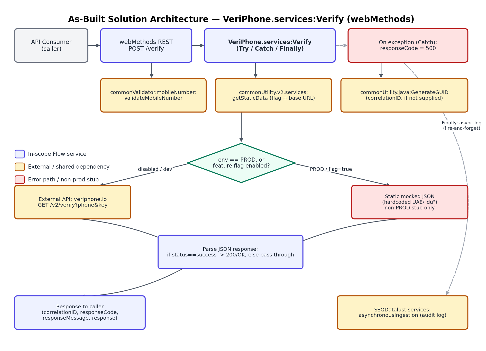
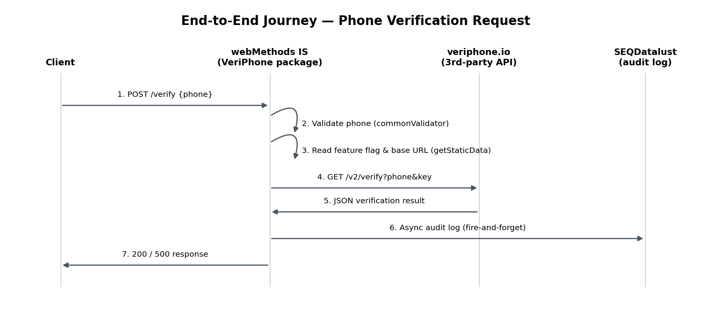
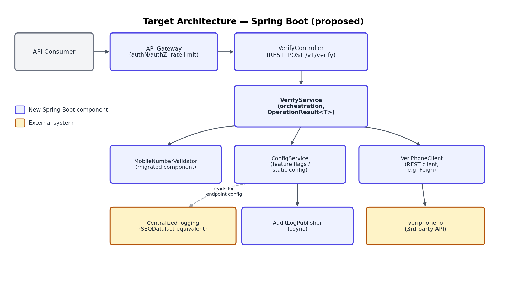
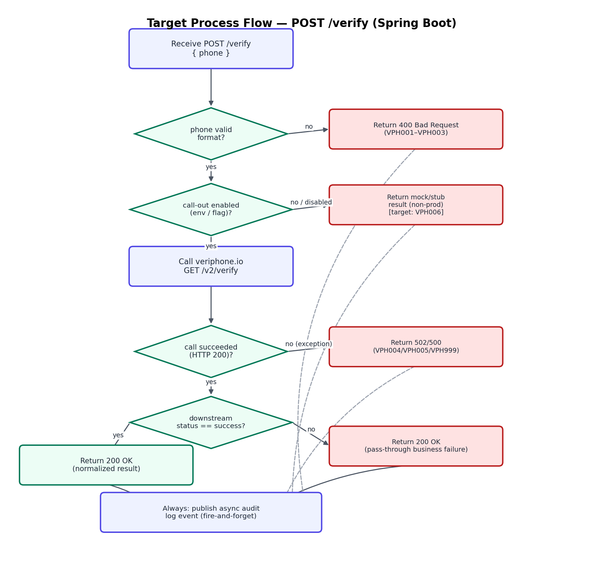

# VeriPhone — Verify API — Migration Documentation

**webMethods Flow → Spring Boot / Azure migration reference**

| | |
|---|---|
| Source package | VeriPhone |
| In-scope service | `VeriPhone.services:Verify` |
| Version | 1.0 — 2026-09-11 |

## Table of Contents

- [1. Overview](#1-overview)
  - [1.1 Purpose](#11-purpose)
  - [1.2 Scope](#12-scope)
  - [1.3 Executive Summary](#13-executive-summary)
- [2. Solution Architecture](#2-solution-architecture)
  - [2.1 As-Built Architecture (Legacy)](#21-as-built-architecture-legacy)
  - [2.2 End-to-End Journey](#22-end-to-end-journey)
  - [2.3 Target Architecture (Spring Boot)](#23-target-architecture-spring-boot)
  - [2.4 Target Response & Result Model](#24-target-response--result-model)
- [3. Prerequisites & Static Configuration](#3-prerequisites--static-configuration)
  - [3.1 Integration Server Global Variables](#31-integration-server-global-variables)
  - [3.2 Static / Feature-Flag Configuration](#32-static--feature-flag-configuration)
  - [3.3 Upstream / Downstream Dependencies](#33-upstream--downstream-dependencies)
  - [3.4 Security Notes](#34-security-notes)
- [4. API: Verify Phone Number](#4-api-verify-phone-number)
  - [4.1 Endpoint Summary](#41-endpoint-summary)
    - [4.1.1 Request Body](#411-request-body)
    - [4.1.2 Business Logic Summary](#412-business-logic-summary)
    - [4.1.3 Sample Request](#413-sample-request)
    - [4.1.5 Response Body](#415-response-body)
    - [4.1.6 HTTP Status Code Reference — Target Error-Code Scheme](#416-http-status-code-reference--target-error-code-scheme)
      - [4.1.6.1 Client Input Errors — errorCode/errorMsg Returned](#4161-client-input-errors--errorcodeerrormsg-returned)
      - [4.1.6.2 Backend / Provider Errors — errorCode/errorMsg Left Null](#4162-backend--provider-errors--errorcodeerrormsg-left-null)
      - [4.1.6.3 Example Target Response Envelopes](#4163-example-target-response-envelopes)
    - [4.1.7 Target Process Flow (Spring Boot)](#417-target-process-flow-spring-boot)
- [5. Downstream & Backoffice Integration APIs](#5-downstream--backoffice-integration-apis)
  - [5.1 veriphone.io — GET https://api.veriphone.io/v2/verify (External 3rd-Party API)](#51-veriphoneio--get-httpsapiveriphoneiov2verify-external-3rd-party-api)
    - [5.1.1 Observed Request Contract](#511-observed-request-contract)
    - [5.1.2 Observed Response Contract](#512-observed-response-contract)
    - [5.1.3 HTTP Status Code Reference](#513-http-status-code-reference)
  - [5.2 commonValidator.mobileNumber:validateMobileNumber](#52-commonvalidatormobilenumbervalidatemobilenumber)
  - [5.3 commonUtility.v2.services:getStaticData](#53-commonutilityv2servicesgetstaticdata)
  - [5.4 commonUtility.java:GenerateGUID](#54-commonutilityjavagenerateguid)
  - [5.5 SEQDatalust.services:asynchronousIngestion](#55-seqdatalustservicesasynchronousingestion)
- [6. Data Mapping Reference](#6-data-mapping-reference)
  - [6.1 Request Field Mapping](#61-request-field-mapping)
  - [6.2 Response Field Mapping (veriphone.io → Verify output)](#62-response-field-mapping-veriphoneio--verify-output)

---

## 1. Overview

### 1.1 Purpose

VeriPhone.services:Verify is a webMethods Integration Server Flow service, exposed as a REST resource (POST /verify), that verifies a mobile phone number on behalf of a calling system. It performs format validation through a shared platform validator, then — in production, or in lower environments when a feature flag is explicitly enabled — calls the third-party veriphone.io phone-intelligence API to confirm the number's validity, carrier, and region. In lower environments where the outbound call is disabled, the service returns a hardcoded, static mock response instead, so downstream consumers can be tested without spending real API quota. Every invocation is logged asynchronously to a centralized audit/logging platform (SEQDatalust) regardless of outcome.

### 1.2 Scope

This document covers only the following, as directed by the migration owner:

- **In scope:** `VeriPhone.services:Verify` — the single active, production-facing service in the VeriPhone package, and the only service exposed through the package's REST API definition (POST /verify).
- **Out of scope:** the internal implementations of the shared/common services this flow calls — `commonValidator.mobileNumber:validateMobileNumber`, `commonUtility.v2.services:getStaticData`, `commonUtility.java:GenerateGUID`, and `SEQDatalust.services:asynchronousIngestion`. None of these ship inside the VeriPhone package extract; they are documented here only to the extent their contracts can be inferred from how Verify calls them (see §3.3 and §5).

### 1.3 Executive Summary

Functionally, Verify is a thin orchestration layer: validate the input, look up configuration, call an external verification API (or a stub), normalize the outcome into a common response envelope, and log the transaction. There is no database access and no state held by the service itself. The main points relevant to a target-platform rewrite:

- The legacy service's own error handling is minimal: it defines exactly one literal, business-owned error code (500 / "Internal Server Error", raised by a catch-all exception handler); every other outcome's code is produced by an external shared validator or passed through from the downstream provider. This document proposes a full target error-code scheme (prefix VPH, §4.1.6) that splits client-input errors (returned to the caller) from backend/provider errors (logged only, generic status returned) — see §7.2 for what remains to be confirmed against the actual validator source.
- The response envelope's payload field (`response`) is completely untyped in the source signature (an empty record) — it is a raw pass-through of whatever JSON veriphone.io returns. §4.1.5 documents its fields as observed from the source, together with a proposed typed schema.
- A hardcoded, non-production stub response is embedded directly inside the Flow logic (not in external test fixtures or configuration). This is a maintenance and test-hygiene concern worth flagging for the target design (see §2.4 and §7.2).
- Timestamps use a legacy custom pattern (`yyyy-MM-dd HH:mm:ss.SSS`) with a hardcoded `GMT+4` offset baked into the Flow logic, rather than a configurable, standard (ISO 8601) representation.
- Authentication toward the downstream veriphone.io API uses a server-level Integration Server global variable (`VERIPHONE_API_KEY`) passed as a query-string parameter, per veriphone.io's own API contract; the Verify REST endpoint itself enforces no authentication or authorization of its own callers at the webMethods layer.

> **Key migration notes**
> - Define an explicit, typed response body for the veriphone.io payload; do not carry forward the untyped record.
> - Adopt the proposed VPH error-code scheme (§4.1.6): responseCode/responseMessage become an HTTP-status-like pair (e.g. "400"/"Bad Request"), and a new errorCode/errorMsg pair carries the service-level detail — populated for client-input errors, left null for backend/provider errors (logged internally only).
> - Decide, for the target platform, whether a downstream "non-success" business result should continue to be returned as HTTP 200 (pass-through) or mapped to a distinct 4xx/5xx — the legacy behavior returns 200 in both cases (see §4.1.6).
> - Replace the embedded hardcoded stub response with an explicit test/mock configuration mechanism (e.g. WireMock, a Spring profile-gated bean, or a contract-test fixture) rather than in-code literals.
> - Obtain the commonValidator.mobileNumber package to confirm the proposed VPH001–VPH003 client-input error split against that validator's actual behavior before finalizing the target error model.

---

## 2. Solution Architecture

### 2.1 As-Built Architecture (Legacy)

The diagram below shows every system and shared service touched during a single call to `VeriPhone.services:Verify`, as reconstructed from the service's flow.xml. Boxes outlined in amber are external to this package (their internal logic was not available for analysis); the box outlined in red is the non-production stub path.



*Figure 2.1 — As-built solution architecture for VeriPhone.services:Verify.*

### 2.2 End-to-End Journey

The sequence below traces a single successful request from client to response, including the asynchronous audit-logging side effect that occurs on every call regardless of outcome.



*Figure 2.2 — End-to-end journey for a phone verification request.*

### 2.3 Target Architecture (Spring Boot)

The proposed target decomposes the single Flow service into discrete Spring Boot components with clear responsibilities. An API Gateway is introduced ahead of the controller to provide authentication/authorization and rate limiting — neither of which the legacy webMethods REST endpoint enforces today (see §3.4).



*Figure 2.3 — Proposed target architecture (Spring Boot).*

### 2.4 Target Response & Result Model

Internally, `VerifyService` and its collaborators should communicate using a typed result wrapper rather than the legacy pattern of loosely-typed `{responseCode, responseMessage, response}` fields threaded through a shared pipeline. A minimal proposal, with field names matching the public response body envelope proposed in §4.1.5.1:

```java
public final class OperationResult<T> {
    private final boolean success;
    private final T data;                 // present when success == true
    private final String errorCode;        // e.g. "VPH001"; present only for client-input errors
    private final String errorMsg;         // e.g. "phone is required"; present only for client-input errors
    private final String correlationId;
    // factory methods: OperationResult.ok(data, correlationId)
    //                  OperationResult.clientError(errorCode, errorMsg, correlationId)      -> errorCode/errorMsg returned
    //                  OperationResult.backendError(internalCode, logDetail, correlationId) -> errorCode/errorMsg left null
}
```

The `VerifyController` maps an `OperationResult` to the appropriate HTTP status only at the outer edge of the application; internal collaborators (`MobileNumberValidator`, `VeriPhoneClient`) never construct an HTTP status directly. This is a design proposal for the target platform — the legacy Flow service has no equivalent internal abstraction; every step reads and writes the same flat pipeline record.

---

## 3. Prerequisites & Static Configuration

### 3.1 Integration Server Global Variables

| Field | Type | Required | Description |
|---|---|---|---|
| `%environment%` | string | Yes | IS global variable read directly by the Flow (`MAPSET literal '%environment%'`). Compared against the literal "PROD" to select the production call path. Exact allowed values beyond "PROD" are not defined in this package. |
| `%VERIPHONE_API_KEY%` | string (secret) | Yes | IS global variable substituted directly into the outbound query string as the veriphone.io API key. Not sourced from `getStaticData` — resolved at the IS/global-variable layer. |

### 3.2 Static / Feature-Flag Configuration

Retrieved at runtime via `commonUtility.v2.services:getStaticData`, called with `application = "MIDDLEWARE"` and `keys = ["VERIPHONE_API_CALL_ENABLED"]`. The flow subsequently also reads `/staticData/VERIPHONE_BASE_URL` from the same result — this key is not explicitly requested in the `keys` array, so either `getStaticData` returns the full configuration set for the "MIDDLEWARE" application (with `keys` acting as a supplementary filter/allowlist) or `VERIPHONE_BASE_URL` is provided by a separate mechanism not visible in this package. This should be confirmed against the `getStaticData` source before the target `ConfigService` contract is finalized.

| Field | Type | Required | Description |
|---|---|---|---|
| `VERIPHONE_API_CALL_ENABLED` | string ("true"/other) | Yes (non-PROD path only) | Feature flag gating whether the actual veriphone.io API is called, or a hardcoded stub response is returned, when `%environment%` is not "PROD". |
| `VERIPHONE_BASE_URL` | string (URL) | Yes | Base URL for the veriphone.io API; observed value: `https://api.veriphone.io`. The literal path `/v2/verify` is appended by the Flow (full observed endpoint: `https://api.veriphone.io/v2/verify`). Read from the same staticData result. |

### 3.3 Upstream / Downstream Dependencies

| Dependency | Type | Purpose in Verify |
|---|---|---|
| veriphone.io — `GET https://api.veriphone.io/v2/verify` | External 3rd-party REST API | Authoritative phone-number verification (validity, type, carrier, country, E.164 form). |
| `commonValidator.mobileNumber:validateMobileNumber` | Internal shared Flow service (external to this package) | Format-validates the input phone number; its own responseCode/responseMessage gate whether Verify proceeds to call veriphone.io. |
| `commonUtility.v2.services:getStaticData` | Internal shared Flow service (external to this package) | Resolves feature flags and base URLs from centralized static configuration. |
| `commonUtility.java:GenerateGUID` | Internal shared Java service (external to this package) | Generates a correlationID when the caller did not supply one. |
| `SEQDatalust.services:asynchronousIngestion` | Internal shared Flow service (external to this package) | Fire-and-forget audit logging of the full request/response pipeline, called unconditionally in the Finally block. |

These four shared services are candidates for the target platform's own health-check dependency list (a Spring Boot `/actuator/health` indicator per external dependency: veriphone.io reachability, config-service reachability, logging-sink reachability).

### 3.4 Security Notes

> **Observed from source — for migration planning**
> - The Verify service itself declares `check_internal_acls = no` and no `listACL` in its `node.ndf`; no authentication/authorization is enforced by webMethods on the POST /verify resource in this package.
> - The only credential in play is the veriphone.io API key, held as an IS global variable and sent as a URL query parameter to the third-party API (per that API's own contract) — it is not used to authenticate callers of this service.
> - The target architecture (§2.3) introduces an API Gateway ahead of the controller specifically to close this gap; confirm with the platform/security team whether authentication was instead enforced at a network layer (e.g. an API Gateway in front of webMethods) that is outside this package.

---

## 4. API: Verify Phone Number

### 4.1 Endpoint Summary

| Field | Type | Required | Description |
|---|---|---|---|
| Method / Path | — | — | `POST /verify` |
| webMethods service | — | — | `VeriPhone.services:Verify` |
| REST resource | — | — | `VeriPhone.restAPIs:VeriPhone` (operation urlTemplate "/verify", HTTP method POST) |
| Content type | — | — | `application/json` (no explicit request document type constraints; the associated doc type `VeriPhone.restAPIs.VeriPhone_.docTypes:VeriPhone` declares no fields, so the resource accepts whatever the service's own input signature allows). |

#### 4.1.1 Request Body

| Field | Type | Required | Description |
|---|---|---|---|
| `phone` | string | Yes | The phone number to verify, in the format expected by `commonValidator.mobileNumber:validateMobileNumber` and by veriphone.io (observed usage suggests full international format, e.g. "9715xxxxxxxx"; the exact accepted formats are enforced by the external validator, not by Verify itself). |

> **Legacy vs. target field format**
> - **Legacy:** `phone` is an untyped string with no declared pattern in the Flow signature; the service's `svc_in_validator_options` is "default", so IS performs only presence/type checks (non-nillable) before the Flow executes — a missing `phone` field is rejected by the platform before any Flow logic runs.
> - **Target:** represent `phone` using a validated pattern (e.g. E.164, `^\+?[1-9]\d{6,14}$`) at the API boundary (e.g. Bean Validation `@Pattern`) rather than relying entirely on a downstream shared validator.

#### 4.1.2 Business Logic Summary

1. Capture a request timestamp (pattern `yyyy-MM-dd HH:mm:ss.SSS`, hardcoded `GMT+4` offset).
2. Serialize the incoming `{phone}` into a JSON string for audit purposes (`requestBody`); if this serialization step fails, a Catch handler substitutes a literal empty JSON object (`'{ }'`) so the rest of the flow can still proceed and be logged.
3. If the caller did not supply a `correlationID` (checked with a regex match against a non-empty value), generate one via `commonUtility.java:GenerateGUID`.
4. Look up static configuration (`VERIPHONE_API_CALL_ENABLED`, `VERIPHONE_BASE_URL`) via `commonUtility.v2.services:getStaticData` for application "MIDDLEWARE", and reshape the returned list into a keyed `staticData` document.
5. Read the `%environment%` global variable into the pipeline.
6. Validate the phone number's format via `commonValidator.mobileNumber:validateMobileNumber`. This call's own output populates `responseCode` / `responseMessage` in the pipeline (Verify does not set these explicitly for the validation step).
7. Branch on `responseCode`: only the literal case "200" proceeds to call the verification API; any other value (produced entirely by the external validator) skips straight to formatting a response timestamp and returning `responseCode`/`responseMessage` unchanged.
8. Within the "200" case, branch on `%environment%`: if "PROD", call veriphone.io directly. Otherwise, branch again on the `VERIPHONE_API_CALL_ENABLED` flag — if "true", also call veriphone.io for real; otherwise, skip the network call and synthesize a hardcoded, static mock verification response for a UAE mobile number on the "du" carrier (see §7.2, Open Items, for the literal payload).
9. When veriphone.io is actually called: issue `GET {VERIPHONE_BASE_URL}/v2/verify?phone={phone}&key={VERIPHONE_API_KEY}`; capture the HTTP transport status/status message into `responseCode`/`responseMessage`; convert the raw response bytes to a string and parse it as JSON into the `response` document.
10. Branch on `response/status`: if the parsed JSON body's own `status` field equals "success", overwrite `responseCode`/`responseMessage` with the literal "200"/"OK". Otherwise ("$default"), do nothing further — the `responseCode`/`responseMessage` already set from the HTTP transport layer (typically still 200, since the HTTP call itself succeeded) are returned unchanged, and the `response` body is still populated with whatever veriphone.io (or the stub) returned.
11. Capture a response timestamp (same pattern/offset as step 1).
12. On any unhandled exception anywhere in the steps above, a Catch block sets `responseCode="500"`, `responseMessage="Internal Server Error"`, recovers `requestBody` / `requestTimestamp` / `correlationID` from the exception's captured pipeline snapshot (via `pub.flow:getLastError`), and stamps a response timestamp. The response payload field is not populated in this path; the output's `lastError` field carries the full exception detail (`pub.event:exceptionInfo`), auto-populated by `pub.flow:getLastError`.
13. Regardless of outcome, a Finally block asynchronously (fire-and-forget) submits the full request/response pipeline to `SEQDatalust.services:asynchronousIngestion` for centralized audit logging, then clears the pipeline (preserving only `responseCode`).

> **Business-logic observations for the target design**
> - Downstream business failure is not distinguished from success at the transport level: when veriphone.io responds with HTTP 200 but a JSON body whose `status` is not "success", Verify still returns HTTP 200 to its own caller, with the un-normalized downstream body passed through as-is. Confirm with the business owner whether the target API should instead map this case to a distinct status (e.g. 422) — see the Target Process Flow in §4.1.7, which proposes exactly this distinction as an open design question.
> - The service has exactly one business-defined error code of its own (500 / Internal Server Error). Every other outcome's code is either the literal "200", the veriphone.io HTTP transport status, or whatever `commonValidator.mobileNumber:validateMobileNumber` returns.

#### 4.1.3 Sample Request

```http
POST /verify HTTP/1.1
Host: <integration-server-host>
Content-Type: application/json

{
  "phone": "+971505044338"
}
```

#### 4.1.5 Response Body

| Field | Type | Required | Description |
|---|---|---|---|
| `correlationID` | string | Always | Unique Identifier GUID |
| `responseCode` | string (HTTP status) | Always | Target: repurposed to always carry the HTTP-status-like code for the outcome, e.g. "200", "400", "502", "503", "500" — no longer a free-text mix of business and transport codes. |
| `responseMessage` | string (HTTP reason phrase) | Always | Target: the standard reason phrase paired with responseCode, e.g. "OK", "Bad Request", "Bad Gateway", "Service Unavailable", "Internal Server Error". |
| `errorCode` | string, nullable | Client-input errors only | New field. Service-level error code, e.g. "VPH001" (§4.1.6.1). Null on success and null on backend/provider errors (§4.1.6.2), where detail is logged internally rather than returned. |
| `errorMsg` | string, nullable | Client-input errors only | New field. Human-readable, caller-safe detail paired with errorCode, e.g. "phone is required". Null wherever errorCode is null. |
| `response` | object, nullable — see typed shape below | On success only | Present only when responseCode is "200"; null on every error path. |
| `phoneType` | string (or enum, e.g. MOBILE, LANDLINE) | No | Legacy field name `phone_type`. |
| `phoneRegion` | string | No | Legacy field name `phone_region`. |
| `country` | string | No | No change from legacy. |
| `countryCode` | string, ISO 3166-1 alpha-2 | No | Legacy field `country_code` already appears to follow ISO 3166-1 alpha-2 (e.g. "AE") — retain as-is, formalize as the standard in the target contract. |
| `countryPrefix` | string | No | Legacy field name `country_prefix`. |
| `internationalNumber` | string | No | Legacy field `international_number`; observed formatted with spaces (e.g. "+971 50 504 4338"). |
| `localNumber` | string | No | Legacy field `local_number`; observed formatted with spaces (e.g. "050 504 4338"). |
| `e164` | string, E.164 | No | Legacy field `e164` already follows the E.164 standard — retain as-is. |
| `carrier` | string | No | Legacy field `carrier`. |
| `mode` | string (or enum, e.g. STATIC, LIVE) | No | Newly observed field ("static" in the captured sample), not previously documentable from source alone. Appears to indicate the verification method veriphone.io used (e.g. offline number-plan lookup vs. a live network query); exact enumeration is defined by the provider — confirm against veriphone.io's own API documentation before finalizing as an enum. |
| `timezone` | array of string (IANA timezone identifiers) | No | Newly observed field (e.g. ["Asia/Dubai"]). One or more IANA zone identifiers associated with the number's region. |
| `geographical` | boolean | No | Newly observed field. Indicates whether the number is tied to a specific geographic area, as opposed to a non-geographic number (e.g. VoIP, toll-free). |

#### 4.1.6 HTTP Status Code Reference — Target Error-Code Scheme

The legacy source has no existing custom error-code scheme: its only self-defined outcome is the literal 500 / "Internal Server Error" (§4.1.2, step 12); every other outcome is either the literal 200/OK success branch or a value passed through unchanged from an external service (commonValidator.mobileNumber, or the veriphone.io HTTP transport status). The codes below are a proposed target design, prefixed VPH, following the same client-input/backend split used elsewhere in this programme: client-input errors return a specific errorCode/errorMsg the caller can act on, while backend/provider errors return only a generic responseCode/responseMessage and keep the failure detail in the server-side log.

##### 4.1.6.1 Client Input Errors — errorCode/errorMsg Returned

| errorCode | responseCode / responseMessage | errorMsg (returned) | Legacy basis |
|---|---|---|---|
| VPH001 | 400 / Bad Request | phone is required | Corresponds to the platform-level rejection of a missing `phone` field today (IS input validation, before the Flow even runs — §4.1.1) and/or an empty-value case from commonValidator.mobileNumber. |
| VPH002 | 400 / Bad Request | phone is not a valid phone number | Corresponds to a format-validation failure from `commonValidator.mobileNumber:validateMobileNumber` (external to this package — see §7.2). |
| VPH003 | 400 / Bad Request | phone length is invalid | Corresponds to a length-specific validation failure from `commonValidator.mobileNumber:validateMobileNumber` (external to this package — see §7.2). |

The three-way split above (missing / invalid format / invalid length) is a reasonable target design based on common phone-validation failure modes, not a literal decomposition of `commonValidator.mobileNumber`'s own error taxonomy — that service's source is not included in this package. Confirm against it directly, or collapse to fewer codes, once available (§7.2).

##### 4.1.6.2 Backend / Provider Errors — errorCode/errorMsg Left Null

| errorCode (internal) | responseCode / responseMessage | Logged Detail Only — never returned | Legacy basis |
|---|---|---|---|
| VPH004 | 502 / Bad Gateway | Provider unreachable or timed out | New target-only distinction. Legacy: any network failure calling veriphone.io falls into the generic Catch block (500 / Internal Server Error). |
| VPH005 | 502 / Bad Gateway | Provider returned a non-success/unexpected response | New target-only distinction. Legacy: pass-through — HTTP 200 is still returned to the caller even when the provider's own JSON status is not "success" (§4.1.2, step 10). |
| VPH006 | 503 / Service Unavailable | Provider integration disabled/unconfigured for this environment | New target-only distinction. Legacy: silently returns the hardcoded non-prod stub response instead (§4.1.2, step 8; §7.2) rather than signaling unavailability. |
| VPH999 | 500 / Internal Server Error | Unhandled exception inside the service | Direct equivalent of the legacy Catch block's literal 500 / Internal Server Error (§4.1.2, step 12). |

errorCode/errorMsg are deliberately left null for every row in this table — only responseCode/responseMessage are returned to the caller, so that internal failure detail (which provider, which timeout, which exception) is never leaked to a client and is instead available only in server-side logs, keyed by correlationID.

##### 4.1.6.3 Example Target Response Envelopes

Success (errorCode/errorMsg present but null):

```json
{
  "correlationID": "b6fd294d-9854-4b95-a8fb-f60e87a00d17",
  "responseCode": "200",
  "responseMessage": "OK",
  "errorCode": null,
  "errorMsg": null,
  "response": { "...": "as in §4.1.4/§4.1.5.1" }
}
```

Client input error (VPH001):

```json
{
  "correlationID": "b6fd294d-9854-4b95-a8fb-f60e87a00d17",
  "responseCode": "400",
  "responseMessage": "Bad Request",
  "errorCode": "VPH001",
  "errorMsg": "phone is required",
  "response": null
}
```

Backend/provider error (VPH999 — detail withheld from the caller):

```json
{
  "correlationID": "b6fd294d-9854-4b95-a8fb-f60e87a00d17",
  "responseCode": "500",
  "responseMessage": "Internal Server Error",
  "errorCode": null,
  "errorMsg": null,
  "response": null
}
```

#### 4.1.7 Target Process Flow (Spring Boot)

The proposed target flow keeps the legacy step order but makes two behaviors explicit that the legacy service leaves implicit: a distinct 4xx for input validation failure, and an open design question (marked with a dashed line) about whether a downstream business failure should remain a pass-through 200 or become its own distinct status.



*Figure 4.1 — Proposed target process flow for POST /verify.*

---

## 5. Downstream & Backoffice Integration APIs

None of the services below ship inside the VeriPhone package. Each is documented to the extent its contract can be inferred purely from how Verify calls it; none is independently exposed by the VeriPhone package as its own REST API ("Internal only" from this package's perspective).

### 5.1 veriphone.io — GET https://api.veriphone.io/v2/verify (External 3rd-Party API)

> **Internal only (from this package)**
> Called exclusively as an outbound HTTP integration from within Verify. Not re-exposed by the VeriPhone webMethods package under any resource of its own.

#### 5.1.1 Observed Request Contract

| Field | Type | Required | Description |
|---|---|---|---|
| `phone` | string | Yes | Query parameter; the phone number to verify. |
| `key` | string | Yes | Query parameter; the veriphone.io API key (`VERIPHONE_API_KEY`). |

#### 5.1.2 Observed Response Contract

See §4.1.5 and §4.1.5.1 for the full field list and proposed typed schema — the fields documented there are copied verbatim (pass-through) from this API's JSON response into Verify's own `response` field.

#### 5.1.3 HTTP Status Code Reference

| HTTP Status | Description |
|---|---|
| 200 | Call succeeded at the transport level; the JSON body's own `status` field must still be checked for business-level success (see §4.1.2, step 10). |
| Non-200 (not distinguished by this Flow) | Any other transport status from veriphone.io is copied into Verify's own responseCode/responseMessage as-is, without translation — the Flow applies no distinct handling per veriphone.io status code. |

### 5.2 commonValidator.mobileNumber:validateMobileNumber

> **Internal only (from this package) — source not available**
> - Ships in a separate shared package (commonValidator) not included in the VeriPhone extract.
> - Contract inferred from usage only: accepts `mobileNumber` (mapped from `phone`); its own output directly supplies `responseCode`/`responseMessage` into Verify's pipeline (no explicit MAP step copies these fields, implying field-name pass-through).
> - Only the literal `responseCode` value "200" is meaningfully branched on by Verify; all other values (and their corresponding `responseMessage`) are defined entirely inside this external service.

### 5.3 commonUtility.v2.services:getStaticData

> **Internal only (from this package) — source not available**
> - Ships in a separate shared package (commonUtility) not included in the VeriPhone extract.
> - Called with `application="MIDDLEWARE"`, `keys=["VERIPHONE_API_CALL_ENABLED"]`; its own `responseCode`/`responseMessage` output fields are explicitly deleted by Verify immediately after the call (to avoid polluting the shared pipeline before validation runs), and its `response/staticData` list is converted into a keyed document via `pub.document:documentListToDocument`.

### 5.4 commonUtility.java:GenerateGUID

> **Internal only (from this package) — source not available**
> - Ships in a separate shared package (commonUtility) not included in the VeriPhone extract.
> - Invoked only when the caller did not supply a `correlationID`; its `guidID` output is copied into `correlationID`.

### 5.5 SEQDatalust.services:asynchronousIngestion

> **Internal only (from this package) — source not available**
> - Ships in a separate shared package (SEQDatalust) not included in the VeriPhone extract.
> - Called unconditionally in the Finally block with the entire pipeline as input (`phone`, `requestTimestamp`, `requestBody`, `correlationID`, `responseCode`, `responseMessage`, `responseBody`, `response`, `responseTimestamp`, `lastError`) for centralized audit logging. Fire-and-forget: no output is consumed by Verify.

---

## 6. Data Mapping Reference

### 6.1 Request Field Mapping

| Source Field | Target | Notes |
|---|---|---|
| `phone` | `commonValidator.mobileNumber:validateMobileNumber` → `mobileNumber` | Renamed field, straight copy. |
| `phone` | `GET veriphone.io ?phone=` | Straight copy, as a query parameter. |
| `%VERIPHONE_API_KEY%` | `GET veriphone.io ?key=` | IS global variable substitution, not a pipeline field. |
| `%/staticData/VERIPHONE_BASE_URL% + "/v2/verify"` | `GET veriphone.io URL` | String concatenation of a pipeline-path substitution and a literal path segment. Observed resolved value: `https://api.veriphone.io/v2/verify`. |
| `correlationID` (caller-supplied or generated) | response envelope: `correlationID` | Pass-through, generated via `commonUtility.java:GenerateGUID` only if absent (checked via regex `/[^ ]/`, i.e. "contains a non-space character"). |

### 6.2 Response Field Mapping (veriphone.io → Verify output)

The entire veriphone.io JSON body is parsed once (`pub.json:jsonStringToDocument`) and copied wholesale into the `response` field — there is no field-by-field remapping on the response side in the legacy service. The table below reflects the fields observed in that body and the proposed target names from §4.1.5.1.

| veriphone.io field | Proposed target field | Notes |
|---|---|---|
| `status` | `responseCode/errorCode` | Normalize to an enum (SUCCESS/FAILED) in the target. |
| `phone_valid` | `responseCode/errorCode` | Already boolean; rename only. |
| `phone_type` | `phoneType` | Rename; consider an enum in the target. |
| `phone_region` | `phoneRegion` | Rename only. |
| `country` | `country` | No change. |
| `country_code` | `countryCode` | Rename; already ISO 3166-1 alpha-2. |
| `country_prefix` | `countryPrefix` | Rename only. |
| `international_number` | `internationalNumber` | Rename only. |
| `local_number` | `localNumber` | Rename only. |
| `e164` | `e164` | No change; already E.164. |
| `carrier` | `carrier` | No change. |
| `mode` | `mode` | No rename; newly observed field (§4.1.4), not derivable from source alone. |
| `timezone` | `timezone` | No rename; newly observed field (§4.1.4), array of IANA identifiers. |
| `geographical` | `geographical` | No rename; newly observed field (§4.1.4), already boolean. |
