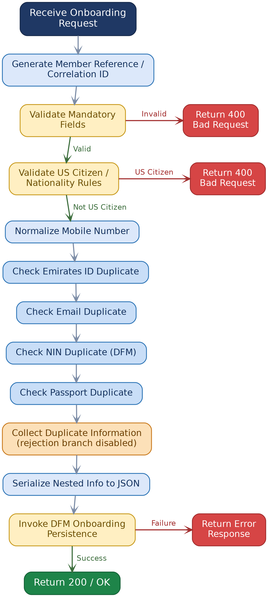
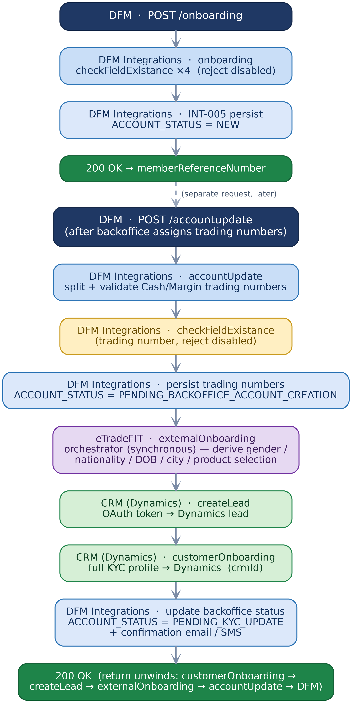
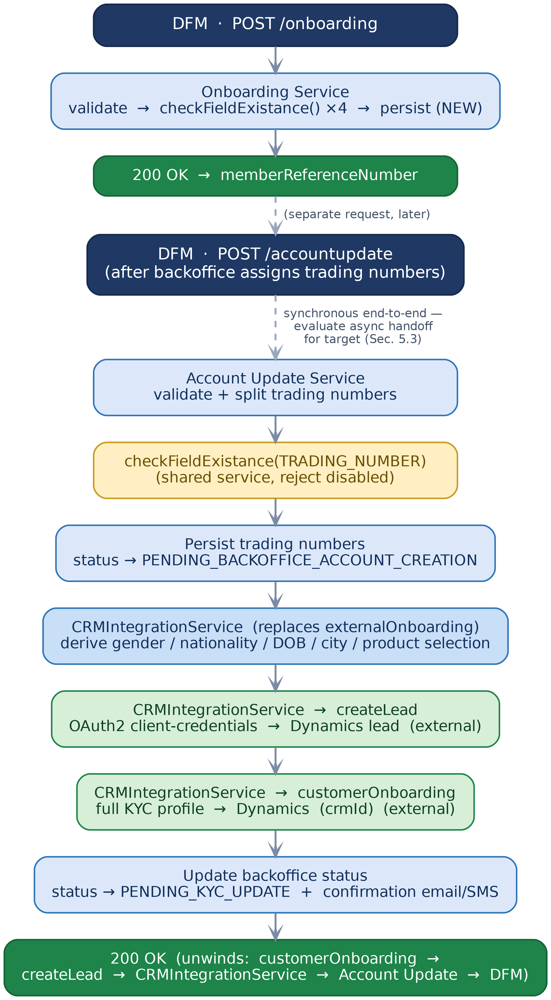
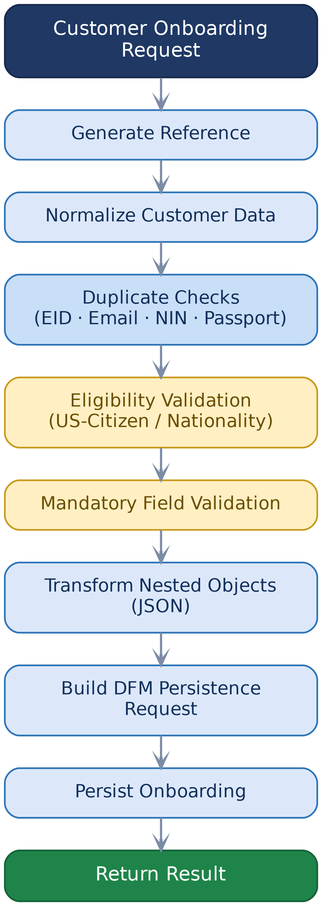
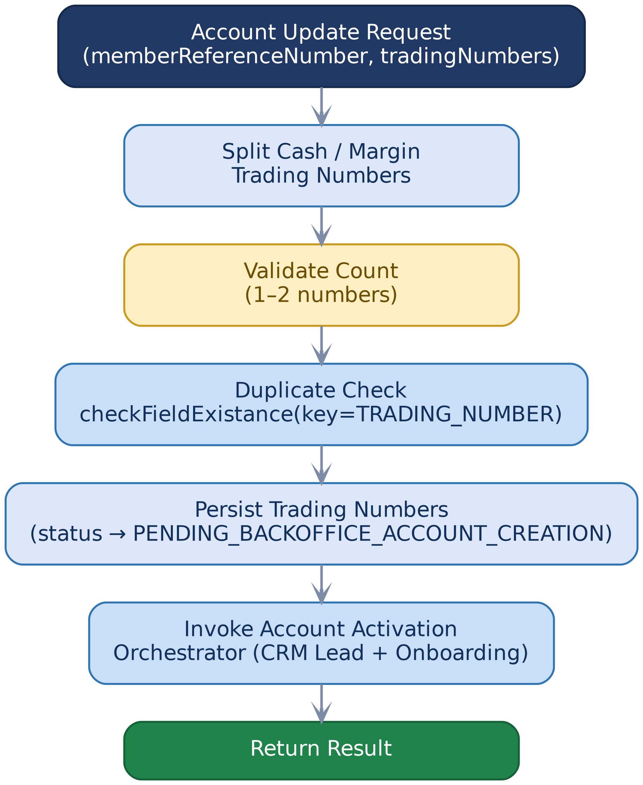

*AL RAMZ CAPITAL*

*MIDDLEWARE MIGRATION PROGRAMME*

# DFM Onboarding Service

### API Documentation & Integration Reference

*Software AG webMethods  →  Spring Boot 3\.x / Java 21 Migration*

---

## Document Control

## Table of Contents

- [1. Overview](#1-overview)
  - [1.1 Purpose](#11-purpose)
  - [1.2 Scope](#12-scope)
  - [1.3 Executive Summary](#13-executive-summary)
  - [1.4 Key Migration Notes](#14-key-migration-notes)
- [2. Solution Architecture](#2-solution-architecture)
  - [2.1 High-Level Request Flow](#21-high-level-request-flow)
  - [2.2 End-to-End Onboarding Journey (As-Built)](#22-end-to-end-onboarding-journey-as-built)
  - [2.3 Target Business Process Flow — End-to-End (Spring Boot)](#23-target-business-process-flow-end-to-end-spring-boot)
  - [2.4 Target Response & Result Model](#24-target-response-result-model)
    - [2.4.1 Separating Transport from Domain Result](#241-separating-transport-from-domain-result)
    - [2.4.2 OperationResult<T>](#242-operationresultt)
- [3. Prerequisites & Static Configuration](#3-prerequisites-static-configuration)
  - [3.1 Static Variables](#31-static-variables)
  - [3.2 Environment & Service Availability Prerequisites](#32-environment-service-availability-prerequisites)
- [4. Primary API — DFM Onboarding Service](#4-primary-api-dfm-onboarding-service)
  - [4.1 Endpoint Summary](#41-endpoint-summary)
  - [4.2 Request Schema](#42-request-schema)
    - [4.2.1 Authentication & Reference](#421-authentication-reference)
    - [4.2.2 Customer](#422-customer)
    - [4.2.3 Emirates ID](#423-emirates-id)
    - [4.2.4 Passport](#424-passport)
    - [4.2.5 Personal Information](#425-personal-information)
    - [4.2.6 Payment & Portfolio](#426-payment-portfolio)
    - [4.2.7 Employment](#427-employment)
    - [4.2.8 Income](#428-income)
    - [4.2.9 Investment Profile](#429-investment-profile)
    - [4.2.10 CSR / Tax Residency](#4210-csr-tax-residency)
    - [4.2.11 FATCA](#4211-fatca)
    - [4.2.12 KYC / Background Check](#4212-kyc-background-check)
  - [4.3 Business Logic Summary](#43-business-logic-summary)
  - [4.4 Sample Request](#44-sample-request)
  - [4.5 Response Schema](#45-response-schema)
    - [4.5.1 Success Response (200)](#451-success-response-200)
    - [4.5.2 Business / Validation Failure (400)](#452-business-validation-failure-400)
    - [4.5.3 Technical Failure (500)](#453-technical-failure-500)
  - [4.6 HTTP Status Code Reference](#46-http-status-code-reference)
  - [4.7 Target Process Flow (Spring Boot)](#47-target-process-flow-spring-boot)
- [5. Account Update API — DFM Account Update Service](#5-account-update-api-dfm-account-update-service)
  - [5.1 Endpoint Summary](#51-endpoint-summary)
  - [5.2 Request Schema](#52-request-schema)
  - [5.3 Business Logic Summary](#53-business-logic-summary)
  - [5.4 Sample Request](#54-sample-request)
  - [5.5 Response Schema](#55-response-schema)
    - [5.5.1 Sample Success Response (200)](#551-sample-success-response-200)
    - [5.5.2 Sample Validation Failure (400)](#552-sample-validation-failure-400)
  - [5.6 HTTP Status Code Reference](#56-http-status-code-reference)
  - [5.7 Target Process Flow (Spring Boot)](#57-target-process-flow-spring-boot)
- [6. Downstream & Backoffice Integration APIs](#6-downstream-backoffice-integration-apis)
  - [6.1 checkFieldExistance — Consolidated Field-Existence Check](#61-checkfieldexistance-consolidated-field-existence-check)
    - [Service Signature (Internal Function Form)](#service-signature-internal-function-form)
    - [Endpoint Summary (Vendor API Form)](#endpoint-summary-vendor-api-form)
    - [Key Reference](#key-reference)
    - [Legacy Duplicate-Check Field Mapping](#legacy-duplicate-check-field-mapping)
    - [eTradeFIT Endpoint Reference](#etradefit-endpoint-reference)
    - [Validation Rules](#validation-rules)
    - [Sample Request](#sample-request)
    - [Sample Response — Exists](#sample-response-exists)
    - [HTTP Status Code Reference](#http-status-code-reference)
    - [Sample Response — Error](#sample-response-error)
    - [Oracle SQL Logic — key = NIN / TRADING_NUMBER](#oracle-sql-logic-key-nin-trading_number)
    - [Oracle SQL Logic — key = MOBILE](#oracle-sql-logic-key-mobile)
    - [Oracle SQL Logic — key = FULLNAME|DOB](#oracle-sql-logic-key-fullnamedob)
  - [6.2 Persist Onboarding Request](#62-persist-onboarding-request)
    - [Adapter Properties (Source)](#adapter-properties-source)
    - [Underlying DB Insert Statement](#underlying-db-insert-statement)
    - [Sample Persistence Request](#sample-persistence-request)
    - [Sample Persistence Response — Target (OperationResult<T>)](#sample-persistence-response-target-operationresultt)
    - [HTTP Status Code Reference](#http-status-code-reference-1)
  - [6.3 Persist Trading Numbers](#63-persist-trading-numbers)
    - [Adapter Properties (Source)](#adapter-properties-source-1)
    - [Columns Updated](#columns-updated)
    - [Sample Persistence Request](#sample-persistence-request-1)
    - [Sample Persistence Response — Target (OperationResult<T>)](#sample-persistence-response-target-operationresultt-1)
    - [HTTP Status Code Reference](#http-status-code-reference-2)
  - [6.4 CRMIntegrationService — CRM Onboarding Orchestrator](#64-crmintegrationservice-crm-onboarding-orchestrator)
    - [Service Signature (As-Built)](#service-signature-as-built)
    - [Business Logic Summary](#business-logic-summary)
    - [Sample Result — Target (OperationResult<T>)](#sample-result-target-operationresultt)
    - [HTTP Status Code Reference](#http-status-code-reference-3)
  - [6.5 createLead — CRM Lead Creation](#65-createlead-crm-lead-creation)
    - [Request Schema](#request-schema)
    - [Response Schema](#response-schema)
    - [CRM Connectivity](#crm-connectivity)
    - [HTTP Status Code Reference](#http-status-code-reference-4)
    - [Sample Request (DFM channel)](#sample-request-dfm-channel)
    - [Sample Success Response (Internal Function Form)](#sample-success-response-internal-function-form)
    - [Sample Success Response (Vendor API Form)](#sample-success-response-vendor-api-form)
  - [6.6 customerOnboarding — CRM Customer Onboarding & Activation](#66-customeronboarding-crm-customer-onboarding-activation)
    - [Request Structure](#request-structure)
    - [Fields Populated by the DFM Chain](#fields-populated-by-the-dfm-chain)
    - [Response Schema](#response-schema-1)
    - [Validation Rules](#validation-rules-1)
    - [CRM Connectivity](#crm-connectivity-1)
    - [Sample Success Response (Internal Function Form)](#sample-success-response-internal-function-form-1)
    - [Sample Success Response (Vendor API Form)](#sample-success-response-vendor-api-form-1)
    - [HTTP Status Code Reference](#http-status-code-reference-5)
- [7. Data Mapping Reference](#7-data-mapping-reference)
  - [7.1 Onboarding Request → DFM Persistence](#71-onboarding-request-dfm-persistence)
    - [Customer](#customer)
    - [Emirates ID](#emirates-id)
    - [Passport](#passport)
    - [Personal Information](#personal-information)
    - [Payment & Portfolio](#payment-portfolio)
    - [Employment](#employment)
    - [Income](#income)
    - [Investment Profile](#investment-profile)
    - [CSR / Tax Residency](#csr-tax-residency)
    - [FATCA](#fatca)
    - [KYC / Background Check](#kyc-background-check)
    - [Reference / Status](#reference-status)
    - [Trading Numbers (from `accountUpdate`)](#trading-numbers-from-accountupdate)
  - [7.2 CRM Target Field Mapping (Microsoft Dynamics)](#72-crm-target-field-mapping-microsoft-dynamics)
- [8. Appendix](#8-appendix)
  - [Appendix A — PostgreSQL DDL (Middleware Schema)](#appendix-a-postgresql-ddl-middleware-schema)
    - [C.1 Target PostgreSQL DDL](#c1-target-postgresql-ddl)

---

# 1\. Overview

## 1\.1 Purpose

This document defines the Application Programming Interface \(API\) contract, business rules, and integration behaviour of the **DFM Onboarding** service and its downstream **Account Activation** chain, as implemented across three Software AG webMethods packages: `DFMIntegrations.v2.services` \(`onboarding`, `accountUpdate`\), `eTradeFIT.v2.services.InternalOnboarding` \(`externalOnboarding`\), and `CRM.services.crmOnboarding` \(`createLead`, `customerOnboarding`\)\. It is intended to serve as the authoritative technical reference for the engineering team migrating this service chain to a Spring Boot 3\.x / Java 21 implementation on Azure Cloud\.

## 1\.2 Scope

This document covers:
- The primary REST API contract for the DFM onboarding orchestration service \(target Spring Boot design\)\.
- The **Account Update API** \(`POST /accountupdate`\) through which DFM registers Cash/Margin trading numbers once the backoffice account has been created, and the synchronous CRM account-activation chain it triggers\.
- The functional and validation business rules enforced by the existing Flow\.
- All downstream/internal integration APIs invoked during onboarding and account activation \(Emirates ID, Email, NIN/Trading Number, Passport, Mobile, Username, Full Name\+DOB and UUID duplicate checks; DFM persistence; and the CRM Dynamics lead-creation and customer-onboarding services\)\.
- Request/response schemas, sample payloads, and error-handling contracts for each integration\.
- Data mapping between the incoming onboarding request, the `DFM_ONBOARDING_REQUESTS` persistence table, and the CRM \(Microsoft Dynamics\) native fields\.
- The end-to-end business process flow spanning DFM, the DFM Integrations middleware, eTradeFIT, and CRM \(Section 2\.2\)\.

## 1\.3 Executive Summary

The service processes an online customer onboarding request for DFM-related onboarding\. It accepts customer identity, contact, passport, address, payment, employment, income, investment profile, CSR/tax-residency, FATCA, and background-check information — over 110 fields in total \(Section 4\.2\), reconciled against DFM's real, observed contract\. Before creating an onboarding record, the service performs duplicate checks for Emirates ID, email address, NIN/trading number, and passport number\. Duplicate identifiers are collected into an internal list, although the final duplicate-rejection branch is currently disabled in the Flow\. The service also applies eligibility validations, including rejection of US citizens and validation of mandatory mobile number, email, NIN, nationality, and KYC/background-check information\. Customer nationality fields are normalized by trimming whitespace and converting values to uppercase before comparison\. The service serializes selected nested structures to JSON and then invokes the DFM onboarding persistence operation\. A successful persistence operation returns response code `200` and message `OK`\. Technical failures are converted into response code `400` with the captured error message, while a separate fallback produces `500 Internal Server Error`\.

Onboarding is only the first half of the journey\. Once the backoffice has approved the request and assigned Cash/Margin trading numbers, DFM calls a second API, `accountUpdate` \(Section 5\), to register those numbers\. `accountUpdate` validates and persists the trading numbers, then synchronously invokes the `CRMIntegrationService` \(Section 6\.4 — the target rename of the legacy eTradeFIT `externalOnboarding` orchestrator\) that re-reads the persisted onboarding record, derives a handful of secondary fields \(gender, nationality, date of birth, city code, product selection\), and drives the customer's account into being through two Microsoft Dynamics CRM calls: `createLead` \(Section 6\.5\), which creates the CRM lead and online-trading credentials, followed by `customerOnboarding` \(Section 6\.6\), which submits the full KYC profile against that lead\. On success, the backoffice record is moved to `PENDING_KYC_UPDATE` and the customer is notified by email and SMS\. The full chain — `onboarding` → `accountUpdate` → `CRMIntegrationService` → `createLead` → `customerOnboarding` — is illustrated end-to-end in Section 2\.2 \(as-built\) and Section 2\.3 \(target\)\.

## 1\.4 Key Migration Notes

> **Important — behaviours to preserve or explicitly re-confirm during migration:**
>
> - **Target design decision — \`externalOnboarding\` is retired; renamed \`CRMIntegrationService\`\.** The legacy eTradeFIT orchestrator `externalOnboarding` is **not** carried into the Spring Boot target under its old name or package\. Its business logic \(Section 6\.4\) is preserved and reimplemented as a new target service, `CRMIntegrationService`\. Everywhere else in this document, a reference to `externalOnboarding` describes the **as-built source Flow**; the **target implementation** is `CRMIntegrationService`\.
> - **Nationality normalization**: `eid_nationality`, `pp_nationality`, and `pinf_country` are trimmed and upper-cased before comparison against `USA` — this normalization must be replicated exactly to avoid false negatives/positives on US-citizen eligibility checks\.
> - **Mobile normalization**: a `971` prefix is replaced with `00971 .`
> - **NIN/Trading Number duplicate check** is implemented as a direct Oracle SQL query in the source system rather than a REST call; see Section 6\.1 for the exact query logic to preserve\.
> - **Legacy request contract is frozen\.** The primary onboarding request payload \(Section 4\) is defined by existing consumers and is carried forward with its original flat field names \(`cust_mobile`, `cust_email`, `eid_no`, …\) unchanged — it is not restructured into nested objects during migration\.
> - **Duplicate-check services consolidated\.** The eight separate legacy duplicate-check operations \(`IfEIDExists`, `IfEmailExists`, `IfPassportExists`, `IfMobileExists`, `IfUsernameExists`, `IfTPUUIDExists`, and the NIN/trading-number and full-name\+DOB SQL checks\) are unified behind a single generic service, `checkFieldExistance(key, value) → boolean`, in the target design — see Section 6\.1\.
> - **Deprecated fields removed\.** `islamicMode` and `lang`, present on the legacy `IfEIDExists` / `IfEmailExists` / `IfPassportExists` payloads, are unused in practice and have been dropped from the target design\.
> - **The \`onboarding\` → \`accountUpdate\` → \`CRMIntegrationService\` → \`createLead\` → \`customerOnboarding\` chain is fully synchronous** in the source Flow \(where this hop is implemented as `externalOnboarding`\): `accountUpdate` blocks on `CRMIntegrationService`, which blocks on two sequential CRM Dynamics calls\. A slow or unavailable CRM extends the DFM-facing `accountUpdate` response time directly\. **Recommend evaluating an asynchronous handoff** \(e\.g\., publish-and-process via a queue\) for the target design — see Section 5\.3\.
> - **Dual exposure model \(v4\.0\)\.** `checkFieldExistance`, `createLead`, and `customerOnboarding` are each both an internal function \(called within the DFM chain\) and a standalone API exposed to external vendors \(e\.g\., Finoux\) — see Section 6's exposure-model callout\. `insertDFMOnboardingRequest`, `updateDFMOnboardingRequestTradingNumbers`, and `CRMIntegrationService` are internal-only and are never exposed as APIs\.
> - **Target Response & Result Model \(v4\.0\)\.** Internal-only calls \(7\.2, 7\.3, 7\.4\) move from the as-built Flow's thin `{"result": "SUCCESS"}` shape to a typed `OperationResult<T>` model, with a matching exception hierarchy and Micrometer-Tracing-based correlation — see Section 2\.4\.

# 2\. Solution Architecture

## 2\.1 High-Level Request Flow

The onboarding request passes through the following stages, in order:

1\. Receive onboarding request\.

2\. Generate a Member Reference Number / Correlation ID \(unique identifier\)\.

3\. Validate mandatory fields \(mobile, email, NIN, KYC, FATCA, nationality\) — invalid ⇒ **400**\.

4\. Validate US-citizen / nationality eligibility rules — US citizen ⇒ **400**\.

5\. Change country code for UAE mobile numbers from `971` → `00971` \.

6\. Check Emirates ID duplicate — `checkFieldExistance(key="EID", value=eid_no)`\.

7\. Check email duplicate — `checkFieldExistance(key="EMAIL", value=cust_email)`\.

8\. Check NIN duplicate against DFM exchange — `checkFieldExistance(key="NIN", value=cust_nin)`\.

9\. Check passport duplicate — `checkFieldExistance(key="PASSPORT", value=pp_no)`\.

10\. Collect duplicate information \(rejection branch currently disabled — see Section 1\.4\)\.

11\. Serialize nested information \(market-employee, CSR, KYC details\) to JSON\.

12\. Invoke DFM onboarding persistence \(Section 6\.2\) — failure ⇒ error response\.

13\. Return **200 / OK** with the Member Reference Number and Correlation ID\.

14\. *\(Separate, later request\)* Once the backoffice assigns Cash/Margin trading numbers, DFM calls `POST /accountupdate` \(Section 5\) to trigger account activation — see the end-to-end journey below\.

*Source Flow diagram \(as-built, for traceability\):*



*Figure 1 — Source Flow \(As-Built\), Software AG webMethods*

|  | Start / End |  | Process Step |  | Decision / Validation |  | Rejection / Error |  | Success |
| --- | --- | --- | --- | --- | --- | --- | --- | --- | --- |

## 2\.2 End-to-End Onboarding Journey \(As-Built\)

The two DFM-facing APIs \(`onboarding`, `accountUpdate`\) are only the entry points into a five-stage chain spanning three systems: the DFM Integrations middleware, eTradeFIT, and CRM \(Microsoft Dynamics\)\. The diagram below traces a single onboarding request from the first DFM call through to a fully activated CRM customer record, including the internal, non-DFM-facing hops \(`externalOnboarding`, `createLead`, `customerOnboarding`\)\.



*Figure 2 — End-to-End Onboarding & Account Activation Journey \(As-Built\)*

|  | DFM \(Consumer\) |  | DFM Integrations |  | eTradeFIT |  | CRM \(Dynamics\) |  | Response / Success |
| --- | --- | --- | --- | --- | --- | --- | --- | --- | --- |
| **Reading the diagram**<br>The top four boxes \(`onboarding` → persistence → `200 OK`\) complete and return to DFM **before** any trading numbers exist — this is a separate, earlier request\.<br>The `accountUpdate` → `externalOnboarding` → `createLead` → `customerOnboarding` chain \(lower half\) executes **synchronously**: `accountUpdate` does not respond to DFM until the entire CRM handoff — including both Dynamics calls — has completed or failed\.<br>`checkFieldExistance` \(gold box\) is invoked with the duplicate-rejection branch disabled in both `onboarding` and `accountUpdate`, consistent with\. |  |  |  |  |  |  |  |  |  |

## 2\.3 Target Business Process Flow — End-to-End \(Spring Boot\)

The target design carries the same five business stages forward, but consolidates the legacy DFM Integrations and eTradeFIT service boundaries into Spring Boot components of a single system — only the CRM \(Microsoft Dynamics\) boundary remains external and unchanged\. The diagram below is the target-state counterpart to Figure 2, covering the full journey from `POST /onboarding` through `accountUpdate`, the `CRMIntegrationService` \(target rename of the legacy `externalOnboarding` orchestrator — Section 6\.4\), `createLead`, and `customerOnboarding`\. Per-service detail diagrams for the two DFM-facing APIs are in Section 4\.6 \(Onboarding\) and Section 5\.4 \(Account Update\)\.



*Figure 3 — Target Business Process Flow, End-to-End, Spring Boot 3\.x*

|  | DFM \(Consumer\) |  | Onboarding / Account Update Service |  | Decision / Validation |  | CRMIntegrationService |  | CRM \(Dynamics\) — external, unchanged |  | Response / Success |
| --- | --- | --- | --- | --- | --- | --- | --- | --- | --- | --- | --- |
| **Reading the diagram**<br>The dashed edge from `POST /accountupdate` into the Account Update Service marks the synchronous end-to-end chain flagged in Section 5\.3 as a migration consideration — evaluate an asynchronous handoff \(202 Accepted \+ status polling/webhook\) at this boundary for the target design\.<br>`CRMIntegrationService` is the **agreed target replacement** for the legacy `externalOnboarding` orchestrator \(eTradeFIT package\) — externalOnboarding is retired and not carried into the Spring Boot implementation under its old name\. See Section 6\.4 for the full business logic it inherits\. |  |  |  |  |  |  |  |  |  |  |  |

## 2\.4 Target Response & Result Model

This document uses **two different response shapes** depending on who owns the contract at each boundary \(Section 6's exposure model callout\): DFM's own flat, snake\_case envelope for `onboarding` / `accountUpdate` \(Section 4\.4, 5\.6\), and the org's own nested, camelCase API standard for vendor-facing endpoints \(`checkFieldExistance`, `createLead`, `customerOnboarding` — Section 6\.1, 7\.5, 7\.6\)\. Neither of those is designed for the **internal, service-to-service** calls inside the DFM chain — `insertDFMOnboardingRequest` \(7\.2\), `updateDFMOnboardingRequestTradingNumbers` \(7\.3\), and `CRMIntegrationService` \(7\.4\) currently return only a thin `{"result": "SUCCESS"}` shape in the as-built Flow, which is not rich enough for the target design\. This section proposes the model these three internal-only services should use going forward\.

### 2\.4\.1 Separating Transport from Domain Result

The core design move is to separate two concerns that the legacy Flow conflates: the **transport/envelope** concern \(what crosses an external API boundary — HTTP status, `responseCode`, `correlationID`\) and the **domain/result** concern \(what a service call actually accomplished, for consumption by other Java code in the same process or the same trust boundary\)\. External-facing responses \(Sections 4\.4, 5\.6, 7\.1, 7\.5, 7\.6\) remain owned by their respective contracts\. Internal-only calls \(7\.2, 7\.3, 7\.4\) should instead return a typed `OperationResult<T>` object — never a bare boolean, a raw exception, or an ad hoc map\.

### 2\.4\.2 OperationResult\<T\>

```
public class OperationResult<T> {
    private final boolean success;
    private final String statusCode;      // http Codes responseCode: 200 / 400 / 1008 / 1028 / 402 / 503 / 500 ...
    private final String message;         // human-readable outcome
    private final T data;                 // the actual payload on success (e.g. the affected record's IDs)
    private final Map<String, Object> downstreamMeta;  // optional: crmId, onlineTradingUserId, rowsAffected, etc.
 
}
```

# 3\. Prerequisites & Static Configuration

This section lists the environment-level configuration the onboarding and account-activation services depend on, ahead of the API-by-API detail in Sections 4–6\.

## 3\.1 Static Variables

The following variables are read from cache/configuration and must be provisioned per environment before any of the services in this document can run\. `baseURL` is the eTradeFIT host used by `checkFieldExistance` \(Section 6\.1\) for the `EID` / `EMAIL` / `PASSPORT` / `USERNAME` / `UUID|THIRDPARTY` keys and their endpoint paths \(Section 6\.1, "eTradeFIT Endpoint Reference"\); the `CRM_*` variables configure CRM \(Microsoft Dynamics\) connectivity, used by `createLead` \(Section 6\.5\) and `customerOnboarding` \(Section 6\.6\)\. Values below are the QA sample values from the source configuration — provision the correct value per environment \(Dev / UAT / Pre-Prod / Prod\) in the target design\.

| **Attribute** | **Detail** |
| --- | --- |
| `baseURL` | Dev: `https://etradeuat.alramz.ae/`<br>UAT: `https://etradeqa.alramz.ae/`<br>Pre-Prod: `https://etradepreprod.alramz.ae/`<br>Prod: `https://eservices.alramz.ae/` |
| `CRM_PATH_URL` | `https://alramz-qa.crm15.dynamics.com` \(QA\) — base URL of the CRM \(Microsoft Dynamics\) Web API\. See Section 6\.5\. |
| `CRM_RESOURCE` | `https://alramz-qa.crm15.dynamics.com` \(QA\) — OAuth2 resource identifier passed to the token endpoint; same host as `CRM_PATH_URL` in this environment, but a logically distinct parameter\. |
| `CRM_TOKEN_BASE_URL` | `https://login.microsoftonline.com` — Azure AD / Entra ID OAuth2 token host\. |
| `CRM_TOKEN_PATH_URL` | `/961f4969-b5af-4576-90f4-4b5872f23807/oauth2/token` \(QA tenant\) — token endpoint path, appended to `CRM_TOKEN_BASE_URL`\. |
| `CRM_CLIENT_ID` | `518b548a-a29d-4a91-8c51-1d944abb8c73` \(QA\) — Azure AD application \(client\) ID for the CRM integration user\. |
| `CRM_GRANT_TYPE` | `client_credentials` — OAuth2 grant type used for the token request \(Section 6\.5\)\. |
| `CRM_CREATE_LEAD_URL` | `/api/data/v9.2/titc_CRM_CreateLeadAPI` — appended to `CRM_PATH_URL` for the `createLead` call \(Section 6\.5\)\. |
| `CRM_CUSTOMERONBOARDING_URL` | `/api/data/v9.2/titc_CRM_CustomerOnboardingAPI` — appended to `CRM_PATH_URL` for the `customerOnboarding` call \(Section 6\.6\)\. |
| `CRM_CLIENT_SECRET` | OAuth2 client secret for the CRM integration user; store in a secrets manager, never in source, in the target design\. Not printed in this document\. |
| **Migration note**<br>In the source Flow these are plain configuration values \(webMethods global variables / cache entries\)\. In the Spring Boot target, provision them as environment-scoped `application-{env}.yml` properties or Azure App Configuration / Key Vault references, with `CRM_CLIENT_SECRET` and the eTradeFIT client secret held in Key Vault only\.<br>`CRM_CLIENT_ID` and the tenant segment of `CRM_TOKEN_PATH_URL` are QA values, not secrets, but still vary per environment — confirm the Dev/UAT/Pre-Prod/Prod values with the CRM/platform team before provisioning\. |  |

## 3\.2 Environment & Service Availability Prerequisites

Beyond the configuration values above, the following connectivity and upstream/downstream service availability must be confirmed per environment before onboarding or account-activation traffic can be served:
- **Database connectivity to the Broker Insight schema\.** The direct Oracle SQL lookups in `checkFieldExistance` \(Section 6\.1 — `NIN` / `TRADING_NUMBER` / `MOBILE` / `FULLNAME|DOB` keys, against `BV_PAR_CL_NIN_DET` and `CB_MAIN_CLIENT`\) require a live, correctly-permissioned JDBC connection to this schema in every environment\.
- **Database connectivity to the Middleware schema\.** The DFM persistence adapters \(Sections 6\.2–6\.3 — `insertDFMOnboardingRequest`, `updateDFMOnboardingRequestTradingNumbers`, against `DFM_ONBOARDING_REQUESTS`\) are hosted in a separate Middleware schema from Broker Insight and require their own live, correctly-permissioned JDBC connection in every environment\.
- **Availability of the eTradeFIT \(FIT\) services\.** `checkFieldExistance`'s REST-routed keys \(`EID` / `EMAIL` / `PASSPORT` / `USERNAME` / `UUID|THIRDPARTY`, Section 6\.1\) depend on the eTradeFIT host \(`baseURL`, Section 3\.1\) being reachable — an outage here surfaces as `E1003` on `onboarding` and `accountUpdate`\.
- **Availability of the CRM \(Microsoft Dynamics\) services\.** `accountUpdate`'s account-activation chain \(`createLead`, `customerOnboarding` — Sections 6\.5–6\.6\) depends on the CRM host and OAuth2 token endpoint \(`CRM_PATH_URL`, `CRM_TOKEN_BASE_URL`, Section 3\.1\) being reachable; an outage here blocks `accountUpdate` for the duration of its synchronous chain \(Section 5\.3\)\.

# 4\. Primary API — DFM Onboarding Service

## 4\.1 Endpoint Summary

| **Attribute** | **Detail** |
| --- | --- |
| HTTP Method | `POST` |
| Endpoint | `/api/v1/dfm/onboarding` |
| Content Type | `application/json` |
| Authentication | secure consumer-supplied `securitykey` field in the request body \(Section 4\.2 Plus IP Address Range |
| Idempotency | Not explicitly defined in source; `request_id` / correlation ID should be used to de-duplicate retries |
| Backward Compatibility | **Frozen contract\.** This request payload is consumed by existing external callers and is carried forward unchanged — see Section 4\.2\. |

## 4\.2 Request Schema

> **Design decision — legacy field names preserved**
>
> - The consumer of this API is external and already integrated against the legacy flat field names \(`cust_mobile`, `cust_email`, `eid_no`, …\)\. Restructuring these into nested objects would break existing callers, so the Spring Boot request DTO **reuses the original flat field names as-is** rather than remapping them to a nested/camelCase shape\. Internally, the service maps these flat fields onto its domain model; externally, the contract does not change\.

The request is a single flat JSON object of roughly 90 fields, grouped below by domain for readability\. All fields are consumer-supplied unless marked otherwise; `String (date)` fields follow the source system's existing date-string format\.

### 4\.2\.1 Authentication & Reference

| **Field** | **Type** | **Required** | **Description** |
| --- | --- | --- | --- |
| `securitykey` | String | Yes | Consumer-issued security/API key used to authenticate the request at the application layer, in addition to the `Authorization` bearer token \(Section 4\.1\)\. |
| `request_id` | String | Yes | Caller-supplied unique request identifier\. |
| `application_id` | String | Yes | DFM-side application/case identifier for this onboarding request\. |
| `request_userid` | String | Yes | DFM-side user identifier associated with the request\. |
| `member_code` | String | Yes | DFM member code identifying the brokerage submitting the request \(e\.g\. `RAMZ`\)\. |
| **Remaining gap — new DFM fields not yet persisted**<br>`application_id`, `request_userid`, and `member_code` are present in DFM's real onboarding contract but have no corresponding column in the source Oracle `DFM_ONBOARDING_REQUESTS` table \(Section 6\.2\) or in the translated PostgreSQL DDL \(Appendix C\)\. Recommend adding `application_id`, `request_userid`, and `member_code` columns to the target Postgres table so they are captured rather than silently dropped — confirm with the API owner before finalizing column names/types\. |  |  |  |

### 4\.2\.2 Customer

| **Field** | **Type** | **Required** | **Description** |
| --- | --- | --- | --- |
| `cust_mobile` | String | Yes | Customer mobile number\. `971` prefix is normalized to `00` internally\. |
| `cust_email` | String | Yes | Customer email address; checked for duplicates via `checkFieldExistance` \(key = `EMAIL`\)\. |
| `cust_nin` | String | Yes | National Investor Number; checked for duplicates via `checkFieldExistance` \(key = `NIN`\)\. |

### 4\.2\.3 Emirates ID

| **Field** | **Type** | **Required** | **Description** |
| --- | --- | --- | --- |
| `eid_dob` | String \(date\) | No | Emirates ID holder's date of birth\. |
| `eid_expirydate` | String \(date\) | No | Emirates ID expiry date\. |
| `eid_fullname` | String | No | Full name as printed on the Emirates ID \(Latin script\)\. |
| `eid_no` | String | No | Emirates ID number; checked for duplicates via `checkFieldExistance` \(key = `EID`\)\. |
| `eid_issuedate` | String \(date\) | No | Emirates ID issue date\. |
| `eid_primaryid` | String | No | Primary identifier segment of the Emirates ID number\. |
| `eid_secondaryid` | String | No | Secondary identifier segment of the Emirates ID number\. |
| `eid_sex` | String | No | Gender as recorded on the Emirates ID\. |
| `eid_residencyexpirydate` | String \(date\) | No | Residency visa expiry date linked to the Emirates ID\. |
| `eid_residencynumber` | String | No | Residency permit number linked to the Emirates ID\. |
| `eid_familyid` | String | No | Family book / family identifier linked to the Emirates ID\. |
| `eid_nationality` | String | Conditional | Normalized \(trim \+ uppercase\) and checked against `USA`\. |
| `eid_arabicfullname` | String | No | Full name as printed on the Emirates ID \(Arabic script\)\. |
| `eid_attachment_front` | String | No | Front-side Emirates ID document image/attachment\. |
| `eid_attachment_back` | String | No | Back-side Emirates ID document image/attachment\. |
| `eid_attachment_type` | String | No | MIME/file type of the Emirates ID attachment\(s\) \(e\.g\., `image/jpeg`\)\. |

### 4\.2\.4 Passport

| **Field** | **Type** | **Required** | **Description** |
| --- | --- | --- | --- |
| `pp_dob` | String \(date\) | No | Passport holder's date of birth\. |
| `pp_expirydate` | String \(date\) | No | Passport expiry date\. |
| `pp_fullname` | String | No | Full name as printed on the passport\. |
| `pp_no` | String | No | Passport number; checked for duplicates via `checkFieldExistance` \(key = `PASSPORT`\)\. |
| `pp_nationality` | String | Conditional | Normalized \(trim \+ uppercase\) and checked against `USA`\. |
| `pp_primaryid` | String | No | Primary identifier segment of the passport number\. |
| `pp_secondaryid` | String | No | Secondary identifier segment of the passport number\. |
| `pp_sex` | String | No | Gender as recorded on the passport\. |
| `pp_attachment` | String | No | Passport document image/attachment\. |
| `pp_attachment_type` | String | No | MIME/file type of the passport attachment\. |

### 4\.2\.5 Personal Information

| **Field** | **Type** | **Required** | **Description** |
| --- | --- | --- | --- |
| `pinf_address` | String | No | Residential address\. |
| `pinf_city` | String | No | City of residence\. |
| `pinf_mothername` | String | No | Mother's full name\. |
| `pinf_pobox` | String | No | P\.O\. Box\. |
| `pinf_phone` | String | No | Landline / alternate phone number\. |
| `pinf_country` | String | Conditional | Normalized \(trim \+ uppercase\) and checked against `USA`\. |
| `pinf_signatureimage` | String | No | Customer signature image/attachment\. |
| `pinf_signatureimage_type` | String | No | MIME/file type of the signature attachment\. |
| `pinf_livinginuae` | String | No | Coded flag indicating whether the customer currently resides in the UAE\. |
| `pinf_birthcountry` | String | No | Country of birth\. |
| `pinf_birthcity` | String | No | City of birth\. |
| `pinf_homecountryaddr` | String | No | Home-country address, if different from `pinf_address`\. |

### 4\.2\.6 Payment & Portfolio

| **Field** | **Type** | **Required** | **Description** |
| --- | --- | --- | --- |
| `pay_method` | String | No | Preferred payment method\. |
| `pay_aed_iban` | String | No | AED-denominated IBAN\. |
| `pay_usd_iban` | String | No | USD-denominated IBAN\. |
| `pay_frn_iban` | String | No | Foreign-currency IBAN\. |
| `pay_frn_swift` | String | No | SWIFT/BIC code for the foreign-currency account\. |
| `pay_cor_iban` | String | No | Correspondent bank IBAN\. |
| `pay_cor_swift` | String | No | Correspondent bank SWIFT/BIC code\. |
| `pay_routecode` | String | No | Bank routing code\. |
| `portfolio_options` | String | No | Selected portfolio/product options\. |

### 4\.2\.7 Employment

| **Field** | **Type** | **Required** | **Description** |
| --- | --- | --- | --- |
| `emp_status` | String | No | Employment status \(e\.g\., employed, self-employed, unemployed\)\. |
| `emp_name` | String | No | Employer name\. |
| `emp_position` | String | No | Job title / position\. |
| `emp_marketorissuer` | String | No | Flag indicating whether the employer is a market/issuer entity\. |
| `emp_marketorissuer_company` | String | No | Name of the related market/issuer company\. |
| `emp_addr` | String | No | Employer address\. |
| `emp_relatedtomarketemployee` | String | No | Flag indicating whether the customer is related to a market employee\. |
| `emp_contact` | String | No | Employer contact number\. |
| `emp_relateds` | Array | No | Document list of related-persons entries; serialized to JSON before persistence\. Each entry:<br>`emp_relatednames` — full name of the related person\.<br>`emp_related_relations` — relationship to the customer \(e\.g\., spouse, parent\)\.<br>`emp_related_company` — company/employer of the related person\. |
| **Remaining gap — employer address/contact not yet persisted**<br>`emp_addr` and `emp_contact` are present in DFM's real onboarding contract but have no corresponding column in the source Oracle `DFM_ONBOARDING_REQUESTS` table \(Section 6\.2\) or in the translated PostgreSQL DDL \(Appendix C\)\. Recommend adding `EMPLOYER_ADDRESS` and `EMPLOYER_CONTACT` columns to the target Postgres table\. |  |  |  |

### 4\.2\.8 Income

| **Field** | **Type** | **Required** | **Description** |
| --- | --- | --- | --- |
| `inc_source` | String | No | Source of income\. |
| `inc_range` | String | No | Annual income range/bracket\. |
| `inc_wealth_source_other` | String | No | Free-text description used when the source of wealth is "other" / not covered by `inc_source`'s coded values\. |

### 4\.2\.9 Investment Profile

| **Naming discrepancy — two authoritative sources, needs reconciliation**<br>`inv_knowledge_source`, `inv_equity`, `inv_sca_authority`, and `inv_sca_type` below were reverse-engineered from the actual source Flow / persistence code and are confirmed live in the current DB mapping \(Section 6\.1: `INVESTMENT_KNOWLEDGE_SOURCE`, `INVESTMENT_NET_EQUITY`, `ACCREDITED_BY_AUTHORITY_LIST`, `ACCREDITED_BY_AUTHORITY_TYPE`\)\. DFM's latest real sample payload does not include these four fields, but does include a largely different set of wealth/investment-profile fields \(`inv_experience` onward, below\) covering overlapping ground\. Rather than deleting the source-verified fields or guessing at a mapping, this document lists **both** sets\. Confirm with DFM/the API owner whether the four legacy fields are still sent, whether any of the new fields are their replacements \(e\.g\. `inv_total_wealth` vs `inv_equity`\), or whether the DFM contract has simply grown a superset of fields since the source Flow was last updated\. |  |  |  |
| --- | --- | --- | --- |
| **Field** | **Type** | **Required** | **Description** |
| `inv_knowledge` | String | No | Extent of investment knowledge\. |
| `inv_strategy` | String | No | Investment strategy\. |
| `inv_instrument` | String | No | Instruments the customer has knowledge of / trades\. |
| `inv_risk` | String | No | Investment risk tolerance\. |
| `inv_amount` | String | No | Intended investment amount\. |
| `inv_knowledge_trading` | String | No | Trading knowledge level\. |
| `inv_knowledge_source` | String | No | *\(legacy / source-Flow-verified — see callout above\.\)* Source of investment knowledge \(e\.g\., self-taught, professional advice\)\. |
| `inv_education` | String | No | Education level\. |
| `inv_trade_prev` | String | No | Previous trading experience/knowledge\. |
| `inv_trade_freq` | String | No | Expected trading frequency\. |
| `inv_risk_high` | String | No | Acknowledgement of high-risk investment awareness\. |
| `inv_equity` | String | No | *\(legacy / source-Flow-verified — see callout above\.\)* Net equity / net worth\. |
| `inv_sca` | String | No | Whether the customer is accredited by a regulatory authority\. |
| `inv_sca_authority` | String | No | *\(legacy / source-Flow-verified — see callout above\.\)* List of accrediting authority/authorities\. |
| `inv_sca_type` | String | No | *\(legacy / source-Flow-verified — see callout above\.\)* Type of accreditation\. |
| `inv_qualified` | String | No | Qualified-investor flag\. |
| `inv_experience` | String | No | Coded years/level of investment experience\. |
| `inv_objective` | String | No | Coded investment objective\. |
| `inv_assets` | String | No | Coded liquid-assets bracket\. |
| `inv_networth` | String | No | Coded net-worth bracket\. |
| `inv_bankrelation` | String | No | Coded banking-relationship indicator\. |
| `inv_sectypes` | String | No | Coded securities-type preference\. |
| `inv_transactions` | String | No | Coded expected transaction count/volume\. |
| `inv_transavg` | String | No | Coded average transaction size\. |
| `inv_total_wealth` | String | No | Coded total-wealth bracket\. |
| `inv_assets_source` | String | No | Coded source of assets\. |
| **Remaining gap — new investment-profile fields not yet persisted**<br>`inv_experience`, `inv_objective`, `inv_assets`, `inv_networth`, `inv_bankrelation`, `inv_sectypes`, `inv_transactions`, `inv_transavg`, `inv_total_wealth`, and `inv_assets_source` are present in DFM's real onboarding contract but have no corresponding column in the source Oracle `DFM_ONBOARDING_REQUESTS` table \(Section 6\.2\) or in the translated PostgreSQL DDL \(Appendix C\)\. Recommend adding target columns for these ten fields to the Postgres table as part of this migration, once the naming-discrepancy reconciliation above is resolved with the API owner \(to avoid adding columns that turn out to duplicate the legacy fields\)\. |  |  |  |

### 4\.2\.10 CSR / Tax Residency

| **Field** | **Type** | **Required** | **Description** |
| --- | --- | --- | --- |
| `csr_resident` | String | No | Indicates whether the customer is tax-resident outside the UAE\. |
| `resident_other` | String | No | Free-text/coded detail supplied when tax residency is "other" / not directly covered by `csr_resident`\. |
| `csr` | Object | No | Common Reporting Standard \(CRS\) tax-residency details; serialized to JSON before persistence\. Contains `csr_countries[]`, each with:<br>`csr_country` — country of tax residency\.<br>`csr_havetin` — whether a Tax Identification Number \(TIN\) is held for that country\.<br>`csr_tin` — the TIN value, if held\.<br>`csr_notinreason` — reason code for not holding a TIN\.<br>`csr_whynotinissued` — explanation for why no TIN was issued\. |

### 4\.2\.11 FATCA

| **Field** | **Type** | **Required** | **Description** |
| --- | --- | --- | --- |
| `fatca_uscitizen` | String | Yes | FATCA US-citizen flag; request rejected if it indicates a US citizen\. |
| `fatca_tin` | String | No | US Taxpayer Identification Number \(if applicable\)\. |

### 4\.2\.12 KYC / Background Check

| **Field** | **Type** | **Required** | **Description** |
| --- | --- | --- | --- |
| `kyc_match` | String | Yes | Background-check / KYC match result\. |
| `kyc_match_details` | Object | No | Detailed KYC/background-check match information; serialized to JSON before persistence\. |

## 4\.3 Business Logic Summary

1\. Generate a unique identifier at the start of processing; use it as the Member Reference Number and Correlation ID\.

2\. Normalize the mobile number: replace a leading 971 prefix with 00971\.

3\. Validate mandatory fields — mobile, email, NIN, KYC result, FATCA citizenship, and nationality — each missing field rejects the request \(Section 4\.6, ONB001–ONB006\)\.

4\. Apply US-citizen eligibility checks against fatca\_uscitizen, eid\_nationality, pp\_nationality, and pinf\_country — any match rejects the request \(Section 4\.6, ONB007–ONB010\)\.

5\. Run duplicate-existence checks for Emirates ID, Email, NIN, and Passport via checkFieldExistance \(Section 6\.1\) — collected into an internal list; the rejection branch is present in the Flow but disabled, so a duplicate does not currently block onboarding\.

6\. Serialize selected nested structures to JSON before persistence — market-employee information, CSR information, and KYC/background-check details\.

7\. Invoke the onboarding persistence operation \(Section 6\.2\)\.

8\. On success, build the 200/OK response with the member\_reference\_number; on technical/persistence failure, capture the error and build the mapped error response \(Section 4\.6, ONB011–ONB012\)\.

9\. Pass the generated correlation ID to duplicate checks and persistence operations where supported, for end-to-end traceability\.

## 4\.4 Sample Request

```
POST /api/v1/dfm/onboarding HTTP/1.1
Content-Type: application/json
Authorization: Bearer <accessToken>
 
{
  "securitykey": "SK-9f8e7d6c5b4a",
  "request_id": "REQ-100001",
  "application_id": "APP-2001",
  "request_userid": "USR-3001",
  "member_code": "RAMZ",
  "cust_mobile": "00971501234567",
  "cust_email": "customer@example.com",
  "cust_nin": "NIN123456",
 
  "eid_dob": "1990-04-12",
  "eid_expirydate": "2029-03-01",
  "eid_fullname": "John Doe",
  "eid_no": "784-1990-1234567-1",
  "eid_issuedate": "2019-03-01",
  "eid_primaryid": "1234567",
  "eid_secondaryid": "1",
  "eid_sex": "M",
  "eid_residencyexpirydate": "2029-03-01",
  "eid_residencynumber": "RES-998877",
  "eid_familyid": "FAM-112233",
  "eid_nationality": "ARE",
  "eid_arabicfullname": "جون دو",
  "eid_attachment_front": "<base64-or-reference>",
  "eid_attachment_back": "<base64-or-reference>",
  "eid_attachment_type": "image/jpeg",
 
  "pp_dob": "1990-04-12",
  "pp_expirydate": "2028-12-31",
  "pp_fullname": "John Doe",
  "pp_no": "P1234567",
  "pp_nationality": "ARE",
  "pp_primaryid": "P123",
  "pp_secondaryid": "4567",
  "pp_sex": "M",
  "pp_attachment": "<base64-or-reference>",
  "pp_attachment_type": "application/pdf",
 
  "pinf_address": "123 Sheikh Zayed Road",
  "pinf_city": "Dubai",
  "pinf_mothername": "Jane Doe",
  "pinf_pobox": "12345",
  "pinf_phone": "042345678",
  "pinf_country": "ARE",
  "pinf_signatureimage": "<base64-or-reference>",
  "pinf_signatureimage_type": "image/png",
  "pinf_livinginuae": "Y",
  "pinf_birthcountry": "ARE",
  "pinf_birthcity": "Dubai",
  "pinf_homecountryaddr": "",
 
  "pay_method": "BANK_TRANSFER",
  "pay_aed_iban": "AE070331234567890123456",
  "pay_usd_iban": "AE070339876543210987654",
  "pay_frn_iban": "",
  "pay_frn_swift": "",
  "pay_cor_iban": "",
  "pay_cor_swift": "",
  "pay_routecode": "033",
  "portfolio_options": "STANDARD",
 
  "emp_status": "EMPLOYED",
  "emp_name": "Al Ramz Capital",
  "emp_position": "Analyst",
  "emp_marketorissuer": "N",
  "emp_marketorissuer_company": "",
  "emp_addr": "Sheikh Zayed Road, Dubai",
  "emp_relatedtomarketemployee": "N",
  "emp_contact": "042345679",
  "emp_relateds": [
    {
      "emp_relatednames": "",
      "emp_related_relations": "",
      "emp_related_company": ""
    }
  ],
 
  "inc_source": "SALARY",
  "inc_range": "20000-50000",
  "inc_wealth_source_other": "",
 
  "inv_knowledge": "INTERMEDIATE",
  "inv_strategy": "GROWTH",
  "inv_instrument": "EQUITIES",
  "inv_risk": "MEDIUM",
  "inv_amount": "50000",
  "inv_knowledge_trading": "INTERMEDIATE",
  "inv_knowledge_source": "SELF_TAUGHT",
  "inv_education": "BACHELORS",
  "inv_trade_prev": "Y",
  "inv_trade_freq": "MONTHLY",
  "inv_risk_high": "Y",
  "inv_equity": "150000",
  "inv_sca": "N",
  "inv_sca_authority": "",
  "inv_sca_type": "",
  "inv_qualified": "N",
  "inv_experience": "3",
  "inv_objective": "GROWTH",
  "inv_assets": "2",
  "inv_networth": "1",
  "inv_bankrelation": "3",
  "inv_sectypes": "2",
  "inv_transactions": "3",
  "inv_transavg": "2",
  "inv_total_wealth": "1",
  "inv_assets_source": "1",
 
  "csr_resident": "N",
  "resident_other": "",
  "csr": {
    "csr_countries": [
      {
        "csr_country": "ARE",
        "csr_havetin": "N",
        "csr_tin": "",
        "csr_notinreason": "",
        "csr_whynotinissued": ""
      }
    ]
  },
 
  "fatca_uscitizen": "N",
  "fatca_tin": "",
 
  "kyc_match": "MATCH",
  "kyc_match_details": {}
}
```

## 4\.5 Response Schema

| **Design decision — DFM's contract, not the org API standard**<br>`onboarding` and `accountUpdate` are DFM-specified APIs; Al Ramz does not control their shape and must match DFM's real, observed contract exactly\. That contract is a **flat, snake\_case** envelope — `response_code` / `response_message` / `member_reference_number` — with no separate `correlationId` field \(`member_reference_number` itself serves as the correlation/reference id\)\. This is intentionally **different** from the org's own API standard used elsewhere in this document \(`correlationID` / `responseCode` / `responseMessage` / nested `response{}` — Section 6\.1\) — do not unify the two; DFM's shape is fixed by the consumer, not by Al Ramz\. |  |  |  |
| --- | --- | --- | --- |
| **HTTP Status** | **response\_code** | **Meaning** | **Body Fields** |
| 200 OK | `200` | Onboarding request accepted and persisted\. | `response_code`, `response_message = OK`, `member_reference_number` |
| 400 Bad Request | `400` | Validation, eligibility, or business/technical failure \(captured error message\)\. | `response_code`, `response_message` |
| 500 Internal Server Error | `500` | Unhandled fallback failure\. | `response_code`, `response_message = Internal Server Error` |

### 4\.5\.1 Success Response \(200\)

```
{
  "response_code": "200",
  "response_message": "OK",
  "member_reference_number": "85763d6f-6455-4d72-9b95-7cc202a80ace"
}
```

### 4\.5\.2 Business / Validation Failure \(400\)

```
{
  "response_code": "400",
  "response_message": "Email Address (cust_email) is missing"
}
```

### 4\.5\.3 Technical Failure \(500\)

*Not explicitly sampled in the source Flow; constructed here consistent with the documented fallback behaviour \(Executive Summary, Section 1\.3\):*

```
{
  "response_code": "500",
  "response_message": "Internal Server Error"
}
```

## 4\.6 HTTP Status Code Reference

| **HTTP Status** | **Service Error Code** | **Description** |
| --- | --- | --- |
| **200** | — | Onboarding request accepted and persisted\. |
| **400** | ONB001 | Mobile Number \(cust\_mobile\) is missing\. |
| **400** | ONB002 | Email Address \(cust\_email\) is missing\. |
| **400** | ONB003 | NIN Number \(cust\_nin\) is missing\. |
| **400** | ONB004 | Background check \(kyc\_match\) is missing\. |
| **400** | ONB005 | USCitizen \(fatca\_uscitizen\) is missing\. |
| **400** | ONB006 | Client nationality is missing\. |
| **400** | ONB007 | Online onboarding is unavailable for US citizens \(fatca\_uscitizen indicates US citizen\)\. |
| **400** | ONB008 | Online onboarding is unavailable for US citizens — eid\_nationality equals USA\. |
| **400** | ONB009 | Online onboarding is unavailable for US citizens — pp\_nationality equals USA\. |
| **400** | ONB010 | Online onboarding is unavailable for US citizens — pinf\_country equals USA\. |
| **400** | ONB011 | Captured last-error message \(technical/persistence exception during processing\)\. |
| **500** | ONB012 | Unhandled fallback failure\. |

Source-verification note: onboarding’s flow\.xml was checked directly for a separate legacy numeric error code \(as distinct from the plain response\_code shown under HTTP Status above\)\. None exists — every validation/technical failure sets only a literal response\_code \(“400” or “500”, i\.e\. the same value shown in the HTTP Status column\) plus the literal response\_message text already reflected in the Description column\. There is no third, separate legacy code to show\.

## 4\.7 Target Process Flow \(Spring Boot\)

Reduced to its essential orchestration stages, the migrated Onboarding Service should implement — this is the detail view of the first stage of the end-to-end journey in Figure 3 \(Section 2\.3\):



*Figure 4 — Target Business Process Flow, Onboarding, Spring Boot 3\.x*

# 5\. Account Update API — DFM Account Update Service

`DFMIntegrations.v2.services:accountUpdate` is the second DFM-facing entry point\. DFM calls it once the backoffice has approved the onboarding request and assigned Cash and/or Margin trading numbers, to register those numbers and trigger account activation in CRM\. Unlike `onboarding`, this call is **synchronous end-to-end**: it does not return to DFM until the entire downstream CRM chain \(Section 6\.4–6\.6\) has completed — see the callout in Section 5\.3\.

## 5\.1 Endpoint Summary

| **Attribute** | **Detail** |
| --- | --- |
| HTTP Method | `POST` |
| Endpoint | `/api/v1/dfm/accountupdate` |
| Content Type | `application/json` |
| Authentication | secure consumer-supplied `securitykey` field in the request body \(Section 4\.2 Plus IP Address Range |
| Preconditions | A prior onboarding request must already be persisted for the given `member_reference_number` \(Section 4, Section 6\.2\)\. |
| Behaviour | **Synchronous\.** Blocks on trading-number persistence and on the full `CRMIntegrationService` → `createLead` → `customerOnboarding` chain \(Section 2\.2 as-built, Section 2\.3 target\)\. |

## 5\.2 Request Schema

| **Field** | **Type** | **Required** | **Description** |
| --- | --- | --- | --- |
| `securitykey` | String | Yes | Consumer-issued security/API key used to authenticate the request at the application layer, in addition to the `Authorization` bearer token — same key as `onboarding` \(Section 4\.2\.1\)\. |
| `member_reference_number` | String | Yes | The Member Reference Number / Correlation ID returned by the original `onboarding` call \(Section 4\.4\.1\)\. |
| `dfm_account_numbers` | String | Yes | Comma-separated list of one or two trading numbers assigned by the backoffice: a single value is treated as the **Cash** trading number; two values are treated as **Cash** \(first\) and **Margin** \(second\), in that order\. |

## 5\.3 Business Logic Summary

1\. Generate a Correlation ID if one was not supplied \(mirrors `onboarding`, Section 4\.2\.1\)\.

2\. Validate `securitykey` \(application-layer key, mirrors `onboarding`, Section 4\.2\.1\)\.

3\. Split `dfm_account_numbers` on `,` into a list of trading numbers\.

4\. Validate the count: **0** ⇒ **400** `Cash & Margin Trading numbers were not sent by DFM`; **1** ⇒ treat as Cash only; **2** ⇒ Cash \+ Margin; **\>2** ⇒ **400** `More than 2 Trading Numbers were shared`\.

5\. For each trading number supplied, check for an existing duplicate via `checkFieldExistance(key="TRADING_NUMBER", value=<number>)` \(Section 6\.1\) — collected into an internal list; the rejection branch is present in the Flow but **disabled**, matching the `onboarding` duplicate-check pattern\.

6\. Persist the trading number\(s\) against the existing onboarding record and set `ACCOUNT_STATUS = PENDING_BACKOFFICE_ACCOUNT_CREATION` \(Section 6\.3\) — failure ⇒ **400** `DFM Account Update request was rejected by Al Ramz.`

7\. On successful persistence, synchronously invoke `CRMIntegrationService` \(Section 6\.4 — target rename of the legacy `externalOnboarding` orchestrator\) with the `member_reference_number`, driving the CRM account-activation chain to completion\.

8\. Return **200 / OK** with the `member_reference_number` once the chain unwinds\.

> **Migration consideration — synchronous chain**
>
> - Steps 6–7 mean an `accountUpdate` caller \(DFM\) is held open for the duration of `CRMIntegrationService` **plus** two sequential CRM Dynamics REST calls \(`createLead`, `customerOnboarding`, each preceded by an OAuth token fetch/refresh — Section 6\.5\)\. This is a multi-hop, cross-system synchronous chain with no circuit breaker or timeout budget visible in the source Flow\. For the Spring Boot target, evaluate: \(a\) an explicit end-to-end timeout budget across the chain, \(b\) resilience patterns \(retry with backoff, circuit breaker\) around the CRM calls, and \(c\) whether `accountUpdate` should instead persist the trading numbers and return **202 Accepted** immediately, with the CRM chain driven asynchronously \(event/queue\) and its outcome exposed via a status-polling endpoint or webhook\.

## 5\.4 Sample Request

```
POST /api/v1/dfm/accountupdate HTTP/1.1
Content-Type: application/json
Authorization: Bearer <accessToken>
 
{
  "securitykey": "SK-9f8e7d6c5b4a",
  "member_reference_number": "9f8e7d6c-5b4a-4e21-8b3a-1a2b3c4d5e6f",
  "dfm_account_numbers": "CASH-100234,MARGIN-100234"
}
```

## 5\.5 Response Schema

| **HTTP Status** | **response\_code** | **Meaning** | **Body Fields** |
| --- | --- | --- | --- |
| 200 OK | `200` | Trading numbers persisted and the CRM account-activation chain completed\. | `response_code`, `response_message`, `member_reference_number` |
| 400 Bad Request | `400` | Missing/too-many trading numbers, or persistence rejected by the backoffice\. | `response_code`, `response_message`, `member_reference_number` |
| 500 Internal Server Error | `500` | Unhandled fallback failure \(including a CRM chain failure surfaced as an exception\)\. | `response_code`, `response_message = Internal Server Error` |

### 5\.5\.1 Sample Success Response \(200\)

```
{
  "response_code": "200",
  "response_message": "OK",
  "member_reference_number": "9f8e7d6c-5b4a-4e21-8b3a-1a2b3c4d5e6f"
}
```

### 5\.5\.2 Sample Validation Failure \(400\)

```
{
  "response_code": "400",
  "response_message": "Cash & Margin Trading numbers were not sent by DFM"
}
```

## 5\.6 HTTP Status Code Reference

| **HTTP Status** | **Service Error Code** | **Description** |
| --- | --- | --- |
| **200** | — | Trading numbers persisted and the CRM account-activation chain completed\. |
| **400** | AUP001 | Cash & Margin Trading numbers were not sent by DFM\. |
| **400** | AUP002 | More than 2 Trading Numbers were shared\. |
| **400** | AUP003 | DFM Account Update request was rejected by Al Ramz \(trading-number persistence failed\)\. |
| **400** | AUP004 | Background check status is missing \(propagated from CRMIntegrationService — Section 6\.4, CIS001\)\. |
| **500** | AUP005 | Unhandled fallback failure \(including a CRM chain failure surfaced as an exception\)\. |

Source-verification note: accountUpdate’s flow\.xml was checked directly and follows the identical pattern as onboarding above — only a literal response\_code \(“400”/“500”\) plus literal response\_message text, no separate legacy numeric code\. It also never copies a code from checkFieldExistance’s duplicate-check result or from the CRM chain response; a disabled \(dead-code\) branch exists that would have rejected on an existing trading number with its own message, but it does not currently execute\.

## 5\.7 Target Process Flow \(Spring Boot\)

Reduced to its essential orchestration stages, the migrated Account Update Service should implement — this is the detail view of the second stage of the end-to-end journey in Figure 3 \(Section 2\.3\):



*Figure 5 — Target Business Process Flow, Account Update, Spring Boot 3\.x*

# 6\. Downstream & Backoffice Integration APIs

Across `onboarding` and `accountUpdate`, the source Flows invoke eight legacy duplicate-existence checks \(`IfEIDExists`, `IfEmailExists`, `IfPassportExists`, `IfMobileExists`, `IfUsernameExists`, `IfTPUUIDExists`, and two Oracle SQL checks — NIN/trading-number and full-name\+DOB\) and two persistence operations \(`insertDFMOnboardingRequest`, `updateDFMOnboardingRequestTradingNumbers`\)\. Because the duplicate checks share an identical shape — "does this value already exist?" — the target design consolidates them behind a single generic service, `checkFieldExistance(key, value)`, documented once in Section 6\.1\. Beyond DFM persistence, `accountUpdate` also triggers a three-service CRM account-activation chain \(`CRMIntegrationService` → `createLead` → `customerOnboarding`, Sections 6\.4–7\.6\) that this document treats as downstream/backoffice integrations in their own right, since DFM never calls them directly\.

| **Target Service** | **Section** | **Exposure** | **Replaces \(Legacy Operations\)** | **Purpose** |
| --- | --- | --- | --- | --- |
| `checkFieldExistance` | 7\.1 | Dual — internal function \+ vendor API | `IfEIDExists`<br>`IfEmailExists`<br>`IfPassportExists`<br>`IfMobileExists`<br>`IfUsernameExists`<br>`IfTPUUIDExists`<br>NIN / trading-number SQL<br>Full-name \+ DOB SQL | Generic "does this value already exist?" check — takes a `key` \(field type\) and `value`, returns `true`/`false`\. |
| `insertDFMOnboardingRequest` | 7\.2 | Internal only | *\(unchanged\)* | Persist the validated onboarding request into the DFM onboarding system\. |
| `updateDFMOnboardingRequestTradingNumbers` | 7\.3 | Internal only | *\(unchanged\)* | Persist Cash/Margin trading numbers against an existing onboarding record; advances `ACCOUNT_STATUS`\. |
| `CRMIntegrationService` | 7\.4 | Internal only | *\(target rename of \`externalOnboarding\`, eTradeFIT package\)* | Re-reads the persisted onboarding record, derives secondary fields, and drives `createLead` \+ `customerOnboarding`\. |
| `createLead` | 7\.5 | Dual — internal function \+ vendor API | *\(new, CRM package\)* | Creates the CRM \(Microsoft Dynamics\) lead and online-trading credentials for the customer\. |
| `customerOnboarding` | 7\.6 | Dual — internal function \+ vendor API | *\(new, CRM package\)* | Submits the full KYC profile \(client info, products, address, bank, FATCA, CRS, IDs, classification, …\) against the CRM lead\. |
| **Exposure model — dual-mode vs\. internal-only**<br>**Dual-mode** \(`checkFieldExistance`, `createLead`, `customerOnboarding`\): each is called **internally** within the DFM `onboarding` / `accountUpdate` process chain, and is **also** exposed as a standalone REST API to external vendors \(e\.g\., Finoux\) who need the same capability directly\. When acting in the API role, these three follow the org API response standard — `correlationID` / `responseCode` / `responseMessage` / nested `response{}` \(Section 6\.1\) — regardless of the internal-call shape used within the DFM chain\.<br>**Internal only** \(`insertDFMOnboardingRequest`, `updateDFMOnboardingRequestTradingNumbers`, `CRMIntegrationService`\): these are never exposed as standalone APIs — they exist solely to be called by the DFM-facing orchestrations \(`onboarding`, `accountUpdate`\) and each other\. Their target response shape is the internal `OperationResult<T>` model \(Section 2\.4\), not the org API standard, since there is no external API boundary to satisfy\. |  |  |  |  |

## 6\.1 checkFieldExistance — Consolidated Field-Existence Check

**Redesign rationale**: the legacy `IfEIDExists`, `IfEmailExists`, `IfPassportExists`, `IfMobileExists`, `IfUsernameExists`, `IfTPUUIDExists`, and the NIN/trading-number and full-name\+DOB SQL checks are all thin wrappers around the same question — "does this value already exist?" Maintaining eight near-identical REST contracts \(and eight near-identical documentation sections\) added unnecessary surface area\. They are replaced by a single generic service and endpoint that takes a `key` identifying the field type and the `value` to check, and returns a boolean\.

> **Dual exposure — internal function and vendor API**
>
> - `checkFieldExistance` has **two forms** in the target design\. As a **function**, it is called internally within the `onboarding` / `accountUpdate` process chain \(see the Legacy Duplicate-Check Field Mapping above\) to power the duplicate-existence checks\. As an **API**, the same capability is also exposed as a standalone REST endpoint to external vendors \(e\.g\., Finoux\) who need to perform the same check directly\. The Service Signature below is the internal function form; the Endpoint Summary and all samples below it describe the API form, which follows the org API response standard \(Section 6's exposure model callout\)\.

### Service Signature \(Internal Function Form\)

```
boolean checkFieldExistance(String key, String value);
```

### Endpoint Summary \(Vendor API Form\)

| **Attribute** | **Detail** |
| --- | --- |
| HTTP Method | `POST` |
| Endpoint | `/api/v1/checkFieldExistance` |
| Content Type | `application/json` |
| Authentication | Bearer token \(`Authorization: Bearer <accessToken>`\) — forwarded to the downstream eTradeFIT service for `EID` / `EMAIL` / `PASSPORT` / `USERNAME` / `UUID\|THIRDPARTY` keys; not required for the internal `NIN` / `TRADING_NUMBER` / `MOBILE` / `FULLNAME\|DOB` DB lookups\. `baseURL` \(Section 3\.1\) resolves the eTradeFIT host per environment\. |
| Request Body | `{ "key": string, "value": string }` only — no other fields\. |
| Response Body | Org API standard envelope: `{ "correlationID": string, "responseCode": string, "responseMessage": string, "response": { "exists": boolean } }`\. |

### Key Reference

The `key` parameter determines which legacy check is performed behind the unified interface:

| **Key** | **Legacy Onboarding Field** | **Underlying Check \(unchanged\)** | **Mechanism** |
| --- | --- | --- | --- |
| `EID` | `eid_no` | `IfEIDExists` | External REST — eTradeFIT `IntegrationWServices` |
| `EMAIL` | `cust_email` | `IfEmailExists` | External REST — eTradeFIT `IntegrationWServices` |
| `PASSPORT` | `pp_no` | `IfPassportExists` | External REST — eTradeFIT `IntegrationWServices` |
| `USERNAME` | *\(not on the DFM request; used by other onboarding channels\)* | `IfUsernameExists` | External REST — eTradeFIT `IntegrationWServices` |
| `UUID\|THIRDPARTY` | `UUID` / `thirdParty` \(Section 6\.5\) | `IfTPUUIDExists` | External REST — eTradeFIT `IntegrationWServices` |
| `NIN` | `cust_nin` | `ifNINOrTradingNumberExist` \(NIN column, exchange = `DFM`\) | Internal Oracle SQL query \(see below\) |
| `TRADING_NUMBER` | `dfm_account_numbers` \(Section 5\.2\) | `ifNINOrTradingNumberExist` \(trading-number column, exchange = `DFM`\) | Internal Oracle SQL query — same query as `NIN`, second result column |
| `MOBILE` | `cust_mobile` | Direct Oracle SQL against `CB_MAIN_CLIENT` | Internal Oracle SQL query \(see below\) |
| `FULLNAME\|DOB` | *\(composite: full name \+ date of birth\)* | Direct Oracle SQL against `CB_MAIN_CLIENT` | Internal Oracle SQL query \(see below\) — `value` carries both parts, e\.g\. `name\|dob` |

### Legacy Duplicate-Check Field Mapping

The source Flow's eight separate legacy duplicate-check operations across onboarding and accountUpdate are unified behind this single generic service in the target Spring Boot design:

| **Field** | **Legacy Operation \(Source\)** | **Target Call \(Spring Boot\)** |
| --- | --- | --- |
| `eid_no` | `IfEIDExists` | `checkFieldExistance(key="EID", value=eid_no)` |
| `cust_email` | `IfEmailExists` | `checkFieldExistance(key="EMAIL", value=cust_email)` |
| `cust_nin` | `ifNINOrTradingNumberExist` \(NIN column\) | `checkFieldExistance(key="NIN", value=cust_nin)` |
| `pp_no` | `IfPassportExists` | `checkFieldExistance(key="PASSPORT", value=pp_no)` |
| `dfm_account_numbers` *\(accountUpdate\)* | `ifNINOrTradingNumberExist` \(trading-number column\) | `checkFieldExistance(key="TRADING_NUMBER", value=<number>)` |

### eTradeFIT Endpoint Reference

For the five REST-routed keys, `checkFieldExistance` forwards to the following eTradeFIT endpoints \(unchanged from the source Flow\), each resolved against `baseURL` \(Section 3\.1\) per environment:

| **Key** | **Endpoint \(relative to \`baseURL\`\)** |
| --- | --- |
| `EMAIL` | `%baseURL%/IntegrationAPI/IntegrationWServices/IfEmailExists` |
| `EID` | `%baseURL%/IntegrationAPI/IntegrationWServices/IfEIDExists` |
| `PASSPORT` | `%baseURL%/IntegrationAPI/IntegrationWServices/IfPassportExists` |
| `USERNAME` | `%baseURL%/IntegrationAPI/IntegrationWServices/IfUsernameExists` |
| `UUID\|THIRDPARTY` | `%baseURL%/IntegrationAPI/IntegrationWServices/IfTPUUIDExists` |
| **Deprecated fields removed**<br>The legacy `IfEIDExists` / `IfEmailExists` / `IfPassportExists` payloads also carried `islamicMode` and `lang` parameters\. Neither is used by any actual business rule in the source Flow, so both are dropped from the consolidated request — `checkFieldExistance` accepts only `key` and `value`\. |  |

### Validation Rules

| **Rule ID** | **Rule Description** |
| --- | --- |
| **CFE-001** | `key` is required and must be one of `EID`, `EMAIL`, `NIN`, `PASSPORT`, `MOBILE`, `USERNAME`, `FULLNAME\|DOB`, `UUID\|THIRDPARTY`, `TRADING_NUMBER` \(case-insensitive\)\. |
| **CFE-002** | `value` is required and must be a non-empty string\. |
| **CFE-003** | For `key = EMAIL`, `value` must match a simple e-mail regex \(`^[\w.%+-]+@[\w.-]+\.[A-Za-z]{2,}$`\)\. |
| **CFE-004** | For `key = EID`, `value` must match `^[A-Za-z0-9]{1,20}$`\. |
| **CFE-005** | For `key = PASSPORT` / `NIN` / `TRADING_NUMBER` / `MOBILE`, `value` must be non-empty alphanumeric; length constraints are enforced by the underlying legacy check\. |
| **CFE-006** | `Authorization: Bearer <accessToken>` is required for `EID` / `EMAIL` / `PASSPORT` / `USERNAME` / `UUID\|THIRDPARTY` keys \(forwarded to eTradeFIT\); optional for `NIN` / `TRADING_NUMBER` / `MOBILE` / `FULLNAME\|DOB`\. |
| **CFE-007** | For `key = FULLNAME\|DOB`, `value` is a composite of full name and date of birth \(e\.g\. `JOHN DOE\|1990-04-12`\); both parts are required\. |

### Sample Request

```
POST /api/v1/checkFieldExistance HTTP/1.1
Content-Type: application/json
Authorization: Bearer <accessToken>
 
{
  "key": "EMAIL",
  "value": "john.doe@example.com"
}
```

### Sample Response — Exists

```
{
  "correlationID": "eeafb0d4-4610-4f49-ab19-fa83ad7cc764",
  "responseCode": "200",
  "responseMessage": "OK",
  "response": {
      "isExist": true
     }
}
```

```

```

### HTTP Status Code Reference

A single, consolidated error contract replaces the eight separate legacy error tables:

| **HTTP Status** | **Service Error Code** | **Description** | **Legacy Error Code** |
| --- | --- | --- | --- |
| **200** | — | No existing record found for the given key/value — not a duplicate\. | — |
| **400** | FEX001 | Invalid request payload — key missing/invalid, or value empty\. Applies to all keys \(target-side validation; the legacy Flow does not validate this consistently across keys — see note below\)\. | — |
| **401** | CFE002 | Auth token invalid or expired when calling the downstream eTradeFIT service\. Source-verified only for the EMAIL-routed check \(v1 IfEmailExists\); the EID, PASSPORT, USERNAME, and UUID\\|THIRDPARTY-routed checks return a raw, untranslated backend code on this condition instead of a distinct status \(see note below\)\. | 1008 — Invalid Token |
| **400** | CFE003 | Invalid request parameters sent to the downstream eTradeFIT call\. Source-verified only for the EMAIL-routed check; not present for EID/PASSPORT/USERNAME/UUID\\|THIRDPARTY\. | 1028 — Invalid Request Parameters |
| **503** | CFE004 | Downstream eTradeFIT service unavailable, or the call fails generically\. For the EMAIL-routed check, the legacy Flow separately distinguishes a generic failure \(its own default case, legacy 402 “Request Failed”\) from an explicit unavailable/exception case \(legacy 99, “Backend Service Unavailable”\); both are folded into this one status here\. The EID, PASSPORT, USERNAME, and UUID\\|THIRDPARTY-routed checks only set an internal errorCode=99 flag on exception, with no message text at all\. | 402 / 99 — Request Failed / Backend Service Unavailable \(EMAIL path only — see note below\) |
| **500** | CFE005 | Generic technical failure — unexpected exception, or an Oracle query failure for the NIN, TRADING\_NUMBER, MOBILE, or FULLNAME\\|DOB keys \(these four never call eTradeFIT and have no REST-based legacy error scheme at all — they are direct SQL lookups\)\. | — |

Source-verification note: only the EMAIL-routed duplicate check \(legacy service IfEmailExists, v1\) has a full legacy responseCode/responseMessage contract in the source Flow\. The EID, PASSPORT, USERNAME, and UUID\|THIRDPARTY-routed checks \(IfEIDExists, IfPassportExists, IfUsernameExists, IfUUIDExists\) do not — they pass the backend's raw error code through untranslated and only set an internal errorCode=99 flag with no message text on exception; there is no legacy HTTP-style status or message to show for CFE002–CFE004 on those four paths\. The NIN, TRADING\_NUMBER, MOBILE, and FULLNAME\|DOB keys never call eTradeFIT at all — they run Oracle SQL directly and have no legacy code scheme\. This is a genuine inconsistency in the legacy system, not a gap in this documentation; verified directly against each service's flow\.xml\.

### Sample Response — Error

```
{
  "correlationID": "eeafb0d4-4610-4f49-ab19-fa83ad7cc764",
  "responseCode": "E1003",
  "responseMessage": "External service unavailable",
  "response": null
}
```

### Oracle SQL Logic — key = NIN / TRADING\_NUMBER

When `key = NIN` or `key = TRADING_NUMBER`, the service does not call an external REST endpoint; it runs the following Oracle query directly \(preserved unchanged from the source Flow\), invoked with the customer's NIN or trading number and the fixed exchange code `DFM`\. `key = NIN` reads the `NIN_EXISTS` column; `key = TRADING_NUMBER` reads `TRADING_NUMBER_EXISTS` from the **same** query:

```
SELECT
    CASE
        WHEN EXISTS (
            SELECT 1
            FROM BV_PAR_CL_NIN_DET
            WHERE UPPER(EXCHANGE_ID) = UPPER(:exchange)
            AND UPPER(NIN) = UPPER(:nin)
        )
        THEN 1
        ELSE 0
    END AS NIN_EXISTS,
 
    CASE
        WHEN EXISTS (
            SELECT 1
            FROM BV_PAR_CL_NIN_DET
            WHERE UPPER(EXCHANGE_ID) = UPPER(:exchange)
            AND UPPER(C_ACCOUNT) LIKE UPPER(:trading_number)
        )
        THEN 1
        ELSE 0
    END AS TRADING_NUMBER_EXISTS
FROM DUAL;
```

*Implementation note: route \`key = NIN\` / \`key = TRADING\_NUMBER\` to a repository/DAO method \(e\.g\., \`NinTradingNumberRepository\.existsByExchangeAndNin\(exchange, nin\)\`\) inside the \`checkFieldExistance\` implementation, rather than an outbound HTTP call, mirroring the legacy Flow\.*

### Oracle SQL Logic — key = MOBILE

When `key = MOBILE`, the service checks both stored phone-number columns on the client master record:

```
SELECT DECODE(COUNT(*), 0, 'N', 'Y') IS_EXISTS
FROM (
    SELECT 'X'
    FROM CB_MAIN_CLIENT
    WHERE CL_PHONE_1 = :mobile OR CL_PHONE_2 = :mobile
);
```

### Oracle SQL Logic — key = FULLNAME\|DOB

When `key = FULLNAME|DOB`, the service checks for an existing client with a matching name and birth date:

```
SELECT DECODE(COUNT(*), 0, 'N', 'Y') IS_EXISTS
FROM (
    SELECT 'X'
    FROM CB_MAIN_CLIENT
    WHERE UPPER(CLE_CLIENT_NAME) = UPPER(:fullName)
    AND TO_CHAR(CL_BIRTH_DATE) = :dob
);
```

## 6\.2 Persist Onboarding Request

`DFMIntegrations.v2.adapters:insertDFMOnboardingRequest`

> **Internal only — not exposed as an API**
>
> - Unlike `checkFieldExistance` / `createLead` / `customerOnboarding`, this adapter is **never** exposed as a standalone API — it exists only to be called by `onboarding` \(Section 4\)\. Its target response shape is the internal `OperationResult<T>` model \(Section 2\.4\), not the org API standard\.

### Adapter Properties \(Source\)

| **Property** | **Value** |
| --- | --- |
| **Service type** | `AdapterService` |
| **Adapter type** | `JDBC` |
| **Adapter template** | `Insert` |
| **Adapter service** | `com.wm.adapter.wmjdbc.services.Insert` |
| **Table** | `DFM_ONBOARDING_REQUESTS` |
| **Operation** | `INSERT` |
| **Connection** | `MiddlewareConnection:Middleware` |
| **Input record** | `insertDFMOnboardingRequestInput` |
| **Output** | `result` |

### Underlying DB Insert Statement

Column list as defined by the source adapter \(83 bound parameters, one per column, supplied positionally\):

```
INSERT INTO DFM_ONBOARDING_REQUESTS (
    ID, REQUEST_ID, MOBILE_NUMBER, EMAIL_ADDRESS, NIN,
    EID_DATE_OF_BIRTH, EID_EXPIRY_DATE, EID_FULL_NAME, EID_NUMBER, EID_ISSUE_DATE,
    EID_PRIMARY_ID, EID_SECONDARY_ID, EID_GENDER, EID_RESIDENCY_EXPIRY_DATE, EID_RESIDENCY_NUMBER,
    EID_FAMILY_ID, EID_NATIONALITY, EID_FULL_NAME_ARABIC, EID_ATTACHMENT_FRONT, EID_ATTACHMENT_BACK,
    EID_ATTACHMENT_TYPE, PP_DATE_OF_BIRTH, PP_EXPIRY_DATE, PP_FULL_NAME, PP_NUMBER,
    PP_NATIONALITY, PP_PRIMARY_ID, PP_SECONDARY_ID, PP_GENDER, PP_ATTACHMENT,
    PP_ATTACHMENT_TYPE, ADDRESS, CITY_NAME, MOTHER_NAME, POBOX,
    PHONE, COUNTRY, SIGNATURE_ATTACHMENT, SIGNATURE_ATTACHMENT_TYPE, PAYMENT_METHOD,
    PAYMENT_AED_IBAN, PAYMENT_USD_IBAN, PAYMENT_FRN_IBAN, PAYMENT_FRN_SWIFT, PAYMENT_COR_IBAN,
    PAYMENT_COR_SWIFT, PAYMENT_ROUTE_CODE, PORTFOLIO_OPTIONS, EMPLOYMENT_STATUS, EMPLOYER_NAME,
    EMPLOYMENT_POSITION, EMPLOYER_MARKET_OR_ISSUER, EMPLOYER_MARKET_OR_ISSUER_COMPANIES, RELATED_TO_MARKET_EMPLOYEE,
    RELATED_TO_MARKET_EMPLOYEE_RELATIVES_JSON, SOURCE_OF_INCOME, ANNUAL_INCOME_RANGE, INVESTMENT_KNOWLEDGE_EXTENT,
    INVESTMENT_STRATEGY, INVESTMENT_KNOWLEDGE_INSTRUMENTS, INVESTMENT_RISK_TOLERANCE, INVESTMENT_AMOUNT,
    INVESTMENT_KNOWLEDGE_IN_TRADING, INVESTMENT_KNOWLEDGE_SOURCE, EDUCATION_LEVEL, INVESTMENT_PREVIOUS_KNOWLEDGE,
    INVESTMENT_FREQUENCY, INVESTMENT_HIGH_RISK_AWARENESS, INVESTMENT_NET_EQUITY, ACCREDITED_BY_AUTHORITY,
    ACCREDITED_BY_AUTHORITY_LIST, ACCREDITED_BY_AUTHORITY_TYPE, QUALIFIED_INVESTOR, CSR_JSON,
    FATCA_US_CITIZEN, FATCA_TIN, BACKGROUND_CHECK, BACKGROUND_CHECK_JSON,
    MARGIN_TRADING_NUMBER, MEMBER_REFERENCE_NUMBER, ACCOUNT_STATUS
)
VALUES (
    ?  -- 83 positional parameters, one per column listed above
);
```

### Sample Persistence Request

```
{
  "requestId": "REQ-100001",
  "mobileNumber": "00971501234567",
  "emailAddress": "customer@example.com",
  "nin": "NIN123456",
  "eidNumber": "784-1990-1234567-1",
  "passportNumber": "P1234567",
  "country": "ARE",
  "fatcaUsCitizen": "N",
  "backgroundCheck": "MATCH",
  "memberReferenceNumber": "generated-guid",
  "accountStatus": "NEW"
}
```

### Sample Persistence Response — Target \(OperationResult\<T\>\)

*Replaces the as-built Flow's thin *`{"result": "SUCCESS"}`* output with the richer internal model \(Section 2\.4\):*

```
{
  "success": true,
  "statusCode": "200",
  "message": "Onboarding request persisted",
  "data": {
    "id": "1048576",
    "memberReferenceNumber": "generated-guid"
  },
  "downstreamMeta": {
    "requestId": "REQ-100001",
    "persistedAt": "2026-08-20T09:14:32Z"
  }
}
```

### HTTP Status Code Reference

| **HTTP Status** | **Service Error Code** | **Description** | **Legacy Error Code** |
| --- | --- | --- | --- |
| **200** | — | Onboarding request persisted successfully\. | — |
| **500** | — | Persistence or processing operation failed\. No distinct service-level error codes are defined for this internal-only adapter in the source Flow — failures are captured generically and surfaced through the calling onboarding request \(Section 4\.6\)\. | — |

## 6\.3 Persist Trading Numbers

`DFMIntegrations.v2.adapters:updateDFMOnboardingRequestTradingNumbers`

Invoked by `accountUpdate` \(Section 5\.3\) after trading-number validation, to register the backoffice-assigned trading number\(s\) against the onboarding record created by the Persist Onboarding Request adapter \(Section 6\.2\) and advance its status\.

> **Internal only — not exposed as an API**
>
> - Like `insertDFMOnboardingRequest` \(Section 6\.2\), this adapter is **never** exposed as a standalone API — it exists only to be called by `accountUpdate` \(Section 5\)\. Its target response shape is the internal `OperationResult<T>` model \(Section 2\.4\), not the org API standard\.

### Adapter Properties \(Source\)

| **Property** | **Value** |
| --- | --- |
| **Service type** | `AdapterService` |
| **Adapter type** | `JDBC` |
| **Adapter template** | `Update` |
| **Table** | `DFM_ONBOARDING_REQUESTS` |
| **Operation** | `UPDATE` |
| **Key column** | `MEMBER_REFERENCE_NUMBER` |
| **Connection** | `MiddlewareConnection:Middleware` |
| **Input record** | `updateDFMOnboardingRequestInput` |
| **Output** | `result` |

### Columns Updated

| **Column** | **Source** |
| --- | --- |
| `CASH_TRADING_NUMBER` | First entry of `dfm_account_numbers` \(Section 5\.2\) |
| `MARGIN_TRADING_NUMBER` | Second entry of `dfm_account_numbers`, if supplied |
| `ACCOUNT_STATUS` | `"PENDING_BACKOFFICE_ACCOUNT_CREATION"` \(constant\) |

### Sample Persistence Request

```
{
  "memberReferenceNumber": "9f8e7d6c-5b4a-4e21-8b3a-1a2b3c4d5e6f",
  "cashTradingNumber": "CASH-100234",
  "marginTradingNumber": "MARGIN-100234",
  "accountStatus": "PENDING_BACKOFFICE_ACCOUNT_CREATION"
}
```

### Sample Persistence Response — Target \(OperationResult\<T\>\)

*Replaces the as-built Flow's thin *`{"result": "SUCCESS"}`* output with the richer internal model \(Section 2\.4\):*

```
{
  "success": true,
  "statusCode": "200",
  "message": "Trading numbers persisted; account status advanced",
  "data": {
    "memberReferenceNumber": "9f8e7d6c-5b4a-4e21-8b3a-1a2b3c4d5e6f",
    "accountStatus": "PENDING_BACKOFFICE_ACCOUNT_CREATION"
  },
  "downstreamMeta": {
    "cashTradingNumber": "CASH-100234",
    "marginTradingNumber": "MARGIN-100234"
  }
}
```

### HTTP Status Code Reference

| **HTTP Status** | **Service Error Code** | **Description** | **Legacy Error Code** |
| --- | --- | --- | --- |
| **200** | — | Trading number\(s\) persisted successfully; ACCOUNT\_STATUS set to PENDING\_BACKOFFICE\_ACCOUNT\_CREATION\. | — |
| **500** | — | Persistence failed\. No distinct service-level error codes are defined for this internal-only adapter in the source Flow — captured and surfaced as response\_code 400 by the calling accountUpdate request \(Section 5\.6, AUP003\)\. | — |

## 6\.4 CRMIntegrationService — CRM Onboarding Orchestrator

As-built \(source\): `eTradeFIT.v2.services.InternalOnboarding:externalOnboarding`   ·   Target \(Spring Boot\): `CRMIntegrationService`

> **Target design decision — service renamed**
>
> - `externalOnboarding` is **not** carried into the Spring Boot target under its legacy name or eTradeFIT package\. Its business logic below \(Service Signature, Business Logic Summary, error contract\) is preserved and reimplemented as a new target service, `CRMIntegrationService`\. Every other section of this document that mentions `externalOnboarding` is describing the as-built source Flow being replaced — the target service to build is `CRMIntegrationService`\.

> **Internal only — not exposed as an API**
>
> - This service does not expose a public REST endpoint of its own and is never called by DFM directly \(Section 6's exposure model callout\) — it exists solely to be invoked by `accountUpdate` \(Section 5\)\. Its target response shape is the internal `OperationResult<T>` model \(Section 2\.4\), not the org API standard used by the dual-mode services \(7\.1, 7\.5, 7\.6\)\.

Invoked synchronously by `accountUpdate` \(Section 5\.3\) once trading numbers are persisted\. This service does not expose a public REST endpoint of its own — DFM never calls it — but it is the orchestrator that turns a persisted onboarding record into an active CRM customer, and is the single most business-critical hop in the chain \(Section 2\.2\)\.

### Service Signature \(As-Built\)

| **Direction** | **Field** | **Type** | **Description** |
| --- | --- | --- | --- |
| Input | `member_reference_number` | String | Required\. Identifies the persisted onboarding record to re-read \(Section 6\.2\)\. |
| Input | `correlationID` | String | Optional; generated if absent\. |
| Input | `parentTID` | String | Optional distributed-transaction id, propagated from the caller\. |
| Output | `responseCode` | String | See HTTP Status Reference below\. |
| Output | `responseMessage` | String | Human-readable outcome\. |
| Output | `response` | Object | Open/loosely-typed result object — see the migration note below\. |
| Output | `correlationID` | String | Echoed back for traceability\. |

**Target***: reimplement this signature's output as *`OperationResult<CrmActivationResult>`* \(Section 2\.4\) rather than the loosely-typed *`response`* object above — see the updated finding below\.*

### Business Logic Summary

1\. Generate a Correlation ID if not supplied; log the inbound request \(JSON \+ timestamp\) for observability\.

2\. Fetch the persisted onboarding record via `getDFMOnboardingRequest` \(adapter, keyed by `member_reference_number`\)\.

3\. Validate `BACKGROUND_CHECK` is present on the record — missing ⇒ **400** `Background check status is missing`\.

4\. Derive `clientNationality` from `EID_NATIONALITY`, falling back to `PP_NATIONALITY` — both absent ⇒ **400** `Client nationality is missing`\.

5\. Derive `clientGender` from `EID_GENDER`, falling back to `PP_GENDER`\.

6\. Remap `FATCA_US_CITIZEN`: source value `1` \(No\) → `0`; source value `2` \(Yes\) → `1` — an inverted-flag translation between the DFM contract and the CRM contract\.

7\. Discard sentinel dates: any Emirates ID / Passport date field equal to `01/01/1900` is dropped rather than forwarded\.

8\. Derive `isMarginRequested` \(`Y`/`N`\) from whether `MARGIN_TRADING_NUMBER` is present, and `clientDOB` from `EID_DATE_OF_BIRTH`, falling back to `PP_DATE_OF_BIRTH`\.

9\. Look up the CRM city code for `COUNTRY` via `CRM.services.crmOnboarding:getCities`, matching the persisted city name case-insensitively\.

10\. Derive `finalFirstName` / `FinalLastName` from `EID_FULL_NAME` \(tokenized/truncated fallback if absent\)\.

11\. Invoke `createLead` \(Section 6\.5\) with the email, mobile, derived name, `source = "10"` \(DFM\), `applicationID = member_reference_number`, and `username = NIN`\.

12\. On `createLeadResponseCode = 200` \(or, as a resilience fallback, whenever a `crmId` is present even if the code was not `200`\): build the `idTypes` \(EID code `1`, Passport code `3`\), `products` \(UAE Cash always selected; UAE Margin selected when `isMarginRequested = Y`\), `address`, gender code \(`M`→`0`, `F`→`1`\), and `residency` \(`1` if an Emirates ID number is present, else `9`\), then invoke `customerOnboarding` \(Section 6\.6\) with `section = []` \(all sections\) and `crmId` from the lead response\.

13\. On `customerOnboardingResponseCode = 200`: update the backoffice record's `ACCOUNT_STATUS` to `PENDING_KYC_UPDATE` \(via `updateDFMOnboardingRequestBackofficeData`\), then send a confirmation email and an SMS containing the client's credentials\.

14\. Log the outbound response \(JSON \+ timestamp\) for observability, and clear the pipeline\.

> **As-built findings**
>
> - **Legacy direct-eTradeFIT path, disabled\.** The Flow retains a large, fully **disabled** code block that used to call the eTradeFIT REST endpoint `%baseURL%/IntegrationAPI/IntegrationWServices/ExtDFMOnboarding` directly \(with its own token fetch, request/response mapping, and email/SMS logic\)\. It has been fully superseded by the `createLead` \+ `customerOnboarding` CRM path and should **not** be carried into the Spring Boot implementation — it is retained here only as historical context in case any of its field-mapping logic is still relevant to another \(non-DFM\) onboarding channel\.
> - **Response object is effectively empty in the active path\.** The final response-mapping step copies `/FITResponse/*` into `/response/*`, but `/FITResponse` is only populated inside the disabled legacy block above\. Since `accountUpdate` calls this service without reading its output \(Section 5\.3\), the gap has no current external effect today — but it is exactly the gap the target `OperationResult<T>` model \(Section 2\.4\) closes: rather than an open/loosely-typed `response` object that happens to be empty, `CRMIntegrationService` should return `OperationResult<CrmActivationResult>` populated from the `createLead` / `customerOnboarding` results \(`crmId`, `onlineTradingUserId`, `customerId`, `accountStatus`\) in `data`, with `statusCode` drawn from the same taxonomy as the HTTP Status / responseCode Reference below, so `accountUpdate` \(or any future caller that does read the output\) gets a real, typed result instead of an empty object\.

### Sample Result — Target \(OperationResult\<T\>\)

```
{
  "success": true,
  "statusCode": "200",
  "message": "Lead created and customer onboarded successfully in CRM",
  "data": {
    "crmId": "CRM-LEAD-88213",
    "onlineTradingUserId": "OTU-100234",
    "customerId": "CUST-55210",
    "accountStatus": "PENDING_KYC_UPDATE"
  },
  "downstreamMeta": {
    "memberReferenceNumber": "9f8e7d6c-5b4a-4e21-8b3a-1a2b3c4d5e6f"
  }
}
```

### HTTP Status Code Reference

| **HTTP Status** | **Service Error Code** | **Description** | **Legacy Error Code** |
| --- | --- | --- | --- |
| **200** | — | Onboarding / account-activation chain completed successfully\. | — |
| **400** | CIS001 | Background check status is missing on the persisted onboarding record\. Source caveat: this check writes to snake\_case response\_code/response\_message pipeline fields, while the service’s declared output signature uses camelCase responseCode/responseMessage — flagged as a possible source-side defect where this specific error may not actually reach the caller; verify in Designer before relying on it for the target design\. | — |
| **400** | CIS002 | Client nationality is missing \(both Emirates ID and passport nationality fields are empty\)\. Same snake\_case/camelCase field-name caveat as CIS001 above\. | — |
| **401** | CIS003 | CRM token invalid or expired\. | 2 — Invalid Token |
| **503** | CIS004 | Unsuccessful CRM profile creation\. | 11 — Unsuccessful Profile Creation |
| **400** | CIS005 | Invalid request parameters sent to CRM\. | 22 — Invalid Request Parameters |
| **503** | CIS006 | CRM backend service unavailable\. | 99 — Backend Service Unavailable |
| **502** | CIS007 | customerOnboarding CRM call returned an unrecognized/other code — CRM’s own message is passed through unchanged\. | 402 — \(message passed through from CRM\) |
| **502** | CIS008 | createLead failed to create a CRM lead at all \(no crmId returned\) — createLead’s own failure message is passed through unchanged\. | 402 — \(message passed through from createLead\) |
| **500** | CIS009 | Unhandled fallback failure \(global exception handler\)\. | 500 — Internal Server Error |

Source note: a disabled \(dead-code\) branch also exists for “The request has been previously submitted to the backoffice” \(400\), guarded on ACCOUNT\_STATUS = PENDING\_KYC\_UPDATE — omitted above since it cannot currently execute\.

## 6\.5 createLead — CRM Lead Creation

`CRM.services.crmOnboarding:createLead`, backed by `CRM.services.crmOnboarding.wrapper:createLead`

> **Dual exposure — internal function and vendor API**
>
> - Like `checkFieldExistance` \(Section 6\.1\), `createLead` has **two forms**\. As a **function**, it is called internally by `CRMIntegrationService` \(Section 6\.4, step 11\) as part of the DFM chain\. As an **API**, the same capability is also exposed as a standalone endpoint to external vendors \(e\.g\., Finoux\) who need to create a CRM lead directly, outside the DFM flow\. When acting in the API role, the response should follow the org API response standard \(`correlationID` / `responseCode` / `responseMessage` / nested `response{}`\) rather than the plain `responseCode`/`responseMessage`/`response{}` shape shown below, which reflects the as-built internal call\.

Creates the initial CRM \(Microsoft Dynamics\) lead record and online-trading credentials for a customer, and is the first of the two CRM calls made by `CRMIntegrationService` \(Section 6\.4, step 11\)\.

### Request Schema

| **Field** | **Type** | **Required** | **Description** |
| --- | --- | --- | --- |
| `emailAddress` | String | Yes | Customer email\. |
| `mobileNumber` | String | Yes | Customer mobile\. |
| `applicationID` | String | Yes | The DFM `member_reference_number`, used as the CRM application reference\. |
| `source` | String | Yes | Channel code; DFM always supplies `"10"`\. |
| `firstName` / `lastName` | String | No | Derived from `EID_FULL_NAME` by `CRMIntegrationService` \(Section 6\.4, step 10\)\. |
| `username` | String | Conditional | Required unless `source = "10"`; DFM's call supplies the NIN here for traceability even though it is not strictly required\. |
| `password` | String | Conditional | Required unless `source = "10"`\. **Finding**: for `source = "10"` \(DFM\) the source Flow sets a single hard-coded fallback string rather than generating one per customer — see the migration callout below\. |
| `UUID` | String | Conditional | Required when `thirdParty` is supplied\. |
| `thirdParty` | String | No | Third-party origin marker, not used on the DFM channel\. |
| `applicationSource` / `countryCode` | String | No | Optional channel metadata\. |
| **Security finding — hard-coded credential**<br>When `source = "10"` \(the DFM channel\), the source Flow sets a **fixed, hard-coded password literal** as a `MAPSET` constant on the `createLead` call, rather than generating a per-customer secret\. This value is not printed in this document\. Before migrating: \(a\) confirm with the CRM/eTradeFIT team what this placeholder value is actually used for downstream \(it does not appear to be surfaced to the customer for the DFM channel, since `customerOnboardingResponseCode` drives the real credential email/SMS in Section 6\.4 step 13\), and \(b\) replace it with either a securely generated per-customer value or remove the field entirely if CRM allows an empty password for `source = "10"` leads\. |  |  |  |

### Response Schema

| **Field** | **Type** | **Description** |
| --- | --- | --- |
| `responseCode` | String | `200` success; see Error Codes below for failure codes\. |
| `responseMessage` | String | Human-readable outcome\. |
| `response.crmId` | String | The created CRM lead identifier — passed into `customerOnboarding` \(Section 6\.6\)\. |
| `response.onlineTradingUserId` | String | Online-trading user id issued by CRM\. |
| `response.accessToken` / `response.userName` / `response.socketSession` | String | Populated for non-DFM channels only \(`source ≠ "10"`\)\. |
| `response.expiresIn` | String | Token/session expiry, where applicable\. |

### CRM Connectivity

The wrapper obtains an OAuth2 access token via client-credentials grant \(`POST %CRM_TOKEN_BASE_URL%%CRM_TOKEN_PATH_URL%`, body: `client_id=%CRM_CLIENT_ID%`, `client_secret=%CRM_CLIENT_SECRET%`, `grant_type=%CRM_GRANT_TYPE%`, `resource=%CRM_RESOURCE%` — cached under key `crmToken` and refreshed on expiry/miss\), then issues `POST %CRM_PATH_URL%%CRM_CREATE_LEAD_URL%` with `Authorization: Bearer <token>` and a native Dynamics payload \(`titc_`-prefixed fields, e\.g\. `titc_mobileno`, `titc_emailAddress`, `titc_applicationID`\)\. The request is logged with the password field masked \(`*******`\)\. Variable names per Section 3\.1\.

### HTTP Status Code Reference

| **HTTP Status** | **Service Error Code** | **Description** | **Legacy Error Code** |
| --- | --- | --- | --- |
| **200** | — | CRM lead created successfully\. | — |
| **400** | CLD001 | Request validation failure — schema validation, or a conditionally-mandatory field missing \(e\.g\. UUID required when thirdParty is present; username/password required for non-DFM channels\)\. | 1069 — Validation List Failed |
| **502** | CLD002 | CRM OAuth2 token acquisition failed\. Source note: this reuses the same legacy code \(1069\) as the validation failures above, despite being a different, downstream-dependency condition — a source-side inconsistency, not a documentation error\. | 1069 — failed to get token %error% |
| **502** | CLD003 | CRM lead-creation call failed — CRM returned a non-success application code \(including an explicit 409/conflict case\), or the call failed at the transport level \(unreachable, timeout, non-200 HTTP\)\. CRM’s own message is passed through in all three cases; the source Flow does not distinguish them beyond this one code\. | 1107 — Failed to create Account in CRM |
| **500** | CLD004 | Unhandled fallback failure \(internal validation catch-all, or the connector’s top-level exception handler\)\. | 500 — Internal Server Error |

### Sample Request \(DFM channel\)

```
{
  "emailAddress": "customer@example.com",
  "mobileNumber": "00971501234567",
  "firstName": "John",
  "lastName": "Doe",
  "applicationID": "9f8e7d6c-5b4a-4e21-8b3a-1a2b3c4d5e6f",
  "source": "10",
  "username": "NIN123456"
}
```

### Sample Success Response \(Internal Function Form\)

```
{
  "responseCode": "200",
  "responseMessage": "success",
  "response": {
    "crmId": "CRM-LEAD-88213",
    "onlineTradingUserId": "OTU-100234"
  }
}
```

### Sample Success Response \(Vendor API Form\)

```
{
  "correlationID": "eeafb0d4-4610-4f49-ab19-fa83ad7cc764",
  "responseCode": "200",
  "responseMessage": "OK",
  "response": {
    "crmId": "CRM-LEAD-88213",
    "onlineTradingUserId": "OTU-100234"
  }
}
```

## 6\.6 customerOnboarding — CRM Customer Onboarding & Activation

`CRM.services.crmOnboarding:customerOnboarding`, backed by `CRM.services.crmOnboarding.wrapper:customerOnboarding`

> **Dual exposure — internal function and vendor API**
>
> - Like `checkFieldExistance` \(Section 6\.1\) and `createLead` \(Section 6\.5\), `customerOnboarding` has **two forms**\. As a **function**, it is called internally by `CRMIntegrationService` \(Section 6\.4, step 12\)\. As an **API**, the same capability is also exposed as a standalone endpoint to external vendors \(e\.g\., Finoux\) who need to submit a CRM onboarding profile directly\. When acting in the API role, the response should follow the org API response standard \(`correlationID` / `responseCode` / `responseMessage` / nested `response{}`\) rather than the plain shape shown below, which reflects the as-built internal call\.

Submits the customer's full KYC/onboarding profile against the CRM lead created in Section 6\.5, and is the second and final CRM call made by `CRMIntegrationService` \(Section 6\.4, step 12\)\. This is a generic CRM API also used by non-DFM onboarding channels for **partial, section-by-section** profile updates — DFM always submits the full profile in one call \(`section = []`, i\.e\. "all sections"\)\.

### Request Structure

The request is a `customerOnboardingRequest` document with a top-level `section` array controlling which nested sub-documents are required/forwarded\. When DFM calls it \(`section = []`\), all of the sections below are required in a single request:

| **Section Code** | **Sub-Document** | **Populated by \`CRMIntegrationService\` from DFM data?** |
| --- | --- | --- |
| 0 \(all\) | *\(every section below, in one request\)* | Used by the DFM channel |
| 1 | `clientInformation` | Yes — Section 7 |
| 2 | `products` | Yes — UAE Cash / Margin flags |
| 3 | `address` | Yes |
| 4 | `bankDetails` | Yes — AED IBAN / SWIFT only |
| 5 | `fatca` | Yes — `isUSPerson` only |
| 6 | `insiderBoardMemeber` *\(insider\)* | No — not populated by the DFM chain |
| 7 | `crs` | Yes — `tin` / `country` only |
| 8 | `shareHolders` | No — not populated by the DFM chain |
| 9 | `boardMembers` | Disabled in the source Flow |
| 10 | `idTypes` | Yes — Emirates ID \+ Passport entries |
| 11 | `customerClassification` | No — not populated by the DFM chain |
| 12 | `faceVerificationDetails` | No — not populated by the DFM chain |
| 13 | `backgroundCheckDetails` | No — not populated by the DFM chain |
| 15 | `relatedParty` | No — not populated by the DFM chain |
| **Scope note**<br>The CRM `customerOnboardingRequest` document type defines a broad canonical schema \(the `clientInformation` sub-document alone carries \~60 fields, most unrelated to online DFM onboarding\)\. This document lists only the fields `CRMIntegrationService` actually populates from the DFM onboarding record \(Section 6 — CRM Target Field Mapping\); the remaining canonical fields exist to serve other CRM-facing onboarding channels and are out of scope here\. |  |  |

### Fields Populated by the DFM Chain

| **Sub-Document** | **Field** | **Source** |
| --- | --- | --- |
| `clientInformation` | `emailAddress`, `mobileNumber` | `DFMOnboardingData.EMAIL_ADDRESS`, `.MOBILE_NUMBER` |
| `clientInformation` | `dateOfBirth` | derived `clientDOB` \(Section 6\.4, step 8\) |
| `clientInformation` | `fullNameEn`, `displayName` | derived `fullName` \(EID full name, else passport full name\) |
| `clientInformation` | `fullNameAr` | `DFMOnboardingData.EID_FULL_NAME_ARABIC` |
| `clientInformation` | `gender` | derived `clientGender`, coded `0`=M / `1`=F |
| `clientInformation` | `nationality` | derived `clientNationality` |
| `clientInformation` | `residency` | derived: `1` if Emirates ID present, else `9` |
| `clientInformation` | `dfmNIN` | `DFMOnboardingData.NIN` |
| `products` | UAE Cash \(code `1`\) | always selected |
| `products` | UAE Margin \(code `3`\) | selected when `isMarginRequested = Y` |
| `address` | `country`, `details`, `pobox` | `DFMOnboardingData.COUNTRY`, `.ADDRESS`, `.POBOX` |
| `address` | `city` | derived `cityCode` \(Section 6\.4, step 9\) |
| `bankDetails` | `iban`, `swiftCode` | `DFMOnboardingData.PAYMENT_AED_IBAN`, `.PAYMENT_FRN_SWIFT` |
| `fatca` | `isUSPerson` | `DFMOnboardingData.FATCA_US_CITIZEN` \(remapped — Section 6\.4, step 6\) |
| `crs` | `tin`, `country` | `DFMOnboardingData.FATCA_TIN`, `.COUNTRY` |
| `idTypes[0]` | Emirates ID entry \(code `1`\) | `EID_NUMBER`, `EID_ISSUE_DATE`, `EID_EXPIRY_DATE`, `EID_NATIONALITY` |
| `idTypes[1]` | Passport entry \(code `3`\) | `PP_NUMBER`, `PP_EXPIRY_DATE`, `EID_NATIONALITY` *\(issuer, reused as-is\)* |
| *\(top-level\)* | `crmId` | `createLead` response \(Section 6\.5\) |

### Response Schema

| **Field** | **Type** | **Description** |
| --- | --- | --- |
| `responseCode` | String | `200` success; `1018` business failure; `500` technical failure\. |
| `responseMessage` | String | Human-readable outcome\. |
| `response.customerId` | String | CRM customer identifier\. |
| `response.onlineTradingUserId` | String | Echoes the online-trading user id\. |
| `response.contactCRMId` | String | CRM contact record identifier\. |

### Validation Rules

| **Rule ID** | **Rule Description** |
| --- | --- |
| **COB-001** | Schema validation against `customerOnboardingRequest` — any failure ⇒ `1069`\. |
| **COB-002** | If `crs.tin` is empty, `crs.whyNoTin` is required\. |
| **COB-003** | If `crs.whyNoTin = "B"`, `crs.whyNoTinDescription` is required\. |
| **COB-004** | If `shareHolders.holds5PercentOrMore = "1"`, `shareHolders.company` is required\. |
| **COB-005** | If `boardMembers.isBoardMember = "1"`, `boardMembers.company` is required *\(currently disabled in the source Flow\)*\. |
| **COB-006** | For `section = 0` \(all\), every sub-document in the table above must be present — missing ⇒ `1069 Missing section: <name>`\. |

### CRM Connectivity

Shares the same cached OAuth2 client-credentials token as `createLead` \(Section 6\.5\)\. Issues `POST %CRM_PATH_URL%%CRM_CUSTOMERONBOARDING_URL%` with a native Dynamics OData payload — each populated sub-document is tagged `"@odata.type": "#Microsoft.Dynamics.CRM.expando"` and nested under a `titc_`-prefixed native field \(e\.g\. `titc_ClientInformation`, `titc_ProductsList`, `titc_CustomerAddress`\)\. Variable names per Section 3\.1\.

### Sample Success Response \(Internal Function Form\)

```
{
  "responseCode": "200",
  "responseMessage": "OK",
  "response": {
    "customerId": "CUST-55210",
    "onlineTradingUserId": "OTU-100234",
    "contactCRMId": "CRM-CONTACT-77441"
  }
}
```

### Sample Success Response \(Vendor API Form\)

```
{
  "correlationID": "eeafb0d4-4610-4f49-ab19-fa83ad7cc764",
  "responseCode": "200",
  "responseMessage": "OK",
  "response": {
    "customerId": "CUST-55210",
    "onlineTradingUserId": "OTU-100234",
    "contactCRMId": "CRM-CONTACT-77441"
  }
}
```

### HTTP Status Code Reference

| **HTTP Status** | **Service Error Code** | **Description** | **Legacy Error Code** |
| --- | --- | --- | --- |
| **200** | — | CRM customer onboarding completed successfully; contact/customer record activated\. | — |
| **400** | CON001 | Request validation failure — a required section is missing from the payload \(Client Information, Products, Address, Bank Details, FATCA, Insider, CRS, Share Holders, Board Members, Customer Classification, Face Verification, Background Check, ID Types, or Related Party — see Validation Rules above\), a conditionally-mandatory field is missing \(e\.g\. company name when an insider/board-member/≥5%-shareholder flag is set\), or the payload fails structural schema validation\. | 1069 — Middleware system validation error / Missing section: \<name\> |
| **422** | CON002 | customerOnboarding CRM call returned a non-200 application code\. Source-verified: unlike CRMIntegrationService \(Section 6\.4\), this flow does not distinguish which CRM code caused the failure — every non-200 CRM code collapses to this single case, with only CRM’s own message passed through\. | 1018 — Order Rejected \(this legacy code’s registered title does not obviously fit a customer-onboarding rejection — flagging the mismatch rather than relabeling it, since it is what the source Flow literally emits\) |
| **500** | CON003 | CRM call failed at the transport level \(unreachable, timeout, non-200 HTTP status\), or an unhandled internal exception occurred\. | 500 — Internal Server Error |

Correction from the previous version: this table previously listed eight rows \(CON001–CON008\) mirroring CRMIntegrationService’s more granular CRM-code remap \(1006/1008/1018/1028/402/503/500\)\. Direct source verification found that customerOnboarding’s own flow\.xml does not actually branch on those individual CRM codes — it only distinguishes CRM Code=“200” \(success\) from every other value, and separately has an extensive family of its own 1069-coded section-validation failures that the previous version omitted entirely\. The table above reflects what the source Flow actually does\.

# 7\. Data Mapping Reference

## 7\.1 Onboarding Request → DFM Persistence

The Flow maps the onboarding input into `insertDFMOnboardingRequestInput`\. Field-level mappings, grouped by domain, are listed below\.

### Customer

| **Source Field \(Legacy\)** | **Target Column \(\`DFM\_ONBOARDING\_REQUESTS\`\)** |
| --- | --- |
| `cust_mobile` | `MOBILE_NUMBER` |
| `cust_email` | `EMAIL_ADDRESS` |
| `cust_nin` | `NIN` |

### Emirates ID

| **Source Field \(Legacy\)** | **Target Column \(\`DFM\_ONBOARDING\_REQUESTS\`\)** |
| --- | --- |
| `eid_dob` | `EID_DATE_OF_BIRTH` |
| `eid_expirydate` | `EID_EXPIRY_DATE` |
| `eid_fullname` | `EID_FULL_NAME` |
| `eid_no` | `EID_NUMBER` |
| `eid_issuedate` | `EID_ISSUE_DATE` |
| `eid_primaryid` | `EID_PRIMARY_ID` |
| `eid_secondaryid` | `EID_SECONDARY_ID` |
| `eid_sex` | `EID_GENDER` |
| `eid_residencyexpirydate` | `EID_RESIDENCY_EXPIRY_DATE` |
| `eid_residencynumber` | `EID_RESIDENCY_NUMBER` |
| `eid_familyid` | `EID_FAMILY_ID` |
| `eid_nationality` | `EID_NATIONALITY` |
| `eid_arabicfullname` | `EID_FULL_NAME_ARABIC` |
| `eid_attachment_front` | `EID_ATTACHMENT_FRONT` |
| `eid_attachment_back` | `EID_ATTACHMENT_BACK` |
| `eid_attachment_type` | `EID_ATTACHMENT_TYPE` |

### Passport

| **Source Field \(Legacy\)** | **Target Column \(\`DFM\_ONBOARDING\_REQUESTS\`\)** |
| --- | --- |
| `pp_dob` | `PP_DATE_OF_BIRTH` |
| `pp_expirydate` | `PP_EXPIRY_DATE` |
| `pp_fullname` | `PP_FULL_NAME` |
| `pp_no` | `PP_NUMBER` |
| `pp_nationality` | `PP_NATIONALITY` |
| `pp_primaryid` | `PP_PRIMARY_ID` |
| `pp_secondaryid` | `PP_SECONDARY_ID` |
| `pp_sex` | `PP_GENDER` |
| `pp_attachment` | `PP_ATTACHMENT` |
| `pp_attachment_type` | `PP_ATTACHMENT_TYPE` |

### Personal Information

| **Source Field \(Legacy\)** | **Target Column \(\`DFM\_ONBOARDING\_REQUESTS\`\)** |
| --- | --- |
| `pinf_address` | `ADDRESS` |
| `pinf_city` | `CITY_NAME` |
| `pinf_mothername` | `MOTHER_NAME` |
| `pinf_pobox` | `POBOX` |
| `pinf_phone` | `PHONE` |
| `pinf_country` | `COUNTRY` |
| `pinf_signatureimage` | `SIGNATURE_ATTACHMENT` |
| `pinf_signatureimage_type` | `SIGNATURE_ATTACHMENT_TYPE` |
| `pinf_livinginuae` | *\(not persisted — Remaining gaps, below\)* |
| `pinf_birthcountry` | *\(not persisted — Remaining gaps, below\)* |
| `pinf_birthcity` | *\(not persisted — Remaining gaps, below\)* |
| `pinf_homecountryaddr` | *\(not persisted — Remaining gaps, below\)* |

### Payment & Portfolio

| **Source Field \(Legacy\)** | **Target Column \(\`DFM\_ONBOARDING\_REQUESTS\`\)** |
| --- | --- |
| `pay_method` | `PAYMENT_METHOD` |
| `pay_aed_iban` | `PAYMENT_AED_IBAN` |
| `pay_usd_iban` | `PAYMENT_USD_IBAN` |
| `pay_frn_iban` | `PAYMENT_FRN_IBAN` |
| `pay_frn_swift` | `PAYMENT_FRN_SWIFT` |
| `pay_cor_iban` | `PAYMENT_COR_IBAN` |
| `pay_cor_swift` | `PAYMENT_COR_SWIFT` |
| `pay_routecode` | `PAYMENT_ROUTE_CODE` |
| `portfolio_options` | `PORTFOLIO_OPTIONS` |

### Employment

| **Source Field \(Legacy\)** | **Target Column \(\`DFM\_ONBOARDING\_REQUESTS\`\)** |
| --- | --- |
| `emp_status` | `EMPLOYMENT_STATUS` |
| `emp_name` | `EMPLOYER_NAME` |
| `emp_position` | `EMPLOYMENT_POSITION` |
| `emp_marketorissuer` | `EMPLOYER_MARKET_OR_ISSUER` |
| `emp_marketorissuer_company` | `EMPLOYER_MARKET_OR_ISSUER_COMPANIES` |
| `emp_addr` | *\(not persisted — Remaining gaps, below\)* |
| `emp_relatedtomarketemployee` | `RELATED_TO_MARKET_EMPLOYEE` |
| `emp_contact` | *\(not persisted — Remaining gaps, below\)* |
| `emp_relateds` *\(serialized to JSON\)* | `RELATED_TO_MARKET_EMPLOYEE_RELATIVES_JSON` |

### Income

| **Source Field \(Legacy\)** | **Target Column \(\`DFM\_ONBOARDING\_REQUESTS\`\)** |
| --- | --- |
| `inc_source` | `SOURCE_OF_INCOME` |
| `inc_range` | `ANNUAL_INCOME_RANGE` |
| `inc_wealth_source_other` | *\(not persisted — Remaining gaps, below\)* |

### Investment Profile

| **Source Field \(Legacy\)** | **Target Column \(\`DFM\_ONBOARDING\_REQUESTS\`\)** |
| --- | --- |
| `inv_knowledge` | `INVESTMENT_KNOWLEDGE_EXTENT` |
| `inv_strategy` | `INVESTMENT_STRATEGY` |
| `inv_instrument` | `INVESTMENT_KNOWLEDGE_INSTRUMENTS` |
| `inv_risk` | `INVESTMENT_RISK_TOLERANCE` |
| `inv_amount` | `INVESTMENT_AMOUNT` |
| `inv_knowledge_trading` | `INVESTMENT_KNOWLEDGE_IN_TRADING` |
| `inv_knowledge_source` *\(legacy — see 4\.2\.9 callout\)* | `INVESTMENT_KNOWLEDGE_SOURCE` |
| `inv_education` | `EDUCATION_LEVEL` |
| `inv_trade_prev` | `INVESTMENT_PREVIOUS_KNOWLEDGE` |
| `inv_trade_freq` | `INVESTMENT_FREQUENCY` |
| `inv_risk_high` | `INVESTMENT_HIGH_RISK_AWARENESS` |
| `inv_equity` *\(legacy — see 4\.2\.9 callout\)* | `INVESTMENT_NET_EQUITY` |
| `inv_sca` | `ACCREDITED_BY_AUTHORITY` |
| `inv_sca_authority` *\(legacy — see 4\.2\.9 callout\)* | `ACCREDITED_BY_AUTHORITY_LIST` |
| `inv_sca_type` *\(legacy — see 4\.2\.9 callout\)* | `ACCREDITED_BY_AUTHORITY_TYPE` |
| `inv_qualified` | `QUALIFIED_INVESTOR` |
| `inv_experience` | *\(not persisted — Remaining gaps, below\)* |
| `inv_objective` | *\(not persisted — Remaining gaps, below\)* |
| `inv_assets` | *\(not persisted — Remaining gaps, below\)* |
| `inv_networth` | *\(not persisted — Remaining gaps, below\)* |
| `inv_bankrelation` | *\(not persisted — Remaining gaps, below\)* |
| `inv_sectypes` | *\(not persisted — Remaining gaps, below\)* |
| `inv_transactions` | *\(not persisted — Remaining gaps, below\)* |
| `inv_transavg` | *\(not persisted — Remaining gaps, below\)* |
| `inv_total_wealth` | *\(not persisted — Remaining gaps, below\)* |
| `inv_assets_source` | *\(not persisted — Remaining gaps, below\)* |

### CSR / Tax Residency

| **Source Field \(Legacy\)** | **Target Column \(\`DFM\_ONBOARDING\_REQUESTS\`\)** |
| --- | --- |
| `csr_resident`, `csr` *\(serialized to JSON\)* | `CSR_JSON` |
| `resident_other` | *\(not persisted — Remaining gaps, below\)* |

### FATCA

| **Source Field \(Legacy\)** | **Target Column \(\`DFM\_ONBOARDING\_REQUESTS\`\)** |
| --- | --- |
| `fatca_uscitizen` | `FATCA_US_CITIZEN` |
| `fatca_tin` | `FATCA_TIN` |

### KYC / Background Check

| **Source Field \(Legacy\)** | **Target Column \(\`DFM\_ONBOARDING\_REQUESTS\`\)** |
| --- | --- |
| `kyc_match` | `BACKGROUND_CHECK` |
| `kyc_match_details` *\(serialized to JSON\)* | `BACKGROUND_CHECK_JSON` |

### Reference / Status

| **Source Field \(Legacy\)** | **Target Column \(\`DFM\_ONBOARDING\_REQUESTS\`\)** |
| --- | --- |
| *\(generated internally\)* | `MEMBER_REFERENCE_NUMBER` |
| `request_id` | `REQUEST_ID` |
| `application_id` | *\(not persisted — Remaining gaps, below\)* |
| `request_userid` | *\(not persisted — Remaining gaps, below\)* |
| `member_code` | *\(not persisted — Remaining gaps, below\)* |
| *\(constant\)* | `ACCOUNT_STATUS = NEW` |

> **Remaining gaps — fields with no target column**
>
> - `securitykey` authenticates the request but is **not** persisted to `DFM_ONBOARDING_REQUESTS` — it has no corresponding column\.
> - `application_id`, `request_userid`, `member_code` \(Section 4\.2\.1\), `pinf_livinginuae`, `pinf_birthcountry`, `pinf_birthcity`, `pinf_homecountryaddr` \(4\.2\.5\), `emp_addr`, `emp_contact` \(4\.2\.7\), `inc_wealth_source_other` \(4\.2\.8\), `resident_other` \(4\.2\.10\), and the ten new investment-profile fields `inv_experience` through `inv_assets_source` \(4\.2\.9\) are all present in DFM's real onboarding contract but have no corresponding column in either the source Oracle table or the translated PostgreSQL DDL \(Appendix C\)\. Each is flagged individually with a callout at its point of definition in Section 4\.2\. Recommend adding target columns for all of them to the Postgres table as part of this migration, confirming exact names/types/lengths with the API owner first\.
> - `inv_trade_prev` \(corrected from a `inx_trade_prev` typo carried in an earlier sample\) maps to `INVESTMENT_PREVIOUS_KNOWLEDGE`, confirmed against DFM's latest authoritative sample payload — this is now resolved and no longer an open question\.

### Trading Numbers \(from \`accountUpdate\`\)

**Resolved**: `CASH_TRADING_NUMBER` and `MARGIN_TRADING_NUMBER` are *not* populated by `onboarding` — they were previously flagged as an unmapped gap in this document\. Tracing `accountUpdate` \(Section 5\) confirms both are populated later, by the separate `updateDFMOnboardingRequestTradingNumbers` persistence call \(Section 6\.3\):

| **Source Field \(Legacy\)** | **Target Column \(\`DFM\_ONBOARDING\_REQUESTS\`\)** |
| --- | --- |
| `dfm_account_numbers` *\(1st value\)* | `CASH_TRADING_NUMBER` |
| `dfm_account_numbers` *\(2nd value, if present\)* | `MARGIN_TRADING_NUMBER` |
| *\(constant\)* | `ACCOUNT_STATUS = PENDING_BACKOFFICE_ACCOUNT_CREATION` |

## 7\.2 CRM Target Field Mapping \(Microsoft Dynamics\)

`CRMIntegrationService` \(Section 6\.4\) re-reads the persisted `DFM_ONBOARDING_REQUESTS` record and re-maps a subset of its columns into the CRM \(Microsoft Dynamics\) native schema across the `createLead` and `customerOnboarding` calls\. The full per-field breakdown is in Section 6\.6 \("Fields Populated by the DFM Chain"\); the table below summarizes the DB-column-to-CRM path for quick reference\.

| **\`DFM\_ONBOARDING\_REQUESTS\` Column** | **CRM \(Dynamics\) Target** | **Via** |
| --- | --- | --- |
| `EMAIL_ADDRESS` | `clientInformation.emailAddress` | `customerOnboarding` |
| `MOBILE_NUMBER` | `clientInformation.mobileNumber` | `customerOnboarding` |
| `EID_FULL_NAME` / `PP_FULL_NAME` | `clientInformation.fullNameEn`, `.displayName` | `customerOnboarding` |
| `EID_FULL_NAME_ARABIC` | `clientInformation.fullNameAr` | `customerOnboarding` |
| `EID_GENDER` / `PP_GENDER` | `clientInformation.gender` \(recoded `0`/`1`\) | `customerOnboarding` |
| `EID_NATIONALITY` / `PP_NATIONALITY` | `clientInformation.nationality` | `customerOnboarding` |
| `NIN` | `clientInformation.dfmNIN`; also `createLead.username` | both |
| `COUNTRY`, `ADDRESS`, `POBOX` | `address.country`, `.details`, `.pobox` | `customerOnboarding` |
| *\(derived from \`COUNTRY\`\)* | `address.city` \(via CRM `getCities` lookup\) | `customerOnboarding` |
| `PAYMENT_AED_IBAN`, `PAYMENT_FRN_SWIFT` | `bankDetails.iban`, `.swiftCode` | `customerOnboarding` |
| `FATCA_US_CITIZEN` | `fatca.isUSPerson` \(inverted-flag recode\) | `customerOnboarding` |
| `FATCA_TIN`, `COUNTRY` | `crs.tin`, `.country` | `customerOnboarding` |
| `EID_NUMBER`, `EID_ISSUE_DATE`, `EID_EXPIRY_DATE` | `idTypes[]` \(code `1`\) | `customerOnboarding` |
| `PP_NUMBER`, `PP_EXPIRY_DATE` | `idTypes[]` \(code `3`\) | `customerOnboarding` |
| `MARGIN_TRADING_NUMBER` *\(presence only\)* | `products[]` — UAE Margin selected | `customerOnboarding` |
| `MEMBER_REFERENCE_NUMBER` | `createLead.applicationID` | `createLead` |
| *\(createLead result\)* | `crmId` → `customerOnboarding.crmId` | chain |
| **Not carried into CRM by the DFM chain**<br>`insiderBoardMemeber`, `shareHolders`, `customerClassification`, `faceVerificationDetails`, `backgroundCheckDetails`, and `relatedParty` are all part of the canonical `customerOnboardingRequest` schema \(Section 6\.6\) but are **not** populated from `DFM_ONBOARDING_REQUESTS` by `CRMIntegrationService` — they exist to serve other CRM onboarding channels\. Confirm with business whether any of these should be sourced from the DFM request's investment-profile / employment fields \(Section 4\.2\.7, 4\.2\.9\) in the target design, or intentionally left blank for the DFM channel\. |  |  |

# 8\. Appendix

## Appendix A — PostgreSQL DDL \(Middleware Schema\)

The current Middleware database is Oracle, but the Spring Boot target uses **PostgreSQL**\. Because every Middleware table is net-new in Postgres \(not a lift-and-shift\), this appendix translates the source Oracle `DFM_ONBOARDING_REQUESTS` table \(Section 6\.2\) into a target PostgreSQL `CREATE TABLE` statement, for reference during target schema design\. The Oracle DDL below is reproduced from the source system for traceability; the PostgreSQL DDL that follows it is the recommended target\.

### C\.1 Target PostgreSQL DDL

```
CREATE SCHEMA IF NOT EXISTS middleware;
 
CREATE TABLE middleware.dfm_onboarding_requests (
    id                                  BIGINT GENERATED ALWAYS AS IDENTITY PRIMARY KEY,
    request_id                          VARCHAR(50)  NOT NULL,
    mobile_number                       VARCHAR(20),
    email_address                       VARCHAR(200),
    nin                                 VARCHAR(50),
    eid_date_of_birth                   DATE,
    eid_expiry_date                     DATE,
    eid_full_name                       VARCHAR(200),
    eid_number                          VARCHAR(50),
    eid_issue_date                      DATE,
    eid_primary_id                      VARCHAR(200),
    eid_secondary_id                    VARCHAR(200),
    eid_gender                          VARCHAR(10),
    eid_residency_expiry_date           DATE,
    eid_residency_number                VARCHAR(20),
    eid_family_id                       VARCHAR(20),
    eid_nationality                     VARCHAR(5),
    eid_full_name_arabic                VARCHAR(200),
    eid_attachment_front                TEXT,
    eid_attachment_back                 TEXT,
    eid_attachment_type                 VARCHAR(20),
    pp_date_of_birth                    DATE,
    pp_expiry_date                      DATE,
    pp_full_name                        VARCHAR(200),
    pp_number                           VARCHAR(20),
    pp_nationality                      VARCHAR(5),
    pp_primary_id                       VARCHAR(200),
    pp_secondary_id                     VARCHAR(200),
    pp_gender                           VARCHAR(10),
    pp_attachment                       TEXT,
    pp_attachment_type                  VARCHAR(20),
    address                             VARCHAR(200),
    city_name                           VARCHAR(50),
    mother_name                         VARCHAR(200),
    pobox                               VARCHAR(20),
    phone                               VARCHAR(50),
    country                             VARCHAR(5),
    signature_attachment                TEXT,
    signature_attachment_type           VARCHAR(20),
    payment_method                      VARCHAR(25),
    payment_aed_iban                    VARCHAR(34),
    payment_usd_iban                    VARCHAR(34),
    payment_frn_iban                    VARCHAR(34),
    payment_frn_swift                   VARCHAR(11),
    payment_cor_iban                    VARCHAR(34),
    payment_cor_swift                   VARCHAR(11),
    payment_route_code                  VARCHAR(34),
    portfolio_options                   VARCHAR(50),
    employment_status                   VARCHAR(20),
    employer_name                       VARCHAR(200),
    employment_position                 VARCHAR(100),
    employer_market_or_issuer           VARCHAR(2),
    emp_mkt_or_issuer_companies         VARCHAR(500),
    related_to_market_employee          VARCHAR(2),
    rlt_to_mkt_emp_rel_json             JSONB,
    source_of_income                    VARCHAR(200),
    annual_income_range                 VARCHAR(200),
    investment_knowledge_extent         VARCHAR(200),
    investment_strategy                 VARCHAR(200),
    inv_knowledge_instruments           VARCHAR(200),
    investment_risk_tolerance           VARCHAR(200),
    investment_amount                   VARCHAR(20),
    inv_knowledge_in_trading            VARCHAR(200),
    investment_knowledge_source         VARCHAR(200),
    education_level                     VARCHAR(200),
    investment_previous_knowledge       VARCHAR(20),
    investment_frequency                VARCHAR(200),
    investment_high_risk_awareness      VARCHAR(200),
    investment_net_equity               VARCHAR(200),
    accredited_by_authority             VARCHAR(200),
    accredited_by_authority_list        VARCHAR(200),
    accredited_by_authority_type        VARCHAR(200),
    qualified_investor                  VARCHAR(200),
    csr_json                            JSONB,
    fatca_us_citizen                    VARCHAR(200),
    fatca_tin                           VARCHAR(50),
    background_check                    VARCHAR(5),
    background_check_json               JSONB,
    cash_trading_number                 VARCHAR(100),
    margin_trading_number               VARCHAR(100),
    member_reference_number             VARCHAR(36),
    account_status                      VARCHAR(200),
    user_code                           VARCHAR(10),
    fit_number                          VARCHAR(50),
    dfm_request_time                    TIMESTAMP(6),
    dfm_acc_upd_request_time            TIMESTAMP(6),
    backoffice_onb_request_time         TIMESTAMP(6),
    kyc_update_request_time             TIMESTAMP(6),
    kyc_backend_process_json            JSONB
);
 
CREATE UNIQUE INDEX ux_dfm_onboarding_requests_request_id
    ON middleware.dfm_onboarding_requests (request_id);
 
CREATE INDEX ix_dfm_onboarding_requests_member_reference_number
    ON middleware.dfm_onboarding_requests (member_reference_number);
```

> **Migration notes**
>
> - **No trigger needed\.** The Oracle `DFM_ONB_REQUESTS_TRIGGER` \+ `DFM_ONBOARDING_SEQUENCE` pattern is fully replaced by `id BIGINT GENERATED ALWAYS AS IDENTITY PRIMARY KEY` — Postgres allocates and assigns the value natively on insert; no equivalent trigger object is required\.
> - **Two new indexes proposed, not present in the source Oracle DDL\.** A unique index on `request_id` \(caller-supplied, expected unique\) and a lookup index on `member_reference_number` \(the key every downstream read — `getDFMOnboardingRequest`, `updateDFMOnboardingRequestTradingNumbers`, Section 6\.3 — filters by\)\. Confirm against actual query patterns before finalizing; the source Oracle table's only declared constraint was the primary key on `ID`\.
> - **Column names were preserved 1:1** \(just re-cased to `snake_case`\) from the source Oracle DDL, including the two already-abbreviated Oracle names — `EMP_MKT_OR_ISSUER_COMPANIES` and `RLT_TO_MKT_EMP_REL_JSON` — so existing Section 6\.1/8\.2 data-mapping references and the `insertDFMOnboardingRequest` column list \(Section 6\.2\) stay traceable to this DDL without a renaming exercise\.
> - **This DDL does not yet include** the fields identified as gaps in Section 4\.2 / 8\.1 \(`application_id`, `request_userid`, `member_code`, `pinf_livinginuae`, `pinf_birthcountry`, `pinf_birthcity`, `pinf_homecountryaddr`, `emp_addr`, `emp_contact`, `inc_wealth_source_other`, `resident_other`, and the ten new investment-profile fields\) — it is a faithful translation of the table as it exists in Oracle today\. Those additions should go through a follow-up `ALTER TABLE` once naming/typing is confirmed with the API owner, rather than being guessed into this baseline DDL\.
